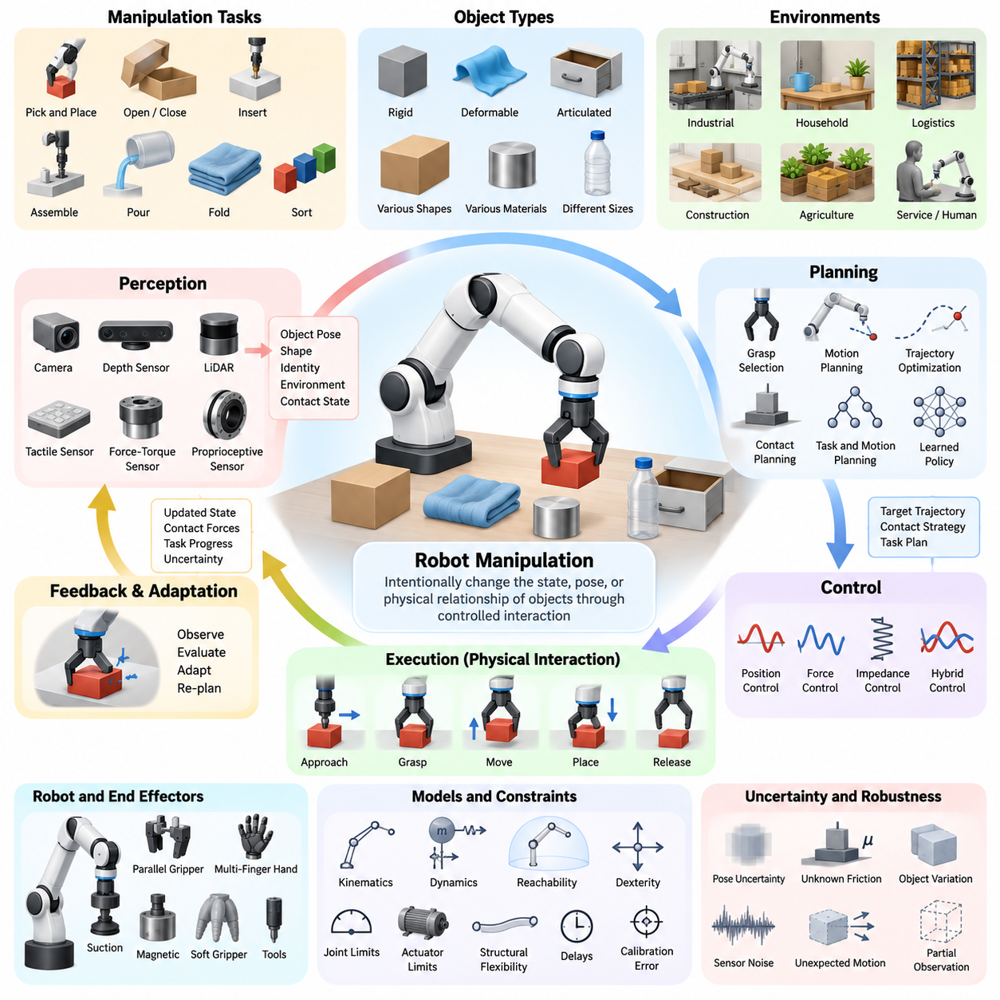
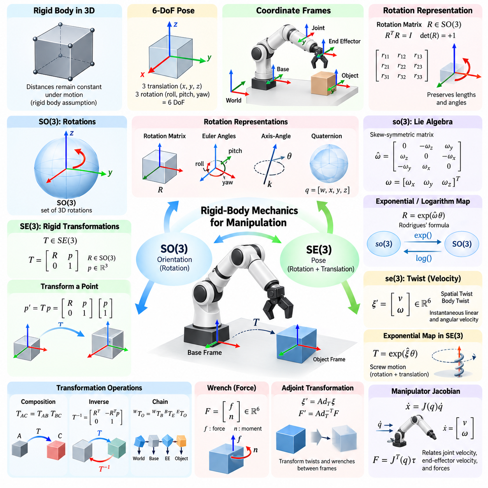
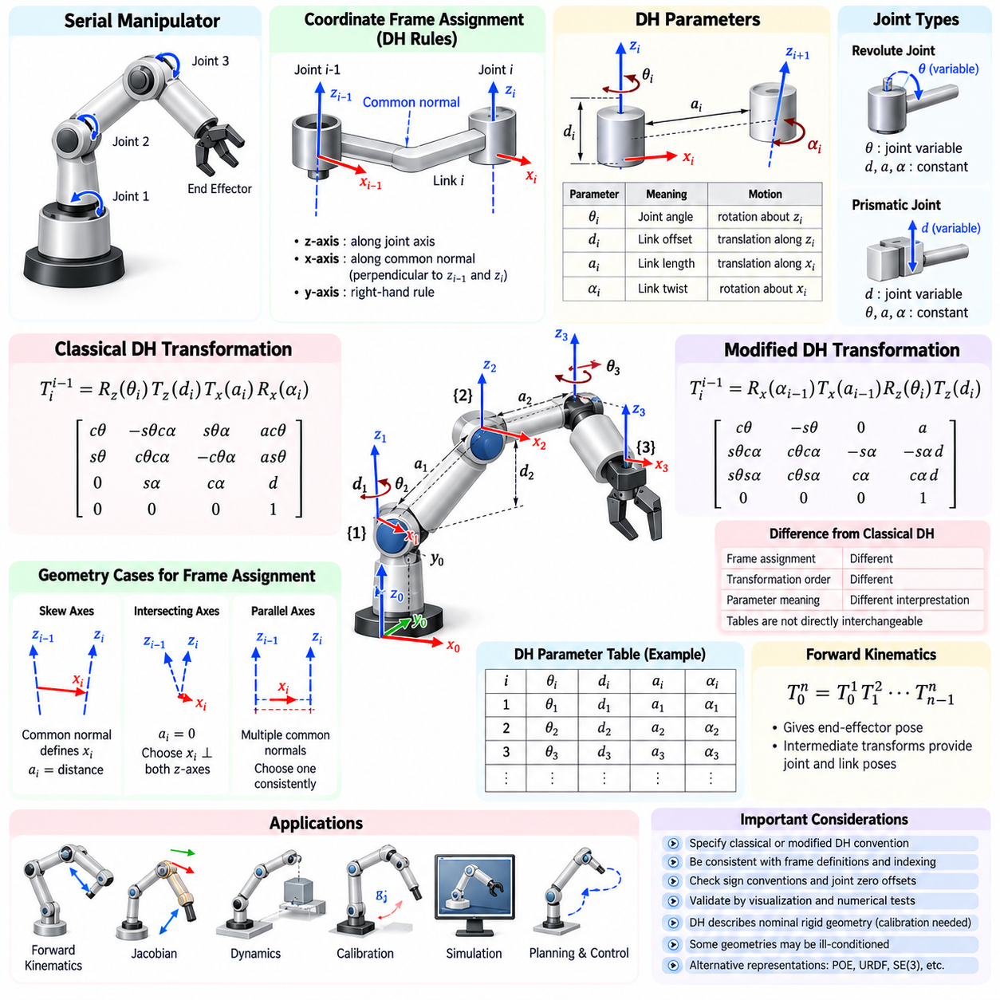
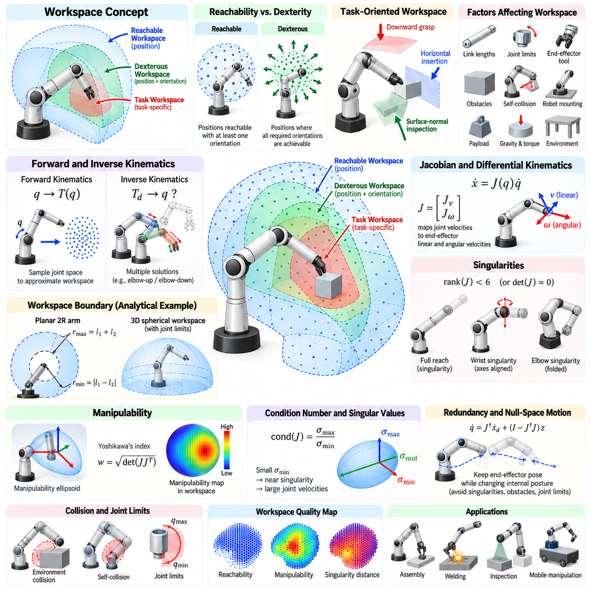
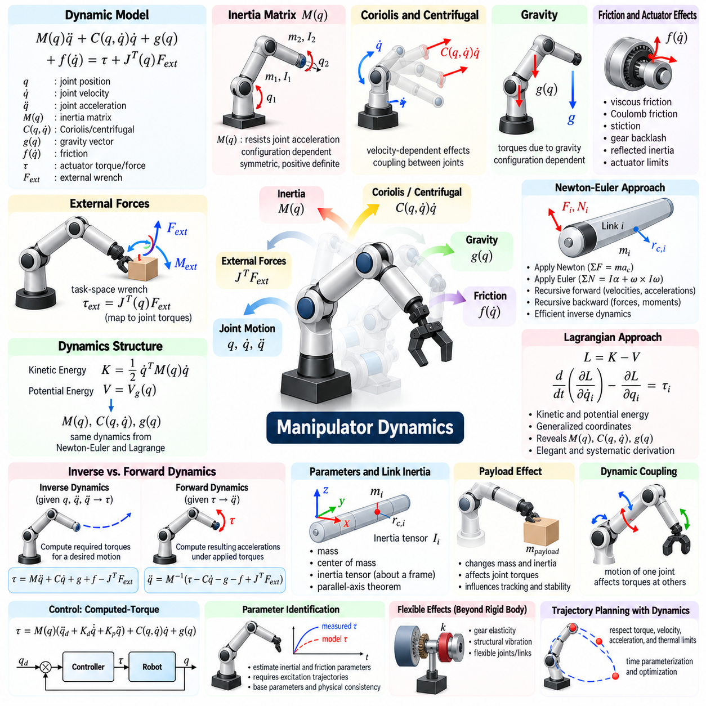
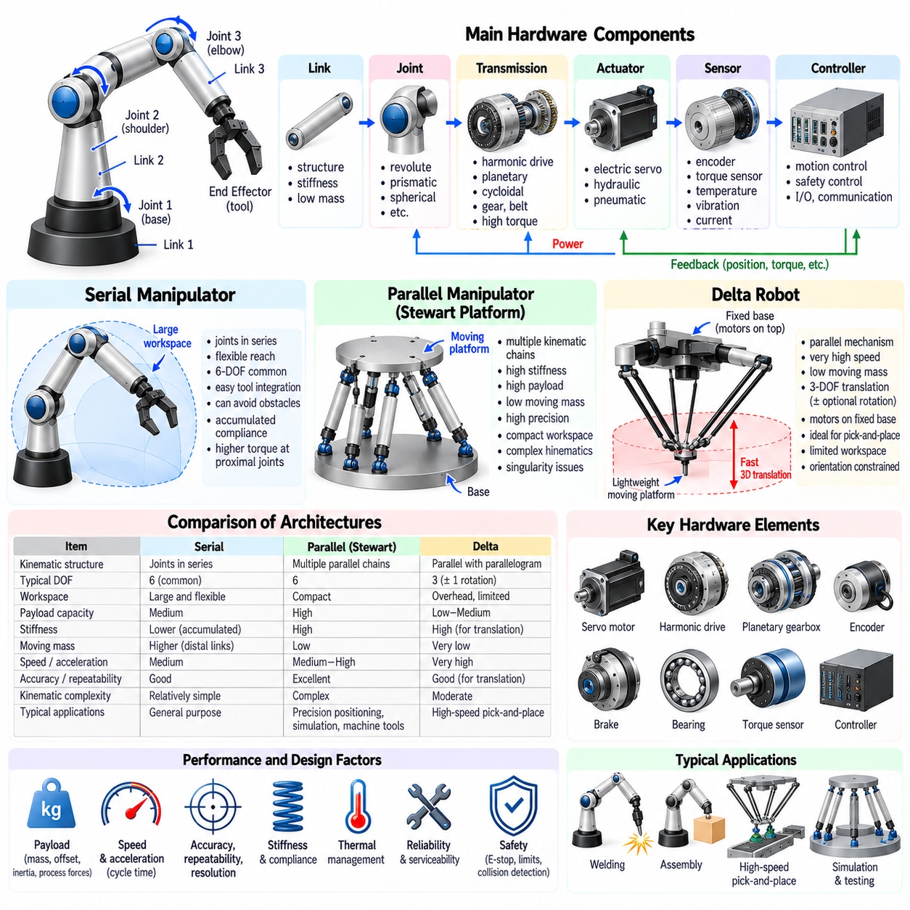
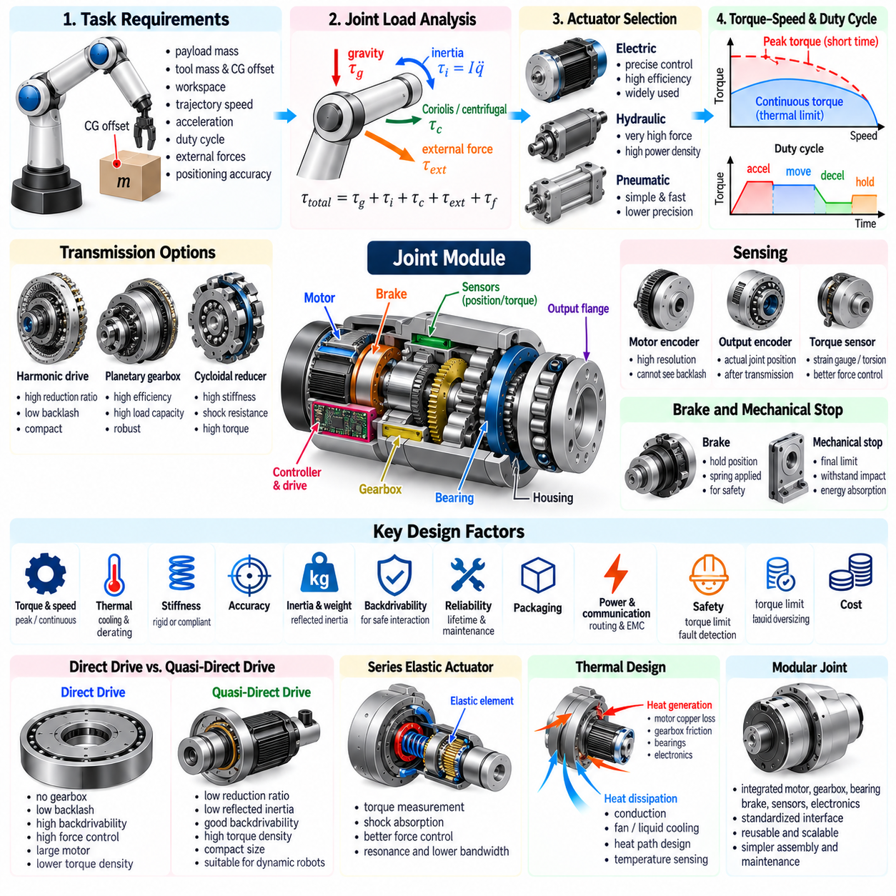
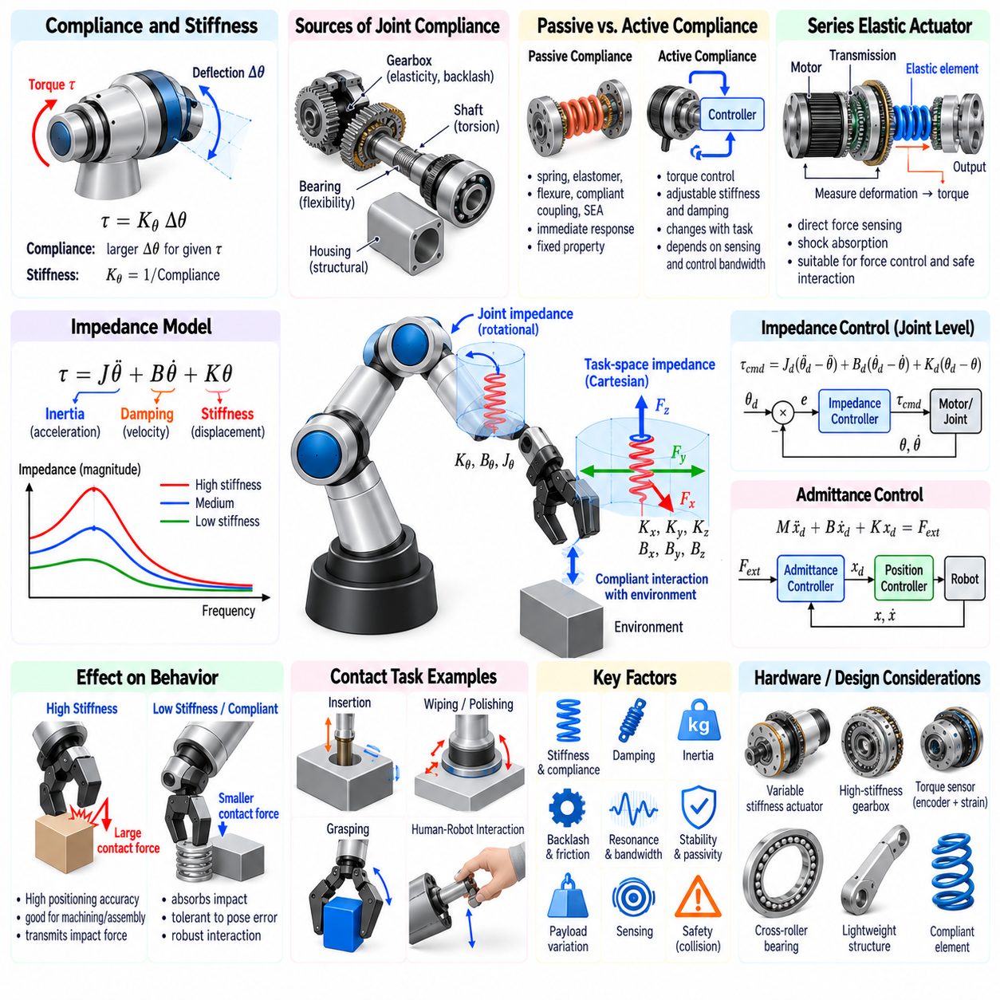
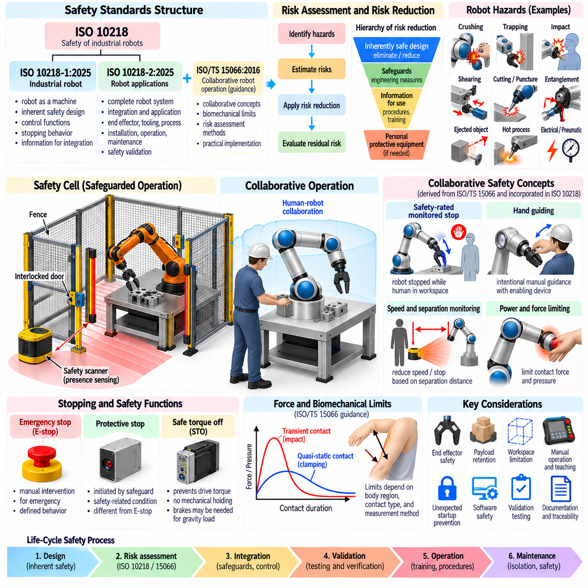
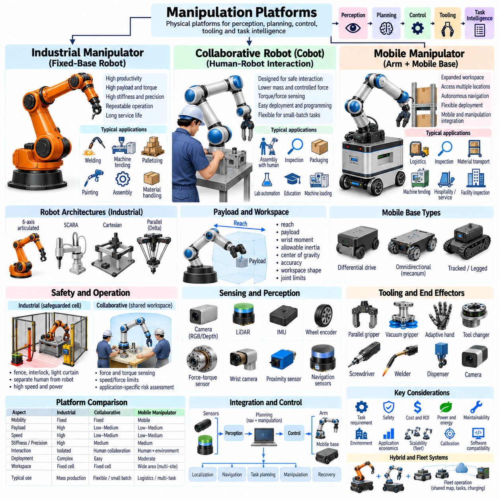

**Volume 17 Manipulation and Grasping AI**


# Chapter 01. Manipulator Fundamentals

##  

## 01.01. Robot Manipulation Problem Definition and Scope

{width="7.268055555555556in" height="7.268055555555556in"}

Robot manipulation is the capability of a robotic system to intentionally change the state, pose, configuration, or physical relationships of objects through controlled interaction. Unlike navigation, which primarily concerns moving the robot itself through an environment, manipulation focuses on how a robot reaches, contacts, grasps, moves, transforms, assembles, or otherwise influences objects in its workspace.

A manipulation problem is commonly defined by the relationship among the robot, the target object, the surrounding environment, and the desired task outcome. The robot provides sensing, computation, actuation, and control, while the object introduces geometric and physical properties such as shape, mass, friction, compliance, and inertia. The environment adds obstacles, supports, tools, fixtures, humans, and other constraints that influence feasible actions.

The scope of manipulation extends beyond simply moving a robotic arm from one joint configuration to another. A successful manipulation system must determine what object should be manipulated, estimate where it is located, identify appropriate interaction regions, select a grasp or contact strategy, generate collision-free motion, regulate forces during contact, and verify whether the intended physical state has actually been achieved.

Manipulation tasks can be described in terms of an initial world state, a desired goal state, and a sequence of physical actions that transforms one into the other. For example, a pick-and-place task begins with an object resting at one location and ends when the object is placed at a specified destination. More complex tasks may involve opening containers, inserting components, operating tools, folding materials, or assembling multiple objects.

The manipulation problem therefore spans several levels of abstraction. At the task level, the robot reasons about goals such as placing, inserting, fastening, pouring, or sorting. At the motion level, these goals are converted into trajectories for the end effector and robot joints. At the interaction level, controllers regulate position, velocity, force, torque, impedance, and contact conditions while the robot interacts with the physical world.

A useful distinction exists between free-space motion and contact-rich manipulation. During free-space motion, the primary objective is usually to move the manipulator safely while avoiding collisions and respecting kinematic and dynamic constraints. During contact-rich manipulation, environmental contact becomes intentional and informative, requiring explicit consideration of forces, friction, compliance, uncertainty, and potentially changing contact modes.

Manipulation may also be categorized according to the type of interaction used to control an object. Prehensile manipulation establishes a stable grasp so that the object moves with the robot hand or gripper. Non-prehensile manipulation uses actions such as pushing, pulling, sliding, rolling, pivoting, or throwing. In-hand manipulation changes an object\'s pose relative to the hand without completely releasing it.

The physical characteristics of manipulated objects strongly determine the difficulty of the problem. Rigid objects can often be represented using relatively compact geometric and dynamic models, whereas deformable objects such as cables, cloth, food, bags, and flexible components possess many degrees of freedom. Articulated objects, including doors, drawers, tools, and mechanisms, introduce additional constraints associated with joints and allowable motions.

Perception forms a fundamental part of the manipulation loop because actions depend on estimates of the physical world. Cameras, depth sensors, LiDAR, tactile arrays, force-torque sensors, proprioceptive sensors, and other modalities may be combined to estimate object identity, geometry, six-degree-of-freedom pose, surface properties, contact state, and environmental structure. These estimates are inevitably incomplete and uncertain.

Planning converts perceptual information and task objectives into executable actions. Manipulation planning may involve grasp selection, inverse kinematics, trajectory optimization, sampling-based motion planning, contact planning, task-and-motion planning, or learned policies. Practical systems frequently combine several methods because no single planning representation efficiently captures semantic goals, geometric feasibility, dynamics, and contact interactions simultaneously.

Control closes the loop between planned behavior and physical execution. Position control can provide accurate trajectory tracking in structured conditions, while force, impedance, admittance, and hybrid position-force control become important when the manipulator interacts directly with uncertain surfaces or mechanisms. High-performance manipulation therefore depends on coordinating planning and feedback rather than treating trajectory generation as an isolated process.

Uncertainty is one of the defining characteristics of real-world manipulation. Object poses may be estimated inaccurately, friction coefficients may be unknown, actuators may exhibit backlash or compliance, and objects may move unexpectedly after contact. Robust manipulation systems continuously observe the consequences of their actions and modify subsequent behavior instead of assuming that the physical world exactly follows a predefined model.

The manipulation workspace is constrained by manipulator geometry and mechanical limits. Reachability depends on link dimensions, joint ranges, degrees of freedom, mounting configuration, and surrounding obstacles. Dexterity further describes whether the manipulator can achieve required end-effector orientations and motions within reachable regions. Consequently, an object being physically close to a robot does not guarantee that a useful manipulation configuration exists.

Kinematics provides the mathematical relationship between joint configurations and end-effector poses, while dynamics describes the relationship among motion, forces, torques, inertia, gravity, and external interaction. These models establish the physical foundation for manipulation. However, real systems must additionally account for actuator limits, structural flexibility, calibration errors, communication delays, sensing latency, and computational constraints.

The end effector defines the physical interface between the manipulator and the task. Parallel-jaw grippers provide simple and reliable grasping for many industrial applications, while multi-finger hands offer greater dexterity at the cost of increased sensing and control complexity. Suction devices, magnetic grippers, soft grippers, specialized tools, and interchangeable end effectors extend manipulation to different materials and operating environments.

Manipulation becomes substantially more difficult in unstructured environments because the robot cannot rely on precisely known object locations, standardized fixtures, or predefined trajectories. Household, logistics, construction, agriculture, inspection, and service applications require systems to operate across changing scenes and previously unseen objects. Generalization therefore becomes an important requirement in addition to precision, speed, and repeatability.

Learning-based manipulation addresses some of these challenges by allowing robots to acquire representations, grasp strategies, motion policies, and interaction skills from data. Imitation learning, reinforcement learning, self-supervised learning, foundation models, vision-language-action models, and world models can complement analytical robotics methods. Their value is greatest when learning is integrated with geometric reasoning, physical constraints, and feedback control.

Robot manipulation can consequently be viewed as a closed perception-action process rather than a collection of independent algorithms. The robot observes the environment, constructs or updates an internal representation, selects an action, executes physical motion, measures the resulting state, and repeats the process. Manipulation intelligence emerges from maintaining this loop reliably under geometric, dynamic, semantic, and environmental uncertainty.

The scope ultimately ranges from precisely engineered industrial operations to general-purpose physical intelligence. Traditional systems achieve exceptional performance when objects, fixtures, trajectories, and process conditions are carefully controlled. Emerging manipulation systems seek broader capabilities in which robots interpret instructions, reason about unfamiliar scenes, select appropriate skills, adapt during interaction, and transfer knowledge across objects and tasks.

A complete manipulation problem definition must therefore specify more than the desired end-effector trajectory. It should identify the task objective, relevant objects, initial and goal states, allowable contacts, environmental constraints, sensing assumptions, uncertainty, safety requirements, performance criteria, and available robot capabilities. This broader formulation provides the foundation for systematically designing perception, planning, control, learning, and execution components.

로봇 조작(Robot Manipulation)은 제어된 상호작용(Controlled Interaction)을 통해 물체의 상태(State), 자세(Pose), 구성(Configuration) 또는 물리적 관계(Physical Relationship)를 의도적으로 변화시키는 로봇 시스템의 능력이다. 주행(Navigation)이 주로 환경 내에서 로봇 자체를 이동시키는 문제를 다루는 것과 달리, 조작(Manipulation)은 로봇이 작업 공간(Workspace)에서 물체에 접근하고, 접촉하고, 파지하고, 이동시키고, 변형하고, 조립하거나 다른 방식으로 물체에 영향을 주는 방법을 다룬다.

조작 문제(Manipulation Problem)는 일반적으로 로봇(Robot), 대상 물체(Target Object), 주변 환경(Environment), 그리고 원하는 작업 결과(Task Outcome) 사이의 관계를 통해 정의된다. 로봇은 센싱(Sensing), 연산(Computation), 구동(Actuation), 제어(Control) 기능을 제공하며, 물체는 형상(Shape), 질량(Mass), 마찰(Friction), 순응성(Compliance), 관성(Inertia)과 같은 기하학적·물리적 특성을 가진다. 환경에는 장애물, 지지 구조물, 도구, 지그(Fixture), 사람 및 실행 가능한 동작을 제한하는 다양한 조건이 포함된다.

조작의 범위는 단순히 로봇 팔(Robotic Arm)을 하나의 관절 구성(Joint Configuration)에서 다른 구성으로 이동시키는 것보다 훨씬 넓다. 성공적인 조작 시스템은 어떤 물체를 조작해야 하는지 결정하고, 물체의 위치를 추정하며, 적절한 상호작용 영역을 식별해야 한다. 또한 파지(Grasp) 또는 접촉 전략(Contact Strategy)을 선택하고, 충돌 없는 동작을 생성하며, 접촉 과정에서 힘을 조절하고, 의도한 물리적 상태가 실제로 달성되었는지를 검증해야 한다.

조작 작업(Manipulation Task)은 초기 세계 상태(Initial World State), 원하는 목표 상태(Goal State), 그리고 초기 상태를 목표 상태로 변환하는 일련의 물리적 행동(Physical Action)으로 설명할 수 있다. 예를 들어 집기 및 놓기(Pick-and-Place) 작업은 특정 위치에 놓여 있는 물체에서 시작하여 지정된 목적지에 물체가 배치되면 종료된다. 보다 복잡한 작업에는 용기 열기, 부품 삽입, 도구 조작, 재료 접기 또는 여러 물체의 조립 등이 포함될 수 있다.

따라서 조작 문제는 여러 추상화 수준(Level of Abstraction)에 걸쳐 존재한다. 작업 수준(Task Level)에서는 로봇이 배치, 삽입, 체결, 따르기, 분류와 같은 목표를 추론한다. 동작 수준(Motion Level)에서는 이러한 목표가 말단장치(End Effector)와 로봇 관절의 궤적(Trajectory)으로 변환된다. 상호작용 수준(Interaction Level)에서는 로봇이 물리적 세계와 상호작용하는 동안 위치, 속도, 힘, 토크, 임피던스(Impedance), 접촉 조건(Contact Condition)을 제어한다.

자유 공간 동작(Free-Space Motion)과 접촉 중심 조작(Contact-Rich Manipulation)을 구분하는 것도 중요하다. 자유 공간 동작에서는 일반적으로 충돌을 회피하면서 운동학적·동역학적 제약을 만족하도록 매니퓰레이터(Manipulator)를 안전하게 이동시키는 것이 주요 목적이다. 반면 접촉 중심 조작에서는 환경과의 접촉 자체가 의도적인 행동이자 정보 획득 수단이 되므로 힘, 마찰, 순응성, 불확실성 및 변화하는 접촉 모드(Contact Mode)를 명시적으로 고려해야 한다.

조작은 물체를 제어하기 위해 사용하는 상호작용 방식에 따라서도 분류할 수 있다. 파지형 조작(Prehensile Manipulation)은 안정적인 파지를 형성하여 물체가 로봇 손이나 그리퍼(Gripper)와 함께 움직이도록 한다. 비파지형 조작(Non-Prehensile Manipulation)은 밀기, 당기기, 미끄러뜨리기, 굴리기, 피벗 회전(Pivoting), 던지기 등의 행동을 이용한다. 손 내부 조작(In-Hand Manipulation)은 물체를 완전히 놓지 않은 상태에서 손에 대한 물체의 상대 자세를 변화시킨다.

조작 대상의 물리적 특성은 문제의 난이도를 크게 결정한다. 강체 물체(Rigid Object)는 비교적 간결한 기하학 및 동역학 모델로 표현할 수 있지만, 케이블, 천, 음식물, 가방, 유연 부품과 같은 변형 가능 물체(Deformable Object)는 매우 많은 자유도(Degree of Freedom)를 가진다. 문, 서랍, 도구, 기계 장치와 같은 관절형 물체(Articulated Object)는 관절 구조와 허용 가능한 운동에 따른 추가적인 제약을 발생시킨다.

인식(Perception)은 조작 행동이 물리적 세계에 대한 추정값에 의존하기 때문에 조작 루프(Manipulation Loop)의 핵심 요소를 구성한다. 카메라, 깊이 센서(Depth Sensor), 라이다(LiDAR), 촉각 배열(Tactile Array), 힘-토크 센서(Force-Torque Sensor), 고유수용성 센서(Proprioceptive Sensor) 등을 결합하여 물체의 종류, 형상, 6자유도 자세(6-DoF Pose), 표면 특성, 접촉 상태 및 환경 구조를 추정할 수 있다. 그러나 이러한 추정에는 필연적으로 불완전성과 불확실성이 존재한다.

계획(Planning)은 인식 정보와 작업 목표를 실제로 실행 가능한 행동으로 변환한다. 조작 계획(Manipulation Planning)에는 파지 선택(Grasp Selection), 역기구학(Inverse Kinematics), 궤적 최적화(Trajectory Optimization), 샘플링 기반 동작 계획(Sampling-Based Motion Planning), 접촉 계획(Contact Planning), 작업-동작 통합 계획(Task-and-Motion Planning), 학습 기반 정책(Learned Policy) 등이 포함될 수 있다. 실제 시스템에서는 하나의 표현만으로 의미론적 목표, 기하학적 실행 가능성, 동역학 및 접촉 상호작용을 모두 효율적으로 표현하기 어렵기 때문에 여러 방법을 결합하는 경우가 많다.

제어(Control)는 계획된 행동과 실제 물리적 실행 사이의 폐루프(Closed Loop)를 형성한다. 위치 제어(Position Control)는 구조화된 조건에서 정확한 궤적 추종(Trajectory Tracking)을 제공할 수 있으며, 불확실한 표면이나 기계 구조와 직접 상호작용할 때는 힘 제어(Force Control), 임피던스 제어(Impedance Control), 어드미턴스 제어(Admittance Control), 위치-힘 혼합 제어(Hybrid Position-Force Control)가 중요해진다. 따라서 고성능 조작은 계획과 피드백(Feedback)을 분리하는 것이 아니라 긴밀하게 결합하는 데 의존한다.

불확실성(Uncertainty)은 현실 세계 로봇 조작을 규정하는 핵심 특성 중 하나이다. 물체 자세가 부정확하게 추정될 수 있고, 마찰 계수가 알려지지 않을 수 있으며, 구동기(Actuator)에 백래시(Backlash)나 순응성이 존재할 수 있다. 또한 접촉 이후 물체가 예상과 다르게 움직일 수도 있다. 강건한 조작 시스템(Robust Manipulation System)은 물리적 세계가 사전에 정의된 모델을 정확히 따른다고 가정하지 않고, 행동 결과를 지속적으로 관찰하면서 이후 행동을 수정한다.

조작 작업 공간(Manipulation Workspace)은 매니퓰레이터의 기하학적 구조와 기계적 한계에 의해 제한된다. 도달 가능성(Reachability)은 링크(Link)의 치수, 관절 범위(Joint Range), 자유도, 장착 구성(Mounting Configuration), 주변 장애물 등에 의해 결정된다. 또한 조작성(Dexterity)은 도달 가능한 영역에서 필요한 말단장치 방향과 운동을 구현할 수 있는지를 나타낸다. 따라서 물체가 로봇 가까이에 있다는 사실만으로 유용한 조작 자세가 존재한다고 보장할 수는 없다.

기구학(Kinematics)은 관절 구성과 말단장치 자세 사이의 수학적 관계를 제공하며, 동역학(Dynamics)은 운동, 힘, 토크, 관성, 중력 및 외부 상호작용 사이의 관계를 설명한다. 이러한 모델은 조작의 물리적 기반을 형성한다. 그러나 실제 시스템에서는 구동기 한계(Actuator Limit), 구조적 유연성(Structural Flexibility), 보정 오차(Calibration Error), 통신 지연, 센싱 지연 시간(Sensing Latency), 연산 제약까지 함께 고려해야 한다.

말단장치(End Effector)는 매니퓰레이터와 작업 대상 사이의 물리적 인터페이스를 정의한다. 평행 조 그리퍼(Parallel-Jaw Gripper)는 다양한 산업 응용에서 단순하면서도 신뢰성 높은 파지를 제공하며, 다지형 로봇 손(Multi-Finger Hand)은 제어와 센싱 복잡성이 증가하는 대신 더 높은 조작성을 제공한다. 흡착 장치(Suction Device), 자기식 그리퍼(Magnetic Gripper), 소프트 그리퍼(Soft Gripper), 특수 도구 및 교환식 말단장치는 다양한 재질과 작업 환경으로 조작 범위를 확장한다.

비정형 환경(Unstructured Environment)에서는 로봇이 정확히 알려진 물체 위치, 표준화된 지그 또는 사전 정의된 궤적에 의존할 수 없기 때문에 조작 문제가 훨씬 어려워진다. 가정, 물류, 건설, 농업, 검사 및 서비스 분야에서는 변화하는 장면과 이전에 보지 못한 물체에 대응해야 한다. 따라서 정밀도(Precision), 속도(Speed), 반복성(Repeatability)뿐 아니라 일반화(Generalization) 능력도 중요한 요구사항이 된다.

학습 기반 조작(Learning-Based Manipulation)은 로봇이 데이터로부터 표현(Representation), 파지 전략, 동작 정책(Motion Policy), 상호작용 기술을 획득하도록 함으로써 이러한 문제의 일부를 해결한다. 모방 학습(Imitation Learning), 강화학습(Reinforcement Learning), 자기지도학습(Self-Supervised Learning), 파운데이션 모델(Foundation Model), 비전-언어-행동 모델(Vision-Language-Action Model), 월드 모델(World Model)은 기존의 해석적 로보틱스(Analytical Robotics) 방법을 보완할 수 있다. 특히 학습을 기하학적 추론, 물리적 제약, 피드백 제어와 통합할 때 그 가치가 커진다.

따라서 로봇 조작은 서로 독립된 알고리즘들의 집합이 아니라 폐루프 인식-행동 과정(Closed-Loop Perception-Action Process)으로 이해할 수 있다. 로봇은 환경을 관찰하고 내부 표현(Internal Representation)을 생성하거나 갱신한 후 행동을 선택하고 물리적 운동을 실행한다. 이후 결과 상태를 측정하고 이 과정을 반복한다. 조작 지능(Manipulation Intelligence)은 기하학적, 동역학적, 의미론적, 환경적 불확실성 속에서도 이러한 루프를 신뢰성 있게 유지하는 능력에서 형성된다.

로봇 조작의 범위는 정밀하게 설계된 산업 작업에서 범용 물리 지능(General-Purpose Physical Intelligence)에 이르기까지 매우 넓다. 전통적인 시스템은 물체, 지그, 궤적, 공정 조건이 세밀하게 통제될 때 매우 높은 성능을 달성한다. 반면 새로운 조작 시스템은 명령을 해석하고, 익숙하지 않은 장면을 추론하며, 적절한 기술(Skill)을 선택하고, 상호작용 과정에서 행동을 적응시키며, 서로 다른 물체와 작업 사이에서 지식을 전이하는 더 광범위한 능력을 추구한다.

따라서 완전한 조작 문제 정의(Manipulation Problem Definition)는 단순히 원하는 말단장치 궤적만을 명시해서는 충분하지 않다. 작업 목표(Task Objective), 관련 물체, 초기 상태와 목표 상태, 허용 가능한 접촉, 환경 제약, 센싱 가정(Sensing Assumption), 불확실성, 안전 요구사항, 성능 기준(Performance Criteria), 사용 가능한 로봇 능력을 함께 정의해야 한다. 이러한 포괄적 문제 정의는 인식, 계획, 제어, 학습 및 실행(Execution)을 체계적으로 설계하기 위한 기반을 제공한다.

##  

## 01.02. Rigid Body Mechanics for Manipulation SO3 SE3 [w/Code]

{width="7.268055555555556in" height="7.268055555555556in"}

Rigid-body mechanics provides the mathematical foundation for describing how manipulators, end effectors, tools, and objects move in three-dimensional space. A rigid body is idealized as an object whose internal distances remain constant during motion. Although real components deform slightly, this assumption enables robot manipulation to represent position and orientation independently of detailed structural deformation.

The configuration of a rigid body in three-dimensional space requires both translation and rotation. Translation specifies where a reference point on the body is located, while rotation specifies how the body is oriented relative to a reference coordinate frame. Together they define the six-degree-of-freedom pose of the body: three translational degrees of freedom and three rotational degrees of freedom.

Coordinate frames are essential because position and orientation have meaning only relative to a reference. Manipulation systems commonly define a world frame, robot base frame, joint frames, end-effector frame, sensor frames, object frames, and task frames. Transformations among these frames allow measurements and commands originating from different components to be represented consistently within a common geometric framework.

Three-dimensional orientation is naturally represented by the special orthogonal group SO(3). A rotation matrix R belongs to SO(3) when it is a real 3×3 matrix satisfying RᵀR = I and det(R) = +1. The orthogonality condition preserves lengths and angles, while the positive determinant ensures that the transformation represents a proper rotation rather than a reflection.

The columns of a rotation matrix can be interpreted as the axes of one coordinate frame expressed in another frame. Because these axes form an orthonormal basis, each column has unit length and is perpendicular to the others. This geometric interpretation makes rotation matrices particularly useful in robotics, where transformations between coordinate systems must preserve the physical structure of three-dimensional space.

Rotations are fundamentally different from ordinary vectors because their composition is generally noncommutative. If R₁ and R₂ represent two rotations, applying R₁ followed by R₂ usually produces a different orientation from applying R₂ followed by R₁. Matrix multiplication captures this ordering explicitly, making careful frame notation and transformation direction essential when constructing manipulation algorithms.

Although rotation matrices provide a robust representation, orientation may also be expressed using Euler angles, axis-angle coordinates, or unit quaternions. Euler angles are intuitive but can suffer from singularities such as gimbal lock. Quaternions provide a compact, numerically convenient representation for interpolation and estimation, while rotation matrices remain especially convenient for geometric transformation and composition.

The Lie algebra associated with SO(3) is denoted so(3), and it provides a local linear representation of rotational motion. Elements of so(3) are 3×3 skew-symmetric matrices that can be constructed from three-dimensional angular vectors using the hat operator. This relationship connects angular velocity vectors with matrix-based rotational kinematics and enables differential analysis on the nonlinear rotation manifold.

The exponential map transforms an element of so(3) into a finite rotation in SO(3). For a rotation axis and angular magnitude, the matrix exponential produces the corresponding rotation matrix, with Rodrigues\' rotation formula providing a practical closed-form expression. Conversely, the logarithmic map converts a rotation matrix into a local rotational coordinate, which is useful for pose errors and optimization.

Rigid-body pose extends rotational geometry by combining orientation with translation. The special Euclidean group SE(3) represents all proper rigid transformations in three-dimensional space. An element of SE(3) is commonly written as a 4×4 homogeneous transformation matrix containing a 3×3 rotation matrix R and a three-dimensional translation vector p, together defining the complete pose of one coordinate frame relative to another.

Homogeneous transformation matrices provide a unified mechanism for applying rotation and translation through matrix multiplication. A three-dimensional point is augmented with a homogeneous coordinate, allowing its coordinates to be transformed between frames using a single matrix operation. This representation is fundamental to forward kinematics, object pose estimation, sensor calibration, grasp planning, and manipulation trajectory generation.

Transformation composition expresses chains of spatial relationships. For example, if the pose of the end effector relative to the robot base and the pose of a grasp frame relative to the end effector are known, multiplication of the corresponding SE(3) transformations determines the grasp-frame pose relative to the base. The multiplication order must follow the frame relationships because rigid transformations are not generally commutative.

Every rigid transformation has an inverse that reverses the direction of the coordinate relationship. If a transformation contains rotation R and translation p, its inverse contains Rᵀ and the translation −Rᵀp. This structure allows efficient conversion between object-to-camera, camera-to-object, base-to-tool, and tool-to-base descriptions without requiring a general-purpose matrix inversion procedure.

Like SO(3), SE(3) possesses an associated Lie algebra, denoted se(3). An element of se(3) combines angular and linear velocity components into a compact representation of instantaneous rigid-body motion. The corresponding six-dimensional vector is often called a twist, providing a powerful representation for manipulator kinematics, screw motion, velocity propagation, trajectory generation, and differential control.

A twist describes the instantaneous translational and rotational motion of a rigid body. Depending on the selected coordinate frame, the same physical motion can have different numerical twist representations. Spatial twists express motion relative to a fixed or world-oriented frame, whereas body twists express it relative to a moving body frame. Maintaining this distinction prevents frame inconsistencies in velocity calculations.

The exponential map from se(3) to SE(3) connects instantaneous velocity with finite rigid-body displacement. If a constant twist is applied for a specified duration, exponentiating its matrix representation produces the corresponding rigid transformation. This formulation reveals that many robot motions can be interpreted geometrically as screw motions combining rotation about an axis with translation along that axis.

Wrenches provide the force-domain counterpart to twists. A wrench combines a three-dimensional force with a three-dimensional moment or torque, producing a six-dimensional description of mechanical loading on a rigid body. In manipulation, wrenches arise at gripper contacts, force-torque sensors, environmental interfaces, and joints, making them central to force control, grasp analysis, and contact mechanics.

Twists and wrenches transform differently between coordinate frames because they represent dual physical quantities. The adjoint representation of SE(3) provides the transformation rule for twists, while the corresponding dual or transpose-related mapping is used for wrenches. These relationships ensure that velocity, force, and power remain physically consistent when manipulation computations are performed across multiple frames.

Rigid-body velocity can also be related directly to the time derivative of pose. Angular velocity determines how the rotation matrix evolves, while linear velocity describes translation of the chosen reference point. Because rotational coordinates lie on SO(3) rather than ordinary Euclidean space, directly differentiating orientation parameters without respecting their geometric structure can introduce mathematical inconsistencies or numerical instability.

In robot manipulation, rigid-body mechanics connects naturally to manipulator Jacobians. A Jacobian maps joint velocities into the linear and angular velocity of an end effector or another body-fixed frame. Its transpose relates external wrenches to generalized joint torques under appropriate assumptions. This velocity-force relationship forms a central bridge between geometric kinematics, differential motion, and physical interaction.

Pose errors must also respect the geometry of SO(3) and SE(3). Subtracting rotation matrices or homogeneous transformations as if they were ordinary vectors does not generally produce a physically meaningful error. Instead, relative transformations and logarithmic maps can express orientation and pose discrepancies in tangent-space coordinates suitable for feedback control, optimization, state estimation, and trajectory tracking.

Interpolation between rigid-body poses requires similar geometric care. Linear interpolation of translation is straightforward, but orientation should follow the structure of SO(3), using methods such as quaternion spherical interpolation or Lie-group interpolation. SE(3)-based interpolation can generate smooth screw-like motion between poses while maintaining valid rotations throughout the trajectory, which is valuable for Cartesian-space manipulation planning.

Contact-rich manipulation further emphasizes the importance of rigid-body mechanics. The location of a contact point determines how applied forces generate moments, and changes in object pose alter contact geometry and feasible motion directions. Grasp stability, pushing, insertion, assembly, and tool use therefore require consistent treatment of coordinate transformations, velocities, forces, and constraints within a shared spatial representation.

SO(3) and SE(3) are not merely mathematical notation for robotics; they encode the actual geometric structure of orientation and rigid-body motion. Algorithms that preserve this structure tend to produce more consistent transformations, estimation procedures, controllers, and optimization methods. They also provide a common language linking perception, kinematics, dynamics, planning, and control throughout a manipulation system.

For practical robot manipulation, mastering rigid-body mechanics means understanding how poses, velocities, and forces are represented, composed, inverted, differentiated, and transformed between frames. SO(3) provides the geometry of orientation, SE(3) provides the geometry of complete pose, and their Lie algebras provide local representations of motion. Together they form the geometric backbone for precise and physically consistent manipulation.

강체 역학(Rigid-Body Mechanics)은 매니퓰레이터(Manipulator), 말단장치(End Effector), 도구(Tool), 물체(Object)가 3차원 공간에서 어떻게 움직이는지를 기술하기 위한 수학적 기반을 제공한다. 강체(Rigid Body)는 운동하는 동안 내부의 두 점 사이 거리가 일정하게 유지되는 물체로 이상화된다. 실제 부품에는 미세한 변형이 발생하지만, 이러한 가정을 사용하면 구조적 변형을 상세하게 모델링하지 않고도 로봇 조작에서 위치(Position)와 방향(Orientation)을 체계적으로 표현할 수 있다.

3차원 공간에서 강체의 구성(Configuration)을 표현하려면 병진(Translation)과 회전(Rotation)이 모두 필요하다. 병진은 강체에 설정된 기준점이 어디에 위치하는지를 나타내며, 회전은 강체가 기준 좌표계(Reference Coordinate Frame)에 대해 어떤 방향을 가지는지를 나타낸다. 이 두 요소를 결합하면 강체의 6자유도 자세(Six-Degree-of-Freedom Pose)를 정의할 수 있으며, 이는 3개의 병진 자유도와 3개의 회전 자유도로 구성된다.

좌표계(Coordinate Frame)는 위치와 방향이 특정 기준에 대해서만 의미를 가지기 때문에 매우 중요하다. 조작 시스템에서는 일반적으로 세계 좌표계(World Frame), 로봇 베이스 좌표계(Robot Base Frame), 관절 좌표계(Joint Frame), 말단장치 좌표계(End-Effector Frame), 센서 좌표계(Sensor Frame), 물체 좌표계(Object Frame), 작업 좌표계(Task Frame)를 정의한다. 이러한 좌표계 사이의 변환(Transformation)을 통해 서로 다른 구성요소에서 생성된 측정값과 명령을 하나의 일관된 기하학적 체계에서 표현할 수 있다.

3차원 방향은 특수 직교군(Special Orthogonal Group) SO(3)를 사용하여 자연스럽게 표현할 수 있다. 회전 행렬(Rotation Matrix) R이 실수 3×3 행렬이고 RᵀR = I 및 det(R) = +1을 만족하면 SO(3)에 속한다. 직교 조건(Orthogonality Condition)은 길이와 각도를 보존하며, 양의 행렬식(Positive Determinant)은 해당 변환이 반사(Reflection)가 아니라 올바른 회전(Proper Rotation)을 나타내도록 보장한다.

회전 행렬의 각 열(Column)은 하나의 좌표계 축을 다른 좌표계에서 표현한 것으로 해석할 수 있다. 이러한 축들은 정규 직교 기저(Orthonormal Basis)를 구성하므로 각각 단위 길이를 가지며 서로 직교한다. 이러한 기하학적 해석은 좌표계 사이의 변환 과정에서 3차원 공간의 물리적 구조를 보존해야 하는 로보틱스(Robotics)에서 회전 행렬을 특히 유용하게 만든다.

회전은 일반적인 벡터와 근본적으로 다르며, 회전의 합성(Composition)은 일반적으로 비가환적(Noncommutative)이다. R₁과 R₂가 두 개의 회전을 나타낼 경우 R₁을 적용한 후 R₂를 적용한 결과는 일반적으로 R₂를 먼저 적용한 후 R₁을 적용한 결과와 다르다. 행렬 곱셈(Matrix Multiplication)은 이러한 적용 순서를 명확하게 표현하므로 조작 알고리즘을 구성할 때 좌표계 표기와 변환 방향을 정확하게 관리해야 한다.

회전 행렬은 강건한 표현 방법이지만 방향은 오일러 각(Euler Angles), 축-각 표현(Axis-Angle Representation), 단위 쿼터니언(Unit Quaternion)을 사용해서도 표현할 수 있다. 오일러 각은 직관적이지만 짐벌락(Gimbal Lock)과 같은 특이점(Singularity)이 발생할 수 있다. 쿼터니언은 보간과 추정에 적합한 간결하고 수치적으로 편리한 표현을 제공하며, 회전 행렬은 기하학적 변환과 회전 합성에서 특히 편리하다.

SO(3)와 연관된 리 대수(Lie Algebra)는 so(3)로 표현하며, 회전 운동을 국소적으로 선형화한 표현을 제공한다. so(3)의 원소는 3×3 반대칭 행렬(Skew-Symmetric Matrix)이며, 햇 연산자(Hat Operator)를 사용하여 3차원 각운동 벡터(Angular Vector)로부터 구성할 수 있다. 이러한 관계는 각속도 벡터(Angular Velocity Vector)를 행렬 기반 회전 운동학과 연결하고 비선형 회전 다양체(Nonlinear Rotation Manifold)에서 미분 분석을 가능하게 한다.

지수 사상(Exponential Map)은 so(3)의 원소를 SO(3)의 유한한 회전으로 변환한다. 회전축(Rotation Axis)과 회전 크기(Angular Magnitude)가 주어지면 행렬 지수(Matrix Exponential)를 통해 대응하는 회전 행렬을 얻을 수 있으며, 로드리게스 회전 공식(Rodrigues\' Rotation Formula)은 이를 계산하기 위한 실용적인 폐쇄형 표현(Closed-Form Expression)을 제공한다. 반대로 로그 사상(Logarithmic Map)은 회전 행렬을 국소 회전 좌표로 변환하며, 자세 오차와 최적화에서 유용하게 사용된다.

강체 자세(Rigid-Body Pose)는 회전 기하학에 병진을 결합함으로써 확장된다. 특수 유클리드 군(Special Euclidean Group) SE(3)는 3차원 공간에서 가능한 모든 올바른 강체 변환(Rigid Transformation)을 표현한다. SE(3)의 원소는 일반적으로 3×3 회전 행렬 R과 3차원 병진 벡터 p를 포함하는 4×4 동차 변환 행렬(Homogeneous Transformation Matrix)로 표현되며, 이를 통해 하나의 좌표계가 다른 좌표계에 대해 가지는 완전한 자세를 정의할 수 있다.

동차 변환 행렬은 행렬 곱셈을 통해 회전과 병진을 동시에 적용할 수 있는 통합된 방법을 제공한다. 3차원 점(Point)에 동차 좌표(Homogeneous Coordinate)를 추가하면 하나의 행렬 연산만으로 서로 다른 좌표계 사이에서 점의 좌표를 변환할 수 있다. 이러한 표현은 순기구학(Forward Kinematics), 물체 자세 추정(Object Pose Estimation), 센서 보정(Sensor Calibration), 파지 계획(Grasp Planning), 조작 궤적 생성(Manipulation Trajectory Generation)의 기본 요소가 된다.

변환 합성(Transformation Composition)은 여러 공간적 관계를 연속적으로 연결하여 표현한다. 예를 들어 로봇 베이스에 대한 말단장치의 자세와 말단장치에 대한 파지 좌표계(Grasp Frame)의 자세를 알고 있다면, 대응하는 SE(3) 변환을 곱하여 로봇 베이스에 대한 파지 좌표계의 자세를 계산할 수 있다. 강체 변환은 일반적으로 가환적이지 않으므로 곱셈 순서는 좌표계 사이의 관계를 정확하게 따라야 한다.

모든 강체 변환에는 좌표 관계의 방향을 반대로 변환하는 역변환(Inverse Transformation)이 존재한다. 어떤 변환이 회전 R과 병진 p를 포함한다면 그 역변환은 Rᵀ와 −Rᵀp를 포함한다. 이러한 구조를 이용하면 일반적인 행렬 역연산(Matrix Inversion)을 수행하지 않고도 물체-카메라(Object-to-Camera), 카메라-물체(Camera-to-Object), 베이스-도구(Base-to-Tool), 도구-베이스(Tool-to-Base) 관계를 효율적으로 변환할 수 있다.

SO(3)와 마찬가지로 SE(3)에도 se(3)로 표현되는 연관 리 대수(Associated Lie Algebra)가 존재한다. se(3)의 원소는 각속도 성분과 선속도 성분을 결합하여 순간적인 강체 운동(Instantaneous Rigid-Body Motion)을 간결하게 표현한다. 이에 대응하는 6차원 벡터는 일반적으로 트위스트(Twist)라고 하며, 매니퓰레이터 운동학, 나사 운동(Screw Motion), 속도 전달(Velocity Propagation), 궤적 생성, 미분 제어(Differential Control)에 강력한 표현 방법을 제공한다.

트위스트는 강체의 순간적인 병진 운동과 회전 운동을 동시에 나타낸다. 선택한 좌표계에 따라 동일한 물리적 운동도 서로 다른 수치의 트위스트 표현을 가질 수 있다. 공간 트위스트(Spatial Twist)는 고정 좌표계 또는 세계 좌표계를 기준으로 운동을 표현하며, 바디 트위스트(Body Twist)는 움직이는 강체 좌표계를 기준으로 운동을 표현한다. 이러한 차이를 명확히 유지하면 속도 계산에서 발생할 수 있는 좌표계 불일치를 방지할 수 있다.

se(3)에서 SE(3)로의 지수 사상은 순간 속도(Instantaneous Velocity)와 유한한 강체 변위(Finite Rigid-Body Displacement)를 연결한다. 일정한 트위스트가 특정 시간 동안 적용될 경우 트위스트의 행렬 표현을 지수화하여 대응하는 강체 변환을 얻을 수 있다. 이러한 표현을 통해 많은 로봇 운동을 하나의 축에 대한 회전과 해당 축을 따른 병진이 결합된 나사 운동(Screw Motion)으로 기하학적으로 해석할 수 있다.

렌치(Wrench)는 트위스트에 대응하는 힘 영역(Force Domain)의 물리량이다. 렌치는 3차원 힘(Force)과 3차원 모멘트 또는 토크(Moment or Torque)를 결합하여 강체에 작용하는 기계적 하중을 6차원으로 표현한다. 로봇 조작에서는 그리퍼 접촉, 힘-토크 센서, 환경과의 접촉면, 관절 등에서 렌치가 발생하므로 힘 제어, 파지 분석(Grasp Analysis), 접촉 역학(Contact Mechanics)의 핵심 요소가 된다.

트위스트와 렌치는 서로 쌍대적인 물리량(Dual Physical Quantity)을 표현하기 때문에 좌표계 사이에서 서로 다른 방식으로 변환된다. SE(3)의 수반 표현(Adjoint Representation)은 트위스트의 변환 규칙을 제공하며, 렌치에는 이에 대응하는 쌍대 또는 전치 관계의 변환이 적용된다. 이러한 관계를 사용하면 여러 좌표계에 걸쳐 조작 계산을 수행할 때 속도, 힘, 동력(Power)의 물리적 일관성을 유지할 수 있다.

강체 속도(Rigid-Body Velocity)는 자세의 시간 미분(Time Derivative)과 직접적으로 연결할 수도 있다. 각속도는 회전 행렬이 시간에 따라 어떻게 변화하는지를 결정하며, 선속도(Linear Velocity)는 선택된 기준점의 병진 운동을 나타낸다. 회전 좌표는 일반적인 유클리드 공간이 아니라 SO(3) 위에 존재하므로 기하학적 구조를 고려하지 않고 방향 파라미터를 직접 미분하면 수학적 불일치나 수치적 불안정성이 발생할 수 있다.

로봇 조작에서 강체 역학은 매니퓰레이터 자코비안(Manipulator Jacobian)과 자연스럽게 연결된다. 자코비안(Jacobian)은 관절 속도(Joint Velocity)를 말단장치 또는 다른 강체 고정 좌표계의 선속도와 각속도로 변환한다. 또한 적절한 조건에서 자코비안의 전치(Jacobian Transpose)는 외부 렌치를 일반화된 관절 토크(Joint Torque)와 연결한다. 이러한 속도-힘 관계는 기하학적 운동학, 미분 운동, 물리적 상호작용을 연결하는 핵심적인 다리 역할을 한다.

자세 오차(Pose Error) 역시 SO(3)와 SE(3)의 기하학적 구조를 고려하여 정의해야 한다. 회전 행렬이나 동차 변환 행렬을 일반적인 벡터처럼 단순히 빼는 것은 물리적으로 의미 있는 오차를 생성하지 못하는 경우가 많다. 대신 상대 변환(Relative Transformation)과 로그 사상을 사용하면 방향 및 자세 차이를 접공간 좌표(Tangent-Space Coordinate)로 표현할 수 있으며, 이는 피드백 제어, 최적화, 상태 추정(State Estimation), 궤적 추종에 적합하다.

강체 자세 사이의 보간(Interpolation) 역시 동일한 기하학적 주의가 필요하다. 병진은 선형 보간(Linear Interpolation)을 비교적 간단하게 적용할 수 있지만, 방향은 SO(3)의 구조를 유지해야 하므로 쿼터니언 구면 선형 보간(Quaternion Spherical Interpolation)이나 리 군 보간(Lie-Group Interpolation)과 같은 방법을 사용한다. SE(3) 기반 보간은 전체 궤적에서 유효한 회전을 유지하면서 자세 사이의 부드러운 나사형 운동을 생성할 수 있어 직교 공간 조작 계획(Cartesian-Space Manipulation Planning)에 유용하다.

접촉 중심 조작(Contact-Rich Manipulation)은 강체 역학의 중요성을 더욱 명확하게 보여준다. 접촉점(Contact Point)의 위치에 따라 가해진 힘이 생성하는 모멘트가 달라지고, 물체 자세의 변화는 접촉 기하학(Contact Geometry)과 실행 가능한 운동 방향을 변화시킨다. 따라서 파지 안정성(Grasp Stability), 밀기(Pushing), 삽입(Insertion), 조립(Assembly), 도구 사용(Tool Use)은 좌표 변환, 속도, 힘, 제약조건을 하나의 일관된 공간 표현 안에서 다루어야 한다.

SO(3)와 SE(3)는 단순히 로보틱스를 위한 수학적 표기법이 아니라 방향과 강체 운동이 가지는 실제 기하학적 구조를 표현한다. 이러한 구조를 보존하는 알고리즘은 일반적으로 더욱 일관된 좌표 변환, 상태 추정, 제어기(Controller), 최적화 방법을 구현할 수 있도록 한다. 또한 SO(3)와 SE(3)는 조작 시스템 전체에서 인식, 운동학, 동역학, 계획, 제어를 연결하는 공통 언어를 제공한다.

실제 로봇 조작에서 강체 역학을 이해한다는 것은 자세, 속도, 힘이 어떻게 표현되고, 합성되고, 역변환되고, 미분되며, 서로 다른 좌표계 사이에서 변환되는지를 이해하는 것을 의미한다. SO(3)는 방향의 기하학(Geometry of Orientation)을 제공하고, SE(3)는 완전한 자세의 기하학(Geometry of Complete Pose)을 제공하며, 각각의 리 대수는 운동에 대한 국소 표현(Local Representation)을 제공한다. 이들은 함께 정밀하고 물리적으로 일관된 로봇 조작을 구현하기 위한 기하학적 중추(Geometric Backbone)를 형성한다.

##  

## 01.03. DH Parameters and Modified DH Convention [w/Code]

{width="7.268055555555556in" height="7.268055555555556in"}

Denavit-Hartenberg parameters provide a systematic method for representing the geometry of serial robotic manipulators. Instead of describing every joint and link with arbitrary three-dimensional transformations, the DH convention assigns coordinate frames according to standardized geometric rules. The relationship between two neighboring frames can then be expressed using only four parameters, greatly simplifying forward kinematic modeling.

The method is particularly useful for manipulators composed of revolute or prismatic joints connected through rigid links. Each joint establishes an axis of motion, and coordinate frames are attached according to the relationships among consecutive joint axes. Once the frame assignment is completed correctly, the manipulator geometry can be summarized as a compact DH parameter table from which homogeneous transformations are constructed.

In the classical DH convention, four quantities describe the transformation associated with each link: the joint angle θ, link offset d, link length a, and link twist α. These parameters represent two rotations and two translations arranged in a prescribed sequence. Their values are determined from the geometric relationship between consecutive coordinate frames rather than selected independently as arbitrary modeling variables.

The joint angle θ represents rotation about a z-axis, while the link offset d represents translation along that z-axis. The link length a measures displacement along the corresponding x-axis, and the link twist α describes rotation about that x-axis. Together these four operations encode the relative pose between adjacent coordinate frames using the geometry of the joint axes and their common normal.

For a revolute joint, θ is normally the joint variable while d, a, and α remain constant parameters determined by the robot geometry. For a prismatic joint, d becomes the joint variable while θ, a, and α are normally constant. This distinction allows the same DH formulation to represent manipulators containing combinations of rotary and linear joints without changing the fundamental transformation structure.

The classical DH transformation can conceptually be interpreted as a sequence involving rotation about z, translation along z, translation along x, and rotation about x. Multiplying the corresponding elementary transformations produces one homogeneous transformation matrix. Chaining these matrices from the robot base to the final link yields the forward kinematics of the complete serial manipulator.

Frame assignment is the most important and error-prone stage of DH modeling. The z-axis is aligned with the associated joint axis, while the x-axis is generally selected along the common normal between neighboring z-axes. The y-axis follows from the right-hand rule. Special geometric cases occur when consecutive joint axes intersect, are parallel, or are coincident, requiring consistent choices that preserve the DH rules.

When two consecutive joint axes are skew, their common normal provides a natural x-axis and the distance along it defines the link length. If the axes intersect, the common-normal distance becomes zero and an appropriate x-axis perpendicular to both axes can be selected. If the axes are parallel, multiple common normals exist, so a convenient choice must be made while maintaining consistency throughout the model.

The resulting DH table provides a compact geometric description of the manipulator. Each row corresponds to a joint-link relationship and contains the four DH parameters, with the active joint variable clearly identified. This tabular representation is convenient for symbolic derivation, numerical computation, documentation, calibration, simulation, and comparison between different manipulator architectures.

Forward kinematics is obtained by multiplying successive link transformations in the correct order. If each transformation describes frame i relative to frame i−1, the product of all transformations determines the end-effector pose relative to the base. Intermediate products also provide the poses of individual joints and links, which are useful for visualization, collision checking, Jacobian calculation, and dynamic modeling.

The Modified Denavit-Hartenberg convention uses the same basic geometric quantities but changes how coordinate frames are attached and how elementary transformations are ordered. This difference may appear minor, yet it changes the mathematical interpretation of each parameter. Therefore, classical DH and Modified DH parameter tables cannot generally be exchanged directly without redefining frames and reconstructing the associated transformations.

In a commonly used Modified DH formulation, link-related operations are associated differently with neighboring coordinate frames compared with classical DH. Rotation and translation about or along the x-axis are applied in a different position within the transformation sequence relative to the z-axis joint operations. This convention often produces frame placements that correspond more naturally to physical robot links and joint structures.

One practical advantage of Modified DH is that coordinate frames can remain closely associated with individual links, which may simplify recursive formulations used in robot dynamics and control. Many robotics textbooks, software libraries, and industrial models adopt Modified DH or closely related conventions. However, its usefulness depends less on inherent superiority than on maintaining a consistent definition throughout the entire model.

A major source of error arises because different references use the term "DH parameters" while silently adopting different conventions. The order of transformations, frame indices, signs, and interpretation of a, α, d, and θ may differ. Consequently, a DH table should always be accompanied by an explicit statement identifying whether classical or Modified DH is used and defining the corresponding transformation equation.

Parameter indexing deserves similar attention. Some formulations associate a and α with link i, whereas others effectively associate them with the preceding or following frame because of their transformation convention. A table can therefore appear numerically shifted even when two models describe the same physical robot. Comparing parameter symbols without examining frame definitions and transformation order can produce incorrect conclusions.

Sign conventions also influence the model. Positive joint rotation follows the right-hand rule about the assigned joint axis, while positive translation follows the positive direction of that axis. Reversing a coordinate axis can change the signs of several parameters simultaneously without changing the physical mechanism. The correctness of a DH model must therefore be evaluated through the resulting transformations rather than parameter appearance alone.

Joint zero positions are another important modeling choice. The mechanical zero indicated by an encoder does not necessarily coincide with the mathematical zero used in the DH model. A joint offset may therefore be introduced so that the kinematic variable becomes the measured joint value plus or minus a constant correction. Properly handling these offsets is essential when connecting theoretical kinematics to real robot hardware.

DH parameters describe nominal rigid geometry, but manufactured robots contain dimensional tolerances, assembly errors, encoder offsets, and structural deformation. Kinematic calibration estimates corrections to nominal model parameters using measured robot poses. Although alternative calibration models may avoid some singularities of standard DH parameterization, the DH framework remains useful for understanding how geometric errors propagate into end-effector positioning errors.

Certain manipulator geometries expose representational limitations of DH parameterization. Nearly parallel joint axes can make some calibration parameters poorly conditioned, and small geometric changes may produce large changes in particular DH values. These issues do not invalidate forward kinematics but demonstrate that a compact geometric parameterization is not always the best numerical representation for estimation or optimization.

DH modeling is also closely connected to Jacobian construction. Once transformations to each joint frame are available, joint-axis directions and joint origins can be expressed in a common base frame. For a revolute joint, these quantities determine its contribution to linear and angular end-effector velocity; for a prismatic joint, the axis directly determines the translational velocity contribution.

The method can additionally support dynamic modeling because link coordinate frames provide reference locations for masses, centers of mass, inertia tensors, forces, and moments. However, DH frames are selected primarily for kinematic convenience and do not necessarily coincide with centers of mass or principal inertia axes. Dynamic models therefore often define additional link-fixed frames connected to the DH frames by known rigid transformations.

Modern robot software frequently allows kinematics to be represented using URDF, transformation trees, product-of-exponentials formulations, or general SE(3) models rather than explicit DH tables. These approaches can describe branched mechanisms and complex sensor or tool frames more naturally. Nevertheless, DH parameters remain important because they provide a compact analytical representation and reveal the geometric structure of serial manipulators.

The product-of-exponentials formulation offers an especially useful comparison. Rather than assigning DH frames and four parameters per joint-link pair, it represents each joint through a screw axis and constructs motion using exponential maps on SE(3). This approach avoids some frame-assignment ambiguities, while DH often remains more intuitive for conventional serial-arm geometry and hand calculations.

For software implementation, the most reliable practice is to generate each homogeneous transformation from a clearly documented convention and verify the resulting chain numerically. Testing should include the zero configuration, several known configurations, joint-limit poses, and independently measured or simulated end-effector poses. Rotation matrices should remain orthonormal and transformation inverses should reproduce expected frame relationships.

Visualization is particularly effective for detecting incorrect DH models. Displaying every coordinate frame, joint axis, and link transformation makes axis reversals, misplaced origins, incorrect twist angles, and indexing errors immediately visible. A model that produces a plausible end-effector position for one configuration may still contain errors, so validation across multiple configurations and intermediate frames is essential.

Classical DH and Modified DH should therefore be regarded as two disciplined but distinct conventions for organizing serial-manipulator geometry. Neither convention eliminates the need for careful coordinate-frame reasoning. Their primary value is that once the convention and frames are fixed, complex chains of three-dimensional joint relationships become reproducible sequences of structured rigid-body transformations.

A robust manipulation model ultimately requires consistency from mechanical drawings through mathematical derivation, software implementation, calibration, and control. The selected DH convention, frame definitions, parameter indexing, joint directions, and zero offsets must remain traceable across these stages. When these rules are maintained, DH and Modified DH provide efficient foundations for forward kinematics, Jacobians, simulation, planning, and precise manipulator control.

데나빗-하텐버그 파라미터(Denavit-Hartenberg Parameters)는 직렬 로봇 매니퓰레이터(Serial Robotic Manipulator)의 기하학적 구조를 체계적으로 표현하기 위한 방법을 제공한다. 각각의 관절과 링크를 임의의 3차원 변환으로 기술하는 대신, DH 규약(DH Convention)은 표준화된 기하학적 규칙에 따라 좌표계(Coordinate Frame)를 설정한다. 이를 통해 인접한 두 좌표계 사이의 관계를 단 네 개의 파라미터로 표현할 수 있어 순기구학(Forward Kinematics) 모델링을 크게 단순화할 수 있다.

이 방법은 강체 링크(Rigid Link)를 통해 연결된 회전 관절(Revolute Joint) 또는 직동 관절(Prismatic Joint)로 구성된 매니퓰레이터에 특히 유용하다. 각 관절은 운동축(Axis of Motion)을 형성하며, 연속된 관절축 사이의 관계에 따라 좌표계가 설정된다. 좌표계 설정이 올바르게 완료되면 매니퓰레이터의 기하학적 구조를 간결한 DH 파라미터 표(DH Parameter Table)로 정리할 수 있으며, 이를 이용하여 동차 변환(Homogeneous Transformation)을 구성한다.

고전적 DH 규약(Classical DH Convention)에서는 네 개의 값이 각 링크와 관련된 변환을 표현한다. 이들은 관절각(Joint Angle) θ, 링크 오프셋(Link Offset) d, 링크 길이(Link Length) a, 링크 비틀림(Link Twist) α이다. 이 파라미터들은 정해진 순서에 따라 두 개의 회전과 두 개의 병진을 표현하며, 임의로 선택되는 모델링 변수가 아니라 연속된 좌표계 사이의 기하학적 관계로부터 결정된다.

관절각 θ는 z축을 중심으로 하는 회전을 나타내고, 링크 오프셋 d는 해당 z축을 따른 병진을 나타낸다. 링크 길이 a는 대응하는 x축 방향의 변위를 나타내며, 링크 비틀림 α는 해당 x축을 중심으로 하는 회전을 나타낸다. 이 네 가지 연산은 관절축과 공통 법선(Common Normal)의 기하학적 관계를 이용하여 인접한 좌표계 사이의 상대 자세(Relative Pose)를 표현한다.

회전 관절에서는 일반적으로 θ가 관절 변수(Joint Variable)가 되고 d, a, α는 로봇의 기하학적 구조에 의해 결정되는 상수 파라미터가 된다. 반대로 직동 관절에서는 d가 관절 변수가 되고 θ, a, α가 일반적으로 상수가 된다. 이러한 구분을 통해 기본적인 변환 구조를 변경하지 않고도 회전 관절과 직동 관절이 혼합된 매니퓰레이터를 동일한 DH 공식으로 표현할 수 있다.

고전적 DH 변환(Classical DH Transformation)은 개념적으로 z축 회전, z축 병진, x축 병진, x축 회전으로 이어지는 연속적인 변환으로 해석할 수 있다. 각각의 기본 변환(Elementary Transformation)을 곱하면 하나의 동차 변환 행렬(Homogeneous Transformation Matrix)이 만들어진다. 로봇 베이스에서 마지막 링크까지 이러한 행렬을 순서대로 연결하면 전체 직렬 매니퓰레이터의 순기구학을 계산할 수 있다.

좌표계 설정(Frame Assignment)은 DH 모델링에서 가장 중요하면서도 오류가 발생하기 쉬운 단계이다. z축은 관련된 관절축과 일치하도록 설정하고, x축은 일반적으로 인접한 두 z축 사이의 공통 법선을 따라 설정한다. y축은 오른손 법칙(Right-Hand Rule)에 따라 결정된다. 연속된 관절축이 교차하거나, 평행하거나, 서로 일치하는 경우에는 특수한 기하학적 조건이 발생하므로 DH 규칙을 유지하면서 일관된 좌표계를 선택해야 한다.

연속된 두 관절축이 엇갈린 위치(Skew)에 있다면 두 축 사이의 공통 법선이 자연스럽게 x축을 정의하고, 이 방향의 거리가 링크 길이가 된다. 두 축이 교차하면 공통 법선의 거리는 0이 되며 두 축 모두에 수직인 적절한 x축을 선택할 수 있다. 두 축이 평행한 경우에는 여러 개의 공통 법선이 존재하므로 전체 모델에서 일관성을 유지할 수 있는 편리한 법선을 선택해야 한다.

이렇게 생성된 DH 표는 매니퓰레이터의 기하학적 구조를 간결하게 표현한다. 각 행(Row)은 하나의 관절-링크 관계(Joint-Link Relationship)에 대응하며 네 개의 DH 파라미터와 활성 관절 변수를 포함한다. 이러한 표 형식의 표현은 기호적 유도(Symbolic Derivation), 수치 계산, 문서화, 보정(Calibration), 시뮬레이션 및 서로 다른 매니퓰레이터 구조의 비교에 편리하다.

순기구학은 연속된 링크 변환을 올바른 순서로 곱하여 계산한다. 각 변환이 좌표계 i−1에 대한 좌표계 i의 관계를 표현한다면 모든 변환의 곱은 베이스에 대한 말단장치(End Effector)의 자세를 결정한다. 중간 단계의 변환 결과를 이용하면 각 관절과 링크의 자세도 계산할 수 있으며, 이는 시각화, 충돌 검사(Collision Checking), 자코비안(Jacobian) 계산 및 동역학 모델링에 활용된다.

수정 DH 규약(Modified Denavit-Hartenberg Convention)은 동일한 기본 기하학적 파라미터를 사용하지만 좌표계를 부착하는 방식과 기본 변환의 적용 순서를 변경한다. 이러한 차이는 작아 보일 수 있지만 각 파라미터의 수학적 의미를 변화시킨다. 따라서 고전적 DH와 수정 DH의 파라미터 표는 일반적으로 좌표계를 다시 정의하고 관련 변환을 재구성하지 않은 상태에서 직접 서로 교환하여 사용할 수 없다.

일반적으로 사용되는 수정 DH 공식(Modified DH Formulation)에서는 링크와 관련된 연산이 고전적 DH와 비교하여 인접한 좌표계에 서로 다른 방식으로 연결된다. x축에 대한 회전과 x축 방향의 병진이 z축의 관절 연산에 대해 서로 다른 위치에서 적용된다. 이러한 규약은 좌표계가 실제 로봇의 링크와 관절 구조에 보다 자연스럽게 대응하도록 만들 수 있다.

수정 DH의 실용적인 장점 중 하나는 좌표계를 개별 링크와 밀접하게 연결할 수 있다는 점이며, 이는 로봇 동역학과 제어에서 사용되는 재귀적 공식(Recursive Formulation)을 단순화할 수 있다. 많은 로보틱스 교재, 소프트웨어 라이브러리, 산업용 로봇 모델에서 수정 DH 또는 이와 유사한 규약을 사용한다. 그러나 수정 DH의 유용성은 본질적인 우월성보다는 전체 모델에서 동일한 정의를 일관되게 유지하는 데 달려 있다.

주요 오류 원인 중 하나는 서로 다른 참고자료가 동일하게 "DH 파라미터(DH Parameters)"라는 용어를 사용하면서 실제로는 서로 다른 규약을 적용한다는 점이다. 변환 순서, 좌표계 인덱스, 부호, a, α, d, θ의 해석이 서로 다를 수 있다. 따라서 DH 표에는 고전적 DH인지 수정 DH인지 명확하게 표시하고 이에 대응하는 변환 방정식(Transformation Equation)을 함께 정의해야 한다.

파라미터 인덱싱(Parameter Indexing) 역시 주의해야 한다. 일부 공식은 a와 α를 링크 i와 연결하지만, 다른 공식에서는 변환 규약 때문에 실질적으로 이전 또는 다음 좌표계와 연결한다. 따라서 두 모델이 동일한 물리적 로봇을 표현하더라도 파라미터 표의 수치가 한 행씩 이동한 것처럼 보일 수 있다. 좌표계 정의와 변환 순서를 확인하지 않고 파라미터 기호만 비교하면 잘못된 결론에 도달할 수 있다.

부호 규약(Sign Convention) 또한 모델에 영향을 준다. 양의 관절 회전은 설정된 관절축을 기준으로 오른손 법칙을 따르며, 양의 병진은 해당 축의 양의 방향을 따른다. 좌표축의 방향을 반대로 설정하면 실제 기구의 물리적 구조는 변하지 않더라도 여러 파라미터의 부호가 동시에 변경될 수 있다. 따라서 DH 모델의 정확성은 파라미터의 외형 자체보다 최종적으로 생성되는 변환을 통해 평가해야 한다.

관절 영점 위치(Joint Zero Position)도 중요한 모델링 요소이다. 엔코더(Encoder)가 나타내는 기계적 영점(Mechanical Zero)이 DH 모델에서 사용하는 수학적 영점(Mathematical Zero)과 반드시 일치하는 것은 아니다. 따라서 측정된 관절값에 일정한 보정값을 더하거나 빼도록 관절 오프셋(Joint Offset)을 적용할 수 있다. 이러한 오프셋을 올바르게 처리하는 것은 이론적 운동학을 실제 로봇 하드웨어와 연결하는 데 필수적이다.

DH 파라미터는 명목상의 강체 기하학(Nominal Rigid Geometry)을 표현하지만 실제 제작된 로봇에는 치수 공차(Dimensional Tolerance), 조립 오차, 엔코더 오프셋, 구조적 변형이 존재한다. 기구학적 보정(Kinematic Calibration)은 측정된 로봇 자세를 이용하여 명목 모델의 파라미터에 대한 보정값을 추정한다. 일부 대체 보정 모델은 표준 DH 파라미터화의 특이성을 피할 수 있지만, DH 체계는 기하학적 오차가 말단장치 위치 오차로 어떻게 전달되는지 이해하는 데 여전히 유용하다.

특정 매니퓰레이터 구조에서는 DH 파라미터화(Parameterization)의 표현적 한계가 나타날 수 있다. 거의 평행한 관절축은 일부 보정 파라미터의 조건을 나쁘게 만들 수 있으며, 작은 기하학적 변화가 특정 DH 값의 큰 변화로 나타날 수도 있다. 이러한 문제는 순기구학 자체를 무효화하는 것은 아니지만, 간결한 기하학적 파라미터화가 추정이나 최적화를 위한 최상의 수치 표현이 항상 되는 것은 아니라는 점을 보여준다.

DH 모델링은 자코비안 구성(Jacobian Construction)과도 밀접하게 연결된다. 각 관절 좌표계까지의 변환을 계산하면 관절축의 방향과 관절 원점(Joint Origin)을 공통 베이스 좌표계에서 표현할 수 있다. 회전 관절에서는 이러한 값들이 말단장치의 선속도와 각속도에 대한 해당 관절의 기여도를 결정하며, 직동 관절에서는 관절축이 직접 병진 속도의 기여도를 결정한다.

DH 방법은 링크 좌표계가 질량, 질량중심(Center of Mass), 관성 텐서(Inertia Tensor), 힘 및 모멘트를 표현하는 기준 위치를 제공하기 때문에 동역학 모델링에도 활용할 수 있다. 그러나 DH 좌표계는 주로 운동학적 편의성을 위해 선택되므로 반드시 질량중심이나 주관성축(Principal Inertia Axis)과 일치하지는 않는다. 따라서 동역학 모델에서는 DH 좌표계와 알려진 강체 변환으로 연결된 추가적인 링크 고정 좌표계(Link-Fixed Frame)를 정의하기도 한다.

현대 로봇 소프트웨어에서는 명시적인 DH 표 대신 URDF(Unified Robot Description Format), 변환 트리(Transformation Tree), 지수 곱 공식(Product-of-Exponentials Formulation), 일반적인 SE(3) 모델을 사용하여 운동학을 표현하기도 한다. 이러한 방법은 분기형 메커니즘(Branched Mechanism)과 복잡한 센서 또는 도구 좌표계를 보다 자연스럽게 표현할 수 있다. 그럼에도 DH 파라미터는 직렬 매니퓰레이터의 기하학적 구조를 명확하게 보여주는 간결한 해석적 표현이라는 점에서 여전히 중요하다.

지수 곱 공식(Product of Exponentials)은 특히 유용한 비교 대상이다. 각 관절-링크 쌍에 DH 좌표계와 네 개의 파라미터를 설정하는 대신, 각각의 관절을 나사축(Screw Axis)으로 표현하고 SE(3)의 지수 사상(Exponential Map)을 사용하여 운동을 구성한다. 이 방식은 일부 좌표계 설정의 모호성을 줄일 수 있으며, DH 방식은 전통적인 직렬 로봇 팔의 기하학적 구조와 수작업 계산에서 보다 직관적인 경우가 많다.

소프트웨어 구현에서는 명확하게 문서화된 규약에 따라 각각의 동차 변환을 생성하고 완성된 변환 체인을 수치적으로 검증하는 것이 가장 신뢰성 높은 방법이다. 검증에는 영점 구성(Zero Configuration), 여러 개의 알려진 관절 구성, 관절 한계 자세(Joint-Limit Pose), 독립적으로 측정하거나 시뮬레이션한 말단장치 자세가 포함되어야 한다. 회전 행렬은 직교성(Orthonormality)을 유지해야 하며, 역변환은 예상된 좌표계 관계를 재현해야 한다.

시각화(Visualization)는 잘못된 DH 모델을 탐지하는 데 특히 효과적이다. 모든 좌표계, 관절축, 링크 변환을 표시하면 축 방향 반전, 잘못 배치된 원점, 잘못된 비틀림각(Twist Angle), 인덱싱 오류를 쉽게 확인할 수 있다. 하나의 관절 구성에서 그럴듯한 말단장치 위치를 생성하는 모델이라도 내부 오류를 포함할 수 있으므로 여러 구성과 중간 좌표계에 걸쳐 검증하는 것이 필수적이다.

따라서 고전적 DH와 수정 DH는 직렬 매니퓰레이터의 기하학적 구조를 체계화하기 위한 서로 구별되는 두 가지 엄격한 규약으로 이해해야 한다. 어느 규약도 세심한 좌표계 추론(Coordinate-Frame Reasoning)의 필요성을 제거하지 않는다. 이들의 핵심 가치는 규약과 좌표계가 한 번 명확하게 결정되면 복잡한 3차원 관절 관계를 재현 가능한 구조화된 강체 변환의 연속으로 표현할 수 있다는 데 있다.

강건한 조작 모델(Robust Manipulation Model)을 구축하려면 기계 도면(Mechanical Drawing)에서부터 수학적 유도, 소프트웨어 구현, 보정 및 제어에 이르기까지 일관성을 유지해야 한다. 선택한 DH 규약, 좌표계 정의, 파라미터 인덱싱, 관절 방향 및 영점 오프셋을 모든 단계에서 추적할 수 있어야 한다. 이러한 규칙이 유지될 때 DH와 수정 DH는 순기구학, 자코비안, 시뮬레이션, 계획 및 정밀 매니퓰레이터 제어를 위한 효율적인 기반을 제공한다.

##  

## 01.04. Workspace Analysis Reachability Singularities [w/Code]

{width="7.268055555555556in" height="7.268055555555556in"}

Workspace analysis determines where a robot manipulator can position and orient its end effector while satisfying its mechanical and kinematic constraints. It connects robot geometry with practical task feasibility by answering whether a target pose can be reached, from which directions it can be approached, and whether the manipulator can maintain useful motion capability around that configuration.

The workspace of a manipulator is not simply the volume enclosed by its maximum arm extension. It depends on link lengths, joint types, joint limits, mechanical interference, mounting configuration, end-effector geometry, and orientation requirements. Obstacles and self-collision further reduce the practically usable region, making a distinction necessary between theoretical geometric workspace and operational workspace.

Reachable workspace is commonly defined as the set of positions that the end effector can reach with at least one orientation. A point belongs to this workspace if at least one valid joint configuration places the selected end-effector reference point there. This definition provides a basic measure of spatial coverage but does not indicate whether arbitrary tool orientations are available at that location.

Dexterous workspace applies a stronger condition. It contains positions where the end effector can achieve all orientations required by a specified task or, under an idealized definition, every possible orientation. Consequently, the dexterous workspace is normally smaller than the reachable workspace. This distinction is especially important for assembly, welding, inspection, machining, and object manipulation requiring controlled approach directions.

A task-oriented workspace can be more useful than either general definition. Instead of requiring arbitrary orientations, it evaluates only poses relevant to a particular operation, such as downward grasping, horizontal insertion, surface-normal inspection, or tool alignment. Task-specific analysis prevents unnecessary rejection of locations that are fully adequate for the intended manipulation even though they are not globally dexterous.

Forward kinematics provides one route to workspace analysis by mapping valid joint configurations into Cartesian space. Joint variables can be sampled over their permitted ranges and the resulting end-effector poses collected to approximate the workspace. Dense sampling is straightforward and applicable to complex manipulators, although computational cost grows rapidly with the number of joints and sampling resolution.

Analytical workspace boundaries can sometimes be derived from manipulator geometry. For simple planar arms or structured serial manipulators, link lengths and joint limits produce recognizable boundary surfaces. Analytical methods provide insight into how geometric parameters influence reach, but they become increasingly difficult for redundant robots, coupled joint constraints, offset wrists, collision restrictions, and complicated tool geometries.

Inverse kinematics provides another perspective on reachability. A Cartesian target pose is reachable if at least one inverse-kinematic solution satisfies joint limits and other imposed constraints. Multiple solutions may correspond to different arm postures such as elbow-up and elbow-down configurations. Evaluating all relevant solution branches is important because one branch may be infeasible while another remains valid.

Position reachability alone is insufficient for manipulation because orientation can substantially change feasibility. A target point that is easily reached with a vertical gripper may become unreachable when the tool must approach horizontally. Long tools, cameras, grippers, or payloads can further alter feasible configurations, so workspace analysis should normally be performed using the actual tool-center point and task orientation constraints.

Joint limits create important workspace boundaries. Even when an idealized kinematic chain could mathematically reach a target, physical stops may prevent the required configuration. Joint-limit margins are also operationally important because working very close to a limit reduces available corrective motion. A robust task configuration therefore requires not only reachability but sufficient distance from limiting joint positions.

Self-collision and environmental collision transform the geometric workspace into a constrained workspace. A joint configuration may satisfy forward and inverse kinematics while causing one robot link to intersect another, the base, a fixture, or surrounding equipment. Practical reachability must therefore be evaluated together with collision geometry, particularly in compact workcells and mobile-manipulation systems.

Differential kinematics describes the local motion capability of the manipulator through the Jacobian matrix. The Jacobian maps joint velocities into end-effector linear and angular velocities. Its structure changes with robot configuration, allowing workspace analysis to move beyond the binary question of whether a pose is reachable toward evaluating how effectively the robot can move in different Cartesian directions.

A kinematic singularity occurs when the Jacobian loses rank. At such a configuration, the manipulator loses instantaneous motion capability in one or more Cartesian directions, even though the end-effector pose itself may remain geometrically reachable. Singularities are therefore properties of the local mapping between joint motion and Cartesian motion rather than simply unreachable points in space.

Near a singularity, producing a modest Cartesian velocity may require very large joint velocities. Similarly, certain Cartesian forces may demand excessive joint torques or become difficult to regulate. Numerical inverse-kinematic methods based directly on Jacobian inversion can become unstable in these regions. Singular configurations therefore influence motion planning, control performance, force capability, and safety.

Singularities may occur at workspace boundaries when the manipulator becomes fully stretched or folded into a configuration where independent joint motions produce dependent Cartesian effects. Other singularities can occur inside the workspace because of wrist alignment or particular relationships among joint axes. For common six-axis industrial arms, shoulder, elbow, and wrist singularities are frequently distinguished according to their geometric origin.

A wrist singularity provides a typical example. When two rotational axes of a spherical wrist become aligned, independent control of certain orientation components is lost. The desired end-effector orientation may still exist, but its representation through individual wrist joint angles becomes nonunique or extremely sensitive. A controller may then command rapid compensating joint rotations even while the tool orientation changes only slightly.

The determinant of a square Jacobian can identify singularity when the determinant becomes zero, but this test is limited to appropriate square matrices. More general analysis uses matrix rank or singular value decomposition. Singular values reveal the strength of motion capability along different directions, and the smallest singular value approaching zero provides a useful quantitative indicator of proximity to singularity.

The Jacobian condition number measures directional imbalance in local motion transmission. A low condition number generally indicates relatively uniform mapping between joint and Cartesian velocities, while a large value indicates poor conditioning and proximity to singular behavior. Condition number is therefore useful for selecting robot postures and monitoring trajectories, although its numerical scale depends on how translational and rotational quantities are normalized.

Manipulability provides another measure of local kinematic capability. Measures derived from the Jacobian, such as Yoshikawa\'s manipulability index, quantify how effectively joint motion can generate Cartesian motion. The associated manipulability ellipsoid shows directions in which the end effector can move easily and directions in which motion capability is weak, providing richer information than a simple reachable-or-unreachable classification.

Velocity manipulability and force manipulability are closely related through kinematic duality. A configuration that permits large Cartesian velocity in a particular direction may provide relatively limited force amplification in that direction, depending on actuator capabilities and Jacobian structure. Manipulation tasks involving pushing, insertion, drilling, or heavy payloads therefore benefit from workspace analysis that includes both motion and force characteristics.

Redundant manipulators provide additional flexibility because more joint degrees of freedom are available than are required to specify the task pose. Null-space motion can change the internal robot posture while maintaining the same end-effector pose. This capability can be exploited to avoid singularities, increase joint-limit margins, improve manipulability, avoid obstacles, reduce torque, or maintain favorable sensor visibility.

Singularity avoidance can be incorporated directly into inverse kinematics and motion planning. Optimization objectives may penalize low manipulability, small singular values, high condition numbers, or configurations near joint limits. Damped least-squares inverse kinematics provides another practical technique by regularizing Jacobian inversion near singularities, trading exact Cartesian tracking for bounded and numerically stable joint motion.

Workspace quality should therefore be represented as more than a binary spatial map. Individual regions can be annotated with orientation coverage, number of inverse-kinematic solutions, manipulability, joint-limit margin, collision clearance, torque capability, and singularity distance. Such maps help designers identify not merely where the robot can reach, but where it can perform tasks reliably and efficiently.

Robot placement strongly affects usable workspace. Moving or rotating the robot base relative to a workstation can convert difficult target poses into highly manipulable ones without changing the manipulator itself. Industrial workcell design therefore often optimizes robot location, pedestal height, fixture orientation, and part placement jointly rather than treating robot reach as a fixed property.

Mobile manipulation extends this idea by allowing the robot base itself to reposition. The combined workspace of a mobile base and manipulator can be much larger than the arm workspace alone, but reachability then depends on base pose, navigation constraints, stability, localization accuracy, and collision clearance. Coordinated base-arm planning can select configurations that improve manipulation dexterity and avoid arm singularities.

Payload and dynamics further restrict operational reach. A pose may be kinematically reachable but unsuitable because gravity generates excessive joint torque, structural deflection reduces accuracy, or actuator thermal limits cannot support sustained loading. Manufacturers therefore often specify payload-dependent reach or allowable wrist moments, emphasizing that practical workspace is simultaneously geometric, kinematic, and dynamic.

Workspace analysis also supports manipulator design. Link lengths, joint ranges, axis arrangements, wrist geometry, and degrees of freedom can be optimized against representative task poses. Excessive reach may increase mass and reduce stiffness, while insufficient reach prevents task completion. Design optimization therefore seeks an appropriate balance among workspace volume, dexterity, manipulability, payload, accuracy, and mechanical complexity.

Simulation provides an effective environment for evaluating these factors before hardware deployment. Large sets of candidate poses can be tested for inverse-kinematic feasibility, collisions, joint limits, singularity metrics, and dynamic constraints. Visualization using point clouds, volumetric grids, pose samples, or manipulability distributions allows engineers to identify weak workspace regions and redesign robot placement or task geometry.

For manipulation planning, the most valuable workspace is ultimately the region in which the robot can complete an entire action sequence rather than merely touch a target. Grasping may require pre-grasp, approach, grasp, lifting, transfer, and placement poses, all connected by feasible trajectories. A target that is individually reachable can still be operationally unusable if no safe and nonsingular approach or departure path exists.

A comprehensive workspace analysis therefore integrates reachability, orientation feasibility, joint limits, collision constraints, differential kinematics, singularities, manipulability, force capability, and task trajectories. This transforms workspace from a simple geometric envelope into a measure of manipulation capability. Reliable robot deployment depends on selecting regions where sufficient kinematic margin remains throughout the complete physical task.

작업공간 분석(Workspace Analysis)은 로봇 매니퓰레이터(Robot Manipulator)가 기계적·운동학적 제약조건을 만족하면서 말단장치(End Effector)를 어디까지 위치시키고 원하는 방향으로 정렬할 수 있는지를 결정한다. 이는 로봇의 기하학적 구조와 실제 작업 실행 가능성(Task Feasibility)을 연결하며, 목표 자세에 도달할 수 있는지, 어떤 방향으로 접근할 수 있는지, 해당 자세 주변에서 유용한 운동 능력을 유지할 수 있는지를 평가한다.

매니퓰레이터의 작업공간(Workspace)은 단순히 로봇 팔의 최대 신장 길이로 둘러싸인 공간을 의미하지 않는다. 작업공간은 링크 길이(Link Length), 관절 유형(Joint Type), 관절 한계(Joint Limit), 기계적 간섭, 장착 구성, 말단장치 형상 및 방향 요구조건에 의해 결정된다. 장애물과 자체 충돌(Self-Collision)은 실제 사용 가능한 영역을 더욱 감소시키므로 이론적 기하학적 작업공간과 실제 운용 작업공간(Operational Workspace)을 구분해야 한다.

도달 가능 작업공간(Reachable Workspace)은 일반적으로 말단장치가 적어도 하나의 방향으로 도달할 수 있는 위치들의 집합으로 정의된다. 선택한 말단장치 기준점을 해당 위치에 배치할 수 있는 유효한 관절 구성(Joint Configuration)이 하나 이상 존재하면 그 위치는 도달 가능 작업공간에 포함된다. 이러한 정의는 기본적인 공간 범위를 나타내지만 해당 위치에서 임의의 도구 방향을 구현할 수 있는지는 나타내지 않는다.

조작성 작업공간(Dexterous Workspace)은 더욱 강한 조건을 적용한다. 이는 지정된 작업에서 요구되는 모든 방향 또는 이상적인 정의에서는 가능한 모든 방향을 말단장치가 구현할 수 있는 위치를 포함한다. 따라서 조작성 작업공간은 일반적으로 도달 가능 작업공간보다 작다. 이러한 구분은 제어된 접근 방향이 요구되는 조립, 용접, 검사, 가공 및 물체 조작에서 특히 중요하다.

작업 지향 작업공간(Task-Oriented Workspace)은 이러한 일반적인 정의보다 실제 응용에 더욱 유용할 수 있다. 임의의 모든 방향을 요구하는 대신 하향 파지(Downward Grasping), 수평 삽입(Horizontal Insertion), 표면 법선 방향 검사(Surface-Normal Inspection), 도구 정렬(Tool Alignment)과 같이 특정 작업에 필요한 자세만 평가한다. 작업별 분석을 사용하면 전체적으로 높은 조작성을 가지지 않더라도 실제 작업 수행에는 충분한 위치가 불필요하게 제외되는 것을 방지할 수 있다.

순기구학(Forward Kinematics)은 유효한 관절 구성을 직교 공간(Cartesian Space)으로 매핑함으로써 작업공간을 분석하는 하나의 방법을 제공한다. 허용된 범위에서 관절 변수를 샘플링하고 그 결과로 생성되는 말단장치 자세를 수집하여 작업공간을 근사할 수 있다. 밀집 샘플링(Dense Sampling)은 구현이 간단하고 복잡한 매니퓰레이터에도 적용할 수 있지만 관절 수와 샘플링 해상도가 증가할수록 계산 비용이 빠르게 증가한다.

작업공간 경계(Workspace Boundary)는 경우에 따라 매니퓰레이터의 기하학적 구조로부터 해석적으로 유도할 수 있다. 단순한 평면 로봇 팔이나 구조화된 직렬 매니퓰레이터에서는 링크 길이와 관절 한계로부터 특징적인 경계면을 계산할 수 있다. 해석적 방법은 기하학적 파라미터가 도달 범위에 미치는 영향을 이해하는 데 유용하지만, 여유자유도 로봇(Redundant Robot), 결합 관절 제약, 오프셋 손목, 충돌 제한 및 복잡한 도구 형상에서는 적용이 어려워진다.

역기구학(Inverse Kinematics)은 도달 가능성을 다른 관점에서 평가한다. 직교 공간의 목표 자세에 대해 관절 한계와 기타 제약조건을 만족하는 역기구학 해가 하나 이상 존재하면 해당 자세는 도달 가능하다. 하나의 목표 자세에도 팔꿈치 위(Elbow-Up), 팔꿈치 아래(Elbow-Down)와 같은 서로 다른 로봇 자세에 대응하는 여러 해가 존재할 수 있다. 하나의 해가 실행 불가능하더라도 다른 해가 유효할 수 있으므로 관련된 모든 해의 분기를 평가하는 것이 중요하다.

위치 도달 가능성(Position Reachability)만으로는 조작 가능성을 충분히 평가할 수 없으며, 방향(Orientation)이 실행 가능성에 큰 영향을 미친다. 수직 방향의 그리퍼로 쉽게 도달할 수 있는 목표점도 도구를 수평으로 접근시켜야 하면 도달 불가능해질 수 있다. 긴 도구, 카메라, 그리퍼 또는 페이로드(Payload)는 실행 가능한 관절 구성을 추가로 변화시키므로 실제 도구 중심점(Tool Center Point)과 작업 방향 제약을 기준으로 작업공간을 분석해야 한다.

관절 한계는 중요한 작업공간 경계를 형성한다. 이상적인 운동학 체인(Kinematic Chain)이 수학적으로 목표에 도달할 수 있더라도 실제 기계적 스토퍼(Mechanical Stop)가 필요한 관절 구성을 제한할 수 있다. 또한 관절 한계에 매우 가까운 상태에서는 추가적인 보정 운동이 제한되므로 관절 한계 여유(Joint-Limit Margin)도 중요하다. 따라서 강건한 작업 자세는 단순한 도달 가능성뿐 아니라 관절 한계로부터 충분한 여유를 확보해야 한다.

자체 충돌과 환경 충돌(Environmental Collision)은 기하학적 작업공간을 제약 작업공간(Constrained Workspace)으로 변화시킨다. 어떤 관절 구성이 순기구학과 역기구학 조건을 만족하더라도 로봇 링크가 다른 링크, 베이스, 지그(Fixture), 주변 장비와 충돌할 수 있다. 따라서 실제 도달 가능성은 충돌 형상과 함께 평가해야 하며, 특히 좁은 작업 셀(Workcell)이나 이동 조작 시스템(Mobile Manipulation System)에서 중요하다.

미분 운동학(Differential Kinematics)은 자코비안 행렬(Jacobian Matrix)을 이용하여 매니퓰레이터의 국소 운동 능력을 설명한다. 자코비안은 관절 속도(Joint Velocity)를 말단장치의 선속도와 각속도로 변환한다. 자코비안의 구조는 로봇 자세에 따라 변화하므로 작업공간 분석을 단순히 자세의 도달 가능 여부를 판단하는 문제에서 로봇이 서로 다른 직교 공간 방향으로 얼마나 효과적으로 움직일 수 있는지를 평가하는 문제로 확장할 수 있다.

운동학적 특이점(Kinematic Singularity)은 자코비안의 계수(Rank)가 감소하는 로봇 자세에서 발생한다. 이러한 자세에서는 말단장치 자체의 자세가 기하학적으로 도달 가능하더라도 하나 이상의 직교 공간 방향에서 순간적인 운동 능력을 상실한다. 따라서 특이점은 단순히 공간에서 도달할 수 없는 위치가 아니라 관절 운동과 직교 공간 운동 사이의 국소적 매핑(Local Mapping)에 의해 발생하는 특성이다.

특이점에 가까워지면 비교적 작은 직교 공간 속도를 생성하기 위해 매우 큰 관절 속도가 필요할 수 있다. 마찬가지로 특정 방향의 직교 공간 힘을 생성하기 위해 과도한 관절 토크가 요구되거나 힘을 안정적으로 제어하기 어려워질 수 있다. 자코비안의 직접적인 역행렬을 사용하는 수치 역기구학은 이러한 영역에서 불안정해질 수 있으므로 특이점은 동작 계획, 제어 성능, 힘 생성 능력 및 안전성에 직접적인 영향을 미친다.

특이점은 매니퓰레이터가 완전히 펼쳐지거나 접혀서 서로 독립적인 관절 운동이 직교 공간에서 종속적인 효과를 생성할 때 작업공간 경계에서 발생할 수 있다. 다른 특이점은 손목축의 정렬이나 관절축 사이의 특정 기하학적 관계 때문에 작업공간 내부에서도 발생할 수 있다. 일반적인 6축 산업용 로봇 팔에서는 기하학적 발생 원인에 따라 어깨 특이점(Shoulder Singularity), 팔꿈치 특이점(Elbow Singularity), 손목 특이점(Wrist Singularity)을 구분한다.

손목 특이점은 대표적인 사례이다. 구형 손목(Spherical Wrist)의 두 회전축이 서로 정렬되면 특정 방향 성분을 독립적으로 제어하는 능력이 상실된다. 원하는 말단장치 방향 자체는 여전히 존재할 수 있지만 개별 손목 관절각을 이용한 표현이 비유일적(Nonunique)이거나 매우 민감해질 수 있다. 이 경우 도구 방향이 조금만 변화하더라도 제어기가 이를 보상하기 위해 매우 빠른 관절 회전을 명령할 수 있다.

정방 자코비안(Square Jacobian)의 경우 행렬식(Determinant)이 0이 되는지를 이용하여 특이점을 확인할 수 있지만 이러한 방법은 적절한 정방 행렬에만 적용할 수 있다. 보다 일반적인 분석에서는 행렬 계수 또는 특이값 분해(Singular Value Decomposition)를 사용한다. 특이값(Singular Value)은 서로 다른 방향의 운동 능력 크기를 나타내며, 최소 특이값(Smallest Singular Value)이 0에 가까워지는 현상은 특이점 접근 정도를 나타내는 유용한 정량적 지표가 된다.

자코비안 조건수(Jacobian Condition Number)는 국소적인 운동 전달의 방향별 불균형을 측정한다. 낮은 조건수는 일반적으로 관절 속도와 직교 공간 속도 사이의 변환이 비교적 균일함을 의미하며, 높은 조건수는 좋지 않은 수치 조건과 특이점에 대한 접근을 의미한다. 따라서 조건수는 로봇 자세 선택과 궤적 모니터링에 활용할 수 있지만 병진량과 회전량을 어떻게 정규화하는지에 따라 수치적 크기가 달라질 수 있다.

조작성(Manipulability)은 국소적인 운동학적 능력을 평가하는 또 다른 척도이다. 요시카와 조작성 지수(Yoshikawa\'s Manipulability Index)와 같이 자코비안에서 유도되는 척도는 관절 운동을 직교 공간 운동으로 얼마나 효과적으로 변환할 수 있는지를 정량화한다. 이에 대응하는 조작성 타원체(Manipulability Ellipsoid)는 말단장치가 쉽게 움직일 수 있는 방향과 운동 능력이 약한 방향을 보여주므로 단순한 도달 가능 또는 불가능의 구분보다 풍부한 정보를 제공한다.

속도 조작성(Velocity Manipulability)과 힘 조작성(Force Manipulability)은 운동학적 쌍대성(Kinematic Duality)을 통해 밀접하게 연결된다. 특정 방향으로 큰 직교 공간 속도를 생성하기 유리한 자세는 구동기 능력과 자코비안 구조에 따라 같은 방향에서 상대적으로 낮은 힘 증폭 능력을 가질 수 있다. 따라서 밀기, 삽입, 드릴링, 고중량 페이로드와 같은 조작 작업에서는 운동과 힘 특성을 함께 고려한 작업공간 분석이 유용하다.

여유자유도 매니퓰레이터(Redundant Manipulator)는 작업 자세를 지정하는 데 필요한 것보다 더 많은 관절 자유도를 가지므로 추가적인 유연성을 제공한다. 널 공간 운동(Null-Space Motion)을 이용하면 동일한 말단장치 자세를 유지하면서 로봇 내부 자세를 변경할 수 있다. 이를 통해 특이점을 회피하고, 관절 한계 여유를 증가시키며, 조작성을 향상하고, 장애물을 회피하며, 토크를 감소시키거나 센서 가시성(Sensor Visibility)을 유리하게 유지할 수 있다.

특이점 회피(Singularity Avoidance)는 역기구학과 동작 계획에 직접 포함할 수 있다. 최적화 목적함수(Optimization Objective)에 낮은 조작성, 작은 특이값, 높은 조건수 또는 관절 한계에 가까운 자세에 대한 페널티를 적용할 수 있다. 감쇠 최소제곱 역기구학(Damped Least-Squares Inverse Kinematics)은 특이점 근처에서 자코비안 역연산을 정규화하여 정확한 직교 공간 추종 성능의 일부를 희생하는 대신 관절 운동을 제한하고 수치적 안정성을 확보하는 실용적인 방법이다.

따라서 작업공간 품질(Workspace Quality)은 단순한 이진 공간 지도(Binary Spatial Map)보다 풍부한 정보로 표현해야 한다. 각각의 영역에 방향 커버리지(Orientation Coverage), 역기구학 해의 수, 조작성, 관절 한계 여유, 충돌 여유(Collision Clearance), 토크 능력 및 특이점까지의 거리를 함께 표시할 수 있다. 이러한 지도는 로봇이 단순히 어디까지 도달할 수 있는지를 넘어 어디에서 작업을 신뢰성 있고 효율적으로 수행할 수 있는지를 판단하도록 한다.

로봇 배치(Robot Placement)는 실제 사용 가능한 작업공간에 큰 영향을 미친다. 작업대에 대한 로봇 베이스의 위치나 방향을 변경하면 매니퓰레이터 자체를 변경하지 않고도 어려운 목표 자세를 높은 조작성을 가진 자세로 바꿀 수 있다. 따라서 산업용 작업 셀 설계에서는 로봇의 도달 범위를 고정된 특성으로 취급하기보다 로봇 위치, 받침대 높이(Pedestal Height), 지그 방향 및 부품 배치를 함께 최적화하는 경우가 많다.

이동 조작(Mobile Manipulation)은 로봇 베이스 자체를 재배치할 수 있도록 함으로써 이러한 개념을 확장한다. 이동 베이스와 매니퓰레이터의 결합 작업공간은 로봇 팔 단독의 작업공간보다 훨씬 넓어질 수 있지만, 도달 가능성은 베이스 자세, 주행 제약, 안정성, 위치추정 정확도(Localization Accuracy), 충돌 여유에도 영향을 받는다. 베이스-팔 협조 계획(Coordinated Base-Arm Planning)은 조작성을 높이고 로봇 팔의 특이점을 회피할 수 있는 자세를 선택할 수 있다.

페이로드와 동역학(Dynamics)은 실제 운용 가능한 도달 범위를 추가로 제한한다. 어떤 자세가 운동학적으로 도달 가능하더라도 중력으로 인해 과도한 관절 토크가 발생하거나, 구조 변형으로 정확도가 저하되거나, 구동기의 열적 한계(Thermal Limit) 때문에 지속적인 하중을 유지할 수 없다면 작업에 적합하지 않을 수 있다. 따라서 실제 작업공간은 기하학적·운동학적·동역학적 특성을 동시에 고려해야 한다.

작업공간 분석은 매니퓰레이터 설계에도 활용된다. 링크 길이, 관절 범위, 축 배치, 손목 구조 및 자유도를 대표적인 작업 자세에 맞추어 최적화할 수 있다. 지나치게 긴 도달 거리는 질량을 증가시키고 강성(Stiffness)을 감소시킬 수 있으며, 도달 거리가 부족하면 작업 자체를 수행할 수 없다. 따라서 설계 최적화는 작업공간 크기, 조작성, 페이로드, 정확도, 기계적 복잡성 사이의 적절한 균형을 추구한다.

시뮬레이션(Simulation)은 실제 하드웨어를 배치하기 전에 이러한 요소를 평가하기 위한 효과적인 환경을 제공한다. 대규모 목표 자세 집합에 대해 역기구학 실행 가능성, 충돌, 관절 한계, 특이점 지표 및 동역학적 제약을 시험할 수 있다. 포인트 클라우드(Point Cloud), 체적 격자(Volumetric Grid), 자세 샘플 또는 조작성 분포를 이용한 시각화를 통해 취약한 작업공간 영역을 식별하고 로봇 배치나 작업 구조를 재설계할 수 있다.

조작 계획(Manipulation Planning)에서 가장 가치 있는 작업공간은 단순히 목표물에 접촉할 수 있는 영역이 아니라 전체 행동 시퀀스(Action Sequence)를 완료할 수 있는 영역이다. 파지 작업에는 사전 파지(Pre-Grasp), 접근, 파지, 들어 올리기, 이동, 배치 자세가 필요하며 이들은 모두 실행 가능한 궤적으로 연결되어야 한다. 개별 목표 자세가 도달 가능하더라도 안전하고 특이점이 없는 접근 또는 이탈 경로가 없다면 실제 작업에는 사용할 수 없다.

따라서 포괄적인 작업공간 분석은 도달 가능성, 방향 실행 가능성, 관절 한계, 충돌 제약, 미분 운동학, 특이점, 조작성, 힘 생성 능력 및 작업 궤적을 통합해야 한다. 이를 통해 작업공간은 단순한 기하학적 외곽 영역에서 실제 조작 능력(Manipulation Capability)을 나타내는 척도로 확장된다. 신뢰성 높은 로봇 운용을 위해서는 전체 물리적 작업 과정에서 충분한 운동학적 여유(Kinematic Margin)를 유지할 수 있는 영역을 선택해야 한다.

##  

## 01.05. Manipulator Dynamics Newton Euler Lagrange [w/Code]

{width="7.268055555555556in" height="7.268055555555556in"}

Manipulator dynamics describes the relationship among joint motion, actuator effort, link inertia, gravity, friction, and external forces acting on a robotic arm. While kinematics determines motion without considering its causes, dynamics explains what joint torques or forces are required to produce that motion. It therefore provides the physical foundation for simulation, control, actuator sizing, trajectory optimization, and interaction analysis.

For an n-degree-of-freedom manipulator, the equations of motion are commonly expressed as M(q)q̈ + C(q,q̇)q̇ + g(q) + f(q̇) = τ + Jᵀ(q)Fext. Here q, q̇, and q̈ denote joint position, velocity, and acceleration, M is the inertia matrix, C represents velocity-dependent effects, g is the gravity vector, f models friction, τ is actuator effort, and Fext represents an external wrench.

The inertia matrix M(q) captures how the robot\'s distributed masses and rotational inertias resist joint acceleration. It depends on configuration because changing joint angles changes the spatial arrangement of the links. For a physically valid rigid-body model, the inertia matrix is symmetric and positive definite away from pathological parameterizations, properties that are important for energy interpretation, numerical simulation, and controller design.

Velocity-dependent dynamics are commonly represented by Coriolis and centrifugal terms. These effects arise because the manipulator\'s coordinate frames and mass distribution move as the joints rotate. Their magnitude generally increases with joint velocity, and coupling means that motion of one joint can generate torque requirements at other joints. High-speed manipulators therefore require accurate treatment of these terms for precise control.

The gravity vector g(q) represents joint torques or forces caused by gravitational loading. Its value varies with configuration because link centers of mass change position relative to gravity. A horizontally extended arm may require substantially more holding torque than a vertically aligned configuration. Gravity compensation is consequently a fundamental component of many manipulator controllers, particularly for heavy or compliant robotic arms.

Friction and actuator effects add another layer to the dynamic model. Joint friction may include viscous friction, Coulomb friction, stiction, and more complex velocity-dependent behavior. Gear trains introduce reflected inertia, backlash, elasticity, and transmission losses, while electric motors contribute rotor inertia and torque limits. High-fidelity models may also include temperature-dependent friction and nonlinear actuator characteristics.

External forces enter manipulator dynamics through contact with objects, tools, humans, or the environment. A Cartesian wrench applied at the end effector can be mapped into generalized joint torques through the Jacobian transpose JᵀFext. This relationship links task-space interaction to joint-space dynamics and forms a basis for force control, impedance control, collision response, payload handling, and contact-rich manipulation.

Two classical approaches dominate analytical manipulator dynamics: Newton-Euler mechanics and Lagrangian mechanics. Both describe the same underlying rigid-body physics and should produce equivalent equations when formulated consistently. Their differences concern how forces, moments, velocities, energies, and constraints are organized during derivation rather than representing fundamentally different physical models.

The Newton-Euler approach applies Newton\'s translational law and Euler\'s rotational law directly to every rigid link. For each link, the resultant force equals mass multiplied by center-of-mass acceleration, while the resultant moment relates angular acceleration, angular velocity, and the inertia tensor. Joint forces and moments connect neighboring links, creating a recursive structure well suited to serial manipulators.

Recursive Newton-Euler algorithms typically perform an outward and an inward pass through the kinematic chain. During the outward recursion, angular velocities, angular accelerations, and linear accelerations are propagated from the base toward the end effector. These quantities determine each link\'s inertial force and moment based on its mass, center of mass, and inertia tensor.

During the inward recursion, forces and moments are propagated from the end effector back toward the base. External loads and link inertial effects are accumulated, and the component of the resulting wrench associated with each joint axis determines the required joint torque or force. This recursive organization avoids unnecessarily expanding large symbolic expressions and provides excellent computational efficiency.

The recursive Newton-Euler algorithm is particularly important for inverse dynamics. Given q, q̇, and q̈ together with robot inertial parameters and external loads, inverse dynamics computes the actuator torques required to realize the specified motion. Efficient inverse-dynamics calculations are widely used in computed-torque control, feedforward compensation, trajectory evaluation, simulation, and model-based optimization.

Lagrangian mechanics approaches the same problem through energy. The kinetic energy K of the manipulator is constructed from the translational and rotational motion of all links, while the potential energy V usually includes gravitational potential. The Lagrangian is defined as L = K − V, allowing the equations of motion to be derived systematically using generalized joint coordinates rather than explicitly tracking every internal reaction force.

For each generalized coordinate qᵢ, the Euler-Lagrange equation relates the time derivative of ∂L/∂q̇ᵢ and the derivative ∂L/∂qᵢ to the corresponding generalized force. Applying this equation to every joint produces the complete manipulator dynamics. The method is conceptually elegant because internal constraint forces often disappear naturally from the formulation when appropriate generalized coordinates are selected.

The Lagrangian approach exposes important structural properties of robot dynamics. Kinetic energy can be written as one-half q̇ᵀM(q)q̇, directly revealing the inertia matrix. Gravitational terms follow from derivatives of potential energy, while Coriolis and centrifugal terms emerge from derivatives involving M(q). This structure is valuable for theoretical analysis, stability proofs, and model-based control development.

Newton-Euler and Lagrange methods therefore offer complementary advantages. Newton-Euler recursion is typically attractive for efficient numerical implementation because it exploits the serial structure of the robot. Lagrangian derivation is often attractive for symbolic analysis because it organizes dynamics through scalar energy functions. Modern robotics software may use spatial-vector algorithms that generalize recursive rigid-body dynamics even further.

Inverse dynamics should be distinguished from forward dynamics. Inverse dynamics starts with a desired motion and determines the required actuator effort. Forward dynamics starts with joint torques or forces and determines the resulting joint acceleration, commonly expressed conceptually as q̈ = M⁻¹(τ − Cq̇ − g − f + JᵀFext). Forward dynamics is fundamental to physics simulation and prediction of robot motion under applied inputs.

Directly computing the inverse of the inertia matrix is not always the most efficient implementation of forward dynamics. Recursive algorithms such as the articulated-body algorithm can calculate accelerations without explicitly forming and inverting the complete mass matrix. This becomes increasingly important for high-degree-of-freedom robots, branched mechanisms, humanoids, and real-time simulation where computational efficiency matters.

Dynamic parameters originate from the physical properties of each link. A rigid link requires mass, center-of-mass location, and an inertia tensor defined about a specified frame. Accurate frame transformations are essential because inertia depends on both orientation and reference point. The parallel-axis theorem is used when transferring rotational inertia between parallel frames located at different points on a rigid body.

Payload changes modify the manipulator dynamics and cannot always be treated as a minor disturbance. An object held by the gripper adds mass, shifts the effective center of mass, and changes rotational inertia at the end of the kinematic chain. These changes propagate through the required joint torques, particularly at proximal joints, and can affect acceleration capability, tracking accuracy, energy consumption, and stability margins.

Dynamic coupling is a defining property of multi-joint manipulators. Accelerating one link can create reaction torques at several joints because all links are mechanically connected. Consequently, independently controlling each joint as if it were an isolated actuator becomes increasingly inaccurate at high speed or under heavy payloads. Model-based controllers compensate for this coupling using estimates of the full manipulator dynamics.

Computed-torque control uses the dynamic model to cancel or compensate for nonlinear robot behavior. Desired accelerations are converted into joint torques using estimates of M, C, and g, while feedback terms correct remaining tracking errors. With an accurate model, the closed-loop behavior can approximately resemble a set of simpler decoupled systems, although modeling errors and actuator limitations prevent perfect cancellation.

Energy provides another important interpretation of manipulator dynamics. Actuators inject mechanical power through joint torque and velocity, while gravity, friction, damping, and contact redistribute or dissipate energy. Energy-based reasoning is useful for stability analysis, passive control, impedance behavior, collision safety, and physical human-robot interaction because it directly reflects the exchange of mechanical energy.

Dynamic modeling inevitably contains uncertainty. Link masses may differ from nominal values, centers of mass may be inaccurately known, payloads may change, and friction is difficult to model precisely. Parameter identification estimates inertial and friction parameters from measured joint positions, velocities, accelerations, and actuator efforts. Carefully designed excitation trajectories are required to make relevant dynamic parameters observable.

Not all physical parameters can necessarily be identified independently from joint measurements. Manipulator dynamics often depend on combinations of masses, centers of mass, and inertia components known as base parameters. Identifying a minimal or well-conditioned parameter set can improve numerical robustness and reduce overfitting. Physical consistency constraints can additionally ensure estimated masses and inertia tensors remain realistic.

Real robotic systems also contain flexible effects that rigid-body dynamics does not fully represent. Gear elasticity, belt compliance, harmonic-drive deformation, structural vibration, cable forces, and flexible links can introduce additional states and resonances. Rigid-body models remain the primary foundation, but high-performance manipulators may require flexible-joint or structural models when operating at high acceleration or precision.

Dynamic constraints are important during trajectory planning. Even if a path is kinematically feasible, executing it too rapidly may exceed joint torque, motor current, velocity, acceleration, thermal, or structural limits. Time parameterization and trajectory optimization therefore use dynamic models to determine how quickly a geometric path can be executed while respecting actuator and mechanical constraints.

Simulation offers a practical way to validate dynamic models before deploying controllers on hardware. Predicted joint torques, accelerations, energy consumption, contact forces, and payload effects can be compared with experimental measurements. Discrepancies reveal calibration errors, missing friction, incorrect inertial parameters, actuator dynamics, or unmodeled flexibility and guide progressive improvement of model fidelity.

Manipulator dynamics ultimately connects geometric motion to physical effort. Newton-Euler mechanics explains dynamics through recursive balances of forces and moments, while Lagrangian mechanics derives the same behavior through kinetic and potential energy. Together with Jacobians, actuator models, contact forces, and parameter identification, these formulations provide the foundation for physically accurate simulation, control, planning, and manipulation.

매니퓰레이터 동역학(Manipulator Dynamics)은 로봇 팔에 작용하는 관절 운동(Joint Motion), 구동기 작용력(Actuator Effort), 링크 관성(Link Inertia), 중력(Gravity), 마찰(Friction), 외력(External Force) 사이의 관계를 설명한다. 운동학(Kinematics)이 운동을 발생시키는 원인을 고려하지 않고 움직임 자체를 다루는 반면, 동역학은 해당 운동을 생성하기 위해 필요한 관절 토크 또는 힘을 설명한다. 따라서 동역학은 시뮬레이션, 제어, 구동기 용량 선정, 궤적 최적화 및 상호작용 분석의 물리적 기반을 제공한다.

n자유도(n-Degree-of-Freedom) 매니퓰레이터의 운동 방정식(Equation of Motion)은 일반적으로 M(q)q̈ + C(q,q̇)q̇ + g(q) + f(q̇) = τ + Jᵀ(q)Fext 형태로 표현된다. 여기서 q, q̇, q̈는 각각 관절 위치, 속도, 가속도를 나타내고, M은 관성 행렬(Inertia Matrix), C는 속도 의존 효과, g는 중력 벡터(Gravity Vector), f는 마찰, τ는 구동기 작용력, Fext는 외부 렌치(External Wrench)를 나타낸다.

관성 행렬 M(q)는 로봇에 분포된 질량과 회전 관성이 관절 가속도에 저항하는 특성을 나타낸다. 관절각이 변화하면 링크들의 공간적 배치가 달라지므로 관성 행렬은 로봇 구성(Configuration)에 따라 변화한다. 물리적으로 유효한 강체 모델에서 관성 행렬은 특이한 파라미터화를 제외하면 대칭(Symmetric)이고 양의 정부호(Positive Definite)이며, 이러한 특성은 에너지 해석, 수치 시뮬레이션 및 제어기 설계에서 중요하다.

속도 의존 동역학(Velocity-Dependent Dynamics)은 일반적으로 코리올리 효과(Coriolis Effect)와 원심 효과(Centrifugal Effect)로 표현된다. 이러한 효과는 관절이 회전함에 따라 매니퓰레이터의 좌표계와 질량 분포가 함께 움직이기 때문에 발생한다. 그 크기는 일반적으로 관절 속도와 함께 증가하며, 동역학적 결합(Dynamic Coupling)으로 인해 하나의 관절 운동이 다른 관절에서도 토크 요구를 발생시킬 수 있다. 따라서 고속 매니퓰레이터의 정밀 제어에서는 이러한 항을 정확하게 고려해야 한다.

중력 벡터 g(q)는 중력 하중(Gravitational Loading)에 의해 발생하는 관절 토크 또는 힘을 나타낸다. 링크의 질량중심(Center of Mass)이 중력 방향에 대해 위치를 변화시키기 때문에 중력항은 로봇 구성에 따라 달라진다. 수평으로 길게 뻗은 로봇 팔은 수직으로 정렬된 자세보다 훨씬 큰 유지 토크를 필요로 할 수 있다. 따라서 중력 보상(Gravity Compensation)은 특히 중량형 또는 순응형 로봇 팔에서 기본적인 제어 요소가 된다.

마찰과 구동기 효과(Actuator Effect)는 동역학 모델에 추가적인 요소를 제공한다. 관절 마찰에는 점성 마찰(Viscous Friction), 쿨롱 마찰(Coulomb Friction), 정지 마찰(Stiction), 그리고 더욱 복잡한 속도 의존 거동이 포함될 수 있다. 기어 시스템은 반사 관성(Reflected Inertia), 백래시(Backlash), 탄성, 전달 손실을 발생시키며, 전기 모터는 회전자 관성(Rotor Inertia)과 토크 한계를 가진다. 고정밀 모델에서는 온도 의존 마찰과 비선형 구동기 특성도 포함할 수 있다.

외력은 물체, 도구, 사람 또는 환경과의 접촉을 통해 매니퓰레이터 동역학에 입력된다. 말단장치에 작용하는 직교 공간 렌치(Cartesian Wrench)는 자코비안 전치(Jacobian Transpose) JᵀFext를 통해 일반화된 관절 토크로 변환될 수 있다. 이러한 관계는 작업 공간 상호작용(Task-Space Interaction)을 관절 공간 동역학과 연결하며, 힘 제어, 임피던스 제어(Impedance Control), 충돌 대응, 페이로드 처리 및 접촉 중심 조작(Contact-Rich Manipulation)의 기반이 된다.

해석적 매니퓰레이터 동역학에서는 뉴턴-오일러 역학(Newton-Euler Mechanics)과 라그랑주 역학(Lagrangian Mechanics)이 대표적인 두 가지 접근법이다. 두 방법 모두 동일한 강체 물리학을 설명하므로 일관되게 구성하면 동일한 운동 방정식을 생성해야 한다. 두 방법의 차이는 서로 다른 물리 모델을 사용하는 것이 아니라 유도 과정에서 힘, 모멘트, 속도, 에너지 및 제약조건을 조직하는 방식에 있다.

뉴턴-오일러 접근법(Newton-Euler Approach)은 뉴턴의 병진 운동 법칙과 오일러의 회전 운동 법칙을 각각의 강체 링크에 직접 적용한다. 각 링크에서 합력(Resultant Force)은 질량과 질량중심 가속도의 곱으로 표현되며, 합모멘트(Resultant Moment)는 각가속도, 각속도 및 관성 텐서(Inertia Tensor)와 관련된다. 인접한 링크는 관절 힘과 모멘트를 통해 연결되므로 직렬 매니퓰레이터에 적합한 재귀적 구조(Recursive Structure)가 형성된다.

재귀 뉴턴-오일러 알고리즘(Recursive Newton-Euler Algorithm)은 일반적으로 운동학 체인을 따라 외향 재귀(Outward Recursion)와 내향 재귀(Inward Recursion)를 수행한다. 외향 재귀에서는 각속도, 각가속도 및 선가속도가 베이스에서 말단장치 방향으로 전달된다. 이러한 값과 각 링크의 질량, 질량중심, 관성 텐서를 이용하여 링크별 관성력(Inertial Force)과 관성 모멘트를 계산한다.

내향 재귀에서는 힘과 모멘트가 말단장치에서 베이스 방향으로 전달된다. 외부 하중과 링크의 관성 효과를 누적하고, 결과 렌치에서 각 관절축에 대응하는 성분을 계산하여 필요한 관절 토크 또는 힘을 결정한다. 이러한 재귀적 구조는 불필요하게 거대한 기호식을 전개하지 않아도 되므로 높은 계산 효율성을 제공한다.

재귀 뉴턴-오일러 알고리즘은 특히 역동역학(Inverse Dynamics)에서 중요하다. q, q̇, q̈와 로봇의 관성 파라미터(Inertial Parameter), 외부 하중이 주어지면 역동역학은 지정된 운동을 실현하기 위해 필요한 구동기 토크를 계산한다. 효율적인 역동역학 계산은 계산 토크 제어(Computed-Torque Control), 피드포워드 보상(Feedforward Compensation), 궤적 평가, 시뮬레이션 및 모델 기반 최적화에 널리 사용된다.

라그랑주 역학은 동일한 문제를 에너지(Energy)를 이용하여 접근한다. 매니퓰레이터의 운동 에너지(Kinetic Energy) K는 모든 링크의 병진 및 회전 운동으로부터 구성되고, 위치 에너지(Potential Energy) V에는 일반적으로 중력 위치 에너지가 포함된다. 라그랑지안(Lagrangian)은 L = K − V로 정의되며, 각 내부 반력을 명시적으로 추적하지 않고 일반화된 관절 좌표(Generalized Joint Coordinate)를 사용하여 운동 방정식을 체계적으로 유도할 수 있다.

각 일반화 좌표 qᵢ에 대해 오일러-라그랑주 방정식(Euler-Lagrange Equation)은 ∂L/∂q̇ᵢ의 시간 미분과 ∂L/∂qᵢ를 해당 일반화 힘(Generalized Force)과 연결한다. 이 방정식을 모든 관절에 적용하면 전체 매니퓰레이터 동역학을 얻을 수 있다. 적절한 일반화 좌표를 선택하면 내부 제약력(Internal Constraint Force)이 공식에서 자연스럽게 제거되는 경우가 많으므로 개념적으로 매우 우아한 방법이다.

라그랑주 접근법은 로봇 동역학의 중요한 구조적 특성을 명확하게 보여준다. 운동 에너지는 1/2 q̇ᵀM(q)q̇ 형태로 표현할 수 있어 관성 행렬을 직접적으로 나타낸다. 중력항은 위치 에너지의 미분으로부터 얻을 수 있으며, 코리올리 및 원심항은 M(q)와 관련된 미분 과정에서 생성된다. 이러한 구조는 이론적 분석, 안정성 증명(Stability Proof), 모델 기반 제어 개발에서 매우 유용하다.

따라서 뉴턴-오일러 방법과 라그랑주 방법은 상호 보완적인 장점을 제공한다. 뉴턴-오일러 재귀는 로봇의 직렬 구조를 활용하므로 효율적인 수치 구현에 적합하다. 반면 라그랑주 유도는 스칼라 에너지 함수(Scalar Energy Function)를 통해 동역학을 구성하기 때문에 기호적 분석(Symbolic Analysis)에 유리하다. 현대 로보틱스 소프트웨어에서는 재귀 강체 동역학을 더욱 일반화한 공간 벡터 알고리즘(Spatial-Vector Algorithm)을 사용하기도 한다.

역동역학은 순동역학(Forward Dynamics)과 구분해야 한다. 역동역학은 원하는 운동으로부터 필요한 구동기 작용력을 계산한다. 반대로 순동역학은 관절 토크 또는 힘으로부터 결과적인 관절 가속도를 계산하며, 개념적으로 q̈ = M⁻¹(τ − Cq̇ − g − f + JᵀFext) 형태로 표현할 수 있다. 순동역학은 물리 시뮬레이션과 주어진 입력에 따른 로봇 운동 예측의 기본 요소이다.

순동역학을 구현할 때 관성 행렬의 역행렬을 직접 계산하는 것이 항상 가장 효율적인 방법은 아니다. 관절 강체 알고리즘(Articulated-Body Algorithm)과 같은 재귀 알고리즘은 전체 질량 행렬을 명시적으로 구성하고 역행렬을 계산하지 않고도 가속도를 구할 수 있다. 이는 자유도가 높은 로봇, 분기형 메커니즘, 휴머노이드 및 실시간 시뮬레이션과 같이 계산 효율성이 중요한 시스템에서 특히 중요하다.

동역학 파라미터(Dynamic Parameter)는 각 링크의 물리적 특성으로부터 결정된다. 강체 링크를 표현하려면 질량, 질량중심 위치 및 특정 좌표계에서 정의된 관성 텐서가 필요하다. 관성은 방향뿐 아니라 기준점에도 의존하므로 정확한 좌표 변환이 필수적이다. 강체에서 서로 다른 위치의 평행한 좌표계 사이에서 회전 관성을 변환할 때는 평행축 정리(Parallel-Axis Theorem)를 사용한다.

페이로드 변화(Payload Change)는 매니퓰레이터 동역학을 변화시키며 항상 작은 외란으로 취급할 수 있는 것은 아니다. 그리퍼가 물체를 잡으면 질량이 증가하고 유효 질량중심이 이동하며 운동학 체인의 끝단에서 회전 관성이 변화한다. 이러한 변화는 특히 베이스에 가까운 관절의 요구 토크에 크게 영향을 주며, 가속 능력, 추종 정확도, 에너지 소비 및 안정성 여유(Stability Margin)를 변화시킬 수 있다.

동역학적 결합은 다관절 매니퓰레이터의 핵심적인 특성이다. 모든 링크가 기계적으로 연결되어 있기 때문에 하나의 링크를 가속하면 여러 관절에 반력 토크(Reaction Torque)가 발생할 수 있다. 따라서 각 관절을 독립적인 구동기처럼 취급하여 제어하면 고속 운동이나 무거운 페이로드 조건에서 오차가 증가한다. 모델 기반 제어기(Model-Based Controller)는 전체 매니퓰레이터 동역학을 추정하여 이러한 결합 효과를 보상한다.

계산 토크 제어는 동역학 모델을 이용하여 로봇의 비선형 거동을 상쇄하거나 보상한다. 원하는 가속도를 M, C, g의 추정값을 이용하여 관절 토크로 변환하고, 피드백 항(Feedback Term)을 통해 남아 있는 추종 오차를 보정한다. 모델이 정확하다면 폐루프 거동(Closed-Loop Behavior)을 비교적 단순하고 서로 분리된 시스템과 유사하게 만들 수 있지만, 모델링 오차와 구동기 한계 때문에 완벽한 상쇄는 불가능하다.

에너지는 매니퓰레이터 동역학을 이해하기 위한 또 하나의 중요한 관점을 제공한다. 구동기는 관절 토크와 속도를 통해 기계적 동력(Mechanical Power)을 공급하며, 중력, 마찰, 감쇠(Damping), 접촉은 에너지를 재분배하거나 소산한다. 에너지 기반 추론(Energy-Based Reasoning)은 기계적 에너지의 교환을 직접적으로 표현하므로 안정성 분석, 수동 제어(Passive Control), 임피던스 거동, 충돌 안전 및 물리적 인간-로봇 상호작용에 유용하다.

동역학 모델에는 필연적으로 불확실성(Uncertainty)이 존재한다. 링크 질량은 명목값과 다를 수 있고, 질량중심의 위치가 정확하게 알려지지 않을 수 있으며, 페이로드는 변화하고 마찰은 정밀하게 모델링하기 어렵다. 파라미터 식별(Parameter Identification)은 측정된 관절 위치, 속도, 가속도 및 구동기 작용력을 이용하여 관성 및 마찰 파라미터를 추정한다. 관련 동역학 파라미터를 관측 가능하게 만들려면 적절하게 설계된 가진 궤적(Excitation Trajectory)이 필요하다.

모든 물리 파라미터를 관절 측정값만으로 독립적으로 식별할 수 있는 것은 아니다. 매니퓰레이터 동역학은 질량, 질량중심 및 관성 성분의 조합인 기본 파라미터(Base Parameter)에 의존하는 경우가 많다. 최소 파라미터 집합 또는 수치 조건이 좋은 파라미터 집합을 식별하면 수치적 강건성을 높이고 과적합을 줄일 수 있다. 또한 물리적 일관성 제약(Physical Consistency Constraint)을 적용하여 추정된 질량과 관성 텐서가 현실적인 값을 유지하도록 할 수 있다.

실제 로봇 시스템에는 강체 동역학만으로 완전히 표현할 수 없는 유연성 효과(Flexible Effect)도 존재한다. 기어 탄성, 벨트 순응성, 하모닉 드라이브(Harmonic Drive) 변형, 구조 진동, 케이블 힘 및 유연 링크는 추가적인 상태와 공진(Resonance)을 발생시킬 수 있다. 강체 모델은 여전히 기본적인 기반이지만, 높은 가속도나 높은 정밀도로 동작하는 매니퓰레이터에서는 유연 관절 모델(Flexible-Joint Model)이나 구조 모델이 필요할 수 있다.

동역학적 제약(Dynamic Constraint)은 궤적 계획에서도 중요하다. 어떤 경로가 운동학적으로 실행 가능하더라도 지나치게 빠르게 실행하면 관절 토크, 모터 전류, 속도, 가속도, 열적 한계 또는 구조적 한계를 초과할 수 있다. 따라서 시간 파라미터화(Time Parameterization)와 궤적 최적화(Trajectory Optimization)는 동역학 모델을 이용하여 구동기 및 기계적 제약을 만족하면서 기하학적 경로를 얼마나 빠르게 실행할 수 있는지를 결정한다.

시뮬레이션(Simulation)은 제어기를 실제 하드웨어에 적용하기 전에 동역학 모델을 검증할 수 있는 실용적인 방법을 제공한다. 예측된 관절 토크, 가속도, 에너지 소비, 접촉력 및 페이로드 효과를 실제 측정값과 비교할 수 있다. 이러한 차이는 보정 오차, 누락된 마찰, 잘못된 관성 파라미터, 구동기 동역학 또는 모델링되지 않은 유연성을 식별하고 모델의 정확도를 점진적으로 향상시키는 데 활용할 수 있다.

매니퓰레이터 동역학은 궁극적으로 기하학적 운동(Geometric Motion)을 물리적 작용력(Physical Effort)과 연결한다. 뉴턴-오일러 역학은 힘과 모멘트의 재귀적 평형을 통해 동역학을 설명하고, 라그랑주 역학은 운동 에너지와 위치 에너지를 통해 동일한 물리적 거동을 유도한다. 이러한 방법은 자코비안, 구동기 모델, 접촉력 및 파라미터 식별과 결합되어 물리적으로 정확한 시뮬레이션, 제어, 계획 및 로봇 조작을 위한 기반을 제공한다.

##  

## 01.06. Manipulator HW Overview Serial Parallel Delta [w/Code]

{width="7.268055555555556in" height="7.268055555555556in"}

Manipulator hardware converts mathematical motion commands into controlled physical interaction with the environment. Its architecture determines reachable workspace, payload, stiffness, speed, accuracy, dynamic response, and maintainability. Although many specialized mechanisms exist, industrial and research manipulators are commonly organized around serial, parallel, or Delta-type structures, each offering a different balance of mechanical capability.

A complete manipulator consists of more than links and joints. Structural members carry mechanical loads, actuators generate motion, transmissions convert motor output into useful torque or force, bearings constrain motion, encoders measure joint state, brakes maintain safe positions, and controllers coordinate the system. Cabling, thermal management, lubrication, mechanical stops, and safety devices are also integral hardware elements.

Manipulator links provide the structural geometry connecting successive joints. Their design balances stiffness, mass, inertia, manufacturability, and internal routing requirements. Aluminum alloys, steels, carbon-fiber composites, and cast structures are commonly used depending on payload and performance requirements. Lightweight links reduce dynamic loads, but insufficient stiffness can increase vibration, deflection, and positioning error.

Robot joints create controlled relative motion between links. Revolute joints provide angular motion and dominate articulated manipulators, while prismatic joints generate linear displacement. More specialized mechanisms may use spherical, universal, flexure, or compound joints. Joint architecture influences degrees of freedom, workspace topology, singularities, mechanical complexity, and the type of actuators and transmissions that can be integrated.

Electric servo motors are the dominant actuators in many modern manipulators because they provide precise controllability, high efficiency, and convenient integration with digital control systems. Permanent-magnet synchronous motors and brushless DC motors are widely used. Hydraulic actuation remains attractive for extremely high force density, while pneumatic actuation can provide simple, fast motion for lower-precision applications.

Motors rarely drive robot joints directly when high torque is required. Gear transmissions increase torque while reducing output speed and can improve effective resolution. Harmonic drives provide high reduction ratios and compact packaging, planetary gearboxes offer high efficiency and load capacity, and cycloidal reducers provide high stiffness and shock resistance. Each transmission introduces tradeoffs involving backlash, friction, inertia, compliance, and cost.

Joint sensing is fundamental to closed-loop control. Absolute or incremental encoders measure motor or output-shaft position, while velocity is obtained through direct sensing or numerical estimation. Torque can be estimated from motor current or measured using strain-based sensors, joint torque sensors, or series elastic elements. High-performance systems may also monitor temperature, vibration, current, and bearing condition.

A serial manipulator connects joints and links sequentially from a fixed or mobile base to the end effector. Each joint carries the structures located downstream, producing a tree branch with a single primary chain in conventional articulated arms. This architecture closely resembles a human arm and provides flexible positioning and orientation within a relatively large workspace compared with the physical footprint of the mechanism.

Six-axis serial manipulators are especially common because six independent degrees of freedom can define a general rigid-body pose in three-dimensional space. A typical architecture combines shoulder and elbow joints for positioning with a three-axis wrist for orientation. Additional joints create redundancy, allowing the robot to modify its internal posture while maintaining the same end-effector pose.

Serial architectures offer excellent workspace flexibility and can reach around obstacles when sufficient degrees of freedom are available. They also provide a natural platform for interchangeable grippers, welding torches, cameras, force sensors, and other tools. Their modular chain structure simplifies conceptual design and kinematic modeling, which has contributed to their widespread use in manufacturing, logistics, laboratories, and service robotics.

The principal mechanical disadvantage of a serial manipulator is accumulated compliance. Deflection or backlash at a proximal joint affects every downstream link, and the distal actuators and structures become payload carried by upstream joints. Consequently, the base and shoulder joints often require significantly greater torque capacity than wrist joints, and reducing distal mass is an important design objective.

Errors can also accumulate through a serial kinematic chain. Joint encoder errors, gearbox compliance, link deformation, bearing clearance, and assembly tolerances propagate toward the end effector. Calibration can compensate for systematic geometric errors, but load-dependent elastic deformation requires structural or model-based compensation. High-precision serial robots therefore demand careful mechanical design in addition to accurate sensing.

A parallel manipulator connects the moving platform to the base through multiple independent kinematic chains. Rather than transmitting all loads through one serial chain, several legs share the forces and moments applied to the platform. This closed-loop mechanical structure can provide high stiffness, excellent load capacity, low moving mass, and favorable dynamic performance compared with similarly sized serial mechanisms.

The Stewart platform is a representative parallel mechanism in which six variable-length or actuated legs connect a base to a moving platform. It can control six-degree-of-freedom platform motion within a relatively compact region. Such mechanisms are widely associated with motion simulators, precision positioning systems, machine tools, testing equipment, stabilization platforms, and specialized robotic applications.

Parallel mechanisms can place many actuators close to or directly on the fixed base, reducing moving inertia. Mechanical loads are distributed across multiple branches, enabling high structural stiffness and potentially excellent positioning repeatability. These properties are valuable when rapid response, precise motion, or high payload relative to moving mass is more important than obtaining a very large workspace.

However, parallel manipulators generally have more complicated kinematics and workspace geometry. Multiple chains constrain the same platform simultaneously, creating closed-loop relationships that must remain geometrically consistent. Their workspace may be limited by leg interference, joint limits, link collisions, actuator stroke, and singular configurations. Orientation capability can also vary significantly across the workspace.

The singularities of parallel robots require particular attention because they differ structurally from those of conventional serial arms. Certain configurations may cause the moving platform to lose stiffness or gain uncontrollable instantaneous motion even when actuators are locked. Other configurations may prevent actuators from producing motion in a desired direction. Safe design therefore requires detailed analysis of both workspace and constraint singularities.

Delta robots form a specialized class of parallel manipulator optimized for extremely fast translational motion. A typical Delta robot uses three actuated arms mounted around a fixed base and connected through parallelogram linkages to a lightweight moving platform. The parallelograms constrain platform orientation so that the primary mechanism produces three-dimensional translation while keeping rotational inertia low.

A major advantage of the Delta architecture is that heavy motors can remain on the fixed base. Lightweight arms and forearms move rapidly, allowing exceptionally high acceleration and cycle rates. This makes Delta robots well suited to high-speed pick-and-place operations in food processing, packaging, pharmaceutical handling, electronics, and sorting systems where many lightweight objects must be transferred quickly.

The basic Delta mechanism typically provides three translational degrees of freedom. Some systems add a rotational axis through a lightweight shaft, belt, or separate wrist mechanism, enabling orientation of the picked object. Unlike a general six-axis articulated robot, however, a Delta robot is optimized for rapid motion within a specific overhead workspace rather than arbitrary orientation throughout a large spatial volume.

Delta robot links are frequently designed as low-mass rods or composite structures connected by spherical or universal joints. Parallelogram assemblies maintain the orientation of the moving platform while transmitting motion from the actuated upper arms. Because dynamic performance is a primary objective, link inertia, joint friction, structural vibration, cable routing, and end-effector mass must be minimized carefully.

The workspace of a Delta robot is characteristically located below its fixed base and is shaped by arm geometry, link lengths, joint limits, and interference constraints. Although smaller and less flexible than the workspace of many serial arms, it can provide outstanding performance within its intended operating region. Workcell layout therefore places conveyors and product flow where the mechanism has favorable speed and manipulability.

Serial, parallel, and Delta mechanisms consequently occupy different regions of the manipulator design space. Serial robots emphasize broad reach, orientation flexibility, and general-purpose tool use. Parallel robots emphasize stiffness, payload distribution, and precise platform motion. Delta robots emphasize low moving mass, high acceleration, and short cycle time. Architecture selection should follow the task rather than a universal ranking.

Payload specifications must also be interpreted carefully. Rated payload describes more than object mass because the end-effector mass, payload center-of-gravity offset, inertia, and applied process forces all affect joint loading. Manufacturers may specify allowable wrist torque and moment of inertia in addition to nominal payload. A lightweight but long tool can impose greater mechanical demand than a compact object of similar mass.

Speed and acceleration are similarly architecture-dependent. Maximum joint speed does not directly determine end-effector cycle time because Cartesian performance depends on robot configuration, path geometry, acceleration limits, vibration, and controller tuning. High-speed hardware must combine powerful actuators with lightweight moving structures, rigid transmissions, suitable bearings, fast sensing, and sufficient control bandwidth.

Accuracy, repeatability, and resolution describe different hardware characteristics. Accuracy indicates closeness to the commanded absolute pose, repeatability describes the ability to return consistently to the same pose, and resolution describes the smallest measurable or commandable change. A robot may have excellent repeatability but lower absolute accuracy until geometric and load-dependent errors are calibrated.

Stiffness and compliance strongly affect manipulation performance. High stiffness improves positioning under load and is desirable for machining, insertion, and precision assembly. Controlled compliance can improve safety and contact behavior in collaborative or uncertain environments. Hardware may provide compliance through structural elasticity, series elastic actuators, torque-controlled joints, passive mechanisms, or actively controlled impedance.

Thermal behavior is another important hardware consideration. Motors, gearboxes, brakes, bearings, and power electronics generate heat during repeated motion and sustained loading. Temperature changes can affect lubrication, motor resistance, sensor offsets, gearbox dimensions, and structural geometry. Continuous-duty manipulator design therefore requires thermal paths, cooling strategies, derating rules, and temperature monitoring.

Reliability and serviceability influence the practical value of an architecture. Bearings, seals, cables, reducers, brakes, and connectors experience repeated mechanical stress and eventually require inspection or replacement. Modular joint units can simplify maintenance, while internal cable routing protects wiring but may complicate service. Industrial designs must balance compact packaging with accessibility and predictable component life.

Safety hardware operates independently of high-level manipulation intelligence. Emergency stops, safe torque off, mechanical brakes, joint limits, collision detection, protective enclosures, and redundant monitoring can prevent uncontrolled motion. Collaborative systems may additionally use torque sensing, force limiting, speed monitoring, and rounded mechanical structures to reduce risk during human-robot interaction.

Manipulator hardware selection should ultimately begin with the required task envelope: workspace, degrees of freedom, payload, cycle time, precision, force capability, environmental conditions, and expected interaction. These requirements determine whether serial flexibility, parallel rigidity, Delta speed, or a hybrid mechanism provides the most appropriate solution. The hardware architecture establishes the physical limits within which perception, planning, and control must operate.

매니퓰레이터 하드웨어(Manipulator Hardware)는 수학적으로 생성된 운동 명령을 환경과의 제어된 물리적 상호작용(Physical Interaction)으로 변환한다. 하드웨어 아키텍처(Architecture)는 도달 가능한 작업공간, 페이로드(Payload), 강성(Stiffness), 속도, 정확도, 동적 응답(Dynamic Response), 유지보수성을 결정한다. 다양한 특수 메커니즘이 존재하지만 산업 및 연구용 매니퓰레이터는 일반적으로 직렬형(Serial), 병렬형(Parallel), 델타형(Delta) 구조를 중심으로 구성되며, 각각 서로 다른 기계적 성능의 균형을 제공한다.

완전한 매니퓰레이터는 단순히 링크(Link)와 관절(Joint)만으로 구성되지 않는다. 구조 부재는 기계적 하중을 지지하고, 구동기(Actuator)는 운동을 생성하며, 전달장치(Transmission)는 모터 출력을 유용한 토크나 힘으로 변환한다. 베어링(Bearing)은 운동을 구속하고, 엔코더(Encoder)는 관절 상태를 측정하며, 브레이크(Brake)는 안전한 위치를 유지하고, 제어기(Controller)는 전체 시스템을 조정한다. 배선, 열관리, 윤활, 기계적 스토퍼(Mechanical Stop), 안전장치 역시 중요한 하드웨어 요소이다.

매니퓰레이터 링크는 연속된 관절들을 연결하는 구조적 기하학을 형성한다. 링크 설계에서는 강성, 질량, 관성(Inertia), 제조성(Manufacturability), 내부 배선 요구사항 사이의 균형을 고려해야 한다. 페이로드와 성능 요구조건에 따라 알루미늄 합금, 강철, 탄소섬유 복합재(Carbon-Fiber Composite), 주조 구조물이 사용된다. 경량 링크는 동적 하중을 줄이지만 강성이 부족하면 진동, 변형 및 위치 오차가 증가할 수 있다.

로봇 관절은 링크 사이에서 제어된 상대 운동을 생성한다. 회전 관절(Revolute Joint)은 각운동을 제공하며 관절형 매니퓰레이터에서 가장 널리 사용되고, 직동 관절(Prismatic Joint)은 선형 변위를 생성한다. 보다 특수한 메커니즘에서는 구형 관절(Spherical Joint), 유니버설 관절(Universal Joint), 플렉셔 관절(Flexure Joint), 복합 관절(Compound Joint)을 사용할 수 있다. 관절 구조는 자유도, 작업공간 형태, 특이점(Singularity), 기계적 복잡성 및 구동기와 전달장치의 구성에 영향을 준다.

전기 서보 모터(Electric Servo Motor)는 정밀한 제어성, 높은 효율, 디지털 제어 시스템과의 편리한 통합 특성으로 인해 현대 매니퓰레이터에서 가장 널리 사용되는 구동기이다. 영구자석 동기 모터(Permanent-Magnet Synchronous Motor)와 브러시리스 직류 모터(Brushless DC Motor)가 대표적으로 사용된다. 매우 높은 힘 밀도(Force Density)가 필요한 경우 유압 구동(Hydraulic Actuation)이 유리하며, 낮은 정밀도의 빠르고 단순한 동작에는 공압 구동(Pneumatic Actuation)이 활용될 수 있다.

높은 토크가 필요한 경우 모터가 로봇 관절을 직접 구동하는 경우는 많지 않다. 기어 전달장치(Gear Transmission)는 출력 속도를 낮추면서 토크를 증가시키고 유효 분해능을 향상시킬 수 있다. 하모닉 드라이브(Harmonic Drive)는 높은 감속비와 소형화를 제공하고, 유성 감속기(Planetary Gearbox)는 높은 효율과 하중 용량을 제공하며, 사이클로이드 감속기(Cycloidal Reducer)는 높은 강성과 충격 저항성을 제공한다. 각 전달장치는 백래시(Backlash), 마찰, 관성, 순응성(Compliance), 비용 측면에서 서로 다른 특성을 가진다.

관절 센싱(Joint Sensing)은 폐루프 제어(Closed-Loop Control)의 기본 요소이다. 절대형 또는 증분형 엔코더(Absolute or Incremental Encoder)는 모터축이나 출력축의 위치를 측정하며, 속도는 직접 측정하거나 수치적으로 추정할 수 있다. 토크는 모터 전류를 이용하여 추정하거나 변형률 기반 센서(Strain-Based Sensor), 관절 토크 센서(Joint Torque Sensor), 직렬 탄성 요소(Series Elastic Element)를 이용하여 측정할 수 있다. 고성능 시스템에서는 온도, 진동, 전류 및 베어링 상태도 함께 감시할 수 있다.

직렬형 매니퓰레이터(Serial Manipulator)는 고정형 또는 이동형 베이스에서 말단장치(End Effector)까지 관절과 링크를 순차적으로 연결한다. 각각의 관절은 그 이후에 위치한 구조물을 지지하며, 일반적인 관절형 로봇 팔에서는 하나의 주 운동학 체인(Kinematic Chain)을 형성한다. 이러한 구조는 인간의 팔과 유사하며, 메커니즘의 물리적 크기에 비해 비교적 넓은 작업공간에서 유연한 위치 및 방향 제어가 가능하다.

6축 직렬형 매니퓰레이터(Six-Axis Serial Manipulator)는 6개의 독립적인 자유도를 이용하여 3차원 공간에서 일반적인 강체 자세를 정의할 수 있기 때문에 특히 널리 사용된다. 대표적인 구조는 어깨와 팔꿈치 관절을 이용하여 위치를 결정하고 3축 손목(Three-Axis Wrist)을 이용하여 방향을 결정한다. 추가적인 관절을 적용하면 여유자유도(Redundancy)가 형성되어 동일한 말단장치 자세를 유지하면서 로봇 내부 자세를 변경할 수 있다.

직렬형 구조는 뛰어난 작업공간 유연성을 제공하며 충분한 자유도가 존재할 경우 장애물 주변으로 접근할 수 있다. 또한 교체형 그리퍼(Interchangeable Gripper), 용접 토치, 카메라, 힘 센서 및 다양한 도구를 장착하기에 적합하다. 모듈화된 체인 구조는 개념 설계와 운동학 모델링을 단순화하며, 이러한 장점으로 제조, 물류, 연구실 및 서비스 로보틱스에서 광범위하게 사용된다.

직렬형 매니퓰레이터의 주요 기계적 단점은 누적 순응성(Accumulated Compliance)이다. 베이스에 가까운 관절에서 발생한 변형이나 백래시는 이후의 모든 링크에 영향을 미치며, 말단부에 위치한 구동기와 구조물 자체도 상위 관절이 지지해야 하는 페이로드가 된다. 따라서 베이스와 어깨 관절은 일반적으로 손목 관절보다 훨씬 큰 토크 용량이 필요하며, 말단부 질량을 줄이는 것이 중요한 설계 목표가 된다.

오차 역시 직렬 운동학 체인을 따라 누적될 수 있다. 관절 엔코더 오차, 감속기 순응성, 링크 변형, 베어링 간극(Bearing Clearance), 조립 공차가 말단장치 방향으로 전파된다. 보정(Calibration)을 통해 체계적인 기하학적 오차를 보상할 수 있지만 하중에 따라 변화하는 탄성 변형은 구조적 보상이나 모델 기반 보상(Model-Based Compensation)이 필요하다. 따라서 고정밀 직렬 로봇은 정확한 센싱뿐 아니라 세심한 기계 설계가 필요하다.

병렬형 매니퓰레이터(Parallel Manipulator)는 여러 개의 독립적인 운동학 체인을 통해 이동 플랫폼(Moving Platform)을 베이스에 연결한다. 하나의 직렬 체인을 통해 모든 하중을 전달하는 대신 여러 개의 레그(Leg)가 플랫폼에 작용하는 힘과 모멘트를 분담한다. 이러한 폐루프 기계 구조(Closed-Loop Mechanical Structure)는 유사한 크기의 직렬 메커니즘과 비교하여 높은 강성, 우수한 하중 용량, 낮은 이동 질량 및 유리한 동적 성능을 제공할 수 있다.

스튜어트 플랫폼(Stewart Platform)은 6개의 가변 길이 또는 구동형 레그가 베이스와 이동 플랫폼을 연결하는 대표적인 병렬 메커니즘이다. 비교적 제한된 공간 내에서 플랫폼의 6자유도 운동을 제어할 수 있다. 이러한 메커니즘은 모션 시뮬레이터(Motion Simulator), 정밀 위치결정 시스템, 공작기계, 시험 장비, 안정화 플랫폼 및 특수 로봇 응용 분야에서 널리 활용된다.

병렬 메커니즘은 많은 구동기를 고정 베이스에 가깝게 배치하거나 베이스에 직접 설치할 수 있으므로 이동 관성(Moving Inertia)을 줄일 수 있다. 기계적 하중이 여러 개의 분기로 분산되기 때문에 높은 구조 강성과 우수한 위치 반복정밀도(Positioning Repeatability)를 얻을 수 있다. 이러한 특성은 매우 넓은 작업공간보다 빠른 응답, 정밀 운동 또는 이동 질량 대비 높은 페이로드가 중요한 경우에 유리하다.

그러나 병렬형 매니퓰레이터는 일반적으로 운동학과 작업공간 형상이 더욱 복잡하다. 여러 체인이 하나의 플랫폼을 동시에 구속하므로 기하학적 일관성을 유지해야 하는 폐루프 관계(Closed-Loop Relationship)가 형성된다. 작업공간은 레그 간섭, 관절 한계, 링크 충돌, 구동기 스트로크(Actuator Stroke), 특이 구성(Singular Configuration)에 의해 제한될 수 있으며, 방향 제어 능력도 작업공간의 위치에 따라 크게 달라질 수 있다.

병렬 로봇의 특이점은 일반적인 직렬형 로봇의 특이점과 구조적으로 다르기 때문에 특별한 주의가 필요하다. 특정 자세에서는 구동기가 고정되어 있더라도 이동 플랫폼의 강성이 감소하거나 제어되지 않는 순간 운동이 발생할 수 있다. 다른 자세에서는 원하는 방향으로 운동을 생성하는 구동 능력을 상실할 수 있다. 따라서 안전한 설계를 위해서는 작업공간 특이점과 구속 특이점(Constraint Singularity)을 모두 세밀하게 분석해야 한다.

델타 로봇(Delta Robot)은 매우 빠른 병진 운동을 위해 최적화된 특수한 병렬형 매니퓰레이터이다. 일반적인 델타 로봇은 고정 베이스 주변에 설치된 세 개의 구동 암(Actuated Arm)과 평행사변형 링크(Parallelogram Linkage)를 통해 경량 이동 플랫폼에 연결된다. 평행사변형 구조는 플랫폼의 방향을 구속하여 회전 관성을 낮게 유지하면서 기본 메커니즘이 3차원 병진 운동을 수행하도록 한다.

델타 구조의 주요 장점은 무거운 모터를 고정 베이스에 배치할 수 있다는 것이다. 경량 암과 전완 링크(Forearm Link)가 빠르게 움직이기 때문에 매우 높은 가속도와 짧은 사이클 시간을 달성할 수 있다. 따라서 델타 로봇은 많은 경량 물체를 빠르게 이동해야 하는 식품 가공, 포장, 제약 물류, 전자제품 및 분류 시스템의 고속 집기 및 놓기(High-Speed Pick-and-Place) 작업에 적합하다.

기본적인 델타 메커니즘은 일반적으로 3개의 병진 자유도를 제공한다. 일부 시스템은 경량 샤프트, 벨트 또는 별도의 손목 메커니즘을 이용하여 회전축을 추가함으로써 파지한 물체의 방향을 조절한다. 그러나 일반적인 6축 관절형 로봇과 달리 델타 로봇은 넓은 공간에서 임의의 방향을 구현하기보다는 특정한 상부 설치형 작업공간에서 빠른 운동을 수행하도록 최적화되어 있다.

델타 로봇의 링크는 일반적으로 저질량 로드(Low-Mass Rod) 또는 복합재 구조로 설계되며 구형 관절이나 유니버설 관절을 통해 연결된다. 평행사변형 어셈블리(Parallelogram Assembly)는 구동형 상부 암에서 운동을 전달하면서 이동 플랫폼의 방향을 일정하게 유지한다. 동적 성능이 주요 목표이므로 링크 관성, 관절 마찰, 구조 진동, 케이블 배선 및 말단장치 질량을 세심하게 최소화해야 한다.

델타 로봇의 작업공간은 일반적으로 고정 베이스 아래쪽에 형성되며 암의 기하학적 구조, 링크 길이, 관절 한계 및 간섭 조건에 의해 결정된다. 많은 직렬형 로봇보다 작업공간이 작고 유연성이 낮지만 의도된 운용 영역에서는 매우 높은 성능을 제공할 수 있다. 따라서 작업 셀 설계에서는 컨베이어와 제품 흐름을 델타 메커니즘의 속도와 조작성(Manipulability)이 우수한 영역에 배치한다.

따라서 직렬형, 병렬형, 델타형 메커니즘은 매니퓰레이터 설계 공간에서 서로 다른 영역을 담당한다. 직렬형 로봇은 넓은 도달 범위, 방향 유연성 및 범용적인 도구 사용 능력을 강조한다. 병렬형 로봇은 강성, 페이로드 분산 및 정밀한 플랫폼 운동을 강조한다. 델타 로봇은 낮은 이동 질량, 높은 가속도 및 짧은 사이클 시간을 강조한다. 따라서 아키텍처 선택은 절대적인 우열이 아니라 작업 요구조건을 기준으로 이루어져야 한다.

페이로드 사양 역시 주의하여 해석해야 한다. 정격 페이로드(Rated Payload)는 단순히 물체의 질량만을 의미하지 않으며, 말단장치 질량, 페이로드의 질량중심 오프셋(Center-of-Gravity Offset), 관성 및 공정에서 발생하는 힘도 관절 하중에 영향을 준다. 제조사는 공칭 페이로드뿐 아니라 허용 손목 토크(Allowable Wrist Torque)와 관성 모멘트(Moment of Inertia)를 함께 규정하기도 한다. 따라서 가볍지만 긴 도구가 비슷한 질량의 소형 물체보다 더 큰 기계적 부하를 발생시킬 수 있다.

속도와 가속도 역시 아키텍처에 따라 다르게 해석해야 한다. 최대 관절 속도만으로 말단장치의 사이클 시간을 직접 결정할 수 없으며, 직교 공간 성능은 로봇 자세, 경로 형상, 가속도 한계, 진동 및 제어기 튜닝에 영향을 받는다. 고속 하드웨어는 강력한 구동기뿐 아니라 경량 이동 구조, 높은 강성의 전달장치, 적절한 베어링, 빠른 센싱 및 충분한 제어 대역폭(Control Bandwidth)을 함께 갖추어야 한다.

정확도(Accuracy), 반복정밀도(Repeatability), 분해능(Resolution)은 서로 다른 하드웨어 특성을 의미한다. 정확도는 명령된 절대 자세에 얼마나 가까이 도달하는지를 나타내고, 반복정밀도는 동일한 자세로 얼마나 일관되게 복귀할 수 있는지를 나타내며, 분해능은 측정하거나 명령할 수 있는 최소 변화량을 나타낸다. 따라서 로봇은 뛰어난 반복정밀도를 가지면서도 기하학적 오차와 하중 의존 오차가 보정되기 전에는 상대적으로 낮은 절대 정확도를 가질 수 있다.

강성과 순응성은 조작 성능에 큰 영향을 미친다. 높은 강성은 하중이 작용하는 상태에서도 위치 정확도를 높여주며 가공, 삽입, 정밀 조립에 유리하다. 반면 제어된 순응성(Controlled Compliance)은 협동 환경이나 불확실한 접촉 환경에서 안전성과 접촉 성능을 향상시킬 수 있다. 하드웨어는 구조적 탄성, 직렬 탄성 구동기(Series Elastic Actuator), 토크 제어 관절, 수동 메커니즘 또는 능동 임피던스 제어를 통해 순응성을 제공할 수 있다.

열적 거동(Thermal Behavior)도 중요한 하드웨어 설계 요소이다. 반복 운동과 지속적인 하중으로 인해 모터, 감속기, 브레이크, 베어링 및 전력 전자장치에서 열이 발생한다. 온도 변화는 윤활 특성, 모터 저항, 센서 오프셋, 감속기 치수 및 구조 형상에 영향을 줄 수 있다. 따라서 연속 운전용 매니퓰레이터 설계에는 열 전달 경로, 냉각 전략, 디레이팅(Derating) 규칙 및 온도 모니터링이 필요하다.

신뢰성(Reliability)과 정비성(Serviceability)은 아키텍처의 실용적 가치를 결정한다. 베어링, 실(Seal), 케이블, 감속기, 브레이크, 커넥터는 반복적인 기계적 스트레스를 받으며 결국 점검이나 교체가 필요하다. 모듈형 관절 유닛(Modular Joint Unit)은 유지보수를 단순화할 수 있고, 내부 케이블 배선은 배선을 보호하지만 정비를 어렵게 만들 수 있다. 산업용 설계에서는 소형 패키징, 접근성 및 예측 가능한 부품 수명 사이의 균형이 필요하다.

안전 하드웨어(Safety Hardware)는 고수준 조작 지능과 독립적으로 동작해야 한다. 비상 정지(Emergency Stop), 안전 토크 차단(Safe Torque Off), 기계식 브레이크, 관절 한계, 충돌 감지, 보호 울타리 및 이중화 감시(Redundant Monitoring)는 제어되지 않은 운동을 방지할 수 있다. 협동 시스템(Collaborative System)에서는 토크 센싱, 힘 제한, 속도 감시 및 둥근 기계 구조 등을 추가하여 인간-로봇 상호작용에서의 위험을 줄일 수 있다.

매니퓰레이터 하드웨어 선정은 궁극적으로 요구되는 작업 영역(Task Envelope)에서 시작해야 한다. 작업공간, 자유도, 페이로드, 사이클 시간, 정밀도, 힘 생성 능력, 환경 조건 및 예상되는 상호작용을 먼저 정의해야 한다. 이러한 요구조건을 바탕으로 직렬형의 유연성, 병렬형의 강성, 델타형의 속도 또는 하이브리드 메커니즘(Hybrid Mechanism) 중 가장 적합한 구조를 선택할 수 있다. 하드웨어 아키텍처는 인식, 계획 및 제어가 동작할 수 있는 물리적 한계를 결정한다.

##  

## 01.07. Actuator Selection and Joint Module Design

{width="7.268055555555556in" height="7.268055555555556in"}

Actuator selection and joint module design determine how effectively a manipulator converts electrical, hydraulic, or pneumatic energy into controlled mechanical motion. The joint module must satisfy torque, speed, acceleration, precision, stiffness, thermal, safety, and packaging requirements simultaneously. Because actuator performance propagates through the entire robot, poor joint design can limit even sophisticated planning and control algorithms.

The design process should begin from task-level requirements rather than from a preferred motor. Payload mass, tool mass, center-of-gravity offset, workspace, trajectory speed, acceleration, duty cycle, external process forces, and required positioning accuracy define the mechanical demands. These requirements are propagated through manipulator kinematics and dynamics to estimate torque-speed profiles for every joint.

Joint loading contains several components that must be evaluated separately. Gravity creates configuration-dependent static torque, acceleration produces inertial torque, joint motion generates Coriolis and centrifugal effects, and contact operations introduce external forces and moments. Friction and transmission losses add further demand. The actuator must handle the combined load rather than a simplified payload value alone.

Peak torque and continuous torque represent different design constraints. Peak torque determines whether the joint can execute short periods of rapid acceleration, disturbance rejection, or high-force interaction. Continuous torque determines whether repeated or sustained operation can occur without excessive heating. Selecting a motor from peak torque alone can produce thermal failure even when instantaneous mechanical performance appears sufficient.

Speed requirements must be evaluated together with torque. Manipulator joints often experience strongly varying torque-speed operating points during a trajectory, so a single rated value cannot describe actuator suitability. A torque-speed envelope should contain expected continuous operation, transient peaks, and appropriate design margins while respecting motor voltage, current, inverter, gearbox, and thermal limitations.

Electric actuators dominate many manipulators because they combine precise controllability, high efficiency, compact power electronics, and mature sensing technology. Brushless DC and permanent-magnet synchronous motors are particularly common. Hydraulic actuators remain valuable when extremely high force density is required, while pneumatic actuators are suitable for simpler compliant or high-speed motions where precise servo behavior is less critical.

Motor torque density is important because actuator mass itself becomes part of the robot load. This effect is especially significant for distal joints, where additional motor and gearbox mass increases the torque required from every upstream joint. Manipulator design therefore often uses smaller actuators near the wrist and progressively larger actuators toward the shoulder and base, while minimizing distal inertia wherever possible.

A reduction gearbox allows a high-speed motor to drive a lower-speed, higher-torque joint. Ideally, output torque increases approximately with reduction ratio while output speed decreases correspondingly. Real transmissions introduce efficiency losses, friction, compliance, backlash, reflected inertia, and thermal effects. The selected gear ratio must therefore balance torque amplification against speed, responsiveness, precision, and backdrivability.

Harmonic drives are widely used in compact robotic joints because they provide large reduction ratios, low backlash, and coaxial packaging. However, torsional compliance, friction, efficiency variation, and fatigue life must be considered. Cycloidal reducers can provide high stiffness and shock capacity, while planetary gearboxes offer high efficiency and robust power transmission across a broad range of sizes.

Reflected inertia is a critical consideration when selecting a transmission. Motor rotor inertia viewed from the output side changes approximately with the square of the reduction ratio. A very high gear ratio can therefore make the joint dynamically stiff and difficult to backdrive even if static torque performance improves. Inertia matching between the motor, transmission, and mechanical load influences acceleration response and control bandwidth.

Backdrivability describes how easily external joint torque can drive the actuator backward through the transmission. High backdrivability is useful for physical human-robot interaction, force control, collision response, and compliant manipulation. Large reduction ratios and high-friction transmissions generally reduce backdrivability, creating a fundamental tradeoff between passive mechanical transparency and compact torque amplification.

Direct-drive joints eliminate or greatly reduce mechanical transmission between the motor and joint output. They can provide low friction, negligible backlash, high force-control fidelity, and excellent backdrivability. Their disadvantages include larger motors, higher current requirements, increased thermal load, and lower torque density at low speed unless large-diameter torque motors are used.

Quasi-direct-drive actuators use relatively low reduction ratios with high-torque-density motors. This architecture seeks a compromise between direct-drive transparency and geared-actuator torque density. It has become important in dynamic robots because low reflected inertia and good backdrivability support impact tolerance, force control, and rapid motion while retaining practical joint dimensions.

Series elastic actuators intentionally place an elastic element between the actuator and output load. Measuring elastic deformation provides an estimate of transmitted torque, while the compliance absorbs shocks and improves force controllability. The added elasticity, however, introduces resonant dynamics and can reduce positioning bandwidth, requiring careful spring selection, sensing, and controller design.

Joint stiffness must match the intended manipulation task. High stiffness is desirable for machining, precise positioning, and disturbance rejection, whereas controlled compliance is valuable for contact-rich manipulation and human interaction. Effective stiffness results from the motor controller, gearbox, bearings, shafts, housing, structural links, and any intentional elastic elements rather than from a single component.

Joint torque sensing can be implemented through motor-current estimation or dedicated mechanical sensors. Current-based estimation is inexpensive but is affected by friction, gearbox losses, motor constants, and temperature. Strain gauges, torsion sensors, or series elastic elements can measure output torque more directly. High-quality torque feedback significantly improves impedance control, collision detection, and contact-force regulation.

Position sensing can be located on the motor side, joint output side, or both. A motor encoder provides high-resolution rotor information but cannot directly observe gearbox backlash or elastic deformation. An output encoder measures the actual joint position after the transmission. Dual-encoder architectures enable estimation of transmission deformation and can improve precision, torque observation, and joint diagnostics.

Absolute encoders are advantageous when the robot must know joint position immediately after startup without performing a homing procedure. Incremental encoders can provide excellent resolution but normally require a reference procedure after power loss. Safety-critical systems may use redundant sensing channels or independent position monitoring to detect encoder faults and maintain safe operating limits.

Bearings determine how radial, axial, and moment loads are transferred through the joint. Robotic joints frequently require compact bearing arrangements capable of supporting multidirectional loads with minimal play. Cross-roller bearings are widely used in precision rotary joints because they can support radial, axial, and overturning loads while maintaining high rigidity and compact dimensions.

The joint housing performs structural, thermal, alignment, and protective functions simultaneously. It maintains precise relationships among motor, reducer, bearings, sensors, and output flange while transmitting loads into neighboring links. Housing deformation can directly reduce end-effector accuracy, so finite-element analysis may be used to evaluate stress, stiffness, resonance, and weight during detailed design.

Thermal design often determines the true continuous capability of a joint. Copper losses, iron losses, gearbox friction, bearings, brakes, and power electronics generate heat. If this heat cannot be transferred through the housing or cooling system, winding temperature rises and available torque must be derated. Compact sealed joints can therefore be thermally limited long before reaching their structural limits.

Passive cooling uses conduction through the joint structure and natural or forced convection to the environment. Higher-performance systems may employ fans, liquid cooling, heat pipes, or thermally conductive structural paths. Temperature sensors embedded near motor windings, bearings, reducers, and electronics support thermal protection and model-based derating during sustained operation.

Brakes are commonly integrated into joints that must hold position safely when power is removed. Spring-applied, electrically released brakes can prevent gravity-driven motion during emergency stops or shutdown. Brake holding torque must exceed expected static loading with suitable margin, but the brake should not normally be treated as a precision motion-control element or repeatedly used to stop high-energy motion.

Mechanical stops provide a final physical limit beyond software joint limits. They must tolerate credible impact energy without damaging critical structures, while normal control should prevent routine contact with them. Buffers, elastomeric elements, or energy-absorbing features may reduce impact loads. Cable routing must also accommodate the entire allowed joint range without excessive twisting or bending.

Power and communication routing becomes increasingly difficult as the number of joints increases. Motors require high-current conductors, sensors require low-noise signal paths, and distributed controllers require deterministic communication. Hollow-shaft actuators, internal cable passages, slip rings, flexible harnesses, and local electronics can simplify routing but introduce packaging, electromagnetic compatibility, reliability, and maintenance considerations.

Distributed joint electronics place motor drives, sensor interfaces, and local control close to each actuator. This reduces centralized wiring and enables modular robot construction. Networks such as EtherCAT or other real-time fieldbuses can synchronize multiple joints with deterministic timing. Local electronics must nevertheless withstand vibration, heat, electromagnetic interference, and constrained cooling conditions.

Joint control bandwidth depends on the combined electromechanical system. Motor electrical dynamics, inverter switching, gearbox compliance, structural resonance, sensor latency, communication delay, and control-loop frequency all influence achievable performance. Increasing feedback gains without understanding these dynamics can excite resonances rather than improve accuracy, making system identification and frequency-response analysis valuable.

Actuator sizing should include realistic design margins but avoid excessive oversizing. An oversized motor increases mass, inertia, cost, power consumption, and upstream joint loading, potentially creating a cascading increase in robot size. An undersized actuator overheats or saturates and cannot maintain trajectory performance. Iterative system-level optimization is therefore preferable to sizing each joint independently.

Duty cycle provides a more realistic sizing criterion than maximum load alone. A manipulator may accelerate rapidly for a short interval, move at moderate torque, decelerate regeneratively, and then remain stationary. Root-mean-square torque can estimate thermal loading over repeated cycles, while peak torque and speed constraints ensure that transient demands remain within actuator and drive capabilities.

Regenerative energy appears when motors decelerate moving links or lower gravitational loads. This energy can be returned to a shared DC bus, stored, dissipated through braking resistors, or potentially reused by other joints. Power-system design must account for regeneration because excessive bus voltage can occur if returned energy has no appropriate path.

Safety influences joint architecture from the beginning of design. Safe torque off, redundant encoders, brakes, mechanical limits, torque monitoring, current limits, temperature protection, and fault diagnostics may all be required depending on the application. Collaborative manipulators additionally benefit from low moving inertia, smooth external geometry, sensitive torque measurement, and predictable collision response.

Reliability depends on repeated mechanical and thermal loading over millions of cycles. Gear teeth, flexsplines, bearings, seals, cables, connectors, brakes, and solder joints can accumulate fatigue or wear. Joint design therefore considers rated life, lubrication, contamination, shock loads, vibration, service intervals, and replacement procedures rather than evaluating only initial performance.

A modular joint can reduce development and maintenance complexity by integrating the motor, transmission, bearing, brake, sensors, electronics, housing, and standardized interfaces into one reusable unit. Several joint sizes can form a scalable family for different robot axes. Standard mechanical, electrical, and software interfaces simplify assembly, spare-parts management, calibration, and future manipulator variants.

Validation should proceed from component tests to integrated joint and robot tests. Motor constants, gearbox efficiency, backlash, torque sensing, encoder accuracy, stiffness, thermal behavior, vibration, braking, and communication can first be characterized independently. Loaded trajectory tests then verify peak performance, continuous duty, control stability, positioning accuracy, safety functions, and long-term reliability.

Successful actuator and joint module design is ultimately a multidisciplinary optimization problem. Torque density, speed, inertia, stiffness, compliance, backdrivability, sensing, thermal performance, safety, reliability, cost, and packaging interact strongly. The best actuator is therefore not the component with the largest torque rating, but the joint system that satisfies the complete manipulation mission with adequate performance margins and minimum unnecessary mass and complexity.

구동기 선정(Actuator Selection)과 관절 모듈 설계(Joint Module Design)는 매니퓰레이터가 전기, 유압 또는 공압 에너지를 얼마나 효과적으로 제어된 기계적 운동으로 변환하는지를 결정한다. 관절 모듈은 토크, 속도, 가속도, 정밀도, 강성(Stiffness), 열적 특성, 안전성 및 패키징 요구조건을 동시에 만족해야 한다. 구동기 성능은 로봇 전체에 영향을 미치므로 잘못된 관절 설계는 정교한 계획 및 제어 알고리즘을 사용하더라도 전체 시스템의 성능을 제한할 수 있다.

설계 과정은 선호하는 모터를 먼저 선택하는 것이 아니라 작업 수준 요구조건(Task-Level Requirement)에서 시작해야 한다. 페이로드 질량, 도구 질량, 질량중심 오프셋(Center-of-Gravity Offset), 작업공간, 궤적 속도, 가속도, 듀티 사이클(Duty Cycle), 외부 공정력 및 요구 위치 정확도가 기계적 요구조건을 결정한다. 이러한 요구조건을 매니퓰레이터 운동학과 동역학을 통해 각 관절로 전달하여 관절별 토크-속도 프로파일(Torque-Speed Profile)을 추정한다.

관절 하중(Joint Loading)은 여러 구성요소로 이루어지며 각각을 구분하여 평가해야 한다. 중력은 로봇 자세에 따라 변화하는 정적 토크를 발생시키고, 가속도는 관성 토크(Inertial Torque)를 발생시키며, 관절 운동은 코리올리 및 원심 효과를 생성한다. 접촉 작업에서는 외부 힘과 모멘트가 추가되고 마찰과 전달 손실도 부하를 증가시킨다. 따라서 구동기는 단순한 페이로드 값이 아니라 이러한 하중이 결합된 전체 요구조건을 처리할 수 있어야 한다.

최대 토크(Peak Torque)와 연속 토크(Continuous Torque)는 서로 다른 설계 제약을 나타낸다. 최대 토크는 짧은 시간 동안의 빠른 가속, 외란 억제(Disturbance Rejection), 높은 힘의 상호작용을 수행할 수 있는지를 결정한다. 연속 토크는 과도한 발열 없이 반복적이거나 지속적인 동작을 수행할 수 있는지를 결정한다. 최대 토크만을 기준으로 모터를 선택하면 순간적인 기계 성능은 충분하더라도 열적 고장(Thermal Failure)이 발생할 수 있다.

속도 요구조건은 토크와 함께 평가해야 한다. 매니퓰레이터 관절은 하나의 궤적에서도 크게 변화하는 토크-속도 운전점(Operating Point)을 경험하므로 하나의 정격값만으로 구동기의 적합성을 설명할 수 없다. 토크-속도 영역(Torque-Speed Envelope)은 예상되는 연속 운전, 순간 최대 부하 및 적절한 설계 여유를 포함해야 하며, 동시에 모터 전압, 전류, 인버터(Inverter), 감속기 및 열적 한계를 만족해야 한다.

전기 구동기(Electric Actuator)는 정밀한 제어성, 높은 효율, 소형 전력 전자장치 및 성숙한 센싱 기술을 결합할 수 있기 때문에 많은 매니퓰레이터에서 주로 사용된다. 브러시리스 직류 모터(Brushless DC Motor)와 영구자석 동기 모터(Permanent-Magnet Synchronous Motor)가 특히 널리 사용된다. 매우 높은 힘 밀도(Force Density)가 필요한 경우 유압 구동기가 유리하며, 정밀 서보 제어의 중요성이 낮은 단순한 순응 운동이나 고속 운동에서는 공압 구동기를 사용할 수 있다.

모터 토크 밀도(Motor Torque Density)는 구동기의 질량 자체가 로봇의 하중이 되기 때문에 중요하다. 이러한 영향은 특히 말단부 관절(Distal Joint)에서 크게 나타나며, 추가된 모터와 감속기 질량은 모든 상위 관절(Upstream Joint)에 필요한 토크를 증가시킨다. 따라서 매니퓰레이터는 일반적으로 손목 근처에는 작은 구동기를 사용하고 어깨와 베이스 방향으로 갈수록 큰 구동기를 배치하며, 가능한 한 말단부 관성을 최소화하도록 설계한다.

감속기(Reduction Gearbox)는 고속 모터가 저속·고토크 관절을 구동할 수 있도록 한다. 이상적인 경우 출력 토크는 감속비에 비례하여 증가하고 출력 속도는 그에 따라 감소한다. 그러나 실제 전달장치는 효율 손실, 마찰, 순응성(Compliance), 백래시(Backlash), 반사 관성(Reflected Inertia), 열적 영향을 발생시킨다. 따라서 감속비는 토크 증폭뿐 아니라 속도, 응답성, 정밀도 및 역구동성(Backdrivability)을 함께 고려하여 선정해야 한다.

하모닉 드라이브(Harmonic Drive)는 높은 감속비, 낮은 백래시 및 동축형 패키징(Coaxial Packaging)을 제공하기 때문에 소형 로봇 관절에서 널리 사용된다. 그러나 비틀림 순응성(Torsional Compliance), 마찰, 효율 변화 및 피로 수명을 고려해야 한다. 사이클로이드 감속기(Cycloidal Reducer)는 높은 강성과 충격 하중 대응 능력을 제공하며, 유성 감속기(Planetary Gearbox)는 다양한 크기에서 높은 효율과 강건한 동력 전달 성능을 제공한다.

반사 관성은 전달장치를 선택할 때 매우 중요한 요소이다. 출력측에서 관찰되는 모터 회전자 관성(Motor Rotor Inertia)은 대략 감속비의 제곱에 비례하여 변화한다. 따라서 지나치게 높은 감속비는 정적 토크 성능을 향상시키더라도 관절을 동역학적으로 매우 단단하게 만들고 역구동을 어렵게 할 수 있다. 모터, 전달장치 및 기계적 하중 사이의 관성 정합(Inertia Matching)은 가속 응답과 제어 대역폭에 영향을 준다.

역구동성은 외부 관절 토크가 전달장치를 통해 구동기를 반대 방향으로 얼마나 쉽게 움직일 수 있는지를 나타낸다. 높은 역구동성은 물리적 인간-로봇 상호작용(Physical Human-Robot Interaction), 힘 제어, 충돌 대응 및 순응 조작(Compliant Manipulation)에 유용하다. 높은 감속비와 마찰이 큰 전달장치는 일반적으로 역구동성을 낮추므로 수동적인 기계적 투명성(Mechanical Transparency)과 소형 고토크 증폭 사이에는 근본적인 절충 관계가 존재한다.

직접 구동 관절(Direct-Drive Joint)은 모터와 관절 출력 사이의 기계적 전달장치를 제거하거나 크게 줄인다. 이를 통해 낮은 마찰, 거의 없는 백래시, 높은 힘 제어 정확도 및 우수한 역구동성을 얻을 수 있다. 반면 더 큰 모터와 높은 전류가 필요하고 열부하가 증가하며, 대구경 토크 모터(Large-Diameter Torque Motor)를 사용하지 않는 경우 저속에서의 토크 밀도가 낮아질 수 있다.

준직접 구동기(Quasi-Direct-Drive Actuator)는 높은 토크 밀도의 모터와 비교적 낮은 감속비를 사용한다. 이 구조는 직접 구동의 기계적 투명성과 기어 구동 방식의 토크 밀도 사이에서 절충점을 찾는 것을 목표로 한다. 낮은 반사 관성과 우수한 역구동성은 충격 대응, 힘 제어 및 빠른 운동을 지원하면서도 실용적인 관절 크기를 유지할 수 있기 때문에 동적 로봇(Dynamic Robot)에서 중요하게 활용된다.

직렬 탄성 구동기(Series Elastic Actuator)는 구동기와 출력 하중 사이에 의도적으로 탄성 요소(Elastic Element)를 배치한다. 탄성 변형을 측정하면 전달 토크를 추정할 수 있으며, 순응성이 충격을 흡수하고 힘 제어 성능을 향상시킨다. 그러나 추가된 탄성은 공진 동역학(Resonant Dynamics)을 발생시키고 위치 제어 대역폭을 낮출 수 있으므로 스프링 선정, 센싱 및 제어기 설계를 세심하게 수행해야 한다.

관절 강성(Joint Stiffness)은 목표 조작 작업에 맞게 결정해야 한다. 높은 강성은 가공, 정밀 위치결정 및 외란 억제에 유리하며, 제어된 순응성(Controlled Compliance)은 접촉 중심 조작(Contact-Rich Manipulation)과 인간과의 상호작용에서 유용하다. 유효 강성(Effective Stiffness)은 하나의 부품만으로 결정되는 것이 아니라 모터 제어기, 감속기, 베어링, 축, 하우징, 구조 링크 및 의도적으로 추가한 탄성 요소의 결합으로 결정된다.

관절 토크 센싱(Joint Torque Sensing)은 모터 전류 추정 또는 전용 기계식 센서를 통해 구현할 수 있다. 전류 기반 추정은 비용이 낮지만 마찰, 감속기 손실, 모터 상수 및 온도의 영향을 받는다. 스트레인 게이지(Strain Gauge), 비틀림 센서(Torsion Sensor), 직렬 탄성 요소를 이용하면 출력 토크를 보다 직접적으로 측정할 수 있다. 고품질 토크 피드백은 임피던스 제어, 충돌 감지 및 접촉력 제어 성능을 크게 향상시킨다.

위치 센서(Position Sensor)는 모터측, 관절 출력측 또는 양쪽 모두에 설치할 수 있다. 모터 엔코더는 높은 분해능의 회전자 정보를 제공하지만 감속기의 백래시나 탄성 변형을 직접 관측할 수 없다. 출력 엔코더(Output Encoder)는 전달장치 이후의 실제 관절 위치를 측정한다. 이중 엔코더 구조(Dual-Encoder Architecture)를 사용하면 전달장치 변형을 추정할 수 있으며 정밀도, 토크 관측 및 관절 진단 성능을 향상시킬 수 있다.

절대형 엔코더(Absolute Encoder)는 홈 위치 탐색(Homing Procedure)을 수행하지 않고도 전원을 켠 직후 관절 위치를 알 수 있다는 장점이 있다. 증분형 엔코더(Incremental Encoder)는 매우 높은 분해능을 제공할 수 있지만 일반적으로 전원 손실 이후 기준 위치를 다시 설정해야 한다. 안전이 중요한 시스템에서는 엔코더 고장을 탐지하고 안전 운전 한계를 유지하기 위해 이중화 센싱 채널(Redundant Sensing Channel)이나 독립적인 위치 감시 기능을 사용할 수 있다.

베어링(Bearing)은 반경 방향, 축 방향 및 모멘트 하중이 관절 구조를 통해 전달되는 방식을 결정한다. 로봇 관절에서는 작은 간극을 유지하면서 여러 방향의 하중을 지지할 수 있는 소형 베어링 구조가 자주 요구된다. 크로스 롤러 베어링(Cross-Roller Bearing)은 높은 강성과 작은 크기를 유지하면서 반경 하중, 축 하중 및 전도 모멘트(Overturning Moment)를 동시에 지지할 수 있어 정밀 회전 관절에 널리 사용된다.

관절 하우징(Joint Housing)은 구조, 열관리, 정렬 및 보호 기능을 동시에 수행한다. 모터, 감속기, 베어링, 센서 및 출력 플랜지 사이의 정밀한 관계를 유지하면서 하중을 인접한 링크로 전달해야 한다. 하우징 변형은 말단장치 정확도를 직접적으로 저하시킬 수 있으므로 상세 설계 과정에서 유한요소해석(Finite-Element Analysis)을 이용하여 응력, 강성, 공진 및 중량을 평가할 수 있다.

열설계(Thermal Design)는 관절의 실제 연속 운전 능력을 결정하는 경우가 많다. 구리 손실(Copper Loss), 철손(Iron Loss), 감속기 마찰, 베어링, 브레이크 및 전력 전자장치는 열을 발생시킨다. 이러한 열을 하우징이나 냉각 시스템을 통해 충분히 방출하지 못하면 권선 온도가 상승하여 사용 가능한 토크를 디레이팅(Derating)해야 한다. 따라서 소형 밀폐형 관절은 구조적 한계에 도달하기 훨씬 전에 열적 한계에 의해 성능이 제한될 수 있다.

수동 냉각(Passive Cooling)은 관절 구조를 통한 전도와 주변 환경으로의 자연 또는 강제 대류를 이용한다. 더 높은 성능이 필요한 시스템에서는 팬, 액체 냉각(Liquid Cooling), 히트 파이프(Heat Pipe) 또는 열전도성 구조 경로를 사용할 수 있다. 모터 권선, 베어링, 감속기 및 전자장치 주변에 설치된 온도 센서는 지속 운전 과정에서 열 보호와 모델 기반 디레이팅을 지원한다.

브레이크(Brake)는 전원이 차단되었을 때 관절 위치를 안전하게 유지해야 하는 경우 일반적으로 통합된다. 스프링 작동·전기 해제 방식 브레이크(Spring-Applied, Electrically Released Brake)는 비상 정지나 시스템 종료 시 중력에 의한 로봇의 움직임을 방지할 수 있다. 브레이크 유지 토크는 적절한 안전 여유를 포함하여 예상 정적 하중보다 커야 하지만, 일반적으로 정밀 운동 제어나 반복적인 고에너지 정지 용도로 사용해서는 안 된다.

기계적 스토퍼(Mechanical Stop)는 소프트웨어 관절 한계를 넘어서는 최종적인 물리적 제한을 제공한다. 중요한 구조물이 손상되지 않도록 예상 가능한 충돌 에너지를 견딜 수 있어야 하며, 정상적인 제어에서는 스토퍼와 반복적으로 접촉하지 않도록 해야 한다. 버퍼(Buffer), 탄성체 또는 에너지 흡수 구조를 이용하여 충격 하중을 줄일 수 있으며, 케이블 배선 역시 전체 허용 관절 범위에서 과도한 비틀림이나 굽힘 없이 동작해야 한다.

전력 및 통신 배선(Power and Communication Routing)은 관절 수가 증가할수록 더욱 복잡해진다. 모터에는 높은 전류를 전달하는 도체가 필요하고 센서에는 저잡음 신호 경로가 필요하며, 분산 제어기에는 결정론적 통신(Deterministic Communication)이 요구된다. 중공축 구동기(Hollow-Shaft Actuator), 내부 케이블 통로, 슬립링(Slip Ring), 유연 하니스(Flexible Harness), 로컬 전자장치를 사용하여 배선을 단순화할 수 있지만 패키징, 전자기 적합성(Electromagnetic Compatibility), 신뢰성 및 유지보수 문제를 함께 고려해야 한다.

분산형 관절 전자장치(Distributed Joint Electronics)는 모터 드라이브, 센서 인터페이스 및 로컬 제어 기능을 각 구동기 가까이에 배치한다. 이를 통해 중앙 집중형 배선을 줄이고 모듈형 로봇 구성을 구현할 수 있다. 이더캣(EtherCAT) 또는 다른 실시간 필드버스(Real-Time Fieldbus)를 이용하면 여러 관절을 결정론적인 타이밍으로 동기화할 수 있다. 그러나 로컬 전자장치는 진동, 열, 전자기 간섭 및 제한된 냉각 조건에서도 안정적으로 동작해야 한다.

관절 제어 대역폭(Joint Control Bandwidth)은 전체 전기기계 시스템(Electromechanical System)의 특성에 의해 결정된다. 모터의 전기적 동역학, 인버터 스위칭, 감속기 순응성, 구조 공진, 센서 지연, 통신 지연 및 제어 루프 주파수가 달성 가능한 성능에 영향을 준다. 이러한 동역학을 이해하지 않고 피드백 이득을 증가시키면 정확도가 향상되기보다 공진이 발생할 수 있으므로 시스템 식별(System Identification)과 주파수 응답 분석(Frequency-Response Analysis)이 중요하다.

구동기 용량 선정(Actuator Sizing)은 현실적인 설계 여유를 포함해야 하지만 지나친 과대 설계는 피해야 한다. 지나치게 큰 모터는 질량, 관성, 비용, 전력 소비 및 상위 관절의 하중을 증가시켜 전체 로봇의 크기가 연쇄적으로 증가할 수 있다. 반대로 지나치게 작은 구동기는 과열되거나 포화(Saturation)되어 요구 궤적 성능을 유지할 수 없다. 따라서 각 관절을 독립적으로 선정하기보다 시스템 수준에서 반복적인 최적화를 수행하는 것이 바람직하다.

듀티 사이클은 최대 하중만을 고려하는 것보다 현실적인 구동기 선정 기준을 제공한다. 매니퓰레이터는 짧은 시간 동안 빠르게 가속하고, 중간 수준의 토크로 이동한 후, 회생 제동(Regenerative Braking)을 통해 감속하고, 이후 정지 상태를 유지할 수 있다. 제곱평균제곱근 토크(Root-Mean-Square Torque)는 반복 사이클의 열부하를 추정하는 데 사용할 수 있으며, 최대 토크와 속도 조건은 순간적인 요구가 구동기 및 드라이브 한계를 초과하지 않는지를 확인하는 데 사용된다.

회생 에너지(Regenerative Energy)는 모터가 움직이는 링크를 감속하거나 중력 하중을 낮출 때 발생한다. 이 에너지는 공통 직류 버스(Shared DC Bus)로 반환하거나 저장하거나 제동 저항(Braking Resistor)을 통해 소산할 수 있으며, 경우에 따라 다른 관절에서 재사용할 수도 있다. 반환된 에너지를 처리할 적절한 경로가 없으면 과도한 버스 전압이 발생할 수 있으므로 전력 시스템 설계에서는 회생 에너지를 반드시 고려해야 한다.

안전(Safety)은 관절 아키텍처 설계 초기 단계부터 고려해야 한다. 안전 토크 차단(Safe Torque Off), 이중화 엔코더, 브레이크, 기계적 한계, 토크 모니터링, 전류 제한, 온도 보호 및 고장 진단(Fault Diagnostics)이 응용 분야에 따라 필요할 수 있다. 협동 매니퓰레이터(Collaborative Manipulator)는 낮은 이동 관성, 매끄러운 외부 형상, 민감한 토크 측정 및 예측 가능한 충돌 응답을 통해 추가적인 안전성을 확보할 수 있다.

신뢰성(Reliability)은 수백만 회에 이르는 반복적인 기계 및 열 하중의 영향을 받는다. 기어 이빨, 플렉스스플라인(Flexspline), 베어링, 실(Seal), 케이블, 커넥터, 브레이크 및 납땜 접합부는 피로나 마모가 누적될 수 있다. 따라서 관절 설계에서는 초기 성능만 평가하는 것이 아니라 정격 수명, 윤활, 오염, 충격 하중, 진동, 정비 주기 및 부품 교체 절차까지 함께 고려해야 한다.

모듈형 관절(Modular Joint)은 모터, 전달장치, 베어링, 브레이크, 센서, 전자장치, 하우징 및 표준화된 인터페이스를 하나의 재사용 가능한 유닛으로 통합하여 개발 및 유지보수 복잡성을 줄일 수 있다. 서로 다른 크기의 관절 모듈을 구성하면 다양한 로봇 축에 적용할 수 있는 확장형 제품군(Scalable Family)을 만들 수 있다. 표준화된 기계, 전기 및 소프트웨어 인터페이스는 조립, 예비 부품 관리, 보정 및 향후 매니퓰레이터 파생 모델 개발을 단순화한다.

검증(Validation)은 부품 시험에서 통합 관절 시험과 전체 로봇 시험으로 단계적으로 진행해야 한다. 모터 상수, 감속기 효율, 백래시, 토크 센싱, 엔코더 정확도, 강성, 열적 거동, 진동, 제동 및 통신 특성을 먼저 개별적으로 평가할 수 있다. 이후 부하가 적용된 궤적 시험(Loaded Trajectory Test)을 통해 최대 성능, 연속 운전, 제어 안정성, 위치 정확도, 안전 기능 및 장기 신뢰성을 검증한다.

성공적인 구동기 및 관절 모듈 설계는 궁극적으로 다분야 최적화 문제(Multidisciplinary Optimization Problem)이다. 토크 밀도, 속도, 관성, 강성, 순응성, 역구동성, 센싱, 열 성능, 안전성, 신뢰성, 비용 및 패키징은 서로 강하게 연관되어 있다. 따라서 가장 좋은 구동기는 단순히 가장 큰 토크 정격을 가진 부품이 아니라 충분한 성능 여유를 확보하면서 불필요한 질량과 복잡성을 최소화하고 전체 조작 임무(Manipulation Mission)를 만족하는 관절 시스템이다.

##  

## 01.08. Compliance and Impedance Properties of Joints

{width="7.268055555555556in" height="7.268055555555556in"}

Joint compliance describes the ability of a manipulator joint to deform or yield when external torque is applied. Rather than behaving as an ideally rigid connection, a real joint contains elasticity in gears, shafts, bearings, housings, sensors, and structural interfaces. Compliance strongly influences positioning accuracy, contact behavior, vibration, impact response, force transmission, and the stability of manipulation control.

Stiffness is the inverse concept of compliance and expresses the resistance of a joint to deformation. For a simplified rotational joint, torque and angular deflection may be related by τ = KθΔθ, where Kθ is rotational stiffness. High stiffness produces small deformation under load, while low stiffness allows larger displacement. Real joints often exhibit nonlinear, direction-dependent, and configuration-dependent stiffness rather than a single constant value.

Compliance may be intentional or parasitic. Parasitic compliance arises from gearbox deformation, bearing flexibility, structural bending, backlash, and imperfect mechanical interfaces. Intentional compliance is deliberately introduced using springs, elastic transmissions, flexible elements, or controlled actuators. The engineering objective is therefore not always to maximize stiffness, but to establish the compliance characteristics appropriate for the manipulation task.

A highly rigid joint is advantageous when accurate geometric positioning must be maintained under external load. Machining, precision assembly, metrology, and high-speed trajectory tracking often benefit from high structural stiffness. However, extreme rigidity can transmit impact forces directly through the robot and environment, increasing contact instability, component stress, and potential danger during unexpected collisions.

Compliant joints can absorb mechanical energy during impacts and accommodate small geometric errors during contact. In insertion, grasping, surface following, or human-robot interaction, limited compliance prevents small pose errors from immediately producing large contact forces. This mechanical adaptability can make physical interaction more robust even when perception and geometric models contain uncertainty.

Passive compliance is created by mechanical properties that do not require active control. Springs, elastomers, flexures, compliant couplings, and series elastic elements can provide predictable deformation under load. Passive compliance responds immediately without sensing or computation, which is valuable for impact absorption and safety, but its behavior is constrained by the mechanical design and cannot be changed arbitrarily during operation.

Active compliance is generated through sensing and feedback control. A torque-controlled actuator can intentionally modify its response so that the joint behaves as if it possesses a desired virtual stiffness and damping. Unlike fixed passive elasticity, active control can change compliance according to task phase, contact state, payload, or safety condition. Its performance, however, depends on sensing quality, control bandwidth, latency, and actuator dynamics.

Series elastic actuators place a physical elastic element between the motor-transmission system and the output load. If the spring stiffness is known, measured spring deformation can be converted into transmitted torque. This provides direct force information while reducing shock transmission. The architecture is particularly attractive for robots requiring force control, safe interaction, impact tolerance, or dynamic locomotion and manipulation.

Adding elasticity introduces important dynamic consequences. The motor inertia and load inertia become connected through a spring, creating resonant modes that do not exist in an ideal rigid joint. Increasing compliance can improve impact absorption while reducing achievable position-control bandwidth. Joint design therefore requires a balance among spring stiffness, torque measurement resolution, resonance frequency, motion accuracy, and force-control performance.

Variable-stiffness actuators extend this concept by allowing mechanical stiffness to change during operation. Mechanisms may alter spring preload, geometry, lever arms, or antagonistic actuator forces. Low stiffness can support safe interaction and impact tolerance, while high stiffness can improve positioning and disturbance rejection. The added adaptability is obtained at the cost of greater mechanical complexity, mass, control requirements, and energy consumption.

Joint impedance provides a broader description than stiffness alone. Mechanical impedance relates applied force or torque to resulting motion as a function of frequency and generally includes inertia, damping, and stiffness. A simplified rotational impedance can be represented by τ = Jθ̈ + Bθ̇ + Kθ, where J represents effective inertia, B damping, and K stiffness. Each term dominates different aspects of transient and steady-state behavior.

Inertia determines resistance to acceleration, damping determines resistance related to velocity, and stiffness determines resistance related to displacement. Two joints with identical static stiffness can therefore respond very differently during dynamic contact if their inertia and damping differ. Manipulation performance must consequently be evaluated through dynamic impedance rather than through stiffness measurements alone when transient interaction is important.

Impedance control commands a desired dynamic relationship between motion error and interaction force. Instead of forcing the robot to follow a position trajectory regardless of contact, the controller allows controlled deviation according to specified virtual inertia, damping, and stiffness. The robot can therefore behave softly when encountering an uncertain environment while still maintaining a defined tendency toward the desired trajectory.

At the joint level, an impedance controller can generate actuator torque according to the difference between desired and measured joint position and velocity, together with dynamic compensation. A simple form resembles a virtual spring-damper system. More advanced controllers compensate gravity, inertia, friction, and coupling effects so that the apparent mechanical behavior observed at the joint approaches the commanded impedance.

Cartesian impedance extends the same concept to the end effector. Desired translational and rotational stiffness and damping are defined in task space, and the resulting Cartesian wrench is transformed into joint torques using the Jacobian transpose. This allows the tool to be stiff along directions requiring precision while remaining compliant along directions where contact accommodation or safe interaction is desired.

Directional impedance is particularly valuable for assembly. During peg insertion, for example, the robot may maintain stiffness along the insertion direction while allowing limited lateral and rotational compliance to correct alignment errors. Similar strategies apply to polishing, grinding, wiping, connector insertion, door manipulation, and surface inspection, where different motion directions require different interaction properties.

Joint compliance and Cartesian compliance are related through manipulator kinematics. The end-effector stiffness depends on joint stiffness and the Jacobian, meaning that the same joint settings can produce different Cartesian behavior at different robot configurations. Near singular configurations, this relationship can become poorly conditioned, and stiffness or force capability may vary strongly with direction.

The effective stiffness of a manipulator also includes structural deformation outside the actuated joints. Links bend, bearings deflect, gear teeth deform, tool interfaces move, and the end effector itself may be compliant. A controller that assumes all flexibility exists at the joints may therefore misestimate actual tool displacement. High-precision systems may require experimentally identified whole-arm stiffness models.

Backlash differs from elastic compliance because it creates a region of lost motion rather than a continuous restoring force. Gear clearance can allow motor-side movement without immediate output motion, degrading position accuracy and force estimation. Friction further complicates compliant behavior by introducing hysteresis and stick-slip effects. Joint impedance models should therefore distinguish elasticity, backlash, friction, and damping whenever high fidelity is required.

Hysteresis means that the torque-deflection relationship depends on the previous loading history. Harmonic drives, elastomers, cables, and complex transmissions can exhibit substantial hysteresis. Consequently, unloading may follow a different path from loading. Simple linear spring models cannot fully reproduce this behavior, and compensation may require nonlinear identification, empirical maps, or learned models.

Damping is essential for controlling oscillation in compliant systems. Mechanical damping dissipates energy physically, while active damping can be synthesized through velocity feedback. Insufficient damping allows oscillations after disturbances or contact transitions, whereas excessive damping can make motion sluggish and increase control effort. Appropriate damping is therefore selected together with stiffness rather than treated as an independent afterthought.

Force control and impedance control address related but different objectives. Direct force control attempts to regulate measured interaction force toward a desired value. Impedance control instead regulates the relationship between motion and force, allowing interaction forces to emerge from contact dynamics. Hybrid approaches can control force in constrained directions and position or impedance in unconstrained directions.

Admittance control represents the inverse conceptual relationship. Rather than commanding force from measured motion error, an admittance controller measures external force and generates a motion response according to a virtual mass-damper-spring model. This is often convenient for robots with stiff position-controlled inner loops because compliant behavior can be implemented by modifying the commanded trajectory based on measured forces.

Impedance and admittance implementations have different sensitivity to hardware properties. Torque-controlled, backdrivable robots are naturally suited to impedance control, whereas mechanically stiff industrial robots often use admittance control with a force-torque sensor. Controller selection should therefore reflect actuator transparency, transmission friction, sensor quality, inner-loop architecture, and expected environmental stiffness.

Contact stability depends on the combined impedance of the robot, controller, tool, object, and environment. A controller that behaves well in free space may become unstable against a very stiff surface if delay, sampling, filtering, and structural resonance are significant. Stable interaction therefore requires analysis of the complete coupled physical system rather than tuning the robot independently from its environment.

Control-loop delay can severely reduce the apparent stability of actively compliant joints. Sensor filtering, communication, computation, motor-drive latency, and discrete sampling introduce phase lag. High virtual stiffness combined with delay can generate oscillation or instability during contact. Increasing control frequency, reducing latency, applying appropriate damping, and respecting passivity constraints can improve robustness.

Passivity provides an important framework for safe physical interaction. A passive system cannot generate unlimited net mechanical energy from internal control behavior. Designing controllers to preserve or monitor passivity can improve stability when interacting with uncertain environments or humans. Energy tanks, passivity observers, and passivity controllers are examples of techniques used to manage energy exchange in advanced interaction control.

Collision behavior is strongly influenced by joint impedance. Lower reflected inertia, higher backdrivability, controlled compliance, and rapid torque sensing can reduce peak collision forces. However, making a robot extremely soft is not always safer because poor trajectory control or large deflections may create other hazards. Safety design must combine mechanical properties, sensing, control limits, speed restrictions, and collision detection.

Payload changes alter effective impedance because additional mass and inertia modify dynamic response. A controller tuned for an empty gripper may behave differently while carrying a heavy or extended object. Payload identification and gain adaptation can therefore be important for maintaining consistent interaction behavior. Tool stiffness and grasp stability must also be included because they form part of the mechanical chain.

Compliance can improve robustness to uncertainty but cannot replace accurate perception and planning. Excessive compliance may allow large pose errors, reduce task precision, or create ambiguous contact states. Effective manipulation uses compliance to tolerate bounded uncertainty while perception, estimation, and planning maintain the task within a region where compliant behavior can successfully accommodate residual errors.

Joint impedance should be characterized experimentally rather than inferred only from component specifications. Static torque-deflection tests estimate stiffness, dynamic excitation identifies resonance and damping, and impact tests reveal transient behavior. Frequency-response measurements can expose structural modes and control limitations. Testing across temperature, payload, joint position, and motion direction reveals nonlinearities hidden by nominal values.

Simulation of compliant manipulators requires models that represent the relevant elastic and dissipative effects. Rigid-body simulation may be sufficient for slow motion with high joint stiffness, but series elasticity or flexible transmissions may require additional states. Contact models must also be selected carefully because unrealistically stiff numerical contacts can produce behavior that differs significantly from physical hardware.

Design validation should connect component-level compliance to task-level performance. A joint may satisfy its specified stiffness while the complete arm still deflects excessively because several compliant elements accumulate. Conversely, some compliance may improve insertion success or reduce impact force. Evaluation should therefore include positioning under load, force tracking, contact transitions, disturbance recovery, and representative manipulation tasks.

The optimal joint is neither perfectly rigid nor universally soft. Its mechanical and controlled impedance should match the physical interaction requirements of the robot. By coordinating structural stiffness, transmission elasticity, sensing, backdrivability, damping, torque control, and task-space impedance, a manipulator can achieve both precise free-space motion and robust, safe, adaptable contact with the physical world.

관절 순응성(Joint Compliance)은 외부 토크가 가해졌을 때 매니퓰레이터 관절이 변형되거나 양보할 수 있는 능력을 나타낸다. 실제 관절은 이상적으로 강체인 연결부처럼 동작하지 않으며 기어, 축, 베어링, 하우징, 센서 및 구조적 인터페이스에 탄성(Elasticity)이 존재한다. 순응성은 위치 정확도, 접촉 거동, 진동, 충격 응답, 힘 전달 및 조작 제어의 안정성에 큰 영향을 미친다.

강성(Stiffness)은 순응성과 반대되는 개념으로 관절이 변형에 저항하는 정도를 나타낸다. 단순화된 회전 관절에서는 토크와 각변형 사이의 관계를 τ = KθΔθ로 표현할 수 있으며, 여기서 Kθ는 회전 강성(Rotational Stiffness)을 의미한다. 높은 강성은 하중에 대한 변형을 작게 만들고 낮은 강성은 더 큰 변위를 허용한다. 실제 관절의 강성은 하나의 상수가 아니라 비선형적이고 방향 및 자세에 따라 달라질 수 있다.

순응성은 의도적인 순응성(Intentional Compliance)과 기생 순응성(Parasitic Compliance)으로 구분할 수 있다. 기생 순응성은 감속기 변형, 베어링 유연성, 구조 굽힘, 백래시(Backlash), 불완전한 기계적 인터페이스에서 발생한다. 의도적인 순응성은 스프링, 탄성 전달장치, 유연 요소 또는 제어된 구동기를 이용하여 설계적으로 도입된다. 따라서 공학적 목표는 항상 강성을 최대화하는 것이 아니라 조작 작업에 적합한 순응 특성을 확보하는 것이다.

높은 강성을 가진 관절은 외부 하중이 존재하는 상황에서도 정확한 기하학적 위치를 유지해야 할 때 유리하다. 가공, 정밀 조립, 계측(Metrology), 고속 궤적 추종은 높은 구조 강성의 이점을 얻을 수 있다. 그러나 지나친 강성은 충격력을 로봇과 환경으로 직접 전달하여 접촉 불안정성, 부품 응력 및 예상하지 못한 충돌 상황에서의 위험을 증가시킬 수 있다.

순응 관절(Compliant Joint)은 충격 과정에서 기계적 에너지를 흡수하고 접촉 시 발생하는 작은 기하학적 오차를 수용할 수 있다. 삽입, 파지, 표면 추종(Surface Following), 인간-로봇 상호작용에서 제한적인 순응성을 제공하면 작은 자세 오차가 즉시 큰 접촉력으로 변환되는 것을 방지할 수 있다. 이러한 기계적 적응성(Mechanical Adaptability)은 인식과 기하학 모델에 불확실성이 존재하더라도 물리적 상호작용을 더욱 강건하게 만들 수 있다.

수동 순응성(Passive Compliance)은 능동 제어가 필요하지 않은 기계적 특성을 통해 생성된다. 스프링, 탄성체(Elastomer), 플렉셔(Flexure), 순응 커플링(Compliant Coupling), 직렬 탄성 요소(Series Elastic Element)는 하중에 따라 예측 가능한 변형을 제공할 수 있다. 수동 순응성은 센싱이나 계산 없이 즉각적으로 반응하므로 충격 흡수와 안전에 유리하지만, 동작 특성이 기계적 설계에 의해 고정되므로 운전 중 임의로 변경하기 어렵다.

능동 순응성(Active Compliance)은 센싱과 피드백 제어를 통해 생성된다. 토크 제어 구동기(Torque-Controlled Actuator)는 원하는 가상 강성(Virtual Stiffness)과 감쇠(Damping)를 가진 것처럼 관절 응답을 의도적으로 변경할 수 있다. 고정된 수동 탄성과 달리 능동 제어는 작업 단계, 접촉 상태, 페이로드 또는 안전 조건에 따라 순응성을 변경할 수 있다. 그러나 성능은 센싱 품질, 제어 대역폭, 지연 시간 및 구동기 동역학에 영향을 받는다.

직렬 탄성 구동기(Series Elastic Actuator)는 모터-전달장치 시스템과 출력 하중 사이에 물리적인 탄성 요소를 배치한다. 스프링 강성을 알고 있다면 측정된 스프링 변형을 전달 토크로 변환할 수 있다. 이를 통해 직접적인 힘 정보를 얻으면서 충격 전달을 감소시킬 수 있다. 이러한 구조는 힘 제어, 안전한 상호작용, 충격 내성 또는 동적 이동 및 조작이 필요한 로봇에 특히 적합하다.

탄성을 추가하면 중요한 동역학적 결과가 발생한다. 모터 관성(Motor Inertia)과 부하 관성(Load Inertia)이 스프링을 통해 연결되면서 이상적인 강체 관절에는 존재하지 않는 공진 모드(Resonant Mode)가 생성된다. 순응성을 증가시키면 충격 흡수 성능은 향상될 수 있지만 위치 제어 대역폭은 감소할 수 있다. 따라서 관절 설계에서는 스프링 강성, 토크 측정 분해능, 공진 주파수, 운동 정확도 및 힘 제어 성능 사이의 균형을 고려해야 한다.

가변 강성 구동기(Variable-Stiffness Actuator)는 운전 중 기계적 강성을 변경할 수 있도록 이러한 개념을 확장한다. 메커니즘은 스프링 예압(Preload), 기하학적 구조, 레버 암 또는 길항 구동기(Antagonistic Actuator)의 힘을 변경할 수 있다. 낮은 강성은 안전한 상호작용과 충격 내성을 지원하고 높은 강성은 위치결정과 외란 억제 성능을 향상시킨다. 이러한 적응성을 얻는 대신 기계적 복잡성, 질량, 제어 요구사항 및 에너지 소비가 증가한다.

관절 임피던스(Joint Impedance)는 강성만을 고려하는 것보다 더 넓은 개념이다. 기계적 임피던스(Mechanical Impedance)는 가해진 힘 또는 토크와 그 결과로 발생하는 운동 사이의 주파수 의존 관계를 나타내며 일반적으로 관성, 감쇠 및 강성을 포함한다. 단순화된 회전 임피던스는 τ = Jθ̈ + Bθ̇ + Kθ로 표현할 수 있으며, 여기서 J는 유효 관성, B는 감쇠, K는 강성을 나타낸다. 각각의 항은 과도 상태와 정상 상태 거동의 서로 다른 특성을 결정한다.

관성(Inertia)은 가속도 변화에 대한 저항을 결정하고, 감쇠는 속도와 관련된 저항을 결정하며, 강성은 변위와 관련된 저항을 결정한다. 따라서 동일한 정적 강성을 가진 두 관절도 관성과 감쇠가 다르면 동적 접촉 과정에서 매우 다른 응답을 보일 수 있다. 과도 상호작용(Transient Interaction)이 중요한 조작에서는 단순한 강성 측정만으로는 충분하지 않으며 동적 임피던스를 통해 성능을 평가해야 한다.

임피던스 제어(Impedance Control)는 운동 오차와 상호작용 힘 사이에 원하는 동적 관계를 설정한다. 환경과 접촉하더라도 위치 궤적을 강제로 유지하는 대신 지정된 가상 관성, 감쇠 및 강성에 따라 제어된 편차를 허용한다. 따라서 불확실한 환경과 접촉할 때 로봇을 부드럽게 동작시키면서도 원하는 궤적을 향해 복귀하려는 정의된 동적 특성을 유지할 수 있다.

관절 수준에서 임피던스 제어기는 원하는 관절 위치 및 속도와 측정된 값 사이의 차이와 동역학 보상을 이용하여 구동기 토크를 생성할 수 있다. 단순한 형태는 가상 스프링-댐퍼 시스템(Virtual Spring-Damper System)과 유사하다. 보다 발전된 제어기는 중력, 관성, 마찰 및 관절 간 결합 효과를 보상하여 실제 관절에서 관측되는 기계적 거동이 명령된 임피던스에 가까워지도록 한다.

직교 공간 임피던스(Cartesian Impedance)는 동일한 개념을 말단장치(End Effector) 수준으로 확장한다. 작업 공간(Task Space)에서 원하는 병진 및 회전 강성과 감쇠를 정의하고, 그 결과 생성되는 직교 공간 렌치(Cartesian Wrench)를 자코비안 전치(Jacobian Transpose)를 이용하여 관절 토크로 변환한다. 이를 통해 정밀도가 필요한 방향에서는 도구를 높은 강성으로 유지하면서 접촉 수용이나 안전한 상호작용이 필요한 방향에서는 순응적으로 동작하도록 만들 수 있다.

방향별 임피던스(Directional Impedance)는 조립 작업에서 특히 유용하다. 예를 들어 페그 삽입(Peg Insertion)에서는 삽입 방향으로 강성을 유지하면서 측면 및 회전 방향에는 제한적인 순응성을 허용하여 정렬 오차를 보정할 수 있다. 연마, 그라인딩, 닦기, 커넥터 삽입, 문 조작 및 표면 검사와 같이 운동 방향마다 서로 다른 상호작용 특성이 필요한 작업에도 동일한 전략을 적용할 수 있다.

관절 순응성과 직교 공간 순응성(Cartesian Compliance)은 매니퓰레이터 운동학을 통해 서로 연결된다. 말단장치 강성은 관절 강성과 자코비안(Jacobian)에 의존하므로 동일한 관절 설정이라도 로봇 자세에 따라 서로 다른 직교 공간 거동이 나타날 수 있다. 특이 자세(Singular Configuration)에 가까워지면 이러한 관계의 수치적 조건이 나빠질 수 있으며 강성 또는 힘 생성 능력이 방향에 따라 크게 달라질 수 있다.

매니퓰레이터의 유효 강성(Effective Stiffness)은 구동 관절 외부에서 발생하는 구조적 변형도 포함한다. 링크는 굽어지고, 베어링은 변형되며, 기어 이빨은 탄성 변형을 일으키고, 도구 인터페이스와 말단장치 자체도 순응성을 가질 수 있다. 모든 유연성이 관절에만 존재한다고 가정하는 제어기는 실제 도구 변위를 잘못 추정할 수 있으므로 고정밀 시스템에서는 실험적으로 식별된 전체 로봇 팔 강성 모델(Whole-Arm Stiffness Model)이 필요할 수 있다.

백래시는 연속적인 복원력을 생성하는 탄성 순응성과 달리 운동 전달이 사라지는 구간을 형성한다. 기어 간극은 모터측 운동이 출력측 운동으로 즉시 전달되지 않도록 하여 위치 정확도와 힘 추정 성능을 저하시킬 수 있다. 마찰은 히스테리시스(Hysteresis)와 스틱-슬립(Stick-Slip) 현상을 추가로 발생시킨다. 따라서 높은 모델 정확도가 필요한 경우 관절 임피던스 모델에서 탄성, 백래시, 마찰 및 감쇠를 서로 구분해야 한다.

히스테리시스는 토크-변형 관계가 이전의 하중 이력(Loading History)에 따라 달라지는 현상을 의미한다. 하모닉 드라이브(Harmonic Drive), 탄성체, 케이블 및 복잡한 전달장치는 상당한 히스테리시스를 나타낼 수 있다. 따라서 하중을 제거하는 과정의 응답이 하중을 증가시키는 과정과 다른 경로를 따를 수 있다. 단순한 선형 스프링 모델은 이러한 거동을 완전히 표현할 수 없으며 비선형 식별, 경험적 맵 또는 학습 기반 모델이 필요할 수 있다.

감쇠는 순응 시스템에서 진동을 제어하는 데 필수적이다. 기계적 감쇠(Mechanical Damping)는 물리적으로 에너지를 소산하며, 능동 감쇠(Active Damping)는 속도 피드백을 이용하여 가상으로 생성할 수 있다. 감쇠가 부족하면 외란이나 접촉 전환 이후 진동이 지속될 수 있고, 감쇠가 지나치게 크면 운동이 둔해지고 제어 노력이 증가할 수 있다. 따라서 적절한 감쇠는 강성과 함께 선정해야 한다.

힘 제어(Force Control)와 임피던스 제어는 서로 관련되어 있지만 목표가 다르다. 직접 힘 제어는 측정된 상호작용 힘을 원하는 값으로 조절하는 것을 목표로 한다. 반면 임피던스 제어는 운동과 힘 사이의 관계를 제어하여 접촉 동역학에 따라 상호작용 힘이 형성되도록 한다. 하이브리드 방식(Hybrid Approach)은 구속된 방향에서는 힘을 제어하고 자유로운 방향에서는 위치 또는 임피던스를 제어할 수 있다.

어드미턴스 제어(Admittance Control)는 개념적으로 임피던스 제어와 반대되는 관계를 사용한다. 운동 오차로부터 힘을 명령하는 대신 외력을 측정하고 가상 질량-댐퍼-스프링 모델(Virtual Mass-Damper-Spring Model)에 따라 운동 응답을 생성한다. 이는 강성이 높은 위치 제어 내부 루프(Position-Controlled Inner Loop)를 가진 로봇에서 특히 유용하며, 측정된 힘을 기반으로 명령 궤적을 변경하여 순응 거동을 구현할 수 있다.

임피던스와 어드미턴스 구현은 하드웨어 특성에 따라 서로 다른 영향을 받는다. 토크 제어가 가능하고 역구동성(Backdrivability)이 높은 로봇은 임피던스 제어에 자연스럽게 적합하며, 기계적으로 강성이 높은 산업용 로봇은 힘-토크 센서(Force-Torque Sensor)를 이용한 어드미턴스 제어를 사용하는 경우가 많다. 따라서 제어기 선택은 구동기의 기계적 투명성, 전달장치 마찰, 센서 품질, 내부 제어 루프 구조 및 예상 환경 강성을 고려해야 한다.

접촉 안정성(Contact Stability)은 로봇, 제어기, 도구, 물체 및 환경의 결합 임피던스에 의해 결정된다. 자유 공간에서 안정적으로 동작하는 제어기도 지연, 샘플링, 필터링 및 구조 공진이 존재하면 매우 강한 표면과 접촉할 때 불안정해질 수 있다. 따라서 안정적인 상호작용을 위해서는 로봇만 독립적으로 튜닝하는 것이 아니라 결합된 전체 물리 시스템(Coupled Physical System)을 분석해야 한다.

제어 루프 지연(Control-Loop Delay)은 능동 순응 관절의 겉보기 안정성을 크게 저하시킬 수 있다. 센서 필터링, 통신, 계산, 모터 드라이브 지연 및 이산 샘플링(Discrete Sampling)은 위상 지연(Phase Lag)을 발생시킨다. 높은 가상 강성과 지연이 결합하면 접촉 과정에서 진동이나 불안정성이 발생할 수 있다. 제어 주파수를 높이고 지연을 줄이며 적절한 감쇠를 적용하고 수동성 제약(Passivity Constraint)을 유지하면 강건성을 향상시킬 수 있다.

수동성(Passivity)은 안전한 물리적 상호작용을 위한 중요한 이론적 프레임워크이다. 수동 시스템은 내부 제어 동작을 통해 무제한의 순 기계 에너지를 생성할 수 없다. 수동성을 유지하거나 감시하도록 제어기를 설계하면 불확실한 환경 또는 사람과의 상호작용에서 안정성을 향상시킬 수 있다. 에너지 탱크(Energy Tank), 수동성 관측기(Passivity Observer), 수동성 제어기(Passivity Controller)는 고급 상호작용 제어에서 에너지 교환을 관리하기 위해 사용되는 대표적인 기법이다.

충돌 거동(Collision Behavior)은 관절 임피던스의 영향을 크게 받는다. 낮은 반사 관성(Reflected Inertia), 높은 역구동성, 제어된 순응성 및 빠른 토크 센싱은 최대 충돌력을 감소시킬 수 있다. 그러나 로봇을 지나치게 부드럽게 만드는 것이 항상 더 안전한 것은 아니며, 낮은 궤적 제어 능력이나 큰 변형이 다른 위험을 발생시킬 수 있다. 따라서 안전 설계에서는 기계적 특성, 센싱, 제어 한계, 속도 제한 및 충돌 감지를 함께 고려해야 한다.

페이로드 변화(Payload Change)는 추가된 질량과 관성이 동적 응답을 변화시키기 때문에 유효 임피던스에도 영향을 준다. 빈 그리퍼를 기준으로 튜닝된 제어기는 무겁거나 길게 돌출된 물체를 운반할 때 다른 거동을 나타낼 수 있다. 따라서 일관된 상호작용 특성을 유지하려면 페이로드 식별(Payload Identification)과 이득 적응(Gain Adaptation)이 중요할 수 있다. 도구 강성과 파지 안정성 역시 전체 기계 체인의 일부이므로 함께 고려해야 한다.

순응성은 불확실성에 대한 강건성을 높일 수 있지만 정확한 인식과 계획을 대체할 수는 없다. 지나친 순응성은 큰 자세 오차를 허용하고 작업 정밀도를 낮추거나 모호한 접촉 상태를 발생시킬 수 있다. 효과적인 조작 시스템은 제한된 불확실성을 허용하기 위해 순응성을 활용하면서 인식, 상태 추정 및 계획을 통해 잔여 오차를 순응 거동이 처리할 수 있는 범위 내로 유지해야 한다.

관절 임피던스는 부품 사양만으로 추론하기보다 실험적으로 특성을 평가해야 한다. 정적 토크-변형 시험(Static Torque-Deflection Test)은 강성을 추정하고, 동적 가진(Dynamic Excitation)은 공진과 감쇠를 식별하며, 충격 시험은 과도 응답 특성을 보여준다. 주파수 응답 측정(Frequency-Response Measurement)을 통해 구조 모드와 제어 한계를 확인할 수 있으며, 온도, 페이로드, 관절 위치 및 운동 방향에 따른 시험은 공칭값만으로 확인하기 어려운 비선형성을 드러낼 수 있다.

순응 매니퓰레이터(Compliant Manipulator)의 시뮬레이션에서는 관련된 탄성 및 에너지 소산 효과를 표현할 수 있는 모델이 필요하다. 높은 관절 강성을 가진 저속 운동에서는 강체 동역학 시뮬레이션만으로 충분할 수 있지만, 직렬 탄성이나 유연 전달장치가 존재하면 추가적인 상태 변수가 필요할 수 있다. 접촉 모델(Contact Model)도 신중하게 선택해야 하며, 비현실적으로 높은 수치적 접촉 강성은 실제 하드웨어와 크게 다른 거동을 생성할 수 있다.

설계 검증(Design Validation)은 부품 수준의 순응성을 작업 수준 성능과 연결해야 한다. 개별 관절이 지정된 강성을 만족하더라도 여러 순응 요소가 누적되면 전체 로봇 팔이 과도하게 변형될 수 있다. 반대로 일정 수준의 순응성은 삽입 성공률을 높이거나 충격력을 감소시킬 수 있다. 따라서 검증에는 하중 조건에서의 위치결정, 힘 추종, 접촉 전환(Contact Transition), 외란 복구 및 대표적인 조작 작업을 포함해야 한다.

최적의 관절은 완전히 강체인 관절도 아니며 모든 상황에서 부드러운 관절도 아니다. 관절의 기계적 임피던스와 제어 임피던스는 로봇의 물리적 상호작용 요구조건에 맞추어 설계해야 한다. 구조 강성, 전달장치 탄성, 센싱, 역구동성, 감쇠, 토크 제어 및 작업 공간 임피던스(Task-Space Impedance)를 통합적으로 조정하면 매니퓰레이터는 정밀한 자유 공간 운동과 함께 물리적 환경에 대한 강건하고 안전하며 적응적인 접촉 능력을 확보할 수 있다.

##  

## 01.09. Manipulation Safety Standards ISO 10218 TS 15066

{width="7.268055555555556in" height="7.268055555555556in"}

Manipulation safety begins with the principle that a robot system must be designed around foreseeable hazards rather than relying only on intelligent control. Industrial manipulators can generate large forces, high speeds, stored mechanical energy, and unexpected motion. Safety therefore requires coordinated mechanical design, electrical protection, functional safety, risk assessment, integration procedures, and operational controls throughout the system life cycle.

ISO 10218 provides the principal international framework for industrial robot and robot-system safety. The 2025 revision reorganized and updated the requirements into ISO 10218-1:2025 for industrial robots and ISO 10218-2:2025 for industrial robot applications and robot cells. The standards distinguish responsibilities associated with the robot product itself from those associated with integrating that robot into a complete application.

ISO 10218-1 addresses safety requirements associated with the industrial robot as a machine. It covers hazards created by robot motion, control functions, stopping behavior, interfaces, operating modes, protective functions, and information required for safe integration. Compliance at the robot level does not automatically make the completed workcell safe because tooling, fixtures, processes, layout, and human access introduce additional hazards.

ISO 10218-2 focuses on the integration and application of industrial robots. It considers the complete robot system, including end effectors, workpieces, peripheral equipment, safeguards, control interfaces, installation, commissioning, operation, maintenance, and decommissioning. The integrator must evaluate how these elements interact rather than treating the robot manufacturer\'s safety functions as a complete application-level solution.

Risk assessment is the foundation of manipulation safety. The process identifies hazards, estimates associated risks, applies risk-reduction measures, and evaluates the residual risk. Hazard analysis must consider normal production as well as setup, teaching, cleaning, troubleshooting, recovery, maintenance, tool changes, foreseeable misuse, and failure conditions because many human-robot interactions occur outside automatic production.

Risk reduction generally follows a hierarchy. Hazards should first be eliminated or reduced through inherently safe design wherever reasonably practicable. Remaining risks are addressed using engineering safeguards and protective measures, followed by information for use, procedures, training, and personal protective equipment where appropriate. Administrative instructions should not substitute for feasible engineering protection against significant mechanical hazards.

Robot hazards include crushing, trapping, impact, shearing, cutting, puncture, entanglement, and ejection of objects. Manipulation applications add hazards from grippers, sharp tools, hot processes, payloads, stored pneumatic or hydraulic energy, electrical systems, and unexpected release of workpieces. Safety analysis must therefore examine the complete application and not only the robot arm.

Safeguarded industrial robot cells traditionally separate people from hazardous automatic motion using physical guards, interlocked doors, presence-sensing devices, or other protective equipment. When a person enters a hazardous area, safety-related functions stop or prevent dangerous motion. Guard geometry and access control must also prevent reaching around, under, over, or through protection toward hazardous machinery.

Emergency stopping and protective stopping serve different purposes. An emergency stop is intended for emergency situations requiring deliberate intervention, while a protective stop is initiated by a safeguarding function or safety-related condition. Their required behavior must be defined within the machine\'s safety architecture. Neither should be treated as the normal production method for controlling routine robot motion.

Stopping performance is fundamental because protective distances depend on how far the robot and associated machinery move after a stop is initiated. Total stopping behavior includes sensing delay, safety logic response, communication delay, drive reaction, brake behavior, mechanical dynamics, payload, speed, and configuration. Stop time and stop distance should therefore be measured or validated under representative worst-case operating conditions.

Functional safety concerns the reliability of safety-related control functions. Examples include safe stopping, speed monitoring, position or workspace limitation, enabling devices, and prevention of unexpected startup. Safety functions must achieve a risk-appropriate performance level or integrity according to the applicable safety-control framework, commonly involving standards such as ISO 13849-1 or IEC 62061.

Safe Torque Off, commonly abbreviated STO, prevents a drive from generating torque capable of producing hazardous motion. STO is widely implemented in servo drives and can be an important element of a safety architecture, but it does not necessarily provide mechanical holding. A gravity-loaded robot axis may therefore require brakes or other measures to prevent movement after motor torque has been removed.

Collaborative robot operation changes how separation between humans and robot systems is managed, but it does not eliminate the need for risk assessment. A robot marketed as collaborative does not automatically create a safe collaborative application. The end effector, payload, workpiece, surrounding structures, process hazards, robot speed, contact geometry, and foreseeable human behavior all contribute to application-level risk.

ISO/TS 15066:2016 was developed to supplement the earlier collaborative-operation provisions of ISO 10218 by providing detailed guidance for collaborative industrial robot applications. It became widely known for practical information concerning collaborative methods, biomechanical contact considerations, and risk assessment. The collaborative concepts associated with it strongly influenced engineering practice and later standardization work.

The 2025 revision of ISO 10218 incorporates updated collaborative-application requirements into the main industrial robot safety framework. Consequently, engineers should verify which edition and regional adoption apply to a specific project rather than assuming that ISO/TS 15066 is always the sole or current governing document. Customer requirements, certification schemes, and national regulations may additionally influence compliance.

Collaborative operation has historically been organized around several safety concepts. These include safety-rated monitored stop, hand guiding, speed and separation monitoring, and power and force limiting. These concepts describe different ways of controlling hazardous interaction, and an application may combine more than one depending on the task, workspace, robot capability, and identified risks.

Safety-rated monitored stop allows a person to enter or remain in the collaborative workspace while hazardous robot motion is stopped and monitored by safety-related controls. Production motion does not simply continue as normal beside the person. The system must reliably detect the relevant state and prevent unsafe restart until the conditions defined by the safety design are satisfied.

Hand guiding allows an operator to intentionally command robot motion through an appropriate guiding device or interface. Safety depends on controlled speed, suitable enabling behavior, predictable motion, and protection from surrounding hazards. Hand guiding should not be confused with manually pushing any powered robot arm without a defined safety-related operating concept.

Speed and separation monitoring maintains sufficient separation between a person and hazardous robot motion. Human position may be detected using safety laser scanners, vision systems, or other protective sensing technologies. Robot speed or motion is reduced as separation decreases, and protective stopping occurs when the required protective separation can no longer be maintained.

Protective separation is not a fixed universal distance. It depends on human approach speed, robot motion, system reaction time, robot stopping time, positional uncertainty, sensor uncertainty, and additional margins. A system moving faster or stopping more slowly generally requires greater separation. Dynamic separation monitoring therefore requires reliable sensing and validated stopping-performance information.

Power and force limiting permits certain forms of physical contact when the resulting mechanical exposure is reduced to acceptable levels for the assessed application. Robot mass, reflected inertia, speed, joint torque limits, contact area, body region, tool geometry, and whether a person can become trapped all influence injury risk. Limiting motor torque alone is therefore insufficient to establish safe contact.

Transient contact and quasi-static contact represent different mechanical situations. Transient contact allows the body to move away after impact, whereas quasi-static contact can trap or clamp part of the body between the robot and another surface. Quasi-static situations can be particularly hazardous because force may persist. Cell layout should therefore minimize trapping and crushing geometries even when force-limited robots are used.

Biomechanical limits associated with collaborative safety should be applied carefully. Permissible values depend on contact type, body region, measurement method, and applicable standard or assessment procedure. They should not be reduced to one universal force threshold. Validation may require specialized force and pressure measurement equipment that reproduces relevant mechanical characteristics of human contact.

End-effectors are critical to manipulation safety because they directly interact with objects and frequently approach humans or fixtures. A low-force robot equipped with a sharp tool, pointed gripper, hot component, or heavy workpiece can remain hazardous. Tool shape, accessible edges, pinch points, gripping force, stored energy, object retention, and failure behavior must therefore be included in risk assessment.

Dropped or ejected payloads require explicit consideration. A gripper can lose power, suffer sensor failure, encounter unexpected geometry, or release an object during an emergency condition. Mechanical retention, redundant gripping, vacuum monitoring, check valves, payload detection, or safe trajectories may be needed depending on the consequence of release. Human access below suspended payloads deserves particular attention.

Safe workspace limitation can reduce risk by preventing the robot from entering defined regions. Safety-rated position or axis limiting may complement physical guards and workcell layout, provided the function is implemented and validated at the required safety level. Software limits used only for normal motion planning should not automatically be assumed equivalent to safety-rated workspace restriction.

Manual operation and teaching introduce different risks from automatic production. Operators may stand close to the robot while commanding motion, so reduced speed, enabling devices, mode selection, and prevention of unintended automatic startup become important. Teach pendants and other manual interfaces should provide predictable authority over motion and support safe recovery from abnormal situations.

Unexpected startup is a major maintenance hazard. Isolation procedures must address electrical, pneumatic, hydraulic, gravitational, spring, and other stored energy sources. Lockout or equivalent energy-isolation practices may be required before personnel enter locations where unexpected movement could cause injury. Control-commanded stopping alone is not necessarily sufficient for mechanical maintenance.

Safety-related software requires disciplined engineering because faults can arise from incorrect requirements, configuration, communication, parameter changes, or integration errors as well as hardware failure. Safety parameters such as maximum speed, workspace boundaries, payload assumptions, and stopping limits should be controlled, documented, verified, and protected against unauthorized or accidental modification.

Validation demonstrates that implemented protective measures actually achieve their intended safety functions. Testing may include interlocks, emergency stops, protective stops, enabling devices, safe speed limits, safe position limits, brakes, sensing coverage, restart prevention, and stopping performance. Fault conditions should also be considered where required rather than validating only normal operating behavior.

Documentation provides traceability between identified hazards and implemented safeguards. A robust safety file records system boundaries, risk assessments, safety requirements, safety-function architecture, calculations, device specifications, configuration parameters, validation results, residual risks, and operating instructions. Changes to tooling, payload, software, layout, or process conditions should trigger review when they can affect the original assessment.

Manipulation safety is therefore a system property rather than a feature of a single robot component. ISO 10218 establishes the industrial robot and application safety framework, while collaborative guidance developed through ISO/TS 15066 remains important context for contact-oriented engineering. Safe deployment requires risk-based integration of mechanics, controls, sensing, stopping performance, workspace design, validation, documentation, and disciplined operation.

조작 안전(Manipulation Safety)은 로봇 시스템이 지능형 제어에만 의존하는 것이 아니라 예측 가능한 위험요소(Foreseeable Hazard)를 중심으로 설계되어야 한다는 원칙에서 시작한다. 산업용 매니퓰레이터는 큰 힘, 높은 속도, 저장된 기계 에너지 및 예상하지 못한 운동을 발생시킬 수 있다. 따라서 안전을 확보하려면 시스템의 전체 수명주기에 걸쳐 기계 설계, 전기적 보호, 기능 안전(Functional Safety), 위험성 평가(Risk Assessment), 통합 절차 및 운용 제어가 서로 연계되어야 한다.

ISO 10218은 산업용 로봇(Industrial Robot) 및 로봇 시스템 안전을 위한 주요 국제 표준 체계를 제공한다. 2025년 개정판에서는 요구사항을 재구성하고 업데이트하여 산업용 로봇 자체를 위한 ISO 10218-1:2025와 산업용 로봇 응용 및 로봇 셀을 위한 ISO 10218-2:2025로 구성하였다. 이 표준은 로봇 제품 자체와 해당 로봇을 완전한 응용 시스템으로 통합하는 과정에서의 안전 책임을 구분한다.

ISO 10218-1은 하나의 기계로서 산업용 로봇과 관련된 안전 요구사항을 다룬다. 로봇 운동에서 발생하는 위험, 제어 기능, 정지 거동, 인터페이스, 운전 모드, 보호 기능 및 안전한 시스템 통합에 필요한 정보를 포함한다. 그러나 로봇 수준에서 표준을 만족한다고 해서 완성된 작업 셀 전체가 자동으로 안전해지는 것은 아니다. 툴링, 지그, 공정, 레이아웃 및 작업자의 접근과 같은 요소가 추가적인 위험을 발생시키기 때문이다.

ISO 10218-2는 산업용 로봇의 통합 및 응용(Integration and Application)에 초점을 맞춘다. 말단장치(End Effector), 작업물, 주변 장비, 안전장치(Safeguard), 제어 인터페이스, 설치, 시운전, 운전, 유지보수 및 폐기까지 포함한 전체 로봇 시스템을 고려한다. 시스템 통합자(System Integrator)는 로봇 제조사가 제공하는 안전 기능만으로 전체 응용 시스템의 안전이 확보된다고 판단해서는 안 되며, 모든 구성요소가 서로 어떻게 상호작용하는지를 평가해야 한다.

위험성 평가는 조작 안전의 기본이다. 이 과정에서는 위험요소를 식별하고 관련 위험도를 추정하며 위험 저감 조치(Risk-Reduction Measure)를 적용한 후 잔여 위험(Residual Risk)을 평가한다. 위험 분석은 정상 생산뿐 아니라 설정, 티칭, 청소, 문제 해결, 복구, 유지보수, 도구 교체, 합리적으로 예측 가능한 오사용(Foreseeable Misuse) 및 고장 상태까지 고려해야 한다. 많은 인간-로봇 상호작용이 자동 생산 이외의 상황에서 발생하기 때문이다.

위험 저감은 일반적으로 계층적 접근법(Hierarchy)을 따른다. 합리적으로 실행 가능한 경우 위험요소를 본질적으로 안전한 설계(Inherently Safe Design)를 통해 먼저 제거하거나 감소시켜야 한다. 남아 있는 위험은 공학적 안전장치와 보호 조치를 통해 줄이고, 이후 필요한 경우 사용 정보, 절차, 교육 및 개인 보호 장비(Personal Protective Equipment)를 적용한다. 중대한 기계적 위험을 공학적으로 방지할 수 있다면 관리 절차만으로 이를 대체해서는 안 된다.

로봇 위험요소에는 압착(Crushing), 끼임(Trapping), 충격, 전단(Shearing), 절단, 찔림, 말림(Entanglement), 물체 비산 등이 포함된다. 조작 응용에서는 그리퍼, 날카로운 도구, 고온 공정, 페이로드, 저장된 공압 또는 유압 에너지, 전기 시스템 및 작업물의 예상하지 못한 이탈로 인한 위험이 추가된다. 따라서 안전 분석은 로봇 팔만을 대상으로 하는 것이 아니라 전체 응용 시스템을 대상으로 수행해야 한다.

전통적인 안전 방호형 산업용 로봇 셀(Safeguarded Industrial Robot Cell)은 물리적 방호벽, 인터록 도어(Interlocked Door), 존재 감지 장치(Presence-Sensing Device) 또는 기타 보호 장비를 사용하여 사람과 위험한 자동 운동을 분리한다. 사람이 위험 영역에 진입하면 안전 관련 기능이 위험한 운동을 정지시키거나 방지한다. 또한 방호 구조와 접근 제어는 사람이 보호장치의 위, 아래, 주변 또는 틈을 통해 위험 기계에 접근할 수 없도록 설계되어야 한다.

비상 정지(Emergency Stop)와 보호 정지(Protective Stop)는 서로 다른 목적을 가진다. 비상 정지는 의도적인 개입이 필요한 비상 상황에서 사용되며, 보호 정지는 안전장치 기능 또는 안전 관련 조건에 의해 시작된다. 각각의 요구 거동은 기계의 안전 아키텍처(Safety Architecture) 안에서 정의되어야 한다. 두 기능 모두 정상적인 생산 과정에서 로봇 운동을 일상적으로 제어하기 위한 방법으로 사용해서는 안 된다.

정지 성능(Stopping Performance)은 보호 거리(Protective Distance)가 정지 명령 이후 로봇과 관련 기계가 얼마나 이동하는지에 따라 결정되기 때문에 매우 중요하다. 전체 정지 거동에는 센싱 지연, 안전 로직 응답, 통신 지연, 드라이브 반응, 브레이크 동작, 기계 동역학, 페이로드, 속도 및 로봇 자세가 영향을 준다. 따라서 정지 시간과 정지 거리는 대표적인 최악 조건(Worst-Case Condition)에서 측정하거나 검증해야 한다.

기능 안전은 안전 관련 제어 기능의 신뢰성을 다룬다. 대표적으로 안전 정지, 속도 감시, 위치 또는 작업공간 제한, 활성화 장치(Enabling Device), 예상하지 못한 재기동 방지 등이 포함된다. 안전 기능은 해당 위험 수준에 적합한 성능 수준(Performance Level) 또는 안전 무결성(Safety Integrity)을 달성해야 하며, 일반적으로 ISO 13849-1이나 IEC 62061과 같은 안전 제어 표준 체계가 함께 사용된다.

안전 토크 차단(Safe Torque Off, STO)은 드라이브가 위험한 운동을 발생시킬 수 있는 토크를 생성하지 못하도록 한다. STO는 서보 드라이브(Servo Drive)에 널리 구현되어 있으며 안전 아키텍처의 중요한 요소가 될 수 있지만 반드시 기계적인 위치 유지를 제공하는 것은 아니다. 따라서 중력 하중을 받는 로봇 축에서는 모터 토크가 제거된 이후의 움직임을 방지하기 위해 브레이크 또는 다른 보호 수단이 필요할 수 있다.

협동 로봇 운전(Collaborative Robot Operation)은 사람과 로봇 시스템 사이의 분리 방식을 변화시키지만 위험성 평가의 필요성을 제거하지 않는다. 협동 로봇(Collaborative Robot)으로 판매되는 제품을 사용한다고 해서 전체 협동 응용 시스템이 자동으로 안전해지는 것은 아니다. 말단장치, 페이로드, 작업물, 주변 구조물, 공정 위험, 로봇 속도, 접촉 형상 및 예측 가능한 사람의 행동이 모두 응용 수준의 위험에 영향을 준다.

ISO/TS 15066:2016은 기존 ISO 10218의 협동 운전 요구사항을 보완하고 협동 산업용 로봇 응용에 대한 상세한 지침을 제공하기 위해 개발되었다. 이 문서는 협동 방식, 생체역학적 접촉(Biomechanical Contact) 고려사항 및 위험성 평가에 관한 실용적인 정보로 널리 알려졌다. 여기에 포함된 협동 개념은 실제 엔지니어링 분야와 이후의 안전 표준화 작업에 큰 영향을 주었다.

2025년 개정 ISO 10218은 업데이트된 협동 응용 요구사항(Collaborative-Application Requirement)을 산업용 로봇의 주요 안전 체계에 통합하였다. 따라서 엔지니어는 ISO/TS 15066만이 항상 유일하거나 최신의 적용 문서라고 가정하기보다 특정 프로젝트에 적용되는 표준의 판과 지역별 채택 여부를 확인해야 한다. 고객 요구사항, 인증 체계 및 국가별 규정 역시 실제 규정 준수에 영향을 줄 수 있다.

협동 운전은 전통적으로 여러 가지 안전 개념을 중심으로 구성되어 왔다. 여기에는 안전 정격 감시 정지(Safety-Rated Monitored Stop), 핸드 가이딩(Hand Guiding), 속도 및 분리 감시(Speed and Separation Monitoring), 동력 및 힘 제한(Power and Force Limiting)이 포함된다. 이러한 개념은 위험한 상호작용을 제어하는 서로 다른 방법을 나타내며 작업, 작업공간, 로봇 성능 및 식별된 위험에 따라 여러 방법을 조합하여 사용할 수 있다.

안전 정격 감시 정지는 사람이 협동 작업공간에 진입하거나 머무르는 동안 위험한 로봇 운동을 정지시키고 안전 관련 제어 시스템을 통해 해당 상태를 감시한다. 작업자가 옆에 있다고 해서 정상적인 생산 운동이 그대로 지속되는 방식이 아니다. 시스템은 관련 상태를 신뢰성 있게 감지해야 하며 안전 설계에서 정의한 조건이 충족되기 전까지 위험한 재기동을 방지해야 한다.

핸드 가이딩은 작업자가 적절한 안내 장치(Guiding Device) 또는 인터페이스를 이용하여 의도적으로 로봇의 운동을 명령하는 방식이다. 안전은 제한된 속도, 적절한 활성화 동작, 예측 가능한 운동 및 주변 위험으로부터의 보호에 의존한다. 핸드 가이딩은 명확하게 정의된 안전 관련 운전 개념 없이 작업자가 동력이 인가된 로봇 팔을 단순히 손으로 밀어서 움직이는 것과는 구분되어야 한다.

속도 및 분리 감시는 사람과 위험한 로봇 운동 사이에 충분한 분리 거리(Separation Distance)를 유지한다. 사람의 위치는 안전 레이저 스캐너(Safety Laser Scanner), 비전 시스템 또는 기타 보호 센싱 기술을 이용하여 감지할 수 있다. 사람과 로봇 사이의 거리가 감소하면 로봇 속도나 운동을 감소시키고, 필요한 보호 분리 거리를 더 이상 유지할 수 없을 경우 보호 정지를 수행한다.

보호 분리 거리는 하나의 고정된 보편적 거리가 아니다. 사람의 접근 속도, 로봇 운동, 시스템 반응 시간, 로봇 정지 시간, 위치 불확실성, 센서 불확실성 및 추가 안전 여유에 따라 결정된다. 더 빠르게 움직이거나 정지하는 데 더 긴 시간이 필요한 시스템은 일반적으로 더 큰 분리 거리를 필요로 한다. 따라서 동적 분리 감시(Dynamic Separation Monitoring)를 구현하려면 신뢰성 있는 센싱과 검증된 정지 성능 정보가 필요하다.

동력 및 힘 제한은 평가된 응용 환경에서 기계적 노출(Mechanical Exposure)을 허용 가능한 수준으로 감소시킬 수 있는 경우 특정 형태의 물리적 접촉을 허용한다. 로봇 질량, 반사 관성(Reflected Inertia), 속도, 관절 토크 제한, 접촉 면적, 신체 부위, 도구 형상 및 사람이 끼일 가능성이 부상 위험에 영향을 준다. 따라서 모터 토크만 제한한다고 해서 안전한 접촉이 자동으로 보장되는 것은 아니다.

과도 접촉(Transient Contact)과 준정적 접촉(Quasi-Static Contact)은 서로 다른 기계적 상황을 의미한다. 과도 접촉에서는 충격 이후 신체가 접촉 지점에서 벗어날 수 있지만, 준정적 접촉에서는 신체 일부가 로봇과 다른 표면 사이에 끼이거나 압착될 수 있다. 준정적 상황에서는 힘이 지속될 수 있기 때문에 특히 위험할 수 있다. 따라서 힘 제한형 로봇을 사용하는 경우에도 셀 레이아웃은 끼임과 압착 구조를 최소화하도록 설계해야 한다.

협동 안전과 관련된 생체역학적 한계(Biomechanical Limit)는 신중하게 적용해야 한다. 허용 가능한 값은 접촉 유형, 신체 부위, 측정 방법 및 적용되는 표준이나 평가 절차에 따라 달라진다. 따라서 하나의 보편적인 힘 임계값으로 단순화해서는 안 된다. 검증 과정에서는 실제 인체 접촉과 관련된 기계적 특성을 재현할 수 있는 전문적인 힘 및 압력 측정 장비가 필요할 수 있다.

말단장치는 물체와 직접 상호작용하고 사람이나 설비에 가까이 접근하는 경우가 많기 때문에 조작 안전에서 매우 중요하다. 낮은 힘으로 동작하는 로봇이라도 날카로운 도구, 뾰족한 그리퍼, 고온 부품 또는 무거운 작업물을 장착하면 여전히 위험할 수 있다. 따라서 도구 형상, 접근 가능한 날카로운 모서리, 끼임 지점, 파지력, 저장 에너지, 물체 유지 능력 및 고장 시 거동을 위험성 평가에 포함해야 한다.

페이로드 낙하(Dropped Payload) 또는 비산(Ejected Payload) 위험도 명확하게 고려해야 한다. 그리퍼는 전원 상실, 센서 고장, 예상하지 못한 형상 또는 비상 상황에서 물체를 놓칠 수 있다. 물체 이탈의 결과에 따라 기계적 유지 장치, 이중 파지(Redundant Gripping), 진공 감시, 체크 밸브(Check Valve), 페이로드 감지 또는 안전 궤적이 필요할 수 있다. 특히 매달린 페이로드 아래로 사람이 접근하는 상황은 주의 깊게 평가해야 한다.

안전 작업공간 제한(Safe Workspace Limitation)은 로봇이 정의된 특정 영역에 진입하지 못하도록 하여 위험을 감소시킬 수 있다. 요구되는 안전 수준으로 기능이 구현되고 검증되었다면 안전 정격 위치 제한(Safety-Rated Position Limiting) 또는 축 제한을 물리적 방호벽 및 작업 셀 레이아웃과 함께 사용할 수 있다. 일반적인 운동 계획에서 사용하는 소프트웨어 한계를 안전 정격 작업공간 제한과 동일한 것으로 간주해서는 안 된다.

수동 운전(Manual Operation)과 티칭(Teaching)은 자동 생산과 다른 위험을 발생시킨다. 작업자는 로봇에 가까이 위치하여 운동을 명령할 수 있으므로 제한 속도, 활성화 장치, 운전 모드 선택 및 의도하지 않은 자동 재기동 방지가 중요하다. 티치 펜던트(Teach Pendant)와 기타 수동 인터페이스는 로봇 운동에 대한 예측 가능한 제어 권한을 제공하고 비정상적인 상황에서 안전하게 복구할 수 있도록 지원해야 한다.

예상하지 못한 재기동(Unexpected Startup)은 유지보수 과정에서 중요한 위험요소이다. 에너지 차단 절차(Isolation Procedure)는 전기, 공압, 유압, 중력, 스프링 및 기타 저장 에너지원까지 고려해야 한다. 예상하지 못한 운동으로 작업자가 부상을 입을 수 있는 위치에 진입하기 전에는 잠금 또는 이에 상응하는 에너지 격리 절차(Energy-Isolation Practice)가 필요할 수 있다. 단순히 제어 명령으로 로봇을 정지시키는 것만으로 기계적 유지보수에 충분하다고 볼 수는 없다.

안전 관련 소프트웨어(Safety-Related Software)는 하드웨어 고장뿐 아니라 잘못된 요구사항, 구성, 통신, 파라미터 변경 또는 통합 오류에서도 문제가 발생할 수 있으므로 체계적인 엔지니어링이 필요하다. 최대 속도, 작업공간 경계, 페이로드 가정 및 정지 한계와 같은 안전 파라미터는 관리되고 문서화되며 검증되어야 하고, 승인되지 않았거나 우발적인 변경으로부터 보호되어야 한다.

검증(Validation)은 구현된 보호 조치가 의도한 안전 기능을 실제로 달성하는지를 확인하는 과정이다. 시험에는 인터록, 비상 정지, 보호 정지, 활성화 장치, 안전 속도 제한, 안전 위치 제한, 브레이크, 센싱 범위, 재기동 방지 및 정지 성능 등이 포함될 수 있다. 필요한 경우 정상적인 운전 상태만 검증하는 것이 아니라 고장 조건(Fault Condition)도 함께 고려해야 한다.

문서화(Documentation)는 식별된 위험요소와 구현된 안전조치 사이의 추적성(Traceability)을 제공한다. 체계적인 안전 문서에는 시스템 경계, 위험성 평가, 안전 요구사항, 안전 기능 아키텍처, 계산 결과, 장치 사양, 구성 파라미터, 검증 결과, 잔여 위험 및 운전 지침이 기록된다. 툴링, 페이로드, 소프트웨어, 레이아웃 또는 공정 조건이 변경되어 기존 평가에 영향을 줄 수 있다면 안전성 검토를 다시 수행해야 한다.

따라서 조작 안전은 하나의 로봇 부품이 제공하는 기능이 아니라 전체 시스템 특성(System Property)으로 이해해야 한다. ISO 10218은 산업용 로봇과 응용 시스템을 위한 안전 프레임워크를 제공하며, ISO/TS 15066을 통해 발전한 협동 안전 지침은 접촉 중심 엔지니어링(Contact-Oriented Engineering)을 이해하는 중요한 기반을 제공한다. 안전한 로봇 배치를 위해서는 기계, 제어, 센싱, 정지 성능, 작업공간 설계, 검증, 문서화 및 체계적인 운용을 위험 기반으로 통합해야 한다.

##  

## 01.10. Manipulation Platforms Industrial Cobot Mobile

{width="7.268055555555556in" height="7.268055555555556in"}

Manipulation platforms provide the physical foundation on which perception, planning, control, tooling, and task intelligence operate. Platform architecture determines workspace, payload, precision, mobility, interaction capability, cycle time, and deployment complexity. Industrial manipulators, collaborative robots, and mobile manipulators represent three major platform classes, each optimized for different relationships among productivity, flexibility, safety, and environmental reach.

An industrial manipulator is typically a fixed-base robotic arm designed for repeatable operation within a defined workcell. Six-axis articulated robots dominate many applications because they provide general three-dimensional position and orientation control. Other industrial architectures include SCARA, Cartesian, parallel, and Delta robots. Their mechanical structures are selected according to process geometry, payload, speed, stiffness, and precision requirements.

Traditional industrial robots emphasize high productivity, structural rigidity, repeatability, and long service life. Their actuators and transmissions can generate substantial joint torque, enabling handling of heavy payloads and execution of demanding processes. Welding, machine tending, palletizing, painting, assembly, material handling, dispensing, and inspection are representative applications where predictable workspaces and repetitive production justify fixed automation.

Fixed installation provides important mechanical advantages. The robot base can be rigidly attached to a floor, machine frame, pedestal, wall, or overhead structure, producing a stable reference for calibration and high-speed motion. Utilities, safety equipment, tooling, and material flow can be designed around a known workspace. This enables high process consistency but reduces the ability to relocate the manipulator dynamically between distant tasks.

Industrial robot payload classes range from small arms for electronics assembly to large manipulators capable of handling hundreds of kilograms. Payload rating alone does not define capability because reach, wrist moment, allowable inertia, center-of-gravity offset, acceleration, and process forces also constrain operation. A platform should therefore be selected using the complete tool-and-workpiece load case rather than nominal object mass.

Reach and workspace define where the manipulator can perform useful work. A long-reach robot can service larger machines or multiple stations but generally introduces greater structural mass and joint loading. Workspace shape is also configuration dependent, and internal singularities, joint limits, collision zones, and tool geometry can remove apparently reachable regions. Cell design should therefore use task-specific reachability analysis.

Industrial manipulators commonly operate inside safeguarded cells when their speed, force, process, or tooling presents unacceptable risk to nearby personnel. Fences, interlocked doors, light curtains, scanners, and safety-related controls regulate access. This separation enables the robot to exploit high speed and power while maintaining safety through controlled human exclusion from hazardous automatic operation.

Collaborative robots, commonly called cobots, are designed to support applications where closer human-robot interaction is required. Their hardware often emphasizes lower moving mass, torque sensing, smooth external surfaces, controlled joint forces, and safety-related monitoring. However, collaborative capability is an application property rather than a guarantee that every task performed by a cobot is safe without additional protective measures.

Cobots are particularly attractive for flexible manufacturing environments where operators and robots may share production activities. A human can perform perception-intensive, dexterous, or judgment-based steps while the robot performs repetitive positioning, handling, inspection, or machine interaction. This division of work can automate processes that are difficult to justify using a fully isolated high-volume robot cell.

Ease of deployment is an important characteristic of many collaborative platforms. Graphical programming, hand-guided teaching, integrated force sensing, modular grippers, and simplified peripheral interfaces can reduce commissioning effort. These features make cobots useful for small-batch production, laboratory automation, education, inspection, packaging, and applications where task configurations change more frequently than in traditional fixed automation.

Collaborative platforms usually trade some payload, speed, and structural stiffness for interaction capability and deployment flexibility. Lower joint torque or speed limits can reduce mechanical exposure, while lightweight structures improve backdrivability and collision response. Nevertheless, sharp tools, heavy workpieces, trapping geometries, hot processes, or high-speed end effectors can make a cobot application hazardous regardless of the robot\'s intrinsic features.

Force and torque sensing is especially valuable in collaborative and contact-rich manipulation. Joint torque sensors or end-effector force-torque sensors can detect unexpected contact, regulate interaction forces, support hand guiding, and implement impedance behavior. Accurate sensing also enables assembly tasks such as insertion, surface following, connector engagement, and compliant alignment where purely position-controlled motion may be unreliable.

A mobile manipulator combines a robotic arm with a mobile base, extending manipulation from a fixed workspace to a larger operational environment. The base may be an autonomous mobile robot, automated guided vehicle, omnidirectional platform, tracked vehicle, or legged system. Mobility allows one manipulation platform to access multiple machines, shelves, rooms, workstations, or inspection locations rather than remaining at one fixed cell.

The fundamental advantage of mobile manipulation is expanded workspace. A fixed arm is limited by its geometric reach, whereas a mobile manipulator can reposition its base and create a sequence of local manipulation workspaces. This transforms manipulation planning into a combined mobility and arm-placement problem in which navigation, base pose, arm configuration, visibility, collision avoidance, and task feasibility must be considered together.

Mobile bases introduce uncertainty that fixed manipulators largely avoid. Localization error, floor irregularity, wheel slip, suspension motion, docking tolerance, and structural compliance can change the relationship between the arm and target. High-precision tasks may therefore require accurate docking, visual servoing, fiducial localization, force-guided alignment, or local recalibration before manipulation begins.

Differential-drive mobile bases are mechanically simple and efficient but cannot translate laterally without reorientation. Omnidirectional platforms using mecanum or specialized wheel arrangements can move in multiple planar directions and simplify precise base placement in constrained spaces. Their greater maneuverability must be balanced against wheel complexity, floor sensitivity, vibration, load capacity, and localization behavior.

The manipulator and mobile base cannot always be treated as independent subsystems. Arm motion shifts the system center of mass and can generate reaction forces that affect the base. A long horizontal reach with a heavy payload may reduce stability or exceed wheel traction and structural limits. Platform design must therefore evaluate the combined dynamic system, particularly for high acceleration, heavy payloads, or narrow mobile bases.

Static stability can be evaluated by considering the projected center of mass relative to the support polygon. Dynamic motion adds inertial forces and moments that can reduce the stability margin further. Mobile manipulators may restrict arm configurations, payload, speed, or acceleration according to base orientation and extension. Active outriggers or stabilizers can be used when high manipulation forces are required.

Power architecture is another major distinction between fixed and mobile platforms. Fixed industrial robots can rely on continuous facility power, whereas mobile manipulators must usually share onboard battery energy among locomotion, arm actuators, sensors, computers, communication systems, and accessories. Energy-aware task planning becomes important because intensive manipulation and frequent base acceleration can significantly reduce mission duration.

Mobile manipulation also requires coordinated communication and computation. Navigation, localization, perception, arm planning, grasping, safety monitoring, and low-level control may operate at different frequencies and computational levels. Real-time joint control typically remains close to the actuators, while higher-level planning may run on onboard computers or connected infrastructure. Reliable synchronization and state estimation are essential for coherent behavior.

Perception requirements differ among platform types. A fixed industrial cell can use carefully calibrated cameras and known fixtures because the geometry changes little over time. Cobots often require perception that accommodates human activity and changing workpieces. Mobile manipulators require broader environmental perception for navigation as well as local high-resolution sensing for object localization, grasping, docking, and contact tasks.

Sensor placement must consider both navigation and manipulation. Mobile platforms may use LiDAR, depth cameras, RGB cameras, IMUs, wheel encoders, and localization sensors on the base, while wrist cameras and force-torque sensors provide detailed local information near the task. Combining global and local sensing allows the robot to approach a target approximately and then refine alignment before physical interaction.

Calibration becomes more complex as platform flexibility increases. A fixed robot may require base, tool, camera, and workpiece calibration. A mobile manipulator additionally requires accurate relationships among navigation frames, mobile-base frames, arm-base frames, onboard sensors, and temporary task frames. Calibration errors across this chain can accumulate and produce substantial end-effector error even when individual subsystems appear accurate.

Task planning for fixed industrial robots can often assume a known environment and predefined work sequence. Collaborative systems must additionally account for human presence and potentially changing task ownership. Mobile manipulators require hierarchical planning across navigation, base positioning, arm motion, grasp selection, manipulation, and recovery. The platform architecture therefore strongly influences software complexity.

Recovery behavior is especially important outside tightly controlled industrial cells. A mobile manipulator may encounter blocked paths, moved objects, localization uncertainty, failed grasps, inaccessible targets, or occupied workstations. Robust deployment requires the ability to detect failure, retreat safely, reposition, re-perceive, retry, request assistance, or select an alternative task rather than assuming every planned action succeeds.

Tooling remains central across all platform categories. Parallel-jaw grippers, vacuum grippers, adaptive hands, screwdrivers, welding tools, dispensers, cameras, and specialized process equipment transform a general arm into a task-specific machine. Automatic tool changers can increase flexibility, but they add mass, calibration requirements, utilities, locking mechanisms, storage infrastructure, and failure modes that must be managed.

End-effector interfaces should provide mechanical attachment, electrical power, communication, pneumatic or hydraulic services where required, and a repeatable tool coordinate frame. Standardized interfaces simplify tool replacement and platform reuse. For mobile manipulators, tool weight is especially important because it affects arm payload, base stability, energy consumption, and achievable reach simultaneously.

Industrial, collaborative, and mobile platforms can increasingly share common software components despite different mechanical architectures. Robot description models, kinematics libraries, trajectory planners, perception pipelines, device interfaces, and task planners can be reused when hardware abstraction is well designed. However, safety functions and real-time control constraints must remain consistent with the specific physical platform and certified architecture.

Hybrid systems blur the boundaries among platform categories. A high-performance industrial arm may be mounted on an autonomous mobile base, a collaborative arm may operate at a docked workstation, or a mobile manipulator may use stabilizers to temporarily behave like a fixed machine. Platform classification is therefore less important than understanding which capabilities and constraints apply during each operational mode.

Fleet deployment extends mobile manipulation from one robot to a coordinated infrastructure. Multiple robots can share maps, task queues, charging stations, elevators, tools, and work resources. Fleet orchestration must prevent traffic conflicts while assigning manipulation tasks according to robot capability, battery state, tool availability, location, and workload. This introduces system-level optimization beyond individual robot control.

Application economics also influence platform selection. A fixed industrial robot may require substantial cell engineering but provide excellent throughput over long production runs. A cobot can reduce integration effort for variable tasks, while a mobile manipulator may replace several fixed installations by traveling between stations. Total cost should include tooling, safety systems, integration, floor modifications, maintenance, programming, downtime, and utilization.

Performance evaluation should therefore use task-level metrics rather than comparing platforms only by payload or reach. Relevant measures include cycle time, successful grasp rate, positioning accuracy, contact-force quality, uptime, human intervention rate, navigation success, docking repeatability, energy per task, changeover time, and recovery success. The importance of each metric depends on the intended operational environment.

A platform should also be evaluated for maintainability and scalability. Modular joints, replaceable sensors, standardized tools, accessible batteries, diagnostic interfaces, and software configuration management reduce lifecycle cost. Mobile systems additionally require maintenance of wheels, suspension, charging contacts, navigation sensors, and wireless communication. Reliability becomes increasingly important as robots operate for longer periods without direct supervision.

Industrial manipulators, cobots, and mobile manipulators should ultimately be viewed as complementary rather than competing technologies. Fixed industrial platforms maximize performance in structured production, collaborative platforms emphasize adaptable human-centered automation, and mobile platforms extend manipulation across spatially distributed tasks. Selecting the appropriate platform requires matching mechanical architecture, sensing, safety, autonomy, and operational economics to the complete manipulation mission.

조작 플랫폼(Manipulation Platform)은 인식(Perception), 계획(Planning), 제어(Control), 툴링(Tooling) 및 작업 지능(Task Intelligence)이 동작하는 물리적 기반을 제공한다. 플랫폼 아키텍처(Platform Architecture)는 작업공간, 페이로드(Payload), 정밀도, 이동성, 상호작용 능력, 사이클 시간 및 배치 복잡성을 결정한다. 산업용 매니퓰레이터(Industrial Manipulator), 협동 로봇(Collaborative Robot), 모바일 매니퓰레이터(Mobile Manipulator)는 대표적인 세 가지 플랫폼 유형이며, 각각 생산성, 유연성, 안전성 및 환경 접근성 사이의 서로 다른 균형에 최적화되어 있다.

산업용 매니퓰레이터는 일반적으로 정의된 작업 셀(Workcell) 내부에서 반복적인 작업을 수행하도록 설계된 고정 베이스 로봇 팔(Fixed-Base Robotic Arm)이다. 6축 관절형 로봇(Six-Axis Articulated Robot)은 일반적인 3차원 위치와 방향을 제어할 수 있기 때문에 다양한 응용에서 사용된다. 이외에도 스카라(SCARA), 직교형(Cartesian), 병렬형(Parallel), 델타 로봇(Delta Robot)이 있으며, 공정 형상, 페이로드, 속도, 강성 및 정밀도 요구조건에 따라 적절한 기계 구조를 선택한다.

전통적인 산업용 로봇은 높은 생산성, 구조 강성, 반복정밀도(Repeatability) 및 긴 사용 수명을 중시한다. 구동기와 전달장치는 높은 관절 토크를 생성할 수 있어 무거운 페이로드를 취급하고 높은 부하의 공정을 수행할 수 있다. 용접, 머신 텐딩(Machine Tending), 팔레타이징(Palletizing), 도장, 조립, 자재 취급, 디스펜싱(Dispensing), 검사 등은 예측 가능한 작업공간과 반복 생산을 기반으로 고정형 자동화의 효과를 얻을 수 있는 대표적인 응용이다.

고정 설치(Fixed Installation)는 중요한 기계적 장점을 제공한다. 로봇 베이스를 바닥, 기계 프레임, 페데스탈(Pedestal), 벽 또는 상부 구조물에 견고하게 고정할 수 있어 보정(Calibration)과 고속 운동을 위한 안정적인 기준 좌표를 확보할 수 있다. 전력과 유틸리티, 안전 장비, 툴링 및 자재 흐름도 알려진 작업공간을 기준으로 설계할 수 있다. 이를 통해 높은 공정 일관성을 확보할 수 있지만 서로 멀리 떨어진 작업 사이를 로봇이 동적으로 이동하는 능력은 제한된다.

산업용 로봇의 페이로드 등급은 전자제품 조립용 소형 로봇 팔에서 수백 킬로그램을 취급하는 대형 매니퓰레이터까지 다양하다. 그러나 페이로드 정격만으로 로봇의 성능을 정의할 수는 없다. 도달거리, 손목 모멘트(Wrist Moment), 허용 관성, 질량중심 오프셋, 가속도 및 공정력이 실제 운전을 제한하기 때문이다. 따라서 플랫폼은 물체의 공칭 질량만이 아니라 도구와 작업물을 결합한 전체 하중 조건을 기준으로 선정해야 한다.

도달거리(Reach)와 작업공간(Workspace)은 매니퓰레이터가 유효한 작업을 수행할 수 있는 영역을 정의한다. 긴 도달거리를 가진 로봇은 더 큰 기계나 여러 작업 스테이션을 담당할 수 있지만 일반적으로 구조 질량과 관절 하중이 증가한다. 작업공간 형상 역시 로봇 자세에 따라 달라지며 내부 특이점(Singularity), 관절 한계, 충돌 영역 및 도구 형상으로 인해 기하학적으로 도달 가능한 것처럼 보이는 영역도 실제 작업에서는 사용할 수 없을 수 있다. 따라서 작업 셀은 작업별 도달 가능성 분석(Reachability Analysis)을 기반으로 설계해야 한다.

산업용 매니퓰레이터는 속도, 힘, 공정 또는 툴링으로 인해 주변 작업자에게 허용할 수 없는 위험이 발생하는 경우 일반적으로 안전 방호 셀(Safeguarded Cell) 내부에서 운전된다. 펜스, 인터록 도어(Interlocked Door), 라이트 커튼(Light Curtain), 스캐너 및 안전 관련 제어 시스템을 이용하여 작업자의 접근을 관리한다. 이러한 분리는 위험한 자동 운전 영역에서 사람의 접근을 제어함으로써 로봇이 높은 속도와 출력을 활용하면서 안전성을 유지하도록 한다.

협동 로봇은 일반적으로 코봇(Cobot)이라고 하며 사람과 로봇 사이의 보다 가까운 상호작용이 필요한 응용을 지원하도록 설계된다. 하드웨어는 일반적으로 낮은 이동 질량, 토크 센싱(Torque Sensing), 부드러운 외부 표면, 제한된 관절 힘 및 안전 관련 모니터링을 중시한다. 그러나 협동 능력은 로봇 제품 자체만의 특성이 아니라 전체 응용 시스템의 특성이므로 코봇을 사용한다고 해서 추가적인 보호 조치 없이 모든 작업이 자동으로 안전해지는 것은 아니다.

코봇은 작업자와 로봇이 생산 활동을 공유할 수 있는 유연한 제조 환경에서 특히 유용하다. 사람은 높은 수준의 인식, 정교한 손기술 또는 판단이 필요한 작업을 수행하고 로봇은 반복적인 위치결정, 자재 취급, 검사 또는 기계 조작을 담당할 수 있다. 이러한 작업 분담을 통해 완전히 격리된 대량생산형 로봇 셀로는 경제성을 확보하기 어려운 공정에도 자동화를 적용할 수 있다.

배치 용이성(Ease of Deployment)은 많은 협동 플랫폼의 중요한 특징이다. 그래픽 기반 프로그래밍(Graphical Programming), 핸드 가이딩 티칭(Hand-Guided Teaching), 통합 힘 센싱, 모듈형 그리퍼 및 단순화된 주변장치 인터페이스를 통해 시운전과 통합에 필요한 노력을 줄일 수 있다. 이러한 특성으로 코봇은 소량 다품종 생산, 연구실 자동화, 교육, 검사, 포장 및 전통적인 고정 자동화보다 작업 구성이 자주 변경되는 응용에 적합하다.

협동 플랫폼은 일반적으로 상호작용 능력과 배치 유연성을 확보하기 위해 페이로드, 속도 및 구조 강성의 일부를 절충한다. 낮은 관절 토크 또는 속도 제한은 기계적 위험 노출을 줄일 수 있으며, 경량 구조는 역구동성(Backdrivability)과 충돌 응답을 향상시킨다. 그러나 날카로운 도구, 무거운 작업물, 끼임 구조, 고온 공정 또는 고속 말단장치가 존재하면 로봇 자체의 협동 기능과 관계없이 위험한 응용이 될 수 있다.

힘 및 토크 센싱(Force and Torque Sensing)은 협동 조작과 접촉 중심 조작(Contact-Rich Manipulation)에서 특히 중요하다. 관절 토크 센서 또는 말단 힘-토크 센서(Force-Torque Sensor)는 예상하지 못한 접촉을 감지하고 상호작용 힘을 조절하며 핸드 가이딩과 임피던스 거동(Impedance Behavior)을 지원할 수 있다. 정밀한 센싱은 단순한 위치 제어만으로 수행하기 어려운 삽입, 표면 추종, 커넥터 체결 및 순응 정렬(Compliant Alignment) 작업도 가능하게 한다.

모바일 매니퓰레이터는 로봇 팔과 이동 베이스(Mobile Base)를 결합하여 고정된 작업공간을 넘어 더 넓은 운용 환경에서 조작할 수 있도록 한다. 베이스는 자율 이동 로봇(Autonomous Mobile Robot), 무인운반차(Automated Guided Vehicle), 전방향 플랫폼(Omnidirectional Platform), 궤도형 차량 또는 보행형 시스템으로 구성할 수 있다. 이동성을 통해 하나의 조작 플랫폼이 고정된 하나의 셀에 머무르지 않고 여러 기계, 선반, 공간, 작업 스테이션 또는 검사 위치에 접근할 수 있다.

모바일 조작(Mobile Manipulation)의 근본적인 장점은 확장된 작업공간이다. 고정형 로봇 팔은 기하학적 도달거리의 제한을 받지만 모바일 매니퓰레이터는 베이스를 재배치하여 연속적인 여러 개의 국부 조작 작업공간(Local Manipulation Workspace)을 형성할 수 있다. 따라서 조작 계획은 내비게이션, 베이스 자세, 로봇 팔 구성, 가시성, 충돌 회피 및 작업 가능성을 동시에 고려해야 하는 이동성과 로봇 팔 배치의 통합 문제로 확장된다.

모바일 베이스는 고정형 매니퓰레이터에서는 상대적으로 작은 여러 불확실성을 추가한다. 위치추정 오차(Localization Error), 바닥 불균일, 휠 슬립(Wheel Slip), 서스펜션 운동, 도킹 오차 및 구조 순응성으로 인해 로봇 팔과 목표물 사이의 관계가 변화할 수 있다. 따라서 고정밀 작업에서는 조작을 시작하기 전에 정밀 도킹, 비주얼 서보잉(Visual Servoing), 기준 마커 위치추정(Fiducial Localization), 힘 기반 정렬 또는 국부 재보정(Local Recalibration)이 필요할 수 있다.

차동구동 모바일 베이스(Differential-Drive Mobile Base)는 기계적으로 단순하고 효율적이지만 방향을 변경하지 않고 측면으로 이동할 수 없다. 메카넘 휠(Mecanum Wheel)이나 특수 휠 구조를 사용하는 전방향 플랫폼은 평면에서 여러 방향으로 이동할 수 있어 제한된 공간에서 정밀한 베이스 배치를 쉽게 수행할 수 있다. 그러나 높은 기동성은 휠 구조의 복잡성, 바닥 상태에 대한 민감도, 진동, 하중 용량 및 위치추정 특성과 함께 고려해야 한다.

매니퓰레이터와 모바일 베이스를 항상 서로 독립적인 하위 시스템으로 취급할 수 있는 것은 아니다. 로봇 팔의 운동은 시스템의 질량중심을 이동시키고 베이스에 영향을 주는 반력을 발생시킬 수 있다. 무거운 페이로드를 들고 수평 방향으로 길게 팔을 뻗으면 안정성이 감소하거나 휠 마찰 및 구조 한계를 초과할 수 있다. 따라서 특히 높은 가속도, 무거운 페이로드 또는 폭이 좁은 모바일 베이스에서는 결합된 동적 시스템(Combined Dynamic System)을 평가해야 한다.

정적 안정성(Static Stability)은 투영된 질량중심(Projected Center of Mass)이 지지 다각형(Support Polygon)에 대해 어디에 위치하는지를 이용하여 평가할 수 있다. 동적 운동에서는 관성력과 모멘트가 추가되어 안정성 여유가 더욱 감소할 수 있다. 모바일 매니퓰레이터는 베이스 방향과 로봇 팔의 확장 정도에 따라 관절 자세, 페이로드, 속도 또는 가속도를 제한할 수 있다. 높은 조작력이 필요한 경우에는 능동 아웃리거(Active Outrigger) 또는 안정화 장치를 사용할 수 있다.

전력 아키텍처(Power Architecture)는 고정형 플랫폼과 모바일 플랫폼을 구분하는 또 하나의 중요한 요소이다. 고정형 산업용 로봇은 시설의 연속적인 전원을 사용할 수 있지만 모바일 매니퓰레이터는 일반적으로 이동 구동부, 로봇 팔 구동기, 센서, 컴퓨터, 통신 시스템 및 부속 장치가 하나의 온보드 배터리 에너지를 공유해야 한다. 집중적인 조작과 빈번한 베이스 가속은 임무 시간을 크게 감소시킬 수 있으므로 에너지 인식 작업 계획(Energy-Aware Task Planning)이 중요하다.

모바일 조작은 조정된 통신과 계산 구조도 요구한다. 내비게이션, 위치추정, 인식, 로봇 팔 계획, 파지, 안전 감시 및 저수준 제어는 서로 다른 주파수와 계산 계층에서 동작할 수 있다. 실시간 관절 제어는 일반적으로 구동기 가까이에서 수행되고 상위 수준 계획은 온보드 컴퓨터 또는 연결된 인프라에서 실행될 수 있다. 전체 시스템이 일관되게 동작하려면 신뢰성 있는 동기화와 상태 추정(State Estimation)이 필수적이다.

인식 요구조건(Perception Requirement)은 플랫폼 유형에 따라 달라진다. 고정형 산업용 셀에서는 기하학적 환경 변화가 작기 때문에 정밀하게 보정된 카메라와 알려진 지그를 사용할 수 있다. 코봇은 사람의 활동과 변화하는 작업물을 수용할 수 있는 인식 기능이 필요하다. 모바일 매니퓰레이터는 내비게이션을 위한 광역 환경 인식뿐 아니라 물체 위치추정, 파지, 도킹 및 접촉 작업을 위한 국부 고해상도 센싱도 필요하다.

센서 배치(Sensor Placement)는 내비게이션과 조작을 모두 고려해야 한다. 모바일 플랫폼은 베이스에 라이다(LiDAR), 깊이 카메라(Depth Camera), RGB 카메라, 관성측정장치(Inertial Measurement Unit), 휠 엔코더 및 위치추정 센서를 사용할 수 있으며, 손목 카메라(Wrist Camera)와 힘-토크 센서는 작업 영역 근처에서 세밀한 국부 정보를 제공한다. 전역 센싱과 국부 센싱을 결합하면 목표물에 대략적으로 접근한 후 물리적 상호작용 전에 정렬을 정밀하게 보정할 수 있다.

플랫폼의 유연성이 증가할수록 보정은 더욱 복잡해진다. 고정형 로봇에서는 베이스, 도구, 카메라 및 작업물 보정이 필요할 수 있다. 모바일 매니퓰레이터에서는 추가적으로 내비게이션 좌표계, 모바일 베이스 좌표계, 로봇 팔 베이스 좌표계, 온보드 센서 및 임시 작업 좌표계 사이의 정확한 관계를 정의해야 한다. 이러한 좌표계 체인의 보정 오차가 누적되면 개별 하위 시스템이 정확하더라도 상당한 말단장치 오차가 발생할 수 있다.

고정형 산업용 로봇의 작업 계획(Task Planning)은 알려진 환경과 미리 정의된 작업 순서를 가정할 수 있는 경우가 많다. 협동 시스템에서는 추가적으로 사람의 존재와 변화할 수 있는 작업 분담을 고려해야 한다. 모바일 매니퓰레이터는 내비게이션, 베이스 위치결정, 로봇 팔 운동, 파지 선택, 조작 및 복구를 포함하는 계층적 계획(Hierarchical Planning)이 필요하다. 따라서 플랫폼 아키텍처는 소프트웨어 복잡성에 직접적인 영향을 준다.

복구 거동(Recovery Behavior)은 엄격하게 제어되는 산업용 셀 외부에서 특히 중요하다. 모바일 매니퓰레이터는 차단된 이동 경로, 이동된 물체, 위치추정 불확실성, 파지 실패, 접근 불가능한 목표물 또는 사용 중인 작업 스테이션을 만날 수 있다. 강건한 시스템은 모든 계획 동작이 성공한다고 가정하는 대신 실패를 감지하고 안전하게 후퇴하며 위치를 변경하고 다시 인식한 후 재시도하거나 작업자에게 도움을 요청하거나 대체 작업을 선택할 수 있어야 한다.

툴링은 모든 플랫폼 유형에서 핵심적인 요소이다. 평행 그리퍼(Parallel-Jaw Gripper), 진공 그리퍼(Vacuum Gripper), 적응형 핸드(Adaptive Hand), 스크루드라이버, 용접 도구, 디스펜서, 카메라 및 특수 공정 장비는 범용 로봇 팔을 작업 특화형 기계로 변환한다. 자동 공구 교환장치(Automatic Tool Changer)는 유연성을 향상시키지만 질량, 보정 요구사항, 유틸리티, 잠금 메커니즘, 공구 보관 인프라 및 추가적인 고장 모드를 함께 관리해야 한다.

말단장치 인터페이스(End-Effector Interface)는 기계적 체결, 전력, 통신, 필요한 경우 공압 또는 유압 서비스와 반복 가능한 도구 좌표계(Tool Coordinate Frame)를 제공해야 한다. 표준화된 인터페이스는 도구 교환과 플랫폼 재사용을 단순화한다. 모바일 매니퓰레이터에서는 도구 질량이 로봇 팔의 페이로드, 베이스 안정성, 에너지 소비 및 달성 가능한 도달거리에 동시에 영향을 주기 때문에 특히 중요하다.

산업용, 협동형 및 모바일 플랫폼은 서로 다른 기계 아키텍처를 사용하더라도 점차 공통된 소프트웨어 구성요소를 공유할 수 있다. 하드웨어 추상화(Hardware Abstraction)가 적절하게 설계되면 로봇 기술 모델, 운동학 라이브러리, 궤적 계획기, 인식 파이프라인, 장치 인터페이스 및 작업 계획기를 재사용할 수 있다. 그러나 안전 기능과 실시간 제어 제약은 특정 물리 플랫폼과 인증된 아키텍처에 일치하도록 유지해야 한다.

하이브리드 시스템(Hybrid System)은 플랫폼 유형 사이의 경계를 점차 모호하게 만든다. 고성능 산업용 로봇 팔을 자율 이동 베이스에 장착할 수 있고, 협동 로봇 팔이 도킹된 작업 스테이션에서 운전될 수도 있으며, 모바일 매니퓰레이터가 안정화 장치를 사용하여 일시적으로 고정형 기계처럼 동작할 수도 있다. 따라서 플랫폼 분류 자체보다 각 운전 모드에서 어떠한 능력과 제약조건이 적용되는지를 이해하는 것이 더욱 중요하다.

플릿 배치(Fleet Deployment)는 모바일 조작을 하나의 로봇에서 협력형 인프라로 확장한다. 여러 로봇은 지도, 작업 대기열, 충전소, 엘리베이터, 도구 및 작업 자원을 공유할 수 있다. 플릿 오케스트레이션(Fleet Orchestration)은 교통 충돌을 방지하면서 로봇의 성능, 배터리 상태, 도구 가용성, 위치 및 작업 부하를 기준으로 조작 작업을 할당해야 한다. 이는 개별 로봇 제어를 넘어서는 시스템 수준 최적화 문제를 발생시킨다.

응용 시스템의 경제성(Application Economics)도 플랫폼 선택에 영향을 준다. 고정형 산업용 로봇은 상당한 작업 셀 엔지니어링이 필요할 수 있지만 장기간 반복 생산에서는 높은 처리량을 제공한다. 코봇은 변화가 많은 작업에서 통합 비용을 줄일 수 있으며, 모바일 매니퓰레이터는 여러 작업 스테이션 사이를 이동하여 여러 개의 고정 설비를 대체할 가능성이 있다. 총비용에는 툴링, 안전 시스템, 통합, 바닥 개조, 유지보수, 프로그래밍, 가동 중단 시간 및 설비 활용률을 포함해야 한다.

따라서 성능 평가는 페이로드나 도달거리만 비교하는 것이 아니라 작업 수준 지표(Task-Level Metric)를 사용해야 한다. 관련 지표에는 사이클 시간, 파지 성공률, 위치 정확도, 접촉력 품질, 가동률(Uptime), 작업자 개입률, 내비게이션 성공률, 도킹 반복정밀도, 작업당 에너지 소비, 작업 전환 시간(Changeover Time) 및 복구 성공률 등이 포함된다. 각 지표의 중요도는 목표 운용 환경에 따라 달라진다.

플랫폼은 유지보수성(Maintainability)과 확장성(Scalability) 측면에서도 평가해야 한다. 모듈형 관절, 교체 가능한 센서, 표준화된 도구, 접근 가능한 배터리, 진단 인터페이스 및 소프트웨어 구성 관리는 전체 수명주기 비용을 줄인다. 모바일 시스템에서는 추가적으로 휠, 서스펜션, 충전 접점, 내비게이션 센서 및 무선 통신 시스템을 유지보수해야 한다. 로봇이 직접적인 작업자 감독 없이 장시간 운전할수록 신뢰성은 더욱 중요한 요소가 된다.

산업용 매니퓰레이터, 코봇 및 모바일 매니퓰레이터는 궁극적으로 서로 경쟁하는 기술이라기보다 상호 보완적인 기술로 이해해야 한다. 고정형 산업용 플랫폼은 구조화된 생산 환경에서 성능을 극대화하고, 협동 플랫폼은 인간 중심의 적응형 자동화(Human-Centered Adaptive Automation)를 강조하며, 모바일 플랫폼은 공간적으로 분산된 작업으로 조작 능력을 확장한다. 적절한 플랫폼을 선정하려면 기계 아키텍처, 센싱, 안전, 자율성 및 운용 경제성을 전체 조작 임무(Manipulation Mission)에 맞추어 통합적으로 판단해야 한다.
