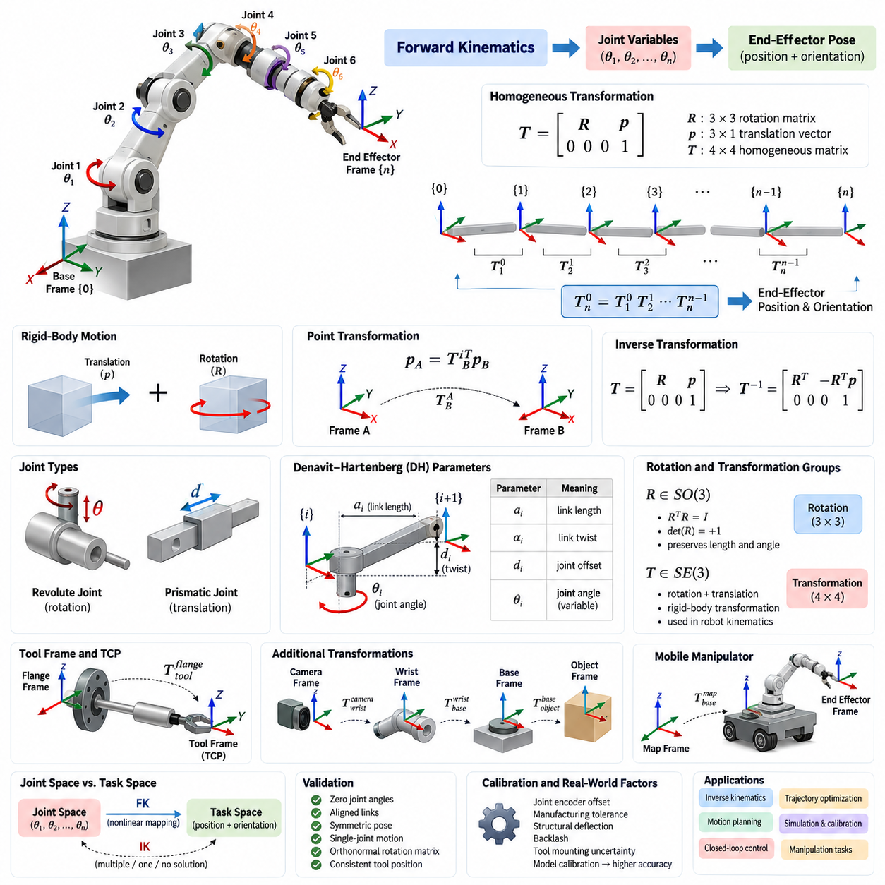
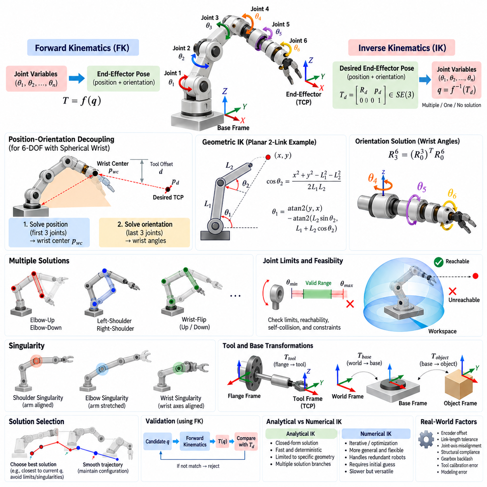
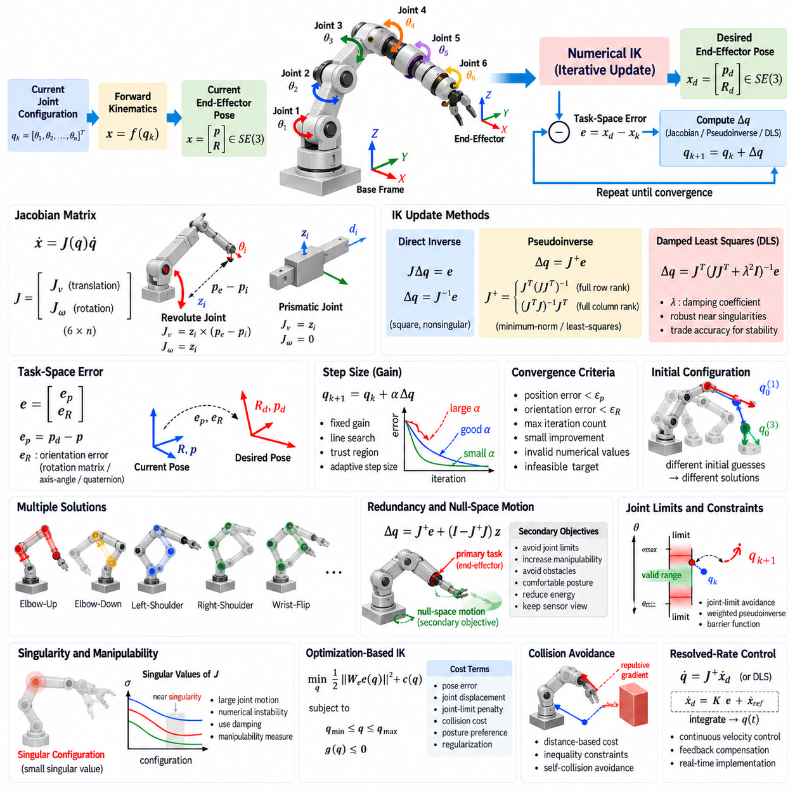
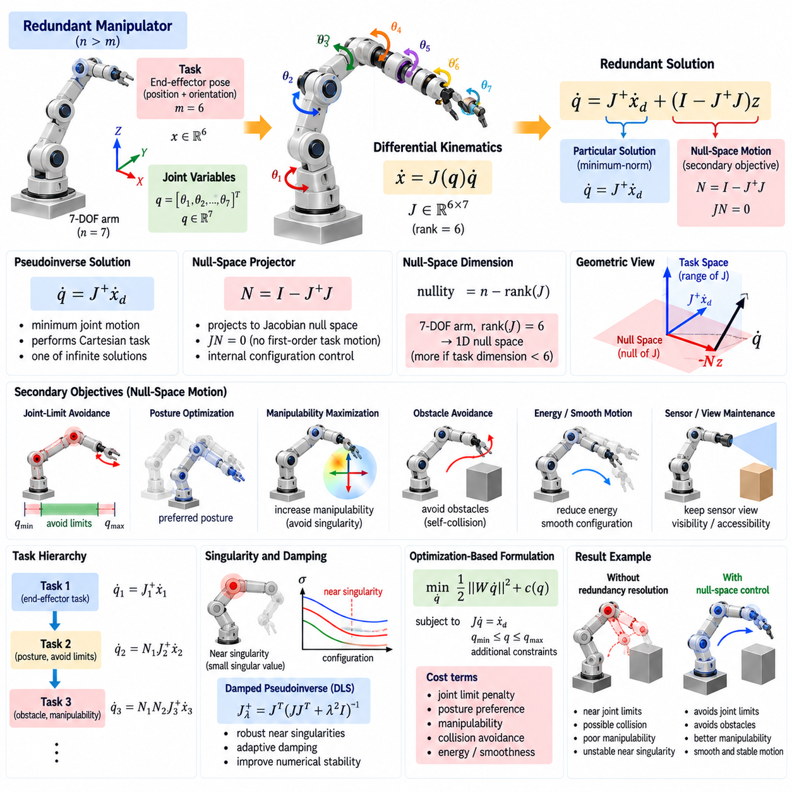
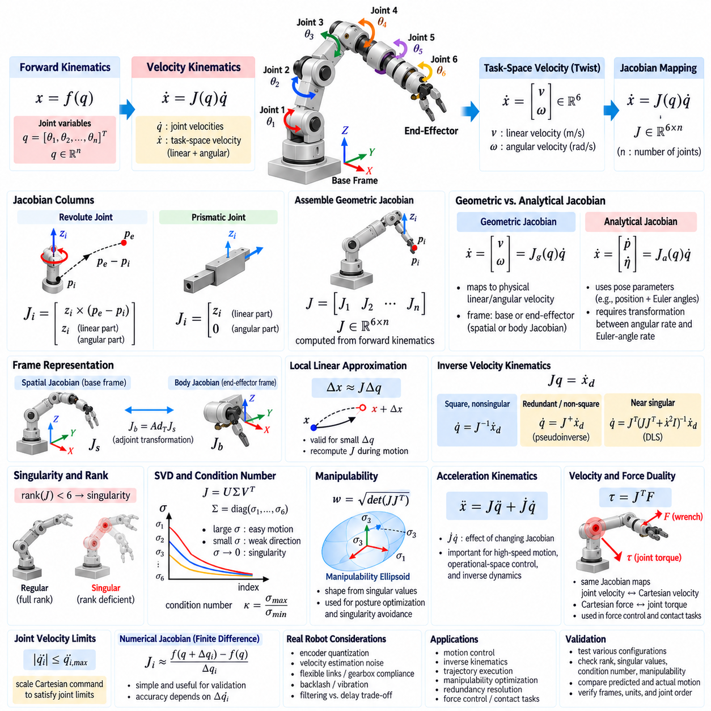
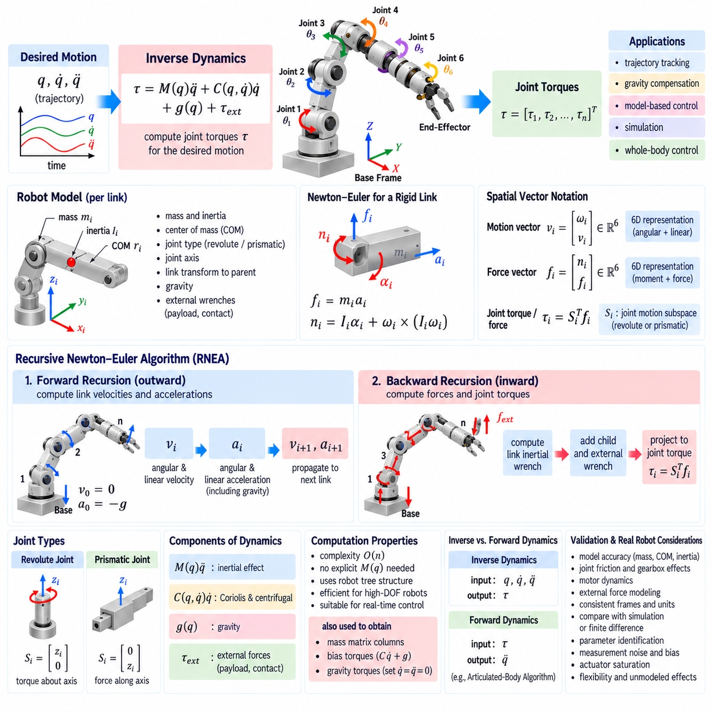
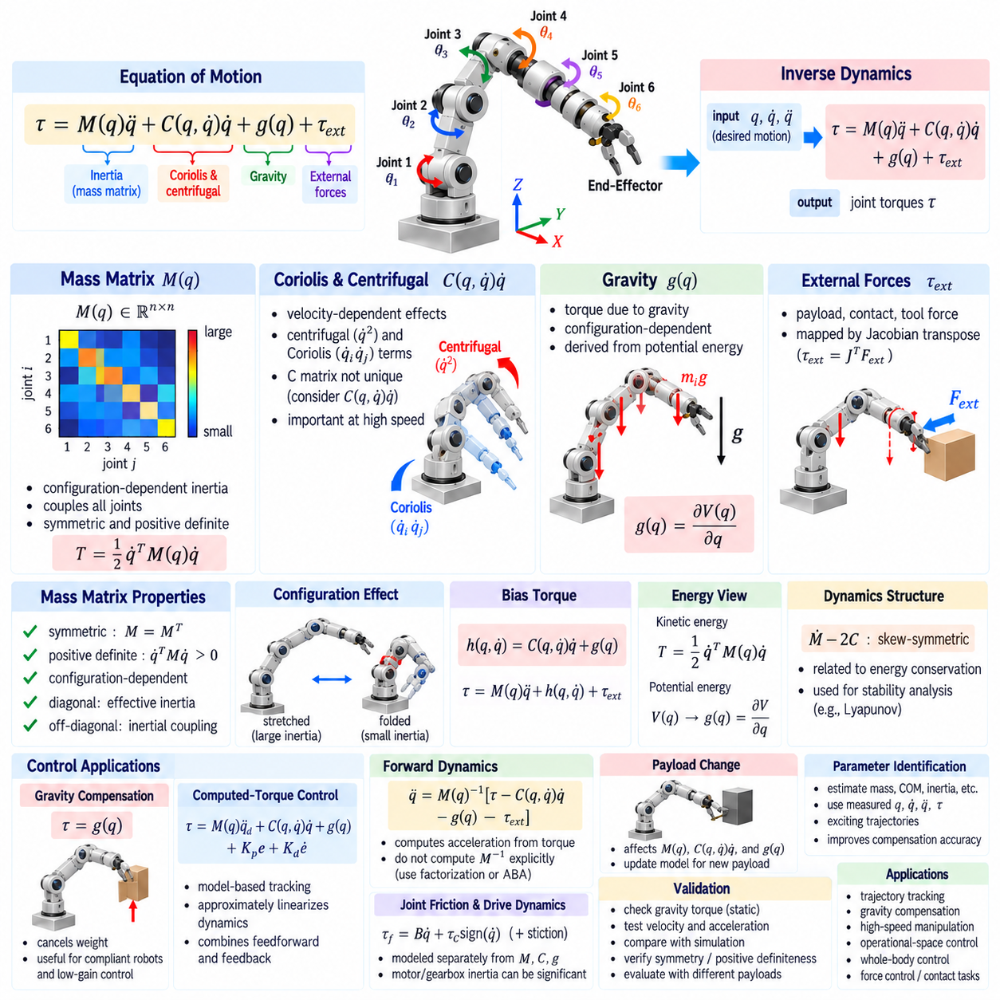
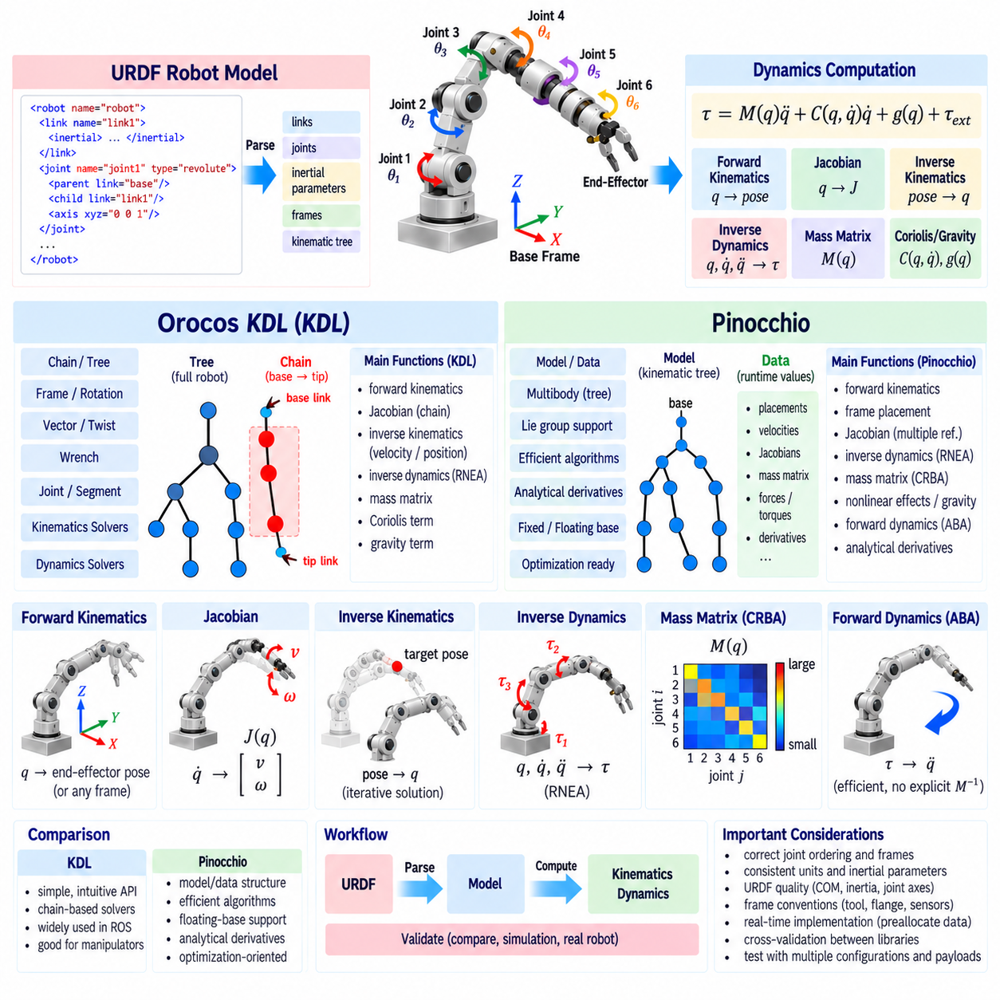
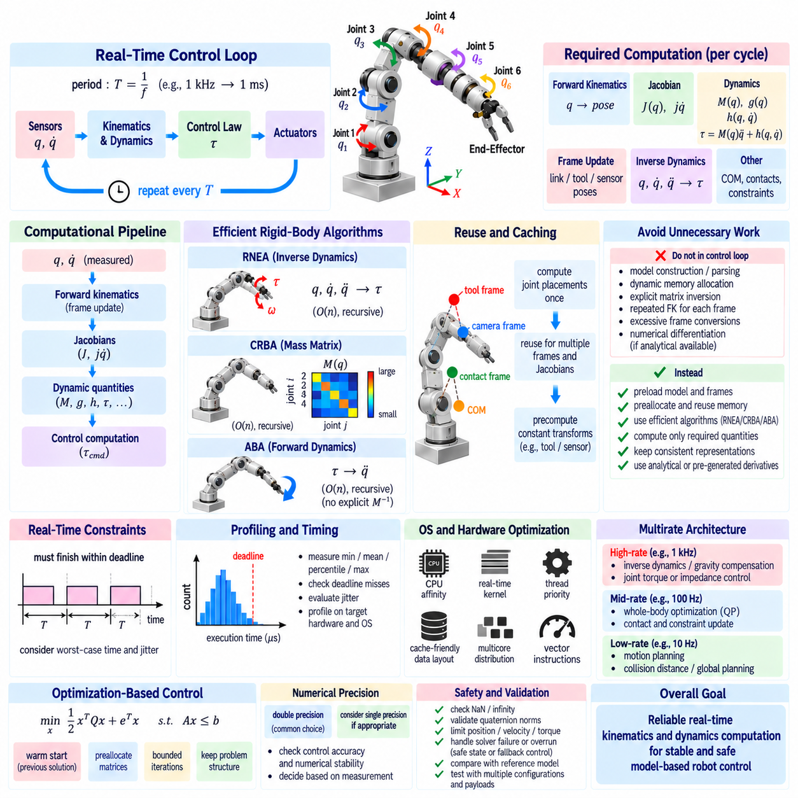
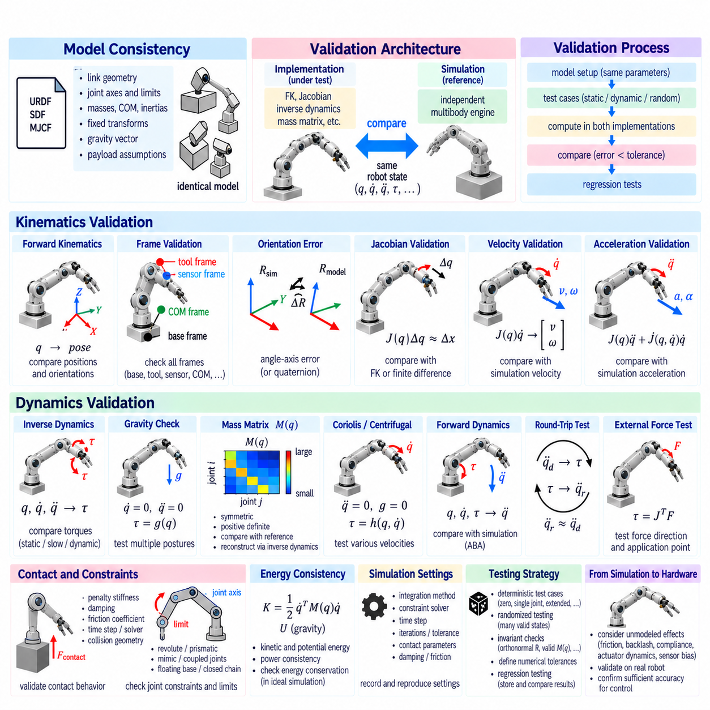

**Volume 17 Manipulation and Grasping AI**


# Chapter 02. Kinematics and Dynamics

##  

## 02.01. Forward Kinematics FK Homogeneous Transform [w/Code]

{width="7.268055555555556in" height="7.268055555555556in"}

Forward kinematics (FK) is the process of determining the position and orientation of a robot's end effector from known joint variables and the geometric structure of the manipulator. For a serial robotic arm, the joint angles or linear displacements are propagated through successive links, producing a deterministic mapping from joint space to a Cartesian pose in the robot workspace.

A robotic manipulator can be modeled as a sequence of coordinate frames attached to the base, links, joints, wrist, and end effector. Each frame describes a local reference system relative to another frame. Forward kinematics constructs mathematical transformations between these frames and combines them sequentially, allowing the pose of any link or tool to be expressed relative to the robot base or another selected reference frame.

Rigid-body motion in three-dimensional space consists of translation and rotation. A position vector alone cannot fully represent the pose of a robotic link because its orientation must also be specified. Rotation matrices describe orientation using a 3 × 3 orthonormal matrix, while translation is represented by a three-dimensional vector. Homogeneous transformations integrate both quantities into one mathematical representation suitable for chained transformations.

A homogeneous transformation matrix is typically written as a 4 × 4 matrix containing a 3 × 3 rotation matrix in its upper-left region and a 3 × 1 translation vector in its upper-right region. The final row is conventionally [0 0 0 1]. This structure enables rotation and translation to be applied through ordinary matrix multiplication while preserving a consistent representation of rigid-body transformations.

If frame B is defined relative to frame A, the homogeneous transformation from B to A represents both the orientation of B and the location of its origin as observed from A. A point expressed in homogeneous coordinates can therefore be transformed between coordinate systems through matrix multiplication. This convention provides a systematic method for converting sensor, link, object, and tool coordinates into a common reference frame.

The major advantage of homogeneous transformations appears when several rigid transformations must be combined. For a serial manipulator containing multiple joints, the transformation from the base to the end effector is obtained by multiplying the individual transformations between consecutive frames. The resulting matrix directly provides the end-effector orientation and position for the specified configuration of joint variables.

For an n-joint serial robot, this relationship can be conceptually represented as T₀ⁿ = T₀¹ T₁² ··· Tₙ₋₁ⁿ. Each transformation describes the geometric relationship between two neighboring coordinate frames. Because matrix multiplication is not commutative, the order of these transformations is essential. Reversing transformations or changing their multiplication sequence generally produces a physically different pose.

Individual joint transformations depend on the type of joint. A revolute joint introduces a variable rotation about its joint axis, whereas a prismatic joint introduces a variable translation along its axis. Fixed link geometry contributes constant translations and rotations. Forward kinematics combines these variable and constant transformations so that every valid joint configuration produces a corresponding end-effector pose.

A widely used systematic representation is the Denavit--Hartenberg (DH) convention. It characterizes the geometric relationship between neighboring links using four parameters associated with link length, link twist, joint offset, and joint angle. Depending on whether a joint is revolute or prismatic, one parameter becomes the joint variable. Multiplying the resulting DH transformation matrices generates the complete forward-kinematic model.

The classical DH convention is not the only possible formulation. Modified DH conventions, product-of-exponentials formulations, direct rigid-body transformations, and software-specific frame definitions are also common. These approaches may assign coordinate frames differently while describing the same physical mechanism. Consequently, consistency in frame definitions and transformation direction is more important than selecting one convention universally.

Rotation matrices used inside homogeneous transformations belong to the special orthogonal group SO(3). They preserve vector lengths and angles, have determinant +1, and satisfy RᵀR = I. Complete rigid transformations belong to the special Euclidean group SE(3), which combines rotation and translation. These mathematical structures provide the foundation for modern robot kinematics, state estimation, motion planning, and control.

The inverse of a homogeneous transformation is especially useful when changing the direction of a coordinate relationship. If a transformation contains rotation R and translation p, its inverse contains Rᵀ and the translated term −Rᵀp. This efficient structure follows from the orthogonality of rotation matrices and avoids treating the transformation as an arbitrary 4 × 4 matrix during analytical calculations.

Forward kinematics is generally easier than inverse kinematics because joint variables uniquely determine a pose for a conventional serial mechanism, while a desired Cartesian pose may correspond to several joint configurations, one configuration, or no feasible configuration. FK therefore acts as a fundamental evaluation function within inverse kinematics, trajectory optimization, motion planning, simulation, calibration, and closed-loop robot control.

The distinction between joint space and task space is central to understanding FK. Joint space represents the robot configuration using variables such as θ₁, θ₂, and successive joint coordinates, whereas task space represents quantities such as end-effector position and orientation. Forward kinematics implements the nonlinear mapping from the robot's joint-space configuration to its corresponding task-space pose.

For a simple planar two-link arm, the end-effector coordinates are determined by the two link lengths and two joint angles. Although this example can be solved directly using trigonometric equations, homogeneous transformations provide a more scalable formulation. The same mathematical procedure extends naturally from a two-link planar mechanism to six-axis industrial manipulators and more complex articulated systems.

Tool frames introduce another important transformation. The final mechanical flange of a robot may not coincide with the operational point of a gripper, welding torch, camera, suction cup, or inspection sensor. A fixed transformation from the flange to the tool center point can be appended to the kinematic chain, enabling FK to calculate the actual operational pose required by the application.

Robotic manipulation frequently requires additional transformations beyond the manipulator itself. An object pose may be expressed relative to a camera, the camera relative to the robot wrist, and the wrist relative to the robot base. Homogeneous transformation chains allow these relationships to be composed into a unified coordinate system, providing the geometric foundation for hand-eye calibration, visual servoing, grasping, and object manipulation.

Mobile manipulators extend the same principle by adding the mobile platform pose to the arm transformation chain. The end-effector pose in a global or map coordinate frame can be computed from the map-to-base transformation, the robot-body transformation, the arm-link transformations, and the tool transformation. Thus, homogeneous transformations provide a common geometric language across navigation and manipulation subsystems.

Numerical implementation requires careful attention to coordinate conventions. Axis directions, right-handed versus left-handed coordinates, intrinsic versus extrinsic rotations, Euler-angle order, quaternion conventions, and active versus passive transformations can produce apparently reasonable but incorrect results. Explicitly documenting every frame and transformation direction is therefore a critical engineering practice in robotic software development.

Forward-kinematic implementations should be validated using configurations whose physical geometry is easy to predict, such as zero joint angles, aligned links, symmetric poses, and individual single-joint motions. Rotation matrices should remain orthonormal, transformation matrices should preserve their homogeneous structure, and computed tool positions should remain consistent with mechanical dimensions and known workspace limits.

In practical systems, the theoretical kinematic model also interacts with calibration errors, joint encoder offsets, manufacturing tolerances, structural deflection, backlash, and tool mounting uncertainty. Nominal FK describes the geometry encoded in the model, whereas calibrated FK incorporates measured corrections to improve Cartesian accuracy. High-precision manipulation therefore depends on both correct transformation mathematics and accurate physical parameter identification.

Forward kinematics ultimately provides the geometric backbone connecting robot configuration to physical action. By representing each rigid relationship as a homogeneous transformation and composing transformations along the kinematic chain, a robot can continuously determine where its links, sensors, tools, and end effector are located and how they are oriented. This capability supports virtually every higher-level manipulation function built upon robot geometry.

정기구학(Forward Kinematics, FK)은 알려진 관절 변수(Joint Variable)와 매니퓰레이터(Manipulator)의 기하학적 구조로부터 로봇 말단장치(End Effector)의 위치(Position)와 자세(Orientation)를 결정하는 과정이다. 직렬형 로봇 팔(Serial Robotic Arm)에서는 관절각(Joint Angle) 또는 선형 변위(Linear Displacement)가 연속된 링크(Link)를 따라 전달되며, 이를 통해 관절공간(Joint Space)에서 로봇 작업공간(Workspace)의 데카르트 자세(Cartesian Pose)로 이어지는 결정론적 매핑(Deterministic Mapping)이 형성된다.

로봇 매니퓰레이터(Robotic Manipulator)는 베이스(Base), 링크(Link), 관절(Joint), 손목(Wrist), 말단장치(End Effector)에 부착된 일련의 좌표계(Coordinate Frame)로 모델링할 수 있다. 각 좌표계는 다른 좌표계를 기준으로 하는 국부 기준계(Local Reference System)를 나타낸다. 정기구학(Forward Kinematics)은 이러한 좌표계 사이의 수학적 변환(Transformation)을 구성하고 순차적으로 결합하여, 임의의 링크 또는 도구(Tool)의 자세를 로봇 베이스나 선택된 다른 기준 좌표계에 대해 표현할 수 있도록 한다.

3차원 공간에서의 강체 운동(Rigid-Body Motion)은 병진(Translation)과 회전(Rotation)으로 구성된다. 위치 벡터(Position Vector)만으로는 로봇 링크의 자세(Pose)를 완전히 표현할 수 없으며, 방향 또는 자세(Orientation)도 함께 지정해야 한다. 회전행렬(Rotation Matrix)은 3 × 3 직교정규행렬(Orthonormal Matrix)을 사용하여 방향을 나타내고, 병진은 3차원 벡터로 표현된다. 동차변환(Homogeneous Transformation)은 이 두 정보를 하나의 수학적 표현으로 통합한다.

동차변환행렬(Homogeneous Transformation Matrix)은 일반적으로 4 × 4 행렬로 표현되며, 좌측 상단에는 3 × 3 회전행렬(Rotation Matrix)이, 우측 상단에는 3 × 1 병진벡터(Translation Vector)가 배치된다. 마지막 행은 관례적으로 [0 0 0 1]로 구성된다. 이러한 구조를 사용하면 회전과 병진을 일반적인 행렬 곱셈(Matrix Multiplication)을 통해 동시에 처리하면서 강체변환(Rigid-Body Transformation)을 일관된 형태로 표현할 수 있다.

좌표계 B(Frame B)가 좌표계 A(Frame A)를 기준으로 정의된 경우, B에서 A로의 동차변환(Homogeneous Transformation)은 A에서 관찰한 B의 방향과 원점 위치를 동시에 나타낸다. 따라서 동차좌표(Homogeneous Coordinates)로 표현된 점은 행렬 곱셈을 통해 서로 다른 좌표계 사이에서 변환될 수 있다. 이 방식은 센서(Sensor), 링크(Link), 객체(Object), 도구(Tool)의 좌표를 공통 기준 좌표계(Common Reference Frame)로 변환하는 체계적인 방법을 제공한다.

동차변환의 가장 큰 장점은 여러 개의 강체변환을 연속적으로 결합해야 할 때 나타난다. 다수의 관절을 갖는 직렬형 매니퓰레이터(Serial Manipulator)의 경우 베이스에서 말단장치까지의 변환은 인접한 좌표계 사이의 개별 변환을 순서대로 곱하여 계산한다. 최종적으로 얻어진 행렬은 주어진 관절 변수에 대응하는 말단장치의 위치와 방향을 직접 제공한다.

n개의 관절을 가진 직렬형 로봇(Serial Robot)의 경우 이러한 관계는 개념적으로 T₀ⁿ = T₀¹ T₁² ··· Tₙ₋₁ⁿ으로 표현할 수 있다. 각각의 변환행렬은 서로 인접한 두 좌표계 사이의 기하학적 관계를 나타낸다. 행렬 곱셈은 교환법칙(Commutative Law)이 성립하지 않으므로 변환의 순서는 매우 중요하다. 변환 방향을 뒤집거나 곱셈 순서를 변경하면 일반적으로 물리적으로 전혀 다른 자세가 계산된다.

각각의 관절변환(Joint Transformation)은 관절 유형에 따라 달라진다. 회전관절(Revolute Joint)은 관절축(Joint Axis)을 중심으로 하는 가변 회전을 발생시키며, 직동관절(Prismatic Joint)은 관절축을 따라 가변 병진을 발생시킨다. 고정된 링크 형상(Fixed Link Geometry)은 일정한 병진과 회전을 제공한다. 정기구학은 이러한 가변변환과 고정변환을 결합하여 모든 유효한 관절 구성(Configuration)에 대응하는 말단장치 자세를 계산한다.

널리 사용되는 체계적 표현 방법 중 하나는 데나빗-하텐버그 규약(Denavit--Hartenberg Convention, DH Convention)이다. 이 방법은 링크 길이(Link Length), 링크 비틀림(Link Twist), 관절 오프셋(Joint Offset), 관절각(Joint Angle)과 관련된 네 개의 매개변수를 사용하여 인접 링크 사이의 기하학적 관계를 표현한다. 관절이 회전형인지 직동형인지에 따라 특정 매개변수가 관절 변수가 되며, 생성된 DH 변환행렬을 연속적으로 곱하여 전체 정기구학 모델을 구성한다.

고전적 DH 규약(Classical DH Convention)만이 유일한 기구학 표현 방법은 아니다. 수정 DH 규약(Modified DH Convention), 지수곱 공식(Product of Exponentials), 직접 강체변환(Direct Rigid-Body Transformation), 소프트웨어별 좌표계 정의도 널리 사용된다. 이러한 방법들은 동일한 물리적 메커니즘을 서로 다른 좌표계 배치 방식으로 표현할 수 있다. 따라서 특정 규약을 절대적으로 선택하는 것보다 좌표계 정의와 변환 방향을 일관되게 유지하는 것이 더욱 중요하다.

동차변환 내부에서 사용되는 회전행렬은 특수직교군(Special Orthogonal Group, SO(3))에 속한다. 회전행렬은 벡터의 길이와 각도를 보존하고 행렬식(Determinant)이 +1이며 RᵀR = I를 만족한다. 회전과 병진을 결합한 전체 강체변환은 특수유클리드군(Special Euclidean Group, SE(3))에 속한다. 이러한 수학적 구조는 현대 로봇 기구학, 상태추정(State Estimation), 모션계획(Motion Planning), 제어(Control)의 중요한 기반을 형성한다.

동차변환의 역변환(Inverse Transformation)은 좌표 관계의 방향을 반대로 변경할 때 특히 유용하다. 변환행렬이 회전 R과 병진 p를 포함하는 경우 역변환은 Rᵀ와 −Rᵀp로 구성된다. 이러한 효율적인 구조는 회전행렬의 직교성(Orthogonality)에서 비롯되며, 해석적 계산 과정에서 동차변환을 일반적인 임의의 4 × 4 행렬처럼 역행렬 계산할 필요가 없도록 한다.

정기구학은 일반적으로 역기구학(Inverse Kinematics, IK)보다 해결하기 쉽다. 일반적인 직렬형 메커니즘에서는 주어진 관절 변수가 하나의 자세를 결정하지만, 원하는 데카르트 자세(Cartesian Pose)에 대응하는 관절 구성은 여러 개일 수도 있고 하나일 수도 있으며, 경우에 따라 존재하지 않을 수도 있다. 따라서 정기구학은 역기구학, 궤적 최적화(Trajectory Optimization), 모션계획, 시뮬레이션(Simulation), 보정(Calibration), 폐루프 로봇제어(Closed-Loop Robot Control)의 기본 평가 함수로 사용된다.

관절공간(Joint Space)과 작업공간(Task Space)의 구분은 정기구학을 이해하는 핵심 개념이다. 관절공간은 θ₁, θ₂와 같은 관절 변수 및 연속적인 관절 좌표를 사용하여 로봇 구성을 나타내며, 작업공간은 말단장치의 위치와 방향과 같은 물리적 상태를 표현한다. 정기구학은 로봇의 관절공간 구성에서 이에 대응하는 작업공간 자세로 변환하는 비선형 매핑(Nonlinear Mapping)을 구현한다.

간단한 평면 2링크 로봇 팔(Planar Two-Link Arm)의 경우 말단장치 좌표는 두 링크의 길이와 두 관절각에 의해 결정된다. 이러한 간단한 예제는 삼각함수(Trigonometric Function)를 이용하여 직접 계산할 수도 있지만, 동차변환을 사용하면 더욱 확장성이 높은 형태로 표현할 수 있다. 동일한 수학적 절차를 2링크 평면 메커니즘에서 6축 산업용 매니퓰레이터 및 더욱 복잡한 다관절 시스템까지 자연스럽게 확장할 수 있다.

도구 좌표계(Tool Frame)는 또 하나의 중요한 변환을 도입한다. 로봇의 최종 기계식 플랜지(Mechanical Flange)는 그리퍼(Gripper), 용접 토치(Welding Torch), 카메라(Camera), 흡착컵(Suction Cup), 검사 센서(Inspection Sensor)의 실제 작업점과 일치하지 않을 수 있다. 플랜지에서 도구중심점(Tool Center Point, TCP)까지의 고정변환을 기구학 체인(Kinematic Chain)에 추가하면 실제 응용에서 필요한 작업 자세를 정기구학으로 계산할 수 있다.

로봇 조작(Robotic Manipulation)에서는 매니퓰레이터 자체 이외에도 여러 좌표변환이 필요한 경우가 많다. 객체 자세(Object Pose)는 카메라를 기준으로 표현되고, 카메라는 로봇 손목을 기준으로 정의되며, 손목은 다시 로봇 베이스를 기준으로 표현될 수 있다. 동차변환 체인을 사용하면 이러한 관계를 하나의 통합된 좌표계로 결합할 수 있으며, 이는 손-눈 보정(Hand-Eye Calibration), 시각 서보잉(Visual Servoing), 파지(Grasping), 객체 조작(Object Manipulation)의 기하학적 기반을 제공한다.

모바일 매니퓰레이터(Mobile Manipulator)는 이동 플랫폼의 자세를 로봇 팔의 변환 체인에 추가함으로써 동일한 원리를 확장한다. 전역 또는 지도 좌표계(Global or Map Frame)에서 말단장치의 자세는 지도-베이스 변환(Map-to-Base Transformation), 로봇 본체 변환(Robot-Body Transformation), 로봇 팔 링크 변환(Arm-Link Transformation), 도구 변환(Tool Transformation)을 결합하여 계산할 수 있다. 따라서 동차변환은 자율주행(Navigation)과 로봇 조작 시스템을 연결하는 공통의 기하학적 언어를 제공한다.

수치적 구현(Numerical Implementation)에서는 좌표계 규약(Coordinate Convention)을 세심하게 관리해야 한다. 축 방향(Axis Direction), 오른손 좌표계와 왼손 좌표계, 내재 회전(Intrinsic Rotation)과 외재 회전(Extrinsic Rotation), 오일러각 순서(Euler-Angle Order), 쿼터니언 규약(Quaternion Convention), 능동변환과 수동변환(Active and Passive Transformation)의 차이는 겉보기에는 정상적이지만 실제로는 잘못된 결과를 생성할 수 있다. 따라서 모든 좌표계와 변환 방향을 명시적으로 문서화하는 것은 로봇 소프트웨어 개발의 핵심적인 엔지니어링 원칙이다.

정기구학 구현은 영 관절각(Zero Joint Angle), 정렬된 링크(Aligned Link), 대칭 자세(Symmetric Pose), 개별 관절만 움직이는 상태처럼 물리적 형상을 쉽게 예측할 수 있는 구성을 이용하여 검증해야 한다. 회전행렬은 직교정규성(Orthonormality)을 유지해야 하며, 변환행렬은 동차구조(Homogeneous Structure)를 보존해야 한다. 또한 계산된 도구 위치는 기계적 치수 및 알려진 작업공간 한계와 일관성을 유지해야 한다.

실제 시스템에서는 이론적인 기구학 모델과 함께 보정 오차(Calibration Error), 관절 엔코더 오프셋(Joint Encoder Offset), 제조 공차(Manufacturing Tolerance), 구조적 변형(Structural Deflection), 백래시(Backlash), 도구 장착 불확실성(Tool Mounting Uncertainty) 등이 영향을 미친다. 공칭 정기구학(Nominal FK)은 모델에 정의된 기하학적 구조를 표현하지만, 보정 정기구학(Calibrated FK)은 측정된 보정값을 반영하여 데카르트 정확도(Cartesian Accuracy)를 향상시킨다. 따라서 고정밀 로봇 조작은 정확한 변환 수학과 정밀한 물리적 매개변수 식별(Parameter Identification)을 모두 필요로 한다.

정기구학은 궁극적으로 로봇의 구성(Configuration)과 실제 물리적 동작을 연결하는 기하학적 기반(Geometric Backbone)을 제공한다. 각각의 강체 관계를 동차변환으로 표현하고 기구학 체인을 따라 변환을 연속적으로 결합함으로써 로봇은 링크, 센서, 도구, 말단장치가 어디에 위치하며 어떤 방향을 향하고 있는지를 지속적으로 계산할 수 있다. 이러한 능력은 로봇의 기하학적 모델을 기반으로 구축되는 거의 모든 상위 수준의 로봇 조작 기능을 지원한다.

##  

## 02.02. Inverse Kinematics IK Analytical Methods [w/Code]

{width="7.268055555555556in" height="7.268055555555556in"}

Inverse kinematics (IK) is the process of determining the joint variables required for a robot manipulator to achieve a desired end-effector position and orientation. Unlike forward kinematics, which maps a known joint configuration to a Cartesian pose, IK performs the reverse mapping from task space to joint space. This reverse relationship is generally more difficult because solutions may be multiple, unique, nonexistent, or geometrically singular.

For a manipulator with joint vector q and forward-kinematic mapping T = f(q), the IK problem seeks q such that f(q) equals a desired transformation T_d. The target transformation normally belongs to SE(3) and contains both a desired rotation R_d and position p_d. Therefore, IK must satisfy translational and rotational constraints simultaneously while respecting the geometric structure and degrees of freedom of the robot.

Analytical IK derives joint variables directly from closed-form geometric or algebraic relationships. Instead of iteratively reducing pose error, an analytical solver evaluates explicit equations involving link dimensions, target coordinates, and orientation parameters. When such equations exist, analytical IK can be extremely fast and deterministic, making it attractive for industrial robots that repeatedly execute high-frequency motion commands.

Closed-form solutions are not available for every manipulator architecture. Their existence depends strongly on the arrangement of joint axes and links. Many classical six-degree-of-freedom industrial manipulators were deliberately designed with geometries that simplify analytical IK. A particularly important structure is a spherical wrist, in which the axes of the final three revolute joints intersect at a common point, enabling position and orientation to be solved separately.

The position-orientation decoupling principle reduces a six-dimensional IK problem into two smaller problems. The first stage determines the initial joints required to place the wrist center at the correct Cartesian location. The second stage determines the wrist joint angles required to produce the desired end-effector orientation. This decomposition greatly simplifies the equations and is one of the most widely used analytical strategies for six-axis manipulators.

The wrist center can be obtained from the desired tool pose by subtracting the known tool or final-link offset along the appropriate end-effector axis. Once this point is known, the shoulder and elbow joints can often be solved using planar geometry. Distances between the robot base, shoulder, elbow, and wrist center form triangles whose internal angles can be calculated using trigonometric relationships such as the law of cosines.

Geometric IK interprets the manipulator as combinations of triangles, circles, planes, and rotation axes. For a two-link planar arm, the target point and two link lengths form a triangle, allowing the elbow angle to be derived from the law of cosines. The shoulder angle can then be calculated from the target direction and the internal triangle geometry. This simple example illustrates the basic reasoning used in more complex analytical robot models.

Multiple IK solutions naturally arise because different joint configurations can generate the same end-effector pose. A planar arm may reach one point using elbow-up or elbow-down configurations. A six-axis manipulator may additionally have left-shoulder or right-shoulder and wrist-flip alternatives. Combining these branches can produce several mathematically valid solutions for a single desired Cartesian pose.

An analytical solver must therefore do more than calculate one set of angles. It should systematically enumerate valid solution branches and determine whether each candidate satisfies the original kinematic equations. Depending on robot geometry, a six-axis industrial arm may provide several discrete configurations. Maintaining explicit configuration branches is important because switching unexpectedly between them can cause large joint movements even when Cartesian motion is small.

Joint limits provide the first practical filter for analytical IK solutions. A mathematically valid angle may exceed the mechanical range of a revolute joint or the travel range of a prismatic joint. Candidate solutions must therefore be normalized according to joint periodicity and checked against allowable limits. Additional constraints may include velocity limits, cable routing, self-collision, payload orientation, and application-specific safety restrictions.

Reachability is another fundamental consideration. A desired pose may lie outside the geometric workspace, causing analytical expressions to have no real-valued solution. For example, the cosine-law equation may produce a value outside the interval [−1, 1], indicating that the target cannot be reached by the relevant links. Robust implementations detect these conditions explicitly instead of allowing invalid square roots or inverse trigonometric operations to propagate.

Analytical IK relies heavily on inverse trigonometric functions, and their use requires careful quadrant handling. Functions such as atan2 are generally preferred over a simple arctangent because they preserve sign information and distinguish between geometric quadrants. Similarly, inverse cosine and inverse sine may correspond to multiple angular branches. Correct branch management is essential for generating all physically meaningful robot configurations.

Orientation recovery is commonly performed after the first three joints have positioned the wrist center. Their rotation matrix R₀³ is computed using forward kinematics, while the desired end-effector rotation R₀⁶ is known from the target pose. The remaining wrist rotation can then be obtained conceptually from R₃⁶ = (R₀³)ᵀR₀⁶, after which the final joint angles are extracted according to the wrist's rotation sequence.

The extraction of wrist angles resembles the decomposition of a rotation matrix into Euler-like rotations. Specific matrix elements provide combinations of sine and cosine terms corresponding to the final joints. Different sign choices generate wrist-flip alternatives. Because rotation parameterizations have singular configurations, the extraction procedure must include special handling when one rotational degree of freedom becomes indistinguishable from another.

Kinematic singularities occur when the manipulator loses instantaneous mobility in one or more Cartesian directions. In analytical IK, singularities often appear as divisions by values approaching zero or as joint angles that become coupled. A wrist singularity, for example, can occur when two wrist axes align. The desired orientation may remain achievable, but infinitely many combinations of two joint angles can represent the same orientation.

Singular configurations require explicit solver policies. Instead of treating every singularity as a complete failure, the solver may preserve one joint near its previous value and calculate another joint to satisfy the remaining orientation constraint. This strategy improves motion continuity. Nevertheless, operation close to singularities can demand high joint velocities, so trajectory planning and control layers must consider more than the existence of a static IK solution.

Solution selection is crucial when several analytical branches are available. A common strategy chooses the candidate closest to the robot's current joint configuration, minimizing weighted joint displacement. More advanced criteria can penalize proximity to joint limits, singularities, obstacles, or undesirable wrist configurations. Thus, analytical IK generates feasible candidates, while a separate decision process determines which candidate is most appropriate for execution.

Continuity becomes especially important when IK is evaluated along a Cartesian trajectory. Independently selecting the numerically nearest solution at every waypoint can still produce branch changes or discontinuities. Practical systems therefore track configuration identity, unwrap periodic joint angles, compare candidates with the previous solution, and apply hysteresis or branch-locking rules so that smooth Cartesian paths produce correspondingly smooth joint trajectories.

Tool transformations must also be handled correctly. The desired task pose may refer to a tool center point rather than the robot's mechanical flange. Before solving the arm geometry, the known flange-to-tool transformation is removed from the target pose to obtain the required flange pose. Errors in this transformation directly appear as systematic positioning and orientation errors even when the analytical IK equations themselves are correct.

Base-frame transformations are equally important in robot cells. A target may be specified relative to a workpiece, fixture, camera, mobile platform, or world coordinate system rather than the manipulator base. Homogeneous transformations must first express the target in the coordinate system expected by the IK solver. Analytical kinematics therefore operates as part of a larger transformation chain rather than as an isolated mathematical function.

Analytical IK offers major computational advantages. Once derived and implemented, closed-form equations require a predictable number of arithmetic and trigonometric operations and do not depend on an initial guess or iterative convergence. This makes execution time highly consistent and enables rapid evaluation of multiple configurations, which is valuable for real-time control, trajectory generation, grasp planning, and high-throughput industrial automation.

Its principal disadvantage is limited generality. A solver derived for one robot geometry usually cannot be transferred directly to a different arrangement of links and joint axes. Robots with redundant degrees of freedom, unusual offsets, parallel mechanisms, or complex kinematic structures may not admit convenient closed-form solutions. Derivation and maintenance can also become difficult when mechanical revisions change link dimensions or coordinate conventions.

Analytical and numerical IK should therefore be viewed as complementary rather than competing methods. Analytical approaches are preferred when robot geometry supports reliable closed-form solutions, while Jacobian-based, optimization-based, or hybrid numerical methods provide greater flexibility for general mechanisms and redundant robots. Some practical systems use analytical solutions as fast initial candidates and numerical optimization for refinement or additional constraints.

Validation of an analytical IK implementation should use forward kinematics as an independent consistency check. Every candidate joint solution can be substituted into the FK model, and the resulting position and orientation can be compared with the requested target. Testing should cover normal configurations, workspace boundaries, multiple solution branches, joint limits, angle wrapping, unreachable targets, and configurations near shoulder, elbow, or wrist singularities.

Numerical tolerance is important even in an analytical method because real computations use finite-precision arithmetic. Values theoretically equal to zero may appear as small residuals, and arguments theoretically within [−1, 1] may slightly exceed the interval because of rounding. Robust solvers clamp appropriate quantities, define explicit tolerances, avoid unstable divisions, and distinguish true geometric infeasibility from harmless floating-point error.

In real robotic systems, model accuracy also limits IK accuracy. Encoder offsets, link-length tolerances, joint-axis misalignment, structural compliance, gearbox backlash, and tool calibration errors cause differences between the mathematical model and physical robot. Analytical IK can calculate an exact solution for its model while the real end effector still exhibits pose error. Kinematic calibration is therefore essential for precision manipulation.

Analytical inverse kinematics ultimately converts a desired physical action into executable robot configurations through explicit geometric reasoning. By decomposing position and orientation, solving geometric constraints, enumerating configuration branches, handling singularities and limits, and validating candidates through forward kinematics, analytical IK provides a fast and interpretable foundation for industrial manipulation, motion planning, and precise robotic control.

역기구학(Inverse Kinematics, IK)은 로봇 매니퓰레이터(Robot Manipulator)가 원하는 말단장치(End Effector)의 위치(Position)와 자세(Orientation)를 달성하기 위해 필요한 관절 변수(Joint Variable)를 결정하는 과정이다. 알려진 관절 구성(Joint Configuration)을 데카르트 자세(Cartesian Pose)로 변환하는 정기구학(Forward Kinematics, FK)과 달리, 역기구학은 작업공간(Task Space)에서 관절공간(Joint Space)으로의 역방향 매핑(Reverse Mapping)을 수행한다. 이 관계는 해가 여러 개이거나 하나뿐이거나 존재하지 않거나 기하학적으로 특이할 수 있기 때문에 일반적으로 더 어렵다.

관절 벡터(Joint Vector) q와 정기구학 매핑(Forward-Kinematic Mapping) T = f(q)를 갖는 매니퓰레이터에서 역기구학 문제는 f(q)가 원하는 변환 T_d와 같아지도록 하는 q를 찾는 것이다. 목표 변환(Target Transformation)은 일반적으로 SE(3)에 속하며 원하는 회전 R_d와 위치 p_d를 모두 포함한다. 따라서 역기구학은 로봇의 기하학적 구조와 자유도(Degrees of Freedom)를 고려하면서 병진 제약과 회전 제약을 동시에 만족해야 한다.

해석적 역기구학(Analytical IK)은 폐쇄형 기하학 또는 대수 관계(Closed-Form Geometric or Algebraic Relationship)를 이용하여 관절 변수를 직접 유도한다. 자세 오차를 반복적으로 감소시키는 대신 링크 치수(Link Dimension), 목표 좌표(Target Coordinate), 자세 매개변수(Orientation Parameter)를 포함하는 명시적 방정식을 계산한다. 이러한 방정식이 존재하면 해석적 역기구학은 매우 빠르고 결정론적으로 동작하므로 높은 주기로 반복적인 동작 명령을 수행하는 산업용 로봇에 적합하다.

폐쇄형 해(Closed-Form Solution)는 모든 매니퓰레이터 구조에서 존재하는 것은 아니다. 해의 존재 여부는 관절축과 링크의 배치에 크게 의존한다. 많은 전통적인 6자유도 산업용 매니퓰레이터(Six-DOF Industrial Manipulator)는 해석적 역기구학을 단순화할 수 있도록 의도적으로 설계되었다. 특히 중요한 구조가 마지막 세 회전관절의 축이 하나의 공통점에서 교차하는 구형 손목(Spherical Wrist)이며, 이를 이용하면 위치와 자세를 분리하여 계산할 수 있다.

위치-자세 분리 원리(Position-Orientation Decoupling Principle)는 6차원의 역기구학 문제를 두 개의 작은 문제로 나눈다. 첫 번째 단계에서는 손목 중심(Wrist Center)을 올바른 데카르트 위치에 배치하기 위해 필요한 초기 관절들을 계산한다. 두 번째 단계에서는 원하는 말단장치 자세를 생성하기 위한 손목 관절각(Wrist Joint Angle)을 결정한다. 이러한 분해는 방정식을 크게 단순화하며 6축 매니퓰레이터에서 가장 널리 사용되는 해석적 전략 중 하나이다.

손목 중심(Wrist Center)은 원하는 도구 자세(Tool Pose)에서 적절한 말단장치 축을 따라 알려진 도구 또는 최종 링크 오프셋을 제거하여 구할 수 있다. 이 점이 결정되면 어깨 관절(Shoulder Joint)과 팔꿈치 관절(Elbow Joint)은 평면 기하학(Planar Geometry)을 사용하여 계산할 수 있다. 로봇 베이스, 어깨, 팔꿈치, 손목 중심 사이의 거리는 삼각형을 형성하며, 내부 각도는 코사인 법칙(Law of Cosines)과 같은 삼각함수 관계를 이용하여 계산한다.

기하학적 역기구학(Geometric IK)은 매니퓰레이터를 삼각형, 원, 평면, 회전축의 조합으로 해석한다. 평면 2링크 로봇 팔(Two-Link Planar Arm)의 경우 목표점과 두 링크 길이가 하나의 삼각형을 형성하므로 코사인 법칙을 이용해 팔꿈치 각도를 구할 수 있다. 이후 목표 방향과 삼각형 내부의 기하학적 관계를 이용하여 어깨 각도를 계산한다. 이러한 단순한 예제는 보다 복잡한 해석적 로봇 모델에서도 사용되는 기본적인 추론 방법을 보여준다.

동일한 말단장치 자세를 서로 다른 관절 구성이 생성할 수 있기 때문에 여러 개의 역기구학 해(Multiple IK Solutions)가 자연스럽게 발생한다. 평면 로봇 팔은 하나의 목표점에 팔꿈치 위(Elbow-Up) 또는 팔꿈치 아래(Elbow-Down) 구성으로 도달할 수 있다. 6축 매니퓰레이터에서는 왼쪽 어깨(Left-Shoulder), 오른쪽 어깨(Right-Shoulder), 손목 뒤집힘(Wrist-Flip) 등의 대안이 추가될 수 있다. 이러한 분기들을 결합하면 하나의 데카르트 목표 자세에 대해 여러 개의 수학적으로 유효한 해가 생성될 수 있다.

따라서 해석적 솔버(Analytical Solver)는 단순히 하나의 관절각 집합만 계산해서는 안 된다. 가능한 해의 분기(Solution Branch)를 체계적으로 열거하고 각각의 후보가 원래의 기구학 방정식을 만족하는지 확인해야 한다. 로봇의 기하학적 구조에 따라 6축 산업용 로봇은 여러 개의 이산적인 구성(Discrete Configuration)을 가질 수 있다. 데카르트 이동량이 작더라도 구성 분기가 갑자기 변경되면 큰 관절 움직임이 발생할 수 있으므로 각 구성 분기를 명시적으로 관리하는 것이 중요하다.

관절 한계(Joint Limit)는 해석적 역기구학 해를 실용적으로 필터링하기 위한 첫 번째 기준을 제공한다. 수학적으로 유효한 각도라 하더라도 회전관절의 기계적 범위 또는 직동관절(Prismatic Joint)의 이동 범위를 벗어날 수 있다. 따라서 후보 해는 관절 주기성(Joint Periodicity)에 따라 정규화한 후 허용 범위와 비교해야 한다. 추가적인 제약에는 속도 제한, 케이블 배선, 자기충돌(Self-Collision), 페이로드 자세(Payload Orientation), 응용 분야별 안전 제한 등이 포함될 수 있다.

도달 가능성(Reachability) 역시 기본적으로 고려해야 하는 요소이다. 원하는 자세가 기하학적 작업공간(Geometric Workspace)을 벗어나면 해석식에 실수값 해가 존재하지 않을 수 있다. 예를 들어 코사인 법칙 방정식의 결과가 [−1, 1] 범위를 벗어나면 관련 링크를 이용하여 해당 목표에 도달할 수 없음을 의미한다. 견고한 구현에서는 잘못된 제곱근이나 역삼각함수 연산이 전달되지 않도록 이러한 조건을 명시적으로 검출한다.

해석적 역기구학에서는 역삼각함수(Inverse Trigonometric Function)를 많이 사용하므로 사분면(Quadrant)을 올바르게 처리해야 한다. atan2와 같은 함수는 부호 정보를 유지하고 기하학적 사분면을 구분할 수 있기 때문에 단순한 아크탄젠트(Arctangent)보다 일반적으로 선호된다. 마찬가지로 역코사인과 역사인은 여러 각도 분기에 대응할 수 있다. 물리적으로 의미 있는 모든 로봇 구성을 생성하려면 정확한 분기 관리(Branch Management)가 필수적이다.

자세 복원(Orientation Recovery)은 일반적으로 처음 세 관절이 손목 중심을 배치한 후 수행된다. 이 관절들의 회전행렬 R₀³은 정기구학을 통해 계산하며, 원하는 말단장치 회전 R₀⁶은 목표 자세로부터 이미 알려져 있다. 이후 나머지 손목 회전은 개념적으로 R₃⁶ = (R₀³)ᵀR₀⁶으로 계산할 수 있으며, 손목의 회전 순서(Rotation Sequence)에 따라 마지막 관절각들을 추출한다.

손목 각도의 추출은 회전행렬(Rotation Matrix)을 오일러 형태의 회전(Euler-Like Rotation)으로 분해하는 과정과 유사하다. 특정 행렬 요소들은 마지막 관절에 대응하는 사인과 코사인의 조합을 제공한다. 서로 다른 부호 선택은 손목 뒤집힘(Wrist-Flip) 대안을 생성한다. 회전 매개변수화(Rotation Parameterization)에는 특이 구성이 존재하므로 하나의 회전 자유도가 다른 자유도와 구분되지 않는 경우를 위한 특별한 처리 절차가 필요하다.

기구학적 특이점(Kinematic Singularity)은 매니퓰레이터가 하나 이상의 데카르트 방향에서 순간적인 운동 능력을 상실할 때 발생한다. 해석적 역기구학에서는 특이점이 0에 가까워지는 값으로 나누는 연산이나 관절각들이 서로 결합되는 형태로 나타나는 경우가 많다. 예를 들어 두 개의 손목축이 정렬되면 손목 특이점(Wrist Singularity)이 발생할 수 있다. 원하는 자세는 여전히 달성 가능하지만 두 관절각의 무한히 많은 조합이 동일한 자세를 표현할 수 있다.

특이 구성(Singular Configuration)에는 명시적인 솔버 정책(Solver Policy)이 필요하다. 모든 특이점을 완전한 실패로 처리하는 대신 한 관절을 이전 값 근처에 유지하고 다른 관절을 계산하여 남아 있는 자세 제약을 만족시키는 방법을 사용할 수 있다. 이러한 전략은 움직임의 연속성(Motion Continuity)을 향상시킨다. 그러나 특이점 근처에서는 높은 관절 속도가 요구될 수 있으므로 궤적 계획(Trajectory Planning)과 제어 계층은 정적인 역기구학 해의 존재 여부 이상을 고려해야 한다.

여러 해석적 분기가 존재할 경우 해 선택(Solution Selection)은 매우 중요하다. 일반적인 전략은 로봇의 현재 관절 구성과 가장 가까운 후보를 선택하여 가중 관절 변위(Weighted Joint Displacement)를 최소화하는 것이다. 더욱 발전된 기준에서는 관절 한계, 특이점, 장애물 또는 바람직하지 않은 손목 구성과의 근접성을 페널티로 적용할 수 있다. 따라서 해석적 역기구학은 실행 가능한 후보를 생성하고, 별도의 의사결정 과정이 실행에 가장 적합한 후보를 선택한다.

역기구학이 데카르트 궤적(Cartesian Trajectory)을 따라 계산될 때는 연속성이 특히 중요해진다. 각 경유점(Waypoint)에서 단순히 수치적으로 가장 가까운 해를 독립적으로 선택하더라도 구성 분기의 변경이나 불연속이 발생할 수 있다. 실제 시스템에서는 구성의 정체성을 추적하고 주기적인 관절각을 연속화하며 이전 해와 후보를 비교하고 히스테리시스(Hysteresis) 또는 분기 고정(Branch Locking) 규칙을 적용하여 부드러운 데카르트 경로가 부드러운 관절 궤적으로 변환되도록 한다.

도구 변환(Tool Transformation) 역시 정확하게 처리해야 한다. 원하는 작업 자세(Task Pose)는 로봇의 기계식 플랜지(Mechanical Flange)가 아니라 도구중심점(Tool Center Point, TCP)을 기준으로 정의될 수 있다. 로봇 팔의 기하학적 문제를 해결하기 전에 알려진 플랜지-도구 변환(Flange-to-Tool Transformation)을 목표 자세에서 제거하여 필요한 플랜지 자세를 계산해야 한다. 이 변환에 오차가 존재하면 해석적 역기구학 방정식 자체가 정확하더라도 체계적인 위치 및 자세 오차가 발생한다.

로봇 셀(Robot Cell)에서는 베이스 좌표계 변환(Base-Frame Transformation)도 동일하게 중요하다. 목표는 매니퓰레이터 베이스가 아니라 작업물(Workpiece), 지그(Fixture), 카메라(Camera), 모바일 플랫폼(Mobile Platform), 전역 좌표계(World Coordinate System)를 기준으로 지정될 수 있다. 따라서 먼저 동차변환(Homogeneous Transformation)을 이용하여 목표를 역기구학 솔버가 요구하는 좌표계로 표현해야 한다. 해석적 기구학은 독립적인 수학 함수가 아니라 더 큰 좌표변환 체인(Transformation Chain)의 일부로 동작한다.

해석적 역기구학은 계산 측면에서 큰 장점을 제공한다. 폐쇄형 방정식이 유도되고 구현되면 일정한 수의 산술 및 삼각함수 연산만으로 해를 계산할 수 있으며 초기 추정값(Initial Guess)이나 반복적 수렴(Iterative Convergence)에 의존하지 않는다. 따라서 실행 시간이 매우 일정하고 여러 구성을 빠르게 평가할 수 있어 실시간 제어(Real-Time Control), 궤적 생성(Trajectory Generation), 파지 계획(Grasp Planning), 고속 산업 자동화에 유용하다.

해석적 역기구학의 주요 단점은 일반성(Generality)이 제한된다는 것이다. 특정 로봇 기하학을 위해 유도된 솔버는 링크와 관절축의 배치가 다른 로봇에 직접 적용하기 어렵다. 중복 자유도(Redundant Degrees of Freedom), 특수한 오프셋, 병렬 메커니즘(Parallel Mechanism), 복잡한 기구학 구조를 갖는 로봇에서는 편리한 폐쇄형 해가 존재하지 않을 수 있다. 또한 기계 설계 변경으로 링크 치수나 좌표계 규약이 바뀌면 해석식의 유도와 유지보수가 어려워질 수 있다.

따라서 해석적 역기구학과 수치적 역기구학(Numerical IK)은 경쟁 관계가 아니라 상호보완적인 방법으로 이해해야 한다. 로봇의 기하학적 구조가 신뢰성 높은 폐쇄형 해를 지원하는 경우에는 해석적 방법이 선호되며, 자코비안 기반(Jacobian-Based), 최적화 기반(Optimization-Based), 하이브리드 수치 방법(Hybrid Numerical Method)은 일반적인 메커니즘과 중복 자유도 로봇에 더 높은 유연성을 제공한다. 일부 실제 시스템에서는 해석적 해를 빠른 초기 후보로 사용한 후 수치 최적화를 통해 추가 제약을 반영하거나 결과를 정밀화한다.

해석적 역기구학 구현의 검증(Validation)에는 정기구학을 독립적인 일관성 검사 방법으로 사용해야 한다. 각각의 후보 관절 해를 정기구학 모델에 다시 입력하고 계산된 위치와 자세를 요청된 목표와 비교할 수 있다. 시험에는 일반적인 구성뿐만 아니라 작업공간 경계, 다중 해 분기, 관절 한계, 각도 래핑(Angle Wrapping), 도달 불가능한 목표, 어깨·팔꿈치·손목 특이점 주변의 구성까지 포함해야 한다.

해석적 방법에서도 실제 계산은 유한 정밀도(Finite-Precision Arithmetic)를 사용하므로 수치 허용오차(Numerical Tolerance)가 중요하다. 이론적으로 0인 값이 작은 잔차로 나타날 수 있으며, 이론적으로 [−1, 1] 범위에 존재해야 하는 값이 반올림으로 인해 범위를 조금 벗어날 수도 있다. 견고한 솔버는 필요한 값을 적절하게 제한하고 명시적인 허용오차를 정의하며 불안정한 나눗셈을 피하고, 실제 기하학적 도달 불가능성과 단순한 부동소수점 오차(Floating-Point Error)를 구분한다.

실제 로봇 시스템에서는 모델 정확도(Model Accuracy) 또한 역기구학 정확도를 제한한다. 엔코더 오프셋(Encoder Offset), 링크 길이 공차(Link-Length Tolerance), 관절축 오정렬(Joint-Axis Misalignment), 구조적 유연성(Structural Compliance), 기어박스 백래시(Gearbox Backlash), 도구 보정 오차(Tool Calibration Error)로 인해 수학적 모델과 실제 로봇 사이에 차이가 발생한다. 해석적 역기구학이 모델에 대해 정확한 해를 계산하더라도 실제 말단장치에는 자세 오차가 남을 수 있으므로 정밀한 로봇 조작을 위해서는 기구학적 보정(Kinematic Calibration)이 필수적이다.

해석적 역기구학(Analytical Inverse Kinematics)은 궁극적으로 명시적인 기하학적 추론(Geometric Reasoning)을 통해 원하는 물리적 동작을 실행 가능한 로봇 구성으로 변환한다. 위치와 자세를 분리하고, 기하학적 제약을 계산하며, 구성 분기를 열거하고, 특이점과 관절 한계를 처리한 뒤 정기구학을 통해 후보를 검증함으로써 해석적 역기구학은 산업용 로봇 조작(Industrial Manipulation), 모션계획(Motion Planning), 정밀 로봇제어(Precise Robotic Control)를 위한 빠르고 해석 가능한 기반을 제공한다.

##  

## 02.03. Numerical IK Jacobian Pseudo Inverse DLS [w/Code]

{width="7.268055555555556in" height="7.268055555555556in"}

Numerical inverse kinematics (IK) determines joint variables by iteratively reducing the difference between the current end-effector pose and a desired target pose. Unlike analytical IK, it does not require a closed-form geometric solution for a particular manipulator structure. Instead, numerical IK uses local kinematic relationships to update the joint configuration until the Cartesian position and orientation errors become sufficiently small.

For a robot configuration q, forward kinematics produces the current end-effector pose x = f(q). Given a desired pose x_d, numerical IK defines a task-space error e that represents the displacement from the current pose toward the target. Starting from an initial configuration q₀, the solver repeatedly calculates a joint correction Δq and updates the configuration according to qₖ₊₁ = qₖ + Δq until convergence criteria are satisfied.

The Jacobian matrix is the central mathematical object in differential inverse kinematics. It describes the local relationship between joint velocity and end-effector spatial velocity through ẋ = J(q)q̇. For a three-dimensional manipulator task, the Jacobian commonly contains translational and rotational components. Each column represents how motion of one joint contributes instantaneously to the motion of the end effector.

For a revolute joint, a Jacobian column can be constructed from the joint-axis direction and the vector connecting the joint origin to the end-effector position. Its translational component is generated by a cross product, while its rotational component corresponds to the joint axis. For a prismatic joint, the translational component follows the joint axis directly and the rotational component is zero.

The simplest Jacobian-based IK update conceptually solves JΔq = e. If J is square and nonsingular, the correction can be written as Δq = J⁻¹e, possibly multiplied by a step-size factor. However, direct inversion is applicable only under restricted conditions. Robots may be redundant, underactuated, or close to singular configurations, making a generalized inverse formulation necessary for practical numerical IK.

The Moore--Penrose pseudoinverse provides a standard solution for non-square or rank-deficient Jacobians. The joint update is written as Δq = J⁺e, where J⁺ denotes the pseudoinverse. For redundant manipulators, this produces the minimum-norm joint correction that realizes the desired local task displacement, while for overconstrained systems it provides a least-squares solution that minimizes residual task error.

When the Jacobian has full row rank, one common expression is J⁺ = Jᵀ(JJᵀ)⁻¹. For full column rank, J⁺ = (JᵀJ)⁻¹Jᵀ can be used. In implementation, explicit matrix inversion is usually avoided in favor of numerically stable matrix factorizations or singular value decomposition (SVD). SVD also exposes the singular values that reveal directional manipulability and proximity to kinematic singularities.

A major weakness of the basic pseudoinverse method appears near singular configurations. As one or more singular values of J approach zero, the corresponding inverse terms become very large. A relatively small Cartesian error can then generate excessive joint corrections or velocities. This behavior may cause oscillation, numerical instability, joint-limit violations, or physically unrealistic commands even though the requested task displacement is small.

Damped least squares (DLS), also known as the Levenberg--Marquardt-style approach in many IK formulations, improves robustness near singularities. A common update is Δq = Jᵀ(JJᵀ + λ²I)⁻¹e, where λ is the damping coefficient. The damping term prevents very small singular values from producing excessively large joint motions, trading exact local tracking for improved numerical stability.

The damping coefficient strongly influences solver behavior. A small λ makes DLS behave similarly to the pseudoinverse and provides accurate tracking when the manipulator is far from singularities. A larger λ suppresses unstable joint motion but may slow convergence and leave greater residual task error. Adaptive damping methods vary λ according to singular values, manipulability measures, condition numbers, or observed convergence behavior.

Numerical IK also requires an appropriate representation of orientation error. Direct subtraction of Euler angles is generally unreliable because angular coordinates contain discontinuities and depend on rotation order. More robust approaches derive rotational error from rotation matrices, axis-angle representations, rotation vectors, or quaternions. Position and orientation errors are then combined into a task-space error vector suitable for Jacobian-based correction.

Position and orientation components have different physical units, typically meters and radians, so they should not automatically receive equal numerical importance. A weighting matrix can scale translational and rotational errors according to task requirements. For example, an insertion task may require precise position and axis alignment, while rotation around the insertion axis may be less important. Task weighting makes numerical IK reflect such priorities.

Step size is another critical parameter. Applying the entire computed correction may overshoot the solution because the Jacobian describes only a local linear approximation of nonlinear robot kinematics. A gain α can therefore be introduced so that qₖ₊₁ = qₖ + αΔq. Fixed gains are simple, while line search, trust-region strategies, or adaptive step sizes can improve convergence for difficult targets.

Convergence is normally determined using several criteria rather than a single error threshold. A solver may terminate successfully when both position and orientation errors fall below specified tolerances. It may terminate unsuccessfully when the maximum iteration count is reached, progress becomes negligible, numerical values become invalid, or the target is judged infeasible. Explicit termination states are essential for reliable robot software.

The initial joint configuration has a strong influence on numerical IK because the underlying problem is nonlinear and may contain multiple solutions. Different initial guesses can converge to different joint configurations for the same target pose. An initial state close to the current robot configuration usually promotes motion continuity, while multiple seeds can be evaluated when broader exploration of the available solution space is required.

Redundant manipulators contain more controllable joint degrees of freedom than required by the primary Cartesian task. The pseudoinverse solution can therefore be augmented with null-space motion according to Δq = J⁺e + (I − J⁺J)z. The first term performs the primary end-effector task, while the projected vector z changes the internal robot configuration without ideally disturbing that task to first order.

Null-space motion enables secondary objectives such as avoiding joint limits, maintaining comfortable posture, increasing manipulability, reducing energy, avoiding obstacles, or keeping sensors oriented toward important regions. The vector z is commonly generated from the gradient of a secondary cost function. This capability is a major advantage of numerical IK for seven-degree-of-freedom arms and other redundant robotic systems.

Joint limits should be incorporated during iteration rather than checked only after convergence. Simple methods clamp joint values, but this can distort the intended correction and trap the solver. More sophisticated approaches use joint-limit avoidance gradients, weighted pseudoinverses, barrier functions, or constrained optimization. These methods progressively discourage configurations near mechanical boundaries while preserving task performance whenever possible.

Manipulability provides a useful measure of how effectively joint motion can generate Cartesian motion. Measures derived from JJᵀ or the singular values of J become small near singular configurations. A numerical IK system can use this information to increase damping, activate null-space singularity avoidance, reduce commanded Cartesian speed, or reject configurations that provide insufficient control authority for the required task.

Numerical IK can naturally be formulated as an optimization problem. Instead of solving only a local linear equation, the system can minimize a cost containing pose error, joint displacement, joint-limit penalties, collision costs, posture preferences, and regularization terms. Constraints can explicitly represent joint bounds or task requirements. Such formulations are computationally heavier but offer substantial flexibility for complex manipulation.

Collision avoidance can also be integrated into iterative IK. Distances between robot links and obstacles may generate repulsive gradients or inequality constraints that modify the joint update. Self-collision can be treated similarly. However, satisfying a desired end-effector pose while avoiding obstacles is no longer purely a kinematic inversion problem; it becomes a constrained configuration-search problem closely related to motion planning.

Real-time implementations must balance accuracy, stability, and computational cost. Jacobians can be obtained analytically, generated from robot models, calculated through automatic differentiation, or approximated numerically. Analytical or model-derived Jacobians are generally preferred for control because they are efficient and accurate, while finite-difference Jacobians introduce approximation error and require repeated forward-kinematic evaluations.

The pseudoinverse and DLS methods are frequently used in resolved-rate control, where desired end-effector velocities are converted continuously into joint velocities. In this setting, q̇ = J⁺ẋ_d or its damped equivalent is integrated over time. Feedback terms based on pose error can be added to compensate for integration drift and model imperfections, connecting numerical IK directly with operational-space motion control.

Solver validation should cover normal poses, multiple initial configurations, workspace boundaries, joint limits, redundant postures, unreachable targets, and configurations near singularities. Each resulting joint state should be evaluated through forward kinematics to measure position and orientation residuals. Maximum joint updates, iteration counts, convergence rates, and singular values should also be monitored to expose unstable behavior.

Numerical tolerances must be selected according to physical system accuracy rather than arbitrary mathematical precision. Requesting micrometer-level convergence from a robot whose calibration and structural compliance support only millimeter accuracy wastes computation and may amplify noise. Position tolerance, orientation tolerance, damping, iteration limits, and step size should therefore be coordinated with sensing, calibration, control bandwidth, and application requirements.

Numerical IK complements analytical IK by providing a general framework that adapts to complex robot geometries, redundancy, additional objectives, and constraints. The Jacobian pseudoinverse offers an elegant differential solution, while damped least squares improves robustness around singularities. Combined with task weighting, null-space optimization, adaptive damping, and constraint handling, these techniques form a practical foundation for modern robot manipulation and whole-body control.

수치적 역기구학(Numerical Inverse Kinematics, Numerical IK)은 현재 말단장치(End Effector)의 자세와 원하는 목표 자세 사이의 차이를 반복적으로 감소시켜 관절 변수(Joint Variable)를 결정한다. 해석적 역기구학(Analytical IK)과 달리 특정 매니퓰레이터 구조에 대한 폐쇄형 기하학적 해(Closed-Form Geometric Solution)를 요구하지 않는다. 대신 수치적 역기구학은 국부적인 기구학 관계(Local Kinematic Relationship)를 이용하여 데카르트 위치와 자세 오차가 충분히 작아질 때까지 관절 구성을 반복적으로 갱신한다.

로봇 구성(Robot Configuration) q에 대해 정기구학(Forward Kinematics)은 현재 말단장치 자세 x = f(q)를 생성한다. 원하는 자세 x_d가 주어지면 수치적 역기구학은 현재 자세에서 목표 자세로 이동하는 변위를 나타내는 작업공간 오차(Task-Space Error) e를 정의한다. 초기 구성 q₀에서 시작하여 솔버(Solver)는 관절 보정량(Joint Correction) Δq를 반복적으로 계산하고 qₖ₊₁ = qₖ + Δq에 따라 구성을 갱신하며 수렴 조건(Convergence Criteria)이 만족될 때까지 반복한다.

자코비안 행렬(Jacobian Matrix)은 미분 역기구학(Differential Inverse Kinematics)의 핵심적인 수학적 요소이다. 자코비안은 ẋ = J(q)q̇의 관계를 통해 관절 속도(Joint Velocity)와 말단장치 공간 속도(End-Effector Spatial Velocity) 사이의 국부적인 관계를 나타낸다. 3차원 매니퓰레이터 작업에서 자코비안은 일반적으로 병진 성분과 회전 성분을 포함하며, 각 열(Column)은 하나의 관절 움직임이 말단장치의 순간적인 운동에 어떻게 기여하는지를 나타낸다.

회전관절(Revolute Joint)의 경우 자코비안 열은 관절축 방향과 관절 원점에서 말단장치 위치까지 연결하는 벡터를 이용하여 구성할 수 있다. 병진 성분은 외적(Cross Product)을 통해 생성되고 회전 성분은 관절축에 대응한다. 직동관절(Prismatic Joint)의 경우 병진 성분은 관절축 방향을 직접 따르며 회전 성분은 0이 된다.

가장 단순한 자코비안 기반 역기구학(Jacobian-Based IK) 갱신은 개념적으로 JΔq = e를 해결한다. J가 정방행렬(Square Matrix)이고 비특이(Non-Singular)라면 보정량은 Δq = J⁻¹e로 표현할 수 있으며 필요에 따라 스텝 크기 계수(Step-Size Factor)를 곱할 수 있다. 그러나 직접 역행렬 계산은 제한된 조건에서만 적용 가능하다. 로봇은 중복 자유도를 갖거나 자유도가 부족할 수 있으며 특이 구성에 가까울 수도 있기 때문에 실제 수치적 역기구학에서는 일반화된 역행렬(Generalized Inverse)이 필요하다.

무어-펜로즈 의사역행렬(Moore--Penrose Pseudoinverse)은 비정방 또는 계수 부족(Rank-Deficient) 자코비안을 처리하기 위한 표준적인 방법을 제공한다. 관절 갱신은 Δq = J⁺e로 표현하며, 여기에서 J⁺는 의사역행렬(Pseudoinverse)을 의미한다. 중복 매니퓰레이터(Redundant Manipulator)에서는 원하는 국부 작업 변위를 실현하는 최소 노름 관절 보정(Minimum-Norm Joint Correction)을 생성하고, 과구속 시스템(Overconstrained System)에서는 잔여 작업 오차를 최소화하는 최소제곱해(Least-Squares Solution)를 제공한다.

자코비안이 완전 행 계수(Full Row Rank)를 갖는 경우 일반적으로 J⁺ = Jᵀ(JJᵀ)⁻¹을 사용할 수 있다. 완전 열 계수(Full Column Rank)에서는 J⁺ = (JᵀJ)⁻¹Jᵀ을 사용할 수 있다. 실제 구현에서는 명시적인 행렬 역산(Matrix Inversion)을 피하고 수치적으로 안정적인 행렬 분해(Matrix Factorization) 또는 특이값 분해(Singular Value Decomposition, SVD)를 사용하는 것이 일반적이다. SVD는 방향별 조작성(Manipulability)과 기구학적 특이점에 대한 근접성을 나타내는 특이값(Singular Value)도 제공한다.

기본 의사역행렬 방법의 주요 약점은 특이 구성(Singular Configuration) 근처에서 나타난다. J의 하나 이상의 특이값이 0에 가까워지면 해당 역수 항은 매우 커진다. 그 결과 비교적 작은 데카르트 오차가 과도하게 큰 관절 보정량이나 관절 속도를 생성할 수 있다. 이러한 현상은 요청된 작업 변위가 작더라도 진동(Oscillation), 수치적 불안정성(Numerical Instability), 관절 한계 위반 또는 물리적으로 비현실적인 명령을 발생시킬 수 있다.

감쇠 최소제곱법(Damped Least Squares, DLS)은 많은 역기구학 공식에서 레벤버그-마쿼트 방식(Levenberg--Marquardt-Style Approach)으로도 해석되며 특이점 주변에서의 강건성(Robustness)을 향상시킨다. 일반적인 갱신식은 Δq = Jᵀ(JJᵀ + λ²I)⁻¹e이며, 여기에서 λ는 감쇠계수(Damping Coefficient)이다. 감쇠항(Damping Term)은 매우 작은 특이값으로 인해 과도한 관절 움직임이 발생하는 것을 방지하며, 정확한 국부 추종 성능 일부를 희생하는 대신 수치적 안정성을 향상시킨다.

감쇠계수는 솔버의 동작에 큰 영향을 미친다. 작은 λ를 사용하면 DLS는 의사역행렬과 유사하게 동작하며 매니퓰레이터가 특이점에서 충분히 떨어져 있을 때 높은 추종 정확도를 제공한다. 큰 λ는 불안정한 관절 움직임을 억제하지만 수렴 속도를 낮추고 잔여 작업 오차를 증가시킬 수 있다. 적응형 감쇠(Adaptive Damping)는 특이값, 조작성 지표, 조건수(Condition Number), 관찰된 수렴 동작 등에 따라 λ를 변화시킨다.

수치적 역기구학에서는 적절한 자세 오차(Orientation Error) 표현도 필요하다. 오일러각(Euler Angle)을 직접 빼는 방법은 각도 좌표에 불연속성이 존재하고 회전 순서에 의존하기 때문에 일반적으로 신뢰성이 낮다. 보다 강건한 방법은 회전행렬(Rotation Matrix), 축-각 표현(Axis-Angle Representation), 회전벡터(Rotation Vector), 쿼터니언(Quaternion)으로부터 회전 오차를 계산한다. 이후 위치와 자세 오차를 결합하여 자코비안 기반 보정에 사용할 작업공간 오차 벡터를 구성한다.

위치와 자세 성분은 각각 미터와 라디안처럼 서로 다른 물리 단위를 사용하므로 자동적으로 동일한 수치적 중요도를 부여해서는 안 된다. 가중행렬(Weighting Matrix)을 사용하면 작업 요구사항에 따라 병진 오차와 회전 오차의 중요도를 조정할 수 있다. 예를 들어 삽입 작업(Insertion Task)은 정밀한 위치와 축 정렬이 중요하지만 삽입축 주변의 회전은 상대적으로 중요하지 않을 수 있다. 작업 가중치(Task Weighting)를 사용하면 수치적 역기구학에 이러한 우선순위를 반영할 수 있다.

스텝 크기(Step Size) 역시 중요한 매개변수이다. 자코비안은 비선형 로봇 기구학에 대한 국부 선형 근사(Local Linear Approximation)만을 나타내기 때문에 계산된 전체 보정량을 한 번에 적용하면 목표를 지나칠 수 있다. 따라서 qₖ₊₁ = qₖ + αΔq와 같이 이득 α를 도입할 수 있다. 고정 이득(Fixed Gain)은 구현이 단순하지만 선 탐색(Line Search), 신뢰영역 전략(Trust-Region Strategy), 적응형 스텝 크기(Adaptive Step Size)는 어려운 목표에 대한 수렴 성능을 향상시킬 수 있다.

수렴(Convergence)은 일반적으로 하나의 오차 임계값이 아니라 여러 조건을 사용하여 판단한다. 위치 오차와 자세 오차가 모두 지정된 허용오차 이하로 감소하면 솔버는 성공적으로 종료될 수 있다. 반대로 최대 반복 횟수에 도달하거나, 진행량이 매우 작아지거나, 수치값이 유효하지 않게 되거나, 목표가 실현 불가능한 것으로 판단되면 실패 상태로 종료될 수 있다. 명확한 종료 상태(Termination State)는 신뢰성 높은 로봇 소프트웨어에 필수적이다.

초기 관절 구성(Initial Joint Configuration)은 수치적 역기구학의 결과에 큰 영향을 미친다. 기본 문제가 비선형이며 여러 해를 포함할 수 있기 때문이다. 서로 다른 초기 추정값(Initial Guess)은 동일한 목표 자세에 대해 서로 다른 관절 구성으로 수렴할 수 있다. 현재 로봇 구성에 가까운 초기 상태를 사용하면 일반적으로 움직임의 연속성이 향상되며, 가능한 해 공간(Solution Space)을 더 넓게 탐색해야 할 경우 여러 초기값(Multiple Seeds)을 평가할 수 있다.

중복 매니퓰레이터(Redundant Manipulator)는 주어진 주 데카르트 작업(Primary Cartesian Task)을 수행하는 데 필요한 것보다 더 많은 제어 가능한 관절 자유도를 갖는다. 따라서 의사역행렬 해에 Δq = J⁺e + (I − J⁺J)z 형태의 영공간 운동(Null-Space Motion)을 추가할 수 있다. 첫 번째 항은 주 말단장치 작업을 수행하고, 투영된 벡터 z는 1차 근사에서 주 작업을 방해하지 않으면서 로봇 내부 구성을 변화시킨다.

영공간 운동은 관절 한계 회피(Joint-Limit Avoidance), 편안한 자세 유지, 조작성 향상, 에너지 감소, 장애물 회피, 센서를 중요한 영역으로 유지하는 것과 같은 2차 목적(Secondary Objective)을 구현할 수 있게 한다. 벡터 z는 일반적으로 2차 비용함수(Secondary Cost Function)의 그래디언트(Gradient)를 이용하여 생성된다. 이러한 기능은 7자유도 로봇 팔과 기타 중복 로봇 시스템에서 수치적 역기구학이 제공하는 중요한 장점이다.

관절 한계는 수렴 이후에만 검사하는 것이 아니라 반복 계산 과정에서 직접 고려해야 한다. 단순한 방법은 관절값을 허용 범위로 클램핑(Clamping)하는 것이지만, 이는 의도한 보정 방향을 왜곡하고 솔버를 특정 상태에 고정시킬 수 있다. 보다 발전된 방법은 관절 한계 회피 그래디언트, 가중 의사역행렬(Weighted Pseudoinverse), 장벽함수(Barrier Function), 제약 최적화(Constrained Optimization)를 사용한다. 이러한 방법은 가능한 경우 작업 성능을 유지하면서 기계적 한계 근처의 구성을 점진적으로 억제한다.

조작성(Manipulability)은 관절 운동이 데카르트 운동을 얼마나 효과적으로 생성할 수 있는지를 평가하는 유용한 지표이다. JJᵀ 또는 J의 특이값에서 계산되는 조작성 지표는 특이 구성에 가까워질수록 작아진다. 수치적 역기구학 시스템은 이 정보를 이용하여 감쇠를 증가시키고, 영공간 기반 특이점 회피를 활성화하며, 명령된 데카르트 속도를 낮추거나 필요한 작업에 충분한 제어 능력을 제공하지 못하는 구성을 거부할 수 있다.

수치적 역기구학은 자연스럽게 최적화 문제(Optimization Problem)로 구성할 수도 있다. 단순한 국부 선형 방정식만 해결하는 대신 자세 오차, 관절 변위, 관절 한계 페널티, 충돌 비용(Collision Cost), 자세 선호도(Posture Preference), 정규화항(Regularization Term)을 포함하는 비용함수를 최소화할 수 있다. 제약조건(Constraint)은 관절 범위나 작업 요구사항을 명시적으로 표현할 수 있다. 이러한 방법은 계산량이 증가하지만 복잡한 로봇 조작에서 높은 유연성을 제공한다.

충돌 회피(Collision Avoidance)도 반복적 역기구학에 통합할 수 있다. 로봇 링크와 장애물 사이의 거리를 이용하여 반발 그래디언트(Repulsive Gradient) 또는 부등식 제약조건(Inequality Constraint)을 생성하고 관절 갱신을 수정할 수 있다. 자기충돌(Self-Collision)도 유사하게 처리할 수 있다. 그러나 원하는 말단장치 자세를 만족하면서 장애물을 회피하는 문제는 더 이상 순수한 기구학적 역산 문제가 아니라 모션계획(Motion Planning)과 밀접한 제약 구성 탐색 문제(Constrained Configuration-Search Problem)가 된다.

실시간 구현(Real-Time Implementation)에서는 정확도, 안정성, 계산 비용 사이의 균형을 유지해야 한다. 자코비안은 해석적으로 구하거나 로봇 모델에서 생성하거나 자동미분(Automatic Differentiation)을 통해 계산하거나 수치적으로 근사할 수 있다. 해석적 또는 모델 기반 자코비안은 효율적이고 정확하기 때문에 제어 시스템에서 일반적으로 선호되며, 유한차분 자코비안(Finite-Difference Jacobian)은 근사 오차를 발생시키고 반복적인 정기구학 계산을 요구한다.

의사역행렬과 DLS 방법은 원하는 말단장치 속도를 지속적으로 관절 속도로 변환하는 분해속도 제어(Resolved-Rate Control)에 자주 사용된다. 이 경우 q̇ = J⁺ẋ_d 또는 이에 대응하는 감쇠 형태를 시간에 따라 적분한다. 자세 오차에 기반한 피드백항(Feedback Term)을 추가하여 적분 드리프트(Integration Drift)와 모델 불완전성을 보상할 수 있으며, 이를 통해 수치적 역기구학은 작업공간 운동제어(Operational-Space Motion Control)와 직접 연결된다.

솔버 검증(Solver Validation)은 일반 자세, 다양한 초기 구성, 작업공간 경계, 관절 한계, 중복 자세, 도달 불가능한 목표, 특이점 주변 구성을 포함해야 한다. 계산된 각 관절 상태는 정기구학을 통해 다시 평가하여 위치와 자세의 잔여 오차(Residual Error)를 측정해야 한다. 또한 최대 관절 갱신량, 반복 횟수, 수렴 속도, 특이값을 함께 모니터링하여 불안정한 동작을 식별해야 한다.

수치 허용오차(Numerical Tolerance)는 임의의 수학적 정밀도가 아니라 실제 물리 시스템의 정확도에 맞추어 선택해야 한다. 보정 정확도와 구조적 유연성으로 인해 밀리미터 수준의 정확도만 가능한 로봇에 마이크로미터 수준의 수렴을 요구하면 계산량만 증가하고 노이즈가 증폭될 수 있다. 따라서 위치 허용오차, 자세 허용오차, 감쇠, 반복 횟수 제한, 스텝 크기는 센싱(Sensing), 보정(Calibration), 제어 대역폭(Control Bandwidth), 응용 요구사항과 함께 조정해야 한다.

수치적 역기구학은 복잡한 로봇 기하학, 중복 자유도, 추가 목적함수, 다양한 제약조건에 적용할 수 있는 일반적인 프레임워크를 제공함으로써 해석적 역기구학을 보완한다. 자코비안 의사역행렬(Jacobian Pseudoinverse)은 우아한 미분적 해법을 제공하며, 감쇠 최소제곱법(Damped Least Squares)은 특이점 주변의 강건성을 향상시킨다. 작업 가중치, 영공간 최적화(Null-Space Optimization), 적응형 감쇠, 제약조건 처리를 결합하면 이러한 기법들은 현대 로봇 조작(Robot Manipulation)과 전신제어(Whole-Body Control)를 위한 실용적인 기반을 형성한다.

##  

## 02.04. Redundancy Resolution Null Space Projection [w/Code]

{width="7.268055555555556in" height="7.268055555555556in"}

Redundancy occurs when a robot possesses more controllable joint degrees of freedom than are required to perform a specified task. A seven-joint manipulator controlling a six-dimensional end-effector pose is a common example. The additional degree of freedom does not directly increase the dimension of the primary task, but it creates multiple joint configurations capable of producing the same end-effector pose.

For a robot with joint vector q ∈ Rⁿ and task variable x ∈ Rᵐ, the system is kinematically redundant when n \> m and the Jacobian J has sufficient rank for the task. The differential relationship ẋ = Jq̇ then contains more joint velocity variables than independent task equations. Consequently, infinitely many joint velocities may generate the same desired end-effector velocity, providing freedom to optimize additional robot behaviors.

The Moore--Penrose pseudoinverse provides a particular solution to this underdetermined relationship. For a desired task velocity ẋ_d, the minimum-norm solution can be written as q̇ = J⁺ẋ_d. This solution performs the Cartesian task while minimizing the Euclidean magnitude of joint velocity, but minimum joint motion is not necessarily the most desirable behavior for a physical robot operating under limits, obstacles, and posture requirements.

The general redundant solution introduces a null-space component according to q̇ = J⁺ẋ_d + (I − J⁺J)z. The first term generates the joint motion required by the primary task. The second term lies in the null space of the task Jacobian and can modify the robot's internal configuration without changing the commanded end-effector velocity to first order, provided the Jacobian model is locally accurate.

The matrix N = I − J⁺J is called the null-space projector. Applying N to an arbitrary vector z removes components that would affect the primary task and retains components belonging to the Jacobian null space. Because JN is ideally zero, motion generated by Nz does not produce first-order task-space motion. This mathematical separation enables task execution and internal posture regulation to occur simultaneously.

The dimension of the null space depends on the number of joints and the rank of the Jacobian. For an n-joint robot with Jacobian rank r, the nullity is n − r. A seven-degree-of-freedom arm performing a full-rank six-dimensional task normally has one redundant direction. If the task dimension is reduced, such as controlling position without full orientation, additional null-space dimensions become available for secondary objectives.

A common secondary objective is joint-limit avoidance. A cost function can assign increasingly large penalties as joints approach their mechanical limits. The vector z can then be chosen from the negative gradient of this cost so that projected null-space motion moves the robot toward a more centered configuration. The end effector continues performing its primary task while the internal posture is gradually adjusted away from dangerous boundaries.

Posture optimization provides another important application. Human-like or collaborative manipulators may have many configurations that place the tool at the same pose, but some configurations are mechanically preferable. A secondary objective can encourage a desired elbow position, keep the arm close to a nominal posture, reduce joint displacement, or maintain configurations that provide better visibility and accessibility within the workspace.

Manipulability maximization uses redundancy to avoid configurations in which the robot loses Cartesian motion capability. A manipulability measure derived from the Jacobian, such as a function of det(JJᵀ) or its singular values, can serve as a secondary objective. Its gradient drives null-space motion toward configurations with improved directional mobility, reducing the likelihood of encountering singularities during subsequent task execution.

Obstacle avoidance can also exploit redundancy without immediately changing the end-effector task. Distances between robot links and nearby obstacles can define repulsive cost functions or gradients. Projecting these gradients into the null space allows the elbow, shoulder, or intermediate links to move away from obstacles while the tool approximately preserves its commanded trajectory. Self-collision avoidance can be treated using a similar principle.

Null-space control is local rather than globally independent. Although JNz = 0 for the instantaneous linearized model, finite joint motions alter the Jacobian and the robot geometry. Large null-space steps can therefore introduce end-effector drift. Practical controllers use sufficiently small integration steps, feedback correction of primary-task error, updated Jacobians, and appropriate gains to preserve the intended hierarchy during continuous motion.

Task priority becomes important when several objectives must be satisfied simultaneously. The primary task should normally have the highest priority, while secondary behaviors use only the remaining degrees of freedom. Hierarchical inverse kinematics constructs lower-priority motions in the null space of higher-priority tasks, preventing secondary objectives from intentionally degrading constraints that have already been assigned greater importance.

For two tasks, a basic hierarchy may first compute a solution for task 1 and then project the correction for task 2 into the null space of the first task. More complex systems recursively construct projectors for several task levels. This principle is widely used in whole-body control, where balance, contact constraints, end-effector manipulation, gaze direction, posture, and joint-limit avoidance may all compete for the robot's available degrees of freedom.

Strict task hierarchy differs from weighted optimization. In a weighted method, several task errors are combined into a single objective using numerical weights, allowing one task to trade performance against another. Null-space hierarchy instead attempts to preserve higher-priority tasks exactly before using residual freedom for lower priorities. The appropriate method depends on whether priorities represent preferences or constraints that must not be sacrificed.

Singularities complicate redundancy resolution because the rank and nullity of the Jacobian can change. Near a singularity, the pseudoinverse may generate excessive joint velocities, while the apparent null space can change rapidly. Damped pseudoinverses improve numerical stability but modify the ideal projector property, meaning JN may no longer be exactly zero. Secondary motion can then leak into the primary task and must be carefully regulated.

A damped null-space projector can be constructed using a damped generalized inverse, but its behavior should be interpreted as approximate task separation rather than exact orthogonal projection. Adaptive damping can increase stabilization near singularities and decrease damping in well-conditioned regions. Primary-task feedback is especially important in these conditions because it corrects errors introduced by damping, modeling uncertainty, and discrete integration.

Weighted pseudoinverses extend redundancy resolution by assigning different costs to joint motion. Instead of minimizing ordinary Euclidean joint velocity, a positive-definite weighting matrix can penalize motion of selected joints more strongly. This is useful when joints differ in speed, energy consumption, load capacity, mechanical range, or operational preference. The resulting null-space behavior is defined relative to the chosen metric.

Dynamic consistency becomes relevant when redundancy resolution is used in torque-controlled robots. A purely kinematic pseudoinverse treats all joint motions geometrically, but different joints and links have different inertial properties. Dynamically consistent generalized inverses incorporate the robot mass matrix so that task-space and null-space commands interact appropriately with system dynamics. This concept is central to operational-space and whole-body torque control.

Redundancy can also be resolved at the acceleration level. Desired task acceleration is related to joint acceleration through ẍ = Jq̈ + J̇q̇. Solving this equation requires accounting for the Jacobian derivative term, after which null-space accelerations can be added for posture or constraint objectives. Acceleration-level formulations are useful when inverse dynamics, torque generation, or high-performance trajectory tracking follows the kinematic layer.

Secondary-objective gradients require careful scaling. An aggressive joint-limit or obstacle gradient may produce large null-space velocities, increase actuator demand, or amplify numerical sensitivity. Conversely, a weak gradient may have little practical effect before the robot reaches an undesirable configuration. Gain scheduling, velocity saturation, normalization, and distance-dependent activation are commonly used to produce smooth and physically realistic behavior.

Redundancy resolution must also consider discontinuities caused by changing active objectives. An obstacle-avoidance term that activates abruptly can produce a sudden posture command even if the end-effector trajectory is smooth. Smooth activation functions, hysteresis, filtered gradients, and bounded derivatives help prevent these transitions. Similar treatment is required when joint-limit avoidance or singularity avoidance becomes active.

Optimization-based inverse kinematics generalizes many null-space concepts. A quadratic program can minimize joint velocity, posture error, or energy while imposing the primary Cartesian task as an equality constraint and joint limits, collision distances, or velocity bounds as inequalities. This formulation provides explicit constraint handling, although it requires more computation than a simple pseudoinverse and projector implementation.

Redundancy is especially important in mobile manipulators and humanoid robots because many body joints may contribute to the same operational task. A mobile base, torso, arm, and wrist can cooperate to position a tool while simultaneously preserving balance, visibility, reachability, and collision clearance. Null-space and hierarchical methods provide a systematic framework for distributing motion across these coupled subsystems.

The initial posture and trajectory history influence redundancy resolution even when the end-effector path is fixed. Because secondary objectives continuously reshape the internal configuration, two robots following the same Cartesian trajectory may develop different joint trajectories depending on their starting states, gains, constraints, and cost functions. Redundancy resolution therefore defines robot behavior, not merely mathematical non-uniqueness.

Validation should examine both primary-task accuracy and secondary-objective effectiveness. Tests should verify that null-space motion does not significantly disturb the end-effector, that joint limits and collision margins improve as intended, and that behavior remains smooth near singularities or changing constraints. Monitoring JN, task residuals, singular values, joint velocities, and objective costs helps identify failures in the projection logic.

Redundancy transforms extra degrees of freedom from an ambiguity into a useful control resource. Through pseudoinverse solutions, null-space projection, secondary-objective gradients, and hierarchical task organization, a robot can preserve its primary manipulation objective while simultaneously improving posture, avoiding limits and obstacles, increasing manipulability, and satisfying system-level constraints. These principles form a foundation for advanced manipulation and whole-body robotic control.

중복성(Redundancy)은 로봇이 특정 작업을 수행하는 데 필요한 자유도보다 더 많은 제어 가능한 관절 자유도(Joint Degrees of Freedom)를 보유할 때 발생한다. 6차원 말단장치 자세(End-Effector Pose)를 제어하는 7관절 매니퓰레이터(Seven-Joint Manipulator)가 대표적인 예이다. 추가 자유도는 주 작업(Primary Task)의 차원을 직접 증가시키지는 않지만, 동일한 말단장치 자세를 생성할 수 있는 여러 관절 구성(Joint Configuration)을 가능하게 한다.

관절 벡터 q ∈ Rⁿ과 작업 변수(Task Variable) x ∈ Rᵐ을 갖는 로봇에서 n \> m이고 자코비안(Jacobian) J가 해당 작업에 필요한 충분한 계수(Rank)를 가지면 시스템은 기구학적으로 중복(Kinematically Redundant)된다. 미분 관계 ẋ = Jq̇에는 독립적인 작업 방정식보다 더 많은 관절 속도 변수가 존재한다. 따라서 무한히 많은 관절 속도가 동일한 원하는 말단장치 속도를 생성할 수 있으며, 이 여유 자유도를 이용하여 추가적인 로봇 동작을 최적화할 수 있다.

무어-펜로즈 의사역행렬(Moore--Penrose Pseudoinverse)은 이러한 미정계 관계(Underdetermined Relationship)에 대한 하나의 특정 해를 제공한다. 원하는 작업 속도 ẋ_d에 대해 최소 노름 해(Minimum-Norm Solution)는 q̇ = J⁺ẋ_d로 표현할 수 있다. 이 해는 데카르트 작업(Cartesian Task)을 수행하면서 관절 속도의 유클리드 크기(Euclidean Magnitude)를 최소화하지만, 최소 관절 운동이 한계, 장애물, 자세 요구조건을 갖는 실제 로봇에서 항상 가장 바람직한 동작을 의미하는 것은 아니다.

일반적인 중복 해(Redundant Solution)는 q̇ = J⁺ẋ_d + (I − J⁺J)z와 같이 영공간 성분(Null-Space Component)을 도입한다. 첫 번째 항은 주 작업에 필요한 관절 운동을 생성한다. 두 번째 항은 작업 자코비안(Task Jacobian)의 영공간(Null Space)에 존재하며, 자코비안 모델이 국부적으로 정확하다는 조건에서 1차 근사상 명령된 말단장치 속도를 변경하지 않으면서 로봇의 내부 구성을 변화시킬 수 있다.

행렬 N = I − J⁺J는 영공간 투영행렬(Null-Space Projector)이라고 한다. 임의의 벡터 z에 N을 적용하면 주 작업에 영향을 주는 성분은 제거되고 자코비안 영공간에 속하는 성분만 남는다. 이상적으로 JN = 0이므로 Nz에 의해 생성된 운동은 1차 작업공간 운동(Task-Space Motion)을 발생시키지 않는다. 이러한 수학적 분리를 통해 작업 수행과 내부 자세 조절(Internal Posture Regulation)을 동시에 수행할 수 있다.

영공간의 차원은 관절 수와 자코비안의 계수에 따라 결정된다. n개의 관절을 가진 로봇에서 자코비안의 계수가 r이라면 영공간 차원(Nullity)은 n − r이다. 완전 계수의 6차원 작업을 수행하는 7자유도 로봇 팔은 일반적으로 하나의 중복 방향을 갖는다. 전체 자세가 아니라 위치만 제어하는 것처럼 작업 차원이 감소하면 2차 목적을 위해 사용할 수 있는 영공간 차원이 추가로 증가한다.

대표적인 2차 목적(Secondary Objective)은 관절 한계 회피(Joint-Limit Avoidance)이다. 관절이 기계적 한계에 접근할수록 점점 큰 페널티를 부여하는 비용함수(Cost Function)를 정의할 수 있다. 이 비용의 음의 그래디언트(Negative Gradient)를 이용하여 벡터 z를 설정하면 투영된 영공간 운동이 로봇을 보다 중앙에 위치한 관절 구성으로 이동시킨다. 말단장치는 주 작업을 계속 수행하면서 내부 자세를 위험한 경계로부터 점진적으로 이동시킨다.

자세 최적화(Posture Optimization)는 또 다른 중요한 응용이다. 인간형 또는 협동 매니퓰레이터(Collaborative Manipulator)는 동일한 도구 자세를 생성하는 여러 구성을 가질 수 있지만, 그중 일부는 기계적으로 더 바람직할 수 있다. 2차 목적을 통해 원하는 팔꿈치 위치를 유도하고, 로봇 팔을 기준 자세(Nominal Posture)에 가깝게 유지하며, 관절 변위를 줄이거나 작업공간에서 더 좋은 가시성과 접근성을 제공하는 구성을 유지할 수 있다.

조작성 최대화(Manipulability Maximization)는 중복성을 이용하여 로봇이 데카르트 운동 능력을 잃는 구성을 회피한다. det(JJᵀ) 또는 자코비안의 특이값(Singular Value)으로부터 계산되는 함수와 같은 조작성 지표(Manipulability Measure)를 2차 목적으로 사용할 수 있다. 해당 지표의 그래디언트는 영공간 운동을 방향별 이동성이 더 높은 구성으로 유도하여 이후 작업 수행 중 특이점(Singularity)에 접근할 가능성을 줄인다.

장애물 회피(Obstacle Avoidance) 역시 말단장치의 주 작업을 즉시 변경하지 않으면서 중복성을 활용할 수 있다. 로봇 링크와 주변 장애물 사이의 거리를 이용하여 반발 비용함수(Repulsive Cost Function) 또는 그래디언트를 정의할 수 있다. 이를 영공간으로 투영하면 도구가 명령된 궤적을 대체로 유지하면서 팔꿈치, 어깨 또는 중간 링크를 장애물로부터 멀어지게 할 수 있다. 자기충돌 회피(Self-Collision Avoidance)도 유사한 원리로 처리할 수 있다.

영공간 제어(Null-Space Control)는 전역적으로 완전히 독립적인 것이 아니라 국부적(Local)이다. 순간적인 선형화 모델에서는 JNz = 0이지만 유한한 관절 운동이 발생하면 자코비안과 로봇의 기하학적 구조가 변화한다. 따라서 큰 영공간 스텝은 말단장치 드리프트(End-Effector Drift)를 발생시킬 수 있다. 실제 제어기에서는 충분히 작은 적분 스텝, 주 작업 오차에 대한 피드백 보정, 갱신된 자코비안, 적절한 이득을 사용하여 연속 운동 중 의도한 작업 계층을 유지한다.

여러 목적을 동시에 만족해야 하는 경우 작업 우선순위(Task Priority)가 중요해진다. 일반적으로 주 작업은 가장 높은 우선순위를 가져야 하며, 2차 동작은 남아 있는 자유도만 사용해야 한다. 계층적 역기구학(Hierarchical Inverse Kinematics)은 낮은 우선순위의 운동을 높은 우선순위 작업의 영공간에서 구성함으로써 2차 목적이 이미 높은 중요도를 부여받은 제약조건을 의도적으로 저하시키지 않도록 한다.

두 개의 작업이 존재하는 경우 기본적인 계층 구조는 먼저 작업 1(Task 1)의 해를 계산한 후 작업 2(Task 2)의 보정량을 첫 번째 작업의 영공간으로 투영한다. 더욱 복잡한 시스템에서는 여러 작업 계층에 대해 투영행렬(Projector)을 재귀적으로 구성할 수 있다. 이 원리는 균형(Balance), 접촉 제약(Contact Constraint), 말단장치 조작, 시선 방향(Gaze Direction), 자세, 관절 한계 회피 등이 로봇의 자유도를 두고 경쟁하는 전신제어(Whole-Body Control)에 널리 사용된다.

엄격한 작업 계층(Strict Task Hierarchy)은 가중 최적화(Weighted Optimization)와 다르다. 가중 방식에서는 여러 작업 오차를 수치적 가중치를 이용하여 하나의 목적함수로 결합하므로 한 작업의 성능을 다른 작업과 절충할 수 있다. 반면 영공간 계층은 높은 우선순위 작업을 먼저 보존한 후 남은 자유도를 낮은 우선순위에 사용하려고 한다. 적절한 방법은 우선순위가 단순한 선호도인지 아니면 희생할 수 없는 제약조건인지에 따라 결정된다.

특이점은 자코비안의 계수와 영공간 차원이 변할 수 있기 때문에 중복성 해소(Redundancy Resolution)를 복잡하게 만든다. 특이점 근처에서는 의사역행렬이 과도한 관절 속도를 생성할 수 있으며 겉으로 나타나는 영공간 역시 빠르게 변화할 수 있다. 감쇠 의사역행렬(Damped Pseudoinverse)은 수치적 안정성을 향상시키지만 이상적인 투영 특성을 변경하므로 JN이 정확히 0이 아닐 수 있다. 그 결과 2차 운동이 주 작업으로 누설될 수 있으므로 세심한 제어가 필요하다.

감쇠 일반화 역행렬(Damped Generalized Inverse)을 이용하여 감쇠 영공간 투영행렬(Damped Null-Space Projector)을 구성할 수 있지만, 그 동작은 정확한 직교 투영(Orthogonal Projection)이 아니라 근사적인 작업 분리로 이해해야 한다. 적응형 감쇠(Adaptive Damping)는 특이점 근처에서 안정화를 강화하고 조건이 좋은 영역에서는 감쇠를 줄일 수 있다. 이러한 조건에서는 감쇠, 모델 불확실성, 이산 적분으로 발생하는 오차를 보정하기 위해 주 작업 피드백이 특히 중요하다.

가중 의사역행렬(Weighted Pseudoinverse)은 관절 운동에 서로 다른 비용을 부여함으로써 중복성 해소를 확장한다. 일반적인 유클리드 관절 속도를 최소화하는 대신 양의 정부호 가중행렬(Positive-Definite Weighting Matrix)을 사용하여 특정 관절의 움직임에 더 큰 페널티를 부여할 수 있다. 관절마다 속도, 에너지 소비, 하중 용량, 기계적 범위 또는 운용 선호도가 다른 경우 유용하며, 결과적인 영공간 동작은 선택된 계량(Metric)을 기준으로 정의된다.

동적 일관성(Dynamic Consistency)은 토크제어 로봇(Torque-Controlled Robot)에서 중복성 해소를 사용할 때 중요해진다. 순수한 기구학적 의사역행렬은 모든 관절 운동을 기하학적으로 처리하지만 실제 관절과 링크는 서로 다른 관성 특성을 갖는다. 동적 일관성을 갖는 일반화 역행렬(Dynamically Consistent Generalized Inverse)은 로봇 질량행렬(Mass Matrix)을 포함하여 작업공간 명령과 영공간 명령이 시스템 동역학과 적절하게 상호작용하도록 한다. 이 개념은 작업공간 제어(Operational-Space Control)와 전신 토크제어(Whole-Body Torque Control)의 핵심 요소이다.

중복성은 가속도 수준(Acceleration Level)에서도 해소할 수 있다. 원하는 작업 가속도는 ẍ = Jq̈ + J̇q̇를 통해 관절 가속도와 연결된다. 이 방정식을 해결하려면 자코비안 시간미분 항(Jacobian Derivative Term)을 고려해야 하며, 이후 자세 또는 제약조건 목적을 위한 영공간 가속도를 추가할 수 있다. 가속도 수준 공식은 기구학 계층 이후에 역동역학(Inverse Dynamics), 토크 생성 또는 고성능 궤적 추종이 수행되는 시스템에서 유용하다.

2차 목적 그래디언트(Secondary-Objective Gradient)는 적절한 스케일링(Scaling)이 필요하다. 지나치게 강한 관절 한계 또는 장애물 그래디언트는 큰 영공간 속도를 생성하여 액추에이터 요구량을 증가시키거나 수치적 민감도를 증폭할 수 있다. 반대로 너무 약한 그래디언트는 로봇이 바람직하지 않은 구성에 도달하기 전에 충분한 효과를 내지 못할 수 있다. 이득 스케줄링(Gain Scheduling), 속도 포화(Velocity Saturation), 정규화(Normalization), 거리 기반 활성화(Distance-Dependent Activation)를 이용하여 부드럽고 물리적으로 현실적인 동작을 생성할 수 있다.

중복성 해소에서는 활성 목적(Active Objective)이 변경될 때 발생하는 불연속성도 고려해야 한다. 장애물 회피 항이 갑자기 활성화되면 말단장치 궤적이 부드럽더라도 급격한 자세 명령이 발생할 수 있다. 부드러운 활성화 함수(Smooth Activation Function), 히스테리시스(Hysteresis), 필터링된 그래디언트(Filtered Gradient), 제한된 미분값을 사용하면 이러한 전환을 완화할 수 있다. 관절 한계 회피 또는 특이점 회피가 활성화될 때에도 동일한 처리가 필요하다.

최적화 기반 역기구학(Optimization-Based Inverse Kinematics)은 많은 영공간 개념을 일반화한다. 이차계획법(Quadratic Programming, QP)은 주 데카르트 작업을 등식 제약조건(Equality Constraint)으로 유지하면서 관절 속도, 자세 오차 또는 에너지를 최소화하고, 관절 한계, 충돌 거리, 속도 제한을 부등식 제약조건(Inequality Constraint)으로 설정할 수 있다. 이 방법은 단순한 의사역행렬과 투영행렬 구현보다 계산량이 많지만 제약조건을 명시적으로 처리할 수 있다는 장점이 있다.

중복성은 모바일 매니퓰레이터(Mobile Manipulator)와 휴머노이드 로봇(Humanoid Robot)에서 특히 중요하다. 여러 신체 관절이 동일한 작업에 기여할 수 있기 때문이다. 모바일 베이스, 몸통, 로봇 팔, 손목이 협력하여 도구를 배치하면서 동시에 균형, 가시성, 도달 가능성, 충돌 여유를 유지할 수 있다. 영공간 및 계층적 방법은 이러한 결합된 하위 시스템에 운동을 체계적으로 분배하기 위한 프레임워크를 제공한다.

말단장치 경로가 고정되어 있더라도 초기 자세(Initial Posture)와 궤적 이력(Trajectory History)은 중복성 해소에 영향을 미친다. 2차 목적이 내부 구성을 지속적으로 변화시키기 때문에 동일한 데카르트 궤적을 따라가는 두 로봇이라도 시작 상태, 이득, 제약조건, 비용함수에 따라 서로 다른 관절 궤적을 생성할 수 있다. 따라서 중복성 해소는 단순히 수학적인 비유일성(Non-Uniqueness)을 해결하는 것이 아니라 로봇의 실제 행동 특성을 정의한다.

검증(Validation)에서는 주 작업 정확도와 2차 목적의 효과를 모두 평가해야 한다. 영공간 운동이 말단장치를 유의미하게 교란하지 않는지, 관절 한계 및 충돌 여유가 의도한 대로 개선되는지, 특이점이나 변화하는 제약조건 주변에서도 동작이 부드럽게 유지되는지를 확인해야 한다. JN, 작업 잔차(Task Residual), 특이값, 관절 속도, 목적함수 비용을 모니터링하면 투영 로직(Projection Logic)의 오류를 식별하는 데 도움이 된다.

중복성은 추가 자유도를 단순한 모호성(Ambiguity)이 아니라 유용한 제어 자원(Control Resource)으로 전환한다. 의사역행렬 해, 영공간 투영(Null-Space Projection), 2차 목적 그래디언트, 계층적 작업 구성(Hierarchical Task Organization)을 활용하면 로봇은 주 조작 목표를 유지하면서 동시에 자세를 개선하고, 관절 한계와 장애물을 회피하며, 조작성을 높이고, 시스템 수준의 제약조건을 만족시킬 수 있다. 이러한 원리는 고급 로봇 조작(Advanced Manipulation)과 전신 로봇제어(Whole-Body Robotic Control)의 핵심적인 기반을 형성한다.

##  

## 02.05. Velocity Kinematics and Jacobian Analysis [w/Code]

{width="7.268055555555556in" height="7.268055555555556in"}

Velocity kinematics describes how joint motion produces instantaneous motion of robot links and the end effector. While forward kinematics maps joint positions to a Cartesian pose, velocity kinematics studies the differential relationship between joint rates and Cartesian linear and angular velocities. This relationship is fundamental to motion control, inverse kinematics, singularity analysis, force transformation, and trajectory execution.

For a manipulator with joint configuration q and task-space coordinates x = f(q), differentiating the forward-kinematic relationship gives ẋ = J(q)q̇. The matrix J(q) is the manipulator Jacobian, q̇ contains joint velocities, and ẋ represents the instantaneous task-space velocity. Because J depends on the current configuration, the mapping between joint motion and Cartesian motion changes continuously as the robot moves.

In three-dimensional manipulation, end-effector motion is commonly represented by a six-dimensional spatial velocity or twist. The upper component contains linear velocity v, while the lower component contains angular velocity ω, giving V = [vᵀ ωᵀ]ᵀ. For an n-joint manipulator, the geometric Jacobian therefore typically has dimensions 6 × n and maps n joint rates into the six components of rigid-body motion.

Each Jacobian column represents the instantaneous contribution of one joint while all other joints are conceptually held fixed. For a revolute joint i with axis zᵢ and origin pᵢ, the translational contribution at end-effector position pₑ is zᵢ × (pₑ − pᵢ), while the angular contribution is zᵢ. This directly expresses the linear and rotational velocity generated by rotation around a spatial axis.

For a prismatic joint, the corresponding Jacobian column has a different structure. Motion along the joint axis directly produces translational velocity, so the linear component equals zᵢ, while the angular component is zero. A manipulator containing both revolute and prismatic joints can therefore be analyzed by assembling the appropriate column type for every joint into one geometric Jacobian.

The geometric Jacobian can be constructed efficiently from forward-kinematic transformations. Each transformation provides the position of a joint origin and the direction of its joint axis in a common reference frame. Once these quantities are known, the Jacobian columns follow directly from the revolute or prismatic formulas. This close connection makes forward kinematics and Jacobian computation naturally integrated operations in robot software.

A distinction exists between geometric and analytical Jacobians. The geometric Jacobian maps joint rates to physical linear and angular velocity, whereas an analytical Jacobian maps joint rates to derivatives of a selected pose parameterization such as position plus Euler angles. Because Euler-angle rates are not generally equal to angular velocity, a transformation is required between the two representations, and that transformation may itself become singular.

The reference frame used to express a Jacobian is also important. A spatial Jacobian may express velocity relative to a fixed base frame, whereas a body Jacobian expresses motion in the end-effector or body frame. These Jacobians describe the same physical motion using different coordinates and can be transformed through rigid-body adjoint transformations. Frame conventions must therefore be documented explicitly in both derivations and software interfaces.

The Jacobian provides the local linear approximation of nonlinear forward kinematics. For a sufficiently small joint displacement Δq, the corresponding task displacement can be approximated by Δx ≈ JΔq. This approximation underlies differential inverse kinematics and many real-time control algorithms. Its accuracy decreases for large steps because the Jacobian changes as the configuration changes, requiring repeated recomputation during motion.

When the desired Cartesian velocity ẋ_d is known, inverse velocity kinematics seeks joint velocities satisfying Jq̇ = ẋ_d. If J is square and nonsingular, q̇ = J⁻¹ẋ_d can be used conceptually. For non-square, redundant, or near-singular systems, generalized inverse techniques such as the Moore--Penrose pseudoinverse or damped least squares provide more practical solutions.

The rank of the Jacobian indicates the number of independent Cartesian velocity directions that the robot can generate instantaneously. A full-rank Jacobian provides all motion directions required by the specified task. When rank decreases, one or more task-space directions become unavailable or dependent. Such configurations are called kinematic singularities and have major consequences for controllability and numerical stability.

At a singularity, a finite desired Cartesian velocity may require extremely large or theoretically unbounded joint velocities. Conversely, certain nonzero joint velocities may produce little or no end-effector motion. These behaviors are visible through the null spaces of J and Jᵀ and through small singular values. Singularity analysis is therefore fundamentally a Jacobian analysis rather than merely a geometric inspection of robot posture.

Singular value decomposition expresses the Jacobian as J = UΣVᵀ. The diagonal entries of Σ are singular values that quantify the strength of motion transmission along particular directions. Large singular values correspond to directions where joint motion efficiently generates Cartesian motion, while small singular values indicate weak directions. A zero singular value identifies an instantaneous loss of mobility in the associated task-space direction.

The condition number of the Jacobian provides another measure of numerical sensitivity. It is commonly related to the ratio between the largest and smallest relevant singular values. A condition number near one indicates relatively uniform velocity transmission, while a large condition number indicates strong anisotropy and proximity to singular behavior. Monitoring this quantity can help controllers reduce speed or increase damping before instability occurs.

Manipulability analysis provides a geometric interpretation of the Jacobian. If joint velocities are constrained to a unit sphere, the Jacobian maps that sphere into an ellipsoid in task space. The principal axes of the manipulability ellipsoid are determined by singular vectors, and their lengths depend on singular values. A collapsed axis indicates a direction in which the end effector cannot generate instantaneous velocity.

Yoshikawa-type manipulability measures summarize this capability using scalar quantities derived from the Jacobian, such as √det(JJᵀ) for appropriate full-row-rank cases. Although a scalar measure cannot describe directional behavior completely, it provides a useful indicator for posture optimization and singularity avoidance. Redundant robots can use null-space motion to move toward configurations with improved manipulability.

Velocity limits introduce practical constraints beyond Jacobian rank. Even in a nonsingular configuration, a desired Cartesian velocity may require one joint to exceed its actuator speed limit. The achievable Cartesian velocity region is therefore determined jointly by the Jacobian and joint-rate bounds. Controllers should scale or reshape Cartesian commands when the corresponding inverse velocity solution violates physical joint capabilities.

Acceleration kinematics is obtained by differentiating the velocity relationship, producing ẍ = Jq̈ + J̇q̇. The first term represents Cartesian acceleration caused directly by joint acceleration, while the second captures acceleration resulting from the changing Jacobian as the robot moves. The J̇q̇ term is essential in high-speed manipulation, operational-space control, inverse dynamics, and accurate acceleration-level task tracking.

Computing J̇ explicitly can be algebraically complex, especially for robots with many joints. Practical systems may derive it analytically, calculate it recursively, use automatic differentiation, or evaluate the product J̇q̇ directly without forming the entire matrix. The chosen approach must provide sufficient numerical accuracy and computational efficiency for the controller update rate.

The Jacobian also establishes a dual relationship between velocity and force. Using virtual work, an end-effector wrench F is mapped into joint torque by τ = JᵀF. Thus, the same matrix that maps joint velocities to Cartesian velocity maps Cartesian forces into joint torques through its transpose. This duality connects kinematics directly to force control, impedance control, contact interaction, and operational-space dynamics.

Near singularities, force transmission exhibits behavior complementary to velocity transmission. Directions that are difficult to achieve through Cartesian velocity may correspond to unusual force amplification or poor controllability. Consequently, singularity analysis matters not only for motion generation but also for manipulation involving contact. A configuration suitable for free-space motion may be undesirable for applying a controlled force in a specific direction.

Jacobian computation must use consistent coordinate frames, units, axis conventions, and joint ordering. Errors in any of these elements can produce plausible but incorrect velocity predictions. A practical verification method applies small known joint perturbations, evaluates the resulting pose change through forward kinematics, and compares the finite-difference result with JΔq. This provides a powerful numerical check of analytical Jacobian implementations.

Finite-difference Jacobians can also be generated directly by perturbing each joint and measuring changes in forward kinematics. This method is simple and useful for validation, but its accuracy depends on perturbation size and pose representation. Very small perturbations amplify floating-point error, while large perturbations violate the local linear assumption. Analytical or automatically differentiated Jacobians are generally preferable for real-time control.

Real robot measurements introduce additional complications. Encoder quantization, velocity estimation noise, flexible links, gearbox compliance, backlash, and structural vibration cause differences between ideal rigid-body velocity kinematics and measured motion. Filtering can reduce noise but adds delay, so velocity-control systems must balance estimation quality against bandwidth and phase lag.

Jacobian analysis is especially important for redundant manipulators, mobile manipulators, humanoids, and whole-body systems. Their large number of degrees of freedom creates many possible ways to realize a Cartesian motion. Pseudoinverse solutions, weighted metrics, null-space projections, and hierarchical task methods use the Jacobian to distribute motion while maintaining balance, avoiding limits, improving posture, or satisfying contact constraints.

Validation should cover representative workspace configurations rather than only nominal poses. Tests should include central configurations, workspace boundaries, stretched or folded postures, singular and near-singular states, and combinations of joint velocities. Rank, singular values, condition number, manipulability, predicted Cartesian velocity, and measured or simulated motion should be compared across these configurations.

Velocity kinematics and Jacobian analysis provide the differential foundation connecting robot joint motion to physical motion in Cartesian space. Through Jacobian construction, rank and singular-value analysis, manipulability evaluation, inverse velocity mapping, acceleration relationships, and force duality, engineers can understand how effectively a robot moves and interacts at each configuration. These concepts underpin modern manipulation, motion control, and whole-body robotics.

속도 기구학(Velocity Kinematics)은 관절 운동이 로봇 링크와 말단장치(End Effector)의 순간적인 운동을 어떻게 생성하는지를 설명한다. 정기구학(Forward Kinematics)이 관절 위치를 데카르트 자세(Cartesian Pose)로 매핑하는 반면, 속도 기구학은 관절 속도(Joint Rate)와 데카르트 선속도 및 각속도 사이의 미분 관계(Differential Relationship)를 다룬다. 이러한 관계는 모션제어(Motion Control), 역기구학(Inverse Kinematics), 특이점 분석(Singularity Analysis), 힘 변환(Force Transformation), 궤적 실행(Trajectory Execution)의 기본적인 기반이 된다.

관절 구성(Joint Configuration) q와 작업공간 좌표(Task-Space Coordinate) x = f(q)를 갖는 매니퓰레이터에서 정기구학 관계를 미분하면 ẋ = J(q)q̇를 얻는다. 행렬 J(q)는 매니퓰레이터 자코비안(Manipulator Jacobian)이고, q̇는 관절 속도를 포함하며, ẋ는 순간적인 작업공간 속도(Task-Space Velocity)를 나타낸다. J는 현재 구성에 따라 달라지므로 관절 운동과 데카르트 운동 사이의 매핑은 로봇이 움직이는 동안 지속적으로 변화한다.

3차원 로봇 조작에서 말단장치 운동은 일반적으로 6차원의 공간 속도(Spatial Velocity) 또는 트위스트(Twist)로 표현된다. 상단 성분은 선속도(Linear Velocity) v를 포함하고 하단 성분은 각속도(Angular Velocity) ω를 포함하여 V = [vᵀ ωᵀ]ᵀ로 표현된다. 따라서 n관절 매니퓰레이터의 기하학적 자코비안(Geometric Jacobian)은 일반적으로 6 × n 차원을 가지며 n개의 관절 속도를 강체 운동의 6개 성분으로 매핑한다.

각각의 자코비안 열(Jacobian Column)은 다른 모든 관절이 고정되어 있다고 가정할 때 하나의 관절이 생성하는 순간적인 운동 기여도를 나타낸다. 축 zᵢ와 원점 pᵢ를 갖는 회전관절(Revolute Joint) i의 경우 말단장치 위치 pₑ에서 병진 기여도는 zᵢ × (pₑ − pᵢ)이고, 회전 기여도는 zᵢ이다. 이는 공간축을 중심으로 하는 회전이 생성하는 선속도와 회전속도를 직접적으로 표현한다.

직동관절(Prismatic Joint)의 자코비안 열은 다른 구조를 갖는다. 관절축을 따라 움직이면 직접적인 병진속도가 생성되므로 선속도 성분은 zᵢ와 같고 각속도 성분은 0이다. 따라서 회전관절과 직동관절이 함께 존재하는 매니퓰레이터에서도 각 관절에 적절한 형태의 열을 구성하여 하나의 기하학적 자코비안으로 결합할 수 있다.

기하학적 자코비안은 정기구학 변환(Forward-Kinematic Transformation)을 이용하여 효율적으로 구성할 수 있다. 각각의 변환은 공통 기준 좌표계에서 관절 원점의 위치와 관절축 방향을 제공한다. 이러한 값이 결정되면 회전관절 또는 직동관절 공식으로부터 자코비안의 각 열을 직접 계산할 수 있다. 이러한 밀접한 관계 때문에 정기구학과 자코비안 계산은 로봇 소프트웨어에서 자연스럽게 통합되는 연산이다.

기하학적 자코비안(Geometric Jacobian)과 해석적 자코비안(Analytical Jacobian)은 서로 구분된다. 기하학적 자코비안은 관절 속도를 물리적인 선속도와 각속도로 매핑하지만, 해석적 자코비안은 관절 속도를 위치와 오일러각(Euler Angle)과 같은 선택된 자세 매개변수의 시간미분으로 매핑한다. 오일러각 속도는 일반적으로 실제 각속도와 동일하지 않으므로 두 표현 사이에는 별도의 변환이 필요하며, 이 변환 자체에도 특이점이 발생할 수 있다.

자코비안을 표현하는 기준 좌표계(Reference Frame) 역시 중요하다. 공간 자코비안(Spatial Jacobian)은 고정된 베이스 좌표계를 기준으로 속도를 표현할 수 있는 반면, 바디 자코비안(Body Jacobian)은 말단장치 또는 바디 좌표계(Body Frame)에서 운동을 표현한다. 이들은 동일한 물리적 운동을 서로 다른 좌표로 표현하며 강체 수반변환(Rigid-Body Adjoint Transformation)을 통해 상호 변환할 수 있다. 따라서 유도 과정과 소프트웨어 인터페이스 모두에서 좌표계 규약을 명확하게 정의해야 한다.

자코비안은 비선형 정기구학(Nonlinear Forward Kinematics)의 국부 선형 근사(Local Linear Approximation)를 제공한다. 충분히 작은 관절 변위 Δq에 대해 대응하는 작업 변위는 Δx ≈ JΔq로 근사할 수 있다. 이 관계는 미분 역기구학(Differential Inverse Kinematics)과 다양한 실시간 제어 알고리즘의 기반이 된다. 큰 스텝에서는 로봇 구성이 변화하면서 자코비안도 달라지기 때문에 근사 정확도가 감소하며, 운동 중 반복적인 자코비안 재계산이 필요하다.

원하는 데카르트 속도 ẋ_d가 주어지면 역속도 기구학(Inverse Velocity Kinematics)은 Jq̇ = ẋ_d를 만족하는 관절 속도를 찾는다. J가 정방행렬(Square Matrix)이고 비특이(Non-Singular)라면 개념적으로 q̇ = J⁻¹ẋ_d를 사용할 수 있다. 비정방, 중복 또는 특이점에 가까운 시스템에서는 무어-펜로즈 의사역행렬(Moore--Penrose Pseudoinverse)이나 감쇠 최소제곱법(Damped Least Squares)과 같은 일반화 역행렬 기법이 더욱 실용적인 해를 제공한다.

자코비안의 계수(Rank)는 로봇이 순간적으로 생성할 수 있는 독립적인 데카르트 속도 방향의 수를 나타낸다. 완전 계수 자코비안(Full-Rank Jacobian)은 지정된 작업에 필요한 모든 운동 방향을 제공한다. 계수가 감소하면 하나 이상의 작업공간 방향을 생성할 수 없거나 서로 종속적인 관계가 된다. 이러한 구성을 기구학적 특이점(Kinematic Singularity)이라고 하며 제어 가능성과 수치적 안정성에 중요한 영향을 미친다.

특이점에서는 유한한 원하는 데카르트 속도를 생성하기 위해 매우 큰 관절 속도 또는 이론적으로 무한한 관절 속도가 필요할 수 있다. 반대로 0이 아닌 특정 관절 속도가 말단장치 운동을 거의 또는 전혀 생성하지 않을 수도 있다. 이러한 동작은 J와 Jᵀ의 영공간(Null Space) 및 작은 특이값(Singular Value)을 통해 확인할 수 있다. 따라서 특이점 분석은 단순히 로봇 자세의 기하학적 관찰이 아니라 본질적으로 자코비안 분석(Jacobian Analysis)의 문제이다.

특이값 분해(Singular Value Decomposition, SVD)는 자코비안을 J = UΣVᵀ로 표현한다. Σ의 대각 성분은 특정 방향에서 운동 전달 능력의 크기를 나타내는 특이값이다. 큰 특이값은 관절 운동이 데카르트 운동을 효율적으로 생성하는 방향을 의미하며, 작은 특이값은 운동 생성 능력이 약한 방향을 의미한다. 특이값이 0이 되면 해당 작업공간 방향에서 순간적인 이동 능력이 상실되었음을 나타낸다.

자코비안의 조건수(Condition Number)는 수치적 민감도(Numerical Sensitivity)를 평가하는 또 다른 지표이다. 일반적으로 가장 큰 특이값과 가장 작은 유효 특이값 사이의 비율과 관련된다. 조건수가 1에 가까우면 비교적 균일한 속도 전달 특성을 의미하며, 매우 큰 조건수는 높은 이방성(Anisotropy)과 특이 동작에 대한 근접성을 의미한다. 제어기는 이 값을 모니터링하여 불안정성이 발생하기 전에 속도를 낮추거나 감쇠(Damping)를 증가시킬 수 있다.

조작성 분석(Manipulability Analysis)은 자코비안의 특성을 기하학적으로 해석할 수 있도록 한다. 관절 속도가 단위 구(Unit Sphere) 내부로 제한된다고 가정하면 자코비안은 이를 작업공간의 타원체(Ellipsoid)로 매핑한다. 조작성 타원체(Manipulability Ellipsoid)의 주축은 특이벡터(Singular Vector)에 의해 결정되고 각 축의 길이는 특이값에 의해 결정된다. 특정 축이 붕괴하면 말단장치가 해당 방향으로 순간적인 속도를 생성할 수 없음을 의미한다.

요시카와형 조작성 지표(Yoshikawa-Type Manipulability Measure)는 적절한 완전 행 계수 조건에서 √det(JJᵀ)과 같이 자코비안으로부터 계산되는 스칼라값을 이용하여 이러한 능력을 요약한다. 하나의 스칼라값이 모든 방향 특성을 완전히 표현할 수는 없지만 자세 최적화(Posture Optimization)와 특이점 회피(Singularity Avoidance)에 유용한 지표를 제공한다. 중복 로봇(Redundant Robot)은 영공간 운동(Null-Space Motion)을 이용하여 조작성이 더 높은 구성으로 이동할 수 있다.

속도 한계(Velocity Limit)는 자코비안 계수 외에도 실제 시스템에서 중요한 제약조건을 제공한다. 비특이 구성에서도 원하는 데카르트 속도가 특정 관절의 액추에이터 속도 한계를 초과하는 관절 속도를 요구할 수 있다. 따라서 실제로 달성 가능한 데카르트 속도 영역은 자코비안과 관절 속도 제한에 의해 함께 결정된다. 역속도 해가 물리적 관절 능력을 초과하면 제어기는 데카르트 명령의 크기를 줄이거나 방향을 조정해야 한다.

가속도 기구학(Acceleration Kinematics)은 속도 관계를 다시 미분하여 ẍ = Jq̈ + J̇q̇로 얻을 수 있다. 첫 번째 항은 관절 가속도에 의해 직접 생성되는 데카르트 가속도를 나타내고, 두 번째 항은 로봇 운동에 따라 자코비안이 변화하면서 발생하는 가속도를 나타낸다. J̇q̇ 항은 고속 로봇 조작, 작업공간 제어(Operational-Space Control), 역동역학(Inverse Dynamics), 정밀한 가속도 수준 작업 추종에서 필수적이다.

J̇를 명시적으로 계산하는 것은 특히 관절 수가 많은 로봇에서 대수적으로 복잡할 수 있다. 실제 시스템에서는 이를 해석적으로 유도하거나, 재귀적으로 계산하거나, 자동미분(Automatic Differentiation)을 사용하거나, 전체 행렬을 구성하지 않고 J̇q̇ 곱을 직접 계산할 수 있다. 선택된 방법은 제어기 갱신 주기(Controller Update Rate)에 필요한 충분한 수치 정확도와 계산 효율성을 제공해야 한다.

자코비안은 속도와 힘 사이의 쌍대 관계(Dual Relationship)도 형성한다. 가상일(Virtual Work)의 원리를 이용하면 말단장치 렌치(End-Effector Wrench) F는 τ = JᵀF를 통해 관절 토크(Joint Torque)로 변환된다. 따라서 관절 속도를 데카르트 속도로 매핑하는 동일한 행렬이 전치행렬을 통해 데카르트 힘을 관절 토크로 변환한다. 이러한 쌍대성은 기구학을 힘제어(Force Control), 임피던스 제어(Impedance Control), 접촉 상호작용(Contact Interaction), 작업공간 동역학(Operational-Space Dynamics)과 직접 연결한다.

특이점 근처에서는 힘 전달(Force Transmission)이 속도 전달과 상보적인 특성을 나타낸다. 데카르트 속도를 생성하기 어려운 방향에서는 비정상적인 힘 증폭 또는 낮은 제어 가능성이 나타날 수 있다. 따라서 특이점 분석은 자유공간 운동(Free-Space Motion)뿐만 아니라 접촉을 포함하는 로봇 조작에서도 중요하다. 자유공간 이동에는 적합한 구성이 특정 방향으로 정밀한 힘을 가해야 하는 작업에서는 바람직하지 않을 수 있다.

자코비안 계산에서는 일관된 좌표계, 단위, 축 규약(Axis Convention), 관절 순서(Joint Ordering)를 사용해야 한다. 이러한 요소 중 하나라도 잘못되면 겉보기에는 타당하지만 실제로는 잘못된 속도 예측이 발생할 수 있다. 실용적인 검증 방법은 작은 관절 변위를 적용하고 정기구학을 통해 결과 자세 변화를 계산한 후 유한차분 결과(Finite-Difference Result)를 JΔq와 비교하는 것이다. 이는 해석적으로 구현된 자코비안을 검증하는 강력한 수치적 방법이다.

유한차분 자코비안(Finite-Difference Jacobian)은 각각의 관절에 작은 변화를 적용하고 정기구학의 변화를 측정하여 직접 생성할 수도 있다. 이 방법은 단순하고 검증에 유용하지만 정확도는 섭동 크기(Perturbation Size)와 자세 표현 방식에 영향을 받는다. 너무 작은 섭동은 부동소수점 오차를 증폭하고, 너무 큰 섭동은 국부 선형 근사 가정을 위반한다. 따라서 실시간 제어에서는 일반적으로 해석적 자코비안 또는 자동미분 기반 자코비안이 선호된다.

실제 로봇 측정에서는 추가적인 복잡성이 발생한다. 엔코더 양자화(Encoder Quantization), 속도 추정 노이즈(Velocity Estimation Noise), 유연한 링크, 기어박스 컴플라이언스(Gearbox Compliance), 백래시(Backlash), 구조 진동(Structural Vibration)은 이상적인 강체 속도 기구학과 실제 측정 운동 사이에 차이를 발생시킨다. 필터링(Filtering)은 노이즈를 줄일 수 있지만 지연을 추가하므로 속도제어 시스템은 추정 품질과 대역폭 및 위상지연(Phase Lag) 사이의 균형을 유지해야 한다.

자코비안 분석은 중복 매니퓰레이터(Redundant Manipulator), 모바일 매니퓰레이터(Mobile Manipulator), 휴머노이드(Humanoid), 전신 시스템(Whole-Body System)에서 특히 중요하다. 많은 자유도는 하나의 데카르트 운동을 실현할 수 있는 여러 방법을 제공한다. 의사역행렬 해, 가중 계량(Weighted Metric), 영공간 투영(Null-Space Projection), 계층적 작업 방법(Hierarchical Task Method)은 자코비안을 이용하여 균형 유지, 관절 한계 회피, 자세 개선, 접촉 제약 만족과 동시에 운동을 분배한다.

검증(Validation)은 공칭 자세(Nominal Pose)에만 한정하지 않고 대표적인 작업공간 구성을 포함해야 한다. 중앙 구성, 작업공간 경계, 완전히 펼쳐지거나 접힌 자세, 특이 및 준특이 상태(Near-Singular State), 다양한 관절 속도 조합을 시험해야 한다. 이러한 구성에 대해 계수, 특이값, 조건수, 조작성, 예측된 데카르트 속도, 실제 또는 시뮬레이션 운동을 비교하여 자코비안 모델과 제어 시스템의 정확성을 평가해야 한다.

속도 기구학(Velocity Kinematics)과 자코비안 분석(Jacobian Analysis)은 로봇의 관절 운동과 데카르트 공간에서의 실제 물리적 운동을 연결하는 미분적 기반(Differential Foundation)을 제공한다. 자코비안 구성, 계수 및 특이값 분석, 조작성 평가, 역속도 매핑(Inverse Velocity Mapping), 가속도 관계, 힘의 쌍대성을 통해 엔지니어는 각 로봇 구성에서 로봇이 얼마나 효과적으로 움직이고 환경과 상호작용할 수 있는지를 이해할 수 있다. 이러한 개념은 현대 로봇 조작(Robot Manipulation), 모션제어, 전신 로보틱스(Whole-Body Robotics)의 핵심적인 기반을 형성한다.

##  

## 02.06. Inverse Dynamics Recursive Newton Euler RNEA [w/Code]

{width="7.268055555555556in" height="7.268055555555556in"}

Inverse dynamics determines the joint forces or torques required for a robot to follow a specified motion. Given joint position q, velocity q̇, and acceleration q̈, the inverse-dynamics problem computes actuator effort while accounting for link inertia, Coriolis and centrifugal effects, gravity, and external loads. It therefore connects desired robot motion to the physical actuation needed to produce that motion.

For a rigid serial manipulator, the equations of motion are commonly written as τ = M(q)q̈ + C(q,q̇)q̇ + g(q) + τ_ext. Here M is the configuration-dependent mass matrix, C represents velocity-dependent Coriolis and centrifugal effects, g represents gravitational loading, and τ_ext represents generalized effects of external forces. Inverse dynamics evaluates the right-hand side for a known robot state and desired acceleration.

A direct implementation could explicitly construct the complete dynamic model and evaluate every term. However, symbolic expressions become increasingly complicated as the number of links grows. The Recursive Newton--Euler Algorithm (RNEA) avoids expanding the full equations. Instead, it propagates motion quantities outward through the kinematic tree and then propagates forces inward, exploiting the serial or tree structure of the robot.

RNEA is based on Newton's law for translational motion and Euler's law for rotational motion. For each rigid link, linear acceleration determines inertial force through mass, while angular acceleration and angular velocity determine rotational inertial moments through the inertia tensor. By applying these relationships link by link and enforcing force and moment transmission across joints, actuator torques can be calculated recursively.

The algorithm begins with the robot model and current state. Each link requires information such as mass, center-of-mass location, inertia tensor, joint type, joint axis, and rigid transformation relative to its parent. Joint positions determine the current transformations, while joint velocities and accelerations determine relative link motion. Gravity and known external wrenches are also included as boundary conditions.

The first major stage is the outward or forward recursion from the base toward the end effector. Starting from the base spatial velocity and acceleration, the algorithm computes the velocity and acceleration of each successive link. Joint motion contributes additional velocity and acceleration terms, while parent-link motion is transformed into the coordinate frame used for the child link.

For a fixed-base robot, the base velocity is normally zero. Gravity can be incorporated elegantly by assigning the base an acceleration opposite to the gravitational acceleration. This convention allows gravity to propagate through the same recursive acceleration equations as inertial effects, avoiding the need to calculate a separate gravity torque expression for every joint.

During forward recursion, angular velocity accumulates contributions from preceding joints and the current joint rate. Angular acceleration additionally contains the current joint acceleration and velocity-coupling terms. Linear acceleration of each link origin and center of mass depends on parent acceleration, angular motion, link geometry, and joint motion. These quantities provide the inertial state needed for the force calculation.

Once the velocity and acceleration of a link's center of mass are known, its inertial force can be calculated from mass times linear acceleration. Its inertial moment depends on the inertia tensor, angular acceleration, and the gyroscopic term generated by angular velocity. Together, these form the dynamic wrench associated with accelerating that rigid body according to the commanded trajectory.

The second major stage is the inward or backward recursion from the terminal links toward the base. Each link receives forces and moments transmitted from its children and combines them with its own inertial wrench and any external wrench. The resulting net wrench is then propagated toward the parent joint. This backward accumulation captures how distal payloads and link dynamics influence upstream actuators.

Joint effort is obtained by projecting the transmitted wrench onto the joint's motion direction. For a revolute joint, the relevant component corresponds to torque about the joint axis. For a prismatic joint, it corresponds to force along the joint axis. In spatial-vector notation, this projection can be expressed compactly as τᵢ = Sᵢᵀfᵢ, where Sᵢ is the joint motion subspace and fᵢ is the link wrench.

External forces are naturally incorporated into RNEA. A contact force at the gripper, payload load, tool reaction, or environmental interaction can be represented as an external wrench applied to the corresponding link. During backward recursion, this wrench propagates through the kinematic chain and contributes to the required joint torques. Correct coordinate transformation of external wrenches is essential.

The recursive structure gives RNEA excellent computational efficiency. For a serial chain with n joints, its computational complexity grows approximately linearly with n, commonly described as O(n). This is substantially more scalable than manipulating large symbolic dynamic expressions and makes RNEA suitable for high-frequency model-based control of manipulators, humanoids, quadrupeds, and other articulated robots.

Spatial-vector formulations make RNEA particularly compact. A spatial motion vector combines angular and linear velocity into one six-dimensional quantity, while a spatial force vector combines moment and force. Spatial transforms propagate these quantities between link frames, and spatial inertia matrices represent each rigid body. This notation unifies translational and rotational dynamics within one consistent algebraic framework.

In spatial form, forward recursion conceptually computes each link velocity vᵢ and acceleration aᵢ from its parent state and joint motion. The link wrench can then be formed from spatial inertia Iᵢ using expressions involving Iᵢaᵢ and velocity-product terms. Backward recursion accumulates child wrenches and projects the resulting wrench onto each joint motion subspace to obtain actuator effort.

RNEA computes inverse dynamics without requiring explicit formation of the mass matrix M(q). Nevertheless, repeated inverse-dynamics evaluations can be used to obtain components of the standard equation of motion. For example, evaluating the algorithm under selected accelerations and with gravity or velocity effects disabled can help identify mass-matrix columns or separate bias terms for analysis and controller development.

The velocity-dependent terms commonly called Coriolis and centrifugal effects arise automatically from recursive rigid-body dynamics. They do not need to be manually assembled into a separate C matrix. This is important because the matrix representation C(q,q̇) is not unique, while the physically meaningful bias torque C(q,q̇)q̇ can be computed directly and consistently through the recursive algorithm.

Gravity compensation is another common use of inverse dynamics. By setting desired joint acceleration and velocity-dependent contributions appropriately, the algorithm computes the torques required to counter gravitational loading at the current configuration. A controller can apply these torques as feedforward compensation, reducing the feedback effort needed to hold a manipulator stationary or move it slowly.

For trajectory tracking, inverse dynamics can provide feedforward torque corresponding to the desired q, q̇, and q̈ trajectory. Feedback terms are then added to compensate for state error and model uncertainty. In computed-torque control, the dynamic model is used to transform desired acceleration behavior into actuator torques, approximately linearizing the closed-loop joint dynamics when the model is sufficiently accurate.

Inverse dynamics depends strongly on the quality of the robot model. Errors in link mass, center of mass, inertia tensor, payload, friction, transmission dynamics, or gravity direction produce torque prediction errors. Industrial systems therefore combine model-based feedforward with feedback control and often perform dynamic parameter identification using measured joint motion, motor currents, force sensors, or torque sensors.

Classical rigid-body RNEA does not automatically capture all physical effects. Joint friction, gearbox losses, motor rotor inertia, elastic transmissions, cable forces, structural flexibility, actuator saturation, and temperature-dependent behavior may require additional models. These effects can be added as generalized torque terms or incorporated into extended dynamic formulations depending on the required fidelity.

The distinction between inverse and forward dynamics is important. Inverse dynamics receives motion and computes torque, whereas forward dynamics receives torque and computes acceleration. Forward dynamics conceptually solves q̈ = M⁻¹(τ − bias), which requires handling the coupled inertia of the robot. Algorithms such as the Articulated-Body Algorithm are commonly used for efficient forward-dynamics computation.

RNEA also extends naturally from simple serial arms to tree-structured multibody systems. A humanoid or quadruped contains branches corresponding to arms and legs, but each body still has a parent-child relationship. Forward recursion propagates motion from the root through the tree, while backward recursion accumulates forces from all branches. Floating-base systems additionally require treatment of the unactuated base dynamics and contact constraints.

Contact-rich robots introduce further considerations because external forces may be unknown rather than prescribed. Standard RNEA can compute joint effort when contact wrenches are known, but determining unknown contact forces simultaneously with actuator torques requires additional constraints or optimization. Whole-body inverse dynamics often combines rigid-body dynamics with contact Jacobians, friction constraints, and optimization methods such as quadratic programming.

Numerical implementation requires consistent conventions for link frames, spatial transforms, inertia tensors, joint axes, gravity, and wrench directions. An inertia tensor expressed at the wrong point or in the wrong frame can produce large errors even if the recursion is coded correctly. Spatial inertia must consistently represent mass, center-of-mass offset, and rotational inertia according to the selected coordinate convention.

Validation can begin with simple physical cases. A stationary robot should produce gravity-compensation torques consistent with its posture. With gravity disabled and zero velocity, torque should reflect only M(q)q̈ and applied external loads. Energy and power consistency, comparison against trusted simulation, and finite-difference or independent dynamics calculations can provide additional checks across representative trajectories.

Torque measurements from physical robots provide another validation layer, although measured motor torque may include friction, gearbox effects, current-control errors, and sensor bias absent from the rigid-body model. Comparison should therefore distinguish model error from actuator and measurement effects. Parameter identification and residual analysis can progressively improve agreement between predicted and observed effort.

The Recursive Newton--Euler Algorithm provides an efficient bridge between robot kinematics and actuation. Through outward propagation of velocity and acceleration followed by inward propagation of forces and moments, it computes the joint effort required for complex articulated motion without expanding the full dynamic equations. Its efficiency and physical interpretability make RNEA a fundamental tool for simulation, feedforward control, inverse dynamics, and whole-body robotics.

역동역학(Inverse Dynamics)은 로봇이 지정된 운동을 따라가기 위해 필요한 관절 힘(Joint Force) 또는 관절 토크(Joint Torque)를 결정한다. 관절 위치 q, 속도 q̇, 가속도 q̈가 주어지면 역동역학 문제는 링크 관성(Link Inertia), 코리올리 및 원심 효과(Coriolis and Centrifugal Effects), 중력(Gravity), 외부 하중(External Load)을 고려하여 액추에이터 구동력(Actuator Effort)을 계산한다. 따라서 원하는 로봇 운동과 이를 실제로 생성하는 데 필요한 물리적 구동을 연결한다.

강체 직렬형 매니퓰레이터(Rigid Serial Manipulator)의 운동방정식(Equation of Motion)은 일반적으로 τ = M(q)q̈ + C(q,q̇)q̇ + g(q) + τ_ext로 표현된다. 여기서 M은 구성에 따라 달라지는 질량행렬(Mass Matrix), C는 속도에 의존하는 코리올리 및 원심 효과, g는 중력 하중(Gravitational Loading), τ_ext는 외력(External Force)의 일반화된 영향을 나타낸다. 역동역학은 알려진 로봇 상태와 원하는 가속도에 대해 이 식의 우변을 계산한다.

직접적인 구현에서는 전체 동역학 모델(Dynamic Model)을 명시적으로 구성하고 각 항을 계산할 수 있다. 그러나 링크 수가 증가하면 기호식(Symbolic Expression)이 급격히 복잡해진다. 재귀 뉴턴-오일러 알고리즘(Recursive Newton--Euler Algorithm, RNEA)은 전체 방정식을 전개하지 않고 이 문제를 해결한다. 대신 로봇의 직렬 또는 트리 구조를 활용하여 기구학적 트리를 따라 운동량을 바깥쪽으로 전달한 뒤 힘을 안쪽으로 전달한다.

RNEA는 병진운동에 대한 뉴턴 법칙(Newton's Law)과 회전운동에 대한 오일러 법칙(Euler's Law)을 기반으로 한다. 각각의 강체 링크에서 선형가속도는 질량을 통해 관성력(Inertial Force)을 결정하고, 각가속도와 각속도는 관성텐서(Inertia Tensor)를 통해 회전 관성 모멘트(Rotational Inertial Moment)를 결정한다. 이러한 관계를 링크별로 적용하고 관절을 통한 힘과 모멘트 전달을 계산함으로써 액추에이터 토크를 재귀적으로 구할 수 있다.

알고리즘은 로봇 모델과 현재 상태에서 시작한다. 각각의 링크에는 질량, 질량중심 위치(Center-of-Mass Location), 관성텐서, 관절 유형(Joint Type), 관절축(Joint Axis), 부모 링크에 대한 강체변환(Rigid Transformation) 등의 정보가 필요하다. 관절 위치는 현재 변환을 결정하며 관절 속도와 가속도는 링크의 상대 운동을 결정한다. 중력과 알려진 외부 렌치(External Wrench)도 경계조건(Boundary Condition)으로 포함된다.

첫 번째 주요 단계는 베이스에서 말단장치 방향으로 진행하는 외향 재귀(Outward Recursion) 또는 순방향 재귀(Forward Recursion)이다. 베이스의 공간속도(Spatial Velocity)와 가속도에서 시작하여 연속되는 각 링크의 속도와 가속도를 계산한다. 관절 운동은 추가적인 속도와 가속도 성분을 제공하고, 부모 링크의 운동은 자식 링크에서 사용하는 좌표계로 변환되어 전달된다.

고정 베이스 로봇(Fixed-Base Robot)의 경우 베이스 속도는 일반적으로 0으로 설정한다. 중력은 베이스에 중력가속도와 반대 방향의 가속도를 부여하는 방식으로 효과적으로 포함할 수 있다. 이러한 규약을 사용하면 각 관절에 대해 별도의 중력 토크 표현식을 계산할 필요 없이 중력 효과를 관성 효과와 동일한 재귀 가속도 방정식을 통해 전달할 수 있다.

순방향 재귀 과정에서 각속도(Angular Velocity)는 이전 관절들과 현재 관절 속도의 기여가 누적되어 결정된다. 각가속도(Angular Acceleration)는 현재 관절 가속도와 속도 결합항(Velocity-Coupling Term)을 추가로 포함한다. 각 링크 원점과 질량중심의 선형가속도는 부모 가속도, 회전운동, 링크 형상, 관절 운동에 따라 결정된다. 이러한 값들은 힘 계산에 필요한 관성 상태(Inertial State)를 제공한다.

링크 질량중심의 속도와 가속도가 결정되면 질량과 선형가속도의 곱으로 관성력을 계산할 수 있다. 관성 모멘트(Inertial Moment)는 관성텐서, 각가속도, 그리고 각속도로 인해 발생하는 자이로스코픽 항(Gyroscopic Term)에 의해 결정된다. 이들을 결합하면 명령된 궤적에 따라 해당 강체를 가속하기 위해 필요한 동적 렌치(Dynamic Wrench)를 구성할 수 있다.

두 번째 주요 단계는 말단 링크에서 베이스 방향으로 진행하는 내향 재귀(Inward Recursion) 또는 역방향 재귀(Backward Recursion)이다. 각 링크는 자식 링크에서 전달되는 힘과 모멘트를 받아 자신의 관성 렌치 및 외부 렌치와 결합한다. 이렇게 계산된 순 렌치(Net Wrench)는 부모 관절 방향으로 전달된다. 이러한 역방향 누적을 통해 말단의 페이로드와 링크 동역학이 상류 액추에이터에 미치는 영향을 계산할 수 있다.

관절 구동력(Joint Effort)은 전달된 렌치를 관절의 운동 방향으로 투영하여 얻는다. 회전관절(Revolute Joint)의 경우 해당 성분은 관절축 주변의 토크에 대응하고, 직동관절(Prismatic Joint)의 경우 관절축 방향의 힘에 대응한다. 공간벡터 표기법(Spatial-Vector Notation)에서는 이를 τᵢ = Sᵢᵀfᵢ로 간결하게 표현할 수 있으며, Sᵢ는 관절 운동 부분공간(Joint Motion Subspace), fᵢ는 링크 렌치(Link Wrench)를 의미한다.

외력(External Force)은 RNEA에 자연스럽게 포함될 수 있다. 그리퍼의 접촉력(Contact Force), 페이로드 하중(Payload Load), 도구 반력(Tool Reaction), 환경과의 상호작용은 해당 링크에 적용되는 외부 렌치로 표현할 수 있다. 역방향 재귀 과정에서 이 렌치는 기구학 체인(Kinematic Chain)을 따라 전달되면서 필요한 관절 토크에 기여한다. 이때 외부 렌치의 정확한 좌표변환(Coordinate Transformation)이 매우 중요하다.

재귀적 구조는 RNEA에 높은 계산 효율성을 제공한다. n개의 관절을 가진 직렬 체인에서 계산 복잡도(Computational Complexity)는 대략 관절 수에 선형적으로 증가하며 일반적으로 O(n)으로 표현된다. 이는 대규모 기호 동역학식을 직접 처리하는 방식보다 훨씬 확장성이 높으며, 매니퓰레이터, 휴머노이드(Humanoid), 4족 로봇(Quadruped) 및 기타 다관절 로봇의 고주파 모델 기반 제어(High-Frequency Model-Based Control)에 적합하다.

공간벡터 공식(Spatial-Vector Formulation)을 사용하면 RNEA를 특히 간결하게 표현할 수 있다. 공간 운동벡터(Spatial Motion Vector)는 각속도와 선속도를 하나의 6차원 값으로 결합하고, 공간 힘벡터(Spatial Force Vector)는 모멘트와 힘을 결합한다. 공간변환(Spatial Transform)은 이러한 값들을 링크 좌표계 사이에서 전달하며 공간 관성행렬(Spatial Inertia Matrix)은 각 강체를 표현한다. 이 표기법은 병진 및 회전 동역학을 하나의 일관된 대수 체계로 통합한다.

공간벡터 형태에서 순방향 재귀는 개념적으로 부모 상태와 관절 운동으로부터 각 링크의 속도 vᵢ와 가속도 aᵢ를 계산한다. 이후 공간 관성 Iᵢ를 이용하여 Iᵢaᵢ와 속도 곱 항(Velocity-Product Term)을 포함하는 식으로 링크 렌치를 구성할 수 있다. 역방향 재귀에서는 자식 링크의 렌치를 누적하고 최종 렌치를 각 관절 운동 부분공간에 투영하여 액추에이터 구동력을 계산한다.

RNEA는 질량행렬 M(q)을 명시적으로 구성하지 않고 역동역학을 계산한다. 그러나 역동역학을 반복적으로 평가하면 표준 운동방정식의 개별 성분을 구할 수도 있다. 예를 들어 특정 관절 가속도를 선택하고 중력 또는 속도 효과를 비활성화한 상태에서 알고리즘을 평가하면 질량행렬의 열(Column)을 구하거나 분석 및 제어기 개발을 위한 바이어스 항(Bias Term)을 분리하는 데 활용할 수 있다.

일반적으로 코리올리 및 원심 효과라고 부르는 속도 의존항은 재귀적 강체 동역학 계산에서 자동으로 발생한다. 따라서 별도의 C 행렬을 수작업으로 구성할 필요가 없다. 이는 행렬 표현 C(q,q̇)가 유일하지 않은 반면 물리적으로 의미 있는 바이어스 토크(Bias Torque) C(q,q̇)q̇는 재귀 알고리즘을 통해 직접적이고 일관되게 계산할 수 있다는 점에서 중요하다.

중력 보상(Gravity Compensation)은 역동역학의 또 다른 대표적인 활용 분야이다. 원하는 관절 가속도와 속도 의존항을 적절히 설정하면 알고리즘은 현재 구성에서 중력 하중을 상쇄하는 데 필요한 토크를 계산한다. 제어기는 이 토크를 피드포워드 보상(Feedforward Compensation)으로 적용하여 매니퓰레이터를 정지 상태로 유지하거나 저속으로 이동시킬 때 필요한 피드백 제어 노력을 줄일 수 있다.

궤적 추종(Trajectory Tracking)에서는 역동역학을 이용하여 원하는 q, q̇, q̈ 궤적에 대응하는 피드포워드 토크를 계산할 수 있다. 이후 상태 오차와 모델 불확실성을 보상하기 위해 피드백항(Feedback Term)을 추가한다. 계산 토크 제어(Computed-Torque Control)에서는 동역학 모델을 이용하여 원하는 가속도 동작을 액추에이터 토크로 변환하며, 모델이 충분히 정확할 경우 폐루프 관절 동역학(Closed-Loop Joint Dynamics)을 근사적으로 선형화할 수 있다.

역동역학은 로봇 모델의 품질에 크게 의존한다. 링크 질량, 질량중심, 관성텐서, 페이로드, 마찰(Friction), 전달계 동역학(Transmission Dynamics), 중력 방향의 오차는 토크 예측 오차를 발생시킨다. 따라서 산업용 시스템에서는 모델 기반 피드포워드와 피드백 제어를 결합하며, 측정된 관절 운동, 모터 전류, 힘 센서 또는 토크 센서를 이용하여 동적 매개변수 식별(Dynamic Parameter Identification)을 수행하는 경우가 많다.

고전적인 강체 RNEA(Classical Rigid-Body RNEA)가 모든 물리적 효과를 자동으로 표현하는 것은 아니다. 관절 마찰, 기어박스 손실, 모터 회전자 관성(Motor Rotor Inertia), 탄성 전달계(Elastic Transmission), 케이블 힘, 구조적 유연성(Structural Flexibility), 액추에이터 포화(Actuator Saturation), 온도 의존 동작 등은 추가적인 모델이 필요할 수 있다. 요구되는 모델 충실도(Model Fidelity)에 따라 이러한 효과를 일반화 토크 항으로 추가하거나 확장된 동역학 모델에 포함할 수 있다.

역동역학과 순동역학(Forward Dynamics)의 차이를 이해하는 것도 중요하다. 역동역학은 운동을 입력받아 토크를 계산하지만, 순동역학은 토크를 입력받아 가속도를 계산한다. 순동역학은 개념적으로 q̈ = M⁻¹(τ − bias)를 계산하며 로봇의 결합된 관성(Coupled Inertia)을 처리해야 한다. 효율적인 순동역학 계산에는 관절체 알고리즘(Articulated-Body Algorithm, ABA)과 같은 방법이 널리 사용된다.

RNEA는 단순한 직렬형 로봇 팔뿐만 아니라 트리 구조 다물체 시스템(Tree-Structured Multibody System)으로 자연스럽게 확장된다. 휴머노이드 또는 4족 로봇에는 팔과 다리에 해당하는 여러 분기가 존재하지만 각 강체는 여전히 부모-자식 관계를 갖는다. 순방향 재귀는 루트(Root)에서 전체 트리로 운동을 전달하고 역방향 재귀는 모든 분기에서 힘을 누적한다. 부동 베이스 시스템(Floating-Base System)은 비구동 베이스 동역학과 접촉 제약조건(Contact Constraint)을 추가로 고려해야 한다.

접촉이 많은 로봇(Contact-Rich Robot)에서는 외력이 미리 알려진 값이 아니라 미지수일 수 있기 때문에 추가적인 고려가 필요하다. 표준 RNEA는 접촉 렌치가 알려진 경우 관절 구동력을 계산할 수 있지만, 미지의 접촉력과 액추에이터 토크를 동시에 결정하려면 추가 제약조건이나 최적화가 필요하다. 전신 역동역학(Whole-Body Inverse Dynamics)은 강체 동역학을 접촉 자코비안(Contact Jacobian), 마찰 제약(Friction Constraint), 이차계획법(Quadratic Programming, QP)과 같은 최적화 방법과 결합하는 경우가 많다.

수치적 구현(Numerical Implementation)에서는 링크 좌표계, 공간변환, 관성텐서, 관절축, 중력, 렌치 방향에 대한 일관된 규약이 필요하다. 잘못된 위치나 좌표계에서 표현된 관성텐서는 재귀 계산 자체가 올바르게 구현되어 있더라도 큰 오차를 발생시킬 수 있다. 공간 관성(Spatial Inertia)은 선택된 좌표 규약에 따라 질량, 질량중심 오프셋, 회전 관성을 일관되게 표현해야 한다.

검증(Validation)은 단순한 물리적 조건에서 시작할 수 있다. 정지 상태의 로봇은 현재 자세에 적합한 중력 보상 토크를 생성해야 한다. 중력을 비활성화하고 속도를 0으로 설정하면 토크는 M(q)q̈와 적용된 외부 하중만 반영해야 한다. 에너지와 파워의 일관성(Energy and Power Consistency), 신뢰할 수 있는 시뮬레이션과의 비교, 유한차분 또는 독립적인 동역학 계산을 이용하면 대표적인 궤적에서 추가적인 검증을 수행할 수 있다.

실제 로봇에서 측정된 토크는 또 다른 검증 계층을 제공하지만, 측정된 모터 토크에는 강체 모델에 포함되지 않은 마찰, 기어박스 효과, 전류제어 오차(Current-Control Error), 센서 바이어스(Sensor Bias)가 포함될 수 있다. 따라서 비교 과정에서는 모델 오차와 액추에이터 및 측정 효과를 구분해야 한다. 매개변수 식별(Parameter Identification)과 잔차 분석(Residual Analysis)을 통해 예측 구동력과 실제 측정값 사이의 일치도를 점진적으로 향상시킬 수 있다.

재귀 뉴턴-오일러 알고리즘(Recursive Newton--Euler Algorithm)은 로봇 기구학과 실제 구동 사이를 연결하는 효율적인 방법을 제공한다. 속도와 가속도를 외향으로 전달한 후 힘과 모멘트를 내향으로 전달함으로써 전체 동역학 방정식을 명시적으로 전개하지 않고도 복잡한 다관절 운동에 필요한 관절 구동력을 계산한다. 높은 계산 효율성과 물리적 해석 가능성 덕분에 RNEA는 시뮬레이션, 피드포워드 제어, 역동역학, 전신 로보틱스(Whole-Body Robotics)의 핵심적인 도구로 사용된다.

##  

## 02.07. Mass Matrix and Coriolis Gravity Compensation [w/Code]

{width="7.268055555555556in" height="7.268055555555556in"}

Robot dynamics describes how joint motion, link inertia, velocity-dependent interactions, gravity, and external forces determine the actuator effort required to move a manipulator. A standard rigid-body model is written as τ = M(q)q̈ + C(q,q̇)q̇ + g(q) + τ_ext. Understanding the individual structure of these terms is essential for simulation, inverse dynamics, model-based control, and high-performance trajectory tracking.

The mass matrix M(q), also called the inertia matrix, describes how joint accelerations produce generalized inertial forces and torques. It depends on the current robot configuration because changing joint angles changes the spatial distribution of link masses and inertias. For an n-degree-of-freedom manipulator, M is an n × n matrix coupling acceleration at every joint with actuator effort throughout the mechanism.

Diagonal elements of the mass matrix represent effective inertia associated primarily with individual joint accelerations, while off-diagonal elements describe inertial coupling between different joints. Accelerating one joint can therefore require torque at several other joints. This coupling becomes especially important in long serial manipulators, high-speed robots, humanoids, and systems carrying substantial payloads.

For a physically valid rigid-body model, M(q) is symmetric and normally positive definite for independent generalized coordinates. Symmetry reflects reciprocal inertial coupling, while positive definiteness means that any nonzero generalized velocity corresponds to positive kinetic energy. The kinetic energy can be expressed as T = 1/2 q̇ᵀM(q)q̇, directly connecting the mass matrix to the robot's mechanical energy.

The configuration dependence of M has important physical consequences. A manipulator stretched outward can present substantially different effective inertia than the same robot folded near its base. Even if joint masses and motor properties remain unchanged, the torque required to produce a given acceleration can vary greatly with posture. Model-based controllers must therefore update dynamic quantities as the robot configuration changes.

The mass matrix can be derived from link Jacobians and inertial properties. Each link contributes translational kinetic energy through its mass and center-of-mass Jacobian and rotational kinetic energy through its inertia tensor and angular Jacobian. Summing these contributions over all links produces the complete system inertia. Recursive rigid-body algorithms can compute equivalent quantities more efficiently without explicitly expanding symbolic expressions.

Velocity-dependent dynamics are represented by the Coriolis and centrifugal contribution C(q,q̇)q̇. These effects arise because the coordinate system describing the robot changes as joints move and because moving masses follow curved trajectories. Centrifugal terms are commonly associated with squared joint velocities, while Coriolis terms describe interactions between velocities of different generalized coordinates.

The matrix C itself is not uniquely defined, so physical interpretation should focus on the resulting generalized bias torque C(q,q̇)q̇ rather than individual matrix entries. Different mathematical constructions can produce different C matrices while yielding the same equations of motion. Recursive inverse-dynamics algorithms often compute the complete velocity-dependent torque directly instead of explicitly constructing C.

One classical construction of Coriolis terms uses Christoffel symbols derived from partial derivatives of the mass matrix. The resulting coefficients combine configuration derivatives of M and multiply products of joint velocities. This formulation reveals the geometric structure of robot dynamics, but direct evaluation can be computationally expensive for large mechanisms compared with recursive algorithms or automatically generated dynamics code.

Coriolis and centrifugal effects become increasingly important as robot speed increases. At low velocity, gravitational and static loading may dominate, allowing velocity-dependent terms to appear relatively small. During rapid manipulation, swinging motions, dynamic locomotion, or aggressive trajectory tracking, these terms can become comparable to inertial and gravitational torques and must be modeled accurately for good tracking performance.

Gravity contributes the generalized torque vector g(q). Each link experiences gravitational force at its center of mass, and the resulting moments propagate through the kinematic structure to the joints. Because link orientations and moment arms change with configuration, gravity torque varies strongly with posture. A horizontal arm configuration can require much greater holding torque than a vertically aligned configuration.

The gravity vector can be derived from potential energy V(q). Generalized gravitational torque is related to the gradient of potential energy with respect to joint coordinates, with the exact sign depending on the adopted equation convention. This energy-based interpretation provides a useful theoretical connection and a practical validation method because gravity should be conservative in the ideal rigid-body model.

Gravity compensation applies actuator torque intended to cancel g(q). If the robot is stationary so that q̇ = 0 and q̈ = 0 and no external load is present, the model predicts that the required holding torque is determined by gravity. Applying an appropriate feedforward gravity-compensation term allows the robot to support its own weight without requiring large position-feedback errors.

Gravity compensation is particularly valuable for collaborative arms, humanoids, exoskeletons, and manipulators designed for compliant interaction. When gravitational loading is accurately compensated, the mechanism can feel mechanically lighter and feedback gains can often be reduced. However, imperfect mass, center-of-mass, payload, or joint calibration causes residual torques, so feedback control remains necessary.

Payload changes directly affect dynamic compensation. A tool or object attached to the end effector modifies total mass, center of mass, inertia, gravity torque, and acceleration-dependent loading. Controllers should therefore update the dynamic model when payload properties change. Using an incorrect payload model can produce substantial tracking errors, especially when the arm is extended or performing high-acceleration motion.

A useful concept is the bias torque h(q,q̇), often defined as h = C(q,q̇)q̇ + g(q), with additional modeled effects included when appropriate. The equations of motion can then be written compactly as τ = M(q)q̈ + h(q,q̇) + τ_ext. Many dynamics libraries and controllers compute M and h rather than separately constructing every theoretical component.

Inverse dynamics uses these terms to predict the torque required for a desired trajectory. Given desired q_d, q̇_d, and q̈_d, a feedforward command can be generated from the modeled inertia, velocity-dependent effects, and gravity. Feedback torque is then added to correct errors caused by disturbances, imperfect parameters, friction, flexibility, sensor noise, and differences between commanded and actual motion.

Computed-torque control uses the dynamic model more explicitly. A desired corrected acceleration can be constructed from trajectory acceleration plus position and velocity feedback, then multiplied by M(q) and combined with bias compensation. With an accurate model, this approximately cancels nonlinear robot dynamics and produces simpler closed-loop error behavior, although robustness still depends on modeling quality and actuator bandwidth.

Feedforward compensation should not be confused with complete cancellation of physical dynamics. The model is always approximate, and aggressive cancellation can expose errors or amplify noise. Practical systems combine dynamic feedforward with stable feedback, torque saturation, filtering, safety limits, and disturbance handling. The objective is to reduce predictable dynamic burden rather than assume that every physical effect can be perfectly removed.

The mass matrix also determines the relationship between generalized force and acceleration in forward dynamics. Neglecting constraints for illustration, q̈ = M(q)⁻¹[τ − C(q,q̇)q̇ − g(q) − τ_ext]. Explicitly computing M⁻¹ is usually unnecessary and often undesirable. Numerical factorization or dedicated recursive algorithms provide more stable and efficient ways to solve the associated linear system.

The conditioning of M influences numerical computation. Although a physically valid mass matrix is positive definite, large differences in link masses, inertias, transmission ratios, or coordinate scaling can create poor numerical conditioning. Cholesky-type factorizations are attractive for symmetric positive-definite matrices, while careful unit conventions and model parameter validation help prevent artificial numerical problems.

Dynamic equations possess important structural properties that can be used for analysis and verification. With a conventional definition of C, the matrix Ṁ − 2C can be chosen to be skew-symmetric. This property is closely connected to energy conservation and passivity arguments. Such mathematical structure is frequently exploited when proving stability of robot controllers based on Lyapunov methods.

Energy consistency provides a valuable model-validation tool. In an ideal system without gravity, dissipation, or external work, changes in kinetic energy should agree with mechanical power supplied by generalized forces. When gravity is included, kinetic and potential energy relationships should remain consistent. Unexpected energy creation often indicates sign errors, frame inconsistencies, incorrect inertial parameters, or implementation mistakes.

Friction is normally modeled separately from M, C, and g because it represents dissipative rather than ideal rigid-body dynamics. Simple models include viscous friction proportional to joint velocity and Coulomb friction dependent on motion direction. Real transmissions may also exhibit stiction, hysteresis, temperature dependence, and nonlinear gearbox behavior. Compensation quality depends on how much of this behavior must be represented.

Motor and transmission dynamics can significantly modify the effective inertia observed at a joint. Rotor inertia reflected through a high gear ratio may become comparable to or larger than link-side inertia. Some robot models therefore augment rigid-body dynamics with reflected motor inertia, gearbox efficiency, elastic elements, or drive-train states. The appropriate model complexity depends on control bandwidth and hardware architecture.

External forces enter the generalized dynamics through Jacobian-transpose relationships. A Cartesian wrench applied to a link or end effector produces generalized joint loading that can be represented through the appropriate Jacobian transpose. Accurate compensation therefore requires both a correct dynamic model and correct force-frame transformations, particularly in contact-rich manipulation and force-controlled applications.

Dynamic parameter identification can improve M, velocity-dependent compensation, and gravity prediction using experimental data. Measured joint positions, velocities, accelerations, and actuator torques are collected over sufficiently informative trajectories. Model parameters are then estimated so predicted torque agrees with observations. Excitation trajectories must activate relevant dynamic modes while remaining within safe hardware limits.

Validation should isolate dynamic components whenever possible. Static configurations are useful for checking gravity torque, constant-velocity motion can expose velocity-dependent and friction effects, and controlled acceleration experiments help evaluate inertia. Predictions should be compared across multiple configurations and payloads because agreement at one posture does not guarantee that masses, centers of mass, and inertia tensors are correct.

Simulation provides another important verification layer. The same robot description can be evaluated using independent rigid-body dynamics software and compared with the controller implementation. Mass-matrix symmetry, positive definiteness, gravity torque, bias torque, energy consistency, and inverse-dynamics predictions can all be checked numerically. Cross-validation is especially useful after modifying robot geometry or payload parameters.

Mass, Coriolis, centrifugal, and gravity terms are not isolated corrections but interacting components of one nonlinear mechanical system. The mass matrix defines configuration-dependent inertia, velocity terms describe dynamic coupling during motion, and gravity represents configuration-dependent potential loading. Their coordinated computation allows controllers to anticipate predictable forces instead of relying entirely on feedback after errors occur.

Accurate dynamic compensation improves trajectory tracking, reduces feedback effort, supports compliant behavior, and provides a foundation for operational-space and whole-body control. By understanding the structure of M(q), C(q,q̇)q̇, and g(q), engineers can design controllers that respect robot physics while remaining robust to modeling uncertainty. These concepts form a central bridge between rigid-body mechanics, actuator control, and advanced robotic manipulation.

로봇 동역학(Robot Dynamics)은 관절 운동, 링크 관성(Link Inertia), 속도 의존 상호작용(Velocity-Dependent Interaction), 중력(Gravity), 외력이 매니퓰레이터를 움직이는 데 필요한 액추에이터 구동력(Actuator Effort)을 어떻게 결정하는지를 설명한다. 표준 강체 모델(Rigid-Body Model)은 τ = M(q)q̈ + C(q,q̇)q̇ + g(q) + τ_ext로 표현된다. 각 항의 개별적인 구조를 이해하는 것은 시뮬레이션, 역동역학(Inverse Dynamics), 모델 기반 제어(Model-Based Control), 고성능 궤적 추종(High-Performance Trajectory Tracking)에 필수적이다.

질량행렬(Mass Matrix) M(q)는 관성행렬(Inertia Matrix)이라고도 하며, 관절 가속도가 일반화 관성력 및 토크(Generalized Inertial Force and Torque)를 어떻게 생성하는지를 나타낸다. 질량행렬은 관절각 변화에 따라 링크의 질량과 관성이 공간적으로 분포하는 방식이 달라지므로 현재 로봇 구성(Robot Configuration)에 의존한다. n자유도 매니퓰레이터에서 M은 n × n 행렬이며 모든 관절의 가속도를 전체 메커니즘의 액추에이터 구동력과 결합한다.

질량행렬의 대각 성분(Diagonal Element)은 주로 개별 관절 가속도와 관련된 유효 관성(Effective Inertia)을 나타내며, 비대각 성분(Off-Diagonal Element)은 서로 다른 관절 사이의 관성 결합(Inertial Coupling)을 나타낸다. 따라서 하나의 관절을 가속하더라도 여러 다른 관절에서 토크가 필요할 수 있다. 이러한 결합은 긴 직렬형 매니퓰레이터, 고속 로봇, 휴머노이드(Humanoid), 큰 페이로드를 운반하는 시스템에서 특히 중요하다.

물리적으로 유효한 강체 모델에서 M(q)는 대칭(Symmetric)이며 독립적인 일반화 좌표(Generalized Coordinate)에 대해서 일반적으로 양의 정부호(Positive Definite)이다. 대칭성은 상호적인 관성 결합을 의미하며, 양의 정부호 특성은 0이 아닌 모든 일반화 속도가 양의 운동에너지(Kinetic Energy)에 대응한다는 것을 의미한다. 운동에너지는 T = 1/2 q̇ᵀM(q)q̇로 표현할 수 있으며, 이를 통해 질량행렬과 로봇의 기계적 에너지(Mechanical Energy)가 직접 연결된다.

M의 구성 의존성(Configuration Dependence)은 중요한 물리적 결과를 만든다. 바깥쪽으로 길게 펼쳐진 매니퓰레이터는 동일한 로봇을 베이스 가까이 접었을 때와 크게 다른 유효 관성을 나타낼 수 있다. 관절 질량과 모터 특성이 변하지 않더라도 동일한 가속도를 생성하는 데 필요한 토크는 자세에 따라 크게 달라질 수 있다. 따라서 모델 기반 제어기는 로봇 구성이 변화함에 따라 동역학 관련 값들을 지속적으로 갱신해야 한다.

질량행렬은 링크 자코비안(Link Jacobian)과 관성 특성(Inertial Property)으로부터 유도할 수 있다. 각 링크는 질량 및 질량중심 자코비안(Center-of-Mass Jacobian)을 통한 병진 운동에너지와 관성텐서(Inertia Tensor) 및 각속도 자코비안(Angular Jacobian)을 통한 회전 운동에너지에 기여한다. 모든 링크의 이러한 기여를 합하면 전체 시스템 관성이 구성된다. 재귀 강체 알고리즘(Recursive Rigid-Body Algorithm)은 기호식을 명시적으로 전개하지 않고도 동일한 물리량을 더욱 효율적으로 계산할 수 있다.

속도 의존 동역학(Velocity-Dependent Dynamics)은 코리올리 및 원심력 항(Coriolis and Centrifugal Contribution) C(q,q̇)q̇로 표현된다. 이러한 효과는 로봇을 표현하는 좌표계가 관절 운동에 따라 변화하고, 움직이는 질량이 곡선 궤적을 따라 이동하기 때문에 발생한다. 원심력 항(Centrifugal Term)은 일반적으로 관절 속도의 제곱과 관련되며, 코리올리 항(Coriolis Term)은 서로 다른 일반화 좌표의 속도 사이에서 발생하는 상호작용을 나타낸다.

행렬 C 자체는 유일하게 정의되지 않으므로 개별 행렬 성분보다는 결과적으로 생성되는 일반화 바이어스 토크(Generalized Bias Torque) C(q,q̇)q̇의 물리적 의미에 집중해야 한다. 서로 다른 수학적 구성 방식이 서로 다른 C 행렬을 생성하더라도 동일한 운동방정식을 만들 수 있다. 재귀 역동역학 알고리즘(Recursive Inverse-Dynamics Algorithm)은 C를 명시적으로 구성하지 않고 전체 속도 의존 토크를 직접 계산하는 경우가 많다.

코리올리 항을 구성하는 고전적인 방법 중 하나는 질량행렬의 편미분으로부터 유도되는 크리스토펠 기호(Christoffel Symbol)를 사용하는 것이다. 이렇게 생성된 계수는 M의 구성에 대한 미분값과 관절 속도의 곱을 결합한다. 이 공식은 로봇 동역학의 기하학적 구조를 명확하게 보여주지만, 대형 메커니즘에서는 재귀 알고리즘이나 자동 생성된 동역학 코드와 비교하여 직접 계산의 비용이 커질 수 있다.

코리올리 및 원심 효과는 로봇의 속도가 증가할수록 더욱 중요해진다. 저속에서는 중력 및 정적 하중(Static Loading)이 지배적이어서 속도 의존항의 영향이 상대적으로 작게 나타날 수 있다. 그러나 고속 조작, 스윙 동작, 동적 보행(Dynamic Locomotion), 공격적인 궤적 추종에서는 이러한 항이 관성 토크 및 중력 토크와 비슷한 크기가 될 수 있으므로 높은 추종 성능을 위해 정확한 모델링이 필요하다.

중력은 일반화 토크 벡터(Generalized Torque Vector) g(q)에 기여한다. 각각의 링크는 질량중심(Center of Mass)에서 중력을 받으며, 그 결과 발생하는 모멘트가 기구학적 구조를 통해 관절로 전달된다. 링크의 자세와 모멘트 암(Moment Arm)이 구성에 따라 변하므로 중력 토크 역시 자세에 따라 크게 달라진다. 수평으로 펼쳐진 로봇 팔은 수직으로 정렬된 자세보다 훨씬 큰 유지 토크(Holding Torque)가 필요할 수 있다.

중력 벡터(Gravity Vector)는 위치에너지(Potential Energy) V(q)로부터 유도할 수 있다. 일반화 중력 토크는 관절 좌표에 대한 위치에너지의 그래디언트(Gradient)와 관련되며, 정확한 부호는 사용되는 운동방정식의 규약에 따라 결정된다. 이러한 에너지 기반 해석은 중요한 이론적 연결성을 제공하며, 이상적인 강체 모델에서 중력은 보존력(Conservative Force)이므로 실용적인 검증 방법으로도 활용할 수 있다.

중력 보상(Gravity Compensation)은 g(q)를 상쇄하기 위한 액추에이터 토크를 적용하는 방법이다. 로봇이 정지하여 q̇ = 0이고 q̈ = 0이며 외부 하중이 존재하지 않는다면 모델은 필요한 유지 토크가 중력에 의해 결정된다고 예측한다. 적절한 피드포워드 중력 보상(Feedforward Gravity Compensation)을 적용하면 큰 위치 피드백 오차 없이 로봇이 자체 중량을 지탱하도록 할 수 있다.

중력 보상은 협동 로봇 팔(Collaborative Arm), 휴머노이드, 외골격 로봇(Exoskeleton), 순응 상호작용(Compliant Interaction)을 목적으로 하는 매니퓰레이터에서 특히 중요하다. 중력 하중이 정확하게 보상되면 메커니즘이 기계적으로 더 가볍게 느껴질 수 있으며 피드백 이득(Feedback Gain)을 낮출 수도 있다. 그러나 질량, 질량중심, 페이로드 또는 관절 보정 오차로 인해 잔여 토크(Residual Torque)가 발생하므로 피드백 제어는 여전히 필요하다.

페이로드 변화(Payload Change)는 동역학 보상에 직접적인 영향을 미친다. 말단장치에 부착된 도구 또는 물체는 전체 질량, 질량중심, 관성, 중력 토크, 가속도 의존 하중을 변화시킨다. 따라서 페이로드 특성이 변경되면 제어기는 동역학 모델을 갱신해야 한다. 잘못된 페이로드 모델을 사용하면 특히 로봇 팔이 길게 펼쳐져 있거나 높은 가속도 운동을 수행할 때 상당한 추종 오차가 발생할 수 있다.

유용한 개념으로 바이어스 토크(Bias Torque) h(q,q̇)가 있으며, 일반적으로 h = C(q,q̇)q̇ + g(q)로 정의되고 필요에 따라 추가적인 모델 효과를 포함할 수 있다. 그러면 운동방정식은 τ = M(q)q̈ + h(q,q̇) + τ_ext와 같이 간결하게 표현된다. 많은 동역학 라이브러리(Dynamics Library)와 제어기는 이론적인 모든 성분을 각각 구성하는 대신 M과 h를 직접 계산한다.

역동역학(Inverse Dynamics)은 이러한 항을 이용하여 원하는 궤적에 필요한 토크를 예측한다. 원하는 q_d, q̇_d, q̈_d가 주어지면 모델링된 관성, 속도 의존 효과, 중력을 이용하여 피드포워드 명령(Feedforward Command)을 생성할 수 있다. 이후 외란(Disturbance), 불완전한 매개변수, 마찰, 유연성, 센서 노이즈, 명령 운동과 실제 운동의 차이로 인한 오차를 보정하기 위해 피드백 토크를 추가한다.

계산 토크 제어(Computed-Torque Control)는 동역학 모델을 더욱 직접적으로 활용한다. 궤적 가속도에 위치 및 속도 피드백을 추가하여 원하는 보정 가속도(Corrected Acceleration)를 구성하고, 여기에 M(q)를 곱한 뒤 바이어스 보상을 결합한다. 모델이 정확한 경우 이러한 방식은 비선형 로봇 동역학을 근사적으로 상쇄하여 보다 단순한 폐루프 오차 동작(Closed-Loop Error Behavior)을 생성하지만, 강건성은 여전히 모델 정확도와 액추에이터 대역폭에 의존한다.

피드포워드 보상은 물리적 동역학의 완전한 상쇄와 동일한 개념으로 이해해서는 안 된다. 모델은 항상 근사적이며 지나치게 공격적인 상쇄는 모델 오차를 드러내거나 노이즈를 증폭시킬 수 있다. 실제 시스템은 동역학 피드포워드와 안정적인 피드백, 토크 포화(Torque Saturation), 필터링, 안전 한계(Safety Limit), 외란 처리를 결합한다. 목적은 모든 물리적 효과를 완벽하게 제거하는 것이 아니라 예측 가능한 동적 부담을 줄이는 것이다.

질량행렬은 순동역학(Forward Dynamics)에서 일반화 힘과 가속도 사이의 관계도 결정한다. 설명을 위해 제약조건을 무시하면 q̈ = M(q)⁻¹[τ − C(q,q̇)q̇ − g(q) − τ_ext]로 표현할 수 있다. M⁻¹을 명시적으로 계산하는 것은 일반적으로 필요하지 않으며 바람직하지도 않다. 수치적 행렬 분해(Numerical Factorization) 또는 전용 재귀 알고리즘을 이용하면 관련 선형 시스템을 더욱 안정적이고 효율적으로 계산할 수 있다.

M의 조건 상태(Conditioning)는 수치 계산에 영향을 미친다. 물리적으로 유효한 질량행렬은 양의 정부호이지만 링크 질량, 관성, 전달비(Transmission Ratio), 좌표 스케일 사이에 큰 차이가 존재하면 수치적으로 나쁜 조건 상태(Poor Numerical Conditioning)가 발생할 수 있다. 촐레스키형 분해(Cholesky-Type Factorization)는 대칭 양의 정부호 행렬에 적합하며, 일관된 단위 규약과 모델 매개변수 검증을 통해 인위적인 수치 문제를 방지할 수 있다.

동역학 방정식은 분석과 검증에 사용할 수 있는 중요한 구조적 특성을 갖는다. 일반적인 C의 정의를 사용하면 Ṁ − 2C 행렬을 반대칭(Skew-Symmetric)이 되도록 구성할 수 있다. 이러한 특성은 에너지 보존(Energy Conservation) 및 수동성(Passivity) 논리와 밀접하게 연결된다. 이러한 수학적 구조는 리아푸노프 방법(Lyapunov Method)에 기반한 로봇 제어기의 안정성을 증명할 때 자주 활용된다.

에너지 일관성(Energy Consistency)은 모델을 검증하는 중요한 방법을 제공한다. 중력, 소산(Dissipation), 외부 일이 없는 이상적인 시스템에서는 운동에너지의 변화가 일반화 힘이 공급하는 기계적 파워(Mechanical Power)와 일치해야 한다. 중력이 포함되면 운동에너지와 위치에너지 사이의 관계도 일관성을 유지해야 한다. 예상하지 못한 에너지 생성은 부호 오류, 좌표계 불일치, 잘못된 관성 매개변수 또는 구현 오류를 의미할 수 있다.

마찰(Friction)은 이상적인 강체 동역학과 달리 소산 효과(Dissipative Effect)를 나타내므로 일반적으로 M, C, g와 별도로 모델링한다. 단순한 모델에는 관절 속도에 비례하는 점성 마찰(Viscous Friction)과 운동 방향에 의존하는 쿨롱 마찰(Coulomb Friction)이 포함된다. 실제 전달계는 정지마찰(Stiction), 히스테리시스(Hysteresis), 온도 의존성, 비선형 기어박스 동작을 나타낼 수도 있으며, 필요한 보상 품질에 따라 이러한 현상의 모델링 수준이 결정된다.

모터 및 전달계 동역학(Motor and Transmission Dynamics)은 관절에서 관찰되는 유효 관성을 크게 변화시킬 수 있다. 높은 기어비를 통해 반영된 회전자 관성(Rotor Inertia)은 링크 측 관성과 비슷하거나 더 커질 수도 있다. 따라서 일부 로봇 모델은 강체 동역학에 반영 모터 관성(Reflected Motor Inertia), 기어박스 효율, 탄성 요소(Elastic Element), 구동계 상태(Drive-Train State)를 추가한다. 적절한 모델 복잡도는 제어 대역폭과 하드웨어 아키텍처에 따라 결정된다.

외력은 자코비안 전치 관계(Jacobian-Transpose Relationship)를 통해 일반화 동역학에 포함된다. 링크 또는 말단장치에 적용되는 데카르트 렌치(Cartesian Wrench)는 적절한 자코비안의 전치행렬을 통해 일반화 관절 하중으로 표현할 수 있다. 따라서 정확한 보상을 위해서는 올바른 동역학 모델뿐만 아니라 정확한 힘 좌표계 변환(Force-Frame Transformation)도 필요하며, 이는 접촉 중심 조작(Contact-Rich Manipulation)과 힘제어 응용에서 특히 중요하다.

동적 매개변수 식별(Dynamic Parameter Identification)은 실험 데이터를 이용하여 M, 속도 의존 보상, 중력 예측의 정확도를 향상시킬 수 있다. 충분한 정보를 제공하는 궤적을 통해 측정된 관절 위치, 속도, 가속도, 액추에이터 토크를 수집하고, 예측 토크가 실제 관측값과 일치하도록 모델 매개변수를 추정한다. 가진 궤적(Excitation Trajectory)은 안전한 하드웨어 한계 내에서 관련 동적 모드(Dynamic Mode)를 충분히 활성화해야 한다.

검증(Validation)에서는 가능한 경우 각각의 동역학 성분을 분리하여 평가해야 한다. 정적인 구성은 중력 토크를 확인하는 데 유용하고, 일정 속도 운동은 속도 의존 효과와 마찰을 확인하는 데 도움이 되며, 제어된 가속도 실험은 관성을 평가하는 데 사용할 수 있다. 하나의 자세에서 예측값이 일치한다고 해서 질량, 질량중심, 관성텐서가 정확하다는 것을 보장하지 않으므로 여러 구성과 페이로드 조건에서 비교해야 한다.

시뮬레이션은 또 다른 중요한 검증 계층을 제공한다. 동일한 로봇 모델을 독립적인 강체 동역학 소프트웨어(Rigid-Body Dynamics Software)에서 평가하고 제어기 구현 결과와 비교할 수 있다. 질량행렬의 대칭성, 양의 정부호 특성, 중력 토크, 바이어스 토크, 에너지 일관성, 역동역학 예측을 모두 수치적으로 검사할 수 있다. 교차 검증(Cross-Validation)은 로봇 형상이나 페이로드 매개변수를 변경한 이후 특히 유용하다.

질량, 코리올리, 원심력, 중력 항은 서로 독립된 단순한 보정항이 아니라 하나의 비선형 기계 시스템(Nonlinear Mechanical System)을 구성하는 상호작용 요소이다. 질량행렬은 구성에 따라 달라지는 관성을 정의하고, 속도항은 운동 중의 동적 결합을 나타내며, 중력은 구성에 따라 달라지는 위치에너지 하중을 나타낸다. 이러한 요소를 통합적으로 계산하면 제어기는 오차가 발생한 후 피드백에만 의존하는 대신 예측 가능한 힘을 사전에 보상할 수 있다.

정확한 동역학 보상(Dynamic Compensation)은 궤적 추종 성능을 향상시키고 피드백 제어 부담을 줄이며 순응 동작(Compliant Behavior)을 지원하고 작업공간 제어(Operational-Space Control)와 전신제어(Whole-Body Control)의 기반을 제공한다. M(q), C(q,q̇)q̇, g(q)의 구조를 이해함으로써 엔지니어는 모델 불확실성에 강건하면서도 로봇의 물리적 특성을 반영하는 제어기를 설계할 수 있다. 이러한 개념은 강체역학(Rigid-Body Mechanics), 액추에이터 제어(Actuator Control), 고급 로봇 조작(Advanced Robotic Manipulation)을 연결하는 핵심적인 기반을 형성한다.

##  

## 02.08. KDL Pinocchio Robot Dynamics Library Usage [w/Code]

{width="7.268055555555556in" height="7.268055555555556in"}

Robot dynamics libraries provide tested computational tools for evaluating kinematics and rigid-body dynamics without requiring engineers to implement every recursive algorithm from first principles. Orocos KDL and Pinocchio are widely used examples in robotics software. Both support model-based computation, but they differ in internal architecture, mathematical abstractions, performance emphasis, and integration patterns.

A dynamics library normally begins with a structured robot model describing links, joints, coordinate frames, inertial parameters, and kinematic relationships. In ROS-based systems, this information is commonly obtained from a URDF model and converted into the library's internal representation. Correct joint ordering, link names, inertial origins, axis definitions, and units are essential because all subsequent calculations depend on this model.

Orocos Kinematics and Dynamics Library, commonly called KDL, provides kinematic and dynamic algorithms for serial chains and tree-structured robots. Its abstractions include frames, rotations, vectors, twists, wrenches, joints, segments, chains, and trees. These objects make rigid-body calculations relatively intuitive and have historically made KDL a practical choice for ROS manipulation software and conventional industrial robot applications.

A KDL model can be constructed directly or generated from a URDF representation using an appropriate parser. A robot tree represents the complete mechanism, while a chain extracts the sequence of segments connecting a selected base link to a tip link. Many KDL solvers operate on this chain structure, so defining the correct base and tool links is an important step before performing kinematics or dynamics calculations.

Forward kinematics in KDL evaluates the pose of a selected link from a vector of joint positions. Chain-based forward-kinematics solvers recursively propagate segment transformations from the base toward the tip. The resulting frame contains rotation and translation information and can be used to determine flange poses, tool poses, intermediate link configurations, or reference transformations required by higher-level manipulation software.

KDL also provides Jacobian computation for serial chains. Given the current joint configuration, a Jacobian solver calculates how joint velocities map to the twist of the selected endpoint. This Jacobian can support differential inverse kinematics, resolved-rate control, singularity analysis, and force transformation. Users must carefully verify the reference frame and point at which the resulting twist is defined.

Inverse kinematics in KDL is often organized into velocity-level and position-level components. A velocity solver calculates a joint update from a desired Cartesian twist, while a position solver repeatedly combines forward kinematics and differential corrections until the target pose is reached. Numerical convergence therefore depends on the initial configuration, tolerances, iteration limits, joint constraints, and singularity handling.

For rigid-body inverse dynamics, KDL includes a chain-based recursive Newton--Euler formulation. Given joint position, velocity, acceleration, gravity, and optional external wrenches, the solver computes the joint forces or torques required by the specified motion. This provides a practical implementation of RNEA suitable for gravity compensation, trajectory feedforward, simulation checks, and model-based control.

KDL can also provide joint-space inertia information through dedicated dynamics solvers. The mass matrix, Coriolis contribution, and gravity contribution can be evaluated from the robot state. These quantities correspond to the familiar rigid-body equation τ = M(q)q̈ + C(q,q̇) + g(q), subject to the exact conventions used by the API. Understanding those conventions is necessary before combining outputs with a controller.

Pinocchio is a modern rigid-body dynamics library designed for efficient algorithms on articulated systems. It supports fixed-base manipulators, floating-base robots, humanoids, legged robots, and complex kinematic trees. Its design emphasizes computational efficiency, Lie-group representations, recursive algorithms, derivatives, and advanced optimization-oriented robotics workflows.

Pinocchio separates the robot model from runtime computational data. The model stores structural information such as joints, inertial parameters, parent relationships, and frames, while a data object stores quantities generated during algorithm execution. This separation is important because algorithms reuse preallocated data structures, reducing repeated memory allocation and supporting efficient execution in optimization and control loops.

A URDF model can be loaded into Pinocchio and converted into its internal multibody representation. Fixed-base robots can use a conventional anchored root, while mobile, humanoid, or legged systems may be constructed with a free-flyer joint representing the floating base. The resulting configuration dimension and velocity dimension may differ because orientation can be represented on a nonlinear configuration manifold.

This distinction between configuration space and tangent-space velocity is fundamental in Pinocchio. Joint configurations may contain rotations represented through manifold-aware coordinates, whereas velocities belong to tangent spaces. Consequently, configuration updates should use appropriate integration operations rather than blindly applying ordinary vector addition. This becomes especially important for floating-base orientation and other Lie-group variables.

Forward kinematics in Pinocchio recursively computes joint placements from the current configuration. Additional routines update frame placements so that poses of sensors, tools, contact frames, or arbitrary reference frames can be queried. Separating joint and frame concepts allows many application-specific coordinate systems to be attached to the same rigid-body model without changing its underlying joint topology.

Pinocchio provides geometric Jacobians for joints and frames and supports multiple reference conventions. A Jacobian may be expressed in local, world-aligned, or other supported coordinate representations depending on the selected API. Since identical physical motion has different numerical coordinates in different frames, software should explicitly define the convention expected by controllers, estimators, and optimization modules.

Inverse dynamics in Pinocchio is commonly evaluated using RNEA. Given q, q̇, and q̈, the algorithm returns generalized forces associated with the requested motion. Gravity and velocity-dependent effects are automatically included according to the model and gravity settings. External forces can also be incorporated when the selected interface provides link or joint force inputs in the required representation.

The Composite Rigid Body Algorithm (CRBA) is commonly used to compute the joint-space mass matrix efficiently. Rather than obtaining every mass-matrix column through repeated inverse-dynamics calls, CRBA recursively accumulates composite inertias through the multibody structure. The resulting M(q) is useful for forward dynamics, operational-space calculations, optimization, control, and analysis of configuration-dependent inertia.

Pinocchio also provides efficient computation of nonlinear effects and gravity terms. Depending on the desired quantity, dedicated algorithms can evaluate generalized gravity, Coriolis-related quantities, or the complete bias contribution. Selecting the most direct routine avoids unnecessary calculations, which becomes important when dynamics functions are evaluated thousands of times per second inside controllers or optimization solvers.

Forward dynamics can be calculated efficiently using algorithms such as the Articulated-Body Algorithm (ABA). Given generalized torque and the current state, ABA computes generalized acceleration without explicitly forming and inverting the complete mass matrix. This recursive approach is particularly useful in simulation, predictive control, trajectory optimization, and algorithms that repeatedly evaluate candidate system evolution.

One major strength of Pinocchio is support for analytical derivatives of kinematic and dynamic quantities. Optimization-based control and trajectory optimization frequently require derivatives of poses, Jacobians, inverse dynamics, or related functions with respect to configuration, velocity, and acceleration. Efficient derivatives can significantly reduce computational cost compared with repeatedly approximating gradients through finite differences.

KDL and Pinocchio should not be viewed simply as old versus new implementations of the same interface. KDL offers relatively direct chain-oriented abstractions and remains useful for many conventional manipulator tasks. Pinocchio provides a broader algorithmic framework particularly suited to high-performance multibody computation, floating-base systems, optimization, whole-body control, and derivative-intensive applications.

A practical software architecture can isolate the dynamics library behind a robot-model interface. Higher-level modules request forward kinematics, Jacobians, gravity torque, mass matrices, inverse dynamics, or frame transformations without depending directly on library-specific data types. This abstraction makes it easier to validate one backend against another and reduces the cost of changing libraries later.

Cross-validation between libraries is particularly valuable during development. The same URDF and joint state can be evaluated using KDL and Pinocchio, then compared for end-effector pose, Jacobian, gravity torque, mass matrix, and inverse-dynamics torque. Small numerical differences are expected, but large discrepancies usually indicate inconsistent frame definitions, joint ordering, gravity settings, inertial parameters, or external-force conventions.

URDF quality is often more important than the choice of dynamics library. Missing inertial data, incorrect center-of-mass offsets, unrealistic inertia tensors, wrong joint axes, or inconsistent units produce incorrect dynamics regardless of algorithm quality. Visual inspection of geometry alone cannot validate inertial properties, so robot models intended for control should undergo dedicated kinematic and dynamic verification.

Joint indexing deserves special attention when connecting ROS messages to a dynamics library. The order of joints in a JointState message, controller interface, URDF traversal, KDL chain, and Pinocchio model may not automatically match. A robust system constructs an explicit name-to-index mapping and verifies it during initialization rather than assuming that array positions are identical across software components.

Frame conventions require similar discipline. A controller may command a tool-center-point frame while the dynamics library calculates a flange or joint frame. Sensor frames and contact frames may introduce additional offsets. Explicit rigid transformations should connect these definitions, and test cases should verify known poses. Many apparent algorithm errors are actually coordinate-frame errors introduced at software boundaries.

Real-time control imposes additional implementation requirements. Memory allocation, logging, model reconstruction, parsing, and unnecessary object creation should be kept outside the high-frequency control loop. Models and data structures should be initialized beforehand, while the loop updates state and invokes only required algorithms. Deterministic timing can be as important as average computational speed for physical robot control.

Thread safety and data ownership should also be considered. Reusing a mutable data object across multiple concurrent computations may create race conditions depending on library usage. A clean architecture can allocate separate runtime data for control, estimation, planning, or optimization threads while sharing the immutable model when appropriate. This improves predictability and simplifies debugging of complex robotic systems.

Validation should proceed from simple quantities toward complete dynamics. First verify zero and known joint configurations using forward kinematics. Then compare Jacobians against finite differences, confirm static gravity torques, inspect mass-matrix symmetry and positive definiteness, and finally evaluate inverse dynamics along representative trajectories. Tests should include multiple configurations, payloads, and near-singular postures.

KDL and Pinocchio convert theoretical robot mechanics into reusable software building blocks. KDL provides accessible chain-based kinematics and dynamics suited to many established manipulation workflows, while Pinocchio offers efficient multibody algorithms and advanced capabilities for modern optimization and whole-body robotics. Correct modeling, frame discipline, joint mapping, real-time architecture, and systematic validation ultimately determine whether either library produces reliable physical robot behavior.

로봇 동역학 라이브러리(Robot Dynamics Library)는 엔지니어가 모든 재귀 알고리즘(Recursive Algorithm)을 처음부터 직접 구현하지 않고도 기구학(Kinematics)과 강체 동역학(Rigid-Body Dynamics)을 계산할 수 있도록 검증된 계산 도구를 제공한다. 오로코스 KDL(Orocos KDL)과 피노키오(Pinocchio)는 로봇 소프트웨어에서 널리 사용되는 대표적인 예이다. 두 라이브러리 모두 모델 기반 계산(Model-Based Computation)을 지원하지만 내부 아키텍처, 수학적 추상화, 성능 중심 설계, 통합 방식에서 차이가 있다.

동역학 라이브러리는 일반적으로 링크, 관절, 좌표계, 관성 매개변수(Inertial Parameter), 기구학적 관계를 기술하는 구조화된 로봇 모델(Structured Robot Model)에서 시작한다. ROS 기반 시스템에서는 이러한 정보를 일반적으로 URDF 모델에서 가져와 라이브러리 내부 표현으로 변환한다. 이후의 모든 계산이 이 모델에 의존하므로 정확한 관절 순서, 링크 이름, 관성 원점(Inertial Origin), 축 정의, 단위가 필수적이다.

오로코스 기구학 및 동역학 라이브러리(Orocos Kinematics and Dynamics Library), 즉 KDL은 직렬 체인(Serial Chain)과 트리 구조 로봇(Tree-Structured Robot)을 위한 기구학 및 동역학 알고리즘을 제공한다. 프레임(Frame), 회전(Rotation), 벡터(Vector), 트위스트(Twist), 렌치(Wrench), 관절(Joint), 세그먼트(Segment), 체인(Chain), 트리(Tree) 등의 추상화를 제공하며, 이러한 객체들은 강체 계산을 비교적 직관적으로 구성할 수 있게 해준다. 이러한 특성으로 KDL은 ROS 기반 로봇 조작 소프트웨어와 전통적인 산업용 로봇 응용에서 실용적으로 사용되어 왔다.

KDL 모델은 직접 구성하거나 적절한 파서(Parser)를 이용하여 URDF 표현으로부터 생성할 수 있다. 로봇 트리는 전체 메커니즘을 표현하고, 체인은 선택한 베이스 링크(Base Link)에서 팁 링크(Tip Link)까지 연결되는 세그먼트의 연속 구조를 추출한다. 많은 KDL 솔버(Solver)가 이러한 체인 구조에서 동작하므로 기구학 및 동역학 계산을 수행하기 전에 올바른 베이스 링크와 도구 링크를 정의하는 것이 중요하다.

KDL의 정기구학(Forward Kinematics)은 관절 위치 벡터로부터 선택한 링크의 자세를 계산한다. 체인 기반 정기구학 솔버는 베이스에서 팁 방향으로 세그먼트 변환(Segment Transformation)을 재귀적으로 전달한다. 결과 프레임은 회전 및 병진 정보를 포함하며 플랜지 자세(Flange Pose), 도구 자세(Tool Pose), 중간 링크 구성 또는 상위 수준의 로봇 조작 소프트웨어에서 필요한 기준 변환을 계산하는 데 사용할 수 있다.

KDL은 직렬 체인을 위한 자코비안(Jacobian) 계산도 제공한다. 현재 관절 구성이 주어지면 자코비안 솔버(Jacobian Solver)는 관절 속도가 선택된 말단점의 트위스트로 어떻게 매핑되는지를 계산한다. 이 자코비안은 미분 역기구학(Differential Inverse Kinematics), 분해속도 제어(Resolved-Rate Control), 특이점 분석(Singularity Analysis), 힘 변환(Force Transformation)에 활용할 수 있다. 사용자는 결과 트위스트가 정의되는 기준 좌표계와 기준점을 정확하게 확인해야 한다.

KDL의 역기구학(Inverse Kinematics)은 일반적으로 속도 수준(Velocity Level)과 위치 수준(Position Level)의 구성 요소로 나뉜다. 속도 솔버는 원하는 데카르트 트위스트(Cartesian Twist)로부터 관절 갱신량을 계산하며, 위치 솔버는 목표 자세에 도달할 때까지 정기구학과 미분 보정을 반복적으로 결합한다. 따라서 수치적 수렴은 초기 관절 구성, 허용오차(Tolerance), 반복 횟수 제한, 관절 제약조건, 특이점 처리 방식에 영향을 받는다.

강체 역동역학(Rigid-Body Inverse Dynamics)을 위해 KDL은 체인 기반 재귀 뉴턴-오일러 알고리즘(Recursive Newton--Euler Algorithm)을 제공한다. 관절 위치, 속도, 가속도, 중력, 선택적인 외부 렌치가 주어지면 솔버는 지정된 운동에 필요한 관절 힘 또는 토크를 계산한다. 이는 중력 보상(Gravity Compensation), 궤적 피드포워드(Trajectory Feedforward), 시뮬레이션 검증, 모델 기반 제어에 사용할 수 있는 실용적인 RNEA 구현을 제공한다.

KDL은 전용 동역학 솔버(Dynamics Solver)를 통해 관절공간 관성(Joint-Space Inertia) 정보도 제공할 수 있다. 로봇 상태로부터 질량행렬(Mass Matrix), 코리올리 기여(Coriolis Contribution), 중력 기여(Gravity Contribution)를 계산할 수 있다. 이러한 값은 API에서 사용하는 정확한 규약에 따라 일반적인 강체 운동방정식 τ = M(q)q̈ + C(q,q̇) + g(q)에 대응한다. 결과를 제어기와 결합하기 전에 해당 규약을 정확하게 이해해야 한다.

피노키오(Pinocchio)는 다관절 시스템(Articulated System)을 위한 효율적인 알고리즘을 제공하도록 설계된 현대적인 강체 동역학 라이브러리이다. 고정 베이스 매니퓰레이터(Fixed-Base Manipulator), 부동 베이스 로봇(Floating-Base Robot), 휴머노이드, 다족 로봇(Legged Robot), 복잡한 기구학 트리를 지원한다. 설계에서는 계산 효율성, 리 군 표현(Lie-Group Representation), 재귀 알고리즘, 미분 계산(Derivative Computation), 최적화 중심 로보틱스 워크플로(Optimization-Oriented Robotics Workflow)를 중요하게 다룬다.

Pinocchio는 로봇 모델(Robot Model)과 실행 중 계산 데이터(Runtime Computational Data)를 분리한다. 모델은 관절, 관성 매개변수, 부모 관계(Parent Relationship), 프레임과 같은 구조 정보를 저장하고, 데이터 객체(Data Object)는 알고리즘 실행 과정에서 생성되는 값을 저장한다. 이러한 분리는 알고리즘이 미리 할당된 데이터 구조를 반복적으로 사용할 수 있도록 하여 불필요한 메모리 할당을 줄이고 최적화 및 제어 루프에서 효율적인 실행을 지원한다.

URDF 모델은 Pinocchio로 불러와 내부 다물체 표현(Multibody Representation)으로 변환할 수 있다. 고정 베이스 로봇은 일반적인 고정 루트(Anchored Root)를 사용할 수 있으며, 모바일 로봇, 휴머노이드 또는 다족 시스템은 부동 베이스를 표현하는 자유비행 관절(Free-Flyer Joint)을 이용하여 구성할 수 있다. 이 경우 자세는 비선형 구성 다양체(Nonlinear Configuration Manifold)에서 표현될 수 있으므로 구성 차원(Configuration Dimension)과 속도 차원(Velocity Dimension)이 서로 다를 수 있다.

구성공간(Configuration Space)과 접공간 속도(Tangent-Space Velocity)의 구분은 Pinocchio에서 기본적으로 중요한 개념이다. 관절 구성은 다양체를 고려한 좌표를 통해 회전을 포함할 수 있는 반면 속도는 접공간(Tangent Space)에 존재한다. 따라서 구성 갱신은 일반적인 벡터 덧셈을 무조건 사용하는 대신 적절한 적분 연산(Integration Operation)을 사용해야 한다. 이는 부동 베이스 자세와 기타 리 군(Lie Group) 변수에서 특히 중요하다.

Pinocchio의 정기구학은 현재 구성으로부터 관절 배치(Joint Placement)를 재귀적으로 계산한다. 추가적인 루틴을 이용하면 프레임 배치(Frame Placement)를 갱신하여 센서, 도구, 접촉 프레임(Contact Frame), 임의의 기준 좌표계 자세를 조회할 수 있다. 관절과 프레임 개념을 분리하면 기본 관절 위상구조(Joint Topology)를 변경하지 않고도 하나의 강체 모델에 다양한 응용 목적의 좌표계를 부착할 수 있다.

Pinocchio는 관절과 프레임을 위한 기하학적 자코비안(Geometric Jacobian)을 제공하며 여러 기준 표현(Reference Convention)을 지원한다. 선택한 API에 따라 자코비안은 로컬(Local), 월드 정렬(World-Aligned) 또는 기타 지원 좌표 표현으로 나타낼 수 있다. 동일한 물리적 운동도 좌표계에 따라 서로 다른 수치로 표현되므로 소프트웨어에서는 제어기, 상태추정기(Estimator), 최적화 모듈이 요구하는 규약을 명확하게 정의해야 한다.

Pinocchio의 역동역학은 일반적으로 재귀 뉴턴-오일러 알고리즘(RNEA)을 사용하여 계산한다. q, q̇, q̈가 주어지면 알고리즘은 요청된 운동에 대응하는 일반화 힘(Generalized Force)을 반환한다. 중력 및 속도 의존 효과는 모델과 중력 설정에 따라 자동으로 포함된다. 선택한 인터페이스가 필요한 표현 방식의 링크 또는 관절 외력 입력을 지원하는 경우 외력도 계산에 포함할 수 있다.

복합 강체 알고리즘(Composite Rigid Body Algorithm, CRBA)은 관절공간 질량행렬을 효율적으로 계산하는 데 일반적으로 사용된다. 반복적인 역동역학 계산을 통해 질량행렬의 각 열을 구하는 대신 CRBA는 다물체 구조를 따라 복합 관성(Composite Inertia)을 재귀적으로 누적한다. 계산된 M(q)는 순동역학(Forward Dynamics), 작업공간 계산(Operational-Space Computation), 최적화, 제어, 구성 의존 관성 분석에 활용할 수 있다.

Pinocchio는 비선형 효과(Nonlinear Effect)와 중력항도 효율적으로 계산할 수 있다. 필요한 물리량에 따라 전용 알고리즘을 사용하여 일반화 중력, 코리올리 관련 항 또는 전체 바이어스 기여(Bias Contribution)를 계산할 수 있다. 필요한 값에 가장 직접적인 루틴을 선택하면 불필요한 계산을 줄일 수 있으며, 이는 제어기 또는 최적화 솔버 내부에서 동역학 함수가 초당 수천 번 평가되는 경우 특히 중요하다.

순동역학은 관절체 알고리즘(Articulated-Body Algorithm, ABA)과 같은 알고리즘을 이용하여 효율적으로 계산할 수 있다. 일반화 토크와 현재 상태가 주어지면 ABA는 전체 질량행렬을 명시적으로 구성하고 역행렬을 계산하지 않고도 일반화 가속도(Generalized Acceleration)를 계산한다. 이러한 재귀 방식은 시뮬레이션, 예측제어(Predictive Control), 궤적 최적화(Trajectory Optimization), 후보 시스템 상태를 반복적으로 평가하는 알고리즘에서 특히 유용하다.

Pinocchio의 주요 장점 중 하나는 기구학 및 동역학 물리량에 대한 해석적 미분(Analytical Derivative)을 지원한다는 것이다. 최적화 기반 제어(Optimization-Based Control)와 궤적 최적화에서는 자세, 자코비안, 역동역학 또는 관련 함수의 구성, 속도, 가속도에 대한 미분이 자주 필요하다. 효율적인 미분 계산은 유한차분(Finite Difference)을 반복적으로 사용하여 그래디언트를 근사하는 방법에 비해 계산 비용을 크게 줄일 수 있다.

KDL과 Pinocchio를 단순히 동일한 인터페이스를 가진 구형 구현과 신형 구현으로 이해해서는 안 된다. KDL은 비교적 직접적인 체인 중심 추상화(Chain-Oriented Abstraction)를 제공하며 많은 전통적인 매니퓰레이터 작업에서 여전히 유용하다. Pinocchio는 고성능 다물체 계산, 부동 베이스 시스템, 최적화, 전신제어(Whole-Body Control), 미분 계산이 많은 응용에 특히 적합한 보다 광범위한 알고리즘 프레임워크를 제공한다.

실용적인 소프트웨어 아키텍처에서는 동역학 라이브러리를 로봇 모델 인터페이스(Robot-Model Interface) 뒤에 분리할 수 있다. 상위 수준 모듈은 라이브러리별 데이터 형식에 직접 의존하지 않고 정기구학, 자코비안, 중력 토크, 질량행렬, 역동역학, 프레임 변환 등을 요청한다. 이러한 추상화는 서로 다른 백엔드(Backend)를 상호 검증하기 쉽게 만들며 향후 라이브러리를 변경하는 비용도 줄여준다.

라이브러리 간 교차 검증(Cross-Validation)은 개발 과정에서 특히 유용하다. 동일한 URDF와 관절 상태를 KDL과 Pinocchio에서 각각 계산한 후 말단장치 자세, 자코비안, 중력 토크, 질량행렬, 역동역학 토크를 비교할 수 있다. 작은 수치 차이는 발생할 수 있지만 큰 차이가 존재한다면 일반적으로 좌표계 정의, 관절 순서, 중력 설정, 관성 매개변수 또는 외력 규약이 일치하지 않는다는 것을 의미한다.

URDF의 품질은 사용하는 동역학 라이브러리의 선택보다 더 중요할 수 있다. 관성 데이터가 누락되거나 질량중심 오프셋이 잘못되거나 비현실적인 관성텐서가 사용되거나 관절축 또는 단위가 잘못되면 알고리즘의 품질과 관계없이 잘못된 동역학 결과가 생성된다. 형상(Geometry)을 시각적으로 검사하는 것만으로는 관성 특성을 검증할 수 없으므로 제어용 로봇 모델에는 별도의 기구학 및 동역학 검증이 필요하다.

ROS 메시지와 동역학 라이브러리를 연결할 때는 관절 인덱싱(Joint Indexing)에 특별히 주의해야 한다. JointState 메시지, 제어기 인터페이스, URDF 순회 순서, KDL 체인, Pinocchio 모델에서 사용하는 관절 순서가 자동으로 동일하다고 가정할 수 없다. 강건한 시스템은 배열 위치가 모든 소프트웨어 구성 요소에서 동일하다고 가정하지 않고 명시적인 이름-인덱스 매핑(Name-to-Index Mapping)을 구성하고 초기화 과정에서 이를 검증한다.

좌표계 규약(Frame Convention) 역시 동일한 수준의 엄격한 관리가 필요하다. 제어기는 도구중심점(Tool Center Point, TCP) 좌표계를 명령하지만 동역학 라이브러리는 플랜지 또는 관절 좌표계를 계산할 수 있다. 센서 좌표계와 접촉 좌표계는 추가적인 오프셋을 도입할 수도 있다. 이러한 정의는 명시적인 강체변환(Rigid Transformation)을 통해 연결해야 하며, 알려진 자세를 이용한 시험으로 검증해야 한다. 알고리즘 오류처럼 보이는 많은 문제가 실제로는 소프트웨어 경계에서 발생한 좌표계 오류이다.

실시간 제어(Real-Time Control)는 추가적인 구현 요구사항을 갖는다. 메모리 할당, 로깅(Logging), 모델 재구성, 파싱, 불필요한 객체 생성은 가능한 한 고주파 제어 루프 외부에서 수행해야 한다. 모델과 데이터 구조는 사전에 초기화하고 제어 루프에서는 상태를 갱신한 뒤 필요한 알고리즘만 실행해야 한다. 실제 로봇 제어에서는 평균적인 계산 속도만큼이나 결정론적 실행시간(Deterministic Timing)이 중요할 수 있다.

스레드 안전성(Thread Safety)과 데이터 소유권(Data Ownership)도 고려해야 한다. 라이브러리 사용 방식에 따라 변경 가능한 하나의 데이터 객체를 여러 동시 계산에서 재사용하면 경쟁 상태(Race Condition)가 발생할 수 있다. 명확한 아키텍처에서는 적절한 경우 불변 모델(Immutable Model)을 공유하면서 제어, 상태추정, 계획, 최적화 스레드마다 별도의 실행 데이터(Runtime Data)를 할당할 수 있다. 이는 예측 가능성을 향상시키고 복잡한 로봇 시스템의 디버깅을 단순화한다.

검증은 단순한 물리량에서 완전한 동역학으로 단계적으로 진행해야 한다. 먼저 0 관절 구성과 알려진 관절 구성에서 정기구학을 검증한다. 이후 자코비안을 유한차분과 비교하고, 정적 중력 토크를 확인하며, 질량행렬의 대칭성과 양의 정부호 특성을 검사한 뒤 대표적인 궤적에서 역동역학을 평가한다. 시험에는 여러 구성, 다양한 페이로드, 특이점에 가까운 자세(Near-Singular Posture)를 포함해야 한다.

KDL과 Pinocchio는 이론적인 로봇 역학을 재사용 가능한 소프트웨어 구성 요소로 변환한다. KDL은 기존의 많은 로봇 조작 워크플로에 적합한 접근성 높은 체인 기반 기구학 및 동역학 기능을 제공하며, Pinocchio는 현대적인 최적화 및 전신 로보틱스(Whole-Body Robotics)를 위한 효율적인 다물체 알고리즘과 고급 기능을 제공한다. 어떤 라이브러리를 사용하더라도 정확한 모델링, 좌표계 규율(Frame Discipline), 관절 매핑, 실시간 아키텍처, 체계적인 검증이 신뢰할 수 있는 실제 로봇 동작을 결정한다.

##  

## 02.09. Real Time Kinematics Dynamics Computation Opt [w/Code]

{width="7.268055555555556in" height="7.268055555555556in"}

Real-time kinematics and dynamics computation is the process of evaluating robot motion and force models within strict control-cycle deadlines. A physical robot may execute control loops from hundreds of hertz to several kilohertz, leaving only a small time budget for state estimation, kinematics, dynamics, control laws, safety checks, and communication. Optimization must therefore consider both computational speed and deterministic execution.

A real-time controller differs from an ordinary high-performance program because completing calculations quickly on average is not sufficient. Every critical computation should finish before its deadline with bounded timing variation. A dynamics routine that normally requires 50 μs but occasionally requires several milliseconds can destabilize a high-frequency control loop. Worst-case execution time and timing jitter are therefore central engineering concerns.

The computational pipeline commonly begins with measured joint position q and velocity q̇, followed by forward kinematics, frame updates, Jacobians, dynamic quantities, and control calculations. Depending on the controller, required outputs may include end-effector pose, J(q), J̇q̇, mass matrix M(q), gravity g(q), nonlinear effects h(q,q̇), inverse-dynamics torque, or contact-related quantities. Computing only what is required is the first optimization principle.

Repeated model construction should never occur inside a high-frequency control loop. Robot topology, joint relationships, inertial parameters, frame definitions, and fixed transformations are normally loaded and initialized before real-time execution begins. During each cycle, the controller should update only state-dependent quantities. This separation avoids parsing, memory allocation, and structural processing that provide no benefit once the robot model is fixed.

Memory allocation is particularly important because dynamic allocation may have unpredictable execution time. Creating vectors, matrices, containers, strings, or temporary objects inside the control loop can invoke memory-management operations that increase jitter. Real-time implementations therefore preallocate required buffers and reuse them throughout operation. Fixed-size mathematical objects are especially attractive when robot dimensions are known at compile time.

Efficient rigid-body algorithms exploit the articulated structure of the robot rather than treating the mechanism as an arbitrary dense numerical system. Forward kinematics and recursive Newton--Euler inverse dynamics can scale approximately linearly with the number of joints. Algorithms such as RNEA, CRBA, and ABA exploit parent-child relationships and spatial recursion to avoid unnecessary expansion of large symbolic expressions.

Algorithm selection should depend on the required output. If only inverse-dynamics torque is needed, explicitly constructing M(q), C(q,q̇), and g(q) separately may waste computation compared with directly evaluating RNEA. If the controller requires the complete mass matrix, CRBA is appropriate. If generalized acceleration is needed from torque, ABA can avoid explicitly forming and inverting the mass matrix.

Explicit matrix inversion should generally be avoided in real-time dynamics code. Solving a linear system through a suitable factorization is normally more efficient and numerically reliable than calculating an inverse matrix and multiplying by it. Symmetric positive-definite mass matrices can often use specialized factorizations. Exploiting known mathematical structure reduces both arithmetic cost and numerical sensitivity.

Kinematic calculations also contain opportunities for reuse. If several tasks require poses and Jacobians for different frames, the underlying joint placements should be computed once per state update and reused. Repeating complete forward kinematics independently for every tool, sensor, contact point, or task frame duplicates work. A well-designed model cache stores intermediate transformations required by downstream computations.

The same principle applies to Jacobians. A whole-body controller may require Jacobians for hands, feet, cameras, center of mass, and collision points. Computing each quantity independently from the base can produce unnecessary repeated traversal of the kinematic tree. Libraries that expose joint-level intermediate data allow multiple frame quantities to be generated from a shared forward-kinematics pass.

Frame transformations should also be handled efficiently. Constant transforms between rigidly attached frames can be precomputed, while state-dependent transformations should reuse existing kinematic results. Excessive conversion among rotation matrices, Euler angles, quaternions, homogeneous matrices, and spatial transforms increases computational cost and can introduce representation errors. Internal representations should remain consistent whenever possible.

Analytical computation is generally preferable to numerical differentiation inside a high-frequency loop. Finite-difference Jacobians require repeated forward-kinematics evaluations, while finite-difference dynamic derivatives can require many expensive model evaluations. Analytical derivatives, recursive derivative algorithms, or automatic differentiation can provide more efficient and accurate derivatives when optimization or predictive control requires them.

Automatic differentiation must nevertheless be integrated carefully. It can greatly simplify derivative generation, but runtime graph construction, dynamic memory use, or inappropriate data structures may conflict with deterministic control requirements. A common strategy performs code generation or derivative preparation offline and executes the resulting optimized functions online. The correct approach depends on model size, update frequency, and software framework.

The control frequency determines the available computational budget. At 1 kHz, the complete cycle must finish within approximately one millisecond, and only part of that interval can be allocated to model computation. Sensor acquisition, filtering, communication, optimization, actuator commands, diagnostics, and safety logic consume additional time. A practical design therefore assigns explicit timing budgets to major computational stages.

Average execution time should be measured together with maximum latency and statistical jitter. Profiling thousands or millions of control iterations reveals occasional timing spikes that short benchmarks can miss. Useful measurements include minimum, mean, percentile, maximum execution time, deadline misses, and cycle-to-cycle variation. Profiling should be performed on hardware and operating-system configurations representative of deployment.

Operating-system scheduling strongly affects deterministic computation. A real-time or low-latency kernel, appropriate thread priorities, CPU affinity, and controlled interrupt behavior can reduce scheduling jitter. Critical control threads should be isolated from unnecessary background workloads where possible. Computational optimization cannot compensate for a system in which the control thread is frequently preempted by unrelated processes.

CPU affinity can bind a control thread to a selected processor core, reducing migration between cores and improving cache locality. However, the selected core should not be overloaded by communication interrupts or competing high-priority threads. On multicore systems, estimation, planning, perception, logging, and user interfaces can be assigned to separate cores while the primary servo loop retains predictable computational resources.

Cache behavior is another important performance factor. Data structures that are contiguous and accessed predictably improve memory locality. Large pointer-based object graphs can cause cache misses even when arithmetic complexity appears low. Real-time robotics software should therefore consider memory layout as well as algorithmic complexity, particularly for whole-body systems with many links, contacts, and optimization variables.

Parallel computation can improve throughput but does not automatically improve hard real-time behavior. Creating threads, synchronizing tasks, waiting on locks, or transferring data between processors can introduce latency and nondeterminism. Small recursive kinematics and dynamics problems are often efficient on a single core. Parallelization becomes more attractive when independent tasks are sufficiently large to justify synchronization overhead.

Locks and blocking synchronization should be minimized in the servo loop. Shared state can be exchanged using carefully designed lock-free or wait-free mechanisms, double buffering, atomic variables, or real-time-safe communication structures. A high-priority control thread should not wait indefinitely for a lower-priority planning or logging thread that owns a mutex, because this can produce priority inversion and deadline violations.

Logging is another common source of unexpected latency. Formatting strings, writing files, printing to a terminal, or transmitting large diagnostic messages should not occur directly in the critical control path. Instead, the servo loop can write compact numerical data into a preallocated buffer or real-time-safe queue, while a lower-priority thread performs formatting, storage, visualization, and network transmission asynchronously.

Model precision and computational precision should be selected deliberately. Double-precision floating point is commonly used for robot dynamics because accumulated numerical error and conditioning can matter. Reducing precision may improve performance on some processors or accelerators, but the benefit must be validated against control accuracy and numerical stability. Precision changes should be driven by measurements rather than assumptions.

Floating-base and whole-body systems increase computational demands because their state dimension, contact structure, and number of task Jacobians are larger than those of conventional serial arms. However, efficient rigid-body algorithms still exploit sparsity and tree structure. The larger computational burden often comes from constrained optimization, collision processing, and contact management rather than basic forward kinematics itself.

Optimization-based controllers require special attention because solver execution time may vary with active constraints and numerical conditioning. Quadratic programming used for whole-body control should employ warm starts, preallocated matrices, bounded iterations, and problem structures that remain as constant as possible. A theoretically optimal solution is not useful if the solver occasionally exceeds the servo deadline.

Warm starting uses the previous control solution as the initial estimate for the current cycle. Because robot states usually change gradually between adjacent high-frequency iterations, the previous solution can be close to the new optimum. This can reduce solver iterations and improve timing consistency. Similar reuse can be applied to factorizations, active sets, contact modes, and other intermediate computational structures when mathematically valid.

Multirate architectures are useful when different calculations require different update frequencies. Joint-level torque or impedance control may execute at 1 kHz or faster, while whole-body optimization may run at a lower rate and motion planning at an even lower rate. Slowly varying quantities can be updated less frequently, provided the resulting approximation remains stable and sufficiently accurate for the physical system.

For example, gravity compensation and basic inverse dynamics may remain in the fastest loop, while collision-distance calculations, global trajectory planning, or complex model-predictive optimization execute asynchronously at lower frequencies. The fast controller then consumes the latest valid high-level reference. This architecture prevents computationally expensive planning functions from directly determining servo-loop timing.

Real-time safety requires graceful handling of computational overruns. The controller should define behavior for missed deadlines, stale commands, invalid numerical results, or solver failure. Depending on the robot, fallback behavior may hold the previous command, transition to a simpler controller, reduce motion, enter a safe state, or trigger a controlled stop. Computational failure must be treated as a physical safety concern.

Numerical validity checks should therefore be inexpensive and integrated into the runtime path. NaN values, infinities, invalid quaternion norms, unexpectedly singular matrices, excessive torque commands, and unreasonable state changes should be detected before commands reach actuators. Limits on position, velocity, acceleration, torque, and Cartesian motion provide additional protection against software or model failures.

Real-time model validation should compare optimized calculations against a trusted reference implementation. An offline version may use slower but clearer algorithms, higher diagnostic detail, or an independent dynamics library. Identical robot states can then be evaluated by both implementations to confirm that optimization has not changed physical results beyond acceptable numerical tolerance.

Performance regression testing is equally important. Software changes can preserve numerical correctness while significantly increasing computation time or jitter. Automated tests should therefore record execution-time distributions for critical algorithms such as forward kinematics, Jacobian evaluation, RNEA, CRBA, ABA, and control optimization. Performance becomes a testable engineering requirement rather than an informal expectation.

Hardware-specific optimization should be considered only after algorithmic and architectural improvements. Compiler optimization, vector instructions, cache-aware layouts, and processor-specific tuning can provide additional gains, but eliminating unnecessary calculations and allocations usually produces larger and more portable improvements. Profiling should identify actual bottlenecks before low-level optimization begins.

Real-time kinematics and dynamics optimization ultimately combines mathematics, software architecture, operating-system behavior, and hardware execution. Efficient recursive algorithms reduce computational complexity, preallocation and caching reduce runtime overhead, deterministic scheduling limits jitter, and multirate architectures place each calculation at an appropriate frequency. Together, these practices allow advanced model-based robot control to operate reliably within strict physical deadlines.

실시간 기구학 및 동역학 계산(Real-Time Kinematics and Dynamics Computation)은 엄격한 제어주기(Control-Cycle) 마감시간 내에서 로봇의 운동 및 힘 모델을 계산하는 과정이다. 실제 로봇은 수백 헤르츠에서 수 킬로헤르츠의 제어 루프를 실행할 수 있으므로 상태추정(State Estimation), 기구학, 동역학, 제어법칙(Control Law), 안전 검사, 통신을 수행할 수 있는 시간은 매우 제한적이다. 따라서 최적화에서는 계산 속도뿐만 아니라 결정론적 실행(Deterministic Execution)도 함께 고려해야 한다.

실시간 제어기(Real-Time Controller)는 단순한 고성능 프로그램과 다르다. 평균적으로 계산을 빠르게 완료하는 것만으로는 충분하지 않으며, 모든 핵심 계산이 제한된 시간 변동 범위 내에서 마감시간 전에 완료되어야 한다. 일반적으로 50 μs가 필요한 동역학 루틴이 간헐적으로 수 밀리초를 소비한다면 고주파 제어 루프를 불안정하게 만들 수 있다. 따라서 최악 실행시간(Worst-Case Execution Time)과 타이밍 지터(Timing Jitter)는 핵심적인 엔지니어링 고려사항이다.

계산 파이프라인(Computational Pipeline)은 일반적으로 측정된 관절 위치 q와 속도 q̇에서 시작하여 정기구학(Forward Kinematics), 프레임 갱신(Frame Update), 자코비안(Jacobian), 동역학 물리량, 제어 계산으로 이어진다. 제어기에 따라 말단장치 자세, J(q), J̇q̇, 질량행렬(Mass Matrix) M(q), 중력항(Gravity Term) g(q), 비선형 효과(Nonlinear Effects) h(q,q̇), 역동역학 토크(Inverse-Dynamics Torque), 접촉 관련 물리량 등이 필요할 수 있다. 필요한 값만 계산하는 것이 첫 번째 최적화 원칙이다.

고주파 제어 루프 내부에서 로봇 모델을 반복적으로 구성해서는 안 된다. 로봇 위상구조(Robot Topology), 관절 관계, 관성 매개변수(Inertial Parameter), 프레임 정의, 고정 변환(Fixed Transformation)은 일반적으로 실시간 실행이 시작되기 전에 불러오고 초기화한다. 각 제어주기에서는 상태에 의존하는 값만 갱신해야 한다. 이러한 분리는 로봇 모델이 고정된 이후에는 불필요한 파싱(Parsing), 메모리 할당, 구조적 처리 작업을 제거한다.

동적 메모리 할당(Dynamic Memory Allocation)은 실행시간을 예측하기 어려울 수 있기 때문에 특히 중요하다. 제어 루프 내부에서 벡터, 행렬, 컨테이너, 문자열 또는 임시 객체를 생성하면 메모리 관리 연산이 발생하여 지터가 증가할 수 있다. 따라서 실시간 구현에서는 필요한 버퍼를 미리 할당(Preallocation)하고 전체 동작 과정에서 반복적으로 재사용한다. 로봇 차원이 컴파일 시점에 알려져 있다면 고정 크기 수학 객체(Fixed-Size Mathematical Object)가 특히 유용하다.

효율적인 강체 알고리즘(Efficient Rigid-Body Algorithm)은 로봇 메커니즘을 임의의 조밀한 수치 시스템으로 처리하는 대신 다관절 구조(Articulated Structure)를 활용한다. 정기구학과 재귀 뉴턴-오일러 역동역학(Recursive Newton--Euler Inverse Dynamics)은 관절 수에 대해 대략 선형적인 계산 복잡도를 가질 수 있다. RNEA, 복합 강체 알고리즘(Composite Rigid Body Algorithm, CRBA), 관절체 알고리즘(Articulated-Body Algorithm, ABA)은 부모-자식 관계와 공간 재귀(Spatial Recursion)를 활용하여 불필요하게 큰 기호식을 전개하지 않는다.

알고리즘 선택은 필요한 출력값에 따라 결정해야 한다. 역동역학 토크만 필요한 경우 질량행렬 M(q), 코리올리 항 C(q,q̇), 중력항 g(q)을 각각 명시적으로 구성하는 것은 RNEA를 직접 계산하는 것보다 불필요한 연산이 될 수 있다. 제어기에 전체 질량행렬이 필요하면 CRBA가 적합하다. 토크로부터 일반화 가속도(Generalized Acceleration)를 계산해야 한다면 ABA를 사용하여 질량행렬을 명시적으로 구성하고 역행렬을 계산하는 과정을 피할 수 있다.

실시간 동역학 코드에서는 명시적인 행렬 역산(Matrix Inversion)을 일반적으로 피해야 한다. 적절한 행렬 분해(Matrix Factorization)를 통해 선형 시스템을 푸는 것이 역행렬을 직접 계산한 후 곱셈하는 것보다 일반적으로 효율적이고 수치적으로 신뢰성이 높다. 대칭 양의 정부호(Symmetric Positive-Definite) 질량행렬에는 특화된 행렬 분해 방법을 적용할 수 있다. 알려진 수학적 구조를 활용하면 연산량과 수치적 민감도를 동시에 줄일 수 있다.

기구학 계산에도 재사용할 수 있는 요소가 존재한다. 여러 작업이 서로 다른 프레임의 자세와 자코비안을 요구하는 경우 기본적인 관절 배치(Joint Placement)는 상태 갱신마다 한 번만 계산하고 재사용해야 한다. 각각의 도구, 센서, 접촉점 또는 작업 프레임에 대해 전체 정기구학을 독립적으로 반복하면 동일한 계산이 중복된다. 잘 설계된 모델 캐시(Model Cache)는 이후 계산에 필요한 중간 변환(Intermediate Transformation)을 저장한다.

동일한 원리는 자코비안에도 적용된다. 전신제어기(Whole-Body Controller)는 손, 발, 카메라, 질량중심(Center of Mass), 충돌점(Collision Point)에 대한 자코비안을 요구할 수 있다. 각각을 베이스에서부터 독립적으로 계산하면 기구학 트리(Kinematic Tree)를 불필요하게 반복해서 순회하게 된다. 관절 수준의 중간 데이터를 제공하는 라이브러리를 이용하면 하나의 공유된 정기구학 계산으로부터 여러 프레임 관련 물리량을 생성할 수 있다.

프레임 변환(Frame Transformation) 역시 효율적으로 처리해야 한다. 강체에 고정된 프레임 사이의 상수 변환(Constant Transformation)은 사전에 계산할 수 있으며, 상태 의존 변환은 기존 기구학 계산 결과를 재사용해야 한다. 회전행렬(Rotation Matrix), 오일러각(Euler Angle), 쿼터니언(Quaternion), 동차변환행렬(Homogeneous Transformation Matrix), 공간변환(Spatial Transform) 사이의 과도한 변환은 계산량을 증가시키고 표현 오류를 발생시킬 수 있다. 가능한 경우 내부 표현을 일관되게 유지해야 한다.

고주파 제어 루프 내부에서는 일반적으로 수치미분(Numerical Differentiation)보다 해석적 계산(Analytical Computation)이 선호된다. 유한차분 자코비안(Finite-Difference Jacobian)은 정기구학을 반복적으로 계산해야 하며, 동역학 미분의 유한차분은 훨씬 많은 모델 평가를 요구할 수 있다. 최적화 또는 예측제어(Predictive Control)에 미분값이 필요한 경우 해석적 미분, 재귀 미분 알고리즘(Recursive Derivative Algorithm), 자동미분(Automatic Differentiation)을 사용하면 더 효율적이고 정확한 결과를 얻을 수 있다.

자동미분은 신중하게 통합해야 한다. 자동미분은 미분식 생성을 크게 단순화할 수 있지만 실행 중 계산 그래프(Runtime Graph)를 생성하거나 동적 메모리를 사용하거나 부적절한 데이터 구조를 사용하면 결정론적 제어 요구조건과 충돌할 수 있다. 일반적인 전략은 오프라인에서 코드 생성(Code Generation)이나 미분 계산 준비를 수행한 후 온라인에서 최적화된 함수를 실행하는 것이다. 적절한 방법은 모델 크기, 갱신 주파수, 소프트웨어 프레임워크에 따라 달라진다.

제어 주파수(Control Frequency)는 사용할 수 있는 계산시간을 결정한다. 1 kHz에서는 전체 제어주기를 약 1밀리초 이내에 완료해야 하며, 그중 일부 시간만 모델 계산에 사용할 수 있다. 센서 획득, 필터링, 통신, 최적화, 액추에이터 명령, 진단, 안전 로직도 추가적인 시간을 소비한다. 따라서 실용적인 설계에서는 주요 계산 단계별로 명확한 타이밍 예산(Timing Budget)을 할당한다.

평균 실행시간뿐만 아니라 최대 지연시간(Maximum Latency)과 통계적 지터(Statistical Jitter)도 함께 측정해야 한다. 수천 또는 수백만 번의 제어 반복을 프로파일링(Profiling)하면 짧은 벤치마크에서는 발견하기 어려운 간헐적인 타이밍 스파이크를 확인할 수 있다. 유용한 측정값에는 최소, 평균, 백분위수(Percentile), 최대 실행시간, 마감시간 위반(Deadline Miss), 제어주기 간 변동이 포함된다. 프로파일링은 실제 배포 환경을 대표하는 하드웨어와 운영체제 구성에서 수행해야 한다.

운영체제 스케줄링(Operating-System Scheduling)은 결정론적 계산에 큰 영향을 미친다. 실시간 또는 저지연 커널(Real-Time or Low-Latency Kernel), 적절한 스레드 우선순위(Thread Priority), CPU 친화도(CPU Affinity), 제어된 인터럽트 동작을 사용하면 스케줄링 지터를 줄일 수 있다. 가능한 경우 핵심 제어 스레드는 불필요한 백그라운드 작업으로부터 분리해야 한다. 제어 스레드가 관련 없는 프로세스에 의해 빈번하게 선점된다면 계산 최적화만으로 문제를 해결할 수 없다.

CPU 친화도는 제어 스레드를 특정 프로세서 코어에 고정하여 코어 사이의 이동을 줄이고 캐시 지역성(Cache Locality)을 향상시킬 수 있다. 그러나 선택한 코어가 통신 인터럽트나 경쟁하는 고우선순위 스레드에 의해 과부하되어서는 안 된다. 멀티코어 시스템에서는 상태추정, 계획, 인식(Perception), 로깅(Logging), 사용자 인터페이스를 별도의 코어에 할당하고 주 서보 루프(Primary Servo Loop)에 예측 가능한 계산 자원을 제공할 수 있다.

캐시 동작(Cache Behavior) 역시 중요한 성능 요소이다. 연속적으로 배치되고 예측 가능한 방식으로 접근되는 데이터 구조는 메모리 지역성(Memory Locality)을 향상시킨다. 포인터 기반의 대규모 객체 그래프(Object Graph)는 산술적 계산 복잡도가 낮더라도 캐시 미스(Cache Miss)를 증가시킬 수 있다. 따라서 실시간 로봇 소프트웨어에서는 알고리즘 복잡도뿐만 아니라 메모리 배치(Memory Layout)도 고려해야 하며, 이는 많은 링크, 접촉점, 최적화 변수를 갖는 전신 시스템에서 특히 중요하다.

병렬 계산(Parallel Computation)은 처리량을 높일 수 있지만 반드시 하드 실시간 동작(Hard Real-Time Behavior)을 향상시키는 것은 아니다. 스레드 생성, 작업 동기화, 잠금 대기, 프로세서 사이의 데이터 전송은 지연과 비결정성을 발생시킬 수 있다. 작은 규모의 재귀 기구학 및 동역학 문제는 단일 코어에서 효율적으로 실행되는 경우가 많다. 독립적인 작업의 크기가 동기화 오버헤드를 충분히 상쇄할 정도로 클 때 병렬화의 이점이 커진다.

서보 루프에서는 잠금(Lock)과 블로킹 동기화(Blocking Synchronization)를 최소화해야 한다. 공유 상태는 신중하게 설계된 락프리(Lock-Free) 또는 웨이트프리(Wait-Free) 방식, 이중 버퍼링(Double Buffering), 원자 변수(Atomic Variable), 실시간 안전 통신 구조를 이용하여 교환할 수 있다. 높은 우선순위의 제어 스레드가 뮤텍스(Mutex)를 소유한 낮은 우선순위의 계획 또는 로깅 스레드를 무기한 기다리면 우선순위 역전(Priority Inversion)과 마감시간 위반이 발생할 수 있다.

로깅 역시 예상하지 못한 지연시간을 발생시키는 일반적인 원인이다. 문자열 형식화, 파일 쓰기, 터미널 출력, 대용량 진단 메시지 전송은 핵심 제어 경로에서 직접 수행해서는 안 된다. 대신 서보 루프는 압축된 수치 데이터를 미리 할당된 버퍼 또는 실시간 안전 큐(Real-Time-Safe Queue)에 기록하고, 낮은 우선순위 스레드가 비동기적으로 형식화, 저장, 시각화, 네트워크 전송을 수행하도록 구성할 수 있다.

모델 정밀도(Model Precision)와 계산 정밀도(Computational Precision)는 의도적으로 선택해야 한다. 로봇 동역학에서는 누적 수치오차와 조건 상태가 중요할 수 있기 때문에 배정밀도 부동소수점(Double-Precision Floating Point)이 일반적으로 사용된다. 일부 프로세서나 가속기에서는 정밀도를 낮추어 성능을 향상시킬 수 있지만 제어 정확도와 수치 안정성에 대한 검증이 필요하다. 정밀도 변경은 가정이 아니라 실제 측정 결과를 기반으로 결정해야 한다.

부동 베이스(Floating Base) 및 전신 시스템은 기존 직렬형 로봇 팔보다 상태 차원, 접촉 구조, 작업 자코비안 수가 크기 때문에 계산 요구량이 증가한다. 그러나 효율적인 강체 알고리즘은 여전히 희소성(Sparsity)과 트리 구조를 활용할 수 있다. 실제로 더 큰 계산 부담은 기본적인 정기구학 자체보다 제약 최적화(Constrained Optimization), 충돌 처리(Collision Processing), 접촉 관리(Contact Management)에서 발생하는 경우가 많다.

최적화 기반 제어기(Optimization-Based Controller)는 활성 제약조건(Active Constraint)과 수치적 조건 상태에 따라 솔버 실행시간이 달라질 수 있으므로 특별한 주의가 필요하다. 전신제어에 사용되는 이차계획법(Quadratic Programming, QP)은 웜 스타트(Warm Start), 사전 할당된 행렬, 제한된 반복 횟수, 가능한 한 일정하게 유지되는 문제 구조를 사용해야 한다. 이론적으로 최적의 해라도 솔버가 간헐적으로 서보 마감시간을 초과한다면 실제 제어에서는 유용하지 않다.

웜 스타트는 이전 제어주기의 해를 현재 제어주기의 초기 추정값으로 사용하는 방법이다. 고주파 반복 사이에서는 일반적으로 로봇 상태가 점진적으로 변화하므로 이전 해가 새로운 최적해에 가까울 가능성이 높다. 이를 통해 솔버 반복 횟수를 줄이고 타이밍 일관성(Timing Consistency)을 향상시킬 수 있다. 수학적으로 타당한 경우 행렬 분해, 활성집합(Active Set), 접촉 모드 및 기타 중간 계산 구조에도 유사한 재사용 방식을 적용할 수 있다.

다중주기 아키텍처(Multirate Architecture)는 서로 다른 계산이 서로 다른 갱신 주파수를 요구할 때 유용하다. 관절 수준의 토크 또는 임피던스 제어(Impedance Control)는 1 kHz 이상에서 실행할 수 있지만 전신 최적화는 더 낮은 주파수에서, 모션 플래닝(Motion Planning)은 그보다 더 낮은 주파수에서 실행할 수 있다. 느리게 변화하는 물리량은 근사로 인한 결과가 실제 시스템에서 충분히 안정적이고 정확하다면 더 낮은 주기로 갱신할 수 있다.

예를 들어 중력 보상과 기본적인 역동역학은 가장 빠른 제어 루프에 유지하면서 충돌거리 계산(Collision-Distance Computation), 전역 궤적 계획(Global Trajectory Planning), 복잡한 모델예측 최적화(Model-Predictive Optimization)는 낮은 주파수에서 비동기적으로 실행할 수 있다. 이후 빠른 제어기는 가장 최근의 유효한 상위 수준 기준값(High-Level Reference)을 사용한다. 이러한 아키텍처는 계산 비용이 높은 계획 기능이 서보 루프의 실행시간을 직접 결정하는 것을 방지한다.

실시간 안전(Real-Time Safety)을 위해서는 계산시간 초과(Computational Overrun)에 대한 안정적인 처리 방식이 필요하다. 제어기는 마감시간 위반, 오래된 명령(Stale Command), 잘못된 수치 결과, 솔버 실패에 대한 동작을 정의해야 한다. 로봇에 따라 이전 명령 유지, 더 단순한 제어기로 전환, 운동 감소, 안전 상태(Safe State) 진입 또는 제어된 정지(Controlled Stop)를 수행할 수 있다. 계산 실패는 물리적 안전 문제로 취급해야 한다.

따라서 수치적 유효성 검사(Numerical Validity Check)는 계산 비용이 작아야 하며 런타임 경로(Runtime Path)에 통합되어야 한다. NaN 값, 무한대(Infinity), 잘못된 쿼터니언 노름, 예상하지 못한 특이행렬(Singular Matrix), 과도한 토크 명령, 비정상적인 상태 변화는 명령이 액추에이터에 전달되기 전에 검출해야 한다. 위치, 속도, 가속도, 토크, 데카르트 운동에 대한 제한은 소프트웨어 또는 모델 오류에 대한 추가적인 보호 기능을 제공한다.

실시간 모델 검증(Real-Time Model Validation)에서는 최적화된 계산 결과를 신뢰할 수 있는 기준 구현(Reference Implementation)과 비교해야 한다. 오프라인 버전에서는 더 느리지만 명확한 알고리즘, 상세한 진단 기능 또는 독립적인 동역학 라이브러리를 사용할 수 있다. 동일한 로봇 상태를 두 구현에서 계산하여 최적화 과정이 허용 가능한 수치 오차 이상으로 물리적 결과를 변경하지 않았는지 확인할 수 있다.

성능 회귀 시험(Performance Regression Testing) 역시 중요하다. 소프트웨어 변경이 수치적 정확성을 유지하면서도 계산시간이나 지터를 크게 증가시킬 수 있다. 따라서 자동화 시험에서는 정기구학, 자코비안 계산, RNEA, CRBA, ABA, 제어 최적화와 같은 핵심 알고리즘의 실행시간 분포를 기록해야 한다. 이를 통해 성능을 단순한 기대사항이 아니라 검증 가능한 엔지니어링 요구조건으로 관리할 수 있다.

하드웨어 특화 최적화(Hardware-Specific Optimization)는 알고리즘 및 아키텍처 수준의 개선 이후에 고려해야 한다. 컴파일러 최적화(Compiler Optimization), 벡터 명령(Vector Instruction), 캐시 친화적 데이터 배치(Cache-Aware Layout), 프로세서별 튜닝은 추가적인 성능 향상을 제공할 수 있지만 불필요한 계산과 메모리 할당을 제거하는 것이 일반적으로 더 크고 이식성 높은 개선 효과를 제공한다. 저수준 최적화를 시작하기 전에 프로파일링을 통해 실제 병목구간(Bottleneck)을 식별해야 한다.

실시간 기구학 및 동역학 최적화(Real-Time Kinematics and Dynamics Optimization)는 궁극적으로 수학, 소프트웨어 아키텍처, 운영체제 동작, 하드웨어 실행을 통합하는 문제이다. 효율적인 재귀 알고리즘은 계산 복잡도를 줄이고, 사전 할당과 캐싱(Caching)은 런타임 오버헤드를 감소시키며, 결정론적 스케줄링은 지터를 제한하고, 다중주기 아키텍처는 각각의 계산을 적절한 주파수에 배치한다. 이러한 방법을 통합함으로써 고급 모델 기반 로봇 제어(Advanced Model-Based Robot Control)를 엄격한 물리적 마감시간 내에서 안정적이고 신뢰성 있게 실행할 수 있다.

##  

## 02.10. Kinematics Dynamics Validation with Simulation [w/Code]

{width="7.268055555555556in" height="7.268055555555556in"}

Kinematics and dynamics validation with simulation verifies that a robot model reproduces the intended geometric and physical behavior before the same algorithms are trusted on hardware. Validation should examine not only whether the robot appears to move correctly, but whether joint coordinates, frame transformations, velocities, accelerations, forces, torques, inertial properties, and constraints remain mathematically and physically consistent.

A useful validation architecture separates the implementation under test from an independent simulation reference. The controller or robot-model library computes forward kinematics, Jacobians, inverse dynamics, and related quantities, while a simulator evaluates the same robot state using its own multibody engine. Agreement between independent implementations provides stronger evidence than testing software against calculations derived from the same code base.

Model consistency is the first requirement. The URDF, SDF, MJCF, or equivalent description used by simulation should represent the same link geometry, joint axes, limits, masses, centers of mass, inertia tensors, fixed transforms, gravity vector, and payload assumptions as the control model. Small differences in these parameters can produce apparently plausible motion while creating significant dynamic disagreement.

Forward-kinematics validation begins with carefully selected joint configurations whose expected geometry is easy to interpret. Zero configuration, single-joint rotations, fully extended configurations, folded configurations, and representative operating postures should be evaluated. The position and orientation of the end effector and important intermediate frames should agree between the analytical model and simulation within defined numerical tolerances.

Frame-level validation is essential because many kinematic failures are actually convention errors. Base, world, flange, tool-center-point, sensor, center-of-mass, and contact frames should be compared explicitly. A model can produce a visually correct robot pose while still containing a constant rotation, translation offset, or parent-child frame error that later corrupts Jacobians, force transformations, and controller commands.

Orientation comparisons require appropriate mathematics because Euler-angle differences can become misleading near representation singularities or wrapping boundaries. Rotation matrices, quaternions, or Lie-group orientation errors provide more reliable measures. For two orientations, the relative rotation can be converted into an angle-axis error, allowing orientation discrepancy to be expressed as a physically meaningful angular magnitude.

Jacobian validation checks whether differential kinematics agree with observed motion. For a small joint perturbation Δq, the predicted Cartesian displacement from J(q)Δq can be compared with the displacement obtained from forward kinematics or simulation. Central finite differences provide an independent numerical approximation and are especially useful for detecting incorrect joint axes, frame conventions, or Jacobian reference points.

Velocity validation extends this concept to continuous motion. A known joint-velocity vector q̇ is commanded or replayed, and the predicted end-effector twist J(q)q̇ is compared with the linear and angular velocity reported by simulation. Tests should include isolated joint motion and simultaneous multi-joint motion so that both individual Jacobian columns and coupled behavior are exercised.

Acceleration validation examines second-order kinematics. Cartesian acceleration contains contributions from J(q)q̈ and J̇(q,q̇)q̇, so simply multiplying the Jacobian by joint acceleration is insufficient during moving configurations. Simulation trajectories with nonzero q̇ and q̈ can verify whether acceleration propagation and velocity-product terms are correctly represented by the implementation.

Inverse-dynamics validation evaluates whether predicted joint torque matches the torque required by the simulated rigid-body system. The same q, q̇, and q̈ trajectory should be supplied to both models under identical gravity and external-force conditions. Comparing predicted torque across static, slow, and dynamic trajectories helps separate gravity, velocity-dependent, and inertial contributions.

Gravity is conveniently validated using static postures. With q̇ = 0 and q̈ = 0 and no external wrench, inverse dynamics should reduce to the gravity-compensation torque. Several postures should be tested because an incorrect center of mass or joint axis may accidentally produce the correct torque at one configuration while failing elsewhere. Horizontal and extended poses often provide particularly informative gravitational loading.

Mass-matrix validation provides deeper structural checks. The calculated M(q) should be symmetric within numerical tolerance and positive definite for independent coordinates in a physically valid unconstrained model. Eigenvalue or Cholesky tests can detect invalid inertial parameters or implementation errors. Mass matrices from independent libraries or simulation engines can also be compared at multiple configurations.

The mass matrix can additionally be checked through inverse dynamics. With gravity disabled, joint velocity set to zero, external forces removed, and a selected unit acceleration applied, the resulting generalized torque corresponds to a column of M(q). Repeating this procedure across generalized coordinates creates an independent numerical reconstruction that can be compared with the directly calculated mass matrix.

Coriolis and centrifugal effects can be isolated by setting acceleration to zero and removing gravity and external loads while retaining nonzero joint velocity. The resulting torque represents velocity-dependent rigid-body effects. Tests should include multiple velocity directions and magnitudes because coupling errors may remain hidden when only one joint moves or when symmetric trajectories cause terms to cancel.

Energy consistency provides a system-level validation method. Kinetic energy computed from link motion should agree with 1/2 q̇ᵀM(q)q̇. Potential-energy changes should correspond consistently to gravitational work according to the selected sign convention. In ideal simulations without dissipation, actuator power and changes in mechanical energy should satisfy the expected conservation relationship.

Forward-dynamics validation reverses the problem. Given q, q̇, and actuator torque τ, the implementation predicts q̈, which can be compared with acceleration generated by the simulator. This test evaluates the combined effects of the mass matrix and bias forces rather than individual terms. It is useful for validating ABA implementations, numerical factorization, and complete equations of motion.

Round-trip testing provides another powerful consistency check. A desired q̈ can first be passed through inverse dynamics to calculate τ, and the resulting torque can then be passed through forward dynamics. Under identical assumptions, the recovered acceleration should closely match the original q̈. Significant mismatch indicates inconsistent conventions, missing terms, numerical problems, or incompatible model parameters.

External-force validation should apply known forces or moments to selected links. A wrench at the end effector should produce generalized loading consistent with the appropriate Jacobian-transpose relationship. Tests should vary the force direction, application point, and robot posture. This helps identify errors in wrench sign, frame transformation, moment-arm calculation, and contact-point definition.

Contact simulation introduces additional complexity because the result depends on the contact model as well as rigid-body dynamics. Penalty stiffness, damping, friction coefficients, solver tolerances, time step, and collision geometry influence simulated contact forces. Validation should therefore distinguish errors in robot dynamics from differences caused by the simulator's contact approximation and numerical solver.

Joint constraints and limits should also be tested. Revolute and prismatic joints must move around or along the expected axes, respect configured limits, and use consistent position and velocity conventions. Mimic joints, coupled joints, transmissions, floating bases, and closed-chain mechanisms require additional checks because their generalized coordinates may not correspond directly to independent actuator coordinates.

Simulation time step can strongly affect validation results. A coarse integration step may create trajectory, energy, or contact errors even when the underlying equations are correct. Dynamic validation should therefore be repeated with progressively smaller time steps. If disagreement decreases with time-step refinement, the dominant problem may be numerical integration rather than an incorrect analytical model.

Solver configuration should likewise be recorded as part of the validation environment. Integration method, constraint solver, iteration count, convergence tolerance, contact parameters, damping, and friction settings can influence results. Reproducible validation requires these settings to be version-controlled or otherwise documented together with the robot model and test trajectories.

Different simulation engines can provide useful cross-validation because they implement multibody dynamics differently. A model may be tested using a robotics simulator and an independent rigid-body library such as KDL or Pinocchio. Agreement across several implementations substantially reduces the probability that identical software assumptions or shared implementation errors are producing misleading results.

Randomized testing expands coverage beyond manually selected configurations. Joint states can be sampled within valid limits, excluding unsafe or numerically problematic regions when necessary. Thousands of randomized states can be evaluated automatically for pose, Jacobian, mass matrix, gravity torque, and inverse dynamics, revealing errors that may not appear in a small set of deterministic examples.

Property-based tests complement numerical comparisons. Rotation matrices should remain orthonormal, homogeneous transformations should preserve rigid-body structure, mass matrices should remain symmetric, kinetic energy should not become negative, and dimensions and units should remain consistent. These invariants can detect failures even when no independent reference value is available for a particular state.

Validation tolerances should be defined according to quantity and purpose rather than using one universal threshold. Position error may be measured in meters, orientation error in radians, torque error in newton-meters, and matrix disagreement using absolute or relative norms. Tolerances should account for floating-point precision, simulator integration error, contact approximation, and the accuracy required by the intended controller.

Regression testing converts validation into a sustainable engineering process. Once a robot model and algorithms pass a trusted test suite, expected outputs can be stored for representative cases. Changes to URDF files, inertial parameters, dynamics libraries, compiler settings, or control software can then automatically trigger comparison tests to detect unintended changes before deployment.

Visualization remains useful even though it cannot replace numerical verification. Displaying coordinate axes, centers of mass, joint axes, contact points, velocity vectors, and force directions can quickly expose modeling mistakes. A misplaced center of mass or reversed joint axis may be obvious visually even when numerical results require substantial analysis to identify the underlying cause.

Simulation validation should eventually be complemented by hardware validation because real robots contain effects that ideal rigid-body simulation may omit. Friction, gearbox backlash, elasticity, actuator dynamics, sensor bias, structural compliance, cable forces, and payload uncertainty can create discrepancies. Simulation establishes algorithmic correctness, while hardware experiments determine whether the model is sufficiently accurate for physical control.

A disciplined validation process progresses from geometry to differential kinematics, rigid-body dynamics, external loading, contact behavior, and finally closed-loop control. Each layer should be verified before more complex behavior is introduced. This staged approach makes failures easier to localize and prevents controller tuning from masking fundamental errors in frames, inertial parameters, or equations.

Kinematics and dynamics validation with simulation ultimately creates confidence that mathematical models, software implementations, and simulated robot behavior describe the same physical system. Independent references, structured test cases, randomized coverage, invariant checks, numerical tolerances, regression testing, and later hardware comparison together form a verification framework suitable for reliable model-based robotic control.

시뮬레이션을 이용한 기구학 및 동역학 검증(Kinematics and Dynamics Validation with Simulation)은 동일한 알고리즘을 실제 하드웨어에 적용하기 전에 로봇 모델이 의도한 기하학적 및 물리적 동작을 재현하는지를 확인하는 과정이다. 검증에서는 로봇이 시각적으로 올바르게 움직이는지만 확인하는 것이 아니라 관절 좌표, 좌표계 변환(Frame Transformation), 속도, 가속도, 힘, 토크, 관성 특성(Inertial Property), 제약조건(Constraint)이 수학적·물리적으로 일관성을 유지하는지도 확인해야 한다.

효과적인 검증 아키텍처(Validation Architecture)는 시험 대상 구현(Implementation Under Test)과 독립적인 시뮬레이션 기준(Independent Simulation Reference)을 분리한다. 제어기 또는 로봇 모델 라이브러리는 정기구학(Forward Kinematics), 자코비안(Jacobian), 역동역학(Inverse Dynamics) 및 관련 물리량을 계산하고, 시뮬레이터는 자체 다물체 동역학 엔진(Multibody Dynamics Engine)을 이용하여 동일한 로봇 상태를 평가한다. 서로 독립적인 구현 결과가 일치하면 동일한 코드 기반에서 파생된 계산끼리 비교하는 것보다 강력한 검증 근거를 제공한다.

모델 일관성(Model Consistency)은 가장 먼저 충족해야 할 요구조건이다. 시뮬레이션에 사용되는 URDF, SDF, MJCF 또는 이에 상응하는 모델은 제어 모델과 동일한 링크 형상, 관절축, 관절 한계, 질량, 질량중심(Center of Mass), 관성텐서(Inertia Tensor), 고정 변환(Fixed Transform), 중력 벡터(Gravity Vector), 페이로드 가정을 표현해야 한다. 이러한 매개변수의 작은 차이도 겉보기에는 정상적인 운동을 생성하면서 상당한 동역학적 불일치를 발생시킬 수 있다.

정기구학 검증(Forward-Kinematics Validation)은 예상되는 기하학적 구조를 쉽게 해석할 수 있도록 신중하게 선택한 관절 구성에서 시작한다. 영점 구성(Zero Configuration), 단일 관절 회전, 완전히 펼쳐진 구성, 접힌 구성, 대표적인 작업 자세를 평가해야 한다. 말단장치(End Effector)와 중요한 중간 좌표계의 위치 및 방향은 정의된 수치 허용오차(Numerical Tolerance) 내에서 해석 모델과 시뮬레이션 사이에 일치해야 한다.

좌표계 수준 검증(Frame-Level Validation)은 많은 기구학 오류가 실제로는 규약 오류(Convention Error)이기 때문에 필수적이다. 베이스(Base), 월드(World), 플랜지(Flange), 도구중심점(Tool Center Point), 센서, 질량중심, 접촉 좌표계(Contact Frame)를 명시적으로 비교해야 한다. 로봇 자세가 시각적으로 정확해 보이더라도 일정한 회전 또는 병진 오프셋이나 부모-자식 좌표계 오류가 존재할 수 있으며, 이러한 오류는 이후 자코비안, 힘 변환, 제어기 명령을 잘못되게 만들 수 있다.

자세 비교(Orientation Comparison)에서는 오일러각(Euler Angle)의 차이가 표현 특이점(Representation Singularity)이나 각도 래핑 경계(Wrapping Boundary) 부근에서 잘못된 해석을 만들 수 있으므로 적절한 수학적 방법을 사용해야 한다. 회전행렬(Rotation Matrix), 쿼터니언(Quaternion), 리 군(Lie Group) 기반 자세 오차가 더욱 신뢰할 수 있는 척도를 제공한다. 두 자세 사이의 상대 회전을 축-각 오차(Angle-Axis Error)로 변환하면 방향 차이를 물리적으로 의미 있는 각도 크기로 표현할 수 있다.

자코비안 검증(Jacobian Validation)은 미분 기구학(Differential Kinematics)이 관측된 운동과 일치하는지를 확인한다. 작은 관절 섭동 Δq에 대해 J(q)Δq로 예측된 데카르트 변위(Cartesian Displacement)를 정기구학 또는 시뮬레이션에서 얻은 실제 변위와 비교할 수 있다. 중앙 유한차분(Central Finite Difference)은 독립적인 수치 근사를 제공하며 잘못된 관절축, 좌표계 규약, 자코비안 기준점을 탐지하는 데 특히 유용하다.

속도 검증(Velocity Validation)은 이러한 개념을 연속적인 운동으로 확장한다. 알려진 관절 속도 벡터 q̇를 명령하거나 재생하고, 예측된 말단장치 트위스트(End-Effector Twist) J(q)q̇를 시뮬레이션에서 보고되는 선속도와 각속도와 비교한다. 각각의 자코비안 열과 결합 운동(Coupled Motion)을 모두 시험할 수 있도록 단일 관절 운동과 여러 관절의 동시 운동을 포함해야 한다.

가속도 검증(Acceleration Validation)은 2차 기구학(Second-Order Kinematics)을 평가한다. 데카르트 가속도에는 J(q)q̈뿐만 아니라 J̇(q,q̇)q̇의 기여도 포함되므로 로봇이 움직이는 상태에서는 단순히 자코비안에 관절 가속도를 곱하는 것만으로 충분하지 않다. 0이 아닌 q̇와 q̈를 갖는 시뮬레이션 궤적을 사용하면 가속도 전달과 속도 곱 항(Velocity-Product Term)이 구현에서 올바르게 표현되는지를 검증할 수 있다.

역동역학 검증(Inverse-Dynamics Validation)은 예측된 관절 토크가 시뮬레이션된 강체 시스템에서 필요한 토크와 일치하는지를 평가한다. 동일한 q, q̇, q̈ 궤적을 동일한 중력 및 외력 조건에서 두 모델에 입력해야 한다. 정적, 저속, 동적 궤적에 걸쳐 예측 토크를 비교하면 중력, 속도 의존 효과(Velocity-Dependent Effect), 관성 효과(Inertial Effect)를 분리하여 평가하는 데 도움이 된다.

중력(Gravity)은 정적 자세를 이용하여 편리하게 검증할 수 있다. q̇ = 0, q̈ = 0이고 외부 렌치(External Wrench)가 없는 경우 역동역학은 중력 보상 토크(Gravity-Compensation Torque)만을 생성해야 한다. 잘못된 질량중심이나 관절축도 특정 구성에서는 우연히 올바른 토크를 생성할 수 있으므로 여러 자세에서 시험해야 한다. 수평 자세와 길게 펼쳐진 자세는 특히 유용한 중력 하중 조건을 제공한다.

질량행렬 검증(Mass-Matrix Validation)은 더욱 깊은 구조적 검사를 제공한다. 계산된 M(q)는 수치 허용오차 내에서 대칭(Symmetric)이어야 하며, 물리적으로 유효한 비구속 모델에서 독립적인 좌표에 대해 양의 정부호(Positive Definite)여야 한다. 고유값(Eigenvalue) 또는 촐레스키 분해(Cholesky Decomposition)를 이용한 시험은 잘못된 관성 매개변수나 구현 오류를 탐지할 수 있다. 독립적인 라이브러리 또는 시뮬레이션 엔진의 질량행렬과 여러 구성에서 비교할 수도 있다.

질량행렬은 역동역학을 통해 추가적으로 검증할 수 있다. 중력을 비활성화하고 관절 속도를 0으로 설정하며 외력을 제거한 상태에서 선택한 하나의 단위 가속도(Unit Acceleration)를 적용하면 생성되는 일반화 토크(Generalized Torque)는 M(q)의 한 열(Column)에 대응한다. 이를 모든 일반화 좌표에 대해 반복하면 독립적인 수치적 질량행렬을 재구성할 수 있으며 직접 계산한 질량행렬과 비교할 수 있다.

코리올리 및 원심 효과(Coriolis and Centrifugal Effects)는 가속도를 0으로 설정하고 중력과 외부 하중을 제거하면서 0이 아닌 관절 속도를 유지하여 분리할 수 있다. 이때 생성되는 토크는 속도 의존 강체 효과를 나타낸다. 하나의 관절만 움직이거나 대칭적인 궤적으로 인해 특정 항이 상쇄될 경우 결합 오류가 드러나지 않을 수 있으므로 다양한 속도 방향과 크기를 시험해야 한다.

에너지 일관성(Energy Consistency)은 시스템 수준의 검증 방법을 제공한다. 링크 운동으로부터 계산한 운동에너지(Kinetic Energy)는 1/2 q̇ᵀM(q)q̇와 일치해야 한다. 위치에너지(Potential Energy)의 변화는 선택한 부호 규약에 따라 중력이 수행하는 일과 일관성을 가져야 한다. 소산이 없는 이상적인 시뮬레이션에서는 액추에이터 파워(Actuator Power)와 기계적 에너지 변화가 예상되는 보존 관계(Conservation Relationship)를 만족해야 한다.

순동역학 검증(Forward-Dynamics Validation)은 문제의 방향을 반대로 전환한다. q, q̇, 액추에이터 토크 τ가 주어지면 구현에서 q̈를 예측하고 이를 시뮬레이터가 생성한 가속도와 비교한다. 이 시험은 개별 항이 아니라 질량행렬과 바이어스 힘(Bias Force)의 결합 효과를 평가한다. 따라서 관절체 알고리즘(Articulated-Body Algorithm, ABA), 수치적 행렬 분해, 전체 운동방정식을 검증하는 데 유용하다.

왕복 시험(Round-Trip Testing)은 또 다른 강력한 일관성 검사 방법이다. 원하는 q̈를 먼저 역동역학에 입력하여 τ를 계산하고, 생성된 토크를 다시 순동역학에 입력한다. 동일한 가정 아래에서 복원된 가속도는 원래의 q̈와 매우 유사해야 한다. 큰 차이가 발생한다면 규약 불일치, 누락된 항, 수치 문제 또는 서로 호환되지 않는 모델 매개변수가 존재할 가능성이 있다.

외력 검증(External-Force Validation)에서는 선택한 링크에 알려진 힘 또는 모멘트를 적용해야 한다. 말단장치에 적용된 렌치(Wrench)는 적절한 자코비안 전치 관계(Jacobian-Transpose Relationship)에 일치하는 일반화 하중을 생성해야 한다. 힘의 방향, 적용 지점, 로봇 자세를 변화시키면서 시험하면 렌치 부호, 좌표변환, 모멘트 암(Moment Arm), 접촉점 정의의 오류를 탐지하는 데 도움이 된다.

접촉 시뮬레이션(Contact Simulation)은 결과가 강체 동역학뿐만 아니라 접촉 모델(Contact Model)에 의존하므로 추가적인 복잡성을 갖는다. 페널티 강성(Penalty Stiffness), 감쇠(Damping), 마찰계수(Friction Coefficient), 솔버 허용오차, 시간 간격(Time Step), 충돌 형상(Collision Geometry)은 시뮬레이션된 접촉력에 영향을 준다. 따라서 검증에서는 로봇 동역학 오류와 시뮬레이터의 접촉 근사 및 수치 솔버로 인한 차이를 구분해야 한다.

관절 제약조건(Joint Constraint)과 관절 한계도 시험해야 한다. 회전관절(Revolute Joint)과 직동관절(Prismatic Joint)은 예상된 축을 중심으로 회전하거나 축을 따라 이동해야 하며 설정된 한계를 준수하고 일관된 위치 및 속도 규약을 사용해야 한다. 모방 관절(Mimic Joint), 결합 관절(Coupled Joint), 전달계(Transmission), 부동 베이스(Floating Base), 폐쇄형 체인 메커니즘(Closed-Chain Mechanism)은 일반화 좌표가 독립적인 액추에이터 좌표와 직접 대응하지 않을 수 있으므로 추가적인 검사가 필요하다.

시뮬레이션 시간 간격(Simulation Time Step)은 검증 결과에 큰 영향을 줄 수 있다. 지나치게 큰 적분 시간 간격은 기본 운동방정식이 정확하더라도 궤적, 에너지, 접촉 오차를 발생시킬 수 있다. 따라서 동역학 검증은 시간 간격을 점진적으로 줄여가며 반복해야 한다. 시간 간격을 줄였을 때 불일치가 감소한다면 주요 원인은 잘못된 해석 모델이 아니라 수치적분(Numerical Integration)일 가능성이 있다.

솔버 구성(Solver Configuration) 역시 검증 환경의 일부로 기록해야 한다. 적분 방법(Integration Method), 제약조건 솔버(Constraint Solver), 반복 횟수, 수렴 허용오차(Convergence Tolerance), 접촉 매개변수, 감쇠, 마찰 설정은 결과에 영향을 줄 수 있다. 재현 가능한 검증(Reproducible Validation)을 위해서는 이러한 설정을 로봇 모델 및 시험 궤적과 함께 버전 관리(Version Control)하거나 별도로 문서화해야 한다.

서로 다른 시뮬레이션 엔진(Simulation Engine)은 다물체 동역학을 서로 다른 방식으로 구현하므로 유용한 교차 검증(Cross-Validation)을 제공할 수 있다. 하나의 모델을 로봇 시뮬레이터와 KDL 또는 Pinocchio와 같은 독립적인 강체 동역학 라이브러리를 이용하여 시험할 수 있다. 여러 독립적인 구현에서 결과가 일치하면 동일한 소프트웨어 가정이나 공통 구현 오류로 인해 잘못된 결과가 생성될 가능성을 크게 줄일 수 있다.

무작위 시험(Randomized Testing)은 수동으로 선택한 구성 이상의 검증 범위를 제공한다. 필요한 경우 안전하지 않거나 수치적으로 문제가 되는 영역을 제외하고 유효한 관절 한계 내에서 관절 상태를 샘플링할 수 있다. 수천 개의 무작위 상태에 대해 자세, 자코비안, 질량행렬, 중력 토크, 역동역학을 자동으로 평가하면 소수의 결정론적 시험에서는 나타나지 않는 오류를 발견할 수 있다.

속성 기반 시험(Property-Based Testing)은 수치적 비교를 보완한다. 회전행렬은 직교성(Orthonormality)을 유지해야 하고, 동차변환행렬(Homogeneous Transformation)은 강체 구조를 보존해야 하며, 질량행렬은 대칭성을 유지하고 운동에너지는 음수가 되어서는 안 된다. 또한 차원과 단위는 일관성을 유지해야 한다. 이러한 불변조건(Invariant)은 특정 상태에 대한 독립적인 기준값이 존재하지 않더라도 오류를 탐지할 수 있다.

검증 허용오차(Validation Tolerance)는 하나의 공통 임계값을 사용하는 대신 물리량과 검증 목적에 따라 정의해야 한다. 위치 오차는 미터, 자세 오차는 라디안, 토크 오차는 뉴턴미터(Newton-Meter), 행렬 차이는 절대 노름(Absolute Norm) 또는 상대 노름(Relative Norm)으로 측정할 수 있다. 허용오차는 부동소수점 정밀도, 시뮬레이터 적분 오차, 접촉 근사, 목표 제어기가 요구하는 정확도를 고려하여 설정해야 한다.

회귀 시험(Regression Testing)은 검증을 지속 가능한 엔지니어링 프로세스로 전환한다. 로봇 모델과 알고리즘이 신뢰할 수 있는 시험 세트를 통과하면 대표적인 조건에 대한 예상 결과를 저장할 수 있다. 이후 URDF 파일, 관성 매개변수, 동역학 라이브러리, 컴파일러 설정 또는 제어 소프트웨어가 변경될 때 자동 비교 시험을 실행하여 실제 배포 전에 의도하지 않은 변화를 탐지할 수 있다.

시각화(Visualization)는 수치적 검증을 대체할 수는 없지만 여전히 유용하다. 좌표축, 질량중심, 관절축, 접촉점, 속도 벡터, 힘의 방향을 표시하면 모델링 오류를 빠르게 발견할 수 있다. 잘못 배치된 질량중심이나 반대로 정의된 관절축은 수치 결과만으로 원인을 분석하는 것보다 시각적으로 훨씬 빠르게 확인할 수 있다.

시뮬레이션 검증은 궁극적으로 하드웨어 검증(Hardware Validation)으로 보완되어야 한다. 실제 로봇에는 이상적인 강체 시뮬레이션에서 생략될 수 있는 마찰(Friction), 기어박스 백래시(Gearbox Backlash), 탄성(Elasticity), 액추에이터 동역학(Actuator Dynamics), 센서 바이어스(Sensor Bias), 구조적 순응성(Structural Compliance), 케이블 힘, 페이로드 불확실성이 존재한다. 시뮬레이션은 알고리즘의 정확성을 확립하고 하드웨어 실험은 해당 모델이 실제 물리적 제어에 충분히 정확한지를 평가한다.

체계적인 검증 프로세스는 기하학(Geometry)에서 시작하여 미분 기구학, 강체 동역학, 외부 하중, 접촉 동작, 최종적으로 폐루프 제어(Closed-Loop Control)로 진행된다. 각각의 계층은 더 복잡한 동작을 도입하기 전에 검증해야 한다. 이러한 단계적 접근 방식은 오류의 위치를 쉽게 식별할 수 있도록 하며 제어기 튜닝(Controller Tuning)이 좌표계, 관성 매개변수 또는 운동방정식의 근본적인 오류를 가리는 것을 방지한다.

시뮬레이션을 이용한 기구학 및 동역학 검증은 궁극적으로 수학적 모델, 소프트웨어 구현, 시뮬레이션된 로봇 동작이 동일한 물리 시스템을 기술한다는 신뢰성을 확립한다. 독립적인 기준 구현, 구조화된 시험 조건, 무작위 검증 범위, 불변조건 검사, 수치 허용오차, 회귀 시험, 이후의 하드웨어 비교를 통합하면 신뢰할 수 있는 모델 기반 로봇 제어(Model-Based Robotic Control)를 위한 체계적인 검증 프레임워크를 구축할 수 있다.
