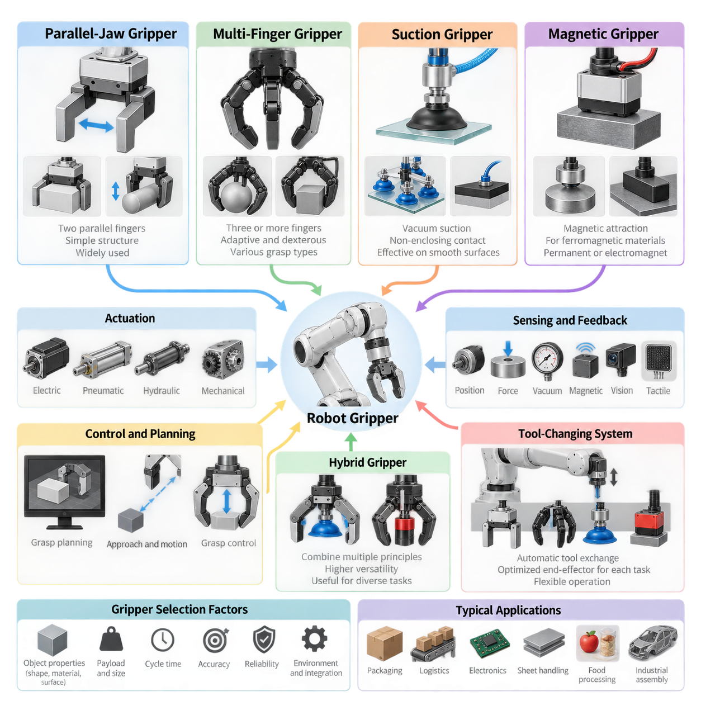
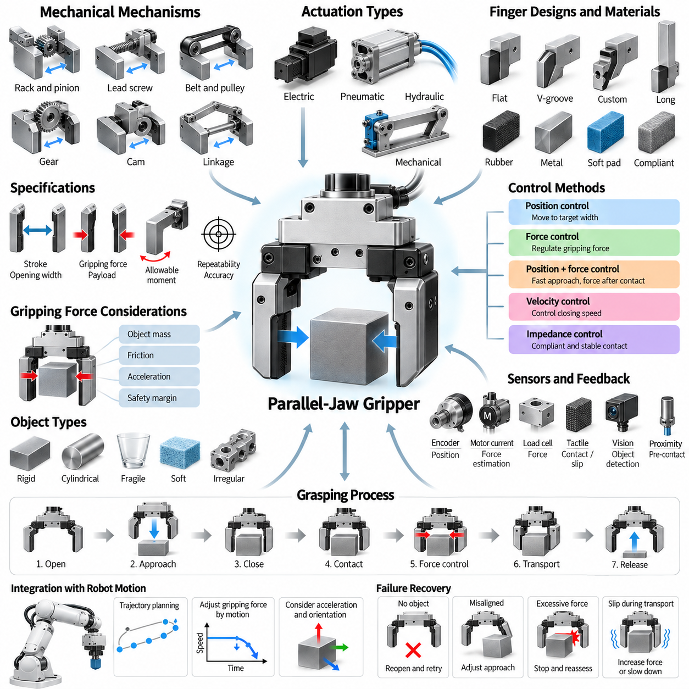
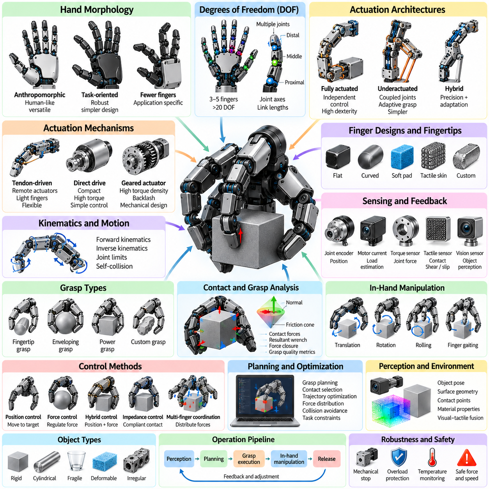
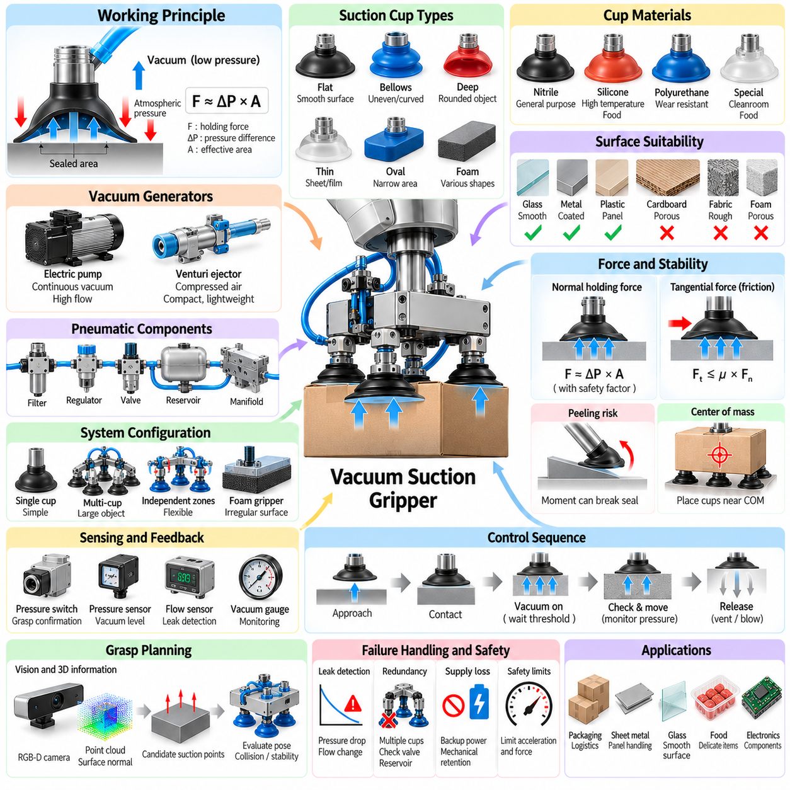
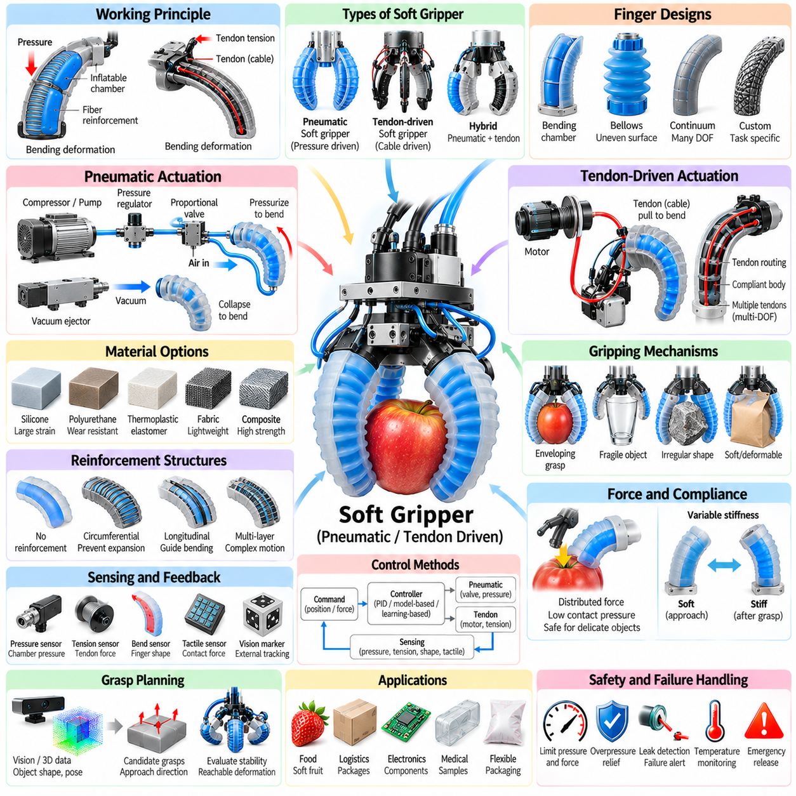
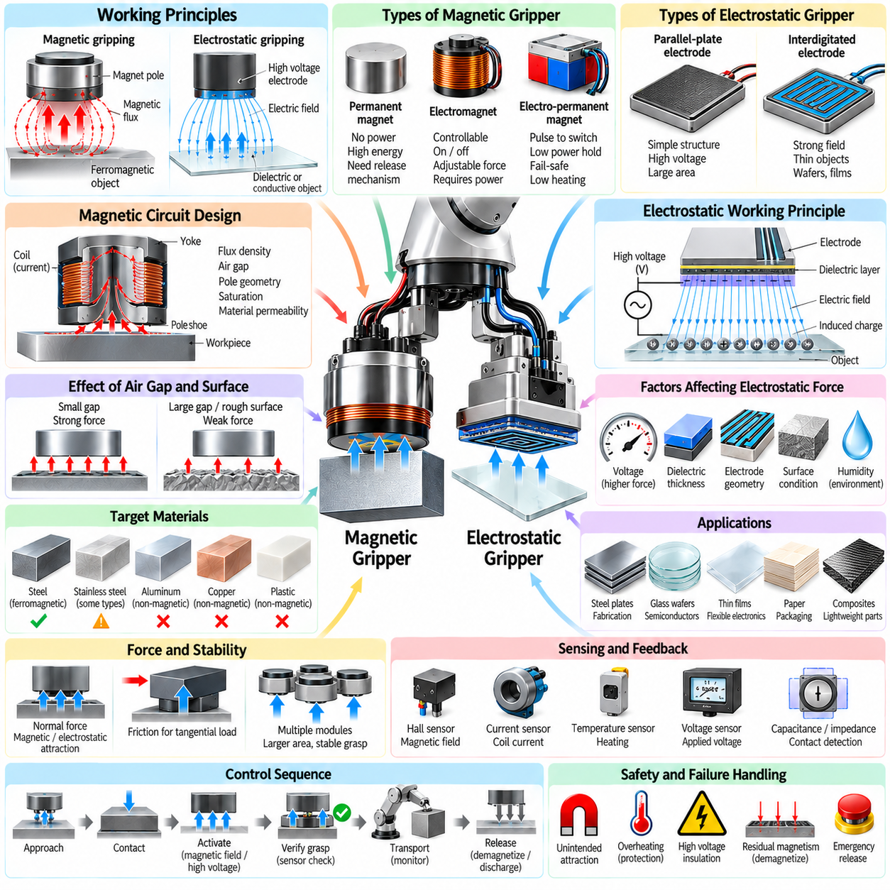
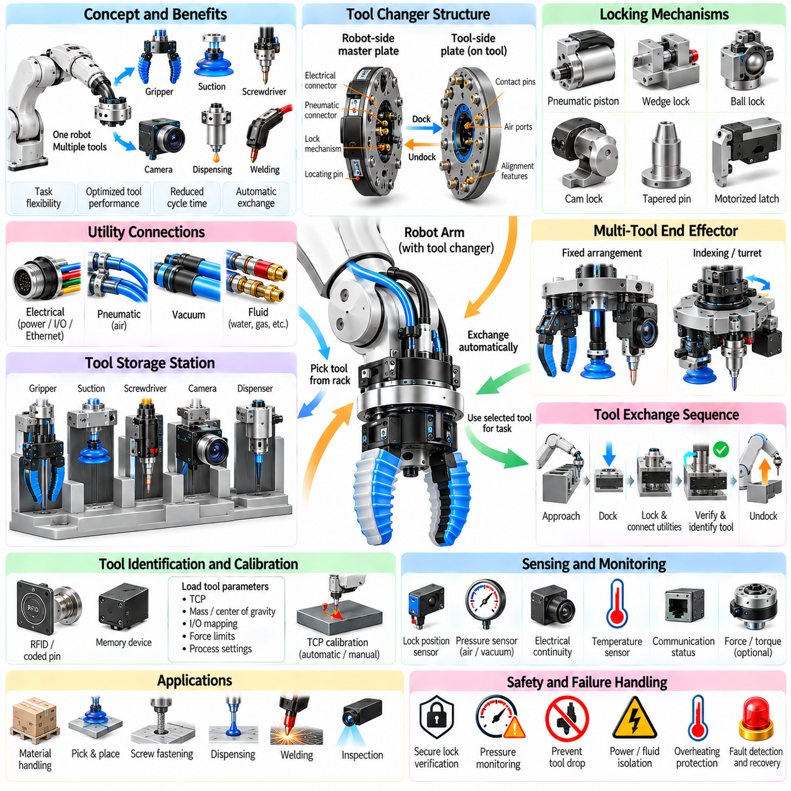
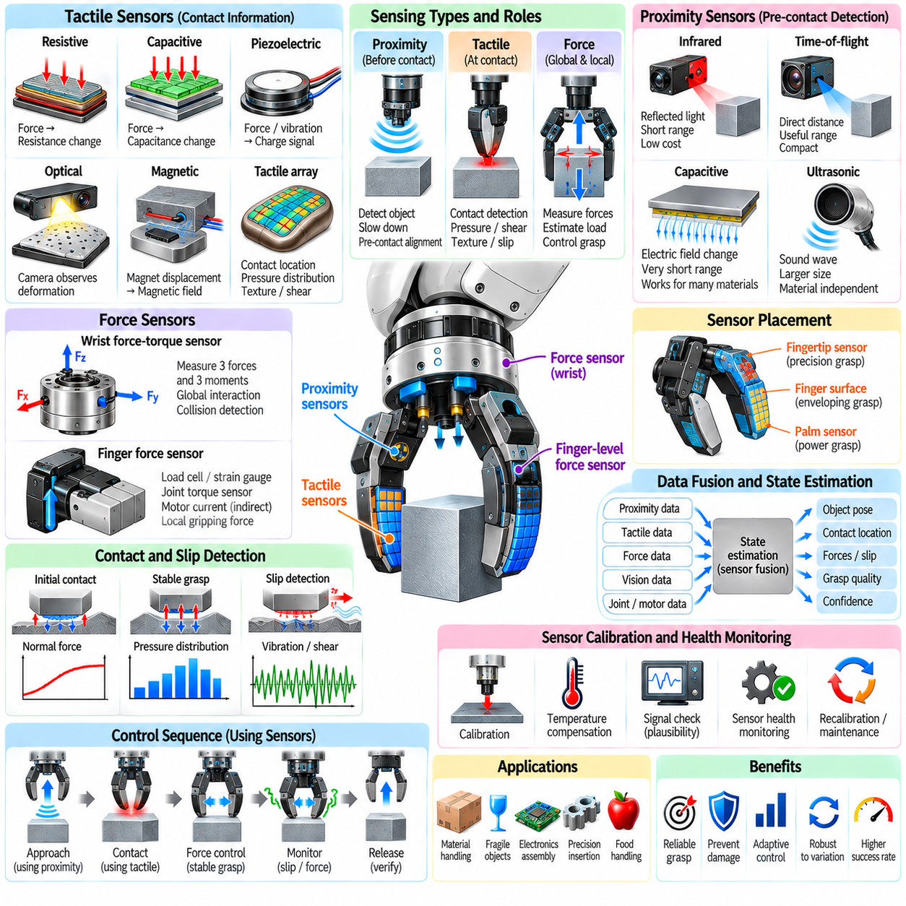
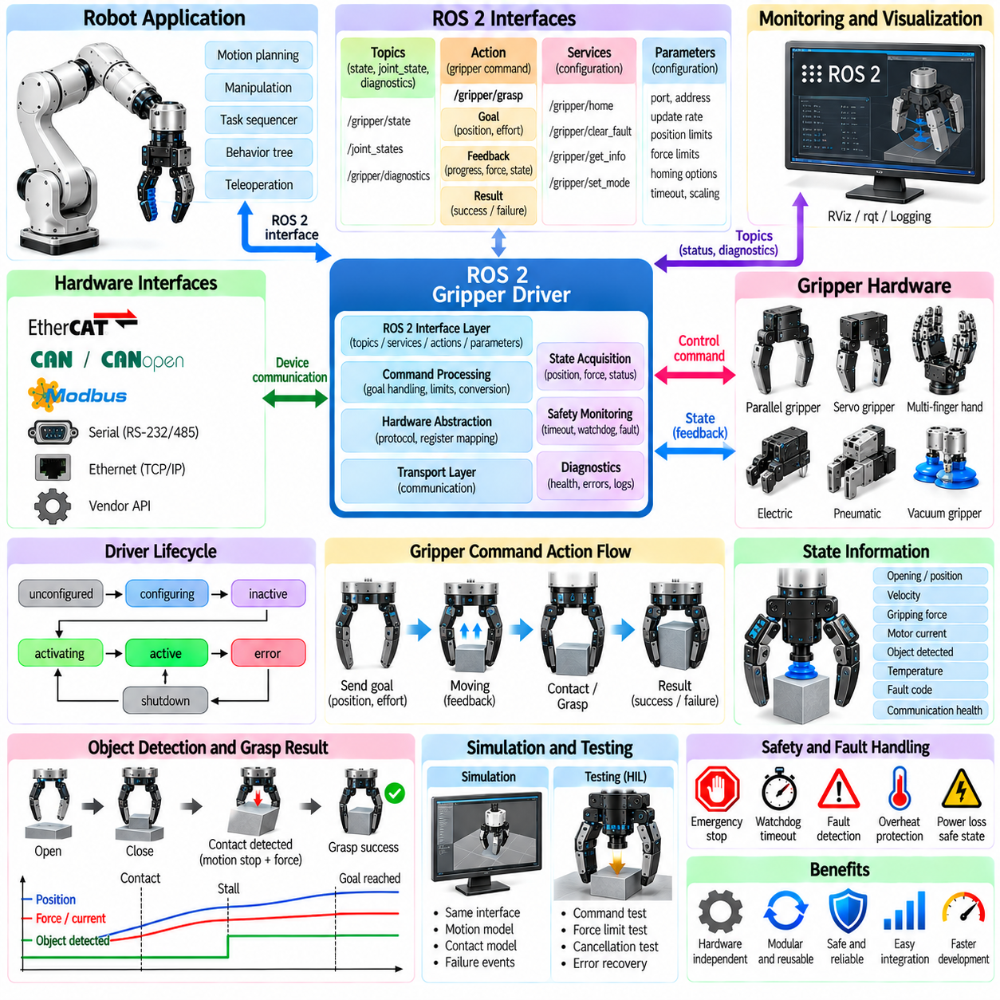
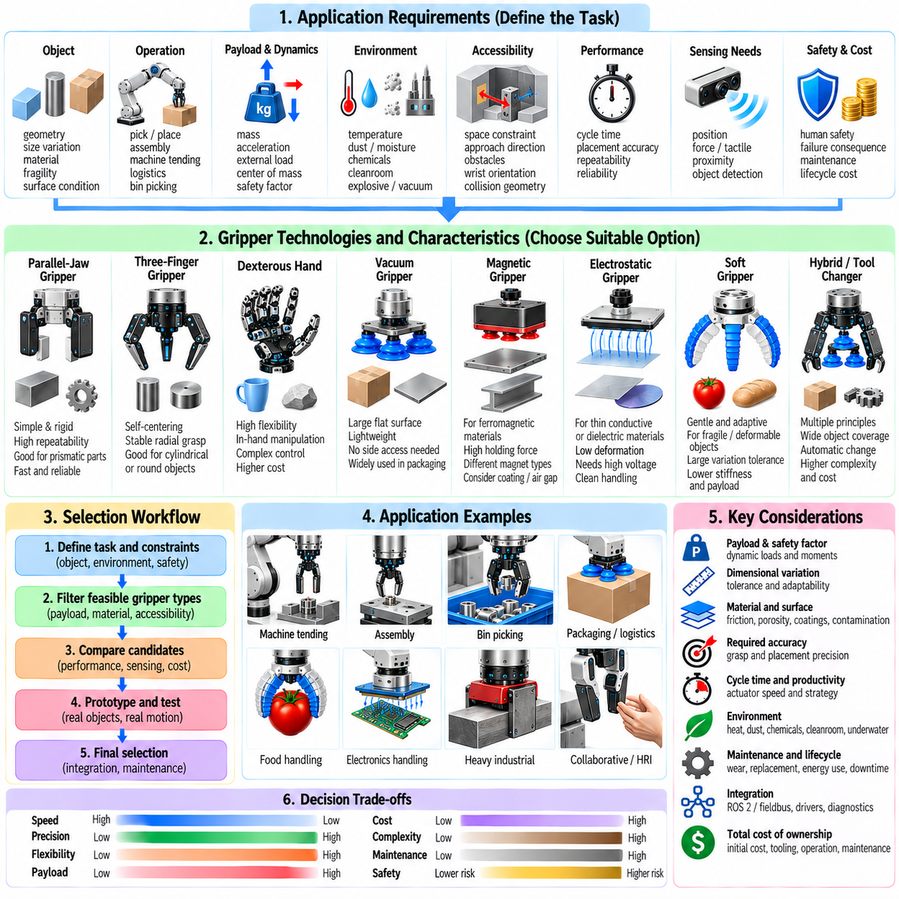

**Volume 17 Manipulation and Grasping AI**

# Chapter 03. Gripper Technologies

## 03.01. Gripper Classification Parallel Multi Finger Suction Magnetic

{width="7.268055555555556in" height="7.268055555555556in"}

Grippers form the physical interface between a robot manipulator and the objects it must handle. Their design determines how forces are transmitted, how accurately objects can be positioned, and how reliably manipulation can continue despite uncertainty in geometry, material, or pose. Grippers are commonly classified by their physical gripping principle, with parallel-jaw, multi-finger, suction, and magnetic mechanisms representing major industrial and robotic categories.

Parallel-jaw grippers use two opposing fingers that move toward or away from each other along approximately parallel trajectories. An object is normally secured by applying compressive forces to opposite surfaces, although internal gripping can also be performed by expanding the fingers against the inside of a cavity. Their simple geometry, predictable contact conditions, and straightforward control make parallel grippers one of the most widely used robotic end-effectors.

A parallel gripper may be driven electrically, pneumatically, hydraulically, or through mechanical transmission from another actuator. Electric designs provide convenient force, position, and velocity control, while pneumatic mechanisms remain attractive for rapid industrial pick-and-place operations. Important specifications include stroke, maximum opening width, gripping force, finger length, payload capability, repeatability, closing speed, and allowable moments at the fingertips.

The mechanical simplicity of parallel grippers also makes grasp planning relatively tractable. A perception system can identify candidate pairs of approximately opposing contact surfaces and determine a gripper pose that places the fingers around them without collision. For many rigid objects, this reduces grasp generation to estimating position, orientation, opening width, approach direction, and required gripping force rather than controlling a large number of independent joints.

Multi-finger grippers extend manipulation capability by introducing three or more fingers, often with multiple joints per finger. Their structure is inspired partly by the human hand, where distributed contacts enable objects to be enclosed, stabilized, rotated, and repositioned. Multi-finger systems range from mechanically coupled three-finger industrial grippers to highly articulated robotic hands containing many independently actuated degrees of freedom.

The primary advantage of multi-finger gripping is adaptability. Several contacts can conform to irregular object geometry and distribute forces across a larger region than a conventional two-finger grasp. Different grasp configurations can be selected for different tasks, including fingertip precision grasping, enveloping power grasps, and intermediate configurations. This flexibility is particularly important in general-purpose manipulation where object geometry cannot be predetermined.

Greater dexterity, however, introduces greater complexity. A multi-finger hand requires decisions about finger configuration, contact location, joint position, contact force, and sometimes internal object motion. The number of possible configurations grows rapidly with the number of joints and contacts. Consequently, practical systems combine kinematic constraints, grasp-quality metrics, tactile sensing, optimization, demonstrations, or learned policies to reduce the effective search space.

Underactuated multi-finger grippers provide an important compromise between simple industrial grippers and fully actuated robotic hands. In these mechanisms, fewer actuators control a larger number of joints through tendons, differential mechanisms, springs, or compliant linkages. When the fingers encounter an object, passive mechanical adaptation allows them to conform to its shape, reducing control complexity while preserving useful geometric adaptability.

Suction grippers use pressure differences to generate holding forces between the end-effector and an object surface. A vacuum source reduces pressure inside a suction cup or chamber, while atmospheric pressure acting externally produces the effective gripping force. Suction systems are especially common in packaging, logistics, electronics, sheet handling, food processing, and automated depalletizing because contact can often be established without enclosing the object.

The effectiveness of suction depends strongly on surface characteristics and sealing quality. Smooth, relatively impermeable surfaces can provide reliable vacuum attachment, whereas rough, porous, contaminated, highly curved, or damaged surfaces may permit leakage. Cup diameter, cup material, vacuum pressure, acceleration, object orientation, center-of-mass offset, and safety factor must therefore be considered when determining whether a suction grasp can support the expected load.

Suction end-effectors can contain a single cup, multiple independently controlled cups, foam vacuum surfaces, or configurable arrays covering large areas. Multi-cup systems can distribute loads and provide redundancy when individual contacts fail. Selective activation also allows the same end-effector to manipulate objects of different dimensions. Vacuum pressure sensors can detect successful attachment, leakage, object loss, or incomplete contact during manipulation.

Magnetic grippers generate attractive forces on ferromagnetic materials and are therefore specialized according to object composition rather than surface sealing or opposing contact geometry. Permanent magnets, electromagnets, and electrically switchable permanent-magnet mechanisms can be used. Magnetic gripping is particularly effective for steel plates, structural components, machine parts, scrap materials, and other objects where accessible surfaces may not support conventional mechanical gripping.

Electromagnetic grippers allow magnetic force to be controlled electrically, enabling straightforward attachment and release, but they consume electrical power while energized and require appropriate safety measures for power failure. Permanent-magnet systems can retain objects without continuous electrical energy, while switchable magnetic mechanisms alter the magnetic flux path to provide controlled gripping and release with relatively low energy consumption.

Magnetic grasp design must account for material permeability, thickness, contact area, air gaps, coatings, surface contamination, temperature, and the geometry of the magnetic circuit. Holding-force ratings measured under ideal laboratory conditions may differ substantially from forces available on real components. Engineers must also consider residual magnetism, attraction of unwanted metallic debris, interference with sensitive equipment, and safe behavior during electrical faults.

These four categories represent different strategies for creating stable physical interaction. Parallel grippers primarily exploit opposing contact forces, multi-finger grippers create distributed and geometrically adaptive contacts, suction grippers exploit differential pressure, and magnetic grippers exploit electromagnetic attraction. No mechanism is universally superior because the appropriate choice depends on object properties, manipulation objectives, operating environment, cycle time, and required reliability.

Object diversity is one of the most important factors in selecting a gripper. A production line handling one rigid component may benefit from a highly optimized parallel or magnetic device, whereas a logistics robot handling thousands of packages may require adaptive fingers or configurable suction arrays. General-purpose robots increasingly require end-effectors that tolerate variations in shape, dimensions, material, orientation, surface condition, and positioning uncertainty.

Gripper selection must also consider the complete manipulator system rather than gripping force alone. End-effector mass reduces available robot payload, while excessive length increases moments at the wrist and may reduce positioning performance. Pneumatic or vacuum lines, electrical cables, communication interfaces, sensors, and tool changers influence mechanical integration. Collision geometry must also be represented accurately in motion planning to ensure safe approach and withdrawal.

Modern grippers increasingly integrate proprioceptive and tactile sensing. Motor current can estimate gripping force, encoders measure finger displacement, vacuum sensors verify suction pressure, and magnetic systems can monitor attachment conditions. More advanced end-effectors incorporate force-torque sensors, tactile arrays, proximity sensing, cameras, or slip detectors. These measurements transform the gripper from a passive mechanical tool into an active source of manipulation-state information.

Feedback enables manipulation to respond to uncertainty after contact occurs. A parallel gripper can increase force when slip is detected, a multi-finger hand can redistribute contact forces, and a suction system can reject a grasp when adequate vacuum is not established. This closed-loop perspective is increasingly important because perception before contact cannot perfectly predict friction, compliance, surface contamination, object deformation, or actual contact geometry.

Hybrid grippers combine multiple physical principles when a single mechanism cannot provide sufficient task coverage. Examples include finger mechanisms equipped with suction cups, magnetic devices combined with mechanical clamps, and adaptive fingers incorporating vacuum channels. Hybridization can increase versatility and provide redundant holding mechanisms, although it also increases mass, mechanical complexity, integration requirements, and the number of failure modes that must be managed.

Tool-changing systems offer another approach to versatility. Instead of designing one universal gripper, a robot can automatically exchange parallel, suction, magnetic, or specialized tools according to the current task. This strategy separates manipulation requirements into optimized end-effectors while preserving robot flexibility. Its suitability depends on tool-change time, docking accuracy, interface standardization, storage requirements, and whether frequent transitions disrupt production efficiency.

The classification of grippers therefore reflects more than mechanical construction. Each category establishes different assumptions about object geometry, contact physics, sensing, control, planning, and failure recovery. Understanding these differences allows a manipulation system to select not simply the strongest available end-effector, but the gripping principle whose physical interaction model best matches the objects, environment, uncertainty, and operational objectives of the robotic task.

## 03.02. Parallel Jaw Gripper Mechanics and Control [w/Code]

{width="7.268055555555556in" height="7.268055555555556in"}

A parallel-jaw gripper is one of the most common robotic end-effectors because it combines mechanical simplicity with predictable grasp behavior. Two opposing fingers translate toward or away from each other while remaining approximately parallel, allowing objects to be constrained between contact surfaces. This geometry is especially suitable for rigid parts whose width, pose, and accessible surfaces can be estimated from perception or known from production data.

The mechanical architecture must convert actuator motion into synchronized displacement of the two fingers. Common mechanisms include rack-and-pinion transmissions, lead screws, ball screws, belts, gears, cams, and linkage systems. Some grippers move both fingers symmetrically around a fixed centerline, while others keep one finger stationary and move the opposite finger. Symmetric motion simplifies object centering and often improves compatibility with automated grasp planning.

Rack-and-pinion mechanisms couple two opposing racks through a central gear so that both fingers move equal distances in opposite directions. This architecture provides compact synchronization and relatively direct force transmission. Screw-driven mechanisms instead convert motor rotation into linear displacement through threaded components. Their transmission ratio can provide high gripping forces and precise positioning, although friction, backlash, speed limits, and mechanical efficiency must be considered.

Parallel grippers can use electric, pneumatic, hydraulic, or mechanically transmitted actuation. Pneumatic cylinders provide rapid motion, high power density, and simple industrial integration, making them common in repetitive manufacturing. Electric grippers provide greater flexibility because motor position, velocity, current, and torque can be controlled electronically. Hydraulic actuation is less common in ordinary manipulation but can be useful where extremely high gripping forces are required.

The gripping force must be sufficient to prevent an object from sliding or rotating during robot motion. For a basic frictional grasp, the required normal force depends on object mass, gravitational loading, acceleration, contact friction, grasp orientation, and safety margin. Dynamic manipulation requires greater force than static holding because translational and rotational accelerations introduce additional inertial loads that must be resisted through the finger contacts.

Excessive gripping force can be as problematic as insufficient force. Fragile packages, electronic assemblies, food products, thin-walled components, and deformable objects may be damaged by large contact pressures. Gripper design therefore involves balancing grasp stability against object protection. Compliant fingertips, elastomer pads, force sensing, current-based force estimation, and controlled actuator torque can help regulate contact forces according to object properties.

Finger geometry strongly influences grasp performance. Flat fingertips provide predictable contact with regular surfaces, while V-shaped grooves can stabilize cylindrical objects by creating multiple contact regions. Custom fingers may conform to specific components and mechanically constrain translation or rotation. Longer fingers improve reach into confined spaces but increase bending moments, compliance, and deflection, potentially reducing positioning accuracy and allowable gripping force.

Contact materials determine friction, compliance, wear, contamination resistance, and sensitivity to surface damage. Rubber or elastomer pads can increase friction and tolerate small geometric errors, while metal fingertips provide durability and dimensional stability. In cleanroom, food, medical, or high-temperature applications, material selection must additionally consider cleanliness, chemical compatibility, sterilization, particle generation, and environmental operating limits.

Gripper stroke defines the range of object widths that can be accommodated. A large stroke increases versatility but often requires a larger mechanism, longer actuation time, or reduced force transmission. Maximum opening width must also account for approach clearance rather than object size alone. During grasp planning, the fingers normally approach with additional clearance and close only after the object lies within the intended capture region.

Payload ratings cannot be interpreted independently of finger length and robot acceleration. Manufacturers often specify allowable forces and moments at defined reference positions because extending fingertips moves the contact point farther from the gripper mechanism. This increases bending moments on guides, bearings, and structural components. A gripper capable of holding a heavy object close to its body may therefore require significant derating when long custom fingers are installed.

Mechanical stiffness affects both grasp stability and manipulation accuracy. Deflection can occur in fingertips, finger mounts, linear guides, transmissions, bearings, and the gripper housing. Under high loads, this compliance changes the actual relationship between commanded finger position and object position. Precision assembly applications therefore require careful structural design, short force paths, low-clearance guides, and calibration of systematic mechanical errors.

Backlash and friction influence position and force control differently. Backlash creates uncertainty when the direction of motion changes, while friction introduces nonlinear resistance that can make actuator torque an imperfect estimate of fingertip force. High-performance electric grippers may compensate through calibrated transmission models, direct force sensors, or closed-loop feedback. Mechanical preload can also reduce backlash, although it may increase friction and energy consumption.

Position control is the simplest operating mode for an electric parallel gripper. The controller commands a desired finger opening and uses encoder feedback to move the mechanism toward that position. This mode is useful when object dimensions are accurately known, but pure position control can produce excessive contact forces if the commanded width is smaller than the actual object or if pose uncertainty causes premature contact.

Force control regulates the interaction after contact rather than simply commanding a final geometric position. The desired gripping force can be estimated from motor current or measured using load cells, strain gauges, force-torque sensors, or fingertip tactile sensors. A closed-loop controller adjusts actuator effort to maintain the required force despite mechanical compliance, object deformation, disturbances, or small changes in contact conditions.

Practical manipulation often combines position and force control. The fingers initially move rapidly under position or velocity control, reduce speed near the expected contact region, detect contact, and then transition to force regulation. This approach provides both efficient cycle time and controlled interaction. Contact detection may rely on motor current, force measurements, velocity deviation, tactile sensing, or differences between commanded and measured actuator motion.

Velocity control is important because closing speed influences impact force and cycle time. High-speed closure improves productivity when objects are well localized, but it increases collision energy if contact occurs unexpectedly. Adaptive strategies can use rapid motion while the fingers are far from the object and progressively reduce velocity near predicted surfaces. Perception uncertainty can be incorporated into the size of this low-speed contact zone.

Modern grippers increasingly use impedance or compliance control to establish a controlled relationship between motion and contact force. Instead of behaving as an ideally rigid position source, the gripper can emulate mechanical stiffness and damping. This allows the fingers to accommodate small alignment errors and object deformation while maintaining stable contact. Such behavior is valuable for uncertain environments and delicate assembly operations.

Sensors provide the feedback required to determine whether a grasp has succeeded. Finger encoders indicate opening width, motor current provides indirect information about load, and force sensors measure contact forces more directly. Tactile sensors can reveal contact distribution, pressure, and incipient slip. Proximity sensors or small cameras may also help detect object position before contact, creating a richer closed-loop grasping process.

Slip detection is particularly important during dynamic manipulation. An object may initially be held successfully but begin moving relative to the fingertips when the robot accelerates, changes orientation, or encounters an external disturbance. Tactile vibration, shear-force variation, visual motion, or changes in finger position can indicate slip. The controller can respond by increasing gripping force, reducing robot acceleration, or placing the object safely.

Gripper control should be coordinated with manipulator motion rather than treated as an isolated subsystem. Robot trajectory planning determines acceleration and orientation, which directly affect the forces required at the contacts. A manipulation controller can therefore adjust gripping force according to predicted dynamic loads. This coordinated approach avoids unnecessarily high forces during gentle motion while maintaining stability during rapid transfers or orientation changes.

Object localization uncertainty must also be considered when selecting the approach pose. If the estimated object position is inaccurate, rigid fingers may collide with an edge instead of surrounding the intended grasp region. Wider initial openings, compliant fingertips, visual servoing, guarded motion, and force-based search strategies can increase tolerance. Parallel-jaw grippers are mechanically simple, but robust operation depends strongly on how perception and motion planning handle uncertainty.

Grasp quality depends on contact placement relative to the object\'s center of mass and possible disturbance directions. Contacts positioned far from the center of mass can generate larger moments under gravity or acceleration, while poorly aligned surfaces may cause rotation during closure. Planning algorithms therefore evaluate collision-free accessibility, contact normals, friction conditions, gripper width, object geometry, and force-closure properties when selecting candidate grasps.

Industrial controllers typically supervise the grasp as a sequence of states rather than a single open-or-close command. The process may include opening verification, approach, controlled closure, contact detection, force establishment, grasp confirmation, transport monitoring, placement, release, and final opening verification. Explicit state supervision makes failures easier to diagnose and enables recovery actions when an object is missing, misaligned, slipping, or improperly released.

Failure recovery is essential for autonomous manipulation. If no object is detected after closure, the robot may reopen and retry using an adjusted pose. If excessive force occurs before the expected contact position, the system can stop and reassess localization. If slip is detected during transport, motion can be slowed or halted. These behaviors convert mechanical gripping into a monitored manipulation process rather than an open-loop action.

The performance of a parallel-jaw gripper ultimately results from the interaction of mechanics, sensing, control, perception, and robot motion. Transmission design determines force and stroke, fingertip geometry establishes contact behavior, sensors expose interaction states, and controllers regulate position and force. When these elements are integrated correctly, a mechanically simple two-finger device can provide precise, reliable, and adaptable manipulation across a wide range of robotic applications.

## 03.03. Multi Finger Dexterous Hand Design and Control [w/Code]

{width="7.268055555555556in" height="7.268055555555556in"}

A multi-finger dexterous hand extends robotic manipulation beyond simple open-and-close gripping by coordinating several articulated fingers around an object. Typical designs use three to five fingers with multiple joints, enabling fingertip, enveloping, and power grasps. The objective is not merely to hold an object, but to regulate its pose, contact forces, and motion while preserving grasp stability under changing task conditions.

Hand morphology strongly determines manipulation capability. Designers must select the number of fingers, phalanges, joints, joint axes, link lengths, fingertip shapes, and palm geometry according to the intended workspace and object range. Anthropomorphic hands imitate aspects of human anatomy for versatility and human-tool compatibility, while task-oriented hands may use fewer fingers or unconventional arrangements to obtain higher robustness with lower mechanical complexity.

The number of degrees of freedom determines how independently the hand can configure its contacts. A highly articulated hand may contain more than twenty joints, creating a large configuration space in which many different postures can realize similar grasps. Additional freedom improves adaptability and in-hand manipulation, but increases actuator count, sensing requirements, calibration effort, computation, mass, and the difficulty of coordinating motions without self-collision.

Actuation architectures can be fully actuated, underactuated, or hybrid. Fully actuated hands assign independent control to most joints and provide maximum dexterity, while underactuated designs mechanically couple several joints to fewer actuators. Tendons, differential mechanisms, elastic elements, and adaptive linkages allow underactuated fingers to conform naturally to object geometry. Hybrid architectures use independent actuation where precision is essential and mechanical adaptation elsewhere.

Tendon-driven systems are particularly attractive when actuators must be located away from the fingers to reduce distal mass and inertia. Cables transmit forces from motors in the palm or forearm to finger joints, approximating biological tendon arrangements. Their disadvantages include cable stretch, friction, hysteresis, routing complexity, tension maintenance, and nonlinear transmission behavior, all of which must be modeled or compensated for accurate position and force control.

Direct-drive and geared joint actuators simplify the relationship between motor motion and joint motion, but fitting motors, transmissions, sensors, and wiring inside compact fingers is difficult. High gear ratios increase torque density but introduce friction and backlash. Compact electric motors combined with harmonic drives, planetary gears, miniature lead screws, or custom transmissions therefore require careful optimization of torque, speed, thermal behavior, efficiency, and mechanical packaging.

Joint kinematics describe how finger joint angles determine fingertip position and orientation. Forward kinematics maps joint configurations into fingertip poses, while inverse kinematics computes configurations required to reach desired contact locations. Because multiple fingers operate simultaneously, the controller must solve several coupled kinematic problems while respecting joint limits, self-collision constraints, object geometry, and feasible contact directions.

Once multiple fingers contact an object, grasp analysis shifts from pure kinematics to contact mechanics. Each contact can transmit forces according to its friction model, surface normal, local curvature, and contact type. The combined contact forces generate a resultant wrench on the object. Stable manipulation requires the hand to produce forces and moments that counter gravity, robot acceleration, external disturbances, and commanded object motion.

Force closure is a fundamental concept for evaluating whether a grasp can resist arbitrary external disturbances within the assumed friction constraints. A set of contacts that geometrically surrounds an object does not automatically guarantee force closure. Contact normals, friction coefficients, finger placement, and available forces determine whether the grasp wrench space contains the combinations required to stabilize the object against disturbances from multiple directions.

Grasp quality metrics help compare candidate finger configurations. Metrics may evaluate the size or isotropy of the grasp wrench space, distance from friction-cone boundaries, required contact forces, resistance to disturbance, manipulability, or sensitivity to localization errors. In practical systems, grasp quality is combined with collision avoidance, reachability, joint limits, actuator capability, and task-specific constraints rather than optimized as an isolated geometric quantity.

Dexterous hands can manipulate an object after grasping it without releasing it completely. This capability, called in-hand manipulation, includes translation, rotation, rolling, pivoting, and controlled sliding between fingertips. Such motions require coordinated changes in joint configuration and contact forces. Contacts may remain fixed, roll across the surface, slide intentionally, or be temporarily released and re-established as the object changes pose.

Finger gaiting extends the reachable in-hand motion by sequentially relocating contacts. One or more fingers maintain object stability while another finger releases, moves to a new location, and establishes a new contact. The procedure resembles walking around the object with the fingertips. Planning finger gaiting is challenging because each intermediate configuration must preserve sufficient stability while avoiding joint limits, collisions, and unreachable contact regions.

Tactile sensing is central to dexterous manipulation because visual perception alone cannot fully determine what happens at the contact interface. Tactile arrays can measure pressure distribution, contact location, shear, vibration, texture, or deformation. These measurements reveal whether a finger has made contact, whether force is distributed appropriately, and whether the object is beginning to slip before gross motion becomes visible to an external camera.

Proprioceptive sensing complements tactile information by measuring the internal state of the hand. Joint encoders provide position, motor currents provide approximate actuator load, and torque sensors can estimate joint interaction forces. Tendon tension sensors are useful in cable-driven systems, while temperature sensing can protect compact actuators. Combining proprioception with tactile and visual sensing provides a more complete estimate of hand-object interaction.

Slip detection is especially important because multi-finger grasps can fail locally before the entire object is lost. Incipient slip may appear as small changes in shear force, high-frequency tactile vibration, contact displacement, or pressure redistribution. A controller can respond by increasing selected normal forces, changing finger posture, reducing manipulator acceleration, or redistributing loads among contacts instead of uniformly increasing force at every finger.

Position control remains useful for free-space finger motion and predefined grasp postures, but contact-rich manipulation requires force-aware control. Pure position control can generate excessive internal forces when several fingers simultaneously constrain the same object. Force control, impedance control, or hybrid position-force control allows the hand to maintain desired contacts while accommodating uncertainty in object dimensions, pose, compliance, and contact geometry.

Impedance control is particularly valuable because it defines a controlled relationship between position error and interaction force. A finger can behave as if it possesses programmable stiffness and damping rather than acting as an infinitely rigid position source. Low stiffness improves compliance during uncertain contact, while higher stiffness can improve object stabilization. Different fingers or motion directions can be assigned different impedance properties according to the manipulation task.

Multi-finger coordination requires separating forces that move the object from internal forces that stabilize the grasp. Object-level forces and moments determine the object\'s acceleration, while internal forces can squeeze the object without changing its net motion. Grasp controllers distribute desired wrenches among fingers while maintaining friction constraints, avoiding excessive pressure, and respecting actuator torque limits. This distribution is often formulated as an optimization problem.

Operational-space and optimization-based controllers provide systematic methods for coordinating many joints. A controller may minimize tracking error, actuator effort, contact-force variation, or deviation from preferred postures while enforcing kinematic and dynamic constraints. Quadratic programming is frequently suitable because contact inequalities, joint limits, friction constraints, and task objectives can be represented within a unified numerical optimization framework.

Perception must estimate not only the global object pose but also local geometry relevant to individual fingers. Surface normals, edges, curvature, material properties, and accessible regions influence contact selection. Vision provides global geometric context, while tactile sensing refines the estimate after contact. This visual-tactile combination allows the robot to correct errors that remain after camera-based localization and adapt its grasp to actual physical interaction.

Learning-based approaches increasingly complement analytical hand control. Demonstrations can teach grasp postures and manipulation sequences, reinforcement learning can discover contact strategies, and learned tactile representations can infer slip or object state. Policies may map visual, proprioceptive, and tactile observations directly to joint commands or higher-level actions. However, learned controllers still benefit from mechanical constraints, safety limits, and model-based stabilization.

Sim-to-real transfer is difficult for dexterous hands because manipulation depends strongly on friction, compliance, actuator dynamics, tactile response, and small geometric details. Simulation models rarely reproduce every contact phenomenon accurately. Domain randomization, system identification, actuator modeling, observation noise, parameter variation, and real-world fine-tuning can reduce this gap by training policies to remain effective across a range of plausible physical conditions.

Mechanical robustness is as important as theoretical dexterity. Fingers repeatedly experience impacts, off-axis loads, cable fatigue, gear wear, and unexpected collisions. Designs must provide mechanical stops, overload protection, replaceable fingertip surfaces, serviceable transmissions, and protected sensor wiring. A hand with slightly fewer degrees of freedom but greater durability may outperform a more complex design in long-duration industrial or field operation.

Calibration is necessary because small joint, tendon, and fingertip errors accumulate across the kinematic chain. Encoder offsets, transmission compliance, cable stretch, sensor bias, and fingertip geometry can cause the estimated contact position to differ from reality. Calibration procedures may combine mechanical reference poses, external vision, force measurements, and tactile contact events to identify parameters and maintain accurate hand models over the operating lifetime.

Safety becomes critical when dexterous hands operate near people or manipulate fragile objects. Controllers should enforce limits on joint torque, fingertip force, velocity, and stored mechanical energy. Collision detection and compliant behavior can reduce injury or damage during unexpected contact. Fault handling must also consider sensor loss, actuator overheating, tendon failure, communication errors, and situations in which the hand cannot safely release an object.

A complete dexterous manipulation system therefore operates through multiple interacting layers. Perception identifies objects and candidate contacts, planning selects grasp and manipulation strategies, kinematics generates feasible finger configurations, force optimization distributes contact loads, and low-level controllers regulate joints and actuators. Tactile and proprioceptive feedback continuously update the estimated interaction state and trigger corrections when reality differs from prediction.

The fundamental design challenge is balancing dexterity against complexity. Increasing fingers, joints, sensors, and actuators expands the manipulation space but also increases computation, calibration, cost, weight, and failure probability. Successful multi-finger hands therefore do not simply maximize degrees of freedom. They combine appropriate morphology, reliable mechanics, multimodal sensing, contact-aware control, and intelligent planning to achieve the level of dexterity actually required by the target tasks.

## 03.04. Vacuum Suction Gripper Design and Control [w/Code]

{width="7.268055555555556in" height="7.268055555555556in"}

A vacuum suction gripper holds an object by creating a pressure difference between a sealed contact chamber and the surrounding atmosphere. Instead of mechanically enclosing the object with fingers, the gripper generates a normal holding force over the effective suction area. This principle enables rapid handling with relatively simple mechanics and is widely used for packaging, logistics, sheet materials, electronics, food products, and automated depalletizing.

The theoretical suction force is approximately determined by the pressure difference multiplied by the effective sealed area. In practice, however, usable holding force is lower because leakage, cup deformation, acceleration, surface roughness, object orientation, and imperfect sealing reduce performance. Engineering calculations therefore apply safety factors and evaluate forces in both normal and tangential directions rather than relying only on nominal vacuum pressure.

Vacuum level is commonly expressed as pressure below atmospheric pressure. Increasing the pressure difference generally increases holding force, but extremely high vacuum does not automatically produce a better system. Vacuum generation requires energy, and flexible objects may deform under excessive differential pressure. Designers therefore select the vacuum level according to object mass, available contact area, leakage characteristics, required acceleration, and allowable surface deformation.

The suction cup is the primary mechanical interface between the vacuum system and the object. Cup diameter determines the nominal contact area, while geometry determines how well the cup adapts to surface shape. Flat cups are effective on smooth planar surfaces, bellows cups tolerate height variation and curved surfaces, and deep cups can conform to rounded objects. Specialized cups are available for thin sheets, bags, food, glass, and electronic components.

Cup material influences sealing, friction, wear, temperature resistance, chemical compatibility, and contamination. Common elastomers include nitrile rubber, silicone, polyurethane, and specialized compounds for food or clean environments. Soft materials conform effectively to roughness and curvature but may deform under lateral loads. Harder materials preserve geometry and resist wear but require more accurate alignment and better surface conditions to establish a reliable seal.

Surface properties often determine whether vacuum gripping is feasible. Glass, coated metal, plastic panels, and smooth packaging usually permit strong seals, whereas porous cardboard, textiles, foam, unfinished wood, or rough cast surfaces continuously admit air. Vacuum systems for porous materials must provide sufficient flow to maintain negative pressure despite leakage, making pump capacity and flow rate as important as the maximum achievable vacuum level.

Vacuum can be generated by electrically driven pumps or pneumatic ejectors. Electric vacuum pumps are suitable when continuous vacuum and centralized supply are required. Venturi ejectors use compressed air flowing through a restriction to create negative pressure and are compact, lightweight, and easy to mount near the gripper. Their disadvantages include compressed-air consumption, noise, and potentially lower overall energy efficiency during continuous operation.

Vacuum generators must be selected according to both pressure and volumetric flow requirements. A nearly airtight surface requires relatively little continuous airflow after evacuation, while porous objects may demand substantial flow throughout the grasp. Evacuation time also affects robot cycle time. Large internal volumes, long hoses, or oversized cups require more air removal, so minimizing dead volume can significantly improve response and reduce energy consumption.

Hoses, fittings, valves, manifolds, filters, and reservoirs form the pneumatic network connecting the vacuum generator to the cups. Pressure losses and leakage within this network can reduce available performance. Short hoses and appropriately sized flow paths improve response. Filters protect pumps and ejectors from dust and particles, while vacuum reservoirs can temporarily maintain holding force during supply fluctuations or brief interruptions.

A single suction cup provides a compact contact but concentrates load at one region. Multi-cup grippers distribute forces across a larger object and can improve resistance to rotation. Arrays are particularly useful for boxes, sheets, panels, and objects with uncertain pose. Independently controlled vacuum zones allow unused cups to be isolated so that an uncovered cup does not become a major leakage path for the entire system.

Foam vacuum grippers provide a compliant sealing surface containing many small suction openings. They are useful for objects whose exact geometry or position varies because the foam conforms to local surface differences. Check valves or flow restrictors can automatically limit leakage through openings that are not covered by the object. Such designs are common in logistics applications where one end-effector must handle packages of many dimensions.

The center of mass should be considered when selecting suction contact locations. If the resultant holding force does not pass near the object\'s center of mass, gravitational and inertial loads create moments that can peel the cup from the surface. Multiple cups can be arranged to create a wider support polygon and resist these moments. Grasp planners therefore evaluate not only free surface area but also load distribution and rotational stability.

Tangential loading is often limited by friction between the suction cup and object surface. Although vacuum produces a normal force, rapid horizontal acceleration can cause sliding if friction is insufficient. The allowable tangential force depends on the normal holding force and effective friction coefficient. Wet, dusty, oily, or low-friction surfaces may substantially reduce resistance even when the measured vacuum pressure indicates a strong seal.

Peeling represents a particularly dangerous failure mode because suction cups are usually more resistant to direct normal separation than to edge lifting. Moments generated by offset loads can progressively break the seal from one side. Flexible cups, suitable cup placement, reduced acceleration, and multiple contact points help prevent peeling. Robot trajectory planning should therefore account for orientation and acceleration rather than assuming constant suction capability.

Object deformation must be considered when handling thin or compliant materials. Strong vacuum can bend sheet metal, distort plastic packaging, collapse cartons, wrinkle films, or damage food products. Increasing cup area while reducing pressure difference can sometimes produce the required total holding force with lower local stress. Distributed multi-cup or foam systems are also useful for reducing deformation by spreading the load over a wider region.

Vacuum sensing provides essential information for closed-loop gripping. Pressure switches can produce simple grasp-confirmation signals, while analog pressure sensors provide continuous measurements of vacuum level. Flow sensors can help distinguish a properly sealed grasp from excessive leakage. Combining pressure and flow information is particularly useful for porous materials because a stable grasp may involve significant airflow while maintaining adequate negative pressure.

A typical control sequence begins with the cup approaching the target surface while the vacuum source remains ready or partially activated. After contact, vacuum is established and the controller waits until pressure reaches a predefined threshold. Only then is object transport permitted. During motion, vacuum is continuously monitored, and the controller releases the object by venting the cup or applying a short positive-pressure pulse to accelerate separation.

Contact detection can be achieved mechanically or pneumatically. A compliant cup may compress when it touches the surface, while spring-loaded mounts can provide measurable displacement. Pressure changes can also indicate sealing. Vision and proximity sensing can estimate the final approach distance before contact. Combining these methods reduces impact and helps establish a seal when object height or orientation is not perfectly known.

Vacuum thresholds should not be treated as universal constants. The required pressure depends on cup area, object mass, orientation, acceleration, number of active cups, and safety factor. Adaptive control can therefore compute or select different thresholds for different objects and trajectories. A heavy object undergoing rapid acceleration may require a larger pressure margin than a lightweight object transported slowly in a favorable orientation.

Leak detection is fundamental to reliable operation. A gradual pressure decrease may indicate cup wear, contamination, hose damage, or partial seal loss, while a sudden pressure change can indicate object detachment. Controllers can monitor pressure derivatives, flow rates, evacuation time, and steady-state vacuum. These signals enable predictive maintenance as well as immediate grasp-failure detection during autonomous operation.

Energy efficiency can be improved by controlling vacuum generation according to demand. Instead of operating a pump or ejector continuously at maximum output, the controller can stop or reduce generation after sufficient vacuum has been established and restart when pressure falls below a lower threshold. Reservoirs and check valves support this hysteresis-based operation. Pneumatic ejectors can also be switched individually when multiple vacuum zones are used.

Redundancy improves safety when dropping an object would be hazardous. Multiple independent cups, separate vacuum circuits, non-return valves, reservoirs, and backup power can preserve holding capability after a single failure. Safety design must consider the consequences of electrical or compressed-air loss. For overhead handling, additional mechanical retention or certified safety components may be necessary because vacuum alone can disappear after supply failure.

Grasp planning for suction differs from finger grasp planning because the primary objective is to identify surfaces capable of forming a seal. Vision systems can estimate surface normals, curvature, boundaries, obstacles, and local roughness from RGB-D images or 3D point clouds. Candidate suction poses are evaluated according to cup clearance, sealable area, surface orientation, center-of-mass relationship, collision risk, and expected mechanical stability.

Learning-based suction planning can complement geometric methods when surface quality is difficult to model analytically. Neural networks can predict suction success directly from depth images, point clouds, or RGB-D observations using training examples of successful and failed grasps. These predictions are often combined with geometric constraints so that learned confidence does not override obvious collision, reachability, or cup-size limitations.

The robot trajectory after grasping remains part of suction control. Acceleration, jerk, orientation changes, and rotational motion alter the load experienced by the cups. A trajectory that is feasible for the manipulator may still cause suction failure. Integrated planning can limit acceleration or modify orientation based on estimated grasp strength, allowing the robot to move rapidly when margins are large and conservatively when suction stability is uncertain.

Reliable vacuum manipulation ultimately depends on integrating contact mechanics, pneumatic design, sensing, perception, planning, and robot control. Cup geometry establishes the physical interface, the vacuum generator supplies pressure and flow, sensors reveal seal quality, and the controller supervises attachment throughout the task. When these elements are designed together, suction grippers provide fast, lightweight, adaptable handling across a remarkably broad range of robotic applications.

## 03.05. Soft Gripper Pneumatic Tendon Driven [w/Code]

{width="7.268055555555556in" height="7.268055555555556in"}

Soft grippers use compliant structures rather than rigid links and joints to establish contact with objects. Their fingers deform continuously around surfaces, allowing a relatively simple actuator command to generate adaptive grasp geometry. This mechanical compliance makes soft grippers particularly suitable for fragile, irregular, deformable, or uncertain objects that may be difficult to handle safely with conventional rigid parallel-jaw or articulated grippers.

The fundamental advantage of a soft gripper is passive adaptation. When a compliant finger encounters an object, its shape changes according to contact forces instead of forcing the object to match a predetermined finger trajectory. This behavior distributes pressure over larger areas and reduces sensitivity to localization error. As a result, accurate geometric models and millimeter-level positioning are often less critical than in rigid grasping systems.

Soft grippers can be classified by their actuation principle, with pneumatic and tendon-driven mechanisms representing two major architectures. Pneumatic soft fingers deform when internal chambers are pressurized or evacuated, whereas tendon-driven fingers bend when cables apply tension through compliant structures. Both approaches exploit structural deformation, but they differ significantly in force generation, response, sensing, packaging, control, and energy requirements.

Pneumatic soft actuators commonly use elastomeric chambers whose geometry produces preferential deformation under pressure. One side of a finger may be more extensible than another, causing the structure to bend as internal pressure increases. Chamber dimensions, wall thickness, reinforcement layers, material stiffness, and pressure determine the resulting curvature. This converts relatively simple pressure regulation into complex but useful grasping motion.

Fiber reinforcement can constrain unwanted expansion and redirect pneumatic deformation. Circumferential fibers may prevent radial ballooning, while longitudinal reinforcements limit extension along selected directions. By designing these constraints appropriately, an actuator can bend, twist, extend, contract, or combine several deformation modes. Soft gripper mechanics are therefore determined not only by material properties but also by the architecture of embedded reinforcement.

Positive-pressure actuators are widely used because they can generate substantial deformation with straightforward pneumatic hardware. Vacuum-driven soft actuators provide an alternative in which internal structures collapse when pressure is reduced. Vacuum actuation can offer inherently bounded deformation and may reduce the risk associated with overinflation. However, achievable motion and force depend strongly on internal geometry and resistance to structural collapse.

Tendon-driven soft grippers use flexible cables routed through or along compliant fingers. Pulling a tendon generates bending moments that curve the finger toward the object, while elastic restoration or antagonistic tendons return the finger when tension decreases. Motors can be located in the palm, wrist, or forearm, reducing distal mass. Tendon routing determines how actuator displacement is transformed into distributed finger curvature.

A single tendon can produce coordinated bending across several compliant segments, creating mechanical underactuation. When one part of the finger contacts an object, remaining segments can continue moving and wrap around the surface. This enables adaptive enveloping grasps with relatively few motors. Multiple tendons can provide independent control of bending direction, stiffness, or individual finger regions, although routing and control complexity increase accordingly.

Material selection is fundamental because the body of a soft gripper simultaneously acts as structure, transmission, and contact interface. Silicone elastomers are widely used because they support large strains and can be molded into complex pneumatic geometries. Thermoplastic elastomers, polyurethane, fabrics, flexible polymers, and composite structures are also used. Material stiffness, fatigue life, tear resistance, friction, temperature stability, and manufacturability must be balanced.

Hyperelastic materials exhibit nonlinear stress-strain behavior, so conventional linear elasticity is often inadequate for predicting soft finger deformation. Models such as Neo-Hookean, Mooney-Rivlin, or Ogden formulations can represent large deformation more realistically. Finite element analysis is frequently used to estimate pressure-curvature relationships, stress concentrations, contact behavior, and structural limits before prototypes are manufactured and experimentally characterized.

Soft gripper fabrication techniques include casting, additive manufacturing, lamination, textile integration, and hybrid assembly. Molded elastomers provide smooth compliant chambers but require careful control of wall thickness and bonding. Multi-material additive manufacturing enables complex internal channels and stiffness gradients. Fabric-based pneumatic actuators can provide lightweight structures with constrained deformation, while rigid inserts can reinforce mounting and load-transfer regions.

Gripping force depends on actuator pressure or tendon tension, finger geometry, material stiffness, contact area, friction, and deformation state. Unlike rigid grippers, the relationship between actuator input and fingertip force is usually highly nonlinear. Increasing pressure may initially produce large motion and later primarily increase contact force. Tendon tension may similarly redistribute deformation after contact, making accurate force estimation dependent on the current configuration.

Compliance reduces peak contact pressure by distributing loads across a larger surface. This property is valuable for fruit, baked goods, medical samples, flexible packaging, textiles, and other delicate products. However, excessive softness can reduce payload and positioning accuracy. A successful design must therefore balance conformity with sufficient structural stiffness to resist gravity, acceleration, external disturbances, and object rotation during transport.

Variable-stiffness mechanisms can address this tradeoff by allowing a gripper to remain soft during approach and become stiffer after establishing contact. Techniques include granular jamming, layer jamming, tendon pretension, pneumatic stiffening, low-melting-point materials, and mechanically constrained structures. Variable stiffness can improve load capacity and manipulation precision while preserving the safety and adaptability associated with compliant contact.

Pneumatic control typically regulates pressure or airflow using proportional valves, pressure regulators, pumps, compressors, or ejectors. Simple systems command a fixed pressure for closing and release pressure for opening. More advanced systems use pressure sensors and closed-loop control to regulate actuator state. Because compressible air introduces delay and nonlinear dynamics, valve flow characteristics, hose volume, leakage, and pressure propagation affect response performance.

Tendon-driven control usually regulates motor position, velocity, torque, or cable tension. Position control can reproduce approximate finger curvature in free space, while tension control becomes more useful after contact. Cable stretch, friction, routing curvature, and hysteresis make motor position an imperfect representation of finger shape. Load cells or inline tension sensors can provide direct feedback for regulating tendon forces and detecting unexpected contact conditions.

Shape sensing is challenging because soft fingers do not possess discrete joint angles that fully describe configuration. Flexible bend sensors, strain gauges, fiber-optic sensors, magnetic sensors, embedded liquid-metal channels, and vision-based markers can estimate curvature or deformation. External cameras can also reconstruct finger shape. Combining shape sensing with actuator pressure or tendon tension provides richer state estimation for closed-loop manipulation.

Tactile sensing can be integrated into compliant fingertips or finger surfaces to measure contact location, pressure distribution, shear, and slip. Because the gripper itself deforms significantly, tactile measurements must often be interpreted together with finger shape. Distributed sensing is particularly valuable when the contact region cannot be predicted in advance. It allows the controller to distinguish successful wrapping from incomplete or asymmetric contact.

Control of a soft gripper is often divided into free-space deformation and contact regulation. During approach, actuator commands produce a desired open configuration. After the object enters the grasp region, pressure or tendon tension increases until contact is detected. The controller then regulates force, pressure, tension, or deformation to maintain stable contact without exceeding limits that could damage either the object or the gripper.

Model-based control is difficult because soft-body dynamics contain large deformation, nonlinear elasticity, hysteresis, contact, friction, and pneumatic or tendon transmission effects. Reduced-order models can approximate the gripper using constant-curvature segments, pseudo-rigid-body models, Cosserat rods, or learned mappings between actuator input and shape. These representations sacrifice some physical detail in exchange for computational efficiency suitable for real-time control.

Data-driven models provide another approach when analytical modeling becomes impractical. Experimental data can be used to learn relationships between pressure, tendon tension, observed deformation, contact state, and resulting force. Neural networks, Gaussian processes, or other regression models can approximate complex actuator behavior. Learned models are especially useful when combined with physical constraints that prevent unsafe commands or unrealistic extrapolation.

Grasp planning for soft grippers differs from rigid contact planning because exact fingertip locations may be less important than identifying a region in which deformation will naturally produce a stable enclosure. Planners can consider object size, approximate shape, approach direction, available wrapping length, and collision clearance. Mechanical compliance can absorb moderate pose errors, reducing perception requirements while increasing the importance of reachable deformation.

Soft grippers are particularly effective for objects with uncertain or variable geometry. Agricultural robots can handle fruits and vegetables whose size and shape differ from specimen to specimen, while logistics systems can manipulate bags and flexible packages. Food-processing robots benefit from distributed contact forces, and healthcare or assistive systems can exploit compliance to reduce contact hazards when interacting with people or sensitive materials.

The same compliance that provides safety can also create limitations. Soft grippers generally offer lower positional precision, reduced payload-to-size ratio, slower dynamic response, and more difficult state estimation than rigid mechanisms. Elastomers may fatigue, tear, puncture, creep, or change stiffness with temperature and aging. Pneumatic leaks and tendon wear introduce additional maintenance concerns that must be addressed for industrial deployment.

Failure detection should therefore monitor actuator and structural condition as well as grasp success. Abnormal pressure decay can indicate pneumatic leakage, while unexpected tendon displacement or tension can reveal cable stretch, breakage, or routing problems. Changes in the relationship between actuator input and measured deformation may indicate material degradation. Continuous monitoring enables maintenance before a gradual mechanical problem becomes a complete grasp failure.

Hybrid soft-rigid grippers combine compliant fingers with rigid frames, joints, fingertips, or support structures. Rigid components provide accurate mounting, load transmission, and controlled workspace boundaries, while soft sections adapt to object geometry. Pneumatic deformation can also be combined with tendon actuation so that pressure establishes basic finger shape and tendons refine contact force or stiffness. Such hybridization expands the achievable design space.

Safe control requires limits on pneumatic pressure, tendon tension, deformation, actuator temperature, and contact force. Mechanical pressure relief, tendon clutches, software limits, and emergency release mechanisms can prevent damage after sensor or controller faults. When handling people, biological materials, or valuable fragile objects, safety should be evaluated at the complete system level, including robot motion and not merely the compliant gripper.

The design of a soft gripper ultimately requires coordinated consideration of morphology, material mechanics, actuation, sensing, control, and the target object population. Pneumatic architectures offer lightweight distributed deformation, while tendon-driven systems provide compact remote actuation and controllable tension. By exploiting compliance as an intentional mechanical function, soft grippers transform uncertainty from a purely control problem into something that can partly be resolved by the physical structure itself.

## 03.06. Magnetic and Electrostatic Gripper Design

{width="7.268055555555556in" height="7.268055555555556in"}

Magnetic and electrostatic grippers generate attractive forces without mechanically enclosing an object between opposing fingers. Magnetic grippers interact primarily with ferromagnetic materials, while electrostatic grippers use electric fields to attract conductive or dielectric surfaces. Both approaches can produce compact end-effectors with few moving parts, making them useful when rapid attachment, limited access, thin objects, or delicate surfaces complicate conventional mechanical grasping.

Magnetic gripping relies on a magnetic flux path passing through the target material. When a ferromagnetic object becomes part of the magnetic circuit, attractive force develops across the interface between the gripper pole and the object. The achievable force depends on magnetic flux density, contact area, material permeability, air gap, pole geometry, saturation, and surface condition. Small gaps can dramatically reduce force because air has much greater magnetic reluctance than steel.

Permanent-magnet grippers provide holding force without continuous electrical power. High-energy permanent magnets generate a persistent magnetic field, making these grippers attractive for energy-efficient handling and applications where an object should remain attached during power loss. However, attachment and release require a mechanism that changes the magnetic circuit, physically separates the magnet, or redirects flux away from the workpiece rather than simply switching electrical current off.

Electromagnetic grippers generate magnetic flux by passing current through a coil around a magnetic core. Their principal advantage is controllability because the magnetic field can be activated, adjusted, and removed electrically. Coil current determines magnetomotive force, but increasing current also increases resistive heating. Electromagnet design therefore requires coordinated optimization of coil turns, conductor size, voltage, current, core material, thermal dissipation, and allowable duty cycle.

Electro-permanent magnets combine permanent magnetic materials with electrically controlled switching. A short current pulse changes the magnetic state or redirects the flux path, after which the gripper can maintain holding force with little or no continuous power. This architecture combines energy-efficient holding with electrical release control and is valuable when fail-safe retention, reduced heating, and low steady-state energy consumption are important system requirements.

Magnetic circuit design determines how efficiently available magnetic energy reaches the target object. Ferromagnetic cores, back irons, pole shoes, and flux guides provide low-reluctance paths, while unintended air gaps increase reluctance and leakage. Pole geometry can be optimized to distribute flux over the contact region and reduce local saturation. Finite element magnetic analysis is often used to evaluate flux density, leakage, saturation, and resulting attraction forces.

The target material strongly influences magnetic gripping performance. Low-carbon steel generally provides an effective flux path, whereas aluminum, copper, most plastics, composites, and many stainless steels cannot be handled by ordinary magnetic attraction. Even compatible steels differ in permeability and saturation behavior. Material thickness also matters because a thin sheet may saturate before the gripper reaches its theoretical force, limiting additional benefit from stronger excitation.

Surface coatings, rust, paint, oxide layers, debris, curvature, and roughness create effective air gaps between magnetic poles and the workpiece. Because magnetic force is highly sensitive to gap size, a gripper that performs well on clean machined steel may provide much lower force on painted or irregular components. Compliant pole mounts or articulated magnetic modules can improve contact by adapting to local geometry and reducing unintended separation.

Magnetic grippers must resist not only normal separation but also tangential sliding and rotational moments. Magnetic attraction primarily generates a normal force, while resistance to lateral motion depends on interface friction and mechanical geometry. Large sheets or offset payloads can generate substantial moments. Multiple magnetic modules distributed around the center of mass can improve load sharing and rotational stability while reducing local structural stress.

Residual magnetism can complicate object release. After the magnetic field is removed, ferromagnetic materials may retain enough magnetization to remain weakly attached or attract nearby particles. Electromagnetic systems can apply a short reverse-current pulse to accelerate demagnetization. Mechanical ejectors, springs, or air jets can also assist separation. Release reliability should therefore be designed explicitly rather than assuming that removing excitation guarantees immediate detachment.

Thermal management is particularly important for continuously energized electromagnets. Copper losses increase approximately with the square of coil current, while core losses may become relevant under rapidly varying excitation. Excessive temperature can damage insulation, reduce magnet performance, alter resistance, or affect nearby sensors. Temperature sensing, current limits, heat sinks, conductive mounting structures, and duty-cycle management help maintain safe operating conditions.

Electrostatic grippers operate through electric-field attraction rather than magnetic flux. Electrodes embedded in or mounted beneath an insulating surface are driven by high voltage, producing electric fields that polarize or induce charge in the target object. The resulting electrostatic force can hold thin conductive or dielectric materials with very small mechanical deformation. This makes electroadhesion attractive for wafers, films, fabrics, paper, glass, and composite sheets.

A common electrostatic design uses interdigitated electrodes arranged as alternating conductive traces. Applying opposite electrical potentials creates fringing electric fields that extend beyond the gripper surface and interact with the object. Electrode width, spacing, voltage, dielectric thickness, permittivity, contact area, and object properties determine the generated force. Fine electrode patterns can improve field distribution but increase manufacturing and insulation requirements.

Electrostatic attraction generally requires high voltage but very low current. Consequently, steady-state electrical power can be relatively small compared with electromagnetic systems, although specialized high-voltage electronics are required. The power supply must provide controlled charging and discharging while maintaining electrical isolation. Current limiting is essential so that stored electrical energy remains controlled during faults, contact events, or dielectric breakdown.

Conductive objects can develop induced surface charge rapidly, while dielectric objects respond through polarization and charge accumulation. The physical mechanisms may include Coulomb attraction, dielectric polarization, and surface charge effects depending on materials and electrode configuration. Accurate prediction is difficult because humidity, contamination, surface resistivity, dielectric properties, and microscopic contact conditions can significantly influence electroadhesive performance.

The electrostatic holding force is strongly related to electric-field strength and effective contact area. Increasing voltage generally increases attraction, but dielectric breakdown limits the usable field. Thin dielectric layers improve coupling but must withstand mechanical wear and electrical stress. Designers therefore balance voltage, insulation thickness, electrode geometry, surface compliance, and safety margin to obtain useful force without damaging the gripper or target material.

A compliant electroadhesive surface can improve performance by increasing real contact area. Thin objects may appear geometrically flat while containing waviness, roughness, or local height variation that creates microscopic gaps. Flexible electrode substrates and soft dielectric layers can conform to these variations. Unlike suction, electrostatic gripping does not require an airtight seal, which can make it attractive for porous materials or surfaces containing small openings.

Environmental conditions have a significant effect on electrostatic gripping. Humidity can change surface conductivity and charge dissipation, while dust and contamination can modify dielectric behavior or create leakage paths. Temperature can alter material resistivity and dielectric properties. Industrial electrostatic grippers therefore require validation across realistic environmental ranges rather than characterization only under controlled laboratory conditions.

Release control is a major design consideration for electrostatic systems because stored or trapped charge can continue attracting an object after the applied voltage is removed. Controlled discharge circuits can reduce electrode potential, while polarity reversal may accelerate charge neutralization in some configurations. Grounding strategies and release timing must account for both the gripper and object so that residual electrostatic attraction does not disrupt placement accuracy.

Sensing improves reliability for both magnetic and electrostatic grippers. Magnetic systems can monitor coil current, temperature, Hall-effect measurements, flux, or mechanical proximity to infer attachment quality. Electrostatic systems can monitor voltage, charging current, leakage current, capacitance, or impedance. These signals can reveal incomplete contact, unexpected gaps, insulation degradation, contamination, or object loss before a complete handling failure occurs.

Grasp confirmation should therefore combine actuator state with physical evidence of attachment. Commanding an electromagnet on or applying electrostatic voltage does not prove that an object has been captured. A magnetic sensor, force measurement, proximity signal, electrical response, or robot load estimate can provide confirmation. Redundant indicators become particularly important when the robot lifts heavy components or operates above people and equipment.

Control sequences typically include approach, contact establishment, activation, attachment verification, transport monitoring, placement, controlled deactivation, and release verification. The robot should not begin high-acceleration motion until sufficient holding capability has been confirmed. During transport, the controller can reduce speed or stop if electrical, thermal, or force measurements indicate degrading attachment. Explicit release verification prevents unintended double picking or object carryover.

Grasp planning must consider material compatibility in addition to geometry. A visually suitable steel surface may be too thin, curved, coated, or distant from the center of mass for reliable magnetic gripping. An electrostatic candidate may have insufficient area or unsuitable dielectric properties. Planning systems can therefore combine object recognition, material information, surface geometry, accessibility, center-of-mass estimation, and predicted holding-force margins.

Magnetic and electrostatic grippers are especially useful for sheet handling because they can contact one broad surface without requiring fingers to reach around object edges. Magnetic systems are effective for steel plates and fabricated components, while electrostatic systems can manipulate nonmagnetic sheets, flexible films, and delicate substrates. Distributed arrays allow large objects to be supported at several locations and can provide redundancy when individual gripping elements perform unevenly.

Safety requirements differ between the two technologies. Magnetic grippers must consider unexpected attraction to nearby ferromagnetic structures, strong-field effects on sensitive equipment, heavy-object retention, and safe behavior after power loss. Electrostatic grippers require high-voltage insulation, current limitation, controlled discharge, grounding, and protection against dielectric breakdown. Both systems need mechanical and electrical risk assessment at the complete robot level.

Hybrid end-effectors can combine magnetic or electrostatic attraction with mechanical fingers, suction, or passive supports. A magnetic module can provide rapid initial attachment while a mechanical feature carries lateral loads, or electroadhesion can stabilize a flexible sheet before another mechanism performs manipulation. Hybrid designs increase complexity but can separate functions such as acquisition, retention, positioning, and fail-safe support across complementary physical principles.

The selection between magnetic and electrostatic gripping ultimately depends on material, geometry, load, environment, required speed, energy strategy, and safety constraints. Magnetic gripping provides high force density for suitable ferromagnetic objects, while electrostatic gripping extends nonmechanical attachment to a broader range of conductive and dielectric materials. Successful designs integrate field generation, contact mechanics, sensing, thermal or electrical management, control, and robot motion into one reliable manipulation system.

## 03.07. Tool Changer and Multi Tool End Effector Design

{width="7.268055555555556in" height="7.268055555555556in"}

A robotic tool changer allows one manipulator to automatically exchange end-effectors according to the requirements of different tasks. Instead of designing a single gripper to perform every operation, the robot can select specialized tools for gripping, suction, fastening, inspection, dispensing, welding, or sensing. This approach increases functional flexibility while allowing each tool to remain mechanically optimized for its primary purpose.

A typical automatic tool changer consists of a robot-side master plate and a tool-side plate permanently attached to each end-effector. During docking, these interfaces align, mechanically lock, and establish required utility connections. The robot can then retrieve or return tools from a storage station without human intervention. Reliable operation depends on repeatable mechanical coupling, secure retention, accurate alignment, and positive confirmation that locking has completed.

The mechanical coupling must transmit forces and moments between the robot wrist and attached tool without excessive deformation or backlash. Common locking mechanisms use pneumatic pistons, wedges, balls, cams, tapered pins, or electrically driven latches. Preloaded interfaces improve stiffness by eliminating clearance after engagement. The locking system must withstand payload forces, robot acceleration, emergency stops, vibration, and unexpected contact loads throughout the specified operating envelope.

Kinematic alignment features determine how accurately a tool returns to the same pose after repeated exchanges. Tapered surfaces, locating pins, cones, grooves, and precision datums guide the two plates into a deterministic relationship. The initial docking tolerance can be relatively large, while the final locked position achieves much higher repeatability. This separation between capture tolerance and final precision is essential for reliable autonomous tool exchange.

Tool changer payload capacity must be evaluated together with allowable moments and center-of-gravity offsets. A tool may satisfy the nominal mass rating while exceeding wrist moment limits because its center of mass is far from the mounting interface. Long grippers, welding guns, cameras, or process tools can produce significant bending and torsional loads. Dynamic acceleration further increases these loads, requiring appropriate structural safety margins.

The tool changer itself adds mass and length to the robot wrist. This reduces the remaining payload available for the actual tool and workpiece while increasing rotational inertia. Additional stack height can also reduce positioning stiffness and enlarge the collision envelope. System design must therefore evaluate the complete wrist assembly rather than treating the changer as a negligible adapter between the robot and end-effector.

Utility coupling allows tools to receive electrical power, communication, compressed air, vacuum, fluids, or other services automatically. Electrical interfaces may provide power contacts, digital I/O, Ethernet, industrial fieldbus, or sensor connections. Pneumatic modules can supply grippers and vacuum ejectors, while specialized couplers can carry cooling water, hydraulic pressure, shielding gas, or process fluids. Modular utility blocks simplify configuration for different tool families.

Electrical connectors must tolerate thousands or millions of docking cycles while maintaining low contact resistance and reliable communication. Spring-loaded contacts, protected pins, wiping contacts, and industrial connectors are commonly used. Contact contamination, oxidation, vibration, and misalignment can cause intermittent faults. Diagnostic monitoring of supply voltage, communication state, and connector health can detect degradation before it produces unexpected production failures.

Pneumatic and vacuum connections require seals that engage automatically during docking. O-rings, face seals, and self-sealing valves prevent leakage and minimize pressure loss. Residual pressure must be considered before disconnecting a tool because trapped pneumatic energy can create unintended motion. Valves can isolate supply lines before unlocking, while pressure sensors confirm that the interface is in a safe state for exchange.

Tool identification is necessary when multiple end-effectors share the same robot. Identification may use coded electrical pins, RFID, memory devices, network addresses, or software configuration associated with a storage position. After docking, the controller verifies that the expected tool is attached before loading its parameters. Tool mass, center of gravity, TCP, collision geometry, I/O mapping, force limits, and process settings can then be activated automatically.

The tool center point, or TCP, defines the functional reference frame used by robot motion planning and control. Each tool has a different TCP position and orientation relative to the wrist. Accurate calibration is therefore required after installation or maintenance. Automatic calibration stations can measure tool geometry or touch known reference features, reducing errors caused by replacement, wear, manufacturing tolerances, or accidental mechanical displacement.

A tool storage station must present each end-effector at a repeatable and mechanically stable docking pose. Passive racks use gravity, guide surfaces, and mechanical supports, while active stations may include clamps, sensors, protective covers, or utility preparation. The rack must support tool weight without deforming precision interfaces. It should also prevent tools from falling or being removed accidentally when the robot disengages.

Docking motion is usually slower and more constrained than normal robot motion. The robot approaches a predefined pre-dock pose, moves along a controlled insertion direction, establishes mechanical contact, activates the locking mechanism, and verifies engagement. Excessive lateral error can damage locating features or connectors. Compliance devices, force sensing, guarded motion, or vision-based correction can increase tolerance when rack position is uncertain.

Undocking reverses this process but introduces different risks. The tool must be fully supported by the storage station before the locking mechanism releases. Electrical and fluid services may need to be disabled first, and residual forces must be removed. After unlocking, the robot withdraws along a defined direction while confirming that the tool remains in the rack. Failure to verify support can cause tool drops or connector damage.

Tool-change control is naturally implemented as a state machine. States can include tool request, rack availability check, approach, insertion, utility isolation, unlock or lock command, mechanical verification, electrical verification, tool identification, parameter loading, retreat, and operational readiness. Explicit states make abnormal conditions easier to diagnose and prevent the robot from continuing when one part of the exchange sequence has failed.

Lock confirmation should use independent sensing whenever tool loss could create a significant hazard. A command indicating that a pneumatic valve was activated does not prove that the mechanical interface is locked. Position sensors, pressure switches, proximity sensors, electrical continuity checks, or dedicated lock-state sensors provide direct evidence. Safety-critical applications may require redundant channels and certified monitoring of the coupling state.

Failure modes include incomplete docking, foreign material on interface surfaces, damaged locating pins, connector contamination, insufficient pneumatic pressure, failed lock actuation, incorrect tool identification, and unexpected tool release. Recovery logic should move the robot to a safe condition rather than repeatedly forcing engagement. Maintenance diagnostics can record failed exchanges, locking times, pressure trends, and connector errors to identify gradual deterioration.

Multi-tool end-effectors provide an alternative to physically exchanging tools. Several functional devices can be mounted simultaneously on one wrist assembly, such as a parallel gripper, suction cup, camera, screwdriver, or dispensing nozzle. The robot selects the required function by changing orientation, activating different actuators, or positioning a particular tool toward the workpiece. This eliminates tool-change time but increases wrist mass and geometric complexity.

A multi-tool design can use a fixed arrangement in which all tools remain exposed, or an indexing mechanism that rotates or translates the selected tool into the active position. Turret mechanisms provide several discrete tool stations around a rotary axis. Linear slides can deploy one tool while retracting another. Folding mechanisms can store inactive tools closer to the wrist, reducing interference while preserving rapid access to multiple functions.

The primary advantage of a multi-tool end-effector is cycle-time reduction. Operations requiring frequent transitions between gripping, inspection, and processing can avoid repeated travel to a tool rack. This is particularly valuable when the exchange frequency is high relative to the duration of each task. However, carrying every tool continuously increases robot payload consumption and inertia, potentially reducing acceleration and overall motion performance.

Collision geometry becomes more difficult when multiple tools occupy the wrist simultaneously. An inactive device may collide with the workpiece, fixture, robot, or surrounding equipment even though the active tool has a clear path. Motion planners must therefore represent the complete end-effector geometry. Retractable or rotating mechanisms can reduce the collision envelope, but they add actuators, sensors, moving components, and additional failure modes.

Cable and hose routing becomes increasingly important as tool functionality expands. Electrical wires, pneumatic tubes, vacuum lines, and communication cables must accommodate robot wrist rotation without excessive bending or entanglement. Internal routing and rotary unions can improve robustness. Strain relief, minimum bend radius, abrasion protection, and connector placement should be considered early because utility failures frequently originate from repeated mechanical motion.

Tool changers can also support intelligent end-effectors containing local controllers. A smart tool may include its own motor drives, sensor processing, calibration data, firmware, and diagnostic history. When connected, the robot controller discovers the device and establishes communication through an industrial network. This distributed architecture simplifies modular expansion and allows tools from different functional categories to expose standardized commands and status information.

Software abstraction is essential when many tools are available. Higher-level task planning should request capabilities such as grasp, inspect, fasten, or dispense rather than directly controlling individual electrical outputs. A tool manager can map requested capabilities to available devices, verify compatibility, schedule exchanges, and load appropriate control parameters. This separates manipulation logic from specific hardware and improves system scalability.

Tool selection can itself become a planning problem. A robot may have several grippers capable of handling the same object but with different payload, precision, speed, accessibility, or energy characteristics. The planner can evaluate expected grasp success, tool-change cost, task sequence, collision constraints, and process requirements. Optimizing the complete sequence may reduce unnecessary exchanges by grouping operations that use the same end-effector.

Calibration consistency is critical when tools are frequently exchanged. Small errors in docking repeatability, TCP calibration, rack position, or robot kinematics accumulate at the working point. Precision assembly and inspection may therefore require periodic verification against reference artifacts. Force-torque sensing or machine vision can compensate residual errors, while calibration history can reveal whether a specific tool or rack position is drifting over time.

Safety analysis must consider both attached and stored tools. A heavy tool can become hazardous if locking fails, while sharp, hot, energized, or pressurized tools may remain dangerous after being returned to the rack. Safe tool exchange requires controlled energy isolation, secure storage, verified locking, and defined recovery procedures. Collaborative environments additionally require consideration of exposed tool geometry and allowable contact forces.

Predictive maintenance can improve tool changer availability by monitoring exchange count, lock time, pneumatic pressure, motor current, connector resistance, docking force, and alignment correction. Gradual changes in these measurements can reveal wear or contamination before a complete failure occurs. Because tool exchange is a repetitive operation with well-defined states, it provides an excellent opportunity for condition monitoring based on historical cycle data.

The choice between an automatic tool changer and a multi-tool end-effector depends on task diversity, exchange frequency, payload margin, workspace constraints, required cycle time, and reliability targets. Tool changers favor broad functionality with individually optimized devices, while multi-tool assemblies favor rapid switching among frequently used functions. Hybrid systems can combine both approaches by carrying several common tools while exchanging specialized modules when necessary.

A successful end-effector architecture therefore treats mechanical coupling, utilities, sensing, calibration, software, planning, and safety as one integrated system. The mechanical interface must provide stiffness and repeatability, utility couplers must establish reliable services, sensors must verify attachment, and software must manage tool identity and configuration. When these elements are coordinated, a single manipulator can evolve from a dedicated machine into a flexible robotic platform capable of executing diverse physical tasks.

## 03.08. Gripper Sensing Tactile Force Proximity [w/Code]

{width="7.268055555555556in" height="7.268055555555556in"}

Gripper sensing provides the information required to transform an end-effector from a simple open-loop mechanism into a contact-aware manipulation system. Tactile, force, and proximity sensors observe different stages of interaction, from approaching an object to establishing contact and maintaining a stable grasp. Their combined use allows the robot to detect uncertainty that cannot be resolved reliably through vision alone.

Tactile sensing measures physical interaction directly at the gripper surface. A tactile sensor may estimate contact location, normal pressure, shear force, deformation, vibration, texture, or temperature depending on its construction. When distributed across fingertips or finger pads, tactile elements form a spatial representation of contact that allows the controller to determine not only whether an object has been touched but also how contact is distributed.

Resistive tactile sensors convert mechanical deformation into changes in electrical resistance. Force-sensitive resistors and piezoresistive materials are compact, inexpensive, and relatively easy to integrate into finger surfaces. Their limitations can include hysteresis, drift, nonlinear response, and variation between sensing elements. Calibration is therefore necessary when quantitative force estimation is required rather than simple contact detection.

Capacitive tactile sensors detect changes in capacitance caused by deformation of an elastic dielectric layer between conductive electrodes. They can provide high sensitivity to small forces and can be fabricated as dense arrays for pressure mapping. Their performance depends on electrode geometry, dielectric properties, mechanical structure, and shielding. Electrical noise and parasitic capacitance must be controlled carefully in compact robotic hands.

Piezoelectric sensors generate electrical charge when mechanically stressed and are particularly useful for detecting dynamic contact events. They respond effectively to vibration, impact, and rapid changes associated with slip, but are less suitable for measuring constant static forces over long periods. Combining piezoelectric sensing with another pressure-sensing technology can provide both steady contact information and high-frequency transient information.

Optical tactile sensors use cameras, photodiodes, structured illumination, or other optical elements to observe deformation inside a compliant sensing surface. A camera can track markers or surface geometry as an elastomer deforms against an object. Image processing then estimates contact shape, force distribution, texture, or shear. Optical tactile sensing can provide high spatial resolution but requires sufficient packaging volume and computational processing.

Magnetic tactile sensors embed small magnets in compliant structures and measure their displacement using Hall-effect or magnetoresistive sensors. Contact forces deform the elastomer and move the magnets relative to the sensing electronics. Three-dimensional force components can be estimated from the resulting magnetic-field changes. These sensors can be compact and robust, although calibration must account for nonlinear fields and neighboring magnetic sources.

Tactile sensor placement should reflect expected grasp mechanics. Sensors concentrated only at the fingertip may work well for precision grasps but provide little information during enveloping contact. Distributed sensors along finger surfaces and the palm can observe contact transitions during power grasps. The desired spatial resolution depends on whether the task requires simple touch detection, force distribution, object localization, or fine in-hand manipulation.

Force sensing measures interaction at a more global mechanical level. A force-torque sensor installed between the robot wrist and gripper can measure three forces and three moments acting through the end-effector. This information is valuable for detecting object contact, estimating payload forces, controlling insertion, monitoring collisions, and implementing impedance or admittance control. However, wrist sensing cannot directly reveal how forces are distributed among individual fingers.

Finger-level force sensors complement wrist sensing by measuring local gripping loads. Load cells, strain gauges, flexure-based sensors, joint torque sensors, or actuator current estimates can determine how much force each finger applies. Local sensing is especially important when several contacts contribute differently to grasp stability. The controller can redistribute force instead of increasing all finger forces uniformly when one contact becomes weak.

Joint torque sensing provides another route to estimating contact forces. If the manipulator or finger kinematics are known, measured joint torques can be mapped through the Jacobian to estimate forces at the contact point. Accuracy depends on compensation for gravity, friction, transmission losses, inertia, and model uncertainty. Direct torque sensors generally provide better information than motor-current estimates when precise interaction control is required.

Motor current is frequently used as a low-cost indirect force signal because electromagnetic motor torque is related to current. In a gripper, an increase in current after finger motion is constrained can indicate object contact. Nevertheless, gearbox friction, efficiency variation, temperature, acceleration, and mechanical preload affect this relationship. Current sensing is therefore effective for approximate force limiting and contact detection but may require additional sensing for precision tasks.

Proximity sensing observes an object before physical contact occurs. This capability bridges the gap between external vision and tactile sensing by providing short-range information directly from the end-effector. Proximity measurements can slow the fingers before impact, correct small pose errors, identify local surface orientation, and support delicate pre-contact alignment. They are especially useful when camera visibility becomes poor near the final grasp configuration.

Infrared proximity sensors emit light and measure reflected energy or triangulated position. They are compact and inexpensive, making them suitable for installation around fingertips. However, measurements depend on surface color, reflectivity, transparency, incidence angle, and ambient illumination. Calibration and sensor fusion can reduce these limitations, but infrared sensing alone should not be assumed to provide uniform accuracy across all object materials.

Time-of-flight sensors estimate distance from the travel time or phase shift of emitted light. Miniature devices can provide direct range measurements over useful pre-contact distances and may be integrated into finger modules. Their field of view, minimum sensing distance, multipath effects, and sensitivity to reflective surfaces must be considered. Multiple sensors can provide local geometry information around a candidate grasp region.

Capacitive proximity sensing detects changes in an electric field caused by nearby conductive or dielectric objects. It can operate at very short distances and may be embedded beneath compliant finger surfaces. Capacitive sensing is useful when optical sensors are affected by darkness or visual occlusion, but response depends strongly on material permittivity, grounding, geometry, and environmental conditions. Humidity and nearby structures may also influence measurements.

Ultrasonic sensing can measure distance using acoustic propagation, although conventional ultrasonic transducers are often too large for small fingertips. Miniaturized acoustic devices may still be useful for larger industrial grippers or specialized applications. Acoustic sensing can operate independently of visible appearance, but beam width, minimum range, specular reflection, and interference between sensors can limit precision close to complex surfaces.

The transition from proximity to contact is a critical sensing event. Before contact, the controller estimates distance and approach velocity. As the surface enters the final range, motion can be slowed and compliance increased. Initial tactile activation then confirms physical contact, after which force regulation becomes dominant. Coordinating these sensing modes creates a continuous perception process rather than treating approach, touch, and grasp as unrelated phases.

Contact detection should distinguish intentional object contact from collisions with fixtures or neighboring objects. Sensor location, expected approach direction, robot pose, and predicted geometry can be combined to interpret an event. Unexpected wrist force without corresponding fingertip contact may indicate a collision elsewhere on the gripper. Conversely, localized tactile activation at an expected fingertip region can confirm successful acquisition.

Slip detection is one of the most important functions of tactile sensing. An object may begin moving relative to the finger before complete grasp failure becomes visible. Slip produces changes in shear force, pressure distribution, vibration, and contact location. High-frequency tactile signals can detect incipient slip, allowing the controller to increase normal force, reduce robot acceleration, change finger posture, or redistribute load before the object is lost.

Excessive gripping force is another condition that sensing must prevent. Fragile objects can be damaged even when the grasp remains mechanically stable. Pressure arrays or fingertip force sensors can enforce local force limits, while wrist sensing can monitor overall interaction. Adaptive limits can account for object type, material, geometry, and task phase so that a rigid metal component and a delicate food item are not handled with identical force policies.

Sensor fusion combines tactile, force, proximity, vision, proprioception, and actuator information into a unified estimate of manipulation state. Vision provides global object geometry and pose, proximity sensing refines the final approach, tactile sensing identifies actual contacts, and force sensing measures interaction loads. Proprioceptive information supplies finger configuration and motion. Together these signals reduce dependence on any single uncertain measurement modality.

State estimation can represent variables such as object pose within the gripper, contact locations, normal and tangential forces, slip probability, grasp quality, and confidence. Kalman filtering, particle filtering, optimization-based estimation, or learned models can combine asynchronous and noisy measurements. The estimator should also account for sensor delay because high-frequency force control can become unstable when feedback arrives too late.

Sampling frequency must match the physical phenomenon being observed. Slow pressure regulation may require only moderate update rates, while impact and slip detection can contain much higher-frequency components. Using a single low-rate communication path for every sensor may therefore discard important tactile information. Local preprocessing near the gripper can extract events or features before transmitting them to the higher-level robot controller.

Calibration converts raw sensor outputs into physically meaningful quantities. Tactile arrays require compensation for element-to-element variation, preload, hysteresis, and temperature. Force sensors require zeroing and coordinate-frame calibration, while proximity sensors require mapping from raw response to distance. Calibration should be repeated or monitored over time because compliant materials, adhesives, mechanical interfaces, and electronics can drift with use.

Sensor health monitoring is essential for autonomous operation. A tactile element may become insensitive, a force sensor may develop bias, or a proximity sensor may become contaminated. Plausibility checks can compare neighboring elements, redundant modalities, expected unloaded values, and actuator behavior. Persistent disagreement can trigger recalibration, degraded operating modes, maintenance requests, or rejection of tasks that require unavailable sensing capability.

Mechanical integration strongly affects sensing quality. Sensors should be protected from overload while remaining mechanically coupled to the interaction they measure. Thick protective layers can improve durability but reduce sensitivity and spatial resolution. Wiring must survive repeated finger motion without fatigue, and sensor modules should ideally be replaceable. Thermal isolation, electromagnetic compatibility, sealing, and contamination protection may also be required.

Closed-loop gripper control uses sensor feedback to regulate grasp behavior continuously. The controller can approach under proximity guidance, establish contact using tactile feedback, increase force until stability criteria are satisfied, and monitor slip during transport. If contact conditions deteriorate, corrective action occurs before complete failure. Release can also be verified by confirming that tactile and force signals return to expected unloaded states.

Learning-based sensing can extract complex contact information that is difficult to derive with manually designed rules. Neural models can classify material, estimate force distributions, infer object pose, recognize slip, or predict grasp success from high-dimensional tactile data. Training data must cover realistic variation in objects, contact configurations, sensor aging, and environmental conditions if learned representations are expected to generalize reliably.

Reliable gripper perception ultimately requires complementary sensing rather than a single universal sensor. Proximity sensing answers what is about to be touched, tactile sensing reveals where and how contact occurs, and force sensing quantifies the mechanical consequence of that interaction. Integrated with vision, proprioception, state estimation, and closed-loop control, these modalities allow the gripper to perceive and regulate physical interaction throughout the complete grasping process.

## 03.09. Gripper ROS2 Driver and Action Interface [w/Code]

{width="7.268055555555556in" height="7.268055555555556in"}

A ROS 2 gripper driver provides the software bridge between robot applications and the physical end-effector hardware. It converts standardized commands such as target opening, position, velocity, or gripping effort into device-specific communication and actuator instructions. At the same time, it publishes measured position, force, status, and diagnostic information so that higher-level manipulation software can operate independently of low-level hardware details.

The driver is normally implemented as one or more ROS 2 nodes that communicate with the gripper through interfaces such as EtherCAT, CAN, CANopen, Modbus, serial communication, Ethernet, or vendor-specific APIs. Hardware communication should remain separated from task-level logic. This separation allows the same manipulation application to operate with different grippers by replacing or reconfiguring only the hardware-facing driver layer.

A typical driver architecture contains transport, hardware abstraction, command processing, state acquisition, safety monitoring, and ROS 2 interface layers. The transport layer exchanges raw packets with the device, while hardware abstraction converts device registers or protocol messages into meaningful quantities. ROS 2 interfaces expose these quantities through topics, services, actions, parameters, and diagnostics that other nodes can consume without understanding the underlying protocol.

The driver lifecycle should explicitly manage initialization, configuration, activation, operation, error handling, and shutdown. ROS 2 lifecycle nodes are useful when hardware must be configured and validated before accepting commands. During configuration, the driver can establish communication, verify firmware or device identity, load limits, and initialize sensors. Activation should occur only after the gripper has reached a known and safe operational state.

Hardware initialization frequently includes homing or referencing because actuator encoder values may not directly correspond to the physical finger opening after power-up. A homing sequence can move the mechanism toward a known reference, detect a limit switch or mechanical stop, and establish the position origin. The driver should distinguish successful calibration from obstruction or communication failure so that an unsuccessful homing operation cannot be mistaken for normal readiness.

Command interfaces depend on gripper capability. A simple binary gripper may support only open and close commands, while servo grippers can accept continuous position, velocity, force, or current references. More advanced hands may expose individual finger positions and stiffness parameters. The ROS 2 interface should represent useful physical capabilities without exposing unnecessary vendor-specific register structures to higher-level manipulation components.

The ROS 2 action mechanism is particularly appropriate for grasp commands because closing a gripper is usually an operation that requires time and produces a final result. An action supports a goal, continuous feedback, cancellation, and completion status. The client can request a target position and maximum effort, monitor progress while the fingers move, cancel the operation when planning changes, and receive a clear indication of success or failure.

A commonly used semantic model is the gripper command action, in which a client specifies desired gripper position and maximum effort. Position usually represents the commanded opening or actuator displacement, while maximum effort limits the force applied during closure. The action server translates this hardware-independent request into device commands and determines whether the goal has been reached, stalled against an object, canceled, or terminated by an error.

Action feedback should describe meaningful progress rather than merely repeat the requested command. The driver can report measured opening, estimated effort, motion state, object detection, or stall condition. Higher-level software can use this feedback to determine whether contact occurred earlier than expected or whether the object may have been missed. Feedback frequency should be sufficient for monitoring without unnecessarily loading the ROS 2 communication network.

Goal completion requires carefully defined criteria. A position-controlled opening command may succeed when measured position enters a specified tolerance and remains stable for a defined interval. During grasping, the fingers may stop before reaching the requested position because an object is present. Such a stall can represent successful grasp acquisition rather than failure if measured effort and position behavior are consistent with expected contact.

Object detection therefore often requires combining several signals. A gripper may infer an object when motion stops while motor current or measured force exceeds a threshold and the commanded closed position has not been reached. More capable devices may provide dedicated object-detection states. The ROS 2 driver should translate these hardware-specific indicators into consistent semantic states that manipulation software can interpret reliably.

Cancellation is an important property of the action interface. A manipulation planner may need to abort a grasp because perception changed, a collision was detected, or the task itself was canceled. When an action cancellation request arrives, the driver must define safe behavior such as stopping motion, holding the current position, reducing force, or reopening. The correct response depends on whether releasing the currently held object would itself create a hazard.

ROS 2 topics are useful for continuously publishing gripper state independently of active action goals. State messages may include measured opening, finger position, velocity, motor current, gripping force, temperature, object-detection state, fault code, and communication health. Continuous publication allows visualization, logging, monitoring, and safety components to observe the gripper even when no manipulation command is currently executing.

Joint state publication integrates the gripper with the broader robot model. Finger positions can be published through standard joint-state representations so visualization and kinematic software can display the actual configuration. When several mechanical joints are coupled to one actuator, the driver or robot description can represent mimic relationships. Accurate joint naming and units are essential because inconsistent conventions can create subtle integration errors.

Services are appropriate for short, discrete operations that do not require continuous feedback. Examples include clearing a recoverable fault, initiating calibration, resetting a device, querying firmware information, or enabling a specific operating mode. Long-running grasp motions should generally remain actions rather than services because actions provide explicit progress and cancellation semantics that synchronous request-response interfaces do not naturally support.

ROS 2 parameters provide configuration without requiring source-code modifications. Useful parameters include communication port, device address, update frequency, position limits, maximum velocity, effort limit, homing behavior, timeout thresholds, and sensor scaling. Parameters should be validated before use because an invalid unit conversion or excessive force limit can create unsafe hardware behavior even when the communication software itself functions correctly.

Units and coordinate conventions must be defined consistently. A vendor interface may represent opening in encoder counts, millimeters, percentage, or finger displacement, while ROS software may expect meters or joint radians. Force may be represented as motor current rather than newtons. The driver should perform explicit conversions at the hardware boundary so that external interfaces expose stable SI-based semantics wherever practical.

The ROS 2 control framework can provide a standardized hardware abstraction when the gripper must operate as part of a coordinated robot control system. A hardware interface can expose command and state interfaces to controllers, while controller manager handles lifecycle and update execution. This architecture is useful when arm and gripper resources should be managed consistently or when deterministic control loops require tighter integration than a standalone application node provides.

Real-time considerations become important when gripper control depends on high-frequency force or tactile feedback. Memory allocation, blocking communication, logging, and unpredictable callbacks can introduce latency into critical loops. Fast device control can remain inside the hardware interface or embedded controller, while ROS 2 exchanges lower-frequency commands and state. This division prevents network-level timing variability from destabilizing local force regulation.

Quality of Service settings determine how ROS 2 messages behave under different communication conditions. High-rate state streams may favor best-effort delivery when the newest measurement is more useful than retransmitting an old sample. Important low-rate state changes may require reliable delivery. Queue depth, durability, reliability, and deadline settings should be selected according to message semantics rather than applying one configuration indiscriminately to every topic.

Communication failure must be treated as an explicit operating condition. The driver should detect missed responses, corrupted packets, disconnected devices, expired watchdogs, and stale state information. A timeout should transition the system into a known fault or degraded state rather than allowing the last command to remain indefinitely valid. The hardware itself should also implement safe behavior when command communication disappears unexpectedly.

Watchdog mechanisms provide protection against stalled software or network failure. The ROS 2 driver can periodically send heartbeat or command-refresh messages, while the gripper controller monitors their arrival. If updates stop beyond a defined interval, the device can stop, hold, or release according to the safety strategy. The chosen response must consider whether the gripper is empty or supporting an object whose uncontrolled release could be dangerous.

Fault handling should distinguish recoverable conditions from faults requiring human intervention. Temporary communication loss, minor position errors, or an incomplete command may permit automated recovery. Overtemperature, motor overload, encoder failure, mechanical jamming, or repeated communication faults may require the system to stop. Diagnostic messages should preserve the original hardware error code while also providing a standardized human-readable interpretation.

Diagnostics are valuable for both commissioning and long-term maintenance. The driver can publish communication latency, packet error counts, motor temperature, supply voltage, calibration state, fault history, and cycle count. Monitoring these values allows maintenance software to identify gradual degradation. A gripper that still completes commands but shows increasing current or longer closing time may be developing friction, wear, contamination, or mechanical misalignment.

Concurrency must be controlled when several ROS 2 components can command the same gripper. A manipulation planner, teleoperation interface, recovery node, and safety controller should not issue conflicting goals simultaneously. The action server can enforce ownership by accepting one active motion goal at a time, rejecting incompatible requests, or preempting lower-priority operations according to a defined policy. Command arbitration should be explicit rather than dependent on callback timing.

Integration with motion planning requires synchronization between arm motion and gripper actions. A pick sequence may approach a pre-grasp pose, open the gripper, execute the final approach, close until contact, verify the grasp, and then lift the object. Each transition should depend on confirmed state rather than fixed delays whenever possible. This reduces cycle time while improving robustness against variations in object size, actuator speed, and communication latency.

Manipulation frameworks can treat the gripper through semantic capabilities instead of vendor-specific commands. A task planner may request open, grasp, hold, or release operations while the driver translates these requests into hardware behavior. This abstraction makes it easier to replace a parallel gripper with another compatible device without rewriting the complete application. Hardware-specific functions can still be exposed separately when advanced capabilities are required.

Simulation support is important for developing manipulation software before physical hardware is available. A simulated gripper driver can expose the same topics, actions, services, and joint states as the real device while modeling motion limits, closing time, contact, and failures. Maintaining interface compatibility between simulation and hardware allows application nodes and behavior trees to be tested without introducing special simulation-only control paths.

Testing should include normal commands as well as abnormal conditions. Automated tests can verify open and close motions, position tolerance, force limiting, cancellation, timeout behavior, invalid goals, communication loss, repeated commands, and fault recovery. Hardware-in-the-loop testing can evaluate real communication and actuator behavior while higher-level manipulation components run in a controlled environment. Reproducible tests reduce integration regressions as driver software evolves.

Logging and timestamping are essential when diagnosing intermittent manipulation failures. Command issue time, device response time, state updates, action transitions, contact events, and fault codes should be correlated through consistent timestamps. ROS 2 bag recording can preserve relevant message streams for offline analysis. Accurate timing makes it possible to distinguish mechanical problems from network delay, software scheduling, perception errors, or incorrect task sequencing.

A robust ROS 2 gripper interface ultimately separates hardware-specific communication from stable manipulation semantics while preserving access to important device state. Actions manage time-consuming grasp operations, topics publish continuous feedback, services handle discrete configuration functions, and parameters define deployment-specific behavior. Combined with lifecycle management, diagnostics, watchdogs, simulation, and testing, this architecture makes the gripper a reliable modular component of a larger robotic manipulation system.

## 03.10. Gripper Selection Guide for Application Types

{width="7.268055555555556in" height="7.268055555555556in"}

Gripper selection begins with the application rather than the mechanism. The designer must first define what objects will be handled, how they vary, where they are located, and what operations occur before and after grasping. Payload, geometry, material, fragility, surface condition, accessibility, required precision, cycle time, environment, and failure consequences collectively determine which gripping principle is appropriate.

Object geometry is one of the strongest selection factors. Regular prismatic components can often be handled efficiently with parallel-jaw grippers, while irregular objects may require adaptive or multi-finger mechanisms. Thin sheets favor suction, magnetic, or electrostatic gripping depending on material. Large deformable objects may require distributed contact, and objects with inaccessible sides may eliminate grasping concepts that depend on opposing finger contact.

The expected dimensional variation should be evaluated across the complete object population rather than around a nominal CAD model. A gripper must accommodate manufacturing tolerance, packaging variation, deformation, random orientation, and product changes. Large variation favors long-stroke parallel grippers, adaptive fingers, soft grippers, or interchangeable tooling. Small and well-controlled variation permits more specialized mechanisms optimized for speed, stiffness, and repeatability.

Payload selection requires more than comparing object mass with a catalog rating. The gripper must support gravitational force together with acceleration, deceleration, vibration, external process loads, and emergency-stop conditions. The object center of mass may be offset from the gripping point, producing bending and torsional moments. A suitable safety factor should account for uncertain friction, wear, contamination, and dynamic robot motion.

Parallel-jaw grippers are often the preferred starting point for industrial components with predictable geometry. Their simple motion, high stiffness, compact control requirements, and repeatable finger positioning make them suitable for machine tending, assembly, packaging, and fixture loading. Custom fingertips can match object geometry, while force and position sensing can extend the same mechanism to parts with moderate dimensional variation.

Three-finger and multi-finger grippers become attractive when objects require centering, conformal contact, or manipulation from several directions. Three-finger mechanisms naturally center cylindrical components and can provide stable radial grasping. Dexterous hands provide much greater contact flexibility and in-hand manipulation capability, but they increase actuator count, sensing requirements, planning complexity, cost, and control effort. Their use should therefore be justified by task requirements.

Vacuum suction grippers are highly effective for objects that provide sufficiently large accessible surfaces. They are widely used for boxes, glass, sheet metal, plastic panels, bags, and many packaged products. Suction avoids the need to reach around the object and enables lightweight end-effectors. Performance depends on seal quality, surface roughness, porosity, cup geometry, vacuum level, acceleration, and leakage characteristics.

Porous or highly textured materials require special consideration for vacuum gripping because air leakage may prevent sufficient pressure difference from developing. High-flow vacuum systems, foam grippers, larger sealing areas, or multiple suction zones can improve performance. Conversely, smooth nonporous objects may require only small suction cups. Vacuum sensing should confirm successful attachment before the robot performs high-speed transport or vertical lifting.

Magnetic grippers are strong candidates for ferromagnetic steel components, particularly sheets, plates, castings, and fabricated structures. They can provide high force density without requiring access to opposing surfaces. Permanent, electromagnetic, and electro-permanent designs offer different tradeoffs in controllability, energy use, heating, and behavior during power loss. Surface coatings, air gaps, material thickness, and residual magnetism must be included in selection analysis.

Electrostatic grippers can handle thin conductive or dielectric materials that are unsuitable for conventional magnetic attraction. Films, paper, fabrics, composite sheets, wafers, and delicate substrates can benefit from broad-area electroadhesion with little mechanical deformation. Their performance depends on contact area, electrode design, voltage, dielectric properties, humidity, contamination, and charge dissipation. High-voltage safety and reliable release must be addressed.

Soft grippers are particularly suitable for fragile, irregular, deformable, or highly variable products. Food, agricultural produce, biological samples, flexible packages, and consumer goods can benefit from distributed contact pressure and passive adaptation. Pneumatic or tendon-driven compliant fingers reduce sensitivity to exact object geometry. Their limitations include lower positioning stiffness, nonlinear behavior, material aging, reduced payload, and more difficult state estimation.

Fragility should be translated into measurable contact constraints rather than treated as a qualitative label. Maximum allowable normal force, pressure, bending, local deformation, or surface marking can guide gripper selection. A rigid parallel gripper with force control may safely handle some delicate products, while extremely sensitive objects may require soft fingers or distributed suction. Sensor resolution must also be sufficient to regulate forces below damage thresholds.

Surface properties determine how effectively gripping forces can be transmitted. Low-friction surfaces reduce the tangential load available from finger contact, oily components may degrade friction and suction seals, and rough surfaces can produce uncertain contact. Porous materials affect vacuum systems, while coatings influence magnetic attraction. Dust, moisture, and contamination may alter electrostatic performance. Selection should therefore use realistic surface conditions rather than ideal laboratory samples.

Application orientation changes the required holding force. A horizontal support grasp may rely partly on geometry, whereas vertical lifting can depend heavily on friction or suction. Overhead handling introduces greater consequences if attachment is lost. Robot acceleration should be evaluated in the most unfavorable direction relative to the grasp. Grippers selected only from static payload calculations may fail when subjected to aggressive motion profiles.

Cycle time influences both actuator technology and gripping strategy. High-speed packaging may favor lightweight pneumatic grippers or suction systems with rapid switching. Precision assembly may tolerate slower actuation in exchange for controlled force and accurate position. Tool-changing systems can increase flexibility but add exchange time. A multi-tool end-effector may reduce repeated exchanges while increasing wrist mass, inertia, and collision volume.

Required placement accuracy should be separated from robot positioning accuracy. The gripper itself introduces compliance, backlash, finger deflection, object movement, and grasp-location uncertainty. Precision assembly favors stiff mechanisms, repeatable contacts, well-defined datums, and accurate sensing. Soft or highly adaptive grippers can tolerate acquisition uncertainty but may require additional visual or force-based correction before precise placement.

Accessibility often eliminates otherwise attractive gripper technologies. Deep bins, narrow fixtures, closely packed objects, and recessed features restrict finger approach directions and wrist orientations. A slim parallel gripper may reach locations inaccessible to a large multi-finger hand. Suction can acquire objects from one exposed surface, while magnetic gripping can perform similarly for compatible metals. Collision geometry must therefore be considered together with grasp mechanics.

Random bin picking requires tolerance to object pose uncertainty, clutter, occlusion, and contact with neighboring objects. Compact parallel grippers are commonly useful because they can enter narrow spaces and perform antipodal grasps. Suction can simplify acquisition when a visible surface is available. Hybrid systems combining suction and fingers can increase coverage by allowing the planner to choose different grasp modes according to local geometry.

Machine tending usually favors robust, repeatable, contamination-resistant grippers. Parallel-jaw pneumatic or electric grippers are common because machined components often provide predictable grasp features. Coolant, chips, oil, heat, and sharp edges influence sealing, material selection, and sensor protection. The gripper must also maintain sufficient retention during rapid transfer between machine tools, inspection stations, and fixtures.

Assembly tasks place greater emphasis on positioning accuracy, compliance, and force feedback. A gripper may need to hold a component rigidly during insertion while allowing controlled correction of small alignment errors. Electric parallel grippers with force control are often suitable, while remote-center compliance, wrist force sensing, or compliant fingertips can improve insertion robustness. Dexterous hands are justified when reorientation or complex contact transitions are unavoidable.

Logistics and warehouse handling involve large variation in package size, shape, mass, and surface quality. Vacuum arrays are effective for many cartons and flat packages, while adaptive grippers can handle irregular consumer goods. Soft gripping can protect deformable packages, and hybrid suction-finger systems can expand object coverage. Selection should consider damaged packaging, labels, tape seams, plastic wrapping, and partially filled bags rather than only ideal boxes.

Food and agricultural applications require gentle contact together with hygiene and washability. Soft grippers, compliant fingers, and carefully controlled suction are common candidates. Materials must tolerate cleaning agents, moisture, and repeated sanitation while avoiding contamination traps. Object maturity, temperature, moisture, and biological variation can change stiffness and friction, making adaptive force control and broad mechanical tolerance especially valuable.

Electronics and semiconductor handling emphasize cleanliness, small forces, electrostatic considerations, and precise positioning. Vacuum tools can manipulate wafers and components when contamination and surface-contact requirements permit. Electrostatic gripping can provide distributed attachment for thin substrates. Precision mechanical grippers may be preferable for components with defined edges. Particle generation, electrostatic discharge, outgassing, and cleanroom compatibility become important selection criteria.

Heavy industrial handling requires attention to structural load paths, fail-safe retention, and dynamic moments. Large mechanical grippers, magnetic systems, or purpose-built clamps may be more appropriate than lightweight general-purpose devices. Redundant retention may be necessary when dropped loads create severe hazards. The wrist, tool changer, robot payload rating, fixture, and object structure must all be evaluated as part of one mechanical system.

Human-facing and collaborative applications place additional emphasis on contact safety. Rounded geometry, compliant surfaces, limited closing force, low moving mass, and reliable sensing can reduce injury risk. Soft grippers may provide inherent mechanical compliance, while controlled electric grippers can impose force and speed limits. However, a compliant gripper does not automatically make the complete robot safe; the payload and robot motion remain significant hazards.

Environmental conditions can dominate technology selection. High temperature, vacuum, radiation, explosive atmospheres, underwater operation, dust, chemicals, and washdown requirements can invalidate standard components. Pneumatic systems may be advantageous where electrical actuation is undesirable, while specialized electric systems may provide better control in clean environments. Sealing, lubricant compatibility, cable materials, sensors, and certification requirements must be evaluated.

Sensing requirements should be determined from the uncertainty and consequences of the task. Position feedback may be sufficient for known rigid components, while fragile or variable objects benefit from force sensing. Tactile sensors can detect contact distribution and slip, proximity sensors support pre-contact alignment, and vacuum or magnetic sensors verify attachment. Critical handling may require redundant confirmation rather than reliance on actuator commands alone.

The required level of adaptability should also be matched to product diversity. A dedicated gripper can achieve excellent speed and reliability for one high-volume component, while a programmable electric gripper can cover a family of parts. Adaptive or soft grippers extend coverage further, and automatic tool changers enable a robot to select specialized end-effectors across highly diverse operations. Greater flexibility usually introduces additional cost, mass, sensing, and software complexity.

Maintenance and lifecycle cost can change the preferred solution even when several grippers satisfy functional requirements. Suction cups wear, pneumatic seals leak, soft materials fatigue, cables stretch, mechanical fingers accumulate backlash, and electrical connectors degrade. Replacement intervals, spare parts, cleaning time, calibration effort, energy consumption, and downtime should be included in total cost of ownership rather than comparing only initial purchase price.

Integration with the robot control architecture is another selection criterion. A gripper with ROS 2, industrial fieldbus, standard I/O, diagnostic feedback, and documented command semantics may be significantly easier to deploy than a mechanically capable device with a closed proprietary interface. Available drivers, simulation models, safety functions, firmware support, and diagnostic tools directly influence commissioning time and long-term maintainability.

A structured selection process can begin by defining mandatory constraints and then ranking desirable characteristics. Candidate grippers that fail payload, material compatibility, accessibility, safety, environmental, or object-damage requirements should be eliminated first. Remaining candidates can be compared using grasp coverage, cycle time, precision, flexibility, sensing, integration effort, maintenance, energy consumption, and lifecycle cost.

Prototype testing should verify assumptions before final selection. Representative objects should include dimensional extremes, surface contamination, damaged packaging, different orientations, and expected environmental variation. Tests should reproduce realistic robot accelerations and placement operations rather than evaluating only static holding force. Failure cases are particularly valuable because they reveal whether the proposed safety margin and sensing strategy are sufficient.

No single gripper technology is optimal for every manipulation task. Parallel jaws provide simplicity and precision, multi-finger hands provide dexterity, suction offers efficient surface acquisition, magnetic and electrostatic systems exploit material-specific attraction, and soft grippers provide compliance and adaptation. Tool changers and hybrid end-effectors extend coverage when one mechanism cannot satisfy the complete application range.

The final selection should therefore be treated as a system-level engineering decision rather than a catalog comparison. Object properties, robot dynamics, grasp mechanics, sensing, control, environment, safety, maintainability, and economics must be evaluated together. The best gripper is not necessarily the device with the highest force or greatest flexibility, but the one that achieves the required task coverage with sufficient reliability, safety, repeatability, and lifecycle efficiency.
