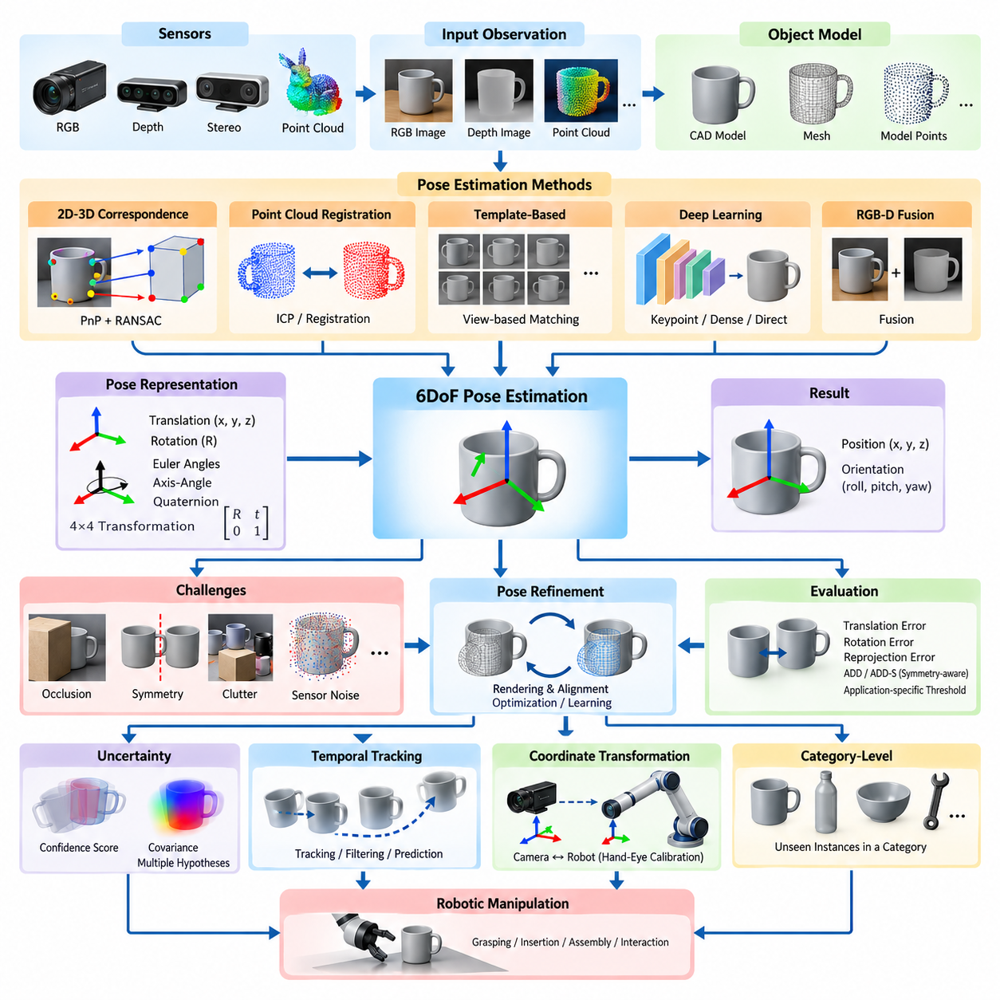
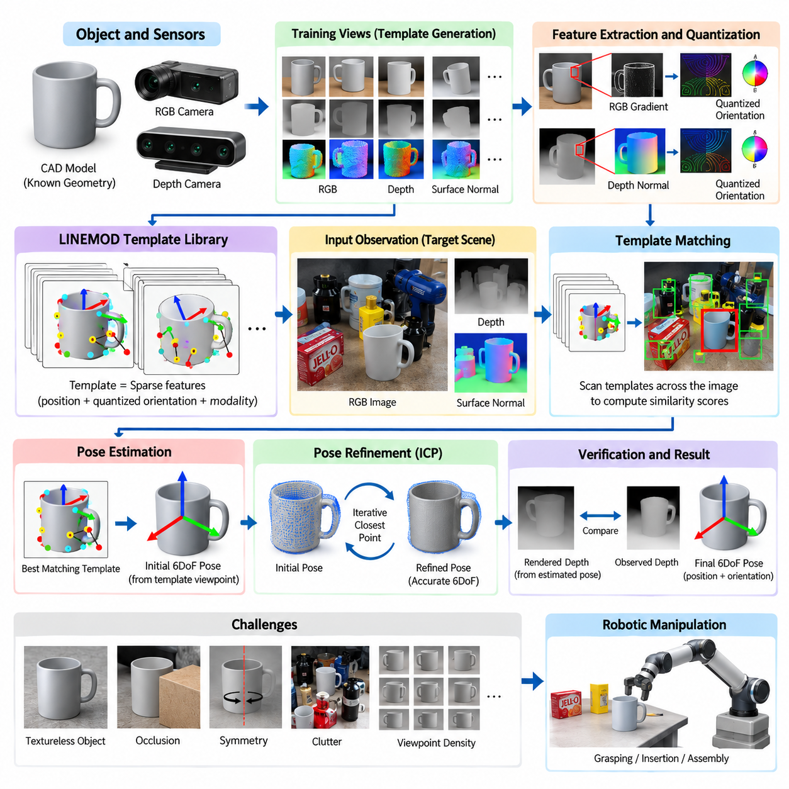
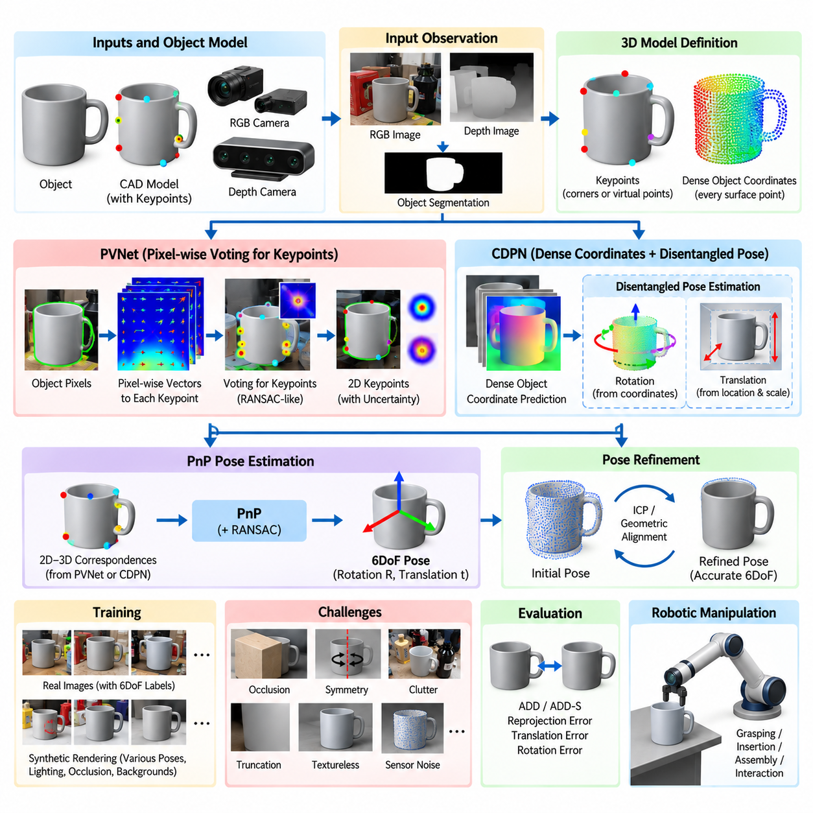
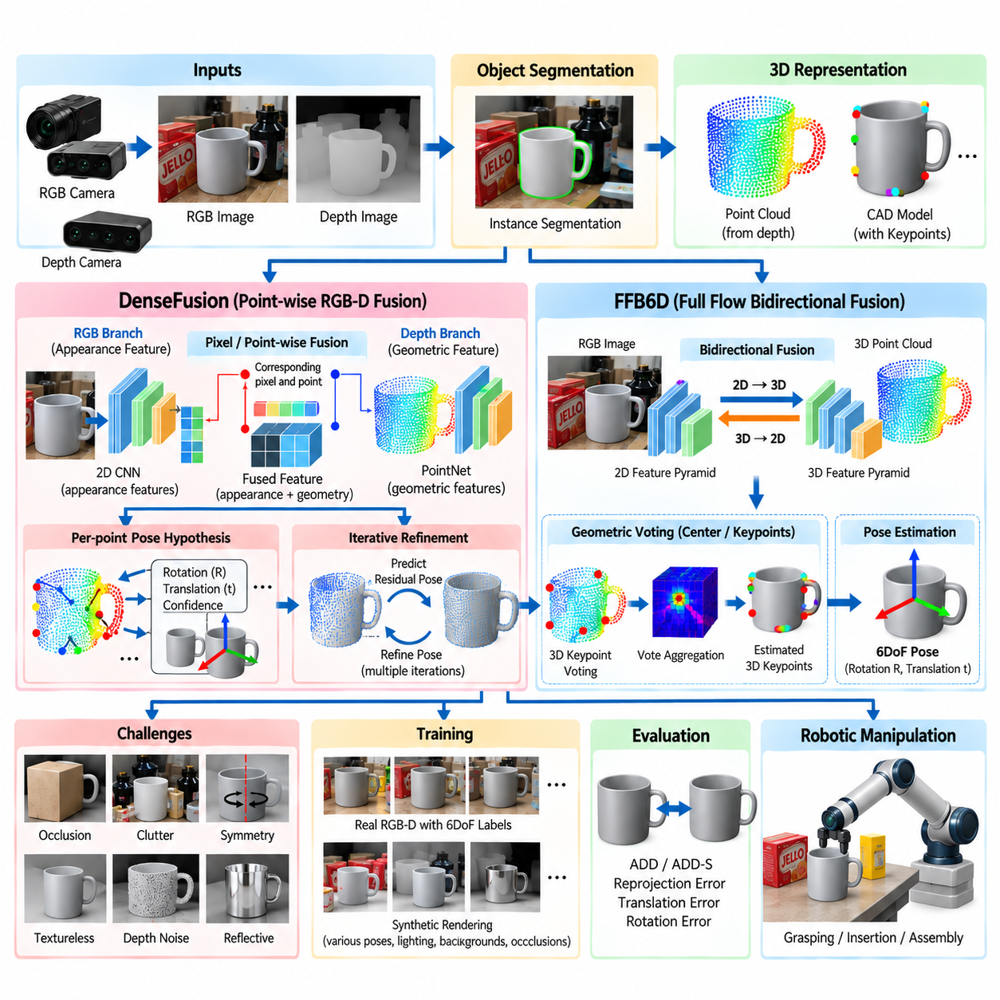
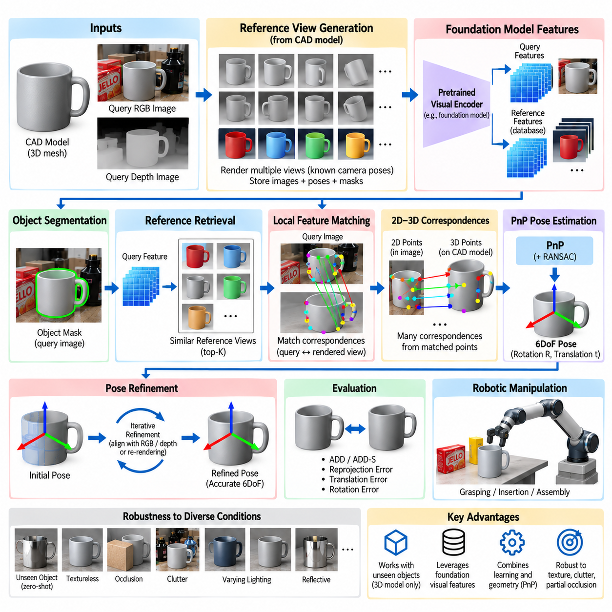
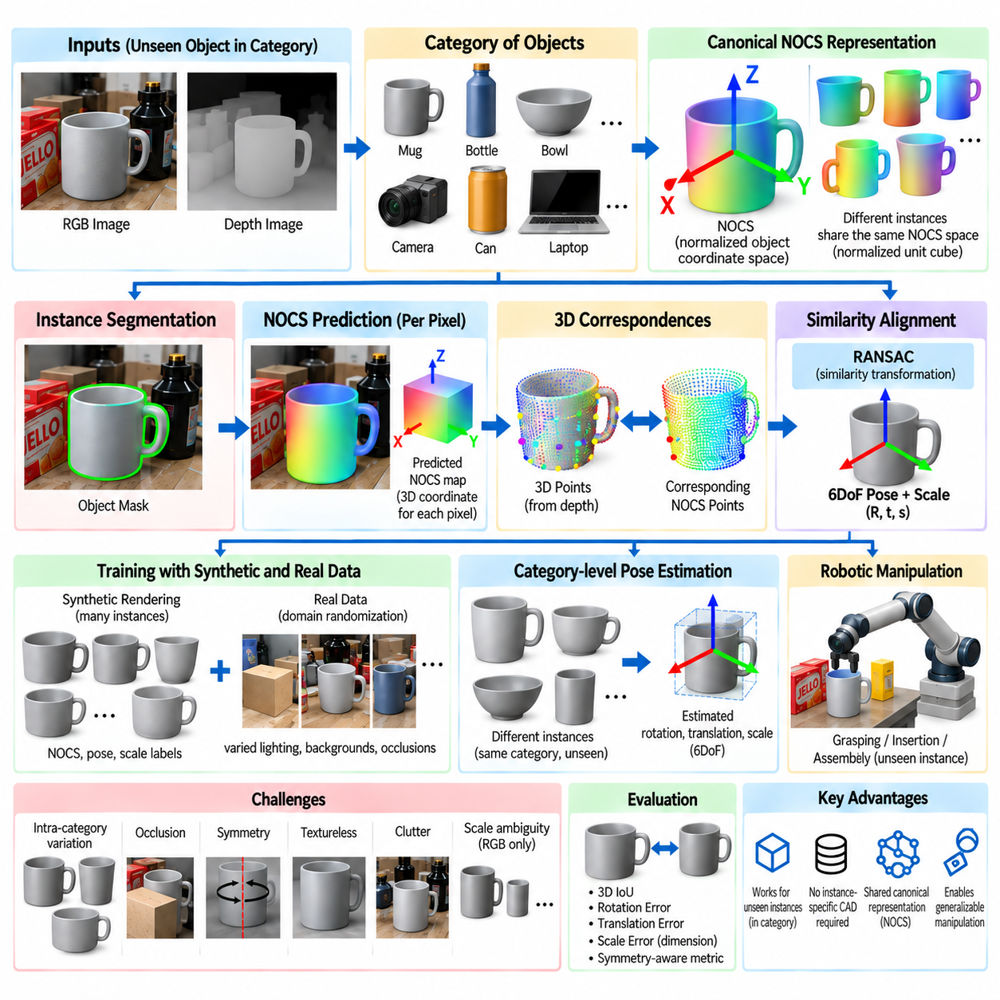
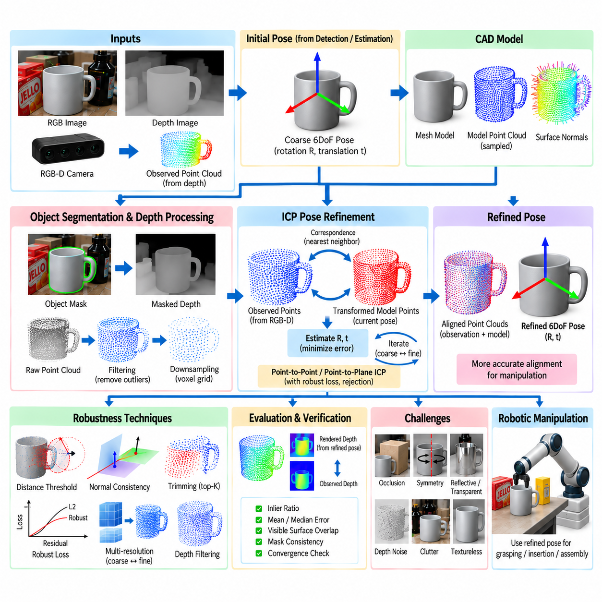
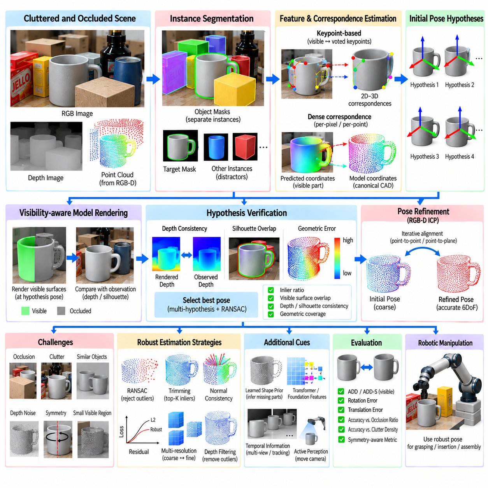
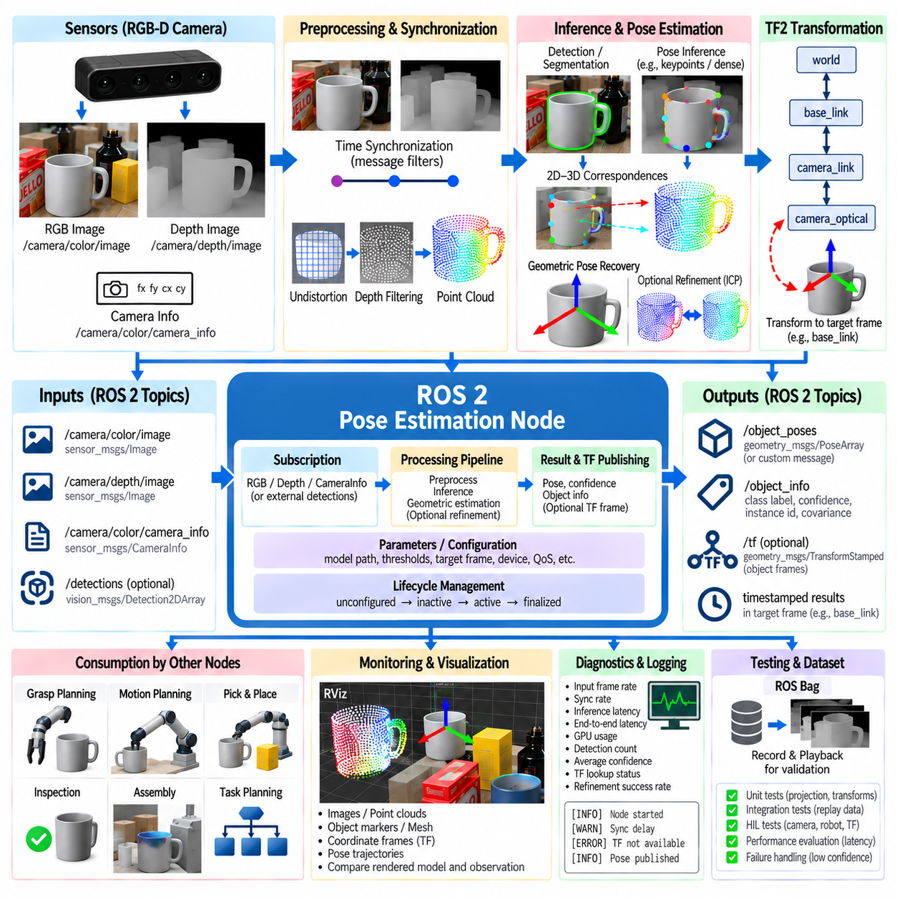
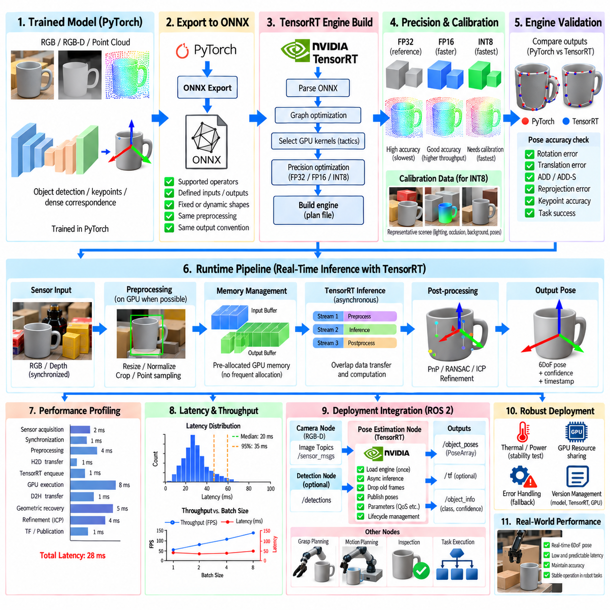

**Volume 17 Manipulation and Grasping AI**


# Chapter 04. Object Pose Estimation

##  

## 04.01. 6DoF Object Pose Estimation Problem and Methods

{width="7.268055555555556in" height="7.268055555555556in"}

Six-degree-of-freedom object pose estimation determines the three-dimensional position and orientation of an object relative to a reference coordinate frame. The six degrees of freedom consist of three translational components along the x, y, and z axes and three rotational components describing orientation. This capability allows a robot to understand not only where an object is located but also how it is oriented in space.

In robotic manipulation, pose estimation forms a critical bridge between perception and physical action. Object detection may identify that a target object exists within an image, but manipulation requires substantially richer geometric information. A robot must determine the object\'s spatial transformation relative to the camera, robot base, or end-effector before it can calculate collision-free reaching, grasping, insertion, or assembly motions.

A 6DoF pose is commonly represented by a rigid-body transformation belonging to the special Euclidean group SE(3). The transformation combines a three-dimensional translation vector with a 3 × 3 rotation matrix belonging to SO(3). Alternative orientation representations include Euler angles, axis-angle coordinates, and unit quaternions, while homogeneous 4 × 4 transformation matrices provide a convenient representation for chaining coordinate transformations.

The fundamental estimation problem can be expressed as recovering the transformation between an object\'s coordinate system and the camera coordinate system from available sensor observations. Depending on the application, observations may include RGB images, depth measurements, point clouds, stereo images, or combinations of these modalities. Known camera calibration parameters are normally required to convert image observations into geometrically meaningful spatial relationships.

Model-based pose estimation assumes that geometric information about the target object is available beforehand. This information may be represented as a CAD model, polygon mesh, point cloud, or collection of characteristic three-dimensional features. The observed scene is compared with the known model, and the transformation producing the strongest geometric or visual correspondence is selected as the estimated object pose.

A classical approach establishes correspondences between known three-dimensional object points and their two-dimensional projections in an image. Once sufficient 2D--3D correspondences have been obtained, the Perspective-n-Point problem can be solved to estimate camera-relative object pose. Practical systems frequently combine PnP algorithms with RANSAC so that incorrect feature correspondences and image outliers do not dominate the estimated transformation.

Depth cameras and three-dimensional sensors enable pose estimation directly from geometric structure. Local or global features can establish correspondences between an observed point cloud and an object model, after which rigid registration estimates their relative transformation. Iterative Closest Point can further refine an initial estimate by repeatedly minimizing geometric distances between corresponding surfaces, although its performance depends strongly on initialization and visible geometry.

Template-based methods compare sensor observations against representations generated from known object poses. A database may contain RGB appearance, depth structure, surface normals, edges, or synthetic renderings corresponding to many viewpoints. During inference, the observation is matched against these templates to obtain candidate poses. Such methods can be effective for textureless industrial objects where conventional visual feature extraction is unreliable.

Deep learning changed pose estimation by learning object representations directly from training data rather than depending entirely on manually designed geometric features. Neural networks may predict keypoints, object coordinates, rotation and translation parameters, dense correspondences, or intermediate representations used by geometric solvers. Modern pipelines often combine learned perception with explicit geometry because the two approaches provide complementary strengths.

Keypoint-based neural approaches detect semantically or geometrically meaningful points associated with an object, such as corners, holes, joints, or predefined CAD landmarks. The predicted image coordinates are associated with their known three-dimensional locations, allowing a PnP solver to recover the final pose. Separating learned keypoint detection from geometric pose recovery can improve interpretability and enforce physically meaningful camera constraints.

Dense correspondence methods predict object-related information for many pixels instead of relying on a small set of sparse landmarks. Each visible pixel may be mapped to a coordinate on the object\'s three-dimensional model, creating numerous potential 2D--3D correspondences. Robust geometric estimation can then recover the pose even when some regions are occluded, corrupted, or incorrectly predicted, making dense approaches attractive for cluttered manipulation scenes.

Direct regression methods attempt to predict translation and rotation from image features in a single learned mapping. Their conceptual simplicity can support efficient inference, but rotation representation, generalization, and geometric accuracy require careful treatment. Hybrid architectures therefore frequently predict coarse pose hypotheses first and subsequently refine them using image evidence, depth geometry, rendered models, or differentiable alignment procedures.

RGB-D pose estimation combines complementary appearance and geometry. RGB information provides texture, color, boundaries, and semantic cues, while depth measurements reveal metric distance and three-dimensional surface structure. Fusion may occur at the input, feature, correspondence, or hypothesis level. For robotic manipulation, RGB-D sensing is especially valuable because accurate translation and surface geometry directly affect grasp approach and contact positioning.

Occlusion is one of the central difficulties in practical pose estimation. In cluttered environments, only a fraction of the target object\'s surface may be visible because other objects, robot components, containers, or fixtures block the sensor view. Robust methods must infer pose from partial observations while distinguishing true object evidence from background geometry. Multi-view sensing can reduce ambiguity by observing the object from different viewpoints.

Object symmetry introduces another fundamental challenge. Cylinders, boxes, gears, bottles, and many manufactured components can possess rotational or reflective symmetries that make multiple poses visually or geometrically indistinguishable. A predicted orientation that differs numerically from the annotated pose may therefore represent an equivalent physical configuration. Symmetry-aware training losses and evaluation metrics are necessary to avoid incorrectly penalizing valid pose estimates.

Pose refinement improves an initial estimate by aligning the hypothesized object configuration with sensor observations. A model can be rendered at the estimated pose and compared with the measured RGB or depth data, allowing residual errors to generate corrective updates. Refinement may use geometric optimization, neural networks, differentiable rendering, or combinations of these techniques and is particularly important when manipulation requires millimeter-scale positioning accuracy.

Pose-estimation accuracy must be evaluated in terms relevant to downstream robotic behavior. Common metrics measure translation error, rotation error, reprojection error, or distances between transformed model points. Metrics such as ADD compare the positions of model vertices under estimated and ground-truth transformations, while symmetry-aware variants consider equivalent configurations. Application-specific thresholds should reflect the tolerances of the manipulation task.

Real robotic systems must also address uncertainty rather than treating every pose estimate as exact. Sensor noise, calibration error, motion blur, reflective surfaces, limited resolution, occlusion, and ambiguous geometry all contribute to uncertainty. Confidence scores, covariance estimates, multiple pose hypotheses, or probabilistic distributions can communicate this uncertainty to grasp planning and motion planning modules, enabling safer decisions when perception is unreliable.

Coordinate-frame management is equally important because the estimated camera-relative pose must eventually be expressed in coordinates meaningful to the robot controller. Camera calibration determines intrinsic imaging parameters, while extrinsic calibration relates the camera to the robot base or end-effector. Hand-eye calibration is therefore a fundamental component of manipulation systems, and small calibration errors can propagate into significant positioning errors at the gripper.

Temporal information provides another opportunity for improving robustness. Instead of estimating every video frame independently, a robot can track object pose over time and exploit motion continuity. Filtering, optimization, learned tracking, and prediction models can combine successive observations to suppress noise and recover temporarily occluded objects. Dynamic manipulation additionally requires estimating object velocity and predicting future pose at the intended interaction time.

Category-level pose estimation extends the problem beyond objects with exact CAD models. Rather than recognizing one specific instance, the system must estimate the pose of previously unseen objects belonging to a semantic category such as mugs, bottles, tools, or containers. This requires representations capable of handling variations in shape and dimensions while maintaining meaningful geometric correspondences, often through canonical object coordinate spaces or learned shape priors.

For general-purpose manipulation, pose estimation is increasingly integrated with object segmentation, foundation vision models, three-dimensional reconstruction, grasp generation, and scene-level reasoning. The objective is not merely to produce an isolated transformation matrix but to construct an actionable spatial representation. Object identity, geometry, pose, uncertainty, affordances, and relationships with surrounding objects collectively determine how a robot should interact with the scene.

The appropriate pose-estimation method therefore depends on sensing modality, object knowledge, environmental complexity, accuracy requirements, and computational constraints. Classical geometric methods remain valuable when accurate models and reliable correspondences exist, while learning-based methods provide stronger robustness to appearance variation and complex scenes. Hybrid systems that combine learned perception, geometric constraints, uncertainty estimation, and pose refinement offer a practical foundation for reliable robotic manipulation.

6자유도 객체 자세 추정(6DoF Object Pose Estimation)은 기준 좌표계(reference coordinate frame)를 기준으로 객체의 3차원 위치(position)와 방향(orientation)을 결정하는 과정이다. 6자유도(six degrees of freedom)는 x, y, z축을 따르는 세 개의 병진 성분(translational components)과 방향을 나타내는 세 개의 회전 성분(rotational components)으로 구성된다. 이를 통해 로봇은 객체가 어디에 있는지뿐만 아니라 공간에서 어떤 방향으로 놓여 있는지도 이해할 수 있다.

로봇 조작(robotic manipulation)에서 자세 추정(pose estimation)은 인지(perception)와 물리적 행동(physical action)을 연결하는 핵심적인 역할을 한다. 객체 검출(object detection)은 영상에서 목표 객체의 존재 여부를 식별할 수 있지만, 실제 조작에는 훨씬 풍부한 기하학적 정보(geometric information)가 필요하다. 로봇은 충돌 없는 접근, 파지(grasping), 삽입(insertion), 조립(assembly) 동작을 계산하기 전에 카메라(camera), 로봇 베이스(robot base), 말단장치(end-effector)를 기준으로 객체의 공간 변환(spatial transformation)을 결정해야 한다.

6자유도 자세(6DoF pose)는 일반적으로 특수 유클리드 군(special Euclidean group) SE(3)에 속하는 강체 변환(rigid-body transformation)으로 표현된다. 이 변환은 3차원 병진 벡터(translation vector)와 SO(3)에 속하는 3 × 3 회전 행렬(rotation matrix)을 결합한다. 방향 표현에는 오일러 각(Euler angles), 축-각 좌표(axis-angle coordinates), 단위 쿼터니언(unit quaternion) 등이 사용되며, 4 × 4 동차 변환 행렬(homogeneous transformation matrix)은 여러 좌표 변환을 연속적으로 연결하는 데 편리하다.

기본적인 추정 문제는 사용 가능한 센서 관측(sensor observation)으로부터 객체 좌표계(object coordinate system)와 카메라 좌표계(camera coordinate system) 사이의 변환을 복원하는 것으로 정의할 수 있다. 응용 분야에 따라 관측 정보에는 RGB 영상, 깊이 측정(depth measurement), 포인트 클라우드(point cloud), 스테레오 영상(stereo image) 또는 이들의 조합이 포함될 수 있다. 영상 관측을 기하학적으로 의미 있는 공간 관계로 변환하려면 일반적으로 알려진 카메라 보정 매개변수(camera calibration parameters)가 필요하다.

모델 기반 자세 추정(model-based pose estimation)은 목표 객체에 관한 기하학적 정보가 사전에 제공된다고 가정한다. 이러한 정보는 CAD 모델(CAD model), 다각형 메시(polygon mesh), 포인트 클라우드 또는 특징적인 3차원 특징(feature)의 집합으로 표현될 수 있다. 관측된 장면을 알려진 모델과 비교하고, 가장 높은 기하학적 또는 시각적 대응 관계(correspondence)를 생성하는 변환을 객체의 추정 자세로 선택한다.

고전적인 접근 방법에서는 알려진 3차원 객체 점(object point)과 영상에 투영된 2차원 점 사이의 대응 관계를 설정한다. 충분한 2D--3D 대응 관계가 확보되면 원근 n점 문제(Perspective-n-Point, PnP)를 해결하여 카메라 기준 객체 자세를 추정할 수 있다. 실제 시스템에서는 잘못된 특징 대응과 영상 이상치(outlier)가 추정 변환을 지배하지 않도록 PnP 알고리즘과 랜덤 샘플 합의(Random Sample Consensus, RANSAC)를 함께 사용하는 경우가 많다.

깊이 카메라(depth camera)와 3차원 센서(3D sensor)는 기하학적 구조로부터 직접 자세를 추정할 수 있게 한다. 지역 또는 전역 특징(local or global feature)을 이용하여 관측 포인트 클라우드와 객체 모델 사이의 대응 관계를 설정한 후, 강체 정합(rigid registration)을 통해 상대 변환을 추정한다. 반복 최근접점(Iterative Closest Point, ICP)은 대응 표면 사이의 기하학적 거리를 반복적으로 최소화하여 초기 추정치를 더욱 정밀하게 만들 수 있지만, 성능은 초기화와 관측 가능한 형상에 크게 의존한다.

템플릿 기반 방법(template-based method)은 센서 관측을 알려진 객체 자세에서 생성된 표현과 비교한다. 데이터베이스에는 다양한 시점(viewpoint)에 대응하는 RGB 외형, 깊이 구조, 표면 법선(surface normal), 윤곽선(edge), 합성 렌더링(synthetic rendering) 등이 포함될 수 있다. 추론 과정에서는 관측값을 이러한 템플릿과 비교하여 후보 자세(candidate pose)를 얻으며, 기존의 시각 특징 추출이 어려운 무텍스처(textureless) 산업용 객체에서 효과적일 수 있다.

딥러닝(deep learning)은 사람이 설계한 기하학적 특징에 전적으로 의존하는 대신 학습 데이터로부터 객체 표현(object representation)을 직접 학습함으로써 자세 추정 기술을 변화시켰다. 신경망(neural network)은 키포인트(keypoint), 객체 좌표(object coordinate), 회전 및 병진 매개변수, 밀집 대응(dense correspondence) 또는 기하학적 해법에 사용되는 중간 표현을 예측할 수 있다. 현대적인 파이프라인은 학습 기반 인지(learned perception)와 명시적 기하학(explicit geometry)의 상호 보완적 장점을 결합하는 경우가 많다.

키포인트 기반 신경망 접근법(keypoint-based neural approach)은 객체의 모서리, 구멍, 관절 또는 사전에 정의된 CAD 랜드마크(CAD landmark)와 같이 의미적 또는 기하학적으로 중요한 점을 검출한다. 예측된 영상 좌표를 알려진 3차원 위치와 연결하면 PnP 해법을 통해 최종 자세를 복원할 수 있다. 학습 기반 키포인트 검출과 기하학적 자세 복원을 분리하면 해석 가능성(interpretability)을 높이고 물리적으로 의미 있는 카메라 제약조건을 적용할 수 있다.

밀집 대응 방법(dense correspondence method)은 소수의 희소 랜드마크(sparse landmark)에 의존하는 대신 다수의 픽셀에 대해 객체 관련 정보를 예측한다. 보이는 각 픽셀을 객체의 3차원 모델 좌표에 대응시켜 많은 2D--3D 대응 관계를 생성할 수 있다. 이후 강건한 기하학적 추정(robust geometric estimation)을 적용하면 일부 영역이 가려지거나 손상되거나 잘못 예측된 상황에서도 자세를 복원할 수 있어 복잡한 조작 환경에서 유용하다.

직접 회귀 방법(direct regression method)은 영상 특징으로부터 병진과 회전을 하나의 학습된 매핑(mapping)을 통해 직접 예측한다. 개념적으로 단순하여 효율적인 추론이 가능하지만, 회전 표현(rotation representation), 일반화(generalization), 기하학적 정확도를 신중하게 다루어야 한다. 따라서 하이브리드 구조(hybrid architecture)는 먼저 거친 자세 가설(coarse pose hypothesis)을 예측한 후 영상 정보, 깊이 기하학, 렌더링 모델 또는 미분 가능한 정합(differentiable alignment)을 이용하여 자세를 정제하는 경우가 많다.

RGB-D 자세 추정(RGB-D pose estimation)은 외형 정보와 기하학적 정보를 상호 보완적으로 결합한다. RGB 정보는 텍스처(texture), 색상, 경계(boundary), 의미적 단서(semantic cue)를 제공하고, 깊이 정보는 실제 거리(metric distance)와 3차원 표면 구조를 제공한다. 융합(fusion)은 입력, 특징, 대응 관계 또는 자세 가설 수준에서 수행될 수 있다. 로봇 조작에서는 정확한 병진 위치와 표면 형상이 파지 접근과 접촉 위치에 직접적인 영향을 주기 때문에 RGB-D 센싱이 특히 유용하다.

가림(occlusion)은 실제 자세 추정에서 가장 중요한 난제 중 하나이다. 복잡한 환경에서는 다른 객체, 로봇 구성요소, 컨테이너 또는 설비가 센서의 시야를 차단하여 목표 객체 표면의 일부만 관측될 수 있다. 강건한 방법은 부분적인 관측으로부터 자세를 추론하면서 실제 객체 정보와 배경 형상을 구분해야 한다. 다중 시점 센싱(multi-view sensing)은 서로 다른 방향에서 객체를 관측함으로써 이러한 모호성을 줄일 수 있다.

객체 대칭성(object symmetry)은 또 다른 근본적인 문제를 발생시킨다. 원통, 상자, 기어, 병과 여러 제조 부품은 회전 대칭(rotational symmetry)이나 반사 대칭(reflective symmetry)을 가질 수 있기 때문에 여러 자세가 시각적 또는 기하학적으로 구별되지 않을 수 있다. 따라서 수치적으로 정답 자세와 다른 예측 방향도 물리적으로는 동일한 배치를 나타낼 수 있으며, 유효한 자세를 잘못된 것으로 평가하지 않도록 대칭성 인식 학습 손실(symmetry-aware training loss)과 평가 지표가 필요하다.

자세 정제(pose refinement)는 초기 추정 객체 배치를 센서 관측과 정렬하여 정확도를 향상시킨다. 추정 자세에서 객체 모델을 렌더링(rendering)하고 측정된 RGB 또는 깊이 데이터와 비교하면 잔차 오차(residual error)를 이용해 자세를 보정할 수 있다. 정제에는 기하학적 최적화(geometric optimization), 신경망, 미분 가능 렌더링(differentiable rendering) 또는 이들의 조합이 사용될 수 있으며, 밀리미터 수준의 위치 정확도가 요구되는 조작에서 특히 중요하다.

자세 추정 정확도는 후속 로봇 동작(downstream robotic behavior)에 적합한 기준으로 평가해야 한다. 일반적인 지표는 병진 오차(translation error), 회전 오차(rotation error), 재투영 오차(reprojection error), 변환된 모델 점 사이의 거리 등을 측정한다. ADD(Average Distance of Model Points)와 같은 지표는 추정 변환과 실제 변환이 적용된 모델 정점의 위치를 비교하며, 대칭성 인식 변형 지표는 동등한 객체 배치를 고려한다. 실제 적용 임계값은 조작 작업의 허용 오차를 반영해야 한다.

실제 로봇 시스템에서는 모든 자세 추정값을 정확한 값으로 간주하기보다 불확실성(uncertainty)을 함께 처리해야 한다. 센서 잡음(sensor noise), 보정 오차(calibration error), 모션 블러(motion blur), 반사 표면, 제한된 해상도, 가림, 형상 모호성 등이 불확실성을 발생시킨다. 신뢰도 점수(confidence score), 공분산 추정(covariance estimation), 다중 자세 가설 또는 확률 분포를 이용하면 이러한 불확실성을 파지 계획과 동작 계획 모듈에 전달하여 신뢰도가 낮을 때 더욱 안전한 결정을 내릴 수 있다.

좌표계 관리(coordinate-frame management) 역시 중요하다. 카메라를 기준으로 추정한 자세는 최종적으로 로봇 제어기가 사용할 수 있는 좌표로 변환되어야 하기 때문이다. 카메라 보정(camera calibration)은 내부 영상 매개변수(intrinsic parameter)를 결정하며, 외부 보정(extrinsic calibration)은 카메라와 로봇 베이스 또는 말단장치 사이의 관계를 결정한다. 따라서 핸드-아이 보정(hand-eye calibration)은 조작 시스템의 핵심 요소이며, 작은 보정 오차도 그리퍼 위치에서 상당한 오차로 확대될 수 있다.

시간 정보(temporal information)를 활용하면 자세 추정의 강건성을 더욱 향상시킬 수 있다. 로봇은 각 비디오 프레임을 독립적으로 처리하는 대신 시간에 따른 객체 자세를 추적하고 운동 연속성(motion continuity)을 활용할 수 있다. 필터링(filtering), 최적화, 학습 기반 추적(learned tracking), 예측 모델을 이용하여 연속적인 관측을 결합하면 잡음을 억제하고 일시적으로 가려진 객체의 자세를 복원할 수 있다. 동적 조작(dynamic manipulation)에서는 객체 속도를 추정하고 실제 상호작용 시점의 미래 자세를 예측하는 기능도 필요하다.

범주 수준 자세 추정(category-level pose estimation)은 정확한 CAD 모델이 존재하는 특정 객체를 넘어 문제를 확장한다. 시스템은 하나의 특정 인스턴스(instance)가 아니라 컵, 병, 공구, 컨테이너와 같은 의미 범주(semantic category)에 속하는 이전에 보지 못한 객체의 자세까지 추정해야 한다. 이를 위해서는 형상과 크기의 변화를 처리하면서 의미 있는 기하학적 대응 관계를 유지할 수 있는 표현이 필요하며, 정규 객체 좌표 공간(canonical object coordinate space)이나 학습된 형상 사전(learned shape prior)이 활용될 수 있다.

범용 조작(general-purpose manipulation)을 위해 자세 추정은 점차 객체 분할(object segmentation), 파운데이션 비전 모델(foundation vision model), 3차원 재구성(3D reconstruction), 파지 생성(grasp generation), 장면 수준 추론(scene-level reasoning)과 통합되고 있다. 목표는 단순히 하나의 변환 행렬을 생성하는 것이 아니라 행동 가능한 공간 표현(actionable spatial representation)을 구축하는 것이다. 객체 정체성, 형상, 자세, 불확실성, 어포던스(affordance), 주변 객체와의 관계가 함께 로봇의 상호작용 방식을 결정한다.

따라서 적절한 자세 추정 방법은 센싱 방식(sensing modality), 객체에 대한 사전 지식, 환경 복잡도, 정확도 요구사항, 계산 자원 제약에 따라 결정된다. 정확한 모델과 신뢰할 수 있는 대응 관계가 존재할 경우 고전적인 기하학적 방법은 여전히 중요한 가치를 가지며, 학습 기반 방법은 외형 변화와 복잡한 장면에 대해 더 높은 강건성을 제공한다. 학습 기반 인지, 기하학적 제약조건, 불확실성 추정, 자세 정제를 결합한 하이브리드 시스템은 신뢰성 높은 로봇 조작을 위한 실용적인 기반을 제공한다.

##  

## 04.02. Template Based Pose Estimation LINEMOD [w/Code]

{width="7.268055555555556in" height="7.268055555555556in"}

Template-based pose estimation determines an object\'s position and orientation by comparing current sensor observations with a collection of reference appearances generated from known poses. Instead of reconstructing pose entirely from sparse feature correspondences, the method searches for the reference template that best matches the observed object. This strategy is especially useful for rigid industrial objects whose geometry is known in advance.

LINEMOD is a representative template-based method designed for recognizing and localizing textureless objects using multiple sensor modalities. Conventional feature descriptors often depend on distinctive textures, corners, or repeatable local patterns, which may be scarce on manufactured components. LINEMOD instead emphasizes object shape and surface orientation, allowing recognition to rely on structural information that remains informative even when surface texture is weak.

The central idea of LINEMOD is to describe an object using discriminative features extracted from complementary modalities. In the RGB image, gradient orientations capture visible boundaries and internal intensity transitions. From depth information, surface normals represent the local three-dimensional orientation of the object\'s geometry. Combining these cues produces templates that encode both appearance-related edges and geometric surface structure without requiring rich texture.

During template generation, the target object\'s appearance is observed or rendered from predefined viewpoints. Features are extracted at selected locations and stored together with their modality information and relative spatial positions. A template therefore represents a sparse constellation of characteristic orientation measurements rather than a complete image. This sparse representation reduces computation while preserving features that strongly distinguish the object from its surroundings.

Image-gradient features are calculated from changes in intensity or color across neighboring pixels. Strong gradients commonly occur along object silhouettes, geometric edges, holes, handles, and other visible structures. Rather than depending heavily on exact gradient magnitude, LINEMOD primarily uses quantized orientation information. This makes matching less sensitive to moderate illumination changes while retaining the directional structure necessary for recognizing an object\'s projected shape.

Depth measurements provide an additional modality that is particularly valuable for textureless objects. A local surface normal can be estimated from neighboring three-dimensional points reconstructed from the depth image. Normal orientation describes how a surface faces the sensor and therefore captures shape information unavailable from RGB appearance alone. Planar faces, curved surfaces, recesses, and geometric transitions can consequently contribute to template discrimination.

Feature orientations are quantized into discrete directional categories to make template matching efficient and robust. Exact orientation values can fluctuate because of sensor noise, illumination variation, depth quantization, and small viewpoint changes. Quantization groups similar measurements into common orientation bins, reducing sensitivity to these variations. The resulting representation sacrifices some precision but significantly simplifies similarity computation across many candidate image positions.

A LINEMOD template contains selected feature locations together with their quantized orientations and modality labels. Feature selection is important because storing every possible gradient or surface normal would produce excessive redundancy and computational cost. Informative features are therefore chosen to represent distinctive object structures while maintaining spatial coverage. A relatively small set of carefully distributed features can characterize a viewpoint effectively.

At inference time, templates are scanned across the observed scene to search for locations producing high similarity scores. For each candidate location, the system compares stored template orientations with corresponding orientation information in the current RGB and depth observations. Contributions from individual features are accumulated into an overall matching score. Candidate detections exceeding a predefined threshold can then be considered possible object instances.

Efficient matching is essential because an object may have hundreds or thousands of templates representing different viewpoints, distances, and in-plane rotations. LINEMOD uses precomputed orientation representations and lookup mechanisms so that similarity calculations can be performed rapidly. This design made the method attractive for real-time object detection when computational resources were considerably more limited than those available in modern GPU-based perception systems.

Pose estimation requires more than determining that an object is present. Each stored template is associated with the viewpoint and transformation from which it was generated. Once a template matches the observed scene, its associated pose provides an initial estimate of the object\'s orientation and position. Depth information can further constrain translation by supplying metric distance, allowing the template detection to be converted into a three-dimensional pose hypothesis.

The density and distribution of template viewpoints directly influence pose coverage. If templates are generated only from widely separated orientations, the observed object may fall between represented viewpoints and produce a weak match or inaccurate pose. Increasing viewpoint density improves coverage but enlarges the template database and computational workload. Practical implementations therefore balance angular resolution, scale variation, expected operating poses, and available processing resources.

Synthetic template generation can reduce the burden of physically capturing objects from many viewpoints. Given a CAD model, a rendering system can generate RGB, depth, silhouette, and surface-normal information across systematically sampled camera poses. This allows large template libraries to be constructed automatically. However, differences between rendered and real sensor observations must be considered because unrealistic lighting, depth characteristics, or material appearance can reduce matching reliability.

One important advantage of LINEMOD is its ability to handle objects with limited texture. Industrial parts are frequently metallic, plastic, uniformly colored, or visually repetitive, making keypoint descriptors unreliable. Shape boundaries and surface normals may remain informative under these conditions. As a result, template-based multimodal matching has historically been useful for bin picking, assembly, component localization, quality inspection, and other structured robotic applications.

Occlusion nevertheless remains a significant challenge. A template assumes that a collection of characteristic features should appear in approximately expected spatial relationships, but some of those features may disappear when another object blocks the target. Partial matching can tolerate missing evidence to some degree, yet severe occlusion lowers similarity scores and may cause false negatives. Dense clutter also introduces unrelated edges and surfaces that can create competing matches.

Symmetric objects create another source of ambiguity. Multiple viewpoints of a cylindrical, rotationally symmetric, or repetitive object may generate nearly identical templates even though their numerical orientations differ. In such cases, the sensor observations may not contain enough information to uniquely determine orientation. Pose-estimation systems should explicitly represent equivalent poses or apply symmetry-aware reasoning rather than forcing an arbitrary single orientation.

Background clutter affects template matching because strong gradients and surface normals can originate from neighboring objects, containers, fixtures, or workspace structures. Combining RGB gradients with depth-based surface information helps suppress some false detections, but robust systems often incorporate segmentation, depth constraints, non-maximum suppression, geometric verification, or additional pose refinement. These stages separate plausible template responses from physically consistent object hypotheses.

The initial pose obtained from a matched template is limited by the discrete resolution of the template library. For precision manipulation, this coarse estimate is commonly followed by a refinement stage. The associated 3D model can be transformed according to the initial pose and aligned with the observed point cloud using Iterative Closest Point or related registration techniques. Refinement converts discrete viewpoint matching into a more continuous and accurate pose estimate.

Pose verification can further improve reliability by comparing the transformed object model with actual scene measurements. Rendered depth from the hypothesized pose can be compared against measured depth to evaluate surface agreement, visibility, and occlusion. Hypotheses that explain only a small portion of the observation or conflict strongly with measured geometry can be rejected. This geometric verification is particularly useful when several templates produce similar matching scores.

LINEMOD also illustrates an important engineering principle: object recognition does not always require a large learned model. When the object set is fixed, CAD data are available, and operating conditions are relatively controlled, explicit geometric templates can provide deterministic and interpretable behavior. Templates can be inspected, regenerated, or extended for particular viewpoints without retraining a neural network, which can simplify deployment and debugging in industrial environments.

However, template-based systems face scalability limitations when the number of objects and possible poses becomes very large. Every additional object, viewpoint, scale, or sensor configuration can increase storage and search requirements. Changes in object appearance or sensing conditions may also require template regeneration. Learning-based approaches can often share representations across objects and variations more effectively, motivating modern systems to combine learned features with template or geometric matching.

Modern descendants of the LINEMOD concept replace handcrafted orientation features with learned descriptors while retaining the idea of comparing observations against object representations associated with known poses. Neural networks can improve segmentation, feature extraction, correspondence estimation, and candidate ranking, while CAD geometry provides explicit spatial constraints. This hybrid strategy preserves geometric interpretability while gaining robustness from data-driven representation learning.

For robotic manipulation, the output of template matching should be interpreted as an initial object hypothesis rather than an isolated recognition result. The estimated pose must be transformed through calibrated camera and robot coordinate frames, checked for uncertainty, refined when necessary, and supplied to grasp or motion planning. Errors in camera calibration, depth sensing, template discretization, or registration can accumulate and ultimately appear as positioning errors at the robot end-effector.

A practical LINEMOD-based pipeline therefore connects offline template generation with online multimodal feature extraction, efficient similarity matching, candidate selection, pose recovery, geometric verification, and refinement. Its effectiveness comes from combining directional RGB information with three-dimensional surface orientation while exploiting known object geometry. Although newer learning-based techniques provide stronger generalization, LINEMOD remains an important reference architecture for understanding efficient model-based 6DoF pose estimation.

템플릿 기반 자세 추정(Template-based Pose Estimation)은 현재 센서 관측(sensor observation)을 알려진 자세에서 생성된 기준 외형(reference appearance)의 집합과 비교하여 객체의 위치(position)와 방향(orientation)을 결정한다. 희소 특징 대응(sparse feature correspondence)만으로 자세를 복원하는 대신, 관측된 객체와 가장 잘 일치하는 기준 템플릿(reference template)을 검색한다. 이러한 방식은 형상이 사전에 알려진 강체 산업용 객체(rigid industrial object)에 특히 유용하다.

LINEMOD는 여러 센서 모달리티(sensor modality)를 이용하여 텍스처가 부족한 객체(textureless object)를 인식하고 위치를 추정하도록 설계된 대표적인 템플릿 기반 방법(template-based method)이다. 기존 특징 기술자(feature descriptor)는 뚜렷한 텍스처, 모서리 또는 반복 가능한 국소 패턴에 의존하지만 제조 부품에는 이러한 특징이 부족할 수 있다. LINEMOD는 객체 형상과 표면 방향(surface orientation)을 강조하여 표면 텍스처가 약한 경우에도 구조적 정보를 이용해 객체를 인식한다.

LINEMOD의 핵심 개념은 상호 보완적인 모달리티(complementary modality)에서 추출한 판별력 있는 특징(discriminative feature)을 이용하여 객체를 표현하는 것이다. RGB 영상에서는 그래디언트 방향(gradient orientation)이 객체 경계와 내부 밝기 변화를 포착하고, 깊이 정보에서는 표면 법선(surface normal)이 객체 형상의 국소적인 3차원 방향을 표현한다. 이러한 단서를 결합하면 풍부한 텍스처 없이도 외형 관련 경계와 기하학적 표면 구조를 함께 표현하는 템플릿을 생성할 수 있다.

템플릿 생성(template generation) 과정에서는 사전에 정의된 시점(viewpoint)에서 목표 객체의 외형을 관측하거나 렌더링(rendering)한다. 선택된 위치에서 특징을 추출한 후 모달리티 정보와 상대적인 공간 위치를 함께 저장한다. 따라서 하나의 템플릿은 전체 영상을 저장하는 것이 아니라 특징적인 방향 측정값으로 구성된 희소 특징 배열(sparse constellation)을 나타낸다. 이러한 희소 표현(sparse representation)은 객체를 구분하는 핵심 정보를 유지하면서 계산량을 줄인다.

영상 그래디언트 특징(image-gradient feature)은 인접한 픽셀 사이의 밝기 또는 색상 변화로부터 계산된다. 강한 그래디언트는 일반적으로 객체의 실루엣(silhouette), 기하학적 모서리, 구멍, 손잡이 및 기타 가시적인 구조에서 나타난다. LINEMOD는 정확한 그래디언트 크기보다 양자화된 방향 정보(quantized orientation information)를 주로 이용한다. 이를 통해 적당한 조명 변화에 대한 민감도를 낮추면서 객체의 투영 형상을 인식하는 데 필요한 방향 구조를 유지한다.

깊이 측정(depth measurement)은 텍스처가 부족한 객체에 특히 유용한 추가적인 모달리티를 제공한다. 깊이 영상으로부터 복원된 인접한 3차원 점을 이용하면 국소 표면 법선(local surface normal)을 추정할 수 있다. 법선 방향(normal orientation)은 표면이 센서를 향하는 방향을 나타내므로 RGB 외형만으로는 얻기 어려운 형상 정보를 제공한다. 따라서 평면, 곡면, 오목한 영역, 기하학적 전이 부분 등이 템플릿의 판별력을 향상시킬 수 있다.

특징 방향(feature orientation)은 템플릿 정합(template matching)을 효율적이고 강건하게 수행하기 위해 불연속적인 방향 범주(discrete directional category)로 양자화된다. 정확한 방향 값은 센서 잡음, 조명 변화, 깊이 양자화(depth quantization), 작은 시점 변화 때문에 달라질 수 있다. 양자화(quantization)는 유사한 측정값을 동일한 방향 구간으로 묶어 이러한 변화에 대한 민감도를 감소시킨다. 일부 정밀도를 희생하지만 많은 후보 영상 위치에 대한 유사도 계산을 크게 단순화한다.

LINEMOD 템플릿은 선택된 특징 위치(feature location), 양자화된 방향, 모달리티 레이블(modality label)로 구성된다. 가능한 모든 그래디언트와 표면 법선을 저장하면 지나친 중복성과 계산 비용이 발생하기 때문에 특징 선택(feature selection)이 중요하다. 따라서 객체를 구분할 수 있는 구조를 표현하면서 공간적인 분포를 유지하도록 유용한 특징을 선택한다. 비교적 적은 수의 특징이라도 적절히 분산되어 있다면 하나의 시점을 효과적으로 표현할 수 있다.

추론(inference) 단계에서는 높은 유사도 점수(similarity score)를 생성하는 위치를 찾기 위해 관측 장면 전체에서 템플릿을 검색한다. 각각의 후보 위치에서 저장된 템플릿 방향을 현재 RGB 및 깊이 관측의 방향 정보와 비교한다. 개별 특징에서 얻어진 점수를 누적하여 전체 정합 점수를 계산한다. 사전에 정의된 임계값(threshold)을 초과하는 후보 검출 결과는 객체가 존재할 가능성이 있는 위치로 판단할 수 있다.

효율적인 정합(efficient matching)은 객체 하나에 서로 다른 시점, 거리, 평면 내 회전(in-plane rotation)을 나타내는 수백 또는 수천 개의 템플릿이 존재할 수 있기 때문에 중요하다. LINEMOD는 사전에 계산된 방향 표현과 조회 메커니즘(lookup mechanism)을 사용하여 유사도 계산을 빠르게 수행한다. 이러한 설계는 현대적인 GPU 기반 인지 시스템보다 계산 자원이 훨씬 제한적이었던 환경에서도 실시간 객체 검출(real-time object detection)에 활용될 수 있게 했다.

자세 추정(pose estimation)은 객체의 존재 여부를 확인하는 것 이상의 정보를 필요로 한다. 저장된 각 템플릿에는 템플릿이 생성된 시점과 변환(transformation)이 연결되어 있다. 특정 템플릿이 관측 장면과 일치하면 해당 템플릿의 자세 정보를 객체 방향과 위치의 초기 추정값(initial estimate)으로 사용할 수 있다. 깊이 정보는 실제 거리(metric distance)를 제공하여 병진 위치를 추가로 제한하므로 템플릿 검출 결과를 3차원 자세 가설(3D pose hypothesis)로 변환할 수 있다.

템플릿 시점의 밀도와 분포는 자세 범위(pose coverage)에 직접적인 영향을 준다. 템플릿이 서로 크게 떨어진 방향에서만 생성되면 실제 객체의 방향이 두 템플릿 사이에 위치하면서 정합 점수가 낮아지거나 자세 오차가 증가할 수 있다. 시점 밀도를 높이면 범위는 향상되지만 템플릿 데이터베이스와 계산량이 증가한다. 따라서 실제 구현에서는 각도 해상도(angular resolution), 크기 변화(scale variation), 예상 동작 자세, 사용 가능한 계산 자원 사이의 균형이 필요하다.

합성 템플릿 생성(synthetic template generation)을 이용하면 여러 시점에서 실제 객체를 직접 촬영해야 하는 부담을 줄일 수 있다. CAD 모델이 존재하면 렌더링 시스템을 이용하여 체계적으로 샘플링된 카메라 자세에서 RGB, 깊이, 실루엣, 표면 법선 정보를 생성할 수 있다. 이를 통해 대규모 템플릿 라이브러리(template library)를 자동으로 구축할 수 있다. 그러나 비현실적인 조명, 깊이 특성 또는 재질 표현은 실제 센서 데이터와 차이를 발생시켜 정합 신뢰도를 낮출 수 있다.

LINEMOD의 중요한 장점 중 하나는 텍스처가 제한적인 객체를 처리할 수 있다는 것이다. 산업용 부품은 금속, 플라스틱, 단색 표면 또는 시각적으로 반복되는 구조를 갖는 경우가 많아 키포인트 기술자(keypoint descriptor)의 신뢰성이 낮아질 수 있다. 이러한 조건에서도 형상 경계와 표면 법선은 유용한 정보를 제공할 수 있다. 따라서 템플릿 기반 다중 모달 정합(multimodal matching)은 빈 피킹(bin picking), 조립, 부품 위치 추정, 품질 검사 등의 구조화된 로봇 응용에서 활용되어 왔다.

그러나 가림(occlusion)은 여전히 중요한 문제이다. 템플릿은 특징적인 요소들이 예상된 공간 관계로 나타난다고 가정하지만, 다른 객체가 목표 객체를 가리면 일부 특징이 사라질 수 있다. 부분 정합(partial matching)을 통해 어느 정도 누락된 정보를 허용할 수 있지만 심각한 가림은 유사도 점수를 낮추고 미검출(false negative)을 발생시킬 수 있다. 복잡한 클러터(clutter) 역시 관련 없는 경계와 표면을 생성하여 경쟁적인 정합 결과를 만들 수 있다.

대칭 객체(symmetric object)는 또 다른 모호성(ambiguity)을 발생시킨다. 원통형, 회전 대칭형 또는 반복 구조를 갖는 객체는 수치적인 방향이 서로 다르더라도 여러 시점에서 거의 동일한 템플릿을 생성할 수 있다. 이러한 경우 센서 관측만으로 객체 방향을 유일하게 결정하기 어려울 수 있다. 따라서 자세 추정 시스템은 임의의 하나의 방향을 강제하기보다 동등 자세(equivalent pose)를 명시적으로 표현하거나 대칭성 인식 추론(symmetry-aware reasoning)을 적용해야 한다.

배경 클러터(background clutter)는 강한 그래디언트와 표면 법선이 주변 객체, 컨테이너, 설비 또는 작업 공간 구조에서도 발생할 수 있기 때문에 템플릿 정합에 영향을 준다. RGB 그래디언트와 깊이 기반 표면 정보를 결합하면 일부 오검출을 줄일 수 있지만, 강건한 시스템에서는 분할(segmentation), 깊이 제약(depth constraint), 비최대 억제(non-maximum suppression), 기하학적 검증(geometric verification), 추가적인 자세 정제(pose refinement)를 함께 사용한다.

정합된 템플릿으로부터 얻은 초기 자세는 템플릿 라이브러리의 불연속적인 해상도에 의해 정확도가 제한된다. 정밀한 로봇 조작에서는 이러한 거친 추정(coarse estimate) 이후 자세 정제 단계를 수행하는 경우가 많다. 해당 3차원 모델을 초기 자세에 따라 변환한 후 반복 최근접점(Iterative Closest Point, ICP) 또는 관련 정합 방법을 사용하여 관측된 포인트 클라우드와 정렬할 수 있다. 이를 통해 불연속적인 시점 정합 결과를 보다 연속적이고 정확한 자세 추정으로 변환한다.

자세 검증(pose verification)은 변환된 객체 모델을 실제 장면 측정값과 비교함으로써 신뢰성을 더욱 높일 수 있다. 가설 자세에서 렌더링된 깊이를 측정된 깊이와 비교하여 표면 일치도(surface agreement), 가시성(visibility), 가림 상태를 평가할 수 있다. 관측 데이터를 충분히 설명하지 못하거나 측정된 기하학 구조와 크게 충돌하는 자세 가설은 제거할 수 있다. 이러한 기하학적 검증은 여러 템플릿이 유사한 정합 점수를 생성할 때 특히 효과적이다.

LINEMOD는 객체 인식에 항상 대규모 학습 모델이 필요한 것은 아니라는 중요한 공학적 원리도 보여준다. 객체 집합이 고정되어 있고 CAD 데이터가 존재하며 운용 조건이 비교적 통제되어 있다면 명시적인 기하학적 템플릿(explicit geometric template)을 이용하여 결정적이고 해석 가능한 동작을 구현할 수 있다. 신경망을 다시 학습하지 않고도 특정 시점의 템플릿을 확인하거나 재생성하고 확장할 수 있어 산업 환경에서 배포와 디버깅을 단순화할 수 있다.

그러나 객체와 가능한 자세의 수가 크게 증가하면 템플릿 기반 시스템은 확장성(scalability)의 한계에 직면한다. 새로운 객체, 시점, 크기 또는 센서 구성이 추가될 때마다 저장 공간과 검색 비용이 증가할 수 있다. 객체 외형이나 센싱 조건이 변화하면 템플릿을 다시 생성해야 할 수도 있다. 학습 기반 접근법(learning-based approach)은 여러 객체와 변형 사이에서 표현을 공유할 수 있으므로 현대적인 시스템에서는 학습 특징과 템플릿 또는 기하학적 정합을 결합하는 방향으로 발전하고 있다.

현대적인 LINEMOD 계열 방법은 관측 데이터와 알려진 자세에 연결된 객체 표현을 비교한다는 기본 개념을 유지하면서 수작업 방향 특징(handcrafted orientation feature)을 학습된 기술자(learned descriptor)로 대체하기도 한다. 신경망은 분할, 특징 추출, 대응 관계 추정, 후보 순위화를 향상시킬 수 있으며 CAD 형상은 명시적인 공간 제약을 제공한다. 이러한 하이브리드 전략(hybrid strategy)은 기하학적 해석 가능성을 유지하면서 데이터 기반 표현 학습(data-driven representation learning)의 강건성을 활용한다.

로봇 조작(robotic manipulation) 관점에서 템플릿 정합 결과는 독립적인 객체 인식 결과가 아니라 초기 객체 가설(initial object hypothesis)로 해석해야 한다. 추정된 자세는 보정된 카메라와 로봇 좌표계를 통해 변환되고, 불확실성을 확인하며, 필요한 경우 정제된 후 파지 계획(grasp planning)이나 동작 계획(motion planning)에 전달되어야 한다. 카메라 보정, 깊이 센싱, 템플릿 이산화(template discretization), 정합 과정의 오차가 누적되면 최종적으로 로봇 말단장치(end-effector)의 위치 오차로 나타날 수 있다.

따라서 실용적인 LINEMOD 기반 파이프라인은 오프라인 템플릿 생성(offline template generation)과 온라인 다중 모달 특징 추출(online multimodal feature extraction), 효율적인 유사도 정합, 후보 선택(candidate selection), 자세 복원(pose recovery), 기하학적 검증, 자세 정제를 연결한다. LINEMOD의 핵심적인 효과는 방향성 RGB 정보와 3차원 표면 방향을 결합하면서 알려진 객체 형상을 활용하는 데 있다. 최신 학습 기반 기술이 더 높은 일반화 성능을 제공하지만, LINEMOD는 효율적인 모델 기반 6자유도 자세 추정(model-based 6DoF pose estimation)을 이해하기 위한 중요한 기준 구조(reference architecture)로 남아 있다.

##  

## 04.03. Keypoint Based Pose Estimation PVNet CDPN [w/Code]

{width="7.268055555555556in" height="7.268055555555556in"}

Keypoint-based object pose estimation recovers an object\'s 6DoF position and orientation by establishing correspondences between known three-dimensional points on an object model and their projected locations in an image. Rather than directly regressing a complete pose, the perception model predicts geometrically meaningful intermediate information. A geometric solver then converts these observations into a rigid transformation.

The keypoints are normally defined in the coordinate frame of a known CAD or 3D object model. They may correspond to physical corners or distinctive structures, but they can also be virtual points selected to provide good spatial coverage. Once their two-dimensional image positions are estimated, each predicted point can be associated with its known 3D coordinate, creating the 2D--3D correspondences required for pose recovery.

Perspective-n-Point, commonly abbreviated as PnP, forms the geometric bridge between keypoint prediction and 6DoF pose estimation. Given camera intrinsic parameters and several 2D--3D correspondences, PnP estimates the rotation and translation that project the known object points onto their observed image locations. Robust variants can be combined with RANSAC to suppress erroneous correspondences before the final transformation is calculated.

A major difficulty is that object keypoints are frequently invisible. They may lie on the rear surface, be blocked by another object, or disappear under severe self-occlusion. Predicting only directly visible keypoints therefore makes pose estimation fragile in cluttered scenes. Modern approaches instead learn contextual relationships between visible object regions and hidden keypoints, allowing the network to infer geometric locations that are not directly observable.

PVNet addresses this problem by replacing direct keypoint-coordinate regression with pixel-wise vector-field prediction. For each pixel belonging to an object, the network predicts a two-dimensional unit vector pointing toward a predefined keypoint. Many object pixels therefore contribute independent directional evidence about the same keypoint. This distributed representation makes pose estimation more tolerant of occlusion, truncation, local prediction errors, and ambiguous image regions.

The first stage of PVNet identifies pixels associated with the target object through semantic segmentation. For every foreground pixel, the network simultaneously estimates vectors toward multiple object keypoints. Instead of asking one network output to determine an exact keypoint position, the method gathers evidence across the visible object area. Even when part of the object is hidden, remaining pixels can continue voting for the expected keypoint locations.

PVNet converts the predicted vector field into keypoint hypotheses using a RANSAC-like voting procedure. Candidate intersections are generated from directional predictions, and support from many pixels determines which hypotheses are geometrically consistent. The resulting voting distribution provides not only a keypoint location but also information about uncertainty. This is important because different keypoints can have very different confidence under partial visibility.

Uncertainty-aware pose estimation is one of the important characteristics of the PVNet pipeline. A sharply concentrated voting distribution indicates that image evidence strongly constrains a keypoint, whereas a broad distribution suggests ambiguity. This uncertainty can be incorporated when solving the pose so that unreliable keypoints contribute less strongly. The resulting system is more robust than treating every predicted keypoint as equally accurate.

After keypoint voting, PVNet associates the estimated 2D keypoints with their predefined 3D model coordinates and applies a PnP solver. The output is a camera-relative rotation and translation describing the object\'s 6DoF pose. Because the neural network predicts intermediate geometric evidence rather than the final transformation directly, camera projection geometry remains explicitly embedded in the estimation process.

PVNet is particularly valuable under occlusion because its evidence is spatially distributed across object pixels. If a conventional keypoint detector depends strongly on a small image region and that region becomes hidden, the corresponding keypoint may fail completely. In PVNet, many remaining pixels can still point toward the hidden location. This converts keypoint localization from a localized detection problem into a collective geometric voting problem.

CDPN approaches pose estimation from a related but different perspective. The name refers to a Coordinate-based Disentangled Pose Network, and its central idea is to estimate dense object-coordinate information while separating pose components that have different geometric properties. Instead of relying only on sparse keypoints, CDPN predicts correspondences between image pixels and coordinates defined in the object\'s three-dimensional model space.

Dense object coordinates provide substantially more correspondence information than a small keypoint set. Each valid object pixel can potentially indicate where the observed surface lies in the object\'s canonical coordinate frame. This produces a dense 2D--3D correspondence field from which pose can be inferred. Redundancy across many pixels increases robustness when individual regions contain noise, weak texture, reflections, or partial occlusion.

CDPN also emphasizes disentangling rotation and translation because these quantities respond differently to image observations and camera geometry. Rotation is strongly related to object appearance and coordinate correspondences, while translation depends on image location, apparent scale, object dimensions, and camera intrinsics. Learning these components with appropriately designed representations can reduce undesirable coupling between errors and improve pose-estimation stability.

For rotation estimation, dense correspondence predictions encode how visible image regions map onto the known object coordinate system. The spatial arrangement of these correspondences provides strong information about object orientation. Compared with direct rotation regression from global image features, coordinate-based reasoning preserves local geometric structure. It also allows the network to exploit many surface observations instead of compressing all evidence immediately into a single orientation vector.

Translation estimation requires accurate recovery of the object\'s position relative to the camera. Image-plane center displacement constrains lateral translation, while apparent object size and geometric information help determine depth. CDPN-style architectures can parameterize these quantities separately rather than regressing raw XYZ translation without structure. Such disentanglement can improve learning because the network predicts variables more closely related to observable image characteristics.

Object segmentation is important for both PVNet and coordinate-based approaches because background pixels should not participate in object correspondence estimation. Incorrect segmentation can introduce vectors or coordinates unrelated to the target geometry. Robust systems therefore learn segmentation jointly with geometric predictions or use dedicated detection and instance-segmentation stages to define the region from which pose evidence is collected.

Symmetry remains challenging even with dense correspondence prediction. Two physically equivalent surface regions on a symmetric object may correspond to different canonical coordinates despite producing indistinguishable observations. A network trained with a single arbitrary correspondence can therefore receive contradictory supervision. Symmetry-aware coordinate definitions, equivalent-pose losses, or correspondence mappings are needed to represent the actual observability of symmetric objects correctly.

Training these methods requires accurate object models and pose annotations. Ground-truth 6DoF poses allow predefined 3D keypoints or dense model coordinates to be projected into training images. Synthetic rendering is particularly useful because unlimited pose configurations, backgrounds, lighting conditions, and occlusion patterns can be generated automatically. Domain randomization and realistic rendering help reduce the gap between synthetic supervision and real camera observations.

Data augmentation is essential for improving robustness beyond the conditions represented in a limited physical dataset. Random occluders can teach PVNet to infer hidden keypoints from remaining visible regions, while changes in illumination, blur, scale, background, and sensor noise improve appearance invariance. Coordinate-based networks similarly benefit from diverse viewpoints and truncation because correspondence prediction must remain reliable over a broad pose distribution.

Pose refinement can be applied after the initial PVNet or CDPN estimate. A transformed CAD model may be compared with RGB boundaries, predicted coordinates, measured depth, or a point cloud to minimize residual disagreement. RGB-D systems can additionally use ICP or depth-based alignment. Refinement is particularly valuable for manipulation because a visually plausible pose may still contain translation or orientation errors large enough to compromise grasping or insertion.

Evaluation commonly measures the geometric discrepancy between an estimated pose and ground truth. ADD evaluates the average distance between model points transformed by the two poses, while ADD-S or symmetry-aware alternatives accommodate indistinguishable configurations. Reprojection error measures disagreement in image space. For robotic applications, translation and angular errors should also be interpreted relative to gripper clearance, assembly tolerance, and contact requirements.

PVNet and CDPN illustrate two complementary strategies for introducing geometry into learned pose estimation. PVNet converts sparse keypoint localization into distributed pixel-wise directional voting, whereas CDPN uses dense object-coordinate correspondences and structured pose prediction. Both avoid relying exclusively on opaque end-to-end pose regression and instead construct intermediate representations that connect neural perception with explicit projective geometry.

Their computational characteristics also differ. PVNet must predict vector fields for multiple keypoints and perform voting before PnP, while dense coordinate methods generate per-pixel model correspondences and subsequently recover pose components. The preferred architecture depends on object complexity, image resolution, number of target objects, required accuracy, available GPU resources, and whether the application benefits more from sparse landmark reasoning or dense surface information.

In practical robotic manipulation, the estimated camera-relative pose is only one stage of the complete perception-to-action chain. Camera calibration and hand-eye calibration transform the object pose into the robot base or end-effector coordinate system. Pose confidence can influence grasp selection, while uncertainty may trigger another observation from a different viewpoint. The final objective is therefore reliable spatial information for physical interaction rather than pose estimation in isolation.

Keypoint- and correspondence-based methods remain conceptually important because they expose the relationship between learned visual evidence and rigid-body geometry. PVNet demonstrates how distributed voting can recover hidden landmarks under occlusion, while CDPN demonstrates how dense coordinates and disentangled pose components can improve geometric reasoning. Together they provide a strong foundation for accurate, interpretable, and robust 6DoF object pose estimation in robotic manipulation.

키포인트 기반 객체 자세 추정(Keypoint-based Object Pose Estimation)은 알려진 객체 모델의 3차원 점과 영상에 투영된 위치 사이의 대응 관계를 설정하여 객체의 6자유도(6DoF) 위치와 방향을 복원한다. 완전한 자세를 직접 회귀(direct regression)하는 대신, 인지 모델(perception model)이 기하학적으로 의미 있는 중간 정보를 예측하고 이후 기하학적 해법(geometric solver)이 이러한 관측을 강체 변환(rigid transformation)으로 변환한다.

키포인트(keypoint)는 일반적으로 알려진 CAD 또는 3차원 객체 모델의 좌표계에서 정의된다. 실제 물리적 모서리나 특징적인 구조에 대응할 수도 있지만, 우수한 공간적 분포를 제공하도록 선택한 가상의 점(virtual point)을 사용할 수도 있다. 키포인트의 2차원 영상 위치를 추정하면 각각을 알려진 3차원 좌표와 연결하여 자세 복원에 필요한 2D--3D 대응 관계(correspondence)를 생성할 수 있다.

원근 n점(Perspective-n-Point, PnP)은 키포인트 예측과 6자유도 자세 추정을 연결하는 기하학적 핵심 역할을 한다. 카메라 내부 파라미터(camera intrinsic parameters)와 여러 개의 2D--3D 대응 관계가 주어지면 PnP는 알려진 객체 점을 관측된 영상 위치에 투영시키는 회전(rotation)과 병진(translation)을 추정한다. 강건한 변형은 최종 변환을 계산하기 전에 잘못된 대응 관계를 제거하도록 RANSAC과 결합할 수 있다.

중요한 어려움 중 하나는 객체 키포인트가 자주 보이지 않는다는 점이다. 키포인트가 객체의 뒤쪽 표면에 존재하거나 다른 객체에 의해 가려지거나 심각한 자기 가림(self-occlusion)으로 사라질 수 있다. 따라서 직접 보이는 키포인트만 예측하면 복잡한 장면에서 자세 추정이 불안정해진다. 현대적인 접근법은 가시 객체 영역과 숨겨진 키포인트 사이의 문맥적 관계(contextual relationship)를 학습하여 직접 관측되지 않는 기하학적 위치까지 추론한다.

PVNet은 직접적인 키포인트 좌표 회귀 대신 픽셀 단위 벡터장 예측(pixel-wise vector-field prediction)을 사용하여 이러한 문제를 해결한다. 객체에 속하는 각 픽셀에 대해 네트워크는 사전에 정의된 키포인트를 향하는 2차원 단위 벡터(unit vector)를 예측한다. 따라서 많은 객체 픽셀이 동일한 키포인트에 대해 독립적인 방향 정보를 제공하며, 이러한 분산 표현(distributed representation)은 가림, 잘림, 국소 예측 오류 및 모호한 영상 영역에 대한 강건성을 높인다.

PVNet의 첫 번째 단계는 의미론적 분할(semantic segmentation)을 통해 목표 객체와 관련된 픽셀을 식별하는 것이다. 네트워크는 각각의 전경 픽셀(foreground pixel)에 대해 여러 객체 키포인트를 향하는 벡터를 동시에 추정한다. 하나의 네트워크 출력으로 정확한 키포인트 위치를 결정하는 대신 가시적인 객체 영역 전체에서 정보를 수집한다. 따라서 객체의 일부가 가려져도 나머지 픽셀은 예상되는 키포인트 위치에 계속 투표(voting)할 수 있다.

PVNet은 예측된 벡터장을 RANSAC과 유사한 투표 절차(RANSAC-like voting procedure)를 이용하여 키포인트 가설(keypoint hypothesis)로 변환한다. 방향 예측의 교차 관계에서 후보 위치를 생성하고 다수 픽셀의 지지도를 이용하여 기하학적으로 일관된 가설을 결정한다. 이렇게 얻은 투표 분포(voting distribution)는 키포인트 위치뿐만 아니라 불확실성(uncertainty)에 관한 정보도 제공한다. 부분 가시성 상황에서는 키포인트마다 신뢰도가 크게 다를 수 있기 때문에 이러한 정보가 중요하다.

불확실성 인식 자세 추정(uncertainty-aware pose estimation)은 PVNet 파이프라인의 중요한 특징 중 하나이다. 투표 분포가 좁게 집중되어 있다면 영상 정보가 키포인트 위치를 강하게 제한한다는 의미이고, 넓은 분포는 높은 모호성을 의미한다. 자세 계산 과정에 이러한 불확실성을 반영하면 신뢰도가 낮은 키포인트의 영향력을 줄일 수 있다. 따라서 모든 예측 키포인트가 동일한 정확도를 가진다고 가정하는 방법보다 강건한 시스템을 구성할 수 있다.

키포인트 투표가 완료되면 PVNet은 추정된 2차원 키포인트와 사전에 정의된 3차원 모델 좌표를 연결하고 PnP 해법을 적용한다. 출력은 객체의 6자유도 자세를 나타내는 카메라 기준 회전과 병진이다. 신경망이 최종 변환 자체를 직접 예측하는 대신 중간 단계의 기하학적 정보를 생성하기 때문에 카메라 투영 기하학(camera projection geometry)이 자세 추정 과정에 명시적으로 포함된다.

PVNet은 객체 픽셀 전체에 공간적으로 분산된 정보를 이용하기 때문에 가림(occlusion) 환경에서 특히 유용하다. 기존 키포인트 검출기가 작은 영상 영역에 강하게 의존하고 해당 영역이 가려지면 키포인트 전체가 검출되지 않을 수 있다. 반면 PVNet에서는 남아 있는 많은 픽셀이 숨겨진 위치를 계속 가리킬 수 있다. 이를 통해 키포인트 위치 추정은 국소적인 검출 문제가 아니라 집단적인 기하학적 투표(collective geometric voting) 문제로 변환된다.

CDPN은 관련되어 있지만 다른 관점에서 자세 추정 문제에 접근한다. CDPN은 좌표 기반 분리형 자세 네트워크(Coordinate-based Disentangled Pose Network)를 의미하며, 핵심 개념은 밀집 객체 좌표 정보(dense object-coordinate information)를 추정하면서 서로 다른 기하학적 특성을 갖는 자세 성분을 분리하는 것이다. 희소 키포인트만 사용하는 대신 영상 픽셀과 객체의 3차원 모델 공간에 정의된 좌표 사이의 대응 관계를 예측한다.

밀집 객체 좌표(dense object coordinate)는 소수의 키포인트 집합보다 훨씬 많은 대응 정보를 제공한다. 유효한 각각의 객체 픽셀은 관측된 표면이 객체의 정규 좌표계(canonical coordinate frame)에서 어디에 위치하는지를 나타낼 수 있다. 이를 통해 자세를 추론할 수 있는 밀집 2D--3D 대응장(dense 2D--3D correspondence field)을 생성한다. 많은 픽셀에 걸친 정보 중복성은 개별 영역에 잡음, 약한 텍스처, 반사 또는 부분 가림이 존재할 때 강건성을 높인다.

CDPN은 회전과 병진이 영상 관측 및 카메라 기하학에 서로 다르게 반응하기 때문에 두 요소의 분리(disentanglement)를 강조한다. 회전은 객체의 외형과 좌표 대응 관계에 강하게 연결되지만, 병진은 영상상의 위치, 겉보기 크기(apparent scale), 객체 크기, 카메라 내부 파라미터 등에 영향을 받는다. 이러한 요소를 적절히 설계된 표현으로 분리하여 학습하면 오차 사이의 불필요한 결합을 줄이고 자세 추정의 안정성을 높일 수 있다.

회전 추정(rotation estimation)에서 밀집 대응 예측은 가시적인 영상 영역이 알려진 객체 좌표계에 어떻게 매핑되는지를 표현한다. 이러한 대응 관계의 공간적 배열은 객체 방향에 관한 강력한 정보를 제공한다. 전역 영상 특징(global image feature)으로부터 회전을 직접 회귀하는 방법과 비교하면 좌표 기반 추론(coordinate-based reasoning)은 국소적인 기하학적 구조를 유지한다. 또한 모든 정보를 즉시 하나의 방향 벡터로 압축하지 않고 다수의 표면 관측을 활용할 수 있다.

병진 추정(translation estimation)은 카메라를 기준으로 객체의 위치를 정확하게 복원해야 한다. 영상 평면에서 객체 중심의 변위는 횡방향 병진(lateral translation)을 제한하며, 겉보기 객체 크기와 기하학적 정보는 깊이(depth)를 결정하는 데 도움을 준다. CDPN 계열 구조에서는 구조 없이 XYZ 병진을 직접 회귀하기보다 이러한 요소를 개별적으로 매개변수화(parameterization)할 수 있다. 네트워크가 실제 영상에서 관측 가능한 특성과 더 밀접한 변수를 예측하기 때문에 학습 효율을 높일 수 있다.

객체 분할(object segmentation)은 배경 픽셀이 객체 대응 관계 추정에 참여해서는 안 되기 때문에 PVNet과 좌표 기반 접근법 모두에서 중요하다. 잘못된 분할은 목표 객체 형상과 관련 없는 벡터 또는 좌표를 생성할 수 있다. 따라서 강건한 시스템은 기하학적 예측과 분할을 공동으로 학습하거나 별도의 객체 검출(object detection) 및 인스턴스 분할(instance segmentation) 단계를 사용하여 자세 정보가 수집되는 영역을 정의한다.

대칭성(symmetry)은 밀집 대응 예측에서도 어려운 문제로 남아 있다. 대칭 객체의 물리적으로 동등한 두 표면 영역은 서로 구분할 수 없는 관측을 생성하면서도 정규 좌표계에서는 서로 다른 좌표에 대응할 수 있다. 따라서 하나의 임의적인 대응 관계만으로 학습한 네트워크에는 모순되는 지도 정보가 제공될 수 있다. 대칭 객체의 실제 관측 가능성을 올바르게 표현하려면 대칭성 인식 좌표 정의(symmetry-aware coordinate definition), 동등 자세 손실(equivalent-pose loss), 대응 관계 매핑 등이 필요하다.

이러한 방법을 학습하려면 정확한 객체 모델과 자세 주석(pose annotation)이 필요하다. 실제 6자유도 자세(ground-truth 6DoF pose)를 이용하면 사전에 정의된 3차원 키포인트 또는 밀집 모델 좌표를 학습 영상으로 투영할 수 있다. 합성 렌더링(synthetic rendering)은 다양한 자세, 배경, 조명 조건 및 가림 패턴을 자동으로 생성할 수 있기 때문에 특히 유용하다. 도메인 랜덤화(domain randomization)와 사실적인 렌더링은 합성 지도 데이터와 실제 카메라 관측 사이의 차이를 줄이는 데 도움을 준다.

데이터 증강(data augmentation)은 제한된 실제 데이터셋에 포함된 조건을 넘어 강건성을 향상시키는 데 중요하다. 무작위 가림 객체(random occluder)를 사용하면 PVNet이 남아 있는 가시 영역으로부터 숨겨진 키포인트를 추론하도록 학습할 수 있으며, 조명, 블러, 크기, 배경 및 센서 잡음의 변화는 외형 불변성(appearance invariance)을 높인다. 좌표 기반 네트워크도 광범위한 자세 분포에서 대응 예측을 안정적으로 수행해야 하므로 다양한 시점과 잘림(truncation)을 포함한 학습이 유용하다.

초기 PVNet 또는 CDPN 추정 결과 이후에는 자세 정제(pose refinement)를 적용할 수 있다. 변환된 CAD 모델을 RGB 경계, 예측된 좌표, 측정된 깊이 또는 포인트 클라우드와 비교하여 잔차 불일치(residual disagreement)를 최소화할 수 있다. RGB-D 시스템에서는 반복 최근접점(Iterative Closest Point, ICP)이나 깊이 기반 정합(depth-based alignment)을 추가로 사용할 수 있다. 시각적으로 타당한 자세라도 파지나 삽입을 방해할 정도의 위치 및 방향 오차를 포함할 수 있기 때문에 조작 작업에서는 정제 과정이 특히 중요하다.

평가(evaluation)는 일반적으로 추정 자세와 실제 자세 사이의 기하학적 차이를 측정한다. ADD는 두 자세에 의해 변환된 모델 점 사이의 평균 거리를 평가하며, ADD-S 또는 대칭성 인식 지표(symmetry-aware metric)는 서로 구별할 수 없는 배치를 고려한다. 재투영 오차(reprojection error)는 영상 공간에서의 불일치를 측정한다. 로봇 응용에서는 병진 및 각도 오차도 그리퍼 여유 공간(gripper clearance), 조립 공차(assembly tolerance), 접촉 요구조건과 연계하여 해석해야 한다.

PVNet과 CDPN은 학습 기반 자세 추정에 기하학을 도입하는 두 가지 상호 보완적인 전략을 보여준다. PVNet은 희소 키포인트 위치 추정을 분산된 픽셀 단위 방향 투표(distributed pixel-wise directional voting)로 변환하는 반면, CDPN은 밀집 객체 좌표 대응과 구조화된 자세 예측(structured pose prediction)을 활용한다. 두 방법 모두 불투명한 종단 간 자세 회귀(end-to-end pose regression)에만 의존하지 않고 신경망 인지와 명시적 투영 기하학을 연결하는 중간 표현을 구성한다.

두 방법의 계산 특성(computational characteristics)에도 차이가 있다. PVNet은 여러 키포인트에 대한 벡터장을 예측하고 PnP 이전에 투표 과정을 수행해야 하며, 밀집 좌표 방식은 픽셀 단위 모델 대응 관계를 생성한 후 자세 성분을 복원한다. 적합한 구조는 객체 복잡도, 영상 해상도, 목표 객체 수, 요구 정확도, 사용 가능한 GPU 자원, 그리고 응용 분야가 희소 랜드마크 추론과 밀집 표면 정보 중 어느 쪽에서 더 큰 이점을 얻는지에 따라 달라진다.

실제 로봇 조작(robotic manipulation)에서 추정된 카메라 기준 자세는 전체 인지-행동 연결 과정(perception-to-action chain)의 한 단계에 불과하다. 카메라 보정(camera calibration)과 핸드-아이 보정(hand-eye calibration)을 이용하여 객체 자세를 로봇 베이스 또는 말단장치 좌표계로 변환한다. 자세 신뢰도(pose confidence)는 파지 선택에 영향을 줄 수 있으며, 불확실성이 높으면 다른 시점에서 다시 관측하도록 결정할 수도 있다. 따라서 최종 목표는 독립적인 자세 추정이 아니라 물리적 상호작용을 위한 신뢰성 높은 공간 정보이다.

키포인트 및 대응 관계 기반 방법(keypoint- and correspondence-based method)은 학습된 시각 정보와 강체 기하학 사이의 관계를 명시적으로 보여준다는 점에서 여전히 중요하다. PVNet은 분산 투표(distributed voting)를 통해 가려진 랜드마크를 복원할 수 있음을 보여주며, CDPN은 밀집 좌표와 분리된 자세 성분을 이용하여 기하학적 추론을 향상시킬 수 있음을 보여준다. 두 방법은 함께 로봇 조작을 위한 정확하고 해석 가능하며 강건한 6자유도 객체 자세 추정의 중요한 기반을 제공한다.

##  

## 04.04. Dense Pose Estimation DenseFusion FFB6D [w/Code]

{width="7.268055555555556in" height="7.268055555555556in"}

Dense pose estimation uses information distributed across many visible object pixels or 3D points to recover an object\'s six-degree-of-freedom position and orientation. Unlike approaches that depend on a small number of landmarks, dense methods exploit surface-wide appearance and geometry. This redundancy is valuable in robotic scenes because individual regions may be textureless, noisy, reflective, truncated, or partially hidden by surrounding objects.

RGB-D sensing is particularly suitable for dense 6DoF pose estimation because RGB and depth provide complementary information. Color images contain texture, boundaries, semantic appearance, and contextual cues, whereas depth measurements provide metric distance and three-dimensional surface structure. DenseFusion and FFB6D represent important architectures for combining these modalities while preserving spatial relationships required for accurate object pose reasoning.

DenseFusion was designed around the observation that global fusion of RGB and depth features can discard important local correspondences. Instead, it extracts appearance features from RGB observations and geometric features from a point-cloud representation of depth. Features corresponding to the same physical object locations are then combined at the pixel or point level, creating a dense fused representation that retains both visual and geometric information.

The RGB branch of DenseFusion uses a convolutional image network to extract feature vectors from pixels belonging to a detected object. An instance segmentation stage normally identifies the target region before pose estimation. Image features describe local appearance while also incorporating contextual information from surrounding pixels. Segmentation is therefore important because background features should not be mixed with measurements representing the target object\'s physical surface.

The depth branch converts depth pixels inside the segmented object region into three-dimensional points using camera intrinsic parameters. A point-based network then processes these coordinates to produce geometric features describing local and global object structure. Because the resulting representation exists directly in metric 3D space, it provides information about surface shape, distance, and spatial arrangement that cannot be recovered reliably from RGB appearance alone.

DenseFusion associates each sampled 3D point with the RGB feature originating from its corresponding image pixel. The two feature vectors are concatenated or otherwise fused to create a multimodal descriptor for that physical location. Repeating this operation across the visible object produces a dense set of fused features. The architecture therefore preserves explicit relationships between image appearance and three-dimensional geometry rather than merging modalities only at a global level.

Pose hypotheses are generated from the dense fused features. Individual points can contribute estimates of object rotation and translation together with confidence values indicating the reliability of each hypothesis. The system can select the most confident prediction or combine evidence across points. This distributed hypothesis mechanism allows reliable surface regions to dominate when other portions of the object are affected by occlusion, sensor artifacts, or ambiguous appearance.

Confidence prediction is important because not every visible point provides equally useful pose information. A point on a distinctive corner may strongly constrain orientation, while a point on a large uniform plane may be ambiguous. Depth discontinuities and reflective regions can also produce unreliable measurements. By learning confidence jointly with pose hypotheses, DenseFusion can emphasize informative regions rather than treating all observations as equally trustworthy.

DenseFusion includes an iterative refinement mechanism for improving the initial pose estimate. After predicting a pose, observed points can be transformed into a coordinate frame determined by the current estimate and processed again to predict a residual transformation. Repeating this process progressively reduces alignment error. This learned refinement concept performs a role analogous to iterative geometric registration while allowing the correction strategy to be learned from data.

DenseFusion demonstrated that pixel-wise RGB-D fusion can provide strong robustness in cluttered environments, but later methods extended the idea by allowing richer bidirectional communication between image and point-cloud feature spaces. FFB6D is an important example. Its name refers to Full Flow Bidirectional Fusion for 6D pose estimation, emphasizing repeated exchange of information between two-dimensional RGB features and three-dimensional geometric features throughout the network.

FFB6D employs separate feature extraction streams for RGB images and point clouds, but the streams are not isolated until a final fusion stage. Instead, features flow repeatedly from the image domain into the point domain and from the point domain back into the image domain. This bidirectional fusion allows semantic appearance to improve geometric representations while three-dimensional structure simultaneously strengthens image-based reasoning.

Mapping features between 2D and 3D requires known geometric correspondences established by the RGB-D camera. A depth pixel can be back-projected into a 3D point using camera intrinsics, while the point retains its original image location. These relationships allow image features to be gathered for corresponding points and point features to be projected or aggregated into image locations. Accurate sensor calibration is therefore fundamental to the fusion process.

Repeated fusion across multiple network resolutions allows information to interact at different spatial scales. Fine-resolution features can represent boundaries, small geometric structures, and local texture, whereas deeper features encode broader semantic and shape context. By exchanging information throughout the feature hierarchy, FFB6D avoids postponing multimodal interaction until the end of feature extraction and creates representations jointly informed by appearance and geometry.

FFB6D can formulate pose estimation through dense geometric voting rather than directly regressing a single transformation from a global feature. The network predicts information associated with object center points, keypoints, or geometric offsets from many observed 3D points. These predictions are aggregated to recover stable object landmarks in three-dimensional space. The resulting correspondences can then be used to calculate the rigid transformation describing object pose.

Three-dimensional keypoint voting provides useful robustness to partial visibility. Even when a predefined keypoint itself is not visible, multiple observed surface points can predict offsets toward its expected location. Their votes can be aggregated to estimate the hidden landmark. This principle resembles distributed keypoint voting in image-based methods but operates directly with multimodal RGB-D features and metric three-dimensional geometry.

Dense methods are especially effective under occlusion because they do not depend on a single image patch or a small number of directly observable landmarks. If part of an object disappears behind another object, remaining pixels and points can still provide pose evidence. However, robustness depends on how much informative geometry remains visible. Severe occlusion can leave multiple poses consistent with the observation, making uncertainty estimation or multi-view sensing necessary.

Instance segmentation remains an important front-end component. The pose network must know which RGB pixels and depth points belong to each object instance, particularly in bin-picking or tabletop scenes containing overlapping objects. Segmentation errors can introduce background or neighboring-object geometry into the dense representation. Such contamination may shift predicted centers, distort keypoint votes, and ultimately produce incorrect rotation or translation estimates.

Depth quality strongly influences RGB-D pose estimation. Commodity depth cameras may contain missing measurements, quantization artifacts, multipath interference, and errors around object boundaries. Transparent, glossy, black, or highly reflective surfaces are particularly difficult. Robust training therefore benefits from realistic depth noise, missing-point simulation, and augmentation so that the model does not assume ideal geometric observations during deployment.

Object symmetry remains challenging for DenseFusion, FFB6D, and related dense methods. A symmetric surface can produce nearly identical RGB-D observations under multiple orientations, meaning that the physical measurement itself may not uniquely determine pose. Training losses and evaluation metrics must account for equivalent transformations. For manipulation, the relevant pose may also depend on functional features such as handles or graspable regions that break otherwise geometric symmetry.

Training dense RGB-D networks requires synchronized color and depth data, accurate camera calibration, object masks, 3D models, and ground-truth poses. Synthetic data can supplement expensive real annotations by rendering objects under varied viewpoints, lighting, backgrounds, clutter, and occlusion. Domain randomization can increase variation, while physically realistic rendering and sensor simulation can reduce discrepancies between synthetic depth and real RGB-D measurements.

Pose accuracy is commonly evaluated with model-based metrics such as ADD and ADD-S, as well as rotation, translation, and reprojection errors. Dense predictions should ultimately be judged according to the requirements of the downstream robotic task. A pose that is acceptable for coarse object sorting may be insufficient for connector insertion, precision assembly, or tool engagement, where millimeter-scale translation and small angular errors can cause failure.

DenseFusion and FFB6D differ primarily in how deeply multimodal interaction is integrated into feature extraction. DenseFusion established an influential pixel-wise fusion strategy in which corresponding RGB and point-cloud features are combined before dense pose prediction. FFB6D extends multimodal reasoning through full-flow bidirectional fusion across network stages, allowing two-dimensional semantic features and three-dimensional geometric features to repeatedly strengthen one another.

These architectures also illustrate a broader progression in robotic perception from late sensor fusion toward tightly coupled multimodal representations. RGB and depth should not simply be regarded as independent measurements whose final decisions are averaged. Their spatial correspondence provides a powerful constraint. Appearance can disambiguate similar shapes, while metric geometry can resolve scale, depth, and surface orientation that may be ambiguous in monocular images.

For robotic manipulation, the estimated camera-relative pose must be transformed into the robot\'s operational coordinate system through calibrated extrinsic and hand-eye transformations. The resulting pose can drive grasp generation, collision checking, approach planning, insertion, or assembly. Confidence and geometric consistency should also be considered so that uncertain estimates can trigger re-observation, refinement, or an alternative manipulation strategy instead of unsafe execution.

Dense RGB-D pose estimation therefore provides a practical bridge between semantic visual perception and metric three-dimensional interaction. DenseFusion demonstrates the effectiveness of point-wise multimodal fusion and learned iterative refinement, while FFB6D demonstrates the advantages of repeated bidirectional exchange between image and point-cloud representations. Together, they form important reference architectures for robust 6DoF object pose estimation in cluttered robotic environments.

밀집 자세 추정(Dense Pose Estimation)은 객체의 여러 가시 픽셀 또는 3차원 점에 분산된 정보를 이용하여 객체의 6자유도(6DoF) 위치와 방향을 복원한다. 소수의 랜드마크에 의존하는 접근법과 달리 밀집 방식은 객체 표면 전체의 외형과 기하학 정보를 활용한다. 이러한 정보의 중복성(redundancy)은 개별 영역에 텍스처가 부족하거나 잡음, 반사, 잘림 또는 주변 객체에 의한 부분 가림이 발생할 수 있는 로봇 환경에서 특히 유용하다.

RGB-D 센싱(RGB-D sensing)은 RGB와 깊이가 상호 보완적인 정보를 제공하기 때문에 밀집 6자유도 자세 추정에 특히 적합하다. 컬러 영상은 텍스처, 경계, 의미적 외형(semantic appearance), 문맥 정보를 제공하며, 깊이 측정은 실제 거리(metric distance)와 3차원 표면 구조를 제공한다. DenseFusion과 FFB6D는 정확한 객체 자세 추정에 필요한 공간 관계를 유지하면서 이러한 모달리티(modality)를 결합하는 대표적인 구조이다.

DenseFusion은 RGB와 깊이 특징을 전역적으로 융합(global fusion)하면 중요한 국소 대응 관계(local correspondence)가 손실될 수 있다는 관찰을 기반으로 설계되었다. 대신 RGB 관측에서 외형 특징(appearance feature)을 추출하고 깊이 데이터의 포인트 클라우드 표현(point-cloud representation)에서 기하학 특징을 추출한다. 동일한 물리적 객체 위치에 대응하는 특징을 픽셀 또는 포인트 수준에서 결합하여 시각 및 기하학 정보를 모두 유지하는 밀집 융합 표현(dense fused representation)을 생성한다.

DenseFusion의 RGB 분기(RGB branch)는 합성곱 영상 네트워크(convolutional image network)를 이용하여 검출된 객체에 속하는 픽셀에서 특징 벡터(feature vector)를 추출한다. 일반적으로 자세 추정 전에 인스턴스 분할(instance segmentation) 단계에서 목표 영역을 식별한다. 영상 특징은 국소적인 외형뿐 아니라 주변 픽셀의 문맥 정보도 표현한다. 따라서 배경 특징이 목표 객체의 물리적 표면을 나타내는 측정값과 혼합되지 않도록 분할 과정이 중요하다.

깊이 분기(depth branch)는 카메라 내부 파라미터(camera intrinsic parameters)를 이용하여 분할된 객체 영역 내부의 깊이 픽셀을 3차원 점으로 변환한다. 이후 포인트 기반 네트워크(point-based network)가 이러한 좌표를 처리하여 객체의 국소 및 전역 구조를 나타내는 기하학적 특징을 생성한다. 이 표현은 실제 단위를 갖는 3차원 공간에 직접 존재하기 때문에 RGB 외형만으로 안정적으로 복원하기 어려운 표면 형상, 거리, 공간적 배열 정보를 제공한다.

DenseFusion은 샘플링된 각각의 3차원 점을 해당 영상 픽셀에서 생성된 RGB 특징과 연결한다. 두 특징 벡터를 연결(concatenation)하거나 다른 방식으로 융합하여 해당 물리적 위치에 대한 다중 모달 기술자(multimodal descriptor)를 생성한다. 이 과정을 가시 객체 전체에 반복하면 밀집 융합 특징 집합을 얻는다. 따라서 모달리티를 전역 수준에서만 결합하는 대신 영상 외형과 3차원 기하학 사이의 명시적인 대응 관계를 유지한다.

자세 가설(pose hypothesis)은 밀집 융합 특징으로부터 생성된다. 개별 포인트는 객체의 회전과 병진에 대한 추정값을 생성하고 각 가설의 신뢰성을 나타내는 신뢰도 값(confidence value)을 함께 제공할 수 있다. 시스템은 가장 높은 신뢰도의 예측을 선택하거나 여러 포인트의 정보를 결합할 수 있다. 이러한 분산 가설 메커니즘(distributed hypothesis mechanism)은 일부 영역이 가림, 센서 이상 또는 모호한 외형의 영향을 받을 때 신뢰할 수 있는 표면 영역의 정보를 더 적극적으로 활용할 수 있게 한다.

모든 가시 포인트가 동일하게 유용한 자세 정보를 제공하는 것은 아니기 때문에 신뢰도 예측(confidence prediction)이 중요하다. 특징적인 모서리에 있는 점은 객체 방향을 강하게 제한할 수 있지만 넓고 균일한 평면의 점은 모호할 수 있다. 깊이 불연속(depth discontinuity)이나 반사 영역에서도 신뢰성이 낮은 측정이 발생할 수 있다. DenseFusion은 자세 가설과 신뢰도를 함께 학습하여 모든 관측을 동일하게 취급하지 않고 정보량이 높은 영역을 강조할 수 있다.

DenseFusion은 초기 자세 추정의 정확도를 향상시키기 위한 반복 정제 메커니즘(iterative refinement mechanism)을 포함한다. 자세를 예측한 후 현재 추정값으로 결정된 좌표계로 관측 포인트를 변환하고 다시 처리하여 잔차 변환(residual transformation)을 예측할 수 있다. 이 과정을 반복하면서 정렬 오차를 점진적으로 감소시킨다. 이러한 학습 기반 정제(learned refinement)는 반복적인 기하학적 정합과 유사한 역할을 수행하면서 데이터로부터 보정 전략을 학습할 수 있게 한다.

DenseFusion은 픽셀 단위 RGB-D 융합(pixel-wise RGB-D fusion)이 복잡한 환경에서 높은 강건성을 제공할 수 있음을 보여주었으며, 이후의 방법들은 영상 특징 공간과 포인트 클라우드 특징 공간 사이에서 더욱 풍부한 양방향 정보 교환을 수행하도록 발전하였다. FFB6D는 대표적인 사례이다. 이름은 6D 자세 추정을 위한 완전 흐름 양방향 융합(Full Flow Bidirectional Fusion for 6D Pose Estimation)을 의미하며, 네트워크 전체에서 2차원 RGB 특징과 3차원 기하학 특징을 반복적으로 교환하는 것을 강조한다.

FFB6D는 RGB 영상과 포인트 클라우드를 위한 별도의 특징 추출 스트림(feature extraction stream)을 사용하지만 최종 융합 단계까지 두 스트림을 완전히 분리하지 않는다. 대신 영상 영역에서 포인트 영역으로, 그리고 포인트 영역에서 다시 영상 영역으로 특징을 반복적으로 전달한다. 이러한 양방향 융합(bidirectional fusion)을 통해 의미적 외형 정보가 기하학 표현을 개선하고 동시에 3차원 구조가 영상 기반 추론을 강화할 수 있다.

2차원과 3차원 사이에서 특징을 매핑하려면 RGB-D 카메라가 제공하는 알려진 기하학적 대응 관계가 필요하다. 깊이 픽셀은 카메라 내부 파라미터를 이용하여 3차원 점으로 역투영(back-projection)할 수 있으며, 해당 포인트는 원래의 영상 위치 정보를 유지한다. 이 관계를 이용하여 대응 포인트에 영상 특징을 결합하고 포인트 특징을 영상 위치로 투영하거나 집계할 수 있다. 따라서 정확한 센서 보정(sensor calibration)은 융합 과정의 기본적인 전제 조건이다.

여러 네트워크 해상도에서 반복적인 융합을 수행하면 서로 다른 공간 스케일(spatial scale)의 정보를 상호작용시킬 수 있다. 높은 해상도의 특징은 경계, 작은 기하학적 구조, 국소 텍스처를 표현하고, 깊은 계층의 특징은 보다 넓은 의미 및 형상 문맥을 표현한다. FFB6D는 특징 계층(feature hierarchy) 전체에서 정보를 교환하여 다중 모달 상호작용을 특징 추출 마지막 단계까지 지연시키지 않고 외형과 기하학이 공동으로 반영된 표현을 생성한다.

FFB6D는 하나의 전역 특징으로부터 단일 변환을 직접 회귀하기보다 밀집 기하학적 투표(dense geometric voting)를 통해 자세 추정을 구성할 수 있다. 네트워크는 관측된 다수의 3차원 점으로부터 객체 중심점(object center), 키포인트(keypoint) 또는 기하학적 오프셋(geometric offset)과 관련된 정보를 예측한다. 이러한 예측을 집계하여 안정적인 3차원 객체 랜드마크를 복원하고, 결과 대응 관계를 이용하여 객체 자세를 나타내는 강체 변환(rigid transformation)을 계산할 수 있다.

3차원 키포인트 투표(3D keypoint voting)는 부분적인 가시성에 대해 높은 강건성을 제공한다. 사전에 정의된 키포인트 자체가 보이지 않더라도 관측된 여러 표면 포인트가 예상 위치를 향하는 오프셋을 예측할 수 있다. 이러한 투표를 집계하여 숨겨진 랜드마크(hidden landmark)를 추정할 수 있다. 이 원리는 영상 기반 방법의 분산 키포인트 투표와 유사하지만 다중 모달 RGB-D 특징과 실제 단위를 갖는 3차원 기하학을 직접 활용한다.

밀집 방식은 하나의 영상 패치나 소수의 직접 관측 가능한 랜드마크에 의존하지 않기 때문에 가림(occlusion) 상황에서 특히 효과적이다. 객체 일부가 다른 객체 뒤에 가려지더라도 남아 있는 픽셀과 포인트가 계속 자세 정보를 제공할 수 있다. 그러나 강건성은 유용한 기하학 정보가 얼마나 많이 남아 있는지에 따라 달라진다. 심각한 가림에서는 여러 자세가 동일한 관측과 일치할 수 있으므로 불확실성 추정(uncertainty estimation)이나 다중 시점 센싱(multi-view sensing)이 필요할 수 있다.

인스턴스 분할(instance segmentation)은 여전히 중요한 전처리 요소이다. 특히 서로 겹쳐진 객체가 존재하는 빈 피킹(bin picking)이나 테이블탑 장면(tabletop scene)에서는 자세 네트워크가 어떤 RGB 픽셀과 깊이 포인트가 각각의 객체 인스턴스에 속하는지 알아야 한다. 분할 오류는 배경이나 인접 객체의 기하학을 밀집 표현에 포함시킬 수 있으며, 이러한 오염은 예측 중심점을 이동시키고 키포인트 투표를 왜곡하여 잘못된 회전이나 병진 추정을 발생시킬 수 있다.

깊이 품질(depth quality)은 RGB-D 자세 추정 성능에 큰 영향을 미친다. 일반적인 깊이 카메라는 측정값 누락, 양자화 오류(quantization artifact), 다중 경로 간섭(multipath interference), 객체 경계 주변의 오차를 포함할 수 있다. 투명하거나 광택이 강하고 검거나 반사성이 높은 표면은 특히 어렵다. 따라서 실제 배포 환경에서 이상적인 기하학적 관측만을 가정하지 않도록 사실적인 깊이 잡음, 포인트 누락 시뮬레이션 및 데이터 증강(data augmentation)을 학습에 포함하는 것이 중요하다.

객체 대칭성(object symmetry)은 DenseFusion, FFB6D 및 관련 밀집 방식에서도 어려운 문제로 남는다. 대칭 표면은 여러 방향에서 거의 동일한 RGB-D 관측을 생성할 수 있기 때문에 물리적 측정 자체만으로 자세를 유일하게 결정하지 못할 수 있다. 학습 손실(training loss)과 평가 지표(evaluation metric)는 동등한 변환을 고려해야 한다. 로봇 조작에서는 손잡이나 파지 가능 영역처럼 기하학적 대칭을 깨뜨리는 기능적 특징(functional feature)에 따라 필요한 자세가 결정될 수도 있다.

밀집 RGB-D 네트워크를 학습하려면 동기화된 컬러 및 깊이 데이터, 정확한 카메라 보정, 객체 마스크(object mask), 3차원 모델, 실제 자세(ground-truth pose)가 필요하다. 합성 데이터(synthetic data)는 다양한 시점, 조명, 배경, 클러터 및 가림 조건에서 객체를 렌더링하여 비용이 높은 실제 주석 데이터를 보완할 수 있다. 도메인 랜덤화(domain randomization)는 데이터 다양성을 증가시키며, 물리적으로 사실적인 렌더링과 센서 시뮬레이션은 합성 깊이와 실제 RGB-D 측정 사이의 차이를 줄일 수 있다.

자세 정확도는 일반적으로 ADD 및 ADD-S와 같은 모델 기반 지표(model-based metric)와 회전, 병진, 재투영 오차(reprojection error)를 이용하여 평가한다. 그러나 밀집 예측의 최종 성능은 후속 로봇 작업의 요구조건을 기준으로 평가해야 한다. 거친 객체 분류에 충분한 자세도 커넥터 삽입, 정밀 조립 또는 공구 체결에서는 부족할 수 있으며, 이러한 작업에서는 밀리미터 수준의 병진 오차와 작은 각도 오차도 실패를 유발할 수 있다.

DenseFusion과 FFB6D의 주요 차이는 다중 모달 상호작용(multimodal interaction)이 특징 추출 과정에 얼마나 깊게 통합되어 있는가에 있다. DenseFusion은 대응하는 RGB 특징과 포인트 클라우드 특징을 결합한 후 밀집 자세를 예측하는 영향력 있는 픽셀 단위 융합 전략을 확립했다. FFB6D는 네트워크의 여러 단계에서 완전 흐름 양방향 융합(full-flow bidirectional fusion)을 수행하여 2차원 의미 특징과 3차원 기하학 특징이 반복적으로 서로를 강화하도록 확장하였다.

이러한 구조는 로봇 인지(robotic perception)가 후기 센서 융합(late sensor fusion)에서 긴밀하게 결합된 다중 모달 표현(multimodal representation)으로 발전하는 광범위한 흐름도 보여준다. RGB와 깊이를 최종 판단만 평균하는 독립적인 측정값으로 간주해서는 안 된다. 두 모달리티 사이의 공간적 대응 관계는 강력한 제약조건을 제공한다. 외형 정보는 유사한 형상을 구분하고, 실제 단위의 기하학은 단안 영상에서 모호할 수 있는 크기, 깊이, 표면 방향을 결정할 수 있다.

로봇 조작(robotic manipulation)을 위해 카메라 기준으로 추정된 자세는 보정된 외부 변환(extrinsic transformation)과 핸드-아이 변환(hand-eye transformation)을 통해 로봇의 운용 좌표계로 변환되어야 한다. 최종 자세는 파지 생성(grasp generation), 충돌 검사(collision checking), 접근 경로 계획, 삽입 또는 조립에 사용할 수 있다. 또한 신뢰도와 기하학적 일관성을 고려하여 불확실한 추정에서는 위험한 동작을 실행하는 대신 재관측, 자세 정제 또는 대체 조작 전략을 선택해야 한다.

따라서 밀집 RGB-D 자세 추정(Dense RGB-D Pose Estimation)은 의미론적 시각 인지와 실제 단위를 갖는 3차원 물리적 상호작용 사이를 연결하는 실용적인 기술을 제공한다. DenseFusion은 포인트 단위 다중 모달 융합(point-wise multimodal fusion)과 학습 기반 반복 정제의 효과를 보여주며, FFB6D는 영상과 포인트 클라우드 표현 사이의 반복적인 양방향 정보 교환의 장점을 보여준다. 두 구조는 복잡한 로봇 환경에서 강건한 6자유도 객체 자세 추정을 구현하기 위한 중요한 기준 구조(reference architecture)를 제공한다.

##  

## 04.05. Foundation Model Based Pose Estimation FoundPose [w/Code]

{width="7.268055555555556in" height="7.268055555555556in"}

Foundation-model-based pose estimation extends classical 6DoF object pose estimation by using visual representations learned from very large and diverse datasets. Instead of training a perception backbone only for a fixed collection of pose-estimation objects, the system begins with features that already encode broad information about shape, appearance, parts, semantics, and visual correspondence. This improves the possibility of handling objects not encountered during task-specific training.

The motivation is closely related to the limitations of conventional instance-level pose estimators. Many earlier methods assume that every target object appears in the training set and that large numbers of annotated images are available for each instance. When a new industrial component, household object, or tool is introduced, retraining may be necessary. Foundation visual representations seek to reduce this dependency by transferring previously learned visual knowledge to unseen objects.

FoundPose represents this transition toward generalizable object pose estimation. Rather than learning a complete pose estimator from scratch for every object collection, the approach exploits pretrained visual foundation features to establish correspondences between an observed object and reference information derived from its three-dimensional model. The resulting pipeline combines broad learned visual representation with explicit geometric reasoning for estimating object position and orientation.

A typical model-based setting assumes that a CAD model or mesh of the target object is available at inference time. Unlike traditional supervised pose estimation, however, the target object does not necessarily need to have appeared during pose-network training. Reference views can be generated by rendering the provided 3D model from many known camera poses. These rendered observations create a bridge between the unseen model and the real query image.

The reference-generation stage samples viewpoints around the object and renders its appearance under known transformations. Each rendering has an associated camera pose, object mask, and geometric relationship to the CAD model. Foundation-model features can then be extracted from these reference images and stored. The resulting reference database represents how the object may appear from different directions without requiring real pose-annotated photographs of that particular instance.

When a real query image arrives, the target object must first be localized or segmented so that relevant image regions can be separated from the background. A pretrained visual encoder extracts feature maps from the query region. Because the encoder has learned from diverse visual data, its descriptors can provide meaningful similarity even when the object\'s texture, lighting, background, or exact instance was absent from the pose-estimation training distribution.

Reference retrieval provides an initial estimate of which rendered viewpoints resemble the query observation. Global or regional feature similarity can rank candidate reference images, reducing a large pose search space to a smaller set of plausible orientations. Retrieval alone does not normally provide sufficient accuracy for robotic manipulation, but it supplies strong initialization for subsequent local correspondence and geometric pose recovery.

After retrieving promising references, local feature matching establishes correspondences between locations in the real image and locations in the rendered model views. Foundation features are useful because corresponding semantic or geometric regions can remain similar despite changes in appearance. Instead of depending exclusively on handcrafted edges or object-specific learned keypoints, the system can exploit dense descriptors representing structures learned across many visual categories.

The known rendering geometry allows matched reference pixels to be connected with three-dimensional points on the object model. A correspondence between a query pixel and a rendered reference location can therefore be converted into a 2D--3D relationship. Once enough reliable correspondences are available, classical projective geometry becomes applicable. This is an important design principle because the foundation model supplies visual evidence while geometry enforces a physically meaningful pose.

A PnP solver can recover object rotation and translation from these 2D--3D correspondences using known camera intrinsic parameters. RANSAC or related robust estimators can reject incorrect matches before computing the final transformation. The resulting architecture is therefore hybrid rather than purely neural: large-scale representation learning addresses difficult visual correspondence, while established geometric algorithms transform those correspondences into an interpretable SE(3) pose.

The quality of reference viewpoints strongly affects the initial search. Sparse viewpoint sampling reduces storage and computation but may leave large appearance differences between the query image and its nearest rendered reference. Dense sampling improves coverage but increases retrieval cost. Hierarchical strategies can first identify a coarse viewpoint region and then perform more detailed matching among nearby candidates, balancing efficiency and pose resolution.

Foundation features provide an important advantage for objects with weak texture. A conventional local feature detector may find few stable interest points on smooth plastic, painted metal, or uniformly colored industrial components. Large pretrained visual encoders can represent broader shape, contour, part, and contextual information rather than relying only on high-frequency texture. This can improve correspondence quality for objects that challenge traditional feature pipelines.

Occlusion remains difficult because only a subset of the object may be visible in the query image while rendered references may show much more of its surface. Dense local matching can concentrate on regions that remain visible, while robust geometric estimation can discard inconsistent correspondences. Nevertheless, severe occlusion can produce insufficient evidence or ambiguous viewpoint retrieval, motivating multiple reference hypotheses, uncertainty estimation, or active re-observation by the robot.

Clutter creates another challenge because nearby objects may produce visually similar structures and foundation features. Accurate object segmentation helps prevent background regions from participating in correspondence estimation. Geometric consistency provides an additional defense: visually plausible matches that cannot be explained by one rigid 3D transformation can be rejected. This interaction between semantic representation and geometric verification is central to robust foundation-model-based pose estimation.

Symmetry must also be treated explicitly. A CAD model may possess rotational or reflective symmetries that generate nearly identical appearances from multiple poses. Foundation features cannot recover information that is physically absent from the observation. Reference retrieval may therefore return several equivalent viewpoints, and geometric solvers may produce multiple valid transformations. Symmetry-aware evaluation and representation are required to avoid incorrectly penalizing physically equivalent poses.

A major benefit of the FoundPose philosophy is zero-shot or training-free generalization at the object-instance level. A previously unseen object can be introduced by supplying its 3D model rather than collecting a new pose-labeled training dataset and retraining the network. This is highly relevant to flexible manufacturing, warehouse automation, service robotics, and inspection, where object inventories can change more rapidly than specialized perception models can be retrained.

Synthetic rendering becomes particularly powerful in this framework because it is performed for the object introduced at deployment time. The system can automatically create reference images from its CAD model without requiring manual annotation. However, the synthetic-to-real gap remains relevant. Differences in material, lighting, reflections, camera response, and background can affect correspondence quality, even when foundation features provide greater invariance than raw pixel comparison.

Pose refinement can improve the transformation recovered from feature correspondence and PnP. The estimated CAD model may be rendered back into the query view and compared with image boundaries, segmentation masks, dense features, or measured depth. If RGB-D information is available, geometric alignment can further reduce translation and orientation errors. Refinement is particularly important when the final pose is used for precise grasping, insertion, or assembly.

Confidence should be derived from more than a single feature-similarity score. Useful indicators include retrieval consistency, number and spatial distribution of local matches, RANSAC inlier ratio, reprojection error, segmentation quality, and agreement among multiple pose hypotheses. A robotic system can combine these signals to decide whether the estimate is sufficiently reliable for execution or whether another viewpoint should be acquired.

Foundation-model-based methods introduce computational considerations that differ from lightweight task-specific networks. Large visual encoders can require substantial GPU memory and inference time, while reference databases may contain many views for each object. Practical systems can precompute reference descriptors, reduce feature dimensionality, cache model representations, use approximate nearest-neighbor retrieval, and apply the expensive local matching stage only to a small number of retrieved candidates.

The approach also changes the role of training data. Instead of requiring pose annotations for every deployed object, the foundation encoder obtains transferable visual knowledge from broad pretraining, while task-specific pose recovery relies heavily on model geometry and inference-time references. This separates representation learning from object deployment and can substantially reduce the marginal data-engineering cost associated with adding a new target object.

Evaluation should measure both pose accuracy and generalization. Traditional metrics such as ADD, ADD-S, visible surface discrepancy, projection error, rotation error, and translation error remain relevant, but experiments should clearly distinguish objects seen during development from genuinely unseen instances. Zero-shot performance is meaningful only when information about evaluation objects has not leaked into task-specific training or model-selection procedures.

For robotic manipulation, the estimated camera-relative pose must still pass through the same physical calibration chain as any other pose estimate. Camera intrinsics, camera-to-robot extrinsics, and hand-eye calibration determine how accurately the pose can be expressed in robot coordinates. Generalizable visual perception cannot compensate for poor calibration, mechanical compliance, or inaccurate tool-center-point definition when the robot physically contacts the object.

FoundPose therefore illustrates a broader movement from closed-set pose recognition toward open and model-driven physical perception. The key change is not the removal of geometry but the use of foundation representations to make geometric correspondence transferable across objects. Large-scale visual learning provides reusable descriptors, CAD rendering supplies object-specific references, and PnP or related solvers preserve explicit physical constraints.

This combination is especially important for general-purpose manipulation systems that cannot assume a permanently fixed object catalog. A robot may receive a new CAD model, construct reference representations automatically, observe the corresponding physical object, establish foundation-feature correspondences, and estimate its 6DoF pose without conventional object-specific retraining. Such a workflow moves pose estimation closer to scalable, reusable perception for Physical AI.

Foundation-model-based pose estimation should therefore be viewed as an integration of pretrained visual intelligence, inference-time object knowledge, correspondence reasoning, and rigid-body geometry. FoundPose demonstrates how these components can support unseen-object pose estimation while retaining interpretable geometric structure. The resulting paradigm offers a promising foundation for robots that must perceive and manipulate continually changing sets of physical objects.

파운데이션 모델 기반 자세 추정(Foundation-model-based Pose Estimation)은 매우 크고 다양한 데이터셋에서 학습된 시각 표현(visual representation)을 활용하여 기존의 6자유도 객체 자세 추정(6DoF Object Pose Estimation)을 확장한다. 고정된 자세 추정 객체 집합만을 대상으로 인지 백본(perception backbone)을 학습하는 대신, 형상, 외형, 부분 구조, 의미 정보, 시각적 대응 관계에 대한 광범위한 정보를 이미 포함하는 특징을 활용한다. 이를 통해 작업별 학습에서 보지 못한 객체까지 처리할 가능성을 높인다.

이러한 접근법의 필요성은 기존 인스턴스 수준 자세 추정기(instance-level pose estimator)의 한계와 밀접하게 관련된다. 기존의 많은 방법은 모든 목표 객체가 학습 데이터셋에 포함되어 있고 각 객체마다 많은 수의 자세 주석 영상이 존재한다고 가정한다. 새로운 산업 부품, 생활용 객체 또는 공구가 추가되면 재학습이 필요할 수 있다. 파운데이션 시각 표현(foundation visual representation)은 기존에 학습된 광범위한 시각 지식을 새로운 객체에 전이하여 이러한 의존성을 줄이고자 한다.

FoundPose는 일반화 가능한 객체 자세 추정(generalizable object pose estimation)으로 전환되는 이러한 흐름을 대표한다. 각각의 객체 집합에 대해 완전한 자세 추정기를 처음부터 학습하는 대신, 사전 학습된 시각 파운데이션 특징(pretrained visual foundation feature)을 활용하여 관측 객체와 3차원 모델에서 생성된 기준 정보 사이의 대응 관계를 설정한다. 결과적으로 광범위하게 학습된 시각 표현과 명시적인 기하학적 추론(explicit geometric reasoning)을 결합하여 객체 위치와 방향을 추정한다.

일반적인 모델 기반 환경(model-based setting)에서는 추론 시점에 목표 객체의 CAD 모델 또는 메시(mesh)를 사용할 수 있다고 가정한다. 그러나 기존 지도학습 기반 자세 추정과 달리 목표 객체가 자세 네트워크의 학습 과정에서 반드시 등장할 필요는 없다. 제공된 3차원 모델을 알려진 여러 카메라 자세에서 렌더링하여 기준 시점(reference view)을 생성할 수 있으며, 이러한 렌더링 관측이 보지 못한 모델과 실제 질의 영상(real query image)을 연결하는 역할을 한다.

기준 영상 생성 단계(reference-generation stage)에서는 객체 주변의 여러 시점을 샘플링하고 알려진 변환에서 객체 외형을 렌더링한다. 각각의 렌더링 결과에는 해당 카메라 자세, 객체 마스크(object mask), CAD 모델과의 기하학적 관계가 연결된다. 이후 이러한 기준 영상에서 파운데이션 모델 특징을 추출하여 저장할 수 있다. 결과적인 기준 데이터베이스(reference database)는 특정 객체의 실제 자세 주석 사진 없이도 다양한 방향에서 객체가 어떻게 보이는지를 표현한다.

실제 질의 영상이 입력되면 관련 영상 영역을 배경으로부터 분리할 수 있도록 먼저 목표 객체를 위치 추정하거나 분할(segmentation)해야 한다. 사전 학습된 시각 인코더(pretrained visual encoder)는 질의 영역에서 특징 맵(feature map)을 추출한다. 인코더가 다양한 시각 데이터로부터 학습되었기 때문에 객체의 텍스처, 조명, 배경 또는 정확한 인스턴스가 자세 추정 학습 분포에 존재하지 않았더라도 의미 있는 유사도 정보를 제공할 수 있다.

기준 영상 검색(reference retrieval)은 어떤 렌더링 시점이 질의 관측과 유사한지를 초기 단계에서 추정한다. 전역 또는 영역 특징 유사도(global or regional feature similarity)를 이용하여 후보 기준 영상의 순위를 결정함으로써 넓은 자세 탐색 공간을 소수의 가능성 높은 방향으로 축소할 수 있다. 검색만으로는 일반적으로 로봇 조작에 필요한 정확도를 확보하기 어렵지만, 이후의 국소 대응(local correspondence)과 기하학적 자세 복원을 위한 강력한 초기값을 제공한다.

가능성이 높은 기준 영상을 검색한 후 국소 특징 정합(local feature matching)을 통해 실제 영상의 위치와 렌더링된 모델 영상의 위치 사이에 대응 관계를 설정한다. 파운데이션 특징은 외형이 변화하더라도 대응되는 의미적 또는 기하학적 영역 사이에서 유사성을 유지할 수 있다는 장점이 있다. 따라서 수작업으로 설계된 경계 특징이나 객체별 학습 키포인트에만 의존하지 않고 다양한 시각 범주에서 학습된 구조를 표현하는 밀집 기술자(dense descriptor)를 활용할 수 있다.

알려진 렌더링 기하학(rendering geometry)을 이용하면 정합된 기준 픽셀을 객체 모델의 3차원 점과 연결할 수 있다. 따라서 질의 픽셀과 렌더링된 기준 위치 사이의 대응 관계를 2D--3D 관계로 변환할 수 있다. 충분한 수의 신뢰성 높은 대응 관계가 확보되면 고전적인 투영 기하학(projective geometry)을 적용할 수 있다. 이는 파운데이션 모델이 시각적 정보를 제공하고 기하학이 물리적으로 의미 있는 자세를 강제한다는 중요한 설계 원리를 보여준다.

PnP(Perspective-n-Point) 해법은 이러한 2D--3D 대응 관계와 알려진 카메라 내부 파라미터(camera intrinsic parameters)를 이용하여 객체의 회전과 병진을 복원할 수 있다. RANSAC 또는 관련 강건 추정기(robust estimator)를 이용하면 최종 변환을 계산하기 전에 잘못된 정합을 제거할 수 있다. 따라서 전체 구조는 순수 신경망 방식이 아니라 대규모 표현 학습이 어려운 시각 대응 문제를 해결하고 기존 기하학 알고리즘이 이를 해석 가능한 SE(3) 자세로 변환하는 하이브리드 구조(hybrid architecture)이다.

기준 시점(reference viewpoint)의 품질은 초기 검색 성능에 큰 영향을 준다. 시점 샘플링이 희소하면 저장 공간과 계산량은 감소하지만 질의 영상과 가장 가까운 렌더링 기준 영상 사이에 큰 외형 차이가 발생할 수 있다. 반대로 밀집 샘플링(dense sampling)은 자세 범위를 향상시키지만 검색 비용을 증가시킨다. 계층적 전략(hierarchical strategy)을 사용하면 먼저 거친 시점 영역을 찾고 주변 후보를 대상으로 상세한 정합을 수행하여 효율성과 자세 해상도의 균형을 맞출 수 있다.

파운데이션 특징(foundation feature)은 텍스처가 부족한 객체에서도 중요한 장점을 제공한다. 기존 국소 특징 검출기(local feature detector)는 매끄러운 플라스틱, 도색된 금속 또는 단색 산업 부품에서 안정적인 특징점을 거의 찾지 못할 수 있다. 대규모 사전 학습 시각 인코더는 고주파 텍스처에만 의존하지 않고 더 넓은 형상, 윤곽, 부분 구조 및 문맥 정보를 표현할 수 있다. 따라서 기존 특징 기반 파이프라인이 어려움을 겪는 객체에서도 대응 관계 품질을 향상시킬 수 있다.

가림(occlusion)은 여전히 어려운 문제이다. 질의 영상에서는 객체 일부만 보이지만 렌더링된 기준 영상에는 훨씬 많은 표면이 나타날 수 있다. 밀집 국소 정합(dense local matching)은 실제로 보이는 영역에 집중할 수 있으며 강건한 기하학적 추정은 일관되지 않은 대응 관계를 제거할 수 있다. 그러나 심각한 가림은 충분한 정보를 확보하지 못하거나 시점 검색의 모호성을 증가시키므로 다중 기준 가설(multiple reference hypothesis), 불확실성 추정 또는 로봇의 능동적 재관측(active re-observation)이 필요할 수 있다.

클러터(clutter) 역시 주변 객체가 시각적으로 유사한 구조와 파운데이션 특징을 생성할 수 있기 때문에 중요한 문제이다. 정확한 객체 분할은 배경 영역이 대응 관계 추정에 참여하는 것을 방지한다. 기하학적 일관성(geometric consistency)은 추가적인 방어 수단을 제공한다. 시각적으로는 그럴듯하지만 하나의 강체 3차원 변환으로 설명할 수 없는 정합 결과를 제거할 수 있으며, 이러한 의미적 표현과 기하학적 검증의 상호작용은 강건한 파운데이션 모델 기반 자세 추정의 핵심이다.

대칭성(symmetry)도 명시적으로 처리해야 한다. CAD 모델이 회전 대칭 또는 반사 대칭을 가지면 여러 자세에서 거의 동일한 외형이 생성될 수 있다. 파운데이션 특징도 실제 관측에 존재하지 않는 정보를 복원할 수는 없다. 따라서 기준 영상 검색에서 여러 동등한 시점이 반환될 수 있으며 기하학적 해법도 복수의 유효한 변환을 생성할 수 있다. 물리적으로 동등한 자세를 잘못된 것으로 평가하지 않으려면 대칭성 인식 평가(symmetry-aware evaluation)와 표현이 필요하다.

FoundPose 철학의 주요 장점은 객체 인스턴스 수준에서 제로샷(zero-shot) 또는 학습 없는 일반화(training-free generalization)를 지향한다는 점이다. 이전에 보지 못한 객체도 새로운 자세 주석 학습 데이터셋을 수집하고 네트워크를 다시 학습하는 대신 해당 객체의 3차원 모델을 제공하여 시스템에 추가할 수 있다. 이는 객체 구성이 전문 인지 모델의 재학습 주기보다 빠르게 변경될 수 있는 유연 생산(flexible manufacturing), 물류 자동화, 서비스 로봇, 검사 분야에서 특히 중요하다.

합성 렌더링(synthetic rendering)은 배포 시점에 새롭게 도입되는 객체를 대상으로 수행할 수 있기 때문에 이러한 구조에서 특히 강력하다. 시스템은 수작업 주석 없이 CAD 모델로부터 기준 영상을 자동 생성할 수 있다. 그러나 합성-실제 간극(synthetic-to-real gap)은 여전히 존재한다. 파운데이션 특징이 원시 픽셀 비교보다 높은 불변성을 제공하더라도 재질, 조명, 반사, 카메라 응답, 배경 차이는 대응 관계의 품질에 영향을 줄 수 있다.

자세 정제(pose refinement)는 특징 대응과 PnP로부터 복원된 변환의 정확도를 향상시킬 수 있다. 추정 자세에 따라 CAD 모델을 질의 영상으로 다시 렌더링하고 영상 경계, 분할 마스크, 밀집 특징 또는 측정 깊이와 비교할 수 있다. RGB-D 정보를 사용할 수 있다면 기하학적 정합을 통해 병진 및 방향 오차를 추가로 줄일 수 있다. 최종 자세가 정밀 파지, 삽입 또는 조립에 사용되는 경우 이러한 정제 과정은 특히 중요하다.

신뢰도(confidence)는 하나의 특징 유사도 점수만으로 결정해서는 안 된다. 기준 검색의 일관성, 국소 정합의 수와 공간적 분포, RANSAC 인라이어 비율(inlier ratio), 재투영 오차(reprojection error), 분할 품질, 여러 자세 가설 사이의 일치도 등이 유용한 지표가 될 수 있다. 로봇 시스템은 이러한 신호를 결합하여 추정 자세가 실제 동작을 실행하기에 충분히 신뢰할 수 있는지 또는 다른 시점의 추가 관측이 필요한지를 판단할 수 있다.

파운데이션 모델 기반 방법은 경량 작업 특화 네트워크(lightweight task-specific network)와 다른 계산적 고려사항을 갖는다. 대규모 시각 인코더는 상당한 GPU 메모리와 추론 시간을 요구할 수 있으며, 기준 데이터베이스에는 객체마다 많은 시점이 포함될 수 있다. 실제 시스템에서는 기준 기술자(reference descriptor)를 사전에 계산하고, 특징 차원을 축소하고, 모델 표현을 캐싱하며, 근사 최근접 이웃 검색(approximate nearest-neighbor retrieval)을 사용하고, 비용이 높은 국소 정합을 소수의 검색 후보에만 적용할 수 있다.

이러한 접근법은 학습 데이터(training data)의 역할도 변화시킨다. 배포되는 모든 객체에 대해 자세 주석을 요구하는 대신 파운데이션 인코더가 광범위한 사전 학습을 통해 전이 가능한 시각 지식을 확보하고, 작업별 자세 복원은 모델 기하학과 추론 시점의 기준 영상에 크게 의존한다. 이는 표현 학습(representation learning)과 객체 배포(object deployment)를 분리하여 새로운 목표 객체를 추가할 때 필요한 데이터 엔지니어링 비용을 크게 줄일 수 있다.

평가(evaluation)는 자세 정확도뿐만 아니라 일반화 성능(generalization)을 함께 측정해야 한다. ADD, ADD-S, 가시 표면 차이(visible surface discrepancy), 투영 오차(projection error), 회전 오차, 병진 오차와 같은 기존 지표는 여전히 중요하지만, 실험에서는 개발 과정에서 사용된 객체와 실제로 보지 못한 인스턴스(unseen instance)를 명확히 구분해야 한다. 평가 객체의 정보가 작업별 학습이나 모델 선택 과정에 유입되지 않은 경우에만 제로샷 성능을 의미 있게 평가할 수 있다.

로봇 조작(robotic manipulation)을 위해 추정된 카메라 기준 자세는 다른 자세 추정 방식과 마찬가지로 물리적인 보정 체계(calibration chain)를 거쳐야 한다. 카메라 내부 파라미터, 카메라-로봇 외부 변환(camera-to-robot extrinsics), 핸드-아이 보정(hand-eye calibration)은 추정 자세가 로봇 좌표계에서 얼마나 정확하게 표현되는지를 결정한다. 일반화 가능한 시각 인지가 우수하더라도 잘못된 보정, 기계적 유연성 또는 부정확한 툴 중심점(tool-center-point) 정의를 보상할 수는 없다.

따라서 FoundPose는 폐쇄형 자세 인식(closed-set pose recognition)에서 개방형 모델 기반 물리 인지(open and model-driven physical perception)로 이동하는 광범위한 흐름을 보여준다. 핵심적인 변화는 기하학을 제거하는 것이 아니라 파운데이션 표현을 사용하여 기하학적 대응 관계를 여러 객체로 전이 가능하게 만드는 것이다. 대규모 시각 학습은 재사용 가능한 기술자를 제공하고, CAD 렌더링은 객체별 기준 정보를 제공하며, PnP와 관련 해법은 명시적인 물리적 제약을 유지한다.

이러한 결합은 영구적으로 고정된 객체 목록을 가정할 수 없는 범용 조작 시스템(general-purpose manipulation system)에서 특히 중요하다. 로봇은 새로운 CAD 모델을 입력받아 기준 표현을 자동으로 생성하고, 대응하는 실제 객체를 관측한 후 파운데이션 특징 대응 관계를 설정하여 기존의 객체별 재학습 없이 6자유도 자세를 추정할 수 있다. 이러한 작업 흐름은 자세 추정을 확장 가능하고 재사용 가능한 피지컬 AI(Physical AI) 인지 기술에 더욱 가깝게 만든다.

따라서 파운데이션 모델 기반 자세 추정은 사전 학습된 시각 지능(pretrained visual intelligence), 추론 시점 객체 지식(inference-time object knowledge), 대응 관계 추론(correspondence reasoning), 강체 기하학(rigid-body geometry)의 통합으로 이해해야 한다. FoundPose는 이러한 요소를 결합하여 해석 가능한 기하학적 구조를 유지하면서 보지 못한 객체의 자세 추정을 지원할 수 있음을 보여준다. 이러한 패러다임은 지속적으로 변화하는 물리적 객체 집합을 인지하고 조작해야 하는 로봇을 위한 유망한 기반을 제공한다.

##  

## 04.06. Category Level Pose Estimation NOCS [w/Code]

{width="7.268055555555556in" height="7.268055555555556in"}

Category-level pose estimation extends 6DoF perception from recognizing known object instances to estimating the pose of previously unseen objects that belong to a familiar semantic category. Instead of assuming an exact CAD model for every target, the system learns geometric regularities shared by categories such as bottles, mugs, cameras, bowls, cans, and laptops. This capability is important for robots operating in environments where individual object instances cannot be predetermined.

Instance-level pose estimation usually establishes correspondence between an observed object and its exact three-dimensional model. This assumption provides strong geometric constraints but limits scalability because every new object requires a model, reference representation, or additional training information. Category-level estimation removes this dependency and asks a more difficult question: how can a common spatial representation describe objects whose shapes and dimensions vary significantly within the same category?

NOCS provides an influential solution through the Normalized Object Coordinate Space. The central idea is to map different object instances belonging to the same category into a shared canonical three-dimensional coordinate system. Rather than representing every mug, bottle, or camera using its original physical dimensions, each instance is normalized into a common coordinate space. Corresponding semantic regions can then occupy approximately consistent positions across different object instances.

A NOCS representation is commonly defined inside a normalized unit cube. An object\'s canonical geometry is scaled so that its coordinates occupy a standardized range, typically independent of the object\'s absolute metric dimensions. Each visible surface point can therefore be assigned a normalized three-dimensional coordinate. These coordinates encode where the observed surface belongs within the canonical object representation rather than where it currently lies in the camera frame.

This normalization separates category-level geometric correspondence from absolute object size. Two bottles may differ substantially in height and diameter, but their surfaces can still be represented within the same normalized coordinate convention. The pose-estimation problem then becomes one of finding a transformation that aligns the predicted canonical coordinates with the actual three-dimensional observations. Scale must additionally be recovered because normalization intentionally removes the original metric dimensions.

The complete category-level problem is therefore often described as estimating rotation, translation, and scale. Rotation determines the object\'s orientation relative to the camera, translation determines its spatial position, and scale connects normalized canonical geometry to its physical dimensions. Depending on the formulation, scale may be represented by one isotropic factor or by dimensions associated with different axes when intra-category shape variation requires more flexibility.

A NOCS-based perception network processes an RGB or RGB-D observation and identifies object instances through detection or instance segmentation. For pixels belonging to an object, the network predicts their corresponding coordinates in normalized object space. The output can be interpreted as a dense coordinate map in which each foreground pixel contains a three-dimensional canonical coordinate describing its predicted location on the category-level object representation.

Dense coordinate prediction is powerful because thousands of image pixels can contribute geometric evidence. The network does not need to identify a small set of manually selected landmarks that may vary across object instances. Instead, the visible surface itself provides correspondence information. Even if some predictions are inaccurate because of texture, illumination, occlusion, or unusual geometry, robust alignment can exploit the large number of remaining consistent correspondences.

When depth information is available, foreground depth pixels can be back-projected through the camera intrinsic parameters to produce a point cloud in camera coordinates. Each observed 3D point can then be associated with the NOCS coordinate predicted at the same image pixel. The system consequently obtains correspondences between normalized canonical points and measured metric points, providing the geometric information required to estimate pose and physical scale.

The transformation between NOCS coordinates and camera-space observations is generally a similarity transformation rather than only a rigid transformation. A rigid SE(3) transformation contains rotation and translation but preserves absolute dimensions. Because NOCS coordinates are normalized, scale must also be introduced. Robust similarity alignment methods can estimate rotation, translation, and scale from corresponding canonical and observed 3D points while rejecting inconsistent predictions.

RANSAC is useful in this alignment process because dense coordinate maps inevitably contain outliers. Pixels near object boundaries may contain mixed depth measurements, segmentation errors can introduce background points, and coordinate predictions may be incorrect on heavily occluded or unusual surfaces. By repeatedly sampling subsets of correspondences and evaluating geometric consistency, RANSAC can identify a transformation supported by a large inlier population.

The canonical coordinate system must maintain meaningful consistency across a category. For example, mugs should ideally share conventions for upright direction, handle orientation, and normalized center, while bottles should share a consistent vertical axis and body organization. Without such conventions, two geometrically similar instances could be mapped into incompatible canonical orientations, making category-level correspondence ambiguous and preventing stable pose estimation.

Intra-category variation remains one of the fundamental challenges. Objects grouped under the same semantic label may have significantly different geometry. Mugs can have cylindrical or tapered bodies and many handle shapes, while cameras can vary dramatically in body proportions and lens structure. A single canonical representation must therefore preserve useful shared geometry without assuming that every category member is simply a scaled copy of one prototype.

Shape priors can improve category-level reasoning by modeling typical geometric variation within a category. Instead of predicting coordinates without structural constraints, a network may infer a latent shape representation or deform a canonical category model toward the observed instance. Such approaches can provide more coherent geometry when large portions of the object are hidden and can support reconstruction together with pose and scale estimation.

Synthetic data has historically played an important role in NOCS-style training because dense canonical coordinates and exact object poses are expensive to annotate manually. Three-dimensional object repositories can provide many category instances that are rendered under randomized camera poses, lighting, backgrounds, and occlusions. Since rendering geometry is known, object masks, depth, NOCS coordinates, pose, and scale labels can be generated automatically.

Real data remains necessary because synthetic images cannot perfectly reproduce sensor characteristics and real-world appearance. Differences in material, illumination, clutter, depth noise, and camera response create a synthetic-to-real domain gap. Mixed training with synthetic and real observations, domain randomization, realistic rendering, augmentation, and feature-level adaptation can improve transfer while retaining the large geometric diversity available from synthetic object models.

Occlusion is particularly challenging for unseen instances because the system must simultaneously infer category-level shape correspondence and pose from incomplete evidence. Dense coordinate prediction provides redundancy, but severe occlusion can remove regions that define orientation or scale. Learned shape priors, contextual reasoning, uncertainty prediction, and multi-view observations can compensate by using information beyond the immediately visible surface.

Symmetry introduces another ambiguity. Bottles, bowls, and cans often possess rotational symmetry, meaning that several orientations correspond to indistinguishable observations. A category may also contain both symmetric and asymmetric instances. Pose losses and evaluation metrics must therefore distinguish between physically observable orientation and arbitrary canonical labeling. For manipulation, orientation around a symmetry axis may be irrelevant unless a functional feature breaks the symmetry.

Scale estimation is a distinctive requirement of category-level pose estimation. Monocular RGB observations contain inherent ambiguity between object size and distance, making metric scale difficult to recover without additional assumptions. RGB-D sensing substantially reduces this ambiguity because measured depth supplies metric geometry. Nevertheless, partial visibility and intra-category shape variation can still make dimensions uncertain, particularly when only a small portion of the object is observed.

Evaluation must account for both pose and size accuracy. Rotation and translation errors describe spatial alignment, while three-dimensional intersection-over-union can measure agreement between predicted and ground-truth object extents. Threshold-based combinations of rotation and translation error are also widely useful. Symmetry-aware criteria are essential so that equivalent orientations are not incorrectly counted as failures.

NOCS changes the correspondence problem from exact-model matching into canonical-space matching. Instance-level systems ask which point on a specific CAD model corresponds to an observation, whereas NOCS asks where an observed point belongs within a normalized representation shared by a category. This abstraction sacrifices some instance-specific precision but greatly expands the ability to reason about objects whose exact geometry is unavailable beforehand.

For robotic manipulation, category-level pose estimation is particularly valuable when the robot encounters everyday objects or changing inventories. A service robot may need to grasp a mug it has never seen, while a warehouse system may encounter new containers with familiar functional structure. Estimated pose, dimensions, and category information can guide generic grasp generation even when no exact object-specific grasp database exists.

However, category-level pose should not automatically be assumed sufficient for precision assembly or tight-tolerance insertion. When exact surface geometry determines contact, an approximate category representation may produce errors that are unacceptable for the task. A practical system can therefore use category-level estimation for initialization and subsequently reconstruct local geometry, acquire additional depth observations, or retrieve a more specific model before precision interaction.

Modern category-level methods increasingly combine canonical coordinates with learned shape models, transformers, large pretrained visual representations, implicit 3D representations, and foundation models. These components can improve generalization across object appearance and shape while preserving the geometric concept introduced by NOCS. The canonical space remains useful because it provides a common language connecting semantic category knowledge with metric three-dimensional observations.

Category-level pose estimation therefore occupies an important position between closed-set instance recognition and fully open-world physical perception. NOCS demonstrates that normalized canonical coordinates can transform diverse object instances into a shared geometric representation from which pose and scale can be recovered. This principle enables robots to move beyond memorizing individual objects toward reasoning about previously unseen members of meaningful physical categories.

범주 수준 자세 추정(Category-level Pose Estimation)은 알려진 객체 인스턴스를 인식하는 6자유도 인지(6DoF perception)를 확장하여, 익숙한 의미 범주(semantic category)에 속하지만 이전에 보지 못한 객체의 자세를 추정한다. 모든 목표 객체에 정확한 CAD 모델이 존재한다고 가정하는 대신 병, 머그컵, 카메라, 그릇, 캔, 노트북과 같은 범주에서 공유되는 기하학적 규칙을 학습한다. 개별 객체 인스턴스를 사전에 모두 정의할 수 없는 환경에서 동작하는 로봇에 중요한 기능이다.

인스턴스 수준 자세 추정(instance-level pose estimation)은 일반적으로 관측 객체와 정확한 3차원 모델 사이의 대응 관계를 설정한다. 이러한 가정은 강력한 기하학적 제약조건을 제공하지만 새로운 객체마다 모델, 기준 표현(reference representation), 추가 학습 정보가 필요하기 때문에 확장성이 제한된다. 범주 수준 추정은 이러한 의존성을 제거하고 동일한 범주 안에서 형상과 크기가 크게 다른 객체들을 하나의 공통 공간 표현으로 어떻게 나타낼 것인가라는 더 어려운 문제를 다룬다.

NOCS는 정규화 객체 좌표 공간(Normalized Object Coordinate Space)을 통해 이 문제에 영향력 있는 해결 방법을 제시한다. 핵심 개념은 동일한 범주에 속하는 서로 다른 객체 인스턴스를 공유된 정규 3차원 좌표계(canonical 3D coordinate system)로 매핑하는 것이다. 각각의 머그컵, 병 또는 카메라를 원래의 물리적 크기로 표현하는 대신 모든 인스턴스를 공통 좌표 공간으로 정규화한다. 이를 통해 의미적으로 대응되는 영역이 서로 다른 객체에서도 대략 일관된 위치를 가질 수 있다.

NOCS 표현(NOCS representation)은 일반적으로 정규화된 단위 큐브(normalized unit cube) 내부에 정의된다. 객체의 정규 형상(canonical geometry)은 실제 물리적 크기와 독립적으로 좌표가 표준화된 범위를 차지하도록 스케일링된다. 따라서 가시적인 각각의 표면 점에 정규화된 3차원 좌표를 할당할 수 있다. 이러한 좌표는 해당 표면이 현재 카메라 좌표계의 어디에 있는지가 아니라 정규 객체 표현의 어느 위치에 속하는지를 나타낸다.

이러한 정규화(normalization)는 범주 수준 기하학적 대응 관계와 객체의 절대 크기를 분리한다. 두 개의 병이 높이와 직경에서 상당한 차이를 가지더라도 동일한 정규 좌표 규칙 안에서 표면을 표현할 수 있다. 따라서 자세 추정 문제는 예측된 정규 좌표와 실제 3차원 관측을 정렬하는 변환을 찾는 문제로 바뀐다. 정규화 과정에서 원래의 실제 크기가 제거되므로 추가적으로 스케일(scale)을 복원해야 한다.

따라서 전체 범주 수준 문제는 일반적으로 회전(rotation), 병진(translation), 스케일(scale)을 추정하는 문제로 설명된다. 회전은 카메라를 기준으로 한 객체의 방향을 결정하고, 병진은 공간적 위치를 결정하며, 스케일은 정규화된 정규 형상과 실제 물리적 크기를 연결한다. 문제 구성에 따라 스케일은 하나의 등방성 계수(isotropic factor)로 표현하거나 범주 내부의 형상 변화가 큰 경우 서로 다른 축의 크기를 나타내는 방식으로 표현할 수 있다.

NOCS 기반 인지 네트워크(NOCS-based perception network)는 RGB 또는 RGB-D 관측을 처리하고 객체 검출이나 인스턴스 분할(instance segmentation)을 통해 객체 인스턴스를 식별한다. 객체에 속하는 픽셀에 대해 네트워크는 정규화 객체 공간에서 대응되는 좌표를 예측한다. 출력은 각 전경 픽셀(foreground pixel)이 범주 수준 객체 표현의 어느 위치에 대응하는지를 나타내는 3차원 정규 좌표를 포함하는 밀집 좌표 맵(dense coordinate map)으로 해석할 수 있다.

밀집 좌표 예측(dense coordinate prediction)은 수천 개의 영상 픽셀이 기하학적 정보를 제공할 수 있기 때문에 강력하다. 네트워크는 객체 인스턴스마다 달라질 수 있는 소수의 수작업 랜드마크를 식별할 필요가 없다. 대신 가시적인 객체 표면 자체가 대응 관계 정보를 제공한다. 텍스처, 조명, 가림 또는 특이한 형상으로 일부 예측이 부정확하더라도 강건한 정합(robust alignment)을 통해 일관성을 갖는 다수의 대응 관계를 활용할 수 있다.

깊이 정보(depth information)를 사용할 수 있다면 전경 깊이 픽셀을 카메라 내부 파라미터(camera intrinsic parameters)를 이용하여 역투영(back-projection)하고 카메라 좌표계의 포인트 클라우드(point cloud)를 생성할 수 있다. 이후 관측된 각각의 3차원 점을 동일한 영상 픽셀에서 예측된 NOCS 좌표와 연결한다. 결과적으로 정규화된 정규 점과 실제 단위로 측정된 포인트 사이의 대응 관계를 확보하여 자세와 물리적 스케일을 추정하는 데 필요한 기하학 정보를 얻는다.

NOCS 좌표와 카메라 공간 관측 사이의 변환은 일반적인 강체 변환(rigid transformation)이 아니라 유사 변환(similarity transformation)으로 표현된다. 강체 SE(3) 변환은 회전과 병진을 포함하지만 절대 크기를 보존한다. 반면 NOCS 좌표는 정규화되어 있으므로 스케일을 추가해야 한다. 강건한 유사 정합(robust similarity alignment)을 사용하면 대응되는 정규 점과 관측된 3차원 점으로부터 회전, 병진, 스케일을 함께 추정하면서 일관되지 않은 예측을 제거할 수 있다.

밀집 좌표 맵에는 필연적으로 이상치(outlier)가 포함되기 때문에 RANSAC은 이러한 정합 과정에서 유용하다. 객체 경계 주변의 픽셀에는 혼합된 깊이 측정값이 포함될 수 있고, 분할 오류로 배경 포인트가 포함되며, 심하게 가려지거나 특이한 표면에서는 좌표 예측이 잘못될 수 있다. RANSAC은 대응 관계의 일부를 반복적으로 샘플링하고 기하학적 일관성을 평가하여 많은 인라이어(inlier)가 지지하는 변환을 찾을 수 있다.

정규 좌표계(canonical coordinate system)는 하나의 범주 전체에서 의미 있는 일관성을 유지해야 한다. 예를 들어 머그컵은 수직 방향, 손잡이 방향, 정규화 중심에 대해 공통된 규칙을 갖는 것이 바람직하고, 병은 일관된 수직축과 몸체 구조를 공유해야 한다. 이러한 규칙이 없다면 기하학적으로 유사한 두 인스턴스가 서로 호환되지 않는 정규 방향으로 매핑되어 범주 수준 대응 관계가 모호해지고 안정적인 자세 추정이 어려워진다.

범주 내부 변형(intra-category variation)은 근본적인 난제 중 하나이다. 동일한 의미 레이블로 분류된 객체라도 기하학적 형상이 크게 다를 수 있다. 머그컵은 원통형 또는 테이퍼형 몸체와 다양한 손잡이 형상을 가질 수 있고, 카메라는 본체 비율과 렌즈 구조에서 큰 차이를 보일 수 있다. 따라서 하나의 정규 표현은 모든 범주 구성원이 단순히 하나의 원형(prototype)을 확대하거나 축소한 것이라고 가정하지 않으면서도 유용한 공통 기하학을 유지해야 한다.

형상 사전(shape prior)은 하나의 범주에서 일반적으로 나타나는 기하학적 변화를 모델링하여 범주 수준 추론을 향상시킬 수 있다. 구조적인 제약 없이 좌표만 예측하는 대신 네트워크가 잠재 형상 표현(latent shape representation)을 추론하거나 정규 범주 모델을 관측 인스턴스에 맞게 변형할 수 있다. 이러한 방법은 객체의 상당 부분이 가려진 상황에서도 더욱 일관된 형상을 제공하고 자세 및 스케일 추정과 함께 3차원 재구성(3D reconstruction)을 지원할 수 있다.

합성 데이터(synthetic data)는 밀집 정규 좌표와 정확한 객체 자세를 사람이 직접 주석하는 데 높은 비용이 필요하기 때문에 NOCS 계열 학습에서 중요한 역할을 해왔다. 3차원 객체 저장소(3D object repository)에서 다양한 범주 인스턴스를 확보하고 무작위 카메라 자세, 조명, 배경 및 가림 조건에서 렌더링할 수 있다. 렌더링 기하학이 알려져 있기 때문에 객체 마스크, 깊이, NOCS 좌표, 자세 및 스케일 레이블을 자동으로 생성할 수 있다.

실제 데이터(real data)도 필요하다. 합성 영상은 실제 센서 특성과 현실의 외형을 완벽하게 재현할 수 없기 때문이다. 재질, 조명, 클러터, 깊이 잡음, 카메라 응답의 차이로 인해 합성-실제 도메인 간극(synthetic-to-real domain gap)이 발생한다. 합성 및 실제 관측의 혼합 학습, 도메인 랜덤화(domain randomization), 사실적인 렌더링, 데이터 증강(data augmentation), 특징 수준 적응(feature-level adaptation)을 통해 합성 객체 모델의 다양한 기하학 정보를 유지하면서 실제 환경으로의 전이 성능을 향상시킬 수 있다.

가림(occlusion)은 이전에 보지 못한 인스턴스에서 특히 어렵다. 시스템은 불완전한 관측으로부터 범주 수준 형상 대응 관계와 자세를 동시에 추론해야 하기 때문이다. 밀집 좌표 예측은 정보의 중복성을 제공하지만 심각한 가림은 방향이나 스케일을 결정하는 영역 자체를 제거할 수 있다. 학습된 형상 사전, 문맥 추론(contextual reasoning), 불확실성 예측(uncertainty prediction), 다중 시점 관측을 이용하여 즉시 보이는 표면 이상의 정보를 활용할 수 있다.

대칭성(symmetry)은 또 다른 모호성을 발생시킨다. 병, 그릇, 캔은 회전 대칭을 갖는 경우가 많아 여러 방향에서 서로 구별할 수 없는 관측이 생성된다. 또한 동일한 범주 안에서도 대칭 객체와 비대칭 객체가 함께 존재할 수 있다. 따라서 자세 손실(pose loss)과 평가 지표는 물리적으로 관측 가능한 방향과 임의적인 정규 좌표 레이블을 구분해야 한다. 로봇 조작에서는 기능적 특징(functional feature)이 대칭성을 깨뜨리지 않는 한 대칭축 주변의 방향이 중요하지 않을 수도 있다.

스케일 추정(scale estimation)은 범주 수준 자세 추정의 특징적인 요구사항이다. 단안 RGB 관측(monocular RGB observation)은 객체 크기와 거리 사이에 본질적인 모호성이 있어 추가적인 가정 없이 실제 스케일을 복원하기 어렵다. RGB-D 센싱은 측정된 깊이를 통해 실제 단위의 기하학 정보를 제공하므로 이러한 모호성을 크게 줄인다. 그러나 부분 가시성과 범주 내부 형상 변화가 존재하면 특히 객체의 일부만 보이는 상황에서 크기에 대한 불확실성이 여전히 발생할 수 있다.

평가(evaluation)는 자세 정확도와 크기 정확도를 모두 고려해야 한다. 회전 및 병진 오차는 공간적 정렬 상태를 나타내며, 3차원 교집합 대비 합집합(3D Intersection-over-Union, 3D IoU)은 예측 객체 영역과 실제 객체 영역의 일치 정도를 측정할 수 있다. 회전 및 병진 오차를 결합한 임계값 기반 평가도 유용하다. 물리적으로 동등한 방향을 잘못된 결과로 처리하지 않도록 대칭성 인식 기준(symmetry-aware criterion)을 적용하는 것이 중요하다.

NOCS는 대응 관계 문제를 정확한 모델 정합(exact-model matching)에서 정규 공간 정합(canonical-space matching)으로 변화시킨다. 인스턴스 수준 시스템은 특정 CAD 모델의 어떤 점이 관측과 대응하는지를 찾지만, NOCS는 관측된 점이 하나의 범주가 공유하는 정규화 표현에서 어디에 속하는지를 찾는다. 이러한 추상화는 일부 인스턴스별 정밀도를 희생하지만 정확한 형상을 사전에 알 수 없는 객체에 대한 추론 능력을 크게 확장한다.

로봇 조작(robotic manipulation)에서 범주 수준 자세 추정은 로봇이 일상적인 객체 또는 지속적으로 변화하는 물품을 다루어야 할 때 특히 유용하다. 서비스 로봇은 이전에 보지 못한 머그컵을 파지해야 할 수 있으며, 물류 시스템은 익숙한 기능적 구조를 가지지만 새로운 형태의 컨테이너를 만날 수 있다. 정확한 객체별 파지 데이터베이스가 없어도 추정된 자세, 크기 및 범주 정보를 이용하여 일반화된 파지 생성(generic grasp generation)을 수행할 수 있다.

그러나 범주 수준 자세 추정이 정밀 조립(precision assembly)이나 작은 공차의 삽입 작업(tight-tolerance insertion)에 항상 충분하다고 가정해서는 안 된다. 정확한 표면 형상이 접촉 상태를 결정하는 작업에서는 근사적인 범주 표현이 허용할 수 없는 오차를 발생시킬 수 있다. 따라서 실제 시스템은 범주 수준 추정을 초기값으로 사용한 후 국소 형상을 재구성하거나 추가적인 깊이 관측을 획득하거나 더욱 구체적인 모델을 검색하여 정밀한 물리적 상호작용을 수행할 수 있다.

현대적인 범주 수준 방법은 정규 좌표(canonical coordinate)를 학습된 형상 모델(learned shape model), 트랜스포머(transformer), 대규모 사전 학습 시각 표현(large pretrained visual representation), 암시적 3차원 표현(implicit 3D representation), 파운데이션 모델(foundation model)과 점차 결합하고 있다. 이러한 요소는 객체 외형과 형상의 변화에 대한 일반화 성능을 향상시키면서 NOCS가 도입한 기하학적 개념을 유지한다. 정규 공간은 의미 범주 지식과 실제 단위의 3차원 관측을 연결하는 공통 언어를 제공한다.

따라서 범주 수준 자세 추정은 폐쇄형 인스턴스 인식(closed-set instance recognition)과 완전한 오픈월드 물리 인지(open-world physical perception) 사이에서 중요한 위치를 차지한다. NOCS는 정규화된 정규 좌표를 이용하여 다양한 객체 인스턴스를 공유된 기하학적 표현으로 변환하고 이로부터 자세와 스케일을 복원할 수 있음을 보여준다. 이러한 원리는 로봇이 개별 객체를 단순히 기억하는 단계를 넘어 의미 있는 물리적 범주에 속하는 이전에 보지 못한 객체까지 추론할 수 있도록 한다.

##  

## 04.07. RGB D Based Pose Refinement ICP Post Processing [w/Code]

{width="7.268055555555556in" height="7.268055555555556in"}

RGB-D-based pose refinement improves an initial 6DoF object pose by aligning predicted object geometry with depth measurements from the observed scene. A neural or geometric pose estimator may already provide an approximate rotation and translation, but small errors can remain because of image resolution, feature uncertainty, occlusion, or discrete pose hypotheses. Refinement converts this coarse estimate into a more accurate transformation suitable for physical interaction.

The basic principle is to compare a three-dimensional object model transformed by the initial pose with the point cloud reconstructed from the RGB-D observation. If the estimated pose is correct, corresponding model and observed surfaces should occupy approximately the same positions in camera coordinates. Misalignment generates geometric residuals that can be minimized by updating rotation and translation until the two representations agree more closely.

An RGB-D camera supplies registered color and depth observations. Using the camera intrinsic parameters, a depth pixel with image coordinates and measured depth can be back-projected into a three-dimensional point. Repeating this process over the segmented object region generates an observed point cloud. RGB information assists object detection and segmentation, while depth supplies the metric geometry required for direct spatial alignment.

Accurate segmentation is important before refinement because depth measurements from the background or neighboring objects can create false correspondences. The estimated object mask is normally used to extract only the relevant depth points. Additional filtering can reject measurements outside an expected depth interval, remove isolated points, or suppress pixels near uncertain object boundaries where foreground and background depth may become mixed.

The CAD model provides the geometric representation used as the refinement target. A polygon mesh can be sampled into a model point cloud, and surface normals can be computed from local mesh geometry. The initial 6DoF pose transforms these model points from object coordinates into the camera coordinate system. Refinement then searches for a small corrective transformation that improves agreement with the observed depth geometry.

Iterative Closest Point, commonly abbreviated as ICP, is one of the most widely used algorithms for this alignment problem. ICP alternates between establishing correspondences and estimating a transformation. Given the current pose, each transformed model point is associated with a nearby observed point, or vice versa. A new rigid transformation is then calculated to reduce the discrepancy between the matched point sets.

Point-to-point ICP minimizes Euclidean distances between corresponding three-dimensional points. If model point p corresponds to observed point q, the optimization seeks a rotation and translation that minimize the sum of squared distances between transformed p and q. This formulation is conceptually simple and broadly applicable, but convergence can become slow or unstable when surfaces contain insufficient geometric structure.

Point-to-plane ICP instead minimizes displacement along the surface normal of the corresponding point. Rather than penalizing the complete Euclidean separation equally in every direction, it measures how far a transformed model point lies from the local tangent plane of the observed surface. For smooth surfaces and sufficiently accurate initialization, point-to-plane optimization often converges faster and produces more precise local alignment.

Correspondence selection strongly influences ICP performance. A nearest-neighbor relationship does not necessarily represent the same physical surface, particularly in cluttered scenes or under partial occlusion. Distance thresholds can reject pairs that are too far apart, while normal-angle thresholds can reject surfaces with incompatible orientation. Trimming strategies can retain only a fraction of correspondences with the smallest residuals to reduce the influence of outliers.

Robust loss functions provide another mechanism for limiting incorrect correspondences. Standard least-squares optimization gives large residuals substantial influence, allowing a small number of erroneous matches to distort the solution. Robust estimators reduce the weight of residuals beyond an expected range. This is valuable when depth noise, segmentation leakage, occlusion, or imperfect CAD geometry prevents exact correspondence across all visible surfaces.

ICP is fundamentally a local optimization algorithm and therefore depends strongly on initialization. If the initial pose is too far from the correct solution, nearest-neighbor matching may associate unrelated surfaces and the optimization can converge to an incorrect local minimum. The preceding pose-estimation stage must consequently provide a pose within an appropriate convergence basin, or the system must evaluate multiple initial hypotheses.

Coarse-to-fine refinement increases the effective convergence range. At a coarse level, point clouds can be voxel-downsampled so that broad geometric structure dominates alignment. After obtaining a better pose, the system progressively reduces voxel size and correspondence thresholds to use finer surface detail. This multi-resolution strategy improves efficiency and can prevent small local structures or sensor noise from dominating early optimization.

Surface normals must be estimated reliably when point-to-plane objectives or normal consistency checks are used. Observed normals can be computed from local neighborhoods in the depth-derived point cloud, while model normals come directly from the CAD mesh. Neighborhood size creates a tradeoff: small regions preserve fine geometry but are sensitive to noise, whereas larger regions provide smoother estimates but can blur edges and small features.

Depth preprocessing can substantially improve refinement quality. Bilateral filtering or related edge-preserving methods can suppress random measurement noise without excessively smoothing object boundaries. Statistical or radius-based outlier removal can eliminate isolated points. Voxel downsampling reduces computational load and regularizes point density. However, aggressive filtering may remove precisely the small geometric structures needed to determine orientation accurately.

Occlusion requires special treatment because only part of the CAD model may be visible in the measured depth image. Aligning every model point against the observation would incorrectly force hidden surfaces toward unrelated visible geometry. Visibility reasoning can render the model from the current pose and select only surfaces expected to be visible from the camera. Refinement can then compare compatible visible model regions with measured object points.

Depth consistency can also be evaluated in image space. The CAD model is rendered at the current pose to generate a synthetic depth map, which is compared with the measured depth image. Pixels where rendered and observed depths agree provide evidence supporting the hypothesis, while large discrepancies indicate pose error, occlusion, segmentation problems, or incorrect object identity. This projective formulation can be efficient because image-space correspondence is naturally available.

RGB information can complement depth-based refinement. Object silhouettes provide strong constraints near boundaries, particularly when depth measurements are unreliable at edges. Image gradients, learned dense features, or photometric consistency can provide additional alignment signals. A combined objective can therefore minimize geometric depth residuals together with silhouette or appearance disagreement, improving robustness when either modality alone is ambiguous.

Pose refinement should preserve the mathematical structure of rigid transformations. Rotation updates cannot be treated as arbitrary unconstrained matrix corrections because the result must remain a valid member of SO(3). Incremental updates can be represented using axis-angle coordinates, Lie algebra se(3), or quaternions. The incremental transformation is composed with the current SE(3) estimate at each iteration until convergence criteria are satisfied.

Convergence can be determined from several conditions. Iteration may stop when the change in translation and rotation falls below predefined thresholds, when the reduction in residual error becomes negligible, or when a maximum number of iterations is reached. Monitoring the number of valid correspondences and final residual distribution is also important because numerical convergence does not guarantee that the recovered pose is physically correct.

Post-processing should include pose verification rather than automatically accepting the ICP result. Useful checks include inlier ratio, mean or median geometric residual, visible-surface overlap, rendered-depth consistency, and agreement with the object mask. A refined pose that has moved significantly away from a high-confidence initial estimate without improving geometric support may indicate ICP failure and should be rejected.

Symmetric objects require careful interpretation because ICP can converge to different but physically equivalent orientations. A cylindrical object may rotate around its symmetry axis without changing the measured geometry. Forcing one arbitrary orientation can create apparent numerical error even though physical alignment is correct. Symmetry-aware pose representations and validation metrics should therefore evaluate equivalence classes rather than a single annotated transformation.

RGB-D sensors also introduce systematic limitations. Reflective, transparent, dark, or highly absorptive surfaces may produce missing or biased depth measurements. Multipath interference and depth-edge artifacts can create geometry that does not correspond to the actual object. Confidence masks or sensor-specific filtering can exclude unreliable regions so that ICP does not attempt to explain measurement artifacts by incorrectly changing the object pose.

The refined pose can be accompanied by an uncertainty estimate derived from residual geometry and optimization curvature. Well-constrained alignment with many spatially distributed correspondences generally indicates higher confidence than alignment supported by a small planar region. Such uncertainty information can be propagated to grasp planning, allowing the robot to select larger-clearance grasps or request another observation when pose precision is insufficient.

In robotic manipulation, even small refinement improvements can have substantial practical value. A coarse pose may be sufficient to approach an object, but finger placement, connector insertion, peg alignment, tool engagement, and precision assembly can require millimeter-scale positioning. ICP-based post-processing converts metric depth information into a final geometric correction immediately before motion planning or contact execution.

A practical pipeline therefore begins with RGB-based detection or segmentation and an initial 6DoF estimate, reconstructs the corresponding object point cloud from depth, transforms the CAD model using the initial pose, and performs robust coarse-to-fine alignment. The refined transformation is then verified through residual, overlap, visibility, and confidence checks before being transferred through the calibrated camera-to-robot coordinate chain.

RGB-D pose refinement demonstrates how learned perception and classical geometry can cooperate rather than compete. A neural estimator provides semantic understanding and a sufficiently accurate initialization, while ICP and related geometric methods exploit metric depth to enforce surface-level consistency. This hybrid structure is especially effective in robotic manipulation, where the final requirement is not merely visual recognition but physically accurate alignment between the estimated object and the real world.

RGB-D 기반 자세 정제(RGB-D-based Pose Refinement)는 예측된 객체 형상과 관측 장면의 깊이 측정값(depth measurement)을 정렬하여 초기 6자유도 객체 자세(6DoF object pose)를 개선한다. 신경망 또는 기하학 기반 자세 추정기가 대략적인 회전(rotation)과 병진(translation)을 제공하더라도 영상 해상도, 특징 불확실성, 가림 또는 불연속적인 자세 가설 때문에 작은 오차가 남을 수 있다. 자세 정제는 이러한 거친 추정값(coarse estimate)을 물리적 상호작용에 적합한 더욱 정확한 변환으로 개선한다.

기본 원리는 초기 자세로 변환된 3차원 객체 모델을 RGB-D 관측으로부터 복원된 포인트 클라우드(point cloud)와 비교하는 것이다. 추정 자세가 정확하다면 대응되는 모델 표면과 관측 표면은 카메라 좌표계에서 거의 동일한 위치를 차지해야 한다. 정렬 오차(misalignment)는 기하학적 잔차(geometric residual)를 발생시키며, 두 표현이 더욱 정확하게 일치할 때까지 회전과 병진을 갱신하여 이러한 잔차를 최소화할 수 있다.

RGB-D 카메라는 정합된 컬러 및 깊이 관측(registered color and depth observation)을 제공한다. 카메라 내부 파라미터(camera intrinsic parameters)를 이용하면 영상 좌표와 측정 깊이를 갖는 깊이 픽셀을 3차원 점으로 역투영(back-projection)할 수 있다. 분할된 객체 영역 전체에서 이 과정을 반복하여 관측 포인트 클라우드를 생성한다. RGB 정보는 객체 검출과 분할을 지원하고, 깊이 정보는 직접적인 공간 정렬에 필요한 실제 단위의 기하학(metric geometry)을 제공한다.

자세 정제 이전의 정확한 분할(segmentation)은 중요하다. 배경이나 인접 객체에서 발생한 깊이 측정값이 잘못된 대응 관계(false correspondence)를 생성할 수 있기 때문이다. 일반적으로 추정된 객체 마스크(object mask)를 이용하여 관련 깊이 포인트만 추출한다. 추가적인 필터링을 통해 예상 깊이 범위를 벗어난 측정값을 제거하고 고립된 포인트를 삭제하거나 전경과 배경 깊이가 혼합될 수 있는 불확실한 객체 경계 주변의 픽셀을 억제할 수 있다.

CAD 모델은 자세 정제의 기준으로 사용되는 기하학적 표현을 제공한다. 다각형 메시(polygon mesh)를 샘플링하여 모델 포인트 클라우드를 생성할 수 있으며, 국소 메시 형상으로부터 표면 법선(surface normal)을 계산할 수 있다. 초기 6자유도 자세는 이러한 모델 포인트를 객체 좌표계에서 카메라 좌표계로 변환한다. 이후 자세 정제는 관측된 깊이 형상과의 일치도를 향상시키는 작은 보정 변환(corrective transformation)을 탐색한다.

반복 최근접점(Iterative Closest Point, ICP)은 이러한 정렬 문제에서 가장 널리 사용되는 알고리즘 중 하나이다. ICP는 대응 관계 설정과 변환 추정을 번갈아 반복한다. 현재 자세를 기준으로 변환된 각각의 모델 포인트를 가까운 관측 포인트와 연결하거나 그 반대 방향으로 대응시킨다. 이후 정합된 포인트 집합 사이의 차이를 줄이는 새로운 강체 변환(rigid transformation)을 계산한다.

점-대-점 ICP(Point-to-point ICP)는 대응되는 3차원 점 사이의 유클리드 거리(Euclidean distance)를 최소화한다. 모델 포인트 p가 관측 포인트 q에 대응한다면 최적화 과정은 변환된 p와 q 사이의 제곱 거리 합을 최소화하는 회전과 병진을 찾는다. 이러한 구성은 개념적으로 단순하고 광범위하게 적용할 수 있지만, 표면에 충분한 기하학적 구조가 없는 경우 수렴이 느려지거나 불안정해질 수 있다.

점-대-평면 ICP(Point-to-plane ICP)는 대응 포인트의 표면 법선 방향으로 발생하는 변위를 최소화한다. 모든 방향에서 전체 유클리드 거리를 동일하게 평가하는 대신 변환된 모델 포인트가 관측 표면의 국소 접평면(local tangent plane)으로부터 얼마나 떨어져 있는지를 측정한다. 매끄러운 표면과 충분히 정확한 초기값이 존재할 경우 점-대-평면 최적화는 일반적으로 더 빠르게 수렴하고 더욱 정밀한 국소 정렬을 제공할 수 있다.

대응 관계 선택(correspondence selection)은 ICP 성능에 큰 영향을 준다. 최근접 이웃 관계(nearest-neighbor relationship)가 반드시 동일한 물리적 표면을 의미하는 것은 아니며, 특히 클러터가 존재하거나 부분적으로 가려진 장면에서 문제가 발생한다. 거리 임계값(distance threshold)을 이용하여 지나치게 멀리 떨어진 대응점을 제거하고, 법선 각도 임계값(normal-angle threshold)을 이용하여 방향이 호환되지 않는 표면을 제거할 수 있다. 트리밍 전략(trimming strategy)은 잔차가 작은 일부 대응 관계만 유지하여 이상치의 영향을 줄인다.

강건 손실 함수(robust loss function)는 잘못된 대응 관계의 영향을 제한하는 또 다른 방법이다. 일반적인 최소제곱 최적화(least-squares optimization)는 큰 잔차에 높은 영향력을 부여하기 때문에 소수의 잘못된 정합이 전체 해를 왜곡할 수 있다. 강건 추정기(robust estimator)는 예상 범위를 넘어서는 잔차의 가중치를 감소시킨다. 깊이 잡음, 분할 누출(segmentation leakage), 가림 또는 불완전한 CAD 형상 때문에 모든 가시 표면에서 정확한 대응 관계를 얻을 수 없는 경우 특히 유용하다.

ICP는 본질적으로 국소 최적화(local optimization) 알고리즘이기 때문에 초기값(initialization)에 크게 의존한다. 초기 자세가 실제 해에서 지나치게 멀리 떨어져 있으면 최근접 이웃 정합이 서로 관련 없는 표면을 연결할 수 있으며 최적화가 잘못된 국소 최소값(local minimum)으로 수렴할 수 있다. 따라서 앞단의 자세 추정 단계가 적절한 수렴 영역(convergence basin) 안의 자세를 제공하거나 시스템이 여러 초기 가설을 평가해야 한다.

거친 단계에서 정밀 단계로 진행하는 자세 정제(coarse-to-fine refinement)는 유효한 수렴 범위를 확대한다. 초기 단계에서는 포인트 클라우드를 복셀 다운샘플링(voxel downsampling)하여 넓은 기하학적 구조가 정렬을 주도하도록 할 수 있다. 자세가 개선되면 복셀 크기와 대응 거리 임계값을 점진적으로 감소시켜 세밀한 표면 구조를 활용한다. 이러한 다중 해상도 전략(multi-resolution strategy)은 효율성을 높이고 초기 최적화가 작은 국소 구조나 센서 잡음에 지배되는 것을 방지한다.

점-대-평면 목적함수 또는 법선 일관성 검사(normal consistency check)를 사용하는 경우 표면 법선을 안정적으로 추정해야 한다. 관측 법선은 깊이 기반 포인트 클라우드의 국소 이웃으로부터 계산할 수 있으며 모델 법선은 CAD 메시에서 직접 얻을 수 있다. 이웃 영역의 크기에는 절충 관계가 존재한다. 작은 영역은 세밀한 형상을 보존하지만 잡음에 민감하고, 큰 영역은 부드러운 추정값을 제공하지만 경계와 작은 특징을 흐리게 만들 수 있다.

깊이 전처리(depth preprocessing)는 자세 정제 품질을 크게 향상시킬 수 있다. 양방향 필터링(bilateral filtering)과 같은 경계 보존 방식은 객체 경계를 과도하게 평활화하지 않으면서 무작위 측정 잡음을 억제할 수 있다. 통계 기반 또는 반경 기반 이상치 제거(statistical or radius-based outlier removal)는 고립된 포인트를 제거한다. 복셀 다운샘플링은 계산량을 감소시키고 포인트 밀도를 정규화하지만 지나친 필터링은 방향 결정에 필요한 작은 기하학적 특징까지 제거할 수 있다.

가림(occlusion)은 CAD 모델의 일부만 실제 깊이 영상에서 보일 수 있기 때문에 특별한 처리가 필요하다. 모든 모델 포인트를 관측 데이터에 강제로 정렬하면 보이지 않는 표면이 관련 없는 가시 형상 쪽으로 이동하는 오류가 발생할 수 있다. 가시성 추론(visibility reasoning)을 이용하여 현재 자세에서 모델을 렌더링하고 카메라에서 보일 것으로 예상되는 표면만 선택할 수 있다. 이후 호환 가능한 가시 모델 영역과 실제 측정 객체 포인트를 비교하여 자세를 정제한다.

깊이 일관성(depth consistency)은 영상 공간에서도 평가할 수 있다. 현재 자세에서 CAD 모델을 렌더링하여 합성 깊이 맵(synthetic depth map)을 생성하고 이를 실제 측정 깊이 영상과 비교한다. 렌더링 깊이와 관측 깊이가 일치하는 픽셀은 자세 가설을 지지하며, 큰 차이는 자세 오차, 가림, 분할 문제 또는 잘못된 객체 식별을 나타낼 수 있다. 이러한 투영 기반 구성(projective formulation)은 영상 공간에서 대응 관계를 자연스럽게 확보할 수 있어 효율적으로 구현할 수 있다.

RGB 정보는 깊이 기반 자세 정제를 보완할 수 있다. 객체 실루엣(object silhouette)은 특히 경계에서 깊이 측정이 불안정한 경우 강력한 제약조건을 제공한다. 영상 그래디언트(image gradient), 학습된 밀집 특징(learned dense feature), 광도 일관성(photometric consistency)도 추가적인 정렬 신호를 제공할 수 있다. 따라서 기하학적 깊이 잔차와 실루엣 또는 외형 불일치를 함께 최소화하는 결합 목적함수(combined objective)를 구성하여 하나의 모달리티만으로 모호한 경우의 강건성을 높일 수 있다.

자세 정제는 강체 변환의 수학적 구조를 유지해야 한다. 회전 업데이트를 임의의 비제약 행렬 보정으로 처리하면 결과가 유효한 SO(3) 구성원이 되지 않을 수 있다. 증분 업데이트(incremental update)는 축-각 좌표(axis-angle coordinate), 리 대수(Lie algebra) se(3), 쿼터니언(quaternion) 등을 이용하여 표현할 수 있다. 각 반복에서 증분 변환을 현재 SE(3) 추정값과 합성하고 수렴 조건이 만족될 때까지 반복한다.

수렴(convergence)은 여러 조건을 이용하여 판단할 수 있다. 병진과 회전의 변화가 사전에 정의된 임계값보다 작아지거나 잔차 오차 감소량이 무시할 수 있을 정도로 작아지거나 최대 반복 횟수에 도달하면 반복을 종료할 수 있다. 유효 대응 관계의 수와 최종 잔차 분포(residual distribution)를 함께 확인하는 것도 중요하다. 수치적으로 수렴했다는 사실만으로 복원된 자세가 물리적으로 정확하다는 것을 보장할 수 없기 때문이다.

후처리(post-processing)에서는 ICP 결과를 자동으로 수용하는 대신 자세 검증(pose verification)을 수행해야 한다. 인라이어 비율(inlier ratio), 평균 또는 중앙값 기하학 잔차, 가시 표면 중첩(visible-surface overlap), 렌더링 깊이 일관성, 객체 마스크와의 일치도 등을 검사할 수 있다. 높은 신뢰도의 초기 추정값에서 크게 벗어났지만 기하학적 지지도가 향상되지 않은 정제 자세는 ICP 실패를 의미할 수 있으므로 제거해야 한다.

대칭 객체(symmetric object)는 ICP가 서로 다르지만 물리적으로 동등한 방향으로 수렴할 수 있기 때문에 주의해서 해석해야 한다. 원통형 객체는 대칭축을 중심으로 회전하더라도 측정된 기하학이 변하지 않을 수 있다. 하나의 임의적인 방향을 강제하면 실제 정렬은 정확함에도 수치적으로 큰 자세 오차가 발생한 것처럼 보일 수 있다. 따라서 대칭성 인식 자세 표현(symmetry-aware pose representation)과 검증 지표는 하나의 주석 변환이 아니라 동등 자세 집합(equivalence class)을 평가해야 한다.

RGB-D 센서 자체에도 체계적인 한계가 존재한다. 반사성, 투명성, 어두운 색상 또는 높은 흡수 특성을 가진 표면에서는 깊이 측정값이 누락되거나 편향될 수 있다. 다중 경로 간섭(multipath interference)과 깊이 경계 오류(depth-edge artifact)는 실제 객체와 일치하지 않는 형상을 생성할 수 있다. 신뢰도 마스크(confidence mask) 또는 센서별 필터링을 이용하여 신뢰할 수 없는 영역을 제외하면 ICP가 측정 오류를 객체 자세 변화로 잘못 설명하는 것을 방지할 수 있다.

정제된 자세에는 잔차 기하학과 최적화 곡률(optimization curvature)로부터 얻은 불확실성 추정(uncertainty estimate)을 함께 제공할 수 있다. 공간적으로 넓게 분포된 많은 대응 관계가 지지하는 정렬은 작은 평면 영역만으로 결정된 정렬보다 일반적으로 높은 신뢰도를 갖는다. 이러한 불확실성 정보를 파지 계획(grasp planning)에 전달하면 자세 정확도가 부족할 때 로봇이 더 큰 여유 공간을 가진 파지를 선택하거나 추가 관측을 요청하도록 할 수 있다.

로봇 조작(robotic manipulation)에서는 작은 자세 정제 개선도 상당한 실용적 가치를 가질 수 있다. 거친 자세는 객체에 접근하기에는 충분할 수 있지만 손가락 위치 결정, 커넥터 삽입, 페그 정렬(peg alignment), 공구 체결(tool engagement), 정밀 조립에서는 밀리미터 수준의 위치 정확도가 필요할 수 있다. ICP 기반 후처리(ICP-based post-processing)는 동작 계획이나 실제 접촉 실행 직전에 실제 단위의 깊이 정보를 최종적인 기하학적 보정에 활용한다.

실용적인 파이프라인은 RGB 기반 검출 또는 분할과 초기 6자유도 자세 추정으로 시작하고, 깊이 정보로 해당 객체 포인트 클라우드를 복원한 다음 초기 자세를 이용하여 CAD 모델을 변환하고 강건한 거친 단계-정밀 단계 정합(robust coarse-to-fine alignment)을 수행한다. 이후 정제된 변환은 잔차, 중첩, 가시성, 신뢰도 검사를 통해 검증되고, 최종적으로 보정된 카메라-로봇 좌표 변환 체계(calibrated camera-to-robot coordinate chain)를 통해 로봇 좌표계로 전달된다.

RGB-D 자세 정제는 학습 기반 인지(learned perception)와 고전적인 기하학(classical geometry)이 경쟁 관계가 아니라 상호 보완적으로 협력할 수 있음을 보여준다. 신경망 추정기는 의미적 이해와 충분히 정확한 초기값을 제공하고, ICP 및 관련 기하학적 방법은 실제 단위의 깊이 정보를 활용하여 표면 수준의 일관성을 강제한다. 이러한 하이브리드 구조(hybrid structure)는 최종 목표가 단순한 시각적 인식이 아니라 추정 객체와 실제 물리 세계 사이의 정확한 정렬인 로봇 조작에서 특히 효과적이다.

##  

## 04.08. Pose Estimation Under Occlusion Clutter [w/Code]

{width="7.268055555555556in" height="7.268055555555556in"}

Occlusion and clutter are among the most difficult conditions for reliable 6DoF object pose estimation. Occlusion removes part of the visual and geometric evidence belonging to a target object, while clutter introduces competing evidence from neighboring objects and background structures. A robust estimator must therefore infer position and orientation from incomplete observations while rejecting measurements that do not belong to the target.

Occlusion can be caused by other objects, robot grippers, containers, shelves, or the target object\'s own geometry. Self-occlusion occurs naturally because only surfaces facing the sensor are visible from a given viewpoint. External occlusion further reduces the observable region. As visibility decreases, pose estimation becomes increasingly underconstrained because multiple object configurations may explain the remaining image or depth evidence.

Clutter creates a different but related problem. In a densely packed bin or workspace, boundaries, textures, depth discontinuities, and geometric surfaces from several objects may overlap in image space. Similar objects can also touch or partially overlap one another. The perception system must separate target evidence from distractors before estimating pose, otherwise incorrect correspondences can produce plausible but physically invalid transformations.

Instance segmentation is therefore an important front end for pose estimation in clutter. A segmentation network assigns pixels to individual object instances, allowing RGB and depth information associated with a target to be isolated. Accurate masks reduce contamination from neighboring geometry. However, segmentation itself becomes difficult under severe occlusion because the visible object region may be fragmented, extremely small, or visually similar to surrounding instances.

Detection confidence should not be interpreted as pose confidence. A network may correctly identify an object category or instance while remaining uncertain about its exact orientation. Conversely, a small visible region may strongly constrain pose if it contains a distinctive geometric feature. Robust systems therefore maintain separate confidence signals for detection, segmentation, correspondence quality, pose hypotheses, and final geometric verification.

Keypoint-based approaches can handle partial visibility by predicting hidden landmarks from visible context. Instead of requiring every keypoint to be directly observable, methods such as vector-field voting allow many visible pixels to vote toward expected landmark locations. If enough object structure remains visible, distributed evidence can recover keypoints behind occluders. The resulting 2D--3D correspondences can then support PnP-based pose recovery.

Dense correspondence methods provide another source of robustness. Rather than depending on a small set of landmarks, every visible object pixel or 3D point can contribute evidence about canonical coordinates, model correspondences, centers, or keypoint offsets. When part of the object disappears, the remaining surface still produces many measurements. Robust aggregation prevents a limited number of erroneous local predictions from dominating the final pose.

RGB-D sensing is especially valuable in clutter because depth helps distinguish surfaces that overlap in the RGB image. Two objects with similar color may occupy clearly different depths, while geometric discontinuities can reveal boundaries that are visually weak. Point clouds also provide metric structure for correspondence checking and pose refinement. Nevertheless, depth sensors introduce missing values and edge artifacts that can become severe around occlusion boundaries.

Occlusion boundaries require careful treatment because depth pixels near foreground-background transitions may contain mixed or unstable measurements. If these points are used directly, they can distort object geometry and corrupt registration. Eroding uncertain mask boundaries, rejecting depth discontinuities, or assigning lower confidence to boundary measurements can improve pose stability. Sensor-specific uncertainty models can further distinguish reliable surface points from likely artifacts.

Robust correspondence estimation is central to clutter-resistant pose recovery. Feature matches, predicted coordinates, or point associations should be tested for consistency with a common rigid transformation. RANSAC can repeatedly sample correspondence subsets and identify hypotheses supported by many inliers. Incorrect matches generated by neighboring objects or background texture are then rejected when they fail to satisfy the same geometric model.

The spatial distribution of inliers is as important as their number. Many correspondences concentrated on one small planar patch may provide weak constraints on some rotational or translational directions. Correspondences distributed across multiple object surfaces generally produce a better-conditioned pose estimate. Confidence measures should therefore consider geometric coverage, not simply the percentage of matching pixels or points.

Multi-hypothesis estimation is useful when incomplete observations support several plausible poses. Instead of immediately selecting the highest-scoring transformation, the system can retain multiple candidates and evaluate them using additional evidence. Rendered silhouettes, depth consistency, collision relationships, temporal observations, or a second camera view can eliminate hypotheses that initially appeared equally plausible.

Model rendering provides an effective mechanism for pose verification under occlusion. A CAD model transformed by a candidate pose can be rendered to predict visible surfaces, silhouette, and depth. These predictions are compared with the actual RGB-D observation. Visible model regions should agree with measured surfaces, while model parts predicted behind known occluders should not be incorrectly penalized for being absent.

Visibility reasoning is therefore essential. A simple comparison between the complete CAD model and the observed point cloud incorrectly treats hidden model surfaces as missing measurements. Z-buffer rendering or ray-based visibility analysis can determine which model surfaces should be observable from the camera. Only expected visible regions are then included in geometric consistency calculations, producing an occlusion-aware verification score.

Occlusion ratio can provide a useful measure of pose reliability. The system can estimate how much of the object\'s predicted visible area is actually observed and how much is hidden by foreground geometry. A low visibility ratio does not automatically invalidate a pose, but it should increase uncertainty. Different objects also require different minimum visibility because distinctive asymmetric structures may remain informative even when only a small region is exposed.

Symmetry compounds the ambiguity created by occlusion. If the visible region is itself symmetric, several orientations may be indistinguishable. A mug whose handle is hidden can resemble a rotationally symmetric cup, while a partially visible rectangular object may support multiple flipped orientations. Symmetry-aware representations should preserve equivalent hypotheses rather than forcing an arbitrary orientation unsupported by the sensor data.

Learned shape priors can infer missing geometry from partial observations. Networks trained across many instances learn statistical relationships between visible surfaces and likely hidden structures. Such priors are useful for category-level pose estimation and unseen objects, but inferred geometry should not be confused with direct measurement. Confidence must reflect whether pose constraints originate from observed evidence or from learned assumptions about typical shape.

Transformers and attention mechanisms can improve reasoning over fragmented object regions by integrating information across distant image or point-cloud locations. Visible patches separated by occluders may still belong to the same physical object. Attention-based representations can connect these regions through semantic and geometric context, helping the system form a coherent object hypothesis without requiring continuous visible boundaries.

Foundation visual features can also strengthen correspondence under clutter by providing descriptors learned from broad visual data. They may match semantically related object regions despite illumination changes, weak texture, or partial visibility. However, foundation features do not eliminate geometric ambiguity. Their matches should still be validated through rigid transformation constraints, depth consistency, and object-level segmentation before a pose is trusted.

Synthetic training data is particularly useful for generating controlled occlusion and clutter distributions. Objects can be randomly placed in bins, stacked, partially hidden, or intersected in image space while exact poses and visibility masks remain known. Training can systematically vary occlusion ratios and distractor density, allowing performance to be characterized as scene difficulty increases rather than relying only on naturally occurring examples.

Domain randomization should include more than visual appearance. Useful variations include object placement, overlap, depth ordering, camera viewpoint, lighting, sensor noise, missing depth, distractor similarity, and segmentation errors. Hard-example generation can deliberately create cases where only distinctive object fragments remain visible. Such training encourages the estimator to exploit robust geometric evidence rather than memorizing complete-object appearances.

Temporal information can reduce ambiguity when the robot or object moves. A single frame may contain severe occlusion, but successive viewpoints can reveal different surfaces. Pose hypotheses can be tracked across time using motion models and observation updates. Evidence accumulated over several frames can stabilize orientation and translation while rejecting transient false detections caused by clutter or temporary occluders.

Active perception extends this idea by allowing the robot to intentionally acquire a more informative viewpoint. If pose uncertainty is high because a critical surface is hidden, the camera or robot can move to expose that region. The best next view can be selected according to expected visibility, information gain, collision constraints, and motion cost. Pose estimation then becomes an interactive perception problem rather than a passive single-image calculation.

Multi-camera systems provide simultaneous observations from different viewpoints and can substantially reduce occlusion. A surface hidden from one camera may be visible from another. Pose hypotheses can be fused in a shared coordinate frame after accurate extrinsic calibration. The benefit is greatest when cameras provide complementary viewing directions, although synchronization, calibration, bandwidth, and computational requirements become more demanding.

Pose refinement under clutter must also be occlusion-aware. Standard ICP may align a model with points belonging to neighboring objects if the initial segmentation contains contamination. Robust ICP variants use distance thresholds, normal consistency, trimming, visibility filtering, and robust losses. Refinement should improve agreement with verified target surfaces without allowing unrelated clutter to pull the model toward an incorrect local minimum.

Evaluation should explicitly measure robustness as visibility decreases and clutter increases. Reporting only average pose accuracy can hide catastrophic failure in difficult scenes. Performance can be stratified by occlusion percentage, number of neighboring objects, object distance, visible surface fraction, or segmentation quality. ADD, ADD-S, visible-surface metrics, rotation error, translation error, and recall at defined pose thresholds can then be analyzed across these conditions.

For robotic manipulation, uncertainty caused by occlusion must influence action planning. A robot should not execute a tight-clearance grasp or insertion merely because one pose hypothesis has the highest score. High uncertainty may justify a wider grasp, a collision-tolerant approach, removal of an obstructing object, or acquisition of another viewpoint. Perception confidence therefore becomes part of physical decision making.

A robust cluttered-scene pipeline combines instance segmentation, partial-object feature extraction, distributed correspondence prediction, robust hypothesis generation, visibility-aware rendering, geometric verification, and optional RGB-D refinement. Multiple hypotheses can be preserved until sufficient evidence exists to select one. Temporal or active sensing can be invoked when the observation remains fundamentally ambiguous.

Pose estimation under occlusion and clutter ultimately requires distinguishing what is observed from what is inferred. Dense features, learned priors, and foundation models can reconstruct useful hypotheses from incomplete data, while projective geometry and depth enforce physical consistency. By combining uncertainty, visibility reasoning, robust estimation, and active perception, a robot can maintain reliable 6DoF object understanding even when the scene provides only fragmented evidence.

가림(Occlusion)과 클러터(Clutter)는 신뢰성 높은 6자유도 객체 자세 추정(6DoF Object Pose Estimation)을 어렵게 만드는 대표적인 조건이다. 가림은 목표 객체에 속하는 시각 및 기하학적 정보의 일부를 제거하고, 클러터는 주변 객체와 배경 구조로부터 경쟁적인 정보를 추가한다. 따라서 강건한 추정기(robust estimator)는 불완전한 관측으로부터 위치와 방향을 추론하면서 목표 객체에 속하지 않는 측정값을 제거해야 한다.

가림(Occlusion)은 다른 객체, 로봇 그리퍼(robot gripper), 컨테이너, 선반 또는 목표 객체 자체의 기하학적 구조에 의해 발생할 수 있다. 자기 가림(self-occlusion)은 특정 시점에서 센서를 향하는 표면만 관측되기 때문에 자연스럽게 발생한다. 외부 가림(external occlusion)은 관측 가능한 영역을 더욱 감소시킨다. 가시성이 낮아질수록 남아 있는 영상 또는 깊이 정보만으로 여러 객체 자세가 설명될 수 있기 때문에 자세 추정 문제의 제약조건이 점차 약해진다.

클러터(Clutter)는 이와 관련되어 있지만 다른 문제를 발생시킨다. 객체가 밀집된 빈(bin)이나 작업 공간에서는 여러 객체의 경계, 텍스처, 깊이 불연속(depth discontinuity), 기하학적 표면이 영상 공간에서 서로 겹칠 수 있다. 유사한 객체가 서로 접촉하거나 부분적으로 중첩될 수도 있다. 자세를 추정하기 전에 목표 객체의 정보를 방해 객체(distractor)로부터 분리해야 하며, 그렇지 않으면 잘못된 대응 관계가 물리적으로 타당해 보이지만 실제로는 잘못된 변환을 생성할 수 있다.

따라서 인스턴스 분할(instance segmentation)은 클러터 환경의 자세 추정에서 중요한 전처리 단계이다. 분할 네트워크(segmentation network)는 픽셀을 개별 객체 인스턴스에 할당하여 목표 객체와 관련된 RGB 및 깊이 정보를 분리할 수 있게 한다. 정확한 마스크(mask)는 인접한 객체의 기하학 정보가 혼입되는 것을 줄인다. 그러나 심각한 가림에서는 가시 객체 영역이 조각나거나 매우 작아지거나 주변 인스턴스와 시각적으로 유사해질 수 있기 때문에 분할 자체도 어려워진다.

검출 신뢰도(detection confidence)를 자세 신뢰도(pose confidence)와 동일하게 해석해서는 안 된다. 네트워크가 객체의 범주 또는 인스턴스를 정확하게 식별하더라도 정확한 방향에 대해서는 높은 불확실성을 가질 수 있다. 반대로 작은 가시 영역이라도 특징적인 기하학 구조를 포함한다면 자세를 강하게 제한할 수 있다. 따라서 강건한 시스템은 검출, 분할, 대응 관계 품질, 자세 가설(pose hypothesis), 최종 기하학적 검증에 대해 서로 분리된 신뢰도 정보를 유지해야 한다.

키포인트 기반 접근법(keypoint-based approach)은 가시적인 문맥으로부터 숨겨진 랜드마크(hidden landmark)를 예측하여 부분 가시성에 대응할 수 있다. 모든 키포인트가 직접 관측되어야 한다고 가정하는 대신 벡터장 투표(vector-field voting)와 같은 방법을 이용하여 다수의 가시 픽셀이 예상되는 랜드마크 위치를 향해 투표하도록 할 수 있다. 충분한 객체 구조가 남아 있다면 분산된 정보를 이용하여 가려진 키포인트를 복원하고, 생성된 2D--3D 대응 관계를 PnP 기반 자세 복원에 사용할 수 있다.

밀집 대응 관계 방법(dense correspondence method)은 또 다른 강건성의 원천을 제공한다. 소수의 랜드마크에 의존하지 않고 각각의 가시 객체 픽셀 또는 3차원 포인트가 정규 좌표(canonical coordinate), 모델 대응 관계, 객체 중심 또는 키포인트 오프셋(keypoint offset)에 대한 정보를 제공할 수 있다. 객체 일부가 사라져도 남아 있는 표면에서 많은 측정값을 얻을 수 있으며, 강건한 집계(robust aggregation)를 이용하면 소수의 잘못된 국소 예측이 최종 자세를 지배하는 것을 방지할 수 있다.

RGB-D 센싱(RGB-D sensing)은 깊이 정보가 RGB 영상에서 겹치는 표면을 구분하는 데 도움을 주기 때문에 클러터 환경에서 특히 유용하다. 색상이 비슷한 두 객체도 서로 다른 깊이에 위치할 수 있으며, 기하학적 불연속은 시각적으로 약한 객체 경계를 구분할 수 있다. 포인트 클라우드(point cloud)는 대응 관계 검사와 자세 정제에 필요한 실제 단위의 기하학(metric geometry)을 제공한다. 그러나 깊이 센서는 가림 경계 주변에서 심각해질 수 있는 측정값 누락과 경계 오류를 포함한다.

가림 경계(occlusion boundary)는 전경과 배경이 전환되는 깊이 픽셀에 혼합되거나 불안정한 측정값이 발생할 수 있기 때문에 주의해서 처리해야 한다. 이러한 포인트를 직접 사용하면 객체 형상이 왜곡되고 정합(registration)이 손상될 수 있다. 불확실한 마스크 경계를 침식(eroding)하거나 깊이 불연속을 제거하고 경계 측정값에 낮은 신뢰도를 부여하면 자세 안정성을 높일 수 있다. 센서별 불확실성 모델(sensor-specific uncertainty model)을 이용하면 신뢰할 수 있는 표면 포인트와 측정 오류 가능성이 높은 포인트를 추가로 구분할 수 있다.

강건한 대응 관계 추정(robust correspondence estimation)은 클러터에 강한 자세 복원의 핵심이다. 특징 정합(feature matching), 예측 좌표 또는 포인트 연결 관계가 하나의 공통 강체 변환(rigid transformation)과 일관되는지를 검사해야 한다. RANSAC은 대응 관계의 부분 집합을 반복적으로 샘플링하고 많은 인라이어(inlier)가 지지하는 가설을 찾을 수 있다. 주변 객체나 배경 텍스처로 인해 생성된 잘못된 정합은 동일한 기하학 모델을 만족하지 못할 경우 제거된다.

인라이어의 수뿐만 아니라 공간적 분포(spatial distribution)도 중요하다. 하나의 작은 평면 영역에 집중된 많은 대응 관계는 일부 회전 또는 병진 방향을 충분히 제한하지 못할 수 있다. 여러 객체 표면에 넓게 분포된 대응 관계는 일반적으로 더 안정적으로 조건화된 자세 추정(well-conditioned pose estimation)을 제공한다. 따라서 신뢰도는 단순히 정합된 픽셀이나 포인트의 비율만 평가하는 것이 아니라 기하학적 범위(geometric coverage)도 고려해야 한다.

다중 가설 추정(multi-hypothesis estimation)은 불완전한 관측이 여러 개의 가능한 자세를 지지할 때 유용하다. 가장 높은 점수를 갖는 변환을 즉시 선택하는 대신 시스템은 여러 후보를 유지하고 추가 정보를 이용하여 평가할 수 있다. 렌더링된 실루엣(rendered silhouette), 깊이 일관성(depth consistency), 충돌 관계, 시간에 따른 관측 또는 두 번째 카메라 시점을 이용하여 초기에는 동일하게 타당해 보였던 가설 중 잘못된 후보를 제거할 수 있다.

모델 렌더링(model rendering)은 가림 조건에서 자세를 검증하는 효과적인 방법을 제공한다. 후보 자세에 따라 변환된 CAD 모델을 렌더링하여 예상되는 가시 표면, 실루엣, 깊이를 생성할 수 있다. 이러한 예측을 실제 RGB-D 관측과 비교한다. 가시 모델 영역은 측정된 표면과 일치해야 하지만, 알려진 가림 객체 뒤에 존재할 것으로 예측된 모델 부분이 관측되지 않는다는 이유만으로 잘못된 것으로 평가해서는 안 된다.

따라서 가시성 추론(visibility reasoning)은 매우 중요하다. 완전한 CAD 모델과 관측 포인트 클라우드를 단순하게 비교하면 숨겨진 모델 표면을 누락된 측정값으로 잘못 판단할 수 있다. Z-버퍼 렌더링(Z-buffer rendering) 또는 광선 기반 가시성 분석(ray-based visibility analysis)을 이용하여 카메라에서 실제로 관측되어야 하는 모델 표면을 결정할 수 있다. 이후 예상되는 가시 영역만 기하학적 일관성 계산에 포함하여 가림 인식 검증 점수(occlusion-aware verification score)를 생성한다.

가림 비율(occlusion ratio)은 자세 신뢰성을 나타내는 유용한 척도가 될 수 있다. 시스템은 객체의 예측 가시 영역 중 실제로 관측된 부분과 전경 구조에 의해 가려진 부분의 비율을 추정할 수 있다. 낮은 가시성 비율이 자세를 자동으로 무효화하는 것은 아니지만 불확실성을 증가시켜야 한다. 또한 객체마다 필요한 최소 가시성은 다를 수 있으며, 특징적인 비대칭 구조를 가진 객체는 작은 영역만 노출되어도 충분한 정보를 제공할 수 있다.

대칭성(symmetry)은 가림으로 발생하는 모호성을 더욱 증가시킨다. 가시 영역 자체가 대칭적이라면 여러 방향을 서로 구분할 수 없을 수 있다. 손잡이가 가려진 머그컵은 회전 대칭 컵처럼 보일 수 있으며, 부분적으로 보이는 직육면체 객체는 서로 뒤집힌 여러 방향을 허용할 수 있다. 대칭성 인식 표현(symmetry-aware representation)은 센서 관측으로 지지되지 않는 임의의 방향을 강제하지 않고 동등한 자세 가설을 유지해야 한다.

학습된 형상 사전(learned shape prior)은 부분 관측으로부터 누락된 기하학을 추론할 수 있다. 여러 객체 인스턴스로 학습된 네트워크는 가시 표면과 예상되는 숨겨진 구조 사이의 통계적 관계를 학습한다. 이러한 사전 정보는 범주 수준 자세 추정(category-level pose estimation)과 이전에 보지 못한 객체에서 유용하지만, 추론된 형상을 직접 측정된 정보와 동일하게 취급해서는 안 된다. 신뢰도는 자세 제약이 실제 관측에서 발생했는지 또는 일반적인 형상에 대한 학습된 가정에서 발생했는지를 반영해야 한다.

트랜스포머(Transformer)와 어텐션 메커니즘(attention mechanism)은 서로 떨어져 있는 영상 또는 포인트 클라우드 위치의 정보를 통합하여 조각난 객체 영역에 대한 추론을 향상시킬 수 있다. 가림 객체에 의해 서로 분리된 가시 패치도 동일한 물리 객체에 속할 수 있다. 어텐션 기반 표현은 의미적 및 기하학적 문맥을 이용하여 이러한 영역을 연결하고 연속적인 가시 경계가 없어도 일관된 객체 가설을 형성하는 데 도움을 줄 수 있다.

파운데이션 시각 특징(foundation visual feature) 역시 광범위한 시각 데이터에서 학습된 기술자(descriptor)를 제공하여 클러터 환경의 대응 관계를 강화할 수 있다. 조명 변화, 약한 텍스처 또는 부분 가시성이 존재하더라도 의미적으로 관련된 객체 영역을 정합할 수 있다. 그러나 파운데이션 특징이 기하학적 모호성을 제거하는 것은 아니다. 자세를 신뢰하기 전에 강체 변환 제약, 깊이 일관성 및 객체 수준 분할을 이용하여 정합 결과를 검증해야 한다.

합성 학습 데이터(synthetic training data)는 제어 가능한 가림 및 클러터 분포를 생성하는 데 특히 유용하다. 객체를 빈 내부에 무작위로 배치하거나 적층하고 부분적으로 가리거나 영상 공간에서 중첩시키면서도 정확한 자세와 가시성 마스크(visibility mask)를 유지할 수 있다. 학습 과정에서 가림 비율과 방해 객체 밀도를 체계적으로 변화시키면 자연적으로 발생하는 사례에만 의존하지 않고 장면 난도가 증가할 때의 성능을 분석할 수 있다.

도메인 랜덤화(domain randomization)는 시각적 외형뿐만 아니라 객체 배치, 중첩, 깊이 순서(depth ordering), 카메라 시점, 조명, 센서 잡음, 깊이 누락, 방해 객체 유사성, 분할 오류까지 포함하는 것이 바람직하다. 어려운 사례 생성(hard-example generation)을 통해 특징적인 객체 일부만 보이는 상황을 의도적으로 만들 수도 있다. 이러한 학습은 추정기가 완전한 객체 외형을 단순히 기억하는 대신 강건한 기하학 정보를 활용하도록 유도한다.

시간 정보(temporal information)는 로봇이나 객체가 움직일 때 모호성을 감소시킬 수 있다. 하나의 프레임에서는 심각한 가림이 존재하더라도 연속된 시점에서는 서로 다른 표면이 드러날 수 있다. 움직임 모델(motion model)과 관측 업데이트를 이용하여 시간에 따라 자세 가설을 추적할 수 있다. 여러 프레임에서 누적된 정보는 회전과 병진을 안정화하고 클러터 또는 일시적인 가림으로 발생한 순간적인 오검출을 제거할 수 있다.

능동 인지(active perception)는 로봇이 의도적으로 더 많은 정보를 제공하는 시점을 획득하도록 하여 이러한 개념을 확장한다. 중요한 표면이 가려져 자세 불확실성이 높다면 카메라 또는 로봇을 이동하여 해당 영역을 노출시킬 수 있다. 예상 가시성, 정보 이득(information gain), 충돌 제약조건, 이동 비용을 기준으로 최적 다음 시점(best next view)을 선택할 수 있다. 이 경우 자세 추정은 수동적인 단일 영상 계산이 아니라 상호작용적인 인지 문제(interactive perception problem)가 된다.

다중 카메라 시스템(multi-camera system)은 서로 다른 시점의 관측을 동시에 제공하여 가림을 크게 감소시킬 수 있다. 하나의 카메라에서 가려진 표면이 다른 카메라에서는 보일 수 있다. 정확한 외부 보정(extrinsic calibration)을 수행한 후 여러 자세 가설을 공통 좌표계에서 융합할 수 있다. 서로 보완적인 방향에서 카메라를 배치할수록 효과가 커지지만 동기화, 보정, 대역폭 및 계산량에 대한 요구도 증가한다.

클러터 환경의 자세 정제(pose refinement) 역시 가림을 고려해야 한다. 일반적인 ICP는 초기 분할 결과에 주변 객체가 포함되어 있으면 모델을 인접 객체의 포인트에 잘못 정렬할 수 있다. 강건한 ICP(robust ICP)는 거리 임계값, 법선 일관성(normal consistency), 트리밍(trimming), 가시성 필터링, 강건 손실 함수(robust loss)를 이용한다. 자세 정제는 관련 없는 클러터가 모델을 잘못된 국소 최소값으로 끌어당기지 않으면서 검증된 목표 표면과의 일치도를 향상시켜야 한다.

평가(evaluation)는 가시성이 감소하고 클러터가 증가할 때의 강건성을 명시적으로 측정해야 한다. 평균 자세 정확도만 보고하면 어려운 장면에서 발생하는 심각한 실패를 숨길 수 있다. 성능은 가림 비율, 주변 객체 수, 객체 거리, 가시 표면 비율 또는 분할 품질에 따라 구분하여 평가할 수 있다. 이후 ADD, ADD-S, 가시 표면 지표(visible-surface metric), 회전 오차, 병진 오차 및 정의된 자세 임계값에서의 재현율(recall)을 이러한 조건별로 분석할 수 있다.

로봇 조작(robotic manipulation)에서는 가림으로 인한 불확실성이 동작 계획(action planning)에 영향을 주어야 한다. 하나의 자세 가설이 가장 높은 점수를 갖는다는 이유만으로 작은 여유 공간의 파지나 삽입 작업을 실행해서는 안 된다. 높은 불확실성에서는 더 넓은 여유를 갖는 파지, 충돌에 강한 접근 경로, 방해 객체 제거 또는 다른 시점의 추가 관측을 선택할 수 있다. 따라서 인지 신뢰도(perception confidence)는 물리적 의사결정 과정의 일부가 된다.

강건한 클러터 장면 파이프라인(cluttered-scene pipeline)은 인스턴스 분할, 부분 객체 특징 추출, 분산 대응 관계 예측, 강건한 자세 가설 생성, 가시성 인식 렌더링(visibility-aware rendering), 기하학적 검증, 선택적인 RGB-D 자세 정제를 결합한다. 충분한 정보가 확보될 때까지 여러 가설을 유지할 수 있으며, 관측이 본질적으로 모호한 경우 시간 기반 센싱이나 능동 센싱(active sensing)을 사용할 수 있다.

가림 및 클러터 환경의 자세 추정은 궁극적으로 실제로 관측된 정보와 추론된 정보를 구분하는 문제이다. 밀집 특징(dense feature), 학습된 사전 정보, 파운데이션 모델은 불완전한 데이터에서 유용한 가설을 복원할 수 있으며, 투영 기하학(projective geometry)과 깊이 정보는 물리적 일관성을 강제한다. 불확실성, 가시성 추론, 강건 추정(robust estimation), 능동 인지를 결합하면 장면에서 단편적인 정보만 제공되는 상황에서도 로봇이 신뢰성 높은 6자유도 객체 이해를 유지할 수 있다.

##  

## 04.09. Pose Estimation ROS2 Node Integration [w/Code]

{width="7.268055555555556in" height="7.268055555555556in"}

A ROS 2 pose-estimation node converts object perception from an isolated algorithm into a reusable component of a robotic software system. The node receives synchronized sensor observations, executes detection and 6DoF pose inference, transforms results into defined coordinate frames, and publishes poses with confidence and metadata. Other components can then consume the estimates without depending on the internal implementation of the perception model.

A practical integration begins by defining clear node responsibilities. The pose node should normally own sensor preprocessing, model inference, geometric pose recovery, confidence evaluation, and publication of results, while navigation, manipulation, and task planning remain separate components. This separation reduces coupling and allows the pose estimator to be replaced or upgraded without redesigning the complete robot application.

RGB-D pose estimation commonly requires color images, depth images, and camera calibration information. ROS 2 represents these inputs through image and camera-information messages published by camera drivers. The pose node subscribes to the required topics and converts incoming messages into the image arrays, depth measurements, and intrinsic matrices expected by the inference pipeline.

Temporal synchronization is essential because RGB and depth observations must describe approximately the same physical scene. If the robot, camera, or object moves between measurements, combining unsynchronized frames creates incorrect 2D--3D relationships. Message-filtering mechanisms can perform exact or approximate synchronization, while timestamps allow the system to detect excessive delays and reject observations that should not be fused.

Camera calibration provides the projection model needed to connect image coordinates with metric three-dimensional geometry. Focal lengths, principal point, distortion parameters, and image dimensions are obtained from camera-information messages or calibrated configuration. Depth pixels can then be back-projected into camera coordinates, while model points or predicted poses can be projected into the image for verification and visualization.

The ROS 2 transform system, TF2, provides the coordinate-frame infrastructure needed to connect perception with the rest of the robot. A pose estimator typically predicts an object\'s transformation relative to an optical camera frame. Manipulation may instead require the pose in a robot base, world, tool, or workcell frame. TF2 resolves the required transformation chain at the timestamp associated with the observation.

Frame conventions must be defined rigorously because a numerically valid transformation can still be physically wrong if coordinate axes are interpreted inconsistently. Camera optical frames, robot base frames, object model frames, and tool frames may use different axis conventions. The pose-estimation interface should explicitly define the parent and child frames and verify rotation conventions using known physical configurations before deployment.

Object detection or instance segmentation commonly precedes pose estimation. The node may execute these stages internally or subscribe to detections produced by another perception component. A modular architecture can separate detection and pose estimation when several downstream applications share detections, while an integrated node may reduce communication overhead when detection and pose inference use the same GPU and intermediate features.

The inference pipeline can support different pose algorithms behind a common ROS 2 interface. A keypoint model may predict 2D landmarks followed by PnP, an RGB-D network may directly fuse image and point-cloud features, and a foundation-model pipeline may retrieve references before geometric correspondence estimation. Standardized inputs and outputs allow these internal approaches to change without modifying downstream consumers.

Published pose results should contain more than rotation and translation. Object identity, class label, detection score, pose confidence, timestamp, source frame, instance identifier, and optional covariance are useful for downstream reasoning. Multiple objects can be published as an array of detections or tracked instances, while each pose remains associated with the sensor observation from which it was calculated.

Pose uncertainty is especially important for manipulation. A single deterministic transformation does not indicate whether the estimate is supported by a complete object view or a small occluded region. Covariance or application-specific confidence metrics can describe uncertainty in translation and orientation. A manipulation planner can use this information to reject risky estimates, choose tolerant grasps, or request another observation.

Quality of Service, or QoS, determines how ROS 2 communication behaves under different timing and reliability requirements. High-rate camera streams may favor sensor-data profiles that prioritize fresh observations over retransmission of old frames. Pose results may use different reliability and queue settings depending on whether every estimate must be delivered or only the most recent pose is relevant to the control system.

Queue depth must be selected carefully because excessive buffering can make perception operate on stale images. If neural inference is slower than the camera frame rate, continuously accumulating messages increases latency even though throughput appears stable. A real-time-oriented pose pipeline often prefers dropping obsolete observations and processing the newest available synchronized frame so that published poses remain temporally relevant.

Executors and callback groups influence concurrency inside the node. Image reception, synchronization, GPU inference, TF lookup, visualization, and service requests can compete for execution resources. Long inference operations should not unnecessarily block lightweight callbacks. Multi-threaded execution, separate callback groups, or dedicated worker threads can isolate expensive computation while preserving predictable communication behavior.

GPU inference introduces additional integration considerations. Model weights should normally be loaded once during node initialization rather than for every callback. Input buffers can be preallocated, inference contexts reused, and unnecessary CPU--GPU copies minimized. Where supported, optimized inference runtimes, mixed precision, or compiled execution graphs can reduce latency while maintaining pose accuracy within application requirements.

A useful node architecture separates message callbacks from the heavy inference pipeline. The callback validates and stores the newest synchronized observation, while a processing worker performs preprocessing, inference, geometric solving, and refinement. This prevents subscription queues from becoming blocked by long GPU execution. Care is required to protect shared data and ensure that timestamps remain associated with the correct inference result.

Lifecycle nodes can improve deployment reliability by providing explicit states such as unconfigured, inactive, active, and finalized. Model paths, camera topics, object databases, thresholds, and device selections can be validated during configuration before the node begins processing data. Activation can then start subscriptions and inference, while deactivation can release runtime resources or temporarily stop publication without terminating the entire process.

ROS 2 parameters provide a convenient mechanism for configuring the pose-estimation component without recompiling software. Useful parameters include model paths, confidence thresholds, object classes, synchronization tolerance, input resolution, depth range, ICP settings, target frames, inference device, and publication rate. Parameters that affect safety or coordinate conventions should be validated before accepting runtime changes.

Services can support operations that are event-driven rather than continuous. A manipulation system may request a pose estimate only when it is ready to grasp an object, or an operator may request model reload, calibration validation, or a snapshot estimate. Continuous topics remain appropriate for streaming perception, while services provide explicit request-response behavior for discrete operations.

Actions can be useful when pose acquisition requires a longer procedure such as moving a camera, collecting multiple views, refining a hypothesis, or waiting until confidence exceeds a threshold. Unlike a simple service, an action can provide progress feedback and support cancellation. This makes it suitable for active perception workflows in which pose estimation becomes a multi-step robotic behavior.

Pose refinement can be integrated as an optional stage after initial inference. If RGB-D data and a CAD model are available, the node can perform ICP or rendered-depth alignment before publishing the final transformation. The system should preserve both initial and refined confidence information because refinement can occasionally fail when segmentation is poor, visibility is low, or the initial pose lies outside the convergence region.

TF publication requires careful architectural decisions. Dynamic object frames may be broadcast for visualization and manipulation, but large numbers of short-lived object instances can make the TF tree difficult to manage. In many systems, object poses are primarily published as stamped pose messages, while TF frames are generated only for selected targets that must participate directly in transformation queries.

Visualization is valuable during integration and debugging. RViz can display RGB images, point clouds, object markers, coordinate axes, bounding boxes, meshes, and pose trajectories in a common frame. Comparing the rendered object model with measured point clouds provides an immediate way to identify calibration errors, incorrect frame conventions, timestamp mismatches, or systematic pose offsets.

Diagnostics should expose the health of the complete perception pipeline rather than only whether the node process is alive. Useful measurements include input frame rate, synchronized-frame rate, inference latency, end-to-end latency, dropped frames, GPU utilization, detection count, average confidence, TF lookup failures, and refinement success rate. These signals help distinguish model errors from software integration or sensor problems.

Logging should record enough context to reproduce failures without overwhelming the system. Important events include missing camera information, synchronization timeout, invalid depth data, model loading failure, unavailable transforms, inference exceptions, and rejected pose hypotheses. Throttled warnings prevent repeated sensor problems from flooding logs while still making persistent faults visible to operators.

Recording ROS bags is an effective validation strategy because the same sensor streams and transforms can be replayed through different versions of the pose node. Developers can compare algorithms, parameters, inference runtimes, and refinement strategies using identical observations. Deterministic replay also helps investigate rare failures that would be difficult to reproduce manually in a physical workcell.

Testing should cover individual mathematical functions as well as complete message-level behavior. Unit tests can verify projection, back-projection, quaternion conversion, pose composition, and coordinate-frame transformations. Integration tests can replay known sensor sequences and compare published poses against expected results. Hardware-in-the-loop testing then validates timing, camera drivers, GPU execution, TF availability, and robot-side consumption.

Performance evaluation should separate algorithmic inference time from complete system latency. A network may require only tens of milliseconds for inference while synchronization, image conversion, queueing, TF lookup, refinement, and message publication add substantial delay. For manipulation of moving objects, the age of the final pose at the moment of execution can be more important than the raw neural-network benchmark.

A production ROS 2 pose node should fail safely when confidence or required system information is insufficient. Missing transforms, invalid calibration, stale images, unavailable depth, or low-confidence hypotheses should produce explicit invalid states rather than plausible-looking poses. Downstream planners can then stop, reacquire perception, or select an alternative behavior instead of executing motion based on uncertain geometry.

The complete integration pipeline therefore connects sensor topics, synchronization, calibration, preprocessing, pose inference, optional geometric refinement, uncertainty estimation, TF2 transformation, and standardized pose publication. Parameters, lifecycle management, QoS, diagnostics, logging, visualization, and testing surround the core estimator so that it behaves as a maintainable robotic software component rather than an isolated machine-learning script.

ROS 2 integration ultimately makes object pose estimation actionable within Physical AI. The perception model determines where an object is, TF2 connects that estimate to the robot\'s physical coordinate system, and standardized interfaces deliver the result to grasp planning, motion planning, inspection, or assembly. Reliable deployment depends not only on pose accuracy but also on synchronization, calibration, latency, uncertainty, observability, and safe software behavior.

ROS 2 자세 추정 노드(ROS 2 Pose-estimation Node)는 객체 인지(object perception)를 독립적인 알고리즘에서 로봇 소프트웨어 시스템의 재사용 가능한 구성요소로 변환한다. 노드는 동기화된 센서 관측을 입력받아 객체 검출과 6자유도 자세 추론(6DoF pose inference)을 수행하고, 결과를 정의된 좌표 프레임(coordinate frame)으로 변환한 뒤 신뢰도와 메타데이터를 포함하여 자세를 발행한다. 다른 구성요소는 내부 인지 모델 구현에 의존하지 않고 이러한 추정 결과를 사용할 수 있다.

실용적인 통합은 명확한 노드 책임(node responsibility)을 정의하는 것에서 시작한다. 자세 노드는 일반적으로 센서 전처리(sensor preprocessing), 모델 추론(model inference), 기하학적 자세 복원(geometric pose recovery), 신뢰도 평가, 결과 발행을 담당하고 내비게이션(navigation), 조작(manipulation), 작업 계획(task planning)은 별도의 구성요소로 유지하는 것이 바람직하다. 이러한 분리는 결합도(coupling)를 낮추고 전체 로봇 응용 프로그램을 다시 설계하지 않고도 자세 추정기를 교체하거나 업그레이드할 수 있게 한다.

RGB-D 자세 추정(RGB-D pose estimation)은 일반적으로 컬러 영상, 깊이 영상, 카메라 보정 정보(camera calibration information)를 필요로 한다. ROS 2는 카메라 드라이버가 발행하는 영상 메시지(image message)와 카메라 정보 메시지(camera-information message)를 통해 이러한 입력을 표현한다. 자세 노드는 필요한 토픽(topic)을 구독하고 입력 메시지를 추론 파이프라인이 요구하는 영상 배열, 깊이 측정값, 카메라 내부 파라미터 행렬(intrinsic matrix)로 변환한다.

시간 동기화(temporal synchronization)는 RGB와 깊이 관측이 거의 동일한 물리적 장면을 나타내야 하기 때문에 필수적이다. 로봇, 카메라 또는 객체가 측정 사이에 움직이면 동기화되지 않은 프레임을 결합할 때 잘못된 2D--3D 관계가 생성된다. 메시지 필터링 메커니즘(message-filtering mechanism)은 정확 동기화(exact synchronization) 또는 근사 동기화(approximate synchronization)를 수행할 수 있으며, 타임스탬프(timestamp)를 이용하여 과도한 지연을 감지하고 함께 융합해서는 안 되는 관측을 제거할 수 있다.

카메라 보정(camera calibration)은 영상 좌표와 실제 단위의 3차원 기하학(metric 3D geometry)을 연결하는 투영 모델(projection model)을 제공한다. 초점거리(focal length), 주점(principal point), 왜곡 파라미터(distortion parameter), 영상 크기는 카메라 정보 메시지 또는 보정된 설정에서 얻을 수 있다. 이를 이용하여 깊이 픽셀을 카메라 좌표계로 역투영(back-projection)하고, 모델 포인트 또는 예측된 자세를 검증과 시각화를 위해 영상에 다시 투영할 수 있다.

ROS 2 변환 시스템인 TF2는 인지 결과를 로봇의 나머지 시스템과 연결하는 데 필요한 좌표 프레임 인프라(coordinate-frame infrastructure)를 제공한다. 자세 추정기는 일반적으로 광학 카메라 프레임(optical camera frame)을 기준으로 객체 변환을 예측한다. 그러나 로봇 조작에서는 로봇 베이스(robot base), 월드(world), 툴(tool), 작업 셀(workcell) 프레임 기준의 자세가 필요할 수 있다. TF2는 관측과 연결된 타임스탬프에서 필요한 변환 체인을 계산한다.

프레임 규칙(frame convention)은 엄격하게 정의해야 한다. 좌표축의 의미가 일관되지 않으면 수치적으로 유효한 변환도 물리적으로 잘못될 수 있기 때문이다. 카메라 광학 프레임, 로봇 베이스 프레임, 객체 모델 프레임(object model frame), 툴 프레임은 서로 다른 축 규칙을 사용할 수 있다. 자세 추정 인터페이스는 부모 프레임(parent frame)과 자식 프레임(child frame)을 명확하게 정의하고 실제 배포 전에 알려진 물리적 배치를 이용하여 회전 규칙(rotation convention)을 검증해야 한다.

객체 검출(object detection) 또는 인스턴스 분할(instance segmentation)은 일반적으로 자세 추정에 앞서 수행된다. 노드 내부에서 이러한 단계를 직접 실행할 수도 있고 다른 인지 구성요소에서 생성한 검출 결과를 구독할 수도 있다. 여러 후속 응용 프로그램이 검출 결과를 공유한다면 모듈식 구조(modular architecture)를 이용하여 검출과 자세 추정을 분리할 수 있으며, 검출과 자세 추론이 동일한 GPU와 중간 특징을 공유한다면 통합 노드가 통신 오버헤드를 줄일 수 있다.

추론 파이프라인(inference pipeline)은 공통 ROS 2 인터페이스 뒤에서 서로 다른 자세 알고리즘을 지원할 수 있다. 키포인트 모델(keypoint model)은 2차원 랜드마크를 예측한 뒤 PnP를 수행할 수 있고, RGB-D 네트워크는 영상과 포인트 클라우드 특징을 직접 융합할 수 있으며, 파운데이션 모델 파이프라인(foundation-model pipeline)은 기하학적 대응 관계를 추정하기 전에 기준 정보를 검색할 수 있다. 표준화된 입력과 출력은 내부 알고리즘이 변경되어도 후속 소비자(downstream consumer)를 수정하지 않도록 한다.

발행되는 자세 결과(pose result)는 회전과 병진 정보만 포함해서는 안 된다. 객체 식별자(object identity), 클래스 레이블(class label), 검출 점수, 자세 신뢰도(pose confidence), 타임스탬프, 소스 프레임(source frame), 인스턴스 식별자(instance identifier), 선택적인 공분산(covariance)은 후속 추론에 유용하다. 여러 객체를 검출 배열 또는 추적 인스턴스 배열로 발행할 수 있으며 각각의 자세는 해당 결과를 생성한 센서 관측과 연결되어야 한다.

자세 불확실성(pose uncertainty)은 로봇 조작에서 특히 중요하다. 하나의 결정론적 변환(deterministic transformation)만으로는 추정값이 완전히 보이는 객체에서 얻어진 것인지 작은 가림 영역에서 얻어진 것인지 알 수 없다. 공분산 또는 응용 분야별 신뢰도 지표를 이용하여 병진과 방향의 불확실성을 표현할 수 있다. 조작 계획기(manipulation planner)는 이를 이용하여 위험한 추정을 거부하거나 오차 허용도가 높은 파지를 선택하거나 추가 관측을 요청할 수 있다.

서비스 품질(Quality of Service, QoS)은 서로 다른 시간 및 신뢰성 요구조건에서 ROS 2 통신이 어떻게 동작하는지를 결정한다. 높은 주기의 카메라 스트림은 오래된 프레임을 재전송하는 것보다 최신 관측을 우선하는 센서 데이터 프로파일(sensor-data profile)을 사용할 수 있다. 자세 결과는 모든 추정값을 반드시 전달해야 하는지 또는 제어 시스템에 최신 자세만 필요한지에 따라 서로 다른 신뢰성 및 큐(queue) 설정을 적용할 수 있다.

큐 깊이(queue depth)는 과도한 버퍼링이 오래된 영상에 대한 인지를 수행하게 만들 수 있으므로 주의해서 선택해야 한다. 신경망 추론 속도가 카메라 프레임률보다 느린 상황에서 메시지를 계속 누적하면 처리량은 안정적으로 보일 수 있지만 지연시간(latency)은 계속 증가한다. 실시간 지향 자세 파이프라인(real-time-oriented pose pipeline)은 오래된 관측을 버리고 가장 최근에 동기화된 프레임을 처리하여 발행되는 자세가 시간적으로 유효하도록 하는 방식을 선호할 수 있다.

실행기(executor)와 콜백 그룹(callback group)은 노드 내부의 동시성(concurrency)에 영향을 준다. 영상 수신, 동기화, GPU 추론, TF 조회, 시각화, 서비스 요청이 실행 자원을 두고 경쟁할 수 있다. 긴 추론 연산이 가벼운 콜백을 불필요하게 차단해서는 안 된다. 멀티스레드 실행(multi-threaded execution), 별도의 콜백 그룹 또는 전용 작업 스레드(worker thread)를 이용하여 비용이 큰 연산을 분리하면서 예측 가능한 통신 동작을 유지할 수 있다.

GPU 추론(GPU inference)은 추가적인 통합 고려사항을 요구한다. 모델 가중치(model weight)는 각각의 콜백마다 다시 로딩하는 것이 아니라 일반적으로 노드 초기화 시 한 번만 로딩해야 한다. 입력 버퍼를 사전에 할당하고 추론 컨텍스트(inference context)를 재사용하며 불필요한 CPU--GPU 데이터 복사를 최소화할 수 있다. 지원되는 경우 최적화된 추론 런타임(inference runtime), 혼합 정밀도(mixed precision), 컴파일된 실행 그래프(compiled execution graph)를 이용하여 응용 프로그램의 자세 정확도를 유지하면서 지연시간을 줄일 수 있다.

유용한 노드 구조는 메시지 콜백(message callback)과 무거운 추론 파이프라인을 분리한다. 콜백은 가장 최근의 동기화된 관측을 검증하고 저장하며 처리 작업자(processing worker)가 전처리, 추론, 기하학적 계산, 자세 정제를 수행한다. 이를 통해 긴 GPU 실행 때문에 구독 큐(subscription queue)가 차단되는 것을 방지할 수 있다. 공유 데이터를 안전하게 보호하면서 타임스탬프가 올바른 추론 결과와 연결되도록 주의해야 한다.

라이프사이클 노드(lifecycle node)는 미설정(unconfigured), 비활성(inactive), 활성(active), 종료(finalized)와 같은 명시적인 상태를 제공하여 배포 신뢰성을 향상시킬 수 있다. 노드가 데이터를 처리하기 전에 설정 단계에서 모델 경로, 카메라 토픽, 객체 데이터베이스, 임계값, 연산 장치를 검증할 수 있다. 이후 활성화 과정에서 구독과 추론을 시작하고, 비활성화 과정에서는 전체 프로세스를 종료하지 않고 런타임 자원을 해제하거나 발행을 일시적으로 중단할 수 있다.

ROS 2 파라미터(parameter)는 소프트웨어를 다시 컴파일하지 않고 자세 추정 구성요소를 설정하는 편리한 방법을 제공한다. 모델 경로, 신뢰도 임계값, 객체 클래스, 동기화 허용 오차, 입력 해상도, 깊이 범위, ICP 설정, 목표 프레임(target frame), 추론 장치, 발행 주기 등을 파라미터로 정의할 수 있다. 안전성 또는 좌표계 규칙에 영향을 주는 파라미터는 실행 중 변경을 허용하기 전에 유효성을 검증해야 한다.

서비스(service)는 연속적이지 않고 특정 이벤트에 따라 수행되는 작업에 사용할 수 있다. 조작 시스템은 객체를 파지할 준비가 되었을 때만 자세 추정을 요청할 수 있으며, 운영자는 모델 재로딩(model reload), 보정 검증(calibration validation), 단일 스냅샷 자세 추정(snapshot pose estimation)을 요청할 수 있다. 연속적인 인지에는 토픽이 적합하고, 명시적인 요청-응답 동작에는 서비스가 적합하다.

액션(action)은 자세 획득 과정이 카메라 이동, 다중 시점 데이터 수집, 가설 정제 또는 신뢰도가 임계값 이상이 될 때까지의 대기와 같이 비교적 긴 절차를 요구할 때 유용하다. 단순한 서비스와 달리 액션은 진행 상태 피드백(progress feedback)을 제공하고 취소를 지원할 수 있다. 따라서 자세 추정이 다단계 로봇 동작이 되는 능동 인지(active perception) 작업 흐름에 적합하다.

자세 정제(pose refinement)는 초기 추론 이후 선택적인 단계로 통합할 수 있다. RGB-D 데이터와 CAD 모델을 사용할 수 있다면 최종 변환을 발행하기 전에 ICP 또는 렌더링 깊이 정합(rendered-depth alignment)을 수행할 수 있다. 분할 품질이 낮거나 가시성이 부족하거나 초기 자세가 수렴 범위를 벗어나면 정제 과정이 실패할 수도 있으므로 시스템은 초기 자세와 정제 자세의 신뢰도 정보를 모두 유지하는 것이 바람직하다.

TF 발행(TF publication)은 신중한 아키텍처 결정을 요구한다. 동적 객체 프레임(dynamic object frame)을 시각화와 조작에 사용할 수 있지만 수많은 단기 객체 인스턴스를 TF 트리에 추가하면 관리가 복잡해질 수 있다. 많은 시스템에서는 객체 자세를 주로 타임스탬프가 포함된 자세 메시지(stamped pose message)로 발행하고, 변환 조회에 직접 참여해야 하는 선택된 목표 객체에 대해서만 TF 프레임을 생성한다.

시각화(visualization)는 통합과 디버깅 과정에서 중요하다. RViz는 RGB 영상, 포인트 클라우드, 객체 마커(object marker), 좌표축, 바운딩 박스(bounding box), 메시, 자세 궤적을 하나의 공통 프레임에서 표시할 수 있다. 렌더링된 객체 모델과 실제 측정 포인트 클라우드를 비교하면 보정 오류, 잘못된 프레임 규칙, 타임스탬프 불일치 또는 체계적인 자세 오프셋을 즉시 확인할 수 있다.

진단(diagnostics)은 노드 프로세스가 단순히 실행 중인지 여부가 아니라 전체 인지 파이프라인의 상태를 나타내야 한다. 입력 프레임률, 동기화 프레임률, 추론 지연시간, 종단 간 지연시간(end-to-end latency), 드롭된 프레임, GPU 사용률, 검출 객체 수, 평균 신뢰도, TF 조회 실패, 자세 정제 성공률 등을 측정할 수 있다. 이러한 신호를 이용하면 모델 자체의 오류와 소프트웨어 통합 또는 센서 문제를 구분할 수 있다.

로깅(logging)은 시스템에 과도한 부담을 주지 않으면서 장애를 재현할 수 있을 정도의 문맥 정보를 기록해야 한다. 카메라 정보 누락, 동기화 시간 초과, 잘못된 깊이 데이터, 모델 로딩 실패, 사용할 수 없는 좌표 변환, 추론 예외, 거부된 자세 가설 등이 중요한 이벤트에 해당한다. 제한된 주기의 경고(throttled warning)를 사용하면 반복적인 센서 문제가 로그를 과도하게 채우는 것을 방지하면서 지속적인 오류를 운영자가 확인할 수 있다.

ROS 백(ROS bag)을 기록하는 것은 동일한 센서 스트림과 좌표 변환을 서로 다른 버전의 자세 노드에서 다시 재생할 수 있기 때문에 효과적인 검증 전략이다. 개발자는 동일한 관측 데이터를 이용하여 알고리즘, 파라미터, 추론 런타임, 자세 정제 전략을 비교할 수 있다. 결정론적 재생(deterministic replay)은 실제 작업 셀에서 수동으로 다시 발생시키기 어려운 드문 실패 사례를 조사하는 데도 유용하다.

테스트(testing)는 개별 수학 함수뿐만 아니라 전체 메시지 수준의 동작을 포함해야 한다. 단위 테스트(unit test)는 투영, 역투영, 쿼터니언 변환, 자세 합성(pose composition), 좌표 프레임 변환을 검증할 수 있다. 통합 테스트(integration test)는 알려진 센서 시퀀스를 재생하고 발행된 자세를 예상 결과와 비교한다. 이후 하드웨어 인 더 루프 테스트(Hardware-in-the-Loop, HIL)를 통해 시간 동작, 카메라 드라이버, GPU 실행, TF 가용성, 로봇 측 소비 과정을 검증할 수 있다.

성능 평가(performance evaluation)는 알고리즘 자체의 추론 시간과 전체 시스템 지연시간을 구분해야 한다. 신경망 추론에는 수십 밀리초만 필요하더라도 동기화, 영상 변환, 큐 대기, TF 조회, 자세 정제, 메시지 발행 과정이 상당한 추가 지연을 발생시킬 수 있다. 움직이는 객체를 조작할 때는 순수한 신경망 벤치마크보다 실제 동작이 실행되는 순간 최종 자세 정보가 얼마나 오래된 것인지가 더 중요할 수 있다.

운영 환경용 ROS 2 자세 노드(production ROS 2 pose node)는 신뢰도 또는 필수 시스템 정보가 충분하지 않을 때 안전하게 실패(fail safely)해야 한다. 좌표 변환 누락, 잘못된 보정 정보, 오래된 영상, 사용할 수 없는 깊이 데이터 또는 낮은 신뢰도의 자세 가설은 그럴듯한 자세를 출력하는 대신 명시적인 무효 상태(invalid state)를 생성해야 한다. 후속 계획기는 불확실한 기하학을 기반으로 동작을 실행하지 않고 정지하거나 인지를 다시 수행하거나 대체 행동을 선택할 수 있다.

따라서 전체 통합 파이프라인은 센서 토픽(sensor topic), 동기화, 보정, 전처리, 자세 추론, 선택적인 기하학적 자세 정제, 불확실성 추정, TF2 변환, 표준화된 자세 발행을 연결한다. 파라미터, 라이프사이클 관리(lifecycle management), QoS, 진단, 로깅, 시각화, 테스트가 핵심 추정기를 둘러싸면서 자세 추정 시스템을 독립적인 머신러닝 스크립트가 아니라 유지보수 가능한 로봇 소프트웨어 구성요소로 만든다.

궁극적으로 ROS 2 통합은 객체 자세 추정(Object Pose Estimation)을 피지컬 AI(Physical AI) 시스템에서 실제 행동으로 연결할 수 있게 한다. 인지 모델은 객체가 어디에 있는지를 결정하고, TF2는 그 추정 결과를 로봇의 물리적 좌표계와 연결하며, 표준화된 인터페이스는 결과를 파지 계획(grasp planning), 동작 계획(motion planning), 검사(inspection), 조립(assembly)으로 전달한다. 신뢰성 높은 배포는 자세 정확도뿐만 아니라 동기화, 보정, 지연시간, 불확실성, 관측 가능성(observability), 안전한 소프트웨어 동작에 의해 결정된다.

##  

## 04.10. Real Time Pose Estimation TensorRT Deployment [w/Code]

{width="7.268055555555556in" height="7.268055555555556in"}

Real-time object pose estimation transforms perception from an offline inference problem into a continuously operating component of a robotic control system. The objective is not only to produce accurate 6DoF rotation and translation but to deliver them with sufficiently low and predictable latency. In manipulation, inspection, or moving-object tracking, a highly accurate pose can become useless if it represents a scene state that is already outdated when the robot acts.

TensorRT provides an optimized inference runtime for deploying trained deep neural networks on NVIDIA GPUs. A pose-estimation model is typically trained in a framework such as PyTorch and then exported into an interoperable representation such as ONNX. TensorRT analyzes the computational graph, selects optimized GPU kernels, applies precision and memory optimizations, and builds an inference engine specialized for the target hardware and deployment configuration.

The deployment process should begin with a validated reference model rather than optimization itself. Outputs from the original training framework must first be checked on representative RGB, RGB-D, or point-cloud inputs. Pose accuracy, preprocessing conventions, tensor layouts, normalization, coordinate definitions, and post-processing must be frozen as a reference. Without this baseline, numerical differences introduced during deployment can easily be confused with pre-existing model or data errors.

ONNX export converts the trained network into a framework-independent computational graph. The exported graph should use supported operators and clearly defined input and output tensors. Dynamic dimensions may be retained when variable image sizes, batch sizes, or point counts are required, but unnecessary dynamic shapes increase optimization complexity. Fixed deployment dimensions often enable stronger TensorRT optimization and more predictable execution latency.

Graph validation should occur before TensorRT engine generation. The ONNX model can be compared against the original network using identical input tensors and numerical tolerance criteria. Intermediate or final outputs should remain sufficiently close that the resulting pose prediction does not change materially. This validation isolates export problems such as unsupported operations, incorrect reshaping, axis ordering errors, or differences in interpolation and normalization behavior.

TensorRT engine building transforms the network graph into an optimized executable representation for a specific class of GPU environment. During this stage TensorRT evaluates candidate implementations for network layers and selects efficient tactics according to available hardware, workspace constraints, tensor dimensions, and precision modes. Engine generation can require significant time, but the resulting optimized plan is reused during normal inference.

FP32 inference provides a useful deployment reference because it generally remains closest to the original floating-point model. FP16 can substantially improve throughput and reduce memory consumption on GPUs with efficient half-precision execution while often preserving pose accuracy. The actual benefit depends on network architecture, GPU generation, memory bandwidth, preprocessing cost, and the fraction of operations that can execute efficiently at reduced precision.

INT8 inference can provide additional acceleration and memory reduction but requires greater attention to numerical behavior. Post-training quantization generally needs representative calibration data so that activation ranges can be estimated. Calibration samples should reflect realistic object appearances, lighting, occlusion, backgrounds, depths, and geometric configurations. Poor calibration can preserve classification confidence while degrading the continuous geometric quantities required for accurate pose estimation.

Quantization evaluation should therefore use pose-specific metrics rather than only tensor-level differences. Rotation error, translation error, ADD, ADD-S, reprojection error, keypoint accuracy, correspondence quality, and task success can reveal degradation that generic neural-network metrics overlook. If INT8 causes unacceptable errors in sensitive layers, mixed-precision strategies can retain selected operations at FP16 or FP32 while quantizing more tolerant portions of the network.

Optimization profiles define the tensor shape ranges that a TensorRT engine is expected to process. For dynamic inputs, minimum, optimum, and maximum shapes should reflect realistic deployment conditions. Excessively broad profiles can reduce optimization efficiency, while profiles that are too narrow may reject valid inputs. Real-time robotic systems benefit from constraining dimensions whenever possible so that memory allocation and execution behavior remain predictable.

Engine initialization should occur before the real-time processing loop. Model files should not be parsed and engines should not be rebuilt whenever a camera frame arrives. The application loads or deserializes the TensorRT engine, creates an execution context, allocates required device memory, initializes CUDA resources, and performs warm-up inference. Only then should the system begin reporting production latency and accepting time-critical sensor data.

Memory management can determine whether theoretical GPU acceleration produces actual end-to-end improvement. Repeated allocation and deallocation of CPU and GPU buffers introduces unnecessary overhead and latency variation. Persistent input, output, and workspace buffers should be allocated when possible. Reusing memory across frames reduces runtime overhead and helps stabilize execution time, which is important for deterministic robotic behavior.

Host-to-device and device-to-host transfers should also be minimized. A conventional pipeline may decode an image on the CPU, preprocess it, copy it to the GPU, execute inference, copy outputs back, and then perform post-processing on the CPU. Each transition introduces synchronization and transfer costs. Keeping preprocessing, inference, and suitable post-processing stages on the GPU can significantly reduce end-to-end latency.

CUDA streams allow data movement and GPU computation to be scheduled asynchronously. With an appropriate pipeline, preprocessing of one frame, inference of another, and transfer or post-processing of a previous result can overlap. However, asynchronous execution must preserve correct ownership of buffers and timestamps. Increased concurrency is useful only when the resulting pose remains associated with the exact sensor observation that produced it.

Pose-estimation pipelines frequently contain operations outside the neural network itself. Object detection, segmentation, crop generation, depth conversion, point-cloud sampling, keypoint decoding, PnP, RANSAC, ICP, and coordinate transformations may all contribute to runtime. Optimizing only the neural model can therefore produce disappointing system-level gains if preprocessing or geometric post-processing remains the dominant bottleneck.

Profiling should measure every major pipeline stage independently. Useful quantities include sensor acquisition delay, synchronization time, preprocessing latency, host-to-device transfer, TensorRT enqueue time, GPU execution, output transfer, geometric pose recovery, refinement, TF transformation, and publication. The sum of these stages determines how old the estimated pose is when it reaches the robot controller.

Latency distributions are more informative than average latency alone. A system averaging 20 ms but occasionally requiring 150 ms may be unsuitable for time-critical manipulation. Median, high-percentile, maximum, and jitter measurements reveal whether inference is predictable. GPU contention, memory allocation, thermal throttling, background processes, synchronization barriers, or variable post-processing workloads can create latency spikes that are hidden by mean values.

Throughput and latency must also be distinguished. Batch processing can increase frames per second by improving GPU utilization, but it may delay individual observations while waiting for a batch to fill. Real-time robotic perception commonly uses batch size one because immediate response is more important than maximum offline throughput. Larger batches are appropriate only when multiple cameras or independent objects can be processed without violating latency requirements.

Frame dropping is often preferable to unlimited queue growth. If the camera produces images faster than the complete pose pipeline can process them, processing every frame causes the estimator to fall progressively behind reality. A low-latency architecture can discard obsolete observations and process the newest synchronized frame. This sacrifices frame completeness while preserving temporal relevance for control and manipulation.

Input resolution creates a direct tradeoff between computational cost and pose accuracy. Reducing image dimensions accelerates convolutional processing but may remove small edges, keypoints, or object details needed for precise orientation. Region-of-interest processing can provide a better compromise by detecting the object at moderate resolution and applying the expensive pose network only to cropped target regions while maintaining useful local detail.

Point-cloud-based models have an analogous tradeoff in the number of sampled points. Large point sets preserve detailed geometry but increase feature extraction and neighborhood-processing costs. Voxel filtering, depth cropping, foreground segmentation, and adaptive sampling can reduce the number of points before inference. Sampling should retain geometrically informative regions rather than simply minimizing point count.

Model architecture strongly influences deployability. Networks designed without hardware constraints may contain operators that are inefficient or unsupported in TensorRT, requiring graph modifications or custom plugins. Deployment-oriented design favors operations with efficient GPU implementations, predictable tensor shapes, and limited dynamic control flow. Accuracy should therefore be optimized together with runtime characteristics rather than treating deployment as an afterthought.

Custom TensorRT plugins can implement unsupported or application-specific operations while keeping computation inside the optimized engine. Examples may include specialized sampling, geometric feature aggregation, decoding, or other pose-specific layers. Plugins require careful implementation and validation because errors can affect both numerical correctness and memory safety. Standard TensorRT operators should be preferred whenever they provide equivalent functionality.

CUDA Graphs can reduce CPU launch overhead when the same sequence of GPU operations is executed repeatedly with stable tensor shapes and memory addresses. Capturing a recurring inference workflow allows subsequent frames to replay the operation graph with less launch overhead. This can improve latency consistency for high-frequency pose estimation, particularly when individual GPU kernels are small and CPU scheduling overhead becomes significant.

Real-time deployment also requires careful interaction with ROS 2. The inference worker should avoid blocking sensor subscription callbacks, and queue policies should prevent stale observations from accumulating. A common architecture stores the newest synchronized RGB-D frame and lets a dedicated inference thread process it. The resulting pose retains the original sensor timestamp so that TF2 transformations and downstream prediction can account for measurement age.

GPU resource sharing becomes important when detection, segmentation, pose estimation, mapping, and other AI components execute on the same device. Independent nodes can unintentionally compete for compute and memory, producing unpredictable latency. Resource-aware scheduling, model consolidation, execution priorities, memory budgeting, or separate accelerators may be required when deterministic timing matters more than peak aggregate utilization.

Thermal and power conditions must be included in performance testing, especially on edge computers. A system can achieve the target frame rate during a short benchmark but slow after sustained operation because GPU clocks change under temperature or power constraints. Validation should therefore include long-duration inference under realistic concurrent workloads rather than relying only on brief isolated benchmarks.

Accuracy validation after optimization must use the same datasets and evaluation criteria as the reference model. FP16, INT8, graph transformations, altered preprocessing, and optimized post-processing can each change numerical results. Regression testing should compare pose accuracy and runtime together so that a faster engine is accepted only when its accuracy remains within the tolerance required by the robotic task.

End-to-end validation should additionally measure physical task performance. Millisecond-level inference improvements have little value if coordinate conversion, robot communication, or motion planning dominates response time. Conversely, a small reduction in pose error can matter greatly for grasping or insertion. Deployment targets should therefore be defined in terms of total perception latency, pose accuracy, update rate, and manipulation success rather than inference FPS alone.

A robust deployment pipeline preserves fallback behavior. If an optimized engine fails to load, receives an unsupported tensor shape, produces invalid outputs, or encounters GPU resource exhaustion, the system should report an explicit fault rather than publish arbitrary poses. Depending on the application, it may fall back to another precision engine, a slower reference implementation, or a safe perception-unavailable state.

Version management is important because a TensorRT engine is more hardware- and software-specific than a portable training checkpoint. The deployed package should record the source model version, ONNX version, TensorRT version, precision mode, optimization profile, calibration dataset identity, target GPU, and accuracy benchmark results. This metadata makes performance regressions and deployment differences reproducible across robots.

The practical workflow therefore proceeds from a validated trained model to ONNX export, graph verification, TensorRT engine generation, precision optimization, memory preparation, warm-up, asynchronous execution, and complete pipeline profiling. Pose-specific regression tests verify numerical accuracy, while ROS 2 and hardware tests verify latency, timestamp integrity, resource behavior, and failure handling under realistic operating conditions.

TensorRT deployment ultimately connects high-capacity pose-estimation models with the timing requirements of Physical AI. The neural network provides visual and geometric inference, TensorRT converts that computation into hardware-efficient GPU execution, and the surrounding real-time architecture ensures that the resulting 6DoF pose is fresh, calibrated, and reliable when consumed by the robot. Successful deployment is therefore an optimization of accuracy, latency, determinism, memory, and physical task performance as one integrated system.

실시간 객체 자세 추정(Real-time Object Pose Estimation)은 인지(perception)를 오프라인 추론 문제에서 지속적으로 동작하는 로봇 제어 시스템의 구성요소로 전환한다. 목표는 정확한 6자유도 회전 및 병진(6DoF rotation and translation)을 생성하는 것뿐만 아니라 충분히 낮고 예측 가능한 지연시간(latency)으로 결과를 제공하는 것이다. 조작, 검사 또는 이동 객체 추적에서는 매우 정확한 자세라도 로봇이 동작하는 시점에 이미 오래된 장면 상태를 나타낸다면 의미가 없을 수 있다.

TensorRT는 NVIDIA GPU에서 학습된 심층 신경망(deep neural network)을 배포하기 위한 최적화된 추론 런타임(inference runtime)을 제공한다. 자세 추정 모델은 일반적으로 PyTorch와 같은 프레임워크에서 학습한 다음 ONNX와 같은 상호운용 가능한 표현으로 내보낸다. TensorRT는 계산 그래프(computational graph)를 분석하고 최적화된 GPU 커널을 선택하며 정밀도와 메모리를 최적화한 뒤 대상 하드웨어와 배포 구성에 특화된 추론 엔진(inference engine)을 생성한다.

배포 과정은 최적화 자체보다 검증된 기준 모델(validated reference model)을 확보하는 것에서 시작해야 한다. 먼저 원래의 학습 프레임워크에서 대표적인 RGB, RGB-D 또는 포인트 클라우드 입력에 대한 출력을 검증해야 한다. 자세 정확도, 전처리 규칙(preprocessing convention), 텐서 레이아웃(tensor layout), 정규화, 좌표 정의, 후처리를 기준값으로 고정해야 한다. 이러한 기준선이 없으면 배포 과정에서 발생한 수치적 차이를 기존 모델 또는 데이터 오류와 혼동하기 쉽다.

ONNX 내보내기(ONNX export)는 학습된 네트워크를 프레임워크 독립적인 계산 그래프로 변환한다. 내보낸 그래프는 지원되는 연산자(operator)를 사용하고 입력 및 출력 텐서를 명확하게 정의해야 한다. 가변 영상 크기, 배치 크기 또는 포인트 개수가 필요한 경우 동적 차원(dynamic dimension)을 유지할 수 있지만 불필요한 동적 형상(dynamic shape)은 최적화 복잡성을 증가시킨다. 고정된 배포 차원은 일반적으로 더 강력한 TensorRT 최적화와 예측 가능한 실행 지연시간을 가능하게 한다.

TensorRT 엔진을 생성하기 전에 그래프 검증(graph validation)을 수행해야 한다. 동일한 입력 텐서를 이용하여 ONNX 모델과 원래 네트워크를 비교하고 수치 허용 오차(numerical tolerance)를 확인할 수 있다. 중간 또는 최종 출력은 결과적인 자세 예측이 실질적으로 변하지 않을 정도로 충분히 유사해야 한다. 이러한 검증을 통해 지원되지 않는 연산, 잘못된 형상 변경, 축 순서 오류 또는 보간과 정규화 동작의 차이와 같은 내보내기 문제를 분리하여 확인할 수 있다.

TensorRT 엔진 생성(TensorRT engine building)은 네트워크 그래프를 특정 GPU 환경에 최적화된 실행 표현으로 변환한다. 이 단계에서 TensorRT는 네트워크 계층에 사용할 수 있는 여러 구현 방법을 평가하고 하드웨어, 작업 공간 제약(workspace constraint), 텐서 크기, 정밀도 모드에 따라 효율적인 전술(tactic)을 선택한다. 엔진 생성에는 상당한 시간이 필요할 수 있지만 생성된 최적화 실행 계획은 일반적인 추론 과정에서 반복적으로 재사용된다.

FP32 추론(FP32 inference)은 일반적으로 원래의 부동소수점 모델과 가장 가까운 결과를 유지하기 때문에 유용한 배포 기준을 제공한다. FP16은 반정밀도 연산을 효율적으로 지원하는 GPU에서 처리량(throughput)을 크게 향상시키고 메모리 사용량을 줄이면서 자세 정확도를 대부분 유지할 수 있다. 실제 성능 향상은 네트워크 구조, GPU 세대, 메모리 대역폭, 전처리 비용, 감소된 정밀도로 효율적으로 실행할 수 있는 연산의 비율에 따라 달라진다.

INT8 추론(INT8 inference)은 추가적인 가속과 메모리 절감을 제공할 수 있지만 수치적 동작을 더욱 세심하게 고려해야 한다. 학습 후 양자화(post-training quantization)는 일반적으로 활성값 범위(activation range)를 추정하기 위한 대표적인 보정 데이터(calibration data)를 필요로 한다. 보정 샘플은 실제 객체 외형, 조명, 가림, 배경, 깊이 및 기하학적 배치를 충분히 반영해야 한다. 부적절한 보정은 분류 신뢰도는 유지하면서 정확한 자세 추정에 필요한 연속적인 기하학 값의 품질을 저하시킬 수 있다.

따라서 양자화 평가(quantization evaluation)는 단순한 텐서 수준의 차이가 아니라 자세 특화 지표(pose-specific metric)를 사용해야 한다. 회전 오차, 병진 오차, ADD, ADD-S, 재투영 오차(reprojection error), 키포인트 정확도, 대응 관계 품질, 작업 성공률을 이용하면 일반적인 신경망 지표가 놓치는 성능 저하를 확인할 수 있다. INT8이 민감한 계층에서 허용할 수 없는 오차를 발생시키면 일부 연산을 FP16 또는 FP32로 유지하고 비교적 민감도가 낮은 부분만 양자화하는 혼합 정밀도 전략(mixed-precision strategy)을 사용할 수 있다.

최적화 프로파일(optimization profile)은 TensorRT 엔진이 처리할 것으로 예상되는 텐서 형상 범위를 정의한다. 동적 입력에서는 최소, 최적, 최대 형상(minimum, optimum, maximum shape)이 실제 배포 조건을 반영해야 한다. 지나치게 넓은 프로파일은 최적화 효율을 떨어뜨릴 수 있으며 지나치게 좁은 프로파일은 유효한 입력을 처리하지 못할 수 있다. 실시간 로봇 시스템에서는 가능한 경우 입력 차원을 제한하여 메모리 할당과 실행 동작을 예측 가능하게 만드는 것이 유리하다.

엔진 초기화(engine initialization)는 실시간 처리 루프가 시작되기 전에 수행해야 한다. 카메라 프레임이 입력될 때마다 모델 파일을 분석하거나 엔진을 다시 생성해서는 안 된다. 응용 프로그램은 TensorRT 엔진을 로딩하거나 역직렬화(deserialization)하고 실행 컨텍스트(execution context)를 생성하며 필요한 장치 메모리를 할당하고 CUDA 자원을 초기화한 후 워밍업 추론(warm-up inference)을 수행한다. 이후에야 실제 운영 지연시간을 측정하고 시간에 민감한 센서 데이터를 처리해야 한다.

메모리 관리(memory management)는 이론적인 GPU 가속이 실제 종단 간 성능(end-to-end performance) 향상으로 이어지는지를 결정할 수 있다. CPU와 GPU 버퍼를 반복적으로 할당하고 해제하면 불필요한 오버헤드와 지연시간 변동이 발생한다. 가능하면 지속적으로 사용하는 입력, 출력 및 작업 공간 버퍼를 사전에 할당해야 한다. 프레임 사이에서 메모리를 재사용하면 런타임 오버헤드를 줄이고 실행 시간을 안정화하여 결정론적인 로봇 동작에 도움을 준다.

호스트-장치 및 장치-호스트 전송(host-to-device and device-to-host transfer)도 최소화해야 한다. 일반적인 파이프라인은 CPU에서 영상을 디코딩하고 전처리한 후 GPU로 복사하여 추론을 수행하고, 결과를 다시 CPU로 복사하여 후처리를 수행할 수 있다. 각각의 전환에는 동기화 및 데이터 전송 비용이 발생한다. 전처리, 추론 및 적절한 후처리 단계를 GPU에 유지하면 종단 간 지연시간을 크게 감소시킬 수 있다.

CUDA 스트림(CUDA stream)을 이용하면 데이터 이동과 GPU 연산을 비동기적으로 스케줄링할 수 있다. 적절하게 구성된 파이프라인에서는 하나의 프레임을 전처리하는 동안 다른 프레임의 추론을 수행하고 이전 결과의 전송 또는 후처리를 동시에 진행할 수 있다. 그러나 비동기 실행은 버퍼 소유권과 타임스탬프의 정확성을 유지해야 한다. 동시성을 증가시키더라도 결과 자세가 해당 자세를 생성한 정확한 센서 관측과 연결되지 않는다면 의미가 없다.

자세 추정 파이프라인에는 신경망 외부의 연산이 자주 포함된다. 객체 검출, 분할, 크롭 생성(crop generation), 깊이 변환, 포인트 클라우드 샘플링, 키포인트 디코딩, PnP, RANSAC, ICP, 좌표 변환 등이 전체 실행시간에 영향을 줄 수 있다. 따라서 전처리 또는 기하학적 후처리가 주요 병목이라면 신경망 모델만 최적화해도 시스템 수준에서 기대한 만큼의 성능 향상을 얻지 못할 수 있다.

프로파일링(profiling)은 파이프라인의 주요 단계를 각각 독립적으로 측정해야 한다. 센서 획득 지연, 동기화 시간, 전처리 지연, 호스트-장치 전송, TensorRT 실행 요청 시간(enqueue time), GPU 실행, 출력 전송, 기하학적 자세 복원, 자세 정제, TF 변환 및 결과 발행 시간을 측정할 수 있다. 이러한 단계의 총합이 로봇 제어기에 전달되는 순간 추정 자세가 실제 장면에 비해 얼마나 오래된 정보인지를 결정한다.

평균 지연시간만 측정하는 것보다 지연시간 분포(latency distribution)를 분석하는 것이 중요하다. 평균 20 ms로 동작하지만 간헐적으로 150 ms가 필요한 시스템은 시간에 민감한 로봇 조작에 적합하지 않을 수 있다. 중앙값, 상위 백분위 지연시간(high-percentile latency), 최대 지연시간, 지터(jitter)를 측정하면 추론의 예측 가능성을 평가할 수 있다. GPU 자원 경쟁, 메모리 할당, 열 스로틀링(thermal throttling), 백그라운드 프로세스, 동기화 장벽 또는 가변적인 후처리 부하가 평균값에서는 보이지 않는 지연시간 급증을 발생시킬 수 있다.

처리량(throughput)과 지연시간(latency)도 구분해야 한다. 배치 처리(batch processing)는 GPU 활용률을 높여 초당 처리 프레임 수를 증가시킬 수 있지만 배치가 채워질 때까지 각각의 관측 처리를 지연시킬 수 있다. 실시간 로봇 인지는 일반적으로 최대 오프라인 처리량보다 즉각적인 응답이 중요하기 때문에 배치 크기 1(batch size one)을 사용하는 경우가 많다. 여러 카메라 또는 독립적인 객체를 처리하면서도 지연시간 요구조건을 만족할 수 있을 때만 더 큰 배치를 사용하는 것이 적절하다.

카메라가 전체 자세 추정 파이프라인보다 빠르게 영상을 생성한다면 무제한으로 큐를 증가시키는 것보다 프레임 드롭(frame dropping)을 사용하는 것이 바람직한 경우가 많다. 모든 프레임을 처리하려고 하면 추정기가 실제 세계의 현재 상태보다 점점 뒤처지게 된다. 낮은 지연시간을 목표로 하는 구조는 오래된 관측을 제거하고 가장 최근에 동기화된 프레임을 처리할 수 있다. 이 방식은 모든 프레임을 처리하지 않는 대신 로봇 제어에 필요한 시간적 최신성을 유지한다.

입력 해상도(input resolution)는 계산 비용과 자세 정확도 사이에 직접적인 절충 관계를 만든다. 영상 크기를 줄이면 합성곱 연산 속도를 높일 수 있지만 정밀한 방향 추정에 필요한 작은 경계, 키포인트 또는 객체 세부 특징이 사라질 수 있다. 관심 영역 처리(Region of Interest, ROI)는 객체를 적절한 해상도로 검출한 후 비용이 높은 자세 네트워크를 목표 객체의 크롭 영역에만 적용하면서 유용한 국소 세부 정보를 유지할 수 있어 더 나은 절충안을 제공할 수 있다.

포인트 클라우드 기반 모델(point-cloud-based model)에서는 샘플링하는 포인트 개수와 관련된 유사한 절충 관계가 존재한다. 많은 포인트는 세밀한 기하학 정보를 보존하지만 특징 추출과 이웃 처리 비용을 증가시킨다. 복셀 필터링(voxel filtering), 깊이 크롭(depth cropping), 전경 분할, 적응형 샘플링(adaptive sampling)을 이용하여 추론 전에 포인트 수를 줄일 수 있다. 단순히 포인트 개수를 최소화하는 것이 아니라 기하학적으로 유용한 영역을 유지하도록 샘플링해야 한다.

모델 구조(model architecture)는 배포 가능성(deployability)에 큰 영향을 준다. 하드웨어 제약을 고려하지 않고 설계된 네트워크에는 TensorRT에서 비효율적이거나 지원되지 않는 연산이 포함될 수 있으며, 이 경우 그래프 수정 또는 사용자 정의 플러그인(custom plugin)이 필요하다. 배포 지향 설계(deployment-oriented design)는 효율적인 GPU 구현이 가능한 연산, 예측 가능한 텐서 형상, 제한적인 동적 제어 흐름을 선호한다. 따라서 정확도와 런타임 특성을 함께 최적화해야 하며 배포를 단순한 후속 작업으로 취급해서는 안 된다.

사용자 정의 TensorRT 플러그인(custom TensorRT plugin)은 지원되지 않거나 응용 분야에 특화된 연산을 구현하면서 계산을 최적화된 엔진 내부에 유지할 수 있게 한다. 특수 샘플링, 기하학 특징 집계(geometric feature aggregation), 디코딩 또는 자세 특화 계층 등이 여기에 포함될 수 있다. 플러그인의 오류는 수치적 정확성과 메모리 안전성 모두에 영향을 줄 수 있으므로 세심한 구현과 검증이 필요하다. 동일한 기능을 제공할 수 있다면 표준 TensorRT 연산자를 우선적으로 사용하는 것이 바람직하다.

CUDA 그래프(CUDA Graph)는 안정적인 텐서 형상과 메모리 주소를 이용하여 동일한 GPU 연산 순서를 반복 실행하는 경우 CPU의 커널 실행 오버헤드를 줄일 수 있다. 반복되는 추론 작업 흐름을 캡처하면 이후 프레임에서는 더 적은 실행 오버헤드로 연산 그래프를 재생할 수 있다. 개별 GPU 커널이 작아 CPU 스케줄링 오버헤드의 비중이 커지는 고주기 자세 추정에서는 지연시간과 실행 일관성을 개선할 수 있다.

실시간 배포는 ROS 2와의 상호작용도 세심하게 고려해야 한다. 추론 작업자(inference worker)가 센서 구독 콜백을 차단하지 않아야 하며, 큐 정책은 오래된 관측이 누적되는 것을 방지해야 한다. 일반적인 구조에서는 가장 최근에 동기화된 RGB-D 프레임을 저장하고 전용 추론 스레드가 이를 처리한다. 생성된 자세에는 원래 센서의 타임스탬프를 유지하여 TF2 변환과 후속 예측 단계가 측정 데이터의 시간적 지연을 고려할 수 있도록 한다.

객체 검출, 분할, 자세 추정, 매핑(mapping) 및 다른 AI 구성요소가 동일한 GPU에서 실행될 경우 GPU 자원 공유(resource sharing)가 중요해진다. 독립적인 노드가 연산 및 메모리 자원을 서로 경쟁하면 예측할 수 없는 지연시간이 발생할 수 있다. 최대 전체 GPU 활용률보다 결정론적 시간 동작이 중요한 경우 자원 인식 스케줄링(resource-aware scheduling), 모델 통합, 실행 우선순위, 메모리 예산 관리 또는 별도의 가속기가 필요할 수 있다.

특히 엣지 컴퓨터(edge computer)에서는 열 및 전력 조건(thermal and power condition)을 성능 시험에 포함해야 한다. 짧은 벤치마크에서는 목표 프레임률을 만족하더라도 장시간 실행하면 온도 또는 전력 제약에 따라 GPU 클럭이 변경되어 성능이 감소할 수 있다. 따라서 짧은 단독 벤치마크에만 의존하지 않고 실제와 유사한 동시 작업 부하에서 장시간 추론을 수행하여 검증해야 한다.

최적화 이후의 정확도 검증(accuracy validation)은 기준 모델과 동일한 데이터셋과 평가 기준을 사용해야 한다. FP16, INT8, 그래프 변환, 변경된 전처리, 최적화된 후처리는 각각 수치 결과를 변화시킬 수 있다. 회귀 테스트(regression testing)는 자세 정확도와 실행 성능을 함께 비교해야 하며, 더 빠른 엔진이라도 로봇 작업에서 요구하는 허용 오차 안에서 정확도가 유지될 때만 배포 대상으로 승인해야 한다.

종단 간 검증(end-to-end validation)에서는 실제 물리 작업 성능도 추가적으로 측정해야 한다. 좌표 변환, 로봇 통신 또는 동작 계획이 전체 응답시간을 지배한다면 수 밀리초 수준의 추론 개선은 큰 의미가 없을 수 있다. 반대로 자세 오차의 작은 감소가 파지나 삽입 성공률에 큰 영향을 줄 수 있다. 따라서 배포 목표는 단순한 추론 FPS가 아니라 전체 인지 지연시간, 자세 정확도, 업데이트 주기 및 로봇 조작 성공률을 기준으로 정의해야 한다.

강건한 배포 파이프라인(robust deployment pipeline)은 대체 동작(fallback behavior)을 유지해야 한다. 최적화된 엔진을 로딩하지 못하거나 지원하지 않는 텐서 형상이 입력되거나 잘못된 출력이 생성되거나 GPU 자원이 부족한 경우 시스템은 임의의 자세를 발행하는 대신 명확한 오류 상태를 보고해야 한다. 응용 환경에 따라 다른 정밀도의 엔진, 더 느린 기준 구현 또는 안전한 인지 불가 상태(perception-unavailable state)로 전환할 수 있다.

버전 관리(version management)도 중요하다. TensorRT 엔진은 이식 가능한 학습 체크포인트(training checkpoint)보다 하드웨어와 소프트웨어 환경에 더 강하게 종속될 수 있다. 배포 패키지는 원본 모델 버전, ONNX 버전, TensorRT 버전, 정밀도 모드, 최적화 프로파일, 보정 데이터셋 식별 정보, 대상 GPU, 정확도 벤치마크 결과를 기록해야 한다. 이러한 메타데이터를 유지하면 서로 다른 로봇에서 발생하는 성능 차이와 배포 회귀 문제를 재현하고 추적할 수 있다.

따라서 실용적인 작업 흐름은 검증된 학습 모델에서 시작하여 ONNX 내보내기, 그래프 검증, TensorRT 엔진 생성, 정밀도 최적화, 메모리 준비, 워밍업, 비동기 실행, 전체 파이프라인 프로파일링으로 진행된다. 자세 특화 회귀 테스트는 수치적 정확성을 검증하고 ROS 2 및 하드웨어 시험은 실제 운용 조건에서 지연시간, 타임스탬프 무결성(timestamp integrity), 자원 동작, 장애 처리(failure handling)를 검증한다.

궁극적으로 TensorRT 배포(TensorRT Deployment)는 고성능 자세 추정 모델을 피지컬 AI(Physical AI)의 시간 요구조건과 연결한다. 신경망은 시각 및 기하학적 추론을 제공하고 TensorRT는 해당 계산을 하드웨어 효율적인 GPU 실행으로 변환하며, 주변의 실시간 아키텍처(real-time architecture)는 생성된 6자유도 자세가 로봇에서 사용되는 순간에도 최신 상태이고 보정되어 있으며 신뢰할 수 있도록 한다. 따라서 성공적인 배포는 정확도, 지연시간, 결정성(determinism), 메모리, 물리적 작업 성능을 하나의 통합 시스템으로 최적화하는 과정이다.
