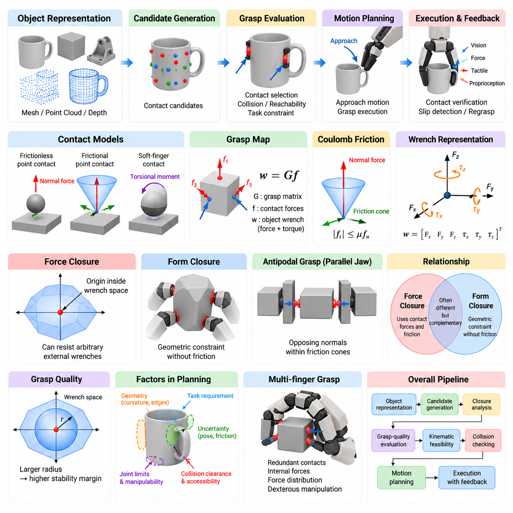
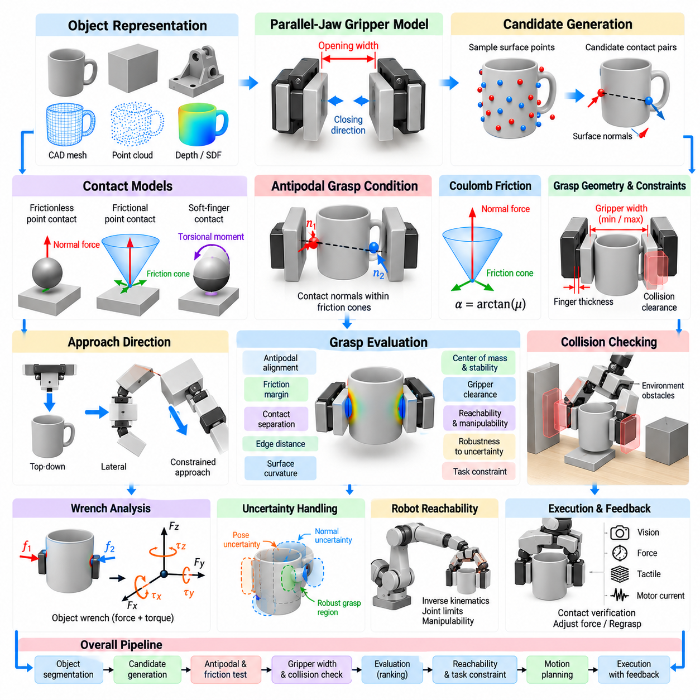
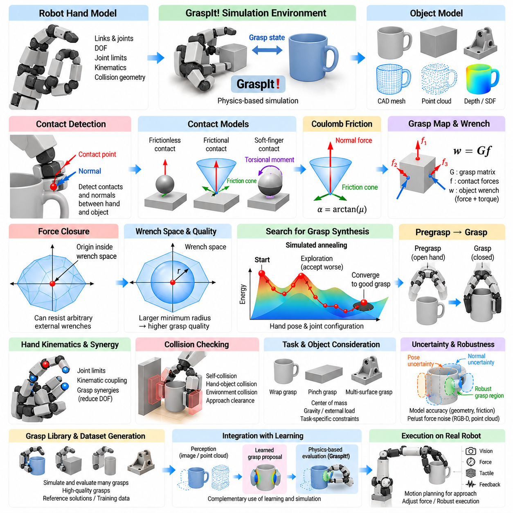
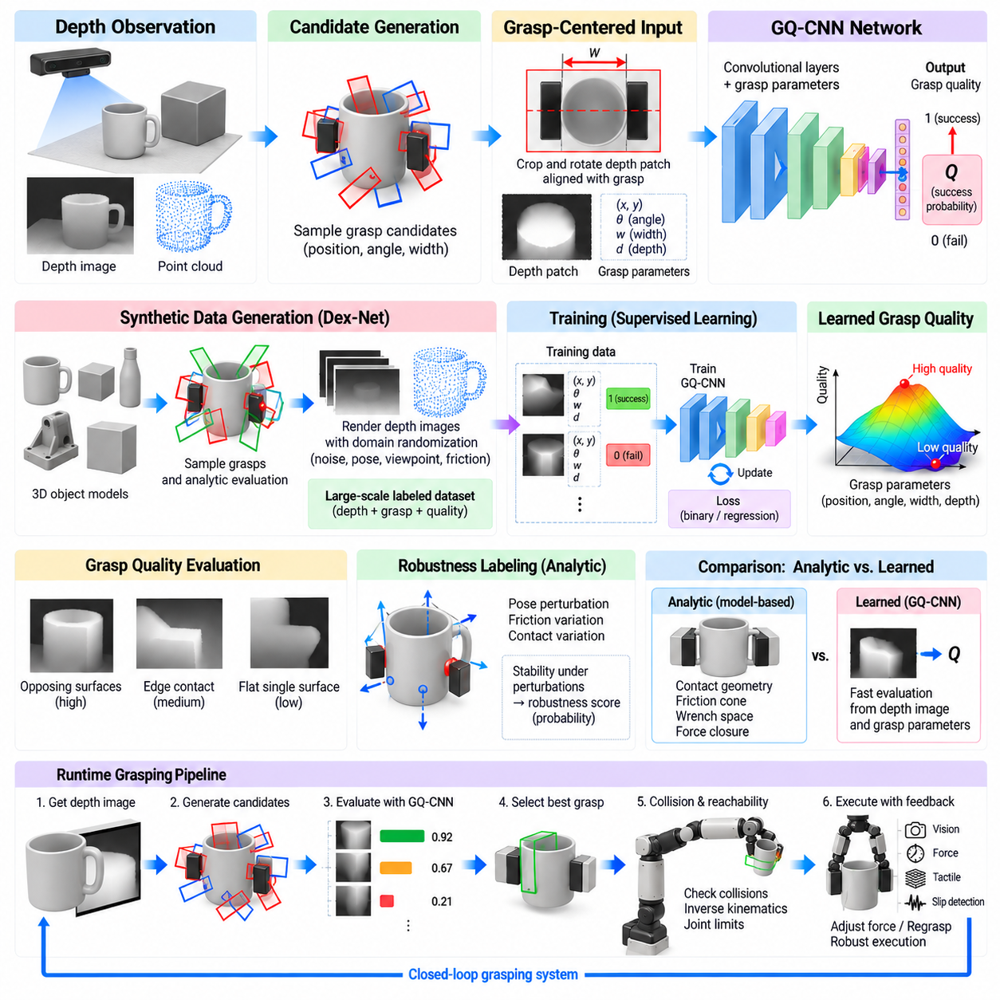
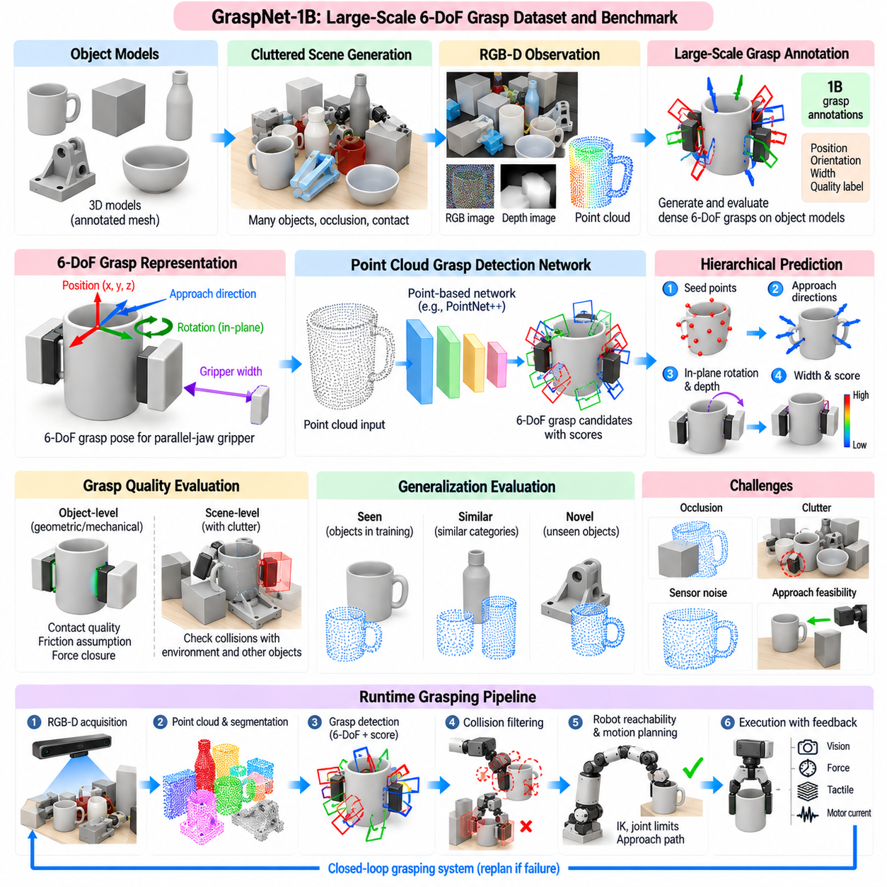
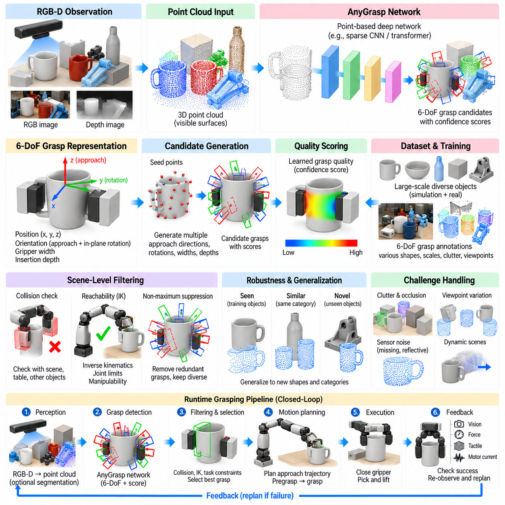
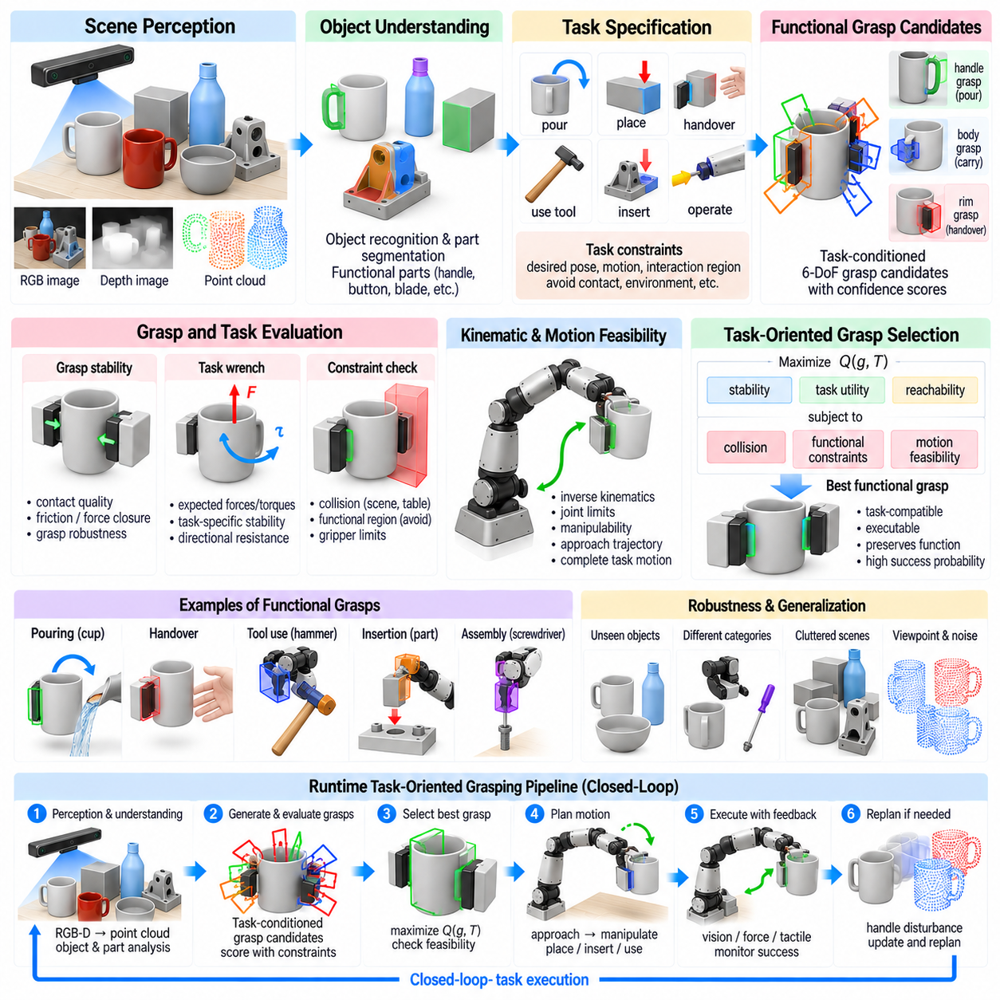
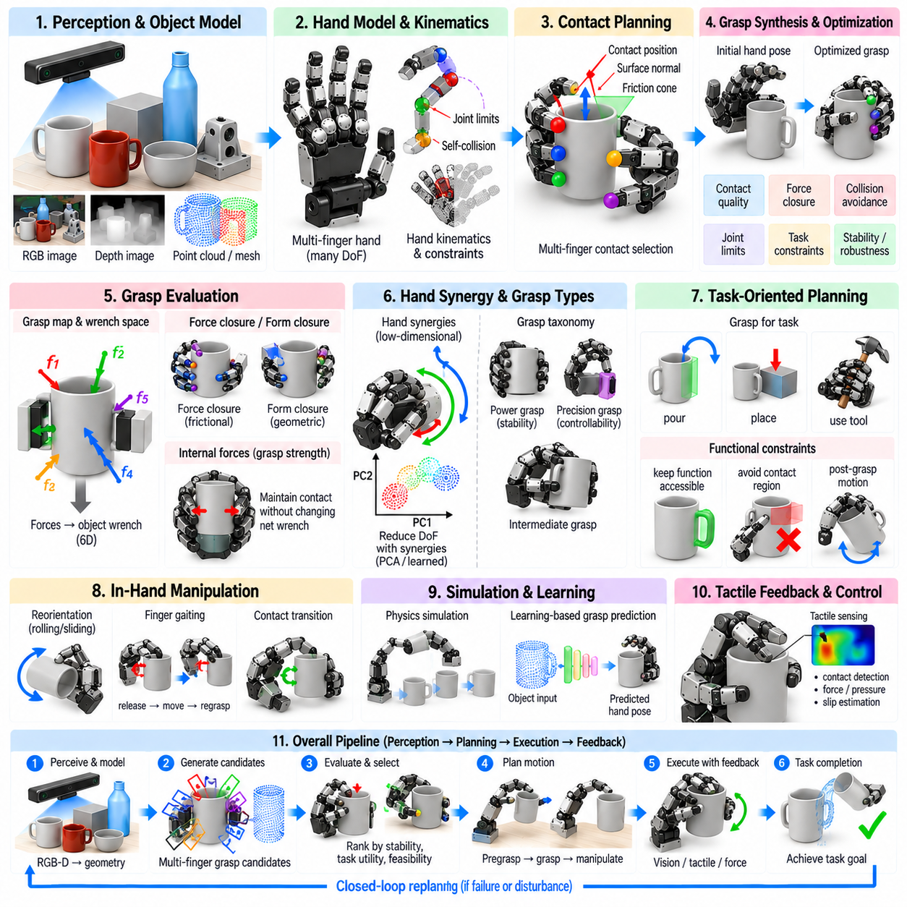
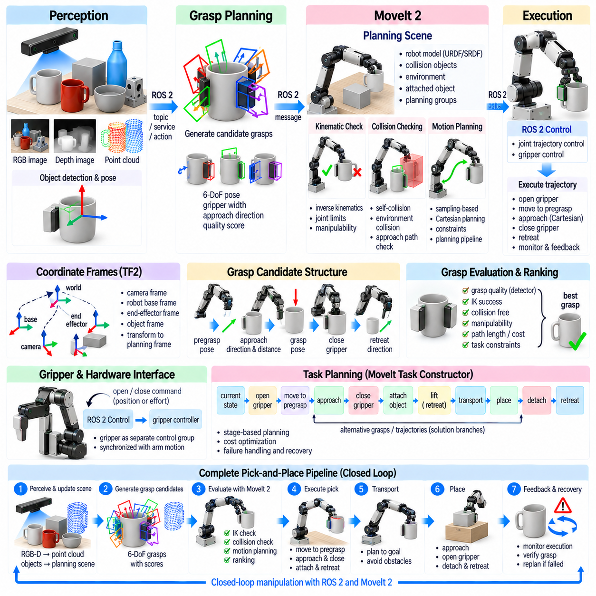
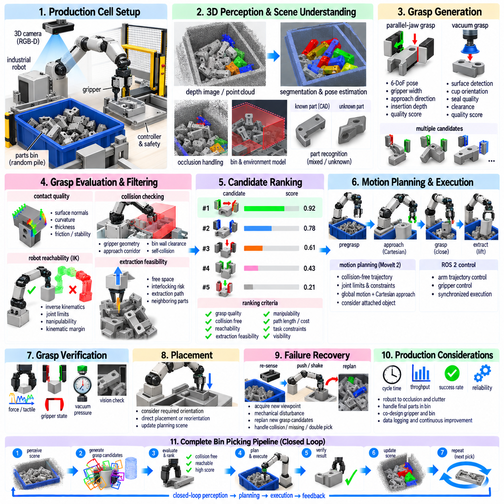

**Volume 17 Manipulation and Grasping AI**

# Chapter 05. Grasp Planning

## 05.01. Grasp Planning Theory Force Closure Form Closure

{width="7.268055555555556in" height="7.268055555555556in"}

Grasp planning is the process of selecting contact locations, hand configurations, and approach motions that allow a robot to acquire and maintain control of an object. Unlike simple geometric positioning, grasp planning must consider object shape, contact mechanics, friction, actuator limits, uncertainty, and the manipulation task that follows. Its fundamental objective is to determine whether a set of contacts can resist disturbances and constrain the object sufficiently for stable manipulation.

A useful theoretical model treats a grasp as a collection of contacts between the robotic hand or gripper and the object surface. Each contact can transmit forces and, depending on the contact model, moments. These local interactions are transformed into forces and torques acting on the object as a whole. The combined six-dimensional force and torque representation is called a wrench, providing a common mathematical framework for analyzing grasp stability in three-dimensional space.

The grasp map describes how forces generated at individual contacts contribute to the resultant wrench on the object. If the vector of contact forces is denoted by f, the object wrench can be expressed conceptually as w = Gf, where G is the grasp matrix. The structure of G depends on contact positions, surface normals, and contact models. Analyzing this mapping reveals whether the available contacts can generate the combinations of forces and torques required to oppose external disturbances.

Contact models determine what interactions are physically permitted between the fingers and object. A frictionless point contact transmits only a compressive force normal to the surface, whereas a point contact with friction can also support tangential forces. Soft-finger contacts may additionally transmit limited torsional moments. Selecting an appropriate contact model is important because overly idealized assumptions can predict stable grasps that cannot be maintained by a real robotic gripper.

Coulomb friction is commonly used to characterize frictional contact. Under this model, the tangential contact force must remain bounded relative to the normal force according to the coefficient of friction. In three dimensions, the admissible force vectors form a friction cone around the contact normal. Computational grasp planners frequently approximate this continuous cone using a finite set of edges, converting nonlinear contact constraints into tractable linear or convex optimization problems.

Force closure describes a grasp capable of generating object wrenches that oppose arbitrary external disturbances in every relevant direction. Intuitively, a force-closure grasp can resist forces and torques attempting to translate or rotate the object, provided that sufficiently large admissible contact forces can be generated. In wrench-space terms, force closure is associated with the origin lying strictly inside the convex region generated by the primitive contact wrenches.

Force closure depends strongly on friction because tangential contact forces substantially enlarge the wrench set available to the gripper. Two or more properly positioned frictional contacts may therefore stabilize an object even though the same contact geometry would fail under frictionless assumptions. However, the existence of theoretical force closure does not guarantee practical robustness, because limited friction, actuator saturation, inaccurate geometry, and uncertain contact positions can reduce the actual stability margin.

Form closure represents a stronger geometric notion of constraint in which object motion is prevented by contact geometry without relying on friction. Contacts are arranged so that every infinitesimal motion of the object is blocked by at least one unilateral constraint. Consequently, form closure can remain valid even when contact surfaces are assumed frictionless. Fixtures, jigs, enveloping grasps, and highly constrained multi-contact configurations provide intuitive examples of this principle.

The distinction between force closure and form closure is fundamental. Force closure exploits contact forces and friction to counter disturbances, whereas form closure derives immobilization primarily from geometry. A grasp can achieve force closure without achieving form closure, which is common for parallel-jaw and multifinger robotic hands. Form closure generally requires more restrictive contact arrangements, but when feasible it provides strong resistance to uncertainties in frictional properties.

Both closure concepts must account for unilateral contact. A robotic finger can normally push against an object but cannot pull it through an ordinary surface contact. Therefore, contact forces must satisfy nonnegative normal-force constraints. This apparently simple condition fundamentally shapes grasp feasibility. Closure analysis asks whether suitable combinations of physically admissible pushing forces can collectively reproduce the wrench directions necessary to constrain or stabilize the object.

Wrench space provides a geometric interpretation of these conditions. Every admissible contact force produces a corresponding wrench consisting of force and torque components. Combining contacts creates a grasp wrench space representing the disturbances that the grasp can balance. A planner can evaluate not merely whether closure exists, but also how far the grasp remains from instability. This converts grasp evaluation from a binary decision into a quantitative robustness problem.

One widely used grasp-quality concept measures the largest disturbance wrench that can be resisted in every direction before leaving the grasp wrench space. Geometrically, this can be related to the radius of a ball centered at the origin and contained within the feasible wrench region. A larger radius indicates a greater stability margin. Such metrics allow candidate grasps to be ranked rather than classified only as stable or unstable.

Grasp quality cannot be represented completely by closure alone. Practical planners also evaluate distance from joint limits, required finger forces, manipulability, collision clearance, approach accessibility, contact-area reliability, and sensitivity to pose error. A mathematically strong force-closure grasp may be unusable if the robot cannot reach it without collision or if small perception errors cause the fingertips to miss the intended surfaces.

Object geometry therefore enters grasp planning at several levels. Surface normals determine feasible contact directions, curvature influences contact reliability, and edges or corners may either provide useful geometric constraints or increase sensitivity to positioning errors. For parallel-jaw grippers, antipodal grasps are particularly important. Two opposing contacts form an antipodal configuration when the connecting geometry and surface normals satisfy frictional conditions that permit stable opposing forces.

Antipodal grasp analysis offers an efficient bridge between geometric reasoning and force-closure theory. Instead of evaluating arbitrary combinations of surface points, planners can search for contact pairs whose normals and friction cones support mutually opposing forces. Candidate generation can therefore be performed using meshes, point clouds, depth images, or learned object representations. Subsequent filtering removes candidates that violate gripper width, collision, reachability, or approach constraints.

Uncertainty changes the meaning of a theoretically optimal grasp. Estimated object pose may contain translational and rotational errors, surface normals reconstructed from depth measurements may be noisy, and the actual friction coefficient may differ from its nominal value. Robust grasp planning therefore evaluates neighborhoods of possible contacts and physical parameters rather than a single deterministic configuration. Grasps with slightly lower nominal quality may outperform fragile mathematical optima under real operating conditions.

Task requirements further modify grasp selection. A grasp suitable for lifting an object may obstruct the surface needed for inspection, assembly, insertion, handover, or tool use. Task-oriented grasp planning consequently considers the desired post-grasp motion and interaction constraints. The planner may intentionally sacrifice maximum closure quality to preserve visibility, expose functional surfaces, align the object with a target fixture, or maintain sufficient manipulator dexterity.

Modern grasp planning combines analytical mechanics with optimization and learning. Analytical closure tests provide physically interpretable stability criteria, while numerical optimization searches large configuration spaces under kinematic and collision constraints. Data-driven models can rapidly propose promising grasp poses from RGB-D images or point clouds. Their predictions are increasingly filtered or refined using geometric feasibility, contact mechanics, and force-closure reasoning to improve physical reliability.

For multifinger hands, the problem becomes considerably more complex because finger placement, joint configuration, internal forces, and object wrench generation are coupled. Redundant contacts can create internal forces that do not accelerate the object but improve contact stability. Optimization methods can distribute forces among fingers while satisfying friction cones, actuator limits, and desired object wrenches, enabling dexterous manipulation beyond simple pick-and-place operations.

In robotic manipulation systems, force closure and form closure should therefore be understood as foundational models rather than complete grasp-planning solutions. They establish whether contact arrangements possess the mechanical capability to constrain an object, while higher-level planning determines whether those arrangements are reachable, robust, safe, and useful for the task. This layered interpretation connects classical grasp mechanics directly to perception-driven and learning-based manipulation.

A complete grasp-planning pipeline consequently progresses from object representation and candidate contact generation to closure analysis, grasp-quality evaluation, kinematic feasibility, collision checking, and motion planning. Execution then introduces sensing and feedback to compensate for modeling errors. Force, tactile, vision, and proprioceptive measurements can verify contact establishment and detect slip, allowing the controller to adjust finger forces or trigger regrasping when the assumptions made during planning no longer hold.

The continuing importance of force-closure and form-closure theory lies in their ability to provide explicit physical meaning beneath increasingly sophisticated manipulation algorithms. Even when neural networks generate grasp candidates, the underlying problem remains one of controlling object motion through constrained contacts. Combining geometric closure, wrench-space analysis, uncertainty modeling, optimization, and feedback produces grasp planners that are not only computationally effective but mechanically defensible and robust in real environments.

## 05.02. Analytic Grasp Planning for Parallel Jaw Gripper [w/Code]

{width="7.268055555555556in" height="7.268055555555556in"}

Analytic grasp planning for a parallel-jaw gripper determines grasp configurations using explicit geometric, kinematic, and contact-mechanics models rather than relying primarily on learned examples. The planner searches for two opposing contact regions that can securely constrain an object while satisfying gripper opening, collision, reachability, and friction requirements. Because parallel-jaw grippers have simple mechanics, they provide an important setting for connecting classical grasp theory with practical robotic manipulation.

A parallel-jaw gripper normally consists of two fingers that translate toward each other along a common closing direction. A candidate grasp can therefore be represented by a gripper pose, opening width, approach direction, and two expected contact locations. The planning problem is substantially smaller than for a dexterous multifinger hand, but the restricted motion also limits the contact configurations available for stabilizing irregular objects.

Object geometry provides the primary input to analytic planning. A planner may operate on a CAD mesh, segmented point cloud, depth reconstruction, primitive geometric model, or signed distance representation. Surface positions and normals are extracted to identify regions that can be contacted by the two fingers. Local curvature, edges, surface discontinuities, and available clearance are also important because they influence both contact reliability and collision-free finger placement.

A fundamental candidate is the antipodal grasp, in which two contacts lie on approximately opposing sides of the object and can generate mutually opposing forces. For frictionless contacts, the contact normals must align very closely with the line joining the contact points. With friction, the admissible directions expand according to the friction cones, allowing a broader set of geometrically imperfect contact pairs to produce stable grasps.

For two candidate contacts p1 and p2, the vector connecting them defines the approximate closing axis of the gripper. Surface normals n1 and n2 are then compared with this axis and its opposite direction. An antipodal condition is satisfied when the required contact forces fall inside the friction cones at both contacts. This geometric test provides an efficient approximation to more general force-closure analysis and is widely used to reject unsuitable contact pairs early.

Coulomb friction determines how much deviation from perfect opposition can be tolerated. If the coefficient of friction is μ, the friction-cone half-angle can be expressed as α = arctan(μ). Larger friction coefficients produce wider cones and permit a greater range of contact orientations. Because actual friction is uncertain, practical planners often use a conservative coefficient rather than the largest expected value, reducing the probability that apparently stable grasps fail during execution.

Gripper width introduces another direct feasibility constraint. The distance between the selected contact surfaces must fall within the minimum and maximum opening range of the gripper while allowing sufficient closing motion to generate normal force. Finger thickness and pad geometry must also be considered. A contact pair may satisfy the antipodal condition mathematically yet remain impossible because the fingers cannot physically enter the required spaces around the object.

Candidate generation can be performed by sampling pairs of surface points and testing their geometric compatibility. However, evaluating every possible pair becomes expensive for dense meshes or point clouds. Analytic planners therefore use normal-direction filtering, spatial indexing, surface segmentation, voxel structures, or geometric heuristics to reduce the search space. Sampling can also be biased toward broad, nearly planar regions that are more tolerant of localization error.

Another approach constructs grasp candidates from the gripper geometry rather than from arbitrary point pairs. A virtual gripper is swept through possible positions and orientations around the object, and the surfaces intersected by the closing fingers are examined. This representation naturally incorporates opening width and finger dimensions. It can also identify grasps in which the final contacts differ slightly from initially predicted surface samples as the fingers close.

Collision checking is essential because contact feasibility does not imply gripper feasibility. The fingers, palm, wrist, and sometimes part of the manipulator must avoid unintended intersections with the object, table, bin walls, neighboring objects, and environmental structures. Collision tests are usually performed for both the final grasp pose and the approach trajectory, because a valid final configuration may be unreachable through the selected straight-line approach.

Approach direction strongly affects practical success. Top-down grasps are often preferred in bins or on horizontal work surfaces because they simplify collision avoidance, while lateral grasps may provide better contact geometry for elongated or vertically oriented objects. Analytic planners can explicitly constrain approach angles according to the environment. They may also reserve additional clearance along the approach vector to account for calibration and perception errors.

Once feasible candidates have been generated, grasp-quality metrics are used to rank them. For parallel-jaw grasping, useful metrics include antipodal alignment, friction margin, contact separation, distance from edges, local surface curvature, gripper clearance, and proximity to the object\'s center of mass. A candidate with excellent normal alignment may still be undesirable if both contacts occur near sharp edges where small pose errors can cause contact loss.

The center of mass is especially important when the object must be lifted. A grasp far from the center of mass creates a larger gravitational torque, increasing the force required to prevent rotation or slip. When mass distribution is known, the planner can favor contact pairs whose grasp axis and contact midpoint provide favorable mechanical leverage. When it is unknown, geometric center or learned mass estimates may serve as practical approximations.

Analytic stability can also be evaluated through wrench analysis. Contact forces at the two fingertips are transformed into forces and torques about an object reference frame, producing a set of achievable object wrenches. The planner can estimate whether gravity and expected task disturbances lie within this set. Although full wrench-space computation is more expensive than simple antipodal tests, it provides a stronger physical basis for ranking difficult grasps.

Pose uncertainty must be incorporated because the object model used for planning rarely matches the physical object perfectly. Errors in translation, orientation, depth measurement, segmentation, and camera calibration shift the actual contact locations relative to their predictions. Robust analytic planning evaluates whether a grasp remains feasible when the object pose is perturbed. Broad planar contacts and large collision margins are often preferred over narrowly optimized configurations.

Surface-normal uncertainty is similarly important when planning directly from point clouds. Normals estimated from sparse or noisy depth measurements may vary significantly with neighborhood size and sensor viewpoint. A planner can reject poorly conditioned regions, average normals over local patches, or evaluate a range of possible normal directions. This prevents small reconstruction errors from producing large changes in antipodal classification and grasp ranking.

Reachability adds the manipulator to the planning problem. A geometrically valid gripper pose must correspond to at least one robot joint configuration satisfying inverse kinematics, joint limits, and workspace constraints. Some candidates may technically be reachable but place the arm near singularities or joint boundaries. Manipulability and configuration margin can therefore be included in the grasp score to favor poses that support reliable subsequent motion.

Task-oriented constraints further refine candidate selection. Picking an object from a bin may prioritize extraction clearance, whereas assembly may require the object to be held in a specific orientation for insertion. A grasp used for handover should avoid regions intended for human contact, and inspection tasks may require important surfaces to remain visible. Analytic planning can represent these requirements as geometric constraints or additional scoring terms.

For cluttered environments, grasp planning and object extraction cannot be separated completely. Neighboring objects may block finger placement or prevent the selected object from moving along the intended withdrawal path. The planner may therefore evaluate swept volumes for the gripper and grasped object. A slightly weaker grasp with an unobstructed extraction path can be substantially more useful than the highest-quality static grasp trapped inside clutter.

The computational pipeline typically begins with object segmentation or model registration, followed by surface analysis and candidate contact generation. Antipodal and friction tests remove mechanically invalid pairs, while gripper-width and collision tests eliminate geometrically impossible configurations. Remaining candidates are evaluated for reachability, stability, robustness, and task suitability before motion planning selects an executable approach and retreat trajectory.

Efficient implementation often uses hierarchical filtering. Inexpensive geometric tests are applied first to thousands of candidates, while costly collision, inverse-kinematics, wrench-space, and trajectory evaluations are reserved for a smaller surviving set. This ordering is important for real-time manipulation because exhaustive high-fidelity evaluation of every possible grasp is unnecessary. The objective is to reject clearly poor candidates as early as possible without eliminating promising ones.

Execution closes the gap between analytic assumptions and physical reality. Position control moves the gripper toward the predicted grasp pose, but force, motor-current, tactile, or visual feedback can determine whether both fingers actually established contact. Unexpected early contact may indicate pose error, while asymmetric finger motion may reveal an offset object. The controller can modify closing force, stop the motion, or request a new grasp when execution deviates from the plan.

Analytic parallel-jaw planning remains valuable even as learning-based grasp detection becomes increasingly capable. Its geometric and mechanical constraints are interpretable, require little or no task-specific training data, and can enforce safety or hardware limits explicitly. In practical systems, learned models may rapidly generate promising poses while analytic tests verify antipodal geometry, collision clearance, reachability, and physical plausibility before execution.

The resulting hybrid perspective preserves the strengths of classical grasp mechanics while accommodating uncertain perception and complex environments. Parallel-jaw grasp planning is therefore not merely the search for two opposing points; it is a coordinated evaluation of contact geometry, friction, gripper dimensions, object mechanics, robot kinematics, environmental clearance, uncertainty, and task objectives. Analytic reasoning provides the physical structure that turns these factors into executable and robust robotic grasps.

## 05.03. GraspIt Physics Based Grasp Synthesis [w/Code]

{width="7.268055555555556in" height="7.268055555555556in"}

GraspIt! is a simulation environment designed for studying robotic grasping through explicit models of hand geometry, object geometry, contact mechanics, and grasp quality. Rather than treating grasp generation as only a pose-prediction problem, it represents the physical interaction between a robotic hand and an object. This makes it useful for investigating how finger configuration, contact placement, friction, and force transmission determine whether a grasp can physically stabilize an object.

A typical GraspIt! workflow begins by loading geometric models of a robotic hand and a target object into a common simulation environment. The hand model describes links, joints, degrees of freedom, joint limits, and collision geometry, while the object model represents the surfaces available for contact. The relative pose between hand and object then defines a grasp state from which collision detection, contact formation, force analysis, and quality evaluation can be performed.

Physics-based grasp synthesis differs fundamentally from selecting visually plausible hand poses. A candidate must satisfy geometric accessibility while producing contacts capable of resisting disturbances. Consequently, grasp synthesis searches a configuration space containing both the global pose of the hand and its internal joint configuration. For dexterous hands this space can become very large, making efficient search strategies essential for discovering useful grasps within practical computational limits.

Contact detection provides the connection between geometry and mechanics. As fingers move toward the object, the simulator determines where links and object surfaces meet and estimates the associated contact locations and normals. These contacts define the directions in which forces may be transmitted. Depending on the contact model, frictional tangential forces and limited moments may also be represented, allowing the resulting grasp to be analyzed through physically meaningful force and wrench constraints.

Friction is commonly represented using a Coulomb friction model. At each contact, admissible tangential forces are bounded relative to the compressive normal force, producing a friction cone around the surface normal. For computational analysis, the continuous cone can be approximated by a finite set of primitive force directions. Each primitive contact force can then be transformed into an object wrench containing both force and torque components.

The grasp map transforms contact forces into the net wrench acting on the object. If contact forces are collected into a vector f, the object wrench can be represented conceptually as w = Gf, where G is determined by contact positions, directions, and the object reference frame. This representation allows GraspIt!-style analysis to ask whether available finger contacts can collectively counter forces and torques that would otherwise translate or rotate the object.

Force closure is one of the central criteria used in physics-based grasp evaluation. A force-closure grasp can generate admissible contact forces that resist arbitrary external wrench directions within the assumed contact model. Geometrically, primitive contact wrenches generate a region in wrench space, and force closure is associated with the origin being enclosed appropriately by this region. The condition provides a physically interpretable distinction between merely touching an object and mechanically constraining it.

Grasp quality extends force closure from a binary test into a ranking criterion. One influential metric measures the magnitude of the smallest disturbance direction that causes the grasp to reach the boundary of its achievable wrench space. A larger minimum margin generally indicates that the grasp can tolerate stronger disturbances from different directions. Such wrench-space metrics allow thousands of candidate hand configurations to be compared using a common mechanical criterion.

Quality evaluation must nevertheless be interpreted carefully. A high wrench-space score depends on assumptions about friction, contact accuracy, available finger forces, and object geometry. A simulated optimum may be fragile when transferred to a physical robot if the real coefficient of friction differs from the model or if the object pose is inaccurate. Physics-based synthesis is therefore most useful when quality metrics are combined with practical robustness considerations rather than treated as absolute guarantees.

Searching the complete hand configuration space directly is usually impractical. A multifinger hand may contain many joints in addition to six dimensions describing its pose relative to the object. GraspIt! addresses this general class of problem through search mechanisms that explore candidate configurations and evaluate their quality. Search efficiency can be improved by restricting approach directions, coupling finger joints, introducing hand postures, or reducing the dimensionality of the internal configuration space.

Simulated annealing is closely associated with GraspIt! grasp planning and provides a mechanism for exploring complicated grasp spaces containing many local optima. Candidate states are perturbed by changing hand pose or finger configuration, after which an energy or quality function determines whether the new state is preferable. Controlled acceptance of temporarily worse states helps the search escape local minima and investigate alternative regions before gradually concentrating on stronger grasp candidates.

An energy function provides the bridge between search and physical grasp quality. Depending on the planning strategy, it can include terms related to hand-object distance, contact formation, alignment, collision, force closure, or wrench-space quality. Poor configurations receive unfavorable energy values, while configurations approaching mechanically useful contact arrangements become more attractive. Designing the energy landscape strongly influences how efficiently the search converges toward meaningful grasps.

Pregrasp states are important because a robot must reach the object before closing its fingers. A final grasp may exhibit excellent contact quality yet be impossible to approach because the hand initially intersects the object or surrounding environment. Physics-based synthesis can therefore distinguish between an open-hand pregrasp configuration and the final closed configuration. The transition between them provides information about whether the proposed grasp can be executed through realistic finger motion.

Collision detection is integrated with this geometric reasoning. Self-collisions within the robotic hand, unintended hand-object penetration, and collisions involving non-contact hand surfaces can invalidate otherwise promising states. In practical manipulation, environmental obstacles must also be considered by downstream motion planning. A useful grasp candidate must therefore combine strong contacts with sufficient geometric clearance for the palm, fingers, wrist, and approach trajectory.

Hand kinematics place additional constraints on synthesis. Every contact configuration must be realizable within joint limits and mechanical coupling relationships. Joint values determine fingertip positions and surface orientations, while the global hand pose determines how those fingertips approach the object. This coupling between hand pose and finger articulation distinguishes full-hand physics-based synthesis from simpler parallel-jaw grasp detection based primarily on a single gripper pose and opening width.

Grasp synergies can reduce the dimensionality of dexterous-hand planning. Human-like robotic hands often exhibit coordinated finger motions that can be represented using a smaller number of principal posture variables instead of controlling every joint independently. Searching in a synergy space can dramatically reduce computational complexity while preserving useful grasp families. The resulting candidate can later be expanded into the full joint configuration for detailed collision and contact evaluation.

Object shape strongly affects the resulting grasp family. Cylindrical objects naturally support wrap or opposing-finger grasps, thin objects favor pinch configurations, and irregular objects may require contacts distributed across several surfaces. Physics-based synthesis does not need to assign these categories explicitly if the geometric and mechanical models are sufficiently detailed. Instead, different grasp types can emerge from the interaction between hand structure, object shape, search constraints, and quality functions.

The center of mass and expected external loading can further influence grasp selection. A grasp that achieves generic force closure may still perform poorly when lifting a heavy object or applying a task-specific wrench. Incorporating gravity or expected disturbance directions allows candidates to be evaluated against the manipulation task rather than an abstract isotropic disturbance model. This is particularly valuable for tool use, insertion, carrying, and other operations with predictable loading patterns.

Model accuracy becomes critical when synthesized grasps are transferred from simulation to hardware. Mesh resolution, collision geometry, joint calibration, fingertip compliance, friction coefficients, and object pose all influence the difference between simulated and physical contacts. Small geometric errors can cause a fingertip to contact earlier than predicted or miss a narrow surface entirely. Robust transfer therefore favors grasps with meaningful contact and clearance margins rather than extremely precise geometric optima.

Perception introduces another layer of uncertainty because the object encountered by the robot may be reconstructed from RGB-D data rather than supplied as a perfect CAD model. Surface noise and incomplete observations affect collision geometry and estimated normals. A practical pipeline may fit a known object model to sensor data, reconstruct a surface representation, or generate multiple pose hypotheses before applying physics-based evaluation to candidate grasps.

GraspIt! is especially valuable as an offline analysis and dataset-generation tool. Large sets of object-hand combinations can be simulated, searched, and scored before physical execution. The resulting grasps can serve as reference solutions, training examples, or evaluation data for learning-based grasp systems. Physics-based labels provide information about contacts and mechanical quality that cannot be obtained simply from visual similarity between a predicted pose and a demonstrated pose.

This creates a natural connection between classical simulation and modern learning-based manipulation. A neural model can propose grasp poses rapidly from images or point clouds, while a physics-based engine evaluates or refines a smaller subset using collision, contact, and wrench criteria. Conversely, simulated grasp synthesis can generate supervision for models that later perform fast inference. The two approaches therefore complement rather than necessarily replace each other.

A complete system may use GraspIt!-style synthesis offline to create a library of high-quality grasps for known objects. During operation, perception estimates object identity and pose, retrieves appropriate candidates, transforms them into the robot frame, and filters them according to current obstacles and reachability. Motion planning then selects an approach trajectory, while force or tactile feedback compensates for residual discrepancies between the simulated model and the physical scene.

For unknown or highly variable objects, online search may instead begin from geometric candidates generated directly from observed surfaces. Physics-based evaluation can reject unstable or collision-prone configurations, while reduced-dimensional search or learned initialization limits computational cost. This hybrid structure preserves explicit mechanical reasoning while avoiding exhaustive exploration of the entire hand configuration space for every newly observed object.

The broader importance of GraspIt! lies in the formulation it represents: grasping is a coupled problem involving geometry, kinematics, contact mechanics, optimization, and task constraints. A successful grasp is not simply a visually reasonable hand pose but a physically realizable state capable of producing useful forces and torques while remaining reachable and collision-free. This formulation continues to provide a rigorous foundation for evaluating newer grasp-generation methods.

Physics-based grasp synthesis therefore remains an important component of robotic manipulation research even when final deployment relies on faster learned models. Explicit contact and wrench reasoning provides interpretable measures of why a grasp should work, simulation enables systematic exploration without repeated hardware trials, and optimization exposes relationships among hand design, object geometry, and grasp stability. Together, these capabilities make GraspIt!-style planning a valuable bridge between classical grasp theory and data-driven robotic manipulation.

## 05.04. GQ CNN Data Driven Grasp Quality [w/Code]

{width="7.268055555555556in" height="7.268055555555556in"}

GQ-CNN, or Grasp Quality Convolutional Neural Network, is a data-driven framework for predicting whether a candidate robotic grasp is likely to succeed from depth-based observations. Instead of calculating grasp quality entirely from explicit contact geometry and friction models during execution, the network learns a mapping between local object appearance, candidate grasp parameters, and a probability-like grasp-quality score from large collections of labeled examples.

The central idea is to represent grasp evaluation as supervised learning. Training samples contain observations of object geometry together with candidate grasps and associated success or robustness labels. A convolutional neural network learns visual features correlated with stable grasping, allowing quality estimates to be computed rapidly for previously unseen observations. This shifts expensive physical reasoning toward dataset generation and offline training while keeping online inference relatively efficient.

Depth sensing is particularly suitable for this formulation because grasping depends strongly on surface geometry rather than object color or texture. A depth image directly encodes visible distance and shape information that can reveal boundaries, planar regions, curvature, and geometric discontinuities. GQ-CNN-style systems can therefore operate on depth observations while remaining less sensitive than RGB-only methods to illumination, surface appearance, and texture variation.

For a parallel-jaw gripper, a grasp candidate can be parameterized by position, orientation, gripper opening, and depth relative to the observed object. Rather than processing every candidate in the full camera image independently, the system can extract or transform a local depth region aligned with the proposed grasp. This grasp-centered representation simplifies learning because similar contact geometries appear in approximately similar orientations within the network input.

The network receives geometric image information together with grasp-related parameters and produces an estimate of grasp robustness or success. Convolutional layers extract spatial features from the depth representation, while additional network components can incorporate grasp depth or other scalar parameters. The learned representation associates patterns such as opposing surfaces, adequate clearance, stable contact regions, and unfavorable edges with different levels of predicted grasp quality.

A major challenge is obtaining enough labeled grasp examples. Physical collection using robots would require enormous numbers of grasp attempts and could be expensive, slow, and damaging to hardware. GQ-CNN research therefore demonstrates the importance of synthetic data generation, where object models, grasp candidates, physical parameters, and analytical robustness criteria can be used to generate large-scale training datasets without executing every example on a real robot.

Synthetic grasp generation commonly begins with three-dimensional object models. Candidate gripper poses are sampled around object surfaces, after which geometric and mechanical tests estimate whether the contacts provide a robust grasp. Labels may be derived from force-closure reasoning, friction assumptions, pose perturbations, or other analytic measures. The resulting dataset links rendered or simulated sensor observations with physically motivated grasp-quality targets.

Domain randomization and uncertainty modeling are important because synthetic training data cannot perfectly reproduce physical sensing and manipulation. Object pose, camera viewpoint, depth noise, friction, and other parameters can be varied during generation. By training across these variations, the network learns grasp features that remain useful across a range of conditions instead of memorizing one idealized simulation configuration.

Robust grasp labeling extends beyond determining whether a nominal grasp satisfies force closure. A candidate can be tested under perturbations of object pose, gripper pose, friction coefficient, and contact location. Its quality can then reflect the probability or frequency with which stability is maintained. This approach creates labels that explicitly reward grasps with tolerance to uncertainty, which is essential for transferring predictions from simulation to physical robots.

At runtime, the system first obtains a depth image of the workspace and identifies regions where grasping may be possible. Candidate grasps are generated through sampling or structured search, transformed into the representation expected by the network, and evaluated by GQ-CNN. Because neural inference is much faster than detailed physical simulation for every candidate, a large number of possibilities can be scored before selecting the most promising grasp.

Candidate generation remains important even with a powerful quality network. GQ-CNN evaluates proposed grasps rather than eliminating the need to search the action space. Poor sampling can prevent the system from ever considering a good grasp. Practical implementations therefore combine grasp-quality prediction with efficient sampling, geometric constraints, collision reasoning, or optimization procedures that concentrate evaluation on promising regions of the grasp configuration space.

Dex-Net is closely associated with the development of GQ-CNN-based grasping. The broader Dex-Net framework uses synthetic object models, analytic grasp metrics, simulated sensor observations, and learning to construct large datasets for robust robotic grasping. Within this framework, GQ-CNN provides a mechanism for approximating computationally expensive grasp-quality calculations directly from sensor observations and candidate grasp configurations.

The distinction between analytic grasp quality and learned grasp quality is important. Analytic methods explicitly calculate contact geometry, friction cones, wrench spaces, and stability conditions for a known model. GQ-CNN instead learns statistical relationships between observations and labels produced from such reasoning or experimental outcomes. The learned model can therefore evaluate grasps quickly, but its reliability depends strongly on the coverage and validity of its training distribution.

Generalization to unseen objects is one of the main motivations for this approach. Rather than memorizing object identities and retrieving predefined grasps, the network can learn local geometric structures associated with successful parallel-jaw contacts. An unfamiliar object may still contain opposing surfaces, suitable edges, or stable contact regions resembling patterns represented in training data. This enables category-independent grasping when the geometric distribution remains sufficiently familiar.

However, generalization has limits. Transparent, reflective, extremely thin, deformable, articulated, or highly unusual objects may produce depth observations outside the training distribution. Sensor artifacts can also create false geometry. A high predicted score should therefore not automatically be interpreted as guaranteed physical success. Confidence calibration, geometric validation, collision checking, and execution feedback remain valuable components of a reliable manipulation system.

Collision reasoning is especially important because a local grasp patch may appear excellent while the complete gripper collides with the table, bin, neighboring objects, or another part of the target. Candidate evaluation should therefore include environmental geometry beyond the network\'s local input when necessary. A practical system may first reject clearly colliding grasps, use GQ-CNN for quality ranking, and then apply more detailed collision and motion checks to top candidates.

Robot reachability introduces another constraint not captured completely by local grasp quality. A candidate may have excellent predicted contacts but require an impossible wrist orientation or place the manipulator near a singularity. The selected grasp should therefore be transformed from the camera frame into the robot frame and tested using inverse kinematics, joint limits, manipulability, and motion-planning constraints before execution.

The quality score can also be incorporated into optimization rather than used only for independent candidate ranking. Sampling may begin broadly and then concentrate around high-scoring regions by perturbing grasp position, angle, or depth. Repeated evaluation produces a search process in which the learned quality function acts as an objective. This enables more efficient exploration than uniformly evaluating an extremely dense set of grasp configurations.

Training quality depends strongly on dataset diversity. The object library should contain sufficient variation in size, shape, curvature, thickness, and surface structure to expose the network to many contact geometries. If training objects represent only a narrow set of shapes, the model may learn shortcuts that fail on unfamiliar scenes. Diversity in sensor configuration, object pose, and grasp parameters is similarly important for robust deployment.

Class imbalance can arise because randomly generated candidate grasps may contain many more failures than high-quality successes, or filtering may produce the opposite imbalance. Training procedures must ensure that the model learns meaningful distinctions across the quality range rather than predicting the dominant class. Sampling strategies, weighting, balanced batches, or carefully designed continuous quality targets can improve the information extracted from synthetic grasp datasets.

Sim-to-real transfer is a defining challenge for data-driven grasp quality prediction. Synthetic depth rendering is typically cleaner than real depth measurements, while physical contacts include compliance, calibration error, actuator behavior, and frictional effects that are difficult to model perfectly. Noise injection and parameter randomization reduce this gap, but physical validation remains necessary to determine whether predicted robustness corresponds to actual grasp success.

Execution feedback can compensate for residual prediction errors. After the robot approaches and closes the gripper, finger position, motor current, force sensing, tactile sensing, or vision can determine whether expected contacts were established. If the grasp is asymmetric, empty, or slipping, the system can modify gripping force or initiate a regrasp. Learned grasp selection and feedback control therefore address different stages of the manipulation problem.

GQ-CNN also illustrates a broader design principle for Physical AI: expensive physical reasoning can be used to generate structured supervision, while learned models compress that reasoning into fast inference functions. Analytical mechanics provides physically meaningful labels, simulation supplies scale and controlled variation, and neural networks provide rapid online evaluation. The resulting architecture combines model-based knowledge with data-driven generalization rather than treating them as competing alternatives.

A modern implementation can extend this principle beyond the original formulation. Richer depth encoders, point-cloud networks, implicit three-dimensional representations, transformer-based perception, uncertainty estimation, and multimodal sensing can replace or augment individual components while preserving the central concept. Candidate actions are generated, observations are encoded, grasp quality is predicted, and physical or geometric constraints filter the result before robot execution.

For industrial manipulation, this separation between candidate generation, learned quality prediction, and physical validation is particularly useful. Different grippers, objects, workcells, and safety constraints can modify the candidate generator or validation stages without requiring the entire architecture to be redesigned. The learned quality model can also be retrained or fine-tuned when new object distributions and sensor conditions become available.

The lasting contribution of GQ-CNN is therefore not limited to a particular convolutional network architecture. It demonstrates how large-scale synthetic data, robust analytic grasp metrics, depth perception, and supervised learning can be integrated into a practical grasp-selection pipeline. By learning an efficient approximation of physically grounded grasp quality, the approach connects classical contact mechanics with scalable data-driven robotic perception and manipulation.

## 05.05. GraspNet 1B Large Scale Grasp Detection [w/Code]

{width="7.268055555555556in" height="7.268055555555556in"}

GraspNet-1Billion is a large-scale benchmark and dataset designed to advance generalizable robotic grasp detection in realistic cluttered scenes. Its central contribution is to formulate grasp prediction at a scale far beyond small object-specific grasp libraries, providing enormous numbers of annotated six-degree-of-freedom grasp candidates associated with real objects and RGB-D observations. This scale enables data-driven models to learn reusable geometric patterns for grasping previously unseen objects.

Unlike planar grasp detection, which commonly predicts a rectangle in an image, GraspNet focuses on six-degree-of-freedom grasp poses in three-dimensional space. A grasp specifies the position and orientation of a parallel-jaw gripper relative to an object, together with parameters related to gripper opening and contact feasibility. This representation allows robots to approach objects from diverse directions rather than being restricted primarily to top-down grasping.

The dataset is constructed around physical object models placed in cluttered tabletop scenes and observed using RGB-D sensors. Multiple objects can appear simultaneously with occlusion, contact, and complex spatial arrangements. Such scenes more closely resemble practical robotic picking than isolated-object images. The benchmark therefore evaluates not only whether a model understands local object geometry, but whether it can discover executable grasps when much of an object may be hidden.

Large-scale grasp annotation is difficult to obtain through physical robot trials alone. GraspNet addresses this challenge by combining accurate three-dimensional object models, registered scene geometry, and systematic grasp generation. Candidate grasps can be evaluated geometrically and physically on object models, then transformed into scene coordinates using known object poses. This strategy produces dense grasp supervision without requiring billions of real grasp attempts.

The term "1Billion" reflects the enormous scale of grasp annotations rather than one billion independently captured physical scenes. Many candidate grasps can be associated with each object and transformed across multiple object poses and scenes. This dense annotation strategy exposes learning algorithms to broad variation in contact position, approach orientation, gripper configuration, and object geometry, providing a rich basis for learning three-dimensional grasp affordances.

A key distinction in GraspNet is between object-level grasp quality and scene-level grasp feasibility. A grasp may be mechanically valid for an isolated object but impossible in a cluttered scene because the gripper collides with neighboring objects or the supporting surface. Scene-level evaluation must therefore consider both the target object\'s geometry and surrounding obstacles. This distinction is essential for translating grasp detection from benchmark predictions into executable robotic actions.

Point clouds provide a natural representation for GraspNet-style grasp detection because they preserve three-dimensional surface geometry obtained from depth sensing. A point-cloud network can analyze visible surfaces directly and predict candidate grasp locations, orientations, and scores. Compared with purely image-based representations, this makes geometric relationships such as surface normals, clearances, object boundaries, and local three-dimensional structure more explicit.

Modern grasp detectors often begin by identifying promising seed points on the observed point cloud. Local features around these points describe geometric structures that may support stable contact. The detector then estimates possible approach directions, in-plane rotations, gripper depths, widths, and grasp scores. Hierarchical prediction reduces the enormous continuous six-dimensional search space into a structured sequence of manageable estimation problems.

Viewpoint or approach-direction prediction is particularly important for six-degree-of-freedom grasping. A robot may approach the same object from above, from the side, or from an oblique direction depending on visible geometry and surrounding clutter. Instead of assuming one fixed approach axis, the network can evaluate multiple candidate directions around promising surface regions. This capability substantially expands the range of objects and scene arrangements that can be handled.

After selecting an approach direction, the detector must determine the gripper\'s rotation around that axis and its insertion depth relative to the object surface. These variables affect which surfaces enter the gripper closing region and whether the fingers can form useful contacts. Discretizing some orientation or depth variables can simplify learning, while later refinement can improve pose precision. The final output is a set of scored 6-DoF grasp hypotheses.

Grasp scores represent the predicted suitability of candidate configurations. During training, supervision can reflect geometric contact quality, frictional assumptions, collision status, or precomputed grasp annotations. At inference time, the network assigns higher scores to configurations resembling successful geometric relationships learned from the dataset. The score is therefore a learned approximation of grasp usefulness rather than a guarantee that every high-scoring candidate will succeed physically.

Collision detection remains necessary after network prediction. A candidate may align well with the target surface while the gripper body intersects another object, the table, or an occluded portion of the scene. Efficient collision checking can use reconstructed point clouds, voxelized occupancy, signed-distance representations, or explicit object models when available. Candidates failing these checks are removed before robot reachability and motion planning are considered.

Occlusion is one of the central challenges addressed by cluttered-scene grasp detection. The sensor observes only visible surfaces, while the gripper may interact with geometry that is partially or completely hidden. A robust detector must infer graspability from incomplete information without assuming unsupported free space. Conservative collision margins and multi-view sensing can reduce the risk of planning through unseen geometry when high reliability is required.

The benchmark\'s seen, similar, and novel object settings are important for measuring generalization. Performance on objects represented during training indicates the ability to recognize familiar grasp structures, while evaluation on unseen categories or geometries tests whether the model has learned transferable three-dimensional principles. Strong performance on novel objects is especially important for general-purpose robotic manipulation where exhaustive object-specific training is impossible.

Generalization is enabled partly by the local nature of many useful grasp features. Parallel-jaw grasping often depends on opposing surfaces, suitable thickness, sufficient clearance, and locally compatible normals. Different objects can share these structures even when their semantic categories differ. Large-scale training exposes the detector to enough geometric variation that these reusable relationships can be learned instead of relying only on object identity.

However, local geometry alone is insufficient in difficult clutter. A candidate contact region may appear excellent but offer no safe approach path. Contextual features describing neighboring points and scene occupancy help the detector distinguish accessible surfaces from geometrically attractive but blocked ones. This motivates architectures that combine local grasp evidence with progressively larger spatial context rather than evaluating each small patch independently.

Sensor noise also affects grasp prediction. Depth cameras produce missing measurements, quantization artifacts, edge noise, and errors on reflective or transparent materials. Training augmentation can perturb point positions, remove observations, modify viewpoints, or simulate depth uncertainty to improve robustness. Nevertheless, objects with severely unreliable depth remain challenging, and additional RGB, tactile, stereo, or multi-view information may be required for dependable manipulation.

The benchmark provides standardized evaluation procedures so that grasp detectors can be compared consistently. Predicted grasps are assessed against annotated grasp configurations using geometric and physical criteria rather than only two-dimensional image overlap. Precision can be evaluated across different friction coefficients or quality thresholds, revealing whether a method produces mechanically plausible grasps and how performance changes as stricter stability assumptions are imposed.

This evaluation philosophy connects learning-based grasp detection with classical grasp mechanics. Although the network itself may not explicitly solve friction cones and wrench-space optimization during inference, the annotation and evaluation process can encode physically meaningful criteria. The detector effectively learns to approximate relationships that would otherwise require extensive geometric search and contact analysis, allowing many grasp hypotheses to be generated rapidly from a single observation.

GraspNet-style models are therefore well suited to a proposal-and-validation architecture. The learned detector generates a diverse set of high-quality 6-DoF candidates quickly, after which analytic modules enforce constraints that are specific to the actual robot. Collision checking, inverse kinematics, joint limits, gripper width, workspace boundaries, and task requirements can be applied without requiring the neural detector to learn every hardware-specific restriction.

Non-maximum suppression or related filtering is useful because dense detectors often produce many nearly identical grasp hypotheses around the same region. Redundant candidates increase downstream computation without adding meaningful alternatives. Similar grasps can be clustered according to translation and orientation, retaining the highest-scoring representative while preserving sufficiently different alternatives that may become useful when robot reachability or collision constraints are applied.

A practical runtime pipeline begins with RGB-D acquisition and point-cloud generation, followed by workspace filtering and possibly object segmentation. The grasp detector predicts candidate 6-DoF poses and confidence scores, after which collision filtering removes geometrically unsafe configurations. Surviving candidates are transformed into the robot coordinate system and tested for inverse kinematics, approach feasibility, and trajectory safety before the best executable grasp is selected.

Execution feedback remains necessary because benchmark geometry cannot capture every physical effect. Calibration errors, object movement, friction uncertainty, gripper compliance, and imperfect depth sensing can shift actual contacts from their predictions. Force, tactile, motor-current, and visual feedback can determine whether the object has been acquired securely. Failed or unstable grasps can trigger another prediction cycle using an updated observation of the scene.

For industrial bin picking, this architecture offers an important advantage over object-specific grasp libraries. A workcell may encounter many parts, changing orientations, partial occlusions, and previously unseen geometries. Large-scale 6-DoF grasp detection can propose actions directly from current scene geometry, while downstream engineering constraints ensure compatibility with the robot and cell. This separates general geometric grasp intelligence from deployment-specific validation.

GraspNet-1Billion also demonstrates the importance of dataset scale for Physical AI. Large annotation spaces allow a model to encounter many combinations of shape, contact geometry, viewpoint, clutter, and grasp orientation before deployment. The objective is not simply to memorize more objects, but to cover the geometric action space densely enough that stable grasp principles can emerge statistically from training.

The framework can be extended with richer three-dimensional representations, transformer architectures, sparse voxel networks, implicit surfaces, uncertainty estimation, multimodal perception, and closed-loop grasp refinement. These technologies may change how features and grasp poses are represented, but the underlying problem remains consistent: generate diverse physically meaningful actions from incomplete scene observations, rank them efficiently, and validate them against real-world constraints.

The broader contribution of GraspNet-1Billion is therefore the transition from isolated grasp examples toward large-scale, scene-aware, six-degree-of-freedom grasp intelligence. By combining dense annotations, realistic clutter, RGB-D perception, geometric evaluation, and explicit generalization tests, it provides a foundation for robots that must grasp unfamiliar objects without predefined object-specific programs. It connects large-scale data-driven perception with the physical requirements of general-purpose robotic manipulation.

## 05.06. AnyGrasp Foundation Grasp Model [w/Code]

{width="7.268055555555556in" height="7.268055555555556in"}

AnyGrasp represents a general-purpose approach to 6-DoF robotic grasp detection that aims to generate reliable parallel-jaw grasp poses directly from three-dimensional scene observations. Rather than requiring a predefined grasp library for every object, the model learns geometric grasp patterns that can transfer across object categories and environments. This makes the approach relevant to the broader goal of foundation-like grasp intelligence for robots operating on unfamiliar objects.

The input is typically a depth-derived point cloud representing visible surfaces within the robot workspace. Each point contains three-dimensional geometric information and may optionally be associated with additional sensor features. The grasp detector analyzes this scene representation and predicts multiple candidate poses containing position, orientation, gripper width, and confidence or quality information. The result is a dense set of possible physical actions rather than only an object label or segmentation mask.

A 6-DoF grasp pose describes where the gripper should be positioned and how it should be oriented in three-dimensional space. For a parallel-jaw gripper, the representation also requires a closing direction and an opening width compatible with the target geometry. This formulation supports top-down, lateral, oblique, and other approach directions, allowing the robot to adapt its grasp orientation to object shape, visibility, surrounding obstacles, and manipulator accessibility.

The foundation-like value of a general grasp model comes from geometric transfer. Many objects that are semantically unrelated contain similar local structures for grasping, such as opposing surfaces, cylindrical regions, handles, thin edges, or approximately parallel faces. A model trained across sufficiently diverse shapes can learn these recurring physical patterns. It can then propose grasps for an unseen object without first identifying the object or retrieving a manually authored grasp template.

Large-scale training data is central to this capability. Training examples must expose the model to broad variation in object size, geometry, orientation, clutter, sensor viewpoint, and candidate grasp configuration. Dense 6-DoF grasp datasets and simulation-generated annotations make this scale practical. Instead of learning one successful grasp per object, the detector learns a distribution of feasible grasp actions over many surfaces and approach directions.

Point-cloud feature extraction allows the network to reason directly about three-dimensional geometry. Local neighborhoods provide information about surface orientation, curvature, thickness, and boundaries, while larger receptive fields provide context about the object and surrounding clutter. Combining local and contextual features is important because a surface may appear graspable locally but remain inaccessible when neighboring objects block the required finger or wrist motion.

Candidate grasp generation can be structured around promising points or regions in the scene. The model identifies locations likely to support useful contacts and associates them with possible approach directions and gripper orientations. Instead of exhaustively searching the continuous 6-DoF action space, learned geometric features concentrate computation on configurations that resemble stable grasps observed during training. This substantially improves inference efficiency.

Grasp orientation estimation is especially important because a small angular error can change finger contact locations or cause collisions. A general detector must estimate both the approach direction and rotation around that direction. These variables can be predicted continuously, discretized into orientation bins, or estimated through coarse-to-fine procedures. The final orientation should align the closing region with useful object surfaces while preserving sufficient clearance for the gripper body.

Grasp width and insertion depth are additional physical parameters. Width determines whether the fingers can surround the selected region and close sufficiently to generate contact force. Depth determines how far the gripper should advance relative to the observed surface before closing. Incorrect values may produce empty grasps, shallow unstable contacts, or collisions. A practical model therefore predicts or evaluates these parameters jointly with the grasp pose.

A confidence or grasp-quality score allows candidate poses to be ranked. High scores should correspond to configurations with favorable contact geometry and a strong probability of successful execution under the training assumptions. However, the score remains a learned estimate rather than a physical guarantee. Robot-specific collision checks, kinematic feasibility, environmental constraints, and execution feedback should still be applied before a candidate is treated as executable.

AnyGrasp-style detection is particularly useful in clutter because it can generate multiple alternative poses for the same visible region or object. If the highest-scoring grasp is blocked by another object, a lower-ranked candidate with a different approach direction may remain feasible. Maintaining diversity among candidates is therefore important. Excessive suppression of similar predictions can remove useful alternatives, while too little filtering increases downstream computational cost.

Collision detection converts scene-level grasp proposals into physically plausible actions. The finger volumes, gripper body, palm, and approach corridor can be checked against the observed point cloud or another occupancy representation. Grasps intersecting the table, container walls, target geometry outside the intended contact region, or neighboring objects are rejected. Conservative margins can compensate for depth noise and unobserved geometry.

Temporal consistency becomes important when grasp detection is applied to continuous robotic perception rather than isolated images. Repeated depth observations may cause predicted grasp poses to fluctuate because of sensor noise, partial occlusion, or small changes in viewpoint. Tracking or temporal filtering can associate grasp hypotheses across frames, stabilize pose estimates, and preserve grasp identity while the robot or object moves.

This temporal reasoning is particularly valuable for dynamic manipulation. When the target is moving on a conveyor or being observed from a moving robot, the grasp pose predicted from one frame becomes outdated during planning and execution. A system can track the target or grasp hypothesis, estimate motion, and update the desired interception pose. General grasp detection thus becomes part of a perception-action loop rather than a one-time inference operation.

Object tracking and grasp tracking solve related but different problems. Object tracking maintains the identity and motion of an object, whereas grasp tracking maintains actionable contact configurations attached to the changing geometry or pose. A single object may support many grasps, and their feasibility can change as occlusion or environmental clearance changes. Tracking grasp hypotheses directly can therefore provide information more closely aligned with manipulation requirements.

Robustness to viewpoint variation is another requirement for general grasp intelligence. The same object may appear very different when observed from above, from the side, or through partial occlusion. Training across diverse viewpoints helps the network learn geometric features that remain useful under these changes. Multi-view point-cloud fusion can further improve performance by revealing surfaces that are invisible from a single camera position.

Sensor uncertainty remains a major limitation. Depth measurements can be unreliable near boundaries and on transparent, reflective, dark, or highly specular materials. Missing points may make free space appear larger than it actually is, producing dangerous approach predictions. Noise augmentation during training improves tolerance, but deployment may require additional RGB reasoning, stereo sensing, active perception, tactile feedback, or conservative geometric margins.

Generalization to unseen objects does not imply unrestricted general intelligence. A model can perform well when new objects contain geometric structures similar to those represented in training while failing on shapes, scales, materials, or sensing conditions outside that distribution. Foundation-like grasp models should therefore be evaluated not only on average benchmark accuracy but also on distribution shifts and difficult physical conditions.

Robot reachability provides another validation layer. A grasp may be geometrically excellent yet require a wrist pose outside the manipulator workspace or violate joint limits. Candidate poses are transformed from the sensor frame into the robot base frame and evaluated through inverse kinematics. Manipulability, distance from singularities, and available approach trajectories can be included when ranking executable grasps.

Motion planning then connects the selected grasp pose to the robot\'s current configuration. The planner must generate a collision-free trajectory to a pregrasp state, execute the final approach, close the gripper, and retreat with the object. A grasp candidate should therefore be judged partly by whether a safe approach corridor exists. Static contact quality alone is insufficient for successful manipulation in constrained environments.

Task context can modify grasp selection even when several candidates are mechanically valid. A pick-and-place operation may favor a grasp that supports the desired placement orientation, while handover should leave an accessible region for a human receiver. Tool use may require a specific functional orientation, and bin picking may prioritize vertical extraction clearance. A general grasp detector therefore benefits from downstream task-conditioned ranking.

Semantic information can complement geometric grasp intelligence without replacing it. Geometry determines where stable contact may be possible, while semantics can indicate where contact is desirable for a particular task. A cup can be grasped around its body or handle, but the preferred choice depends on whether it will be poured, handed over, or packed. Combining geometric proposals with task and semantic reasoning moves grasp detection toward general-purpose manipulation.

AnyGrasp-style models fit naturally into a proposal-and-validation architecture. The learned model performs broad geometric search and rapidly generates high-quality candidate actions, while deterministic modules enforce robot-specific constraints. Collision checking, inverse kinematics, gripper limits, workspace rules, safety margins, and task requirements remain explicit. This division improves portability because the same learned grasp intelligence can be adapted to different robotic platforms.

Execution feedback closes the gap between prediction and physical contact. Finger position, motor current, force sensors, tactile arrays, and vision can determine whether the expected contacts were achieved. If the object moves during approach or the fingers close without sufficient resistance, the system can stop, adjust, or request a new grasp. Re-observation and replanning convert open-loop grasp prediction into closed-loop manipulation.

The model can also serve as a component within a larger Physical AI architecture. Perception constructs a spatial representation, the grasp model proposes interaction affordances, planning evaluates robot and task constraints, and control executes the selected action. Feedback updates the world state after contact. In this interpretation, grasp detection is not an isolated perception function but an interface between geometric understanding and physical action.

A foundation grasp model should ultimately support broad transfer across objects, scenes, sensors, and robotic platforms while minimizing object-specific engineering. Achieving this requires diversity of training data, physically meaningful grasp labels, robust three-dimensional representations, uncertainty handling, and explicit validation. Increasing model scale alone is insufficient if the training distribution does not adequately cover the geometry and physical conditions encountered during deployment.

The broader significance of AnyGrasp lies in demonstrating the transition from object-specific grasp programming toward reusable geometric manipulation intelligence. Dense 6-DoF predictions allow robots to discover actionable contact configurations directly from observed scenes, including unfamiliar and cluttered environments. When combined with collision reasoning, kinematics, motion planning, temporal tracking, and feedback, such models provide an important foundation for scalable general-purpose robotic manipulation.

## 05.07. Task Oriented Grasp Planning Functional Grasps [w/Code]

{width="7.268055555555556in" height="7.268055555555556in"}

Task-oriented grasp planning extends robotic grasping beyond the question of whether an object can be held stably. A grasp is considered useful only when it also supports the action that follows, such as pouring, cutting, inserting, handing over, assembling, or operating a tool. The planner therefore evaluates grasp stability together with task constraints, object function, robot kinematics, and the motion required after contact.

This distinction separates generic stable grasps from functional grasps. A cup may be securely grasped around its body, rim, or handle, but these alternatives are not equally suitable for every task. Grasping the handle may support pouring, while grasping the body may be preferable for packing. A functional grasp therefore represents a relationship among the object, contact region, hand configuration, intended action, and desired post-grasp motion.

Task-oriented planning can be formulated as constrained optimization over grasp configurations. The planner searches for a grasp g that maximizes a task-dependent utility while satisfying stability, collision, reachability, and actuator constraints. Instead of optimizing only a generic grasp-quality function Q(g), the objective may be expressed conceptually as Q(g,T), where T represents the task and modifies which grasp properties are considered valuable.

Object affordances provide an important bridge between perception and functional grasping. An affordance describes how a region of an object can participate in an action, such as a handle being graspable, a button being pressable, or a blade being suitable for cutting. Perception can estimate these action-relevant regions from geometry, semantics, demonstrations, or learned representations, allowing the grasp planner to concentrate on contacts that preserve the intended function.

Functional parts often impose positive and negative grasp constraints. A hammer handle may define a preferred contact region, whereas its striking surface should remain unobstructed. A drill requires access to the trigger and proper orientation of the bit. A container used for pouring should preserve its opening and allow rotation about an appropriate axis. Task reasoning therefore identifies not only where the robot should grasp but also where it should avoid contact.

The desired object pose after grasping strongly influences candidate selection. In ordinary grasp detection, several mechanically stable poses may appear equivalent. For task execution, however, the selected grasp determines the transformation between the robot end effector and the object. This transformation constrains all subsequent object motions. A good functional grasp should place the object in a configuration from which the required task trajectory can be generated without unnecessary regrasping.

Task wrench requirements provide a mechanical interpretation of functional grasp quality. Different operations produce characteristic forces and torques. Cutting may require resistance to lateral forces, turning a valve requires torque around a known axis, and carrying a container may emphasize gravitational loading. Instead of requiring equal resistance to disturbances in every direction, the planner can prioritize wrench directions expected during the intended operation.

This task-wrench-space perspective can improve efficiency because generic force closure may be more restrictive than necessary. A grasp that is not optimal against arbitrary disturbances may still be excellent for a known operation if it strongly resists the forces expected during that task. Conversely, a grasp with a high isotropic stability score may perform poorly if its weakest direction aligns with the dominant task load. Functional evaluation therefore connects mechanics directly to intended use.

Robot kinematics must be considered across the entire task rather than only at the initial grasp pose. A candidate may be reachable when the object is picked up but force the arm toward joint limits or singularities during subsequent motion. Task-oriented planning can evaluate manipulability, joint range, wrist orientation, and trajectory feasibility over a sequence of desired object poses, rejecting grasps that create poor downstream configurations.

This leads naturally to task-oriented grasp planning and motion planning being coupled problems. Choosing a grasp fixes an end-effector-to-object transform, while choosing a manipulation trajectory determines which transforms are useful. Planning them independently can produce stable grasps that make the task impossible. Integrated methods evaluate grasp candidates together with approach, manipulation, placement, and retreat trajectories so that the complete action remains feasible.

Regrasp planning becomes necessary when one grasp cannot support the entire task. A robot may initially select an easily accessible grasp to lift an object, place it in an intermediate configuration, and then acquire a second grasp suitable for precise assembly. Regrasping increases execution time and uncertainty, so planners often prefer candidates that minimize the number of grasp transitions while preserving task feasibility and safety.

Placement constraints are closely related to functional grasp selection. If an object must be inserted into a fixture or placed within a narrow region, the gripper must not occupy space required by the environment during placement. The grasp should also allow the desired final orientation without collisions. Planning backward from the goal pose can reveal which contact regions remain accessible throughout the placement operation and eliminate otherwise attractive candidates.

Handover tasks introduce a different type of functional constraint because the grasp must account for another agent. The robot should hold the object securely while leaving an appropriate region available for the receiver. Sharp, hot, fragile, or functionally important surfaces may need to face away from the person. The preferred grasp therefore depends on object semantics, human accessibility, transfer orientation, and safety rather than stability alone.

Tool use provides one of the clearest examples of task-oriented grasping. A tool is designed around functional relationships between its handle, working surface, and direction of applied force. The robot must select contacts that allow the working part to reach the target while maintaining mechanical leverage and controllability. A geometrically stable grasp at the wrong location can make the tool unusable even though the object itself remains securely held.

Semantic object understanding can provide strong priors for such tasks. Recognizing that an object is a knife, mug, screwdriver, or spray bottle provides information about likely functional regions and typical actions. However, semantic labels alone are insufficient because objects within the same category vary in shape and scale. Effective functional grasping combines semantic knowledge with current three-dimensional geometry to determine the exact executable grasp.

Part segmentation can make this combination explicit. An object may be decomposed into functional regions such as handle, body, trigger, blade, opening, support surface, or connector. Candidate grasps can then be generated preferentially on appropriate parts and rejected on protected regions. Part-level reasoning is often more transferable than memorizing object-specific grasps because different objects can share similar functional structures despite substantial visual differences.

Learning from human demonstrations provides another source of functional grasp knowledge. Human grasp choices naturally reflect task requirements, preferred contact regions, and object use. Demonstrations can be represented through hand-object poses, contact maps, trajectories, or object-relative transformations. A robot can learn distributions of functional grasps from these examples and later adapt them to its own gripper geometry and kinematic capabilities.

Directly transferring a human grasp to a robot is rarely possible because human hands and robotic grippers have different morphologies. The useful information is often the functional relationship rather than the exact finger configuration. A demonstration may indicate that the handle should remain enclosed, the blade should remain free, or a particular object axis should align with the hand. Retargeting converts these relationships into robot-compatible contacts and poses.

Large-scale datasets can also support task-conditioned grasp learning. Training samples may associate object observations, task descriptions, candidate grasps, and success labels. A learned model can then estimate grasp quality conditioned on both geometry and task context. The same candidate may receive different scores for "pour," "handover," and "place," reflecting that grasp quality is conditional on what the robot intends to do after acquisition.

Language provides a flexible interface for specifying such task context. Instructions such as "pick up the mug to pour water" contain information about the target object, intended action, and likely functional constraints. Vision-language models can interpret this context and identify relevant object parts, while a geometric grasp detector generates physically feasible poses. Combining semantic reasoning with explicit geometry prevents language-level understanding from bypassing physical feasibility.

Task-conditioned grasp representations may therefore include object geometry, semantic part features, task embeddings, robot state, and candidate grasp parameters. A scoring network evaluates how well these elements fit together. Rather than asking only whether the fingers can close around a region, the model estimates whether that grasp will support the requested interaction. This transforms grasp detection from passive geometric recognition into action-conditioned decision making.

Uncertainty should also influence functional grasp selection. Object pose, mass distribution, friction, semantic interpretation, and task parameters may all be uncertain. A planner can prefer grasps that remain useful under plausible variations rather than selecting a narrowly optimal configuration. Robust task-oriented planning may evaluate multiple hypotheses or perturb candidate states and measure whether task feasibility survives these changes.

Active perception can be triggered when functional information is insufficient. A handle may be hidden behind an object, a tool tip may be occluded, or the robot may not know which side contains a control. Instead of immediately selecting a generic visible grasp, the system can move the camera or object to obtain a more informative viewpoint. Perception then becomes an action selected specifically to improve downstream grasp and task decisions.

Execution feedback is particularly important because functional success extends beyond simply retaining the object. Force and tactile sensing can detect whether the grasp remains stable during tool use, insertion, or pouring. Vision can verify object orientation and task progress. When forces exceed expected limits or the object begins to slip, the robot can modify its trajectory, gripping force, or grasp configuration rather than continuing an unsuitable action.

Closed-loop functional manipulation therefore operates across multiple levels. Perception estimates object state and functional regions, grasp planning selects task-compatible contacts, motion planning generates feasible trajectories, and control executes interaction while monitoring feedback. Changes in object pose or contact state update the world model and can trigger replanning. The grasp is consequently one decision within a continuous perception-action process.

Industrial assembly provides a practical example of this architecture. A component may have many surfaces that are easy to grasp, but only a subset leaves mating features accessible for insertion. The planner must consider fixture geometry, assembly direction, tolerances, robot reachability, and expected contact forces. Selecting the correct functional grasp can eliminate intermediate placements and regrasp operations, directly reducing cycle time and execution risk.

General-purpose manipulation requires the same principle at a broader scale. Robots operating in homes, warehouses, laboratories, and factories cannot rely on one universal definition of the best grasp. The preferred contact configuration changes with the intended operation, surrounding environment, robot embodiment, and downstream objective. Grasp intelligence must therefore represent both what can be grasped and why a particular grasp is useful.

Task-oriented grasp planning ultimately reframes grasping as preparation for purposeful physical interaction. Stability remains essential, but it becomes one component of a larger utility function that includes affordances, task wrenches, semantic constraints, reachability, trajectory feasibility, safety, and future object use. Functional grasping provides the critical link between recognizing an actionable object and executing a complete manipulation task in the physical world.

## 05.08. Dexterous Hand Grasp Planning Multi Finger [w/Code]

{width="7.268055555555556in" height="7.268055555555556in"}

Dexterous hand grasp planning extends robotic grasping from simple two-contact configurations to coordinated interaction among multiple articulated fingers. A multi-finger hand can establish several contacts around an object, distribute forces across different surfaces, and modify its posture after contact. This increased capability supports complex object shapes and manipulation tasks, but creates a much larger planning problem involving hand pose, joint configuration, contacts, forces, and collision constraints.

A dexterous robotic hand may contain many independently or partially coupled joints. The planner must determine the six-degree-of-freedom pose of the palm together with the configuration of every relevant finger joint. Even a moderately articulated hand therefore produces a high-dimensional configuration space. Exhaustive search is impractical, so grasp planning relies on structured sampling, optimization, dimensionality reduction, learned priors, or combinations of these methods.

Multi-finger grasping is fundamentally a contact-planning problem. Each fingertip or finger surface can establish a contact characterized by position, surface normal, friction, and allowable force directions. The planner seeks a set of contacts that collectively constrain the object\'s motion while remaining achievable by the hand. Contact selection and hand configuration cannot be solved independently because changing one joint may simultaneously alter several fingertip locations and collision relationships.

The grasp map provides a mathematical connection between individual contact forces and the total wrench applied to the object. Contact forces generated by multiple fingers can be transformed into forces and torques around an object reference frame. A stable grasp should generate a sufficiently rich wrench set to resist expected disturbances. Force closure therefore remains an important criterion, but the larger number of contacts creates many alternative ways to achieve mechanical stability.

Form closure represents an even stronger geometric condition in which contact constraints prevent object motion without relying on friction. Although perfect form closure is difficult to realize with practical robotic hands, the concept helps explain how contact geometry constrains object degrees of freedom. In real dexterous grasping, frictional contacts, compliant fingertips, and active force control usually work together to provide robust object restraint.

Contact redundancy is one advantage of multi-finger grasping. When several fingers participate, the loss or displacement of one contact does not necessarily cause grasp failure. Forces can be redistributed among remaining contacts, providing tolerance to uncertainty in object geometry, friction, and finger placement. However, redundancy also introduces an internal-force problem because many different contact-force combinations can produce the same net object wrench.

Internal forces are contact forces that do not change the net wrench on the object but modify how strongly the object is squeezed. Proper internal-force regulation maintains contact and increases resistance to disturbance without applying excessive pressure. This is especially important when manipulating fragile or deformable objects. Dexterous grasp planning must therefore consider not only whether equilibrium is possible, but how contact forces should be distributed during execution.

Hand kinematics impose strong constraints on feasible contact combinations. A theoretically excellent set of surface contacts may be impossible because the fingers cannot simultaneously reach them within their joint limits. Inverse kinematics for a dexterous hand must account for multiple fingertips, coupled joints, palm pose, and self-collision. The planner consequently searches for contact sets and hand postures that are both mechanically desirable and kinematically realizable.

Self-collision is considerably more complex for multi-finger hands than for parallel-jaw grippers. Fingers can collide with each other, with the palm, or with unintended regions of the object during approach and closure. Collision constraints must be evaluated throughout the transition from an open pregrasp posture to the final grasp. A valid final configuration is insufficient if no collision-free finger motion can reach it.

Pregrasp planning separates object approach from contact establishment. The hand first moves into a configuration near the object with sufficient clearance, after which individual fingers close or reposition to establish the desired contacts. The pregrasp should preserve reachability of the final configuration while avoiding premature collisions. Coordinating palm motion and finger closure is therefore an important component of executable dexterous grasp synthesis.

Hand synergies provide a practical method for reducing planning dimensionality. Human grasp postures exhibit strong correlations among finger joints, meaning that many useful hand configurations can be represented using a smaller number of coordinated motion variables. Robotic hands can exploit similar synergy spaces to search over a low-dimensional manifold instead of every joint independently. This greatly reduces computation while retaining many natural and mechanically effective grasps.

Principal component methods can derive synergies from recorded grasp postures, while learned latent representations can capture more nonlinear relationships. A planner searches within this reduced representation and maps selected latent coordinates back to full joint configurations. The effectiveness of this strategy depends on whether the synergy model contains the postures needed for new objects, so reduced-dimensional planning may be combined with local joint-level refinement.

Grasp taxonomy also provides useful structural priors. Power grasps use broad contact between the object, fingers, and sometimes palm to maximize stability and force capacity. Precision grasps emphasize fingertip contacts and controllability, while intermediate grasp families balance these objectives. Selecting an appropriate grasp family before detailed optimization can significantly reduce the search space and align the resulting hand posture with task requirements.

Object geometry determines which grasp families are feasible. Large cylindrical objects may favor wrap grasps, small objects may require fingertip precision, and irregular objects may benefit from asymmetric multi-finger contacts. Surface curvature, local thickness, cavities, handles, and edges influence contact placement. Three-dimensional perception must therefore provide sufficiently detailed geometry for the planner to reason about both fingertip accessibility and complete hand accommodation.

Point clouds and reconstructed meshes are common geometric inputs for dexterous planning. Point clouds preserve measured surface information but may contain noise and missing regions, while meshes provide explicit surfaces suitable for collision and contact calculations. Implicit representations such as signed-distance fields can support differentiable optimization by providing smooth distance information. The representation selected affects both planning accuracy and computational efficiency.

Optimization-based planning formulates the grasp as an objective involving contact quality, distance to desired surfaces, collision penalties, joint limits, force closure, and task-specific terms. Starting from an initial hand pose, iterative optimization adjusts palm and finger configurations toward a better solution. Gradient-based methods can be efficient when differentiable geometry is available, while sampling or stochastic methods are useful when the objective contains discontinuities or many local minima.

Initialization is critical because dexterous grasp optimization is highly non-convex. Poor initial poses can converge to collisions, unreachable contacts, or weak local optima. Candidate palm orientations may therefore be sampled from object geometry, generated from grasp taxonomies, transferred from demonstrations, or predicted by learned models. Multiple initializations can be optimized independently and ranked afterward, increasing the probability of finding a strong solution.

Physics simulation provides another mechanism for evaluating candidate multi-finger grasps. A simulated hand can close around an object while contact forces, friction, compliance, and object motion are calculated. Candidates that appear geometrically valid but cause the object to slip or escape can be rejected. Simulation also enables systematic perturbation of friction, pose, mass, and contact parameters to estimate grasp robustness before hardware execution.

Compliant contact is particularly important for dexterous hands because real fingertips are rarely perfectly rigid. Soft pads enlarge the contact area, distribute pressure, and tolerate small geometric errors. Compliance can improve grasp robustness but complicates modeling because contact locations and force distributions change under deformation. Practical planners often use simplified contact models and rely on tactile or force feedback to compensate for residual modeling errors.

Tactile sensing becomes increasingly valuable as the number of fingers grows. Vision can estimate an initial grasp, but it cannot directly observe many contact conditions after the hand surrounds the object. Tactile arrays can detect contact location, pressure distribution, shear, and incipient slip. This information allows the controller to adjust individual finger forces or joint positions, converting a planned grasp into an adaptive closed-loop grasp.

In-hand manipulation distinguishes dexterous hands from simpler grippers even further. After acquiring an object, the fingers can reposition it relative to the palm through rolling, sliding, finger gaiting, or controlled contact transitions. The initial grasp should therefore sometimes be selected not for maximum static stability but for its ability to support subsequent object reorientation. Grasp planning and in-hand manipulation planning become tightly coupled.

Finger gaiting changes the contact set while maintaining control of the object. One finger may release, move to a new location, and reestablish contact while the remaining fingers stabilize the object. Planning these transitions requires reasoning about temporary contact modes and maintaining sufficient wrench capability throughout the sequence. This creates a hybrid planning problem involving both continuous joint motion and discrete changes in contact state.

Task-oriented dexterous grasping introduces additional functional constraints. A hand holding a tool should preserve access to its functional surface, while a hand preparing an object for insertion should maintain an orientation compatible with assembly. Different fingers may assume specialized roles, such as stabilizing, manipulating, or sensing. The optimal grasp therefore depends on the future interaction rather than only the object\'s current geometric stability.

Learning-based approaches can reduce the computational burden of this complex search. Networks trained on simulated or demonstrated grasps can predict palm poses, contact maps, finger configurations, or complete hand postures from object geometry. These predictions provide strong initializations that can be refined through optimization or physics-based validation. Learning thus compresses experience from many previous planning problems into faster candidate generation.

Large-scale synthetic data is especially valuable because collecting dexterous grasps physically is expensive. Simulation can generate diverse objects, hand poses, contact configurations, and success labels while varying friction, mass, pose, and sensor noise. Domain randomization improves transfer to real hardware, but simulation cannot perfectly reproduce tendon dynamics, compliance, backlash, tactile response, and surface friction. Physical validation therefore remains essential.

Human demonstrations provide complementary information because human hands naturally generate sophisticated functional grasps. Motion capture, vision, and hand-object reconstruction can estimate human contact patterns and postures. Retargeting then maps these demonstrations to a robotic hand with different dimensions and joint structures. The goal is not exact anatomical imitation but preservation of useful contact relationships, functional regions, and manipulation intent.

Modern dexterous grasp systems increasingly combine perception, learning, optimization, and feedback. A learned model generates several plausible hand configurations, geometric processing rejects collisions, optimization improves contact and kinematic quality, and physics-based evaluation estimates robustness. During execution, tactile and force feedback correct residual errors. This hybrid architecture balances computational speed with explicit physical constraints and real-world adaptability.

Uncertainty should be considered throughout this pipeline. Errors in object pose, unseen geometry, friction, calibration, and actuator state can invalidate a narrowly optimized grasp. Robust planning evaluates candidates under perturbations or explicitly represents uncertainty when scoring solutions. Grasps with slightly lower nominal quality but larger geometric clearance and contact tolerance may outperform mathematically optimal configurations when executed on physical hardware.

Dexterous hand grasp planning ultimately seeks coordinated control of many contacts rather than merely positioning a gripper around an object. Its central challenge is integrating high-dimensional kinematics, contact mechanics, collision avoidance, force distribution, perception, task requirements, and feedback within a computationally practical framework. Solving this problem enables robots not only to hold diverse objects, but also to reorient, use, assemble, and manipulate them with substantially greater versatility.

## 05.09. Grasp Planning ROS2 MoveIt2 Integration [w/Code]

{width="7.268055555555556in" height="7.268055555555556in"}

ROS 2 and MoveIt 2 provide a practical software architecture for connecting grasp generation with robot motion planning, perception, control, and execution. A grasp planner may produce a geometrically promising end-effector pose, but a real robot must still determine whether that pose is reachable, collision-free, and executable. MoveIt 2 supplies these downstream capabilities while ROS 2 provides the distributed communication framework connecting the manipulation components.

A typical integration separates grasp intelligence from robot-specific motion execution. The grasp module receives object geometry or scene observations and generates candidate grasp poses, widths, approach directions, and quality scores. MoveIt 2 then evaluates these candidates using the robot model, planning scene, kinematic constraints, and motion planners. This separation allows analytic, learning-based, or hybrid grasp detectors to share the same execution infrastructure.

ROS 2 represents manipulation software as communicating nodes using topics, services, actions, parameters, and transforms. Perception nodes may publish RGB-D data, point clouds, detected objects, or poses, while grasp-planning nodes consume these observations and publish candidate actions. Motion execution can be requested through action interfaces, enabling long-running operations to provide feedback, report completion, or respond to cancellation without blocking the entire robotic application.

Coordinate-frame consistency is fundamental to grasp integration. A detector may predict a grasp in the camera frame, while MoveIt 2 plans relative to the robot base or another planning frame. The ROS 2 TF2 system maintains transformations among camera, base, end-effector, object, and world frames. Before planning, each candidate grasp must be transformed accurately into the planning frame, because small calibration errors can produce significant contact or collision errors.

The robot description provides the structural model required by MoveIt 2. URDF or Xacro files define links, joints, limits, collision geometry, and visual geometry, while SRDF configuration adds planning groups, end effectors, disabled collision pairs, and semantic information. Correct modeling is essential because grasp feasibility depends on wrist orientation, gripper geometry, joint ranges, and the relationship between the manipulator and end-effector frames.

MoveIt 2 maintains a planning scene representing the robot and surrounding environment. Collision objects such as tables, bins, fixtures, walls, and detected objects can be inserted or updated as perception changes. The planning scene allows candidate grasps to be tested against both self-collision and environmental collision. Without an accurate scene representation, a mechanically good grasp may produce an approach trajectory that intersects nearby geometry.

Perception commonly updates the planning scene from depth cameras or object-detection systems. Known objects can be represented using meshes or primitive shapes, while unknown obstacles may be approximated through occupancy maps or reconstructed geometry. The representation should balance geometric accuracy with planning efficiency. Excessively detailed geometry can increase collision-checking cost, while overly coarse models can remove valid paths or fail to represent important obstacles.

A grasp candidate usually contains more information than a final end-effector pose. Practical execution requires a pregrasp pose, approach direction, approach distance, gripper opening, final grasp pose, closing command, retreat direction, and sometimes object attachment information. These elements define a manipulation sequence rather than an isolated target pose. MoveIt 2 can use this structure to connect grasp selection with complete pick execution.

The pregrasp pose positions the end effector near the object while preserving collision clearance. From this configuration, the robot performs a controlled final approach along a specified direction. Separating global motion from the short grasp approach simplifies planning and reduces the risk of contacting the object prematurely. The approach distance should be large enough to establish clearance but remain compatible with the available workspace and surrounding obstacles.

Inverse kinematics is an early and efficient filter for candidate grasps. Before expensive trajectory planning, MoveIt 2 can test whether a robot configuration exists for the requested end-effector pose. Candidates violating joint limits or lying outside the workspace are rejected immediately. Multiple inverse-kinematics solutions may exist, and selecting a configuration with good manipulability and sufficient joint margin can improve subsequent motion planning.

Kinematics plugins allow different inverse-kinematics solvers to be used depending on the robot and application. Numerical solvers offer broad compatibility, while specialized or analytical solvers may provide faster and more deterministic solutions. Grasp pipelines benefit from evaluating several candidate poses quickly, so kinematic solver performance can significantly affect total cycle time when a grasp detector generates hundreds or thousands of hypotheses.

After kinematic filtering, collision checking removes configurations in which the robot, wrist, or gripper intersects the environment. Collision checking should consider not only the final grasp pose but also the pregrasp and approach path. A candidate can be collision-free at the contact configuration while becoming blocked during insertion. Swept-volume or trajectory-level checking is therefore necessary for reliable grasp execution in cluttered environments.

Motion planning connects the current robot state to the selected pregrasp configuration. MoveIt 2 can interface with multiple planning algorithms through its planning pipeline. Sampling-based planners are useful for complex high-dimensional spaces, while Cartesian or constrained planning methods can be applied when the end effector must follow a specific path. The planner choice should reflect scene complexity, required determinism, and available planning time.

The final approach is often represented as Cartesian motion because the gripper should move toward the object along a predictable direction. A Cartesian path can preserve orientation while translating the end effector through a short distance. However, Cartesian interpolation does not automatically guarantee global feasibility. Joint limits, singularities, and collisions must still be checked across the complete trajectory before execution.

Candidate ranking should incorporate execution feasibility rather than relying only on the grasp detector\'s confidence score. A high-quality geometric grasp may require a difficult wrist orientation, long trajectory, or configuration near a singularity. A lower-scoring grasp may be much easier and safer to execute. The final score can therefore combine grasp quality, inverse-kinematics success, manipulability, collision clearance, path length, and planning cost.

Planning adapters and constraint mechanisms can refine trajectories before execution. Joint bounds, path constraints, orientation requirements, velocity limits, and acceleration limits must be satisfied. Industrial manipulation may also impose preferred approach directions or restricted workspace regions. Explicitly representing these constraints in the motion-planning layer prevents the grasp model from carrying robot-specific rules that are better enforced deterministically.

The gripper is normally represented as a separate control group or end-effector component. Opening and closing can be commanded through ROS 2 control interfaces or dedicated action servers. The grasp pipeline coordinates arm motion with gripper commands: open before approach, move to the grasp pose, close to establish contact, verify acquisition, and then retreat. Timing and state synchronization are important because premature motion can destabilize the object.

ROS 2 Control provides a standardized connection between high-level planning and hardware controllers. Joint trajectory controllers can execute planned manipulator trajectories, while gripper controllers manage finger position or effort. Hardware interfaces translate these commands into actuator-specific protocols. This abstraction allows the same MoveIt 2 planning architecture to operate in simulation and on physical robots with relatively limited changes at higher software layers.

Trajectory execution should include monitoring rather than assuming that commanded motion occurs perfectly. Controller feedback provides joint positions, velocities, and execution state, while additional sensors can detect unexpected contact or object motion. If tracking error exceeds limits or a safety condition is triggered, execution can be stopped. Reliable grasping requires this feedback path because planning models cannot capture every disturbance present in hardware.

After the gripper closes, the planning scene should be updated to represent the acquired object as attached to the robot. MoveIt 2 supports attached collision objects, allowing the object to move with the end effector during subsequent planning. This changes collision geometry because the carried object may be larger than the gripper itself. Correct attachment is essential when planning extraction from bins or transport through narrow spaces.

Touch links specify which parts of the gripper are permitted to contact the attached object without being treated as invalid collisions. These relationships must be configured carefully. If they are too restrictive, legitimate grasps may be rejected; if they are too permissive, unsafe penetration can be ignored. Accurate collision geometry and appropriate touch-link definitions improve the consistency between planned and physically realizable manipulation.

Retreat planning moves the grasped object away from the contact region after acquisition. The initial retreat may follow a Cartesian direction opposite the approach or another task-specific extraction vector. Once sufficient clearance is established, a global planner can move the object toward its destination. Separating extraction from transport reduces the probability of immediately colliding with the table, bin, fixture, or neighboring objects.

Pick-and-place tasks extend the same architecture to placement. A placement planner defines candidate object poses and corresponding end-effector configurations. MoveIt 2 evaluates reachability, collision clearance, approach, release, and retreat. The grasp selected during pickup influences which placements remain feasible because the transform between object and end effector remains fixed while the object is carried.

Task-level orchestration can be implemented using state machines, behavior trees, or the MoveIt Task Constructor. Rather than requesting one motion at a time, a manipulation task can be decomposed into stages such as current state, open gripper, move to pregrasp, approach, close, attach, lift, transport, place, detach, and retreat. Stage-based planning exposes failures clearly and enables alternative grasps or trajectories to be explored systematically.

MoveIt Task Constructor is particularly suitable for grasping because manipulation naturally consists of dependent stages. Multiple grasp candidates can generate alternative solution branches, each containing different inverse-kinematics solutions and trajectories. The framework can propagate successful partial solutions while rejecting infeasible branches. Costs assigned to stages allow the system to select a complete manipulation sequence rather than optimizing only one local motion.

Learning-based grasp detectors such as point-cloud or depth-based networks can be integrated upstream without replacing MoveIt 2. The network generates 6-DoF grasp hypotheses and confidence scores, which are transformed into standardized grasp candidates. MoveIt 2 then applies deterministic robot constraints. This proposal-and-validation architecture combines learned geometric generalization with explicit kinematics, collision checking, and trajectory planning.

Simulation provides an important integration environment before hardware deployment. The same ROS 2 interfaces can connect MoveIt 2 with simulated robot controllers and sensor streams. Developers can test frame transformations, collision models, grasp sequencing, controller synchronization, and recovery behavior without risking hardware. Simulation also enables repeated evaluation across many object arrangements and grasp candidates.

Failure recovery should be designed as part of the grasp pipeline rather than added afterward. Inverse-kinematics failure can trigger evaluation of another candidate, planning failure can request an alternative approach, and grasp verification failure can initiate reopening and replanning. Updated perception should be acquired after significant scene changes because failed contact may move the object and invalidate the previous planning scene.

A complete ROS 2 and MoveIt 2 grasp architecture therefore operates as a closed loop. Perception updates the scene, grasp intelligence proposes candidates, TF2 transforms them into a common frame, MoveIt 2 evaluates kinematics and collisions, motion planning generates executable trajectories, ROS 2 Control performs the motion, and sensing verifies the result. Failure or disturbance returns the system to perception and planning rather than terminating the manipulation process.

The main engineering value of this integration is modularity. Grasp algorithms can evolve from analytic planners to GQ-CNN, GraspNet, AnyGrasp, or future foundation models without redesigning the complete robot execution stack. Similarly, robot arms and grippers can change while preserving much of the perception and grasp-generation architecture. Standardized interfaces separate geometric grasp intelligence from embodiment-specific execution.

ROS 2 and MoveIt 2 integration ultimately transforms a grasp pose prediction into a complete physical action. A useful system must manage coordinate frames, robot models, environmental geometry, inverse kinematics, collision checking, trajectory generation, gripper control, object attachment, feedback, and recovery as one coordinated pipeline. This systems-level integration is what allows grasp-planning algorithms to progress from isolated benchmark predictions to reliable robotic manipulation in real environments.

## 05.10. Bin Picking Grasp Planning Production Case [w/Code]

{width="7.268055555555556in" height="7.268055555555556in"}

Production bin picking is one of the most demanding applications of robotic grasp planning because the robot must repeatedly acquire randomly arranged objects from a container while maintaining industrial cycle time and reliability. Unlike structured pick-and-place, object poses are not predetermined, visibility changes after every pick, and neighboring parts create severe occlusion and collision constraints. The system must therefore combine perception, grasp generation, motion feasibility, and recovery as one production process.

A typical production cell contains an industrial robot, gripper, RGB-D or 3D sensor, parts bin, destination fixture, safety system, and industrial controller. Depending on the application, the sensor may be mounted above the bin or attached to the robot wrist. The perception system reconstructs visible geometry and estimates object poses or graspable surfaces. These observations become the basis for generating grasp candidates under continuously changing scene conditions.

Bin contents may consist of identical components, multiple part types, or unknown objects. Identical industrial parts allow CAD-based pose estimation and model-specific grasp strategies, whereas mixed or unfamiliar objects often require geometry-driven grasp detection. Production architectures frequently combine both approaches. Known-part knowledge provides precise functional grasps when available, while generic 6-DoF grasp detection provides flexibility when object pose estimation becomes unreliable.

Occlusion is a fundamental difficulty because only a portion of each object may be visible. Parts can overlap, interlock, lean against bin walls, or become partially buried beneath other objects. A grasp planner must distinguish between visible free space and regions that are merely unobserved. Treating unknown space as empty can cause the fingers or wrist to collide with hidden geometry during approach, making conservative occupancy reasoning essential for reliable deployment.

Three-dimensional sensing is therefore central to production bin picking. Structured-light cameras, stereo systems, time-of-flight sensors, or industrial 3D scanners can generate depth maps and point clouds describing the exposed surfaces. Sensor selection depends on object size, material, required precision, working distance, and cycle time. Reflective, dark, transparent, or machined metallic surfaces may require specialized illumination, multiple viewpoints, or alternative sensing technologies.

Scene preprocessing removes irrelevant geometry and establishes the region of interest. The bin floor, walls, fixtures, and known cell structures can be modeled explicitly, while measured points outside the working volume are filtered. Noise reduction, normal estimation, segmentation, and point-cloud downsampling may follow. The objective is not simply to create a visually clean point cloud, but to preserve geometric information required for contact reasoning and collision detection.

Grasp generation produces multiple candidate end-effector configurations rather than committing immediately to one solution. For parallel-jaw grippers, candidates typically include position, orientation, opening width, insertion depth, approach direction, and quality score. Vacuum systems instead require suitable surface patches, cup orientation, seal quality, and clearance. Multi-modal cells may evaluate several end effectors or grasp strategies and choose the one most appropriate for the current exposed geometry.

Candidate quality begins with contact geometry. A parallel-jaw grasp should place opposing fingers on surfaces that can produce stable contact while remaining within the gripper stroke. Surface normals, local curvature, object thickness, friction assumptions, and estimated center of mass can contribute to the score. However, contact quality alone is insufficient because an excellent theoretical grasp may be impossible to approach within the surrounding pile.

Scene-level collision checking is therefore one of the most important production filters. The complete gripper geometry, including fingers, palm, wrist adapter, and sometimes portions of the robot arm, should be evaluated against the bin and observed parts. The approach corridor must also remain sufficiently clear. Checking only the final finger contacts can select grasps whose wrist collides with the bin wall before the gripper reaches the target.

Bin walls impose particularly strong geometric constraints. Objects near corners may provide stable contact surfaces but require an approach orientation that the physical gripper cannot achieve. Candidate scoring can include wall clearance, finger clearance, palm clearance, and extraction direction. Specialized long fingers or narrow grippers are sometimes used because mechanical end-effector design can expand the feasible grasp space more effectively than software optimization alone.

Robot reachability provides the next filtering stage. Candidate grasp poses are transformed into the robot coordinate system and evaluated using inverse kinematics. Solutions near joint limits or singular configurations may be penalized even when technically reachable. Production systems favor configurations with sufficient kinematic margin because the robot must subsequently lift the object, clear the bin, and move toward the destination without requiring unstable or unnecessarily complex joint motion.

The extraction trajectory deserves separate consideration from the grasp itself. Once contact is established, the object must leave the pile without colliding with neighboring parts or bin structures. A vertical lift is common but is not always optimal. Parts that are tilted, hooked, or constrained by surrounding objects may require an initial motion aligned with available free space. Grasp and extraction planning should therefore be evaluated together.

Interlocking parts create one of the hardest failure modes. A grasp may securely capture the selected component while another component remains mechanically entangled with it. Lifting can then move multiple parts, exceed payload expectations, damage components, or create unpredictable collisions. Geometry-based reasoning can identify some entanglement risks, while force monitoring and vision during extraction provide additional evidence that the acquired object is behaving as expected.

Production ranking should combine several criteria into an executable-grasp score. Geometric grasp quality, collision clearance, robot reachability, manipulability, extraction feasibility, estimated object visibility, planning cost, and task requirements can all contribute. The highest neural-network confidence or analytic grasp score is therefore not necessarily selected. A slightly weaker grasp with large clearance and a simple robot trajectory may provide much higher production reliability.

Cycle time changes how this optimization is performed. Evaluating every possible grasp with expensive motion planning would reduce throughput. A practical system commonly applies filters in increasing order of computational cost. Low-quality or obviously colliding candidates are removed first, inverse kinematics eliminates unreachable poses, and detailed trajectory planning is performed only for a small number of promising candidates. This staged architecture preserves reliability while controlling latency.

Parallel computation can further reduce decision time. Perception processing, candidate scoring, collision tests, and kinematic evaluation can often be performed across many hypotheses concurrently. GPU-based grasp networks can generate dense proposals rapidly, while CPU threads evaluate deterministic constraints. Production optimization should consider end-to-end latency rather than only neural-network inference speed because scene reconstruction, communication, planning, and controller synchronization may dominate the total cycle.

The selected candidate is normally executed through a pregrasp, approach, grasp, verification, and extraction sequence. The robot first moves to a collision-free configuration near the target, performs a controlled final approach, closes or activates the gripper, verifies acquisition, and then retreats along the planned extraction path. Separating these stages makes execution easier to monitor and allows failures to be associated with specific parts of the manipulation process.

Grasp verification prevents unsuccessful acquisition from propagating into later operations. Parallel-jaw grippers can use finger position, motor current, force, or tactile sensing to determine whether an object is present. Vacuum grippers can monitor pressure. Vision can verify that the target has moved with the end effector. Combining multiple signals is often more reliable than relying on one sensor, especially when part geometry creates ambiguous gripper states.

After successful acquisition, the grasped component becomes part of the moving collision geometry. Motion planning must account for the object\'s dimensions while transporting it out of the bin and toward the destination. Large or elongated parts may collide with the bin even when the robot and gripper remain clear. Accurate object attachment and object-relative pose estimation are therefore important for safe extraction and subsequent placement.

Placement requirements can influence the original grasp choice. A component that must enter a fixture at a precise orientation should ideally be grasped in a configuration that permits direct placement. Otherwise, the robot may require an intermediate reorientation or regrasp operation. Production grasp planning can reduce cycle time by evaluating downstream placement feasibility before committing to the pick, thereby optimizing the complete manipulation sequence rather than only acquisition.

When no valid grasp exists, the system should not repeatedly attempt low-confidence candidates. Active perception can acquire another viewpoint, while mechanical actions such as shaking, pushing, spreading, or controlled disturbance can expose new surfaces. These actions transform the scene to create future grasp opportunities. Such recovery strategies are particularly useful near the bottom of the bin, where remaining parts often occupy difficult orientations.

Failure recovery is a core production capability rather than an exceptional feature. A failed grasp may move several objects and invalidate the previous point cloud, so the scene should normally be reacquired before replanning. Collision during approach, unexpected force during extraction, missing-object detection, or placement failure can each trigger different recovery branches. Explicit recovery logic prevents isolated errors from stopping an automated cell.

The final-parts problem deserves special attention. Bin picking often becomes more difficult as the container empties because objects settle against corners, lie flat on the floor, or become difficult for the gripper to access. Success rate measured only on a full bin can therefore hide important production limitations. Validation should include the complete depletion cycle and measure whether the system can reliably remove the final accessible components without manual intervention.

Mechanical design and software planning must be co-optimized. Finger length, thickness, stroke, compliance, surface material, wrist dimensions, sensor position, and bin geometry directly determine the feasible grasp space. A sophisticated planner cannot compensate for a gripper that physically cannot reach between tightly packed parts. Conversely, carefully designed fingers and fixtures can simplify perception and planning enough to produce major improvements in reliability and throughput.

Production evaluation should measure more than grasp success percentage. Useful metrics include successful picks per hour, average cycle time, first-attempt success, collision frequency, double-pick rate, recovery frequency, final-bin-clearance rate, placement accuracy, and unplanned downtime. These metrics reveal whether improvements to grasp quality actually increase manufacturing productivity. Reliability should also be evaluated across long runs rather than only short demonstration sequences.

Data logging is essential for continuous improvement. Each attempt can store sensor observations, candidate grasps, selected pose, quality scores, robot trajectory, controller feedback, verification signals, and final outcome. Failed cases can then be grouped into perception, grasping, collision, reachability, extraction, or placement categories. This converts production operation into a growing evidence base for improving models, thresholds, gripper design, and recovery policies.

Learning-based grasp models can benefit from these operational records, but updates should be introduced carefully. Production systems require predictable behavior, so a newly trained model should be validated offline and in simulation before controlled deployment. Versioned datasets, model checkpoints, configuration parameters, and benchmark results allow engineers to trace performance changes. The objective is not continuous adaptation at any cost, but measurable improvement without sacrificing operational stability.

Digital simulation can complement physical validation by reproducing robot geometry, bins, parts, sensors, and candidate trajectories. Large numbers of object arrangements can be generated to test reachability and collision conditions before deployment. Simulation is especially valuable for discovering rare geometric failures, although contact friction, reflective sensing, part entanglement, and mechanical compliance may differ from reality. Hardware testing therefore remains the final authority.

A mature production architecture operates as a closed perception-planning-execution loop. The system observes the current pile, generates and filters grasps, plans an executable approach and extraction, performs the pick, verifies the result, updates the scene, and repeats. Each successful or failed interaction changes the physical world, so stale assumptions are avoided by continually synchronizing the internal representation with new sensor evidence.

Production bin picking ultimately demonstrates that grasp planning is a systems engineering problem rather than an isolated grasp-detection problem. High performance emerges from the integration of 3D perception, contact reasoning, collision checking, robot kinematics, trajectory planning, end-effector design, sensing, verification, recovery, and production metrics. A successful deployment is therefore defined not by generating impressive grasp poses, but by repeatedly converting uncertain cluttered scenes into reliable physical picks at industrial throughput.
