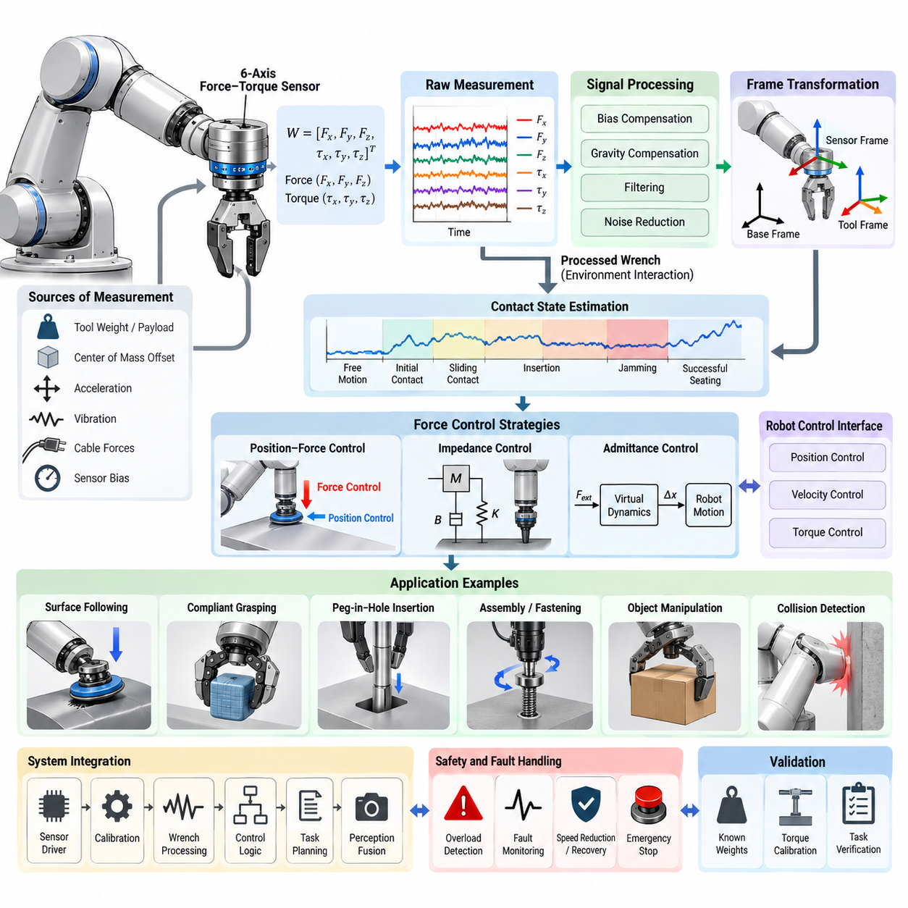
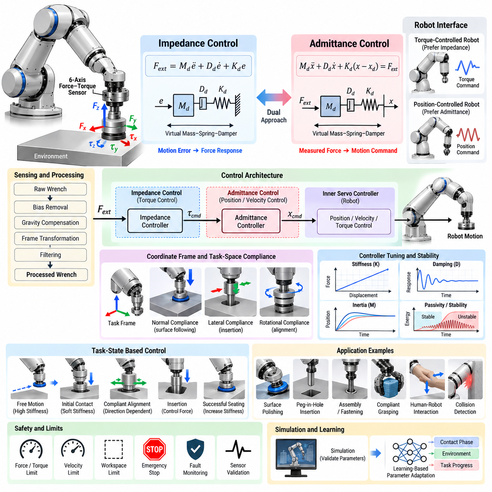
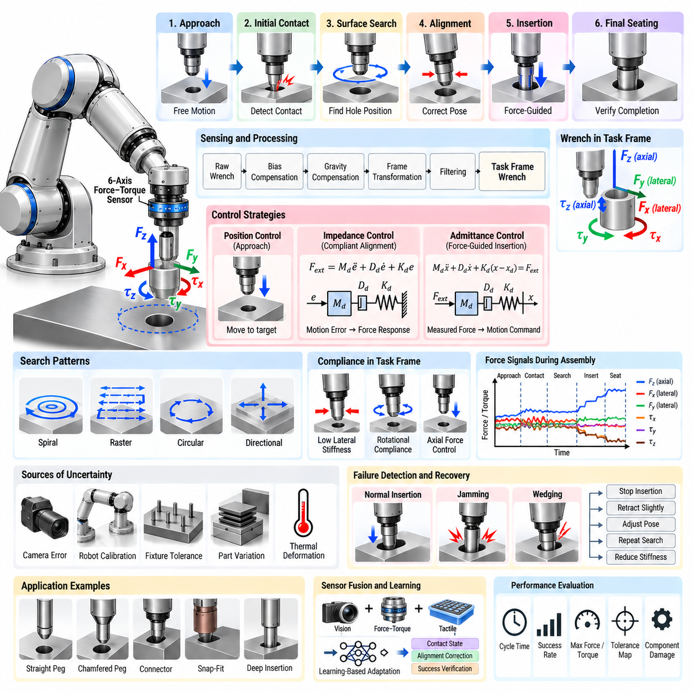
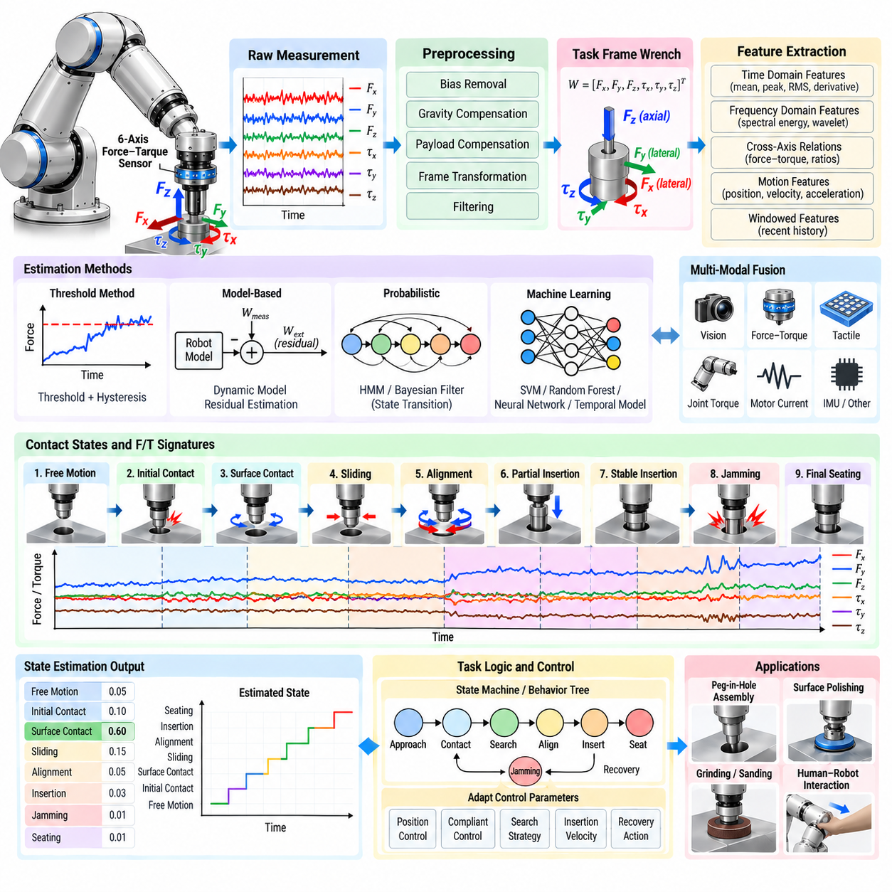
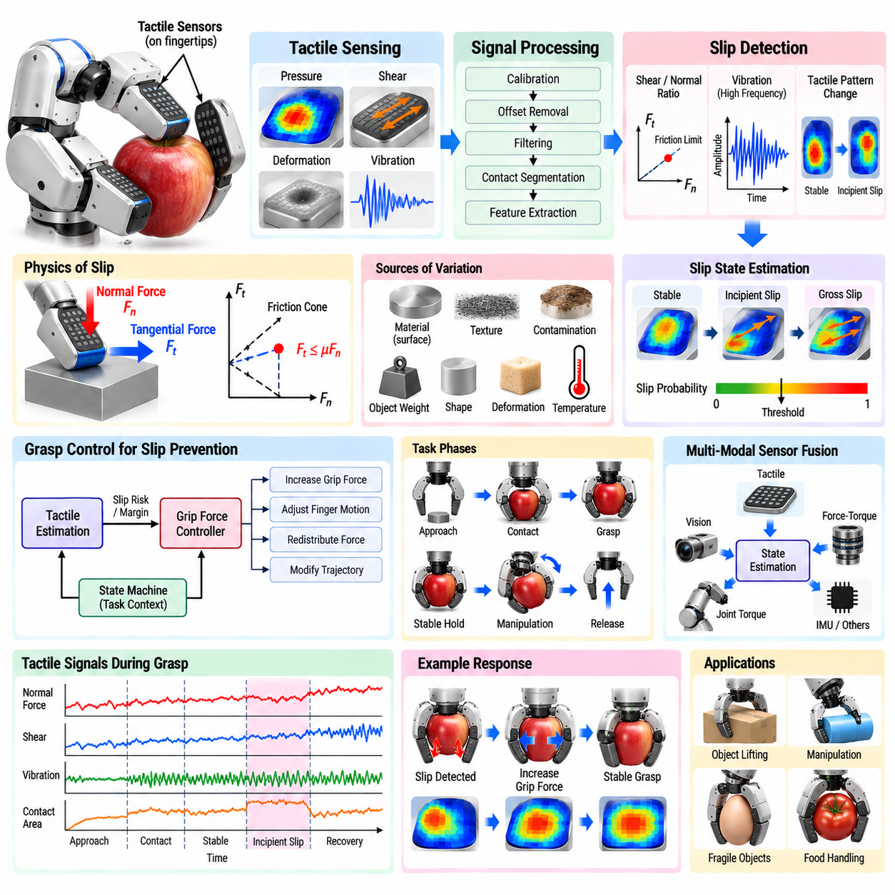
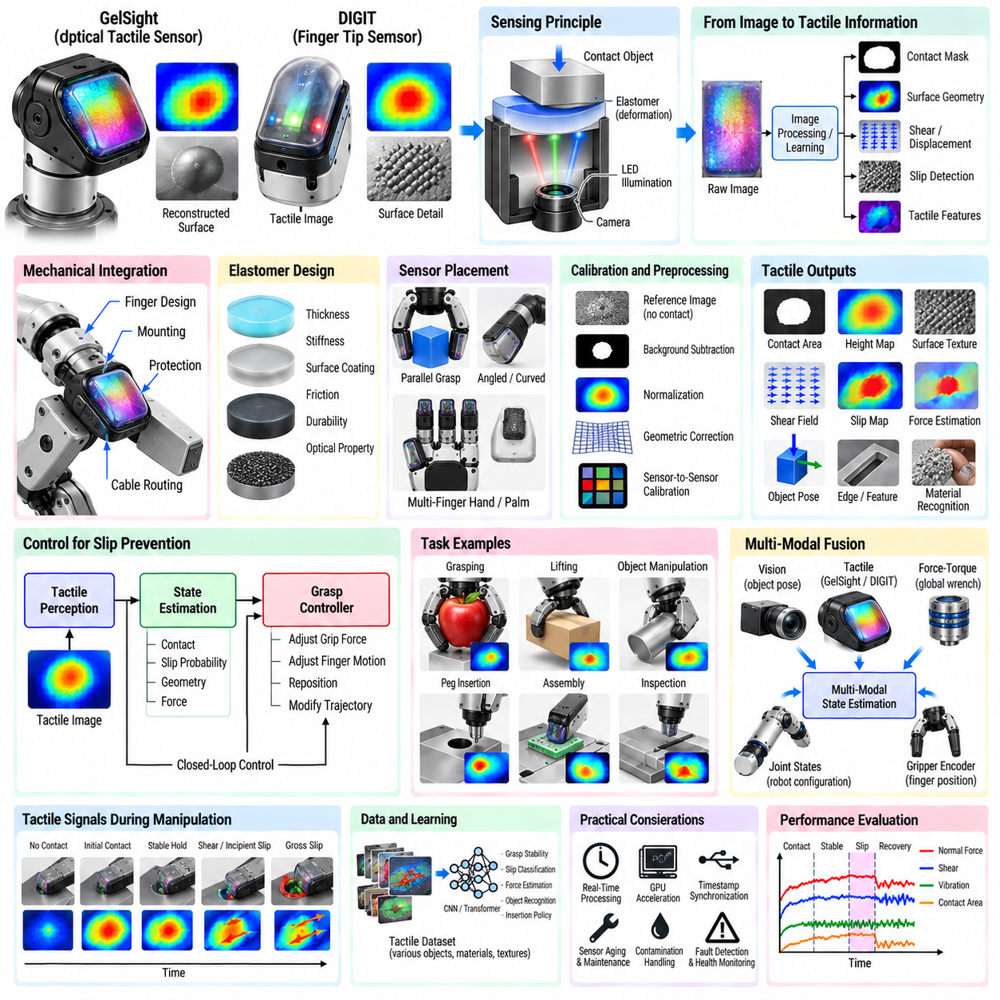
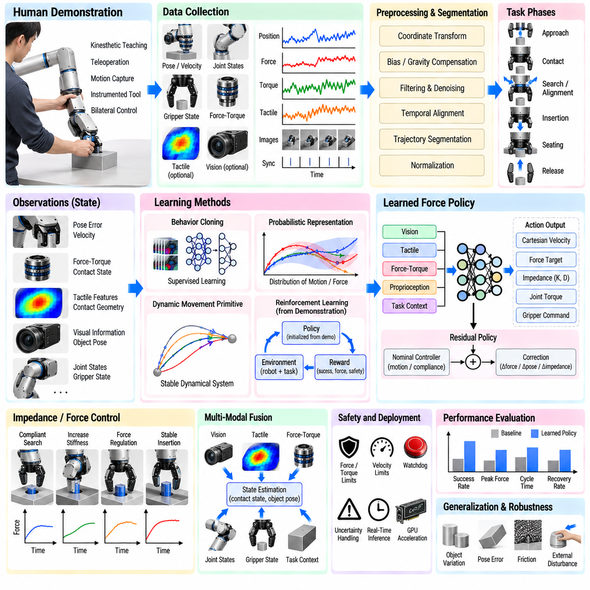
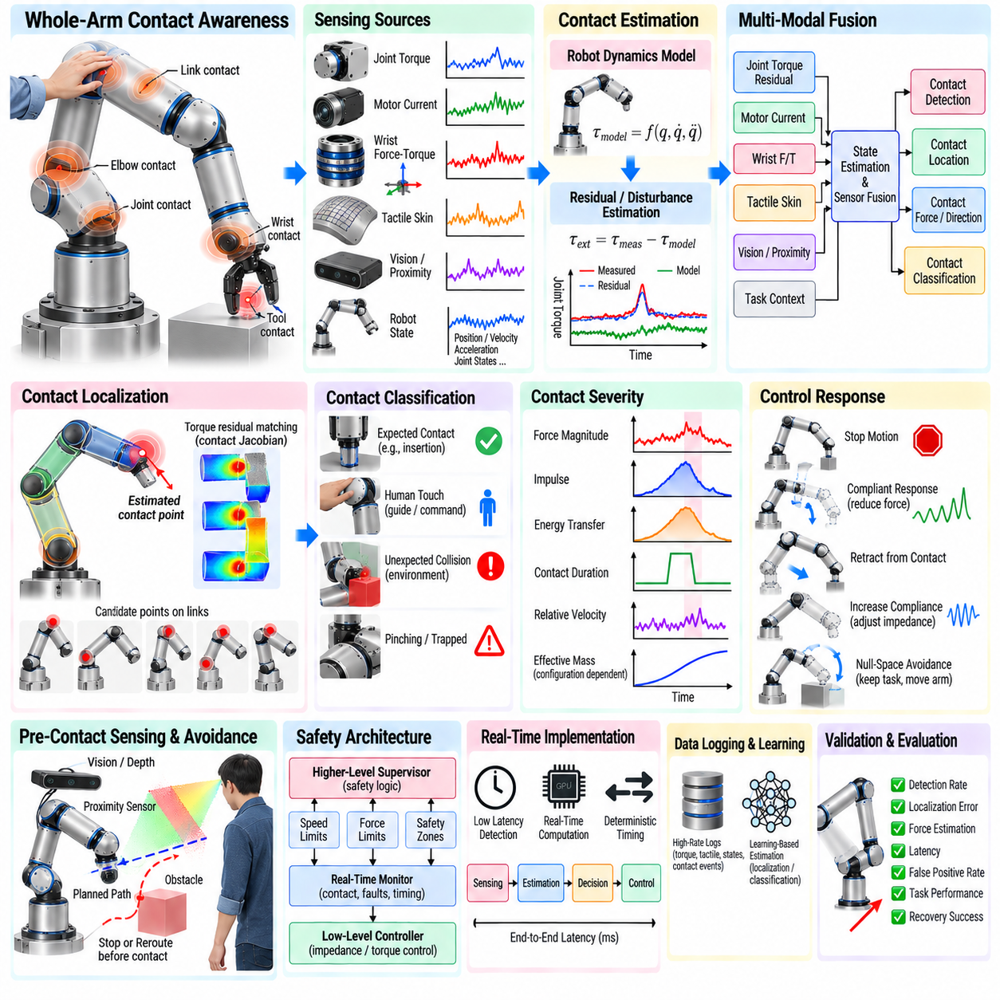
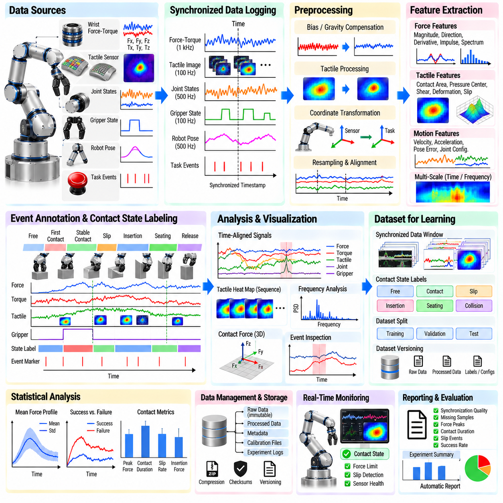
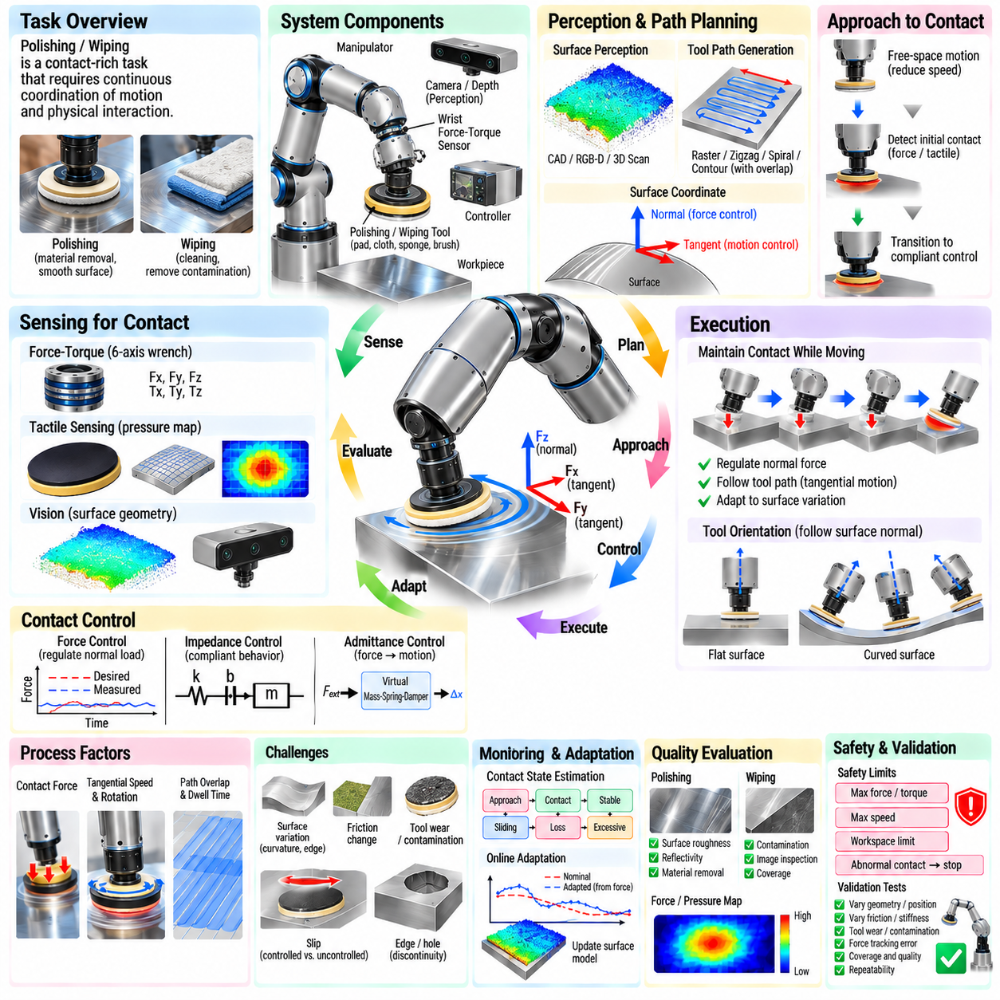

**Volume 17 Manipulation and Grasping AI**


# Chapter 06. Force and Tactile Sensing

##  

## 06.01. Force Torque Sensor Integration for Manipulation [w/Code]

{width="7.268055555555556in" height="7.268055555555556in"}

Force--torque sensing gives a robotic manipulator direct information about the mechanical interaction between the robot, the manipulated object, and the surrounding environment. Unlike vision or joint position sensing, which mainly describe geometric state, a force--torque sensor measures the physical consequences of contact. This capability is essential when manipulation requires compliant motion, controlled insertion, surface following, delicate grasping, or reliable detection of unexpected collisions.

A typical manipulation system uses a six-axis force--torque sensor capable of measuring three orthogonal force components and three torque components. The measured wrench is commonly represented as \\(W=[F_x,F_y,F_z,\\tau_x,\\tau_y,\\tau_z]\^T\\). Sensors are frequently installed between the robot wrist and the end effector, although they may also be integrated into joints, grippers, fixtures, or tools depending on the required observability and mechanical architecture.

Wrist-mounted sensing is particularly useful because it captures the combined interaction wrench acting through the end effector. However, the raw measurement does not represent external contact alone. It also contains the effects of tool weight, payload mass, center-of-mass offset, acceleration, vibration, cable forces, and sensor bias. Reliable manipulation therefore requires calibration and compensation before the measured wrench can be interpreted as meaningful environmental interaction.

Sensor integration begins with accurate definition of coordinate frames. Measurements generated in the sensor frame often need to be transformed into the tool, end-effector, robot base, object, or task frame. Because forces and torques depend on both orientation and reference point, a wrench transformation must account for rotational transformation and the moment produced by positional offsets. Incorrect frame handling can make an otherwise accurate sensor produce misleading control behavior.

Gravity compensation is one of the most important processing steps. The manipulator must estimate the gravitational wrench generated by the tool and payload for the current robot orientation and subtract it from the sensor measurement. This requires estimates of payload mass and center of mass. When tools or objects change during operation, these parameters may need to be identified automatically or updated through the manipulation task state.

Bias and zero-offset compensation are equally important. Force--torque sensors can exhibit offsets caused by temperature, mounting stress, electronics, or mechanical preload. A zeroing procedure is normally performed under a known unloaded condition, but repeated zeroing alone is insufficient for high-precision systems. Practical implementations may include temperature compensation, drift monitoring, periodic recalibration, and plausibility checks to prevent slowly changing bias from being interpreted as persistent contact.

Raw force measurements also contain noise and structural vibration. Filtering is therefore required, but aggressive filtering introduces latency and can destabilize high-bandwidth interaction control. Low-pass filters, moving averages, notch filters, and model-based estimators can be selected according to the mechanical system and control frequency. The filtering strategy should preserve meaningful contact transients while suppressing frequencies associated with motors, gearboxes, structural resonance, and electrical noise.

The processed wrench can support several levels of manipulation intelligence. At the simplest level, force thresholds provide contact detection, collision detection, overload protection, and task-state transitions. More advanced systems analyze the direction, magnitude, temporal pattern, and relationship between force and motion. This allows the robot to distinguish free motion, initial contact, sliding contact, obstruction, successful seating, jamming, and other mechanically meaningful states.

Force control directly regulates one or more interaction-force components rather than commanding position alone. For example, a robot polishing a surface may regulate normal force while controlling tangential motion through position or velocity commands. Hybrid position--force control formalizes this separation by assigning different task-space directions to motion and force objectives. The approach is particularly valuable when environmental constraints determine some degrees of freedom.

Impedance control provides another major integration strategy. Instead of commanding a fixed force, the controller establishes a desired dynamic relationship among position error, velocity, and interaction force. The manipulator can consequently behave as if it possesses programmable stiffness and damping. Low stiffness enables compliant interaction with uncertain environments, while higher stiffness provides precise tracking when geometric accuracy is required. Variable impedance can adapt these properties during different task phases.

Admittance control is often preferred when the underlying industrial robot exposes a stable position or velocity interface rather than direct torque control. The measured external wrench is converted through a virtual dynamic model into commanded motion. When the robot experiences contact force, it yields according to configured virtual mass, damping, and stiffness. This architecture allows force-guided behavior to be implemented around position-controlled manipulators without modifying their internal servo loops.

Assembly tasks demonstrate the practical importance of force--torque integration. During peg-in-hole insertion, connector mating, bearing placement, or mechanical fastening, small geometric errors can generate rapidly increasing forces. A force-aware controller can detect contact, search for alignment, regulate insertion force, recognize jamming, and verify final seating. Combining force measurements with position and orientation information makes the task more robust to tolerances that cannot be eliminated through calibration alone.

Force--torque information is also valuable for grasping and object manipulation. A wrist sensor can detect whether an object has been lifted, whether it contacts an obstacle, or whether unexpected loads occur during transport. When combined with gripper sensing, joint torque estimation, vision, and tactile sensing, the system can separate global interaction forces from local contact phenomena and construct a richer representation of the physical state of the manipulation task.

Safety functions can use force information to identify abnormal mechanical interaction, but force--torque sensing should not automatically be treated as a substitute for certified robot safety systems. Operational thresholds can trigger motion reduction, withdrawal, task recovery, or emergency logic, while safety-rated functions remain responsible for regulatory protection where required. The architecture should distinguish task-level contact intelligence from formally validated safety mechanisms.

Real-time implementation strongly affects performance. Sensor acquisition, timestamping, coordinate transformation, filtering, compensation, contact estimation, and control should operate with predictable latency. Communication through EtherCAT, CAN, Ethernet, or other interfaces must be evaluated not only by average bandwidth but also by update rate, jitter, synchronization accuracy, and failure behavior. Fast force feedback becomes ineffective when unpredictable communication delays dominate the control loop.

Time synchronization becomes especially important when force sensing is fused with cameras, tactile arrays, joint encoders, IMUs, and external perception systems. A contact event observed by the force sensor must correspond to the correct robot pose and visual frame. Hardware timestamping or synchronized clocks can reduce temporal ambiguity, enabling reliable multimodal learning and post-task analysis. This is increasingly important for data-driven manipulation and Physical AI systems.

Software integration should separate sensor drivers, calibration parameters, wrench processing, contact-state estimation, control logic, and task-level decision making. In ROS 2 or comparable middleware, the raw sensor stream can be preserved while compensated and transformed wrench topics are provided to higher layers. Maintaining this separation improves debugging because developers can determine whether failures originate from sensing, calibration, transformation, control, or task interpretation.

Fault handling must also be designed explicitly. Saturation, communication loss, discontinuous readings, excessive drift, mechanical overload, or implausible wrench changes should not silently propagate into the controller. Health monitoring can evaluate sensor status and measurement validity before force data are accepted for control. When confidence becomes insufficient, the manipulator should transition to an appropriate degraded, stopped, or recovery state rather than continuing force-dependent motion.

Validation should cover the complete sensing chain rather than only the sensor specification. Static weights can verify force magnitude and direction, known lever arms can validate torque measurements, and multiple robot orientations can test gravity compensation. Controlled contact experiments can evaluate threshold detection, while representative assembly or surface-interaction tasks reveal whether filtering, latency, compliance, and controller gains remain effective under realistic dynamic conditions.

For learning-based manipulation, force--torque signals provide a compact representation of interaction dynamics that complements visual observations. Demonstrations can associate characteristic wrench trajectories with successful insertion, grasp stabilization, tool use, or failure. Policies can use force histories as observations, while learned models can predict contact transitions or estimate latent task states. Careful normalization and synchronization are essential because wrench distributions vary greatly across tools and tasks.

A mature force--torque integration architecture therefore treats the sensor as more than an additional peripheral. It establishes a physical feedback channel connecting perception, control, task reasoning, and safety supervision. When calibration, frame transformation, compensation, filtering, synchronization, and control are designed as one coherent pipeline, the manipulator can move beyond purely geometric automation toward contact-aware, compliant, and increasingly adaptive physical interaction.

힘-토크 센싱(Force--Torque Sensing)은 로봇 매니퓰레이터(Robotic Manipulator)가 로봇, 조작 대상 물체, 주변 환경 사이에서 발생하는 기계적 상호작용(Mechanical Interaction)에 관한 정보를 직접 획득할 수 있도록 한다. 주로 기하학적 상태를 설명하는 비전(Vision)이나 관절 위치 센싱(Joint Position Sensing)과 달리, 힘-토크 센서(Force--Torque Sensor)는 접촉으로 인해 발생하는 물리적 결과를 측정한다. 이러한 능력은 순응 운동(Compliant Motion), 제어 삽입(Controlled Insertion), 표면 추종(Surface Following), 정밀 파지(Delicate Grasping), 예상치 못한 충돌의 신뢰성 높은 감지가 필요한 조작에서 필수적이다.

일반적인 조작 시스템(Manipulation System)은 세 방향의 직교 힘 성분과 세 방향의 토크 성분을 측정할 수 있는 6축 힘-토크 센서(Six-Axis Force--Torque Sensor)를 사용한다. 측정된 렌치(Wrench)는 일반적으로 \\(W=[F_x,F_y,F_z,\\tau_x,\\tau_y,\\tau_z]\^T\\)로 표현된다. 센서는 주로 로봇 손목(Robot Wrist)과 엔드 이펙터(End Effector) 사이에 설치되지만, 요구되는 관측 가능성(Observability)과 기계적 아키텍처(Mechanical Architecture)에 따라 관절, 그리퍼(Gripper), 지그(Fixture), 공구(Tool)에 통합할 수도 있다.

손목 장착 센싱(Wrist-Mounted Sensing)은 엔드 이펙터를 통해 작용하는 전체 상호작용 렌치(Interaction Wrench)를 측정할 수 있기 때문에 특히 유용하다. 그러나 원시 측정값(Raw Measurement)은 외부 접촉력만을 나타내지 않는다. 여기에는 공구 무게, 페이로드(Payload) 질량, 무게중심(Center of Mass) 오프셋, 가속도, 진동, 케이블 힘, 센서 바이어스(Sensor Bias)의 영향도 포함된다. 따라서 신뢰성 높은 조작을 위해서는 측정된 렌치를 의미 있는 환경 상호작용으로 해석하기 전에 교정(Calibration)과 보상(Compensation)이 필요하다.

센서 통합(Sensor Integration)은 정확한 좌표 프레임(Coordinate Frame)의 정의에서 시작된다. 센서 프레임(Sensor Frame)에서 생성된 측정값은 공구, 엔드 이펙터, 로봇 베이스(Robot Base), 물체 또는 작업 프레임(Task Frame)으로 변환해야 하는 경우가 많다. 힘과 토크는 방향뿐만 아니라 기준점에도 영향을 받으므로 렌치 변환(Wrench Transformation)에서는 회전 변환과 위치 오프셋에 의해 발생하는 모멘트(Moment)를 함께 고려해야 한다. 잘못된 프레임 처리는 정확한 센서조차 잘못된 제어 동작을 발생시키게 할 수 있다.

중력 보상(Gravity Compensation)은 가장 중요한 처리 단계 중 하나이다. 매니퓰레이터는 현재 로봇 자세에서 공구와 페이로드에 의해 발생하는 중력 렌치(Gravitational Wrench)를 추정하고 이를 센서 측정값에서 제거해야 한다. 이를 위해서는 페이로드 질량과 무게중심에 대한 추정값이 필요하다. 작업 과정에서 공구나 물체가 변경되는 경우 이러한 매개변수(Parameter)를 자동으로 식별하거나 조작 작업 상태에 따라 갱신해야 할 수 있다.

바이어스(Bias)와 영점 오프셋(Zero Offset)의 보상도 마찬가지로 중요하다. 힘-토크 센서는 온도, 장착 응력(Mounting Stress), 전자회로, 기계적 예압(Mechanical Preload)으로 인해 오프셋을 발생시킬 수 있다. 일반적으로 알려진 무부하 상태에서 영점 조정(Zeroing)을 수행하지만, 고정밀 시스템에서는 반복적인 영점 조정만으로 충분하지 않다. 실제 구현에서는 온도 보상(Temperature Compensation), 드리프트 모니터링(Drift Monitoring), 주기적 재교정(Recalibration), 타당성 검사(Plausibility Check)를 적용하여 점진적으로 변화하는 바이어스가 지속적인 접촉력으로 잘못 해석되는 것을 방지할 수 있다.

원시 힘 측정값에는 노이즈(Noise)와 구조적 진동(Structural Vibration)도 포함된다. 따라서 필터링(Filtering)이 필요하지만, 지나치게 강한 필터링은 지연시간(Latency)을 증가시키고 고대역폭 상호작용 제어(High-Bandwidth Interaction Control)를 불안정하게 만들 수 있다. 저역통과 필터(Low-Pass Filter), 이동 평균(Moving Average), 노치 필터(Notch Filter), 모델 기반 추정기(Model-Based Estimator)는 기계 시스템과 제어 주파수에 따라 선택할 수 있다. 필터링 전략은 모터, 기어박스, 구조 공진, 전기적 노이즈에서 발생하는 주파수 성분을 억제하면서 의미 있는 접촉 과도현상(Contact Transient)을 보존해야 한다.

처리된 렌치 정보는 여러 수준의 조작 지능(Manipulation Intelligence)을 지원할 수 있다. 가장 단순한 수준에서는 힘 임계값(Force Threshold)을 이용하여 접촉 감지(Contact Detection), 충돌 감지(Collision Detection), 과부하 보호(Overload Protection), 작업 상태 전환(Task-State Transition)을 수행한다. 보다 발전된 시스템은 힘의 방향, 크기, 시간적 패턴, 움직임과 힘 사이의 관계를 분석한다. 이를 통해 자유 운동(Free Motion), 초기 접촉, 미끄럼 접촉(Sliding Contact), 장애, 정상 안착(Successful Seating), 끼임(Jamming)과 같은 기계적으로 의미 있는 상태를 구분할 수 있다.

힘 제어(Force Control)는 위치만을 명령하는 대신 하나 이상의 상호작용 힘 성분을 직접 조절한다. 예를 들어 표면을 연마하는 로봇은 위치 또는 속도 명령으로 접선 방향 운동(Tangential Motion)을 제어하면서 동시에 수직력(Normal Force)을 일정하게 유지할 수 있다. 하이브리드 위치-힘 제어(Hybrid Position--Force Control)는 서로 다른 작업 공간 방향(Task-Space Direction)에 운동 목표와 힘 목표를 각각 할당하여 이러한 분리를 체계화한다. 이 접근법은 환경의 제약 조건이 일부 자유도(Degree of Freedom)를 결정하는 경우 특히 효과적이다.

임피던스 제어(Impedance Control)는 또 다른 주요 통합 전략이다. 고정된 힘을 직접 명령하는 대신 위치 오차, 속도, 상호작용 힘 사이에 원하는 동역학적 관계(Dynamic Relationship)를 설정한다. 이에 따라 매니퓰레이터는 프로그래밍 가능한 강성(Stiffness)과 감쇠(Damping)를 가진 것처럼 동작할 수 있다. 낮은 강성은 불확실한 환경과의 순응적 상호작용을 가능하게 하고, 높은 강성은 높은 기하학적 정확도가 요구될 때 정밀한 추종을 제공한다. 가변 임피던스(Variable Impedance)를 사용하면 작업 단계에 따라 이러한 특성을 적응적으로 변경할 수 있다.

어드미턴스 제어(Admittance Control)는 기본 산업용 로봇이 직접 토크 제어(Direct Torque Control) 대신 안정적인 위치 또는 속도 인터페이스를 제공하는 경우 자주 사용된다. 측정된 외부 렌치는 가상 동역학 모델(Virtual Dynamic Model)을 통해 명령 운동으로 변환된다. 로봇에 접촉력이 작용하면 설정된 가상 질량(Virtual Mass), 감쇠, 강성에 따라 로봇이 움직이며 힘을 수용한다. 이 구조를 사용하면 로봇 내부의 서보 루프(Servo Loop)를 변경하지 않고도 위치 제어 기반 매니퓰레이터에 힘 유도 동작(Force-Guided Behavior)을 구현할 수 있다.

조립 작업(Assembly Task)은 힘-토크 통합의 실질적인 중요성을 잘 보여준다. 페그-인-홀 삽입(Peg-in-Hole Insertion), 커넥터 결합(Connector Mating), 베어링 장착, 기계적 체결 과정에서는 작은 기하학적 오차도 급격히 증가하는 힘을 발생시킬 수 있다. 힘 인식 제어기(Force-Aware Controller)는 접촉을 감지하고, 정렬 상태를 탐색하며, 삽입력을 조절하고, 끼임을 인식하며, 최종 안착 상태를 확인할 수 있다. 힘 측정값을 위치 및 자세 정보와 결합하면 교정만으로 제거할 수 없는 공차(Tolerance)에 대해 작업의 강건성(Robustness)을 향상시킬 수 있다.

힘-토크 정보는 파지(Grasping)와 물체 조작(Object Manipulation)에서도 중요하다. 손목 센서는 물체가 실제로 들어 올려졌는지, 이동 중 장애물과 접촉했는지, 예상하지 못한 하중이 발생했는지를 감지할 수 있다. 그리퍼 센싱(Gripper Sensing), 관절 토크 추정(Joint Torque Estimation), 비전, 촉각 센싱(Tactile Sensing)과 결합하면 시스템은 전체적인 상호작용 힘과 국부적인 접촉 현상을 구분하고 조작 작업의 물리적 상태를 더욱 풍부하게 표현할 수 있다.

안전 기능(Safety Function)은 비정상적인 기계적 상호작용을 식별하기 위해 힘 정보를 사용할 수 있지만, 힘-토크 센싱을 인증된 로봇 안전 시스템(Certified Robot Safety System)의 대체 수단으로 간주해서는 안 된다. 운용 임계값(Operational Threshold)은 감속, 후퇴, 작업 복구(Task Recovery), 비상 로직을 실행하는 데 사용할 수 있으며, 규정상 필요한 경우 안전 등급 기능(Safety-Rated Function)이 공식적인 보호 기능을 담당해야 한다. 따라서 아키텍처에서는 작업 수준의 접촉 지능과 공식적으로 검증된 안전 메커니즘을 구분해야 한다.

실시간 구현(Real-Time Implementation)은 시스템 성능에 큰 영향을 미친다. 센서 데이터 획득, 타임스탬핑(Timestamping), 좌표 변환, 필터링, 보상, 접촉 상태 추정(Contact Estimation), 제어는 예측 가능한 지연시간으로 동작해야 한다. EtherCAT, CAN, Ethernet 등의 인터페이스를 통한 통신은 평균 대역폭뿐만 아니라 갱신 주기(Update Rate), 지터(Jitter), 동기화 정확도(Synchronization Accuracy), 장애 발생 시 동작까지 평가해야 한다. 예측할 수 없는 통신 지연이 제어 루프를 지배하면 빠른 힘 피드백의 장점은 크게 감소한다.

시간 동기화(Time Synchronization)는 힘 센싱을 카메라, 촉각 배열(Tactile Array), 관절 인코더(Joint Encoder), 관성 측정 장치(IMU), 외부 인지 시스템(External Perception System)과 융합할 때 특히 중요하다. 힘 센서에서 관측된 접촉 이벤트는 정확한 로봇 자세 및 영상 프레임과 대응해야 한다. 하드웨어 타임스탬핑(Hardware Timestamping)이나 동기화된 클록(Synchronized Clock)은 시간적 모호성을 줄여 신뢰성 높은 멀티모달 학습(Multimodal Learning)과 작업 후 분석을 가능하게 한다. 이는 데이터 기반 조작(Data-Driven Manipulation)과 피지컬 AI(Physical AI) 시스템에서 점점 더 중요해지고 있다.

소프트웨어 통합(Software Integration)에서는 센서 드라이버(Sensor Driver), 교정 매개변수, 렌치 처리, 접촉 상태 추정, 제어 로직(Control Logic), 작업 수준 의사결정(Task-Level Decision Making)을 분리하는 것이 바람직하다. ROS 2 또는 유사한 미들웨어(Middleware)에서는 원시 센서 스트림을 보존하면서 보상 및 좌표 변환된 렌치 데이터를 상위 계층에 제공할 수 있다. 이러한 분리는 장애가 센싱, 교정, 좌표 변환, 제어 또는 작업 해석 중 어느 단계에서 발생했는지 판단하기 쉽게 하므로 디버깅(Debugging) 효율을 높인다.

고장 처리(Fault Handling) 역시 명확하게 설계해야 한다. 포화(Saturation), 통신 손실, 불연속적인 측정값, 과도한 드리프트, 기계적 과부하 또는 비현실적인 렌치 변화가 아무런 검증 없이 제어기로 전달되어서는 안 된다. 상태 모니터링(Health Monitoring)은 힘 데이터를 제어에 사용하기 전에 센서 상태와 측정값의 유효성을 평가할 수 있다. 신뢰도가 충분하지 않은 경우 매니퓰레이터는 힘 기반 동작을 계속하는 대신 적절한 성능 저하 모드(Degraded State), 정지 상태 또는 복구 상태(Recovery State)로 전환해야 한다.

검증(Validation)은 센서 자체의 사양만이 아니라 전체 센싱 체인(Sensing Chain)을 대상으로 수행해야 한다. 정적 하중(Static Weight)을 이용하여 힘의 크기와 방향을 검증하고, 알려진 레버 암(Lever Arm)을 사용하여 토크 측정값을 확인하며, 다양한 로봇 자세에서 중력 보상 성능을 시험할 수 있다. 제어된 접촉 실험으로 임계값 감지를 평가하고, 실제 조립이나 표면 상호작용 작업을 통해 필터링, 지연시간, 순응성(Compliance), 제어기 게인(Controller Gain)이 현실적인 동적 조건에서도 효과적인지 검증해야 한다.

학습 기반 조작(Learning-Based Manipulation)에서 힘-토크 신호는 시각 관측을 보완하는 상호작용 동역학(Interaction Dynamics)의 압축된 표현을 제공한다. 시연 데이터(Demonstration Data)는 성공적인 삽입, 파지 안정화, 공구 사용 또는 실패와 특징적인 렌치 궤적(Wrench Trajectory)을 연결할 수 있다. 정책(Policy)은 힘의 시간 이력을 관측값으로 사용할 수 있으며, 학습 모델은 접촉 상태 전환을 예측하거나 잠재 작업 상태(Latent Task State)를 추정할 수 있다. 공구와 작업에 따라 렌치 분포가 크게 달라지므로 세심한 정규화(Normalization)와 시간 동기화가 필수적이다.

성숙한 힘-토크 통합 아키텍처(Force--Torque Integration Architecture)는 센서를 단순히 추가되는 주변 장치(Peripheral)로 취급하지 않는다. 대신 인지(Perception), 제어(Control), 작업 추론(Task Reasoning), 안전 감독(Safety Supervision)을 연결하는 물리적 피드백 채널(Physical Feedback Channel)로 구성한다. 교정, 좌표 변환, 보상, 필터링, 동기화, 제어가 하나의 일관된 파이프라인(Coherent Pipeline)으로 설계될 때 매니퓰레이터는 순수한 기하학적 자동화를 넘어 접촉 인식(Contact-Aware), 순응적(Compliant), 적응형(Adaptive) 물리 상호작용을 수행할 수 있다.

##  

## 06.02. Impedance and Admittance Control for Contact [w/Code]

{width="7.268055555555556in" height="7.268055555555556in"}

Contact-rich manipulation requires a robot to regulate not only where its end effector moves but also how mechanically it interacts with the environment. Pure position control can generate excessive forces when geometric errors or environmental uncertainty exist. Impedance and admittance control address this problem by defining a controlled relationship among motion, velocity, acceleration, and interaction force rather than treating position and force as completely independent variables.

Impedance control shapes the apparent mechanical behavior of a manipulator during contact. Instead of directly commanding a specific contact force, the controller defines how the robot should respond when its actual motion differs from a desired trajectory. A common Cartesian formulation is \\(F_{ext}=M_d\\ddot{e}+D_d\\dot{e}+K_de\\), where \\(M_d\\), \\(D_d\\), and \\(K_d\\) represent desired inertia, damping, and stiffness, and \\(e\\) represents task-space displacement error.

The physical interpretation of impedance control resembles a virtual mass--spring--damper system connected between the desired and actual robot poses. Desired stiffness determines how strongly the manipulator resists displacement, damping determines how motion energy is dissipated, and virtual inertia influences transient acceleration. By selecting these parameters, the same robot can behave rigidly for precise positioning or softly for compliant interaction without changing its physical mechanical structure.

Cartesian impedance control is particularly useful because contact tasks are usually described relative to an object, surface, or task coordinate system rather than individual robot joints. Translational and rotational stiffness can be specified independently along different axes. A robot can therefore remain stiff along a machining direction while remaining compliant normal to an uncertain surface, or maintain orientation while allowing lateral motion during an insertion operation.

Joint-space impedance control applies a similar principle directly to robot joints. Desired joint positions and velocities generate restoring torques according to virtual stiffness and damping. This approach can exploit torque-controlled actuators and provide natural whole-arm compliance. However, the relationship between joint impedance and Cartesian contact behavior depends on robot configuration and Jacobian geometry, making task-space design important when precise environmental interaction characteristics are required.

Admittance control reverses the input-output interpretation. Instead of receiving motion error and producing a force or torque response, an admittance controller measures external force and converts it into desired motion. A typical virtual dynamics model can be expressed as \\(M_d\\ddot{x}+D_d\\dot{x}+K_d(x-x_d)=F_{ext}\\). The resulting displacement, velocity, or acceleration command is then sent to the underlying robot motion controller.

This architecture is especially practical for industrial manipulators that provide high-performance position or velocity control but do not expose low-level motor torque interfaces. A wrist force--torque sensor measures environmental interaction, and an outer admittance loop calculates how the commanded robot trajectory should yield. The existing inner servo controller then tracks this modified trajectory, allowing compliant behavior to be added without replacing the manufacturer\'s internal control architecture.

The distinction between impedance and admittance is therefore closely related to the robot\'s native actuation and control interface. Torque-controlled robots naturally support impedance behavior because commanded actuator torques can directly shape mechanical response. Position-controlled robots often favor admittance control because measured force can be translated into motion references. In practical systems, however, implementations may combine elements of both approaches and include additional force-feedback loops.

Controller tuning determines whether contact feels stable, responsive, and safe. High stiffness improves geometric tracking but can amplify force peaks caused by positioning errors. Low stiffness increases compliance but may reduce task accuracy. Insufficient damping can produce oscillation, while excessive damping makes interaction sluggish. Virtual inertia influences transient response and can become especially important when the commanded motion changes rapidly or when the robot interacts with stiff environments.

Contact stability depends on more than controller gains. Sensor delay, digital sampling, communication jitter, structural flexibility, actuator dynamics, friction, gearbox compliance, and environmental stiffness all affect the closed-loop system. A controller that behaves well against a soft surface may oscillate when contacting rigid metal. Consequently, impedance or admittance parameters should be evaluated with the expected range of environmental mechanical properties rather than tuned only in free space.

Force--torque sensing is central to high-quality admittance control and can also enhance impedance implementations. Raw measurements generally require bias removal, gravity compensation, coordinate transformation, and filtering before they enter the control loop. Excessive filtering reduces noise but introduces phase delay, while insufficient filtering allows vibration to influence commanded motion. The sensing and control pipelines must therefore be designed together rather than optimized independently.

The coordinate frame used for compliance strongly affects task behavior. In peg-in-hole insertion, lateral directions may require low stiffness so that the peg can self-align, while the insertion axis requires controlled downward motion and bounded force. During surface polishing, normal compliance regulates contact pressure while tangential directions follow the planned path. Task-frame impedance enables these different mechanical behaviors to coexist within a single controller.

Rotational compliance is equally important in many assembly tasks. Small angular misalignment between a connector and socket can produce large contact moments even when translational position error is small. By configuring rotational stiffness and damping independently from translational parameters, the robot can passively or actively accommodate orientation errors. This capability is valuable for connectors, gears, shafts, covers, fixtures, and other tightly constrained mechanical assemblies.

Variable impedance control changes mechanical parameters during task execution instead of using one fixed setting. Free-space motion may use relatively high stiffness for accurate and rapid trajectory tracking, initial contact may reduce stiffness to limit impact, and insertion may apply direction-dependent compliance. After successful seating, stiffness can increase again to stabilize the final pose. Task-state-dependent impedance therefore combines precision and compliance within one manipulation sequence.

Adaptive impedance extends this idea by modifying stiffness, damping, or reference trajectories according to measured interaction. Adaptation can use force error, estimated environmental stiffness, contact state, task progress, or learned models. Such methods are useful when material properties or geometry vary between operations. However, parameter adaptation must preserve stability because rapid or poorly constrained changes in controller dynamics can create unintended energy and unstable contact.

Passivity provides an important framework for analyzing stable physical interaction. A passive system does not generate unlimited net energy through its interaction port, making it naturally compatible with many physical environments. Passivity observers, passivity controllers, energy tanks, and related techniques can monitor or restrict energy exchange. These approaches become valuable when delays, variable impedance, teleoperation, or uncertain environmental dynamics make conventional stability analysis difficult.

Impedance and admittance control also support human--robot interaction. When an operator pushes or guides a robot, measured forces can be converted into compliant motion so that the robot feels lightweight and responsive. The controller may constrain motion to permitted directions, provide virtual fixtures, or increase resistance near restricted regions. This allows human intention and robotic precision to be combined while maintaining explicit limits on velocity, workspace, and interaction force.

In grasping, compliance helps distribute contact forces and tolerate uncertainty in object pose or geometry. A rigidly controlled manipulator may push an object away when the estimated grasp pose is slightly inaccurate, whereas a compliant approach can accommodate contact and settle into a stable configuration. Whole-arm impedance can also reduce impact when the forearm or wrist unexpectedly touches the environment during manipulation in cluttered spaces.

Insertion and fastening applications often combine impedance or admittance control with contact-state logic. The robot first approaches under position control, detects contact through force or torque, transitions to compliant alignment, searches for geometric constraints, and then executes controlled insertion. Changes in axial force, lateral force, or torque can indicate successful engagement, cross-threading, jamming, bottoming-out, or completion and trigger the next task state.

Safety-related limits should surround the compliant controller even when the nominal behavior is soft. Maximum force, torque, velocity, displacement, power, and workspace limits prevent abnormal sensor signals or unstable control from producing dangerous motion. Watchdogs should detect sensor communication loss, saturation, timing faults, and implausible wrench changes. Compliance improves interaction behavior, but it does not eliminate the need for independent safety supervision and certified protection where required.

Real-time execution is critical because mechanical interaction evolves faster than many perception tasks. Sensor acquisition, compensation, controller calculation, robot-state feedback, and command transmission should operate at predictable rates with bounded latency and jitter. High-frequency inner loops are generally desirable for stiff contact, while supervisory task logic can operate more slowly. Timestamp synchronization helps ensure that force measurements correspond to the robot state used by the controller.

Simulation can accelerate controller development by allowing stiffness, damping, inertia, friction, contact geometry, and sensor noise to be varied systematically. Nevertheless, contact simulation rarely reproduces every property of the physical system, especially backlash, structural resonance, surface friction, and communication delay. Parameters that appear stable in simulation should therefore be transferred conservatively and validated progressively from soft contacts toward the intended real-world environment.

Learning-based methods can complement classical impedance and admittance control by predicting suitable controller parameters or reference trajectories from demonstrations and sensor observations. A policy may select stiffness according to contact phase or infer the direction in which compliance should be increased. Keeping a conventional compliant controller beneath the learned policy can provide a structured physical interface while machine learning handles higher-level adaptation and task variability.

A robust contact-control architecture ultimately integrates mechanical modeling, force--torque sensing, coordinate transformations, real-time control, task-state estimation, and safety supervision. Impedance control determines how strongly the robot mechanically resists motion disturbances, while admittance control determines how measured interaction forces generate motion. Properly designed, both approaches transform rigid trajectory execution into controlled physical interaction capable of tolerating uncertainty while preserving manipulation accuracy.

접촉 중심 조작(Contact-Rich Manipulation)에서는 로봇이 엔드 이펙터(End Effector)의 이동 위치뿐만 아니라 환경과 기계적으로 어떻게 상호작용하는지도 제어해야 한다. 순수 위치 제어(Pure Position Control)는 기하학적 오차나 환경 불확실성(Environmental Uncertainty)이 존재할 때 과도한 힘을 발생시킬 수 있다. 임피던스 제어(Impedance Control)와 어드미턴스 제어(Admittance Control)는 위치와 힘을 완전히 독립적인 변수로 다루는 대신 운동, 속도, 가속도, 상호작용 힘 사이의 제어된 관계를 정의함으로써 이러한 문제를 해결한다.

임피던스 제어(Impedance Control)는 접촉 과정에서 매니퓰레이터(Manipulator)가 나타내는 겉보기 기계적 거동(Apparent Mechanical Behavior)을 형성한다. 특정 접촉력을 직접 명령하는 대신 실제 운동이 목표 궤적(Desired Trajectory)과 달라졌을 때 로봇이 어떻게 반응해야 하는지를 정의한다. 일반적인 카테시안 표현(Cartesian Formulation)은 \\(F_{ext}=M_d\\ddot{e}+D_d\\dot{e}+K_de\\)이며, 여기서 \\(M_d\\), \\(D_d\\), \\(K_d\\)는 각각 목표 관성(Desired Inertia), 감쇠(Damping), 강성(Stiffness)을 나타내고 \\(e\\)는 작업 공간 변위 오차(Task-Space Displacement Error)를 나타낸다.

임피던스 제어의 물리적 의미는 목표 로봇 자세와 실제 로봇 자세 사이에 가상의 질량-스프링-댐퍼 시스템(Virtual Mass--Spring--Damper System)이 연결된 것과 유사하다. 목표 강성은 매니퓰레이터가 변위에 얼마나 강하게 저항하는지를 결정하고, 감쇠는 운동 에너지가 어떻게 소산되는지를 결정하며, 가상 관성(Virtual Inertia)은 과도 가속 응답에 영향을 준다. 이러한 매개변수를 선택하면 동일한 로봇을 정밀 위치 결정에서는 단단하게, 순응적 상호작용에서는 부드럽게 동작하도록 만들 수 있다.

카테시안 임피던스 제어(Cartesian Impedance Control)는 접촉 작업이 일반적으로 개별 로봇 관절이 아니라 물체, 표면 또는 작업 좌표계(Task Coordinate System)를 기준으로 정의되기 때문에 특히 유용하다. 병진 강성(Translational Stiffness)과 회전 강성(Rotational Stiffness)을 서로 다른 축에 대해 독립적으로 설정할 수 있다. 따라서 가공 방향에서는 높은 강성을 유지하면서 불확실한 표면의 법선 방향에서는 순응성을 제공하거나, 삽입 작업 중 자세를 유지하면서 횡방향 움직임을 허용할 수 있다.

관절 공간 임피던스 제어(Joint-Space Impedance Control)는 동일한 원리를 로봇 관절에 직접 적용한다. 목표 관절 위치와 속도를 이용하여 가상 강성과 감쇠에 따른 복원 토크(Restoring Torque)를 생성한다. 이 방식은 토크 제어형 액추에이터(Torque-Controlled Actuator)를 활용하여 자연스러운 전체 팔 순응성(Whole-Arm Compliance)을 제공할 수 있다. 그러나 관절 임피던스와 카테시안 접촉 거동의 관계는 로봇 자세와 자코비안 기하학(Jacobian Geometry)에 따라 달라지므로 정밀한 환경 상호작용이 필요한 경우 작업 공간 설계가 중요하다.

어드미턴스 제어(Admittance Control)는 입력과 출력의 해석을 반대로 구성한다. 운동 오차를 입력으로 받아 힘이나 토크 응답을 생성하는 대신 외부 힘을 측정하여 목표 운동으로 변환한다. 일반적인 가상 동역학 모델(Virtual Dynamics Model)은 \\(M_d\\ddot{x}+D_d\\dot{x}+K_d(x-x_d)=F_{ext}\\)로 표현할 수 있다. 여기서 계산된 변위, 속도 또는 가속도 명령은 로봇의 기본 운동 제어기(Motion Controller)로 전달된다.

이러한 아키텍처는 높은 성능의 위치 또는 속도 제어 기능을 제공하지만 저수준 모터 토크 인터페이스(Low-Level Motor Torque Interface)를 공개하지 않는 산업용 매니퓰레이터에서 특히 실용적이다. 손목 힘-토크 센서(Wrist Force--Torque Sensor)가 환경과의 상호작용을 측정하고, 외부 어드미턴스 루프(Outer Admittance Loop)가 로봇 명령 궤적이 힘에 따라 얼마나 양보해야 하는지를 계산한다. 이후 기존 내부 서보 제어기(Inner Servo Controller)가 수정된 궤적을 추종하므로 제조사의 내부 제어 구조를 교체하지 않고도 순응적 거동을 추가할 수 있다.

따라서 임피던스와 어드미턴스의 차이는 로봇이 기본적으로 제공하는 구동 및 제어 인터페이스(Native Actuation and Control Interface)와 밀접하게 관련된다. 토크 제어 로봇(Torque-Controlled Robot)은 액추에이터 토크를 직접 명령하여 기계적 응답을 형성할 수 있으므로 임피던스 제어에 자연스럽게 적합하다. 위치 제어 로봇(Position-Controlled Robot)은 측정된 힘을 운동 기준값으로 변환할 수 있기 때문에 어드미턴스 제어가 자주 사용된다. 그러나 실제 시스템에서는 두 접근법의 요소를 결합하거나 추가적인 힘 피드백 루프(Force-Feedback Loop)를 구성할 수도 있다.

제어기 튜닝(Controller Tuning)은 접촉 동작의 안정성, 응답성, 안전성을 결정한다. 높은 강성은 기하학적 추종 성능을 향상시키지만 위치 오차로 인해 발생하는 힘의 피크를 증폭시킬 수 있다. 낮은 강성은 순응성을 증가시키지만 작업 정확도를 저하시킬 수 있다. 감쇠가 부족하면 진동(Oscillation)이 발생하고, 감쇠가 지나치면 상호작용 응답이 느려진다. 가상 관성은 과도 응답(Transient Response)에 영향을 주며 명령 운동이 빠르게 변화하거나 로봇이 높은 강성의 환경과 접촉할 때 특히 중요해질 수 있다.

접촉 안정성(Contact Stability)은 제어기 게인만으로 결정되지 않는다. 센서 지연(Sensor Delay), 디지털 샘플링(Digital Sampling), 통신 지터(Communication Jitter), 구조적 유연성(Structural Flexibility), 액추에이터 동역학, 마찰, 기어박스 순응성(Gearbox Compliance), 환경 강성(Environmental Stiffness)이 모두 폐루프 시스템(Closed-Loop System)에 영향을 준다. 부드러운 표면에서 안정적으로 동작하는 제어기가 단단한 금속과 접촉할 때는 진동할 수 있으므로 임피던스와 어드미턴스 매개변수는 자유 공간에서만 조정하지 말고 예상되는 환경의 기계적 특성 범위에서 평가해야 한다.

힘-토크 센싱(Force--Torque Sensing)은 고품질 어드미턴스 제어의 핵심이며 임피던스 제어 구현도 향상시킬 수 있다. 원시 측정값(Raw Measurement)은 일반적으로 제어 루프에 입력되기 전에 바이어스 제거(Bias Removal), 중력 보상(Gravity Compensation), 좌표 변환(Coordinate Transformation), 필터링(Filtering)을 거쳐야 한다. 지나친 필터링은 노이즈를 감소시키지만 위상 지연(Phase Delay)을 증가시키며, 필터링이 부족하면 진동이 명령 운동에 영향을 줄 수 있다. 따라서 센싱 파이프라인과 제어 파이프라인은 독립적으로 최적화하기보다 함께 설계해야 한다.

순응성(Compliance)을 정의하는 좌표 프레임(Coordinate Frame)은 작업 거동에 큰 영향을 미친다. 페그-인-홀 삽입(Peg-in-Hole Insertion)에서는 페그가 스스로 정렬될 수 있도록 횡방향의 강성을 낮게 설정하고, 삽입 축에서는 제한된 힘과 함께 제어된 하향 운동을 수행할 수 있다. 표면 연마(Surface Polishing)에서는 법선 방향 순응성이 접촉 압력을 조절하는 동안 접선 방향에서는 계획된 경로를 추종한다. 작업 프레임 임피던스(Task-Frame Impedance)를 이용하면 하나의 제어기 안에서 서로 다른 기계적 거동을 동시에 구현할 수 있다.

회전 순응성(Rotational Compliance) 역시 많은 조립 작업에서 중요하다. 커넥터와 소켓 사이에 작은 각도 정렬 오차가 존재하면 병진 위치 오차가 작더라도 큰 접촉 모멘트(Contact Moment)가 발생할 수 있다. 병진 매개변수와 독립적으로 회전 강성과 감쇠를 설정하면 로봇이 자세 오차를 수동적 또는 능동적으로 수용할 수 있다. 이러한 기능은 커넥터, 기어, 샤프트, 커버, 지그(Fixture) 등 높은 구속 조건을 갖는 기계 조립에 유용하다.

가변 임피던스 제어(Variable Impedance Control)는 하나의 고정된 설정을 사용하는 대신 작업 실행 중 기계적 매개변수를 변경한다. 자유 공간 운동에서는 정확하고 빠른 궤적 추종을 위해 비교적 높은 강성을 사용할 수 있고, 초기 접촉에서는 충격을 제한하기 위해 강성을 낮출 수 있으며, 삽입 단계에서는 방향별 순응성(Direction-Dependent Compliance)을 적용할 수 있다. 성공적으로 안착한 이후에는 최종 자세를 안정화하기 위해 다시 강성을 높일 수 있다. 작업 상태 기반 임피던스(Task-State-Dependent Impedance)는 하나의 조작 과정에서 정밀성과 순응성을 결합한다.

적응형 임피던스(Adaptive Impedance)는 측정된 상호작용에 따라 강성, 감쇠 또는 기준 궤적(Reference Trajectory)을 변경하여 이러한 개념을 확장한다. 적응에는 힘 오차, 추정된 환경 강성, 접촉 상태, 작업 진행도 또는 학습 모델(Learned Model)을 사용할 수 있다. 이러한 방식은 작업마다 재료 특성이나 기하 구조가 달라지는 경우 유용하다. 그러나 제어기 동역학 매개변수가 지나치게 빠르거나 제한 없이 변화하면 의도하지 않은 에너지가 생성되어 접촉이 불안정해질 수 있으므로 안정성을 보장해야 한다.

수동성(Passivity)은 안정적인 물리적 상호작용을 분석하는 중요한 프레임워크를 제공한다. 수동 시스템(Passive System)은 상호작용 포트(Interaction Port)를 통해 무제한의 순에너지를 생성하지 않으므로 다양한 물리적 환경과 자연스럽게 결합할 수 있다. 수동성 관측기(Passivity Observer), 수동성 제어기(Passivity Controller), 에너지 탱크(Energy Tank) 등의 기법을 통해 에너지 교환을 감시하거나 제한할 수 있다. 이러한 방법은 지연, 가변 임피던스, 원격조작(Teleoperation), 불확실한 환경 동역학으로 인해 기존의 안정성 분석이 어려워질 때 특히 유용하다.

임피던스와 어드미턴스 제어는 인간-로봇 상호작용(Human--Robot Interaction)에도 활용된다. 작업자가 로봇을 밀거나 직접 유도하면 측정된 힘을 순응적 운동으로 변환하여 로봇이 가볍고 민감하게 움직이도록 만들 수 있다. 제어기는 운동을 허용된 방향으로 제한하거나 가상 지그(Virtual Fixture)를 제공하고, 제한 영역 근처에서는 저항을 증가시킬 수도 있다. 이를 통해 속도, 작업 공간, 상호작용 힘에 대한 명확한 제한을 유지하면서 인간의 의도와 로봇의 정밀성을 결합할 수 있다.

파지(Grasping)에서는 순응성이 접촉력을 분산시키고 물체의 자세나 형상에 대한 불확실성을 수용하는 데 도움을 준다. 강체 위치 제어(Rigid Position Control)를 사용하는 매니퓰레이터는 추정된 파지 자세에 작은 오차가 있어도 물체를 밀어낼 수 있지만, 순응적 접근법은 접촉을 수용하면서 안정적인 파지 상태로 정착할 수 있다. 전체 팔 임피던스(Whole-Arm Impedance)는 복잡한 환경에서 조작하는 동안 팔뚝이나 손목이 주변 환경과 예상치 못하게 접촉할 때 발생하는 충격도 줄일 수 있다.

삽입과 체결 작업(Insertion and Fastening Application)은 임피던스 또는 어드미턴스 제어를 접촉 상태 로직(Contact-State Logic)과 결합하는 경우가 많다. 로봇은 먼저 위치 제어로 접근하고, 힘이나 토크를 통해 접촉을 감지한 뒤 순응 정렬(Compliant Alignment) 상태로 전환하여 기하학적 구속 조건을 탐색하고 제어된 삽입을 수행한다. 축방향 힘, 횡방향 힘 또는 토크의 변화는 정상 결합, 나사산 오결합(Cross-Threading), 끼임(Jamming), 최종 접촉(Bottoming-Out), 작업 완료 등을 나타내며 다음 작업 상태를 실행하는 조건으로 사용할 수 있다.

공칭 동작(Nominal Behavior)이 부드럽더라도 순응 제어기 주변에는 안전 관련 제한(Safety-Related Limit)을 구성해야 한다. 최대 힘, 토크, 속도, 변위, 전력, 작업 공간 제한을 통해 비정상적인 센서 신호나 불안정한 제어가 위험한 운동으로 이어지는 것을 방지해야 한다. 감시 장치(Watchdog)는 센서 통신 손실, 포화(Saturation), 타이밍 오류, 비현실적인 렌치 변화를 감지해야 한다. 순응성은 상호작용 특성을 개선하지만 독립적인 안전 감독(Safety Supervision)과 필요한 경우 인증된 보호 기능(Certified Protection)의 필요성을 제거하지 않는다.

실시간 실행(Real-Time Execution)은 기계적 상호작용이 많은 인지 작업보다 빠르게 변화하기 때문에 매우 중요하다. 센서 데이터 획득, 보상, 제어기 계산, 로봇 상태 피드백, 명령 전송은 제한된 지연과 지터를 가지는 예측 가능한 주기로 실행되어야 한다. 높은 강성의 접촉에서는 일반적으로 고주파 내부 루프(High-Frequency Inner Loop)가 유리하며, 상위 작업 감독 로직(Supervisory Task Logic)은 상대적으로 느리게 동작할 수 있다. 타임스탬프 동기화(Timestamp Synchronization)는 힘 측정값이 제어기에 사용되는 정확한 로봇 상태와 대응하도록 해준다.

시뮬레이션(Simulation)은 강성, 감쇠, 관성, 마찰, 접촉 형상, 센서 노이즈를 체계적으로 변화시킬 수 있기 때문에 제어기 개발을 가속할 수 있다. 그러나 접촉 시뮬레이션은 특히 백래시(Backlash), 구조 공진(Structural Resonance), 표면 마찰, 통신 지연 등 실제 시스템의 모든 특성을 완벽하게 재현하기 어렵다. 따라서 시뮬레이션에서 안정적으로 보이는 매개변수도 보수적으로 실제 시스템에 적용하고, 부드러운 접촉 환경부터 목표 실제 환경까지 단계적으로 검증해야 한다.

학습 기반 방법(Learning-Based Method)은 시연(Demonstration)과 센서 관측을 통해 적절한 제어기 매개변수 또는 기준 궤적을 예측함으로써 고전적인 임피던스 및 어드미턴스 제어를 보완할 수 있다. 정책(Policy)은 접촉 단계에 따라 강성을 선택하거나 순응성을 증가시켜야 하는 방향을 추론할 수 있다. 학습 정책 아래에 기존의 순응 제어기(Conventional Compliant Controller)를 유지하면 머신러닝(Machine Learning)이 상위 수준의 적응과 작업 변동성을 처리하는 동안 구조화된 물리적 상호작용 인터페이스를 제공할 수 있다.

강건한 접촉 제어 아키텍처(Robust Contact-Control Architecture)는 궁극적으로 기계 모델링(Mechanical Modeling), 힘-토크 센싱, 좌표 변환, 실시간 제어, 작업 상태 추정(Task-State Estimation), 안전 감독을 하나의 시스템으로 통합한다. 임피던스 제어는 로봇이 운동 외란(Motion Disturbance)에 기계적으로 얼마나 강하게 저항할지를 결정하고, 어드미턴스 제어는 측정된 상호작용 힘이 어떻게 운동을 발생시킬지를 결정한다. 두 접근법을 적절하게 설계하면 경직된 궤적 실행을 불확실성을 수용하면서도 조작 정확도를 유지할 수 있는 제어된 물리적 상호작용(Controlled Physical Interaction)으로 전환할 수 있다.

##  

## 06.03. Force Guided Assembly Peg in Hole [w/Code]

{width="7.268055555555556in" height="7.268055555555556in"}

Peg-in-hole assembly is a representative contact-rich manipulation problem in which a robot must insert a peg into a mating hole despite uncertainty in position, orientation, geometry, and mechanical properties. Pure position control can fail even when perception and calibration errors are small because tight clearances convert minor misalignment into large contact forces. Force-guided assembly uses measured interaction forces and torques to recognize contact, correct alignment, regulate insertion, and determine whether assembly has succeeded.

The task can be interpreted as a sequence of mechanical states rather than a single Cartesian motion. The robot typically moves through free-space approach, initial contact, surface localization, alignment, hole search, insertion, and final seating. Each state has different sensing and control requirements. Position control is effective during approach, while compliant force-aware behavior becomes increasingly important after contact because environmental constraints begin to determine allowable motion.

A six-axis force--torque sensor mounted near the robot wrist provides three force components and three torque components describing the interaction wrench. Before control, raw measurements normally undergo bias compensation, gravity and payload compensation, coordinate transformation, and filtering. The resulting wrench should be represented in a task frame aligned with the insertion geometry so that axial force, lateral forces, and alignment moments have direct physical meaning.

Geometric uncertainty may originate from camera localization error, robot calibration, fixture tolerance, thermal deformation, manufacturing variation, or movement of the workpiece. Even submillimeter translational error can become significant when the clearance between peg and hole is small. Angular misalignment is often more problematic because it produces asymmetric contact and moments that increase rapidly as insertion depth grows, potentially causing wedging or jamming.

Initial contact detection provides the transition from free-space motion to contact-aware control. The robot may detect contact when axial force exceeds a threshold, but a robust detector should account for sensor noise, acceleration-induced loads, and transient vibration. Threshold hysteresis, persistence conditions, filtered derivatives, or model-based residuals can prevent false transitions. The approach velocity should also be limited so that detection latency does not allow excessive impact force to develop.

After contact with the surrounding surface, the robot must determine the relative location of the hole. When visual localization is sufficiently accurate, only a small local correction may be necessary. With greater uncertainty, the end effector can execute a structured search while maintaining a bounded normal force. Spiral, raster, circular, or directional search patterns allow the peg tip to explore the surface until a characteristic change in displacement, force, or moment indicates engagement with the hole entrance.

Search motion must be designed carefully because larger trajectories increase the probability of locating the hole but also increase cycle time and the risk of damaging the surface. Search radius should therefore reflect the expected localization uncertainty rather than being chosen arbitrarily. Velocity, normal force, and lateral force limits should be coordinated so that the peg remains in controlled contact while avoiding excessive friction, scratching, or edge loading.

Compliance is essential during alignment because a perfectly rigid robot attempts to preserve the commanded pose even when the environment indicates that the pose is incorrect. Cartesian impedance control can assign low lateral and rotational stiffness while maintaining controlled behavior along the insertion axis. Alternatively, admittance control can convert measured lateral forces and moments into corrective displacement or orientation commands, particularly when the robot provides a position-controlled interface.

The contact wrench contains information about the direction of misalignment. A lateral force may indicate that the peg is pressing against one side of the hole, while moments about transverse axes can reveal angular error. Controllers can exploit these signals to generate corrective translations and rotations. However, the relationship between wrench and pose error depends on contact geometry, friction, and insertion depth, so simple proportional correction is not always sufficient.

Remote center compliance concepts are useful for understanding passive and active alignment. By shaping translational and rotational compliance around an appropriate virtual center, contact forces can naturally generate motions that reduce misalignment rather than amplify it. Mechanical remote center compliance devices achieve this through physical elasticity, while robotic impedance or admittance controllers can approximate similar behavior through software and adjustable task-space compliance.

Once the peg enters the hole, the control objective changes from search to stable insertion. The robot generally commands motion along the insertion axis while limiting axial force and allowing smaller lateral or angular corrections. Increasing insertion depth strengthens geometric constraints, so compliance parameters may need to change accordingly. Excessive lateral freedom can reduce precision, whereas excessive stiffness can convert small remaining alignment errors into rapidly growing contact loads.

Jamming and wedging are major failure modes. Jamming occurs when contact forces and friction prevent further insertion, while wedging can arise when multiple contacts create a mechanically locked configuration. Both may appear as increasing axial force with little insertion progress, often accompanied by characteristic lateral forces or moments. Detection should therefore combine wrench measurements with displacement, velocity, and task progress rather than relying on a single force threshold.

A recovery strategy should respond to abnormal contact before hardware limits are reached. The robot may stop axial motion, retract slightly, reduce stiffness, adjust orientation, repeat local search, or return to a previous task state. Recovery parameters should be bounded so that repeated attempts do not progressively damage components. Logging the wrench trajectory and pose history also enables engineers to distinguish localization errors from unsuitable compliance settings or mechanical tolerance problems.

Successful seating must be detected reliably because reaching the commanded position does not necessarily mean that the assembly is complete. Completion may be identified through insertion depth, a characteristic rise in axial force, reduced motion under commanded displacement, geometric constraints, or a combination of these signals. For connectors and snap-fit components, a distinctive transient force pattern may provide stronger evidence of successful engagement than position alone.

Friction significantly influences peg-in-hole behavior. Surface material, lubrication, edge geometry, roughness, and contamination alter the relationship between contact force and corrective motion. High friction can prevent passive self-alignment and make a valid insertion appear jammed, while very low friction changes the wrench signatures used for state detection. Validation should therefore include realistic component surfaces rather than relying only on idealized simulation or low-friction laboratory fixtures.

Chamfers and lead-in geometry can substantially improve assembly robustness. A chamfer converts some axial insertion force into lateral alignment force, allowing moderate position errors to self-correct. However, the effectiveness of this mechanism depends on chamfer angle, clearance, friction, and compliance. Force-guided control should exploit helpful mechanical geometry rather than attempt to compensate entirely through software for an assembly interface that is inherently difficult to mate.

Orientation control becomes especially important for long pegs, small clearances, and deep insertion. A small angular error at the wrist can produce a large lateral displacement at the peg tip. Rotational compliance around appropriate task axes allows contact moments to correct this error. For asymmetric connectors or keyed components, orientation may also include rotation around the insertion axis, requiring perception and force information to cooperate in identifying the correct mating configuration.

Hybrid position--force control provides another framework for organizing the task. Motion can be commanded along unconstrained directions while force is regulated along directions constrained by contact. Before insertion, the robot may regulate normal force against the surface while searching laterally. During insertion, axial motion may be position- or velocity-driven with an explicit force limit, while lateral directions remain compliant. The selection matrix can change as the assembly state evolves.

Task-state estimation is therefore central to reliable automation. Force-guided assembly should not use one controller configuration for the entire operation. A finite-state machine, behavior tree, or equivalent task executive can coordinate approach, contact detection, search, alignment, insertion, verification, and recovery. Each state defines expected wrench ranges, motion constraints, timeout conditions, and valid transitions, making abnormal behavior easier to recognize and diagnose.

Vision and force sensing provide complementary information. Vision offers global geometric localization before contact, whereas force--torque sensing provides precise local information after physical interaction begins. Combining them reduces the burden on either modality. Vision can place the peg near the expected hole, after which force-guided search compensates for residual error. Updated visual observations can also verify object motion or detect gross failures that force signals alone cannot distinguish.

Tactile sensing can further improve the process by providing spatially distributed contact information. A wrist force--torque sensor measures the net interaction wrench but cannot directly reveal where contact occurs. Tactile sensors on the gripper or peg fixture can identify local pressure patterns and contact locations. Fusion of wrench, tactile, joint, and visual observations can therefore provide a richer estimate of alignment and contact state, particularly for complex connectors.

Real-time performance strongly affects insertion quality. Sensor acquisition, compensation, filtering, state estimation, controller computation, and robot commands must execute with predictable latency and limited jitter. Excessive delay can cause the robot to continue pushing after force rises or make corrective motion arrive too late. Control frequency requirements depend on robot dynamics and contact stiffness, but deterministic timing is generally more important than high average computation throughput.

Simulation is valuable for exploring search patterns, controller gains, friction ranges, clearances, and contact geometry before hardware testing. Nevertheless, contact models can differ significantly from reality, especially for friction, compliance, backlash, and microscopic surface effects. Simulation should therefore be used to narrow the design space rather than establish final parameters. Hardware validation should progress from generous clearances and low forces toward the actual production tolerance.

Learning-based approaches can improve assembly when contact relationships are difficult to model explicitly. Demonstrations can teach search strategies, wrench-to-correction mappings, or task-state classifiers, while reinforcement learning can optimize compliant behaviors under randomized pose and friction conditions. A practical architecture can place learned adaptation above deterministic force, motion, and safety controllers so that exploration or prediction does not bypass physical operating limits.

Performance should be evaluated using more than successful insertion rate. Relevant measures include cycle time, maximum contact force and torque, search distance, insertion depth before failure, number of recovery attempts, sensitivity to pose error, and component damage. Testing across systematic position and orientation perturbations produces an assembly tolerance map that reveals where the controller succeeds reliably and where mechanical or sensing improvements are required.

Force-guided peg-in-hole assembly ultimately demonstrates how perception, sensing, compliant control, task reasoning, and mechanical design must operate together. Reliable insertion is not achieved by force control alone, but by recognizing changing contact states and applying appropriate behavior at each stage. When vision provides coarse localization and force--torque feedback supplies local physical evidence, the robot can transform uncertain geometric alignment into a controlled and verifiable assembly process.

페그-인-홀 조립(Peg-in-Hole Assembly)은 위치, 자세, 형상, 기계적 특성의 불확실성이 존재하는 상황에서 로봇이 페그(Peg)를 대응하는 홀(Hole)에 삽입해야 하는 대표적인 접촉 중심 조작(Contact-Rich Manipulation) 문제이다. 순수 위치 제어(Pure Position Control)는 인지 및 교정 오차가 작더라도 실패할 수 있는데, 좁은 간극(Tight Clearance)에서는 작은 정렬 오차가 큰 접촉력으로 변환되기 때문이다. 힘 유도 조립(Force-Guided Assembly)은 측정된 상호작용 힘과 토크를 이용하여 접촉을 인식하고, 정렬을 보정하며, 삽입을 제어하고, 조립 성공 여부를 판단한다.

이 작업은 하나의 카테시안 운동(Cartesian Motion)이 아니라 일련의 기계적 상태(Mechanical State)로 해석할 수 있다. 로봇은 일반적으로 자유 공간 접근(Free-Space Approach), 초기 접촉(Initial Contact), 표면 위치 확인(Surface Localization), 정렬(Alignment), 홀 탐색(Hole Search), 삽입(Insertion), 최종 안착(Final Seating)의 단계를 거친다. 각 상태에는 서로 다른 센싱 및 제어 요구사항이 존재한다. 접근 단계에서는 위치 제어가 효과적이지만, 접촉 이후에는 환경의 구속 조건이 허용 가능한 운동을 결정하기 시작하므로 순응적 힘 인식 동작(Compliant Force-Aware Behavior)이 점점 중요해진다.

로봇 손목 근처에 장착된 6축 힘-토크 센서(Six-Axis Force--Torque Sensor)는 상호작용 렌치(Interaction Wrench)를 나타내는 세 방향의 힘 성분과 세 방향의 토크 성분을 제공한다. 제어에 사용하기 전에 원시 측정값(Raw Measurement)은 일반적으로 바이어스 보상(Bias Compensation), 중력 및 페이로드 보상(Gravity and Payload Compensation), 좌표 변환(Coordinate Transformation), 필터링(Filtering)을 거친다. 처리된 렌치는 삽입 형상에 맞춰 정렬된 작업 프레임(Task Frame)에서 표현되어야 축방향 힘, 횡방향 힘, 정렬 모멘트(Alignment Moment)가 직접적인 물리적 의미를 가질 수 있다.

기하학적 불확실성(Geometric Uncertainty)은 카메라 위치 추정 오차(Camera Localization Error), 로봇 교정, 지그 공차(Fixture Tolerance), 열변형(Thermal Deformation), 제조 편차(Manufacturing Variation), 작업물의 이동 등에서 발생할 수 있다. 페그와 홀 사이의 간극이 작으면 1밀리미터 이하의 병진 오차도 중요한 영향을 미칠 수 있다. 각도 정렬 오차(Angular Misalignment)는 삽입 깊이가 증가하면서 비대칭 접촉과 모멘트를 빠르게 증가시켜 쐐기 현상(Wedging)이나 끼임(Jamming)을 발생시킬 수 있기 때문에 더욱 문제가 되는 경우가 많다.

초기 접촉 감지(Initial Contact Detection)는 자유 공간 운동에서 접촉 인식 제어(Contact-Aware Control)로 전환하기 위한 기준을 제공한다. 로봇은 축방향 힘이 임계값을 초과하면 접촉을 감지할 수 있지만, 강건한 감지기(Robust Detector)는 센서 노이즈, 가속도에 의해 발생하는 하중, 과도 진동을 고려해야 한다. 임계값 히스테리시스(Threshold Hysteresis), 지속 조건(Persistence Condition), 필터링된 미분값 또는 모델 기반 잔차(Model-Based Residual)를 사용하면 잘못된 상태 전환을 방지할 수 있다. 또한 감지 지연으로 인해 과도한 충격력이 발생하지 않도록 접근 속도를 제한해야 한다.

주변 표면과 접촉한 이후에는 로봇이 홀의 상대적 위치를 판단해야 한다. 시각적 위치 추정(Visual Localization)이 충분히 정확하다면 작은 국부 보정(Local Correction)만 필요할 수 있다. 불확실성이 더 큰 경우 엔드 이펙터는 제한된 법선력(Normal Force)을 유지하면서 구조화된 탐색(Structured Search)을 수행할 수 있다. 나선형(Spiral), 래스터(Raster), 원형(Circular), 방향성 탐색(Directional Search) 패턴을 이용하면 페그 끝단이 표면을 탐색하면서 변위, 힘 또는 모멘트의 특징적인 변화를 통해 홀 입구와의 결합을 감지할 수 있다.

탐색 운동(Search Motion)은 큰 탐색 궤적이 홀을 찾을 확률을 높이는 동시에 사이클 시간(Cycle Time)과 표면 손상 위험을 증가시키므로 신중하게 설계해야 한다. 따라서 탐색 반경(Search Radius)은 임의로 설정하기보다 예상되는 위치 추정 불확실성을 반영해야 한다. 속도, 법선력, 횡방향 힘의 제한을 서로 연계하여 페그가 제어된 접촉 상태를 유지하면서 과도한 마찰, 긁힘(Scratching), 모서리 하중(Edge Loading)을 방지하도록 해야 한다.

순응성(Compliance)은 정렬 과정에서 필수적이다. 완전히 강체로 제어되는 로봇은 환경이 현재 자세가 잘못되었다는 정보를 제공하더라도 명령된 자세를 그대로 유지하려고 하기 때문이다. 카테시안 임피던스 제어(Cartesian Impedance Control)는 삽입 축 방향의 제어된 동작을 유지하면서 횡방향 및 회전 방향의 강성을 낮게 설정할 수 있다. 또는 로봇이 위치 제어 인터페이스를 제공하는 경우 어드미턴스 제어(Admittance Control)를 이용하여 측정된 횡방향 힘과 모멘트를 보정 변위 또는 자세 명령으로 변환할 수 있다.

접촉 렌치(Contact Wrench)에는 정렬 오차의 방향에 관한 정보가 포함되어 있다. 횡방향 힘은 페그가 홀의 한쪽 측면을 누르고 있음을 나타낼 수 있으며, 횡축을 중심으로 발생하는 모멘트는 각도 오차를 나타낼 수 있다. 제어기는 이러한 신호를 이용하여 보정 병진 및 회전 운동을 생성할 수 있다. 그러나 렌치와 자세 오차 사이의 관계는 접촉 형상(Contact Geometry), 마찰, 삽입 깊이에 따라 달라지므로 단순한 비례 보정만으로 항상 충분한 것은 아니다.

원격 중심 순응(Remote Center Compliance) 개념은 수동 및 능동 정렬(Passive and Active Alignment)을 이해하는 데 유용하다. 적절한 가상 중심(Virtual Center)을 기준으로 병진 및 회전 순응성을 구성하면 접촉력이 정렬 오차를 증가시키는 대신 자연스럽게 감소시키는 운동을 발생시킬 수 있다. 기계식 원격 중심 순응 장치(Mechanical Remote Center Compliance Device)는 물리적 탄성으로 이를 구현하며, 로봇 임피던스 또는 어드미턴스 제어기는 소프트웨어와 조정 가능한 작업 공간 순응성을 이용하여 유사한 동작을 구현할 수 있다.

페그가 홀에 진입하면 제어 목표는 탐색에서 안정적인 삽입(Stable Insertion)으로 변경된다. 일반적으로 로봇은 축방향 힘을 제한하면서 삽입 축을 따라 운동을 명령하고, 더 작은 횡방향 또는 각도 보정을 허용한다. 삽입 깊이가 증가할수록 기하학적 구속 조건이 강해지므로 순응성 매개변수를 이에 맞춰 변경해야 할 수 있다. 횡방향 자유도가 지나치게 크면 정밀도가 낮아지고, 강성이 지나치게 높으면 남아 있는 작은 정렬 오차가 빠르게 증가하는 접촉 하중으로 변환될 수 있다.

끼임(Jamming)과 쐐기 현상(Wedging)은 대표적인 실패 모드(Failure Mode)이다. 끼임은 접촉력과 마찰로 인해 더 이상 삽입할 수 없는 상태이며, 쐐기 현상은 여러 접촉점이 기계적으로 잠긴 상태를 형성할 때 발생할 수 있다. 두 현상 모두 삽입 진행은 거의 없으면서 축방향 힘이 증가하는 형태로 나타날 수 있으며, 특징적인 횡방향 힘이나 모멘트를 동반하는 경우가 많다. 따라서 감지는 하나의 힘 임계값에만 의존하지 않고 렌치 측정값과 변위, 속도, 작업 진행도(Task Progress)를 함께 사용해야 한다.

복구 전략(Recovery Strategy)은 하드웨어 한계에 도달하기 전에 비정상적인 접촉에 대응해야 한다. 로봇은 축방향 운동을 정지하고, 약간 후퇴하거나, 강성을 낮추거나, 자세를 조정하거나, 국부 탐색을 반복하거나, 이전 작업 상태로 복귀할 수 있다. 반복적인 시도가 부품을 점진적으로 손상시키지 않도록 복구 매개변수에는 명확한 제한이 필요하다. 렌치 궤적(Wrench Trajectory)과 자세 이력을 기록하면 위치 추정 오차와 부적절한 순응성 설정 또는 기계적 공차 문제를 구분하는 데에도 도움이 된다.

성공적인 안착(Successful Seating)은 신뢰성 있게 감지해야 한다. 명령된 위치에 도달했다는 사실만으로 조립 완료를 보장할 수 없기 때문이다. 완료 상태는 삽입 깊이, 특징적인 축방향 힘의 증가, 명령 변위에 대한 운동 감소, 기하학적 구속 조건 또는 이러한 신호들의 조합을 통해 판단할 수 있다. 커넥터(Connector)나 스냅핏(Snap-Fit) 부품에서는 특징적인 과도 힘 패턴(Transient Force Pattern)이 위치 정보만 사용하는 것보다 성공적인 결합을 더욱 확실하게 나타낼 수 있다.

마찰(Friction)은 페그-인-홀 동작에 큰 영향을 미친다. 표면 재질, 윤활(Lubrication), 모서리 형상, 거칠기(Roughness), 오염 상태는 접촉력과 보정 운동 사이의 관계를 변화시킨다. 높은 마찰은 수동적인 자기 정렬(Self-Alignment)을 방해하여 정상적인 삽입 상태를 끼임으로 오인하게 만들 수 있으며, 매우 낮은 마찰은 상태 감지에 사용하는 렌치 특성을 변화시킨다. 따라서 검증 과정에서는 이상적인 시뮬레이션이나 저마찰 실험용 지그에만 의존하지 않고 실제 부품의 표면 조건을 포함해야 한다.

모따기(Chamfer)와 진입 유도 형상(Lead-In Geometry)은 조립 강건성을 크게 향상시킬 수 있다. 모따기는 축방향 삽입력의 일부를 횡방향 정렬력으로 변환하여 일정 수준의 위치 오차가 스스로 보정되도록 한다. 그러나 이러한 메커니즘의 효과는 모따기 각도, 간극, 마찰, 순응성에 따라 달라진다. 힘 유도 제어는 결합 자체가 구조적으로 어려운 조립 인터페이스를 소프트웨어만으로 보완하려 하기보다 유리한 기계적 형상을 적극적으로 활용해야 한다.

자세 제어(Orientation Control)는 긴 페그, 작은 간극, 깊은 삽입에서 특히 중요하다. 손목에서 발생하는 작은 각도 오차도 페그 끝단에서는 큰 횡방향 변위로 나타날 수 있다. 적절한 작업 축을 중심으로 회전 순응성(Rotational Compliance)을 제공하면 접촉 모멘트를 이용하여 이러한 오차를 보정할 수 있다. 비대칭 커넥터나 키 구조(Keyed Component)에서는 삽입 축을 중심으로 한 회전 방향도 중요하므로 올바른 결합 자세를 식별하기 위해 인지 정보와 힘 정보를 함께 사용할 수 있다.

하이브리드 위치-힘 제어(Hybrid Position--Force Control)는 작업을 구성하는 또 다른 프레임워크를 제공한다. 구속되지 않은 방향에서는 운동을 명령하고, 접촉에 의해 구속된 방향에서는 힘을 조절할 수 있다. 삽입 전에는 표면에 대한 법선력을 조절하면서 횡방향으로 탐색할 수 있다. 삽입 중에는 명확한 힘 제한과 함께 위치 또는 속도 기반의 축방향 운동을 수행하고 횡방향은 순응적으로 유지할 수 있다. 선택 행렬(Selection Matrix)은 조립 상태의 변화에 따라 변경할 수 있다.

따라서 작업 상태 추정(Task-State Estimation)은 신뢰성 높은 자동화의 핵심이다. 힘 유도 조립에서는 전체 작업에 하나의 제어기 설정을 사용하는 것이 바람직하지 않다. 유한 상태 기계(Finite-State Machine), 행동 트리(Behavior Tree) 또는 이에 상응하는 작업 실행기(Task Executive)를 이용하여 접근, 접촉 감지, 탐색, 정렬, 삽입, 검증, 복구를 조정할 수 있다. 각 상태에서는 예상되는 렌치 범위, 운동 제한, 타임아웃 조건, 유효한 상태 전이를 정의하여 비정상적인 동작을 쉽게 인식하고 진단할 수 있도록 한다.

비전(Vision)과 힘 센싱(Force Sensing)은 상호 보완적인 정보를 제공한다. 비전은 접촉 전에 전체적인 기하학적 위치를 제공하고, 힘-토크 센싱은 물리적 상호작용이 시작된 이후 정밀한 국부 정보를 제공한다. 두 방식을 결합하면 어느 하나의 센싱 방식에 대한 부담을 줄일 수 있다. 비전을 이용하여 페그를 예상되는 홀 근처에 배치한 후 힘 유도 탐색으로 남아 있는 오차를 보정할 수 있다. 또한 갱신된 시각 정보는 물체 이동을 확인하거나 힘 신호만으로 구별하기 어려운 큰 실패를 감지할 수 있다.

촉각 센싱(Tactile Sensing)을 추가하면 공간적으로 분포된 접촉 정보를 제공하여 조립 과정을 더욱 향상시킬 수 있다. 손목 힘-토크 센서는 전체 상호작용 렌치를 측정하지만 접촉이 정확히 어느 위치에서 발생하는지는 직접 알려주지 못한다. 그리퍼나 페그 고정부에 설치된 촉각 센서는 국부적인 압력 패턴과 접촉 위치를 식별할 수 있다. 따라서 렌치, 촉각, 관절, 시각 관측을 융합하면 특히 복잡한 커넥터에서 정렬 상태와 접촉 상태를 더욱 풍부하게 추정할 수 있다.

실시간 성능(Real-Time Performance)은 삽입 품질에 큰 영향을 미친다. 센서 데이터 획득, 보상, 필터링, 상태 추정, 제어기 계산, 로봇 명령은 예측 가능한 지연시간과 제한된 지터로 실행되어야 한다. 과도한 지연은 힘이 증가한 이후에도 로봇이 계속 밀게 하거나 보정 운동이 지나치게 늦게 적용되도록 만들 수 있다. 필요한 제어 주파수는 로봇 동역학과 접촉 강성에 따라 달라지지만, 일반적으로 높은 평균 연산 처리량보다 결정론적 타이밍(Deterministic Timing)이 더 중요하다.

시뮬레이션(Simulation)은 하드웨어 시험 전에 탐색 패턴, 제어기 게인, 마찰 범위, 간극, 접촉 형상을 검토하는 데 유용하다. 그러나 접촉 모델(Contact Model)은 특히 마찰, 순응성, 백래시(Backlash), 미세한 표면 효과에서 실제 시스템과 크게 다를 수 있다. 따라서 시뮬레이션은 최종 매개변수를 확정하는 수단이라기보다 설계 공간(Design Space)을 줄이는 수단으로 활용해야 한다. 하드웨어 검증은 큰 간극과 낮은 힘에서 시작하여 실제 생산 공차(Production Tolerance) 조건으로 단계적으로 진행하는 것이 바람직하다.

학습 기반 접근법(Learning-Based Approach)은 접촉 관계를 명시적으로 모델링하기 어려운 조립 작업을 개선할 수 있다. 시연(Demonstration)을 이용하여 탐색 전략, 렌치-보정 매핑(Wrench-to-Correction Mapping), 작업 상태 분류기(Task-State Classifier)를 학습할 수 있으며, 강화학습(Reinforcement Learning)을 통해 무작위화된 자세 및 마찰 조건에서 순응적 동작을 최적화할 수도 있다. 실용적인 아키텍처에서는 학습 기반 적응 기능을 결정론적인 힘, 운동, 안전 제어기의 상위 계층에 배치하여 탐색이나 예측 과정이 물리적 운용 한계를 우회하지 않도록 할 수 있다.

성능은 단순한 삽입 성공률(Successful Insertion Rate)만으로 평가해서는 안 된다. 사이클 시간, 최대 접촉력 및 토크, 탐색 거리, 실패 전 삽입 깊이, 복구 시도 횟수, 자세 오차에 대한 민감도, 부품 손상 정도 등도 중요한 평가 지표이다. 위치와 자세에 체계적인 교란(Perturbation)을 적용하여 시험하면 조립 허용 범위 지도(Assembly Tolerance Map)를 구축할 수 있으며, 이를 통해 제어기가 어느 영역에서 안정적으로 성공하고 어느 영역에서 기계 설계 또는 센싱 개선이 필요한지를 확인할 수 있다.

힘 유도 페그-인-홀 조립(Force-Guided Peg-in-Hole Assembly)은 궁극적으로 인지(Perception), 센싱(Sensing), 순응 제어(Compliant Control), 작업 추론(Task Reasoning), 기계 설계(Mechanical Design)가 함께 동작해야 하는 이유를 보여주는 대표적인 사례이다. 신뢰성 높은 삽입은 단순히 힘을 제어하는 것만으로 달성되는 것이 아니라 변화하는 접촉 상태를 인식하고 각 단계에 적합한 동작을 적용함으로써 달성된다. 비전이 대략적인 위치 정보를 제공하고 힘-토크 피드백이 국부적인 물리적 증거를 제공하면 로봇은 불확실한 기하학적 정렬 문제를 제어 가능하고 검증 가능한 조립 과정으로 전환할 수 있다.

##  

## 06.04. Contact State Estimation from F T Signals [w/Code]

{width="7.268055555555556in" height="7.268055555555556in"}

Contact state estimation from force--torque signals enables a robot to infer what is physically happening at the interface between its end effector, manipulated object, and environment. Rather than treating force measurements only as control feedback, the robot interprets temporal wrench patterns as evidence of free motion, initial contact, sliding, insertion, jamming, seating, or loss of contact. This converts mechanical interaction into an observable state that can support manipulation decisions.

A six-axis force--torque sensor typically produces a wrench \\(W=[F_x,F_y,F_z,\\tau_x,\\tau_y,\\tau_z]\^T\\). Individual components provide useful directional information, but contact states are rarely identifiable from one channel alone. The relationship among forces, moments, robot motion, and time is more informative. A lateral force combined with a transverse moment, for example, can indicate edge contact or angular misalignment that an axial force threshold cannot distinguish.

Reliable estimation begins with signal conditioning. Raw sensor outputs contain bias, gravitational loading, payload effects, acceleration forces, structural vibration, electrical noise, and thermal drift. Bias removal, gravity compensation, coordinate transformation, and filtering are therefore required before interpreting the wrench as external interaction. Poor compensation can create apparent contact even during free motion or hide weak physical contact beneath systematic measurement errors.

Coordinate frames are especially important because a contact pattern should be interpreted relative to the task rather than the sensor housing. Transforming the wrench into a task frame allows force components to represent meaningful directions such as surface normal, insertion axis, lateral alignment axes, or tool tangent. The same physical contact may appear very different in sensor coordinates as the robot changes orientation, whereas task-frame signals retain consistent semantic meaning.

Temporal information distinguishes transient events from persistent mechanical states. Initial impact may produce a short force spike, while sustained contact produces a nonzero wrench over a longer interval. Sliding can create relatively stable normal force with changing tangential components, and jamming can produce increasing force without corresponding motion. Estimation algorithms should therefore analyze signal history rather than classify every sample independently.

Simple threshold methods remain useful because they are deterministic, computationally inexpensive, and easy to validate. Contact can be declared when a compensated force magnitude or task-axis component exceeds a defined threshold for a minimum duration. Separate entry and exit thresholds provide hysteresis and prevent rapid state switching near a boundary. Thresholds should reflect sensor noise, expected dynamic loads, tool properties, and the minimum interaction force that must be detected.

Force derivatives provide additional evidence about contact transitions. A rapid increase in force can indicate impact even before the absolute force becomes large, while a sudden decrease may indicate release or loss of contact. Derivative-based features are sensitive to noise, so filtering and appropriate time windows are necessary. Combining force magnitude, rate of change, and persistence often provides more robust transition detection than any individual feature.

Motion information makes wrench interpretation substantially stronger. High force with commanded motion but little measured displacement can indicate obstruction or jamming, whereas similar force accompanied by steady displacement may represent normal sliding or insertion. Robot position, velocity, acceleration, and joint state should therefore be synchronized with force--torque measurements. Contact estimation becomes a multimodal state inference problem rather than a force classification problem alone.

In surface interaction, the normal and tangential wrench components provide characteristic signatures. Stable normal force with small tangential force can represent stationary contact, while increasing tangential force followed by motion may indicate the transition from static to kinetic friction. Repeated oscillations can reveal stick--slip behavior. These patterns are useful for polishing, wiping, sanding, inspection, and other tasks where maintaining the correct contact mode is essential.

Assembly produces more complex contact states because geometric constraints evolve during the task. A peg may transition from free motion to surface contact, edge contact, partial insertion, two-point contact, stable insertion, jamming, and final seating. Each configuration produces a different combination of axial force, lateral forces, and moments. Estimating these states allows the controller to change compliance, search behavior, insertion velocity, or recovery logic at appropriate times.

Contact geometry can sometimes be inferred from wrench relationships. If a force acts at an offset from the sensor origin, the resulting moment contains information about the effective line of action. Under suitable assumptions, force and torque can therefore estimate a contact point or contact direction. Accuracy depends on tool rigidity, contact model, friction, sensor noise, and whether one or multiple contacts are present, so geometric inference should include validity checks.

Feature extraction converts raw time-series data into quantities that better separate contact states. Useful features include mean force, peak force, variance, root-mean-square amplitude, force magnitude, torque magnitude, derivatives, impulse, spectral energy, cross-axis correlation, and ratios between normal and tangential components. Features may be calculated over sliding windows so that classification reflects recent interaction history while retaining sufficiently fast response.

Frequency-domain information can reveal contact phenomena that are difficult to distinguish from average force alone. Sliding across textured surfaces, chatter during machining, stick--slip friction, and mechanical vibration can generate characteristic frequency components. Fourier or wavelet representations can capture these signatures. However, frequency analysis requires sufficient observation time, creating a tradeoff between classification confidence and detection latency in real-time manipulation.

Model-based estimation compares measured wrench signals with predictions from robot and contact models. Expected inertial, gravitational, and frictional effects can be removed to obtain an external-force residual. Changes in this residual provide evidence of contact or collision. More advanced observers can estimate external wrench from joint torques and robot dynamics, allowing physical sensors and model-based estimates to cross-check each other and improve fault tolerance.

Probabilistic methods are useful when contact states overlap and sensor measurements are uncertain. Hidden Markov models, Bayesian filters, or related state estimators can combine observation likelihoods with transition probabilities. For example, final seating is unlikely to occur directly from free motion without preceding insertion. Encoding such temporal structure prevents physically implausible state jumps and makes estimates more robust when individual measurements are ambiguous.

Machine-learning classifiers can learn nonlinear relationships among wrench channels and motion features. Support vector machines, decision trees, random forests, neural networks, and temporal architectures can distinguish interaction states from labeled demonstrations. Temporal convolutional networks, recurrent models, or transformer-based sequence models can exploit longer histories. Their benefit is greatest when analytical boundaries between contact modes are difficult to define.

Training data quality strongly determines learned estimator performance. Datasets should cover variations in object pose, robot speed, payload, friction, stiffness, geometry, sensor noise, and failure conditions. If training contains only nominal successful executions, the estimator may perform poorly precisely when abnormal contact occurs. Synthetic or simulated interaction data can broaden coverage, but real sensor recordings remain important because contact dynamics are difficult to reproduce perfectly.

Contact-state labels also require careful definition. Labels should correspond to mechanically meaningful conditions that lead to different robot actions rather than arbitrary divisions of a signal trace. Ambiguous transition regions may require probabilistic labels or short uncertainty intervals. Consistent labeling across demonstrations is particularly important because two operators may otherwise describe the same edge-contact or partial-insertion event differently.

Confidence estimation helps prevent uncertain classifications from immediately changing robot behavior. An estimator can output both the most likely contact state and a confidence score or probability distribution. Low-confidence observations may cause the controller to maintain its current state, slow down, gather additional measurements, or transition to a safe diagnostic behavior. This is preferable to forcing every noisy measurement into a definite class.

State transitions should be constrained by task logic. A finite-state machine or behavior tree can define which transitions are physically valid and what evidence is required. During peg insertion, for example, the sequence may progress from approach to contact, search, alignment, insertion, and seating, with alternative transitions to jamming or recovery. Combining signal-based estimation with task structure produces more reliable behavior than using either mechanism independently.

Sensor fusion extends estimation beyond wrist wrench measurements. Joint torque, motor current, tactile arrays, vision, acoustic signals, and IMU data can provide complementary evidence. Tactile sensing reveals spatial contact distribution, vision provides geometric context, and motor currents can indicate loading throughout the mechanism. Multimodal fusion becomes particularly valuable when several different physical situations generate similar net force--torque signatures.

Real-time implementation requires predictable timing throughout acquisition, preprocessing, feature extraction, inference, and state publication. Contact transitions can occur within milliseconds, so excessive filtering or large inference windows may delay corrective action. The estimator should therefore balance robustness against latency. Timestamp synchronization is essential when combining wrench data with robot motion because even modest temporal misalignment can corrupt the relationship between force and displacement.

Fault detection should remain distinct from ordinary contact classification. Sensor saturation, communication loss, excessive drift, discontinuities, or implausible wrench combinations may indicate sensing failure rather than a valid mechanical state. Health monitoring should identify these conditions before the data reach the state estimator. When measurement integrity is uncertain, the robot should enter a predefined degraded or safe behavior instead of interpreting corrupted data as physical contact.

Validation should test both classification accuracy and operational consequences. Confusion matrices, precision, recall, transition latency, and false-alarm rates describe estimator performance, but manipulation-level metrics are equally important. A small classification delay may be acceptable during slow surface following but unacceptable during high-stiffness impact. Evaluation should therefore connect estimation errors to force peaks, task failures, recovery frequency, cycle time, and component damage.

Systematic perturbation testing can reveal the estimator\'s operating envelope. Position error, orientation error, speed, payload, friction, environmental stiffness, sensor noise, and contact geometry can be varied across controlled experiments. The resulting state-estimation map shows where classifications remain reliable and where uncertainty increases. Such testing is especially valuable before deploying the same estimator across different tools, products, or manufacturing stations.

Contact state estimation ultimately transforms force--torque sensing from a reactive measurement channel into a source of physical perception. By combining compensated wrench signals, robot motion, temporal features, contact models, probabilistic reasoning, and task constraints, a manipulator can infer not merely how much force is present but what interaction is occurring. This capability forms a foundation for adaptive, contact-aware Physical AI systems that reason about the mechanical consequences of their actions.

힘-토크 신호(Force--Torque Signals)를 이용한 접촉 상태 추정(Contact State Estimation)은 로봇이 엔드 이펙터(End Effector), 조작 대상 물체, 환경 사이의 인터페이스에서 물리적으로 어떤 현상이 발생하고 있는지를 추론할 수 있게 한다. 힘 측정값을 단순한 제어 피드백(Control Feedback)으로 사용하는 것을 넘어, 로봇은 시간에 따른 렌치 패턴(Wrench Pattern)을 자유 운동(Free Motion), 초기 접촉(Initial Contact), 미끄럼(Sliding), 삽입(Insertion), 끼임(Jamming), 안착(Seating), 접촉 상실(Loss of Contact)의 증거로 해석한다. 이를 통해 기계적 상호작용을 조작 의사결정을 지원하는 관측 가능한 상태로 변환할 수 있다.

6축 힘-토크 센서(Six-Axis Force--Torque Sensor)는 일반적으로 \\(W=[F_x,F_y,F_z,\\tau_x,\\tau_y,\\tau_z]\^T\\) 형태의 렌치(Wrench)를 생성한다. 개별 성분은 유용한 방향 정보를 제공하지만 하나의 채널만으로 접촉 상태를 식별하기는 어렵다. 힘, 모멘트, 로봇 운동, 시간 사이의 관계가 더욱 많은 정보를 제공한다. 예를 들어 횡방향 힘과 횡축 모멘트가 동시에 나타나면 축방향 힘 임계값만으로는 구별하기 어려운 모서리 접촉(Edge Contact)이나 각도 정렬 오차(Angular Misalignment)를 나타낼 수 있다.

신뢰성 높은 추정은 신호 전처리(Signal Conditioning)에서 시작된다. 원시 센서 출력에는 바이어스(Bias), 중력 하중(Gravitational Loading), 페이로드 영향, 가속도에 의한 힘, 구조적 진동(Structural Vibration), 전기적 노이즈, 열 드리프트(Thermal Drift)가 포함된다. 따라서 렌치를 외부 상호작용으로 해석하기 전에 바이어스 제거, 중력 보상(Gravity Compensation), 좌표 변환(Coordinate Transformation), 필터링(Filtering)이 필요하다. 보상이 부정확하면 자유 운동 중에도 접촉이 발생한 것처럼 보이거나 약한 실제 접촉이 체계적인 측정 오차에 가려질 수 있다.

좌표 프레임(Coordinate Frame)은 접촉 패턴을 센서 하우징이 아니라 작업을 기준으로 해석해야 한다는 점에서 특히 중요하다. 렌치를 작업 프레임(Task Frame)으로 변환하면 힘 성분을 표면 법선(Surface Normal), 삽입 축(Insertion Axis), 횡방향 정렬 축(Lateral Alignment Axis), 공구 접선(Tool Tangent)과 같은 의미 있는 방향으로 표현할 수 있다. 로봇의 자세가 변화하면 동일한 물리적 접촉도 센서 좌표에서는 크게 달라질 수 있지만, 작업 프레임 신호는 일관된 의미론적 의미(Semantic Meaning)를 유지할 수 있다.

시간 정보(Temporal Information)는 순간적인 이벤트와 지속적인 기계 상태를 구별한다. 초기 충격은 짧은 힘 피크(Force Spike)를 생성할 수 있지만 지속적인 접촉은 더 긴 시간 동안 0이 아닌 렌치를 발생시킨다. 미끄럼에서는 비교적 일정한 법선력과 변화하는 접선력(Tangential Force)이 나타날 수 있으며, 끼임에서는 실제 운동 없이 힘만 증가할 수 있다. 따라서 추정 알고리즘은 각각의 샘플을 독립적으로 분류하기보다 신호 이력(Signal History)을 함께 분석해야 한다.

단순 임계값 방법(Threshold Method)은 결정론적(Deterministic)이고 계산 비용이 낮으며 검증하기 쉽기 때문에 여전히 유용하다. 보상된 힘의 크기 또는 작업 축 성분이 일정 시간 이상 정의된 임계값을 초과하면 접촉 상태로 판단할 수 있다. 진입 및 이탈 임계값을 별도로 설정하면 히스테리시스(Hysteresis)를 제공하여 경계 근처에서 상태가 빠르게 전환되는 현상을 방지할 수 있다. 임계값은 센서 노이즈, 예상되는 동적 하중, 공구 특성, 감지해야 하는 최소 상호작용 힘을 고려하여 설정해야 한다.

힘 미분값(Force Derivative)은 접촉 전이에 관한 추가적인 정보를 제공한다. 힘이 빠르게 증가하면 절대적인 힘의 크기가 아직 크지 않더라도 충격을 나타낼 수 있으며, 힘이 갑자기 감소하면 접촉 해제 또는 접촉 상실을 의미할 수 있다. 미분 기반 특징(Derivative-Based Feature)은 노이즈에 민감하므로 필터링과 적절한 시간 윈도(Time Window)가 필요하다. 힘의 크기, 변화율, 지속성을 함께 사용하면 각각의 특징을 단독으로 사용하는 것보다 강건한 상태 전이 감지가 가능하다.

운동 정보(Motion Information)를 결합하면 렌치 해석 능력을 크게 향상시킬 수 있다. 명령된 운동이 존재하지만 높은 힘과 함께 실제 변위가 거의 발생하지 않는다면 장애물이나 끼임을 나타낼 수 있다. 반대로 유사한 힘이 발생하면서 일정한 변위가 지속된다면 정상적인 미끄럼이나 삽입일 수 있다. 따라서 로봇 위치, 속도, 가속도, 관절 상태를 힘-토크 측정값과 시간적으로 동기화해야 한다. 이를 통해 접촉 추정은 단순한 힘 분류 문제가 아니라 멀티모달 상태 추론(Multimodal State Inference) 문제로 확장된다.

표면 상호작용(Surface Interaction)에서는 법선 및 접선 방향 렌치 성분이 특징적인 신호를 제공한다. 작은 접선력과 안정적인 법선력은 정지 접촉(Stationary Contact)을 나타낼 수 있으며, 접선력이 증가한 후 운동이 시작되면 정지 마찰(Static Friction)에서 운동 마찰(Kinetic Friction)로 전환되는 상태를 의미할 수 있다. 반복적인 진동은 스틱-슬립(Stick--Slip) 현상을 나타낼 수 있다. 이러한 패턴은 연마, 닦기, 샌딩, 검사 등 올바른 접촉 모드 유지가 중요한 작업에서 유용하다.

조립(Assembly)에서는 작업이 진행되면서 기하학적 구속 조건이 변화하므로 더욱 복잡한 접촉 상태가 발생한다. 페그(Peg)는 자유 운동에서 표면 접촉, 모서리 접촉, 부분 삽입(Partial Insertion), 2점 접촉(Two-Point Contact), 안정적 삽입, 끼임, 최종 안착(Final Seating)으로 전환될 수 있다. 각 상태는 축방향 힘, 횡방향 힘, 모멘트의 서로 다른 조합을 생성한다. 이러한 상태를 추정하면 제어기가 적절한 시점에 순응성, 탐색 동작, 삽입 속도 또는 복구 로직(Recovery Logic)을 변경할 수 있다.

접촉 형상(Contact Geometry)은 렌치 관계를 이용하여 일부 추정할 수 있다. 센서 원점에서 떨어진 위치에 힘이 작용하면 발생하는 모멘트에는 힘의 유효 작용선(Line of Action)에 대한 정보가 포함된다. 따라서 적절한 가정이 성립하면 힘과 토크를 이용하여 접촉점(Contact Point)이나 접촉 방향을 추정할 수 있다. 정확도는 공구 강성, 접촉 모델, 마찰, 센서 노이즈, 단일 또는 다중 접촉 여부에 따라 달라지므로 기하학적 추론에는 유효성 검사(Validity Check)가 포함되어야 한다.

특징 추출(Feature Extraction)은 원시 시계열 데이터(Raw Time-Series Data)를 접촉 상태를 더욱 명확하게 구별할 수 있는 물리량으로 변환한다. 유용한 특징에는 평균 힘, 최대 힘, 분산(Variance), 제곱평균제곱근 진폭(Root-Mean-Square Amplitude), 힘 크기, 토크 크기, 미분값, 충격량(Impulse), 스펙트럼 에너지(Spectral Energy), 축 간 상관관계(Cross-Axis Correlation), 법선 및 접선 성분의 비율 등이 포함된다. 특징은 슬라이딩 윈도(Sliding Window)에서 계산하여 최근 상호작용 이력을 반영하면서 충분히 빠른 응답을 유지할 수 있다.

주파수 영역 정보(Frequency-Domain Information)는 평균 힘만으로 구별하기 어려운 접촉 현상을 파악할 수 있게 한다. 거친 표면에서의 미끄럼, 가공 과정의 채터(Chatter), 스틱-슬립 마찰, 기계적 진동은 특징적인 주파수 성분을 생성할 수 있다. 푸리에 변환(Fourier Transform)이나 웨이블릿 표현(Wavelet Representation)을 이용하여 이러한 특성을 추출할 수 있다. 그러나 주파수 분석에는 충분한 관측 시간이 필요하므로 실시간 조작에서는 분류 신뢰도와 감지 지연시간 사이의 절충이 필요하다.

모델 기반 추정(Model-Based Estimation)은 측정된 렌치 신호를 로봇 및 접촉 모델에서 예측된 값과 비교한다. 예상되는 관성, 중력, 마찰 영향을 제거하여 외력 잔차(External-Force Residual)를 계산하고, 이 잔차의 변화를 접촉이나 충돌의 증거로 사용할 수 있다. 더욱 발전된 관측기(Observer)는 관절 토크와 로봇 동역학을 이용하여 외부 렌치를 추정할 수 있으므로 물리 센서와 모델 기반 추정값을 상호 검증하여 고장 허용성(Fault Tolerance)을 향상시킬 수 있다.

확률적 방법(Probabilistic Method)은 접촉 상태가 서로 중첩되고 센서 측정에 불확실성이 존재할 때 유용하다. 은닉 마르코프 모델(Hidden Markov Model), 베이지안 필터(Bayesian Filter) 등의 상태 추정기는 관측 우도(Observation Likelihood)와 상태 전이 확률(Transition Probability)을 결합할 수 있다. 예를 들어 최종 안착은 삽입 과정을 거치지 않고 자유 운동 상태에서 직접 발생할 가능성이 매우 낮다. 이러한 시간적 구조를 포함하면 물리적으로 불가능한 상태 전이를 방지하고 개별 측정값이 모호한 경우에도 더욱 강건한 추정이 가능하다.

머신러닝 분류기(Machine-Learning Classifier)는 렌치 채널과 운동 특징 사이의 비선형 관계를 학습할 수 있다. 서포트 벡터 머신(Support Vector Machine), 의사결정나무(Decision Tree), 랜덤 포레스트(Random Forest), 신경망(Neural Network), 시간적 구조를 처리하는 모델 등을 이용하여 라벨이 지정된 시연 데이터로부터 상호작용 상태를 구별할 수 있다. 시간 합성곱 신경망(Temporal Convolutional Network), 순환 모델(Recurrent Model), 트랜스포머 기반 시퀀스 모델(Transformer-Based Sequence Model)은 보다 긴 시간 이력을 활용할 수 있으며, 분석적으로 접촉 모드의 경계를 정의하기 어려운 경우 특히 유용하다.

학습 데이터의 품질(Training Data Quality)은 학습 기반 추정기의 성능을 크게 좌우한다. 데이터셋에는 물체 자세, 로봇 속도, 페이로드, 마찰, 강성, 형상, 센서 노이즈, 실패 조건의 다양한 변화를 포함해야 한다. 학습 데이터가 정상적인 성공 작업만 포함하면 추정기는 비정상적인 접촉이 발생하는 가장 중요한 상황에서 성능이 저하될 수 있다. 합성 또는 시뮬레이션 상호작용 데이터(Simulated Interaction Data)를 통해 범위를 확장할 수 있지만 접촉 동역학을 완벽하게 재현하기 어렵기 때문에 실제 센서 기록도 중요하다.

접촉 상태 라벨(Contact-State Label) 역시 신중하게 정의해야 한다. 라벨은 단순히 신호 그래프를 임의로 구분하는 것이 아니라 서로 다른 로봇 동작을 요구하는 기계적으로 의미 있는 조건과 대응해야 한다. 모호한 전이 구간에서는 확률적 라벨(Probabilistic Label)이나 짧은 불확실성 구간(Uncertainty Interval)을 사용할 수 있다. 서로 다른 작업자가 동일한 모서리 접촉이나 부분 삽입 이벤트를 다르게 정의할 수 있으므로 시연 데이터 전체에서 일관된 라벨링이 특히 중요하다.

신뢰도 추정(Confidence Estimation)은 불확실한 분류 결과가 즉시 로봇 동작을 변경하지 않도록 한다. 추정기는 가장 가능성이 높은 접촉 상태와 함께 신뢰도 점수(Confidence Score) 또는 확률 분포를 출력할 수 있다. 신뢰도가 낮은 경우 제어기는 현재 상태를 유지하거나, 속도를 낮추거나, 추가 측정값을 수집하거나, 안전한 진단 동작으로 전환할 수 있다. 이는 모든 노이즈가 포함된 측정값을 강제로 하나의 확정적인 상태로 분류하는 것보다 안전하고 강건하다.

상태 전이(State Transition)는 작업 로직(Task Logic)에 의해 제한되어야 한다. 유한 상태 기계(Finite-State Machine) 또는 행동 트리(Behavior Tree)를 이용하여 물리적으로 가능한 상태 전이와 필요한 증거를 정의할 수 있다. 예를 들어 페그 삽입에서는 접근, 접촉, 탐색, 정렬, 삽입, 안착 순서로 진행하면서 끼임이나 복구 상태로 분기할 수 있다. 신호 기반 추정과 작업 구조를 결합하면 어느 한 방식만 단독으로 사용하는 것보다 신뢰성 높은 동작을 구현할 수 있다.

센서 융합(Sensor Fusion)은 손목 렌치 측정을 넘어 접촉 상태 추정을 확장한다. 관절 토크, 모터 전류, 촉각 배열(Tactile Array), 비전(Vision), 음향 신호(Acoustic Signal), 관성 측정 장치(IMU) 등은 상호 보완적인 증거를 제공할 수 있다. 촉각 센싱은 공간적 접촉 분포를 제공하고, 비전은 기하학적 상황 정보를 제공하며, 모터 전류는 전체 기구의 하중 상태를 나타낼 수 있다. 서로 다른 물리적 상황이 유사한 전체 힘-토크 특성을 생성하는 경우 멀티모달 융합(Multimodal Fusion)이 특히 중요하다.

실시간 구현(Real-Time Implementation)에서는 데이터 획득, 전처리, 특징 추출, 추론(Inference), 상태 발행(State Publication)의 전체 과정에서 예측 가능한 타이밍이 필요하다. 접촉 상태 전이는 수 밀리초 내에도 발생할 수 있으므로 지나친 필터링이나 큰 추론 윈도는 보정 동작을 지연시킬 수 있다. 따라서 추정기는 강건성과 지연시간 사이의 균형을 유지해야 한다. 렌치 데이터와 로봇 운동을 결합할 때는 작은 시간 정렬 오차도 힘과 변위 사이의 관계를 왜곡할 수 있으므로 타임스탬프 동기화(Timestamp Synchronization)가 필수적이다.

고장 감지(Fault Detection)는 일반적인 접촉 상태 분류와 구분되어야 한다. 센서 포화(Sensor Saturation), 통신 손실, 과도한 드리프트, 불연속적인 측정값, 물리적으로 타당하지 않은 렌치 조합은 정상적인 기계 상태가 아니라 센싱 장애를 나타낼 수 있다. 상태 모니터링(Health Monitoring)은 이러한 조건을 데이터가 상태 추정기에 전달되기 전에 식별해야 한다. 측정 데이터의 무결성(Measurement Integrity)이 불확실한 경우 로봇은 손상된 데이터를 실제 접촉으로 해석하는 대신 사전에 정의된 성능 저하 동작(Degraded Behavior) 또는 안전 동작으로 전환해야 한다.

검증(Validation)은 분류 정확도뿐만 아니라 실제 작업에 미치는 영향도 평가해야 한다. 혼동 행렬(Confusion Matrix), 정밀도(Precision), 재현율(Recall), 상태 전이 지연시간(Transition Latency), 오경보율(False-Alarm Rate)은 추정기의 성능을 나타내지만 조작 수준의 지표도 중요하다. 느린 표면 추종에서는 작은 분류 지연이 허용될 수 있지만 높은 강성의 충격 상황에서는 허용되지 않을 수 있다. 따라서 추정 오류를 힘의 피크, 작업 실패, 복구 빈도, 사이클 시간, 부품 손상과 연계하여 평가해야 한다.

체계적인 교란 시험(Systematic Perturbation Testing)을 통해 추정기의 운용 범위(Operating Envelope)를 파악할 수 있다. 위치 오차, 자세 오차, 속도, 페이로드, 마찰, 환경 강성, 센서 노이즈, 접촉 형상을 제어된 실험에서 변화시킬 수 있다. 이를 통해 생성된 상태 추정 지도(State-Estimation Map)는 어느 조건에서 분류가 신뢰성을 유지하고 어느 영역에서 불확실성이 증가하는지를 보여준다. 이러한 시험은 동일한 추정기를 서로 다른 공구, 제품 또는 제조 스테이션에 적용하기 전에 특히 중요하다.

접촉 상태 추정(Contact State Estimation)은 궁극적으로 힘-토크 센싱을 단순한 반응형 측정 채널(Reactive Measurement Channel)에서 물리적 인지(Physical Perception)의 정보원으로 전환한다. 보상된 렌치 신호, 로봇 운동, 시간적 특징, 접촉 모델, 확률적 추론, 작업 제약을 결합하면 매니퓰레이터는 단순히 힘이 얼마나 존재하는지를 측정하는 수준을 넘어 어떤 상호작용이 발생하고 있는지를 추론할 수 있다. 이러한 능력은 자신의 행동이 만들어내는 기계적 결과를 이해하고 대응하는 적응형 접촉 인식 피지컬 AI(Adaptive Contact-Aware Physical AI) 시스템의 핵심 기반이 된다.

##  

## 06.05. Tactile Based Slip Prevention in Grasping [w/Code]

{width="7.268055555555556in" height="7.268055555555556in"}

Tactile-based slip prevention enables a robotic gripper to maintain stable contact with an object by detecting changes at the finger--object interface before the object is dropped or significantly displaced. Vision can estimate object pose and grasp geometry, but it cannot directly observe local frictional conditions after contact. Tactile sensing provides this missing physical information by measuring pressure, deformation, shear, vibration, and contact distribution during grasping.

Slip occurs when the tangential load at a contact exceeds the frictional capability of the interface. Under a simplified Coulomb friction model, stable contact requires the tangential force to remain within a friction cone determined by normal force and the coefficient of friction. In real manipulation, however, friction varies with material, surface contamination, texture, contact area, temperature, and deformation, making fixed grasp-force settings inefficient or unreliable.

Applying a very large normal force can prevent many slip events, but this is not an appropriate general solution. Excessive grip force can deform fragile objects, damage packaging, crush food, accelerate gripper wear, or disturb the object\'s pose. An effective tactile controller instead seeks the minimum force margin necessary for stability and increases gripping force only when measured contact conditions indicate that the current grasp is approaching instability.

Tactile sensors can use several physical principles. Piezoresistive and capacitive arrays estimate pressure distribution, optical tactile sensors observe deformation of an elastomeric surface, magnetic sensors measure changes in embedded magnetic fields, and piezoelectric elements respond strongly to dynamic events. Different technologies provide different combinations of spatial resolution, bandwidth, force range, durability, sensitivity, and integration complexity.

A tactile array produces spatial information that cannot be obtained from a single wrist force--torque sensor. Individual sensing elements, often called taxels, form a pressure or deformation map across the fingertip. From this map, the robot can estimate contact area, pressure centroid, normal-force distribution, edge loading, and changes in contact geometry. These quantities provide evidence about whether an object is centered, rotating, rolling, or beginning to escape from the grasp.

Slip is not always a single instantaneous event. Incipient slip begins locally when parts of the contact patch start moving while other regions remain stuck. If detected early, the robot can increase normal force or modify its motion before gross slip develops. Detecting incipient slip is therefore more valuable than recognizing an object only after substantial displacement has occurred, because corrective action can preserve both grasp stability and task accuracy.

Shear information is particularly important because slip is fundamentally associated with tangential loading. Sensors capable of measuring tangential deformation or shear force can directly observe increasing lateral stress across the contact patch. The ratio between tangential and normal loading provides an estimate of proximity to the friction limit. A rapidly changing shear pattern may also indicate object rotation, external disturbance, or redistribution of load between fingers.

Vibration provides another strong slip signature. When a surface begins sliding across a fingertip, microscopic texture and stick--slip interactions generate high-frequency vibrations. Piezoelectric sensors, accelerometers, or high-bandwidth tactile measurements can detect these transients. Frequency-domain features may distinguish stable contact from sliding, although sensitivity depends on surface texture and relative velocity, so vibration should often be combined with slower pressure and shear information.

Tactile signal processing begins with calibration, offset compensation, normalization, and noise reduction. Individual taxels may have different sensitivities, hysteresis, drift, or nonlinear response. Flexible sensor skins can also exhibit mechanical coupling between neighboring elements. Calibration should therefore characterize not only the nominal sensor output but also repeatability, spatial uniformity, temperature dependence, and the effects of repeated loading over the expected operating range.

Contact segmentation identifies which portions of the tactile surface are actively interacting with the object. A thresholded pressure map can provide a simple contact region, while more advanced processing can track connected regions, boundaries, pressure gradients, and centroid motion. Changes in contact shape over time are often more informative than absolute pressure because object rolling or partial slip may move the pressure distribution before the total gripping force changes substantially.

Temporal features are essential for distinguishing stable grasping from developing instability. Useful quantities include pressure derivative, centroid velocity, contact-area variation, shear-rate change, vibration energy, cross-correlation between taxels, and differences between opposing fingers. Sliding windows can summarize recent history while maintaining real-time response. Multi-scale windows are useful because rapid slip transients and slow load redistribution occur at different time scales.

Rule-based slip detectors can operate using explicit thresholds on shear, vibration, pressure redistribution, or contact motion. Their behavior is interpretable and can be validated systematically, making them suitable for well-defined industrial tasks. However, fixed thresholds may not generalize across objects with different masses, materials, geometries, or surface conditions. Adaptive thresholds based on estimated contact force or object properties can improve robustness.

Model-based approaches relate tactile measurements to contact mechanics and friction. The controller can estimate whether measured tangential forces remain inside an approximate friction cone or whether pressure distribution indicates loss of contact at the patch boundary. These methods provide physically meaningful criteria, but their accuracy depends on assumptions about friction, deformation, and contact geometry that may not hold for soft, irregular, or unknown objects.

Machine-learning methods can learn slip signatures directly from tactile time series. Classifiers may use engineered features or raw sensor arrays, while convolutional networks can exploit spatial pressure patterns and recurrent or temporal models can capture dynamic evolution. Training examples should include stable grasps, incipient slip, gross slip, rolling, intentional repositioning, and external disturbances so that the model learns physically distinct interaction modes rather than a simple binary boundary.

Training data should cover variation in object mass, center of gravity, material, surface texture, shape, grasp location, finger speed, and environmental conditions. A detector trained only on rigid laboratory objects may fail on deformable packaging or smooth consumer products. Domain randomization and simulated tactile data can broaden coverage, but physical experiments remain important because detailed frictional and deformation behavior is difficult to reproduce accurately in simulation.

Once slip risk is detected, the controller must choose an appropriate corrective action. The simplest response is to increase normal grip force by a small increment. More sophisticated strategies can slow manipulator acceleration, change wrist orientation, redistribute force among fingers, reposition contacts, or modify the planned trajectory. Corrective behavior should address the cause of instability rather than continuously increasing force without limit.

Closed-loop grip-force regulation can maintain a stability margin instead of using a predetermined force. The tactile estimator produces a slip probability or friction-margin estimate, and the controller adjusts finger force accordingly. When contact is stable, force may gradually decrease to avoid unnecessary compression. When incipient slip appears, force increases until the estimated margin returns to a safe region, creating an adaptive grasp that responds to changing loads.

Grip-force adaptation should include upper and lower limits. The lower bound prevents accidental release, while the upper bound protects the object, sensor, and gripper. Rate limits prevent abrupt squeezing that could excite robot dynamics or damage fragile materials. For delicate manipulation, object-specific constraints can define maximum pressure or allowable deformation, making tactile control responsible for balancing slip prevention against damage avoidance.

Object lifting provides a useful example of tactile feedback. Before lifting, the gripper establishes initial contact and estimates whether both fingers have adequate contact area. As vertical acceleration increases, tangential load rises and the tactile system monitors shear and micro-slip. If instability appears, grip force is increased before the object moves visibly. Once acceleration decreases, the required normal force can be reduced while preserving an appropriate safety margin.

Manipulation introduces disturbances beyond gravity. Translational acceleration, wrist rotation, tool interaction, collisions, and object inertia can redistribute loads between fingers. A grasp that is stable while stationary may become unstable during rapid motion. Tactile slip prevention should therefore consider robot dynamics and planned acceleration, allowing grip force to increase proactively before high-load trajectory segments rather than responding only after slip begins.

Sensor fusion can improve reliability when tactile evidence is ambiguous. Wrist force--torque sensing provides the net external wrench, joint torque estimates describe loads transmitted through the arm, and vision can detect larger object motion. Tactile sensing supplies local contact information. Combining these sources helps distinguish true slip from sensor artifacts, intentional finger motion, environmental contact, or changes in manipulator acceleration.

Multi-finger hands require coordinated interpretation of tactile information. One finger may begin slipping while others remain stable, causing object rotation rather than immediate loss of grasp. The controller should estimate load distribution across contacts and determine whether to strengthen one finger, redistribute forces, or alter hand posture. This turns slip prevention into a grasp-level control problem rather than a collection of independent fingertip reactions.

Contact-state estimation can organize tactile control into meaningful phases such as approach, first contact, grasp establishment, stable hold, incipient slip, recovery, manipulation, and release. Different phases require different thresholds and controller behavior. During grasp establishment, contact area may still be increasing, whereas during stable holding the same change could indicate object motion. Task context therefore improves interpretation of tactile signals.

Real-time performance is essential because the interval between incipient and gross slip may be short. Sensor sampling, preprocessing, feature extraction, inference, and actuator response must operate with sufficiently low and predictable latency. High sensor bandwidth alone does not guarantee effective prevention if communication or gripper actuation is slow. The complete perception--control loop must therefore be evaluated as one dynamic system.

Failure monitoring should distinguish slip from tactile sensor faults. Dead taxels, saturated measurements, cable failures, thermal drift, delamination, or unexpected baseline changes can produce misleading patterns. Sensor-health logic can monitor spatial consistency, range limits, signal continuity, and agreement between fingers. When tactile confidence is low, the system can adopt a conservative grip strategy or transition to a controlled stop rather than trusting corrupted feedback.

Validation should measure more than slip-classification accuracy. Important metrics include detection latency, false alarms, maximum object displacement before correction, minimum stable grip force, peak pressure, object damage rate, recovery success, and robustness across surface conditions. Tests should systematically vary mass, friction, acceleration, grasp location, and disturbances to establish the operating envelope of the tactile control system.

Tactile-based slip prevention transforms robotic grasping from an open-loop force-setting problem into continuous physical interaction regulation. By observing pressure distribution, shear, vibration, contact geometry, and temporal change, the robot can detect instability before visual displacement becomes significant. Combined with adaptive grip control, robot dynamics, and multimodal sensing, tactile feedback enables stable yet gentle manipulation across objects whose friction and mechanical properties cannot be known perfectly in advance.

촉각 기반 미끄럼 방지(Tactile-Based Slip Prevention)는 물체가 떨어지거나 크게 이동하기 전에 손가락-물체 인터페이스(Finger--Object Interface)의 변화를 감지하여 로봇 그리퍼(Robotic Gripper)가 안정적인 접촉을 유지할 수 있도록 한다. 비전(Vision)은 물체 자세와 파지 형상을 추정할 수 있지만 접촉 이후의 국부적인 마찰 상태를 직접 관측할 수는 없다. 촉각 센싱(Tactile Sensing)은 파지 중 압력, 변형, 전단력(Shear), 진동, 접촉 분포를 측정하여 이러한 부족한 물리적 정보를 제공한다.

미끄럼(Slip)은 접촉면의 접선 방향 하중(Tangential Load)이 인터페이스가 제공할 수 있는 마찰 능력을 초과할 때 발생한다. 단순화된 쿨롱 마찰 모델(Coulomb Friction Model)에서는 안정적인 접촉을 위해 접선력이 법선력(Normal Force)과 마찰계수(Coefficient of Friction)에 의해 결정되는 마찰 원뿔(Friction Cone) 내부에 있어야 한다. 그러나 실제 조작에서는 재질, 표면 오염, 질감, 접촉 면적, 온도, 변형에 따라 마찰이 변화하므로 고정된 파지력 설정은 비효율적이거나 신뢰성이 낮을 수 있다.

매우 큰 법선력을 적용하면 많은 미끄럼 현상을 방지할 수 있지만 일반적인 해결 방법으로 적합하지는 않다. 과도한 파지력은 깨지기 쉬운 물체를 변형시키고, 포장을 손상시키거나, 식품을 압착하고, 그리퍼 마모를 가속하거나, 물체의 자세를 변화시킬 수 있다. 효과적인 촉각 제어기(Tactile Controller)는 안정성 확보에 필요한 최소 힘 여유(Minimum Force Margin)를 유지하고, 측정된 접촉 상태가 불안정성에 접근하고 있음을 나타낼 때만 파지력을 증가시킨다.

촉각 센서(Tactile Sensor)는 여러 가지 물리적 원리를 이용할 수 있다. 압저항 배열(Piezoresistive Array)과 정전용량 배열(Capacitive Array)은 압력 분포를 추정하고, 광학 촉각 센서(Optical Tactile Sensor)는 탄성체 표면(Elastomeric Surface)의 변형을 관측하며, 자기식 센서(Magnetic Sensor)는 내장된 자기장의 변화를 측정한다. 압전 소자(Piezoelectric Element)는 동적인 이벤트에 민감하게 반응한다. 각 기술은 공간 해상도, 대역폭, 힘 범위, 내구성, 감도, 통합 복잡성 측면에서 서로 다른 특성을 제공한다.

촉각 배열(Tactile Array)은 하나의 손목 힘-토크 센서(Wrist Force--Torque Sensor)로는 얻을 수 없는 공간 정보를 제공한다. 일반적으로 택셀(Taxel)이라 불리는 개별 센싱 요소가 손가락 끝 전체에 압력 또는 변형 지도를 형성한다. 이 지도를 이용하여 로봇은 접촉 면적, 압력 중심(Pressure Centroid), 법선력 분포, 모서리 하중(Edge Loading), 접촉 형상의 변화를 추정할 수 있다. 이러한 정보는 물체가 중앙에 위치하는지, 회전하는지, 구르는지 또는 파지에서 빠져나가기 시작하는지를 판단하는 근거가 된다.

미끄럼은 항상 하나의 순간적인 사건으로 발생하는 것은 아니다. 초기 미끄럼(Incipient Slip)은 접촉 패치(Contact Patch)의 일부 영역이 움직이기 시작하지만 다른 영역은 여전히 고정된 상태에서 시작된다. 이를 조기에 감지하면 전체 미끄럼(Gross Slip)이 발생하기 전에 로봇이 법선력을 증가시키거나 운동을 수정할 수 있다. 따라서 상당한 물체 변위가 발생한 이후에 미끄럼을 인식하는 것보다 초기 미끄럼을 감지하는 것이 훨씬 중요하며, 이를 통해 파지 안정성과 작업 정확도를 모두 유지할 수 있다.

전단 정보(Shear Information)는 미끄럼이 본질적으로 접선 방향 하중과 관련되므로 특히 중요하다. 접선 변형(Tangential Deformation)이나 전단력을 측정할 수 있는 센서는 접촉 패치 전체에서 증가하는 횡방향 응력을 직접 관측할 수 있다. 접선 하중과 법선 하중 사이의 비율을 이용하면 마찰 한계(Friction Limit)에 얼마나 가까워졌는지를 추정할 수 있다. 빠르게 변화하는 전단 패턴은 물체 회전, 외부 교란(External Disturbance), 손가락 사이의 하중 재분배를 나타낼 수도 있다.

진동(Vibration)은 또 다른 강력한 미끄럼 특성을 제공한다. 표면이 손가락 끝을 따라 미끄러지기 시작하면 미세한 표면 질감과 스틱-슬립 상호작용(Stick--Slip Interaction)에 의해 고주파 진동이 발생한다. 압전 센서, 가속도계(Accelerometer), 고대역폭 촉각 측정(High-Bandwidth Tactile Measurement)을 이용하여 이러한 과도 신호를 감지할 수 있다. 주파수 영역 특징(Frequency-Domain Feature)을 이용하면 안정적인 접촉과 미끄럼을 구별할 수 있지만 표면 질감과 상대 속도에 따라 민감도가 달라지므로 진동 정보는 비교적 느린 압력 및 전단 정보와 함께 사용하는 것이 효과적이다.

촉각 신호 처리(Tactile Signal Processing)는 교정(Calibration), 오프셋 보상(Offset Compensation), 정규화(Normalization), 노이즈 감소(Noise Reduction)에서 시작된다. 개별 택셀은 서로 다른 감도, 히스테리시스(Hysteresis), 드리프트(Drift), 비선형 응답을 가질 수 있다. 유연한 센서 스킨(Flexible Sensor Skin)에서는 인접한 요소 사이에 기계적 결합도 발생할 수 있다. 따라서 교정 과정에서는 공칭 센서 출력뿐만 아니라 반복성, 공간적 균일성, 온도 의존성, 예상 운용 범위에서 반복 하중이 미치는 영향까지 특성화해야 한다.

접촉 분할(Contact Segmentation)은 촉각 표면 가운데 실제로 물체와 상호작용하고 있는 영역을 식별한다. 임계값이 적용된 압력 지도(Pressure Map)를 이용하면 간단한 접촉 영역을 구할 수 있으며, 보다 발전된 처리에서는 연결 영역, 경계, 압력 기울기(Pressure Gradient), 압력 중심의 움직임을 추적할 수 있다. 물체의 구름이나 부분적인 미끄럼은 전체 파지력이 크게 변화하기 전에 압력 분포를 이동시킬 수 있기 때문에 절대 압력보다 시간에 따른 접촉 형상의 변화가 더 많은 정보를 제공하는 경우가 많다.

시간적 특징(Temporal Feature)은 안정적인 파지와 진행 중인 불안정성을 구별하는 데 필수적이다. 유용한 물리량에는 압력 미분값, 압력 중심 속도, 접촉 면적 변화, 전단 변화율, 진동 에너지, 택셀 사이의 상호상관(Cross-Correlation), 마주 보는 손가락 사이의 차이 등이 포함된다. 슬라이딩 윈도(Sliding Window)를 이용하면 실시간 응답성을 유지하면서 최근 이력을 요약할 수 있다. 빠른 미끄럼 과도현상과 느린 하중 재분배는 서로 다른 시간 규모에서 발생하므로 다중 스케일 윈도(Multi-Scale Window)가 유용하다.

규칙 기반 미끄럼 감지기(Rule-Based Slip Detector)는 전단력, 진동, 압력 재분배 또는 접촉 이동에 대한 명시적인 임계값을 이용하여 동작할 수 있다. 동작 방식이 해석 가능하고 체계적으로 검증할 수 있기 때문에 명확하게 정의된 산업 작업에 적합하다. 그러나 고정 임계값은 서로 다른 질량, 재질, 형상, 표면 상태를 가진 물체에 일반화되지 않을 수 있다. 추정된 접촉력이나 물체 특성을 기반으로 한 적응형 임계값(Adaptive Threshold)을 이용하면 강건성을 향상시킬 수 있다.

모델 기반 접근법(Model-Based Approach)은 촉각 측정값을 접촉 역학(Contact Mechanics) 및 마찰과 연결한다. 제어기는 측정된 접선력이 근사적인 마찰 원뿔 내부에 유지되는지 또는 압력 분포가 접촉 패치 경계에서 접촉 상실을 나타내는지를 추정할 수 있다. 이러한 방법은 물리적으로 의미 있는 판단 기준을 제공하지만 정확도는 마찰, 변형, 접촉 형상에 대한 가정에 의존하며, 이러한 가정은 부드럽거나 불규칙하거나 알려지지 않은 물체에서는 정확하지 않을 수 있다.

머신러닝 방법(Machine-Learning Method)은 촉각 시계열(Tactile Time Series)에서 직접 미끄럼 특성을 학습할 수 있다. 분류기는 설계된 특징이나 원시 센서 배열을 사용할 수 있으며, 합성곱 신경망(Convolutional Network)은 공간적 압력 패턴을 활용하고 순환 모델(Recurrent Model)이나 시간 모델(Temporal Model)은 동적인 변화를 학습할 수 있다. 학습 데이터에는 안정적인 파지, 초기 미끄럼, 전체 미끄럼, 구름(Rolling), 의도적인 재배치(Intentional Repositioning), 외부 교란을 포함하여 모델이 단순한 이진 경계가 아니라 물리적으로 서로 다른 상호작용 모드를 학습하도록 해야 한다.

학습 데이터(Training Data)는 물체 질량, 무게중심(Center of Gravity), 재질, 표면 질감, 형상, 파지 위치, 손가락 속도, 환경 조건의 변화를 포함해야 한다. 단단한 실험실 물체만으로 학습된 감지기는 변형 가능한 포장재나 매끄러운 소비재에서는 실패할 수 있다. 도메인 무작위화(Domain Randomization)와 시뮬레이션 촉각 데이터(Simulated Tactile Data)를 이용하여 학습 범위를 확대할 수 있지만, 세부적인 마찰과 변형 거동을 시뮬레이션으로 정확하게 재현하기 어렵기 때문에 실제 물리 실험도 중요하다.

미끄럼 위험이 감지되면 제어기는 적절한 보정 동작(Corrective Action)을 선택해야 한다. 가장 간단한 대응은 법선 파지력을 작은 단위로 증가시키는 것이다. 보다 발전된 전략에서는 매니퓰레이터 가속도를 낮추거나, 손목 자세를 변경하거나, 손가락 사이의 힘을 재분배하거나, 접촉 위치를 다시 설정하거나, 계획된 궤적을 수정할 수 있다. 보정 동작은 제한 없이 지속적으로 파지력을 증가시키는 것이 아니라 불안정성의 원인을 해결하도록 설계해야 한다.

폐루프 파지력 제어(Closed-Loop Grip-Force Regulation)는 미리 결정된 고정 힘을 사용하는 대신 안정성 여유(Stability Margin)를 유지할 수 있다. 촉각 추정기는 미끄럼 확률(Slip Probability) 또는 마찰 여유(Friction Margin)를 출력하고, 제어기는 이에 따라 손가락 힘을 조절한다. 접촉이 안정적일 때는 불필요한 압축을 방지하기 위해 힘을 점진적으로 감소시킬 수 있다. 초기 미끄럼이 나타나면 추정된 여유가 안전 영역으로 돌아올 때까지 힘을 증가시켜 변화하는 하중에 적응하는 파지를 구현한다.

파지력 적응(Grip-Force Adaptation)에는 상한과 하한이 포함되어야 한다. 하한은 우발적인 물체 해제를 방지하고, 상한은 물체, 센서, 그리퍼를 보호한다. 힘 변화율 제한(Rate Limit)을 적용하면 로봇 동역학을 자극하거나 깨지기 쉬운 재료를 손상시킬 수 있는 갑작스러운 압착을 방지할 수 있다. 섬세한 조작에서는 물체별 제한을 이용하여 최대 압력이나 허용 가능한 변형량을 정의함으로써 촉각 제어기가 미끄럼 방지와 손상 방지 사이의 균형을 유지하도록 할 수 있다.

물체 들어 올리기(Object Lifting)는 촉각 피드백의 유용성을 잘 보여준다. 들어 올리기 전에 그리퍼는 초기 접촉을 형성하고 양쪽 손가락이 충분한 접촉 면적을 확보했는지 추정한다. 수직 가속도가 증가하면 접선 하중이 증가하며 촉각 시스템은 전단력과 미세 미끄럼(Micro-Slip)을 감시한다. 불안정성이 나타나면 물체가 시각적으로 움직이기 전에 파지력을 증가시킨다. 가속도가 감소하면 적절한 안전 여유를 유지하면서 필요한 법선력을 다시 낮출 수 있다.

조작 과정에서는 중력 이외에도 다양한 교란이 발생한다. 병진 가속도, 손목 회전, 공구 상호작용, 충돌, 물체 관성(Object Inertia)은 손가락 사이의 하중을 재분배할 수 있다. 정지 상태에서 안정적인 파지도 빠른 운동 중에는 불안정해질 수 있다. 따라서 촉각 기반 미끄럼 방지는 로봇 동역학과 계획된 가속도를 고려하여 높은 하중이 예상되는 궤적 구간에 진입하기 전에 선제적으로 파지력을 증가시킬 수 있어야 한다.

촉각 정보가 모호한 경우 센서 융합(Sensor Fusion)을 통해 신뢰성을 향상시킬 수 있다. 손목 힘-토크 센싱은 전체 외부 렌치(Net External Wrench)를 제공하고, 관절 토크 추정은 로봇 팔을 통해 전달되는 하중을 나타내며, 비전은 비교적 큰 물체 운동을 감지할 수 있다. 촉각 센싱은 국부적인 접촉 정보를 제공한다. 이러한 정보원을 결합하면 실제 미끄럼을 센서 이상, 의도적인 손가락 운동, 환경 접촉 또는 매니퓰레이터 가속도 변화와 구별하는 데 도움이 된다.

다지형 로봇 손(Multi-Finger Hand)에서는 촉각 정보를 협조적으로 해석해야 한다. 한 손가락에서 미끄럼이 시작되더라도 다른 손가락이 안정적인 접촉을 유지하면 물체가 즉시 떨어지는 대신 회전할 수 있다. 제어기는 접촉점 사이의 하중 분포를 추정하고 특정 손가락의 힘을 증가시킬지, 힘을 재분배할지, 손 자세를 변경할지를 결정해야 한다. 이를 통해 미끄럼 방지는 개별 손가락의 독립적인 반응이 아니라 전체 파지 수준 제어(Grasp-Level Control) 문제로 확장된다.

접촉 상태 추정(Contact-State Estimation)을 이용하면 촉각 제어를 접근(Approach), 최초 접촉(First Contact), 파지 형성(Grasp Establishment), 안정 유지(Stable Hold), 초기 미끄럼, 복구(Recovery), 조작, 해제(Release)와 같은 의미 있는 단계로 구성할 수 있다. 각 단계에서는 서로 다른 임계값과 제어 동작이 필요하다. 파지를 형성하는 동안에는 접촉 면적이 계속 증가할 수 있지만 안정적으로 유지하는 단계에서 동일한 변화가 나타난다면 물체 운동을 의미할 수 있다. 따라서 작업 문맥(Task Context)을 함께 사용하면 촉각 신호를 더욱 정확하게 해석할 수 있다.

초기 미끄럼에서 전체 미끄럼으로 진행되는 시간이 짧을 수 있기 때문에 실시간 성능(Real-Time Performance)이 필수적이다. 센서 샘플링, 전처리, 특징 추출, 추론(Inference), 액추에이터 응답은 충분히 낮고 예측 가능한 지연시간으로 동작해야 한다. 센서 대역폭이 높더라도 통신이나 그리퍼 구동 응답이 느리면 효과적인 미끄럼 방지가 어렵다. 따라서 전체 인지-제어 루프(Perception--Control Loop)를 하나의 동적 시스템으로 평가해야 한다.

고장 모니터링(Failure Monitoring)은 미끄럼과 촉각 센서 장애를 구별해야 한다. 동작하지 않는 택셀(Dead Taxel), 측정 포화(Saturation), 케이블 장애, 열 드리프트, 박리(Delamination), 예상하지 못한 기준선 변화는 잘못된 촉각 패턴을 생성할 수 있다. 센서 상태 로직(Sensor-Health Logic)은 공간적 일관성, 측정 범위 제한, 신호 연속성, 양쪽 손가락 센서 사이의 일치도를 감시할 수 있다. 촉각 정보의 신뢰도가 낮으면 손상된 피드백을 그대로 사용하는 대신 보수적인 파지 전략이나 제어된 정지 상태로 전환할 수 있다.

검증(Validation)은 미끄럼 분류 정확도만 평가해서는 안 된다. 감지 지연시간(Detection Latency), 오경보(False Alarm), 보정 이전의 최대 물체 변위, 최소 안정 파지력(Minimum Stable Grip Force), 최대 압력, 물체 손상률, 복구 성공률, 다양한 표면 조건에 대한 강건성도 중요한 지표이다. 질량, 마찰, 가속도, 파지 위치, 외부 교란을 체계적으로 변화시키는 시험을 통해 촉각 제어 시스템의 운용 범위(Operating Envelope)를 확인해야 한다.

촉각 기반 미끄럼 방지(Tactile-Based Slip Prevention)는 로봇 파지를 개방루프 힘 설정(Open-Loop Force Setting) 문제에서 지속적인 물리적 상호작용 제어(Continuous Physical Interaction Regulation) 문제로 전환한다. 압력 분포, 전단력, 진동, 접촉 형상, 시간적 변화를 관측함으로써 로봇은 시각적으로 큰 변위가 발생하기 전에 불안정성을 감지할 수 있다. 적응형 파지 제어(Adaptive Grip Control), 로봇 동역학, 멀티모달 센싱(Multimodal Sensing)을 결합하면 촉각 피드백을 통해 마찰 및 기계적 특성을 사전에 완벽하게 알 수 없는 다양한 물체도 안정적이면서 부드럽게 조작할 수 있다.

##  

## 06.06. GelSight DIGIT Tactile Sensor Integration [w/Code]

{width="7.268055555555556in" height="7.268055555555556in"}

GelSight and DIGIT tactile sensors provide robots with high-resolution information about physical contact by converting deformation of a compliant surface into visual observations. Instead of measuring only a scalar force, vision-based tactile sensing captures spatial patterns associated with contact geometry, pressure, shear, texture, and motion. Integration into a robotic gripper therefore creates a local physical perception channel that complements cameras, force--torque sensors, and joint feedback.

The fundamental sensing principle uses a compliant elastomer positioned above an internal imaging system. When an object presses against the elastomer, the surface deforms according to local contact geometry and applied loading. Internal illumination makes these deformations visible to a camera. Image-processing or learned models can then convert the observed pattern into representations such as contact masks, surface geometry, displacement fields, shear estimates, or task-specific tactile features.

GelSight represents a broader family of optical tactile sensing techniques based on imaging deformation of an elastomeric contact surface. Different implementations may use reflective membranes, controlled illumination, multiple light directions, and photometric reconstruction to estimate detailed surface shape. The approach can reveal small geometric features that conventional robot vision cannot observe once the object is hidden inside a gripper or pressed against another surface.

DIGIT is a compact vision-based tactile sensor designed for integration with robotic fingers and manipulation research. Its small form factor combines an elastomeric sensing surface, internal illumination, and a camera in a fingertip-scale package. For robotic integration, the sensor behaves partly like a camera because it produces image streams, but the images describe local mechanical interaction rather than the external visual scene.

Mechanical integration strongly affects tactile performance. The sensor should be mounted so that expected grasp forces pass through the active elastomer region without introducing unwanted housing contact or structural interference. Finger geometry should expose sufficient sensing area while protecting the optical module from impacts beyond its intended operating range. Mount stiffness, sensor orientation, cable routing, and replaceability should be considered during gripper design.

The elastomer is both the physical contact interface and a critical sensing component. Its thickness, stiffness, surface coating, friction, durability, and optical properties influence the resulting tactile image. A softer layer can produce larger deformation and greater sensitivity but may saturate under high load or reduce spatial fidelity. A harder layer can support greater forces but may provide weaker signals for small contact variations.

Sensor placement should reflect the expected manipulation task. Flat fingertip mounting is suitable for parallel-jaw grasping, while angled or curved arrangements may provide better coverage for object edges or multi-finger hands. Two opposing tactile sensors allow comparison of contact patterns on both sides of an object. Additional sensors can be placed on fingertips, inner finger surfaces, or palm regions when manipulation involves rolling, regrasping, or complex contact transitions.

The raw tactile image normally requires calibration before it becomes useful for physical inference. Reference images acquired without contact can characterize illumination and membrane appearance. Background subtraction, normalization, geometric correction, and masking can remove fixed optical structure. Calibration should also account for sensor-to-sensor variation because nominally identical units may differ in illumination intensity, camera response, elastomer properties, or mounting conditions.

Contact detection is one of the simplest functions. Differences between the current image and the no-contact reference reveal regions where the elastomer has deformed. A contact mask can be generated using intensity differences, optical flow, learned segmentation, or reconstructed surface depth. The contact area and its centroid can then support grasp verification, object centering, and detection of asymmetric loading between opposing fingers.

Surface geometry reconstruction is a major advantage of GelSight-style sensing. Changes in reflected illumination can encode local surface orientation, enabling photometric methods or neural models to estimate a height map of the contacted object. This allows the robot to perceive fine edges, ridges, embossed features, texture, and local curvature through touch. Such information can support object recognition, pose refinement, insertion, and inspection.

Shear and tangential motion can be estimated by tracking features within the tactile image. Natural texture, artificial markers, or learned image correspondences can reveal how the elastomer stretches as the object applies lateral load. Spatial displacement fields provide richer information than a single tangential-force value because they show where the contact patch is sticking, deforming, rotating, or beginning to slip.

Slip detection is therefore an important integration target. During stable grasping, the contact pattern remains relatively consistent except for elastic deformation. Incipient slip may produce local motion at the boundary of the contact patch, while gross slip causes larger coherent displacement or vibration. Optical flow, marker motion, temporal image differences, or learned temporal models can classify these transitions and trigger corrective grip-force control.

Tactile images can also estimate object pose locally. Contact edges and geometric features provide constraints on the relative position and orientation between the finger and object. When an external camera provides an approximate pose, tactile sensing can refine the estimate after contact. This is particularly valuable when visual observations become occluded by the gripper or when assembly tolerances are smaller than the residual error of external perception.

For grasp control, tactile feedback can regulate both force and geometry. The gripper can initially close until sufficient contact area is detected rather than stopping at a predetermined finger position. If pressure-related deformation becomes excessive, closing can stop to protect the object. If contact is asymmetric, finger position or wrist pose can be adjusted. During lifting, detected shear or slip can trigger an incremental increase in gripping force.

Force estimation from vision-based tactile sensing is possible but requires calibration or learned mappings between image deformation and applied load. Normal force may correlate with contact area, deformation magnitude, or reconstructed indentation, while shear force relates to tangential displacement. Because elastomer mechanics are nonlinear and history dependent, force estimation should be validated over the expected range of objects, loading rates, and contact geometries.

Image-stream processing introduces computational requirements different from conventional scalar tactile sensors. Camera acquisition, image rectification, contact segmentation, optical flow, neural inference, and temporal filtering may need to execute at interactive or control rates. GPU acceleration can support dense vision algorithms, but latency must remain bounded. A highly accurate tactile model is of limited value if its output arrives too late for slip prevention or contact control.

Data transport should preserve timestamps because tactile images must often be synchronized with robot joint states, gripper position, wrist force--torque measurements, and external cameras. USB or other camera interfaces can introduce buffering and variable latency. The software architecture should record acquisition timestamps as close to the sensor as possible and monitor dropped frames. Synchronization becomes especially important when tactile data are used for learning dynamic manipulation policies.

In ROS 2 or a similar middleware architecture, the tactile sensor can publish raw images while separate processing nodes generate contact masks, deformation fields, slip probabilities, geometric features, or estimated forces. Camera calibration and sensor metadata should be maintained independently from task logic. This modular structure allows tactile algorithms to be replaced or upgraded without redesigning the complete manipulation controller.

Multi-sensor fusion provides a broader understanding of physical interaction. External vision supplies global object pose and scene context, wrist force--torque sensing measures the net interaction wrench, and GelSight or DIGIT provides high-resolution local contact information. Joint states describe robot configuration, while gripper encoders provide finger displacement. Together, these signals can distinguish object motion, finger deformation, environmental contact, and grasp instability.

Assembly tasks can benefit from tactile geometry and shear information. During connector mating or peg insertion, fingertip sensors can detect edge contact, local rotation, asymmetric pressure, or small relative motion that is difficult to infer from wrist force alone. Tactile feedback can therefore complement compliant control by indicating where and how contact occurs, enabling more targeted alignment corrections and reducing unnecessary search motion.

Learning-based manipulation is a natural application because tactile sensors produce information-rich images compatible with modern representation-learning methods. Convolutional encoders or vision transformers can map tactile images into compact latent representations. These features can be fused with visual and proprioceptive observations for imitation learning, reinforcement learning, or multimodal policies that learn grasp stabilization, insertion, reorientation, and material-sensitive manipulation.

Training tactile models requires diverse data. Object geometry, material, texture, grasp force, contact location, illumination variation, elastomer aging, and sensor replacement can all alter image appearance. Data augmentation can address some optical variation, while domain randomization may broaden model robustness. Nevertheless, real contact datasets remain important because detailed elastomer deformation, friction, wear, and surface interaction are difficult to simulate faithfully.

Sensor aging must be considered in long-term deployment. Repeated contact can scratch, contaminate, polish, stretch, or permanently deform the elastomer surface. These changes alter the reference image and may degrade models trained on new sensors. Periodic reference updates, recalibration, replaceable sensing skins, health monitoring, and maintenance schedules help preserve measurement consistency across extended operation.

Contamination is particularly important in industrial environments. Dust, oil, metal particles, adhesive residue, and moisture can modify both optical appearance and contact friction. Protective design should avoid obstructing the active tactile surface while making cleaning practical. Algorithms can monitor background-image changes or unusual spatial patterns to detect contamination and request maintenance before sensing quality deteriorates significantly.

Fault detection should distinguish real contact changes from optical or electronic problems. Frozen frames, dropped images, illumination failure, camera exposure changes, damaged elastomer, and communication faults can produce outputs that resemble contact events. Sensor-health monitoring can evaluate frame timing, image statistics, reference consistency, and agreement with gripper or force--torque measurements before tactile estimates are accepted for control.

Validation should cover sensing accuracy and manipulation performance. Contact localization error, geometry reconstruction accuracy, slip-detection latency, force-estimation error, frame rate, processing latency, and repeatability provide sensor-level metrics. Task-level tests should evaluate grasp success, minimum stable force, object damage, insertion success, recovery behavior, and robustness across objects. Testing multiple sensor units also reveals manufacturing and calibration variability.

A robust GelSight or DIGIT integration therefore treats vision-based tactile sensing as part of the robot\'s physical perception architecture rather than as an isolated camera mounted on a finger. Mechanical design, elastomer behavior, optical calibration, image processing, synchronization, state estimation, control, learning, and maintenance must be considered together. When properly integrated, high-resolution tactile images allow robots to perceive contact geometry and dynamics that remain invisible to conventional external perception.

GelSight 및 DIGIT 촉각 센서(Tactile Sensor)는 순응성 표면(Compliant Surface)의 변형을 시각적 관측 정보로 변환하여 로봇이 물리적 접촉에 대한 고해상도 정보를 획득할 수 있도록 한다. 단순히 하나의 힘 값을 측정하는 대신 비전 기반 촉각 센싱(Vision-Based Tactile Sensing)은 접촉 형상, 압력, 전단력(Shear), 표면 질감, 운동과 관련된 공간적 패턴을 포착한다. 따라서 로봇 그리퍼(Robotic Gripper)에 이를 통합하면 카메라, 힘-토크 센서(Force--Torque Sensor), 관절 피드백을 보완하는 국부적인 물리적 인지 채널(Physical Perception Channel)을 구축할 수 있다.

기본적인 센싱 원리(Sensing Principle)는 내부 영상 시스템 위에 배치된 순응성 탄성체(Compliant Elastomer)를 이용한다. 물체가 탄성체를 누르면 국부적인 접촉 형상과 가해진 하중에 따라 표면이 변형된다. 내부 조명(Internal Illumination)은 이러한 변형을 카메라가 관측할 수 있도록 하며, 영상 처리(Image Processing) 또는 학습 모델(Learned Model)은 관측된 패턴을 접촉 마스크(Contact Mask), 표면 형상, 변위장(Displacement Field), 전단력 추정값 또는 작업별 촉각 특징(Task-Specific Tactile Feature)으로 변환할 수 있다.

GelSight는 탄성체 접촉 표면의 변형을 영상화하는 광학 촉각 센싱(Optical Tactile Sensing) 기술의 광범위한 계열을 대표한다. 구현 방식에 따라 반사막(Reflective Membrane), 제어된 조명, 여러 방향의 광원, 광도 기반 재구성(Photometric Reconstruction)을 이용하여 세밀한 표면 형상을 추정할 수 있다. 이 방식은 물체가 그리퍼 내부에 가려지거나 다른 표면과 접촉하여 기존 로봇 비전으로 관측할 수 없는 상황에서도 작은 기하학적 특징을 감지할 수 있다.

DIGIT은 로봇 손가락과 조작 연구에 통합하기 위해 설계된 소형 비전 기반 촉각 센서이다. 작은 크기의 패키지 안에 탄성체 센싱 표면, 내부 조명, 카메라가 결합되어 있다. 로봇 시스템에 통합할 때 DIGIT은 영상 스트림(Image Stream)을 생성한다는 점에서 카메라와 유사하게 동작하지만, 생성되는 영상은 외부 시각 장면이 아니라 국부적인 기계적 상호작용(Local Mechanical Interaction)을 표현한다.

기계적 통합(Mechanical Integration)은 촉각 성능에 큰 영향을 미친다. 예상되는 파지력이 의도하지 않은 하우징 접촉이나 구조적 간섭 없이 활성 탄성체 영역(Active Elastomer Region)을 통과하도록 센서를 장착해야 한다. 손가락 형상은 충분한 센싱 영역을 노출하는 동시에 광학 모듈을 허용 범위를 넘어서는 충격으로부터 보호해야 한다. 그리퍼 설계에서는 장착 강성(Mount Stiffness), 센서 방향, 케이블 배치, 교체 가능성도 함께 고려해야 한다.

탄성체(Elastomer)는 물리적 접촉 인터페이스이면서 동시에 핵심 센싱 구성요소이다. 두께, 강성, 표면 코팅, 마찰, 내구성, 광학 특성은 생성되는 촉각 영상에 영향을 미친다. 부드러운 층은 더 큰 변형과 높은 감도를 제공할 수 있지만 높은 하중에서 포화되거나 공간적 정밀도(Spatial Fidelity)가 저하될 수 있다. 더 단단한 층은 큰 힘을 견딜 수 있지만 작은 접촉 변화에 대한 신호가 약해질 수 있다.

센서 배치(Sensor Placement)는 예상되는 조작 작업을 반영해야 한다. 평평한 손가락 끝 장착은 평행 그리퍼(Parallel-Jaw Gripper)에 적합하며, 기울어지거나 곡면으로 구성된 배치는 물체 모서리 또는 다지형 로봇 손(Multi-Finger Hand)의 접촉 범위를 향상시킬 수 있다. 서로 마주 보는 두 개의 촉각 센서를 사용하면 물체 양쪽의 접촉 패턴을 비교할 수 있다. 구르기(Rolling), 재파지(Regrasping), 복잡한 접촉 전이가 필요한 경우 손가락 끝, 손가락 내부 표면 또는 손바닥 영역에 추가 센서를 배치할 수 있다.

원시 촉각 영상(Raw Tactile Image)을 물리적 추론에 사용하기 위해서는 일반적으로 교정(Calibration)이 필요하다. 비접촉 상태에서 획득한 기준 영상(Reference Image)을 이용하여 조명과 멤브레인(Membrane)의 기본 상태를 특성화할 수 있다. 배경 차분(Background Subtraction), 정규화(Normalization), 기하학적 보정(Geometric Correction), 마스킹(Masking)을 통해 고정된 광학 구조를 제거할 수 있다. 동일한 모델의 센서라도 조명 밝기, 카메라 응답, 탄성체 특성, 장착 조건이 다를 수 있으므로 센서 간 편차도 교정 과정에서 고려해야 한다.

접촉 감지(Contact Detection)는 가장 기본적인 기능 중 하나이다. 현재 영상과 비접촉 기준 영상 사이의 차이를 이용하면 탄성체가 변형된 영역을 식별할 수 있다. 밝기 차이, 광학 흐름(Optical Flow), 학습 기반 분할(Learned Segmentation), 재구성된 표면 깊이를 이용하여 접촉 마스크를 생성할 수 있다. 이후 접촉 면적과 중심점(Centroid)을 계산하여 파지 확인, 물체 중심 정렬, 서로 마주 보는 손가락 사이의 비대칭 하중 감지에 활용할 수 있다.

표면 형상 재구성(Surface Geometry Reconstruction)은 GelSight 계열 센싱의 주요 장점이다. 반사 조명의 변화에는 국부적인 표면 방향 정보가 포함될 수 있으므로 광도 기반 방법이나 신경망 모델을 이용하여 접촉 물체의 높이 지도(Height Map)를 추정할 수 있다. 이를 통해 로봇은 촉각으로 미세한 모서리, 융기(Ridge), 양각 특징(Embossed Feature), 표면 질감, 국부 곡률(Local Curvature)을 인식할 수 있다. 이러한 정보는 물체 인식, 자세 정밀화(Pose Refinement), 삽입, 검사 작업에 활용할 수 있다.

전단력과 접선 방향 운동(Tangential Motion)은 촉각 영상 내부의 특징을 추적하여 추정할 수 있다. 자연적인 표면 질감, 인공 마커(Artificial Marker), 학습된 영상 대응 관계를 이용하면 물체가 횡방향 하중을 가할 때 탄성체가 어떻게 늘어나는지를 관측할 수 있다. 공간적 변위장(Spatial Displacement Field)은 하나의 접선력 값보다 풍부한 정보를 제공하며 접촉 패치(Contact Patch)의 어느 부분이 고정되어 있는지, 변형되는지, 회전하는지 또는 미끄러지기 시작하는지를 보여준다.

따라서 미끄럼 감지(Slip Detection)는 중요한 통합 목표가 된다. 안정적인 파지 상태에서는 탄성 변형을 제외하면 접촉 패턴이 비교적 일정하게 유지된다. 초기 미끄럼(Incipient Slip)은 접촉 패치 경계에서 국부적인 움직임을 발생시킬 수 있으며, 전체 미끄럼(Gross Slip)은 더 큰 일관된 변위나 진동을 발생시킨다. 광학 흐름, 마커 움직임, 시간에 따른 영상 차이 또는 학습된 시간 모델(Temporal Model)을 이용하여 이러한 상태 전이를 분류하고 보정 파지력 제어(Corrective Grip-Force Control)를 실행할 수 있다.

촉각 영상은 물체의 국부 자세(Local Object Pose)를 추정하는 데에도 사용할 수 있다. 접촉 모서리와 기하학적 특징은 손가락과 물체 사이의 상대적인 위치 및 자세에 대한 구속 조건을 제공한다. 외부 카메라가 대략적인 자세를 제공하면 접촉 이후 촉각 센싱을 이용하여 추정값을 더욱 정밀하게 보정할 수 있다. 이는 그리퍼에 의해 시각 관측이 가려지거나 조립 공차가 외부 인지 시스템의 잔여 오차보다 작은 경우 특히 유용하다.

파지 제어(Grasp Control)에서는 촉각 피드백을 이용하여 힘과 기하학적 상태를 동시에 조절할 수 있다. 그리퍼는 미리 설정된 손가락 위치에서 정지하는 대신 충분한 접촉 면적이 감지될 때까지 닫힐 수 있다. 압력과 관련된 변형이 과도하게 증가하면 물체를 보호하기 위해 닫힘을 중단할 수 있다. 접촉이 비대칭이면 손가락 위치 또는 손목 자세를 조정할 수 있으며, 물체를 들어 올리는 과정에서 전단력이나 미끄럼이 감지되면 파지력을 단계적으로 증가시킬 수 있다.

비전 기반 촉각 센싱을 이용한 힘 추정(Force Estimation)도 가능하지만 영상 변형과 적용 하중 사이의 교정 또는 학습된 매핑(Mapping)이 필요하다. 법선력은 접촉 면적, 변형 크기 또는 재구성된 압입 깊이(Indentation Depth)와 관련될 수 있으며, 전단력은 접선 방향 변위와 연관된다. 탄성체 역학은 비선형적이고 이력 의존적(History Dependent)이므로 예상되는 물체, 하중 속도, 접촉 형상의 범위에서 힘 추정 성능을 검증해야 한다.

영상 스트림 처리는 기존의 스칼라 촉각 센서와 다른 계산 요구사항을 발생시킨다. 카메라 영상 획득, 영상 보정(Image Rectification), 접촉 분할, 광학 흐름, 신경망 추론(Neural Inference), 시간 필터링(Temporal Filtering)은 상호작용 또는 제어 주기에 맞춰 실행되어야 할 수 있다. GPU 가속(GPU Acceleration)을 이용하여 밀집 비전 알고리즘(Dense Vision Algorithm)을 처리할 수 있지만 지연시간은 제한되어야 한다. 정확도가 높은 촉각 모델이라도 미끄럼 방지나 접촉 제어에 필요한 시점보다 결과가 늦게 도착한다면 실질적인 가치가 감소한다.

촉각 영상은 로봇 관절 상태, 그리퍼 위치, 손목 힘-토크 측정값, 외부 카메라 영상과 동기화되는 경우가 많으므로 데이터 전송 과정에서 타임스탬프(Timestamp)를 보존해야 한다. USB 등의 카메라 인터페이스는 버퍼링(Buffering)과 가변적인 지연을 발생시킬 수 있다. 소프트웨어 아키텍처에서는 가능한 한 센서에 가까운 위치에서 획득 타임스탬프를 기록하고 프레임 손실(Dropped Frame)을 감시해야 한다. 촉각 데이터를 동적 조작 정책 학습에 사용하는 경우 시간 동기화의 중요성은 더욱 커진다.

ROS 2 또는 유사한 미들웨어(Middleware) 아키텍처에서는 촉각 센서가 원시 영상을 발행하고 별도의 처리 노드(Processing Node)가 접촉 마스크, 변위장, 미끄럼 확률(Slip Probability), 기하학적 특징 또는 추정 힘을 생성하도록 구성할 수 있다. 카메라 교정 정보와 센서 메타데이터(Metadata)는 작업 로직과 독립적으로 관리하는 것이 바람직하다. 이러한 모듈형 구조(Modular Structure)를 이용하면 전체 조작 제어기를 다시 설계하지 않고도 촉각 알고리즘을 교체하거나 업그레이드할 수 있다.

다중 센서 융합(Multi-Sensor Fusion)은 물리적 상호작용에 대한 더욱 폭넓은 이해를 제공한다. 외부 비전은 전체 물체 자세와 장면 문맥(Scene Context)을 제공하고, 손목 힘-토크 센싱은 전체 상호작용 렌치를 측정하며, GelSight 또는 DIGIT은 고해상도의 국부 접촉 정보를 제공한다. 관절 상태는 로봇 구성을 설명하고 그리퍼 인코더(Gripper Encoder)는 손가락 변위를 제공한다. 이러한 신호를 결합하면 물체 운동, 손가락 변형, 환경 접촉, 파지 불안정성을 서로 구별할 수 있다.

조립 작업(Assembly Task)은 촉각 기반 형상 및 전단 정보의 이점을 활용할 수 있다. 커넥터 결합(Connector Mating)이나 페그 삽입(Peg Insertion) 과정에서 손가락 끝 센서는 손목 힘 정보만으로 추론하기 어려운 모서리 접촉, 국부 회전, 비대칭 압력, 작은 상대 운동을 감지할 수 있다. 따라서 촉각 피드백은 접촉이 발생한 위치와 형태에 대한 정보를 제공하여 순응 제어(Compliant Control)를 보완하고 더욱 정확한 정렬 보정을 가능하게 하며 불필요한 탐색 운동을 줄일 수 있다.

학습 기반 조작(Learning-Based Manipulation)은 촉각 센서가 현대적인 표현 학습(Representation Learning)에 적합한 정보량이 많은 영상을 생성한다는 점에서 자연스러운 응용 분야이다. 합성곱 인코더(Convolutional Encoder) 또는 비전 트랜스포머(Vision Transformer)를 이용하여 촉각 영상을 압축된 잠재 표현(Latent Representation)으로 변환할 수 있다. 이러한 특징을 시각 및 고유수용성 관측(Proprioceptive Observation)과 융합하여 모방학습(Imitation Learning), 강화학습(Reinforcement Learning), 멀티모달 정책(Multimodal Policy)에 활용하면 파지 안정화, 삽입, 재정렬, 재질 특성을 고려한 조작을 학습할 수 있다.

촉각 모델을 학습하기 위해서는 다양한 데이터가 필요하다. 물체 형상, 재질, 질감, 파지력, 접촉 위치, 조명 변화, 탄성체 노화, 센서 교체는 모두 영상의 외관을 변화시킬 수 있다. 데이터 증강(Data Augmentation)은 일부 광학적 변화를 처리할 수 있으며, 도메인 무작위화(Domain Randomization)를 이용하면 모델의 강건성을 확대할 수 있다. 그러나 세부적인 탄성체 변형, 마찰, 마모, 표면 상호작용은 시뮬레이션으로 충실하게 재현하기 어렵기 때문에 실제 접촉 데이터셋(Real Contact Dataset)이 여전히 중요하다.

장기적인 운용에서는 센서 노화(Sensor Aging)를 고려해야 한다. 반복적인 접촉으로 인해 탄성체 표면이 긁히거나, 오염되거나, 광택이 발생하거나, 늘어나거나, 영구적으로 변형될 수 있다. 이러한 변화는 기준 영상을 변화시키고 새로운 센서를 이용해 학습한 모델의 성능을 저하시킬 수 있다. 주기적인 기준 영상 갱신, 재교정(Recalibration), 교체 가능한 센싱 스킨(Replaceable Sensing Skin), 상태 모니터링(Health Monitoring), 유지보수 일정을 통해 장기간 운용에서도 측정의 일관성을 유지할 수 있다.

오염(Contamination)은 산업 환경에서 특히 중요하다. 먼지, 오일, 금속 입자, 접착제 잔여물, 수분은 광학적 외관뿐만 아니라 접촉 마찰까지 변화시킬 수 있다. 보호 설계는 활성 촉각 표면을 가리지 않으면서도 청소가 용이하도록 구성해야 한다. 알고리즘은 배경 영상의 변화나 비정상적인 공간 패턴을 감시하여 센싱 품질이 크게 저하되기 전에 오염을 감지하고 유지보수를 요청할 수 있다.

고장 감지(Fault Detection)는 실제 접촉 변화와 광학적 또는 전자적 문제를 구별해야 한다. 정지된 프레임(Frozen Frame), 영상 손실, 조명 고장, 카메라 노출 변화, 손상된 탄성체, 통신 장애는 실제 접촉 이벤트와 유사한 출력을 생성할 수 있다. 센서 상태 모니터링(Sensor-Health Monitoring)은 촉각 추정 결과가 제어에 사용되기 전에 프레임 타이밍, 영상 통계, 기준 영상과의 일관성, 그리퍼 또는 힘-토크 측정값과의 일치도를 평가할 수 있다.

검증(Validation)은 센싱 정확도와 조작 성능을 모두 포함해야 한다. 접촉 위치 추정 오차, 형상 재구성 정확도, 미끄럼 감지 지연시간, 힘 추정 오차, 프레임 속도(Frame Rate), 처리 지연시간, 반복성은 센서 수준의 주요 평가 지표이다. 작업 수준 시험에서는 파지 성공률, 최소 안정 파지력, 물체 손상, 삽입 성공률, 복구 동작, 다양한 물체에 대한 강건성을 평가해야 한다. 여러 센서 유닛을 시험하면 제조 및 교정 편차도 확인할 수 있다.

강건한 GelSight 또는 DIGIT 통합은 비전 기반 촉각 센싱을 단순히 손가락에 장착된 독립적인 카메라로 취급하는 것이 아니라 로봇의 물리적 인지 아키텍처(Physical Perception Architecture)의 일부로 다루어야 한다. 기계 설계, 탄성체 거동, 광학 교정, 영상 처리, 동기화, 상태 추정, 제어, 학습, 유지보수를 하나의 시스템으로 함께 고려해야 한다. 이러한 요소가 적절하게 통합되면 고해상도 촉각 영상을 통해 기존 외부 인지 시스템으로는 관측할 수 없는 접촉 형상과 접촉 동역학(Contact Dynamics)을 로봇이 인지할 수 있다.

##  

## 06.07. Learning Force Policies from Human Demonstration [w/Code]

{width="7.268055555555556in" height="7.268055555555556in"}

Learning force policies from human demonstration provides a practical way to teach robots contact-rich manipulation behaviors that are difficult to specify using geometric trajectories alone. A human demonstrator naturally adjusts force, motion, orientation, and compliance while interacting with an uncertain environment. By recording these coordinated behaviors, a robot can learn not only where to move but also how physical interaction should evolve during task execution.

A demonstration should capture both kinematic and interaction information. Typical observations include end-effector pose, linear and angular velocity, joint configuration, gripper state, force--torque measurements, and task context. Vision or tactile sensing can additionally describe objects and local contact geometry. Time synchronization is essential because a force response has meaning only when associated with the robot motion and contact condition that produced it.

Demonstrations can be collected through kinesthetic teaching, teleoperation, motion capture, instrumented tools, or bilateral control devices. In kinesthetic teaching, an operator physically guides a compliant robot through the task while force and motion are recorded. Teleoperation allows demonstrations in environments where direct guidance is inconvenient, while force-feedback interfaces can preserve information about the interaction experienced by the human operator.

Raw human demonstrations should not be treated as perfect control references. Human motion contains hesitation, corrections, tremor, variable speed, and inconsistent force application. Sensor measurements also contain bias, noise, gravity effects, and dynamic loads. Preprocessing therefore includes coordinate transformation, force--torque compensation, filtering, temporal alignment, trajectory segmentation, and normalization so that the learning system observes meaningful task behavior rather than recording artifacts.

Task segmentation separates a demonstration into interaction phases with different physical objectives. An assembly example may contain approach, first contact, search, alignment, insertion, seating, and release. The desired force behavior during each phase differs substantially. Learning one undifferentiated mapping across the complete trajectory can obscure this structure, whereas phase-aware learning allows policies to associate particular force patterns with specific mechanical states.

Force demonstrations should normally be represented in a task-relevant coordinate frame. For surface following, the normal direction determines contact force while tangential directions describe motion. For insertion, the insertion axis and lateral alignment directions are more meaningful than fixed world coordinates. Task-frame representations improve transfer because the learned relationship can remain valid when the object or fixture changes position and orientation.

Imitation learning can formulate the demonstrated behavior as a mapping from observations to robot actions. The observation may contain pose error, velocity, measured wrench, tactile features, visual information, and estimated contact state. Actions may be Cartesian velocity, pose increment, force target, joint torque, impedance parameters, or combinations of these quantities. The choice of action representation strongly influences stability, generalization, and compatibility with the robot controller.

Behavior cloning is the simplest learning approach. A supervised model is trained to reproduce demonstrated actions from corresponding observations. It is straightforward and can work well when demonstrations densely cover the states encountered during execution. However, small prediction errors can move the robot into states absent from the training data, causing errors to accumulate. This distribution shift is particularly dangerous during contact because incorrect motion can rapidly generate large forces.

Corrective demonstration methods can reduce distribution shift. After an initial policy is trained, the robot executes the task while the human provides corrections or additional demonstrations in states where the policy performs poorly. The expanded dataset contains recovery behavior and difficult contact configurations rather than only ideal executions. Iterative data collection therefore teaches the robot how to return toward successful interaction when small deviations occur.

Probabilistic movement representations provide another approach for learning variable demonstrations. Instead of reproducing one exact trajectory, the model captures a distribution over demonstrated motion and force profiles. Regions with low demonstration variance can be interpreted as strongly constrained, while regions with larger variance allow flexibility. Such representations are useful for contact tasks because humans often demonstrate precise force behavior in constrained directions while permitting substantial variation elsewhere.

Dynamic movement primitives can encode demonstrated trajectories using stable dynamical systems whose parameters are learned from examples. Force or coupling terms can be added so that execution adapts when measured interaction differs from the nominal demonstration. This provides a structured alternative to unrestricted neural policies. The resulting behavior retains convergence properties while allowing contact feedback to modify the trajectory during execution.

Force policy learning is closely related to impedance learning because humans rarely regulate force independently of motion. A demonstrator may become compliant while searching for a hole, increase directional stiffness during insertion, and stiffen again after seating. Instead of predicting raw force commands, a policy can learn desired stiffness, damping, equilibrium pose, or compliance direction as functions of task state, creating behavior that more closely reflects human physical interaction.

Variable impedance policies are particularly useful when environmental uncertainty changes during a task. Free-space motion can use higher stiffness for accurate tracking, initial contact can reduce stiffness to limit impact, and constrained manipulation can assign different stiffness values to different axes. Human demonstrations provide evidence about when these transitions should occur, while the low-level impedance controller preserves a structured mechanical response.

Learning residual force behavior can improve safety and data efficiency. A conventional controller provides nominal motion, force limits, and stable compliance, while the learned policy predicts only a correction to the reference trajectory, target force, or impedance parameters. Because the learning system does not control the complete robot dynamics directly, its authority can be bounded. This architecture combines known control principles with demonstration-derived adaptation.

Contact-state estimation can serve as an intermediate representation between sensing and policy execution. Rather than requiring a neural policy to infer every interaction condition implicitly, a dedicated estimator can identify free motion, contact, sliding, alignment, insertion, jamming, or seating. The learned policy then selects appropriate force and motion behavior according to the estimated state, improving interpretability and simplifying validation.

Tactile sensing enriches demonstration learning by capturing local interaction information unavailable from a wrist force--torque sensor. Pressure distribution, shear, contact area, deformation, and slip can reveal how the demonstrator maintains stable grasping or aligns components. Vision-based tactile sensors can provide dense representations that are fused with wrench and proprioceptive observations, enabling policies to associate local contact geometry with corrective action.

Multimodal learning is important because force signals alone are often ambiguous. The same axial force can correspond to normal insertion, collision, or final seating depending on object pose and task progress. Vision provides global geometry, tactile sensing provides local contact, force--torque sensing provides the net interaction wrench, and proprioception describes robot configuration. Combining these modalities allows the policy to infer the physical context behind similar force measurements.

Sequence models are well suited to demonstrated contact behavior because the correct action often depends on recent interaction history. A single force measurement may not reveal whether force is increasing, stable, or recovering from impact. Recurrent neural networks, temporal convolutional networks, and transformer-based architectures can process observation histories and learn temporal relationships between contact transitions, human corrections, and resulting robot actions.

Dataset diversity determines how well the learned policy generalizes. Demonstrations should include variation in object pose, geometry, friction, stiffness, payload, approach error, insertion tolerance, and disturbance. Repeating only one successful nominal trajectory encourages memorization rather than interaction understanding. Purposefully demonstrating recoverable errors can be especially valuable because deployment failures frequently occur outside the narrow distribution of ideal executions.

Demonstration quality can be weighted rather than treating every trial equally. Successful, smooth, low-force demonstrations may receive greater importance, while inefficient or unsafe examples can be rejected or assigned lower weight. However, difficult recovery demonstrations should not automatically be considered poor quality. Dataset curation should distinguish undesirable behavior from valuable examples of how an expert responds to unexpected contact conditions.

Learning from multiple demonstrators introduces both diversity and inconsistency. Different operators may solve the same task using different force levels, speeds, or search strategies. This variation can improve robustness when it reflects valid alternatives, but it can also confuse the policy if demonstrations represent incompatible behaviors. Conditioning on strategy, task parameters, or operator style can help separate meaningful modes instead of averaging them into an ineffective compromise.

Force normalization may be necessary when transferring demonstrations between robots or tools. Differences in payload, gripper geometry, sensor placement, actuator capability, and mechanical stiffness mean that identical numerical force values may not represent equivalent behavior. Representations based on task geometry, normalized load, force ratios, or estimated contact conditions can improve portability compared with directly replaying recorded wrench trajectories.

Sim-to-real methods can extend demonstration datasets by generating controlled variations around human examples. Simulation can perturb object pose, friction, stiffness, sensor noise, latency, and geometric tolerance while preserving the basic demonstrated strategy. The resulting data help expose the policy to conditions not manually demonstrated. Nevertheless, real contact data remain necessary because friction, compliance, backlash, and surface effects are difficult to simulate accurately.

Reinforcement learning can refine a policy initialized from demonstrations. Human examples provide a useful starting distribution, reducing the amount of unsafe or inefficient exploration required. Reinforcement learning can then optimize success rate, cycle time, force peaks, energy, or recovery behavior. Reward design should penalize excessive contact forces and unsafe states so that improved task performance does not emerge at the expense of hardware or object safety.

Offline reinforcement learning offers an alternative when physical exploration is undesirable. The policy is optimized from a fixed dataset of demonstrations and previously collected robot interactions without repeatedly experimenting on hardware. This can be attractive for industrial contact tasks, but the algorithm must avoid assigning excessive value to actions poorly represented in the dataset. Conservative methods are therefore important when extrapolation could produce unsafe forces.

Policy uncertainty should influence execution. When observations lie far from demonstrated conditions or the model produces low-confidence actions, the robot can reduce speed, increase compliance, return to a known state, request human assistance, or terminate the attempt. Uncertainty-aware control prevents the system from treating unfamiliar contact situations with the same authority as well-supported behavior and provides a practical boundary around learned autonomy.

Safety supervision should remain independent of the learned policy. Hard limits on force, torque, velocity, workspace, joint motion, and gripper pressure should be enforced by deterministic mechanisms whenever possible. Watchdogs should detect sensor failure, communication loss, abnormal timing, and persistent high force. A learned policy may optimize interaction behavior, but it should not be responsible for deciding whether fundamental hardware safety limits can be exceeded.

Real-time deployment requires predictable inference and communication latency. Force-sensitive manipulation can become unstable if observations are delayed or actions arrive irregularly. Sensor acquisition, preprocessing, multimodal fusion, policy inference, and command transmission should therefore be measured as an end-to-end loop. Computationally heavy models may require GPU acceleration, model compression, or separation between fast low-level control and slower learned adaptation.

Validation should evaluate more than imitation accuracy against recorded human actions. A policy can reproduce demonstrations numerically yet fail under small physical disturbances. Evaluation should measure task success, peak force and torque, cycle time, contact stability, recovery rate, object damage, sensitivity to pose error, and performance on previously unseen conditions. Comparison with conventional controllers also reveals whether learning provides a meaningful operational advantage.

Systematic perturbation testing is particularly important for learned force policies. Object position, orientation, friction, stiffness, mass, clearance, sensor noise, and external disturbances can be varied across controlled trials. The resulting performance envelope identifies where the policy remains reliable and where uncertainty or failure increases. This provides stronger evidence of robustness than demonstrating repeated success under a single nominal condition.

Learning force policies from human demonstration ultimately transfers physical interaction strategy rather than merely copying motion. Human examples reveal when to establish contact, how strongly to push, when to become compliant, how to react to resistance, and how to recover from imperfect alignment. When demonstration learning is combined with multimodal sensing, structured compliant control, uncertainty estimation, and deterministic safety supervision, robots can acquire adaptable contact skills while retaining a controlled physical interaction framework.

인간 시연(Human Demonstration)으로부터 힘 정책(Force Policy)을 학습하는 방법은 기하학적 궤적만으로 정의하기 어려운 접촉 중심 조작(Contact-Rich Manipulation) 동작을 로봇에 가르치는 실용적인 방법을 제공한다. 인간 시연자는 불확실한 환경과 상호작용하면서 자연스럽게 힘, 운동, 자세, 순응성(Compliance)을 조절한다. 이러한 협조 동작을 기록하면 로봇은 어디로 움직여야 하는지뿐만 아니라 작업 수행 중 물리적 상호작용이 어떻게 변화해야 하는지도 학습할 수 있다.

시연 데이터(Demonstration Data)는 운동학적 정보와 상호작용 정보를 모두 포함해야 한다. 일반적인 관측 정보에는 엔드 이펙터 자세(End-Effector Pose), 선속도 및 각속도, 관절 구성, 그리퍼 상태, 힘-토크 측정값, 작업 문맥(Task Context)이 포함된다. 비전(Vision)이나 촉각 센싱(Tactile Sensing)을 추가하여 물체와 국부 접촉 형상을 표현할 수도 있다. 힘 응답은 해당 힘을 발생시킨 로봇 운동 및 접촉 조건과 연결될 때 의미를 가지므로 시간 동기화(Time Synchronization)가 필수적이다.

시연은 키네스테틱 티칭(Kinesthetic Teaching), 원격조작(Teleoperation), 모션 캡처(Motion Capture), 계측 공구(Instrumented Tool), 양방향 제어 장치(Bilateral Control Device) 등을 이용하여 수집할 수 있다. 키네스테틱 티칭에서는 작업자가 순응형 로봇을 직접 움직여 작업을 수행하면서 힘과 운동을 기록한다. 직접적인 로봇 안내가 어려운 환경에서는 원격조작을 사용할 수 있으며, 힘 피드백 인터페이스(Force-Feedback Interface)를 이용하면 인간 작업자가 경험하는 상호작용 정보를 보존할 수 있다.

원시 인간 시연(Raw Human Demonstration)을 완벽한 제어 기준으로 간주해서는 안 된다. 인간의 운동에는 망설임, 보정, 떨림, 속도 변화, 일관되지 않은 힘 적용이 포함될 수 있다. 센서 측정값에도 바이어스(Bias), 노이즈, 중력 영향, 동적 하중이 포함된다. 따라서 전처리(Preprocessing) 과정에서는 좌표 변환, 힘-토크 보상, 필터링, 시간 정렬, 궤적 분할(Trajectory Segmentation), 정규화(Normalization)를 수행하여 학습 시스템이 기록 과정의 인공적인 영향을 학습하는 대신 의미 있는 작업 동작을 관측하도록 해야 한다.

작업 분할(Task Segmentation)은 하나의 시연을 서로 다른 물리적 목적을 가진 상호작용 단계로 구분한다. 조립 작업에서는 접근(Approach), 최초 접촉(First Contact), 탐색(Search), 정렬(Alignment), 삽입(Insertion), 안착(Seating), 해제(Release) 등의 단계가 존재할 수 있다. 각 단계에서 요구되는 힘 동작은 크게 다르다. 전체 궤적에 대해 하나의 구분되지 않은 매핑을 학습하면 이러한 구조가 사라질 수 있지만 단계 인식 학습(Phase-Aware Learning)을 사용하면 특정 힘 패턴을 각각의 기계적 상태와 연결할 수 있다.

힘 시연(Force Demonstration)은 일반적으로 작업과 관련된 좌표 프레임(Task-Relevant Coordinate Frame)에서 표현하는 것이 바람직하다. 표면 추종에서는 법선 방향이 접촉력을 결정하고 접선 방향이 운동을 나타낸다. 삽입에서는 고정된 월드 좌표보다 삽입 축과 횡방향 정렬 축이 더 의미 있다. 작업 프레임 표현(Task-Frame Representation)을 이용하면 물체나 지그의 위치와 자세가 변하더라도 학습된 관계를 유지할 수 있으므로 전이 성능을 향상시킬 수 있다.

모방학습(Imitation Learning)은 시연된 동작을 관측 정보에서 로봇 행동으로 변환하는 매핑으로 정의할 수 있다. 관측값에는 자세 오차, 속도, 측정된 렌치(Wrench), 촉각 특징, 시각 정보, 추정된 접촉 상태가 포함될 수 있다. 행동은 카테시안 속도(Cartesian Velocity), 자세 증분(Pose Increment), 목표 힘, 관절 토크, 임피던스 매개변수(Impedance Parameter) 또는 이들의 조합으로 구성할 수 있다. 행동 표현의 선택은 안정성, 일반화 성능, 로봇 제어기와의 호환성에 큰 영향을 미친다.

행동 복제(Behavior Cloning)는 가장 단순한 학습 방법이다. 지도학습 모델(Supervised Model)을 이용하여 관측값에 대응하는 시연 행동을 재현하도록 학습한다. 시연 데이터가 실행 과정에서 발생하는 상태를 충분히 포함한다면 효과적으로 동작할 수 있다. 그러나 작은 예측 오차가 로봇을 학습 데이터에 존재하지 않는 상태로 이동시킬 수 있으며 이후 오차가 누적될 수 있다. 이러한 분포 이동(Distribution Shift)은 잘못된 운동이 빠르게 큰 힘을 발생시킬 수 있는 접촉 작업에서 특히 위험하다.

보정 시연 방법(Corrective Demonstration Method)을 이용하면 분포 이동 문제를 완화할 수 있다. 초기 정책을 학습한 후 로봇이 작업을 수행하는 동안 정책의 성능이 좋지 않은 상태에서 인간이 보정하거나 추가적인 시연을 제공한다. 이렇게 확장된 데이터셋에는 이상적인 실행뿐만 아니라 복구 동작(Recovery Behavior)과 어려운 접촉 상태가 포함된다. 반복적인 데이터 수집을 통해 작은 편차가 발생했을 때 성공적인 상호작용 상태로 복귀하는 방법을 로봇이 학습할 수 있다.

확률적 운동 표현(Probabilistic Movement Representation)은 다양한 시연을 학습하기 위한 또 다른 접근법을 제공한다. 하나의 정확한 궤적을 그대로 재현하는 대신 시연된 운동 및 힘 프로파일의 분포를 모델링한다. 시연 분산이 작은 영역은 강하게 구속된 영역으로 해석할 수 있고, 분산이 큰 영역에서는 더 많은 유연성을 허용할 수 있다. 인간이 구속 방향에서는 정밀한 힘 동작을 보이면서 다른 방향에서는 상당한 변화를 허용하는 경우가 많기 때문에 이러한 표현은 접촉 작업에 유용하다.

동적 운동 프리미티브(Dynamic Movement Primitive)는 시연 궤적을 안정적인 동적 시스템(Stable Dynamical System)으로 표현하고 예제 데이터로부터 해당 매개변수를 학습할 수 있다. 힘 또는 결합 항(Coupling Term)을 추가하면 측정된 상호작용이 공칭 시연과 달라질 때 실행 동작을 적응시킬 수 있다. 이는 제한되지 않은 신경망 정책보다 구조화된 대안을 제공하며, 수렴 특성을 유지하면서 접촉 피드백에 따라 궤적을 수정할 수 있다.

인간은 힘을 운동과 완전히 독립적으로 조절하는 경우가 드물기 때문에 힘 정책 학습은 임피던스 학습(Impedance Learning)과 밀접하게 관련된다. 시연자는 홀을 탐색하는 동안 순응성을 높이고, 삽입 과정에서는 방향성 강성(Directional Stiffness)을 증가시키며, 안착 후에는 다시 강성을 높일 수 있다. 따라서 정책은 원시 힘 명령을 직접 예측하는 대신 작업 상태에 따라 목표 강성, 감쇠(Damping), 평형 자세(Equilibrium Pose), 순응 방향을 학습할 수 있으며, 이는 인간의 물리적 상호작용과 더욱 유사한 동작을 생성한다.

가변 임피던스 정책(Variable Impedance Policy)은 작업 과정에서 환경 불확실성이 변화하는 경우 특히 유용하다. 자유 공간 운동에서는 정확한 추종을 위해 높은 강성을 사용할 수 있고, 최초 접촉에서는 충격을 제한하기 위해 강성을 낮출 수 있으며, 구속된 조작에서는 축별로 서로 다른 강성을 설정할 수 있다. 인간 시연은 이러한 전환이 언제 발생해야 하는지에 대한 정보를 제공하며, 저수준 임피던스 제어기(Low-Level Impedance Controller)는 구조화된 기계적 응답을 유지한다.

잔차 힘 동작(Residual Force Behavior)을 학습하면 안전성과 데이터 효율성을 향상시킬 수 있다. 기존 제어기(Conventional Controller)가 공칭 운동, 힘 제한, 안정적인 순응성을 제공하고 학습 정책은 기준 궤적, 목표 힘 또는 임피던스 매개변수에 대한 보정값만 예측하도록 구성할 수 있다. 학습 시스템이 전체 로봇 동역학을 직접 제어하지 않으므로 제어 권한을 제한할 수 있다. 이러한 구조는 검증된 제어 원리와 시연 데이터에서 학습된 적응 기능을 결합한다.

접촉 상태 추정(Contact-State Estimation)은 센싱과 정책 실행 사이의 중간 표현으로 사용할 수 있다. 신경망 정책이 모든 상호작용 조건을 암묵적으로 추론하도록 하는 대신 전용 추정기가 자유 운동, 접촉, 미끄럼, 정렬, 삽입, 끼임(Jamming), 안착 등의 상태를 식별할 수 있다. 이후 학습 정책은 추정된 상태에 따라 적절한 힘과 운동 동작을 선택할 수 있으며, 이를 통해 해석 가능성을 높이고 검증을 단순화할 수 있다.

촉각 센싱(Tactile Sensing)은 손목 힘-토크 센서만으로 얻을 수 없는 국부적인 상호작용 정보를 제공하여 시연 학습을 강화한다. 압력 분포, 전단력, 접촉 면적, 변형, 미끄럼 정보는 시연자가 안정적인 파지를 유지하거나 부품을 정렬하는 방법을 나타낼 수 있다. 비전 기반 촉각 센서(Vision-Based Tactile Sensor)는 렌치 및 고유수용성 관측(Proprioceptive Observation)과 융합할 수 있는 밀집 표현(Dense Representation)을 제공하여 정책이 국부 접촉 형상과 보정 동작의 관계를 학습하도록 할 수 있다.

멀티모달 학습(Multimodal Learning)은 힘 신호만으로는 상황을 명확하게 구분하기 어려운 경우가 많기 때문에 중요하다. 동일한 축방향 힘도 물체 자세와 작업 진행 상태에 따라 정상 삽입, 충돌 또는 최종 안착을 의미할 수 있다. 비전은 전체 기하학적 정보를 제공하고, 촉각 센싱은 국부 접촉 정보를 제공하며, 힘-토크 센싱은 전체 상호작용 렌치를 제공하고, 고유수용성 정보(Proprioception)는 로봇 구성을 나타낸다. 이러한 모달리티를 결합하면 정책이 유사한 힘 측정값 뒤에 존재하는 물리적 문맥을 추론할 수 있다.

시퀀스 모델(Sequence Model)은 올바른 동작이 최근 상호작용 이력에 의존하는 경우가 많기 때문에 시연된 접촉 동작을 학습하는 데 적합하다. 하나의 힘 측정값만으로는 힘이 증가하고 있는지, 안정적으로 유지되는지 또는 충격에서 회복 중인지를 판단하기 어렵다. 순환 신경망(Recurrent Neural Network), 시간 합성곱 신경망(Temporal Convolutional Network), 트랜스포머 기반 구조(Transformer-Based Architecture)는 관측 이력을 처리하여 접촉 상태 전이, 인간의 보정, 그에 따른 로봇 동작 사이의 시간적 관계를 학습할 수 있다.

데이터셋 다양성(Dataset Diversity)은 학습된 정책의 일반화 성능을 결정한다. 시연 데이터에는 물체 자세, 형상, 마찰, 강성, 페이로드, 접근 오차, 삽입 공차, 외부 교란의 변화가 포함되어야 한다. 하나의 정상적인 성공 궤적만 반복적으로 시연하면 상호작용을 이해하는 대신 해당 궤적을 암기하게 될 가능성이 높다. 실제 배치에서 발생하는 실패는 이상적인 실행 분포 밖에서 나타나는 경우가 많기 때문에 복구 가능한 오류를 의도적으로 시연하는 것이 특히 유용할 수 있다.

모든 시연을 동일하게 취급하는 대신 시연 품질(Demonstration Quality)에 따라 가중치를 적용할 수 있다. 성공적이고 부드러우며 낮은 힘으로 수행된 시연에는 높은 중요도를 부여하고, 비효율적이거나 안전하지 않은 예제는 제거하거나 낮은 가중치를 적용할 수 있다. 그러나 어려운 상황에서 수행된 복구 시연을 자동으로 낮은 품질로 판단해서는 안 된다. 데이터셋 큐레이션(Dataset Curation)은 바람직하지 않은 동작과 전문가가 예상하지 못한 접촉 상황에 대응하는 유용한 사례를 구별해야 한다.

여러 시연자(Multiple Demonstrators)로부터 학습하면 다양성과 불일치가 동시에 증가한다. 서로 다른 작업자는 동일한 작업을 서로 다른 힘 수준, 속도, 탐색 전략으로 수행할 수 있다. 이러한 차이가 유효한 대안 전략을 나타낸다면 강건성을 향상시킬 수 있지만, 서로 양립할 수 없는 동작을 나타낸다면 정책을 혼란스럽게 만들 수 있다. 전략, 작업 매개변수 또는 작업자 스타일에 따라 조건화(Conditioning)하면 서로 다른 유효 동작을 비효율적인 평균값으로 합치는 대신 의미 있는 모드로 분리할 수 있다.

서로 다른 로봇이나 공구 사이에서 시연을 전이할 때는 힘 정규화(Force Normalization)가 필요할 수 있다. 페이로드, 그리퍼 형상, 센서 위치, 액추에이터 성능, 기계적 강성이 서로 다르면 동일한 수치의 힘이 동일한 동작을 의미하지 않을 수 있다. 기록된 렌치 궤적을 직접 재생하는 것보다 작업 형상, 정규화된 하중, 힘 비율 또는 추정된 접촉 조건에 기반한 표현을 사용하면 이식성(Portability)을 향상시킬 수 있다.

시뮬레이션-현실 전이(Sim-to-Real) 방법을 이용하면 인간 시연 주변에 제어된 변화를 생성하여 시연 데이터셋을 확장할 수 있다. 시뮬레이션에서는 기본적인 시연 전략을 유지하면서 물체 자세, 마찰, 강성, 센서 노이즈, 지연시간, 기하학적 공차를 변화시킬 수 있다. 이를 통해 사람이 직접 시연하지 않은 조건도 정책에 제공할 수 있다. 그러나 마찰, 순응성, 백래시(Backlash), 표면 효과를 정확하게 시뮬레이션하기 어렵기 때문에 실제 접촉 데이터는 여전히 필요하다.

강화학습(Reinforcement Learning)을 이용하여 시연으로 초기화된 정책을 추가로 개선할 수 있다. 인간 시연은 유용한 초기 분포를 제공하여 안전하지 않거나 비효율적인 탐색의 양을 줄일 수 있다. 이후 강화학습을 이용하여 성공률, 사이클 시간, 힘 피크, 에너지, 복구 동작 등을 최적화할 수 있다. 보상 설계(Reward Design)에서는 과도한 접촉력과 안전하지 않은 상태에 페널티를 부여하여 작업 성능의 향상이 하드웨어나 물체의 안전성을 희생하는 방식으로 이루어지지 않도록 해야 한다.

물리적인 탐색이 바람직하지 않은 경우 오프라인 강화학습(Offline Reinforcement Learning)을 사용할 수 있다. 고정된 시연 데이터셋과 이전에 수집한 로봇 상호작용 데이터를 이용하여 하드웨어에서 반복적으로 실험하지 않고 정책을 최적화할 수 있다. 이는 산업용 접촉 작업에서 유용하지만 데이터셋에 충분히 포함되지 않은 행동의 가치를 알고리즘이 과도하게 높게 평가하지 않도록 해야 한다. 따라서 외삽(Extrapolation)이 위험한 힘을 생성할 수 있는 환경에서는 보수적인 학습 방법이 중요하다.

정책 불확실성(Policy Uncertainty)은 실행 동작에 반영되어야 한다. 관측 상태가 시연 조건에서 크게 벗어나거나 모델이 낮은 신뢰도의 행동을 생성하는 경우 로봇은 속도를 낮추거나, 순응성을 증가시키거나, 알려진 상태로 복귀하거나, 인간의 지원을 요청하거나, 작업을 종료할 수 있다. 불확실성 인식 제어(Uncertainty-Aware Control)는 익숙하지 않은 접촉 상황에 충분히 학습된 상황과 동일한 제어 권한을 부여하지 않도록 하여 학습 기반 자율성에 실용적인 경계를 제공한다.

안전 감독(Safety Supervision)은 학습 정책과 독립적으로 유지되어야 한다. 힘, 토크, 속도, 작업 공간, 관절 운동, 그리퍼 압력에 대한 하드 제한(Hard Limit)은 가능한 경우 결정론적인 메커니즘을 통해 강제되어야 한다. 감시 장치(Watchdog)는 센서 장애, 통신 손실, 비정상적인 타이밍, 지속적인 높은 힘을 감지해야 한다. 학습 정책은 상호작용 동작을 최적화할 수 있지만 기본적인 하드웨어 안전 한계를 초과할 수 있는지를 결정하는 역할까지 담당해서는 안 된다.

실시간 배치(Real-Time Deployment)에서는 예측 가능한 추론 및 통신 지연시간이 필요하다. 힘에 민감한 조작은 관측 정보가 지연되거나 행동 명령이 불규칙하게 전달되면 불안정해질 수 있다. 따라서 센서 획득, 전처리, 멀티모달 융합, 정책 추론, 명령 전송을 종단 간 루프(End-to-End Loop)로 측정해야 한다. 계산량이 많은 모델은 GPU 가속, 모델 압축(Model Compression), 빠른 저수준 제어와 상대적으로 느린 학습 기반 적응 기능의 분리를 필요로 할 수 있다.

검증(Validation)은 기록된 인간 행동에 대한 모방 정확도만 평가해서는 안 된다. 정책이 시연 행동을 수치적으로 정확하게 재현하더라도 작은 물리적 교란에서 실패할 수 있다. 작업 성공률, 최대 힘 및 토크, 사이클 시간, 접촉 안정성, 복구율, 물체 손상, 자세 오차에 대한 민감도, 학습 과정에서 보지 못한 조건에서의 성능을 평가해야 한다. 기존 제어기와 비교하면 학습 기반 방법이 실제 운용 측면에서 의미 있는 장점을 제공하는지도 확인할 수 있다.

체계적인 교란 시험(Systematic Perturbation Testing)은 학습된 힘 정책에서 특히 중요하다. 물체 위치, 자세, 마찰, 강성, 질량, 간극, 센서 노이즈, 외부 교란을 제어된 시험에서 변화시킬 수 있다. 이를 통해 생성된 성능 운용 범위(Performance Envelope)는 정책이 어느 영역에서 신뢰성을 유지하고 어느 조건에서 불확실성이나 실패가 증가하는지를 보여준다. 이는 하나의 정상 조건에서 반복적으로 성공하는 것보다 강건성에 대한 훨씬 강력한 근거를 제공한다.

인간 시연으로부터의 힘 정책 학습(Learning Force Policies from Human Demonstration)은 궁극적으로 단순한 운동을 복제하는 것이 아니라 물리적 상호작용 전략(Physical Interaction Strategy)을 전이하는 과정이다. 인간의 시연은 언제 접촉을 형성하고, 어느 정도의 힘을 적용하며, 언제 순응적으로 변화하고, 저항에 어떻게 대응하며, 불완전한 정렬에서 어떻게 복구하는지를 보여준다. 시연 학습을 멀티모달 센싱, 구조화된 순응 제어, 불확실성 추정, 결정론적 안전 감독과 결합하면 로봇은 제어 가능한 물리적 상호작용 프레임워크를 유지하면서 적응 가능한 접촉 기술을 획득할 수 있다.

##  

## 06.08. Whole Arm Contact Awareness for Safety [w/Code]

{width="7.268055555555556in" height="7.268055555555556in"}

Whole-arm contact awareness enables a manipulator to detect and interpret physical interaction occurring anywhere along its structure rather than only at the end effector. This capability is important when robots operate near people, equipment, fixtures, or cluttered environments where unexpected contact may occur at the links, joints, elbow, wrist, or tool. Contact awareness transforms collision detection from a simple emergency trigger into a distributed physical perception function.

Traditional manipulation systems often concentrate force sensing at the wrist because the primary interaction is expected to occur through the tool. A wrist force--torque sensor provides accurate information about tool contact but may not reliably detect forces applied upstream of the sensor. Whole-arm awareness therefore requires additional information from joint torque sensors, motor currents, robot dynamics, tactile skins, link sensors, or combinations of these sources.

Joint torque sensing provides a useful foundation for detecting external disturbances throughout the robot. Measured joint torques contain contributions from gravity, inertia, Coriolis effects, friction, commanded actuation, and external contact. If the robot model predicts the internal contributions, the difference between measured and predicted torque can be interpreted as a residual associated with unmodeled interaction. Significant residuals can indicate that an external force has acted on the mechanism.

Model accuracy strongly influences residual-based contact detection. Incorrect payload parameters, center-of-mass estimates, friction models, actuator dynamics, or joint calibration can create residual torques even when no external contact exists. Dynamic motion increases this challenge because acceleration and transmission effects become more important. Reliable systems therefore combine accurate identification, state estimation, filtering, and adaptive thresholds rather than assuming every torque-model mismatch represents collision.

Motor current can provide an indirect estimate of joint torque when dedicated torque sensors are unavailable. Current-based detection can make whole-arm awareness feasible on conventional industrial manipulators, but gearbox friction, temperature, motor efficiency, backlash, and transmission elasticity reduce accuracy. Such signals are often most useful for detecting relatively large disturbances or supporting other sensors rather than measuring precise contact forces independently.

Momentum observers offer another model-based approach to external interaction estimation. Instead of directly differentiating noisy measurements, an observer uses robot dynamics and momentum relationships to estimate generalized external forces. The resulting residual can respond to collisions while remaining computationally suitable for real-time control. Observer bandwidth must balance rapid detection against sensitivity to model error, sensor noise, and normal dynamic motion.

Detecting that contact occurred is only the first level of awareness. For useful physical interaction, the robot should also estimate which link was contacted, where the contact occurred, what direction the force acted, and how severe the interaction is. Contact localization allows the controller to generate a response appropriate to the actual collision geometry rather than treating every external disturbance as if it occurred at the end effector.

The relationship between a Cartesian contact force and measured joint torque is described through the contact Jacobian. A force applied to a point on a robot link produces generalized torque according to the local kinematic configuration. If the contacted link and approximate contact point are known, the external force can be estimated from torque residuals. Conversely, identifying an unknown contact location from joint torques is more difficult because several contact configurations can produce similar generalized effects.

Geometric reasoning can narrow the localization problem. Candidate contact points can be distributed over the surfaces of robot links, and predicted torque signatures can be compared with observed residuals. Optimization or probabilistic inference can identify locations most consistent with the measurements. Collision geometry, surface normals, environmental maps, and known obstacles provide additional constraints that improve localization and reject physically implausible solutions.

Tactile skin provides direct distributed contact sensing across robot surfaces. Flexible arrays containing pressure, capacitive, piezoresistive, optical, or other sensing elements can be attached to links and joints. Unlike model-based observers, tactile skin measures local physical interaction directly and can indicate the region, magnitude, and spatial distribution of contact. This is valuable for detecting light touches that may be difficult to distinguish from model uncertainty.

Covering an entire manipulator with tactile sensors introduces significant engineering challenges. Sensors must tolerate repeated impact, bending, abrasion, cleaning, cable motion, electromagnetic interference, and mechanical servicing. Joint regions require flexible routing and must not restrict motion. Large numbers of sensing elements also increase wiring, communication bandwidth, calibration effort, and failure points, making modular skin architectures attractive for maintainability.

Sensor fusion can combine the strengths of distributed tactile sensing and model-based estimation. Joint torque residuals provide coverage even where tactile skin is absent, while skin sensors provide direct localization and sensitivity to low-force contact. Wrist force--torque sensing describes tool interaction, and vision supplies environmental context. Agreement among these channels can increase confidence that an observed disturbance represents real physical contact.

Contact classification should distinguish expected interaction from unexpected collision. A manipulator performing insertion, polishing, or force-guided assembly intentionally experiences external forces, while contact on the elbow may be abnormal. The system therefore needs task context and expected-contact models. Contact location, direction, magnitude, timing, and current task phase can determine whether the event should be accepted, regulated, investigated, or treated as a safety-related condition.

Threshold selection is critical for reliable detection. A very low threshold detects gentle contact quickly but can generate false alarms from model error, vibration, or rapid acceleration. A high threshold reduces nuisance triggers but may allow excessive collision force before detection. Adaptive thresholds can vary with robot speed, configuration, payload, task state, expected contact, and model uncertainty, providing greater sensitivity when the robot is moving slowly near people.

Temporal reasoning improves robustness because physical collision produces characteristic changes over time. Short impulses, sustained loads, gradually increasing constraints, and oscillatory contacts should not necessarily produce identical responses. Persistence tests, derivative features, impulse estimates, and temporal classifiers can distinguish isolated sensor noise from meaningful interaction. The duration and evolution of contact can also help determine whether an obstacle remains trapped against the robot.

Contact severity can be evaluated using more than peak force. Estimated impulse, energy transfer, relative velocity, effective robot mass, contact duration, and body location all influence the consequences of collision. A low force sustained for a long period may indicate pinching, while a larger short transient may represent a brief impact. Safety-aware logic should therefore interpret multiple physical quantities rather than relying on one universal threshold.

Effective mass is configuration and direction dependent. The same joint motion can produce different apparent inertia at different points on the robot, and a collision near the base differs mechanically from one near the wrist. Whole-arm safety analysis should account for these variations when setting velocity or force limits. Dynamic models can estimate directional effective mass and support configuration-aware motion planning or collision response.

Once unexpected contact is detected, the controller must choose an appropriate reaction. Possible responses include stopping commanded motion, reducing torque, entering gravity compensation, increasing compliance, retracting along the estimated contact normal, or moving away from the contact location. The safest behavior depends on whether contact is transient, sustained, trapped, intentional, or associated with a person or fixed structure.

Immediate stopping is not always the optimal response. If the robot rigidly freezes while pressing against a person or object, contact force may remain high. A controlled compliant response can reduce stored mechanical energy and unload the contact. However, uncontrolled retreat may create a secondary collision. Reaction trajectories should therefore be constrained by the environment, joint limits, nearby obstacles, and confidence in the estimated contact direction.

Whole-arm impedance control can make the manipulator mechanically responsive to distributed disturbances. Joint-level torque control or Cartesian objectives can be combined with null-space behavior so that external forces applied to the links produce bounded motion. Low stiffness improves compliance, while sufficient damping prevents oscillation. Task performance and collision response must be balanced because an excessively soft arm may be unable to execute precise manipulation.

Null-space control is particularly useful when the end effector should continue satisfying a task while the rest of the arm avoids contact. For redundant manipulators, link-level collision information can generate a secondary objective that moves the elbow or intermediate links away from an obstacle without significantly disturbing the tool pose. This creates a form of contact-aware redundancy resolution that extends avoidance behavior beyond purely visual proximity sensing.

Pre-contact sensing complements physical contact awareness. Cameras, depth sensors, proximity sensors, and environmental models can predict potential collisions before they occur. Contact sensing remains necessary because perception can be occluded, calibration can be imperfect, and objects can move unexpectedly. Combining proximity information with contact detection creates layered protection in which the robot first avoids, then compliantly responds if physical interaction still occurs.

Human--robot collaboration makes whole-arm awareness especially important because a person may touch any part of the manipulator. Light intentional touch can also be used as an interaction command, such as guiding the elbow or requesting motion adjustment. The system must therefore distinguish cooperative physical guidance from hazardous collision. Contact pattern, location, duration, task mode, and additional human-state information can help determine the intended meaning.

Whole-arm contact awareness contributes to safety but does not by itself constitute a complete safety system. Safety-rated functions may require certified hardware, monitored speed, separation constraints, emergency stopping, power and force limiting, or other measures defined by the applicable robot and application standards. Research-level collision estimators and tactile sensors should not automatically be assumed to satisfy functional-safety requirements.

Redundant safety channels are valuable because contact sensors can fail. Torque sensors may drift, tactile elements may become damaged, motor-current estimates may change with temperature, and communication can be interrupted. Health monitoring should continuously check range, bias, continuity, timing, and agreement between sensing modalities. Loss of confidence should trigger a predefined degraded mode rather than silently removing collision awareness.

Real-time performance determines how much collision force develops before the robot responds. Sensor acquisition, dynamics computation, residual estimation, contact classification, decision logic, and actuator commands all contribute to detection and reaction latency. Fast algorithms are useful, but deterministic timing is equally important. A system with occasional long delays can be less safe than one with slightly slower but tightly bounded response.

Logging high-rate contact data supports both validation and future improvement. Torque residuals, tactile maps, robot states, commands, contact classifications, and response actions should be recorded with synchronized timestamps. These logs allow engineers to reconstruct collision events, identify false detections, refine models, and build datasets for learned contact estimators. They also provide evidence for evaluating changes to control or hardware.

Learning-based estimators can improve contact localization and classification when analytical models are insufficient. Neural networks can map joint torque residuals, tactile measurements, robot configuration, and temporal features to contact location or event type. Synthetic collisions in simulation can provide broad initial coverage, while controlled hardware experiments refine the model. Learned estimators should nevertheless expose uncertainty because rare collision configurations may lie outside training data.

Validation requires systematic contact testing across the robot body. Controlled forces can be applied at different links, positions, directions, speeds, and robot configurations while measuring detection probability, localization error, force-estimation error, and latency. Tests should also include normal robot motion without collision to measure false-positive rates. A detector that responds correctly to impacts but repeatedly interrupts ordinary operation is not practically robust.

Operational evaluation should measure the complete response rather than only detection performance. Important quantities include maximum contact force, impulse, time to detection, time to actuator response, unloading time, residual force after reaction, unintended end-effector displacement, and recovery success. Testing should cover stationary contact, moving impact, sustained pushing, pinching scenarios, intentional tool contact, and unexpected link contact.

Whole-arm contact awareness ultimately gives a manipulator a distributed sense of its own physical interaction with the world. By combining joint torque residuals, dynamics observers, motor information, tactile skin, wrist force sensing, geometric reasoning, and task context, the robot can determine when and where contact occurs and select an appropriate response. Integrated with compliant control and independent safety mechanisms, this capability supports robots that interact more safely and intelligently in shared, uncertain physical environments.

전신 팔 접촉 인식(Whole-Arm Contact Awareness)은 매니퓰레이터(Manipulator)가 엔드 이펙터(End Effector)뿐만 아니라 로봇 구조 전체에서 발생하는 물리적 상호작용을 감지하고 해석할 수 있도록 한다. 로봇이 사람, 장비, 지그, 복잡한 환경 가까이에서 작동할 때 링크(Link), 관절(Joint), 팔꿈치, 손목 또는 공구에서 예상하지 못한 접촉이 발생할 수 있으므로 이러한 기능은 중요하다. 접촉 인식은 충돌 감지를 단순한 비상 트리거(Emergency Trigger)에서 분산형 물리적 인지(Distributed Physical Perception) 기능으로 확장한다.

기존 조작 시스템(Manipulation System)은 주요 상호작용이 공구를 통해 발생한다고 가정하기 때문에 힘 센싱을 손목에 집중하는 경우가 많다. 손목 힘-토크 센서(Wrist Force--Torque Sensor)는 공구 접촉에 대한 정확한 정보를 제공하지만 센서보다 상류에 위치한 로봇 구조에 가해지는 힘은 신뢰성 있게 감지하지 못할 수 있다. 따라서 전신 팔 인식에는 관절 토크 센서, 모터 전류, 로봇 동역학(Robot Dynamics), 촉각 스킨(Tactile Skin), 링크 센서 또는 이들의 조합으로부터 추가 정보를 획득해야 한다.

관절 토크 센싱(Joint Torque Sensing)은 로봇 전체에 가해지는 외부 교란(External Disturbance)을 감지하기 위한 유용한 기반을 제공한다. 측정된 관절 토크에는 중력, 관성, 코리올리 효과(Coriolis Effect), 마찰, 명령된 구동력, 외부 접촉의 영향이 포함된다. 로봇 모델이 내부 요인을 예측할 수 있다면 측정 토크와 예측 토크의 차이를 모델링되지 않은 상호작용과 관련된 잔차(Residual)로 해석할 수 있다. 큰 잔차가 발생하면 외력이 로봇 기구에 작용했음을 나타낼 수 있다.

모델 정확도(Model Accuracy)는 잔차 기반 접촉 감지(Residual-Based Contact Detection)에 큰 영향을 미친다. 부정확한 페이로드 매개변수, 무게중심 추정, 마찰 모델, 액추에이터 동역학, 관절 교정은 외부 접촉이 없는 상태에서도 잔류 토크를 발생시킬 수 있다. 동적 운동에서는 가속도와 전달계 영향이 커지므로 문제가 더욱 복잡해진다. 따라서 신뢰성 높은 시스템은 모든 토크-모델 불일치를 충돌로 판단하지 않고 정확한 시스템 식별, 상태 추정, 필터링, 적응형 임계값(Adaptive Threshold)을 결합한다.

전용 토크 센서가 없는 경우 모터 전류(Motor Current)를 이용하여 관절 토크를 간접적으로 추정할 수 있다. 전류 기반 감지(Current-Based Detection)는 기존 산업용 매니퓰레이터에서도 전신 팔 인식을 구현할 수 있게 하지만 감속기 마찰, 온도, 모터 효율, 백래시(Backlash), 전달계 탄성으로 인해 정확도가 저하될 수 있다. 따라서 이러한 신호는 정밀한 접촉력을 독립적으로 측정하기보다는 비교적 큰 외부 교란을 감지하거나 다른 센서를 보조하는 데 유용하다.

운동량 관측기(Momentum Observer)는 외부 상호작용을 추정하는 또 다른 모델 기반 접근법(Model-Based Approach)을 제공한다. 잡음이 많은 측정값을 직접 미분하는 대신 관측기는 로봇 동역학과 운동량 관계를 이용하여 일반화된 외력(Generalized External Force)을 추정한다. 생성된 잔차는 실시간 제어에 적합한 계산 효율을 유지하면서 충돌에 반응할 수 있다. 관측기 대역폭(Observer Bandwidth)은 빠른 감지와 모델 오차, 센서 노이즈, 정상적인 동적 운동에 대한 민감도 사이에서 균형을 이루어야 한다.

접촉 발생 여부를 감지하는 것은 접촉 인식의 첫 번째 단계에 불과하다. 유용한 물리적 상호작용을 위해서는 어느 링크에서 접촉이 발생했는지, 접촉 위치가 어디인지, 힘이 어느 방향으로 작용했는지, 상호작용의 심각도가 어느 정도인지를 추정해야 한다. 접촉 위치 추정(Contact Localization)을 통해 제어기는 모든 외부 교란이 엔드 이펙터에서 발생했다고 가정하는 대신 실제 충돌 형상에 적합한 대응을 생성할 수 있다.

카테시안 접촉력(Cartesian Contact Force)과 측정된 관절 토크 사이의 관계는 접촉 자코비안(Contact Jacobian)을 통해 표현된다. 로봇 링크의 특정 지점에 가해진 힘은 해당 위치의 운동학적 구성에 따라 일반화 토크(Generalized Torque)를 발생시킨다. 접촉된 링크와 대략적인 접촉 위치를 알고 있다면 토크 잔차로부터 외력을 추정할 수 있다. 반대로 관절 토크만을 이용하여 알려지지 않은 접촉 위치를 추정하는 것은 여러 접촉 구성이 유사한 일반화 효과를 만들 수 있기 때문에 더 어렵다.

기하학적 추론(Geometric Reasoning)을 이용하면 접촉 위치 추정 문제의 탐색 범위를 줄일 수 있다. 로봇 링크 표면에 후보 접촉점을 분포시키고 각 위치에서 예측되는 토크 패턴을 관측된 잔차와 비교할 수 있다. 최적화(Optimization) 또는 확률적 추론(Probabilistic Inference)을 이용하여 측정값과 가장 일치하는 위치를 식별할 수 있다. 충돌 형상, 표면 법선(Surface Normal), 환경 지도, 알려진 장애물 정보를 추가적인 제약 조건으로 사용하면 위치 추정 성능을 높이고 물리적으로 불가능한 해를 제거할 수 있다.

촉각 스킨(Tactile Skin)은 로봇 표면 전체에서 직접적인 분산형 접촉 센싱(Distributed Contact Sensing)을 제공한다. 압력식, 정전용량식(Capacitive), 압저항식(Piezoresistive), 광학식 또는 기타 센싱 요소를 포함하는 유연한 배열을 링크와 관절에 부착할 수 있다. 모델 기반 관측기와 달리 촉각 스킨은 국부적인 물리적 상호작용을 직접 측정하여 접촉 영역, 크기, 공간적 분포를 파악할 수 있다. 이는 모델 불확실성과 구별하기 어려운 약한 접촉을 감지하는 데 특히 유용하다.

매니퓰레이터 전체를 촉각 센서로 덮는 것은 상당한 공학적 과제를 발생시킨다. 센서는 반복적인 충격, 굽힘, 마모, 세척, 케이블 운동, 전자기 간섭(Electromagnetic Interference), 기계적 유지보수를 견뎌야 한다. 관절 영역에서는 유연한 배선이 필요하며 로봇의 운동을 제한해서는 안 된다. 많은 센싱 요소는 배선, 통신 대역폭, 교정 작업, 고장 지점을 증가시키므로 유지보수성을 고려한 모듈형 스킨 아키텍처(Modular Skin Architecture)가 유용하다.

센서 융합(Sensor Fusion)은 분산 촉각 센싱과 모델 기반 추정의 장점을 결합할 수 있다. 관절 토크 잔차는 촉각 스킨이 없는 영역에서도 접촉 감지 범위를 제공하고, 스킨 센서는 직접적인 위치 정보와 낮은 힘의 접촉에 대한 높은 감도를 제공한다. 손목 힘-토크 센싱은 공구 상호작용을 나타내며 비전(Vision)은 환경 문맥을 제공한다. 여러 채널에서 일치하는 증거가 나타나면 관측된 교란이 실제 물리적 접촉이라는 신뢰도를 높일 수 있다.

접촉 분류(Contact Classification)는 예상된 상호작용과 예상하지 못한 충돌을 구별해야 한다. 삽입, 연마, 힘 유도 조립(Force-Guided Assembly)을 수행하는 매니퓰레이터는 의도적으로 외력을 경험하지만 팔꿈치에서 발생한 접촉은 비정상적인 상황일 수 있다. 따라서 시스템에는 작업 문맥(Task Context)과 예상 접촉 모델(Expected-Contact Model)이 필요하다. 접촉 위치, 방향, 크기, 발생 시점, 현재 작업 단계를 이용하여 해당 이벤트를 허용할지, 제어할지, 추가로 분석할지 또는 안전 관련 상태로 처리할지를 결정할 수 있다.

임계값 설정(Threshold Selection)은 신뢰성 높은 접촉 감지에서 매우 중요하다. 임계값이 너무 낮으면 약한 접촉을 빠르게 감지할 수 있지만 모델 오차, 진동 또는 빠른 가속도로 인한 오경보(False Alarm)가 증가할 수 있다. 임계값이 높으면 불필요한 트리거를 줄일 수 있지만 감지 전에 충돌력이 크게 증가할 수 있다. 적응형 임계값은 로봇 속도, 자세, 페이로드, 작업 상태, 예상 접촉, 모델 불확실성에 따라 변화하도록 설정하여 사람 가까이에서 저속으로 이동할 때 더 높은 민감도를 제공할 수 있다.

시간적 추론(Temporal Reasoning)은 물리적 충돌이 시간에 따라 특징적인 변화를 보이기 때문에 감지 강건성을 향상시킨다. 짧은 충격, 지속적인 하중, 점진적으로 증가하는 구속, 진동성 접촉은 동일한 대응을 요구하지 않을 수 있다. 지속성 검사(Persistence Test), 미분 특징, 충격량 추정(Impulse Estimation), 시간 기반 분류기(Temporal Classifier)를 이용하여 일시적인 센서 노이즈와 의미 있는 상호작용을 구별할 수 있다. 접촉의 지속시간과 변화 과정은 장애물이 로봇과 계속 끼어 있는지도 판단하는 데 도움이 된다.

접촉 심각도(Contact Severity)는 최대 힘만으로 평가해서는 안 된다. 추정된 충격량, 에너지 전달(Energy Transfer), 상대 속도, 로봇의 유효 질량(Effective Mass), 접촉 지속시간, 접촉 위치는 모두 충돌 결과에 영향을 미친다. 낮은 힘이 오랜 시간 지속되면 끼임(Pinching)을 의미할 수 있으며, 더 큰 힘이 짧게 발생하면 순간적인 충격일 수 있다. 따라서 안전 인식 로직(Safety-Aware Logic)은 하나의 보편적인 임계값에 의존하기보다 여러 물리량을 함께 해석해야 한다.

유효 질량은 로봇의 자세와 힘의 방향에 따라 달라진다. 동일한 관절 운동이라도 로봇의 서로 다른 위치에서는 다른 겉보기 관성(Apparent Inertia)을 발생시키며, 베이스 가까이에서의 충돌은 손목 근처에서의 충돌과 기계적으로 다르다. 전신 팔 안전 분석(Whole-Arm Safety Analysis)에서는 속도 또는 힘 제한을 설정할 때 이러한 차이를 고려해야 한다. 동역학 모델을 이용하면 방향별 유효 질량을 추정하여 자세 인식 운동 계획(Configuration-Aware Motion Planning)이나 충돌 대응을 지원할 수 있다.

예상하지 못한 접촉이 감지되면 제어기는 적절한 반응을 선택해야 한다. 가능한 대응에는 명령 운동 정지, 토크 감소, 중력 보상(Gravity Compensation) 모드 진입, 순응성 증가, 추정된 접촉 법선 방향으로 후퇴, 접촉 위치에서 멀어지는 운동 등이 포함된다. 가장 안전한 동작은 접촉이 순간적인지, 지속적인지, 끼임 상태인지, 의도적인지 또는 사람이나 고정 구조물과 관련되어 있는지에 따라 달라진다.

즉시 정지(Immediate Stop)가 항상 최적의 대응은 아니다. 로봇이 사람이나 물체를 누르는 상태에서 강성 있게 정지하면 접촉력이 높은 상태로 유지될 수 있다. 제어된 순응 반응(Controlled Compliant Response)을 이용하면 저장된 기계적 에너지를 감소시키고 접촉 하중을 완화할 수 있다. 그러나 제어되지 않은 후퇴는 2차 충돌(Secondary Collision)을 발생시킬 수 있다. 따라서 대응 궤적은 환경, 관절 제한, 주변 장애물, 추정된 접촉 방향에 대한 신뢰도를 고려하여 제한되어야 한다.

전신 팔 임피던스 제어(Whole-Arm Impedance Control)는 매니퓰레이터가 분산된 외부 교란에 기계적으로 반응할 수 있도록 한다. 관절 수준 토크 제어 또는 카테시안 목표를 널 공간 동작(Null-Space Behavior)과 결합하면 링크에 가해지는 외력이 제한된 운동을 발생시키도록 할 수 있다. 낮은 강성은 순응성을 향상시키고 충분한 감쇠는 진동을 억제한다. 지나치게 부드러운 로봇은 정밀 조작을 수행하기 어려울 수 있으므로 작업 성능과 충돌 대응 사이의 균형이 필요하다.

널 공간 제어(Null-Space Control)는 엔드 이펙터가 작업을 계속 수행하면서 로봇 팔의 다른 부분이 접촉을 회피해야 하는 경우 특히 유용하다. 여유 자유도(Redundant Degree of Freedom)를 가진 매니퓰레이터에서는 링크 수준의 충돌 정보를 이용하여 공구 자세를 크게 변화시키지 않으면서 팔꿈치나 중간 링크를 장애물에서 멀어지게 하는 2차 목표(Secondary Objective)를 생성할 수 있다. 이는 순수한 시각 기반 근접 센싱을 넘어서는 접촉 인식형 여유도 해석(Contact-Aware Redundancy Resolution)을 가능하게 한다.

접촉 전 센싱(Pre-Contact Sensing)은 물리적 접촉 인식을 보완한다. 카메라, 깊이 센서(Depth Sensor), 근접 센서(Proximity Sensor), 환경 모델을 이용하면 충돌이 발생하기 전에 잠재적인 접촉을 예측할 수 있다. 그러나 인지 시스템은 가려질 수 있고 교정 오차가 존재하며 물체가 예상하지 못하게 움직일 수 있기 때문에 접촉 센싱은 여전히 필요하다. 근접 정보와 접촉 감지를 결합하면 먼저 충돌을 회피하고 실제 접촉이 발생하면 순응적으로 대응하는 계층형 보호(Layered Protection)를 구현할 수 있다.

인간-로봇 협업(Human--Robot Collaboration)에서는 사람이 매니퓰레이터의 어느 부분과도 접촉할 수 있으므로 전신 팔 인식이 특히 중요하다. 약한 의도적 접촉은 팔꿈치를 안내하거나 운동 조정을 요청하는 것과 같은 상호작용 명령으로 사용될 수도 있다. 따라서 시스템은 협력적인 물리적 안내(Cooperative Physical Guidance)와 위험한 충돌을 구별해야 한다. 접촉 패턴, 위치, 지속시간, 작업 모드, 추가적인 인간 상태 정보를 이용하면 접촉의 의도를 판단하는 데 도움이 된다.

전신 팔 접촉 인식은 안전성 향상에 기여하지만 그 자체만으로 완전한 안전 시스템(Complete Safety System)을 구성하지는 않는다. 안전 등급 기능(Safety-Rated Function)에는 인증된 하드웨어, 감시 속도, 분리 거리 제약, 비상 정지(Emergency Stop), 동력 및 힘 제한(Power and Force Limiting) 또는 적용되는 로봇 및 응용 분야의 안전 표준에서 정의하는 기타 조치가 필요할 수 있다. 연구 수준의 충돌 추정기나 촉각 센서가 기능 안전(Functional Safety) 요구사항을 자동으로 충족한다고 가정해서는 안 된다.

접촉 센서도 고장날 수 있으므로 중복 안전 채널(Redundant Safety Channel)이 중요하다. 토크 센서는 드리프트가 발생할 수 있고, 촉각 요소는 손상될 수 있으며, 모터 전류 기반 추정은 온도에 따라 변화할 수 있고, 통신이 중단될 수도 있다. 상태 모니터링(Health Monitoring)은 측정 범위, 바이어스, 연속성, 타이밍, 센싱 모달리티 사이의 일치도를 지속적으로 확인해야 한다. 신뢰도가 저하되면 충돌 인식 기능을 조용히 제거하는 대신 사전에 정의된 성능 저하 모드(Degraded Mode)로 전환해야 한다.

실시간 성능(Real-Time Performance)은 로봇이 반응하기 전에 충돌력이 얼마나 증가하는지를 결정한다. 센서 획득, 동역학 계산, 잔차 추정, 접촉 분류, 의사결정 로직, 액추에이터 명령의 모든 과정이 감지 및 대응 지연시간에 영향을 미친다. 빠른 알고리즘도 중요하지만 결정론적 타이밍(Deterministic Timing) 역시 중요하다. 간헐적으로 긴 지연이 발생하는 시스템은 약간 느리더라도 응답 시간이 엄격하게 제한된 시스템보다 안전성이 낮을 수 있다.

고속 접촉 데이터(High-Rate Contact Data)를 기록하면 검증과 향후 시스템 개선에 도움이 된다. 토크 잔차, 촉각 지도, 로봇 상태, 명령, 접촉 분류 결과, 대응 동작을 동기화된 타임스탬프와 함께 기록해야 한다. 이러한 로그를 통해 엔지니어는 충돌 이벤트를 재구성하고, 오검출을 식별하며, 모델을 개선하고, 학습 기반 접촉 추정기를 위한 데이터셋을 구축할 수 있다. 또한 제어 또는 하드웨어 변경의 효과를 평가하는 근거로 사용할 수 있다.

학습 기반 추정기(Learning-Based Estimator)는 분석적 모델만으로 충분하지 않은 경우 접촉 위치 추정과 분류 성능을 향상시킬 수 있다. 신경망은 관절 토크 잔차, 촉각 측정값, 로봇 자세, 시간적 특징을 입력받아 접촉 위치 또는 이벤트 유형을 추정할 수 있다. 시뮬레이션에서 생성된 합성 충돌(Synthetic Collision)은 광범위한 초기 조건을 제공할 수 있으며, 제어된 하드웨어 실험을 통해 모델을 추가로 개선할 수 있다. 그러나 드문 충돌 조건은 학습 데이터 범위를 벗어날 수 있으므로 학습 기반 추정기는 불확실성(Uncertainty)을 함께 제공해야 한다.

검증(Validation)은 로봇 몸체 전체에 대해 체계적인 접촉 시험을 수행해야 한다. 서로 다른 링크, 위치, 방향, 속도, 로봇 자세에서 제어된 힘을 가하면서 감지 확률, 위치 추정 오차, 힘 추정 오차, 지연시간을 측정할 수 있다. 또한 충돌이 없는 정상적인 로봇 운동도 시험하여 오탐률(False-Positive Rate)을 평가해야 한다. 충격에는 정확히 반응하지만 정상적인 작업을 반복적으로 중단시키는 감지기는 실제 운용 환경에서 강건한 시스템이라고 할 수 없다.

운용 수준 평가(Operational Evaluation)는 감지 성능뿐만 아니라 전체 대응 과정까지 측정해야 한다. 최대 접촉력, 충격량, 감지 시간, 액추에이터 응답 시간, 하중 제거 시간(Unloading Time), 대응 이후 잔류 힘, 의도하지 않은 엔드 이펙터 변위, 복구 성공률 등이 중요한 평가 항목이다. 정적인 접촉, 이동 중 충격, 지속적인 밀기, 끼임 상황, 의도적인 공구 접촉, 예상하지 못한 링크 접촉을 포함하여 다양한 조건을 시험해야 한다.

전신 팔 접촉 인식(Whole-Arm Contact Awareness)은 궁극적으로 매니퓰레이터가 자신의 몸체 전체를 통해 외부 세계와 발생하는 물리적 상호작용을 분산적으로 인지할 수 있도록 한다. 관절 토크 잔차, 동역학 관측기(Dynamics Observer), 모터 정보, 촉각 스킨, 손목 힘 센싱, 기하학적 추론, 작업 문맥을 결합하면 로봇은 접촉이 언제 어디에서 발생했는지를 판단하고 적절한 대응을 선택할 수 있다. 이를 순응 제어(Compliant Control) 및 독립적인 안전 메커니즘과 통합하면 공유되고 불확실한 물리 환경에서 더욱 안전하고 지능적으로 상호작용하는 로봇을 구현할 수 있다.

##  

## 06.09. Force Tactile Data Logging and Analysis Pipeline [w/Code]

{width="7.268055555555556in" height="7.268055555555556in"}

A force--tactile data logging and analysis pipeline provides the infrastructure required to transform raw physical interaction measurements into synchronized, traceable, and reusable engineering data. Manipulation experiments may produce wrist force--torque signals, joint torques, tactile arrays, tactile images, gripper states, robot poses, and task events simultaneously. A structured pipeline preserves these heterogeneous streams so contact behavior can be reconstructed and analyzed after execution.

Pipeline design begins by defining the data sources and their physical meaning. Force--torque sensors typically provide six-axis wrench measurements, while tactile devices may produce pressure arrays, shear estimates, deformation fields, vibration signals, or high-resolution images. Robot controllers contribute joint positions, velocities, torques, Cartesian poses, and command references. Recording the relevant control and perception states is essential because isolated force measurements provide limited information about why interaction occurred.

Each stream should contain explicit metadata describing the sensor, coordinate frame, units, sampling frequency, calibration state, and acquisition configuration. A numerical value is difficult to interpret reliably if engineers cannot determine whether force is expressed in the sensor frame, tool frame, or task frame. Metadata should also identify sensor serial numbers, firmware versions, tactile skin configuration, robot model, tool geometry, payload parameters, and experiment software versions when reproducibility is important.

Time synchronization is one of the most critical requirements. Force sensors may operate at hundreds or thousands of samples per second, tactile cameras at tens or hundreds of frames per second, and robot state feedback at another frequency. Without a common temporal reference, contact events cannot be aligned accurately. Hardware timestamps, synchronized clocks, or carefully managed middleware timestamps should therefore be used to establish a consistent experiment timeline.

Clock offset and drift must be considered during long experiments. Two devices may appear synchronized initially but gradually diverge because their local oscillators run at slightly different rates. Periodic synchronization, Precision Time Protocol, hardware triggering, or post-processing alignment can reduce this problem. Synchronization accuracy should be treated as a measurable system property because temporal error directly affects force--motion correlation and dynamic contact analysis.

The logging architecture should separate acquisition from downstream analysis. Sensor interfaces acquire raw measurements and attach timestamps, while a dedicated recorder stores the streams without requiring complex interpretation during the experiment. This reduces the risk that computationally expensive visualization or inference causes dropped samples. Online monitoring can still display key signals, but archival logging should prioritize deterministic acquisition and data integrity.

Raw data should normally be preserved whenever storage capacity permits. Filtering, coordinate transformation, contact segmentation, or feature extraction can be repeated later, but information removed before recording cannot be recovered. Maintaining an immutable raw layer also allows improved algorithms to be applied to historical experiments. Processed datasets should therefore reference the raw source rather than replacing it, creating a traceable relationship between acquisition and analysis products.

High-rate force and tactile data can generate substantial storage requirements. Tactile images are particularly demanding because each finger may produce continuous video-like streams, while dense tactile arrays can contain hundreds or thousands of channels. Compression can reduce storage, but the method should preserve the information required for later analysis. Lossless compression is preferable for quantitative measurements when subtle contact patterns may be important.

Data should be organized into clearly identifiable experiment sessions. Each session can contain sensor streams, robot states, commands, calibration records, task parameters, environmental conditions, and operator annotations. Unique experiment identifiers prevent ambiguity when multiple trials use similar filenames. A manifest can summarize the contents and provide links between raw files, processed results, configuration information, and evaluation metrics.

Event markers greatly improve later interpretation. The system can record events such as task start, first contact, grasp closure, lift, insertion, detected slip, collision, recovery, seating, release, success, and failure. These markers may originate from the controller, contact estimator, human operator, or post-processing. Event timelines allow engineers to navigate large datasets without manually searching every force trace or tactile recording.

Calibration information should be versioned alongside experimental data. Force--torque bias, payload compensation parameters, tactile reference images, taxel sensitivity maps, camera calibration, coordinate transformations, and temperature corrections may change over time. If calibration files are stored separately without version references, historical measurements may become impossible to reproduce accurately. Every dataset should therefore identify the calibration state used during acquisition and processing.

Data integrity checks should occur during and after logging. Sequence numbers can reveal missing packets, timestamp analysis can identify timing gaps, and expected sample counts can expose dropped data. Range checks can detect sensor saturation or invalid values, while file hashes can verify that archived datasets have not changed. Logging software should report these problems explicitly instead of silently producing incomplete experimental records.

Force--torque preprocessing generally begins with bias correction and compensation for known mechanical effects. Tool weight, payload center of mass, gravity orientation, inertial loads, and sensor-frame transformations may need to be considered before interpreting measured wrench as environmental interaction. Both raw and compensated wrench signals should be retained when possible so that compensation algorithms can later be audited or improved.

Tactile preprocessing depends on sensor type. Pressure arrays may require baseline subtraction, gain normalization, dead-taxel detection, and spatial filtering. Vision-based tactile sensors may require reference-image subtraction, geometric rectification, illumination normalization, contact segmentation, or optical-flow computation. Processing parameters should be stored with the output because changes in thresholds or filters can significantly alter derived contact features.

Coordinate normalization enables meaningful comparison between trials. Forces expressed in a moving sensor frame may appear different even when the physical interaction relative to the task is identical. Transforming wrench, contact direction, and robot motion into a task frame can align demonstrations across object poses. Original coordinates should still be preserved so transformations remain reversible and errors in frame definitions can be diagnosed.

Resampling is often required when combining sensors operating at different frequencies. A common timeline can be constructed and continuous signals interpolated where appropriate, while image or event data may use nearest-neighbor association or explicit timestamp lookup. Resampling should not create false precision. The original timestamps and native sample rates should remain available because high-frequency impact analysis may require access to the unmodified data.

Feature extraction converts synchronized signals into representations suitable for engineering analysis or machine learning. Force features can include magnitude, direction, derivative, impulse, spectral energy, and force--torque ratios. Tactile features may include contact area, pressure centroid, peak pressure, shear, deformation, optical flow, slip indicators, and spatial moments. Robot features can describe velocity, acceleration, pose error, joint configuration, or commanded impedance.

Sliding-window analysis captures temporal structure around contact events. Short windows can characterize impact transients and vibration, while longer windows reveal sustained loading, gradual slip, or force buildup during jamming. Multi-scale features are useful because physical interaction occurs across different time ranges. Every feature should retain its source interval and timestamp so that derived values can be traced back to the underlying measurements.

Frequency-domain analysis is valuable for vibration-sensitive contact phenomena. Fourier transforms, power spectral density, or wavelet methods can reveal chatter, stick--slip behavior, surface texture interactions, or mechanical resonance. Care is required when selecting window size, overlap, and sampling frequency because these parameters determine frequency resolution and detection latency. Frequency features should be interpreted together with task state rather than as isolated signatures.

Visualization provides the first practical layer of analysis. Time-aligned plots of force, torque, tactile pressure, gripper position, and robot motion can reveal relationships that are difficult to detect in individual streams. Tactile heat maps or image sequences can be displayed beside wrench traces and robot state. Interactive event navigation is especially useful for examining short intervals around slip, collision, insertion failure, or successful seating.

Contact-state labeling transforms continuous sensor data into semantically meaningful intervals. Labels may include free motion, first contact, stable contact, sliding, rolling, alignment, insertion, jamming, seating, release, or abnormal collision. Labels can be generated manually, automatically, or through a hybrid workflow in which an estimator proposes states and a human reviewer corrects them. Label provenance should be recorded so analysts know how ground truth was established.

Dataset quality depends on consistent labeling rules. Mechanical definitions should specify what constitutes initial contact, slip, jamming, successful insertion, or other states. Without clear criteria, different operators may label identical events differently. Ambiguous transition periods can be represented with uncertainty intervals instead of forcing an artificial exact boundary. This improves the reliability of datasets used for training and benchmarking contact estimators.

Statistical analysis can compare repeated trials and quantify interaction variability. Mean force profiles, confidence intervals, peak loads, contact durations, slip frequency, insertion force, and recovery time can be evaluated across objects or task conditions. Grouping results by material, payload, speed, controller parameters, or environmental conditions helps identify which variables influence performance and where the manipulation system becomes sensitive to uncertainty.

Failure analysis should connect sensor evidence with task outcomes. Excessive lateral force may precede insertion failure, asymmetric tactile pressure may indicate poor grasp alignment, and increasing torque without displacement may indicate jamming. By examining these patterns across many trials, engineers can identify recurring failure precursors. Such findings can then inform controller thresholds, recovery logic, mechanical design, or new perception features.

Machine-learning datasets can be generated from the same logging pipeline. Synchronized observation windows can be paired with contact-state labels, slip events, force targets, corrective actions, or task outcomes. Dataset partitions should prevent nearly identical consecutive samples or repeated trials from leaking between training and test sets. Splitting by object, session, operator, or environmental condition provides a more meaningful measure of generalization.

Dataset versioning is necessary as recordings, labels, and processing algorithms evolve. A dataset release should identify which raw sessions are included, which preprocessing pipeline was used, how labels were produced, and which samples were excluded. Derived features and model-ready tensors should be reproducible from versioned raw data and configuration files. This converts experimental recordings into a maintainable engineering asset rather than a collection of disconnected files.

Automated analysis can produce standardized reports after each experiment. The pipeline may calculate synchronization quality, missing samples, force peaks, contact duration, tactile coverage, slip events, success status, and processing warnings. Consistent reports make abnormal trials easier to identify and reduce dependence on manual inspection. They also support large-scale experimentation where thousands of manipulation episodes must be evaluated.

Real-time analytics can operate alongside archival processing when immediate feedback is required. Lightweight modules may estimate contact state, slip probability, force limits, or sensor health during execution, while more computationally expensive analysis runs offline. Online and offline algorithms should share consistent definitions and calibration whenever possible so that a detected event during operation corresponds to the same physical interpretation used in later evaluation.

Long-term storage should preserve both accessibility and traceability. Frequently used datasets may remain on fast local or network storage, while completed experiments can be transferred to archival systems. Checksums, manifests, redundant copies, and documented directory structures reduce the risk of silent corruption or loss. Sensitive or proprietary experimental data may additionally require access control, encryption, and retention policies.

A well-designed force--tactile data pipeline ultimately creates a physical-interaction evidence base for manipulation development. By combining synchronized acquisition, immutable raw data, calibration tracking, event annotation, preprocessing, feature extraction, visualization, statistical analysis, and dataset versioning, engineers can reconstruct why a robot succeeded or failed. The same infrastructure supports controller tuning, safety validation, tactile learning, contact-state estimation, and scalable Physical AI dataset development.

힘-촉각 데이터 로깅 및 분석 파이프라인(Force--Tactile Data Logging and Analysis Pipeline)은 원시 물리적 상호작용 측정값을 동기화되고 추적 가능하며 재사용할 수 있는 엔지니어링 데이터로 변환하는 데 필요한 인프라를 제공한다. 조작 실험에서는 손목 힘-토크 신호, 관절 토크, 촉각 배열, 촉각 영상, 그리퍼 상태, 로봇 자세, 작업 이벤트가 동시에 생성될 수 있다. 구조화된 파이프라인은 이러한 이질적인 데이터 스트림을 보존하여 작업 수행 이후에도 접촉 동작을 재구성하고 분석할 수 있도록 한다.

파이프라인 설계(Pipeline Design)는 데이터 소스와 각각의 물리적 의미를 정의하는 것에서 시작한다. 힘-토크 센서는 일반적으로 6축 렌치(Wrench) 측정값을 제공하며, 촉각 장치는 압력 배열, 전단력 추정값, 변형장(Deformation Field), 진동 신호 또는 고해상도 영상을 생성할 수 있다. 로봇 제어기는 관절 위치, 속도, 토크, 카테시안 자세(Cartesian Pose), 명령 기준값을 제공한다. 단독 힘 측정값만으로는 상호작용이 발생한 원인을 파악하기 어렵기 때문에 관련 제어 및 인지 상태를 함께 기록하는 것이 필수적이다.

각 데이터 스트림에는 센서, 좌표 프레임(Coordinate Frame), 단위, 샘플링 주파수, 교정 상태(Calibration State), 데이터 획득 설정을 설명하는 명시적인 메타데이터(Metadata)가 포함되어야 한다. 힘이 센서 프레임, 공구 프레임 또는 작업 프레임 가운데 어느 좌표계에서 표현되었는지 알 수 없다면 수치 데이터를 신뢰성 있게 해석하기 어렵다. 재현성이 중요한 경우 센서 일련번호, 펌웨어 버전, 촉각 스킨 구성, 로봇 모델, 공구 형상, 페이로드 매개변수, 실험 소프트웨어 버전도 메타데이터에 포함해야 한다.

시간 동기화(Time Synchronization)는 가장 중요한 요구사항 중 하나이다. 힘 센서는 초당 수백 또는 수천 개의 샘플을 생성할 수 있고, 촉각 카메라는 초당 수십 또는 수백 프레임을 생성하며, 로봇 상태 피드백은 또 다른 주파수로 동작할 수 있다. 공통 시간 기준이 없으면 접촉 이벤트를 정확하게 정렬할 수 없다. 따라서 하드웨어 타임스탬프(Hardware Timestamp), 동기화된 시계 또는 체계적으로 관리되는 미들웨어 타임스탬프를 이용하여 일관된 실험 시간축을 구축해야 한다.

장시간 실험에서는 시계 오프셋(Clock Offset)과 드리프트(Drift)를 고려해야 한다. 두 장치가 처음에는 동기화되어 있더라도 각 장치의 로컬 발진기(Local Oscillator)가 조금씩 다른 속도로 동작하면 시간이 지남에 따라 차이가 증가할 수 있다. 주기적인 동기화, 정밀 시간 프로토콜(Precision Time Protocol, PTP), 하드웨어 트리거(Hardware Trigger), 후처리 정렬(Post-Processing Alignment)을 이용하여 이러한 문제를 줄일 수 있다. 시간 오차는 힘과 운동의 상관관계 및 동적 접촉 분석에 직접적인 영향을 주므로 동기화 정확도를 측정 가능한 시스템 특성으로 관리해야 한다.

로깅 아키텍처(Logging Architecture)는 데이터 획득과 이후의 분석 과정을 분리해야 한다. 센서 인터페이스는 원시 측정값을 획득하고 타임스탬프를 부여하며, 전용 기록기(Recorder)는 실험 중 복잡한 해석을 수행하지 않고 데이터 스트림을 저장한다. 이를 통해 계산 비용이 높은 시각화나 추론(Inference)으로 인해 샘플이 손실되는 위험을 줄일 수 있다. 온라인 모니터링에서는 핵심 신호를 표시할 수 있지만 보관용 로깅(Archival Logging)은 결정론적인 데이터 획득과 데이터 무결성(Data Integrity)을 우선해야 한다.

저장 용량이 허용하는 경우 원시 데이터(Raw Data)를 보존하는 것이 바람직하다. 필터링, 좌표 변환, 접촉 분할(Contact Segmentation), 특징 추출(Feature Extraction)은 나중에 다시 수행할 수 있지만 기록 전에 제거된 정보는 복구할 수 없다. 변경되지 않는 원시 계층(Immutable Raw Layer)을 유지하면 향상된 알고리즘을 과거 실험 데이터에도 다시 적용할 수 있다. 따라서 처리된 데이터셋은 원시 데이터를 대체하지 않고 원본을 참조하도록 구성하여 데이터 획득과 분석 결과 사이의 추적 가능한 관계를 유지해야 한다.

고속 힘 및 촉각 데이터는 상당한 저장 공간을 요구할 수 있다. 촉각 영상은 각 손가락에서 연속적인 비디오 형태의 스트림을 생성할 수 있기 때문에 특히 많은 저장 공간이 필요하며, 고밀도 촉각 배열(Dense Tactile Array)도 수백 또는 수천 개의 채널을 포함할 수 있다. 압축(Compression)을 이용하면 저장 공간을 줄일 수 있지만 이후 분석에 필요한 정보는 보존되어야 한다. 미세한 접촉 패턴이 중요할 수 있는 정량적 측정에서는 무손실 압축(Lossless Compression)을 사용하는 것이 바람직하다.

데이터는 명확하게 식별할 수 있는 실험 세션(Experiment Session) 단위로 구성해야 한다. 각 세션에는 센서 스트림, 로봇 상태, 명령, 교정 기록, 작업 매개변수, 환경 조건, 작업자 주석(Operator Annotation)을 포함할 수 있다. 고유한 실험 식별자(Unique Experiment Identifier)를 사용하면 여러 시험이 유사한 파일 이름을 사용할 때 발생할 수 있는 혼동을 방지할 수 있다. 매니페스트(Manifest)를 이용하여 세션 내용을 요약하고 원시 파일, 처리 결과, 설정 정보, 평가 지표 사이의 관계를 연결할 수 있다.

이벤트 마커(Event Marker)를 기록하면 이후 데이터 해석이 크게 쉬워진다. 시스템은 작업 시작, 최초 접촉, 그리퍼 폐쇄, 들어 올리기, 삽입, 감지된 미끄럼, 충돌, 복구, 안착, 해제, 성공, 실패 등의 이벤트를 기록할 수 있다. 이러한 마커는 제어기, 접촉 상태 추정기, 인간 작업자 또는 후처리 과정에서 생성될 수 있다. 이벤트 시간축(Event Timeline)을 이용하면 모든 힘 그래프나 촉각 기록을 수동으로 탐색하지 않고도 대규모 데이터셋에서 관심 구간으로 빠르게 이동할 수 있다.

교정 정보(Calibration Information)는 실험 데이터와 함께 버전 관리되어야 한다. 힘-토크 바이어스, 페이로드 보상 매개변수, 촉각 기준 영상, 택셀(Taxel) 감도 지도, 카메라 교정, 좌표 변환, 온도 보정 값은 시간에 따라 변경될 수 있다. 교정 파일을 별도로 저장하면서 버전 참조를 남기지 않으면 과거 측정값을 정확하게 재현하기 어려워질 수 있다. 따라서 모든 데이터셋은 데이터 획득 및 처리에 사용된 교정 상태를 식별할 수 있어야 한다.

데이터 무결성 검사(Data Integrity Check)는 로깅 도중과 이후에 모두 수행해야 한다. 시퀀스 번호(Sequence Number)를 이용하면 누락된 패킷을 확인할 수 있고, 타임스탬프 분석을 통해 시간 간격의 이상을 찾을 수 있으며, 예상 샘플 수와 실제 샘플 수를 비교하면 데이터 손실을 식별할 수 있다. 범위 검사를 이용하면 센서 포화(Sensor Saturation)나 유효하지 않은 값을 감지할 수 있고, 파일 해시(File Hash)를 이용하면 보관된 데이터셋이 변경되지 않았는지 검증할 수 있다. 로깅 소프트웨어는 불완전한 데이터를 조용히 생성하는 대신 이러한 문제를 명시적으로 보고해야 한다.

힘-토크 전처리(Force--Torque Preprocessing)는 일반적으로 바이어스 보정과 알려진 기계적 영향에 대한 보상에서 시작한다. 측정된 렌치를 환경과의 상호작용으로 해석하기 전에 공구 무게, 페이로드 무게중심, 중력 방향, 관성 하중, 센서 프레임 변환을 고려해야 할 수 있다. 가능한 경우 원시 렌치와 보상된 렌치(Compensated Wrench)를 모두 보존하여 이후에 보상 알고리즘을 감사하거나 개선할 수 있도록 해야 한다.

촉각 전처리(Tactile Preprocessing)는 센서 종류에 따라 달라진다. 압력 배열에서는 기준선 제거(Baseline Subtraction), 게인 정규화(Gain Normalization), 비정상 택셀 감지, 공간 필터링(Spatial Filtering)이 필요할 수 있다. 비전 기반 촉각 센서(Vision-Based Tactile Sensor)에서는 기준 영상 차분, 기하학적 보정, 조명 정규화, 접촉 분할, 광학 흐름(Optical Flow) 계산 등이 필요할 수 있다. 임계값이나 필터 변경은 파생되는 접촉 특징에 큰 영향을 줄 수 있으므로 처리 매개변수를 출력 데이터와 함께 저장해야 한다.

좌표 정규화(Coordinate Normalization)를 이용하면 서로 다른 시험 결과를 의미 있게 비교할 수 있다. 움직이는 센서 프레임에서 표현된 힘은 작업 기준의 물리적 상호작용이 동일하더라도 서로 다르게 나타날 수 있다. 렌치, 접촉 방향, 로봇 운동을 작업 프레임(Task Frame)으로 변환하면 서로 다른 물체 자세에서 수행된 시연을 정렬할 수 있다. 좌표 변환을 되돌릴 수 있고 프레임 정의 오류를 진단할 수 있도록 원래 좌표 데이터도 함께 보존해야 한다.

서로 다른 주파수로 동작하는 센서를 결합할 때는 리샘플링(Resampling)이 필요한 경우가 많다. 공통 시간축을 구성하고 적절한 경우 연속 신호를 보간(Interpolation)할 수 있으며, 영상이나 이벤트 데이터는 최근접 이웃 연결(Nearest-Neighbor Association) 또는 명시적인 타임스탬프 검색을 사용할 수 있다. 리샘플링으로 실제 데이터보다 높은 가상의 정밀도를 만들어서는 안 된다. 고주파 충격 분석에서는 수정되지 않은 데이터가 필요할 수 있으므로 원래 타임스탬프와 고유 샘플링 주파수도 유지해야 한다.

특징 추출(Feature Extraction)은 동기화된 신호를 공학적 분석이나 머신러닝(Machine Learning)에 적합한 표현으로 변환한다. 힘 특징에는 크기, 방향, 미분값, 충격량(Impulse), 스펙트럼 에너지(Spectral Energy), 힘-토크 비율 등이 포함될 수 있다. 촉각 특징에는 접촉 면적, 압력 중심(Pressure Centroid), 최대 압력, 전단력, 변형, 광학 흐름, 미끄럼 지표(Slip Indicator), 공간 모멘트(Spatial Moment)가 포함될 수 있다. 로봇 특징에는 속도, 가속도, 자세 오차, 관절 구성, 명령된 임피던스 등이 포함될 수 있다.

슬라이딩 윈도 분석(Sliding-Window Analysis)은 접촉 이벤트 주변의 시간적 구조를 포착한다. 짧은 윈도는 충격 과도현상과 진동을 특성화할 수 있고, 긴 윈도는 지속적인 하중, 점진적인 미끄럼, 끼임 과정에서 증가하는 힘을 분석할 수 있다. 물리적 상호작용은 서로 다른 시간 범위에서 발생하기 때문에 다중 스케일 특징(Multi-Scale Feature)이 유용하다. 모든 특징은 원래 측정값까지 추적할 수 있도록 해당 특징이 생성된 원본 시간 구간과 타임스탬프를 유지해야 한다.

주파수 영역 분석(Frequency-Domain Analysis)은 진동에 민감한 접촉 현상을 분석하는 데 유용하다. 푸리에 변환(Fourier Transform), 전력 스펙트럼 밀도(Power Spectral Density), 웨이블릿(Wavelet) 방법을 이용하면 채터(Chatter), 스틱-슬립(Stick--Slip), 표면 질감 상호작용, 기계적 공진(Mechanical Resonance)을 확인할 수 있다. 윈도 크기, 중첩(Overlap), 샘플링 주파수는 주파수 해상도와 감지 지연시간을 결정하므로 신중하게 설정해야 한다. 주파수 특징은 독립적인 신호로 해석하기보다 작업 상태와 함께 해석해야 한다.

시각화(Visualization)는 실용적인 분석의 첫 번째 계층을 제공한다. 힘, 토크, 촉각 압력, 그리퍼 위치, 로봇 운동을 시간 정렬된 그래프로 표시하면 개별 데이터 스트림에서는 파악하기 어려운 관계를 확인할 수 있다. 촉각 히트맵(Tactile Heat Map)이나 영상 시퀀스를 렌치 그래프 및 로봇 상태와 함께 표시할 수도 있다. 대화형 이벤트 탐색(Interactive Event Navigation)은 미끄럼, 충돌, 삽입 실패, 성공적인 안착 전후의 짧은 시간 구간을 분석하는 데 특히 유용하다.

접촉 상태 라벨링(Contact-State Labeling)은 연속적인 센서 데이터를 의미론적으로 의미 있는 시간 구간으로 변환한다. 라벨에는 자유 운동, 최초 접촉, 안정 접촉, 미끄럼, 구름(Rolling), 정렬, 삽입, 끼임, 안착, 해제, 비정상 충돌 등이 포함될 수 있다. 라벨은 수동, 자동 또는 추정기가 상태를 제안하고 사람이 수정하는 하이브리드 방식으로 생성할 수 있다. 실제 정답(Ground Truth)이 어떻게 결정되었는지 분석자가 확인할 수 있도록 라벨의 출처(Label Provenance)를 기록해야 한다.

데이터셋 품질(Dataset Quality)은 일관된 라벨링 규칙에 의존한다. 최초 접촉, 미끄럼, 끼임, 성공적인 삽입 등의 상태가 무엇을 의미하는지 기계적인 정의를 명확하게 규정해야 한다. 명확한 기준이 없으면 서로 다른 작업자가 동일한 이벤트를 다르게 라벨링할 수 있다. 모호한 상태 전이 구간에서는 인위적으로 하나의 정확한 경계를 강제하는 대신 불확실성 구간(Uncertainty Interval)을 사용할 수 있으며, 이를 통해 접촉 추정기의 학습 및 벤치마킹에 사용되는 데이터셋의 신뢰성을 높일 수 있다.

통계 분석(Statistical Analysis)을 이용하면 반복 시험을 비교하고 상호작용의 변동성을 정량화할 수 있다. 평균 힘 프로파일, 신뢰 구간(Confidence Interval), 최대 하중, 접촉 지속시간, 미끄럼 빈도, 삽입력, 복구 시간을 서로 다른 물체나 작업 조건에서 평가할 수 있다. 재질, 페이로드, 속도, 제어기 매개변수, 환경 조건에 따라 결과를 그룹화하면 어떤 변수가 성능에 영향을 미치는지와 조작 시스템이 어느 조건에서 불확실성에 민감해지는지를 확인할 수 있다.

실패 분석(Failure Analysis)은 센서 증거와 작업 결과를 연결해야 한다. 과도한 횡방향 힘은 삽입 실패에 앞서 나타날 수 있고, 비대칭 촉각 압력은 부정확한 파지 정렬을 나타낼 수 있으며, 변위 없이 증가하는 토크는 끼임을 의미할 수 있다. 많은 시험에서 이러한 패턴을 분석하면 반복적으로 발생하는 실패 전조(Failure Precursor)를 식별할 수 있다. 이러한 결과를 이용하여 제어기 임계값, 복구 로직, 기계 설계 또는 새로운 인지 특징을 개선할 수 있다.

동일한 로깅 파이프라인을 이용하여 머신러닝 데이터셋(Machine-Learning Dataset)을 생성할 수 있다. 동기화된 관측 윈도를 접촉 상태 라벨, 미끄럼 이벤트, 목표 힘, 보정 동작, 작업 결과와 연결할 수 있다. 데이터셋 분할 과정에서는 거의 동일한 연속 샘플이나 반복 시험이 학습 세트와 시험 세트 사이에 누출(Data Leakage)되지 않도록 해야 한다. 물체, 세션, 작업자 또는 환경 조건을 기준으로 분할하면 일반화 성능을 더욱 의미 있게 평가할 수 있다.

기록, 라벨, 처리 알고리즘이 계속 변화하므로 데이터셋 버전 관리(Dataset Versioning)가 필요하다. 데이터셋 릴리스(Dataset Release)는 어떤 원시 세션이 포함되었는지, 어떤 전처리 파이프라인을 사용했는지, 라벨을 어떻게 생성했는지, 어떤 샘플을 제외했는지를 식별해야 한다. 파생 특징과 모델 입력용 텐서(Model-Ready Tensor)는 버전이 관리된 원시 데이터와 설정 파일에서 다시 생성할 수 있어야 한다. 이를 통해 실험 기록을 서로 연결되지 않은 파일 모음이 아니라 지속적으로 관리할 수 있는 엔지니어링 자산으로 전환할 수 있다.

자동화된 분석(Automated Analysis)은 각 실험 이후 표준화된 보고서를 생성할 수 있다. 파이프라인은 동기화 품질, 누락된 샘플, 힘 피크, 접촉 지속시간, 촉각 커버리지, 미끄럼 이벤트, 작업 성공 여부, 처리 경고를 자동으로 계산할 수 있다. 일관된 보고서는 비정상 시험을 쉽게 식별하도록 하고 수동 검토에 대한 의존도를 줄인다. 또한 수천 개의 조작 에피소드(Manipulation Episode)를 평가해야 하는 대규모 실험을 지원한다.

즉각적인 피드백이 필요한 경우 실시간 분석(Real-Time Analytics)을 보관용 처리와 함께 실행할 수 있다. 경량 모듈은 작업 수행 중 접촉 상태, 미끄럼 확률, 힘 제한, 센서 상태를 추정할 수 있으며 계산 비용이 높은 분석은 오프라인에서 수행할 수 있다. 온라인 및 오프라인 알고리즘은 가능한 경우 일관된 정의와 교정 정보를 공유해야 하며, 이를 통해 작업 중 감지된 이벤트가 이후 평가 과정에서도 동일한 물리적 의미를 갖도록 해야 한다.

장기 저장(Long-Term Storage)은 접근성과 추적성을 모두 유지해야 한다. 자주 사용하는 데이터셋은 고속 로컬 또는 네트워크 저장소에 유지하고 완료된 실험은 아카이브 시스템(Archival System)으로 이동할 수 있다. 체크섬(Checksum), 매니페스트, 중복 복사본, 문서화된 디렉터리 구조를 이용하면 조용한 데이터 손상이나 손실 위험을 줄일 수 있다. 민감하거나 독점적인 실험 데이터의 경우 접근 제어, 암호화, 보존 정책(Retention Policy)이 추가로 필요할 수 있다.

잘 설계된 힘-촉각 데이터 파이프라인은 궁극적으로 조작 시스템 개발을 위한 물리적 상호작용 증거 기반(Physical-Interaction Evidence Base)을 구축한다. 동기화된 데이터 획득, 변경되지 않는 원시 데이터, 교정 추적, 이벤트 주석, 전처리, 특징 추출, 시각화, 통계 분석, 데이터셋 버전 관리를 결합하면 엔지니어는 로봇이 성공하거나 실패한 원인을 재구성할 수 있다. 동일한 인프라는 제어기 튜닝, 안전 검증, 촉각 학습, 접촉 상태 추정, 확장 가능한 피지컬 AI 데이터셋(Physical AI Dataset) 개발을 함께 지원한다.

##  

## 06.10. Contact Rich Manipulation Case Polishing Wiping

{width="7.268055555555556in" height="7.268055555555556in"}

Polishing and wiping are representative contact-rich manipulation tasks because successful execution depends on continuously coordinating motion with physical interaction. Unlike free-space trajectory tracking, the robot must maintain controlled contact while moving across a surface whose position, curvature, friction, and compliance may be uncertain. The objective is therefore not simply to follow a geometric path, but to regulate the evolving relationship among tool pose, contact force, surface condition, and motion.

A typical robotic polishing system consists of a manipulator, polishing tool, force--torque sensor, workpiece fixture, and perception system. Wiping may use a sponge, cloth, pad, brush, or specialized cleaning tool. The tool itself introduces compliance, friction, deformation, and wear. These properties become part of the manipulation dynamics and must be considered together with robot stiffness, controller bandwidth, surface geometry, and desired process force.

Before contact, the robot requires an estimate of the workpiece surface and target region. CAD geometry, calibrated fixtures, RGB-D cameras, 3D scanners, or previously generated maps can provide an initial surface model. This information defines the nominal tool path and surface normal. However, perception and calibration errors mean that the actual contact surface rarely matches the nominal model exactly, making force feedback essential during execution.

The approach phase should transition smoothly from free-space motion to physical contact. Moving rapidly toward a rigid surface can generate a large impact force before the controller reacts. A practical strategy reduces approach velocity near the expected surface and detects initial contact using force--torque measurements, joint torque residuals, tactile sensing, or tool displacement. Once contact is confirmed, the controller transitions from position-dominant motion to compliant contact control.

Surface-relative coordinates simplify the control problem. The local surface normal defines the direction in which contact force should be regulated, while tangent directions define polishing or wiping motion. Instead of controlling all Cartesian axes identically, the robot can regulate normal force while tracking tangential velocity or position. This hybrid decomposition reflects the physical structure of the task and improves robustness against moderate surface-position errors.

Force control can maintain a desired normal load during surface traversal. If measured force falls below the target, the controller moves slightly toward the surface; if force becomes excessive, it retreats. The force loop must be tuned carefully because high gain can cause oscillation when interacting with stiff surfaces, while low gain may produce large force errors. Sensor filtering, tool compliance, robot dynamics, and communication delay all influence achievable bandwidth.

Impedance control provides another effective strategy by defining a compliant relationship between position error and interaction force. The robot follows a virtual mechanical behavior characterized by stiffness and damping rather than rigidly enforcing the nominal trajectory. Lower normal stiffness allows the tool to accommodate surface variation, while tangential stiffness can remain higher for accurate path tracking. This anisotropic behavior is particularly useful on curved or imperfectly located workpieces.

Admittance control is attractive when the robot accepts position or velocity commands but provides accurate force measurements. The measured force error is converted into a corrective motion through a virtual mass--spring--damper model. The underlying position controller then executes this modified trajectory. Proper parameter selection is essential because excessive virtual compliance can reduce tracking quality, whereas insufficient compliance can produce high contact loads or unstable interaction.

Tool compliance can provide passive protection in addition to active control. Springs, elastomer pads, compliant polishing heads, flexible cloths, or remote-center-compliance mechanisms absorb small geometric errors and reduce impact sensitivity. Passive compliance responds without computational delay and can stabilize high-frequency interaction that the robot controller cannot regulate. Active and passive compliance are often most effective when designed as complementary layers.

Path generation should account for complete surface coverage. Common patterns include parallel raster passes, zigzag trajectories, spirals, contours, and geometry-following paths. Adjacent passes generally overlap so that no untreated strips remain between trajectories. Coverage spacing depends on tool footprint, desired process uniformity, surface curvature, material removal characteristics, and deformation of the pad under load.

Tool orientation should remain consistent with local surface geometry. For a flat pad, the tool axis is typically aligned with the surface normal so pressure is distributed predictably. On curved surfaces, orientation must evolve continuously as the robot moves. Abrupt orientation changes can produce edge loading, torque spikes, uneven wear, or loss of contact. Smooth interpolation of surface normals therefore becomes an important part of trajectory planning.

Polishing quality depends not only on force but also on tangential speed, tool rotation, dwell time, abrasive properties, and overlap. Excessive force or slow motion may remove too much material or overheat the surface, while insufficient force may produce little effect. Process planning should therefore consider contact pressure and exposure together. A constant force trajectory does not necessarily create a uniform result if speed or tool footprint varies substantially.

Wiping has related but different objectives. The robot may need to remove dust, liquid, contamination, adhesive residue, or biological material rather than remove workpiece material. Performance depends on contact pressure, wiping direction, cloth condition, friction, and whether contaminants are transported or redistributed. Repeated passes may be required, and the tool may need periodic replacement, folding, cleaning, or repositioning as its effective surface becomes saturated.

Force--torque sensing at the wrist provides the net interaction wrench between the robot tool and environment. Normal force supports pressure regulation, while tangential forces reveal friction and resistance to motion. Measured moments can indicate misalignment or uneven tool contact. However, tool weight, center of mass, acceleration, and orientation generate additional wrench components, so gravity and dynamic compensation should be applied before interpreting measurements as process forces.

Tactile sensing can provide spatial information unavailable from a wrist force--torque sensor. A distributed pressure array behind a pad can reveal whether contact is centered, concentrated near an edge, or uneven across the tool. Such information allows the robot to adjust orientation as well as force. Vision-based tactile or deformable sensing surfaces may additionally reveal local slip, deformation, contamination, or contact transitions during wiping.

Contact-state estimation helps organize the task into meaningful phases such as approach, first contact, stable contact, sliding, partial contact, contact loss, excessive load, and release. Different control actions are appropriate in each state. For example, contact loss may trigger a controlled search toward the surface, while excessive load should cause immediate unloading. Explicit state estimation prevents one controller from treating fundamentally different physical situations identically.

Surface discontinuities present a major challenge. Edges, holes, seams, steps, and sharp curvature changes can suddenly alter contact area and force. A polishing pad moving beyond an edge may lose support and then strike another surface during recovery. Geometry-aware planning should therefore identify risky regions and reduce speed or modify orientation near them. Force and tactile feedback can provide additional protection when the model is incomplete.

Friction variation also changes robot behavior. A contaminated region, different material, wet surface, or worn abrasive can alter tangential force even when normal force remains constant. Monitoring the ratio and direction of tangential to normal force can provide information about changing contact conditions. Unexpected increases may indicate sticking, tool damage, surface defects, or contamination and can trigger reduced speed or inspection.

Slip is not always undesirable in polishing and wiping because controlled sliding is fundamental to the task. The relevant distinction is between intended tangential motion and uncontrolled tool displacement. The controller should therefore evaluate slip relative to commanded motion, contact geometry, and force. Local tactile measurements can help determine whether the pad is sliding uniformly or whether part of the contact patch is sticking and generating uneven loading.

Trajectory adaptation can compensate for errors discovered during execution. If force feedback indicates that the real surface lies above or below the nominal model, the robot can update the normal offset of subsequent path points. Repeated observations can gradually refine a local surface representation. This converts contact sensing from a purely reactive mechanism into a source of geometric information that improves later portions of the manipulation trajectory.

Learning-based methods can complement conventional contact controllers. Demonstrations from skilled operators can provide examples of force, velocity, orientation, and path adaptation over difficult surfaces. A learned policy can predict corrections to nominal force or trajectory based on force--torque, tactile, vision, and robot-state observations. Restricting learning to bounded residual corrections preserves a stable conventional control layer while allowing data-driven adaptation.

Process monitoring should detect gradual changes as well as immediate faults. Abrasive wear, pad deformation, cloth saturation, tool heating, sensor drift, or accumulating debris can change interaction over many cycles. Trends in normal force error, tangential resistance, vibration, motor current, tactile distribution, or task duration can provide indicators of degradation. Maintenance can then be triggered by measured process condition rather than only fixed operating intervals.

Safety limits should remain independent of the nominal process controller. Maximum force, torque, speed, workspace, joint motion, and tool rotation should be bounded so that controller errors or unexpected geometry cannot generate dangerous interaction. Sudden force spikes, communication loss, sensor saturation, or abnormal contact should trigger a predefined response such as unloading, stopping, or retracting along a verified safe direction.

Data logging is important for understanding process quality. Synchronized records of robot pose, commanded trajectory, measured wrench, tactile signals, tool speed, controller state, and task events allow engineers to reconstruct each surface pass. Surface location can be associated with measured interaction so that force or pressure maps are generated over the workpiece. These maps reveal underprocessed regions, excessive loading, edge effects, and systematic calibration errors.

Quality evaluation should connect physical interaction measurements with the resulting surface condition. Polishing may be assessed using roughness, reflectivity, dimensional change, visual appearance, or material-removal uniformity. Wiping can be evaluated through contamination detection, image inspection, residual particle measurements, or coverage metrics. Correlating these results with recorded force and motion data enables process parameters to be optimized from measurable outcomes.

Validation should include geometric and physical variation rather than testing only one nominal surface. Workpiece position, orientation, curvature, stiffness, friction, tool wear, approach error, and contamination can be varied systematically. Metrics can include force tracking error, peak force, coverage, cycle time, contact-loss frequency, surface quality, recovery success, and repeatability. These tests define the operating envelope within which the contact controller remains reliable.

A robust polishing or wiping system ultimately combines geometric planning with continuous physical perception. Vision or CAD information provides global surface structure, force sensing regulates interaction magnitude, tactile sensing describes local contact distribution, and compliant control accommodates uncertainty. Contact-state estimation and adaptation connect these components during execution, while logging and quality inspection close the engineering feedback loop.

Polishing and wiping therefore illustrate a central principle of contact-rich manipulation: successful behavior emerges from controlling motion and physical interaction as one coupled process. The robot must approach safely, establish contact, regulate force, follow surface geometry, maintain controlled sliding, recognize abnormal interaction, and adapt to changing conditions. Integrating sensing, compliance, planning, learning, safety supervision, and process validation turns a simple surface motion into a reliable Physical AI manipulation capability.

연마 및 닦기(Polishing and Wiping)는 성공적인 작업 수행을 위해 운동과 물리적 상호작용을 지속적으로 조정해야 한다는 점에서 대표적인 접촉 중심 조작(Contact-Rich Manipulation) 작업이다. 자유 공간 궤적 추종(Free-Space Trajectory Tracking)과 달리 로봇은 위치, 곡률, 마찰, 순응성이 불확실할 수 있는 표면을 따라 이동하면서 제어된 접촉을 유지해야 한다. 따라서 목표는 단순히 기하학적 경로를 따라가는 것이 아니라 공구 자세, 접촉력, 표면 상태, 운동 사이에서 지속적으로 변화하는 관계를 조절하는 것이다.

일반적인 로봇 연마 시스템(Robotic Polishing System)은 매니퓰레이터(Manipulator), 연마 공구(Polishing Tool), 힘-토크 센서(Force--Torque Sensor), 작업물 고정구(Workpiece Fixture), 인지 시스템(Perception System)으로 구성된다. 닦기 작업에는 스펀지, 천, 패드, 브러시 또는 특수 세척 공구를 사용할 수 있다. 공구 자체에는 순응성, 마찰, 변형, 마모 특성이 존재한다. 이러한 특성은 조작 동역학(Manipulation Dynamics)의 일부가 되므로 로봇 강성, 제어기 대역폭, 표면 형상, 목표 공정 힘과 함께 고려해야 한다.

접촉하기 전에 로봇은 작업물 표면과 목표 영역에 대한 추정값을 확보해야 한다. 캐드 형상(CAD Geometry), 교정된 고정구, RGB-D 카메라, 3D 스캐너 또는 기존에 생성된 지도를 이용하여 초기 표면 모델을 구성할 수 있다. 이 정보는 공칭 공구 경로(Nominal Tool Path)와 표면 법선(Surface Normal)을 정의한다. 그러나 인지 및 교정 오차로 인해 실제 접촉 표면이 공칭 모델과 완벽하게 일치하는 경우는 드물기 때문에 작업 수행 중 힘 피드백(Force Feedback)이 필수적이다.

접근 단계(Approach Phase)에서는 자유 공간 운동에서 물리적 접촉으로 부드럽게 전환해야 한다. 강성이 높은 표면을 향해 빠르게 이동하면 제어기가 반응하기 전에 큰 충격력이 발생할 수 있다. 실용적인 전략은 예상 표면에 가까워질수록 접근 속도를 낮추고 힘-토크 측정값, 관절 토크 잔차(Joint Torque Residual), 촉각 센싱(Tactile Sensing), 공구 변위를 이용하여 최초 접촉을 감지하는 것이다. 접촉이 확인되면 제어기는 위치 중심 운동(Position-Dominant Motion)에서 순응형 접촉 제어(Compliant Contact Control)로 전환한다.

표면 상대 좌표계(Surface-Relative Coordinate)는 제어 문제를 단순화한다. 국부 표면 법선은 접촉력을 제어해야 하는 방향을 정의하고 접선 방향은 연마 또는 닦기 운동 방향을 정의한다. 모든 카테시안 축(Cartesian Axis)을 동일하게 제어하는 대신 로봇은 법선 방향 힘을 조절하면서 접선 방향 속도 또는 위치를 추종할 수 있다. 이러한 하이브리드 분해(Hybrid Decomposition)는 작업의 물리적 구조를 반영하며 중간 수준의 표면 위치 오차에 대한 강건성을 향상시킨다.

힘 제어(Force Control)를 이용하면 표면을 이동하는 동안 원하는 법선 하중(Normal Load)을 유지할 수 있다. 측정된 힘이 목표보다 낮으면 제어기가 표면 방향으로 조금 이동하고, 힘이 지나치게 높아지면 표면에서 멀어지는 방향으로 이동한다. 강성이 높은 표면과 상호작용할 때 높은 제어 게인은 진동을 발생시킬 수 있고 낮은 게인은 큰 힘 오차를 발생시킬 수 있으므로 힘 제어 루프를 신중하게 조정해야 한다. 센서 필터링, 공구 순응성, 로봇 동역학, 통신 지연은 모두 구현 가능한 제어 대역폭에 영향을 준다.

임피던스 제어(Impedance Control)는 위치 오차와 상호작용 힘 사이에 순응적인 관계를 정의하는 또 다른 효과적인 방법이다. 로봇은 공칭 궤적을 강제로 추종하는 대신 강성(Stiffness)과 감쇠(Damping)로 정의된 가상의 기계적 거동을 따른다. 법선 방향의 강성을 낮추면 공구가 표면 변화에 적응할 수 있으며 접선 방향 강성은 정확한 경로 추종을 위해 상대적으로 높게 유지할 수 있다. 이러한 이방성 거동(Anisotropic Behavior)은 곡면이나 위치가 완벽하게 알려지지 않은 작업물에서 특히 유용하다.

어드미턴스 제어(Admittance Control)는 로봇이 위치 또는 속도 명령을 받아들이면서 정확한 힘 측정값을 제공하는 시스템에서 유용하다. 측정된 힘 오차는 가상 질량-스프링-댐퍼 모델(Virtual Mass--Spring--Damper Model)을 통해 보정 운동으로 변환된다. 이후 하위 위치 제어기가 수정된 궤적을 실행한다. 가상 순응성이 지나치게 크면 추종 성능이 저하될 수 있고 순응성이 부족하면 높은 접촉 하중이나 불안정한 상호작용이 발생할 수 있으므로 적절한 매개변수 설정이 중요하다.

공구 순응성(Tool Compliance)은 능동 제어와 함께 수동적인 보호 기능을 제공할 수 있다. 스프링, 탄성체 패드(Elastomer Pad), 순응형 연마 헤드, 유연한 천 또는 원격 중심 순응 메커니즘(Remote-Center-Compliance Mechanism)은 작은 기하학적 오차를 흡수하고 충격에 대한 민감도를 낮춘다. 수동 순응성(Passive Compliance)은 계산 지연 없이 즉각 반응하며 로봇 제어기가 조절하기 어려운 고주파 상호작용을 안정화할 수 있다. 능동 순응성과 수동 순응성을 상호 보완적인 계층으로 설계하면 효과적이다.

경로 생성(Path Generation)은 전체 표면의 완전한 커버리지(Coverage)를 고려해야 한다. 일반적인 패턴에는 평행 래스터 경로(Parallel Raster Pass), 지그재그 궤적(Zigzag Trajectory), 나선형(Spiral), 윤곽선(Contour), 형상 추종 경로(Geometry-Following Path)가 포함된다. 인접 경로는 처리되지 않은 영역이 남지 않도록 일반적으로 서로 중첩된다. 경로 간격은 공구의 접촉 면적, 목표 공정 균일도, 표면 곡률, 재료 제거 특성, 하중에 따른 패드 변형을 고려하여 결정해야 한다.

공구 자세(Tool Orientation)는 국부적인 표면 형상과 일관되게 유지되어야 한다. 평평한 패드에서는 압력이 예측 가능하게 분포하도록 일반적으로 공구 축을 표면 법선과 정렬한다. 곡면에서는 로봇이 이동함에 따라 공구 자세도 연속적으로 변화해야 한다. 급격한 자세 변화는 모서리 하중(Edge Loading), 토크 피크, 불균일한 마모 또는 접촉 손실을 발생시킬 수 있다. 따라서 표면 법선의 부드러운 보간(Smooth Interpolation)은 궤적 계획의 중요한 요소가 된다.

연마 품질(Polishing Quality)은 힘뿐만 아니라 접선 속도, 공구 회전, 체류 시간(Dwell Time), 연마재 특성, 경로 중첩에도 영향을 받는다. 지나치게 큰 힘이나 느린 운동은 재료를 과도하게 제거하거나 표면을 과열시킬 수 있으며, 힘이 부족하면 충분한 연마 효과를 얻지 못할 수 있다. 따라서 공정 계획에서는 접촉 압력과 노출 시간을 함께 고려해야 한다. 속도나 공구 접촉 면적이 크게 달라진다면 일정한 힘을 유지하는 궤적만으로는 균일한 결과를 보장할 수 없다.

닦기(Wiping)는 연마와 관련되어 있지만 목표에는 차이가 있다. 로봇은 작업물 재료를 제거하는 대신 먼지, 액체, 오염물질, 접착제 잔여물 또는 생물학적 물질을 제거해야 할 수 있다. 성능은 접촉 압력, 닦는 방향, 천의 상태, 마찰, 오염물질이 실제로 제거되는지 아니면 다른 위치로 이동되는지에 따라 달라진다. 반복적인 패스가 필요할 수 있으며 공구의 유효 표면이 포화되면 주기적으로 교체, 접기, 세척 또는 위치 변경을 수행해야 할 수 있다.

손목 힘-토크 센싱(Wrist Force--Torque Sensing)은 로봇 공구와 환경 사이의 전체 상호작용 렌치(Interaction Wrench)를 제공한다. 법선력은 압력 제어에 사용되고 접선력은 마찰과 운동 저항을 나타낸다. 측정된 모멘트(Moment)는 공구의 정렬 오차나 불균일한 접촉을 나타낼 수 있다. 그러나 공구 무게, 무게중심, 가속도, 자세도 추가적인 렌치 성분을 발생시키므로 측정값을 공정 힘으로 해석하기 전에 중력 및 동적 보상(Gravity and Dynamic Compensation)을 수행해야 한다.

촉각 센싱(Tactile Sensing)은 손목 힘-토크 센서만으로는 얻을 수 없는 공간적 정보를 제공한다. 패드 뒤에 설치된 분산형 압력 배열(Distributed Pressure Array)은 접촉이 중앙에 집중되어 있는지, 모서리에 집중되어 있는지 또는 공구 전체에 불균일하게 분포되어 있는지를 확인할 수 있다. 이러한 정보를 이용하면 로봇은 힘뿐만 아니라 공구 자세도 조정할 수 있다. 비전 기반 촉각 센서(Vision-Based Tactile Sensor)나 변형 센싱 표면은 닦기 작업 중 국부적인 미끄럼, 변형, 오염 또는 접촉 상태 전이도 감지할 수 있다.

접촉 상태 추정(Contact-State Estimation)은 작업을 접근, 최초 접촉, 안정 접촉, 미끄럼, 부분 접촉, 접촉 손실, 과도한 하중, 해제와 같은 의미 있는 단계로 구성하는 데 도움이 된다. 각각의 상태에서는 서로 다른 제어 동작이 적합하다. 예를 들어 접촉 손실이 발생하면 표면 방향으로 제어된 탐색을 수행할 수 있고 과도한 하중이 발생하면 즉시 하중을 완화해야 한다. 명시적인 상태 추정을 사용하면 하나의 제어기가 근본적으로 서로 다른 물리적 상황을 동일하게 처리하는 문제를 방지할 수 있다.

표면 불연속(Surface Discontinuity)은 중요한 과제이다. 모서리, 구멍, 이음부, 단차, 급격한 곡률 변화는 접촉 면적과 힘을 갑작스럽게 변화시킬 수 있다. 연마 패드가 모서리를 벗어나면 지지력을 잃고 복구 과정에서 다른 표면과 충돌할 수 있다. 따라서 형상 인식 경로 계획(Geometry-Aware Planning)을 통해 위험 영역을 식별하고 해당 영역 근처에서 속도를 낮추거나 공구 자세를 변경해야 한다. 모델이 불완전한 경우 힘 및 촉각 피드백을 추가적인 보호 수단으로 사용할 수 있다.

마찰 변화(Friction Variation)도 로봇 동작을 변화시킨다. 오염된 영역, 서로 다른 재질, 젖은 표면 또는 마모된 연마재는 법선력이 일정하더라도 접선력을 변화시킬 수 있다. 접선력과 법선력의 비율 및 방향을 모니터링하면 변화하는 접촉 조건에 대한 정보를 얻을 수 있다. 예상하지 못한 증가가 발생하면 달라붙음(Sticking), 공구 손상, 표면 결함 또는 오염을 의미할 수 있으며 속도를 낮추거나 추가 검사를 수행하도록 할 수 있다.

미끄럼(Slip)은 제어된 슬라이딩이 작업의 핵심이기 때문에 연마와 닦기에서 항상 바람직하지 않은 현상은 아니다. 중요한 것은 의도된 접선 운동과 제어되지 않은 공구 변위를 구별하는 것이다. 따라서 제어기는 명령된 운동, 접촉 형상, 힘을 기준으로 미끄럼을 평가해야 한다. 국부 촉각 측정(Local Tactile Measurement)을 이용하면 패드 전체가 균일하게 미끄러지는지 또는 접촉 패치 일부가 달라붙어 불균일한 하중을 발생시키는지를 판단할 수 있다.

궤적 적응(Trajectory Adaptation)을 이용하면 작업 수행 중 발견된 오차를 보상할 수 있다. 힘 피드백이 실제 표면이 공칭 모델보다 위나 아래에 있음을 나타내면 로봇은 이후 경로점의 법선 방향 오프셋을 수정할 수 있다. 반복적인 관측을 이용하여 국부 표면 표현(Local Surface Representation)을 점진적으로 개선할 수도 있다. 이를 통해 접촉 센싱은 단순한 반응형 메커니즘을 넘어 이후 조작 궤적을 개선하는 기하학적 정보의 원천으로 활용될 수 있다.

학습 기반 방법(Learning-Based Method)은 기존 접촉 제어기를 보완할 수 있다. 숙련된 작업자의 시연을 통해 어려운 표면에서 사용되는 힘, 속도, 자세, 경로 적응 방법을 학습할 수 있다. 학습 정책(Learned Policy)은 힘-토크, 촉각, 비전, 로봇 상태 관측을 기반으로 공칭 힘이나 궤적에 대한 보정값을 예측할 수 있다. 학습 시스템을 제한된 잔차 보정(Bounded Residual Correction)에 사용하면 안정적인 기존 제어 계층을 유지하면서 데이터 기반 적응 기능을 추가할 수 있다.

공정 모니터링(Process Monitoring)은 즉각적인 고장뿐만 아니라 점진적인 변화도 감지해야 한다. 연마재 마모, 패드 변형, 천의 포화, 공구 가열, 센서 드리프트, 이물질 축적은 여러 작업 사이클에 걸쳐 상호작용을 변화시킬 수 있다. 법선력 오차, 접선 저항, 진동, 모터 전류, 촉각 분포, 작업 시간의 추세를 분석하면 성능 저하의 지표를 얻을 수 있다. 이를 통해 고정된 운용 시간에만 의존하지 않고 측정된 공정 상태를 기반으로 유지보수를 수행할 수 있다.

안전 제한(Safety Limit)은 공칭 공정 제어기와 독립적으로 유지되어야 한다. 최대 힘, 토크, 속도, 작업 공간, 관절 운동, 공구 회전에 제한을 설정하여 제어기 오류나 예상하지 못한 형상이 위험한 상호작용을 발생시키지 않도록 해야 한다. 갑작스러운 힘 피크, 통신 손실, 센서 포화 또는 비정상 접촉이 감지되면 하중 완화, 정지 또는 검증된 안전 방향으로의 후퇴와 같이 사전에 정의된 대응을 실행해야 한다.

데이터 로깅(Data Logging)은 공정 품질을 이해하는 데 중요하다. 로봇 자세, 명령 궤적, 측정된 렌치, 촉각 신호, 공구 속도, 제어기 상태, 작업 이벤트를 동기화하여 기록하면 각 표면 패스의 수행 과정을 재구성할 수 있다. 표면 위치와 측정된 상호작용 정보를 연결하면 작업물 전체에 대한 힘 또는 압력 지도(Force or Pressure Map)를 생성할 수 있다. 이러한 지도는 처리 부족 영역, 과도한 하중, 모서리 효과, 체계적인 교정 오차를 파악하는 데 도움이 된다.

품질 평가(Quality Evaluation)는 물리적 상호작용 측정값을 최종 표면 상태와 연결해야 한다. 연마 작업은 표면 거칠기(Roughness), 반사도, 치수 변화, 시각적 외관, 재료 제거 균일성을 이용하여 평가할 수 있다. 닦기 작업은 오염 감지, 영상 검사, 잔류 입자 측정 또는 커버리지 지표를 통해 평가할 수 있다. 이러한 결과를 기록된 힘 및 운동 데이터와 연계하면 측정 가능한 결과를 기반으로 공정 매개변수를 최적화할 수 있다.

검증(Validation)은 하나의 공칭 표면만 시험하는 것이 아니라 기하학적 및 물리적 변화를 포함해야 한다. 작업물 위치, 자세, 곡률, 강성, 마찰, 공구 마모, 접근 오차, 오염 상태를 체계적으로 변화시킬 수 있다. 평가 지표에는 힘 추종 오차, 최대 힘, 커버리지, 사이클 시간, 접촉 손실 빈도, 표면 품질, 복구 성공률, 반복성이 포함될 수 있다. 이러한 시험을 통해 접촉 제어기가 신뢰성 있게 동작할 수 있는 운용 범위(Operating Envelope)를 정의할 수 있다.

강건한 연마 또는 닦기 시스템은 궁극적으로 기하학적 계획(Geometric Planning)과 지속적인 물리적 인지(Physical Perception)를 결합한다. 비전 또는 캐드 정보는 전체적인 표면 구조를 제공하고, 힘 센싱은 상호작용 크기를 조절하며, 촉각 센싱은 국부적인 접촉 분포를 설명하고, 순응 제어(Compliant Control)는 불확실성에 대응한다. 접촉 상태 추정과 적응 기능은 작업 수행 중 이러한 요소들을 연결하며, 데이터 로깅과 품질 검사는 전체 엔지니어링 피드백 루프(Engineering Feedback Loop)를 완성한다.

따라서 연마 및 닦기는 접촉 중심 조작(Contact-Rich Manipulation)의 핵심 원리를 보여준다. 성공적인 동작은 운동과 물리적 상호작용을 하나의 결합된 과정으로 제어할 때 만들어진다. 로봇은 안전하게 접근하고, 접촉을 형성하며, 힘을 조절하고, 표면 형상을 추종하고, 제어된 슬라이딩을 유지하며, 비정상적인 상호작용을 인식하고, 변화하는 조건에 적응해야 한다. 센싱, 순응성, 계획, 학습, 안전 감독(Safety Supervision), 공정 검증을 통합하면 단순한 표면 운동을 신뢰성 높은 피지컬 AI 조작 역량(Physical AI Manipulation Capability)으로 발전시킬 수 있다.
