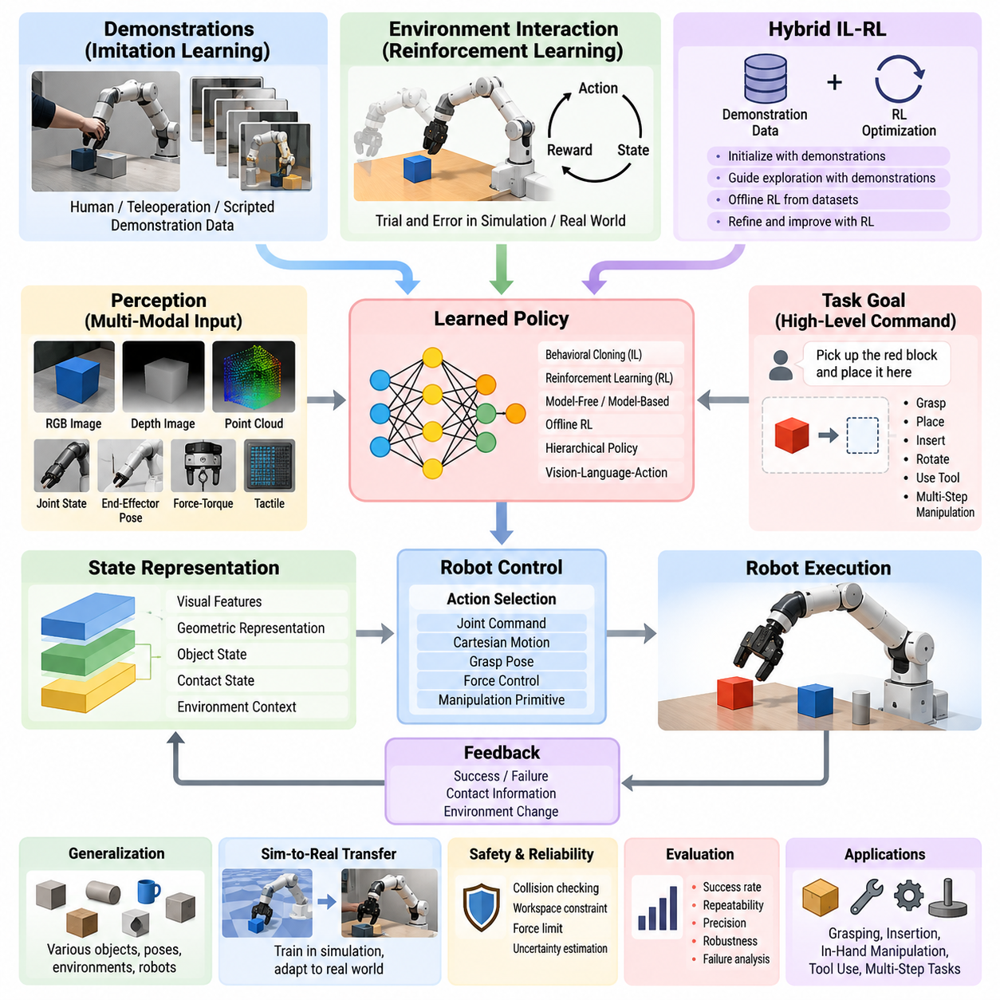
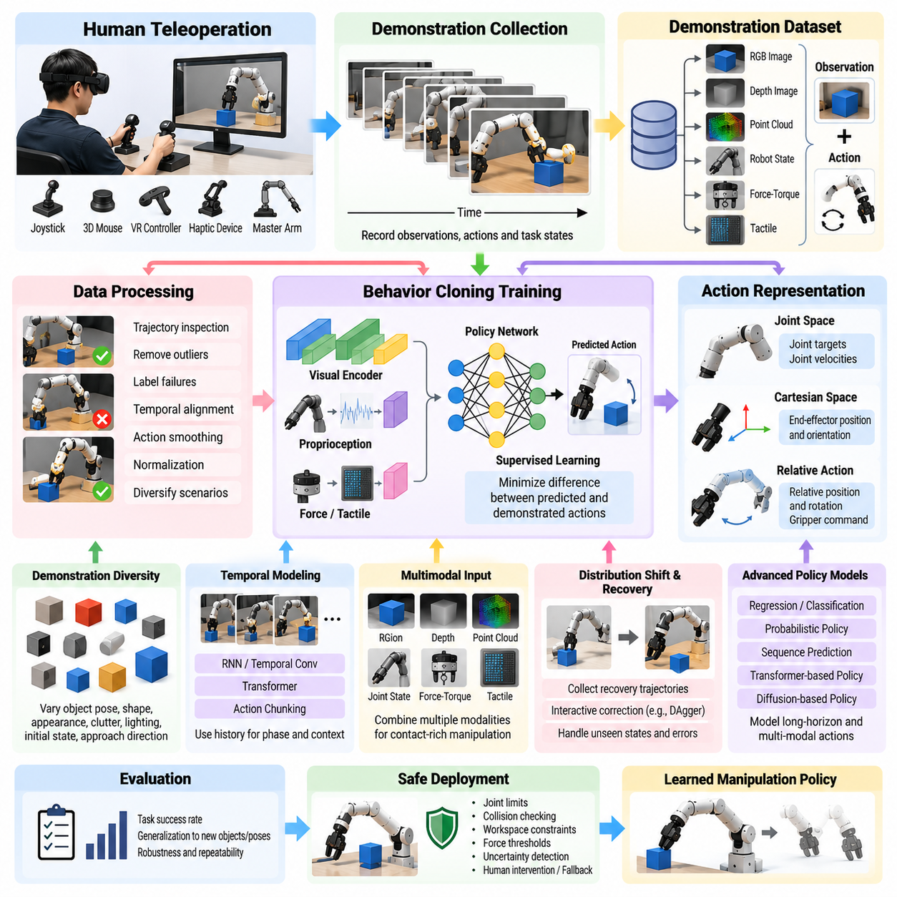
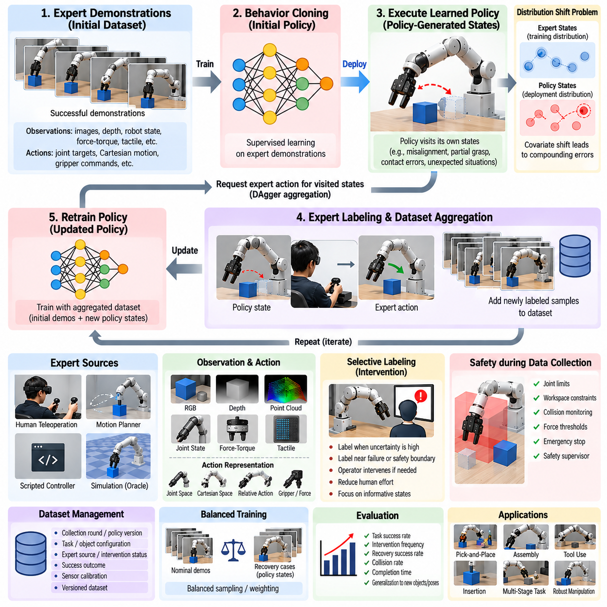
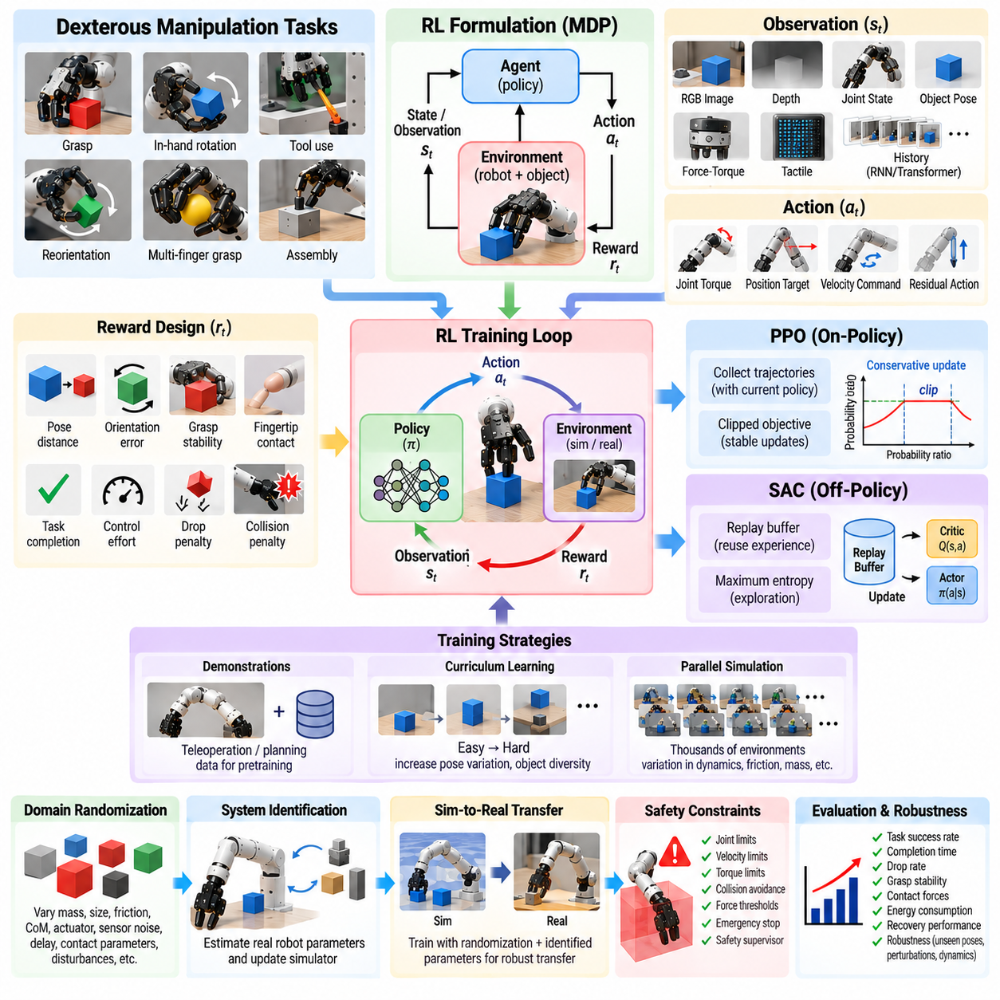
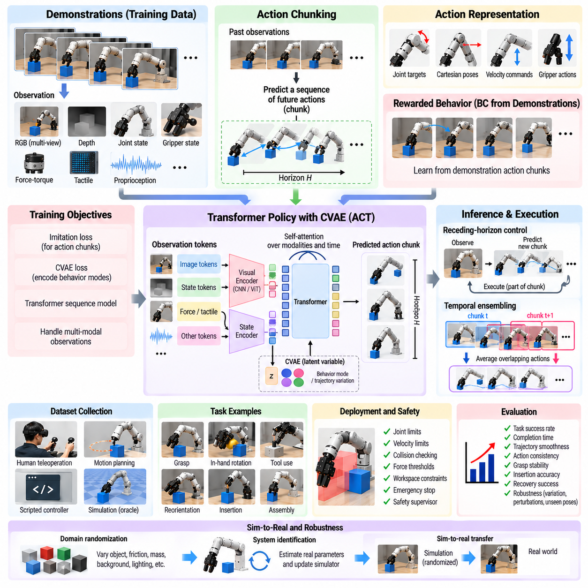
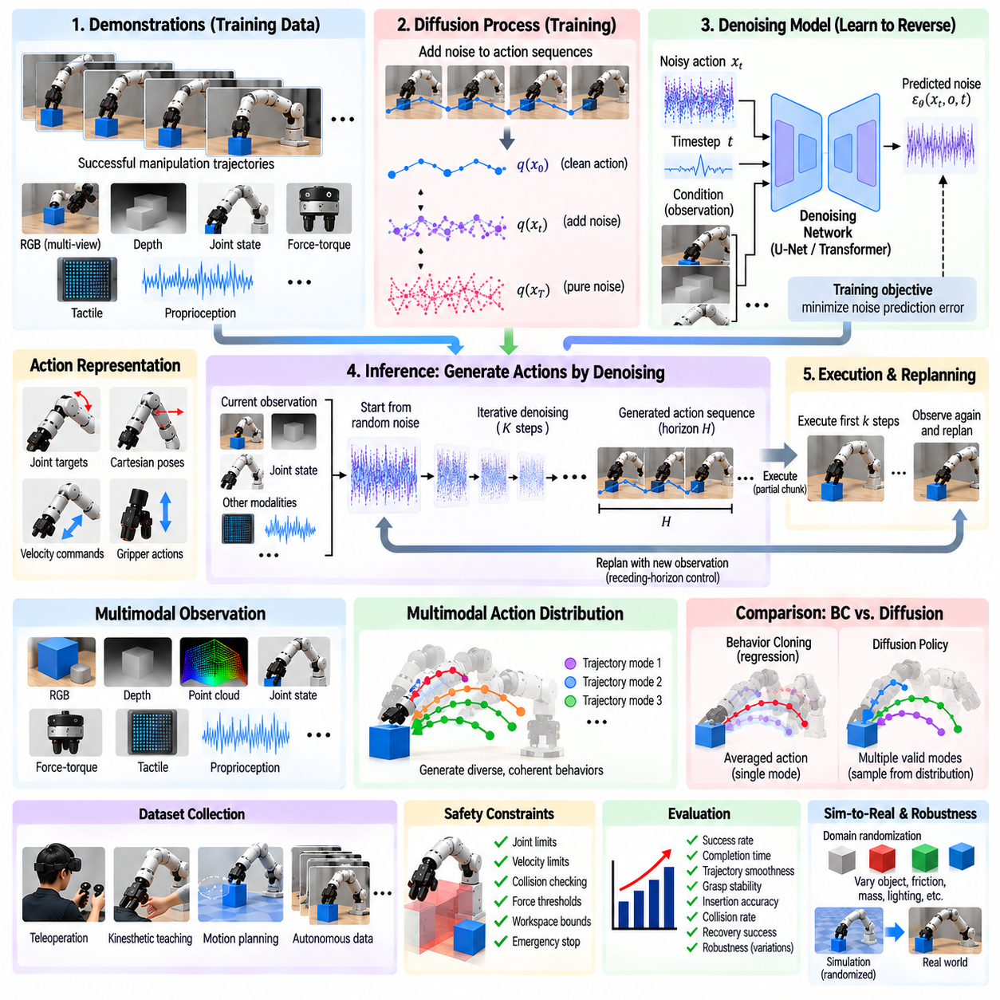
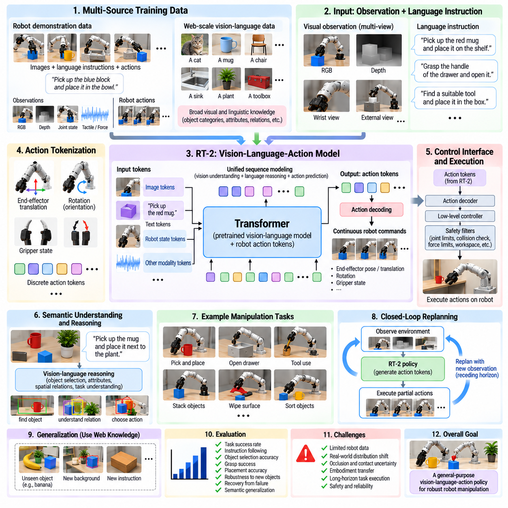
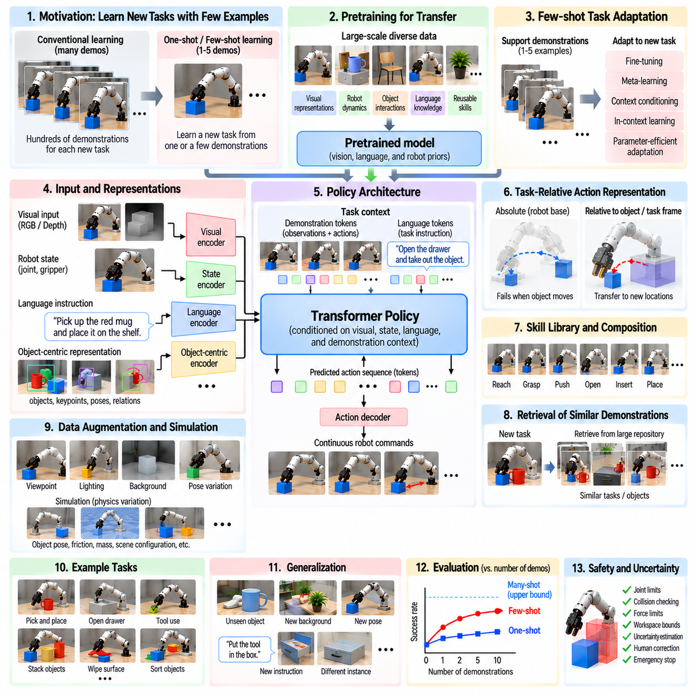
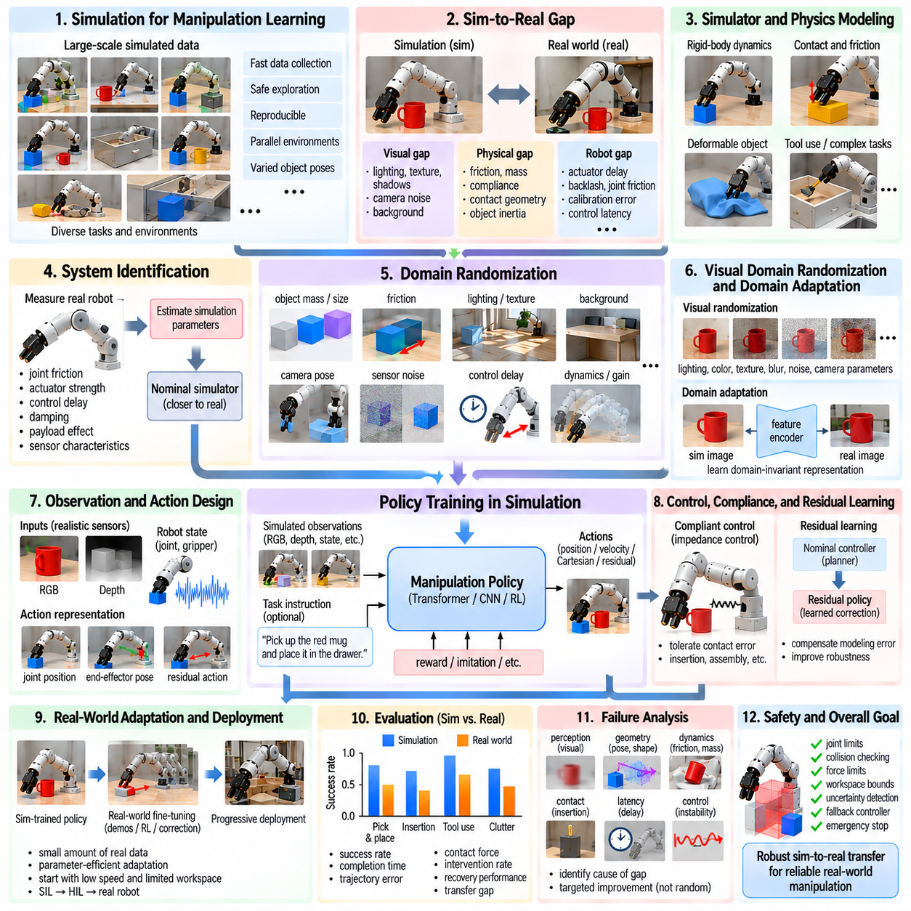
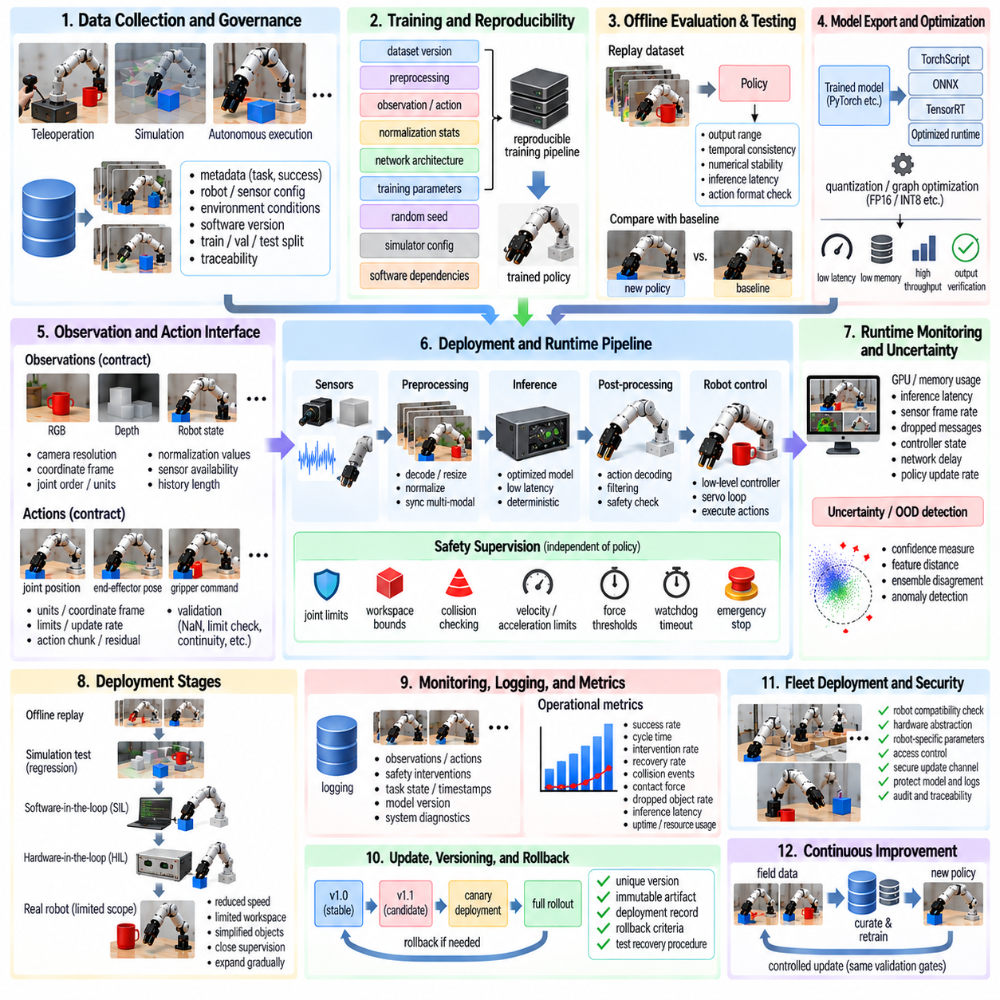

**Volume 17 Manipulation and Grasping AI**


# Chapter 07. Learning Based Manipulation

##  

## 07.01. Learning Based Manipulation Overview IL RL Hybrid

{width="7.268055555555556in" height="7.268055555555556in"}

Learning-based manipulation replaces manually specified robot behaviors with policies that acquire manipulation skills from data, interaction, and experience. Instead of defining every grasp, trajectory, contact transition, or recovery rule explicitly, the robot learns mappings from observations and task objectives to actions. This approach is especially valuable when manipulation involves uncertain perception, complex contact dynamics, object variability, or situations that are difficult to model accurately with analytical methods.

A learning-based manipulation system typically combines perception, state representation, policy learning, control, and feedback. Observations may include RGB or depth images, point clouds, joint states, end-effector poses, force-torque measurements, and tactile signals. These heterogeneous inputs are transformed into representations that capture task-relevant information. A learned policy then selects actions such as joint commands, Cartesian motions, grasp poses, forces, or higher-level manipulation primitives according to the current state and desired goal.

Imitation Learning (IL) learns manipulation behavior from demonstrations provided by humans, teleoperation systems, scripted controllers, or previously successful robot trajectories. The central idea is to transfer demonstrated behavior into a policy without requiring the robot to discover the entire solution through trial and error. Behavioral Cloning directly learns observation-to-action mappings from demonstration datasets, while more advanced approaches address distribution shift by allowing additional interaction, corrective demonstrations, or iterative dataset aggregation.

Demonstration quality strongly influences imitation-learning performance. Manipulation demonstrations must capture not only successful trajectories but also meaningful variations in object pose, geometry, contact conditions, robot configuration, and environmental context. Multimodal demonstrations can additionally include vision, proprioception, force, and tactile information. Large and diverse datasets improve generalization, but inconsistent demonstrations may introduce ambiguity, making data filtering, trajectory alignment, action normalization, and representation design important parts of the learning pipeline.

Reinforcement Learning (RL) formulates manipulation as sequential decision making in which an agent interacts with an environment and learns actions that maximize cumulative reward. Unlike imitation learning, RL can discover behaviors beyond those explicitly demonstrated. Rewards may represent grasp success, object displacement, insertion accuracy, task completion, energy consumption, collision avoidance, or manipulation efficiency. Through repeated interaction, the policy learns how actions influence future states and long-term task outcomes.

RL is particularly attractive for contact-rich tasks because manually deriving optimal strategies for friction, compliance, impacts, and uncertain object dynamics can be difficult. Tasks such as peg insertion, in-hand manipulation, pushing, tool use, and dexterous grasping may benefit from policies discovered through extensive exploration. However, real-world exploration is expensive and potentially unsafe. Consequently, simulation, parallel environments, domain randomization, offline datasets, and constrained exploration are commonly used to reduce physical training requirements.

The distinction between model-free and model-based reinforcement learning is important in robotic manipulation. Model-free methods directly optimize policies or value functions from experience and can learn highly complex behaviors, but often require large amounts of interaction. Model-based methods learn or exploit a representation of environment dynamics and use it to predict consequences before acting. Learned world models can improve data efficiency by enabling planning, imagined rollouts, and evaluation of candidate actions without executing every possibility on the physical robot.

Hybrid IL-RL approaches combine the strengths of demonstrations and autonomous optimization. Imitation learning can provide an initial policy that already performs meaningful behavior, substantially reducing the exploration burden of reinforcement learning. RL can subsequently refine this policy, adapt it to physical dynamics, recover from states that were absent from demonstrations, and optimize objectives that human demonstrations did not explicitly maximize. This progression from demonstration toward autonomous improvement is particularly useful for practical robotic systems.

Another hybrid strategy integrates demonstrations directly into reinforcement-learning objectives rather than separating pretraining and fine-tuning. Demonstration transitions can populate replay buffers, guide exploration, regularize policy updates, or provide reference trajectories. Offline reinforcement learning extends this principle by learning policies primarily from previously collected datasets without unrestricted online interaction. Such methods are attractive for industrial manipulation, where historical robot trajectories and production data may be available while uncontrolled exploration on operational equipment is unacceptable.

Learning can occur at several levels of the manipulation hierarchy. Low-level policies may learn force control, impedance behavior, or motor commands, whereas intermediate policies can predict grasp poses, motion segments, or manipulation primitives. Higher-level policies can select skills such as approach, grasp, lift, place, insert, rotate, or recover. Hierarchical learning decomposes long-horizon manipulation into reusable behaviors, reducing the complexity of policy learning while supporting compositional execution across different tasks.

Modern manipulation increasingly integrates language, vision, and action within shared learning architectures. Vision-language-action models can interpret semantic instructions and visual scenes while generating robot actions or skill sequences. Large-scale pretrained representations provide knowledge about objects, spatial relationships, and task semantics that conventional task-specific policies lack. Nevertheless, semantic understanding alone does not guarantee physically valid manipulation, so geometric reasoning, collision constraints, contact feedback, and real-time control remain essential.

Generalization is one of the primary objectives of learning-based manipulation. A useful policy should operate across object instances, poses, backgrounds, lighting conditions, robot states, and moderate changes in task configuration. Data augmentation, domain randomization, representation learning, multitask training, and large heterogeneous datasets improve robustness. Generalization across robot embodiments is more difficult because kinematics, workspace, grippers, sensors, and action spaces differ, motivating embodiment-aware representations and transferable action abstractions.

Sim-to-real transfer provides an important bridge between scalable training and physical deployment. Simulation enables millions of interactions without equipment damage or human supervision, but discrepancies in geometry, friction, actuator behavior, sensing, latency, and contact dynamics create a reality gap. Randomizing simulation parameters can prevent policies from depending excessively on one simulated configuration. System identification, real-world fine-tuning, residual learning, and adaptive control can further reduce the remaining mismatch after deployment.

Safety and reliability distinguish practical manipulation learning from laboratory demonstrations. Learned policies can encounter observations far outside their training distribution and may generate physically unsafe actions with high confidence. Deployment architectures therefore benefit from explicit safety envelopes, collision checking, workspace constraints, force limits, uncertainty estimation, anomaly detection, and supervisory controllers. A learned policy should operate as part of a layered robotic control architecture rather than being assumed to provide all safety guarantees by itself.

Evaluation must extend beyond average task success. Manipulation policies should be tested for repeatability, precision, cycle time, recovery capability, robustness to disturbances, sensitivity to object variation, and behavior under distribution shifts. Failure classification is particularly important because perception errors, planning errors, grasp failures, contact instability, and controller failures require different improvements. Benchmark results become more meaningful when experimental protocols clearly separate training conditions from genuinely unseen evaluation scenarios.

Learning-based manipulation ultimately represents a transition from programming individual motions toward building systems that acquire, adapt, and compose manipulation capabilities. Imitation Learning provides efficient knowledge transfer from demonstrations, Reinforcement Learning enables optimization through interaction, and hybrid IL-RL approaches connect prior experience with autonomous improvement. Combined with multimodal perception, world models, hierarchical skills, and safety-constrained control, these methods form a foundation for increasingly general-purpose robotic manipulation.

학습 기반 조작(Learning-Based Manipulation)은 사람이 로봇의 동작을 일일이 명시하는 방식 대신 데이터(Data), 상호작용(Interaction), 경험(Experience)을 통해 조작 기술(Manipulation Skill)을 획득하는 접근 방식이다. 모든 파지(Grasp), 궤적(Trajectory), 접촉 전이(Contact Transition), 복구 규칙(Recovery Rule)을 명시적으로 정의하지 않고, 로봇은 관측(Observation)과 작업 목표(Task Objective)로부터 행동(Action)을 생성하는 대응 관계를 학습한다. 이러한 접근은 불확실한 인식, 복잡한 접촉 동역학(Contact Dynamics), 물체의 다양성, 해석적 모델링(Analytical Modeling)이 어려운 상황에서 특히 유용하다.

학습 기반 조작 시스템(Learning-Based Manipulation System)은 일반적으로 인식(Perception), 상태 표현(State Representation), 정책 학습(Policy Learning), 제어(Control), 피드백(Feedback)을 결합한다. 관측에는 RGB 또는 깊이 영상(Depth Image), 포인트 클라우드(Point Cloud), 관절 상태(Joint State), 말단 장치 자세(End-Effector Pose), 힘-토크 측정(Force-Torque Measurement), 촉각 신호(Tactile Signal) 등이 포함될 수 있다. 이러한 이종 입력(Heterogeneous Input)은 작업과 관련된 정보를 표현하는 형태로 변환되며, 학습된 정책(Learned Policy)은 현재 상태와 목표에 따라 관절 명령, 데카르트 운동(Cartesian Motion), 파지 자세(Grasp Pose), 힘 또는 상위 수준 조작 프리미티브(Manipulation Primitive)를 선택한다.

모방 학습(Imitation Learning, IL)은 인간, 원격조작 시스템(Teleoperation System), 스크립트 기반 제어기(Scripted Controller), 또는 이전에 성공한 로봇 궤적(Robot Trajectory)이 제공하는 시연(Demonstration)으로부터 조작 행동을 학습한다. 핵심 개념은 로봇이 시행착오(Trial and Error)를 통해 전체 해결책을 처음부터 발견하도록 하지 않고 시연된 행동을 정책으로 이전하는 것이다. 행동 복제(Behavioral Cloning)는 시연 데이터셋으로부터 관측-행동(Observation-to-Action) 대응 관계를 직접 학습하며, 보다 발전된 방법은 추가 상호작용, 교정 시연(Corrective Demonstration), 반복적 데이터셋 집계(Dataset Aggregation)를 통해 분포 이동(Distribution Shift) 문제를 해결한다.

시연 품질(Demonstration Quality)은 모방 학습의 성능에 직접적인 영향을 준다. 조작 시연은 성공적인 궤적뿐 아니라 물체 자세(Object Pose), 형상(Geometry), 접촉 조건(Contact Condition), 로봇 구성(Robot Configuration), 환경 맥락(Environmental Context)의 의미 있는 변화를 포함해야 한다. 다중 모달 시연(Multimodal Demonstration)은 비전(Vision), 고유수용감각(Proprioception), 힘(Force), 촉각(Tactile) 정보를 함께 포함할 수 있다. 크고 다양한 데이터셋은 일반화(Generalization)를 향상시키지만 일관성이 부족한 시연은 모호성을 발생시킬 수 있으므로 데이터 필터링(Data Filtering), 궤적 정렬(Trajectory Alignment), 행동 정규화(Action Normalization), 표현 설계(Representation Design)가 중요한 학습 과정이 된다.

강화 학습(Reinforcement Learning, RL)은 로봇 조작을 에이전트(Agent)가 환경(Environment)과 상호작용하면서 누적 보상(Cumulative Reward)을 최대화하는 행동을 학습하는 순차적 의사결정(Sequential Decision Making) 문제로 정의한다. 모방 학습과 달리 강화 학습은 명시적으로 시연되지 않은 행동까지 발견할 수 있다. 보상(Reward)은 파지 성공, 물체 이동, 삽입 정확도, 작업 완료, 에너지 소비, 충돌 회피, 조작 효율 등을 나타낼 수 있으며, 반복적인 상호작용을 통해 정책은 현재의 행동이 미래 상태와 장기적인 작업 결과에 어떠한 영향을 미치는지를 학습한다.

강화 학습은 마찰(Friction), 컴플라이언스(Compliance), 충격(Impact), 불확실한 물체 동역학(Object Dynamics)에 대한 최적 전략을 수작업으로 도출하기 어려운 접촉 중심 작업(Contact-Rich Task)에 특히 유용하다. 페그 삽입(Peg Insertion), 손안 조작(In-Hand Manipulation), 밀기(Pushing), 도구 사용(Tool Use), 정교한 파지(Dexterous Grasping)와 같은 작업은 광범위한 탐색(Exploration)을 통해 발견된 정책의 이점을 얻을 수 있다. 그러나 실제 환경에서의 탐색은 비용이 높고 잠재적으로 위험하므로 시뮬레이션(Simulation), 병렬 환경(Parallel Environment), 도메인 무작위화(Domain Randomization), 오프라인 데이터셋(Offline Dataset), 제약된 탐색(Constrained Exploration) 등을 활용하여 물리적 학습의 부담을 줄인다.

모델 프리 강화 학습(Model-Free Reinforcement Learning)과 모델 기반 강화 학습(Model-Based Reinforcement Learning)의 구분은 로봇 조작에서 중요하다. 모델 프리 방식은 경험으로부터 정책(Policy)이나 가치 함수(Value Function)를 직접 최적화하여 복잡한 행동을 학습할 수 있지만 많은 상호작용이 필요한 경우가 많다. 모델 기반 방식은 환경 동역학(Environment Dynamics)의 표현을 학습하거나 활용하여 행동하기 전에 결과를 예측한다. 학습된 월드 모델(World Model)은 실제 로봇에서 모든 가능성을 실행하지 않고도 계획(Planning), 상상 롤아웃(Imagined Rollout), 후보 행동(Candidate Action)의 평가를 가능하게 하여 데이터 효율성(Data Efficiency)을 향상시킬 수 있다.

하이브리드 모방-강화 학습(Hybrid IL-RL)은 시연과 자율 최적화(Autonomous Optimization)의 장점을 결합한다. 모방 학습은 이미 의미 있는 행동을 수행할 수 있는 초기 정책(Initial Policy)을 제공함으로써 강화 학습에서 요구되는 탐색 부담을 크게 감소시킬 수 있다. 이후 강화 학습은 이 정책을 개선하고 실제 물리 동역학(Physical Dynamics)에 적응시키며, 시연에 포함되지 않았던 상태에서 복구하고 인간 시연이 명시적으로 최적화하지 않았던 목표까지 개선할 수 있다. 시연에서 자율적 개선으로 이어지는 이러한 과정은 실제 로봇 시스템에서 특히 유용하다.

또 다른 하이브리드 전략(Hybrid Strategy)은 사전 학습(Pretraining)과 미세조정(Fine-Tuning)을 완전히 분리하는 대신 시연 데이터를 강화 학습 목적 함수(Reinforcement Learning Objective)에 직접 통합한다. 시연 전이(Demonstration Transition)는 리플레이 버퍼(Replay Buffer)를 구성하고 탐색을 유도하며 정책 업데이트를 정규화하거나 기준 궤적(Reference Trajectory)을 제공할 수 있다. 오프라인 강화 학습(Offline Reinforcement Learning)은 제한 없는 온라인 상호작용 없이 기존에 수집된 데이터셋을 중심으로 정책을 학습한다. 이러한 방식은 과거 로봇 궤적과 생산 데이터가 존재하지만 실제 운영 장비에서 통제되지 않은 탐색을 허용하기 어려운 산업용 조작(Industrial Manipulation)에 적합하다.

학습은 조작 계층(Manipulation Hierarchy)의 여러 수준에서 수행될 수 있다. 저수준 정책(Low-Level Policy)은 힘 제어(Force Control), 임피던스 동작(Impedance Behavior), 모터 명령(Motor Command)을 학습할 수 있으며, 중간 수준 정책(Intermediate-Level Policy)은 파지 자세, 운동 구간(Motion Segment), 조작 프리미티브를 예측할 수 있다. 상위 수준 정책(High-Level Policy)은 접근(Approach), 파지(Grasp), 들어올리기(Lift), 배치(Place), 삽입(Insert), 회전(Rotate), 복구(Recover) 등의 기술을 선택할 수 있다. 계층적 학습(Hierarchical Learning)은 장기 시간 범위 조작(Long-Horizon Manipulation)을 재사용 가능한 행동으로 분해하여 정책 학습의 복잡성을 낮추고 서로 다른 작업에서의 조합적 실행(Compositional Execution)을 지원한다.

현대의 로봇 조작은 언어(Language), 비전(Vision), 행동(Action)을 공유 학습 아키텍처(Shared Learning Architecture) 안에서 통합하는 방향으로 발전하고 있다. 비전-언어-행동 모델(Vision-Language-Action Model, VLA)은 의미적 명령(Semantic Instruction)과 시각적 장면을 해석하면서 로봇 행동 또는 기술 시퀀스(Skill Sequence)를 생성할 수 있다. 대규모 사전학습 표현(Large-Scale Pretrained Representation)은 기존의 작업별 정책이 부족했던 물체, 공간 관계, 작업 의미에 관한 지식을 제공한다. 그러나 의미적 이해만으로 물리적으로 유효한 조작이 보장되는 것은 아니므로 기하학적 추론(Geometric Reasoning), 충돌 제약(Collision Constraint), 접촉 피드백(Contact Feedback), 실시간 제어(Real-Time Control)가 함께 필요하다.

일반화(Generalization)는 학습 기반 조작의 핵심 목표 중 하나이다. 유용한 정책은 다양한 물체 인스턴스(Object Instance), 자세, 배경, 조명 조건, 로봇 상태, 작업 구성의 변화에서도 동작해야 한다. 데이터 증강(Data Augmentation), 도메인 무작위화, 표현 학습(Representation Learning), 다중 작업 학습(Multitask Learning), 대규모 이종 데이터셋(Large Heterogeneous Dataset)은 강건성(Robustness)을 향상시킨다. 서로 다른 로봇 형태(Embodiment) 사이의 일반화는 운동학(Kinematics), 작업공간(Workspace), 그리퍼(Gripper), 센서(Sensor), 행동 공간(Action Space)이 서로 다르기 때문에 더욱 어려우며, 이를 위해 형태 인식 표현(Embodiment-Aware Representation)과 전이 가능한 행동 추상화(Transferable Action Abstraction)가 요구된다.

시뮬레이션-실세계 전이(Sim-to-Real Transfer)는 확장 가능한 학습과 실제 로봇 배치(Physical Deployment)를 연결하는 중요한 수단이다. 시뮬레이션에서는 장비 손상이나 지속적인 인간 감독 없이 수백만 번의 상호작용을 수행할 수 있지만, 형상, 마찰, 액추에이터 동작, 센싱, 지연시간(Latency), 접촉 동역학의 차이로 인해 현실 격차(Reality Gap)가 발생한다. 시뮬레이션 파라미터를 무작위화하면 정책이 특정 시뮬레이션 조건에 과도하게 의존하는 것을 방지할 수 있다. 시스템 식별(System Identification), 실제 환경 미세조정(Real-World Fine-Tuning), 잔차 학습(Residual Learning), 적응 제어(Adaptive Control)는 실제 배치 이후 남아 있는 차이를 추가적으로 감소시킬 수 있다.

안전성(Safety)과 신뢰성(Reliability)은 실용적인 조작 학습 시스템과 실험실 수준의 시연을 구분하는 핵심 요소이다. 학습된 정책은 학습 분포(Training Distribution)를 크게 벗어난 관측을 만날 수 있으며 높은 확신으로 물리적으로 위험한 행동을 생성할 수도 있다. 따라서 실제 배치 아키텍처에는 명시적인 안전 영역(Safety Envelope), 충돌 검사(Collision Checking), 작업공간 제약(Workspace Constraint), 힘 제한(Force Limit), 불확실성 추정(Uncertainty Estimation), 이상 탐지(Anomaly Detection), 감독 제어기(Supervisory Controller)가 포함되는 것이 바람직하다. 학습 정책 자체가 모든 안전성을 보장한다고 가정하기보다는 계층화된 로봇 제어 아키텍처(Layered Robotic Control Architecture)의 일부로 운용해야 한다.

평가(Evaluation)는 평균적인 작업 성공률(Task Success Rate)을 측정하는 수준을 넘어야 한다. 조작 정책은 반복성(Repeatability), 정밀도(Precision), 사이클 타임(Cycle Time), 복구 능력(Recovery Capability), 외란에 대한 강건성, 물체 변화에 대한 민감도, 분포 이동 상황에서의 행동 등을 기준으로 평가해야 한다. 특히 실패 분류(Failure Classification)가 중요한데, 인식 오류(Perception Error), 계획 오류(Planning Error), 파지 실패(Grasp Failure), 접촉 불안정성(Contact Instability), 제어기 실패(Controller Failure)는 서로 다른 개선 방법을 요구하기 때문이다. 학습 조건과 실제 미관측 평가 조건(Unseen Evaluation Condition)을 명확하게 분리할 때 벤치마크(Benchmark) 결과의 의미가 더욱 커진다.

학습 기반 조작은 궁극적으로 개별 동작을 프로그래밍하는 방식에서 로봇이 조작 능력을 획득하고 적응하며 조합할 수 있는 시스템을 구축하는 방식으로의 전환을 의미한다. 모방 학습(Imitation Learning)은 시연으로부터 효율적인 지식 전달(Knowledge Transfer)을 제공하고, 강화 학습(Reinforcement Learning)은 상호작용을 통한 최적화를 가능하게 하며, 하이브리드 IL-RL(Hybrid IL-RL)은 기존 경험과 자율적 개선을 연결한다. 이러한 방법을 다중 모달 인식(Multimodal Perception), 월드 모델(World Model), 계층적 기술(Hierarchical Skill), 안전 제약 제어(Safety-Constrained Control)와 결합하면 점차 범용화되는 로봇 조작(General-Purpose Robotic Manipulation)의 핵심 기반을 형성할 수 있다.

##  

## 07.02. Behavior Cloning from Human Teleoperation [w/Code]

{width="7.268055555555556in" height="7.268055555555556in"}

Behavior Cloning (BC) is a direct form of imitation learning in which a robot learns a manipulation policy from demonstrations rather than discovering behavior through autonomous trial and error. In human teleoperation, an operator controls the robot while observations, actions, and task states are recorded as demonstration trajectories. The resulting dataset provides supervised examples showing how appropriate actions should be selected under different manipulation conditions.

A teleoperation system acts as the interface between human manipulation intent and the robot action space. Operators may command the robot using joysticks, 3D mice, motion-capture devices, VR controllers, haptic interfaces, or master manipulators. The interface should allow intuitive control of end-effector position, orientation, gripper state, and sometimes contact force. Good interface design reduces operator workload while producing smooth and consistent demonstrations suitable for policy learning.

Each demonstration can be represented as a sequence of observation-action pairs collected over time. An observation may contain RGB images, depth images, point clouds, robot joint positions, joint velocities, end-effector poses, gripper states, force-torque measurements, and tactile signals. The corresponding action can specify joint targets, Cartesian displacement, end-effector velocity, gripper commands, or other control variables. Accurate temporal synchronization between these modalities is essential for creating valid training samples.

The fundamental Behavior Cloning objective is supervised learning of a policy that predicts the demonstrated action from the current observation. Given demonstration pairs consisting of observations and expert actions, the policy parameters are optimized to minimize the difference between predicted and demonstrated actions. Continuous manipulation commonly uses regression losses, while discrete skill or command selection can use classification objectives. More complex policies may predict probability distributions to represent multiple plausible actions.

Human teleoperation data contains characteristics that differ from automatically generated trajectories. Operators exhibit reaction delays, variable motion speed, corrective movements, hesitation, and individual control styles. These properties can provide useful examples of real recovery behavior, but excessive inconsistency can make the learning target ambiguous. Dataset construction therefore often includes trajectory inspection, unsuccessful-trial labeling, outlier removal, temporal alignment, action smoothing, and normalization while preserving informative corrections.

Demonstration diversity is more important than simply repeating nearly identical successful executions. Training data should cover variations in object position, orientation, shape, appearance, clutter, lighting, initial robot configuration, and approach direction. Contact-rich manipulation additionally requires variations in friction, alignment, grasp quality, and interaction forces. A diverse demonstration distribution helps the learned policy distinguish essential task structure from accidental properties of a particular demonstration environment.

Visual Behavior Cloning learns actions directly from camera observations or from learned visual representations. Convolutional networks, vision transformers, or pretrained visual encoders can transform images into compact features representing objects, geometry, and scene context. These features are combined with proprioceptive robot states before action prediction. Depth and point-cloud information can strengthen geometric reasoning when accurate spatial relationships are required for grasping, insertion, placement, and tool interaction.

Action representation strongly influences policy performance. Joint-space commands provide direct correspondence to robot actuators but are closely tied to a specific embodiment. Cartesian end-effector actions can provide a more transferable representation for manipulation tasks because they describe desired motion relative to the workspace or object. Relative position and rotation increments are frequently useful because they reduce dependence on absolute coordinates and allow demonstrations collected at different poses to share similar action patterns.

Behavior Cloning suffers from distribution shift because the policy is trained primarily on states visited by the human demonstrator. Small prediction errors during autonomous execution can move the robot into states that were rarely or never observed in the training dataset. Subsequent predictions may become increasingly inaccurate, producing compounding errors. This problem is particularly serious in long-horizon manipulation, where small deviations during approach or grasping can eventually cause complete task failure.

Several strategies reduce this distribution mismatch. Demonstrators can intentionally collect recovery trajectories from perturbed states, or the robot can execute its current policy while a human provides corrections when necessary. Dataset Aggregation methods iteratively add observations encountered by the learned policy together with expert actions for those states. Such interactive data collection expands training coverage around failure boundaries and teaches the policy how to recover instead of learning only ideal nominal trajectories.

Temporal context is important because many manipulation actions cannot be inferred from a single observation. The same visual scene may require different actions depending on whether the robot is approaching an object, closing the gripper, lifting it, or preparing to place it. Recurrent neural networks, temporal convolution, transformers, and history-based policies incorporate previous observations and actions. Temporal representations can therefore infer task phase, motion direction, contact progression, and hidden state more reliably.

Multimodal policies become particularly valuable when manipulation depends on physical contact. Vision provides global information about objects and workspace geometry, while force-torque and tactile sensors reveal contact events that may be visually subtle or completely occluded. Proprioception describes the robot\'s internal configuration and motion. Combining these modalities allows Behavior Cloning policies to reproduce demonstrations for tasks such as insertion, surface following, compliant grasping, connector assembly, and delicate object handling.

Modern Behavior Cloning increasingly uses sequence prediction rather than predicting only the next instantaneous command. Action chunking predicts a short sequence of future actions and can reduce sensitivity to noise while producing smoother robot motion. Transformer-based policies can model long temporal dependencies across observations and actions. Diffusion-based policies can represent multimodal action distributions, which is useful when several distinct but equally valid manipulation trajectories can accomplish the same task.

Data quality and quantity must be considered together. A large dataset containing poorly synchronized, inconsistent, or irrelevant trajectories may perform worse than a smaller but carefully curated collection. Metadata describing task identity, object configuration, operator, success status, robot embodiment, sensor calibration, and environmental conditions improves dataset management. Maintaining raw demonstrations alongside processed training samples also supports reproducibility and future reprocessing when representations or learning algorithms change.

Training and validation datasets should be separated according to the generalization capability being measured. Randomly splitting frames from the same trajectory can produce misleading results because neighboring frames are highly correlated. More meaningful evaluation holds out complete trajectories, object instances, poses, operators, or environmental configurations. This reveals whether the policy has learned transferable manipulation behavior rather than memorizing visual scenes or reproducing narrowly repeated motion patterns.

Real-world deployment requires the learned policy to operate within a controlled safety architecture. Predicted actions can be filtered through joint limits, velocity limits, collision checking, workspace boundaries, force thresholds, and emergency-stop mechanisms. Uncertainty or out-of-distribution detection can trigger slower execution, human intervention, or fallback behavior. These safeguards are especially important because supervised imitation does not inherently guarantee that every predicted action is physically safe.

Behavior Cloning from human teleoperation provides a practical route for transferring manipulation expertise into robots without requiring explicit programming of every motion. Its effectiveness depends on intuitive teleoperation, synchronized multimodal recording, diverse demonstrations, suitable action representations, temporal modeling, and systematic handling of distribution shift. When combined with recovery data, interactive correction, robust evaluation, and safety supervision, BC becomes a strong foundation for scalable learning-based manipulation.

행동 복제(Behavior Cloning, BC)는 로봇이 자율적인 시행착오(Trial and Error)를 통해 행동을 발견하는 대신 시연(Demonstration)으로부터 조작 정책(Manipulation Policy)을 학습하는 직접적인 형태의 모방 학습(Imitation Learning)이다. 인간 원격조작(Human Teleoperation)에서는 작업자가 로봇을 제어하는 동안 관측(Observation), 행동(Action), 작업 상태(Task State)가 시연 궤적(Demonstration Trajectory)으로 기록된다. 이렇게 생성된 데이터셋은 다양한 조작 조건에서 적절한 행동을 어떻게 선택해야 하는지를 보여주는 지도 학습(Supervised Learning) 예제를 제공한다.

원격조작 시스템(Teleoperation System)은 인간의 조작 의도(Manipulation Intent)와 로봇 행동 공간(Robot Action Space)을 연결하는 인터페이스 역할을 한다. 작업자는 조이스틱(Joystick), 3D 마우스(3D Mouse), 모션 캡처 장치(Motion-Capture Device), 가상현실 제어기(VR Controller), 햅틱 인터페이스(Haptic Interface), 마스터 매니퓰레이터(Master Manipulator) 등을 사용하여 로봇을 제어할 수 있다. 인터페이스는 말단 장치(End-Effector)의 위치와 방향, 그리퍼 상태(Gripper State), 경우에 따라 접촉력(Contact Force)까지 직관적으로 제어할 수 있어야 한다. 우수한 인터페이스 설계는 작업자의 부담을 줄이면서 정책 학습에 적합한 부드럽고 일관된 시연을 생성하도록 한다.

각 시연은 시간에 따라 수집된 관측-행동 쌍(Observation-Action Pair)의 시퀀스(Sequence)로 표현할 수 있다. 관측에는 RGB 영상(RGB Image), 깊이 영상(Depth Image), 포인트 클라우드(Point Cloud), 로봇 관절 위치(Joint Position), 관절 속도(Joint Velocity), 말단 장치 자세(End-Effector Pose), 그리퍼 상태, 힘-토크 측정(Force-Torque Measurement), 촉각 신호(Tactile Signal) 등이 포함될 수 있다. 이에 대응하는 행동은 관절 목표값(Joint Target), 데카르트 변위(Cartesian Displacement), 말단 장치 속도, 그리퍼 명령 또는 기타 제어 변수를 지정할 수 있다. 이러한 다중 모달리티(Modality) 사이의 정확한 시간 동기화(Temporal Synchronization)는 유효한 학습 샘플을 생성하는 데 필수적이다.

행동 복제의 기본 목적은 현재 관측으로부터 시연된 행동을 예측하는 정책을 지도 학습 방식으로 학습하는 것이다. 관측과 전문가 행동(Expert Action)으로 구성된 시연 쌍이 주어지면 정책 파라미터(Policy Parameter)는 예측 행동과 시연 행동 사이의 차이를 최소화하도록 최적화된다. 연속적인 조작(Continuous Manipulation)에서는 일반적으로 회귀 손실(Regression Loss)을 사용하며, 이산적인 기술 또는 명령 선택에는 분류 목적 함수(Classification Objective)를 사용할 수 있다. 보다 복잡한 정책은 여러 개의 가능한 행동을 표현하기 위해 확률 분포(Probability Distribution)를 예측할 수도 있다.

인간 원격조작 데이터(Human Teleoperation Data)는 자동으로 생성된 궤적과는 다른 특성을 포함한다. 작업자는 반응 지연(Reaction Delay), 가변적인 운동 속도, 교정 동작(Corrective Movement), 주저하는 동작(Hesitation), 개인별 제어 스타일을 나타낸다. 이러한 특성은 실제 복구 행동(Recovery Behavior)의 유용한 사례를 제공할 수 있지만 지나친 불일치는 학습 목표를 모호하게 만들 수 있다. 따라서 데이터셋 구축 과정에는 정보 가치가 있는 교정 동작을 보존하면서 궤적 검사(Trajectory Inspection), 실패 시도 라벨링(Failure-Trial Labeling), 이상치 제거(Outlier Removal), 시간 정렬(Temporal Alignment), 행동 평활화(Action Smoothing), 정규화(Normalization) 등이 포함되는 경우가 많다.

시연 다양성(Demonstration Diversity)은 거의 동일한 성공 동작을 단순히 반복하는 것보다 중요하다. 학습 데이터는 물체 위치, 방향, 형상, 외관, 복잡한 배치(Clutter), 조명, 초기 로봇 구성(Initial Robot Configuration), 접근 방향(Approach Direction)의 변화를 포함해야 한다. 접촉 중심 조작(Contact-Rich Manipulation)의 경우 마찰(Friction), 정렬(Alignment), 파지 품질(Grasp Quality), 상호작용 힘(Interaction Force)의 변화도 필요하다. 다양한 시연 분포(Demonstration Distribution)는 학습된 정책이 특정 시연 환경의 우연한 특성이 아니라 작업의 본질적인 구조를 구별하도록 돕는다.

시각 행동 복제(Visual Behavior Cloning)는 카메라 관측 또는 학습된 시각 표현(Visual Representation)으로부터 직접 행동을 학습한다. 합성곱 신경망(Convolutional Neural Network), 비전 트랜스포머(Vision Transformer), 사전학습 시각 인코더(Pretrained Visual Encoder)는 영상을 물체, 기하 구조, 장면 맥락(Scene Context)을 나타내는 압축된 특징으로 변환할 수 있다. 이러한 특징은 행동을 예측하기 전에 고유수용성 로봇 상태(Proprioceptive Robot State)와 결합된다. 깊이 및 포인트 클라우드 정보는 파지, 삽입, 배치, 도구 상호작용처럼 정확한 공간 관계가 필요한 작업에서 기하학적 추론(Geometric Reasoning)을 강화할 수 있다.

행동 표현(Action Representation)은 정책 성능에 큰 영향을 미친다. 관절 공간 명령(Joint-Space Command)은 로봇 액추에이터와 직접 대응하지만 특정 로봇 형태(Embodiment)에 강하게 종속된다. 데카르트 말단 장치 행동(Cartesian End-Effector Action)은 작업공간 또는 물체를 기준으로 원하는 운동을 표현하기 때문에 조작 작업에서 보다 전이 가능한 표현(Transferable Representation)을 제공할 수 있다. 상대적인 위치와 회전 증분(Relative Position and Rotation Increment)은 절대 좌표에 대한 의존성을 감소시키고 서로 다른 자세에서 수집된 시연이 유사한 행동 패턴을 공유하도록 할 수 있어 자주 활용된다.

행동 복제는 정책이 주로 인간 시연자가 방문했던 상태(State)를 기반으로 학습되기 때문에 분포 이동(Distribution Shift) 문제를 가진다. 자율 실행 과정에서 발생한 작은 예측 오차는 로봇을 학습 데이터에서 거의 또는 전혀 관측되지 않았던 상태로 이동시킬 수 있다. 이후의 예측은 점점 더 부정확해지면서 누적 오차(Compounding Error)를 발생시킬 수 있다. 이러한 문제는 접근이나 파지 과정에서 발생한 작은 편차가 최종적으로 전체 작업 실패로 이어질 수 있는 장기 시간 범위 조작(Long-Horizon Manipulation)에서 특히 심각하다.

이러한 분포 불일치(Distribution Mismatch)를 감소시키기 위한 여러 전략이 존재한다. 시연자는 의도적으로 교란된 상태(Perturbed State)에서 복구 궤적(Recovery Trajectory)을 수집할 수 있으며, 로봇이 현재 정책을 실행하는 동안 필요한 시점에 인간이 교정 행동을 제공할 수도 있다. 데이터셋 집계(Dataset Aggregation) 방식은 학습된 정책이 실제로 방문한 관측과 해당 상태에 대한 전문가 행동을 반복적으로 추가한다. 이러한 상호작용형 데이터 수집(Interactive Data Collection)은 실패 경계(Failure Boundary) 주변의 학습 범위를 확장하고 정책이 이상적인 정상 궤적(Nominal Trajectory)만 학습하는 대신 실패 상태에서 복구하는 방법까지 학습하도록 한다.

시간적 맥락(Temporal Context)은 많은 조작 행동을 단일 관측만으로 추론할 수 없기 때문에 중요하다. 동일한 시각적 장면이라도 로봇이 물체에 접근하고 있는지, 그리퍼를 닫고 있는지, 물체를 들어 올리는지, 또는 배치를 준비하고 있는지에 따라 서로 다른 행동이 필요할 수 있다. 순환 신경망(Recurrent Neural Network), 시간 합성곱(Temporal Convolution), 트랜스포머(Transformer), 이력 기반 정책(History-Based Policy)은 이전 관측과 행동을 함께 사용한다. 따라서 시간 표현(Temporal Representation)은 작업 단계(Task Phase), 운동 방향, 접촉 진행 상태(Contact Progression), 숨겨진 상태(Hidden State)를 더욱 안정적으로 추론할 수 있다.

다중 모달 정책(Multimodal Policy)은 조작이 물리적 접촉에 의존할수록 더욱 중요해진다. 비전(Vision)은 물체와 작업공간 기하 구조에 대한 전역 정보를 제공하며, 힘-토크 센서(Force-Torque Sensor)와 촉각 센서(Tactile Sensor)는 시각적으로 미세하거나 완전히 가려진 접촉 사건(Contact Event)을 감지한다. 고유수용감각(Proprioception)은 로봇 자체의 구성과 운동 상태를 나타낸다. 이러한 모달리티를 결합하면 행동 복제 정책은 삽입(Insertion), 표면 추종(Surface Following), 순응 파지(Compliant Grasping), 커넥터 조립(Connector Assembly), 섬세한 물체 취급(Delicate Object Handling)과 같은 작업의 시연 행동을 더욱 효과적으로 재현할 수 있다.

현대의 행동 복제는 하나의 순간적인 명령만 예측하는 방식에서 시퀀스 예측(Sequence Prediction)을 활용하는 방향으로 발전하고 있다. 행동 청킹(Action Chunking)은 짧은 미래 행동 시퀀스를 예측하여 노이즈에 대한 민감도를 낮추면서 더욱 부드러운 로봇 운동을 생성할 수 있다. 트랜스포머 기반 정책(Transformer-Based Policy)은 관측과 행동 사이의 장기 시간 의존성(Long Temporal Dependency)을 모델링할 수 있다. 확산 기반 정책(Diffusion-Based Policy)은 다중 모드 행동 분포(Multimodal Action Distribution)를 표현할 수 있어 서로 다른 여러 조작 궤적이 동일한 작업을 성공적으로 수행할 수 있는 상황에서 특히 유용하다.

데이터 품질(Data Quality)과 데이터 양(Data Quantity)은 함께 고려해야 한다. 시간 동기화가 부정확하거나 일관성이 부족하고 관련성이 낮은 궤적이 포함된 대규모 데이터셋은 신중하게 정제된 소규모 데이터셋보다 낮은 성능을 보일 수도 있다. 작업 식별자(Task Identity), 물체 구성(Object Configuration), 작업자, 성공 상태(Success Status), 로봇 형태, 센서 보정(Sensor Calibration), 환경 조건을 기술하는 메타데이터(Metadata)는 데이터셋 관리를 향상시킨다. 또한 원본 시연(Raw Demonstration)을 처리된 학습 샘플과 함께 유지하면 표현 방식이나 학습 알고리즘이 변경되었을 때 재현성(Reproducibility)과 향후 재처리를 지원할 수 있다.

학습 데이터셋(Training Dataset)과 검증 데이터셋(Validation Dataset)은 측정하려는 일반화 능력(Generalization Capability)에 따라 분리해야 한다. 동일한 궤적의 프레임을 무작위로 분할하면 인접 프레임 사이의 높은 상관관계 때문에 실제보다 과도하게 좋은 결과가 나타날 수 있다. 보다 의미 있는 평가는 완전한 궤적, 물체 인스턴스(Object Instance), 자세, 작업자 또는 환경 구성을 학습에서 제외한 후 평가에 사용한다. 이를 통해 정책이 시각적 장면을 암기하거나 제한적으로 반복된 운동 패턴을 재현한 것이 아니라 전이 가능한 조작 행동(Transferable Manipulation Behavior)을 실제로 학습했는지 확인할 수 있다.

실세계 배치(Real-World Deployment)에서는 학습된 정책이 통제된 안전 아키텍처(Safety Architecture) 내부에서 동작해야 한다. 예측된 행동은 관절 제한(Joint Limit), 속도 제한(Velocity Limit), 충돌 검사(Collision Checking), 작업공간 경계(Workspace Boundary), 힘 임계값(Force Threshold), 비상 정지(Emergency Stop) 등을 통해 필터링할 수 있다. 불확실성(Uncertainty) 또는 분포 외 감지(Out-of-Distribution Detection)는 저속 실행, 인간 개입(Human Intervention), 대체 행동(Fallback Behavior)을 활성화할 수 있다. 지도 방식의 모방 학습은 모든 예측 행동이 물리적으로 안전하다는 것을 본질적으로 보장하지 않기 때문에 이러한 안전장치는 특히 중요하다.

인간 원격조작 기반 행동 복제(Behavior Cloning from Human Teleoperation)는 모든 로봇 운동을 명시적으로 프로그래밍하지 않고도 인간의 조작 전문성(Manipulation Expertise)을 로봇으로 전달할 수 있는 실용적인 방법을 제공한다. 그 효과는 직관적인 원격조작, 동기화된 다중 모달 기록(Synchronized Multimodal Recording), 다양한 시연, 적절한 행동 표현, 시간 모델링(Temporal Modeling), 분포 이동의 체계적인 처리에 의해 결정된다. 복구 데이터(Recovery Data), 상호작용형 교정(Interactive Correction), 강건한 평가(Robust Evaluation), 안전 감독(Safety Supervision)을 함께 적용하면 행동 복제는 확장 가능한 학습 기반 조작(Scalable Learning-Based Manipulation)을 위한 강력한 기반이 될 수 있다.

##  

## 07.03. DAgger Dataset Aggregation for Manipulation [w/Code]

{width="7.268055555555556in" height="7.268055555555556in"}

DAgger, or Dataset Aggregation, is an interactive imitation-learning method designed to address one of the fundamental weaknesses of standard Behavior Cloning. A policy trained only on expert demonstrations observes states generated by expert behavior during training, but during autonomous execution its own prediction errors can move the robot into unfamiliar states. DAgger explicitly collects expert guidance in states visited by the learned policy, reducing this mismatch between training and deployment distributions.

The central problem addressed by DAgger is covariate shift between expert trajectories and policy-generated trajectories. In manipulation, a small positional error during approach can alter the subsequent grasp pose, contact geometry, or object motion. The next observation therefore differs from the demonstrations, increasing the probability of another incorrect action. These errors can accumulate over a long manipulation sequence until the robot enters a state for which the original dataset provides little useful supervision.

DAgger changes data collection from a one-time demonstration process into an iterative learning loop. An initial dataset is typically collected from an expert, and a policy is trained using supervised imitation learning. The learned policy is then executed in the task environment, allowing it to visit states produced by its own behavior. For those encountered states, an expert provides the action that should have been taken, and the newly labeled samples are added to the existing dataset.

After aggregation, the policy is retrained or incrementally updated using both the original demonstrations and newly collected policy-state examples. The improved policy is deployed again, producing another set of states that reflects its current strengths and weaknesses. Repeating this cycle progressively shifts the dataset toward the distribution encountered during actual autonomous operation. Training therefore becomes coupled to the robot\'s evolving behavior rather than remaining limited to trajectories generated by a nearly perfect expert.

In robotic manipulation, the expert can take several forms. A human operator may provide labels through teleoperation, a conventional motion planner may calculate corrective actions, or a reliable scripted controller may act as an oracle in structured tasks. Simulation can provide privileged information unavailable during deployment, allowing an expert controller to generate labels automatically. The choice of expert determines annotation cost, action quality, response latency, and the range of states that can be supervised effectively.

A practical DAgger system does not necessarily require continuous human control. The learned policy can operate autonomously while the operator observes execution and intervenes only when correction is necessary. Intervention-based variants reduce operator workload by concentrating expert effort on uncertain, dangerous, or failure-prone situations. Corrections collected near these critical states can be particularly valuable because they teach the policy behavior that conventional successful demonstrations rarely contain.

State coverage is one of DAgger\'s major advantages for manipulation. Standard demonstrations often contain smooth approaches, successful grasps, stable transports, and accurate placements, but relatively few examples of recovery. Policy execution naturally exposes misalignment, partial grasps, unexpected contact, object displacement, and approach errors. Expert labeling of these states transforms failures into training information and allows the policy to learn how to return toward a valid manipulation trajectory.

The observation representation used during aggregation should remain consistent with deployment conditions. RGB images, depth maps, point clouds, proprioception, force-torque measurements, and tactile signals can be recorded together with expert actions. Accurate synchronization remains essential because a correction associated with the wrong observation can introduce misleading supervision. Contact-rich tasks may require higher temporal resolution because the state of interaction can change rapidly after collision, slip, insertion, or grasp closure.

Action labeling also requires careful design. An expert can provide absolute joint targets, joint velocities, Cartesian poses, relative end-effector motions, gripper commands, forces, or higher-level skills. Relative Cartesian actions are frequently useful because they express corrective motion directly from the encountered state. Regardless of representation, the expert action must correspond to the policy observation at the correct time, particularly when teleoperation interfaces introduce human reaction delay or communication latency.

Classical DAgger can mix expert and learned-policy actions during data collection. Early in training, stronger expert influence can prevent the robot from immediately entering highly unsafe or meaningless states. As policy quality improves, control can gradually shift toward autonomous execution, exposing the learner to its own state distribution. The balance between expert guidance and policy autonomy determines how aggressively the system explores errors while maintaining manageable safety and data quality.

Safety is especially important when DAgger is performed on physical robots. Allowing an immature policy to explore arbitrary states can cause collisions, excessive contact forces, dropped objects, or hardware damage. Joint limits, workspace boundaries, velocity constraints, collision monitoring, force thresholds, and emergency-stop mechanisms should therefore operate independently of the learned policy. A safety supervisor can terminate or override actions before dangerous states are reached while still preserving useful near-failure samples.

Not every encountered state needs expert labeling. Active-query strategies can request supervision when policy uncertainty is high, when predicted actions differ strongly across an ensemble, or when the robot approaches a safety or task boundary. Selective labeling reduces human effort and focuses dataset growth on informative regions. However, uncertainty estimates must be calibrated carefully because a policy may remain confidently incorrect in states far outside its original training distribution.

Dataset management becomes increasingly important as multiple DAgger iterations accumulate data. Each sample should ideally preserve information about the collection round, policy version, task, object configuration, expert source, intervention status, success outcome, and sensor calibration. These metadata make it possible to analyze which iterations contributed useful recovery behavior and whether newer data are improving coverage. Versioned datasets also support reproducible comparison between successive policies.

Aggregated datasets can become unbalanced because difficult states may be repeatedly collected while simple but essential nominal behavior remains represented mostly by initial demonstrations. Training strategies can therefore sample across expert demonstrations, recovery cases, task phases, and DAgger iterations rather than treating every frame identically. Weighting or prioritization can emphasize informative corrections without allowing rare failure states to overwhelm the basic manipulation behavior the robot must preserve.

DAgger is particularly useful for long-horizon tasks because compounding errors become more severe as the number of decisions increases. In pick-and-place, assembly, tool use, or multi-stage manipulation, an error during one phase changes the initial condition of every subsequent phase. Aggregating corrective examples at intermediate stages allows the policy to learn transitions from imperfect states, increasing the probability that execution can continue rather than requiring a complete restart after every deviation.

Evaluation should measure more than improvement on the aggregated training dataset. The policy should be tested on independent episodes containing unseen object poses, perturbations, environmental variations, and initial robot configurations. Useful metrics include task success, intervention frequency, recovery success, collision rate, completion time, and the number of expert queries required. A decreasing intervention rate across iterations is particularly informative because it indicates that the policy is becoming more autonomous rather than merely accumulating labels.

DAgger can also complement modern sequence and multimodal manipulation policies. Transformer-based policies, action-chunking models, diffusion policies, and vision-language-action systems can all benefit from corrective trajectories collected from their own deployment distribution. The aggregation principle is independent of a specific neural architecture: expose the learner to states it actually creates, obtain appropriate expert behavior for those states, and incorporate that information into subsequent training.

In practical learning-based manipulation, DAgger transforms imitation learning from passive reproduction into an interactive improvement process. Initial demonstrations provide nominal competence, policy execution reveals distribution gaps, expert corrections supply targeted supervision, and repeated aggregation converts encountered weaknesses into training data. Combined with multimodal sensing, selective intervention, disciplined dataset management, and independent safety constraints, DAgger provides a systematic path from fragile Behavior Cloning toward robust autonomous manipulation.

DAgger, 즉 데이터셋 집계(Dataset Aggregation)는 표준 행동 복제(Behavior Cloning)가 가지는 근본적인 약점 중 하나를 해결하기 위해 설계된 상호작용형 모방 학습(Interactive Imitation Learning) 방법이다. 전문가 시연(Expert Demonstration)만으로 학습된 정책은 학습 과정에서 전문가 행동에 의해 생성된 상태를 주로 관측하지만, 자율 실행 중에는 자체적인 예측 오차로 인해 익숙하지 않은 상태로 이동할 수 있다. DAgger는 학습된 정책이 실제로 방문한 상태에서 전문가 지침(Expert Guidance)을 수집함으로써 학습 분포와 실제 배치 분포 사이의 불일치를 감소시킨다.

DAgger가 해결하는 핵심 문제는 전문가 궤적(Expert Trajectory)과 정책 생성 궤적(Policy-Generated Trajectory) 사이에서 발생하는 공변량 이동(Covariate Shift)이다. 조작 과정에서 접근 단계의 작은 위치 오차도 이후의 파지 자세(Grasp Pose), 접촉 기하(Contact Geometry), 물체 운동(Object Motion)을 변화시킬 수 있다. 그 결과 다음 관측이 기존 시연과 달라지면서 또 다른 잘못된 행동이 발생할 가능성이 높아진다. 이러한 오차는 긴 조작 시퀀스에 걸쳐 누적되어 결국 원래 데이터셋이 충분한 지도 정보를 제공하지 못하는 상태로 로봇을 이동시킬 수 있다.

DAgger는 데이터 수집을 일회성 시연 과정에서 반복적인 학습 루프(Iterative Learning Loop)로 전환한다. 일반적으로 전문가로부터 초기 데이터셋(Initial Dataset)을 수집하고 지도 모방 학습(Supervised Imitation Learning)을 이용하여 정책을 학습한다. 이후 학습된 정책을 작업 환경에서 실행하여 정책 자체의 행동으로 생성되는 상태를 방문하도록 한다. 이렇게 방문한 상태에 대해 전문가는 실제로 수행했어야 하는 행동을 제공하며, 새롭게 라벨링된 샘플은 기존 데이터셋에 추가된다.

데이터 집계 이후에는 원래의 시연과 새롭게 수집된 정책 상태 예제(Policy-State Example)를 함께 사용하여 정책을 다시 학습하거나 점진적으로 업데이트한다. 개선된 정책은 다시 배치되고, 현재 정책의 강점과 약점을 반영하는 새로운 상태 집합을 생성한다. 이러한 과정을 반복하면 데이터셋은 실제 자율 운용 중에 경험하게 되는 분포를 점진적으로 반영하게 된다. 따라서 학습은 거의 완벽한 전문가가 생성한 궤적에만 제한되지 않고 지속적으로 변화하는 로봇 행동과 결합된다.

로봇 조작(Robotic Manipulation)에서 전문가는 여러 형태로 구성될 수 있다. 인간 작업자는 원격조작(Teleoperation)을 통해 라벨을 제공할 수 있으며, 기존의 운동 계획기(Motion Planner)가 교정 행동(Corrective Action)을 계산하거나 구조화된 작업에서는 신뢰할 수 있는 스크립트 기반 제어기(Scripted Controller)가 오라클(Oracle) 역할을 수행할 수 있다. 시뮬레이션(Simulation)에서는 실제 배치 과정에서 사용할 수 없는 특권 정보(Privileged Information)를 이용하여 전문가 제어기가 자동으로 라벨을 생성할 수도 있다. 전문가의 선택은 주석 비용(Annotation Cost), 행동 품질, 응답 지연(Response Latency), 효과적으로 지도할 수 있는 상태 범위를 결정한다.

실용적인 DAgger 시스템에서는 반드시 지속적인 인간 제어가 필요한 것은 아니다. 학습된 정책이 자율적으로 동작하는 동안 작업자가 실행 과정을 관찰하고 교정이 필요한 경우에만 개입할 수 있다. 개입 기반 방식(Intervention-Based Method)은 전문가의 노력을 불확실하거나 위험하며 실패 가능성이 높은 상황에 집중시켜 작업자의 부담을 줄인다. 이러한 임계 상태(Critical State) 주변에서 수집된 교정 데이터는 일반적인 성공 시연에는 거의 포함되지 않는 행동을 정책에 학습시킬 수 있기 때문에 특히 높은 가치를 가진다.

상태 범위(State Coverage)는 조작 분야에서 DAgger가 제공하는 주요 장점 중 하나이다. 표준 시연은 일반적으로 부드러운 접근, 성공적인 파지, 안정적인 운반, 정확한 배치 사례를 많이 포함하지만 복구(Recovery) 사례는 상대적으로 적다. 반면 정책 실행 과정에서는 자연스럽게 정렬 불량(Misalignment), 부분 파지(Partial Grasp), 예상하지 못한 접촉, 물체 변위(Object Displacement), 접근 오류 등이 발생한다. 이러한 상태에 전문가 라벨을 제공하면 실패를 학습 정보로 전환할 수 있으며, 정책은 유효한 조작 궤적으로 복귀하는 방법을 학습할 수 있다.

데이터 집계 과정에서 사용되는 상태 표현(State Representation)은 실제 배치 조건과 일관성을 유지해야 한다. RGB 영상(RGB Image), 깊이 맵(Depth Map), 포인트 클라우드(Point Cloud), 고유수용감각(Proprioception), 힘-토크 측정(Force-Torque Measurement), 촉각 신호(Tactile Signal)를 전문가 행동과 함께 기록할 수 있다. 잘못된 관측에 교정 행동이 연결되면 잘못된 지도 정보가 생성될 수 있으므로 정확한 시간 동기화(Temporal Synchronization)가 필수적이다. 접촉 중심 작업(Contact-Rich Task)은 충돌, 미끄러짐(Slip), 삽입 또는 파지 폐쇄(Grasp Closure) 이후 상호작용 상태가 빠르게 변화하므로 더욱 높은 시간 해상도(Temporal Resolution)가 필요할 수 있다.

행동 라벨링(Action Labeling) 역시 신중한 설계가 필요하다. 전문가는 절대 관절 목표값(Absolute Joint Target), 관절 속도(Joint Velocity), 데카르트 자세(Cartesian Pose), 상대적 말단 장치 운동(Relative End-Effector Motion), 그리퍼 명령(Gripper Command), 힘 또는 상위 수준 기술(High-Level Skill)을 제공할 수 있다. 상대적 데카르트 행동(Relative Cartesian Action)은 현재 방문한 상태를 기준으로 직접 교정 운동을 표현할 수 있어 자주 사용된다. 어떠한 표현을 사용하더라도 전문가 행동은 정확한 시점의 정책 관측과 대응되어야 하며, 특히 원격조작 인터페이스에 인간의 반응 지연(Reaction Delay)이나 통신 지연(Communication Latency)이 존재하는 경우 더욱 중요하다.

고전적인 DAgger는 데이터 수집 과정에서 전문가 행동과 학습된 정책 행동을 혼합할 수 있다. 학습 초기에는 전문가의 영향력을 높여 로봇이 즉시 매우 위험하거나 의미 없는 상태로 진입하는 것을 방지할 수 있다. 정책의 품질이 향상되면 제어 권한을 점진적으로 자율 실행 쪽으로 이동시켜 학습자가 자신의 상태 분포(State Distribution)를 더 많이 경험하도록 할 수 있다. 전문가 지침과 정책 자율성 사이의 균형은 안전성과 데이터 품질을 관리하면서 시스템이 어느 정도 적극적으로 오류 상태를 탐색할 것인지를 결정한다.

실제 로봇에서 DAgger를 수행할 때는 안전성(Safety)이 특히 중요하다. 충분히 학습되지 않은 정책이 임의의 상태를 탐색하도록 허용하면 충돌(Collision), 과도한 접촉력(Excessive Contact Force), 물체 낙하, 하드웨어 손상 등이 발생할 수 있다. 따라서 관절 제한(Joint Limit), 작업공간 경계(Workspace Boundary), 속도 제약(Velocity Constraint), 충돌 모니터링(Collision Monitoring), 힘 임계값(Force Threshold), 비상 정지(Emergency Stop)는 학습된 정책과 독립적으로 동작해야 한다. 안전 감독기(Safety Supervisor)는 위험한 상태에 도달하기 전에 행동을 종료하거나 재정의하면서도 학습 가치가 있는 실패 직전 샘플(Near-Failure Sample)은 보존할 수 있다.

정책이 방문하는 모든 상태에 반드시 전문가 라벨을 제공할 필요는 없다. 능동 질의 전략(Active-Query Strategy)은 정책 불확실성(Policy Uncertainty)이 높거나, 앙상블(Ensemble)의 예측 행동 사이에 큰 차이가 발생하거나, 로봇이 안전 또는 작업 경계에 접근하는 경우에만 전문가 지도를 요청할 수 있다. 선택적 라벨링(Selective Labeling)은 인간의 작업량을 줄이면서 데이터셋의 증가를 정보 가치가 높은 영역에 집중시킨다. 그러나 원래의 학습 분포에서 크게 벗어난 상태에서도 정책이 높은 확신을 가진 채 잘못된 행동을 생성할 수 있으므로 불확실성 추정(Uncertainty Estimation)은 신중하게 보정되어야 한다.

여러 차례의 DAgger 반복을 통해 데이터가 누적되면서 데이터셋 관리(Dataset Management)의 중요성도 증가한다. 각 샘플에는 가능하면 수집 반복 회차(Collection Round), 정책 버전(Policy Version), 작업(Task), 물체 구성(Object Configuration), 전문가 출처(Expert Source), 개입 상태(Intervention Status), 성공 결과(Success Outcome), 센서 보정(Sensor Calibration) 등의 정보를 유지해야 한다. 이러한 메타데이터(Metadata)를 이용하면 어떤 반복 단계에서 유용한 복구 행동이 추가되었는지, 새로운 데이터가 실제 상태 범위를 개선하고 있는지를 분석할 수 있다. 버전 관리된 데이터셋(Versioned Dataset)은 연속적인 정책 사이의 재현 가능한 비교도 지원한다.

집계된 데이터셋은 어려운 상태가 반복적으로 수집되는 반면 단순하지만 필수적인 정상 행동(Nominal Behavior)은 대부분 초기 시연에만 포함되면서 불균형해질 수 있다. 따라서 학습 과정에서는 모든 프레임을 동일하게 처리하기보다 전문가 시연, 복구 사례, 작업 단계(Task Phase), DAgger 반복 회차 전반에서 균형 있게 샘플링할 수 있다. 가중치 부여(Weighting) 또는 우선순위화(Prioritization)를 사용하면 드문 실패 상태가 로봇이 유지해야 할 기본 조작 행동을 압도하지 않으면서도 정보 가치가 높은 교정 사례를 강조할 수 있다.

DAgger는 의사결정 횟수가 증가할수록 누적 오차가 심해지는 장기 시간 범위 작업(Long-Horizon Task)에서 특히 유용하다. 픽앤플레이스(Pick-and-Place), 조립(Assembly), 도구 사용(Tool Use), 다단계 조작(Multi-Stage Manipulation)에서는 한 단계에서 발생한 오류가 이후 모든 단계의 초기 조건을 변화시킨다. 중간 단계에서 교정 사례를 집계하면 정책이 완벽하지 않은 상태에서 다음 단계로 전환하는 방법을 학습할 수 있으며, 작은 편차가 발생할 때마다 전체 작업을 처음부터 다시 시작하지 않고 실행을 계속할 가능성을 높일 수 있다.

평가(Evaluation)는 집계된 학습 데이터셋에서의 성능 향상만 측정해서는 안 된다. 정책은 미관측 물체 자세(Unseen Object Pose), 교란(Perturbation), 환경 변화(Environmental Variation), 초기 로봇 구성 등이 포함된 독립적인 에피소드에서 시험해야 한다. 유용한 평가 지표에는 작업 성공률(Task Success Rate), 개입 빈도(Intervention Frequency), 복구 성공률(Recovery Success Rate), 충돌률(Collision Rate), 완료 시간(Completion Time), 전문가 질의 횟수(Expert Query Count) 등이 포함된다. 특히 반복 학습이 진행될수록 개입 빈도가 감소한다면 정책이 단순히 라벨을 축적하는 것이 아니라 실제로 더욱 자율적으로 발전하고 있음을 보여준다.

DAgger는 현대적인 시퀀스 및 다중 모달 조작 정책(Sequence and Multimodal Manipulation Policy)과도 결합할 수 있다. 트랜스포머 기반 정책(Transformer-Based Policy), 행동 청킹 모델(Action-Chunking Model), 확산 정책(Diffusion Policy), 비전-언어-행동 시스템(Vision-Language-Action System) 모두 자체적인 실제 배치 분포에서 수집된 교정 궤적(Corrective Trajectory)을 활용할 수 있다. 데이터 집계의 원리는 특정 신경망 아키텍처에 종속되지 않는다. 학습자가 실제로 만들어 내는 상태에 노출시키고, 해당 상태에 적절한 전문가 행동을 확보하며, 그 정보를 이후의 학습에 다시 반영하는 것이 핵심이다.

실용적인 학습 기반 조작(Learning-Based Manipulation)에서 DAgger는 모방 학습을 수동적인 행동 재현에서 상호작용형 개선 과정(Interactive Improvement Process)으로 전환한다. 초기 시연은 정상적인 작업 능력(Nominal Competence)을 제공하고, 정책 실행은 분포의 공백(Distribution Gap)을 드러내며, 전문가 교정은 목표 지향적인 지도 정보(Targeted Supervision)를 제공하고, 반복적인 데이터 집계는 발견된 약점을 새로운 학습 데이터로 전환한다. 다중 모달 센싱(Multimodal Sensing), 선택적 개입(Selective Intervention), 체계적인 데이터셋 관리, 독립적인 안전 제약(Independent Safety Constraint)을 함께 적용하면 DAgger는 취약한 행동 복제에서 강건한 자율 조작(Robust Autonomous Manipulation)으로 발전하기 위한 체계적인 경로를 제공한다.

##  

## 07.04. RL for Dexterous Manipulation PPO SAC [w/Code]

{width="7.268055555555556in" height="7.268055555555556in"}

Dexterous manipulation requires a robot to coordinate many degrees of freedom while controlling contact, friction, object motion, and grasp stability over time. Tasks such as in-hand rotation, reorientation, tool handling, and multi-finger grasp adjustment are difficult to describe with fixed trajectories or analytical controllers alone. Reinforcement Learning (RL) provides a framework in which manipulation policies can be optimized through interaction and reward rather than manually specifying every contact transition.

An RL manipulation problem is commonly formulated as a Markov Decision Process containing states, observations, actions, rewards, and transition dynamics. The state may describe joint positions, velocities, fingertip poses, object pose, contact forces, and task variables, while observations contain information available to the policy. Actions can represent joint torques, position targets, velocity commands, or residual corrections applied on top of conventional controllers.

The reward function defines what behavior the robot should learn and is therefore a critical part of dexterous RL. Rewards may measure distance between current and target object poses, orientation error, grasp stability, fingertip contact, task completion, or control effort. Penalties can discourage object drops, excessive joint motion, collisions, unstable forces, and unsafe configurations. Poor reward design can produce unintended strategies that maximize numerical reward without accomplishing the desired physical behavior.

Proximal Policy Optimization (PPO) is widely used for robotic learning because it provides relatively stable policy updates and works effectively with large-scale parallel simulation. PPO is an on-policy actor-critic method that collects trajectories using the current policy and updates the policy while constraining excessive changes between successive versions. Its clipped objective reduces the probability that a single optimization step destabilizes a previously useful manipulation behavior.

For dexterous manipulation, PPO benefits substantially from thousands of simulated environments running in parallel. Different environments can simultaneously expose the policy to variations in object pose, friction, mass, contact conditions, actuator properties, and disturbances. Large batches of experience stabilize gradient estimation and allow complex behaviors to emerge from extensive interaction. The primary limitation is sample efficiency because collected experience becomes less reusable after the policy has been updated.

Soft Actor-Critic (SAC) provides an alternative approach based on off-policy reinforcement learning. Instead of discarding most previously collected experience, SAC stores transitions in a replay buffer and repeatedly samples them during optimization. This reuse can improve sample efficiency, which is particularly valuable when interaction is expensive. SAC learns value functions together with a stochastic policy and can operate effectively in continuous action spaces common to robotic manipulation.

A defining feature of SAC is maximum-entropy reinforcement learning. The objective encourages the policy to maximize both expected reward and action entropy, preventing premature collapse toward a narrowly deterministic behavior. During dexterous manipulation, this controlled stochasticity can promote exploration of alternative contact configurations, finger motions, and recovery strategies. The entropy coefficient determines the balance between task optimization and exploration and may be automatically adjusted during training.

PPO and SAC therefore offer different practical tradeoffs. PPO is often attractive when extremely large amounts of simulation can be generated efficiently and synchronized parallel rollout is available. SAC can be preferable when experience reuse and sample efficiency are important. The choice is not determined solely by benchmark performance; simulator throughput, observation dimensionality, action frequency, reward sparsity, policy architecture, and the cost of real-world interaction all influence the appropriate algorithm.

Action-space design strongly affects the difficulty of RL training. Direct torque control gives the policy high authority but requires learning fast actuator dynamics and stable contact behavior. Position or velocity targets executed through lower-level controllers reduce the learning burden and can improve safety. Another practical option is residual control, where RL predicts corrections to commands generated by an impedance controller, motion planner, or nominal manipulation policy.

Observation design is equally important. Proprioceptive information such as joint position and velocity is usually combined with object state, fingertip contact, force, tactile measurements, or visual features. In simulation, privileged object information may be available for training even when it cannot be measured directly on the physical robot. Teacher-student learning or asymmetric actor-critic architectures can exploit privileged state during training while producing a policy that operates from realistic sensor observations during deployment.

Dexterous manipulation is partially observable because friction, contact state, object motion, and external disturbances cannot always be inferred from a single measurement. Observation history, recurrent networks, or transformer-based temporal models can provide the policy with information about recent interactions. This temporal context is particularly useful for identifying slip, estimating motion trends, distinguishing stable from unstable contact, and coordinating sequential finger adjustments.

Sparse rewards create another major challenge. If reward is provided only when a complex task is completed, random exploration may almost never discover a successful trajectory. Reward shaping can provide intermediate signals for approaching, contacting, grasping, lifting, rotating, and stabilizing an object. Curriculum learning can also begin with easier configurations and progressively increase pose variation, disturbance, object diversity, or task precision as policy competence improves.

Demonstrations can accelerate reinforcement learning without replacing autonomous optimization. Human teleoperation, motion planning, scripted controllers, or previously trained policies can provide initial trajectories for policy pretraining or replay-buffer initialization. Imitation objectives can be combined with PPO or SAC losses during early training. As learning progresses, the influence of demonstrations can decrease while RL explores improvements beyond the behavior contained in the original examples.

Domain randomization is central to transferring dexterous RL policies from simulation to physical robots. Training environments can vary object mass, dimensions, friction coefficients, center of mass, actuator strength, sensor noise, control delay, contact parameters, and external disturbances. Rather than optimizing for one perfectly modeled simulator, the policy learns behavior that succeeds across a distribution of physical conditions and is therefore more likely to tolerate real-world modeling errors.

System identification complements randomization by narrowing simulation parameters toward measured hardware behavior. Actuator latency, joint friction, torque limits, controller response, and sensor characteristics can be estimated from physical experiments and incorporated into the simulator. Excessively broad randomization may make learning unnecessarily difficult, whereas unrealistically narrow randomization produces fragile policies. Effective sim-to-real training therefore balances measured realism with sufficient parameter diversity.

Safety constraints become critical when an RL policy is transferred to hardware. Joint limits, velocity limits, torque limits, workspace constraints, collision avoidance, contact-force thresholds, and emergency stopping should remain outside the learned policy whenever possible. Actions can be projected into safe regions or filtered by supervisory controllers before execution. Initial deployment can also use reduced speed and conservative limits while collecting evidence that the policy behaves reliably.

Evaluation of dexterous RL should include more than the final average reward. Task success rate, completion time, object-drop frequency, grasp stability, contact-force distribution, energy consumption, recovery performance, and robustness to disturbances provide more physically meaningful measures. Evaluation should also use object poses, dynamics, and environmental conditions that were not encountered during training to determine whether the policy has learned transferable manipulation rather than memorized a simulator configuration.

Robustness testing should deliberately expose the policy to perturbations. Object mass can be changed, friction reduced, target poses shifted, observations corrupted, or external forces applied during execution. Failure cases should be categorized according to perception, contact, control, exploration, or dynamics mismatch. Such analysis reveals whether improvement requires additional training data, modified rewards, broader randomization, better sensing, or changes to the underlying controller architecture.

PPO and SAC represent complementary tools rather than universally superior alternatives for dexterous manipulation. PPO provides stable on-policy optimization that scales naturally with massive parallel simulation, while SAC emphasizes off-policy experience reuse and entropy-driven exploration. Combined with appropriate action representations, multimodal observations, demonstrations, curricula, domain randomization, and safety supervision, both methods can support sophisticated contact-rich manipulation.

The broader objective of reinforcement learning for dexterous manipulation is not merely to maximize a numerical reward but to acquire adaptive physical behavior that remains effective under uncertainty. Successful systems integrate learned policies with sensing, low-level control, simulation, safety mechanisms, and systematic validation. Within this architecture, PPO and SAC provide optimization mechanisms through which robots can discover, refine, and generalize manipulation strategies that would be difficult to engineer explicitly.

정교한 조작(Dexterous Manipulation)은 로봇이 시간의 흐름에 따라 접촉(Contact), 마찰(Friction), 물체 운동(Object Motion), 파지 안정성(Grasp Stability)을 제어하면서 다수의 자유도(Degrees of Freedom)를 협응하도록 요구한다. 손안 회전(In-Hand Rotation), 재방향 설정(Reorientation), 도구 조작(Tool Handling), 다지 파지 조정(Multi-Finger Grasp Adjustment)과 같은 작업은 고정된 궤적이나 해석적 제어기(Analytical Controller)만으로 표현하기 어렵다. 강화 학습(Reinforcement Learning, RL)은 모든 접촉 전이를 직접 정의하는 대신 상호작용과 보상(Reward)을 통해 조작 정책(Manipulation Policy)을 최적화할 수 있는 프레임워크를 제공한다.

강화 학습 조작 문제는 일반적으로 상태(State), 관측(Observation), 행동(Action), 보상, 전이 동역학(Transition Dynamics)을 포함하는 마르코프 의사결정 과정(Markov Decision Process)으로 정식화된다. 상태는 관절 위치, 속도, 손끝 자세(Fingertip Pose), 물체 자세(Object Pose), 접촉력(Contact Force), 작업 변수(Task Variable)를 표현할 수 있으며, 관측은 정책이 실제로 이용할 수 있는 정보를 포함한다. 행동은 관절 토크(Joint Torque), 위치 목표(Position Target), 속도 명령(Velocity Command), 또는 기존 제어기에 추가되는 잔차 보정(Residual Correction)으로 표현할 수 있다.

보상 함수(Reward Function)는 로봇이 어떤 행동을 학습해야 하는지를 정의하므로 정교한 강화 학습(Dexterous RL)의 핵심 요소이다. 보상은 현재 물체 자세와 목표 자세 사이의 거리, 방향 오차(Orientation Error), 파지 안정성, 손끝 접촉(Fingertip Contact), 작업 완료, 제어 노력(Control Effort) 등을 측정할 수 있다. 페널티(Penalty)는 물체 낙하, 과도한 관절 운동, 충돌, 불안정한 힘, 위험한 구성을 억제할 수 있다. 부적절한 보상 설계는 원하는 물리적 행동을 수행하지 않으면서 수치적 보상만 최대화하는 의도하지 않은 전략을 생성할 수 있다.

근접 정책 최적화(Proximal Policy Optimization, PPO)는 비교적 안정적인 정책 업데이트(Policy Update)를 제공하고 대규모 병렬 시뮬레이션(Parallel Simulation)에서 효과적으로 동작하기 때문에 로봇 학습에서 널리 사용된다. PPO는 현재 정책을 이용하여 궤적을 수집하고 연속적인 정책 버전 사이의 과도한 변화를 제한하면서 정책을 업데이트하는 온-정책 액터-크리틱(On-Policy Actor-Critic) 방법이다. 클리핑 목적 함수(Clipped Objective)는 한 번의 최적화 단계가 이전에 유용했던 조작 행동을 불안정하게 만들 가능성을 줄인다.

정교한 조작에서 PPO는 수천 개의 시뮬레이션 환경을 병렬로 실행할 때 큰 이점을 얻는다. 서로 다른 환경은 물체 자세, 마찰, 질량, 접촉 조건, 액추에이터 특성(Actuator Property), 외란(Disturbance)의 변화를 동시에 정책에 제공할 수 있다. 대규모 경험 배치(Experience Batch)는 그래디언트 추정(Gradient Estimation)을 안정화하고 광범위한 상호작용으로부터 복잡한 행동이 출현하도록 한다. 주요 한계는 정책이 업데이트된 이후 수집된 경험의 재사용성이 낮아지는 샘플 효율성(Sample Efficiency) 문제이다.

소프트 액터-크리틱(Soft Actor-Critic, SAC)은 오프-정책 강화 학습(Off-Policy Reinforcement Learning)을 기반으로 하는 대안적인 접근법을 제공한다. 이전에 수집한 경험 대부분을 폐기하는 대신 SAC는 전이(Transition)를 리플레이 버퍼(Replay Buffer)에 저장하고 최적화 과정에서 반복적으로 샘플링한다. 이러한 경험 재사용은 상호작용 비용이 높은 환경에서 특히 중요한 샘플 효율성을 향상시킬 수 있다. SAC는 가치 함수(Value Function)와 확률적 정책(Stochastic Policy)을 함께 학습하며 로봇 조작에서 일반적으로 사용되는 연속 행동 공간(Continuous Action Space)에 효과적으로 적용할 수 있다.

SAC의 대표적인 특징은 최대 엔트로피 강화 학습(Maximum-Entropy Reinforcement Learning)이다. 목적 함수는 정책이 기대 보상(Expected Reward)과 행동 엔트로피(Action Entropy)를 동시에 최대화하도록 유도하여 지나치게 이른 단계에서 제한적인 결정론적 행동으로 수렴하는 것을 방지한다. 정교한 조작에서는 이러한 제어된 확률성(Controlled Stochasticity)이 다양한 접촉 구성(Contact Configuration), 손가락 운동, 복구 전략(Recovery Strategy)의 탐색을 촉진할 수 있다. 엔트로피 계수(Entropy Coefficient)는 작업 최적화와 탐색(Exploration) 사이의 균형을 결정하며 학습 과정에서 자동으로 조정될 수도 있다.

따라서 PPO와 SAC는 서로 다른 실용적 절충 관계(Practical Trade-Off)를 제공한다. PPO는 매우 많은 시뮬레이션 경험을 효율적으로 생성할 수 있고 동기화된 병렬 롤아웃(Synchronized Parallel Rollout)을 사용할 수 있는 경우 매력적인 선택이다. SAC는 경험 재사용과 샘플 효율성이 중요한 경우 더 적합할 수 있다. 알고리즘 선택은 단순히 벤치마크 성능만으로 결정되지 않으며 시뮬레이터 처리량(Simulator Throughput), 관측 차원(Observation Dimensionality), 행동 주기(Action Frequency), 보상 희소성(Reward Sparsity), 정책 아키텍처, 실제 환경 상호작용 비용 등이 모두 영향을 미친다.

행동 공간 설계(Action-Space Design)는 강화 학습의 난이도에 큰 영향을 미친다. 직접 토크 제어(Direct Torque Control)는 정책에 높은 제어 권한을 제공하지만 빠른 액추에이터 동역학과 안정적인 접촉 행동까지 학습해야 한다. 저수준 제어기(Low-Level Controller)를 통해 실행되는 위치 또는 속도 목표는 학습 부담을 줄이고 안전성을 향상시킬 수 있다. 또 다른 실용적인 방법은 잔차 제어(Residual Control)로, 강화 학습이 임피던스 제어기(Impedance Controller), 운동 계획기(Motion Planner), 또는 기본 조작 정책(Nominal Manipulation Policy)이 생성한 명령에 대한 보정값을 예측한다.

관측 설계(Observation Design) 역시 중요하다. 관절 위치와 속도 같은 고유수용성 정보(Proprioceptive Information)는 일반적으로 물체 상태, 손끝 접촉, 힘, 촉각 측정(Tactile Measurement), 시각 특징(Visual Feature)과 결합된다. 시뮬레이션에서는 실제 로봇에서 직접 측정할 수 없는 특권 물체 정보(Privileged Object Information)를 학습 과정에 사용할 수도 있다. 교사-학생 학습(Teacher-Student Learning)이나 비대칭 액터-크리틱(Asymmetric Actor-Critic) 구조는 학습 중 특권 상태(Privileged State)를 활용하면서 실제 배치에서는 현실적인 센서 관측만으로 동작하는 정책을 생성할 수 있다.

정교한 조작은 마찰, 접촉 상태, 물체 운동, 외부 외란을 하나의 측정값만으로 항상 추론할 수 없기 때문에 부분 관측 가능(Partially Observable) 문제의 특성을 가진다. 관측 이력(Observation History), 순환 신경망(Recurrent Neural Network), 트랜스포머 기반 시간 모델(Transformer-Based Temporal Model)은 최근 상호작용에 관한 정보를 정책에 제공할 수 있다. 이러한 시간적 맥락(Temporal Context)은 미끄러짐(Slip)을 식별하고 운동 추세를 추정하며 안정적인 접촉과 불안정한 접촉을 구분하고 순차적인 손가락 조정을 협응하는 데 특히 유용하다.

희소 보상(Sparse Reward)은 또 다른 주요 과제이다. 복잡한 작업이 완전히 완료된 경우에만 보상이 제공된다면 무작위 탐색(Random Exploration)을 통해 성공적인 궤적을 발견할 가능성이 매우 낮다. 보상 형성(Reward Shaping)은 접근, 접촉, 파지, 들어올리기, 회전, 안정화와 같은 중간 단계에 대한 신호를 제공할 수 있다. 커리큘럼 학습(Curriculum Learning)은 쉬운 구성에서 시작하여 정책 능력이 향상됨에 따라 자세 변화, 외란, 물체 다양성, 작업 정밀도를 점진적으로 증가시킬 수 있다.

시연(Demonstration)은 자율 최적화를 대체하지 않으면서 강화 학습을 가속할 수 있다. 인간 원격조작(Human Teleoperation), 운동 계획(Motion Planning), 스크립트 기반 제어기(Scripted Controller), 기존에 학습된 정책은 정책 사전학습(Policy Pretraining)이나 리플레이 버퍼 초기화(Replay-Buffer Initialization)를 위한 초기 궤적을 제공할 수 있다. 모방 학습 목적 함수(Imitation Objective)는 학습 초기 단계에서 PPO 또는 SAC 손실 함수와 결합될 수 있다. 학습이 진행되면서 시연의 영향은 감소하고 강화 학습은 원래의 시연에 포함된 행동을 넘어서는 개선 방법을 탐색할 수 있다.

도메인 무작위화(Domain Randomization)는 정교한 강화 학습 정책을 시뮬레이션에서 실제 로봇으로 전이하는 데 핵심적인 역할을 한다. 학습 환경에서는 물체 질량, 크기, 마찰 계수(Friction Coefficient), 질량 중심(Center of Mass), 액추에이터 강도, 센서 노이즈(Sensor Noise), 제어 지연(Control Delay), 접촉 파라미터(Contact Parameter), 외부 외란 등을 변화시킬 수 있다. 하나의 완벽하게 모델링된 시뮬레이터에 최적화하는 대신 다양한 물리 조건의 분포에서 성공하는 행동을 학습함으로써 실제 환경의 모델링 오차를 견딜 가능성을 높인다.

시스템 식별(System Identification)은 시뮬레이션 파라미터를 실제 하드웨어의 측정된 동작에 가깝게 조정함으로써 무작위화를 보완한다. 액추에이터 지연(Actuator Latency), 관절 마찰(Joint Friction), 토크 제한(Torque Limit), 제어기 응답(Controller Response), 센서 특성을 실제 실험으로 추정하여 시뮬레이터에 반영할 수 있다. 지나치게 넓은 무작위화는 학습을 불필요하게 어렵게 만들 수 있으며, 반대로 비현실적으로 좁은 무작위화는 취약한 정책을 생성한다. 따라서 효과적인 시뮬레이션-실세계 학습(Sim-to-Real Training)은 측정된 현실성과 충분한 파라미터 다양성 사이의 균형을 필요로 한다.

강화 학습 정책을 실제 하드웨어로 전이할 때는 안전 제약(Safety Constraint)이 매우 중요해진다. 가능한 경우 관절 제한, 속도 제한, 토크 제한, 작업공간 제약, 충돌 회피(Collision Avoidance), 접촉력 임계값(Contact-Force Threshold), 비상 정지(Emergency Stop)는 학습된 정책과 독립적으로 유지해야 한다. 행동은 실행 전에 안전 영역(Safe Region)으로 투영하거나 감독 제어기(Supervisory Controller)를 통해 필터링할 수 있다. 초기 배치에서는 정책이 신뢰성 있게 동작한다는 근거를 수집하는 동안 낮은 속도와 보수적인 제한 조건을 적용할 수도 있다.

정교한 강화 학습의 평가는 최종 평균 보상(Average Reward)만을 측정해서는 안 된다. 작업 성공률(Task Success Rate), 완료 시간(Completion Time), 물체 낙하 빈도(Object-Drop Frequency), 파지 안정성, 접촉력 분포(Contact-Force Distribution), 에너지 소비(Energy Consumption), 복구 성능(Recovery Performance), 외란에 대한 강건성(Robustness)은 보다 물리적으로 의미 있는 평가 지표를 제공한다. 또한 학습 과정에서 경험하지 않았던 물체 자세, 동역학, 환경 조건을 이용하여 정책이 특정 시뮬레이터 구성을 암기한 것이 아니라 전이 가능한 조작 능력을 학습했는지 평가해야 한다.

강건성 시험(Robustness Testing)은 의도적으로 정책을 다양한 교란(Perturbation)에 노출해야 한다. 물체 질량을 변경하거나 마찰을 감소시키고, 목표 자세를 이동시키며, 관측에 노이즈를 추가하거나 실행 중 외력을 가할 수 있다. 실패 사례는 인식(Perception), 접촉, 제어, 탐색, 동역학 불일치(Dynamics Mismatch) 등의 원인에 따라 분류해야 한다. 이러한 분석을 통해 추가 학습 데이터, 수정된 보상, 더 넓은 무작위화, 향상된 센싱 또는 기본 제어기 아키텍처 변경 중 어떤 요소가 필요한지 판단할 수 있다.

PPO와 SAC는 정교한 조작을 위한 절대적인 우열 관계의 알고리즘이라기보다 서로 보완적인 도구로 이해할 수 있다. PPO는 대규모 병렬 시뮬레이션으로 자연스럽게 확장할 수 있는 안정적인 온-정책 최적화(On-Policy Optimization)를 제공하는 반면, SAC는 오프-정책 경험 재사용(Off-Policy Experience Reuse)과 엔트로피 기반 탐색(Entropy-Driven Exploration)을 강조한다. 적절한 행동 표현, 다중 모달 관측(Multimodal Observation), 시연, 커리큘럼, 도메인 무작위화, 안전 감독(Safety Supervision)을 결합하면 두 방법 모두 복잡한 접촉 중심 조작을 지원할 수 있다.

정교한 조작을 위한 강화 학습의 더 넓은 목표는 단순히 수치적 보상을 최대화하는 것이 아니라 불확실한 조건에서도 효과적으로 유지되는 적응형 물리 행동(Adaptive Physical Behavior)을 획득하는 것이다. 성공적인 시스템은 학습 정책을 센싱(Sensing), 저수준 제어(Low-Level Control), 시뮬레이션, 안전 메커니즘(Safety Mechanism), 체계적인 검증(Systematic Validation)과 통합한다. 이러한 아키텍처에서 PPO와 SAC는 로봇이 명시적으로 설계하기 어려운 조작 전략을 발견하고 개선하며 일반화할 수 있도록 하는 최적화 메커니즘(Optimization Mechanism)을 제공한다.

##  

## 07.05. Action Chunking with Transformers ACT Policy [w/Code]

{width="7.268055555555556in" height="7.268055555555556in"}

Action Chunking with Transformers (ACT) addresses a central difficulty in imitation-based robot manipulation: predicting reliable behavior over long sequences from demonstrations that may contain noise, hesitation, and multiple valid motion patterns. Instead of predicting only one action at every control step, ACT predicts a short sequence, or chunk, of future actions. This temporal abstraction allows the policy to model coherent motion segments and reduces dependence on unstable frame-by-frame decisions.

Conventional Behavior Cloning commonly learns a mapping from the current observation to the next action. Although simple, this formulation can accumulate small prediction errors over long manipulation horizons. Human teleoperation data also contains correlated actions because operators execute continuous motions rather than independent commands. Action chunking exploits this structure by learning several temporally related actions together, allowing the model to capture the local trajectory rather than treating each control instant as an isolated prediction problem.

An ACT training sample typically contains robot observations together with a future action sequence of fixed horizon. Observations can include multi-view RGB images, depth information, joint positions, end-effector state, gripper configuration, force measurements, or other proprioceptive signals. The target chunk may contain future joint positions, Cartesian commands, gripper actions, or another continuous control representation covering several subsequent time steps.

Transformers are well suited to this formulation because self-attention can model relationships across observations, robot states, and action sequences without assuming that only neighboring time steps are important. Visual features can be extracted by convolutional networks or vision transformers and combined with proprioceptive embeddings. The Transformer then reasons over these representations to produce a temporally structured action sequence conditioned on the current scene and robot configuration.

The chunk horizon is an important design parameter. Very short chunks behave similarly to conventional one-step Behavior Cloning and provide limited temporal abstraction. Longer chunks can represent meaningful manipulation phases such as approaching, grasping, lifting, or inserting, but predictions farther into the future become increasingly uncertain. The appropriate horizon therefore depends on control frequency, task dynamics, demonstration quality, and the amount of environmental change expected during execution.

ACT is particularly useful for human teleoperation datasets because demonstrations often exhibit temporal variability. Two operators may perform the same task at different speeds, pause at different moments, or follow slightly different trajectories. A sequence-based model can represent broader motion patterns instead of fitting every instantaneous action independently. This reduces sensitivity to high-frequency demonstration noise and can produce smoother, more consistent robot execution.

A key component of the original ACT formulation is a conditional variational autoencoder (CVAE) combined with a Transformer policy. During training, the CVAE can encode information about the demonstrated action sequence into a latent variable representing behavioral style or trajectory variation. The policy learns to generate action chunks conditioned on observations and this latent representation. This helps model demonstrations in which several different motion strategies may all be valid.

The latent-variable formulation is valuable because manipulation demonstrations are frequently multimodal. An object may be approached from the left or right, a grasp may use slightly different wrist orientations, and placement may follow multiple collision-free paths. A deterministic regression model can average incompatible actions and produce an undesirable intermediate trajectory. Latent representations allow the policy to preserve distinct behavioral modes rather than collapsing them into a single averaged prediction.

During inference, the robot repeatedly observes the environment and predicts a new chunk of future actions. It is possible to execute an entire chunk before generating another prediction, but doing so reduces responsiveness to unexpected environmental changes. A more robust strategy replans frequently, using newly observed states to generate updated chunks. This combines the temporal coherence of sequence prediction with closed-loop feedback from the physical environment.

Temporal ensembling further improves execution stability. Because chunks predicted at neighboring time steps overlap, several predictions may exist for the same future action. Instead of selecting only one prediction, the controller can combine overlapping estimates using weights that favor more recent or otherwise more reliable predictions. This averaging reduces discontinuities between successive chunks and can suppress noise without eliminating the feedback properties of repeated policy evaluation.

Action representation remains critical in ACT. Joint-position targets are convenient for systems with reliable low-level servo controllers and were important in early demonstrations of the method. Cartesian end-effector commands may provide greater task-level transferability, while relative actions can reduce sensitivity to absolute workspace coordinates. Gripper state is typically included alongside arm commands so that reaching, grasping, transporting, and releasing can be represented within the same temporal action chunk.

Multi-camera observations can substantially improve manipulation performance when objects or robot links become occluded. A fixed camera may provide global workspace context, while wrist-mounted cameras reveal local geometry near the gripper. Image encoders transform each view into compact feature representations before Transformer fusion. Camera calibration, synchronization, exposure consistency, and appropriate viewpoint selection remain important because attention mechanisms cannot recover physical information that was never observed reliably.

ACT can also incorporate nonvisual modalities. Force-torque signals, tactile observations, depth features, and robot proprioception can be embedded as additional tokens or fused with visual representations. Contact-rich tasks such as insertion, connector mating, compliant placement, or delicate grasping benefit from information that vision alone may not reveal. Temporal attention can relate these contact signals to preceding motions and subsequent action adjustments.

Training quality depends strongly on dataset construction. Demonstrations should contain synchronized observations and actions, consistent control conventions, meaningful variation, and sufficient coverage of task phases. Poor demonstrations, severe latency, inconsistent coordinate frames, or incorrect action alignment can corrupt entire chunks rather than isolated labels. Dataset validation should therefore examine temporal synchronization, trajectory continuity, success status, sensor calibration, and the distribution of action magnitudes.

Chunk-based prediction does not eliminate distribution shift. A policy can still encounter states outside the demonstrations after imperfect contact, object movement, or accumulated control error. Recovery demonstrations, corrective teleoperation, DAgger-style dataset aggregation, and perturbation data can expand coverage of these states. Receding-horizon execution also limits the damage from inaccurate long-term predictions because the policy can regenerate actions after observing the consequences of recent motion.

Long-horizon tasks benefit from combining ACT with hierarchical task structure. A high-level planner can select semantic skills or subgoals, while an ACT policy generates temporally coherent low-level motion for each stage. For example, a task can be decomposed into approach, grasp, transport, alignment, insertion, and release phases. This separation allows sequence models to focus on continuous control while higher-level reasoning manages task progression and recovery logic.

Real-time deployment requires balancing model complexity, image processing, chunk length, and control latency. The policy does not need to run at the same frequency as the underlying motor servo if predicted chunks provide intermediate commands, but observations must still be refreshed frequently enough to react to environmental changes. GPU inference, optimized visual encoders, asynchronous sensing, and carefully designed control buffers can help maintain deterministic execution timing.

Safety mechanisms should remain independent of the Transformer policy. Joint limits, velocity and acceleration limits, workspace boundaries, collision checking, force thresholds, and emergency stopping can filter or override predicted actions before they reach the robot. Temporal smoothness does not imply physical safety, and a coherent action sequence may still be incorrect when perception fails or the environment differs substantially from the training distribution.

Evaluation should measure both task-level success and temporal control quality. Useful metrics include completion rate, trajectory smoothness, action discontinuity, execution time, intervention frequency, grasp stability, insertion accuracy, and recovery success. Tests should vary object pose, background, lighting, initial robot configuration, and disturbance conditions. Comparing one-step policies with different chunk horizons can reveal whether temporal abstraction genuinely improves robustness rather than merely smoothing motion.

Action Chunking with Transformers provides a practical bridge between demonstration-based imitation learning and long-horizon robotic control. By predicting coherent future action sequences, representing multimodal behavior through latent variables, and repeatedly updating overlapping chunks through feedback, ACT reduces several weaknesses of frame-by-frame Behavior Cloning. Combined with diverse demonstrations, multimodal sensing, recovery data, hierarchical planning, and independent safety control, it forms a powerful architecture for scalable manipulation learning.

트랜스포머 기반 행동 청킹(Action Chunking with Transformers, ACT)은 노이즈, 주저하는 동작, 여러 가지 유효한 운동 패턴이 포함될 수 있는 시연으로부터 긴 시퀀스에 걸쳐 신뢰할 수 있는 로봇 조작 행동을 예측해야 하는 모방 학습(Imitation Learning)의 핵심 문제를 다룬다. ACT는 각 제어 단계에서 하나의 행동만 예측하는 대신 짧은 미래 행동 시퀀스, 즉 행동 청크(Action Chunk)를 예측한다. 이러한 시간적 추상화(Temporal Abstraction)는 정책이 일관된 운동 구간을 모델링하도록 하며 불안정한 프레임 단위 의사결정(Frame-by-Frame Decision)에 대한 의존성을 줄인다.

기존의 행동 복제(Behavior Cloning)는 일반적으로 현재 관측(Observation)으로부터 다음 행동(Action)을 예측하는 대응 관계를 학습한다. 단순한 구조이지만 긴 조작 시간 범위에서는 작은 예측 오차가 누적될 수 있다. 인간 원격조작(Human Teleoperation) 데이터에는 작업자가 독립적인 명령이 아니라 연속적인 운동을 수행하기 때문에 시간적으로 상관된 행동이 포함된다. 행동 청킹은 여러 개의 시간적으로 연관된 행동을 함께 학습하여 이러한 구조를 활용하며, 각 제어 순간을 독립적인 예측 문제로 처리하는 대신 국소 궤적(Local Trajectory)을 포착할 수 있도록 한다.

ACT 학습 샘플(Training Sample)은 일반적으로 로봇 관측과 고정된 시간 범위(Fixed Horizon)의 미래 행동 시퀀스로 구성된다. 관측에는 다중 시점 RGB 영상(Multi-View RGB Image), 깊이 정보(Depth Information), 관절 위치(Joint Position), 말단 장치 상태(End-Effector State), 그리퍼 구성(Gripper Configuration), 힘 측정(Force Measurement), 기타 고유수용성 신호(Proprioceptive Signal)가 포함될 수 있다. 목표 청크(Target Chunk)는 이후 여러 시간 단계에 해당하는 미래 관절 위치, 데카르트 명령(Cartesian Command), 그리퍼 행동 또는 기타 연속 제어 표현(Continuous Control Representation)을 포함할 수 있다.

트랜스포머(Transformer)는 자기 어텐션(Self-Attention)을 통해 서로 인접한 시간 단계만 중요하다고 가정하지 않고 관측, 로봇 상태, 행동 시퀀스 사이의 관계를 모델링할 수 있기 때문에 이러한 문제 구성에 적합하다. 시각 특징(Visual Feature)은 합성곱 신경망(Convolutional Neural Network)이나 비전 트랜스포머(Vision Transformer)를 통해 추출한 뒤 고유수용성 임베딩(Proprioceptive Embedding)과 결합할 수 있다. 이후 트랜스포머는 이러한 표현을 기반으로 현재 장면과 로봇 구성에 조건화된 시간 구조를 가진 행동 시퀀스를 생성한다.

청크 시간 범위(Chunk Horizon)는 중요한 설계 파라미터이다. 매우 짧은 청크는 기존의 단일 단계 행동 복제(One-Step Behavior Cloning)와 유사하게 동작하므로 시간적 추상화의 이점이 제한된다. 긴 청크는 접근(Approach), 파지(Grasp), 들어올리기(Lift), 삽입(Insertion)과 같은 의미 있는 조작 단계를 표현할 수 있지만 미래로 멀리 갈수록 예측 불확실성(Prediction Uncertainty)이 증가한다. 따라서 적절한 시간 범위는 제어 주파수(Control Frequency), 작업 동역학(Task Dynamics), 시연 품질(Demonstration Quality), 실행 중 예상되는 환경 변화의 정도에 따라 결정된다.

ACT는 인간 원격조작 데이터셋이 일반적으로 시간적 변동성(Temporal Variability)을 포함하기 때문에 특히 유용하다. 두 작업자가 동일한 작업을 서로 다른 속도로 수행하거나, 서로 다른 순간에 멈추거나, 약간 다른 궤적을 따라갈 수 있다. 시퀀스 기반 모델(Sequence-Based Model)은 모든 순간의 행동을 독립적으로 맞추는 대신 보다 넓은 운동 패턴을 표현할 수 있다. 이를 통해 고주파 시연 노이즈(High-Frequency Demonstration Noise)에 대한 민감도를 줄이고 더욱 부드럽고 일관된 로봇 실행을 생성할 수 있다.

초기 ACT 구성의 핵심 요소 중 하나는 트랜스포머 정책(Transformer Policy)과 결합된 조건부 변분 오토인코더(Conditional Variational Autoencoder, CVAE)이다. 학습 과정에서 CVAE는 시연된 행동 시퀀스에 관한 정보를 행동 스타일이나 궤적 변화를 나타내는 잠재 변수(Latent Variable)로 인코딩할 수 있다. 정책은 관측과 이러한 잠재 표현(Latent Representation)을 조건으로 행동 청크를 생성하도록 학습한다. 이를 통해 여러 가지 서로 다른 운동 전략이 모두 유효할 수 있는 시연을 모델링할 수 있다.

잠재 변수 구조(Latent-Variable Formulation)는 조작 시연이 여러 모드(Multimodal)를 가지는 경우가 많기 때문에 유용하다. 물체에 왼쪽 또는 오른쪽에서 접근할 수 있고, 파지 시 손목 방향(Wrist Orientation)이 조금씩 다를 수 있으며, 배치 과정에서도 여러 개의 충돌 없는 경로(Collision-Free Path)를 사용할 수 있다. 결정론적 회귀 모델(Deterministic Regression Model)은 서로 양립하기 어려운 행동을 평균화하여 바람직하지 않은 중간 궤적을 생성할 수 있다. 잠재 표현은 서로 다른 행동 모드(Behavioral Mode)를 하나의 평균 행동으로 붕괴시키지 않고 유지할 수 있도록 한다.

추론(Inference) 과정에서 로봇은 환경을 반복적으로 관측하고 새로운 미래 행동 청크를 예측한다. 하나의 전체 청크를 실행한 후 다음 예측을 생성할 수도 있지만, 이 방식은 예상하지 못한 환경 변화에 대한 반응성을 감소시킨다. 보다 강건한 전략은 새로운 상태를 지속적으로 관측하면서 자주 재계획(Replanning)하여 갱신된 청크를 생성하는 것이다. 이를 통해 시퀀스 예측의 시간적 일관성(Temporal Coherence)과 실제 물리 환경으로부터 제공되는 폐루프 피드백(Closed-Loop Feedback)을 결합할 수 있다.

시간 앙상블링(Temporal Ensembling)은 실행 안정성을 추가로 향상시킨다. 인접한 시간 단계에서 예측된 청크들은 서로 중첩되기 때문에 동일한 미래 행동에 대해 여러 개의 예측값이 존재할 수 있다. 하나의 예측만 선택하는 대신 제어기는 최근에 생성되었거나 더 신뢰할 수 있는 예측에 높은 가중치를 부여하여 중첩된 추정값을 결합할 수 있다. 이러한 평균화는 반복적인 정책 평가가 제공하는 피드백 특성을 유지하면서 연속적인 청크 사이의 불연속성을 줄이고 노이즈를 억제할 수 있다.

행동 표현(Action Representation)은 ACT에서도 여전히 핵심적인 요소이다. 관절 위치 목표(Joint-Position Target)는 신뢰할 수 있는 저수준 서보 제어기(Low-Level Servo Controller)를 가진 시스템에서 편리하며 초기 ACT 구현에서도 중요한 역할을 했다. 데카르트 말단 장치 명령(Cartesian End-Effector Command)은 작업 수준의 전이성(Task-Level Transferability)을 향상시킬 수 있고, 상대 행동(Relative Action)은 절대 작업공간 좌표에 대한 민감성을 줄일 수 있다. 그리퍼 상태는 일반적으로 팔 명령과 함께 포함되어 접근, 파지, 운반, 해제 동작을 하나의 시간 행동 청크에서 표현할 수 있도록 한다.

다중 카메라 관측(Multi-Camera Observation)은 물체나 로봇 링크가 가려지는 폐색(Occlusion)이 발생할 때 조작 성능을 크게 향상시킬 수 있다. 고정 카메라는 전체 작업공간 맥락(Workspace Context)을 제공하고, 손목 장착 카메라(Wrist-Mounted Camera)는 그리퍼 주변의 국소 기하(Local Geometry)를 보여줄 수 있다. 이미지 인코더(Image Encoder)는 트랜스포머 융합(Transformer Fusion) 이전에 각 시점을 압축된 특징 표현으로 변환한다. 그러나 어텐션 메커니즘(Attention Mechanism)도 관측되지 않은 물리 정보를 복원할 수는 없으므로 카메라 보정(Camera Calibration), 동기화, 노출 일관성(Exposure Consistency), 적절한 시점 선택(Viewpoint Selection)이 중요하다.

ACT는 비시각 모달리티(Nonvisual Modality)도 통합할 수 있다. 힘-토크 신호(Force-Torque Signal), 촉각 관측(Tactile Observation), 깊이 특징(Depth Feature), 로봇 고유수용감각(Proprioception)은 추가 토큰(Token)으로 임베딩하거나 시각 표현과 융합할 수 있다. 삽입, 커넥터 결합(Connector Mating), 순응 배치(Compliant Placement), 섬세한 파지(Delicate Grasping)와 같은 접촉 중심 작업(Contact-Rich Task)은 비전만으로 확인하기 어려운 정보를 활용할 수 있다. 시간 어텐션(Temporal Attention)은 이러한 접촉 신호를 이전 운동 및 이후의 행동 조정과 연관시킬 수 있다.

학습 품질(Training Quality)은 데이터셋 구성에 크게 의존한다. 시연은 동기화된 관측과 행동, 일관된 제어 규칙(Control Convention), 의미 있는 변화, 충분한 작업 단계 범위(Task-Phase Coverage)를 포함해야 한다. 품질이 낮은 시연, 심각한 지연시간(Latency), 일관되지 않은 좌표계(Coordinate Frame), 잘못된 행동 정렬(Action Alignment)은 개별 라벨이 아니라 전체 청크를 손상시킬 수 있다. 따라서 데이터셋 검증(Dataset Validation)에서는 시간 동기화, 궤적 연속성(Trajectory Continuity), 성공 상태(Success Status), 센서 보정(Sensor Calibration), 행동 크기 분포(Action-Magnitude Distribution)를 점검해야 한다.

청크 기반 예측(Chunk-Based Prediction)이 분포 이동(Distribution Shift)을 완전히 제거하는 것은 아니다. 불완전한 접촉, 물체 이동, 누적된 제어 오차로 인해 정책은 여전히 시연에 존재하지 않는 상태를 경험할 수 있다. 복구 시연(Recovery Demonstration), 교정 원격조작(Corrective Teleoperation), DAgger 방식 데이터셋 집계(DAgger-Style Dataset Aggregation), 교란 데이터(Perturbation Data)는 이러한 상태의 학습 범위를 확장할 수 있다. 또한 이동 시간 범위 실행(Receding-Horizon Execution)은 최근 운동의 결과를 관측한 후 정책이 행동을 다시 생성할 수 있으므로 부정확한 장기 예측이 초래하는 영향을 제한한다.

장기 시간 범위 작업(Long-Horizon Task)은 ACT를 계층적 작업 구조(Hierarchical Task Structure)와 결합함으로써 이점을 얻을 수 있다. 상위 수준 계획기(High-Level Planner)는 의미적 기술(Semantic Skill)이나 하위 목표(Subgoal)를 선택하고, ACT 정책은 각 단계에 필요한 시간적으로 일관된 저수준 운동을 생성할 수 있다. 예를 들어 하나의 작업을 접근, 파지, 운반, 정렬(Alignment), 삽입, 해제(Release) 단계로 분해할 수 있다. 이러한 분리는 시퀀스 모델이 연속 제어에 집중하도록 하고 상위 수준 추론(High-Level Reasoning)이 작업 진행과 복구 논리(Recovery Logic)를 관리하도록 한다.

실시간 배치(Real-Time Deployment)에서는 모델 복잡도(Model Complexity), 영상 처리(Image Processing), 청크 길이(Chunk Length), 제어 지연(Control Latency) 사이의 균형이 필요하다. 예측된 청크가 중간 명령을 제공한다면 정책 자체가 기본 모터 서보(Motor Servo)와 동일한 주파수로 실행될 필요는 없지만, 환경 변화에 대응할 수 있을 만큼 충분한 빈도로 관측을 갱신해야 한다. GPU 추론(GPU Inference), 최적화된 시각 인코더, 비동기 센싱(Asynchronous Sensing), 신중하게 설계된 제어 버퍼(Control Buffer)는 결정론적인 실행 타이밍(Deterministic Execution Timing)을 유지하는 데 도움이 된다.

안전 메커니즘(Safety Mechanism)은 트랜스포머 정책과 독립적으로 유지되어야 한다. 관절 제한(Joint Limit), 속도 및 가속도 제한(Velocity and Acceleration Limit), 작업공간 경계(Workspace Boundary), 충돌 검사(Collision Checking), 힘 임계값(Force Threshold), 비상 정지(Emergency Stop)는 예측된 행동이 로봇으로 전달되기 전에 필터링하거나 재정의할 수 있다. 시간적으로 부드러운 행동이라고 해서 물리적으로 안전한 것은 아니며, 인식이 실패하거나 환경이 학습 분포와 크게 다른 경우 일관된 행동 시퀀스 역시 잘못된 결과를 생성할 수 있다.

평가(Evaluation)는 작업 수준의 성공과 시간적 제어 품질(Temporal Control Quality)을 함께 측정해야 한다. 유용한 지표에는 작업 완료율(Completion Rate), 궤적 평활도(Trajectory Smoothness), 행동 불연속성(Action Discontinuity), 실행 시간(Execution Time), 개입 빈도(Intervention Frequency), 파지 안정성(Grasp Stability), 삽입 정확도(Insertion Accuracy), 복구 성공률(Recovery Success)이 포함된다. 물체 자세, 배경, 조명, 초기 로봇 구성, 외란 조건을 변화시키면서 시험해야 하며, 서로 다른 청크 시간 범위와 단일 단계 정책을 비교하면 시간적 추상화가 단순한 운동 평활화가 아니라 실제 강건성 향상에 기여하는지를 확인할 수 있다.

트랜스포머 기반 행동 청킹(Action Chunking with Transformers)은 시연 기반 모방 학습(Demonstration-Based Imitation Learning)과 장기 시간 범위 로봇 제어(Long-Horizon Robotic Control)를 연결하는 실용적인 방법을 제공한다. 일관된 미래 행동 시퀀스를 예측하고 잠재 변수를 통해 다중 모드 행동(Multimodal Behavior)을 표현하며 피드백을 이용해 중첩된 청크를 반복적으로 갱신함으로써 ACT는 프레임 단위 행동 복제가 가지는 여러 약점을 완화한다. 다양한 시연, 다중 모달 센싱(Multimodal Sensing), 복구 데이터, 계층적 계획(Hierarchical Planning), 독립적인 안전 제어를 결합하면 확장 가능한 조작 학습(Scalable Manipulation Learning)을 위한 강력한 아키텍처를 구성할 수 있다.

##  

## 07.06. Diffusion Policy for Robot Manipulation [w/Code]

{width="7.268055555555556in" height="7.268055555555556in"}

Diffusion Policy applies generative diffusion modeling to robotic manipulation by learning a conditional distribution over actions rather than directly regressing a single deterministic command. This is valuable because manipulation frequently admits several valid behaviors for the same observation. Different grasp approaches, wrist orientations, trajectories, and contact strategies may all solve a task, making multimodal action distributions a natural representation of robot behavior.

Conventional Behavior Cloning with regression often minimizes the average error between predicted and demonstrated actions. When demonstrations contain multiple distinct strategies, this objective can average incompatible actions and produce a command that corresponds to none of the successful behaviors. Diffusion Policy instead models the structure of the action distribution and can generate coherent samples corresponding to different valid modes without forcing them into a single mean trajectory.

The basic diffusion process begins by progressively adding noise to demonstrated action sequences until their original structure is largely destroyed. A neural network is then trained to reverse this process by estimating how noise should be removed while conditioning on observations of the robot and environment. During inference, the policy starts from a noisy action representation and repeatedly denoises it, gradually transforming random values into a structured sequence of manipulation actions.

Conditioning information provides the physical context required for useful action generation. Inputs may include RGB images, depth maps, point clouds, joint states, end-effector poses, gripper states, force-torque signals, and tactile measurements. Visual encoders transform high-dimensional images into compact representations, while robot-state encoders represent proprioception. The denoising network combines these features with the evolving noisy action sequence to generate actions appropriate for the observed situation.

Diffusion policies are commonly trained over action horizons rather than isolated single-step commands. The output can therefore represent a sequence of joint targets, Cartesian poses, relative end-effector motions, velocities, or gripper commands covering several future control steps. Predicting trajectories as structured objects allows the model to capture temporal correlations among actions and encourages smooth, coordinated motion across a manipulation phase.

The distinction between observation horizon, prediction horizon, and execution horizon is important. The observation horizon determines how much recent sensory history is provided to the policy, while the prediction horizon specifies how far into the future actions are generated. The execution horizon determines how much of the predicted sequence is actually executed before the environment is observed again and a new trajectory is generated. These parameters determine the balance between temporal planning and feedback responsiveness.

Receding-horizon control makes Diffusion Policy suitable for dynamic physical interaction. The policy can predict a relatively long future action sequence while executing only its initial portion. New sensor measurements are then collected and another action sequence is generated. This repeated replanning prevents the robot from blindly committing to a long open-loop trajectory and allows it to respond to object displacement, contact errors, disturbances, or changes in the scene.

Multimodality is one of the strongest motivations for diffusion-based manipulation. Consider a robot approaching an object that can be grasped from either side. Both trajectories may appear frequently in demonstrations, yet their intermediate actions can point in opposite directions. A unimodal regression policy may average them and move toward an undesirable region. A diffusion model can preserve the separate modes and sample one internally consistent trajectory.

The denoising architecture must represent both temporal structure and observation conditioning. Implementations may use temporal convolutional networks, U-Net-like architectures, Transformers, or combinations of these components. The network receives the current noisy action sequence together with a diffusion timestep and observation features, then predicts noise or an equivalent denoising target. Repeated application progressively refines the action sequence toward the learned demonstration distribution.

Training requires synchronized demonstration trajectories similar to other imitation-learning methods. Human teleoperation, kinesthetic teaching, scripted controllers, motion planning, or successful autonomous executions can provide data. Each training sample associates observations with corresponding future actions. Accurate timing is especially important because an offset between visual observations and robot commands can cause the model to learn systematically delayed responses that become problematic during contact-rich execution.

Data diversity determines the region of behavior that the diffusion model can represent. Demonstrations should cover variations in object pose, appearance, clutter, lighting, initial robot configuration, approach direction, and task strategy. Contact-rich tasks additionally benefit from variations in alignment, friction, force, and recovery behavior. Diffusion modeling can preserve multiple demonstrated modes, but it cannot reliably generate useful strategies that are absent from the training distribution.

Action normalization is important because diffusion operates directly over numerical action representations. Joint positions, translations, rotations, velocities, and gripper commands can have substantially different scales. Poor scaling can cause the denoising objective to emphasize some dimensions while neglecting others. Consistent coordinate frames, bounded action ranges, normalized units, and appropriate rotation representations improve optimization and make generated trajectories easier to execute reliably.

Observation history can help resolve partial observability. A single image may not indicate whether the gripper is approaching, retreating, sliding, or already in stable contact. Recent visual observations and robot states provide motion and task-phase information. Force and tactile history can reveal contact transitions and slip. By conditioning the diffusion process on temporal context, the policy can generate actions that reflect not only the current appearance but also the recent physical interaction.

Diffusion inference is computationally heavier than direct deterministic policy evaluation because multiple denoising iterations may be required for each generated action sequence. This creates an important real-time engineering tradeoff. Fewer denoising steps reduce latency but may degrade sample quality, while more steps improve refinement at greater computational cost. Accelerated samplers, compact networks, GPU inference, action buffering, and lower policy update rates can help satisfy robot timing constraints.

Diffusion Policy differs from ACT even though both can predict future action sequences. ACT typically uses a Transformer-based sequence model with action chunking and may use latent variables to represent behavioral variation. Diffusion Policy represents the action distribution through iterative generative denoising. Both methods exploit temporal action structure, but diffusion provides a particularly flexible mechanism for representing complex, multimodal continuous distributions without reducing them to a single deterministic output.

Distribution shift remains a challenge despite the expressive generative model. If execution errors move the robot into states absent from demonstrations, the generated actions may become unreliable. Corrective demonstrations, recovery trajectories, perturbation data, and DAgger-style aggregation can extend state coverage. Receding-horizon execution further reduces risk by repeatedly conditioning predictions on the consequences of recent actions rather than trusting one long prediction indefinitely.

Safety constraints should remain external to the learned generative policy. Generated action sequences can be checked for joint limits, velocity and acceleration constraints, workspace boundaries, collision risk, excessive force, or invalid gripper commands. A supervisory controller can modify, reject, or terminate unsafe trajectories. Generative plausibility within the demonstration distribution does not itself guarantee that an action is physically safe under every deployment condition.

Evaluation should examine both task performance and the quality of generated trajectories. Relevant metrics include success rate, completion time, trajectory smoothness, grasp stability, insertion accuracy, collision frequency, recovery success, and sensitivity to disturbances. Because multimodality is a major advantage, evaluation can also determine whether generated actions preserve distinct valid strategies and whether repeated samples remain task-consistent rather than producing arbitrary diversity.

Generalization tests should vary object instances, poses, backgrounds, lighting, robot initial states, and physical parameters beyond the training examples. For contact-rich manipulation, changes in friction, object mass, alignment, and compliance are particularly informative. Failure analysis should distinguish errors caused by perception, insufficient demonstration coverage, denoising instability, control latency, contact dynamics, or low-level tracking so that improvements target the correct component.

Diffusion Policy provides a powerful generative perspective on imitation-based robotic control. Rather than asking a network to select one averaged action, it learns how valid action trajectories are distributed under observed task conditions and generates coherent samples through iterative denoising. Combined with multimodal sensing, action-horizon prediction, closed-loop replanning, diverse demonstrations, recovery data, and independent safety supervision, diffusion models offer a strong foundation for robust and flexible robot manipulation.

확산 정책(Diffusion Policy)은 하나의 결정론적 명령(Deterministic Command)을 직접 회귀(Regression)하는 대신 행동(Action)에 대한 조건부 분포(Conditional Distribution)를 학습함으로써 생성형 확산 모델링(Generative Diffusion Modeling)을 로봇 조작(Robotic Manipulation)에 적용한다. 이는 동일한 관측에서도 여러 가지 유효한 행동이 가능한 조작 문제에서 특히 유용하다. 서로 다른 파지 접근(Grasp Approach), 손목 방향(Wrist Orientation), 궤적(Trajectory), 접촉 전략(Contact Strategy)이 모두 동일한 작업을 해결할 수 있으므로 다중 모드 행동 분포(Multimodal Action Distribution)는 로봇 행동을 자연스럽게 표현할 수 있다.

기존의 회귀 기반 행동 복제(Behavior Cloning)는 일반적으로 예측 행동과 시연 행동(Demonstrated Action) 사이의 평균 오차를 최소화한다. 시연에 서로 다른 여러 전략이 포함되어 있으면 이러한 목적 함수는 서로 양립하기 어려운 행동을 평균화하여 성공적인 행동 중 어느 것에도 해당하지 않는 명령을 생성할 수 있다. 확산 정책은 대신 행동 분포의 구조를 모델링하여 서로 다른 유효한 모드를 하나의 평균 궤적으로 강제하지 않고 각각에 대응하는 일관된 행동 샘플(Coherent Action Sample)을 생성할 수 있다.

기본적인 확산 과정(Diffusion Process)은 시연된 행동 시퀀스(Action Sequence)에 점진적으로 노이즈(Noise)를 추가하여 원래의 구조가 대부분 사라지도록 만드는 과정에서 시작한다. 이후 신경망(Neural Network)은 로봇과 환경의 관측을 조건으로 하여 노이즈를 어떻게 제거해야 하는지를 추정하면서 이 과정을 역으로 복원하도록 학습된다. 추론(Inference) 과정에서 정책은 노이즈가 포함된 행동 표현에서 시작하여 반복적으로 노이즈를 제거하고, 무작위 값을 점차 구조화된 조작 행동 시퀀스로 변환한다.

조건화 정보(Conditioning Information)는 유용한 행동 생성에 필요한 물리적 맥락(Physical Context)을 제공한다. 입력에는 RGB 영상(RGB Image), 깊이 맵(Depth Map), 포인트 클라우드(Point Cloud), 관절 상태(Joint State), 말단 장치 자세(End-Effector Pose), 그리퍼 상태(Gripper State), 힘-토크 신호(Force-Torque Signal), 촉각 측정(Tactile Measurement) 등이 포함될 수 있다. 시각 인코더(Visual Encoder)는 고차원 영상을 압축된 표현으로 변환하고 로봇 상태 인코더(Robot-State Encoder)는 고유수용감각(Proprioception)을 표현한다. 노이즈 제거 네트워크(Denoising Network)는 이러한 특징과 변화하는 노이즈 행동 시퀀스를 결합하여 관측된 상황에 적합한 행동을 생성한다.

확산 정책은 일반적으로 독립적인 단일 단계 명령 대신 행동 시간 범위(Action Horizon)에 걸쳐 학습된다. 따라서 출력은 여러 미래 제어 단계에 해당하는 관절 목표(Joint Target), 데카르트 자세(Cartesian Pose), 상대적 말단 장치 운동(Relative End-Effector Motion), 속도 또는 그리퍼 명령으로 구성된 시퀀스를 표현할 수 있다. 궤적을 구조화된 객체(Structured Object)로 예측하면 모델은 행동 사이의 시간적 상관관계(Temporal Correlation)를 포착하고 하나의 조작 단계에 걸쳐 부드럽고 협응된 운동을 생성할 수 있다.

관측 시간 범위(Observation Horizon), 예측 시간 범위(Prediction Horizon), 실행 시간 범위(Execution Horizon)의 구분은 중요하다. 관측 시간 범위는 최근 센서 이력(Sensory History)을 정책에 얼마나 제공할지를 결정하며, 예측 시간 범위는 미래의 어느 시점까지 행동을 생성할지를 정의한다. 실행 시간 범위는 환경을 다시 관측하고 새로운 궤적을 생성하기 전에 예측된 시퀀스 중 실제로 어느 정도를 실행할지를 결정한다. 이러한 파라미터들은 시간적 계획(Temporal Planning)과 피드백 반응성(Feedback Responsiveness) 사이의 균형을 결정한다.

이동 시간 범위 제어(Receding-Horizon Control)는 확산 정책을 동적인 물리적 상호작용(Dynamic Physical Interaction)에 적합하게 만든다. 정책은 비교적 긴 미래 행동 시퀀스를 예측하면서 그중 초기 부분만 실행할 수 있다. 이후 새로운 센서 측정을 수집하고 다시 행동 시퀀스를 생성한다. 이러한 반복적 재계획(Replanning)은 로봇이 긴 개방 루프 궤적(Open-Loop Trajectory)을 무조건 실행하는 것을 방지하며 물체 이동, 접촉 오류(Contact Error), 외란(Disturbance), 장면 변화에 대응할 수 있도록 한다.

다중 모드성(Multimodality)은 확산 기반 조작(Diffusion-Based Manipulation)을 사용하는 가장 중요한 이유 중 하나이다. 예를 들어 로봇이 양쪽 방향에서 파지할 수 있는 물체에 접근한다고 가정할 수 있다. 두 궤적 모두 시연 데이터에 자주 나타날 수 있지만 중간 행동은 서로 반대 방향을 가리킬 수 있다. 단일 모드 회귀 정책(Unimodal Regression Policy)은 이를 평균화하여 바람직하지 않은 영역으로 이동할 수 있다. 확산 모델은 서로 다른 모드를 유지하면서 내부적으로 일관된 하나의 궤적을 샘플링할 수 있다.

노이즈 제거 아키텍처(Denoising Architecture)는 시간 구조(Temporal Structure)와 관측 조건화(Observation Conditioning)를 모두 표현할 수 있어야 한다. 구현에는 시간 합성곱 신경망(Temporal Convolutional Network), U-Net 계열 아키텍처(U-Net-Like Architecture), 트랜스포머(Transformer) 또는 이들을 결합한 구조를 사용할 수 있다. 네트워크는 현재의 노이즈 행동 시퀀스, 확산 시간 단계(Diffusion Timestep), 관측 특징을 입력으로 받아 노이즈 또는 이에 상응하는 노이즈 제거 목표(Denoising Target)를 예측한다. 이러한 과정을 반복하면 행동 시퀀스가 학습된 시연 분포(Demonstration Distribution)에 점진적으로 가까워진다.

학습에는 다른 모방 학습(Imitation Learning) 방법과 마찬가지로 시간적으로 동기화된 시연 궤적(Synchronized Demonstration Trajectory)이 필요하다. 인간 원격조작(Human Teleoperation), 직접 교시(Kinesthetic Teaching), 스크립트 기반 제어기(Scripted Controller), 운동 계획(Motion Planning), 성공한 자율 실행 등이 데이터를 제공할 수 있다. 각 학습 샘플은 관측과 이에 대응하는 미래 행동을 연결한다. 특히 시각 관측과 로봇 명령 사이에 시간 오프셋이 존재하면 모델이 체계적으로 지연된 반응을 학습하여 접촉 중심 실행(Contact-Rich Execution)에서 문제가 발생할 수 있으므로 정확한 시간 동기화가 중요하다.

데이터 다양성(Data Diversity)은 확산 모델이 표현할 수 있는 행동 영역을 결정한다. 시연은 물체 자세(Object Pose), 외관, 복잡한 배치(Clutter), 조명, 초기 로봇 구성(Initial Robot Configuration), 접근 방향, 작업 전략(Task Strategy)의 변화를 포함해야 한다. 접촉 중심 작업에서는 정렬(Alignment), 마찰(Friction), 힘(Force), 복구 행동(Recovery Behavior)의 변화도 중요하다. 확산 모델링은 시연된 여러 행동 모드를 보존할 수 있지만 학습 분포에 존재하지 않는 유용한 전략을 안정적으로 생성할 수 있는 것은 아니다.

행동 정규화(Action Normalization)는 확산 과정이 수치적 행동 표현에 직접 적용되기 때문에 중요하다. 관절 위치, 이동량(Translation), 회전(Rotation), 속도, 그리퍼 명령은 서로 매우 다른 수치 범위를 가질 수 있다. 적절하지 않은 스케일링(Scaling)은 노이즈 제거 목적 함수가 일부 차원만 지나치게 강조하고 다른 차원을 무시하게 만들 수 있다. 일관된 좌표계(Coordinate Frame), 제한된 행동 범위(Bounded Action Range), 정규화된 단위, 적절한 회전 표현(Rotation Representation)은 최적화를 향상시키고 생성된 궤적을 더욱 안정적으로 실행하도록 한다.

관측 이력(Observation History)은 부분 관측 가능성(Partial Observability)을 해결하는 데 도움이 된다. 하나의 영상만으로는 그리퍼가 물체에 접근하는지, 멀어지는지, 미끄러지는지 또는 이미 안정적으로 접촉하고 있는지를 판단하기 어려울 수 있다. 최근의 시각 관측과 로봇 상태는 운동 및 작업 단계(Task Phase)에 대한 정보를 제공하며, 힘과 촉각 이력은 접촉 전이(Contact Transition)와 미끄러짐(Slip)을 나타낼 수 있다. 확산 과정을 이러한 시간적 맥락(Temporal Context)에 조건화하면 정책은 현재의 외관뿐 아니라 최근의 물리적 상호작용까지 반영한 행동을 생성할 수 있다.

확산 추론(Diffusion Inference)은 하나의 행동 시퀀스를 생성하기 위해 여러 번의 노이즈 제거 반복(Denoising Iteration)이 필요할 수 있으므로 직접적인 결정론적 정책 평가보다 계산 비용이 높다. 이는 중요한 실시간 엔지니어링 절충 관계(Real-Time Engineering Trade-Off)를 만든다. 노이즈 제거 단계를 줄이면 지연시간(Latency)을 감소시킬 수 있지만 샘플 품질이 저하될 수 있으며, 단계를 늘리면 정제 품질은 향상되지만 계산 비용이 증가한다. 가속 샘플러(Accelerated Sampler), 경량 네트워크(Compact Network), GPU 추론(GPU Inference), 행동 버퍼링(Action Buffering), 낮은 정책 갱신 주기 등을 활용하여 로봇의 실행 시간 요구조건을 만족시킬 수 있다.

확산 정책은 두 방법 모두 미래 행동 시퀀스를 예측할 수 있다는 점에서는 트랜스포머 기반 행동 청킹(Action Chunking with Transformers, ACT)과 유사하지만 작동 원리는 다르다. ACT는 일반적으로 행동 청킹(Action Chunking)을 사용하는 트랜스포머 기반 시퀀스 모델이며 행동 변화를 표현하기 위해 잠재 변수(Latent Variable)를 사용할 수 있다. 반면 확산 정책은 반복적인 생성형 노이즈 제거(Generative Denoising)를 통해 행동 분포를 표현한다. 두 방법 모두 행동의 시간 구조를 활용하지만 확산 방식은 복잡한 다중 모드 연속 분포(Multimodal Continuous Distribution)를 하나의 결정론적 출력으로 축소하지 않고 표현할 수 있는 유연한 메커니즘을 제공한다.

표현력이 높은 생성 모델(Generative Model)을 사용하더라도 분포 이동(Distribution Shift)은 여전히 중요한 문제이다. 실행 오류로 인해 로봇이 시연에 포함되지 않은 상태로 이동하면 생성된 행동의 신뢰성이 낮아질 수 있다. 교정 시연(Corrective Demonstration), 복구 궤적(Recovery Trajectory), 교란 데이터(Perturbation Data), DAgger 방식 데이터 집계(DAgger-Style Aggregation)는 상태 범위를 확장할 수 있다. 이동 시간 범위 실행은 최근 행동의 결과를 지속적으로 관측하여 다시 예측하기 때문에 하나의 장기 예측을 무기한 신뢰하는 위험을 추가로 감소시킨다.

안전 제약(Safety Constraint)은 학습된 생성 정책과 독립적으로 유지되어야 한다. 생성된 행동 시퀀스는 관절 제한(Joint Limit), 속도 및 가속도 제약(Velocity and Acceleration Constraint), 작업공간 경계(Workspace Boundary), 충돌 위험(Collision Risk), 과도한 힘, 잘못된 그리퍼 명령 등에 대해 검사할 수 있다. 감독 제어기(Supervisory Controller)는 안전하지 않은 궤적을 수정하거나 거부하거나 실행을 종료할 수 있다. 시연 분포 안에서 생성적으로 그럴듯한 행동(Generative Plausibility)이라는 사실만으로 모든 실제 배치 조건에서 물리적 안전성이 보장되는 것은 아니다.

평가(Evaluation)는 작업 성능과 생성된 궤적의 품질을 모두 조사해야 한다. 관련 지표에는 작업 성공률(Task Success Rate), 완료 시간(Completion Time), 궤적 평활도(Trajectory Smoothness), 파지 안정성(Grasp Stability), 삽입 정확도(Insertion Accuracy), 충돌 빈도(Collision Frequency), 복구 성공률(Recovery Success Rate), 외란에 대한 민감도 등이 포함된다. 다중 모드성이 중요한 장점이므로 생성된 행동이 서로 다른 유효 전략을 유지하는지, 반복적으로 샘플링된 행동이 임의적인 다양성을 생성하는 대신 작업 일관성(Task Consistency)을 유지하는지도 평가할 수 있다.

일반화 시험(Generalization Test)은 학습 사례를 넘어 물체 인스턴스(Object Instance), 자세, 배경, 조명, 초기 로봇 상태, 물리적 파라미터를 변화시켜야 한다. 접촉 중심 조작에서는 마찰, 물체 질량(Object Mass), 정렬, 순응성(Compliance)의 변화가 특히 중요한 정보를 제공한다. 실패 분석(Failure Analysis)은 인식 오류(Perception Error), 불충분한 시연 범위, 노이즈 제거 불안정성(Denoising Instability), 제어 지연(Control Latency), 접촉 동역학(Contact Dynamics), 저수준 추종 오류(Low-Level Tracking Error)를 구분하여 개선이 필요한 정확한 구성요소를 식별해야 한다.

확산 정책(Diffusion Policy)은 모방 기반 로봇 제어(Imitation-Based Robotic Control)에 강력한 생성적 관점(Generative Perspective)을 제공한다. 신경망이 하나의 평균 행동을 선택하도록 하는 대신 관측된 작업 조건에서 유효한 행동 궤적이 어떻게 분포하는지를 학습하고 반복적인 노이즈 제거를 통해 일관된 샘플을 생성한다. 다중 모달 센싱(Multimodal Sensing), 행동 시간 범위 예측(Action-Horizon Prediction), 폐루프 재계획(Closed-Loop Replanning), 다양한 시연, 복구 데이터, 독립적인 안전 감독(Independent Safety Supervision)을 결합하면 확산 모델은 강건하고 유연한 로봇 조작(Robust and Flexible Robot Manipulation)을 위한 강력한 기반을 제공할 수 있다.

##  

## 07.07. Robot Transformer RT 2 Manipulation Policy [w/Code]

{width="7.268055555555556in" height="7.268055555555556in"}

Robot Transformer 2 (RT-2) represents a vision-language-action approach to robot manipulation in which knowledge learned from large-scale visual and linguistic data is connected to physical robot control. Rather than treating perception, semantic reasoning, and action generation as completely separate modules, the policy expresses robot actions within a sequence-modeling framework. This enables semantic knowledge from pretrained vision-language models to influence manipulation decisions.

The central motivation behind RT-2 is that robot demonstration datasets are much smaller than the image-text corpora available for general-purpose artificial intelligence. Training only on robot trajectories can teach physical skills but provides limited knowledge about unfamiliar objects, concepts, symbols, and semantic relationships. RT-2 seeks to transfer broad web-scale visual-language knowledge into robotic behavior while retaining grounding in actions learned from real robot experience.

RT-2 builds on vision-language models that accept images and text and generate token sequences. Robot control is incorporated by representing actions in a form that can also be emitted as tokens. Consequently, the model can process a camera observation together with a natural-language instruction and produce a sequence corresponding to a robot action. The same Transformer machinery can therefore participate in visual interpretation, language understanding, semantic reasoning, and action prediction.

Action tokenization is a key mechanism connecting language modeling with physical control. Continuous robot commands such as end-effector translation, rotation, and gripper state can be discretized into token-like representations. These action symbols become part of the model output vocabulary during robot-policy training. After generation, the predicted action tokens are decoded back into numerical control commands that can be executed by the robot\'s lower-level controller.

This formulation does not mean that language tokens themselves directly drive motors. The generated representation must pass through an action-decoding and control interface that converts model outputs into physically meaningful commands. Low-level servo loops, kinematic transformations, collision constraints, and hardware safety systems remain necessary. RT-2 primarily operates at the learned policy level, connecting semantic interpretation to action selection rather than replacing the complete robot control stack.

Training combines robotic trajectory data with broader vision-language tasks. Robot examples associate observations and instructions with appropriate actions, while web-derived image-text examples preserve and extend semantic knowledge. Co-training helps prevent the model from becoming narrowly specialized to the robot dataset. The resulting policy can potentially use concepts learned outside robotics when interpreting a new manipulation instruction or deciding which object is relevant to a task.

Language conditioning allows manipulation goals to be expressed semantically instead of only through fixed task identifiers. Instructions can describe objects, spatial relationships, properties, or desired outcomes. A policy may therefore need to interpret not only commands such as picking or placing but also concepts such as choosing an appropriate object for a purpose. This expands manipulation from trajectory reproduction toward behavior conditioned on higher-level meaning.

One important capability associated with RT-2 is semantic generalization. If a model has learned visual-language relationships for concepts that were not explicitly represented in the robot demonstrations, it may still use that knowledge when selecting an action. For example, understanding categories, attributes, symbols, or functional relationships can help identify which object should be manipulated even when the exact combination of instruction and object was absent from robot training.

Another important concept is emergent reasoning in action selection. Because the policy inherits capabilities from large vision-language models, some tasks can require an intermediate semantic inference before physical manipulation. The robot may need to infer which object satisfies an abstract description and then generate an appropriate action toward it. In this sense, reasoning and manipulation become linked because the output of semantic interpretation directly affects the physical action sequence.

However, semantic competence and physical competence remain different requirements. A model may correctly identify an object or understand an instruction while still failing to grasp it because of inaccurate geometry, occlusion, contact uncertainty, or control error. Successful deployment therefore requires semantic reasoning to be combined with reliable spatial perception, calibration, motion execution, feedback, and recovery. Large-scale pretraining does not remove the constraints imposed by physical interaction.

RT-2 is closely related to the broader vision-language-action (VLA) paradigm. A VLA policy receives visual observations and linguistic goals and generates actions within a unified learned representation. This differs from classical robotics pipelines that explicitly separate object detection, task planning, motion planning, and control. Unified policies can reduce hand-engineered interfaces, but they also make systematic diagnosis more difficult because multiple reasoning stages are embedded inside one learned model.

Robot data quality remains critical even when large-scale web knowledge is available. Demonstrations must accurately connect observations, instructions, and executed actions. Poor synchronization, inconsistent language descriptions, control latency, or failed trajectories can weaken physical grounding. Diverse robot experience across objects, viewpoints, backgrounds, tasks, and action outcomes is necessary because semantic pretraining cannot substitute for examples that demonstrate how physical actions affect the real environment.

Embodiment also constrains policy transfer. A robot action representation is tied to properties such as arm kinematics, gripper type, workspace, camera configuration, and controller interface. Semantic knowledge may transfer broadly, while low-level actions often require embodiment-specific adaptation. Relative end-effector representations, standardized action spaces, and additional fine-tuning can reduce this gap, but physical differences between robots remain more difficult than transferring visual or linguistic concepts.

Closed-loop execution is essential because manipulation unfolds through interaction. The robot observes the scene, generates an action, executes it, and receives a new observation reflecting the consequences. Repeated policy evaluation allows the system to adjust after object motion, imperfect grasping, or environmental changes. A VLA model should therefore be viewed as part of a perception-action loop rather than as a system that generates an entire manipulation trajectory once and executes it without feedback.

Long-horizon manipulation may require hierarchical integration. RT-2-like policies can connect semantic goals to short-horizon actions, while higher-level systems maintain task state, sequence subgoals, verify completion, and trigger recovery. A complex instruction can be decomposed into finding an object, approaching it, grasping it, transporting it, and placing it according to a semantic condition. Hierarchical control can prevent a single policy invocation from carrying the full burden of extended task execution.

Safety remains an independent requirement for VLA-based manipulation. A semantically plausible action may still violate joint limits, enter restricted workspace, collide with equipment, or apply excessive force. Robot commands should therefore pass through safety filters, collision checking, velocity and force limits, workspace constraints, and emergency mechanisms. Uncertainty or invalid-output detection can also trigger replanning, human intervention, or a safe stop.

Evaluation must distinguish semantic understanding from physical execution. Tests can measure instruction interpretation, object selection accuracy, task success, grasp reliability, placement precision, recovery capability, and robustness to unseen objects or language formulations. Evaluating only final success makes it difficult to identify whether failure originated from semantic reasoning, visual grounding, action generation, geometric control, or physical interaction.

Generalization testing should deliberately include combinations not present in robot demonstrations. New objects, backgrounds, visual attributes, instructions, semantic relationships, and task compositions can reveal whether pretrained knowledge genuinely contributes to manipulation. Physical variations such as object pose, clutter, lighting, and partial occlusion should also be tested. Strong semantic generalization is useful only when the generated behavior remains physically executable under realistic conditions.

RT-2 also illustrates an important direction for scaling robotic intelligence: robot learning can benefit from knowledge sources that were not originally collected for robotics. Web-scale visual and language data provide semantic structure, while robot trajectories provide physical grounding. Combining these sources creates a path toward policies that understand what a task means while also learning how actions change the physical world, although the quantity and diversity of embodied data remain major limitations.

The broader significance of RT-2 is therefore not simply the use of a larger Transformer for robot control. It demonstrates a framework in which perception, language, learned knowledge, reasoning, and physical action can share a common sequence-modeling architecture. When combined with high-quality robot demonstrations, closed-loop feedback, embodiment-aware control, hierarchical planning, and independent safety mechanisms, this vision-language-action approach provides a foundation for more general-purpose manipulation systems.

로봇 트랜스포머 2(Robot Transformer 2, RT-2)는 대규모 시각 및 언어 데이터(Large-Scale Visual and Linguistic Data)에서 학습한 지식을 물리적인 로봇 제어(Physical Robot Control)와 연결하는 비전-언어-행동(Vision-Language-Action, VLA) 기반 로봇 조작 접근법이다. 인식(Perception), 의미적 추론(Semantic Reasoning), 행동 생성(Action Generation)을 완전히 분리된 모듈로 처리하는 대신 로봇 행동을 시퀀스 모델링(Sequence Modeling) 프레임워크 안에서 표현한다. 이를 통해 사전학습된 비전-언어 모델(Vision-Language Model)의 의미적 지식이 실제 조작 행동 결정에 영향을 미칠 수 있다.

RT-2의 핵심 동기는 로봇 시연 데이터셋(Robot Demonstration Dataset)이 범용 인공지능에 사용되는 이미지-텍스트 말뭉치(Image-Text Corpus)보다 훨씬 작다는 점에 있다. 로봇 궤적(Robot Trajectory)만으로 학습하면 물리적인 기술은 습득할 수 있지만 새로운 물체, 개념, 기호, 의미적 관계(Semantic Relationship)에 대한 지식은 제한적이다. RT-2는 실제 로봇 경험에서 학습한 행동의 물리적 기반(Physical Grounding)을 유지하면서 웹 규모의 시각-언어 지식(Web-Scale Vision-Language Knowledge)을 로봇 행동으로 전이하는 것을 목표로 한다.

RT-2는 영상과 텍스트를 입력으로 받아 토큰 시퀀스(Token Sequence)를 생성하는 비전-언어 모델을 기반으로 한다. 로봇 제어는 행동을 토큰 형태로 출력할 수 있도록 표현함으로써 통합된다. 따라서 모델은 카메라 관측(Camera Observation)과 자연어 명령(Natural-Language Instruction)을 함께 처리하고 로봇 행동에 해당하는 시퀀스를 생성할 수 있다. 동일한 트랜스포머(Transformer) 구조가 시각적 해석, 언어 이해(Language Understanding), 의미적 추론, 행동 예측(Action Prediction)에 함께 참여할 수 있다.

행동 토큰화(Action Tokenization)는 언어 모델링(Language Modeling)과 물리적 제어를 연결하는 핵심 메커니즘이다. 말단 장치 이동(End-Effector Translation), 회전(Rotation), 그리퍼 상태(Gripper State)와 같은 연속적인 로봇 명령을 이산적인 토큰 형태로 변환할 수 있다. 이러한 행동 기호(Action Symbol)는 로봇 정책 학습 과정에서 모델의 출력 어휘(Output Vocabulary)에 포함된다. 생성 이후 예측된 행동 토큰은 다시 수치적인 제어 명령(Numerical Control Command)으로 디코딩되어 로봇의 저수준 제어기(Low-Level Controller)를 통해 실행된다.

이러한 구성은 언어 토큰 자체가 모터를 직접 구동한다는 의미는 아니다. 생성된 표현은 모델 출력을 물리적으로 의미 있는 명령으로 변환하는 행동 디코딩(Action Decoding) 및 제어 인터페이스(Control Interface)를 통과해야 한다. 저수준 서보 루프(Low-Level Servo Loop), 운동학 변환(Kinematic Transformation), 충돌 제약(Collision Constraint), 하드웨어 안전 시스템(Hardware Safety System)은 여전히 필요하다. RT-2는 전체 로봇 제어 스택을 대체하기보다 의미적 해석을 행동 선택과 연결하는 학습 정책 수준(Learned Policy Level)에서 주로 동작한다.

학습은 로봇 궤적 데이터(Robotic Trajectory Data)와 보다 광범위한 비전-언어 작업(Vision-Language Task)을 결합한다. 로봇 데이터는 관측과 명령을 적절한 행동에 연결하고, 웹에서 확보된 이미지-텍스트 데이터는 의미적 지식을 유지하고 확장한다. 공동 학습(Co-Training)은 모델이 로봇 데이터셋에 지나치게 특화되는 것을 방지하는 데 도움이 된다. 결과적으로 생성된 정책은 새로운 조작 명령을 해석하거나 어떤 물체가 작업에 적합한지를 결정할 때 로봇공학 외부에서 학습한 개념을 활용할 가능성을 갖는다.

언어 조건화(Language Conditioning)는 고정된 작업 식별자(Task Identifier)만 사용하는 대신 조작 목표를 의미적으로 표현할 수 있도록 한다. 명령은 물체, 공간 관계(Spatial Relationship), 속성(Attribute), 원하는 결과를 설명할 수 있다. 따라서 정책은 단순히 물체를 집거나 배치하는 명령뿐 아니라 특정 목적에 적합한 물체를 선택하는 것과 같은 개념도 해석해야 할 수 있다. 이는 조작을 단순한 궤적 재현(Trajectory Reproduction)에서 상위 수준 의미(High-Level Meaning)에 조건화된 행동으로 확장한다.

RT-2와 관련된 중요한 능력 중 하나는 의미적 일반화(Semantic Generalization)이다. 모델이 로봇 시연에 명시적으로 포함되지 않았던 개념에 대한 시각-언어 관계를 학습했다면 행동을 선택할 때 이러한 지식을 활용할 수 있다. 예를 들어 범주(Category), 속성, 기호(Symbol), 기능적 관계(Functional Relationship)를 이해하면 특정 명령과 물체의 정확한 조합이 로봇 학습 데이터에 존재하지 않았더라도 어떤 물체를 조작해야 하는지를 결정하는 데 도움이 될 수 있다.

또 다른 중요한 개념은 행동 선택에서 나타나는 창발적 추론(Emergent Reasoning)이다. 정책은 대규모 비전-언어 모델로부터 능력을 이어받기 때문에 일부 작업에서는 실제 물리적 조작을 수행하기 전에 중간 단계의 의미적 추론이 필요할 수 있다. 로봇은 추상적인 설명(Abstract Description)을 만족하는 물체가 무엇인지 추론한 다음 해당 물체를 향한 적절한 행동을 생성해야 할 수 있다. 이러한 의미에서 의미적 해석의 결과가 물리적인 행동 시퀀스에 직접 영향을 미치므로 추론과 조작이 서로 연결된다.

그러나 의미적 능력(Semantic Competence)과 물리적 능력(Physical Competence)은 서로 다른 요구사항이다. 모델이 물체를 정확하게 식별하거나 명령을 이해하더라도 부정확한 기하 구조(Geometry), 폐색(Occlusion), 접촉 불확실성(Contact Uncertainty), 제어 오류(Control Error)로 인해 물체를 파지하지 못할 수 있다. 따라서 성공적인 실제 배치를 위해서는 의미적 추론을 신뢰할 수 있는 공간 인식(Spatial Perception), 보정(Calibration), 운동 실행(Motion Execution), 피드백(Feedback), 복구(Recovery)와 결합해야 한다. 대규모 사전학습(Large-Scale Pretraining)이 물리적 상호작용의 제약을 제거하는 것은 아니다.

RT-2는 보다 광범위한 비전-언어-행동(Vision-Language-Action, VLA) 패러다임과 밀접하게 연결된다. VLA 정책은 시각 관측(Visual Observation)과 언어 목표(Linguistic Goal)를 입력받고 통합된 학습 표현(Unified Learned Representation)에서 행동을 생성한다. 이는 객체 검출(Object Detection), 작업 계획(Task Planning), 운동 계획(Motion Planning), 제어(Control)를 명시적으로 분리하는 전통적인 로봇공학 파이프라인과 차이가 있다. 통합 정책(Unified Policy)은 사람이 설계해야 하는 인터페이스를 줄일 수 있지만 여러 추론 단계가 하나의 학습 모델 내부에 포함되므로 체계적인 오류 진단(Systematic Diagnosis)은 더 어려워질 수 있다.

대규모 웹 지식을 사용할 수 있더라도 로봇 데이터 품질(Robot Data Quality)은 여전히 매우 중요하다. 시연은 관측, 명령, 실행 행동을 정확하게 연결해야 한다. 잘못된 시간 동기화, 일관되지 않은 언어 설명, 제어 지연(Control Latency), 실패한 궤적은 물리적 기반을 약화시킬 수 있다. 물체, 시점(Viewpoint), 배경, 작업, 행동 결과 전반에 걸친 다양한 로봇 경험이 필요하며, 의미적 사전학습만으로 물리적인 행동이 실제 환경에 어떠한 영향을 미치는지를 보여주는 경험을 대체할 수는 없다.

로봇 형태(Embodiment) 역시 정책 전이를 제한한다. 로봇 행동 표현은 팔의 운동학(Arm Kinematics), 그리퍼 유형(Gripper Type), 작업공간(Workspace), 카메라 구성(Camera Configuration), 제어기 인터페이스(Controller Interface) 등의 특성과 연결된다. 의미적 지식은 광범위하게 전이될 수 있지만 저수준 행동(Low-Level Action)은 형태별 적응(Embodiment-Specific Adaptation)이 필요한 경우가 많다. 상대적 말단 장치 표현(Relative End-Effector Representation), 표준화된 행동 공간(Standardized Action Space), 추가 미세조정(Fine-Tuning)은 이러한 차이를 줄일 수 있지만 서로 다른 로봇 사이의 물리적 차이는 시각 또는 언어 개념을 전이하는 것보다 해결하기 어렵다.

조작은 상호작용을 통해 지속적으로 변화하기 때문에 폐루프 실행(Closed-Loop Execution)이 필수적이다. 로봇은 장면을 관측하고 행동을 생성하여 실행한 후 그 결과가 반영된 새로운 관측을 받는다. 반복적인 정책 평가(Repeated Policy Evaluation)를 통해 물체 이동, 불완전한 파지, 환경 변화가 발생한 이후 행동을 조정할 수 있다. 따라서 VLA 모델은 전체 조작 궤적을 한 번 생성한 뒤 피드백 없이 실행하는 시스템이라기보다 지속적인 인식-행동 루프(Perception-Action Loop)의 일부로 이해해야 한다.

장기 시간 범위 조작(Long-Horizon Manipulation)에는 계층적 통합(Hierarchical Integration)이 필요할 수 있다. RT-2 계열 정책은 의미적 목표(Semantic Goal)를 단기 행동(Short-Horizon Action)에 연결하고, 상위 수준 시스템은 작업 상태(Task State)를 유지하면서 하위 목표(Subgoal)의 순서를 관리하고 완료 여부를 검증하며 복구를 실행할 수 있다. 복잡한 명령은 물체 탐색, 접근, 파지, 운반, 의미적 조건에 따른 배치 등의 단계로 분해할 수 있다. 계층적 제어(Hierarchical Control)는 하나의 정책 호출이 장시간 작업 실행 전체를 담당해야 하는 부담을 줄일 수 있다.

VLA 기반 조작에서도 안전성(Safety)은 독립적인 요구사항으로 유지된다. 의미적으로 타당한 행동이라도 관절 제한(Joint Limit)을 위반하거나 제한된 작업공간에 진입하고 장비와 충돌하거나 과도한 힘을 가할 수 있다. 따라서 로봇 명령은 안전 필터(Safety Filter), 충돌 검사(Collision Checking), 속도 및 힘 제한(Velocity and Force Limit), 작업공간 제약(Workspace Constraint), 비상 메커니즘(Emergency Mechanism)을 통과해야 한다. 불확실성(Uncertainty) 또는 잘못된 출력 감지(Invalid-Output Detection)는 재계획(Replanning), 인간 개입(Human Intervention), 안전 정지(Safe Stop)를 실행하는 조건으로 활용할 수 있다.

평가(Evaluation)는 의미적 이해(Semantic Understanding)와 물리적 실행(Physical Execution)을 구분해야 한다. 시험에서는 명령 해석(Instruction Interpretation), 물체 선택 정확도(Object Selection Accuracy), 작업 성공률(Task Success), 파지 신뢰성(Grasp Reliability), 배치 정밀도(Placement Precision), 복구 능력(Recovery Capability), 새로운 물체 또는 새로운 언어 표현에 대한 강건성(Robustness)을 측정할 수 있다. 최종 성공 여부만 평가하면 실패가 의미적 추론, 시각적 그라운딩(Visual Grounding), 행동 생성, 기하학적 제어(Geometric Control), 물리적 상호작용 중 어느 단계에서 발생했는지 식별하기 어렵다.

일반화 시험(Generalization Testing)에서는 로봇 시연에 존재하지 않았던 조합을 의도적으로 포함해야 한다. 새로운 물체, 배경, 시각적 속성(Visual Attribute), 명령, 의미적 관계, 작업 조합(Task Composition)을 통해 사전학습된 지식이 실제로 조작에 기여하는지를 확인할 수 있다. 물체 자세(Object Pose), 복잡한 배치(Clutter), 조명, 부분 폐색(Partial Occlusion)과 같은 물리적 변화도 함께 시험해야 한다. 의미적 일반화가 뛰어나더라도 생성된 행동이 실제 조건에서 물리적으로 실행 가능(Physically Executable)하지 않다면 실질적인 조작 능력으로 이어지기 어렵다.

RT-2는 로봇 지능(Robotic Intelligence)을 확장하는 중요한 방향도 보여준다. 로봇 학습은 원래 로봇공학을 목적으로 수집되지 않았던 지식 소스에서도 이점을 얻을 수 있다. 웹 규모의 시각 및 언어 데이터는 의미적 구조(Semantic Structure)를 제공하고 로봇 궤적은 물리적 기반을 제공한다. 이러한 데이터 소스를 결합하면 작업의 의미를 이해하면서 행동이 물리 세계를 어떻게 변화시키는지도 학습하는 정책으로 발전할 수 있지만, 체화 데이터(Embodied Data)의 양과 다양성은 여전히 중요한 제한 요소이다.

따라서 RT-2의 더 넓은 의미는 단순히 더 큰 트랜스포머를 로봇 제어에 사용하는 것에 있지 않다. RT-2는 인식, 언어, 학습된 지식(Learned Knowledge), 추론, 물리적 행동(Physical Action)이 공통의 시퀀스 모델링 아키텍처(Common Sequence-Modeling Architecture)를 공유할 수 있는 프레임워크를 보여준다. 고품질 로봇 시연, 폐루프 피드백, 로봇 형태 인식 제어(Embodiment-Aware Control), 계층적 계획(Hierarchical Planning), 독립적인 안전 메커니즘을 함께 적용하면 이러한 비전-언어-행동 접근법은 보다 범용적인 조작 시스템(General-Purpose Manipulation System)을 구축하기 위한 기반을 제공할 수 있다.

##  

## 07.08. One Shot and Few Shot Manipulation Learning [w/Code]

{width="7.268055555555556in" height="7.268055555555556in"}

One-shot and few-shot manipulation learning address the problem of acquiring new robotic skills from extremely limited task-specific experience. Instead of requiring hundreds or thousands of demonstrations for every object and task, the robot must infer useful behavior from one or a small number of examples. This capability is important for general-purpose manipulation because real environments continually introduce unfamiliar objects, configurations, tools, and instructions.

Conventional supervised robot learning assumes that training data sufficiently covers the distribution encountered during deployment. This assumption becomes impractical when each new manipulation task requires extensive teleoperation and annotation. One-shot learning attempts to generalize from a single representative example, while few-shot learning uses several examples to estimate task structure and variation. Both approaches depend strongly on knowledge acquired before the new task is presented.

Pretraining is therefore a central foundation for data-efficient manipulation. A model can first learn visual representations, robot dynamics, object interactions, language concepts, or reusable manipulation skills from large and diverse datasets. When a new task appears, the system does not begin from an uninitialized policy. Instead, the limited demonstrations specify how previously learned knowledge should be recombined, conditioned, or adapted to satisfy the new manipulation objective.

A demonstration can provide multiple forms of information beyond the exact trajectory that was executed. It reveals which object is relevant, how the object should be approached, what contact relationship is required, how the gripper interacts with it, and what final state defines success. Effective few-shot systems attempt to extract these invariant task properties rather than memorizing joint positions or absolute coordinates that apply only to one demonstration.

Representation learning strongly influences whether such abstraction is possible. Visual encoders can represent object identity, geometry, pose, affordances, and spatial relationships, while proprioceptive representations describe the robot configuration. Language embeddings can encode task intent and semantic constraints. Combining these representations creates a task context in which a new demonstration can be interpreted relative to previously learned concepts rather than treated as an isolated trajectory.

Object-centric representations are particularly useful for manipulation generalization. Instead of describing an entire scene only as raw pixels, the policy can reason about objects, parts, keypoints, poses, and relationships. A demonstrated action can then be represented relative to a handle, surface, container, or target object. This allows the same manipulation pattern to transfer when the object moves or when a different instance with similar functional structure is introduced.

Relative coordinate systems provide another mechanism for reducing demonstration requirements. A trajectory expressed entirely in robot-base coordinates may fail when the object appears at a new location. Expressing end-effector motion relative to the object, grasp frame, or task frame separates the manipulation pattern from the absolute scene configuration. The robot can transform the demonstrated relationship into the coordinates of a new situation before generating control commands.

Few-shot learning can be implemented through rapid parameter adaptation. A pretrained policy is updated using the small demonstration set so that its parameters specialize to the new task. Fine-tuning must be carefully controlled because aggressive updates from very little data can cause overfitting or catastrophic forgetting. Parameter-efficient adaptation, regularization, frozen visual backbones, or adaptation of only selected policy layers can preserve broad prior knowledge while incorporating new task information.

Meta-learning provides a more explicit framework for rapid adaptation. Instead of training a model only to solve individual tasks, meta-learning trains across a distribution of tasks so that the model learns how to adapt. During meta-training, the system repeatedly receives small support sets and is evaluated on related query examples. This encourages the learned initialization or adaptation mechanism to extract useful task information from only a few demonstrations.

Context-conditioned policies offer an alternative to modifying model parameters. Demonstrations can be encoded into a task embedding or context representation that conditions the policy during execution. When a new task is presented, the model processes the example demonstrations and generates actions without requiring extensive gradient-based retraining. Transformer architectures are especially suitable because demonstration observations, actions, language, and current robot states can be represented as sequences of context tokens.

In-context robot learning extends this idea by treating demonstrations as part of the inference input. A sufficiently pretrained sequence model can observe example interactions and infer how to behave in the current situation from patterns contained in its context. This resembles few-shot prompting in language models, but robotic applications must additionally resolve geometry, embodiment, temporal dynamics, contact, and safety. Physical grounding therefore makes robotic in-context learning substantially more constrained.

Language can further reduce the amount of physical demonstration required. A short demonstration may show how to execute the motion, while a natural-language instruction identifies the intended task, object, or condition. Vision-language-action models can combine semantic knowledge from pretraining with limited robot examples. Language is especially useful when the demonstration alone is ambiguous because similar motions may correspond to different goals depending on task context.

Skill libraries also support few-shot adaptation. A robot can maintain reusable primitives for reaching, grasping, lifting, inserting, pushing, opening, placing, or tool use. A new task may then require learning how to select, parameterize, and sequence existing skills rather than learning motor behavior from the beginning. This compositional approach shifts learning from low-level control toward task structure and can substantially reduce the amount of new demonstration data required.

One-shot learning is more difficult than few-shot learning because a single example provides little evidence about allowable variation. The robot cannot directly determine which aspects of the demonstration are essential and which are accidental. Strong priors from pretraining, object-centric representations, semantic descriptions, known geometry, and task constraints therefore become particularly important. Without such prior structure, reproducing one example is closer to memorization than genuine one-shot generalization.

Data augmentation can expand the effective information contained in a small demonstration set. Images can be transformed through controlled changes in viewpoint, lighting, background, or appearance, while trajectories can be transformed into alternative coordinate frames or perturbed within physically meaningful limits. Simulation can generate variations in object pose, friction, mass, and scene configuration. Augmentation must preserve task semantics because unrealistic transformations can teach invalid manipulation relationships.

Retrieval provides another practical mechanism for few-shot learning. When a new task arrives, the system can search a large repository for demonstrations involving similar objects, instructions, geometries, or manipulation skills. Retrieved examples supplement the small task-specific dataset and provide relevant priors for action generation or fine-tuning. Representation quality is critical because retrieval should reflect functional similarity rather than superficial visual resemblance alone.

Uncertainty estimation becomes important when learning from limited evidence. A policy may appear confident even though the new object or task lies far outside its previous experience. Ensemble disagreement, predictive distributions, distance in representation space, or learned confidence measures can indicate when adaptation is unreliable. High uncertainty can trigger additional demonstrations, human correction, slower execution, alternative planning, or refusal to perform an unsafe action.

Evaluation must distinguish memorization from genuine rapid generalization. Testing should use new object instances, poses, backgrounds, initial robot configurations, and task variations that were not included in the adaptation examples. Performance can be measured as a function of the number of demonstrations, such as one, two, five, or ten examples. This reveals how quickly competence improves and whether additional demonstrations provide meaningful gains rather than merely repeating known conditions.

Safety remains essential because few-shot policies operate with less task-specific evidence than conventionally trained systems. Joint limits, workspace constraints, collision checking, velocity and force limits, and emergency stopping should remain independent of adaptation. Early attempts can use conservative speeds and supervisory monitoring. Failed or corrected trials can subsequently become additional training examples, allowing the system to move from few-shot initialization toward progressively more reliable autonomous execution.

The broader objective of one-shot and few-shot manipulation learning is to make robot adaptation resemble skill transfer rather than complete retraining. A capable robot should arrive with reusable perceptual, semantic, geometric, and motor knowledge, then use a small amount of new evidence to determine what is different about the current task. Pretraining, meta-learning, contextual adaptation, skill composition, retrieval, and multimodal reasoning provide complementary mechanisms for achieving this goal.

For general-purpose manipulation, data efficiency is ultimately a requirement for scalability. It is unrealistic to collect a large dedicated dataset every time a robot encounters a new tool, object, workspace, or instruction. One-shot and few-shot learning seek to convert broad prior experience into rapid physical adaptation. When combined with strong representations, task-relative actions, feedback, uncertainty awareness, and independent safety control, they provide a path toward robots that can acquire useful new manipulation behavior from only limited demonstrations.

원샷 및 퓨샷 조작 학습(One-Shot and Few-Shot Manipulation Learning)은 극히 제한된 작업별 경험(Task-Specific Experience)으로부터 새로운 로봇 기술을 습득하는 문제를 다룬다. 모든 물체와 작업마다 수백 또는 수천 개의 시연(Demonstration)을 요구하는 대신, 로봇은 하나 또는 소수의 사례만으로 유용한 행동을 추론해야 한다. 이러한 능력은 실제 환경에서 익숙하지 않은 물체, 구성, 도구, 명령이 지속적으로 등장하기 때문에 범용 조작(General-Purpose Manipulation)에 중요하다.

기존의 지도 로봇 학습(Supervised Robot Learning)은 학습 데이터가 실제 배치(Deployment)에서 경험하는 분포를 충분히 포함한다고 가정한다. 그러나 새로운 조작 작업마다 광범위한 원격조작(Teleoperation)과 주석(Annotation)이 필요하다면 이러한 가정은 현실적으로 적용하기 어렵다. 원샷 학습(One-Shot Learning)은 하나의 대표적인 사례로부터 일반화를 시도하며, 퓨샷 학습(Few-Shot Learning)은 소수의 사례를 이용하여 작업 구조와 변화를 추정한다. 두 접근법 모두 새로운 작업이 주어지기 이전에 획득한 사전 지식(Prior Knowledge)에 크게 의존한다.

따라서 사전학습(Pretraining)은 데이터 효율적 조작(Data-Efficient Manipulation)을 위한 핵심 기반이다. 모델은 먼저 크고 다양한 데이터셋으로부터 시각 표현(Visual Representation), 로봇 동역학(Robot Dynamics), 물체 상호작용(Object Interaction), 언어 개념(Language Concept), 재사용 가능한 조작 기술(Reusable Manipulation Skill)을 학습할 수 있다. 새로운 작업이 등장하면 시스템은 초기화되지 않은 정책에서 시작하지 않는다. 대신 제한된 시연을 이용하여 기존에 학습된 지식을 새로운 조작 목표에 맞게 재결합하거나 조건화하고 적응시킨다.

하나의 시연은 실제로 실행된 정확한 궤적(Trajectory) 이상의 다양한 정보를 제공할 수 있다. 시연은 어떤 물체가 중요한지, 물체에 어떻게 접근해야 하는지, 어떤 접촉 관계(Contact Relationship)가 필요한지, 그리퍼가 물체와 어떻게 상호작용하는지, 그리고 어떠한 최종 상태가 성공을 정의하는지를 보여준다. 효과적인 퓨샷 시스템은 하나의 시연에만 적용되는 관절 위치나 절대 좌표를 암기하는 대신 이러한 불변 작업 특성(Invariant Task Property)을 추출하려고 한다.

표현 학습(Representation Learning)은 이러한 추상화가 가능한지를 크게 좌우한다. 시각 인코더(Visual Encoder)는 물체 정체성(Object Identity), 기하 구조(Geometry), 자세(Pose), 어포던스(Affordance), 공간 관계(Spatial Relationship)를 표현할 수 있으며, 고유수용성 표현(Proprioceptive Representation)은 로봇 구성을 나타낸다. 언어 임베딩(Language Embedding)은 작업 의도(Task Intent)와 의미적 제약(Semantic Constraint)을 인코딩할 수 있다. 이러한 표현을 결합하면 새로운 시연을 독립적인 궤적이 아니라 기존에 학습된 개념과 연관된 작업 맥락(Task Context)으로 해석할 수 있다.

객체 중심 표현(Object-Centric Representation)은 조작 일반화(Manipulation Generalization)에 특히 유용하다. 전체 장면을 단순히 원시 픽셀(Raw Pixel)로만 표현하는 대신 정책은 물체, 부품(Part), 키포인트(Keypoint), 자세, 관계를 중심으로 추론할 수 있다. 그러면 시연된 행동을 손잡이(Handle), 표면(Surface), 용기(Container), 목표 물체(Target Object)를 기준으로 표현할 수 있다. 이를 통해 물체의 위치가 변경되거나 유사한 기능적 구조를 가진 다른 물체 인스턴스(Object Instance)가 등장하더라도 동일한 조작 패턴을 전이할 수 있다.

상대 좌표계(Relative Coordinate System)는 시연 요구량을 줄이는 또 다른 메커니즘을 제공한다. 로봇 베이스 좌표계(Robot-Base Coordinate Frame)만으로 표현된 궤적은 물체가 새로운 위치에 나타나면 실패할 수 있다. 말단 장치 운동(End-Effector Motion)을 물체, 파지 좌표계(Grasp Frame), 작업 좌표계(Task Frame)를 기준으로 표현하면 조작 패턴을 절대적인 장면 구성에서 분리할 수 있다. 로봇은 제어 명령을 생성하기 전에 시연된 관계를 새로운 상황의 좌표로 변환할 수 있다.

퓨샷 학습은 빠른 파라미터 적응(Rapid Parameter Adaptation)을 통해 구현할 수 있다. 사전학습된 정책을 소규모 시연 데이터셋으로 업데이트하여 새로운 작업에 특화되도록 한다. 그러나 매우 적은 데이터로 지나치게 적극적으로 업데이트하면 과적합(Overfitting)이나 파국적 망각(Catastrophic Forgetting)이 발생할 수 있으므로 미세조정(Fine-Tuning)을 신중하게 제어해야 한다. 파라미터 효율적 적응(Parameter-Efficient Adaptation), 정규화(Regularization), 고정된 시각 백본(Frozen Visual Backbone), 선택된 정책 계층만의 적응 등을 통해 광범위한 사전 지식을 유지하면서 새로운 작업 정보를 통합할 수 있다.

메타 학습(Meta-Learning)은 빠른 적응을 위한 보다 명시적인 프레임워크를 제공한다. 개별 작업을 해결하도록 모델을 학습하는 데 그치지 않고 여러 작업의 분포(Task Distribution)를 대상으로 학습하여 모델 자체가 적응하는 방법을 학습하도록 한다. 메타 학습 과정에서는 시스템이 반복적으로 소규모 지원 집합(Support Set)을 제공받고 관련된 질의 사례(Query Example)를 대상으로 평가된다. 이를 통해 학습된 초기값이나 적응 메커니즘이 소수의 시연으로부터 유용한 작업 정보를 추출하도록 유도할 수 있다.

맥락 조건부 정책(Context-Conditioned Policy)은 모델 파라미터를 변경하는 방식의 대안을 제공한다. 시연을 작업 임베딩(Task Embedding)이나 맥락 표현(Context Representation)으로 인코딩하여 실행 중 정책을 조건화할 수 있다. 새로운 작업이 주어지면 모델은 예제 시연을 처리하고 광범위한 그래디언트 기반 재학습(Gradient-Based Retraining) 없이 행동을 생성한다. 트랜스포머(Transformer) 아키텍처는 시연 관측, 행동, 언어, 현재 로봇 상태를 맥락 토큰(Context Token)의 시퀀스로 표현할 수 있기 때문에 이러한 방식에 특히 적합하다.

맥락 내 로봇 학습(In-Context Robot Learning)은 시연을 추론 입력(Inference Input)의 일부로 처리함으로써 이러한 개념을 확장한다. 충분히 사전학습된 시퀀스 모델(Sequence Model)은 예제 상호작용을 관찰하고 맥락에 포함된 패턴으로부터 현재 상황에서 어떻게 행동해야 하는지를 추론할 수 있다. 이는 언어 모델(Language Model)의 퓨샷 프롬프팅(Few-Shot Prompting)과 유사하지만 로봇 응용에서는 기하 구조, 로봇 형태(Embodiment), 시간 동역학(Temporal Dynamics), 접촉, 안전성까지 추가로 해결해야 한다. 따라서 물리적 그라운딩(Physical Grounding)은 로봇의 맥락 내 학습에 훨씬 더 강한 제약을 부여한다.

언어(Language)는 필요한 물리적 시연의 양을 더욱 감소시킬 수 있다. 짧은 시연이 운동을 어떻게 수행하는지를 보여준다면 자연어 명령(Natural-Language Instruction)은 의도된 작업, 물체 또는 조건을 식별할 수 있다. 비전-언어-행동 모델(Vision-Language-Action Model)은 사전학습에서 획득한 의미적 지식(Semantic Knowledge)을 제한된 로봇 사례와 결합할 수 있다. 유사한 운동이라도 작업 맥락에 따라 서로 다른 목표를 의미할 수 있으므로 시연만으로 의도가 모호한 경우 언어 정보가 특히 유용하다.

기술 라이브러리(Skill Library) 역시 퓨샷 적응(Few-Shot Adaptation)을 지원한다. 로봇은 도달(Reaching), 파지(Grasping), 들어올리기(Lifting), 삽입(Inserting), 밀기(Pushing), 열기(Opening), 배치(Placing), 도구 사용(Tool Use)을 위한 재사용 가능한 기본 기술(Primitive)을 유지할 수 있다. 새로운 작업에서는 운동 행동을 처음부터 학습하는 대신 기존 기술을 어떻게 선택하고 파라미터화하며 순서대로 조합할지를 학습할 수 있다. 이러한 조합적 접근법(Compositional Approach)은 학습의 중심을 저수준 제어에서 작업 구조(Task Structure)로 이동시켜 새로운 시연 데이터의 필요량을 크게 줄일 수 있다.

원샷 학습은 하나의 사례만으로 허용 가능한 변화를 판단할 수 있는 정보가 매우 적기 때문에 퓨샷 학습보다 어렵다. 로봇은 시연의 어떤 요소가 본질적이고 어떤 요소가 우연한 것인지를 직접 판단하기 어렵다. 따라서 사전학습으로부터 획득한 강력한 사전 지식, 객체 중심 표현, 의미적 설명(Semantic Description), 알려진 기하 구조, 작업 제약(Task Constraint)이 특히 중요해진다. 이러한 사전 구조가 없다면 하나의 사례를 재현하는 것은 진정한 원샷 일반화보다 단순한 암기에 가까워질 수 있다.

데이터 증강(Data Augmentation)은 소규모 시연 데이터셋에 포함된 실질적인 정보량을 확장할 수 있다. 영상은 시점(Viewpoint), 조명, 배경, 외관을 제어된 방식으로 변화시킬 수 있으며, 궤적은 다른 좌표계로 변환하거나 물리적으로 의미 있는 범위에서 교란(Perturbation)할 수 있다. 시뮬레이션(Simulation)을 이용하면 물체 자세, 마찰(Friction), 질량, 장면 구성(Scene Configuration)의 다양한 변형을 생성할 수 있다. 그러나 비현실적인 변환은 잘못된 조작 관계를 학습시킬 수 있으므로 데이터 증강 과정에서 작업의 의미(Task Semantics)를 보존해야 한다.

검색(Retrieval)은 퓨샷 학습을 구현하기 위한 또 다른 실용적인 메커니즘이다. 새로운 작업이 주어지면 시스템은 대규모 저장소(Repository)에서 유사한 물체, 명령, 기하 구조 또는 조작 기술이 포함된 시연을 검색할 수 있다. 검색된 사례는 소규모 작업별 데이터셋을 보완하고 행동 생성이나 미세조정에 필요한 관련 사전 지식을 제공한다. 이때 검색은 단순한 시각적 유사성이 아니라 기능적 유사성(Functional Similarity)을 반영해야 하므로 표현 품질(Representation Quality)이 매우 중요하다.

제한된 정보로 학습할 때는 불확실성 추정(Uncertainty Estimation)이 중요해진다. 새로운 물체나 작업이 기존 경험에서 크게 벗어나 있더라도 정책이 높은 확신을 나타낼 수 있기 때문이다. 앙상블 불일치(Ensemble Disagreement), 예측 분포(Predictive Distribution), 표현 공간에서의 거리(Distance in Representation Space), 학습된 신뢰도 측정(Learned Confidence Measure) 등을 이용하여 적응의 신뢰성이 낮은 상황을 식별할 수 있다. 높은 불확실성이 감지되면 추가 시연, 인간 교정(Human Correction), 저속 실행, 대체 계획 또는 안전하지 않은 행동의 실행 거부를 요청할 수 있다.

평가(Evaluation)는 단순한 암기와 실제 빠른 일반화(Rapid Generalization)를 구분할 수 있어야 한다. 적응 사례에 포함되지 않았던 새로운 물체 인스턴스, 자세, 배경, 초기 로봇 구성, 작업 변형(Task Variation)을 사용하여 시험해야 한다. 성능은 하나, 둘, 다섯, 열 개의 사례와 같이 시연 개수(Number of Demonstrations)에 따른 함수로 측정할 수 있다. 이를 통해 능력이 얼마나 빠르게 향상되는지, 추가적인 시연이 이미 알려진 조건을 단순히 반복하는 것이 아니라 실제로 의미 있는 성능 향상을 제공하는지를 확인할 수 있다.

퓨샷 정책은 기존 방식으로 학습된 시스템보다 작업별 근거(Task-Specific Evidence)가 적은 상태에서 동작하므로 안전성(Safety)은 여전히 필수적이다. 관절 제한(Joint Limit), 작업공간 제약(Workspace Constraint), 충돌 검사(Collision Checking), 속도 및 힘 제한(Velocity and Force Limit), 비상 정지(Emergency Stop)는 적응 과정과 독립적으로 유지해야 한다. 초기 실행에서는 보수적인 속도와 감독 모니터링(Supervisory Monitoring)을 적용할 수 있다. 실패하거나 교정된 시도는 이후 추가적인 학습 사례가 되어 시스템이 퓨샷 초기화에서 점진적으로 더 신뢰할 수 있는 자율 실행으로 발전하도록 할 수 있다.

원샷 및 퓨샷 조작 학습의 더 넓은 목표는 로봇의 적응을 완전한 재학습(Complete Retraining)이 아니라 기술 전이(Skill Transfer)에 가깝게 만드는 것이다. 능력 있는 로봇은 재사용 가능한 인식적(Perceptual), 의미적(Semantic), 기하학적(Geometric), 운동적(Motor) 지식을 이미 보유하고 있어야 하며, 소량의 새로운 근거를 이용하여 현재 작업에서 무엇이 달라졌는지를 판단해야 한다. 사전학습, 메타 학습, 맥락적 적응(Contextual Adaptation), 기술 조합(Skill Composition), 검색, 다중 모달 추론(Multimodal Reasoning)은 이러한 목표를 달성하기 위한 상호 보완적인 메커니즘을 제공한다.

범용 조작(General-Purpose Manipulation)에서 데이터 효율성(Data Efficiency)은 궁극적으로 확장성(Scalability)을 위한 필수 조건이다. 로봇이 새로운 도구, 물체, 작업공간 또는 명령을 만날 때마다 대규모 전용 데이터셋을 수집하는 것은 현실적이지 않다. 원샷 및 퓨샷 학습은 광범위한 사전 경험을 빠른 물리적 적응(Rapid Physical Adaptation)으로 전환하는 것을 목표로 한다. 강력한 표현, 작업 상대적 행동(Task-Relative Action), 피드백, 불확실성 인식(Uncertainty Awareness), 독립적인 안전 제어(Independent Safety Control)를 결합하면 제한된 시연만으로도 유용한 새로운 조작 행동을 습득하는 로봇으로 발전하기 위한 경로를 제공할 수 있다.

##  

## 07.09. Manipulation Policy Sim2Real Transfer [w/Code]

{width="7.268055555555556in" height="7.268055555555556in"}

Sim-to-real transfer for manipulation policies addresses the gap between behaviors learned in simulation and reliable execution on physical robots. Simulation can generate large amounts of interaction data quickly, safely, and reproducibly, but simulated sensing, contact, dynamics, and actuator behavior never reproduce reality perfectly. The objective is therefore not to build an absolutely identical simulator, but to train policies that remain effective despite differences between simulated and real environments.

The simulation-to-reality gap appears across multiple parts of the manipulation system. Visual differences include lighting, textures, shadows, reflections, camera noise, and backgrounds. Physical differences arise from friction, mass, compliance, contact geometry, and object inertia. Robot-specific discrepancies include actuator delay, backlash, joint friction, controller response, calibration error, and communication latency. These errors interact during contact-rich manipulation and can produce substantial deployment failures.

Simulation remains valuable because manipulation learning can require enormous numbers of interactions. Reinforcement learning may need millions of transitions, while imitation-learning datasets can benefit from diverse object poses and task configurations. Collecting equivalent experience on physical hardware is expensive and slow and may damage robots or objects during exploration. Parallel simulators can instead generate experience from thousands of environments while systematically varying task conditions.

A useful simulator must represent the aspects of physics that materially influence the target task. Rigid-body dynamics may be sufficient for basic pick-and-place, while insertion, pushing, tool use, or deformable-object manipulation can require more accurate contact, friction, compliance, or material models. Increasing simulator fidelity is not automatically beneficial, because excessive computational complexity can reduce training throughput without eliminating the remaining modeling errors.

System identification reduces the reality gap by estimating simulation parameters from measurements of the physical robot. Joint friction, actuator strength, control delay, damping, payload effects, motor response, and sensor characteristics can be measured through controlled experiments. These estimates define a nominal simulation model closer to the real platform. System identification does not eliminate uncertainty, but it provides a physically meaningful center around which training parameters can be varied.

Domain randomization deliberately exposes the policy to many simulated worlds rather than a single nominal environment. Object mass, dimensions, friction, center of mass, joint damping, actuator gain, sensor noise, control delay, camera pose, lighting, texture, and background can all be randomized. If the real system behaves like one member of this broad training distribution, the policy can succeed without requiring the simulator to reproduce the physical world exactly.

Randomization ranges must be chosen carefully. If they are too narrow, the policy may exploit simulator-specific regularities and fail after deployment. If they are unrealistically broad, learning becomes unnecessarily difficult and the resulting policy may become overly conservative. Measurements from the physical platform, engineering tolerances, and observed environmental variability should therefore guide parameter distributions rather than relying on arbitrary random ranges.

Visual domain randomization is particularly important for policies that consume camera images directly. Training scenes can vary illumination, colors, textures, object appearance, camera exposure, background clutter, shadows, and camera parameters. Synthetic image augmentation can further perturb brightness, contrast, blur, and noise. The objective is to prevent the visual encoder from relying on incidental simulation appearance while preserving geometric and semantic information needed for manipulation.

Domain adaptation provides another strategy when simulated and real observations remain statistically different. Feature encoders can be trained to produce representations that are less sensitive to domain identity, or real images can be used to adapt visual features without rebuilding the entire policy. Image translation may also reduce appearance differences, although translated images must preserve task-relevant geometry. Adaptation is most useful when the residual gap has identifiable structure that randomization alone does not cover.

Action representation strongly affects transferability. Policies that directly output raw motor torques are highly sensitive to actuator and dynamics mismatch. Position targets, velocity targets, Cartesian end-effector commands, or residual actions executed through stable low-level controllers can reduce this sensitivity. Separating learned task-level behavior from high-frequency actuator control allows established feedback controllers to absorb some differences between simulated and physical hardware.

Impedance and compliant control are especially useful for contact-rich sim-to-real manipulation. A policy can generate desired poses or incremental motions while an impedance controller regulates the interaction between position error and contact force. This architecture tolerates small geometric and calibration errors better than rigid position tracking. Insertion, assembly, surface contact, and grasp adjustment often benefit from combining learned policies with compliant low-level control.

Observation design should also avoid unnecessary dependence on simulator-only information. During training, exact object poses, contact states, or velocities may be directly available from the simulation engine, but these signals may not exist on the physical robot. Policies intended for deployment should ultimately operate from measurable observations such as cameras, encoders, force sensors, and tactile sensors. Privileged simulation state can still be used by critics, teachers, or auxiliary objectives during training.

Asymmetric learning provides a practical way to exploit privileged simulation information without requiring it during deployment. For example, an RL critic can receive complete object state and contact information while the actor receives only realistic sensor observations. Teacher-student methods can similarly train a privileged teacher and then distill its behavior into a deployable student. This approach uses simulation efficiently while preserving realistic inference requirements.

Latency modeling is essential because real manipulation systems contain delays that are often negligible in simulation. Camera acquisition, image processing, network communication, policy inference, command transmission, and actuator response all contribute to end-to-end latency. Training can introduce randomized observation and action delays, while policies can use observation history to infer motion under delayed feedback. Ignoring latency can destabilize otherwise successful simulated behaviors.

Sensor modeling should include realistic uncertainty rather than idealized measurements. Camera noise, depth artifacts, encoder quantization, force-sensor bias, tactile uncertainty, dropped frames, and calibration errors can all affect physical execution. Noise injection during training encourages the policy to rely on robust patterns instead of exact simulator values. However, noise distributions should approximate plausible hardware behavior because unrealistic corruption can reduce useful information unnecessarily.

Object and scene diversity are equally important for transfer. Training on one object model or one workspace configuration can produce a policy that overfits geometry even if physics is randomized. Multiple object instances, dimensions, shapes, poses, distractors, surfaces, and clutter configurations should be included when generalization is required. Procedural generation and large object libraries can expand coverage while maintaining precise simulation labels for training and evaluation.

Residual learning can reduce transfer difficulty by combining a reliable conventional controller with a learned correction policy. A motion planner or geometric controller generates a nominal action, and the learned policy predicts a residual that compensates for contact uncertainty, modeling error, or task variation. Because the policy does not need to discover the entire behavior from scratch, the learned component can focus on discrepancies that conventional models handle poorly.

Real-world fine-tuning can close residual gaps after a simulation-trained policy reaches the physical robot. A small amount of real demonstration, reinforcement learning, corrective intervention, or offline robot data can adapt the policy to hardware-specific behavior. Fine-tuning should begin conservatively because an unstable transferred policy can generate unsafe exploration. Parameter-efficient updates or adaptation of selected layers can preserve useful simulation knowledge while correcting systematic real-world errors.

Progressive deployment provides a safer transition from simulation to hardware. Policies can first be tested with software-in-the-loop and hardware-in-the-loop configurations before commanding unrestricted robot motion. Physical tests can begin at reduced speed, limited workspace, low force, and simplified object configurations. As reliability improves, operating envelopes can gradually expand. Each deployment stage provides evidence about which assumptions made in simulation remain valid.

Safety mechanisms must remain independent of transfer performance. Joint, velocity, acceleration, torque, workspace, collision, and force limits should supervise every learned command. Out-of-distribution detection or policy uncertainty can trigger a safe stop, fallback controller, or human intervention. Simulated success does not certify physical safety because unmodeled contacts, sensor failures, calibration errors, and unexpected environmental conditions remain possible.

Evaluation should explicitly measure the transfer gap rather than reporting only simulation or real-world success separately. The same task distribution can be evaluated in both domains using success rate, completion time, trajectory error, contact force, intervention frequency, and recovery performance. A large difference identifies insufficient transfer robustness. Parameter sweeps in simulation can then determine which physical variations are most strongly correlated with observed real-world failures.

Failure analysis should classify discrepancies according to perception, geometry, dynamics, contact, latency, control, and task distribution. A visually driven grasp failure may require camera adaptation rather than broader friction randomization, while unstable insertion may indicate compliance or contact-model mismatch. Structured diagnosis prevents indiscriminate increases in randomization and helps direct engineering effort toward the subsystem responsible for the actual transfer failure.

Effective sim-to-real transfer is therefore not a single algorithm but a coordinated engineering process. System identification establishes a realistic nominal model, domain randomization builds robustness, realistic sensing and latency models reduce hidden assumptions, and stable low-level controllers absorb hardware variation. Real-world adaptation then corrects remaining discrepancies, while staged validation and safety supervision prevent transfer experiments from becoming uncontrolled physical exploration.

The ultimate objective is not zero difference between simulation and reality, which is generally unattainable, but policy invariance to differences that do not change the task itself. A manipulation policy should preserve useful behavior across variations in appearance, physics, sensing, and hardware while remaining responsive to meaningful changes in objects and contacts. Combining diverse simulation, measured hardware models, robust representations, compliant control, limited real adaptation, and systematic validation provides a practical path toward reliable sim-to-real manipulation.

조작 정책의 시뮬레이션-실세계 전이(Sim-to-Real Transfer)는 시뮬레이션에서 학습된 행동과 실제 물리 로봇에서의 신뢰할 수 있는 실행 사이의 차이를 해결하는 것을 목표로 한다. 시뮬레이션(Simulation)은 대량의 상호작용 데이터를 빠르고 안전하며 재현 가능하게 생성할 수 있지만, 시뮬레이션된 센싱(Sensing), 접촉(Contact), 동역학(Dynamics), 액추에이터 동작(Actuator Behavior)이 현실을 완벽하게 재현할 수는 없다. 따라서 목표는 현실과 완전히 동일한 시뮬레이터를 만드는 것이 아니라 시뮬레이션과 실제 환경의 차이에도 효과적으로 동작하는 정책을 학습하는 것이다.

시뮬레이션-실세계 격차(Sim-to-Real Gap)는 조작 시스템의 여러 부분에서 발생한다. 시각적 차이에는 조명, 텍스처(Texture), 그림자, 반사, 카메라 노이즈(Camera Noise), 배경 등이 포함된다. 물리적 차이는 마찰(Friction), 질량, 순응성(Compliance), 접촉 기하(Contact Geometry), 물체 관성(Object Inertia)에서 발생한다. 로봇 자체에서도 액추에이터 지연(Actuator Delay), 백래시(Backlash), 관절 마찰(Joint Friction), 제어기 응답(Controller Response), 보정 오차(Calibration Error), 통신 지연(Communication Latency) 등의 차이가 존재한다. 이러한 오차는 접촉 중심 조작(Contact-Rich Manipulation)에서 상호작용하면서 실제 배치 실패를 크게 증가시킬 수 있다.

조작 학습에는 매우 많은 상호작용이 필요할 수 있기 때문에 시뮬레이션은 여전히 높은 가치를 가진다. 강화 학습(Reinforcement Learning)은 수백만 개의 전이(Transition)를 요구할 수 있으며, 모방 학습(Imitation Learning) 데이터셋 역시 다양한 물체 자세(Object Pose)와 작업 구성을 포함할수록 유리하다. 동일한 규모의 경험을 실제 하드웨어에서 수집하는 것은 비용과 시간이 많이 들고 탐색 과정에서 로봇이나 물체를 손상시킬 수도 있다. 반면 병렬 시뮬레이터(Parallel Simulator)는 수천 개의 환경에서 작업 조건을 체계적으로 변화시키면서 경험을 생성할 수 있다.

유용한 시뮬레이터는 목표 작업에 실질적으로 영향을 미치는 물리적 요소를 표현할 수 있어야 한다. 기본적인 픽앤플레이스(Pick-and-Place)에는 강체 동역학(Rigid-Body Dynamics)만으로 충분할 수 있지만 삽입(Insertion), 밀기(Pushing), 도구 사용(Tool Use), 변형 가능 물체 조작(Deformable-Object Manipulation)에서는 보다 정확한 접촉, 마찰, 순응성 또는 재료 모델(Material Model)이 필요할 수 있다. 그러나 시뮬레이터 충실도(Simulator Fidelity)를 높이는 것이 항상 유리한 것은 아니다. 지나친 계산 복잡성은 학습 처리량을 감소시키면서도 남아 있는 모델링 오차를 완전히 제거하지 못할 수 있다.

시스템 식별(System Identification)은 실제 로봇에서 측정한 데이터를 이용하여 시뮬레이션 파라미터를 추정함으로써 현실 격차를 줄인다. 관절 마찰, 액추에이터 강도(Actuator Strength), 제어 지연(Control Delay), 감쇠(Damping), 페이로드 영향(Payload Effect), 모터 응답(Motor Response), 센서 특성 등을 통제된 실험을 통해 측정할 수 있다. 이러한 추정값은 실제 플랫폼에 보다 가까운 명목 시뮬레이션 모델(Nominal Simulation Model)을 정의한다. 시스템 식별이 불확실성을 완전히 제거하지는 못하지만 학습 파라미터를 변화시킬 수 있는 물리적으로 의미 있는 중심값을 제공한다.

도메인 무작위화(Domain Randomization)는 하나의 명목 환경에만 정책을 노출시키는 대신 다양한 시뮬레이션 세계를 의도적으로 경험하도록 한다. 물체 질량, 크기, 마찰, 질량 중심(Center of Mass), 관절 감쇠(Joint Damping), 액추에이터 이득(Actuator Gain), 센서 노이즈, 제어 지연, 카메라 자세(Camera Pose), 조명, 텍스처, 배경 등을 무작위화할 수 있다. 실제 시스템이 이러한 광범위한 학습 분포(Training Distribution)에 포함되는 하나의 조건처럼 동작한다면 시뮬레이터가 실제 세계를 정확하게 복제하지 않아도 정책이 성공할 수 있다.

무작위화 범위(Randomization Range)는 신중하게 결정해야 한다. 범위가 너무 좁으면 정책이 시뮬레이터 고유의 규칙성(Simulator-Specific Regularity)을 이용하여 실제 배치에서 실패할 수 있다. 반대로 비현실적으로 넓으면 학습이 불필요하게 어려워지고 정책이 지나치게 보수적으로 변할 수 있다. 따라서 임의적인 범위를 사용하는 대신 실제 플랫폼의 측정값, 공학적 공차(Engineering Tolerance), 관측된 환경 변동성(Environmental Variability)을 기반으로 파라미터 분포(Parameter Distribution)를 결정해야 한다.

시각 도메인 무작위화(Visual Domain Randomization)는 카메라 영상을 직접 입력으로 사용하는 정책에서 특히 중요하다. 학습 장면에서는 조명, 색상, 텍스처, 물체 외관, 카메라 노출(Camera Exposure), 배경의 복잡성(Background Clutter), 그림자, 카메라 파라미터를 변화시킬 수 있다. 합성 영상 증강(Synthetic Image Augmentation)을 이용하여 밝기, 대비, 흐림(Blur), 노이즈를 추가로 변화시킬 수도 있다. 목표는 조작에 필요한 기하학적 및 의미적 정보를 유지하면서 시각 인코더(Visual Encoder)가 시뮬레이션 외관의 우연한 특징에 의존하지 않도록 하는 것이다.

도메인 적응(Domain Adaptation)은 시뮬레이션 관측과 실제 관측 사이에 통계적인 차이가 남아 있을 때 사용할 수 있는 또 다른 전략이다. 특징 인코더(Feature Encoder)가 도메인 정체성(Domain Identity)에 덜 민감한 표현을 생성하도록 학습하거나 전체 정책을 다시 학습하지 않고 실제 영상을 이용하여 시각 특징을 적응시킬 수 있다. 영상 변환(Image Translation)을 통해 외관 차이를 감소시킬 수도 있지만 변환된 영상은 작업에 필요한 기하 구조를 보존해야 한다. 도메인 적응은 무작위화만으로 해결되지 않는 잔여 격차(Residual Gap)가 명확한 구조를 가지고 있을 때 특히 유용하다.

행동 표현(Action Representation)은 전이 가능성(Transferability)에 큰 영향을 미친다. 원시 모터 토크(Raw Motor Torque)를 직접 출력하는 정책은 액추에이터와 동역학 불일치에 매우 민감하다. 위치 목표(Position Target), 속도 목표(Velocity Target), 데카르트 말단 장치 명령(Cartesian End-Effector Command), 안정적인 저수준 제어기를 통해 실행되는 잔차 행동(Residual Action)은 이러한 민감도를 줄일 수 있다. 학습된 작업 수준 행동(Task-Level Behavior)과 고주파 액추에이터 제어를 분리하면 기존 피드백 제어기(Feedback Controller)가 시뮬레이션과 실제 하드웨어 사이의 일부 차이를 흡수할 수 있다.

임피던스 및 순응 제어(Impedance and Compliant Control)는 접촉 중심 시뮬레이션-실세계 조작에서 특히 유용하다. 정책은 원하는 자세(Desired Pose) 또는 증분 운동(Incremental Motion)을 생성하고 임피던스 제어기(Impedance Controller)는 위치 오차와 접촉력 사이의 상호작용을 조절할 수 있다. 이러한 아키텍처는 강체 위치 추종(Rigid Position Tracking)에 비해 작은 기하학적 오차와 보정 오차를 더 잘 허용한다. 삽입, 조립(Assembly), 표면 접촉(Surface Contact), 파지 조정(Grasp Adjustment)은 학습 정책과 순응적인 저수준 제어를 결합함으로써 이점을 얻을 수 있다.

관측 설계(Observation Design)는 시뮬레이터에서만 이용할 수 있는 정보에 불필요하게 의존하지 않도록 해야 한다. 학습 과정에서는 정확한 물체 자세, 접촉 상태(Contact State), 속도를 시뮬레이션 엔진에서 직접 얻을 수 있지만 실제 로봇에서는 이러한 신호가 존재하지 않을 수 있다. 실제 배치를 위한 정책은 최종적으로 카메라, 엔코더(Encoder), 힘 센서(Force Sensor), 촉각 센서(Tactile Sensor)와 같이 실제로 측정 가능한 관측으로 동작해야 한다. 그러나 특권 시뮬레이션 상태(Privileged Simulation State)는 학습 과정에서 크리틱(Critic), 교사(Teacher), 보조 목적 함수(Auxiliary Objective)에 활용할 수 있다.

비대칭 학습(Asymmetric Learning)은 실제 배치에서 요구하지 않으면서 특권 시뮬레이션 정보를 활용할 수 있는 실용적인 방법을 제공한다. 예를 들어 강화 학습 크리틱은 완전한 물체 상태와 접촉 정보를 입력받는 반면 액터(Actor)는 실제 센서에서 획득할 수 있는 관측만 사용할 수 있다. 교사-학생 방법(Teacher-Student Method)에서도 특권 정보를 사용하는 교사를 먼저 학습한 후 그 행동을 실제 배치 가능한 학생 정책(Student Policy)으로 증류(Distillation)할 수 있다. 이를 통해 현실적인 추론 요구조건을 유지하면서 시뮬레이션을 효율적으로 활용할 수 있다.

실제 조작 시스템에는 시뮬레이션에서 무시되기 쉬운 다양한 지연이 존재하므로 지연 모델링(Latency Modeling)이 필수적이다. 카메라 획득(Camera Acquisition), 영상 처리(Image Processing), 네트워크 통신(Network Communication), 정책 추론(Policy Inference), 명령 전송(Command Transmission), 액추에이터 응답이 모두 종단 간 지연(End-to-End Latency)에 영향을 준다. 학습 과정에서 관측 및 행동 지연을 무작위로 추가할 수 있으며 정책은 관측 이력(Observation History)을 이용하여 지연된 피드백에서도 운동 상태를 추론할 수 있다. 지연을 무시하면 시뮬레이션에서는 성공한 행동이 실제 환경에서 불안정해질 수 있다.

센서 모델링(Sensor Modeling)은 이상적인 측정값 대신 현실적인 불확실성(Realistic Uncertainty)을 포함해야 한다. 카메라 노이즈, 깊이 센서 아티팩트(Depth Artifact), 엔코더 양자화(Encoder Quantization), 힘 센서 바이어스(Force-Sensor Bias), 촉각 불확실성(Tactile Uncertainty), 프레임 손실(Dropped Frame), 보정 오차 등이 실제 실행에 영향을 미칠 수 있다. 학습 중 노이즈 주입(Noise Injection)을 적용하면 정책이 정확한 시뮬레이터 값보다 강건한 패턴에 의존하도록 유도할 수 있다. 그러나 비현실적인 노이즈는 유용한 정보를 불필요하게 감소시킬 수 있으므로 실제 하드웨어 특성을 반영하는 분포를 사용해야 한다.

물체 및 장면 다양성(Object and Scene Diversity) 역시 전이에 중요하다. 하나의 물체 모델이나 하나의 작업공간 구성만으로 학습하면 물리 파라미터를 무작위화하더라도 정책이 특정 기하 구조에 과적합될 수 있다. 일반화가 필요하다면 다양한 물체 인스턴스, 크기, 형상, 자세, 방해 물체(Distractor), 표면, 복잡한 배치 구성을 포함해야 한다. 절차적 생성(Procedural Generation)과 대규모 물체 라이브러리(Object Library)를 활용하면 학습 및 평가에 필요한 정확한 시뮬레이션 라벨을 유지하면서 데이터 범위를 확장할 수 있다.

잔차 학습(Residual Learning)은 신뢰할 수 있는 기존 제어기와 학습 기반 교정 정책을 결합하여 전이의 난이도를 낮출 수 있다. 운동 계획기(Motion Planner) 또는 기하학적 제어기(Geometric Controller)가 명목 행동(Nominal Action)을 생성하고 학습된 정책이 접촉 불확실성, 모델링 오차 또는 작업 변화를 보상하는 잔차를 예측한다. 정책이 전체 행동을 처음부터 발견할 필요가 없으므로 기존 모델이 처리하기 어려운 차이에 학습 능력을 집중할 수 있다.

실세계 미세조정(Real-World Fine-Tuning)은 시뮬레이션에서 학습된 정책이 실제 로봇에 배치된 이후 남아 있는 격차를 줄일 수 있다. 소량의 실제 시연(Real Demonstration), 강화 학습, 교정 개입(Corrective Intervention), 오프라인 로봇 데이터(Offline Robot Data)를 사용하여 정책을 하드웨어 고유의 동작에 적응시킬 수 있다. 불안정한 전이 정책은 위험한 탐색을 생성할 수 있으므로 미세조정은 보수적으로 시작해야 한다. 파라미터 효율적 업데이트(Parameter-Efficient Update)나 일부 계층만의 적응을 통해 유용한 시뮬레이션 지식을 유지하면서 체계적인 실제 환경 오차를 교정할 수 있다.

점진적 배치(Progressive Deployment)는 시뮬레이션에서 실제 하드웨어로 보다 안전하게 전환할 수 있도록 한다. 정책은 제한 없는 실제 로봇 운동을 명령하기 전에 소프트웨어 인 더 루프(Software-in-the-Loop, SIL)와 하드웨어 인 더 루프(Hardware-in-the-Loop, HIL) 환경에서 먼저 시험할 수 있다. 실제 시험은 낮은 속도, 제한된 작업공간, 낮은 힘, 단순화된 물체 구성에서 시작할 수 있다. 신뢰성이 향상됨에 따라 운용 범위(Operating Envelope)를 점진적으로 확대하며 각 배치 단계에서 시뮬레이션의 가정이 실제 환경에서도 유효한지 확인할 수 있다.

안전 메커니즘(Safety Mechanism)은 전이 성능과 독립적으로 유지되어야 한다. 관절, 속도, 가속도, 토크, 작업공간, 충돌, 힘 제한은 모든 학습 기반 명령을 감독해야 한다. 분포 외 감지(Out-of-Distribution Detection) 또는 정책 불확실성(Policy Uncertainty)이 발생하면 안전 정지(Safe Stop), 대체 제어기(Fallback Controller), 인간 개입(Human Intervention)을 실행할 수 있다. 시뮬레이션에서의 성공이 물리적 안전성을 보증하지는 않으며 모델링되지 않은 접촉, 센서 고장, 보정 오류, 예상하지 못한 환경 조건은 실제 시스템에서 여전히 발생할 수 있다.

평가(Evaluation)는 시뮬레이션 또는 실제 환경의 성공률을 개별적으로 보고하는 데 그치지 않고 전이 격차(Transfer Gap)를 명시적으로 측정해야 한다. 동일한 작업 분포를 두 환경에서 평가하면서 성공률(Success Rate), 완료 시간(Completion Time), 궤적 오차(Trajectory Error), 접촉력(Contact Force), 개입 빈도(Intervention Frequency), 복구 성능(Recovery Performance)을 비교할 수 있다. 두 환경 사이의 큰 성능 차이는 전이 강건성(Transfer Robustness)이 충분하지 않음을 의미한다. 이후 시뮬레이션에서 파라미터 스윕(Parameter Sweep)을 수행하여 어떤 물리적 변화가 실제 실패와 가장 강하게 연관되는지를 분석할 수 있다.

실패 분석(Failure Analysis)은 불일치의 원인을 인식(Perception), 기하 구조, 동역학, 접촉, 지연, 제어, 작업 분포(Task Distribution) 등으로 분류해야 한다. 시각 기반 파지 실패에는 더 넓은 마찰 무작위화보다 카메라 적응(Camera Adaptation)이 필요할 수 있으며, 불안정한 삽입은 순응성이나 접촉 모델 불일치(Contact-Model Mismatch)를 나타낼 수 있다. 구조화된 진단(Structured Diagnosis)을 통해 무작위화 범위를 무조건 확대하는 것을 방지하고 실제 전이 실패를 발생시키는 하위 시스템에 엔지니어링 노력을 집중할 수 있다.

따라서 효과적인 시뮬레이션-실세계 전이는 하나의 알고리즘이 아니라 조정된 엔지니어링 과정(Coordinated Engineering Process)이다. 시스템 식별은 현실적인 명목 모델을 구축하고, 도메인 무작위화는 강건성을 형성하며, 현실적인 센싱 및 지연 모델은 숨겨진 가정(Hidden Assumption)을 줄인다. 안정적인 저수준 제어기는 하드웨어 변화를 흡수하고, 실제 환경 적응(Real-World Adaptation)은 남아 있는 차이를 교정한다. 동시에 단계적 검증(Staged Validation)과 안전 감독(Safety Supervision)은 전이 실험이 통제되지 않은 물리적 탐색으로 변하는 것을 방지한다.

궁극적인 목표는 일반적으로 달성하기 어려운 시뮬레이션과 현실 사이의 차이를 완전히 제거하는 것이 아니라 작업 자체의 의미를 변화시키지 않는 차이에 대해 정책 불변성(Policy Invariance)을 확보하는 것이다. 조작 정책은 물체와 접촉의 의미 있는 변화에는 적절히 반응하면서 외관, 물리 특성, 센싱, 하드웨어의 변동에도 유용한 행동을 유지해야 한다. 다양한 시뮬레이션, 측정된 하드웨어 모델(Measured Hardware Model), 강건한 표현(Robust Representation), 순응 제어, 제한적인 실제 환경 적응, 체계적인 검증을 결합하면 신뢰할 수 있는 시뮬레이션-실세계 조작(Reliable Sim-to-Real Manipulation)을 구현하기 위한 실용적인 경로를 구축할 수 있다.

##  

## 07.10. Learning Manipulation Policy Production Deploy [w/Code]

{width="7.268055555555556in" height="7.268055555555556in"}

Learning a manipulation policy is only the beginning of building a production robotic system. A policy that performs well during research experiments must be converted into a predictable, maintainable, observable, and safe software component before deployment. Production engineering therefore extends beyond model accuracy and includes data governance, model packaging, inference optimization, hardware integration, runtime supervision, version control, validation, monitoring, and controlled update procedures.

The production lifecycle begins by freezing the complete training configuration rather than storing only model weights. Dataset versions, preprocessing pipelines, observation definitions, action representations, normalization statistics, network architecture, training parameters, random seeds, simulator configuration, and software dependencies should be recorded. Reproducing a policy requires reconstructing the entire computational environment that produced it, not simply loading a checkpoint file.

Dataset governance becomes especially important when policies are trained from teleoperation, simulation, autonomous execution, or mixed sources. Every trajectory should retain metadata describing robot configuration, sensor calibration, task identity, success status, environment conditions, and collection software version. Training, validation, and test partitions must remain traceable so that later improvements can be attributed to actual changes rather than accidental reuse or contamination of evaluation data.

A candidate model should pass offline evaluation before interacting with production hardware. Recorded observations can be replayed through the policy to verify output ranges, temporal consistency, numerical stability, inference latency, and compatibility with expected action formats. Regression tests should compare new policy versions with previously approved versions on a fixed benchmark dataset. Unexpected changes in actions can then be identified before they become physical robot movements.

Model export converts the research representation into a deployment artifact. Training frameworks may store dynamic computation graphs and development-specific components that are unnecessary during inference. Deployment can use formats such as TorchScript, ONNX, TensorRT engines, or other optimized runtimes depending on the hardware platform. Export verification should confirm that the deployed model produces outputs sufficiently consistent with the original training implementation across representative observations.

Inference optimization must consider latency, throughput, memory consumption, and determinism together. Reduced precision such as FP16 or INT8 can improve execution speed and decrease memory requirements, but numerical changes may alter sensitive control outputs. Quantization and graph optimization should therefore be evaluated at both model-output and task-performance levels. A faster policy is not an improvement if reduced numerical fidelity causes unstable grasping, contact, or trajectory behavior.

The production inference pipeline includes more than neural-network execution. Camera acquisition, image decoding, resizing, normalization, depth processing, robot-state collection, multimodal synchronization, policy inference, action decoding, filtering, communication, and controller execution all contribute to end-to-end latency. Profiling should measure each stage separately because optimizing model inference alone may provide little benefit when sensor processing or communication dominates the control cycle.

Timing architecture must match the manipulation task. High-frequency motor servo loops usually remain in deterministic low-level controllers, while learned policies operate at a slower supervisory or task-control frequency. Action chunking, trajectory prediction, or buffered commands can bridge these rates. Timestamped observations and commands are essential so that the policy acts on a coherent estimate of the physical state rather than combining sensor values captured at significantly different times.

Production systems should define an explicit observation contract. Each policy version expects specific camera resolutions, coordinate frames, joint ordering, units, normalization values, sensor availability, and history lengths. These assumptions should be represented as machine-checkable interface definitions whenever possible. A model that receives numerically valid but semantically incorrect input can produce dangerous behavior without generating an obvious software exception.

The action interface requires equally strict definition. Policy outputs may represent joint positions, joint velocities, Cartesian increments, end-effector poses, gripper commands, action chunks, or residual corrections. Units, coordinate frames, limits, update rates, and interpolation behavior must be unambiguous. Action validation should reject NaN values, discontinuities, impossible configurations, excessive velocities, or commands outside the certified operating envelope before transmission to the robot controller.

Safety supervision must remain independent of the learned policy. Joint limits, workspace boundaries, collision constraints, velocity and acceleration limits, force thresholds, watchdog timers, communication timeouts, and emergency stopping should be enforced outside the neural network. The policy should never be treated as the final authority over physical motion. When a command violates a safety constraint, deterministic supervisory logic should modify, reject, or terminate execution according to predefined rules.

Runtime health monitoring should continuously verify both computing and robotic conditions. GPU utilization, memory usage, inference latency, sensor frame rate, dropped messages, synchronization error, controller state, network delay, and policy update frequency can reveal degradation before task failure becomes visible. Monitoring should distinguish transient warnings from conditions that require slowing the robot, switching to a fallback controller, requesting human intervention, or entering a safe state.

Policy uncertainty and out-of-distribution detection can complement conventional system monitoring. Production environments may contain unfamiliar objects, unusual lighting, unexpected clutter, damaged sensors, or robot states not represented during training. Confidence measures, representation-space distance, ensemble disagreement, or dedicated anomaly detectors can identify suspicious inputs. Such signals should not be interpreted as perfect guarantees, but they can provide additional triggers for conservative behavior or human review.

Deployment should proceed through controlled stages rather than moving directly from training to unrestricted operation. A candidate can first undergo offline replay, simulation regression, software-in-the-loop testing, and hardware-in-the-loop testing. Physical execution can then begin with reduced speed, limited workspace, simplified objects, and close supervision. Operating limits should expand only after quantitative evidence demonstrates acceptable performance and safety within the preceding stage.

Shadow-mode evaluation can reduce deployment risk when the existing system remains operational. A new policy receives live observations and generates actions without controlling the robot. Its outputs are logged and compared with the approved controller or human operation. This allows latency, stability, distribution shift, and decision differences to be evaluated under real production conditions before the policy receives authority to command physical motion.

Canary deployment extends this principle by giving a new policy limited real authority. The candidate may initially operate on one robot, one workstation, a restricted task subset, or a small percentage of production cycles. Performance is compared with the established baseline before broader rollout. If failure rates, intervention frequency, latency, or safety events exceed predefined thresholds, the deployment can be stopped without affecting the entire robot fleet.

Every production policy should have a unique version and immutable deployment artifact. The model, preprocessing configuration, safety configuration, runtime version, calibration requirements, and supported robot hardware should be associated with the same release record. This prevents situations in which identical model names refer to different behavior. Version traceability also allows an observed physical failure to be connected back to the exact model, dataset, software, and configuration used during execution.

Rollback is a fundamental production capability rather than an emergency improvisation. The previous validated policy and runtime configuration should remain immediately available whenever a new release is deployed. Rollback criteria can include reduced success rate, excessive interventions, abnormal forces, inference deadline violations, or newly discovered safety problems. Recovery procedures should be tested in advance so that reverting a deployment does not introduce additional configuration errors.

Logging must capture enough information to reconstruct important failures without recording unnecessary data. Relevant records can include synchronized observations, policy inputs, predicted actions, executed actions, controller responses, safety interventions, task state, timestamps, model version, and system diagnostics. High-bandwidth sensor streams may require selective or event-triggered recording. Consistent logs transform field failures into evidence that can support debugging and future policy improvement.

Production evaluation should emphasize operational metrics in addition to benchmark success. Task completion rate, cycle time, intervention frequency, recovery rate, collision events, contact forces, dropped-object rate, inference latency, uptime, and resource utilization describe whether a learned policy is practically useful. Metrics should be segmented by task, object type, robot, environment, and software version so that aggregate averages do not hide localized failure modes.

Field data creates a feedback loop from deployment back to learning. Failed attempts, human corrections, unusual object configurations, recovery sequences, and difficult environmental conditions can be selected for dataset expansion. However, automatically adding every production trajectory can amplify errors or dataset imbalance. Data should pass quality checks, labeling, filtering, and provenance tracking before becoming part of a new training release.

Continuous learning in robotics should therefore be controlled rather than automatically updating the production policy whenever new data arrives. A revised dataset generates a new candidate model, which must pass the same reproducible training, regression evaluation, safety validation, and staged deployment gates as previous releases. Separating data collection from deployment approval prevents unverified learning updates from silently changing physical robot behavior.

Fleet deployment introduces additional configuration challenges because robots may differ in calibration, sensor revision, payload, gripper wear, firmware, or compute hardware. Compatibility checks should determine whether a policy is valid for each robot configuration. Hardware abstraction and standardized observation-action interfaces can reduce variation, but production systems should still record robot-specific parameters and prevent incompatible policy releases from being installed.

Cybersecurity and access control are also part of manipulation-policy deployment. Model artifacts, configuration files, update channels, robot commands, and operational logs should be protected against unauthorized modification. Deployment systems should authenticate releases and restrict who can promote a candidate policy into production. A technically accurate manipulation model cannot be considered production-ready if its software supply chain or control interfaces can be modified without traceability.

A mature production architecture separates learning, validation, deployment, and operation into explicit stages with evidence passed between them. Research training produces candidate policies, validation determines whether requirements are satisfied, deployment packages approved artifacts, and runtime supervision controls their physical authority. This separation allows rapid model development without allowing experimental changes to bypass engineering controls required for dependable robotic operation.

The objective of production deployment is therefore not merely to run a learned neural network on a robot computer. It is to transform a probabilistic learned component into a governed physical system whose inputs, outputs, timing, limitations, versions, failures, and updates are understood and controlled. Reproducible training, optimized inference, strict interfaces, independent safety, staged release, monitoring, rollback, and field-data feedback together provide the foundation for reliable manipulation-policy operation at production scale.

조작 정책(Manipulation Policy)을 학습하는 것은 생산용 로봇 시스템(Production Robotic System)을 구축하는 과정의 시작에 불과하다. 연구 실험에서 우수한 성능을 보이는 정책도 실제 배치(Deployment) 전에 예측 가능하고 유지보수 가능하며 관측 가능하고 안전한 소프트웨어 구성요소로 전환되어야 한다. 따라서 생산 엔지니어링(Production Engineering)은 모델 정확도를 넘어 데이터 거버넌스(Data Governance), 모델 패키징(Model Packaging), 추론 최적화(Inference Optimization), 하드웨어 통합(Hardware Integration), 런타임 감독(Runtime Supervision), 버전 관리(Version Control), 검증(Validation), 모니터링(Monitoring), 통제된 업데이트 절차까지 포함한다.

생산 수명주기(Production Lifecycle)는 모델 가중치(Model Weight)만 저장하는 것이 아니라 전체 학습 구성(Training Configuration)을 동결하는 것에서 시작한다. 데이터셋 버전(Dataset Version), 전처리 파이프라인(Preprocessing Pipeline), 관측 정의(Observation Definition), 행동 표현(Action Representation), 정규화 통계(Normalization Statistics), 네트워크 아키텍처(Network Architecture), 학습 파라미터, 난수 시드(Random Seed), 시뮬레이터 구성, 소프트웨어 의존성(Software Dependency)을 기록해야 한다. 정책을 재현하려면 단순히 체크포인트 파일(Checkpoint File)을 불러오는 것이 아니라 해당 정책을 생성한 전체 계산 환경을 재구성할 수 있어야 한다.

데이터셋 거버넌스(Dataset Governance)는 정책이 원격조작(Teleoperation), 시뮬레이션(Simulation), 자율 실행(Autonomous Execution) 또는 이들을 혼합한 데이터로 학습될 때 특히 중요하다. 각 궤적(Trajectory)은 로봇 구성, 센서 보정(Sensor Calibration), 작업 식별자(Task Identity), 성공 상태(Success Status), 환경 조건, 데이터 수집 소프트웨어 버전을 설명하는 메타데이터(Metadata)를 유지해야 한다. 학습, 검증, 시험 데이터 분할은 추적 가능해야 하며, 이후 성능 향상이 실제 변경에 의한 것인지 평가 데이터의 우발적인 재사용이나 오염(Data Contamination)에 의한 것인지 구분할 수 있어야 한다.

후보 모델(Candidate Model)은 생산 하드웨어와 상호작용하기 전에 오프라인 평가(Offline Evaluation)를 통과해야 한다. 기록된 관측 데이터를 정책에 재생하여 출력 범위, 시간적 일관성(Temporal Consistency), 수치적 안정성(Numerical Stability), 추론 지연시간(Inference Latency), 예상 행동 형식과의 호환성을 검증할 수 있다. 회귀 시험(Regression Test)은 고정된 벤치마크 데이터셋에서 새로운 정책 버전과 이전에 승인된 버전을 비교해야 한다. 이를 통해 예상하지 못한 행동 변화가 실제 로봇 운동으로 이어지기 전에 식별할 수 있다.

모델 내보내기(Model Export)는 연구용 표현을 실제 배치 가능한 아티팩트(Deployment Artifact)로 변환하는 과정이다. 학습 프레임워크는 동적 계산 그래프(Dynamic Computation Graph)나 추론 과정에서 필요하지 않은 개발용 구성요소를 포함할 수 있다. 하드웨어 플랫폼에 따라 TorchScript, ONNX, TensorRT 엔진(TensorRT Engine) 또는 다른 최적화 런타임(Optimized Runtime)을 사용할 수 있다. 내보내기 검증(Export Verification)에서는 대표적인 관측 데이터에 대해 배치 모델이 원래 학습 구현과 충분히 일관된 출력을 생성하는지 확인해야 한다.

추론 최적화(Inference Optimization)는 지연시간, 처리량(Throughput), 메모리 사용량(Memory Consumption), 결정성(Determinism)을 함께 고려해야 한다. FP16 또는 INT8과 같은 저정밀도(Reduced Precision)는 실행 속도를 높이고 메모리 요구량을 감소시킬 수 있지만 수치적 변화가 민감한 제어 출력에 영향을 줄 수 있다. 따라서 양자화(Quantization)와 그래프 최적화(Graph Optimization)는 모델 출력뿐 아니라 실제 작업 성능 수준에서도 평가해야 한다. 수치적 정밀도의 감소로 파지, 접촉, 궤적 행동이 불안정해진다면 단순히 더 빠른 정책이 개선된 정책이라고 볼 수 없다.

생산 추론 파이프라인(Production Inference Pipeline)은 신경망 실행만으로 구성되지 않는다. 카메라 획득(Camera Acquisition), 영상 디코딩(Image Decoding), 크기 조정(Resizing), 정규화(Normalization), 깊이 처리(Depth Processing), 로봇 상태 수집(Robot-State Collection), 다중 모달 동기화(Multimodal Synchronization), 정책 추론, 행동 디코딩(Action Decoding), 필터링, 통신, 제어기 실행이 모두 종단 간 지연시간(End-to-End Latency)에 영향을 준다. 모델 추론만 최적화해도 센서 처리나 통신이 제어 주기를 지배한다면 전체 성능 향상은 제한적이므로 각 단계를 개별적으로 프로파일링(Profiling)해야 한다.

타이밍 아키텍처(Timing Architecture)는 조작 작업의 특성과 일치해야 한다. 고주파 모터 서보 루프(High-Frequency Motor Servo Loop)는 일반적으로 결정론적인 저수준 제어기(Deterministic Low-Level Controller)에 유지하고, 학습 정책은 더 낮은 주파수의 감독 또는 작업 제어 수준에서 동작한다. 행동 청킹(Action Chunking), 궤적 예측(Trajectory Prediction), 버퍼링된 명령(Buffered Command)을 이용하여 서로 다른 제어 주파수를 연결할 수 있다. 정책이 서로 크게 다른 시점에서 수집된 센서 값을 조합하지 않고 일관된 물리 상태를 기반으로 행동하도록 관측과 명령에 타임스탬프(Timestamp)를 적용하는 것이 중요하다.

생산 시스템은 명시적인 관측 계약(Observation Contract)을 정의해야 한다. 각 정책 버전은 특정 카메라 해상도, 좌표계(Coordinate Frame), 관절 순서(Joint Ordering), 단위, 정규화 값, 센서 가용성(Sensor Availability), 이력 길이(History Length)를 요구한다. 가능하다면 이러한 가정을 기계적으로 검사할 수 있는 인터페이스 정의(Machine-Checkable Interface Definition)로 표현해야 한다. 수치적으로는 정상적이지만 의미적으로 잘못된 입력을 모델이 받으면 명확한 소프트웨어 예외(Exception)를 발생시키지 않으면서 위험한 행동을 생성할 수 있다.

행동 인터페이스(Action Interface) 역시 엄격하게 정의되어야 한다. 정책 출력은 관절 위치, 관절 속도, 데카르트 증분(Cartesian Increment), 말단 장치 자세(End-Effector Pose), 그리퍼 명령, 행동 청크(Action Chunk), 잔차 보정(Residual Correction) 등을 나타낼 수 있다. 단위, 좌표계, 제한값, 갱신 주기(Update Rate), 보간 동작(Interpolation Behavior)을 명확하게 정의해야 한다. 행동 검증(Action Validation)은 NaN 값, 불연속적인 명령, 불가능한 구성, 과도한 속도 또는 인증된 운용 범위(Certified Operating Envelope)를 벗어나는 명령이 로봇 제어기로 전달되기 전에 차단해야 한다.

안전 감독(Safety Supervision)은 학습 정책과 독립적으로 유지되어야 한다. 관절 제한(Joint Limit), 작업공간 경계(Workspace Boundary), 충돌 제약(Collision Constraint), 속도 및 가속도 제한, 힘 임계값(Force Threshold), 워치독 타이머(Watchdog Timer), 통신 시간 초과(Communication Timeout), 비상 정지(Emergency Stop)는 신경망 외부에서 강제되어야 한다. 학습 정책을 물리적 운동에 대한 최종 권한으로 취급해서는 안 된다. 명령이 안전 제약을 위반하면 결정론적인 감독 로직(Supervisory Logic)이 사전에 정의된 규칙에 따라 명령을 수정하거나 거부하거나 실행을 종료해야 한다.

런타임 상태 모니터링(Runtime Health Monitoring)은 계산 시스템과 로봇 상태를 지속적으로 검증해야 한다. GPU 사용률, 메모리 사용량, 추론 지연시간, 센서 프레임 속도(Frame Rate), 메시지 손실(Dropped Message), 동기화 오차(Synchronization Error), 제어기 상태, 네트워크 지연, 정책 갱신 주기 등을 이용하면 작업 실패가 눈에 보이기 전에 성능 저하를 감지할 수 있다. 모니터링 시스템은 일시적인 경고와 로봇 감속, 대체 제어기(Fallback Controller) 전환, 인간 개입(Human Intervention), 안전 상태(Safe State) 진입이 필요한 조건을 구분해야 한다.

정책 불확실성(Policy Uncertainty)과 분포 외 감지(Out-of-Distribution Detection)는 기존 시스템 모니터링을 보완할 수 있다. 생산 환경에서는 익숙하지 않은 물체, 비정상적인 조명, 예상하지 못한 복잡한 배치(Clutter), 손상된 센서, 학습 데이터에 존재하지 않았던 로봇 상태가 나타날 수 있다. 신뢰도 측정(Confidence Measure), 표현 공간 거리(Representation-Space Distance), 앙상블 불일치(Ensemble Disagreement), 전용 이상 감지기(Anomaly Detector)를 통해 의심스러운 입력을 식별할 수 있다. 이러한 신호가 완전한 보증을 제공하는 것은 아니지만 보수적인 행동이나 인간 검토를 실행하는 추가적인 조건으로 활용할 수 있다.

배치는 학습에서 제한 없는 운용으로 직접 전환하는 대신 통제된 단계(Controlled Stage)를 거쳐 진행해야 한다. 후보 정책은 먼저 오프라인 재생(Offline Replay), 시뮬레이션 회귀 시험(Simulation Regression), 소프트웨어 인 더 루프(Software-in-the-Loop, SIL), 하드웨어 인 더 루프(Hardware-in-the-Loop, HIL) 시험을 수행할 수 있다. 이후 실제 실행은 낮은 속도, 제한된 작업공간, 단순한 물체, 강화된 감독 조건에서 시작할 수 있다. 이전 단계에서 성능과 안전성에 대한 정량적 근거가 확보된 이후에만 운용 제한을 확대해야 한다.

섀도 모드 평가(Shadow-Mode Evaluation)는 기존 시스템이 계속 동작하는 동안 새로운 정책의 배치 위험을 줄일 수 있다. 새로운 정책은 실제 관측을 입력받아 행동을 생성하지만 로봇을 직접 제어하지 않는다. 생성된 출력은 기록되어 승인된 제어기 또는 인간 작업자의 행동과 비교된다. 이를 통해 새로운 정책이 물리적 운동에 대한 권한을 얻기 전에 실제 생산 조건에서 지연시간, 안정성, 분포 이동(Distribution Shift), 의사결정 차이를 평가할 수 있다.

카나리 배치(Canary Deployment)는 이러한 원칙을 확장하여 새로운 정책에 제한된 실제 제어 권한을 부여한다. 후보 정책은 초기에는 하나의 로봇, 하나의 작업장, 제한된 작업 집합 또는 전체 생산 주기의 일부에만 적용할 수 있다. 이후 성능을 기존 기준선(Baseline)과 비교한 뒤 적용 범위를 확대한다. 실패율, 개입 빈도, 지연시간 또는 안전 이벤트(Safety Event)가 사전에 정의된 임계값을 초과하면 전체 로봇 플릿(Robot Fleet)에 영향을 주기 전에 배치를 중단할 수 있다.

모든 생산 정책에는 고유한 버전과 변경 불가능한 배치 아티팩트(Immutable Deployment Artifact)가 존재해야 한다. 모델, 전처리 구성, 안전 구성(Safety Configuration), 런타임 버전, 보정 요구사항(Calibration Requirement), 지원되는 로봇 하드웨어를 동일한 릴리스 기록(Release Record)에 연결해야 한다. 이를 통해 동일한 모델 이름이 서로 다른 행동을 의미하는 상황을 방지할 수 있다. 버전 추적성(Version Traceability)을 확보하면 실제 물리적 실패를 실행 당시 사용된 정확한 모델, 데이터셋, 소프트웨어, 구성으로 역추적할 수 있다.

롤백(Rollback)은 긴급 상황에서 즉흥적으로 사용하는 기능이 아니라 생산 시스템의 기본 기능이어야 한다. 새로운 릴리스를 배치할 때 이전에 검증된 정책과 런타임 구성을 즉시 사용할 수 있는 상태로 유지해야 한다. 롤백 조건에는 성공률 감소, 과도한 개입, 비정상적인 힘, 추론 마감시간 위반(Inference Deadline Violation), 새롭게 발견된 안전 문제 등이 포함될 수 있다. 배치를 되돌리는 과정에서 추가적인 구성 오류가 발생하지 않도록 복구 절차(Recovery Procedure)를 사전에 시험해야 한다.

로깅(Logging)은 불필요한 데이터를 무조건 기록하기보다 중요한 실패를 재구성할 수 있을 만큼 충분한 정보를 저장해야 한다. 관련 기록에는 동기화된 관측, 정책 입력, 예측 행동, 실제 실행 행동, 제어기 응답, 안전 개입(Safety Intervention), 작업 상태, 타임스탬프, 모델 버전, 시스템 진단 정보(System Diagnostic)가 포함될 수 있다. 대역폭이 큰 센서 스트림(High-Bandwidth Sensor Stream)은 선택적 또는 이벤트 기반 기록(Event-Triggered Recording)을 사용할 수 있다. 일관된 로그는 현장 실패를 디버깅과 향후 정책 개선에 사용할 수 있는 근거로 변환한다.

생산 평가는 벤치마크 성공률뿐 아니라 운용 지표(Operational Metric)를 중요하게 다루어야 한다. 작업 완료율(Task Completion Rate), 사이클 시간(Cycle Time), 개입 빈도, 복구율(Recovery Rate), 충돌 이벤트, 접촉력(Contact Force), 물체 낙하율(Dropped-Object Rate), 추론 지연시간, 가동시간(Uptime), 자원 사용률(Resource Utilization)을 통해 학습 정책이 실제로 유용한지를 평가할 수 있다. 전체 평균값이 국소적인 실패 유형을 감추지 않도록 작업, 물체 유형, 로봇, 환경, 소프트웨어 버전별로 지표를 구분하여 분석해야 한다.

현장 데이터(Field Data)는 실제 배치에서 다시 학습으로 연결되는 피드백 루프(Feedback Loop)를 형성한다. 실패한 시도, 인간 교정(Human Correction), 비정상적인 물체 구성, 복구 시퀀스(Recovery Sequence), 어려운 환경 조건을 선택하여 데이터셋을 확장할 수 있다. 그러나 모든 생산 궤적을 자동으로 추가하면 오류나 데이터 불균형(Dataset Imbalance)이 증폭될 수 있다. 새로운 학습 릴리스에 포함하기 전에 데이터 품질 검사, 라벨링(Labeling), 필터링, 출처 추적(Provenance Tracking)을 수행해야 한다.

따라서 로봇공학의 지속 학습(Continuous Learning)은 새로운 데이터가 도착할 때마다 생산 정책을 자동으로 변경하는 방식이 아니라 통제된 형태로 수행되어야 한다. 수정된 데이터셋으로 새로운 후보 모델을 생성하고, 해당 모델은 이전 릴리스와 동일한 재현 가능한 학습, 회귀 평가, 안전 검증, 단계적 배치 게이트(Staged Deployment Gate)를 통과해야 한다. 데이터 수집과 배치 승인을 분리함으로써 검증되지 않은 학습 업데이트가 실제 로봇의 물리적 행동을 조용히 변경하는 것을 방지할 수 있다.

플릿 배치(Fleet Deployment)는 로봇마다 보정 상태, 센서 리비전(Sensor Revision), 페이로드, 그리퍼 마모(Gripper Wear), 펌웨어(Firmware), 계산 하드웨어가 다를 수 있기 때문에 추가적인 구성 관리 문제를 발생시킨다. 호환성 검사(Compatibility Check)를 통해 각 로봇 구성에서 특정 정책이 유효한지를 판단해야 한다. 하드웨어 추상화(Hardware Abstraction)와 표준화된 관측-행동 인터페이스(Standardized Observation-Action Interface)는 차이를 줄일 수 있지만, 생산 시스템은 여전히 로봇별 파라미터를 기록하고 호환되지 않는 정책 릴리스가 설치되지 않도록 해야 한다.

사이버보안(Cybersecurity)과 접근 제어(Access Control) 역시 조작 정책 배치의 일부이다. 모델 아티팩트, 구성 파일, 업데이트 채널(Update Channel), 로봇 명령, 운용 로그는 승인되지 않은 변경으로부터 보호되어야 한다. 배치 시스템은 릴리스의 진위성을 인증하고 후보 정책을 생산 환경으로 승격(Promotion)할 수 있는 권한을 제한해야 한다. 기술적으로 정확한 조작 모델이라도 소프트웨어 공급망(Software Supply Chain)이나 제어 인터페이스가 추적 없이 변경될 수 있다면 생산 준비가 완료되었다고 볼 수 없다.

성숙한 생산 아키텍처(Mature Production Architecture)는 학습, 검증, 배치, 운용을 명확한 단계로 분리하고 각 단계 사이에서 검증 근거(Evidence)를 전달한다. 연구 학습 과정은 후보 정책을 생성하고, 검증 단계는 요구조건 충족 여부를 판단하며, 배치 단계는 승인된 아티팩트를 패키징하고, 런타임 감독은 실제 물리적 제어 권한을 관리한다. 이러한 분리는 빠른 모델 개발을 가능하게 하면서도 실험적인 변경 사항이 신뢰할 수 있는 로봇 운용에 필요한 엔지니어링 통제를 우회하지 못하도록 한다.

따라서 생산 배치(Production Deployment)의 목표는 단순히 학습된 신경망을 로봇 컴퓨터에서 실행하는 것이 아니다. 핵심은 확률적인 학습 구성요소(Probabilistic Learned Component)를 입력, 출력, 타이밍, 한계, 버전, 실패, 업데이트가 이해되고 통제되는 물리적 시스템으로 전환하는 것이다. 재현 가능한 학습(Reproducible Training), 최적화된 추론, 엄격한 인터페이스, 독립적인 안전성, 단계적 릴리스(Staged Release), 모니터링, 롤백, 현장 데이터 피드백을 함께 적용함으로써 생산 규모에서 신뢰할 수 있는 조작 정책 운용(Reliable Manipulation-Policy Operation)의 기반을 구축할 수 있다.
