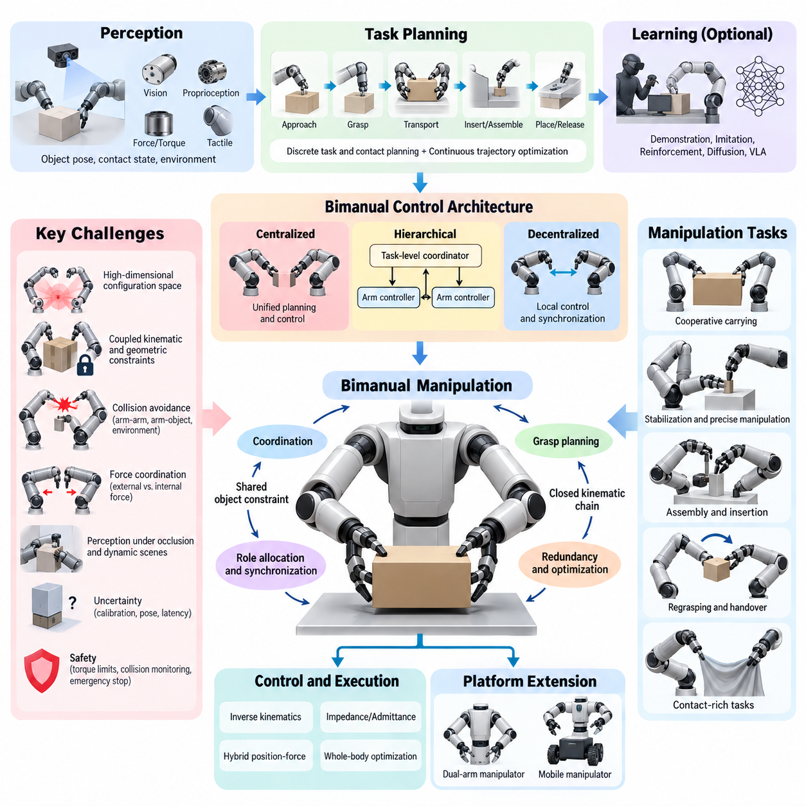
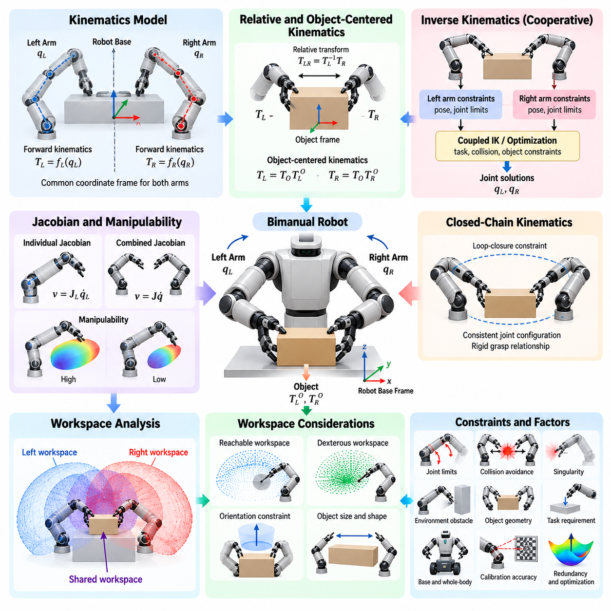
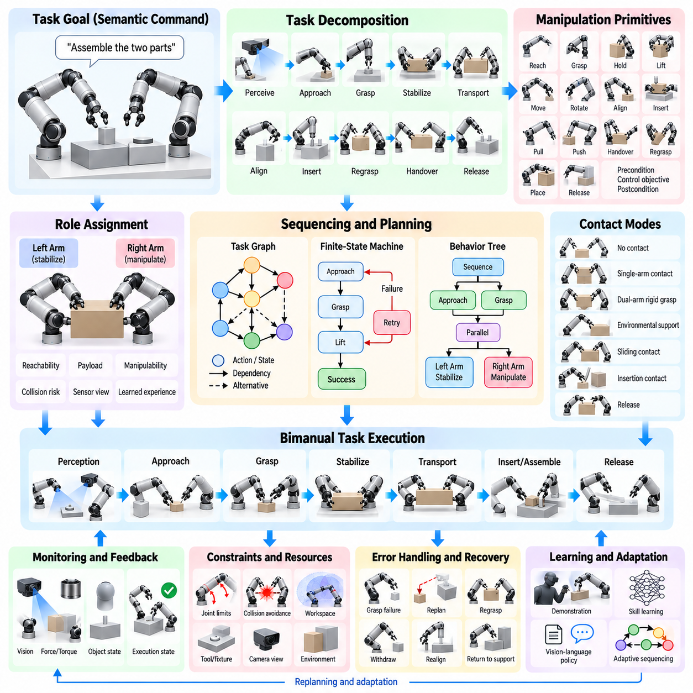
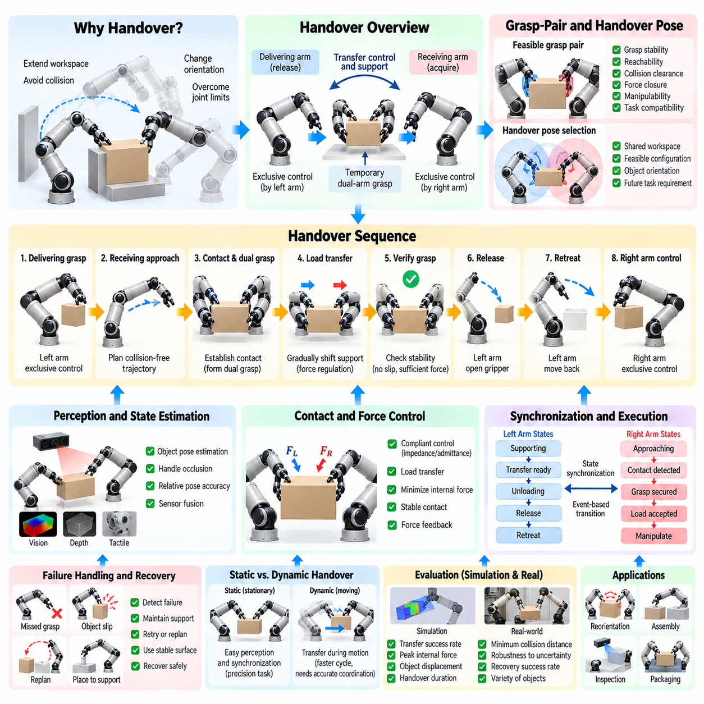
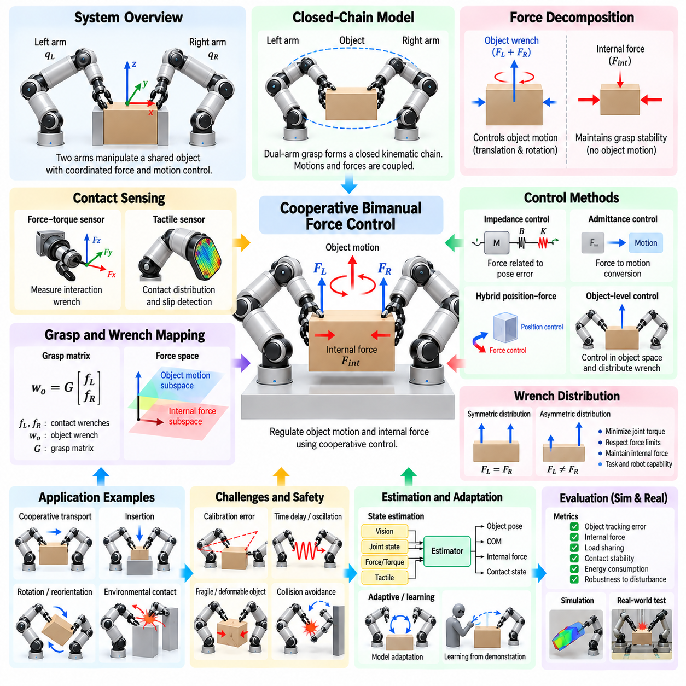
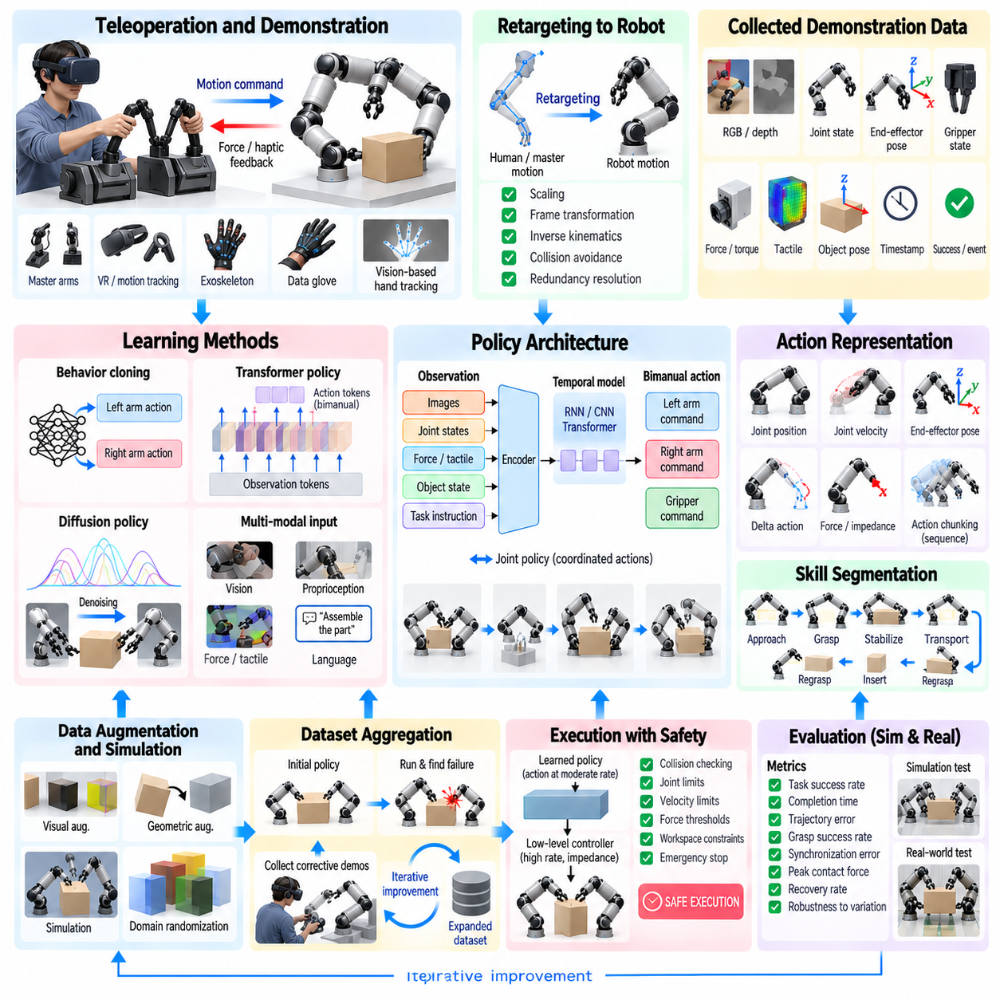
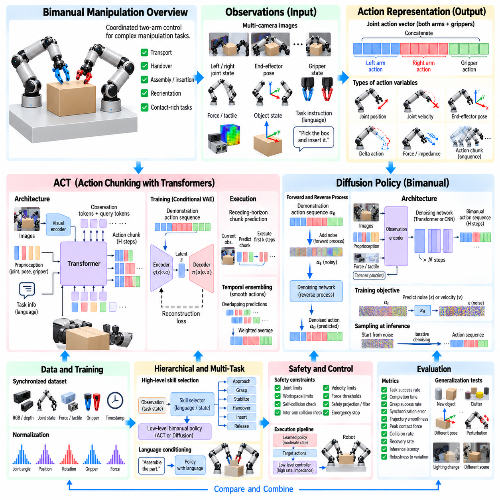
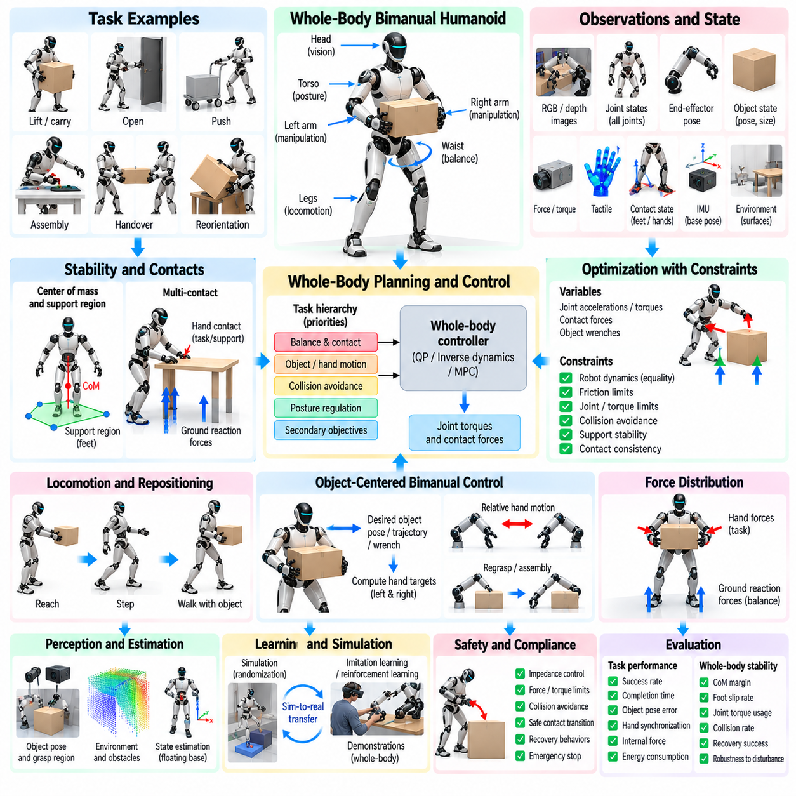
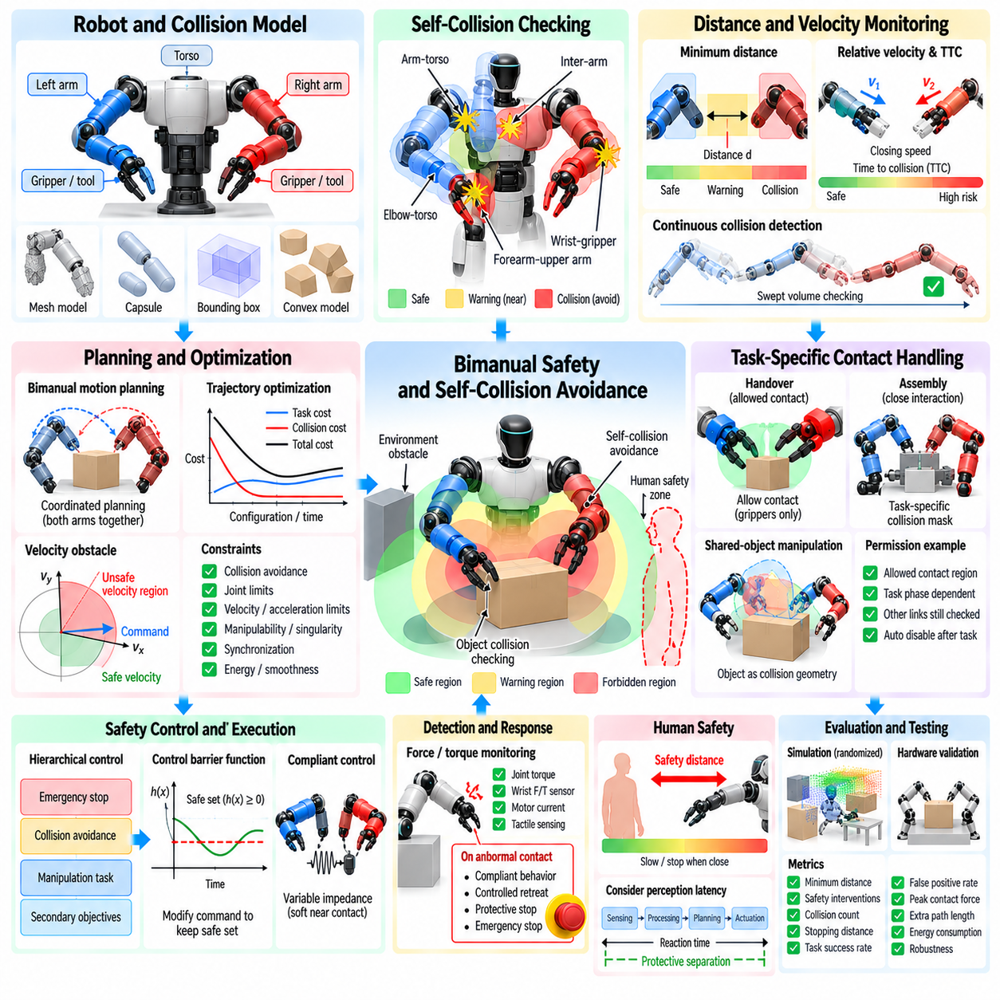
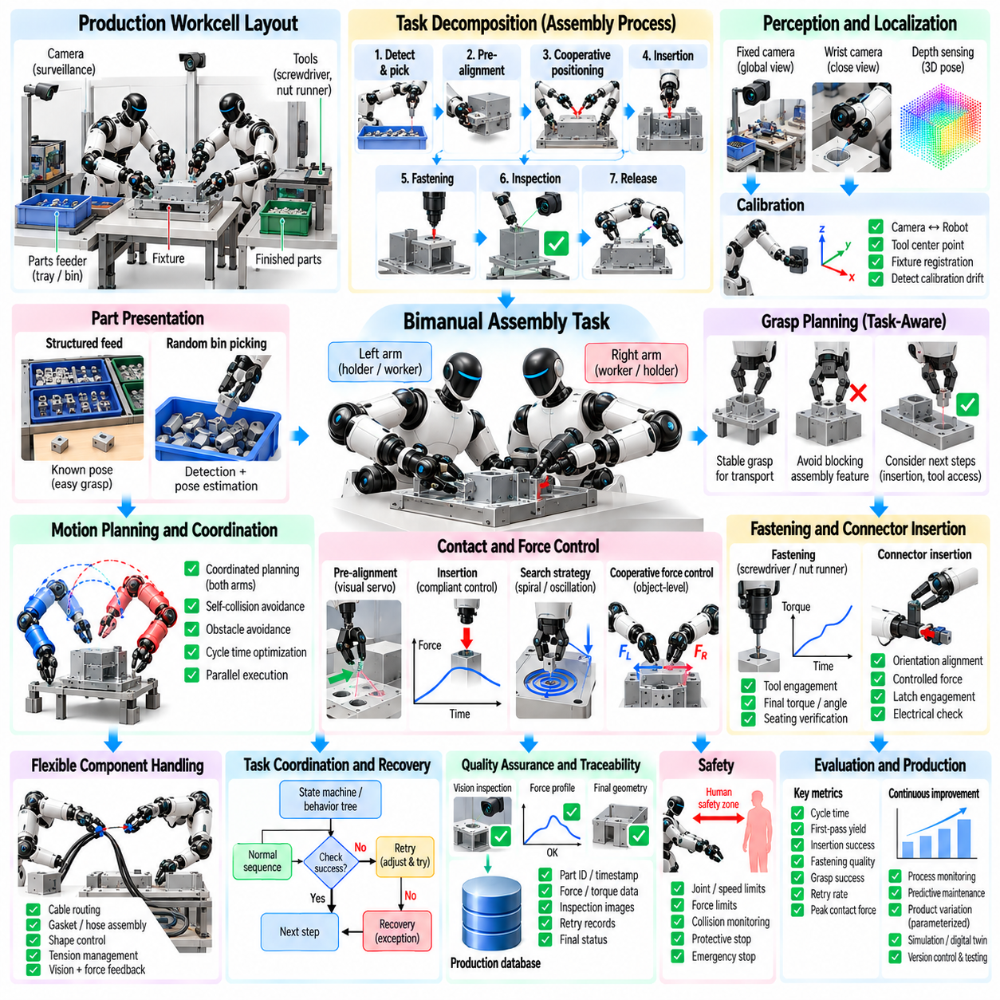

**Volume 17 Manipulation and Grasping AI**

# Chapter 08. Bimanual Manipulation

## 08.01. Bimanual Manipulation Challenges and Architectures

{width="7.268055555555556in" height="7.268055555555556in"}

Bimanual manipulation extends robotic manipulation from controlling a single arm to coordinating two manipulators that interact with the same object, environment, or task. The central difficulty is not simply doubling the number of joints. Two arms create coupled kinematic, dynamic, perceptual, and planning constraints in which the motion of one arm directly changes the feasible actions of the other.

Human manipulation demonstrates why two-handed coordination is powerful. One hand may stabilize an object while the other performs precise motion, or both hands may jointly transport a large object. Humans continuously change these roles according to task context. A robotic system must reproduce similar coordination while respecting joint limits, collision constraints, grasp stability, actuator capabilities, and uncertainty in object pose.

The configuration space of a bimanual robot is significantly larger than that of a single manipulator. Two seven-degree-of-freedom arms already create a fourteen-dimensional joint space before gripper states, object poses, mobile-base motion, or environmental constraints are considered. Planning directly in this space can become computationally expensive because many combinations of arm configurations must be evaluated for feasibility.

Coordination introduces additional geometric constraints. When both grippers rigidly grasp the same object, the relative transformation between the end effectors is constrained by the object geometry and grasp locations. Motion planning therefore cannot treat the arms independently. A trajectory generated for one arm may make the other arm kinematically infeasible, create self-collision, or generate excessive internal forces on the manipulated object.

A fundamental architectural choice is whether the two arms are controlled independently, hierarchically, or through a unified coordinated controller. Independent control is appropriate when the arms perform loosely coupled tasks in separate workspaces. Strongly coupled manipulation, however, usually requires a shared representation of the object, robot configuration, contact state, and task constraints so that both manipulators are planned as one coordinated system.

Centralized architectures represent both arms within a single planning and control problem. A unified planner can simultaneously consider joint limits, inter-arm collision, object constraints, grasp geometry, and task objectives. This approach provides strong coordination and is especially useful for cooperative carrying, assembly, insertion, and manipulation of large objects, although computational complexity increases rapidly with system dimensionality.

Decentralized architectures divide the manipulation problem between arm-specific controllers. Each arm may generate local motion while exchanging desired poses, forces, contact states, or task intentions with the other controller. This structure can improve modularity and computational scalability, but synchronization becomes critical because independently generated actions can conflict when the manipulators interact through a shared object.

Hierarchical architectures combine these approaches by separating task-level coordination from low-level arm control. A high-level coordinator determines manipulation phases, grasp assignments, object trajectories, and arm roles, while individual controllers execute joint-space or Cartesian-space commands. Such decomposition allows sophisticated task reasoning without requiring every control decision to be solved within one monolithic optimization problem.

Leader-follower coordination is one useful architecture for tightly coupled tasks. One manipulator defines the primary object trajectory while the second maintains a specified relative pose or force relationship. This simplifies coordination because the follower derives its motion from the leader and the shared object constraint. However, fixed leader-follower relationships may reduce flexibility when task roles need to change dynamically.

Symmetric cooperative control instead treats both manipulators as equal contributors to object motion. The desired trajectory can be defined directly in object space, after which inverse kinematics or optimization distributes motion across both arms. This formulation is valuable for carrying heavy, fragile, or geometrically constrained objects because object behavior becomes the primary control objective rather than either individual end-effector trajectory.

Bimanual manipulation also requires explicit management of closed kinematic chains. Once both grippers establish rigid contacts with an object, the two arms and object form a closed-loop mechanical system. Small pose inconsistencies between controllers can generate large internal forces. Accurate calibration, compliant control, force sensing, and constraint-aware trajectory generation are therefore essential for safe cooperative manipulation.

Force coordination becomes particularly important during contact-rich tasks. The controller must distinguish forces required to move an object from internal forces generated between the two arms. Excessive internal force can deform an object, cause grasp failure, or overload joints. Hybrid position-force control, impedance control, admittance control, and optimization-based whole-body control provide mechanisms for regulating these interactions.

Perception represents another major challenge because both manipulators continuously modify the visual and geometric scene. Arms may occlude cameras, objects may move between hands, and contact can change object pose in ways that vision alone cannot immediately observe. Effective systems combine visual perception with proprioception, force-torque sensing, tactile sensing, and contact-state estimation to maintain a consistent representation of the manipulation state.

Grasp planning must consider pairs of grasps rather than isolated grasp candidates. A individually stable grasp may be unsuitable if it prevents the second arm from reaching its required contact region. Bimanual grasp selection therefore considers reachability, collision-free approach paths, object stability, manipulation direction, force transmission, and the possibility of subsequent regrasping or handover operations.

Role allocation is another defining aspect of bimanual manipulation. Tasks can employ symmetric roles, such as jointly lifting a container, or asymmetric roles, such as one hand holding a component while the other performs insertion. Roles may also change during execution. A robot assembling a part may begin with cooperative transport, transition to stabilization, and finally assign one arm to precision insertion.

Motion synchronization must operate across multiple temporal scales. Large transport motions may tolerate moderate timing differences, whereas coordinated insertion, handover, cutting, folding, or connector manipulation may require tightly synchronized trajectories. Shared clocks, synchronized control cycles, deterministic communication, and timestamped sensor measurements become increasingly important as interaction speed and contact stiffness increase.

Collision avoidance is more difficult than in single-arm manipulation because each manipulator becomes a dynamic obstacle for the other. The planner must consider arm-arm, arm-object, object-environment, and self-collision simultaneously. Distance constraints, collision geometries, signed-distance fields, sampling-based planning, trajectory optimization, and model-predictive control can be combined to preserve safety while maintaining task efficiency.

Redundancy provides both opportunities and challenges. Dual-arm systems often possess many more degrees of freedom than required to specify an object pose. This redundancy can be exploited to avoid singularities, increase manipulability, maintain camera visibility, reduce joint motion, avoid obstacles, or improve force distribution. Optimization-based controllers can encode these secondary objectives while preserving primary manipulation constraints.

Task planning must also reason about discrete manipulation modes. A complex operation may involve approaching, grasping, lifting, handing over, regrasping, placing, and releasing an object. Each transition changes the kinematic structure and feasible motion space. Bimanual manipulation therefore naturally combines continuous trajectory optimization with discrete task and contact planning, producing a hybrid planning problem.

Learning-based approaches provide an alternative to explicitly engineering every coordination rule. Demonstration learning, imitation learning, reinforcement learning, diffusion policies, transformer-based policies, and vision-language-action models can learn correlations between observations and coordinated dual-arm actions. Such methods are particularly attractive for tasks whose contact dynamics or manipulation strategies are difficult to model analytically.

Learning bimanual behavior remains data intensive because the action space is large and successful coordination depends on precise temporal relationships. Demonstrations must capture not only individual arm trajectories but also relative motion, contact timing, force interactions, and task phases. Data collected from teleoperation, motion capture, simulation, and human demonstrations can provide complementary sources of coordinated manipulation experience.

Modern architectures increasingly combine learning with classical robotics rather than replacing geometric control entirely. A learned policy may select grasps, predict object motion, generate task-level actions, or propose trajectories, while inverse kinematics, collision checking, impedance control, and safety constraints enforce physical feasibility. This hybrid structure can provide greater robustness than purely model-based or purely learned solutions.

Bimanual mobile manipulators introduce an additional coordination layer because the robot base becomes part of the manipulation system. Base motion can extend workspace, improve arm manipulability, and reposition the robot during large-object handling. At the same time, planning must coordinate locomotion, torso motion, two manipulators, perception, and environmental constraints within a unified whole-body framework.

Robust architectures must explicitly address uncertainty. Calibration errors, object-pose uncertainty, actuator backlash, communication latency, grasp variation, and imperfect contact models can accumulate across two manipulators. Feedback control and online state estimation are therefore essential. The system should continuously compare expected and measured states and modify trajectories, forces, or manipulation modes when deviations occur.

Safety becomes particularly important because coordinated arms can generate substantial forces between themselves, the object, and the environment. Joint torque limits, workspace constraints, collision monitoring, force thresholds, emergency stopping, and compliant behavior should operate independently of high-level planning. Safety supervision must remain effective even when perception, communication, or learned policies produce incorrect commands.

A scalable bimanual architecture therefore benefits from layered organization. Perception maintains the scene and contact state, task reasoning determines manipulation phases and arm roles, motion planning generates coordinated object and end-effector trajectories, whole-body optimization resolves redundancy and constraints, and low-level controllers regulate position, velocity, torque, and interaction forces. Feedback connects every layer to execution.

## 08.02. Bimanual Kinematics and Workspace Analysis [w/Code]

{width="7.268055555555556in" height="7.268055555555556in"}

Bimanual kinematics describes the geometric relationships among two manipulators, their common robot base, end effectors, manipulated objects, and surrounding workspace. Unlike single-arm kinematics, the problem must represent not only the pose of each end effector but also their relative pose and their relationship to a shared object. These coupled transformations form the mathematical foundation for coordinated dual-arm motion.

A typical bimanual robot contains two serial kinematic chains attached to a common torso, frame, or mobile platform. Each arm has a joint vector, and forward kinematics maps these joint variables to end-effector poses in a common reference frame. Expressing both manipulators in the same coordinate system is essential because collision checking, cooperative grasping, object transport, and workspace analysis depend on consistent spatial relationships.

For the left and right arms, forward kinematics can be represented as transformations from the robot base to each end effector. The relative transformation between the two end effectors is obtained by combining these transformations through frame inversion and composition. This relative pose becomes particularly important when both grippers hold the same rigid object because their separation and orientation cannot change arbitrarily during manipulation.

Inverse kinematics determines joint configurations that realize desired end-effector poses. In a bimanual system, separate inverse-kinematics solutions may be sufficient when the arms operate independently, but cooperative manipulation requires coupled solutions. The solver must simultaneously satisfy left-arm pose, right-arm pose, joint limits, collision constraints, and relationships imposed by the object or task, often producing a constrained nonlinear optimization problem.

Redundancy is common in bimanual systems. Two seven-degree-of-freedom manipulators provide fourteen arm joints while a rigid object pose contains only six independent spatial degrees of freedom. The remaining freedom can be exploited to improve manipulability, avoid obstacles and singularities, maintain comfortable postures, preserve sensor visibility, minimize energy, or distribute motion more effectively between the two arms.

The Jacobian provides the differential relationship between joint velocities and Cartesian velocities. Each manipulator has an individual Jacobian, while coordinated manipulation can be described using an augmented or combined Jacobian. Such representations allow controllers to reason simultaneously about object motion, relative end-effector motion, and redundant joint motion, providing an important basis for velocity control and whole-body optimization.

When both arms rigidly grasp one object, the robot forms a closed kinematic chain. The object links the two otherwise separate serial chains and introduces loop-closure constraints. Joint configurations must remain consistent with the fixed grasp transformations throughout motion. Even small inconsistencies can produce geometric incompatibility or large interaction forces, making accurate modeling and constraint enforcement essential.

Object-centered kinematics provides a useful representation for cooperative manipulation. Instead of commanding both end effectors independently, a desired object pose or trajectory is defined first. Fixed transformations from the object frame to the two grasp frames then determine corresponding end-effector targets. This reduces coordination ambiguity and naturally preserves the geometric relationship required for rigid dual-arm grasping.

Relative and absolute motion can also be separated mathematically. Absolute motion describes the collective movement of the two arms or the grasped object through space, while relative motion describes changes in the relationship between the end effectors. Cooperative transport typically emphasizes absolute motion while maintaining nearly constant relative geometry, whereas regrasping, stretching, folding, or opening tasks intentionally modify relative configurations.

Workspace analysis determines where a manipulator can reach and what orientations it can achieve at those locations. For bimanual robots, the individual workspace of each arm is only the starting point. The most important region for cooperative manipulation is the shared or overlapping workspace where both end effectors can simultaneously reach task-relevant poses while satisfying joint, collision, and orientation constraints.

The geometric intersection of the two arm workspaces does not automatically represent a useful bimanual workspace. A point may be reachable by both arms individually yet impossible to use simultaneously because the arms collide, required orientations are unavailable, or joint configurations are near singularities. Practical workspace analysis therefore evaluates configuration feasibility rather than relying only on Cartesian reach envelopes.

The cooperative workspace can be defined according to task-specific constraints. Carrying a large box requires pairs of reachable grasp poses separated by the object width, while assembly may require one arm to stabilize a component and the other to approach from a particular direction. Consequently, workspace quality depends on object geometry, grasp placement, tool orientation, environmental obstacles, and the intended manipulation mode.

Reachable workspace and dexterous workspace should be distinguished. The reachable workspace contains positions attainable with at least one valid orientation, whereas the dexterous workspace contains regions where a broader range of orientations can be achieved. For bimanual tasks, a shared dexterous workspace is especially valuable because coordinated assembly and reorientation frequently require substantial rotational freedom at both end effectors.

Manipulability provides a quantitative measure of how effectively joint motion can generate Cartesian motion around a configuration. Jacobian-based manipulability indices can identify configurations with strong directional capability and configurations approaching singularity. In bimanual systems, manipulability may be evaluated separately for each arm or jointly according to the motion directions required by the shared object and task.

Singularities require careful consideration because loss of mobility in either arm can compromise the entire cooperative system. A configuration that is acceptable for one manipulator may force the other near a singular posture. Coordinated planning should therefore maintain suitable singularity margins for both arms, particularly during long trajectories where object constraints restrict the ability to independently reposition either manipulator.

Joint limits further reduce the theoretical workspace. Although an end-effector pose may have a mathematical inverse-kinematics solution, the corresponding joints may approach mechanical boundaries that limit subsequent motion. Joint-limit-aware optimization introduces secondary objectives or inequality constraints that keep configurations away from problematic boundaries and preserve future maneuverability during extended bimanual operations.

Self-collision and inter-arm collision constraints reshape the usable workspace substantially. The torso, shoulders, elbows, wrists, grippers, and manipulated object can all interfere with one another. Collision-aware workspace computation excludes configurations that violate minimum separation distances, producing a more realistic representation of where coordinated manipulation can safely occur rather than merely where each arm can geometrically reach.

Object dimensions strongly influence feasible workspace. A small object allows the grippers to operate close together, while a large object may require widely separated arm configurations. Long or irregular objects can also collide with the robot body or environment during rotation. Workspace analysis should therefore include the manipulated object as part of the kinematic system rather than treating it as an independent point target.

Orientation constraints can be as important as position constraints. During tray carrying, both grippers may need to preserve a horizontal orientation, whereas connector insertion requires a precise approach axis. Welding, polishing, and tool use impose other directional requirements. Task-oriented workspace maps can encode these orientation conditions and provide more meaningful feasibility estimates than unrestricted reach calculations.

Sampling-based workspace analysis is practical for high-dimensional bimanual systems. Large numbers of joint configurations can be generated within allowable limits, transformed through forward kinematics, and evaluated for collision, manipulability, orientation, and grasp compatibility. The resulting samples can approximate reachable and cooperative regions and reveal areas where feasible configurations are dense, sparse, or absent.

Optimization-based methods provide a complementary approach. Instead of sampling the entire configuration space, an optimizer searches for joint configurations satisfying specified task poses and constraints. Multiple initial conditions can expose alternative inverse-kinematics branches. Feasibility rates, optimization costs, singularity margins, and collision distances can then be used to characterize workspace quality for particular manipulation requirements.

Workspace analysis also guides mechanical design. Shoulder spacing, torso dimensions, arm length, joint range, wrist architecture, and mounting angles directly influence the size and quality of the shared workspace. Simulation can compare candidate geometries before hardware construction, allowing designers to maximize useful overlap while avoiding excessive arm interference and preserving sufficient reach for independent manipulation.

For mobile bimanual manipulators, workspace analysis extends beyond fixed-base reachability. Base translation and rotation can reposition both arms relative to the task, creating a much larger effective workspace. The challenge becomes selecting base poses that provide favorable reachability and manipulability for both arms while maintaining navigation clearance, stability, visibility, and environmental accessibility.

Whole-body kinematics can incorporate the mobile base, torso, waist, head, and both manipulators into one generalized configuration vector. Task constraints are then expressed through multiple Jacobians and optimization objectives. This formulation allows the system to distribute motion across the entire robot, such as moving the base slightly instead of forcing an arm toward a joint limit or singular configuration.

Calibration accuracy directly affects bimanual kinematic performance. Errors in shoulder placement, joint offsets, tool-center points, camera extrinsics, or grasp transforms can produce disagreement between predicted and actual relative poses. These errors become especially significant in closed-chain manipulation because two independently small pose errors can generate substantial mechanical stress when both arms rigidly constrain the same object.

Kinematic analysis should therefore be validated using both simulation and physical measurements. Forward-kinematics accuracy, inverse-kinematics convergence, relative-pose error, manipulability, collision margins, and shared-workspace coverage can be evaluated across representative configurations. Physical validation with calibrated targets and synchronized measurements confirms whether the mathematical model accurately represents the real dual-arm system.

## 08.03. Bimanual Task Decomposition and Sequencing [w/Code]

{width="7.268055555555556in" height="7.268055555555556in"}

Bimanual task decomposition converts a complex two-handed manipulation objective into smaller actions that can be planned, coordinated, monitored, and recovered individually. Rather than treating the complete operation as one continuous trajectory, the robot identifies meaningful phases such as perception, approach, grasp, stabilization, transport, insertion, regrasping, handover, and release. This structure reduces planning complexity and exposes dependencies between the two arms.

The decomposition process begins with a task-level description of the desired outcome. A command such as assembling two components, opening a container, folding material, or carrying a large object does not directly specify robot motion. The system must transform this semantic goal into manipulation primitives with explicit object states, contact relationships, arm roles, geometric constraints, and completion conditions that can be executed by the physical platform.

Manipulation primitives provide reusable building blocks for this transformation. Typical primitives include reach, grasp, hold, lift, move, rotate, align, insert, pull, push, handover, regrasp, place, and release. Each primitive defines preconditions that must be satisfied before execution, control objectives during execution, and postconditions describing the expected resulting state. Complex bimanual behaviors can then be composed from sequences of these primitives.

Task decomposition must represent interactions between the two manipulators rather than generating two independent action lists. In an asymmetric task, one arm may stabilize an object while the other manipulates it. In a symmetric task, both arms may simultaneously transport or rotate the same object. The planner therefore identifies synchronization points where actions must start, finish, or transition together and periods where independent parallel execution is permitted.

Role assignment determines which manipulator performs each primitive. The left and right arms may have different reachability, payload capability, tool configuration, sensor visibility, or proximity to relevant objects. Role selection can therefore be based on geometric feasibility, manipulability, expected execution cost, collision risk, task convention, or learned experience rather than simply assigning actions according to fixed left-right rules.

Roles may remain fixed during simple operations but often change during complex tasks. One arm may initially grasp an object while the second clears an obstacle, after which both arms cooperatively lift it. Later, one arm may become a stabilizer while the other performs insertion. Representing role transitions explicitly allows the planner to exploit the complementary capabilities of both manipulators throughout different phases of the operation.

Sequencing defines the temporal and logical order in which manipulation primitives are executed. Some actions have strict precedence constraints: an object must be grasped before it can be lifted, and components must be aligned before insertion. Other actions can occur concurrently, such as one arm reaching toward a fixture while the other acquires a component. Efficient sequencing therefore combines serial dependencies with safe parallel execution.

A task graph provides a useful representation of these relationships. Nodes can represent manipulation states, actions, or subgoals, while edges encode valid transitions and dependencies. Directed acyclic graphs are useful when the operation has a largely predetermined progression, whereas richer state-transition graphs are appropriate when retries, alternative strategies, and recovery paths must be represented. Graph structures also make task logic easier to inspect and validate.

Finite-state machines provide a practical execution architecture for structured bimanual tasks. Each state represents a manipulation phase, and transitions occur when specified conditions are satisfied. For example, the system may progress from approach to grasp only after pose error falls below a threshold, and from grasp to lift only after contact and gripping force are verified. Failure conditions can redirect execution toward retry or recovery states.

Behavior trees offer greater flexibility for tasks containing alternatives, parallel actions, and reusable behaviors. Sequence nodes enforce ordered execution, selector nodes choose among alternative strategies, and parallel nodes coordinate simultaneous actions. Individual manipulation skills can be implemented as reusable leaves. This organization is particularly useful when a bimanual robot must adapt its action sequence according to changing perception or execution outcomes.

Planning formalisms such as Planning Domain Definition Language, symbolic planning, and task-and-motion planning can generate sequences from explicit action models. Symbolic reasoning determines which manipulation operations should occur, while geometric motion planning verifies whether those operations are physically feasible. The combination prevents a high-level planner from producing logically correct but kinematically impossible bimanual action sequences.

Task-and-motion planning is especially important because discrete manipulation decisions and continuous robot configurations are strongly coupled. Selecting which arm should grasp an object affects reachability, collision constraints, and future actions. Similarly, choosing a grasp determines whether subsequent transport or insertion is possible. Effective planners therefore exchange information between symbolic task reasoning and geometric feasibility evaluation rather than solving them independently.

Contact modes provide another important dimension of task decomposition. A manipulation sequence may transition from no contact to single-arm contact, dual-arm rigid grasp, environmental support, sliding contact, insertion contact, and release. Each mode changes the system\'s kinematic and dynamic constraints. Explicit contact-mode planning allows the controller and motion planner to apply the correct models and constraints during each phase.

Object state is often more useful than robot joint state for describing task progress. An assembly task can be represented through semantic conditions such as component acquired, component aligned, insertion started, insertion completed, and fixture released. Robot configurations remain important for execution, but object-centered state representations allow the same task structure to be reused across different robot geometries, initial poses, and motion-planning solutions.

Preconditions and postconditions create clear interfaces between manipulation skills. A grasp primitive may require that the object pose is known, the target grasp is reachable, and the gripper is open. Its postconditions may require verified contact and sufficient grasp force. These conditions allow the execution manager to determine whether a primitive can begin and whether it completed successfully instead of relying only on elapsed time.

Synchronization is essential when two primitives interact through a shared object. During cooperative lifting, both arms should establish stable grasps before vertical motion begins. During insertion, a stabilizing arm may need to maintain a fixture pose while the active arm follows a constrained trajectory. Synchronization barriers, shared events, timestamps, and coordinated state transitions provide mechanisms for enforcing these temporal relationships.

Not every bimanual action requires strict synchronization. Parallelism can reduce task completion time when the arms interact with independent objects or spatially separated regions. One arm can retrieve a component while the other prepares a fixture, provided their trajectories and workspaces remain compatible. Scheduling algorithms can exploit such independence while introducing synchronization only when physical or logical dependencies require it.

Resource conflicts must also be considered during sequencing. Both arms may require access to the same workspace, camera view, fixture, tool, or object. Executing individually feasible actions simultaneously may therefore cause collision, occlusion, or manipulation interference. Resource-aware scheduling represents these shared resources explicitly and prevents incompatible primitives from occupying them at the same time.

Regrasping introduces additional sequence complexity because an initially convenient grasp may not support the entire task. The robot may place an object temporarily, transfer it between hands, or establish a second grasp before releasing the first. Regrasp planning searches for intermediate states that preserve object stability while changing contact configuration, enabling the robot to overcome workspace, orientation, or joint-limit restrictions.

Handover is a specialized coordinated transition in which responsibility for an object moves from one manipulator to the other. The receiving arm must reach a compatible grasp before the delivering arm releases its contact. Successful sequencing therefore includes approach, synchronization, dual-contact verification, load transfer, release, and retreat. Force or tactile sensing can verify that object support has transferred safely before the sequence continues.

Error detection must be integrated into the task sequence rather than treated as an external exception. Perception may reveal that an object moved unexpectedly, grasp verification may fail, or insertion forces may exceed limits. Each primitive should expose measurable success and failure criteria so that execution can stop before an error propagates into subsequent actions. This is especially important in tightly coupled bimanual manipulation.

Recovery behaviors provide alternative transitions when normal execution fails. A failed grasp may trigger perception update and regrasping, excessive insertion force may cause withdrawal and realignment, and loss of cooperative contact may return the object to a stable support surface. Designing recovery paths together with nominal sequences produces more robust behavior than attempting to improvise recovery only after a failure occurs.

Online replanning allows the sequence to adapt when assumptions change during execution. Updated object poses, newly detected obstacles, unavailable grasps, or changing human activity may invalidate the original plan. The robot can preserve completed subgoals while regenerating only the affected future actions. This reduces unnecessary repetition and supports operation in dynamic environments where complete offline sequencing is insufficient.

Learning can complement explicit task decomposition by discovering useful primitives, predicting action success, selecting arm roles, or ranking alternative sequences. Demonstrations provide examples of how humans divide complex two-handed activities into coordinated phases. Learned models can capture contextual preferences that are difficult to encode manually, while symbolic constraints and geometric planners can continue to enforce safety and physical feasibility.

Vision-language-action models and foundation policies can provide semantic interpretation and high-level skill proposals, but reliable bimanual execution still benefits from structured sequencing. A learned model may suggest that one arm hold a container while the other removes a lid, while the execution architecture converts this proposal into verified grasp, stabilization, rotation, release, and recovery states with explicit geometric and force constraints.

A hierarchical architecture is therefore well suited to bimanual task execution. At the highest level, task reasoning interprets goals and generates subgoals. A sequencing layer assigns roles, manages dependencies, and selects manipulation skills. Motion planners generate collision-free trajectories, while low-level controllers execute position, force, impedance, or torque commands. Perception and state estimation continuously provide feedback across these layers.

Performance can be evaluated using more than final task success. Useful measures include sequence duration, number of primitive transitions, parallel execution ratio, replanning frequency, recovery success, synchronization error, collision margin, and unnecessary arm motion. Such metrics reveal whether decomposition produces not only successful but also efficient, predictable, and robust dual-arm behavior.

Ultimately, bimanual task decomposition and sequencing provide the organizational logic that connects semantic goals with coordinated physical execution. By representing manipulation through reusable primitives, arm roles, dependencies, contact modes, synchronization events, success conditions, and recovery transitions, a robot can transform complex two-handed activities into manageable operations while retaining the flexibility required for adaptive and general-purpose manipulation.

## 08.04. Object Handover Between Two Arms [w/Code]

{width="7.268055555555556in" height="7.268055555555556in"}

Object handover between two robot arms is a coordinated manipulation process in which control and physical support of an object are transferred from a delivering manipulator to a receiving manipulator. Although the action appears simple, reliable handover requires synchronized perception, grasp planning, motion generation, contact verification, force regulation, and release timing so that object stability is preserved throughout the transfer.

Handover is useful when a single arm cannot complete an entire manipulation task because of workspace, orientation, collision, or joint-limit constraints. An object can be acquired in one region, transferred between manipulators, and then repositioned for subsequent assembly, inspection, insertion, packaging, or placement. Handover therefore extends effective workspace and enables configurations that cannot be achieved conveniently with one continuous grasp.

The handover process can be represented as a sequence of object-centered contact states. Initially, the delivering arm has exclusive control of the object. The receiving arm then approaches a feasible secondary grasp, establishes contact, and creates a temporary dual-arm grasp. Load is transferred toward the receiving arm, after which the delivering gripper releases and retreats, leaving the receiving arm with exclusive control.

A suitable handover pose must satisfy the requirements of both manipulators simultaneously. The object should be positioned within their shared workspace while maintaining feasible joint configurations, sufficient manipulability, collision clearance, and accessible grasp surfaces. Selecting the transfer location only from geometric proximity can produce awkward postures or restrict subsequent motion, so future task requirements should also influence handover-pose selection.

Object orientation at the transfer pose is equally important. The receiving arm may need a particular grasp orientation to perform the next operation, while the delivering arm must remain capable of supporting the object during transfer. Planning the handover in object space allows the system to optimize object position and orientation together rather than considering only the relative locations of the two grippers.

Grasp-pair selection determines how the two manipulators can temporarily share the object. The delivering grasp must leave sufficient surface area for the receiving gripper, and the two grippers must avoid collision with each other. Candidate grasp pairs can be evaluated using grasp stability, reachability, force closure, approach direction, manipulability, collision margin, and compatibility with the desired post-handover task.

The receiving approach trajectory requires careful collision planning because it intentionally moves one gripper close to another gripper and the held object. Standard collision avoidance must distinguish prohibited collisions from intended contact. The planner should preserve clearance between robot links while allowing the receiving fingers to enter the target grasp region and establish controlled contact with the object.

Accurate perception is necessary to estimate the actual object pose during handover. The object may differ from its expected position because of calibration errors, grasp offsets, compliance, or motion of the delivering arm. Vision can provide global pose information, while proprioception, force-torque sensing, and tactile sensing provide local information about contact and relative alignment near the transfer point.

Occlusion becomes particularly challenging as two manipulators surround the same object. Cameras may lose visibility of grasp surfaces or object features during the final approach. Multi-view perception, wrist-mounted cameras, depth sensing, tactile feedback, and model-based state estimation can maintain object-state estimates even when external vision becomes temporarily unreliable. Sensor fusion therefore improves robustness during close-range coordination.

Relative pose accuracy between the two end effectors is more important than absolute world-frame accuracy in many handover operations. Even if the object has a small global localization error, transfer may succeed when the receiving gripper can accurately determine its pose relative to the delivering gripper and object. Shared coordinate frames and precise extrinsic calibration are therefore essential for repeatable handover.

The transition into dual-arm contact creates a temporary closed kinematic chain. Once both grippers constrain the object, independent pose errors can generate internal forces. The controllers should therefore avoid rigidly commanding inconsistent Cartesian poses. Compliant strategies such as impedance or admittance control allow small relative deviations while maintaining sufficient contact forces to stabilize the object.

Force regulation becomes central during load transfer. Before the receiving arm makes contact, the delivering arm supports essentially the entire object load. After contact is established, support should gradually shift between manipulators rather than changing instantaneously. Force-torque measurements can estimate how the load is distributed and provide feedback for smoothly increasing receiving-arm support while reducing delivering-arm support.

Internal forces should be controlled independently from forces associated with object motion whenever possible. Excessive opposing forces between the grippers can deform fragile objects, cause slipping, or overload the manipulators. Cooperative control can regulate the object\'s desired motion while minimizing unnecessary internal forces, maintaining only the amount needed for stable contact during the dual-grasp phase.

Contact verification prevents premature release. Closing the receiving gripper does not guarantee that a secure grasp has been established. Verification may use finger position, motor current, tactile pressure, force-torque measurements, slip detection, or small probing motions. The delivering arm should retain support until the system confirms that the receiving grasp satisfies predefined stability conditions.

A load-transfer test provides stronger evidence than contact detection alone. The delivering arm can slightly reduce its support while the receiving arm compensates for the object weight. If measured motion, force, or slip remains within acceptable limits, the system gains confidence that the receiving grasp can safely carry the object. Otherwise, the original support can be restored without dropping the object.

Release timing is a critical event in the handover sequence. The delivering gripper should open only after the receiving grasp and load support have been verified. Release may be gradual for objects sensitive to disturbance, allowing the controller to observe changes in force distribution as contact disappears. Event-based release is generally more robust than relying on a predetermined time delay.

After release, the delivering arm must retreat without colliding with the object, receiving gripper, or surrounding environment. The retreat direction should be considered during grasp and handover planning rather than generated as an afterthought. A grasp pair that allows acquisition but traps the delivering fingers after transfer is unsuitable even if the temporary dual grasp is stable.

Handover can be performed statically or dynamically. Static handover brings the object to a nearly stationary transfer pose before the receiving arm establishes contact. This simplifies perception and synchronization and is appropriate for precision manipulation. Dynamic handover transfers the object while it is moving, potentially reducing cycle time but requiring more accurate trajectory prediction, synchronization, and compliant control.

Dynamic handover requires the receiving arm to match the object\'s position, orientation, linear velocity, and potentially angular velocity at the transfer moment. Trajectory coordination can create a moving rendezvous in which both manipulators share compatible motion for a short interval. Velocity mismatch at contact should be minimized because sudden relative motion can generate impact forces or destabilize the grasp.

Synchronization can be implemented using shared task states rather than only synchronized clocks. The receiving arm can report states such as approaching, contact detected, grasp secured, and load accepted, while the delivering arm reports supporting, transfer ready, unloading, and released. Explicit state exchange makes the protocol easier to monitor and provides clear conditions for transitions, timeout handling, and recovery.

Finite-state machines and behavior trees are well suited to handover control. States can represent transfer-pose acquisition, receiving approach, contact establishment, grasp verification, dual-arm support, load transfer, delivering release, and retreat. Failure transitions can return the system to a previous safe state, request perception updates, or place the object on a stable support surface when direct recovery is not possible.

Failures may occur because the receiving arm misses the target grasp, the object shifts during contact, insufficient gripping force is detected, or collision risk becomes excessive. Robust systems avoid committing irreversibly to the next state until critical conditions have been verified. Maintaining the delivering grasp during early failures provides a valuable recovery advantage because the object remains under controlled support.

Regrasping can be integrated with handover when the purpose is not simply to exchange ownership but to change object orientation or grasp configuration. The receiving arm can acquire the object at a new contact region, rotate or reposition it, and potentially return it to the original arm with a more favorable grasp. Repeated handovers can therefore function as an in-hand reorientation mechanism at the bimanual system level.

Handover planning should consider downstream manipulation. A receiving grasp that is stable but blocks an assembly feature or forces the arm toward a joint limit may create problems immediately after transfer. Task-aware planning evaluates candidate handovers according to both transfer success and the feasibility of future operations, reducing the need for unnecessary additional regrasping.

Learning-based methods can improve handover by predicting successful grasp pairs, transfer poses, approach trajectories, and release conditions from demonstrations or previous experience. Reinforcement learning and imitation learning can capture compliant coordination strategies that are difficult to encode analytically. Learned components can be combined with geometric planners and force-based safety constraints to preserve physical reliability.

Simulation provides a useful environment for evaluating handover strategies before deployment. Variations in object mass, friction, pose error, grasp offset, sensor noise, communication latency, and controller gains can be introduced systematically. Successful transfer rate, peak internal force, object displacement, handover duration, minimum collision distance, and recovery success can then quantify robustness.

Physical validation should progressively increase difficulty from rigid objects and static transfer poses to uncertain poses, fragile objects, asymmetric mass distributions, dynamic transfers, and cluttered environments. High-speed logging of joint states, end-effector poses, gripper states, force-torque measurements, tactile signals, and task transitions helps identify whether failures originate from perception, planning, synchronization, or control.

Ultimately, object handover is a controlled transition of contact authority rather than a simple open-and-close sequence. Reliable transfer requires the two manipulators to share object state, coordinate their trajectories, temporarily support the object together, verify the receiving grasp, regulate load distribution, and release only when physical evidence confirms stability. These principles make handover a fundamental capability for flexible bimanual manipulation.

## 08.05. Cooperative Bimanual Force Control [w/Code]

{width="7.268055555555556in" height="7.268055555555556in"}

Cooperative bimanual force control enables two robotic manipulators to interact with a shared object while regulating both its motion and the forces transmitted through their contacts. Unlike independent arm control, the manipulators are mechanically coupled through the object, so an action by one arm immediately influences the other. Stable coordination therefore requires explicit treatment of object dynamics, contact forces, internal forces, compliance, and synchronization.

When both grippers rigidly grasp the same object, the arms and object form a closed mechanical chain. The desired motion must satisfy geometric constraints imposed by both grasp locations, while commanded forces must remain mutually compatible. Small pose errors, calibration offsets, or controller mismatches can create unexpectedly large interaction forces because neither arm can move independently without affecting the shared object.

A useful force-control formulation separates forces that produce object motion from internal forces that act between the two contacts without contributing to the object\'s net acceleration. Object-level forces and moments determine translation and rotation, whereas internal forces maintain grasp stability. Cooperative control should generate sufficient internal force to prevent slip while avoiding unnecessary compression, tension, or torsion.

The grasp matrix provides a mathematical relationship between contact wrenches and the resultant wrench applied to the object. Forces and moments measured or commanded at the two end effectors can be mapped into an object-centered representation. This allows the controller to determine which combinations contribute to desired object motion and which lie in the internal-force subspace and therefore do not alter the object\'s overall motion.

Internal-force regulation is especially important for fragile, compliant, or deformable objects. Excessive opposing force can crush packaging, bend components, or deform sheets, while insufficient force may allow slipping or loss of contact. Desired internal force should therefore depend on object mass, friction, grasp geometry, acceleration, material properties, and the expected disturbances encountered during manipulation.

Force closure provides a useful criterion for evaluating whether the available contacts can resist disturbances in required directions. A cooperative grasp should generate admissible contact forces while respecting friction constraints and actuator limits. Force-control planning can combine grasp geometry with friction-cone models to determine whether commanded object wrenches can be produced without violating contact stability.

Force-torque sensors mounted near the wrists provide direct measurements of interaction wrenches at the end effectors. These measurements contain contributions from object weight, inertial forces, contact reactions, and internal forces. Gravity compensation, sensor bias estimation, tool calibration, and dynamic compensation are required before measurements can be interpreted accurately for cooperative control.

Tactile sensing can complement wrist force-torque measurements by providing distributed information about local pressure, contact location, and slip. Two grasps with similar net wrench measurements may have very different local contact conditions. Tactile arrays can detect uneven loading or incipient slip and allow the controller to adjust gripping force before global object stability is compromised.

Pure position control is risky during rigid dual-arm grasping because small geometric inconsistencies can create high forces. If both manipulators attempt to track independently specified Cartesian trajectories with high stiffness, calibration and tracking errors may cause them to fight each other. Cooperative manipulation therefore commonly introduces compliance so that small relative deviations can be absorbed without generating excessive interaction forces.

Impedance control defines a desired dynamic relationship between pose error and interaction force. Each manipulator can behave like a virtual mass-spring-damper system rather than an infinitely stiff position source. Properly selected stiffness and damping allow the arms to follow the desired object trajectory while accommodating small geometric errors and external disturbances during cooperative manipulation.

Admittance control provides the complementary relationship by converting measured interaction forces into commanded motion. It is useful when the underlying robot controller accepts position or velocity commands but force-responsive behavior is required. In a bimanual system, measured contact forces can generate corrective motions that reduce excessive internal loading or allow the object to comply with environmental contact.

Hybrid position-force control separates directions that should be controlled primarily in motion from directions that should be regulated in force. During cooperative insertion, for example, the object may follow a commanded motion along the insertion axis while lateral forces are limited to support alignment. Selecting appropriate motion and force subspaces enables accurate task execution without excessive contact stress.

Object-level impedance control treats the shared object as the primary controlled body. A desired object trajectory and impedance are defined, and the required resultant wrench is distributed between the two manipulators. This approach naturally coordinates the arms because their commands originate from a common object objective rather than independently specified end-effector trajectories.

Wrench distribution determines how the required object force and moment are shared between the manipulators. Equal distribution may be suitable for symmetric grasps, but many tasks require asymmetric allocation because of different arm configurations, actuator capabilities, grasp quality, or contact geometry. Optimization can distribute loads while minimizing joint torques, avoiding saturation, and preserving desired internal forces.

Redundant force distribution creates opportunities for optimization because multiple contact-wrench combinations can produce the same resultant object wrench. Secondary objectives can minimize energy, balance actuator effort, maximize friction margin, reduce structural loading, or keep one arm lightly loaded for a subsequent action. Constraints can simultaneously enforce contact stability and force limits.

Gravity compensation is essential during cooperative transport. The combined manipulators must support the object\'s weight while generating additional forces for acceleration and disturbance rejection. If the estimated mass or center of mass is inaccurate, the arms may experience biased loads and unintended internal forces. Online estimation can improve compensation when object properties are uncertain.

Object inertia becomes increasingly important during fast motion. Translational and rotational acceleration generate dynamic loads that must be distributed through both contacts. A controller designed only for static force balance may perform poorly during rapid transport or rotation. Dynamic models can predict inertial wrenches and provide feedforward compensation while feedback corrects modeling errors.

The center of mass strongly affects load sharing. When the center of mass lies closer to one grasp, that manipulator may naturally support a larger portion of the weight or torque. Assuming symmetric load distribution in such cases can create unnecessary internal forces. Estimating the center of mass from geometry, prior models, or measured force responses allows more physically appropriate wrench allocation.

Contact with the environment introduces another layer of force coordination. During assembly, polishing, cutting, or surface following, forces arise not only between the two manipulators and object but also between the object and environment. The controller must regulate environmental interaction while maintaining stable dual-arm grasping, effectively coordinating several simultaneous contact constraints.

Cooperative insertion illustrates this challenge clearly. Both arms may hold a large component while guiding it into a fixture. The object trajectory must remain coordinated, insertion forces should remain below safe limits, and lateral contact forces can be used as alignment information. Compliance allows small corrective motion while preventing jamming caused by excessive positional stiffness.

Force control must also account for communication and control latency. If one manipulator responds to a disturbance significantly later than the other, the temporary mismatch can generate internal force oscillations. Synchronized control cycles, timestamped sensor data, deterministic communication, and consistent state estimation help both arms respond coherently to rapidly changing interaction forces.

Controller bandwidth should be selected according to robot mechanics, sensor bandwidth, communication delays, and contact stiffness. Excessively aggressive force feedback can amplify noise or excite structural resonances, while very low bandwidth produces slow disturbance rejection. Filtering and damping should reduce undesirable oscillations without introducing enough delay to destabilize contact interaction.

Passivity and stability analysis provide important tools for designing safe cooperative controllers. Two actively controlled manipulators coupled through a stiff object can exchange energy in ways that are not apparent when each arm is analyzed separately. Energy-aware control, passivity observers, damping injection, and conservative impedance settings can help prevent unstable oscillations during uncertain contact.

Safety limits should exist independently of nominal force-control objectives. Maximum contact force, joint torque, internal force, object wrench, and rate-of-force-change thresholds can trigger reduced motion, compliance increase, controlled release, or emergency stop. Such supervision is particularly important when object properties, grasp quality, or environmental contact conditions are not fully known.

State estimation combines joint measurements, force-torque sensing, tactile signals, object pose, and dynamic models to infer quantities that cannot be measured directly. Internal force, object acceleration, center-of-mass location, contact state, and slip probability can all be estimated online. Reliable estimates allow force-control policies to adapt rather than relying on fixed assumptions.

Adaptive control can modify impedance, force references, or wrench distribution as object and contact properties become known during execution. A robot may initially use conservative low-force behavior, estimate stiffness or friction from measured responses, and then adjust its control parameters. This is valuable when manipulating unfamiliar objects whose mechanical characteristics are unavailable beforehand.

Learning-based approaches can further improve cooperative force control by learning contact models, impedance parameters, load-sharing policies, or corrective actions from demonstrations and interaction data. Reinforcement learning can optimize behavior under complex contact dynamics, while imitation learning can reproduce skilled cooperative manipulation. Safety constraints remain important when learned policies command physical interaction forces.

Simulation enables systematic testing of force controllers under variations in object mass, friction, stiffness, center of mass, grasp pose, sensor noise, delay, and calibration error. Evaluation can measure object tracking error, peak internal force, load-sharing error, contact stability, energy consumption, oscillation, and recovery from disturbances before algorithms are transferred to hardware.

Physical validation should progress from quasi-static cooperative holding to transport, rotation, disturbance rejection, environmental contact, and dynamic manipulation. Controlled perturbations can test whether the two arms maintain object pose while regulating internal forces. Fragile or compliant test objects are useful for verifying that force limits and compliance mechanisms operate correctly under realistic uncertainty.

Ultimately, cooperative bimanual force control coordinates two manipulators as parts of a single physical system rather than as independent position-controlled robots. By separating object wrench from internal force, regulating contact through compliant control, distributing loads according to task and robot capability, and continuously using force and tactile feedback, dual-arm robots can manipulate shared objects safely, accurately, and robustly.

## 08.06. Bimanual Imitation Learning from Teleoperation [w/Code]

{width="7.268055555555556in" height="7.268055555555556in"}

Bimanual imitation learning from teleoperation enables a robot to acquire coordinated two-arm manipulation skills from demonstrations generated by a human operator. Instead of manually programming every grasp, trajectory, synchronization rule, and contact transition, the system records how an operator performs a task and learns a policy that maps observations of the environment and robot state to coordinated actions for both manipulators.

Teleoperation is particularly valuable for bimanual learning because many two-handed tasks are difficult to specify analytically. Folding material, opening containers, manipulating cables, assembling parts, or reorienting large objects may involve subtle timing and contact strategies. Human demonstrations naturally contain coordinated behaviors such as stabilizing with one hand while manipulating with the other or changing roles during execution.

A teleoperation system requires an interface that allows the operator to command both robot arms with sufficient precision and low cognitive burden. Common interfaces include dual master manipulators, motion-tracked controllers, virtual-reality devices, exoskeletons, data gloves, and vision-based hand tracking. The interface should capture not only end-effector motion but also gripper commands, relative arm coordination, and important task events.

Mapping human or master-device motion to robot motion is not trivial because human arms and robotic manipulators differ in kinematic structure, workspace, joint limits, and dexterity. Retargeting algorithms transform operator commands into feasible robot configurations while preserving task-relevant motion. Scaling, frame transformation, inverse kinematics, collision avoidance, and redundancy resolution may all be required during demonstration collection.

Cartesian teleoperation often provides an intuitive representation because the operator directly controls the desired poses of the two end effectors. Joint-space commands can then be generated through inverse kinematics or whole-body optimization. For tightly coupled tasks, object-centered teleoperation may be more effective because the operator commands shared object motion while secondary inputs adjust relative gripper pose or internal coordination.

Bilateral teleoperation can return force or tactile information from the robot to the operator. Force feedback helps the demonstrator perceive contact, object weight, insertion resistance, and grasp stability, potentially producing higher-quality demonstrations for contact-rich tasks. However, feedback loops must remain stable despite communication latency, device dynamics, scaling, and differences between master and slave systems.

The quality of imitation learning depends strongly on the demonstration dataset. Each episode should contain synchronized observations and actions from both manipulators. Typical records include RGB or depth images, joint positions and velocities, end-effector poses, gripper states, force-torque measurements, tactile signals, object poses, timestamps, and task success information. Accurate synchronization is essential because bimanual behavior often depends on precise temporal relationships.

Time alignment is especially important when sensor streams operate at different frequencies. Cameras may run slower than robot controllers, tactile sensors may provide high-rate measurements, and teleoperation commands may arrive asynchronously. Hardware timestamps or synchronized clocks allow data to be aligned onto a common temporal reference, reducing artificial delays that could otherwise be learned as part of the manipulation policy.

Demonstrations should cover meaningful variation rather than repeatedly reproducing nearly identical trajectories. Initial object pose, orientation, grasp location, environmental arrangement, execution speed, and disturbance conditions can be varied systematically. Such diversity encourages the learned policy to associate actions with task state instead of memorizing a single motion sequence and improves generalization to unseen configurations.

Successful demonstrations alone may not fully describe robust behavior. Near-failures, corrective motions, retries, and recovery examples can teach the policy how to respond when execution deviates from the nominal trajectory. Careful labeling or filtering remains important because uncontrolled failures can introduce ambiguous or unsafe actions. Dataset design should therefore balance task diversity with demonstration consistency and quality.

Behavior cloning is the most direct imitation-learning method. A policy is trained using supervised learning to predict demonstrated robot actions from observations. For bimanual manipulation, the output may include commands for both end effectors and grippers simultaneously. Joint prediction allows the model to learn correlations between the arms, such as one arm slowing down while the other establishes contact.

Independent policies for each arm can simplify the learning problem but may lose important coordination information. A shared policy with a joint action representation can model dependencies directly. Another architecture uses separate arm encoders or action heads connected through shared latent features, preserving arm-specific processing while allowing information exchange for coordinated decisions.

Observation representations determine what information the policy can use. Proprioceptive inputs describe robot configuration, while visual observations describe objects and environmental context. Force and tactile signals become important after contact. Object-centered features can improve sample efficiency when reliable pose estimation is available, whereas end-to-end visual policies reduce dependence on manually engineered perception pipelines.

History is important because many bimanual tasks are partially observable. A single image may not reveal whether an object is securely grasped, which arm currently supports its weight, or whether sliding contact has occurred. Recurrent networks, temporal convolution, transformers, and policies operating on observation windows can infer hidden task state from sequences of visual, proprioceptive, and force measurements.

Action representation strongly influences learning behavior. Policies may predict joint positions, joint velocities, end-effector poses, pose increments, forces, or impedance parameters. Absolute pose commands provide clear geometric targets, while delta actions can represent local corrections more naturally. For contact-rich manipulation, combining motion commands with stiffness or force references can provide greater adaptability.

Action chunking predicts a short sequence of future actions instead of only the next control command. This can reduce sensitivity to noisy demonstrations and improve temporal consistency. In bimanual tasks, coordinated chunks can encode meaningful synchronized motion patterns across both arms. Receding-horizon execution allows only part of each predicted chunk to be executed before observations are updated and a new prediction is generated.

Transformer-based imitation policies are well suited to multimodal bimanual datasets because they can model long temporal dependencies and interactions among vision, proprioception, language, and actions. Attention mechanisms can associate relevant visual regions with arm states and task phases. Policies can also condition on task descriptions, enabling a common architecture to represent multiple manipulation behaviors.

Diffusion policies provide another approach for learning complex action distributions. Instead of predicting a single deterministic action, a diffusion model can generate temporally coherent action sequences conditioned on current observations. This is useful when a task has multiple valid bimanual strategies, such as alternative grasp configurations or different ways of coordinating the two arms around an obstacle.

Multimodal behavior is a fundamental challenge because demonstrations may contain several correct solutions to the same observed state. Standard regression can average incompatible actions and generate poor trajectories. Mixture models, latent-variable policies, diffusion models, or discrete skill representations can preserve alternative strategies and select a coherent mode during execution rather than blending them.

Skill segmentation can divide long demonstrations into meaningful phases such as approach, grasp, stabilize, transport, regrasp, insert, and release. Segmented learning reduces the temporal complexity of long-horizon tasks and allows specialized policies to be trained for different interaction modes. A high-level policy or state machine can then select and transition between learned bimanual skills.

Relative motion features are particularly useful for learning coordination. In addition to absolute end-effector poses, the dataset can represent the transformation between the two grippers or between each gripper and the manipulated object. These features make cooperative structure explicit and can help the policy preserve appropriate spacing, orientation, and synchronization when object position changes.

Data augmentation can improve robustness without requiring every variation to be demonstrated physically. Visual augmentation can modify lighting, texture, camera noise, or background appearance, while geometric augmentation can perturb object poses and coordinate frames when mathematically valid. Care must be taken to transform actions and spatial labels consistently so that augmented examples remain physically meaningful.

Simulation can supplement real teleoperation data by providing large numbers of demonstrations under controlled variation. Domain randomization can vary object geometry, friction, mass, camera parameters, and robot dynamics. Simulated data are inexpensive to generate but may differ from physical interaction, especially in contact and tactile behavior, so real demonstrations remain important for grounding the learned policy.

Dataset aggregation can address distribution shift between demonstrations and autonomous execution. A policy trained only on expert trajectories may encounter unfamiliar states after making small errors. Interactive approaches allow the operator to provide corrective demonstrations in states visited by the learned policy. Repeated collection and retraining gradually expand coverage around the robot\'s actual execution distribution.

Safety constraints should remain outside or alongside the learned policy. Collision checking, joint limits, velocity limits, force thresholds, workspace constraints, and emergency stopping should prevent unsafe actions even if the policy predicts an incorrect command. Learned actions can also be projected into a feasible set through optimization before they are sent to low-level controllers.

Policy execution typically operates hierarchically. The imitation policy may generate target end-effector poses or short action sequences at a moderate frequency, while low-level controllers track these commands at a higher rate. Impedance control can provide physical compliance, and force monitoring can override or modify learned actions during unexpected contact. This separation improves stability and hardware safety.

Generalization should be evaluated across variations that were not explicitly demonstrated. Tests can change object pose, object instance, orientation, clutter, lighting, initial robot configuration, or task sequence. More difficult evaluation may introduce novel objects within the same category or moderate changes in geometry. Performance should distinguish interpolation within the training distribution from genuine out-of-distribution behavior.

Evaluation metrics should capture more than binary task success. Useful measures include completion time, trajectory error, grasp success, synchronization error, peak contact force, number of corrective actions, recovery rate, collision events, and robustness across initial conditions. For learned systems, performance as a function of demonstration count also reveals data efficiency and practical collection requirements.

Failure analysis is essential because imitation policies can fail for very different reasons. Errors may originate from perception, insufficient dataset coverage, poor temporal alignment, ambiguous demonstrations, action representation, controller mismatch, or physical contact uncertainty. Logging observations, predicted actions, executed commands, forces, and task states enables failures to be traced back to specific stages of the learning and execution pipeline.

A practical development cycle therefore alternates between teleoperation, dataset inspection, policy training, simulation evaluation, constrained hardware testing, and targeted recollection. Rather than collecting an enormous dataset blindly, developers can identify failure regions and add demonstrations that specifically address them. This iterative process improves data efficiency while progressively expanding task robustness.

Ultimately, bimanual imitation learning from teleoperation converts human coordination experience into reusable robotic manipulation policies. Reliable systems combine high-quality synchronized demonstrations, task-relevant representations, temporal learning, coordinated action prediction, compliant low-level control, and independent safety mechanisms. This integration provides a practical path toward teaching robots complex two-handed skills that are difficult to program explicitly.

## 08.07. Bimanual Policy ACT Diffusion Architecture [w/Code]

{width="7.268055555555556in" height="7.268055555555556in"}

Bimanual manipulation policies must generate temporally coordinated actions for two robot arms while responding to visual observations, proprioception, gripper states, and contact changes. Action Chunking with Transformers (ACT) and diffusion-based policies provide two influential architectures for this problem. Both predict structured action sequences rather than treating every control instant as an isolated decision, but they model those sequences in fundamentally different ways.

A bimanual policy commonly receives synchronized observations containing one or more camera images, left and right joint states, end-effector poses, gripper states, and optionally force or tactile measurements. These signals describe the shared manipulation state. The policy produces coordinated commands for both arms, allowing correlations such as simultaneous transport, asymmetric stabilization, handover, or synchronized insertion to be represented within one action model.

The action vector should preserve the coupled nature of the task. Rather than training independent left- and right-arm policies, a joint representation can concatenate both manipulators\' joint positions, velocities, Cartesian targets, or delta poses together with gripper commands. Predicting these variables jointly allows the model to learn relative timing and geometric relationships that would be difficult to maintain with separately optimized controllers.

ACT addresses long-horizon manipulation by predicting a chunk containing multiple future robot actions from the current observation. Instead of generating only the next command, the transformer predicts a short trajectory segment for both arms. This reduces the effective number of high-level decisions required during execution and allows the model to represent meaningful coordinated motion patterns over a longer temporal interval.

An ACT architecture typically combines visual features, robot state, and optional task information into transformer tokens. Camera images are processed by a visual encoder, while proprioceptive measurements are embedded into compatible latent representations. The transformer integrates these observations with latent or query tokens and predicts an ordered sequence of future bimanual actions corresponding to a fixed action horizon.

During training, ACT can use a conditional variational formulation to represent variability within demonstrations. An encoder observes demonstrated action sequences and maps them into a latent distribution, while the policy decoder predicts action chunks conditioned on observations and latent information. This allows the model to capture variation among demonstrations rather than requiring every example of a task to follow exactly the same trajectory.

At deployment, the policy predicts an action chunk from the current observation and executes either the complete chunk or only its initial portion. Replanning before the entire chunk is consumed provides feedback and reduces sensitivity to prediction errors. This receding-horizon strategy combines temporal consistency with responsiveness, which is important when objects move or contact conditions differ from those in the demonstrations.

Temporal ensembling can further smooth ACT execution. Because consecutive policy evaluations predict overlapping future actions, commands referring to the same future time can be combined using weighted averaging. Recent predictions may receive larger weights than older ones. The resulting action sequence can reduce discontinuities between chunks and provide smoother dual-arm trajectories without requiring a separate trajectory generator.

Chunk length creates an important tradeoff. Long chunks capture extended coordination and reduce inference frequency but may become inaccurate when the environment changes unexpectedly. Short chunks react quickly but provide less temporal structure and require more frequent policy decisions. The appropriate horizon depends on task dynamics, control frequency, observation uncertainty, and the degree of physical contact involved.

Diffusion policies model robot actions as samples from a conditional distribution rather than directly regressing a single trajectory. During training, noise is progressively added to demonstrated action sequences, and a neural network learns to reverse this corruption process. At inference, the policy starts from noisy action trajectories and iteratively denoises them while conditioning on current observations to produce a coherent bimanual action sequence.

This probabilistic formulation is valuable because bimanual tasks often have multiple valid solutions. An object can sometimes be grasped from different locations, passed between arms using alternative configurations, or transported around either side of an obstacle. Direct regression may average incompatible strategies, whereas a diffusion policy can represent multiple modes and generate one internally consistent trajectory.

A diffusion-policy observation encoder can combine visual features with proprioception, object state, force information, and task conditioning. The encoded observation becomes a condition for the denoising network. The action sequence may contain both arms\' Cartesian poses, joint targets, gripper states, or other control variables, allowing the denoising process to model temporal and cross-arm dependencies jointly.

The denoising network may use temporal convolution, transformer layers, or other sequence architectures. At each diffusion step, it receives a noisy action trajectory, a diffusion-time embedding, and observation conditioning. Repeated refinement transforms the initial noise into an action sequence that resembles the distribution of successful demonstrations while remaining compatible with the observed manipulation state.

Diffusion inference is generally more computationally demanding than direct action prediction because several denoising iterations may be required for every trajectory generation cycle. Real-time deployment therefore requires careful selection of action horizon, denoising steps, network size, and inference hardware. Accelerated samplers and reduced-step diffusion can decrease latency while attempting to preserve action quality.

Both ACT and diffusion policies benefit from receding-horizon execution. The model predicts more future actions than are immediately executed, the robot applies an initial segment, and the policy then observes the updated environment before generating another sequence. This structure provides closed-loop correction while preserving the smoothness and coordination advantages of multi-step prediction.

The two approaches differ in how they represent uncertainty and multimodality. ACT provides efficient sequence prediction and can incorporate latent variables to model demonstration variation, while diffusion policies explicitly learn a complex conditional action distribution through iterative generative modeling. Diffusion can be advantageous when substantially different action trajectories are valid, whereas ACT can offer lower inference complexity and direct temporal chunk generation.

Visual representation quality strongly affects either architecture. Multi-camera systems can provide global scene context, wrist views, and close-range manipulation details. Features from several cameras may be fused before entering the policy or represented as separate tokens. Data augmentation can reduce sensitivity to lighting, background, camera noise, and moderate viewpoint changes while preserving task-relevant geometry.

Proprioception provides essential information that images alone cannot reliably recover. Joint positions, velocities, gripper states, and end-effector poses tell the policy where each manipulator is and how the arms are positioned relative to one another. Normalization and consistent coordinate conventions are important because numerical scale differences or inconsistent reference frames can make training unnecessarily difficult.

Relative representations can strengthen bimanual coordination. In addition to absolute arm states, the policy may receive relative transformations between the two end effectors or between each gripper and the manipulated object. Such features expose task-relevant geometric relationships directly and can improve generalization when the entire manipulation scene is translated or rotated within the robot workspace.

Force and tactile observations are useful for tasks where visual information cannot fully determine contact state. Insertion, connector mating, deformable-object handling, and cooperative carrying may require knowledge of contact force or slip. These modalities can be encoded as additional tokens or temporal features, allowing the policy to distinguish visually similar states that require different corrective actions.

Training data should maintain accurate temporal synchronization across cameras, robot states, actions, force sensors, and gripper measurements. Misalignment can teach the model incorrect causal relationships between observations and actions. Consistent timestamps, interpolation policies, control-rate definitions, and episode boundaries are therefore important parts of the architecture even though they occur outside the neural network itself.

Dataset normalization also requires careful design. Joint angles, Cartesian positions, rotations, gripper values, and forces have different numerical ranges. Standardization or bounded scaling prevents high-magnitude variables from dominating the training loss. Rotation representations should avoid discontinuities where possible, particularly when policies predict Cartesian orientation for both end effectors.

Loss design influences what the policy prioritizes. Position, orientation, gripper, and force errors can be weighted differently according to task importance. For ACT, reconstruction losses and latent regularization may be combined. Diffusion training typically optimizes noise or velocity prediction objectives. Auxiliary losses can encourage object-state prediction, contact recognition, or consistency between the two arms.

Hierarchical policies can reduce the difficulty of very long tasks. A high-level model selects skills such as approach, grasp, stabilize, handover, insert, or release, while ACT or diffusion policies generate detailed coordinated motion within each skill. This decomposition reduces the temporal horizon that a single policy must model and allows different control structures to be used for free-space and contact-rich phases.

Language conditioning can extend the architecture to multi-task manipulation. A text instruction such as "hold the box and insert the component" can be encoded alongside visual and robot-state observations. The policy then generates bimanual actions conditioned on both physical state and task semantics. Large-scale datasets can potentially support a common policy across many coordinated manipulation behaviors.

Learned policy outputs should not bypass robot safety mechanisms. Predicted actions can be checked against joint limits, workspace boundaries, self-collision, inter-arm collision, velocity limits, and force thresholds. Optimization-based safety filters can project commands toward feasible configurations, while low-level impedance control provides compliance when prediction errors encounter physical constraints.

Inference frequency should be separated from servo frequency. ACT or diffusion inference may operate at a moderate rate and generate target trajectories, while joint or Cartesian controllers execute them at much higher frequency. Interpolation between policy outputs and low-level feedback control can maintain smooth motion. This separation allows computationally expensive policies to coexist with fast physical stabilization loops.

Evaluation should measure both task-level performance and policy behavior. Task success, completion time, grasp reliability, synchronization error, trajectory smoothness, peak force, collision rate, recovery behavior, and inference latency provide complementary information. Comparisons between ACT and diffusion policies should use identical observations, datasets, action spaces, controllers, and evaluation conditions whenever possible.

Generalization tests should vary initial object pose, object instance, clutter, lighting, robot configuration, and required coordination pattern. Tasks involving alternative valid strategies are particularly informative for evaluating multimodal policies. Robustness can also be tested through controlled perturbations during execution to determine whether receding-horizon replanning successfully returns the system toward a valid behavior.

A practical architecture may combine the strengths of both approaches rather than treating them as mutually exclusive. ACT can provide efficient skill-level action chunks for structured behaviors, while diffusion models can handle phases with strongly multimodal trajectories. A high-level coordinator can select the appropriate policy according to task phase, uncertainty, contact state, or computational constraints.

Ultimately, ACT and diffusion architectures represent two powerful approaches to learning coordinated bimanual behavior from demonstrations. ACT emphasizes efficient temporal chunk prediction, while diffusion policies emphasize expressive multimodal action generation. Combined with synchronized multimodal observations, joint action representations, closed-loop execution, compliant control, and independent safety constraints, both provide scalable foundations for increasingly general two-arm manipulation.

## 08.08. Whole Body Bimanual Humanoid Manipulation [w/Code]

{width="7.268055555555556in" height="7.268055555555556in"}

Whole-body bimanual humanoid manipulation coordinates both arms with the torso, waist, legs, and balance system so that manipulation is treated as a unified body-level task. Unlike fixed-base dual-arm robots, a humanoid must preserve dynamic stability while reaching, grasping, carrying, pushing, or assembling objects. Manipulation commands therefore interact directly with posture, support contacts, center of mass, and locomotion.

A humanoid configuration can be represented by a generalized state containing floating-base pose, leg joints, torso and waist joints, both arms, hands, and sometimes the head. This high-dimensional structure provides substantial redundancy. The robot can achieve the same hand pose through different combinations of arm extension, torso rotation, waist motion, stepping, and body translation, allowing whole-body optimization to select configurations suited to the task.

The floating base fundamentally changes the manipulation problem because the robot is not rigidly attached to the environment. Forces generated at the hands propagate through the body and must ultimately be balanced by contacts at the feet or other support surfaces. A manipulation planner must therefore consider not only whether the hands can reach a target but whether the resulting forces and postures can be physically supported without losing balance.

Support geometry provides a basic representation of stability. During quasi-static manipulation, the projected center of mass should remain within an appropriate support region formed by the feet. When the robot pushes, pulls, or carries an object, external forces shift the effective balance condition. Maintaining sufficient stability margin allows the humanoid to tolerate modeling errors, disturbances, and changes in object load.

Dynamic tasks require richer models such as the zero moment point, centroidal momentum, and contact wrench constraints. Rapid arm movement can generate reaction forces that disturb the torso and feet even when the manipulated object is lightweight. Whole-body control therefore coordinates manipulation motion with changes in center-of-mass trajectory and angular momentum rather than treating the upper body as dynamically independent from the legs.

Centroidal dynamics provides a useful abstraction for connecting manipulation and balance. Instead of modeling every joint interaction at the planning level, the controller reasons about the robot\'s total linear and angular momentum and the external wrenches acting through hands and feet. Desired hand forces can then be evaluated according to whether available support contacts can generate compensating ground reaction forces.

Bimanual tasks introduce additional coupling because both hands may constrain the same object. The two arms can create a closed kinematic chain through a rigid grasp, while the lower body simultaneously forms contact constraints with the ground. The resulting system contains multiple interconnected contact loops, making independent joint control inappropriate for tasks involving substantial object forces or precise cooperative manipulation.

Object-centered control simplifies this coordination by defining the desired pose, trajectory, or wrench of the shared object first. Grasp transformations determine corresponding targets for the left and right hands. The whole-body controller then distributes the required motion across arms, torso, waist, and legs while satisfying balance and contact constraints, allowing the object rather than individual joints to become the primary task variable.

Relative hand motion remains important even when object-centered control is used. During rigid transport, the relative transformation between the hands should remain nearly constant. During regrasping, folding, opening, or assembly, the hands may intentionally change their relative configuration. Whole-body task representations can therefore separate absolute object motion from relative bimanual motion and assign different priorities to each component.

Hierarchical whole-body control organizes competing objectives according to task importance. Balance and contact feasibility generally receive high priority, followed by object or hand motion, collision avoidance, posture regulation, and secondary optimization goals. Null-space methods or hierarchical quadratic programming can preserve high-priority constraints while using remaining degrees of freedom to improve manipulability or comfort.

Quadratic programming provides a practical framework for computing whole-body commands under multiple constraints. Optimization variables may include joint accelerations, torques, contact forces, and object wrenches. Equality constraints enforce robot dynamics and contact consistency, while inequalities represent friction limits, torque bounds, joint limits, collision margins, and support constraints. The resulting solution coordinates the complete body at each control cycle.

Task-space inverse dynamics extends this approach by converting desired Cartesian accelerations or forces into dynamically consistent whole-body commands. Hand trajectories, torso orientation, center-of-mass motion, and foot contacts can be represented simultaneously. Dynamic consistency prevents secondary posture objectives from interfering excessively with higher-priority manipulation and balance tasks.

Redundancy resolution is particularly valuable for humanoids because many body configurations can realize the same bimanual task. A robot reaching toward a distant object can extend its arms, lean the torso, rotate the waist, shift the pelvis, or step closer. Optimization can select among these alternatives according to energy, stability margin, joint-limit distance, manipulability, visibility, or expected future motion.

Manipulability should be evaluated at the whole-body level rather than only for each arm. A hand configuration that appears near an arm singularity may remain highly usable if torso or base motion can compensate. Conversely, both arms may individually have good manipulability while the complete body is poorly positioned for subsequent movement. Whole-body measures can better capture available task-space mobility.

Locomotion and manipulation become inseparable when the target lies outside the current reachable workspace. The humanoid can reposition its feet, walk while carrying an object, or take corrective steps during manipulation. Planning must determine when continuous upper-body adjustment is sufficient and when changing the support configuration through stepping provides a safer or more efficient solution.

Reachability maps can support this decision by estimating where bimanual tasks can be executed from candidate body or foot placements. Instead of checking only whether each hand can reach a point, the map can include orientation capability, shared workspace, collision feasibility, balance margin, and manipulability. Footstep planning can then choose positions that create favorable whole-body manipulation configurations.

Manipulation while walking introduces significant dynamic coupling. A carried object changes total mass distribution and may shift the combined center of mass away from the nominal humanoid model. Arm movements and object oscillation can disturb gait, while footsteps change the reference frame for the hands. Coordinated locomotion-manipulation control must therefore update object, body, and contact states continuously.

Heavy-object handling requires explicit load-aware control. Object mass and center of mass influence arm torques, torso posture, ground reaction forces, and feasible acceleration. The humanoid may widen its stance, bend its knees, bring the object closer to the torso, or distribute load asymmetrically between the arms to remain within actuator and stability limits.

External manipulation forces can also be exploited strategically. When pushing a cart or leaning against a rigid structure, hand contacts may become additional support contacts rather than merely task interactions. Multi-contact control can use feet, hands, knees, or other body surfaces to enlarge the feasible wrench region and stabilize tasks that would otherwise exceed the capabilities of a standing configuration.

Contact planning determines which body surfaces should interact with the environment and when those contacts should change. A humanoid may grasp an object with both hands, release one hand to establish environmental support, step to a new position, and then restore the bimanual grasp. Such contact transitions must preserve balance and object stability while avoiding discontinuities in force distribution.

Friction constraints are essential at every support and manipulation contact. Foot contacts must generate ground reaction forces inside feasible friction regions, while hand contacts must maintain stable grasps without slipping. Whole-body optimization can represent these limits simultaneously so that an aggressive manipulation command is reduced or modified before it causes foot slip or grasp failure.

Collision avoidance becomes more difficult as the entire body participates in manipulation. The arms may collide with the torso or each other, the knees may approach furniture, and carried objects may intersect the robot or environment. Whole-body planners require geometric models of the robot, manipulated object, and surroundings while preserving sufficient clearance for both current and future motion.

Perception must support both manipulation and body placement. Cameras and depth sensors estimate object pose, grasp regions, obstacles, support surfaces, and free space for stepping. Head and torso motion can actively improve visibility, but these motions also affect balance and manipulation geometry. Active perception can therefore be incorporated as a secondary whole-body objective when visual uncertainty limits task execution.

State estimation must provide a consistent representation of floating-base motion, joint states, foot contacts, hand contacts, object pose, and external forces. Inertial measurement units, joint encoders, cameras, force-torque sensors, and tactile sensors can be fused to estimate the complete interaction state. Errors in base orientation or contact state can directly degrade both manipulation accuracy and balance control.

Compliance is necessary when the humanoid interacts with uncertain objects or environments. High-stiffness tracking across the whole body can amplify small geometric errors into large forces. Impedance control at the hands, combined with compliant whole-body behavior, allows the robot to absorb alignment errors and disturbances while maintaining sufficient posture stiffness to remain stable.

Force distribution should consider both hand and foot contacts. A desired object wrench produces reaction forces at the hands, which must be balanced through the lower body and ground contacts. Optimization can distribute these forces according to friction margins, actuator capability, posture, and stability. This creates a direct connection between cooperative bimanual force control and whole-body balance regulation.

Predictive control can improve coordination by considering future body and object states rather than reacting only to current errors. Model predictive control can optimize center-of-mass motion, footsteps, hand trajectories, and contact forces across a finite horizon. Anticipating future manipulation loads allows the humanoid to shift posture or reposition its feet before stability becomes critical.

Learning-based methods can complement model-based whole-body control. Imitation learning can capture human-like coordination between reaching, torso motion, stepping, and bimanual manipulation, while reinforcement learning can discover robust strategies under complex dynamics. Learned policies may generate reference motions or high-level decisions while model-based controllers enforce contact, torque, balance, and safety constraints.

Simulation is essential because whole-body manipulation combines high-dimensional motion with potentially dangerous physical interaction. Randomization of object mass, friction, contact stiffness, terrain, sensor noise, actuator delay, and external disturbances can expose controller weaknesses. Simulation also allows falls, collisions, and failed grasps to be studied without damaging hardware or manipulated objects.

Sim-to-real transfer requires accurate treatment of contact dynamics and actuator behavior. Policies that rely on unrealistic friction or instantaneous torque response may fail on hardware. System identification, actuator modeling, latency randomization, compliant control, and conservative safety margins reduce this gap. Hardware validation should progressively increase object load, motion speed, environmental complexity, and contact uncertainty.

Evaluation should measure both manipulation performance and whole-body stability. Relevant metrics include task success, object pose error, hand synchronization, internal force, center-of-mass margin, foot slip, contact-force limits, joint torque utilization, energy consumption, number of corrective steps, collision events, and recovery success. A successful grasp alone is insufficient if the robot reaches it through an unstable posture.

Disturbance recovery is a defining capability of whole-body humanoid manipulation. Unexpected object motion, human contact, grasp slip, or modeling error can threaten balance. The controller may first adjust arm compliance and center-of-mass motion, then modify foot forces, and finally take a recovery step if necessary. Manipulation should degrade gracefully rather than preventing balance recovery.

Ultimately, whole-body bimanual humanoid manipulation treats the humanoid, shared object, and environment as one coupled physical system. Reliable behavior emerges from coordinating object motion, relative hand constraints, posture, balance, contact forces, stepping, perception, and compliance. Integrating these elements enables humanoid robots to perform two-handed tasks beyond fixed reach while maintaining physical feasibility, stability, and adaptability.

## 08.09. Bimanual Safety and Self Collision Avoidance [w/Code]

{width="7.268055555555556in" height="7.268055555555556in"}

Bimanual safety and self-collision avoidance are fundamental requirements for robots that operate two manipulators within a shared workspace. Unlike single-arm systems, each arm becomes a moving obstacle for the other while both may simultaneously interact with the same object. Safe operation therefore requires continuous reasoning about robot geometry, relative motion, object occupancy, contact forces, joint limits, and environmental constraints.

The collision model should represent the complete geometry of both manipulators, grippers, tools, torso, and other relevant robot structures. Exact mesh models provide high geometric fidelity but can be computationally expensive for real-time control. Simplified primitives, convex decompositions, capsules, or bounding volumes are commonly used to accelerate distance calculations while preserving sufficient accuracy around safety-critical regions.

Self-collision checking considers potentially interfering link pairs throughout the robot rather than only the two end effectors. A left forearm may collide with the right upper arm, one wrist may intersect the opposite gripper, or both elbows may approach the torso during coordinated motion. Collision matrices can exclude permanently adjacent link pairs while retaining checks for geometrically meaningful combinations that may collide during execution.

Minimum distance provides a useful continuous safety measure. Instead of waiting until two geometric models intersect, the controller tracks the closest distance between relevant link pairs. A warning region can be defined around each body component so that corrective action begins before physical contact occurs. Larger margins may be assigned to fast-moving links, uncertain geometry, fragile tools, or areas containing exposed sensors.

Distance alone is insufficient because collision risk also depends on relative velocity. Two links separated by a moderate distance may still be dangerous if they rapidly approach one another. Relative velocity, closing speed, and predicted time to collision can therefore supplement geometric distance. Motion can be reduced or redirected when predicted separation falls below a safe threshold within the planning horizon.

Continuous collision detection examines the swept motion between consecutive robot configurations rather than checking only discrete sampled poses. This is important when control or planning intervals are relatively large, because fast links may pass through each other between two apparently collision-free samples. Swept-volume tests or interpolated checks improve confidence that the complete trajectory remains geometrically valid.

Bimanual motion planning must consider the configuration spaces of both arms simultaneously. Planning each arm independently and combining the trajectories afterward can create collisions even when each individual path is valid. Coordinated planning treats the joint configuration of both manipulators as a shared state so that relative timing, spatial separation, and mutual accessibility can be optimized together.

The dimensionality of joint planning can become large, especially for robots with seven-degree-of-freedom arms, dexterous hands, torso joints, or mobile bases. Sampling-based planners, trajectory optimization, and hierarchical methods can reduce computational difficulty. Task structure can also restrict planning to relevant degrees of freedom, while local collision avoidance handles smaller deviations during execution.

Trajectory optimization can incorporate collision distance directly into its objective or constraints. Configurations approaching forbidden regions receive increasing penalties, encouraging smooth paths with meaningful clearance rather than trajectories that barely avoid contact. Additional terms can optimize path length, joint motion, manipulability, energy, and synchronization while maintaining collision-free coordination.

Velocity obstacles and dynamic collision constraints provide another way to reason about mutual motion. Instead of considering only geometric occupancy, the controller identifies combinations of velocities that would cause future collision. Commands can then be projected outside these unsafe velocity regions while preserving as much of the desired task motion as possible, supporting responsive avoidance during online execution.

Safety becomes more complex when both arms intentionally approach each other. Handover, cooperative carrying, assembly, and shared-object manipulation require close proximity that ordinary collision avoidance might incorrectly prohibit. The system must distinguish between allowed task-related proximity and forbidden robot-robot contact. Task-specific collision masks or contact permissions can temporarily modify which interactions are considered valid.

Allowed-contact definitions should remain precise and localized. Permitting contact between two grippers for a handover should not disable collision checking between the wrists, forearms, or other links. Contact permissions should specify the relevant bodies, geometric regions, task phase, and expected interaction type. They should automatically expire when the task transitions beyond the contact-required phase.

Shared-object manipulation introduces additional collision geometry because the grasped object effectively becomes part of the robot system. The planner must check the object against both arms, torso, environment, and sometimes the grippers themselves according to the intended contact model. Updating the object\'s collision geometry from the estimated grasp transform allows its swept volume to be considered during coordinated motion.

Object uncertainty should be incorporated into safety margins. Pose estimation error, imperfect calibration, object deformation, or grasp slip can cause actual geometry to differ from the planning model. Inflating collision volumes according to uncertainty provides a conservative buffer. The margin can be reduced when high-confidence perception and precise calibration are available and increased when uncertainty becomes larger.

Inter-arm collision avoidance can be implemented as inequality constraints within inverse kinematics or whole-body optimization. A distance Jacobian describes how joint velocities influence the separation between two closest points. When distance approaches a safety boundary, the optimizer can constrain motion so that the links stop approaching or begin separating while still attempting to satisfy the primary manipulation task.

Control barrier functions provide a formal mechanism for enforcing safety constraints during control. A barrier function can represent the allowable separation between robot bodies, and the controller modifies nominal commands when necessary to keep the system inside a safe set. This approach allows learned or planned actions to operate normally until they threaten a defined safety boundary.

Hierarchical control can assign collision avoidance a priority above ordinary manipulation objectives. When sufficient clearance exists, both arms follow their desired trajectories without modification. As the distance decreases, avoidance constraints gain influence and secondary task objectives may be sacrificed. Critical safety conditions can override manipulation entirely and command stopping or separation.

Joint limits are another form of self-safety that must be considered alongside collision avoidance. Bimanual coordination can drive one arm into extreme configurations while the other remains comfortable. Soft joint-limit costs can steer the robot away from mechanical boundaries before hard limits are reached, preserving available motion for later phases and reducing the risk of abrupt controller saturation.

Singularity avoidance is closely related to safe motion generation. Near a kinematic singularity, small Cartesian commands may require large joint velocities, reducing control authority and increasing collision risk. Manipulability measures or singular-value constraints can be included in planning and control so that both arms maintain configurations capable of producing controlled corrective motion when unexpected events occur.

Velocity and acceleration limits should be enforced independently for every joint and task-space component. Even a geometrically collision-free trajectory may be unsafe if one arm moves too rapidly near the other arm, a human, or a fragile object. Context-dependent speed limits can reduce velocity when separation decreases and permit faster motion when the manipulators operate in clearly separated regions.

Force and torque monitoring provide a second safety layer when geometric prevention is insufficient. Unexpected contact may arise from modeling errors, perception failures, or objects that move unpredictably. Joint torque sensing, wrist force-torque sensors, motor current, and tactile sensing can detect abnormal interaction. Threshold violations can trigger compliant behavior, controlled retreat, protective stop, or emergency stop.

Collision detection and collision avoidance should therefore be treated as complementary capabilities. Avoidance attempts to prevent contact through planning and command modification, while detection identifies contact that nevertheless occurs. A robust bimanual system requires both because no geometric model or state estimate can perfectly represent the physical world during every manipulation task.

Compliance reduces the severity of unavoidable or intended contact. Impedance control can lower effective stiffness when manipulators operate close together or interact through a shared object. Rather than rigidly resisting every pose deviation, compliant arms can absorb small errors and limit peak contact forces. Variable impedance allows stiffness to change according to task phase and proximity.

Safe stopping requires more than immediately setting commanded velocity to zero. Physical manipulators possess momentum, controller delay, and finite braking capability. The safety system should estimate stopping distance and ensure that sufficient separation exists to decelerate before collision. Higher velocities therefore require larger protective distances, creating a direct relationship between motion speed and safety margin.

Emergency behavior should be designed according to the physical state of the task. Abruptly disabling actuators while both arms hold a heavy object may cause the object to fall and create a greater hazard. Depending on the situation, a safer response may involve controlled deceleration, maintaining grasp force, moving to a stable support pose, or placing the object before transitioning to a fully stopped state.

Human presence introduces additional safety requirements. A dual-arm robot operating near people must consider human body regions as dynamic obstacles and apply appropriate separation and speed limits. Vision, depth sensing, safety scanners, or other protective sensors can update human position estimates. Robot motion should become progressively more conservative as uncertainty or human proximity increases.

Perception latency must be included when defining protective separation. A moving arm continues traveling while sensor data are acquired, processed, communicated, and converted into a control response. The total reaction time includes sensing, inference, planning, communication, and actuator response. Safety margins should account for the distance that robot and external obstacles can travel during this interval.

Redundant safety supervision can separate high-level intelligence from low-level protection. A learned policy or task planner may generate desired actions, while an independent safety layer verifies joint limits, collision distances, speeds, forces, and workspace boundaries. Hardware-level protection can provide another layer for emergency stopping. This architecture prevents a single software failure from directly commanding unrestricted hazardous motion.

Learned bimanual policies require particular attention because neural networks may produce actions outside the distribution encountered during training. Policy outputs can be passed through a safety filter that checks predicted trajectories and modifies unsafe commands. Optimization-based projection can find the nearest feasible action satisfying collision, joint, velocity, and workspace constraints while preserving the policy intent where possible.

Predictive safety checking improves on purely reactive filtering by evaluating several future states. If a predicted action chunk from an ACT, diffusion, or other sequence policy gradually leads toward collision, the system can reject or modify it before the immediate command becomes dangerous. This is especially useful for bimanual policies because unsafe interactions may emerge from the combined future motion of both arms.

Simulation provides an efficient environment for testing collision scenarios that would be risky on physical hardware. Randomized initial poses, timing offsets, object locations, sensor errors, and unexpected obstacles can expose weaknesses in planning and safety logic. Automated stress testing can generate large numbers of near-collision cases and measure whether the controller preserves required separation.

Hardware validation should begin at low speed with generous margins and lightweight objects. Test difficulty can then increase through closer arm interaction, higher velocities, larger payloads, intentional disturbances, and controlled perception errors. High-speed logging of joint states, collision distances, predicted time to collision, forces, safety interventions, and stop events supports systematic diagnosis.

Useful evaluation metrics include minimum inter-link distance, number of safety interventions, false-positive avoidance events, collision count, stopping distance, peak contact force, task completion rate, and additional path length caused by avoidance. A good safety system should prevent hazardous contact without making normal bimanual coordination unnecessarily slow, conservative, or unreliable.

Ultimately, bimanual safety requires continuous integration of geometric reasoning, predictive motion analysis, force monitoring, compliant control, and independent supervision. The two arms must be allowed to cooperate closely when the task requires it while remaining protected from unintended self-contact and unstable configurations. Safety therefore becomes an active component of planning and control rather than a final emergency mechanism.

## 08.10. Bimanual Assembly Task Production Case

{width="7.268055555555556in" height="7.268055555555556in"}

A production bimanual assembly task uses two robotic manipulators as a coordinated work system rather than as independent arms. One arm may stabilize a housing while the other inserts a component, both may transport a large part, or their roles may change during the assembly cycle. The central engineering challenge is to coordinate perception, grasping, motion, force, tooling, and quality verification within a repeatable industrial process.

Production deployment begins by decomposing the assembly operation into physical interaction phases. A representative sequence may include part detection, acquisition, pre-alignment, cooperative positioning, insertion, fastening, inspection, and release. Each phase imposes different requirements on accuracy, stiffness, force limits, cycle time, and sensing, so the complete task should not be controlled as one undifferentiated trajectory.

The workstation layout strongly influences bimanual performance. Feeders, fixtures, cameras, tools, trays, and finished-part locations should be positioned inside favorable shared workspace rather than merely within maximum reach. Good layout reduces extreme joint configurations, inter-arm interference, unnecessary regrasping, and long transfer motions while preserving access for maintenance and human operators.

A common production case involves one arm holding a primary assembly while the second arm installs a secondary component. The holding arm functions as an adaptive fixture, controlling the workpiece pose while absorbing reaction forces from insertion or fastening. This approach can reduce dedicated mechanical fixtures and allows the same cell to handle product variants by changing robot programs, grasps, and tools.

The two arms should be assigned roles according to task geometry rather than permanently labeling one as the holder and the other as the worker. During one phase, the left arm may stabilize the component while the right performs insertion. Later, the right arm may support the assembled structure while the left acquires another part. Dynamic role allocation improves workspace utilization and can reduce unnecessary object transfers.

Part presentation is a major determinant of production reliability. Components supplied in known trays or fixtures simplify perception and grasp planning, whereas randomly oriented parts require detection, pose estimation, and potentially bin picking. A production architecture should use mechanical organization where economical and reserve sophisticated perception for variations that cannot reasonably be eliminated through workstation design.

Vision typically provides global information about part identity, pose, orientation, and assembly state. Fixed cameras can monitor the overall workstation, while wrist-mounted cameras provide close views of grasp and insertion regions. Depth sensing can support three-dimensional localization, but high-precision assembly may still require geometric features, fiducials, structured fixtures, or local visual servoing near the final mating position.

Calibration links camera coordinates, robot bases, tools, grippers, and fixtures into a consistent geometric model. Small calibration errors that are acceptable for free-space transport can cause insertion failure when tolerances are tight. Production cells therefore require repeatable tool-center-point calibration, camera extrinsic calibration, fixture registration, and procedures for detecting drift after maintenance or tool replacement.

Grasp planning should consider the entire assembly sequence rather than only initial pickup. A grasp that is stable during transport may block an insertion feature, interfere with the second arm, or prevent access by a fastening tool. Task-aware grasp selection evaluates whether each grasp supports downstream positioning, cooperative manipulation, force transmission, inspection, and final release.

Coarse positioning and fine assembly should generally use different control strategies. Motion planning can rapidly move components through free space while avoiding the other arm and workstation obstacles. As the parts approach the mating region, the system can transition to lower velocity, higher sensing sensitivity, and compliant control. This separation improves cycle time without sacrificing precision during contact.

Pre-alignment reduces the uncertainty presented to the contact controller. Visual servoing or geometric registration can align holes, shafts, connectors, edges, or mating surfaces before physical insertion begins. The goal is not necessarily to achieve perfect alignment from vision alone, but to enter a capture region in which compliant motion and force sensing can reliably complete the assembly.

Insertion is a characteristic contact-rich bimanual operation. One arm maintains the reference component while the second moves the mating component along a planned direction. Small translational or angular errors can create lateral forces and jamming. Force-torque sensing combined with compliant motion allows the robot to detect misalignment and make corrective adjustments rather than increasing force against an obstructed interface.

Impedance control is particularly useful during mating operations because it defines controlled mechanical compliance around the desired trajectory. Lower stiffness in alignment directions can allow parts to self-correct through contact geometry, while higher stiffness along selected directions preserves task progress. Stiffness and damping can change according to assembly phase, object properties, and measured contact conditions.

Search strategies can recover from residual alignment uncertainty. Spiral, raster, rotational, or small oscillatory motions can be applied while monitoring contact forces to locate holes, slots, connectors, or reference surfaces. Search amplitudes should remain bounded to prevent component damage. Successful contact signatures can trigger transition from search behavior to insertion or fastening.

Cooperative force control becomes necessary when reaction forces propagate through both manipulators. The arm holding the workpiece should not rigidly fight every force produced by the inserting arm. Object-level control can regulate the desired assembly pose while distributing support and interaction forces between both arms. Internal forces should remain sufficient for grasp stability without unnecessarily loading the product.

Fastening introduces additional torque and reaction-force requirements. If one arm operates a screwdriver, nut runner, or similar tool, the second arm may stabilize the assembly against tool torque. Tool engagement, torque buildup, final torque, angle, and seating state can be monitored to determine whether the fastening operation completed correctly rather than assuming success from commanded tool motion.

Connector insertion provides another representative case. Electrical connectors may require orientation alignment, controlled insertion force, latch engagement, and verification of final seating. Excessive force can damage pins, while insufficient insertion can produce latent quality failures. Position, force, visual, and sometimes electrical continuity information can be combined to confirm that the connector reached the intended final state.

Flexible or semi-flexible components create additional challenges. Cable routing, gasket installation, hose connection, and harness assembly require the two arms to control shape as well as pose. One arm may maintain tension or guide a deformable segment while the other performs insertion or attachment. Vision and force feedback must track configuration changes that cannot be represented by a single rigid-body pose.

The task coordinator manages transitions among perception, motion, contact, tooling, and verification states. A finite-state machine or behavior tree can encode normal production flow together with retries and recovery branches. Transitions should depend on verified events such as grasp confirmation, alignment confidence, contact detection, insertion depth, fastening torque, or inspection result rather than relying only on elapsed time.

Recovery behavior is essential because production systems must handle imperfect parts and uncertain interactions without immediately stopping the entire cell. If insertion force rises unexpectedly, the robot can retract, reacquire local pose, adjust alignment, and retry within defined limits. Repeated failure should classify the part or process condition and transfer control to an exception-handling procedure.

Self-collision avoidance remains active throughout assembly even when the arms intentionally operate close together. Task-specific contact permissions can allow the grippers or shared object to approach as required while continuing to protect wrists, forearms, elbows, tools, and the torso. Predictive collision checking should consider both arms and grasped components because future combined motion may create interference.

Cycle-time optimization should be performed after reliable task execution has been established. Free-space motions can be accelerated, perception can operate concurrently with safe robot movement, and one arm can acquire the next component while the other completes a suitable operation. Parallelization can significantly improve throughput, but dependencies involving shared workspace or contact should remain explicitly synchronized.

Production scheduling can exploit the natural parallelism of two manipulators. While one arm performs an operation that does not require the other, the second arm may prepare a tool, inspect a part, or move toward the next pickup location. The coordinator should identify which operations can overlap safely and which require strict barriers because both arms depend on the same object or workspace region.

Quality assurance should be integrated directly into the assembly sequence rather than treated only as a final inspection step. Cameras can verify orientation and presence before mating, force profiles can indicate insertion quality, fastening tools can report torque-angle signatures, and post-assembly vision can confirm geometry. Process evidence can therefore be collected continuously for each manufactured unit.

Traceability links assembly measurements to individual products or production lots. Robot programs, component identities, timestamps, force curves, torque results, inspection images, retries, and final status can be recorded in a manufacturing database. Such records support quality analysis, root-cause investigation, maintenance, and comparison of process performance across shifts or product variants.

Statistical process monitoring can detect degradation before outright failure becomes frequent. Gradual increases in insertion force, grasp correction, alignment time, or retry frequency may indicate tool wear, fixture drift, calibration error, component variation, or gripper degradation. Production data can therefore support predictive maintenance and process adjustment in addition to pass-or-fail quality control.

Product variation should be handled through parameterized task models whenever possible. Different variants may share the same assembly sequence while using different object models, grasp poses, insertion depths, force thresholds, or tool settings. Separating reusable skill logic from product-specific parameters reduces engineering effort and makes bimanual automation more scalable across mixed production.

Digital twins and simulation can validate workstation geometry and robot coordination before physical commissioning. Engineers can evaluate reachability, inter-arm collision, fixture placement, cycle time, and candidate assembly trajectories. Contact-rich processes require careful physical validation, but simulation can eliminate many geometric and sequencing problems before hardware testing begins.

Offline programming should be followed by progressive commissioning on the real cell. Initial tests can use reduced speed, generous collision margins, and lightweight or sacrificial components. Once calibration, grasping, and contact behaviors are verified, speed and production constraints can be increased systematically while monitoring forces, errors, safety events, and component quality.

Safety architecture should remain independent from nominal task success. Joint limits, speed limits, force thresholds, collision monitoring, protective stops, and emergency functions must remain effective even if perception or task logic fails. In collaborative environments, human detection and protective separation may additionally restrict robot speed or halt specific operations when personnel enter controlled regions.

Performance evaluation should combine productivity and physical quality. Relevant metrics include cycle time, first-pass yield, insertion success, fastening quality, grasp success, retry rate, peak contact force, collision interventions, downtime, and mean recovery time. Measuring only successful completion can hide unstable processes that depend on frequent retries or excessive mechanical loading.

A mature production cell should support controlled change management. Updates to perception models, robot trajectories, force thresholds, tools, or product parameters should be versioned and validated before release. Regression testing can replay representative production conditions to verify that improvements in one task phase do not introduce new failures, collisions, or cycle-time penalties elsewhere.

Ultimately, a bimanual production assembly system succeeds when two arms, sensors, tools, fixtures, controllers, and quality systems operate as one coordinated manufacturing process. The objective is not merely to reproduce human two-handed motion, but to combine complementary robotic capabilities with structured production engineering. This integration enables flexible assembly with repeatable quality, recoverable contact behavior, traceable process evidence, and scalable automation.
