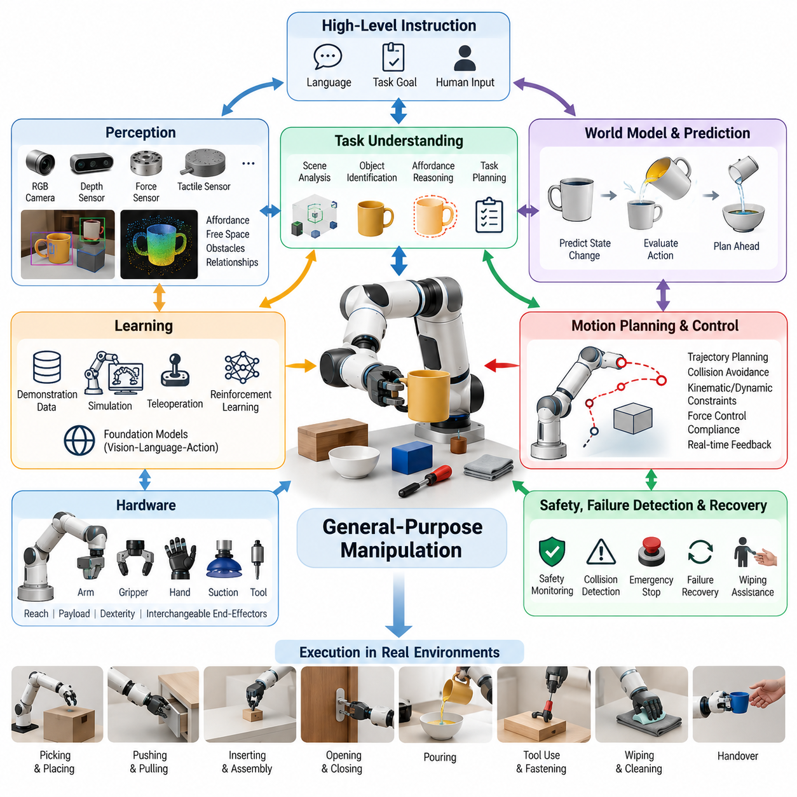
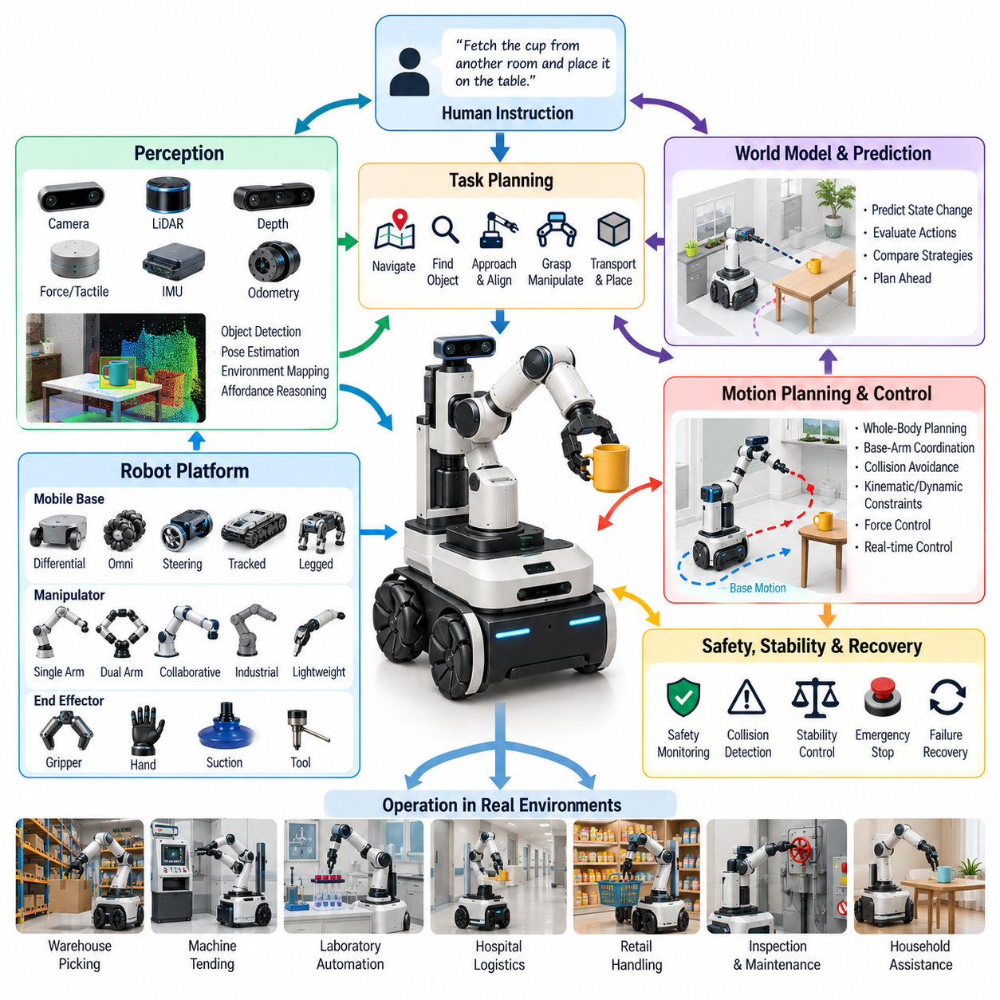
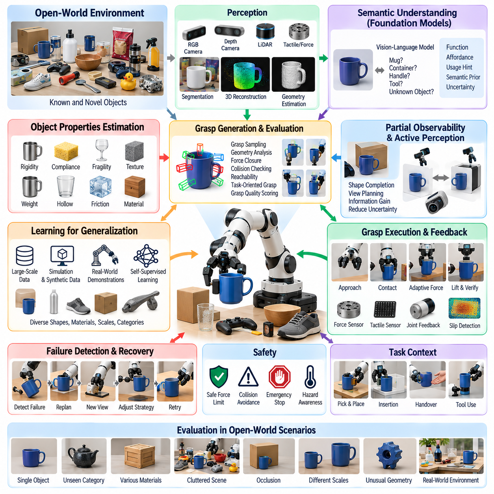
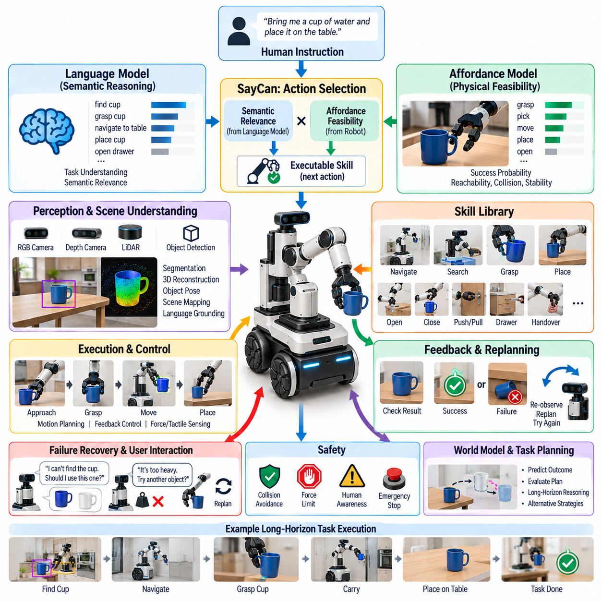
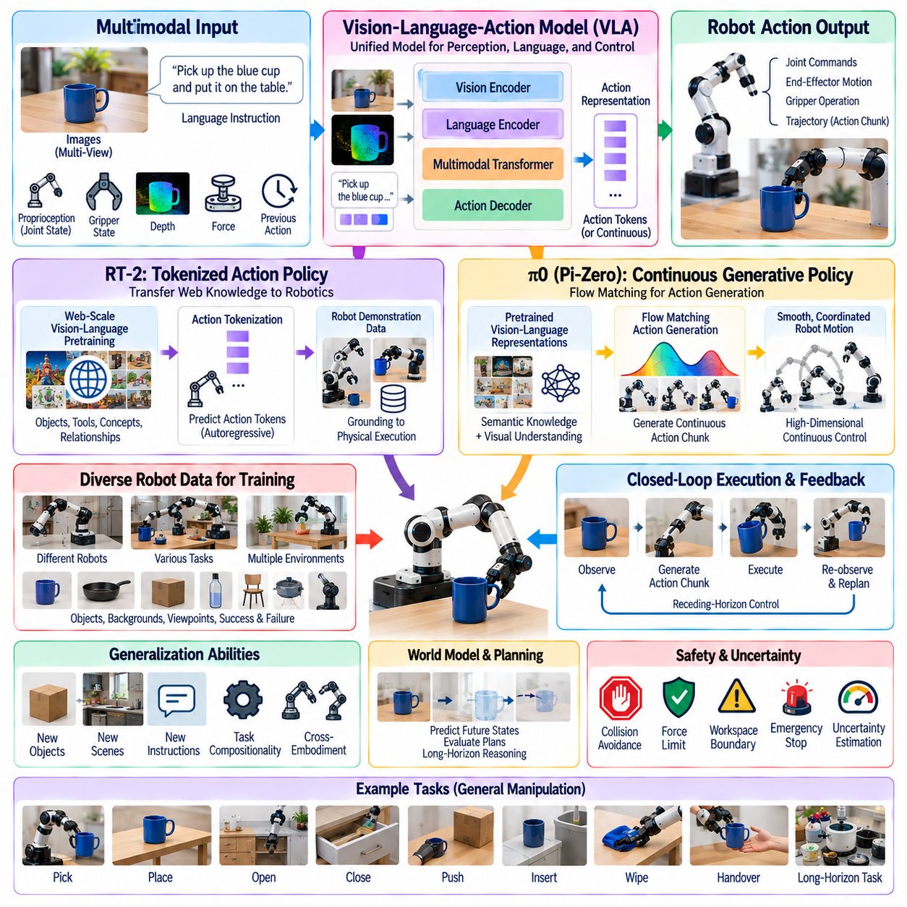
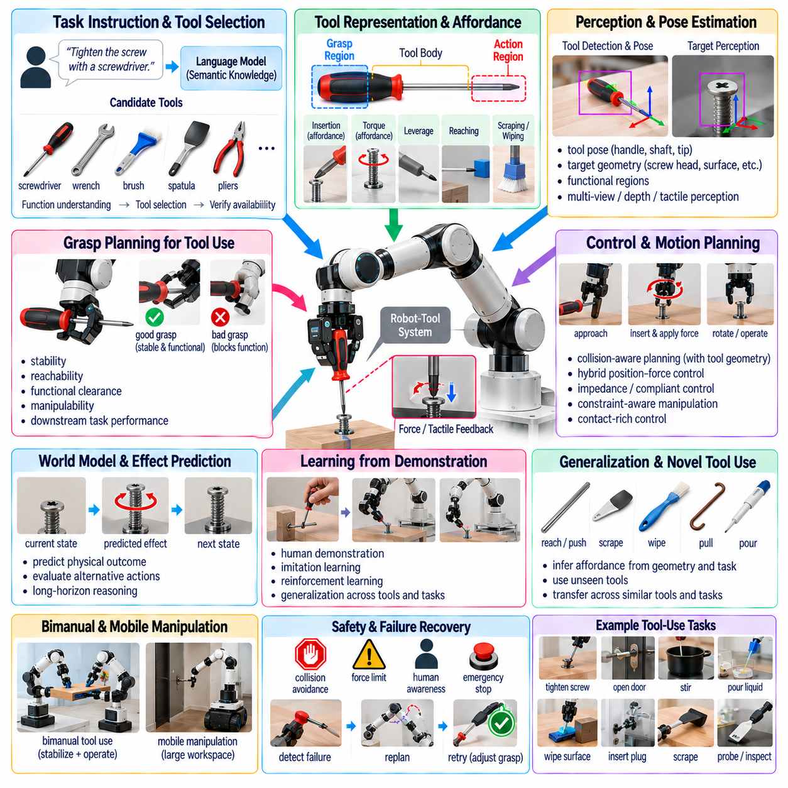
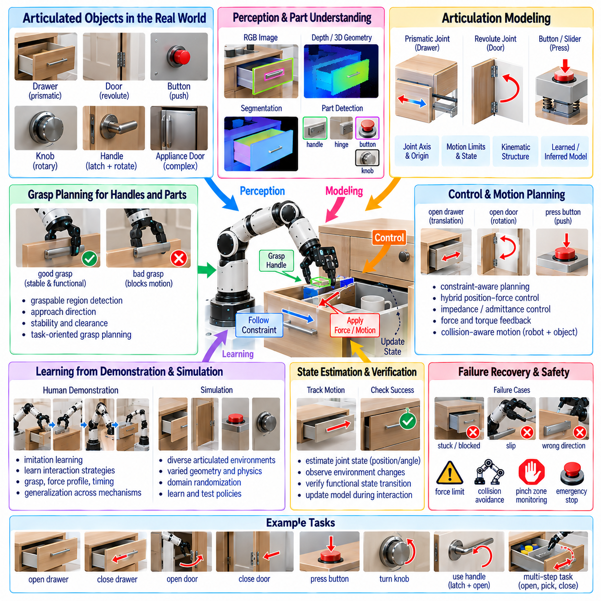
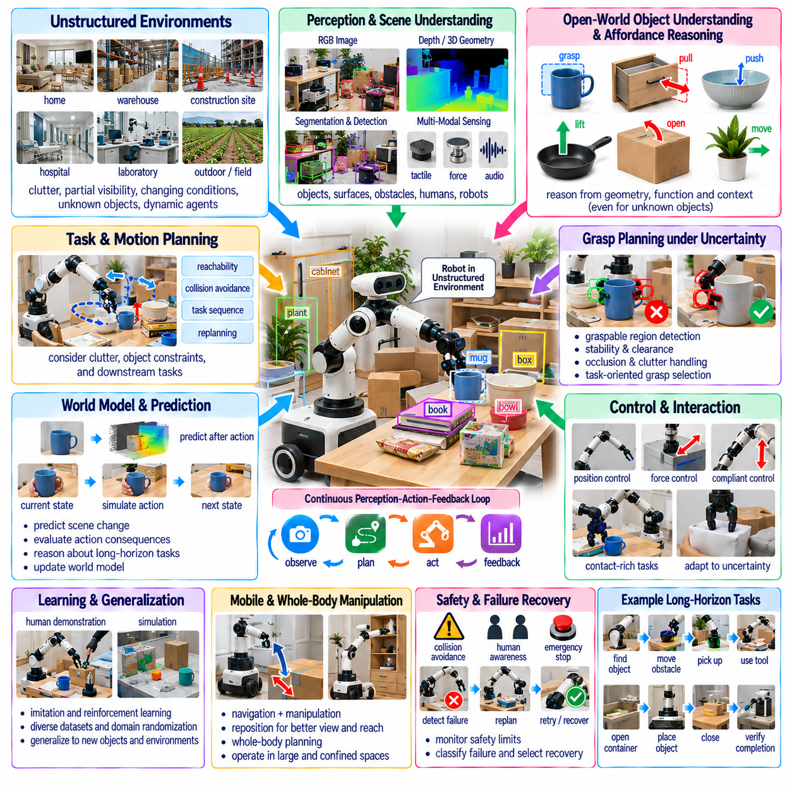
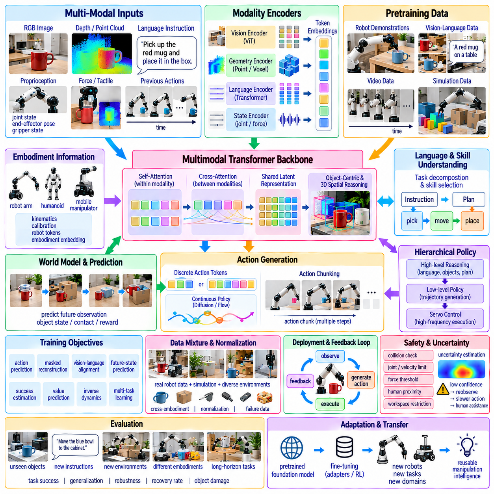

**Volume 17 Manipulation and Grasping AI**


# Chapter 09. General Purpose Manipulation

##  

## 09.01. General Purpose Manipulation Vision and Requirements

{width="7.268055555555556in" height="7.268055555555556in"}

General-purpose manipulation aims to create robotic systems that can interact competently with a broad range of objects, tools, environments, and tasks without requiring a separately engineered manipulation pipeline for every situation. Unlike conventional industrial automation, where geometry, object location, motion sequence, and operating conditions are tightly controlled, a general-purpose manipulator must operate under uncertainty and adapt its behavior as conditions change.

The central vision is a manipulation system that can receive a high-level objective, interpret the surrounding scene, identify relevant objects and their functional relationships, determine appropriate physical interactions, execute them safely, and evaluate whether the intended result has been achieved. Such a robot should move beyond executing predefined trajectories toward generating actions from perception, context, task knowledge, and continuously updated estimates of the physical world.

General-purpose capability does not imply that one robot must perform every conceivable manipulation task. Instead, it describes an architecture whose skills can be reused, composed, transferred, and extended across task families. Picking, placing, pushing, pulling, inserting, opening, closing, pouring, wiping, fastening, tool use, and object handover can therefore be treated as reusable interaction primitives rather than isolated applications requiring independent control systems.

A fundamental requirement is broad perceptual competence. The robot must estimate object identity, pose, geometry, scale, articulation, material characteristics, affordances, free space, obstacles, and relationships between objects. RGB cameras, depth sensors, force sensing, tactile sensing, proprioception, and other modalities provide complementary observations. Their integration produces a richer state representation than any individual sensing modality can provide.

Perception must also support manipulation rather than merely object recognition. Knowing that an object is a cup is insufficient if the robot cannot determine where it can be grasped, whether it contains liquid, how it is oriented, what obstacles surround it, or which region should remain unobstructed during use. Manipulation-oriented perception therefore emphasizes affordances, contact opportunities, functional parts, physical constraints, and action-conditioned scene understanding.

General-purpose manipulation additionally requires robust pose estimation and spatial reasoning under partial observability. Objects may be occluded, deformable, reflective, transparent, previously unseen, or moving during interaction. The robot must maintain beliefs about uncertain states and update them as new observations become available. Active perception becomes important because the manipulator can deliberately move its camera, arm, or object to obtain information needed for subsequent actions.

Another requirement is adaptable grasp generation. Fixed grasp libraries work effectively in structured production environments but become insufficient when objects vary significantly in shape, orientation, material, and accessibility. A general-purpose system should generate and rank grasp candidates according to geometry, task intent, collision risk, force requirements, reachability, and downstream actions. The best grasp for lifting an object may differ substantially from the best grasp for using it as a tool.

Manipulation must therefore be task-conditioned. The robot should reason not only about whether an object can be grasped, but also about why it is being grasped and what interaction follows. A screwdriver intended for fastening requires an orientation and grasp configuration that preserve access to its functional end. Similarly, a container intended for pouring must be grasped in a way that supports controlled rotation while maintaining stability and avoiding unintended contact.

Motion generation must connect these semantic intentions to physically executable trajectories. Planning must account for kinematic limits, singularities, joint limits, self-collision, environmental collision, payload, dynamic constraints, contact states, and end-effector orientation. In changing environments, planning cannot remain purely offline. Trajectories may need to be continuously revised using updated perception and feedback while preserving safety and task objectives.

Contact-rich interaction introduces requirements beyond free-space motion planning. In insertion, wiping, opening, assembly, or tool-use tasks, successful behavior depends on forces and constraints created through contact. Position control alone is often inadequate because geometric errors can generate excessive forces or prevent completion. Force control, impedance control, compliance, tactile feedback, and hybrid position-force strategies therefore become essential components of a general manipulation architecture.

A general-purpose manipulator also requires a representation of skills at multiple levels of abstraction. Low-level controllers regulate torque, velocity, position, and contact forces, while reusable motor skills implement behaviors such as grasping or insertion. Higher layers organize these skills into task sequences and reason about goals, objects, constraints, and failures. This hierarchy allows semantic instructions to be translated progressively into executable physical actions.

Learning expands this architecture by allowing behavior to improve from demonstrations, interaction data, simulation, teleoperation, reinforcement learning, and large-scale robot datasets. Rather than explicitly programming every variation, models can learn reusable relationships between observations, language, actions, and outcomes. Imitation learning can provide initial competence, while reinforcement learning and online adaptation can refine behaviors that require interaction with uncertain physical dynamics.

Foundation models and vision-language-action models introduce an additional route toward generalization. Large multimodal models can connect language instructions with visual observations and action representations, potentially allowing knowledge acquired across many tasks to support unfamiliar situations. However, semantic generalization alone does not guarantee reliable physical execution. Manipulation still requires accurate geometry, timing, contact reasoning, control stability, and mechanisms for detecting when model predictions are unsafe or physically infeasible.

World models can provide another important capability by representing how the environment is expected to evolve after an action. Instead of selecting actions only from the current observation, the robot can predict possible future states and evaluate alternative manipulation strategies before execution. Such predictive reasoning is particularly valuable when actions are irreversible, when objects interact dynamically, or when intermediate configurations strongly influence later stages of the task.

General-purpose operation also demands systematic failure detection and recovery. Real environments inevitably produce missed grasps, object slips, unexpected collisions, blocked trajectories, incorrect detections, and unsuccessful insertions. A robust system must distinguish between intended and actual outcomes, diagnose discrepancies, and choose an appropriate recovery strategy. Recovery may involve re-observation, re-grasping, replanning, changing the manipulation strategy, or requesting human assistance.

Safety must be integrated throughout the manipulation stack rather than treated as a final protective layer. Manipulators operating near humans must constrain velocity, force, workspace, and contact behavior according to context. Safety monitoring should remain active even when learned policies or high-level AI models generate commands. Independent limits, collision monitoring, emergency stopping, uncertainty estimation, and runtime validation provide safeguards against both physical failures and erroneous decisions.

Hardware versatility is another major requirement. General-purpose manipulation benefits from sufficient reach, payload, dexterity, repeatability, bandwidth, and compliant interaction capability. End effectors may include parallel grippers, multi-finger hands, suction devices, or interchangeable tools. No single mechanism is optimal for every task, so hardware design must balance mechanical simplicity and reliability against the dexterity required for diverse physical interactions.

The computational architecture must support tight coordination between perception, planning, learning, and control. Some processes operate at high frequency and require deterministic local execution, while semantic reasoning or large-model inference may tolerate longer latency. A practical system therefore separates fast physical control loops from slower deliberative processes while maintaining consistent state, synchronization, command validation, and feedback between the different computational layers.

Data diversity becomes a critical requirement as manipulation moves toward generality. Training data should span different objects, viewpoints, environments, robot configurations, task instructions, failure modes, and interaction dynamics. Simulation can increase coverage and reduce physical collection cost, but differences between simulated and real contact behavior remain significant. Domain randomization, system identification, real-world fine-tuning, and cross-robot datasets help reduce this simulation-to-reality gap.

Evaluation must consequently measure more than success on a small set of predefined demonstrations. General-purpose manipulation should be tested for robustness to unseen objects, altered object positions, environmental changes, instruction variations, disturbances, and combinations of previously learned skills. Metrics should include task success, completion time, intervention rate, collision frequency, grasp stability, recovery capability, safety violations, and performance degradation under distribution shift.

Scalability also depends on reducing task-specific engineering. If every new application requires extensive perception tuning, manually authored trajectories, custom reward functions, and repeated controller redesign, the system remains specialized despite using advanced AI. A stronger measure of generality is therefore the amount of additional engineering, data, and training required when the robot encounters a new task, object category, workspace, or embodiment.

Ultimately, general-purpose manipulation is best understood as an integrated intelligence problem rather than a single algorithmic capability. Perception identifies actionable structure, world models estimate physical consequences, planning selects feasible interactions, learning supplies adaptable skills, and feedback control realizes those interactions in the physical world. Reliability emerges from continuous coordination among these functions rather than from the sophistication of any individual model.

The long-term objective is a robotic manipulation platform capable of converting human-level intentions into safe, adaptive, and physically grounded behavior across diverse environments. Achieving this vision requires progress not only in AI models but also in sensing, actuation, control, data, system architecture, verification, and human-robot interaction. General-purpose manipulation therefore represents a convergence point where embodied intelligence must connect semantic understanding with dependable physical execution.

범용 조작(General-Purpose Manipulation)은 각각의 상황마다 별도의 조작 파이프라인(Manipulation Pipeline)을 설계하지 않고도 광범위한 객체(Object), 도구(Tool), 환경(Environment), 작업(Task)과 능숙하게 상호작용할 수 있는 로봇 시스템을 구축하는 것을 목표로 한다. 기하 구조(Geometry), 객체 위치(Object Location), 동작 순서(Motion Sequence), 운용 조건(Operating Conditions)이 엄격하게 통제되는 기존 산업 자동화(Industrial Automation)와 달리, 범용 조작기는 불확실성(Uncertainty) 속에서 동작하고 조건 변화에 따라 행동을 적응시킬 수 있어야 한다.

핵심 비전(Vision)은 상위 수준 목표(High-Level Objective)를 입력받아 주변 장면(Scene)을 해석하고, 관련 객체와 그 기능적 관계(Functional Relationships)를 식별하며, 적절한 물리적 상호작용(Physical Interaction)을 결정하고, 이를 안전하게 실행한 후 의도한 결과가 달성되었는지를 평가할 수 있는 조작 시스템을 구현하는 것이다. 이러한 로봇은 사전에 정의된 궤적(Predefined Trajectory)을 실행하는 수준을 넘어 지각(Perception), 상황(Context), 작업 지식(Task Knowledge), 지속적으로 갱신되는 물리 세계(Physical World)의 추정치를 기반으로 행동을 생성해야 한다.

범용 능력(General-Purpose Capability)이 하나의 로봇이 상상 가능한 모든 조작 작업을 수행해야 한다는 것을 의미하지는 않는다. 대신 작업 계열(Task Families)에 걸쳐 기술(Skill)을 재사용(Reuse), 조합(Composition), 전이(Transfer), 확장(Extension)할 수 있는 아키텍처(Architecture)를 의미한다. 따라서 집기(Picking), 놓기(Placing), 밀기(Pushing), 당기기(Pulling), 삽입(Inserting), 열기(Opening), 닫기(Closing), 붓기(Pouring), 닦기(Wiping), 체결(Fastening), 도구 사용(Tool Use), 객체 전달(Object Handover) 등을 독립된 응용 프로그램이 아니라 재사용 가능한 상호작용 프리미티브(Interaction Primitive)로 다룰 수 있다.

기본적인 요구사항 중 하나는 폭넓은 지각 능력(Perceptual Competence)이다. 로봇은 객체의 정체성(Object Identity), 자세(Pose), 기하 구조(Geometry), 크기(Scale), 관절 구조(Articulation), 재질 특성(Material Characteristics), 행동유도성(Affordance), 자유 공간(Free Space), 장애물(Obstacle), 객체 간 관계(Relationship)를 추정해야 한다. RGB 카메라(RGB Camera), 깊이 센서(Depth Sensor), 힘 센싱(Force Sensing), 촉각 센싱(Tactile Sensing), 고유수용감각(Proprioception) 등의 다양한 감각 모달리티(Modality)를 통합하면 개별 센서만으로 얻을 수 있는 것보다 풍부한 상태 표현(State Representation)을 구축할 수 있다.

지각(Perception)은 단순한 객체 인식(Object Recognition)을 넘어 조작 자체를 지원해야 한다. 어떤 객체가 컵이라는 사실을 아는 것만으로는 로봇이 어디를 잡아야 하는지, 내부에 액체가 들어 있는지, 어떤 방향으로 놓여 있는지, 주변에 어떤 장애물이 존재하는지, 사용 중 어느 부분을 가리지 않아야 하는지를 판단할 수 없다. 따라서 조작 지향 지각(Manipulation-Oriented Perception)은 행동유도성(Affordance), 접촉 가능 영역(Contact Opportunity), 기능적 부분(Functional Part), 물리적 제약(Physical Constraint), 행동 조건부 장면 이해(Action-Conditioned Scene Understanding)를 중요하게 다룬다.

범용 조작은 부분 관측성(Partial Observability) 환경에서 강건한 자세 추정(Pose Estimation)과 공간 추론(Spatial Reasoning)도 요구한다. 객체는 가려져 있거나(Occluded), 변형 가능하거나(Deformable), 반사성(Reflective) 또는 투명(Transparent)할 수 있으며, 이전에 본 적이 없거나 상호작용 과정에서 움직일 수도 있다. 로봇은 불확실한 상태에 대한 신념(Belief)을 유지하고 새로운 관측이 확보될 때마다 이를 갱신해야 한다. 능동 지각(Active Perception)은 조작기가 이후 행동에 필요한 정보를 얻기 위해 카메라, 로봇 팔, 객체를 의도적으로 움직일 수 있다는 점에서 중요하다.

또 다른 요구사항은 적응형 파지 생성(Adaptive Grasp Generation)이다. 고정된 파지 라이브러리(Fixed Grasp Library)는 구조화된 생산 환경에서는 효과적이지만 객체의 형상, 방향, 재질, 접근성이 크게 변화하면 충분하지 않다. 범용 시스템은 기하 구조, 작업 의도(Task Intent), 충돌 위험(Collision Risk), 힘 요구조건(Force Requirement), 도달 가능성(Reachability), 후속 행동(Downstream Action)을 고려하여 파지 후보(Grasp Candidate)를 생성하고 순위를 결정해야 한다. 객체를 들어 올리기 위한 최적 파지는 해당 객체를 도구로 사용하기 위한 최적 파지와 크게 다를 수 있다.

따라서 조작은 작업 조건부(Task-Conditioned) 방식으로 이루어져야 한다. 로봇은 객체를 잡을 수 있는지만 판단하는 것이 아니라 왜 그 객체를 잡아야 하는지, 그리고 이후 어떤 상호작용이 이어지는지를 추론해야 한다. 체결 작업에 사용할 드라이버(Screwdriver)는 기능적 끝부분(Functional End)에 대한 접근성을 유지할 수 있는 방향과 파지 구성이 필요하다. 마찬가지로 액체를 붓기 위한 용기(Container)는 안정성을 유지하고 의도하지 않은 접촉을 방지하면서 제어된 회전(Controlled Rotation)을 수행할 수 있도록 파지해야 한다.

동작 생성(Motion Generation)은 이러한 의미론적 의도(Semantic Intention)를 물리적으로 실행 가능한 궤적(Executable Trajectory)으로 연결해야 한다. 계획(Planning)은 운동학적 한계(Kinematic Limit), 특이점(Singularity), 관절 한계(Joint Limit), 자체 충돌(Self-Collision), 환경 충돌(Environmental Collision), 페이로드(Payload), 동역학적 제약(Dynamic Constraint), 접촉 상태(Contact State), 말단장치 방향(End-Effector Orientation)을 고려해야 한다. 변화하는 환경에서는 계획을 완전히 오프라인(Offline)으로 수행할 수 없으며, 안전성과 작업 목표를 유지하면서 갱신된 지각 및 피드백(Feedback)에 따라 궤적을 지속적으로 수정해야 할 수 있다.

접촉이 많은 상호작용(Contact-Rich Interaction)은 자유 공간 동작 계획(Free-Space Motion Planning)을 넘어서는 요구사항을 갖는다. 삽입(Insertion), 닦기(Wiping), 열기(Opening), 조립(Assembly), 도구 사용(Tool Use)에서는 접촉을 통해 형성되는 힘과 제약조건이 작업 성공을 결정한다. 기하학적 오차가 과도한 힘을 발생시키거나 작업 완료를 방해할 수 있기 때문에 위치 제어(Position Control)만으로는 충분하지 않은 경우가 많다. 따라서 힘 제어(Force Control), 임피던스 제어(Impedance Control), 순응성(Compliance), 촉각 피드백(Tactile Feedback), 위치-힘 혼합 제어(Hybrid Position-Force Control)가 범용 조작 아키텍처의 핵심 구성요소가 된다.

범용 조작기는 또한 여러 추상화 수준(Abstraction Level)에서 기술(Skill)을 표현할 수 있어야 한다. 저수준 제어기(Low-Level Controller)는 토크(Torque), 속도(Velocity), 위치(Position), 접촉력(Contact Force)을 조절하며, 재사용 가능한 운동 기술(Motor Skill)은 파지나 삽입과 같은 행동을 구현한다. 상위 계층(Higher Layer)은 이러한 기술을 작업 순서(Task Sequence)로 구성하고 목표, 객체, 제약조건, 실패 상황을 추론한다. 이러한 계층 구조(Hierarchy)를 통해 의미론적 명령(Semantic Instruction)을 점진적으로 실행 가능한 물리적 행동으로 변환할 수 있다.

학습(Learning)은 시연(Demonstration), 상호작용 데이터(Interaction Data), 시뮬레이션(Simulation), 원격조작(Teleoperation), 강화학습(Reinforcement Learning), 대규모 로봇 데이터셋(Large-Scale Robot Dataset)을 통해 행동을 개선할 수 있도록 이러한 아키텍처를 확장한다. 모든 변형 상황을 명시적으로 프로그래밍하는 대신 모델은 관측(Observation), 언어(Language), 행동(Action), 결과(Outcome) 사이의 재사용 가능한 관계를 학습할 수 있다. 모방학습(Imitation Learning)은 초기 능력을 제공하고, 강화학습과 온라인 적응(Online Adaptation)은 불확실한 물리 동역학과의 상호작용이 필요한 행동을 정교화할 수 있다.

파운데이션 모델(Foundation Model)과 비전-언어-행동 모델(Vision-Language-Action Model, VLA)은 일반화(Generalization)를 향한 또 다른 경로를 제공한다. 대규모 멀티모달 모델(Large Multimodal Model)은 언어 명령(Language Instruction)을 시각적 관측(Visual Observation) 및 행동 표현(Action Representation)과 연결하여 다양한 작업에서 획득한 지식을 새로운 상황에 활용할 가능성을 제공한다. 그러나 의미론적 일반화만으로 신뢰할 수 있는 물리적 실행이 보장되지는 않는다. 조작에는 여전히 정확한 기하 구조, 타이밍(Timing), 접촉 추론(Contact Reasoning), 제어 안정성(Control Stability), 모델 예측이 안전하지 않거나 물리적으로 실행 불가능한지를 검출하는 메커니즘이 필요하다.

월드 모델(World Model)은 행동 이후 환경이 어떻게 변화할지를 표현함으로써 또 다른 중요한 능력을 제공할 수 있다. 로봇은 현재 관측만으로 행동을 선택하는 대신 가능한 미래 상태(Future State)를 예측하고 실행 전에 여러 조작 전략을 평가할 수 있다. 이러한 예측적 추론(Predictive Reasoning)은 행동을 되돌리기 어렵거나, 객체가 동적으로 상호작용하거나, 중간 상태(Intermediate Configuration)가 이후 작업 단계에 큰 영향을 미치는 경우 특히 중요하다.

범용 운용(General-Purpose Operation)은 체계적인 실패 감지(Failure Detection)와 복구(Recovery) 능력도 요구한다. 실제 환경에서는 파지 실패(Missed Grasp), 객체 미끄러짐(Object Slip), 예상하지 못한 충돌, 차단된 궤적(Blocked Trajectory), 잘못된 인식, 삽입 실패 등이 불가피하게 발생한다. 강건한 시스템은 의도된 결과와 실제 결과의 차이를 구분하고, 원인을 진단하며, 적절한 복구 전략을 선택해야 한다. 복구에는 재관측(Re-Observation), 재파지(Re-Grasping), 재계획(Replanning), 조작 전략 변경 또는 인간 지원(Human Assistance) 요청 등이 포함될 수 있다.

안전성(Safety)은 최종적인 보호 계층으로 취급되는 것이 아니라 전체 조작 스택(Manipulation Stack)에 통합되어야 한다. 사람 주변에서 동작하는 조작기는 상황에 따라 속도, 힘, 작업 공간(Workspace), 접촉 행동을 제한해야 한다. 학습 정책(Learned Policy)이나 상위 수준 인공지능 모델이 명령을 생성하더라도 안전 모니터링(Safety Monitoring)은 지속적으로 활성화되어야 한다. 독립적인 제한 장치, 충돌 감시(Collision Monitoring), 비상 정지(Emergency Stop), 불확실성 추정(Uncertainty Estimation), 런타임 검증(Runtime Validation)은 물리적 실패와 잘못된 의사결정 모두에 대한 보호 장치를 제공한다.

하드웨어 범용성(Hardware Versatility) 역시 중요한 요구사항이다. 범용 조작은 충분한 도달 범위(Reach), 페이로드(Payload), 민첩성(Dexterity), 반복 정밀도(Repeatability), 대역폭(Bandwidth), 순응적 상호작용(Compliant Interaction) 능력을 필요로 한다. 말단장치(End Effector)에는 평행 그리퍼(Parallel Gripper), 다지 손(Multi-Finger Hand), 흡착 장치(Suction Device), 교체 가능한 도구(Interchangeable Tool) 등이 포함될 수 있다. 모든 작업에 최적인 단일 메커니즘은 존재하지 않으므로 하드웨어 설계는 기계적 단순성과 신뢰성, 다양한 물리적 상호작용에 필요한 민첩성 사이의 균형을 고려해야 한다.

컴퓨팅 아키텍처(Computational Architecture)는 지각, 계획, 학습, 제어 사이의 긴밀한 협조를 지원해야 한다. 일부 프로세스는 높은 주파수(High Frequency)로 동작하며 결정론적 로컬 실행(Deterministic Local Execution)이 필요한 반면, 의미론적 추론(Semantic Reasoning)이나 대규모 모델 추론(Large-Model Inference)은 더 긴 지연시간(Latency)을 허용할 수 있다. 따라서 실용적인 시스템은 빠른 물리 제어 루프(Fast Physical Control Loop)와 느린 숙고형 프로세스(Deliberative Process)를 분리하면서도 서로 다른 계산 계층 간에 일관된 상태, 동기화(Synchronization), 명령 검증(Command Validation), 피드백을 유지해야 한다.

조작 시스템이 범용성을 지향할수록 데이터 다양성(Data Diversity)은 핵심 요구사항이 된다. 학습 데이터는 서로 다른 객체, 시점(Viewpoint), 환경, 로봇 구성(Robot Configuration), 작업 명령, 실패 모드(Failure Mode), 상호작용 동역학(Interaction Dynamics)을 포괄해야 한다. 시뮬레이션은 데이터 범위를 확대하고 실제 데이터 수집 비용을 줄일 수 있지만, 시뮬레이션과 실제 환경의 접촉 행동에는 여전히 상당한 차이가 존재한다. 도메인 무작위화(Domain Randomization), 시스템 식별(System Identification), 실제 환경 미세조정(Real-World Fine-Tuning), 로봇 간 데이터셋(Cross-Robot Dataset)은 이러한 시뮬레이션-현실 격차(Sim-to-Real Gap)를 줄이는 데 도움을 준다.

따라서 평가(Evaluation)는 소수의 사전 정의된 시연 작업에 대한 성공 여부만 측정해서는 안 된다. 범용 조작은 미지의 객체(Unseen Object), 변경된 객체 위치, 환경 변화, 명령 표현의 변화, 외부 교란(Disturbance), 기존에 학습한 기술의 새로운 조합에 대한 강건성을 평가해야 한다. 평가 지표(Metric)에는 작업 성공률(Task Success Rate), 완료 시간(Completion Time), 개입률(Intervention Rate), 충돌 빈도(Collision Frequency), 파지 안정성(Grasp Stability), 복구 능력(Recovery Capability), 안전 위반(Safety Violation), 분포 변화(Distribution Shift)에 따른 성능 저하 등이 포함되어야 한다.

확장성(Scalability)은 작업별 엔지니어링(Task-Specific Engineering)을 얼마나 줄일 수 있는가에도 좌우된다. 새로운 응용마다 광범위한 지각 튜닝(Perception Tuning), 수작업 궤적 작성, 사용자 정의 보상 함수(Custom Reward Function), 반복적인 제어기 재설계가 필요하다면 첨단 인공지능을 사용하더라도 시스템은 여전히 특화 시스템(Specialized System)에 머문다. 따라서 범용성을 평가하는 더 강력한 기준은 새로운 작업, 객체 범주(Object Category), 작업 공간 또는 로봇 형태(Embodiment)를 접했을 때 추가로 필요한 엔지니어링, 데이터, 학습의 양이다.

궁극적으로 범용 조작은 하나의 알고리즘적 능력이 아니라 통합 지능 문제(Integrated Intelligence Problem)로 이해하는 것이 적절하다. 지각은 행동 가능한 구조(Actionable Structure)를 식별하고, 월드 모델은 물리적 결과를 예측하며, 계획은 실행 가능한 상호작용을 선택하고, 학습은 적응 가능한 기술을 제공하며, 피드백 제어(Feedback Control)는 이러한 상호작용을 물리 세계에서 실현한다. 신뢰성(Reliability)은 특정 모델 하나의 정교함이 아니라 이러한 기능들이 지속적으로 협조함으로써 형성된다.

장기적인 목표는 인간 수준의 의도(Human-Level Intention)를 다양한 환경에서 안전하고 적응적이며 물리적으로 근거가 있는 행동(Physically Grounded Behavior)으로 변환할 수 있는 로봇 조작 플랫폼을 구현하는 것이다. 이러한 비전을 달성하려면 인공지능 모델뿐 아니라 센싱(Sensing), 구동(Actuation), 제어(Control), 데이터(Data), 시스템 아키텍처(System Architecture), 검증(Verification), 인간-로봇 상호작용(Human-Robot Interaction)의 발전이 함께 이루어져야 한다. 따라서 범용 조작은 체화 지능(Embodied Intelligence)이 의미론적 이해(Semantic Understanding)와 신뢰할 수 있는 물리적 실행(Dependable Physical Execution)을 연결해야 하는 핵심 융합 영역이라고 할 수 있다.

##  

## 09.02. Mobile Manipulation Platform Loco Manip Integration [w/Code]

{width="7.268055555555556in" height="7.268055555555556in"}

Mobile manipulation integrates locomotion and manipulation so that a robot can move through an environment, position its body relative to a target, and physically interact with objects using one coordinated system. Unlike a fixed manipulator whose workspace is determined by its mounting location, a mobile manipulation platform extends its effective workspace through base motion, allowing manipulation tasks to be performed across rooms, production areas, warehouses, laboratories, and other large environments.

A typical mobile manipulation platform combines a mobile base, one or more robotic arms, end effectors, perception sensors, onboard computing, power systems, and communication interfaces. The base may use differential drive, omnidirectional wheels, steering mechanisms, tracks, or legged locomotion. The manipulation subsystem may consist of a collaborative arm, industrial manipulator, lightweight arm, or dual-arm configuration selected according to payload, reach, dexterity, and interaction requirements.

The central integration challenge is that locomotion and manipulation cannot always be treated as independent functions. A conventional architecture may navigate to a predefined pose, stop the base, and then activate the arm. This sequential strategy is practical for structured tasks, but it restricts reachability and flexibility. Loco-manipulation instead treats base motion and arm motion as coordinated degrees of freedom that can contribute simultaneously to achieving the task objective.

The combined configuration space of a mobile manipulator is considerably larger than that of either subsystem alone. The planner must reason about base position, orientation, arm joint configuration, end-effector pose, obstacles, joint limits, stability, and task constraints. Multiple configurations may produce the same end-effector pose, creating redundancy that can be exploited to improve manipulability, avoid singularities, increase clearance, or maintain a safer distance from surrounding objects.

Base placement is therefore a fundamental component of mobile manipulation. Before reaching for an object, the robot must determine where the mobile platform should be positioned so that the target is reachable with sufficient manipulation margin. An apparently short navigation route may produce a poor arm configuration, while a slightly different base pose may greatly improve reachability. Navigation and manipulation planning should consequently share geometric and task-related information.

Perception provides the common spatial foundation required for this integration. Cameras, depth sensors, LiDAR, force sensors, tactile sensors, wheel odometry, inertial measurement units, and joint encoders contribute information about the robot and its surroundings. These observations must be transformed into consistent coordinate frames so that the system can estimate the relationship among the mobile base, manipulator, end effector, target object, obstacles, and global environment.

Localization accuracy directly affects manipulation performance because errors in mobile base pose propagate into the estimated position of the arm relative to the target. Navigation-level localization may be adequate for approaching a workstation but insufficient for precise grasping or insertion. Practical systems therefore combine global localization with local visual or geometric refinement near the manipulation target, allowing the robot to correct residual positioning errors before physical interaction.

A mobile manipulation system benefits from layered representations of the environment. A global map supports navigation through large spaces, while local occupancy maps or distance fields support collision avoidance near the robot. Object-level representations describe manipulation targets and semantic landmarks. Close to contact, detailed geometry, visual features, force measurements, and tactile observations become increasingly important because manipulation accuracy requirements are much tighter than ordinary navigation requirements.

Whole-body planning treats the mobile base and manipulator as a unified kinematic system. Instead of planning a base trajectory first and an arm trajectory afterward, the planner can search for coordinated motions that satisfy the end-effector objective while respecting collisions and mechanical constraints. This approach is especially valuable when reaching into shelves, operating along extended surfaces, handling large objects, or performing tasks whose required workspace exceeds the static reach of the arm.

Whole-body control extends this principle into real-time execution. Desired end-effector motion can be distributed among arm joints and base motion according to task priorities and constraints. The arm may perform fast, precise local adjustments while the base provides slower large-scale repositioning. Optimization-based controllers can regulate this coordination while considering joint limits, manipulability, obstacle clearance, velocity limits, and secondary objectives such as maintaining favorable sensor visibility.

Simultaneous base and arm motion introduces dynamic coupling that becomes increasingly important at higher speeds or with heavier payloads. Manipulator acceleration can disturb the mobile platform, while base acceleration changes the motion experienced by the arm and payload. Even when the base is nominally stable, structural compliance, wheel suspension, floor irregularities, backlash, and vibration can reduce end-effector accuracy. Dynamic models and feedback control must account for these effects when precision is required.

Stability becomes a critical constraint when the manipulator reaches far from the platform or carries a significant payload. The arm changes the system center of mass and can generate overturning moments during acceleration or contact. Platform dimensions, wheel arrangement, suspension, payload distribution, manipulator mounting position, and acceleration limits influence the available stability margin. Controllers should restrict motions that approach unsafe configurations even when they are kinematically reachable.

Contact-rich mobile manipulation introduces further complexity because interaction forces can propagate through the arm into the base. Tasks such as pushing a door, wiping a wall, operating a valve, drilling, or manipulating heavy equipment may require sustained force while the robot moves. Force control, impedance control, compliant behavior, traction estimation, and base stabilization must work together so that contact forces remain controlled without causing wheel slip, oscillation, or loss of localization.

Navigation around people and equipment must also consider the geometry of the manipulator. A mobile base may have a collision-free path while an extended arm collides with shelves, walls, machinery, or humans. The navigation system must therefore represent the complete robot footprint, including configuration-dependent swept volume. During transport, the arm can be moved into a compact safe posture, while manipulation-aware navigation can modify the posture when approaching the target workspace.

Task planning determines when locomotion, repositioning, manipulation, sensing, and recovery actions should occur. A command such as retrieving an object from another room may require navigation, target search, approach, base alignment, grasping, verification, retreat, transport, and placement. These behaviors should be represented as coordinated skills rather than isolated software functions so that execution can adapt when the environment or object state differs from the original plan.

Learning can improve loco-manipulation by discovering coordination strategies that are difficult to engineer manually. Demonstration learning can capture how humans or teleoperators combine body positioning with reaching, while reinforcement learning can optimize coordinated motion under complex constraints. Learned policies may also estimate promising base poses, grasp configurations, or recovery actions. However, learned behaviors should remain bounded by collision, stability, force, and safety constraints during deployment.

World models can further support integration by predicting how robot and environment states evolve under coordinated actions. The system may compare alternative strategies such as repositioning the base before grasping, moving while reaching, or manipulating an object from several successive poses. Predictive models are particularly useful for long-horizon tasks in which an early base placement decision can strongly affect later reachability, visibility, collision risk, and task completion.

Mobile manipulation requires careful management of computation and communication latency. Low-level motor control, force regulation, collision response, and emergency functions require fast deterministic execution, whereas semantic perception, global planning, or large-model reasoning can operate at slower rates. A hierarchical architecture allows these processes to coexist while ensuring that delayed high-level decisions cannot override immediate physical safety requirements or destabilize local controllers.

Energy management is also more important than in stationary manipulation because locomotion, perception, computing, and arm actuation share a limited onboard power source. Repeated acceleration of a heavy platform or manipulator can significantly reduce operating time. Planning can therefore consider energy alongside distance and execution time, selecting efficient base positions, reducing unnecessary repositioning, scheduling charging, and adapting performance according to the remaining battery state.

Safety requirements increase because the robot combines a moving platform with an articulated mechanism whose reachable volume changes continuously. Speed and separation monitoring, collision detection, force limits, protective stopping, human tracking, safe arm postures, and emergency stop functions must cover both subsystems. Safety supervision should evaluate the combined robot state rather than assuming that individually safe base and arm commands automatically produce safe whole-body behavior.

Calibration and synchronization are essential for maintaining integration quality over long-term operation. Transformations between the base, arm, cameras, LiDAR, end effector, and other sensors must remain accurate, while sensor timestamps and control states must be sufficiently synchronized. Mechanical impacts, payload changes, maintenance, sensor replacement, or mounting drift can degrade calibration, so automated validation and recalibration procedures are valuable for reliable deployment.

Failure recovery should exploit the mobility of the platform rather than repeatedly attempting the same arm motion. If a grasp is unreachable, the robot can reposition the base; if an object is occluded, it can move to another viewpoint; if an approach is blocked, it can select a different side of the workspace. This ability to modify the physical observation and manipulation geometry is one of the strongest advantages of mobile manipulation over fixed robotic systems.

Evaluation should measure both subsystem performance and integrated task performance. Navigation accuracy or arm precision alone cannot demonstrate effective loco-manipulation. Tests should examine base placement quality, manipulation success, whole-body collision avoidance, stability, localization during interaction, recovery behavior, task completion time, intervention frequency, energy consumption, and robustness to environmental variation. Integrated benchmarks should include tasks requiring genuine coordination rather than simple navigation followed by stationary manipulation.

Applications include warehouse picking, machine tending, laboratory automation, hospital logistics, retail handling, facility inspection, maintenance, household assistance, and flexible manufacturing. In these domains, mobility allows a smaller number of robots to service multiple workstations instead of dedicating one manipulator to each location. The economic value therefore comes not only from autonomous navigation or manipulation individually, but from the ability to deliver manipulation capability wherever physical work is required.

Ultimately, loco-manipulation transforms a robotic arm from a device operating inside a fixed workspace into a mobile physical agent capable of creating and modifying its own workspace through movement. Successful integration requires shared perception, manipulation-aware navigation, whole-body planning and control, stability management, contact reasoning, safety supervision, and adaptive recovery. When these capabilities operate as one coordinated system, mobile manipulation becomes a foundation for scalable general-purpose robotic autonomy.

모바일 조작(Mobile Manipulation)은 이동(Locomotion)과 조작(Manipulation)을 통합하여 로봇이 환경을 이동하고, 목표물에 대해 자신의 몸체 위치를 조정하며, 하나의 통합된 시스템을 통해 객체와 물리적으로 상호작용할 수 있도록 하는 기술이다. 설치 위치에 의해 작업 공간(Workspace)이 결정되는 고정형 조작기(Fixed Manipulator)와 달리, 모바일 조작 플랫폼(Mobile Manipulation Platform)은 이동 베이스(Base Motion)를 통해 유효 작업 공간을 확장하여 여러 방, 생산 구역, 창고, 실험실 및 기타 넓은 환경에서 조작 작업을 수행할 수 있다.

일반적인 모바일 조작 플랫폼은 모바일 베이스(Mobile Base), 하나 이상의 로봇 팔(Robotic Arm), 말단장치(End Effector), 지각 센서(Perception Sensor), 온보드 컴퓨팅(Onboard Computing), 전원 시스템(Power System), 통신 인터페이스(Communication Interface)를 결합한다. 베이스에는 차동 구동(Differential Drive), 전방향 휠(Omnidirectional Wheel), 조향 메커니즘(Steering Mechanism), 트랙(Track), 보행형 이동(Legged Locomotion) 등이 사용될 수 있다. 조작 시스템은 페이로드(Payload), 도달 범위(Reach), 민첩성(Dexterity), 상호작용 요구조건에 따라 협동 로봇 팔(Collaborative Arm), 산업용 조작기(Industrial Manipulator), 경량 로봇 팔(Lightweight Arm), 양팔 구성(Dual-Arm Configuration) 등으로 구성할 수 있다.

통합의 핵심 과제는 이동과 조작을 항상 서로 독립된 기능으로 취급할 수 없다는 점이다. 기존 아키텍처(Architecture)는 사전에 정의된 위치까지 이동한 후 베이스를 정지시키고 로봇 팔을 동작시키는 방식을 사용할 수 있다. 이러한 순차 전략(Sequential Strategy)은 구조화된 작업에서는 실용적이지만 도달 가능성과 유연성을 제한한다. 반면 이동-조작(Loco-Manipulation)은 베이스와 로봇 팔의 움직임을 작업 목표 달성에 동시에 기여할 수 있는 협조된 자유도(Coordinated Degrees of Freedom)로 취급한다.

모바일 조작기의 통합 구성 공간(Combined Configuration Space)은 두 하위 시스템 각각의 구성 공간보다 훨씬 크다. 계획기(Planner)는 베이스 위치와 방향, 로봇 팔 관절 구성(Arm Joint Configuration), 말단장치 자세(End-Effector Pose), 장애물, 관절 한계(Joint Limit), 안정성(Stability), 작업 제약조건(Task Constraint)을 함께 고려해야 한다. 동일한 말단장치 자세를 생성하는 여러 구성이 존재할 수 있으며, 이러한 여유 자유도(Redundancy)는 조작성(Manipulability)을 개선하고 특이점(Singularity)을 회피하며 장애물과의 간격을 확보하거나 주변 객체로부터 안전한 거리를 유지하는 데 활용할 수 있다.

따라서 베이스 배치(Base Placement)는 모바일 조작의 핵심 요소이다. 객체에 접근하기 전에 로봇은 충분한 조작 여유(Manipulation Margin)를 확보하면서 목표물에 도달할 수 있도록 모바일 플랫폼을 어디에 위치시켜야 하는지 결정해야 한다. 겉보기에는 짧은 이동 경로가 불리한 로봇 팔 구성을 만들 수 있는 반면, 약간 다른 베이스 자세(Base Pose)를 선택하면 도달 가능성이 크게 향상될 수 있다. 따라서 내비게이션(Navigation)과 조작 계획(Manipulation Planning)은 기하학적 정보와 작업 관련 정보를 공유해야 한다.

지각(Perception)은 이러한 통합에 필요한 공통 공간적 기반(Spatial Foundation)을 제공한다. 카메라(Camera), 깊이 센서(Depth Sensor), 라이다(LiDAR), 힘 센서(Force Sensor), 촉각 센서(Tactile Sensor), 휠 오도메트리(Wheel Odometry), 관성 측정 장치(Inertial Measurement Unit, IMU), 관절 인코더(Joint Encoder)는 로봇과 주변 환경에 대한 정보를 제공한다. 모바일 베이스, 조작기, 말단장치, 목표 객체, 장애물, 전역 환경 사이의 관계를 추정할 수 있도록 이러한 관측값을 일관된 좌표계(Coordinate Frame)로 변환해야 한다.

위치 추정 정확도(Localization Accuracy)는 모바일 베이스 자세의 오차가 목표물에 대한 로봇 팔의 추정 위치로 전파되기 때문에 조작 성능에 직접적인 영향을 미친다. 내비게이션 수준의 위치 추정은 작업대 근처까지 접근하는 데는 충분하지만 정밀한 파지(Grasping)나 삽입(Insertion)에는 부족할 수 있다. 따라서 실용적인 시스템에서는 전역 위치 추정(Global Localization)과 조작 대상 근처에서의 국부적인 시각 또는 기하학적 정밀화(Local Refinement)를 결합하여 물리적 상호작용 전에 잔여 위치 오차를 보정한다.

모바일 조작 시스템은 환경을 여러 계층으로 표현함으로써 이점을 얻을 수 있다. 전역 지도(Global Map)는 넓은 공간에서의 이동을 지원하며, 국부 점유 지도(Local Occupancy Map)나 거리장(Distance Field)은 로봇 주변의 충돌 회피를 지원한다. 객체 수준 표현(Object-Level Representation)은 조작 대상과 의미론적 랜드마크(Semantic Landmark)를 기술한다. 접촉에 가까워질수록 조작 정확도 요구조건이 일반적인 내비게이션보다 훨씬 엄격해지므로 세밀한 기하 구조, 시각 특징(Visual Feature), 힘 측정값, 촉각 관측(Tactile Observation)이 더욱 중요해진다.

전신 계획(Whole-Body Planning)은 모바일 베이스와 조작기를 하나의 통합된 운동학 시스템(Kinematic System)으로 취급한다. 베이스 궤적을 먼저 계획하고 이후 로봇 팔 궤적을 계획하는 대신, 계획기는 충돌 및 기계적 제약조건을 만족하면서 말단장치 목표를 달성할 수 있는 협조 동작(Coordinated Motion)을 탐색할 수 있다. 이러한 접근법은 선반 내부에 접근하거나, 넓은 표면을 따라 작업하거나, 대형 객체를 취급하거나, 로봇 팔의 정적 도달 범위를 초과하는 작업을 수행할 때 특히 유용하다.

전신 제어(Whole-Body Control)는 이러한 원리를 실시간 실행(Real-Time Execution)으로 확장한다. 원하는 말단장치 움직임은 작업 우선순위와 제약조건에 따라 로봇 팔 관절과 베이스 움직임 사이에 분배될 수 있다. 로봇 팔은 빠르고 정밀한 국부 조정을 담당하고, 베이스는 상대적으로 느리지만 큰 범위의 위치 변경을 담당할 수 있다. 최적화 기반 제어기(Optimization-Based Controller)는 관절 한계, 조작성, 장애물 간격, 속도 제한, 유리한 센서 가시성(Sensor Visibility) 유지와 같은 부가 목표를 고려하면서 이러한 협조 동작을 제어할 수 있다.

베이스와 로봇 팔의 동시 움직임은 속도가 증가하거나 무거운 페이로드를 다룰수록 중요해지는 동역학적 결합(Dynamic Coupling)을 발생시킨다. 조작기의 가속은 모바일 플랫폼을 교란할 수 있으며, 베이스 가속은 로봇 팔과 페이로드가 경험하는 움직임을 변화시킨다. 베이스가 명목상 안정적이더라도 구조적 순응성(Structural Compliance), 휠 서스펜션(Wheel Suspension), 바닥 불규칙성, 백래시(Backlash), 진동(Vibration)은 말단장치 정확도를 저하시킬 수 있다. 정밀 작업에서는 동역학 모델(Dynamic Model)과 피드백 제어(Feedback Control)가 이러한 영향을 고려해야 한다.

조작기가 플랫폼에서 멀리 뻗거나 상당한 페이로드를 운반할 때 안정성(Stability)은 핵심 제약조건이 된다. 로봇 팔은 시스템의 무게중심(Center of Mass)을 변화시키고 가속 또는 접촉 과정에서 전복 모멘트(Overturning Moment)를 발생시킬 수 있다. 플랫폼 크기, 휠 배치, 서스펜션, 페이로드 분포, 조작기 장착 위치, 가속도 제한은 사용 가능한 안정성 여유(Stability Margin)에 영향을 준다. 따라서 제어기는 운동학적으로 도달 가능한 자세라 하더라도 안전하지 않은 구성에 가까워지는 움직임을 제한해야 한다.

접촉이 많은 모바일 조작(Contact-Rich Mobile Manipulation)은 상호작용 힘이 로봇 팔을 통해 베이스로 전달될 수 있기 때문에 추가적인 복잡성을 갖는다. 문 밀기, 벽 닦기, 밸브 조작, 드릴링(Drilling), 중장비 조작 등의 작업에서는 로봇이 이동하면서 지속적인 힘을 가해야 할 수 있다. 힘 제어(Force Control), 임피던스 제어(Impedance Control), 순응 동작(Compliant Behavior), 접지력 추정(Traction Estimation), 베이스 안정화(Base Stabilization)가 함께 작동하여 휠 미끄러짐(Wheel Slip), 진동 또는 위치 추정 손실 없이 접촉력을 제어해야 한다.

사람과 장비 주변을 이동할 때는 조작기의 기하 구조도 고려해야 한다. 모바일 베이스 자체에는 충돌이 없는 경로라 하더라도 펼쳐진 로봇 팔이 선반, 벽, 기계 장비 또는 사람과 충돌할 수 있다. 따라서 내비게이션 시스템은 자세에 따라 변화하는 휩트 볼륨(Swept Volume)을 포함하여 로봇 전체의 점유 영역을 표현해야 한다. 이동 중에는 로봇 팔을 작고 안전한 자세로 유지할 수 있으며, 조작 인식 내비게이션(Manipulation-Aware Navigation)은 목표 작업 공간에 접근하면서 필요한 자세로 변경할 수 있다.

작업 계획(Task Planning)은 이동, 재배치(Repositioning), 조작, 센싱, 복구 행동이 언제 수행되어야 하는지를 결정한다. 다른 방에 있는 객체를 가져오라는 명령에는 이동, 목표 탐색(Target Search), 접근, 베이스 정렬(Base Alignment), 파지, 검증(Verification), 후퇴, 운반, 배치가 포함될 수 있다. 환경이나 객체 상태가 원래 계획과 달라졌을 때 실행을 적응시킬 수 있도록 이러한 행동은 독립적인 소프트웨어 기능이 아니라 협조된 기술(Coordinated Skill)로 표현되어야 한다.

학습(Learning)은 수작업으로 설계하기 어려운 협조 전략을 발견함으로써 이동-조작 성능을 향상시킬 수 있다. 시연 학습(Demonstration Learning)은 사람이나 원격조작자가 몸체 위치 조정과 도달 동작을 결합하는 방식을 학습할 수 있으며, 강화학습(Reinforcement Learning)은 복잡한 제약조건 아래에서 협조 동작을 최적화할 수 있다. 학습된 정책(Learned Policy)은 유리한 베이스 자세, 파지 구성 또는 복구 행동을 추정할 수도 있다. 그러나 실제 배치에서는 학습 행동이 충돌, 안정성, 힘, 안전 제약조건의 범위 내에서 작동하도록 제한되어야 한다.

월드 모델(World Model)은 협조 행동에 따라 로봇과 환경 상태가 어떻게 변화하는지를 예측함으로써 통합을 더욱 지원할 수 있다. 시스템은 파지 전에 베이스를 재배치하는 전략, 접근하면서 동시에 로봇 팔을 움직이는 전략, 여러 연속적인 위치에서 객체를 조작하는 전략 등을 비교할 수 있다. 예측 모델(Predictive Model)은 초기 베이스 배치 결정이 이후의 도달 가능성, 가시성(Visibility), 충돌 위험, 작업 완료 가능성에 큰 영향을 미치는 장기 작업(Long-Horizon Task)에서 특히 유용하다.

모바일 조작은 계산 및 통신 지연시간(Latency)을 세심하게 관리해야 한다. 저수준 모터 제어(Low-Level Motor Control), 힘 조절, 충돌 대응, 비상 기능은 빠르고 결정론적인 실행이 필요한 반면, 의미론적 지각(Semantic Perception), 전역 계획(Global Planning), 대규모 모델 추론(Large-Model Reasoning)은 상대적으로 느린 주기로 동작할 수 있다. 계층형 아키텍처(Hierarchical Architecture)는 이러한 프로세스를 함께 운용하면서 지연된 상위 수준 결정이 즉각적인 물리적 안전 요구사항을 무시하거나 국부 제어기를 불안정하게 만들지 않도록 한다.

에너지 관리(Energy Management)는 이동, 지각, 컴퓨팅, 로봇 팔 구동이 제한된 온보드 전원(Onboard Power)을 공유하기 때문에 고정형 조작 시스템보다 더욱 중요하다. 무거운 플랫폼이나 조작기를 반복적으로 가속하면 운용 시간이 크게 감소할 수 있다. 따라서 계획 과정에서 이동 거리와 실행 시간뿐 아니라 에너지까지 고려하여 효율적인 베이스 위치를 선택하고, 불필요한 재배치를 줄이며, 충전 일정을 계획하고, 남은 배터리 상태(Battery State)에 따라 성능을 조정할 수 있다.

안전 요구사항(Safety Requirement)은 이동 플랫폼과 도달 영역이 지속적으로 변화하는 관절형 메커니즘(Articulated Mechanism)이 결합되기 때문에 더욱 높아진다. 속도 및 분리 거리 감시(Speed and Separation Monitoring), 충돌 감지(Collision Detection), 힘 제한(Force Limit), 보호 정지(Protective Stop), 사람 추적(Human Tracking), 안전한 로봇 팔 자세, 비상 정지(Emergency Stop)는 두 하위 시스템 모두를 포괄해야 한다. 안전 감독(Safety Supervision)은 베이스와 로봇 팔 각각의 명령이 개별적으로 안전하다는 이유만으로 전체 전신 동작도 안전하다고 가정해서는 안 되며, 통합된 로봇 상태를 평가해야 한다.

교정(Calibration)과 동기화(Synchronization)는 장기간의 운용에서 통합 품질을 유지하는 데 필수적이다. 베이스, 로봇 팔, 카메라, 라이다, 말단장치 및 기타 센서 사이의 변환 관계(Transformation)는 정확하게 유지되어야 하며, 센서 타임스탬프(Timestamp)와 제어 상태도 충분히 동기화되어야 한다. 기계적 충격, 페이로드 변경, 유지보수, 센서 교체, 장착 위치의 드리프트(Drift)는 교정 정확도를 저하시킬 수 있으므로 신뢰성 높은 배치를 위해 자동 검증(Automated Validation)과 재교정(Recalibration) 절차가 유용하다.

실패 복구(Failure Recovery)는 동일한 로봇 팔 동작을 반복적으로 시도하기보다 플랫폼의 이동성을 적극적으로 활용해야 한다. 파지가 도달 불가능하면 로봇은 베이스를 재배치할 수 있고, 객체가 가려져 있으면 다른 시점(Viewpoint)으로 이동할 수 있으며, 접근 경로가 차단되어 있으면 작업 공간의 다른 방향을 선택할 수 있다. 물리적인 관측 및 조작 기하 구조 자체를 변경할 수 있는 이러한 능력은 고정형 로봇 시스템에 비해 모바일 조작이 갖는 가장 강력한 장점 중 하나이다.

평가(Evaluation)는 각 하위 시스템의 성능뿐 아니라 통합된 작업 성능(Integrated Task Performance)을 측정해야 한다. 내비게이션 정확도나 로봇 팔 정밀도만으로는 효과적인 이동-조작 능력을 입증할 수 없다. 시험에서는 베이스 배치 품질, 조작 성공률, 전신 충돌 회피(Whole-Body Collision Avoidance), 안정성, 상호작용 중 위치 추정, 복구 행동, 작업 완료 시간, 개입 빈도(Intervention Frequency), 에너지 소비, 환경 변화에 대한 강건성을 평가해야 한다. 통합 벤치마크(Integrated Benchmark)는 단순히 이동 후 정지 상태에서 조작하는 작업이 아니라 실제 협조가 필요한 작업을 포함해야 한다.

응용 분야(Application)에는 창고 피킹(Warehouse Picking), 머신 텐딩(Machine Tending), 실험실 자동화(Laboratory Automation), 병원 물류(Hospital Logistics), 소매 물품 취급(Retail Handling), 시설 점검(Facility Inspection), 유지보수(Maintenance), 가정 지원(Household Assistance), 유연 생산(Flexible Manufacturing) 등이 포함된다. 이러한 분야에서 이동성은 각 작업 위치마다 하나의 조작기를 배치하는 대신 더 적은 수의 로봇이 여러 작업장을 담당할 수 있게 한다. 따라서 경제적 가치는 자율 이동이나 조작 각각의 능력뿐 아니라 물리적 작업이 필요한 장소로 조작 능력을 직접 이동시킬 수 있다는 데서 발생한다.

궁극적으로 이동-조작(Loco-Manipulation)은 고정된 작업 공간 내부에서 동작하는 로봇 팔을 이동을 통해 자신의 작업 공간을 스스로 생성하고 변경할 수 있는 모바일 물리 에이전트(Mobile Physical Agent)로 변화시킨다. 성공적인 통합을 위해서는 공유 지각(Shared Perception), 조작 인식 내비게이션(Manipulation-Aware Navigation), 전신 계획 및 제어(Whole-Body Planning and Control), 안정성 관리(Stability Management), 접촉 추론(Contact Reasoning), 안전 감독(Safety Supervision), 적응형 복구(Adaptive Recovery)가 필요하다. 이러한 능력이 하나의 협조된 시스템으로 동작할 때 모바일 조작은 확장 가능한 범용 로봇 자율성(General-Purpose Robotic Autonomy)의 핵심 기반이 된다.

##  

## 09.03. Open World Object Grasping Novel Objects [w/Code]

{width="7.268055555555556in" height="7.268055555555556in"}

Open-world object grasping addresses the ability of a robot to detect, reason about, and physically acquire objects that were not explicitly represented during system development or model training. Unlike closed-set manipulation, where object categories, geometries, and grasp templates are known in advance, open-world grasping assumes that unfamiliar objects will routinely appear. The system must therefore generalize from learned physical principles rather than depend on memorized object identities.

A novel object may differ from training examples in geometry, scale, material, texture, articulation, transparency, reflectivity, or functional purpose. The robot may encounter an unfamiliar container, tool, package, component, household item, or irregular natural object without possessing a predefined CAD model or grasp library. Successful grasping consequently requires estimating actionable properties directly from observations while explicitly representing uncertainty about what cannot yet be determined.

The perception pipeline begins by separating potentially manipulable objects from the surrounding environment. RGB cameras provide appearance and semantic cues, while depth cameras and LiDAR can recover geometric structure. Segmentation models identify object regions, and three-dimensional reconstruction converts observations into point clouds, surfaces, occupancy representations, or implicit geometry. Open-world systems must perform these operations even when conventional category classifiers cannot confidently assign a known label.

Object identity and graspability should therefore be partially decoupled. A robot does not necessarily need to know that an unfamiliar object belongs to a specific semantic category before lifting it. It may instead infer that a visible region provides sufficient clearance for a gripper, has approximately parallel contact surfaces, supports stable force closure, and is connected to the object body. Geometry-driven reasoning allows manipulation to proceed even when semantic recognition remains uncertain.

Semantic knowledge nevertheless improves grasp selection when it is available. Vision-language models and multimodal foundation models can relate visual observations to broad concepts, object functions, and likely usage patterns. An unfamiliar object may resemble a bottle, handle, tool, or container sufficiently to suggest useful interaction hypotheses. Open-world manipulation therefore benefits from combining geometric evidence with semantic priors rather than depending exclusively on either representation.

Affordance reasoning extends this process from recognizing what an object might be to estimating how it can be physically used. Different regions may afford holding, pulling, pressing, pouring, supporting, cutting, or insertion. The grasp should preserve the functional region required by the downstream task. An unknown tool should not automatically be grasped at the most geometrically convenient location if that contact blocks the portion likely to be needed during subsequent manipulation.

Grasp generation for novel objects commonly relies on local three-dimensional geometry rather than stored object-specific poses. Candidate contacts can be sampled from visible surfaces and evaluated according to gripper width, surface normals, antipodal relationships, collision clearance, force closure, and reachable approach directions. Data-driven grasp networks can learn these relationships from large collections of objects and then predict grasp quality directly from depth images, point clouds, or reconstructed scenes.

Partial observability creates a major difficulty because the robot typically sees only a fraction of an object before grasping it. The hidden side may contain an unexpected protrusion, cavity, support structure, or connection to another object. Shape completion models can estimate missing geometry, but predictions should be treated probabilistically. Conservative planning may avoid uncertain regions, while active perception can acquire additional viewpoints when uncertainty significantly affects grasp safety or feasibility.

Active perception is particularly important in open-world environments because the robot can deliberately reduce uncertainty before committing to contact. It may move its camera, reposition its mobile base, rotate its wrist, or manipulate surrounding objects to reveal hidden surfaces. The decision to gather another observation should depend on expected information gain and task cost. A difficult grasp may become straightforward after a small viewpoint change exposes the object\'s true geometry.

Material properties introduce another source of uncertainty. A visually similar object may be rigid, compliant, fragile, slippery, porous, heavy, or hollow. Visual appearance can provide prior estimates, but reliable interaction often requires physical feedback. Force sensing, tactile sensing, motor current, deformation measurements, and incipient slip detection allow the robot to update its assumptions after contact. Grasping thus becomes an information-gathering interaction rather than a single irreversible command.

Grasp force should adapt to this estimated physical state. Excessive force can damage fragile or deformable objects, while insufficient force causes heavy or slippery objects to fall. A general grasp controller can begin with conservative contact, estimate stiffness and friction from the response, and progressively adjust force while monitoring stability. Tactile arrays are especially valuable because they reveal contact distribution, local pressure, shear, and slip that may not be visible to external cameras.

Clutter further complicates novel-object grasping because target surfaces may be occluded or physically blocked by neighboring items. The robot must reason about collision-free approach corridors, gripper geometry, object-object contacts, and the likelihood that surrounding objects will move during extraction. In dense scenes, the optimal strategy may involve pushing, rearranging, or removing another object before attempting the final grasp rather than repeatedly selecting low-clearance grasp candidates.

Task context changes what constitutes a good grasp. A grasp optimized only for immediate lifting may leave the object in an unsuitable orientation for placement, insertion, handover, inspection, or tool use. Task-oriented grasping therefore evaluates downstream feasibility as part of grasp selection. The robot may intentionally choose a slightly less robust initial contact if it produces a configuration that significantly improves subsequent manipulation while remaining above an acceptable stability threshold.

Motion planning must jointly evaluate the selected grasp and the trajectory required to realize it. A high-quality grasp candidate is useless if the arm cannot reach the corresponding pre-grasp pose or if the approach collides with the environment. Candidate ranking should consequently include inverse kinematics, joint limits, singularity proximity, obstacle clearance, self-collision, and expected post-grasp motion. Mobile manipulators can additionally reposition their base to improve access to difficult novel objects.

Learning-based grasp models require diverse training distributions to generalize beyond familiar objects. Synthetic object collections, procedurally generated geometry, scanned objects, CAD repositories, simulation, and real grasp demonstrations can expose the model to broad shape variation. Domain randomization can vary scale, pose, texture, lighting, friction, mass, and sensor noise. The objective is not to reproduce every future object but to cover enough physical variation that useful grasp principles emerge.

Simulation is especially useful because millions of candidate grasps can be generated and evaluated without damaging hardware or manually labeling every interaction. Physics engines can estimate collision, contact, force closure, and lifting success across large object libraries. However, simulation cannot perfectly reproduce friction, compliance, tactile response, sensor artifacts, or complex contact dynamics. Real-world validation and fine-tuning remain necessary to prevent simulated grasp quality from becoming an unreliable proxy for physical success.

Self-supervised learning offers a complementary route to scalable improvement. A robot can attempt grasps, observe whether objects were lifted and retained, and automatically use the outcomes as training signals. Failed attempts are particularly informative because they reveal weaknesses in perception, candidate generation, force selection, or execution. Over time, autonomous interaction can produce a continually expanding dataset that reflects the actual sensors, gripper, environment, and failure modes of the deployed platform.

Uncertainty estimation is essential when models operate outside their training distribution. A grasp network may assign a high score to an unfamiliar geometry even when its prediction is poorly supported by experience. Ensembles, probabilistic models, confidence calibration, out-of-distribution detection, and geometric consistency checks can help identify such situations. The robot can respond by selecting a more conservative grasp, collecting additional observations, reducing speed, or requesting assistance instead of executing an overconfident action.

Failure detection must continue after the fingers close. The system should determine whether contact occurred at the expected locations, whether the object moved as predicted, whether sufficient grasp force exists, and whether slip begins during lifting. Vision, force, tactile feedback, joint sensing, and gripper state can be fused to verify grasp success. A binary command-completion signal is insufficient because the gripper may close successfully while holding nothing or while capturing an unstable object.

Recovery behavior converts individual grasp failures into robust task execution. If a candidate fails, the robot can place the object back, change the approach direction, adjust gripper width or force, select another contact region, obtain a new viewpoint, reposition its body, or manipulate clutter. The recovery strategy should use evidence from the previous attempt rather than simply repeating the same prediction. Each failure can therefore become an observation that improves the next decision.

Safety is particularly important because novel objects may contain properties that cannot be inferred from appearance. The robot should avoid aggressive interaction with uncertain sharp, fragile, hot, liquid-filled, electrically connected, or mechanically constrained objects. Semantic reasoning can identify possible hazards, while geometric and force limits provide independent protection. High uncertainty should reduce allowable interaction intensity rather than being interpreted as permission to explore without constraint.

Evaluation of open-world grasping must distinguish memorization from genuine generalization. Test objects should therefore be separated from training objects not only by instance but, where appropriate, by geometry, category, material, or functional structure. Metrics can include grasp success rate, retained-object rate, damage frequency, planning time, number of attempts, uncertainty calibration, recovery success, and downstream task completion. Performance should also be measured under clutter, occlusion, sensor noise, and distribution shift.

A strong benchmark should include both familiar and genuinely novel objects because generalization must not come at the expense of reliability on ordinary cases. Evaluation can progressively increase novelty from unseen instances of known categories to unseen categories and unusual geometries. This structure reveals where performance degrades and whether semantic, geometric, tactile, or active-perception mechanisms successfully compensate as the object distribution moves farther from training experience.

Open-world grasping ultimately changes the design objective from recognizing every possible object to acquiring sufficient physical understanding to interact safely with objects that cannot all be known in advance. Geometry, semantic priors, affordances, uncertainty, tactile feedback, active perception, planning, and learning must cooperate throughout the grasp cycle. Generalization emerges from this integration rather than from any single recognition or grasp-prediction model.

For general-purpose manipulation, this capability is foundational because real environments cannot be reduced to a permanent catalog of predefined objects. A useful robot must encounter novelty, determine what information is available, identify what remains uncertain, gather additional evidence when necessary, and execute a physically appropriate grasp with continuous verification. Open-world object grasping therefore provides a critical bridge between learned manipulation skills and dependable operation in unconstrained physical environments.

개방형 세계 객체 파지(Open-World Object Grasping)는 시스템 개발이나 모델 학습 과정에서 명시적으로 다루지 않았던 객체를 로봇이 탐지하고, 추론하며, 물리적으로 획득할 수 있는 능력을 다룬다. 객체 범주(Object Category), 기하 구조(Geometry), 파지 템플릿(Grasp Template)이 사전에 알려진 폐쇄형 조작(Closed-Set Manipulation)과 달리 개방형 세계 파지는 익숙하지 않은 객체가 지속적으로 등장한다고 가정한다. 따라서 시스템은 기억된 객체 정체성(Object Identity)에 의존하기보다 학습된 물리적 원리(Physical Principle)를 새로운 객체에 일반화해야 한다.

새로운 객체(Novel Object)는 학습 예제와 기하 구조, 크기(Scale), 재질(Material), 질감(Texture), 관절 구조(Articulation), 투명도(Transparency), 반사 특성(Reflectivity), 기능적 목적(Functional Purpose) 등이 다를 수 있다. 로봇은 사전에 정의된 캐드 모델(CAD Model)이나 파지 라이브러리(Grasp Library)가 없는 상태에서 새로운 용기, 도구, 포장물, 부품, 생활용품 또는 불규칙한 자연 객체를 접할 수 있다. 따라서 성공적인 파지를 위해서는 관측으로부터 행동 가능한 특성(Actionable Property)을 직접 추정하고 아직 판단할 수 없는 요소에 대한 불확실성(Uncertainty)을 명시적으로 표현해야 한다.

지각 파이프라인(Perception Pipeline)은 주변 환경으로부터 잠재적으로 조작 가능한 객체를 분리하는 것에서 시작한다. RGB 카메라는 외관 및 의미론적 단서(Semantic Cue)를 제공하고, 깊이 카메라(Depth Camera)와 라이다(LiDAR)는 기하학적 구조를 복원할 수 있다. 분할 모델(Segmentation Model)은 객체 영역을 식별하고, 3차원 재구성(Three-Dimensional Reconstruction)은 관측값을 포인트 클라우드(Point Cloud), 표면(Surface), 점유 표현(Occupancy Representation), 암시적 기하 구조(Implicit Geometry) 등으로 변환한다. 개방형 세계 시스템은 기존 범주 분류기(Category Classifier)가 알려진 레이블(Label)을 신뢰성 있게 할당하지 못하는 경우에도 이러한 작업을 수행해야 한다.

따라서 객체 정체성(Object Identity)과 파지 가능성(Graspability)은 부분적으로 분리해서 다룰 필요가 있다. 로봇은 익숙하지 않은 객체를 들어 올리기 전에 반드시 특정 의미론적 범주(Semantic Category)를 알아야 하는 것은 아니다. 대신 눈에 보이는 영역이 그리퍼(Gripper)를 위한 충분한 여유 공간을 제공하고, 대략 평행한 접촉면(Contact Surface)을 가지며, 안정적인 힘 폐쇄(Force Closure)를 지원하고, 객체 본체와 연결되어 있는지를 추론할 수 있다. 이러한 기하 구조 기반 추론(Geometry-Driven Reasoning)을 이용하면 의미론적 인식이 불확실한 경우에도 조작을 진행할 수 있다.

그럼에도 의미론적 지식(Semantic Knowledge)을 활용할 수 있다면 파지 선택을 개선할 수 있다. 비전-언어 모델(Vision-Language Model)과 멀티모달 파운데이션 모델(Multimodal Foundation Model)은 시각적 관측을 광범위한 개념, 객체 기능, 예상되는 사용 방식과 연결할 수 있다. 익숙하지 않은 객체도 병, 손잡이, 도구, 용기와 어느 정도 유사하다면 유용한 상호작용 가설(Interaction Hypothesis)을 생성할 수 있다. 따라서 개방형 세계 조작은 기하학적 증거와 의미론적 사전 지식(Semantic Prior)을 결합하는 것이 유리하다.

행동유도성 추론(Affordance Reasoning)은 객체가 무엇인지를 인식하는 것에서 더 나아가 물리적으로 어떻게 사용할 수 있는지를 추정한다. 서로 다른 영역은 잡기(Holding), 당기기(Pulling), 누르기(Pressing), 붓기(Pouring), 지지하기(Supporting), 절단하기(Cutting), 삽입(Insertion) 등의 행동 가능성을 제공할 수 있다. 파지는 이후 작업에 필요한 기능적 영역(Functional Region)을 보존해야 한다. 알려지지 않은 도구의 경우 기하학적으로 가장 편리한 위치라는 이유만으로 해당 영역을 잡아 후속 조작에 필요한 부분을 가려서는 안 된다.

새로운 객체에 대한 파지 생성(Grasp Generation)은 일반적으로 저장된 객체별 자세(Object-Specific Pose)보다 국부적인 3차원 기하 구조(Local Three-Dimensional Geometry)에 의존한다. 보이는 표면에서 접촉 후보(Contact Candidate)를 샘플링하고 그리퍼 폭, 표면 법선(Surface Normal), 대향 관계(Antipodal Relationship), 충돌 여유(Collision Clearance), 힘 폐쇄, 접근 가능 방향을 기준으로 평가할 수 있다. 데이터 기반 파지 네트워크(Data-Driven Grasp Network)는 대규모 객체 집합에서 이러한 관계를 학습하여 깊이 영상, 포인트 클라우드 또는 재구성된 장면으로부터 파지 품질(Grasp Quality)을 직접 예측할 수 있다.

부분 관측성(Partial Observability)은 로봇이 파지 전에 일반적으로 객체의 일부만 볼 수 있기 때문에 중요한 문제를 발생시킨다. 보이지 않는 측면에는 예상하지 못한 돌출부, 공동(Cavity), 지지 구조 또는 다른 객체와의 연결부가 존재할 수 있다. 형상 완성 모델(Shape Completion Model)은 누락된 기하 구조를 추정할 수 있지만 그 예측은 확률적으로 다루어야 한다. 보수적 계획(Conservative Planning)은 불확실한 영역을 회피할 수 있으며, 불확실성이 파지 안전성이나 실행 가능성에 큰 영향을 미치는 경우 능동 지각(Active Perception)을 통해 추가 시점을 확보할 수 있다.

능동 지각은 로봇이 접촉을 실행하기 전에 의도적으로 불확실성을 감소시킬 수 있기 때문에 개방형 세계 환경에서 특히 중요하다. 로봇은 카메라를 움직이거나, 모바일 베이스(Mobile Base)를 재배치하거나, 손목을 회전하거나, 주변 객체를 움직여 가려진 표면을 드러낼 수 있다. 추가 관측 여부는 기대 정보 이득(Expected Information Gain)과 작업 비용(Task Cost)을 기반으로 결정해야 한다. 어려워 보이던 파지도 작은 시점 변화(Viewpoint Change)를 통해 실제 기하 구조가 드러나면 단순한 문제로 바뀔 수 있다.

재질 특성(Material Property)은 또 다른 불확실성의 원인이 된다. 시각적으로 비슷한 객체도 강체(Rigid), 순응성 물체(Compliant Object), 취성 물체(Fragile Object), 미끄러운 물체, 다공성 물체(Porous Object), 무거운 물체 또는 속이 빈 물체일 수 있다. 시각적 외관은 초기 추정치를 제공하지만 신뢰할 수 있는 상호작용에는 물리적 피드백(Physical Feedback)이 필요한 경우가 많다. 힘 센싱(Force Sensing), 촉각 센싱(Tactile Sensing), 모터 전류(Motor Current), 변형 측정(Deformation Measurement), 초기 미끄러짐 감지(Incipient Slip Detection)를 통해 접촉 이후 기존 가정을 갱신할 수 있다. 따라서 파지는 단일한 비가역적 명령이 아니라 정보를 수집하는 상호작용으로 볼 수 있다.

파지력(Grasp Force)은 이렇게 추정된 물리적 상태에 따라 적응해야 한다. 지나치게 큰 힘은 깨지기 쉽거나 변형 가능한 객체를 손상시킬 수 있으며, 힘이 부족하면 무겁거나 미끄러운 객체를 떨어뜨릴 수 있다. 범용 파지 제어기(General Grasp Controller)는 보수적인 접촉으로 시작하여 반응으로부터 강성(Stiffness)과 마찰(Friction)을 추정하고 안정성을 모니터링하면서 점진적으로 힘을 조절할 수 있다. 촉각 배열(Tactile Array)은 외부 카메라에서 관찰하기 어려운 접촉 분포, 국부 압력(Local Pressure), 전단력(Shear), 미끄러짐(Slip)을 확인할 수 있기 때문에 특히 유용하다.

클러터(Clutter)는 목표 표면이 주변 객체에 의해 가려지거나 물리적으로 차단될 수 있기 때문에 새로운 객체의 파지를 더욱 복잡하게 만든다. 로봇은 충돌 없는 접근 통로(Collision-Free Approach Corridor), 그리퍼 기하 구조, 객체 간 접촉(Object-Object Contact), 객체를 꺼내는 과정에서 주변 물체가 움직일 가능성을 추론해야 한다. 밀집된 장면에서는 낮은 여유 공간을 가진 파지를 반복적으로 시도하는 것보다 최종 파지를 수행하기 전에 다른 객체를 밀거나, 재배치하거나, 제거하는 전략이 더 적절할 수 있다.

작업 상황(Task Context)은 좋은 파지의 기준을 변화시킨다. 즉각적인 들어 올리기만을 최적화한 파지는 이후 배치(Placement), 삽입, 전달(Handover), 검사(Inspection), 도구 사용에 부적절한 방향을 만들 수 있다. 따라서 작업 지향 파지(Task-Oriented Grasping)는 파지를 선택할 때 후속 작업의 실행 가능성(Downstream Feasibility)을 함께 평가한다. 로봇은 허용 가능한 안정성 임계값을 유지하면서 이후 조작을 크게 개선할 수 있다면 초기 안정성이 약간 낮은 접촉을 의도적으로 선택할 수도 있다.

동작 계획(Motion Planning)은 선택된 파지와 이를 실현하기 위해 필요한 궤적(Trajectory)을 함께 평가해야 한다. 높은 품질의 파지 후보라도 로봇 팔이 해당 사전 파지 자세(Pre-Grasp Pose)에 도달할 수 없거나 접근 경로가 환경과 충돌한다면 사용할 수 없다. 따라서 후보 순위 결정에는 역기구학(Inverse Kinematics), 관절 한계(Joint Limit), 특이점 근접도(Singularity Proximity), 장애물 여유, 자체 충돌(Self-Collision), 예상되는 파지 후 동작(Post-Grasp Motion)이 포함되어야 한다. 모바일 조작기(Mobile Manipulator)는 어려운 새로운 객체에 대한 접근성을 향상시키기 위해 베이스를 재배치할 수도 있다.

학습 기반 파지 모델(Learning-Based Grasp Model)이 익숙하지 않은 객체까지 일반화하려면 다양한 학습 분포(Training Distribution)가 필요하다. 합성 객체 집합(Synthetic Object Collection), 절차적으로 생성된 기하 구조(Procedurally Generated Geometry), 스캔 객체(Scanned Object), 캐드 저장소(CAD Repository), 시뮬레이션(Simulation), 실제 파지 시연(Real Grasp Demonstration)을 통해 광범위한 형상 변화를 학습시킬 수 있다. 도메인 무작위화(Domain Randomization)를 통해 크기, 자세, 질감, 조명, 마찰, 질량, 센서 노이즈를 변화시킬 수도 있다. 목표는 미래의 모든 객체를 재현하는 것이 아니라 유용한 파지 원리가 형성될 만큼 충분한 물리적 다양성을 확보하는 것이다.

시뮬레이션은 하드웨어를 손상시키거나 모든 상호작용을 수작업으로 레이블링하지 않고도 수백만 개의 파지 후보를 생성하고 평가할 수 있기 때문에 특히 유용하다. 물리 엔진(Physics Engine)은 대규모 객체 라이브러리에 대해 충돌, 접촉, 힘 폐쇄, 들어 올리기 성공 여부를 평가할 수 있다. 그러나 시뮬레이션은 마찰, 순응성, 촉각 반응, 센서 아티팩트(Sensor Artifact), 복잡한 접촉 동역학을 완벽하게 재현할 수 없다. 따라서 시뮬레이션상의 파지 품질이 실제 성공을 잘못 나타내는 것을 방지하려면 실제 환경 검증(Real-World Validation)과 미세조정(Fine-Tuning)이 필요하다.

자기지도학습(Self-Supervised Learning)은 확장 가능한 성능 향상을 위한 또 다른 방법을 제공한다. 로봇은 직접 파지를 시도하고 객체가 들어 올려지고 안정적으로 유지되었는지를 관측한 후 그 결과를 자동으로 학습 신호(Training Signal)로 사용할 수 있다. 실패한 시도는 지각, 후보 생성, 힘 선택 또는 실행 과정의 약점을 보여주기 때문에 특히 중요한 정보를 제공한다. 시간이 지남에 따라 자율적인 상호작용을 통해 실제 배치 플랫폼의 센서, 그리퍼, 환경, 실패 모드를 반영하는 지속적으로 확장되는 데이터셋을 구축할 수 있다.

불확실성 추정(Uncertainty Estimation)은 모델이 학습 분포 밖(Out-of-Distribution)에서 동작할 때 필수적이다. 파지 네트워크는 경험적 근거가 부족한 익숙하지 않은 기하 구조에 대해서도 높은 점수를 출력할 수 있다. 앙상블(Ensemble), 확률 모델(Probabilistic Model), 신뢰도 보정(Confidence Calibration), 분포 외 탐지(Out-of-Distribution Detection), 기하학적 일관성 검사(Geometric Consistency Check)는 이러한 상황을 식별하는 데 도움을 준다. 로봇은 과도하게 확신한 행동을 실행하는 대신 더 보수적인 파지를 선택하거나, 추가 관측을 수집하거나, 속도를 줄이거나, 사람의 지원을 요청할 수 있다.

실패 감지(Failure Detection)는 그리퍼의 손가락이 닫힌 이후에도 계속되어야 한다. 시스템은 예상된 위치에서 접촉이 발생했는지, 객체가 예측한 방식으로 움직였는지, 충분한 파지력이 존재하는지, 들어 올리는 동안 미끄러짐이 시작되는지를 판단해야 한다. 비전(Vision), 힘, 촉각 피드백, 관절 센싱(Joint Sensing), 그리퍼 상태를 융합하여 파지 성공 여부를 검증할 수 있다. 그리퍼가 정상적으로 닫혔더라도 아무것도 잡지 못했거나 불안정한 객체를 잡고 있을 수 있으므로 단순한 이진 명령 완료 신호(Binary Command-Completion Signal)만으로는 충분하지 않다.

복구 행동(Recovery Behavior)은 개별적인 파지 실패를 강건한 작업 실행(Robust Task Execution)으로 전환한다. 후보 파지가 실패하면 로봇은 객체를 다시 내려놓거나, 접근 방향을 변경하거나, 그리퍼 폭 또는 힘을 조절하거나, 다른 접촉 영역을 선택하거나, 새로운 시점을 확보하거나, 몸체를 재배치하거나, 클러터를 조작할 수 있다. 복구 전략은 단순히 동일한 예측을 반복하는 것이 아니라 이전 시도에서 얻은 증거를 활용해야 한다. 따라서 각각의 실패는 다음 의사결정을 개선하는 새로운 관측으로 활용될 수 있다.

안전성(Safety)은 새로운 객체의 특성을 외관만으로 완전히 추론할 수 없기 때문에 특히 중요하다. 로봇은 날카롭거나, 깨지기 쉽거나, 뜨겁거나, 액체가 들어 있거나, 전기적으로 연결되어 있거나, 기계적으로 구속된 가능성이 있는 객체에 공격적으로 상호작용해서는 안 된다. 의미론적 추론(Semantic Reasoning)은 잠재적 위험을 식별할 수 있으며, 기하학적 제한과 힘 제한(Force Limit)은 독립적인 보호 기능을 제공한다. 높은 불확실성은 제약 없이 탐색할 수 있다는 의미가 아니라 허용되는 상호작용 강도(Interaction Intensity)를 낮추는 방향으로 해석해야 한다.

개방형 세계 파지 평가는 단순한 기억(Memorization)과 실제 일반화(Genuine Generalization)를 구분할 수 있어야 한다. 따라서 시험 객체(Test Object)는 인스턴스(Instance)뿐 아니라 필요에 따라 기하 구조, 범주, 재질 또는 기능적 구조 측면에서도 학습 객체와 분리되어야 한다. 평가 지표에는 파지 성공률(Grasp Success Rate), 객체 유지율(Retained-Object Rate), 손상 빈도(Damage Frequency), 계획 시간(Planning Time), 시도 횟수, 불확실성 보정(Uncertainty Calibration), 복구 성공률(Recovery Success), 후속 작업 완료율(Downstream Task Completion) 등이 포함될 수 있다. 클러터, 가림(Occlusion), 센서 노이즈, 분포 변화(Distribution Shift) 조건에서도 성능을 측정해야 한다.

강력한 벤치마크(Benchmark)는 일반화 성능이 일상적인 상황의 신뢰성을 희생해서는 안 되기 때문에 익숙한 객체와 실제로 새로운 객체를 모두 포함해야 한다. 평가는 알려진 범주의 미관측 인스턴스(Unseen Instance)에서 시작하여 미관측 범주(Unseen Category), 비정형 기하 구조(Unusual Geometry)까지 점진적으로 새로운 정도를 증가시킬 수 있다. 이러한 구조를 통해 어느 단계에서 성능이 저하되는지, 그리고 객체 분포가 학습 경험에서 멀어질수록 의미론, 기하 구조, 촉각, 능동 지각 메커니즘이 이러한 성능 저하를 얼마나 효과적으로 보완하는지를 확인할 수 있다.

궁극적으로 개방형 세계 파지는 가능한 모든 객체를 인식하는 것을 목표로 하는 것이 아니라 사전에 모두 알 수 없는 객체와 안전하게 상호작용하기에 충분한 물리적 이해(Physical Understanding)를 확보하는 방향으로 설계 목표를 변화시킨다. 기하 구조, 의미론적 사전 지식, 행동유도성, 불확실성, 촉각 피드백, 능동 지각, 계획, 학습은 전체 파지 주기(Grasp Cycle)에서 협력해야 한다. 일반화는 단일 인식 모델이나 파지 예측 모델에서 발생하는 것이 아니라 이러한 요소들의 통합을 통해 형성된다.

범용 조작(General-Purpose Manipulation)에서 이러한 능력은 실제 환경을 사전에 정의된 객체의 영구적인 목록으로 축소할 수 없기 때문에 핵심적인 기반이 된다. 유용한 로봇은 새로운 객체를 접하고, 어떤 정보를 사용할 수 있는지 판단하며, 무엇이 여전히 불확실한지를 식별하고, 필요하면 추가 증거를 수집하며, 지속적인 검증(Continuous Verification)을 수행하면서 물리적으로 적절한 파지를 실행해야 한다. 따라서 개방형 세계 객체 파지는 학습된 조작 기술(Learned Manipulation Skill)과 제약되지 않은 물리 환경에서의 신뢰할 수 있는 운용(Dependable Operation)을 연결하는 핵심적인 가교 역할을 한다.

##  

## 09.04. Language Conditioned Manipulation SayCan [w/Code]

{width="7.268055555555556in" height="7.268055555555556in"}

Language-conditioned manipulation enables a robot to convert natural-language instructions into physically executable actions while considering the current environment and its own capabilities. Instead of requiring users to specify coordinates, trajectories, or low-level commands, the robot interprets goals such as bringing an object, placing an item, opening a container, or cleaning an area and determines which manipulation skills should be executed to accomplish the requested objective.

This problem connects two fundamentally different forms of intelligence. Language models provide broad semantic knowledge about objects, actions, relationships, and common task sequences, whereas robotic controllers operate under geometric, dynamic, and safety constraints. A language model may understand that a cup must be grasped before it can be delivered, but this semantic knowledge alone cannot determine whether the cup is visible, reachable, stable, or physically graspable by the particular robot.

SayCan introduced an influential framework for connecting these domains by combining language-model reasoning with learned robotic affordances. The central idea can be summarized as selecting actions according to both what the language model considers useful for accomplishing the instruction and what the robot estimates it can successfully execute. This prevents task planning from relying exclusively on linguistic plausibility while also avoiding purely reactive skill selection without semantic task understanding.

The language component evaluates how appropriate each available skill is given the instruction and the current sequence of completed actions. For a request such as bringing a drink to a user, actions involving finding, approaching, grasping, transporting, and placing the drink receive stronger semantic support than unrelated actions. The language model effectively provides a task-level prior over possible next actions based on linguistic and commonsense knowledge.

The affordance component evaluates whether each candidate skill is feasible in the current physical state. A grasp skill may receive a low value if the target is unreachable, while navigation toward the object may receive a high value. These estimates can be learned through robotic interaction and represented using value functions or success probabilities. The robot therefore distinguishes between an action that is conceptually appropriate and one that is currently executable.

Action selection combines these two signals. Conceptually, the preferred skill is one with both high semantic relevance and high physical feasibility. A linguistically reasonable action with poor affordance should not be executed, while a physically possible action that does not advance the requested task should also receive low priority. This grounding mechanism provides a practical bridge between high-level language reasoning and embodied robotic competence.

The skill library is consequently a critical part of the architecture. Skills may include navigation, object search, grasping, placing, opening, closing, pushing, pulling, manipulation of drawers, handover, or other reusable behaviors. Each skill exposes an interface that can be referenced by the high-level planner while internally handling perception, motion generation, feedback control, and termination conditions. Language reasoning therefore operates over meaningful robotic capabilities rather than raw actuator commands.

Skill parameterization extends this approach beyond a small set of fixed actions. A generic grasp skill may accept an object identity or spatial target, while a placement skill may accept a destination. Language grounding must map phrases such as "the red cup," "the table near the door," or "the empty shelf" into entities represented by the robot\'s perception system. The quality of manipulation therefore depends on reliable correspondence between linguistic references and physical scene representations.

Perception provides the state grounding required for this correspondence. Cameras, depth sensors, object detectors, segmentation models, spatial maps, and pose estimators identify objects and their relationships in the environment. The system must associate language concepts with perceived entities and update these associations as the robot moves. If several similar cups exist, contextual descriptions and spatial relationships may be necessary to resolve which object the instruction actually refers to.

Long-horizon instructions make language-conditioned manipulation particularly valuable. A command such as "bring me something to clean the table and put it back afterward" may require identifying a suitable cleaning object, navigating to it, grasping it, returning to the table, performing the cleaning action, locating its storage position, and replacing it. Language models can provide semantic decomposition, while robot skills and affordance estimates determine whether each step can actually be performed.

Hierarchical planning helps manage this complexity by separating goals, skills, and low-level controls. The highest layer interprets the human objective and decomposes it into subgoals. A skill layer chooses executable behaviors for each subgoal, while motion and control layers generate trajectories, contact forces, and actuator commands. Feedback flows upward so that high-level reasoning can respond when the physical execution produces an unexpected result.

Execution should therefore operate as a closed loop rather than generate a complete action sequence once and blindly follow it. After each skill, the robot observes the resulting state and determines whether the expected condition has been achieved. A successful grasp changes the available next actions, while a failed grasp should trigger re-observation or replanning. Repeated language reasoning over updated physical states improves robustness in dynamic and uncertain environments.

Failure recovery is especially important for language-conditioned systems because semantic plans often assume conditions that do not hold physically. An instructed object may be missing, blocked, too heavy, already in use, or outside the robot\'s reachable workspace. Instead of repeatedly executing an impossible skill, the system should identify the violated assumption, select an alternative action, ask the user for clarification, or report that the requested objective cannot currently be completed.

Language can itself support recovery by enabling interaction with the user. When an instruction is ambiguous, the robot can ask whether "the cup" refers to one of several candidates. When a requested object cannot be found, it may ask whether an alternative is acceptable. This transforms language from a one-way command interface into a bidirectional coordination mechanism in which the robot communicates uncertainty, constraints, progress, and possible alternatives.

Large language models can extend SayCan-like architectures by providing stronger task decomposition, commonsense reasoning, contextual interpretation, and flexible generation of candidate plans. They can infer that a container should normally be opened before retrieving its contents or that fragile objects require careful handling. However, linguistic competence should remain separated from authority over physical execution because plausible generated actions may still be unsafe, impossible, or unsupported by available robot skills.

Vision-language models further improve grounding by jointly reasoning about images and text. Instead of depending only on symbolic object labels, multimodal models can interpret visual scenes, identify objects described in flexible language, and relate spatial or functional descriptions to observed regions. This capability is useful in open-world environments where users may refer to unfamiliar objects by appearance, function, relative location, or contextual meaning rather than by predefined category names.

Vision-language-action models move integration one step further by learning mappings among observations, instructions, and robot actions. Such models can potentially reduce the separation between language planning and manipulation policy by learning reusable action representations from large robot datasets. Nevertheless, explicit skill constraints, geometric validation, collision checking, force limits, and safety supervision remain valuable because learned action generation does not guarantee physical correctness.

World models can complement language reasoning by predicting the consequences of candidate actions before execution. A language model may propose opening a drawer and retrieving an object, while a world model evaluates how the scene is expected to change and whether subsequent actions remain feasible. Combining semantic prediction with physical prediction allows the system to compare alternative plans not only according to linguistic coherence but also according to anticipated embodied outcomes.

Uncertainty should be represented at several levels. The robot may be uncertain about the meaning of an instruction, the identity of an object, the success probability of a skill, or the future outcome of an interaction. Treating these uncertainties explicitly enables conservative behavior. Low confidence can trigger additional perception, clarification, slower execution, alternative planning, or human assistance rather than forcing the system to commit to a poorly supported interpretation.

Safety requires an independent layer that constrains language-generated behavior. Natural-language instructions should never directly bypass collision avoidance, workspace limits, force constraints, human detection, or emergency stopping. A user may unintentionally request an unsafe action, and a language model may produce an inappropriate intermediate step. Runtime monitors and validated skill interfaces ensure that semantic reasoning operates only within the physical and operational limits authorized for the robot.

Training language-conditioned manipulation requires data connecting instructions, observations, skills, and outcomes. Sources may include teleoperation demonstrations, human-labeled trajectories, robot interaction logs, simulation, video-language datasets, and automatically generated task variations. Language augmentation can express equivalent objectives in many forms, while environmental randomization exposes the system to different object arrangements. Diversity is essential because real users rarely issue commands using standardized wording.

Evaluation should measure more than whether the robot follows an instruction in a familiar demonstration environment. Tests should vary linguistic phrasing, object instances, scene layouts, task order, ambiguity, missing objects, and unexpected failures. Important metrics include instruction completion rate, skill success, planning efficiency, intervention frequency, clarification quality, recovery success, safety violations, and generalization to combinations of tasks that were not explicitly represented during training.

A useful benchmark should also separate semantic errors from physical execution errors. The robot may fail because it misunderstood the instruction, selected the wrong object, chose an inappropriate skill, generated an unreachable motion, or lost the object during manipulation. Identifying these failure classes reveals whether improvements are needed in language reasoning, grounding, affordance estimation, planning, perception, or control rather than reducing all failures to a single task-success number.

The broader significance of SayCan is not limited to one specific implementation. Its important architectural principle is that semantic intelligence and physical competence provide complementary evidence for action selection. Language models answer what action makes sense in the context of the goal, while embodied affordances estimate what the robot can successfully do in the current state. Their intersection defines a much more useful action space than either component can provide independently.

For general-purpose manipulation, language conditioning offers a scalable interface between human intent and reusable robotic skills. Users can describe objectives at a natural level of abstraction while the robot handles task decomposition, grounding, feasibility checking, execution, verification, and recovery. As foundation models, world models, perception, and manipulation policies improve, this architecture can evolve from selecting predefined skills toward composing and adapting increasingly general physical behaviors.

The long-term objective is not merely a robot that obeys verbal commands, but an embodied agent that understands what a person intends, recognizes what the environment permits, knows what its own body can accomplish, and continuously reconciles these factors during execution. Language-conditioned manipulation therefore provides a key pathway from semantic reasoning to dependable physical intelligence, with SayCan representing an important foundation for capability-aware, grounded robotic decision making.

언어 조건부 조작(Language-Conditioned Manipulation)은 로봇이 자연어 명령(Natural-Language Instruction)을 현재 환경과 자신의 능력을 고려하면서 물리적으로 실행 가능한 행동으로 변환할 수 있도록 한다. 사용자가 좌표, 궤적(Trajectory), 저수준 명령(Low-Level Command)을 지정하는 대신 객체 가져오기, 물건 배치하기, 용기 열기, 특정 영역 청소하기와 같은 목표를 표현하면 로봇은 요청된 목표를 달성하기 위해 어떤 조작 기술(Manipulation Skill)을 실행해야 하는지 결정한다.

이 문제는 근본적으로 서로 다른 두 가지 형태의 지능(Intelligence)을 연결한다. 언어 모델(Language Model)은 객체, 행동, 관계, 일반적인 작업 순서에 대한 광범위한 의미론적 지식(Semantic Knowledge)을 제공하는 반면, 로봇 제어기(Robotic Controller)는 기하학적, 동역학적, 안전 제약조건 아래에서 동작한다. 언어 모델은 컵을 전달하려면 먼저 컵을 파지해야 한다는 사실을 이해할 수 있지만, 이러한 의미론적 지식만으로는 특정 로봇이 해당 컵을 볼 수 있는지, 도달할 수 있는지, 안정적으로 파지할 수 있는지를 결정할 수 없다.

세이캔(SayCan)은 언어 모델 추론(Language-Model Reasoning)과 학습된 로봇 행동유도성(Learned Robotic Affordance)을 결합하여 이 두 영역을 연결하는 영향력 있는 프레임워크(Framework)를 제시하였다. 핵심 아이디어는 언어 모델이 명령 수행에 유용하다고 판단하는 행동과 로봇이 실제로 성공적으로 실행할 수 있다고 추정하는 행동을 함께 고려하여 행동을 선택하는 것이다. 이를 통해 언어적 타당성(Linguistic Plausibility)에만 의존하는 작업 계획을 방지하는 동시에 의미론적 작업 이해 없이 반응적으로 기술을 선택하는 문제도 줄일 수 있다.

언어 구성요소(Language Component)는 주어진 명령과 현재까지 완료된 행동 순서를 기반으로 사용 가능한 각 기술이 얼마나 적절한지를 평가한다. 예를 들어 사용자에게 음료를 가져오라는 요청이 주어지면 음료를 찾고, 접근하고, 파지하고, 운반하고, 배치하는 행동은 관련 없는 행동보다 높은 의미론적 적합성(Semantic Relevance)을 갖는다. 언어 모델은 언어 및 상식 지식(Common-Sense Knowledge)을 기반으로 가능한 다음 행동에 대한 작업 수준 사전 확률(Task-Level Prior)을 제공하는 역할을 한다.

행동유도성 구성요소(Affordance Component)는 각각의 후보 기술(Candidate Skill)이 현재 물리적 상태에서 실행 가능한지를 평가한다. 목표물이 도달할 수 없는 위치에 있다면 파지 기술은 낮은 값을 받을 수 있는 반면, 해당 객체를 향한 이동 기술은 높은 값을 받을 수 있다. 이러한 추정은 로봇 상호작용(Robotic Interaction)을 통해 학습할 수 있으며 가치 함수(Value Function) 또는 성공 확률(Success Probability) 형태로 표현할 수 있다. 따라서 로봇은 개념적으로 적절한 행동과 현재 실제로 실행 가능한 행동을 구분할 수 있다.

행동 선택(Action Selection)은 이러한 두 신호를 결합한다. 개념적으로 선호되는 기술은 높은 의미론적 관련성과 높은 물리적 실행 가능성(Physical Feasibility)을 동시에 가져야 한다. 언어적으로 합리적이지만 행동유도성이 낮은 행동은 실행하지 않아야 하며, 물리적으로 가능하더라도 요청된 작업의 진행에 기여하지 않는 행동 역시 낮은 우선순위를 가져야 한다. 이러한 그라운딩 메커니즘(Grounding Mechanism)은 상위 수준 언어 추론과 체화된 로봇 능력(Embodied Robotic Competence)을 연결하는 실용적인 가교를 제공한다.

따라서 기술 라이브러리(Skill Library)는 아키텍처의 핵심 구성요소이다. 기술에는 내비게이션(Navigation), 객체 탐색(Object Search), 파지(Grasping), 배치(Placing), 열기(Opening), 닫기(Closing), 밀기(Pushing), 당기기(Pulling), 서랍 조작(Drawer Manipulation), 전달(Handover) 등의 재사용 가능한 행동이 포함될 수 있다. 각각의 기술은 상위 수준 계획기(High-Level Planner)가 참조할 수 있는 인터페이스를 제공하면서 내부적으로 지각, 동작 생성(Motion Generation), 피드백 제어(Feedback Control), 종료 조건(Termination Condition)을 처리한다. 따라서 언어 추론은 원시 액추에이터 명령(Raw Actuator Command)이 아니라 의미 있는 로봇 능력을 대상으로 수행된다.

기술 매개변수화(Skill Parameterization)는 이러한 접근법을 소수의 고정된 행동에서 더욱 일반적인 형태로 확장한다. 범용 파지 기술(Generic Grasp Skill)은 객체 정체성(Object Identity)이나 공간적 목표(Spatial Target)를 입력받을 수 있으며, 배치 기술은 목적지(Destination)를 입력받을 수 있다. 언어 그라운딩(Language Grounding)은 "빨간 컵", "문 근처의 테이블", "비어 있는 선반"과 같은 표현을 로봇의 지각 시스템에 표현된 물리적 개체(Entity)와 연결해야 한다. 따라서 조작 성능은 언어적 참조(Linguistic Reference)와 물리적 장면 표현(Physical Scene Representation) 사이의 신뢰성 높은 대응 관계에 크게 의존한다.

지각(Perception)은 이러한 대응 관계에 필요한 상태 그라운딩(State Grounding)을 제공한다. 카메라, 깊이 센서(Depth Sensor), 객체 검출기(Object Detector), 분할 모델(Segmentation Model), 공간 지도(Spatial Map), 자세 추정기(Pose Estimator)는 환경에 존재하는 객체와 객체 간 관계를 식별한다. 시스템은 언어적 개념을 지각된 개체와 연결하고 로봇이 이동하면서 이러한 연결 관계를 지속적으로 갱신해야 한다. 비슷한 컵이 여러 개 존재한다면 문맥적 설명(Contextual Description)과 공간 관계(Spatial Relationship)를 이용하여 명령이 실제로 어떤 객체를 가리키는지 판단해야 할 수 있다.

장기 구간 명령(Long-Horizon Instruction)은 언어 조건부 조작의 가치를 특히 높인다. "테이블을 청소할 수 있는 물건을 가져와서 청소한 후 다시 원래 위치에 놓아라"라는 명령에는 적절한 청소 도구를 식별하고, 해당 위치로 이동하고, 도구를 파지하고, 테이블로 돌아오고, 청소 작업을 수행한 후, 보관 위치를 찾고, 다시 배치하는 과정이 필요할 수 있다. 언어 모델은 의미론적 작업 분해(Semantic Decomposition)를 제공하고, 로봇 기술과 행동유도성 추정은 각각의 단계를 실제로 수행할 수 있는지를 결정한다.

계층적 계획(Hierarchical Planning)은 목표, 기술, 저수준 제어를 분리하여 이러한 복잡성을 관리한다. 최상위 계층은 인간의 목표를 해석하고 이를 하위 목표(Subgoal)로 분해한다. 기술 계층(Skill Layer)은 각 하위 목표에 대해 실행 가능한 행동을 선택하며, 동작 및 제어 계층(Motion and Control Layer)은 궤적, 접촉력(Contact Force), 액추에이터 명령을 생성한다. 피드백은 상위 계층으로 다시 전달되어 물리적 실행이 예상하지 못한 결과를 발생시켰을 때 상위 수준 추론이 이에 대응할 수 있도록 한다.

따라서 실행은 전체 행동 순서를 한 번 생성한 후 그대로 따르는 방식이 아니라 폐루프(Closed Loop) 방식으로 이루어져야 한다. 각각의 기술 실행 후 로봇은 결과 상태를 관측하고 예상한 조건이 달성되었는지를 판단한다. 성공적인 파지는 이후 선택 가능한 행동을 변화시키며, 파지 실패는 재관측(Re-Observation)이나 재계획(Replanning)을 유발해야 한다. 갱신된 물리적 상태를 기반으로 언어 추론을 반복하면 동적이고 불확실한 환경에서의 강건성(Robustness)을 향상시킬 수 있다.

실패 복구(Failure Recovery)는 의미론적 계획이 실제 물리적 조건과 일치하지 않는 경우가 많기 때문에 언어 조건부 시스템에서 특히 중요하다. 명령된 객체가 존재하지 않거나, 다른 물체에 의해 차단되거나, 너무 무겁거나, 다른 사람이 사용하고 있거나, 로봇의 도달 가능한 작업 공간 밖에 있을 수 있다. 시스템은 불가능한 기술을 반복 실행하는 대신 위반된 가정(Assumption)을 식별하고, 대체 행동을 선택하거나, 사용자에게 명확화를 요청하거나, 현재 상태에서는 요청된 목표를 완료할 수 없음을 보고해야 한다.

언어 자체도 사용자와의 상호작용을 가능하게 하여 복구를 지원할 수 있다. 명령이 모호한 경우 로봇은 여러 후보 가운데 "컵"이 어떤 것을 의미하는지 질문할 수 있다. 요청된 객체를 찾을 수 없다면 대체 객체를 사용해도 되는지 물어볼 수 있다. 이를 통해 언어는 단방향 명령 인터페이스(One-Way Command Interface)를 넘어 로봇이 불확실성, 제약조건, 작업 진행 상황, 가능한 대안을 전달하는 양방향 협조 메커니즘(Bidirectional Coordination Mechanism)으로 발전한다.

대규모 언어 모델(Large Language Model, LLM)은 더욱 강력한 작업 분해, 상식 추론, 문맥 해석(Contextual Interpretation), 유연한 후보 계획 생성을 제공하여 세이캔과 유사한 아키텍처를 확장할 수 있다. 예를 들어 용기 내부의 물체를 꺼내기 전에 일반적으로 용기를 먼저 열어야 한다거나 깨지기 쉬운 객체는 주의해서 다루어야 한다는 것을 추론할 수 있다. 그러나 언어적으로 능숙하더라도 생성된 행동이 안전하거나 실행 가능하거나 현재 로봇 기술로 지원된다는 보장은 없으므로 언어 능력과 물리적 실행 권한(Physical Execution Authority)은 분리되어야 한다.

비전-언어 모델(Vision-Language Model)은 이미지와 텍스트를 공동으로 추론하여 그라운딩을 더욱 향상시킨다. 사전에 정의된 상징적 객체 레이블(Symbolic Object Label)에만 의존하지 않고 멀티모달 모델(Multimodal Model)은 시각 장면을 해석하고, 유연한 언어로 표현된 객체를 식별하며, 공간적 또는 기능적 설명을 관측 영역과 연결할 수 있다. 이러한 능력은 사용자가 사전에 정의된 범주 이름 대신 외관, 기능, 상대 위치, 문맥적 의미를 이용하여 익숙하지 않은 객체를 지칭할 수 있는 개방형 세계 환경(Open-World Environment)에서 특히 유용하다.

비전-언어-행동 모델(Vision-Language-Action Model, VLA)은 관측, 명령, 로봇 행동 사이의 매핑(Mapping)을 학습함으로써 이러한 통합을 한 단계 더 발전시킨다. 이러한 모델은 대규모 로봇 데이터셋에서 재사용 가능한 행동 표현(Action Representation)을 학습하여 언어 계획과 조작 정책(Manipulation Policy) 사이의 분리를 줄일 가능성이 있다. 그러나 학습된 행동 생성이 물리적 정확성을 보장하지 않기 때문에 명시적인 기술 제약(Skill Constraint), 기하학적 검증(Geometric Validation), 충돌 검사(Collision Checking), 힘 제한, 안전 감독(Safety Supervision)은 여전히 중요하다.

월드 모델(World Model)은 후보 행동의 결과를 실행 전에 예측함으로써 언어 추론을 보완할 수 있다. 언어 모델이 서랍을 열고 내부의 객체를 꺼내는 행동을 제안하면 월드 모델은 장면이 어떻게 변화할 것으로 예상되는지, 그리고 이후 행동이 계속 실행 가능한지를 평가할 수 있다. 의미론적 예측(Semantic Prediction)과 물리적 예측(Physical Prediction)을 결합하면 시스템은 언어적 일관성뿐 아니라 예상되는 체화 결과(Embodied Outcome)를 기준으로 여러 대안 계획을 비교할 수 있다.

불확실성(Uncertainty)은 여러 계층에서 표현되어야 한다. 로봇은 명령의 의미, 객체의 정체성, 특정 기술의 성공 확률 또는 상호작용 이후의 미래 결과에 대해 불확실할 수 있다. 이러한 불확실성을 명시적으로 다루면 보수적인 행동(Conservative Behavior)이 가능해진다. 신뢰도가 낮을 경우 충분한 근거가 없는 해석을 강제로 실행하기보다 추가 지각, 사용자 명확화(Clarification), 저속 실행, 대안 계획 또는 사람의 지원(Human Assistance)을 요청할 수 있다.

안전성(Safety)을 위해서는 언어가 생성한 행동을 제한하는 독립적인 계층이 필요하다. 자연어 명령이 충돌 회피(Collision Avoidance), 작업 공간 제한(Workspace Limit), 힘 제약(Force Constraint), 사람 감지(Human Detection), 비상 정지(Emergency Stop)를 직접 우회해서는 안 된다. 사용자가 의도하지 않게 위험한 행동을 요청할 수도 있고 언어 모델이 부적절한 중간 단계를 생성할 수도 있다. 런타임 모니터(Runtime Monitor)와 검증된 기술 인터페이스(Validated Skill Interface)는 의미론적 추론이 로봇에 허용된 물리적·운용적 한계 내부에서만 동작하도록 보장한다.

언어 조건부 조작의 학습에는 명령, 관측, 기술, 결과를 연결하는 데이터가 필요하다. 데이터는 원격조작 시연(Teleoperation Demonstration), 사람이 레이블링한 궤적, 로봇 상호작용 로그(Robot Interaction Log), 시뮬레이션, 비디오-언어 데이터셋(Video-Language Dataset), 자동 생성된 작업 변형(Task Variation) 등에서 확보할 수 있다. 언어 증강(Language Augmentation)을 이용하면 동일한 목표를 다양한 방식으로 표현할 수 있으며, 환경 무작위화(Environmental Randomization)를 통해 서로 다른 객체 배치를 경험하게 할 수 있다. 실제 사용자는 표준화된 문장만 사용하지 않기 때문에 이러한 다양성이 필수적이다.

평가(Evaluation)는 로봇이 익숙한 시연 환경에서 명령을 수행할 수 있는지만 측정해서는 안 된다. 시험에서는 언어 표현, 객체 인스턴스(Object Instance), 장면 배치(Scene Layout), 작업 순서, 모호성(Ambiguity), 누락된 객체, 예상하지 못한 실패 등을 변화시켜야 한다. 주요 평가 지표에는 명령 완료율(Instruction Completion Rate), 기술 성공률(Skill Success), 계획 효율성(Planning Efficiency), 개입 빈도(Intervention Frequency), 명확화 품질(Clarification Quality), 복구 성공률(Recovery Success), 안전 위반(Safety Violation), 학습에서 명시적으로 다루지 않았던 작업 조합에 대한 일반화(Generalization) 등이 포함될 수 있다.

유용한 벤치마크(Benchmark)는 의미론적 오류(Semantic Error)와 물리적 실행 오류(Physical Execution Error)를 구분해야 한다. 로봇은 명령을 잘못 이해하거나, 잘못된 객체를 선택하거나, 부적절한 기술을 선택하거나, 도달할 수 없는 동작을 생성하거나, 조작 중 객체를 떨어뜨려 실패할 수 있다. 이러한 실패 유형을 구분하면 모든 실패를 하나의 작업 성공률로 축소하는 대신 언어 추론, 그라운딩, 행동유도성 추정, 계획, 지각, 제어 중 어느 부분을 개선해야 하는지 파악할 수 있다.

세이캔(SayCan)의 더 넓은 의미는 하나의 특정 구현 방식에만 국한되지 않는다. 중요한 아키텍처 원리는 의미론적 지능(Semantic Intelligence)과 물리적 능력(Physical Competence)이 행동 선택을 위한 상호 보완적 증거를 제공한다는 것이다. 언어 모델은 목표의 문맥에서 어떤 행동이 의미가 있는지를 판단하고, 체화된 행동유도성(Embodied Affordance)은 현재 상태에서 로봇이 실제로 무엇을 성공적으로 수행할 수 있는지를 추정한다. 두 영역의 교집합은 어느 한쪽만으로 얻을 수 있는 것보다 훨씬 유용한 행동 공간(Action Space)을 정의한다.

범용 조작(General-Purpose Manipulation)에서 언어 조건부 방식은 인간의 의도(Human Intent)와 재사용 가능한 로봇 기술 사이에 확장 가능한 인터페이스를 제공한다. 사용자는 자연스러운 추상화 수준에서 목표를 설명할 수 있으며, 로봇은 작업 분해, 그라운딩, 실행 가능성 검사(Feasibility Checking), 실행, 검증, 복구를 처리한다. 파운데이션 모델(Foundation Model), 월드 모델, 지각, 조작 정책이 발전함에 따라 이러한 아키텍처는 사전에 정의된 기술을 선택하는 수준에서 점차 범용적인 물리 행동을 조합하고 적응시키는 방향으로 발전할 수 있다.

장기적인 목표는 단순히 음성 명령을 따르는 로봇이 아니라 사람이 무엇을 의도하는지 이해하고, 환경이 무엇을 허용하는지 인식하며, 자신의 몸체가 무엇을 수행할 수 있는지 알고, 실행 과정에서 이러한 요소들을 지속적으로 조정할 수 있는 체화 에이전트(Embodied Agent)를 구현하는 것이다. 따라서 언어 조건부 조작은 의미론적 추론을 신뢰할 수 있는 물리 지능(Physical Intelligence)으로 연결하는 핵심 경로를 제공하며, 세이캔은 능력 인식(Capability-Aware) 및 물리적 그라운딩(Physically Grounded)에 기반한 로봇 의사결정의 중요한 토대를 제시한다.

##  

## 09.05. VLA Based General Manipulation RT 2 Pi0 [w/Code]

{width="7.268055555555556in" height="7.268055555555556in"}

Vision-Language-Action models, commonly abbreviated as VLA models, aim to connect visual perception, natural-language understanding, and physical robot control within a unified learning framework. Instead of constructing separate modules for object recognition, task interpretation, skill selection, and manipulation policy, a VLA model learns relationships among observations, instructions, and actions so that semantic knowledge can directly influence embodied behavior.

The basic input to a VLA system typically includes one or more camera observations together with a language instruction describing the desired task. Additional information may include robot proprioception, joint states, gripper state, depth, force, or previous actions. The model processes these signals to generate an action representation that can ultimately be converted into joint commands, end-effector motion, gripper operations, or other robot control variables.

This architecture changes the traditional manipulation pipeline. Conventional systems often transform perception into explicit object poses, use symbolic or geometric planning to select a task sequence, and then execute separately engineered controllers. VLA systems attempt to learn more of this mapping from data. The model can associate visual patterns and linguistic concepts with useful physical behavior without requiring every intermediate representation to be manually specified.

RT-2 demonstrated an important direction for VLA research by transferring knowledge from large-scale vision-language pretraining into robotic control. Its central contribution was to represent robot actions in a form compatible with the token-based output of a vision-language model. By treating actions as token sequences, knowledge learned from web-scale visual and linguistic data could participate in reasoning about robotic tasks while robot demonstration data grounded those predictions in physical execution.

This transfer is valuable because robot datasets are much smaller than general image-text datasets. A robot may never have physically interacted with every object or concept it will encounter, but a pretrained vision-language model may already possess semantic knowledge about many of them. RT-2 showed how such knowledge can support generalization to objects, instructions, and reasoning situations that were not explicitly represented in the available robotic demonstrations.

The resulting capability is sometimes described as web knowledge transferred to robotics. If a model understands visual concepts such as tools, containers, symbols, colors, or relationships from broad pretraining, it can potentially use that knowledge when interpreting a manipulation instruction. The important step is grounding semantic understanding in the robot\'s action space so that recognizing a concept can influence what the robot physically does rather than remaining only a descriptive capability.

Action tokenization provides one method for creating this bridge. Continuous quantities such as end-effector translation, rotation, and gripper commands can be discretized or encoded into tokens that a transformer predicts autoregressively. These tokens are subsequently decoded into executable commands. This allows language tokens and action tokens to share a common modeling framework, although the physical controller must still respect timing, calibration, kinematic constraints, and safety limits.

RT-2 also highlighted emergent forms of robotic reasoning. A model may interpret an instruction involving a semantic property rather than a directly memorized object-action pair and choose an appropriate target based on knowledge acquired outside robot demonstrations. This does not imply unrestricted reasoning capability, but it demonstrates that broad semantic pretraining can improve manipulation generalization when combined with embodied data and an action representation suitable for robot control.

The π0, or pi-zero, direction represents another important stage in general-purpose robot policy development. Rather than relying only on discrete autoregressive action tokens, π0 combines pretrained vision-language representations with a generative action mechanism designed for continuous robot control. This approach addresses the fact that manipulation requires smooth, high-dimensional, temporally coordinated trajectories rather than isolated symbolic decisions.

A key concept associated with π0 is the use of flow matching for action generation. Instead of predicting one discrete action token after another, the policy can generate continuous action chunks through a learned generative process. Action chunking allows the model to predict a short horizon of coordinated robot behavior, reducing the burden of independently deciding every control step while preserving the continuous structure required for dexterous manipulation.

Continuous action generation is especially relevant for tasks involving coordinated arm motion, bimanual manipulation, deformable objects, or precise contact. Small errors accumulated across independently generated actions can destabilize a manipulation sequence. Predicting structured action trajectories allows temporal relationships among movements to be represented more directly. Low-level feedback control can then track these commands while compensating for disturbances and modeling errors.

General-purpose VLA training depends heavily on heterogeneous robot data. Demonstrations may come from different robots, camera configurations, action spaces, environments, and task families. A scalable model must normalize or transform these heterogeneous observations and actions into representations that permit shared learning. Cross-embodiment training is important because collecting enough demonstrations on every individual robot platform is expensive and limits the breadth of experience available to the model.

Robot datasets provide physical grounding that internet-scale visual and language data cannot supply. Images and text can describe how objects are used, but they do not directly encode actuator dynamics, contact forces, grasp stability, or the consequences of control errors. Robot trajectories supply this missing embodied information by linking observations and instructions to actions and outcomes. Effective VLA models therefore combine semantic breadth with physically grounded interaction experience.

Data diversity is as important as dataset size. Training should cover different objects, backgrounds, viewpoints, lighting conditions, instructions, robot configurations, task stages, successes, and failures. If a model repeatedly sees only one workspace or one phrasing of a command, it may learn superficial correlations rather than reusable manipulation principles. Diverse training distributions improve the probability that learned representations remain useful when deployment conditions change.

Language provides a powerful mechanism for sharing structure across tasks. Instructions such as pick, place, move, open, close, insert, fold, wipe, or hand over describe reusable action concepts that appear in many environments. A VLA model can associate these linguistic concepts with visual situations and physical trajectories. More complex instructions can then be interpreted as combinations or variations of behaviors encountered during training, supporting compositional generalization.

Visual grounding remains essential because language alone does not determine where or how an action should occur. The model must identify relevant objects, spatial relationships, free space, functional regions, and changes caused by previous actions. Transformer-based visual representations can integrate global scene context with task instructions, but manipulation often requires fine spatial precision. High-resolution features, multiple camera views, depth information, and proprioception can therefore significantly improve execution quality.

Closed-loop execution is critical for deploying VLA policies. A model may generate an action chunk, execute part of it, observe the resulting state, and then generate a revised continuation. This receding-horizon structure allows the policy to respond to object displacement, grasp errors, human motion, or unexpected contact. Pure open-loop execution becomes increasingly unreliable as task duration grows because small physical errors accumulate and change the state from what the model originally predicted.

VLA models can also be integrated with explicit world models or planning mechanisms. A policy primarily maps current observations to actions, whereas a world model predicts how candidate actions may change future states. Combining these functions can support longer-horizon reasoning by allowing alternative strategies to be evaluated before physical execution. Language models can contribute task decomposition while learned action policies provide the detailed embodied behavior required for each stage.

Generalization should be considered along several dimensions rather than as a single property. A system may generalize to unseen object instances while failing on new task combinations, or handle new language expressions while remaining sensitive to workspace geometry. Evaluation should therefore separate object generalization, scene generalization, instruction generalization, task compositionality, embodiment transfer, and robustness to physical disturbances.

Failure recovery provides another demanding test of general manipulation. Training demonstrations often emphasize successful trajectories, yet deployment inevitably includes missed grasps, slips, occlusions, blocked paths, and partially completed tasks. VLA policies should recognize these states and generate corrective actions rather than continue an obsolete trajectory. Including failure examples, corrective demonstrations, and autonomous interaction data can improve the model\'s ability to recover.

Uncertainty estimation remains important because large models can produce confident actions in unfamiliar situations. A VLA policy may encounter an object, mechanism, or geometry far outside its training distribution. Confidence estimation, ensemble methods, out-of-distribution detection, action consistency checks, and external geometric validation can help determine when model output should be trusted. High uncertainty can trigger slower motion, additional perception, replanning, or human assistance.

Safety should remain architecturally independent from learned policy generation. Even a highly capable VLA model should not directly bypass joint limits, collision detection, velocity restrictions, force limits, workspace boundaries, or emergency stopping. Learned policies can propose behavior, while deterministic safety controllers and runtime monitors determine whether those commands are permissible. This separation is particularly important when models inherit broad but imperfect knowledge from heterogeneous datasets.

Real-time performance introduces additional engineering constraints. Large multimodal transformers can require substantial computation, while robot control demands predictable latency. Practical systems may separate slower semantic inference from faster action generation and low-level servo control. Model compression, efficient attention, action chunking, hardware acceleration, and asynchronous processing can reduce latency while preserving the responsiveness required for physical interaction.

Cross-embodiment generalization is one of the most important long-term opportunities. Different robots may have different arm lengths, joint arrangements, grippers, sensor placements, and control frequencies, yet many tasks share semantic and geometric structure. Common representations can allow knowledge learned on one embodiment to benefit another. Robot-specific adapters or action transformations can then map shared policy representations into commands appropriate for each physical platform.

Fine-tuning and adaptation remain necessary even for broadly pretrained models. A factory, laboratory, hospital, or household may contain specialized objects and operational requirements absent from general training data. Small amounts of site-specific demonstration data can adapt a general VLA model to these environments. Parameter-efficient adaptation, policy heads, embodiment adapters, or targeted post-training can preserve general knowledge while improving performance on local tasks.

Evaluation must ultimately focus on physical task completion rather than only model prediction accuracy. Relevant metrics include success rate, completion time, intervention frequency, collision rate, grasp stability, recovery success, instruction compliance, and performance on unseen objects or tasks. Long-horizon benchmarks are especially important because they reveal whether perception, semantic understanding, action generation, and feedback remain coherent over extended sequences.

RT-2 and π0 illustrate two complementary milestones in the evolution of VLA-based manipulation. RT-2 demonstrated that large-scale vision-language knowledge can be connected to robot actions through tokenized representations, enabling semantic knowledge to influence physical behavior. π0 emphasizes continuous generative action policies capable of producing rich robot trajectories from multimodal context, pushing VLA systems toward more dexterous and general manipulation.

The broader trajectory is toward robot foundation models that combine semantic knowledge, diverse embodied experience, multimodal perception, and scalable action generation within reusable pretrained systems. Such models will not eliminate geometric planning, feedback control, world modeling, or safety engineering. Instead, they can provide a shared intelligence layer that reduces the amount of task-specific programming required when robots encounter new objects, instructions, environments, and embodiments.

Ultimately, VLA-based general manipulation seeks to transform robot programming from manually defining every behavior into training systems that can interpret intent and generate appropriate physical actions from broad prior experience. RT-2 and π0 represent important steps along this path, linking foundation-model reasoning with embodied control through different action representations. Their significance lies in demonstrating how semantic intelligence can progressively become reusable physical intelligence across increasingly diverse manipulation tasks.

비전-언어-행동 모델(Vision-Language-Action Model, VLA)은 시각적 지각(Visual Perception), 자연어 이해(Natural-Language Understanding), 물리적 로봇 제어(Physical Robot Control)를 하나의 통합된 학습 프레임워크(Unified Learning Framework) 안에서 연결하는 것을 목표로 한다. 객체 인식, 작업 해석, 기술 선택, 조작 정책을 각각 별도의 모듈로 구성하는 대신, VLA 모델은 관측(Observation), 명령(Instruction), 행동(Action) 사이의 관계를 학습하여 의미론적 지식(Semantic Knowledge)이 체화된 행동(Embodied Behavior)에 직접 영향을 줄 수 있도록 한다.

VLA 시스템의 기본 입력에는 일반적으로 하나 이상의 카메라 관측(Camera Observation)과 원하는 작업을 설명하는 언어 명령(Language Instruction)이 포함된다. 추가 정보로는 로봇 고유수용감각(Proprioception), 관절 상태(Joint State), 그리퍼 상태(Gripper State), 깊이 정보(Depth), 힘(Force), 이전 행동(Previous Action) 등이 포함될 수 있다. 모델은 이러한 신호를 처리하여 궁극적으로 관절 명령, 말단장치 움직임(End-Effector Motion), 그리퍼 동작 또는 기타 로봇 제어 변수로 변환할 수 있는 행동 표현(Action Representation)을 생성한다.

이러한 아키텍처(Architecture)는 기존 조작 파이프라인(Manipulation Pipeline)을 변화시킨다. 기존 시스템은 지각 결과를 명시적인 객체 자세(Object Pose)로 변환하고, 기호적 또는 기하학적 계획(Symbolic or Geometric Planning)을 통해 작업 순서를 선택한 후 별도로 설계된 제어기를 실행하는 경우가 많다. VLA 시스템은 이러한 매핑(Mapping)의 더 많은 부분을 데이터로부터 학습하려 한다. 이를 통해 모든 중간 표현(Intermediate Representation)을 수작업으로 정의하지 않고도 시각적 패턴과 언어적 개념을 유용한 물리 행동과 연결할 수 있다.

RT-2는 대규모 비전-언어 사전학습(Vision-Language Pretraining)에서 획득한 지식을 로봇 제어로 전이하는 VLA 연구의 중요한 방향을 보여주었다. 핵심적인 기여는 로봇 행동을 비전-언어 모델의 토큰 기반 출력(Token-Based Output)과 호환되는 형태로 표현한 것이다. 행동을 토큰 시퀀스(Token Sequence)로 취급함으로써 웹 규모의 시각 및 언어 데이터에서 학습한 지식을 로봇 작업 추론에 활용하고, 로봇 시연 데이터(Robot Demonstration Data)를 통해 이러한 예측을 실제 물리적 실행에 그라운딩(Grounding)할 수 있었다.

이러한 전이(Transfer)가 중요한 이유는 로봇 데이터셋이 일반적인 이미지-텍스트 데이터셋(Image-Text Dataset)보다 훨씬 작기 때문이다. 로봇이 실제로 상호작용해 본 적이 없는 객체나 개념이라 하더라도 사전학습된 비전-언어 모델은 이미 해당 개념에 관한 의미론적 지식을 보유하고 있을 수 있다. RT-2는 이러한 지식을 활용하여 기존 로봇 시연에 명시적으로 포함되지 않았던 객체, 명령, 추론 상황에 대한 일반화(Generalization)를 지원할 수 있음을 보여주었다.

이러한 능력은 때때로 웹 지식의 로봇 전이(Web Knowledge Transfer to Robotics)로 설명된다. 모델이 광범위한 사전학습을 통해 도구, 용기, 기호(Symbol), 색상, 관계 등의 시각적 개념을 이해한다면 조작 명령을 해석할 때 해당 지식을 활용할 가능성이 있다. 중요한 단계는 이러한 의미론적 이해를 로봇의 행동 공간(Action Space)에 그라운딩하여 개념을 인식하는 능력이 단순한 설명 능력에 머무르지 않고 로봇의 실제 물리적 행동에 영향을 미치도록 하는 것이다.

행동 토큰화(Action Tokenization)는 이러한 연결을 구현하는 한 가지 방법을 제공한다. 말단장치의 병진 이동(Translation), 회전(Rotation), 그리퍼 명령과 같은 연속적인 값을 이산화(Discretization)하거나 토큰으로 인코딩하여 트랜스포머(Transformer)가 자기회귀적(Autoregressive)으로 예측하도록 할 수 있다. 이후 이러한 토큰은 실행 가능한 명령으로 디코딩(Decoding)된다. 이를 통해 언어 토큰과 행동 토큰을 공통된 모델링 프레임워크에서 처리할 수 있지만, 실제 물리 제어기는 여전히 타이밍, 교정(Calibration), 운동학적 제약(Kinematic Constraint), 안전 제한(Safety Limit)을 준수해야 한다.

RT-2는 로봇 추론에서 나타날 수 있는 창발적 능력(Emergent Capability)도 보여주었다. 모델은 직접 암기된 객체-행동 쌍(Object-Action Pair)이 아니라 의미론적 특성을 포함하는 명령을 해석하고, 로봇 시연 외부에서 획득한 지식을 기반으로 적절한 목표물을 선택할 수 있다. 이것이 제한 없는 추론 능력을 의미하지는 않지만, 광범위한 의미론적 사전학습이 체화 데이터(Embodied Data) 및 로봇 제어에 적합한 행동 표현과 결합될 경우 조작 일반화를 향상시킬 수 있음을 보여준다.

파이제로(π0, Pi-Zero)는 범용 로봇 정책(General-Purpose Robot Policy) 개발의 또 다른 중요한 단계를 나타낸다. 이 접근법은 이산적인 자기회귀 행동 토큰(Autoregressive Action Token)에만 의존하지 않고, 사전학습된 비전-언어 표현(Vision-Language Representation)과 연속 로봇 제어를 위해 설계된 생성형 행동 메커니즘(Generative Action Mechanism)을 결합한다. 이는 조작이 개별적인 기호적 결정이 아니라 부드럽고 고차원적이며 시간적으로 협조된 궤적을 요구한다는 점을 반영한다.

π0와 관련된 핵심 개념 중 하나는 행동 생성을 위한 플로 매칭(Flow Matching)의 사용이다. 하나의 이산 행동 토큰을 차례대로 예측하는 대신 정책은 학습된 생성 과정(Generative Process)을 통해 연속적인 행동 청크(Action Chunk)를 생성할 수 있다. 행동 청킹(Action Chunking)은 모델이 짧은 시간 구간의 협조된 로봇 행동을 한 번에 예측하도록 하여 모든 제어 단계를 독립적으로 결정해야 하는 부담을 줄이면서 정교한 조작에 필요한 연속적 구조를 유지할 수 있게 한다.

연속 행동 생성(Continuous Action Generation)은 협조된 로봇 팔 움직임, 양팔 조작(Bimanual Manipulation), 변형 가능 객체(Deformable Object), 정밀 접촉(Precise Contact)이 포함되는 작업에서 특히 중요하다. 독립적으로 생성된 행동에서 발생하는 작은 오차가 누적되면 전체 조작 시퀀스가 불안정해질 수 있다. 구조화된 행동 궤적(Structured Action Trajectory)을 예측하면 동작 사이의 시간적 관계(Temporal Relationship)를 보다 직접적으로 표현할 수 있다. 이후 저수준 피드백 제어(Low-Level Feedback Control)는 외란(Disturbance)과 모델링 오차를 보상하면서 이러한 명령을 추종할 수 있다.

범용 VLA 학습은 이기종 로봇 데이터(Heterogeneous Robot Data)에 크게 의존한다. 시연 데이터는 서로 다른 로봇, 카메라 구성, 행동 공간, 환경, 작업 계열(Task Family)에서 수집될 수 있다. 확장 가능한 모델은 이러한 서로 다른 관측과 행동을 공유 학습(Shared Learning)이 가능한 표현으로 정규화하거나 변환해야 한다. 교차 형태체 학습(Cross-Embodiment Training)은 각각의 개별 로봇 플랫폼에서 충분한 시연 데이터를 수집하는 비용이 매우 크고 모델이 경험할 수 있는 범위를 제한하기 때문에 중요하다.

로봇 데이터셋(Robot Dataset)은 인터넷 규모의 시각 및 언어 데이터만으로는 제공할 수 없는 물리적 그라운딩(Physical Grounding)을 제공한다. 이미지와 텍스트는 객체의 사용 방법을 설명할 수 있지만 액추에이터 동역학(Actuator Dynamics), 접촉력(Contact Force), 파지 안정성(Grasp Stability), 제어 오차의 결과를 직접적으로 표현하지 않는다. 로봇 궤적(Robot Trajectory)은 관측과 명령을 행동 및 결과와 연결하여 이러한 부족한 체화 정보를 제공한다. 따라서 효과적인 VLA 모델은 의미론적 폭(Semantic Breadth)과 물리적으로 그라운딩된 상호작용 경험을 결합해야 한다.

데이터 다양성(Data Diversity)은 데이터셋 크기만큼 중요하다. 학습에는 서로 다른 객체, 배경, 시점(Viewpoint), 조명 조건, 명령, 로봇 구성, 작업 단계, 성공 사례, 실패 사례가 포함되어야 한다. 모델이 동일한 작업 공간이나 동일한 명령 표현만 반복적으로 관측하면 재사용 가능한 조작 원리 대신 피상적인 상관관계(Superficial Correlation)를 학습할 수 있다. 다양한 학습 분포(Training Distribution)는 실제 배치 조건이 변화했을 때에도 학습된 표현이 유효하게 유지될 가능성을 높인다.

언어(Language)는 작업 간 구조를 공유할 수 있는 강력한 메커니즘을 제공한다. 집기(Pick), 놓기(Place), 이동(Move), 열기(Open), 닫기(Close), 삽입(Insert), 접기(Fold), 닦기(Wipe), 전달(Handover) 등의 명령은 다양한 환경에서 반복적으로 등장하는 재사용 가능한 행동 개념(Action Concept)을 표현한다. VLA 모델은 이러한 언어적 개념을 시각적 상황과 물리적 궤적에 연결할 수 있다. 더 복잡한 명령은 학습 과정에서 경험한 행동의 조합이나 변형으로 해석될 수 있으며, 이를 통해 조합적 일반화(Compositional Generalization)를 지원할 수 있다.

시각적 그라운딩(Visual Grounding)은 언어만으로 행동이 어디에서 어떻게 수행되어야 하는지를 결정할 수 없기 때문에 필수적이다. 모델은 관련 객체, 공간 관계, 자유 공간(Free Space), 기능적 영역(Functional Region), 이전 행동으로 인해 발생한 변화를 식별해야 한다. 트랜스포머 기반 시각 표현(Transformer-Based Visual Representation)은 전체 장면 문맥(Global Scene Context)과 작업 명령을 통합할 수 있지만 조작에는 세밀한 공간 정밀도(Spatial Precision)가 필요한 경우가 많다. 따라서 고해상도 특징(High-Resolution Feature), 다중 카메라 시점, 깊이 정보, 고유수용감각은 실행 품질을 크게 향상시킬 수 있다.

폐루프 실행(Closed-Loop Execution)은 VLA 정책을 실제로 배치하는 데 핵심적이다. 모델은 행동 청크를 생성하고 그 일부를 실행한 후 결과 상태를 관측하여 수정된 후속 행동을 다시 생성할 수 있다. 이러한 리시딩 호라이즌 구조(Receding-Horizon Structure)는 객체 이동, 파지 오류, 사람의 움직임, 예상하지 못한 접촉 등에 정책이 대응할 수 있도록 한다. 작업 시간이 길어질수록 작은 물리적 오차가 누적되어 상태가 원래 예측과 달라지기 때문에 순수한 개루프 실행(Open-Loop Execution)은 점점 신뢰하기 어려워진다.

VLA 모델은 명시적인 월드 모델(World Model)이나 계획 메커니즘(Planning Mechanism)과 통합할 수도 있다. 정책은 주로 현재 관측을 행동으로 매핑하는 반면, 월드 모델은 후보 행동이 미래 상태를 어떻게 변화시킬지를 예측한다. 이러한 기능을 결합하면 실제 행동을 실행하기 전에 대안 전략을 평가하여 장기 구간 추론(Long-Horizon Reasoning)을 지원할 수 있다. 언어 모델은 작업 분해(Task Decomposition)에 기여하고, 학습된 행동 정책은 각 단계에 필요한 세부적인 체화 행동을 제공할 수 있다.

일반화는 하나의 특성이 아니라 여러 차원으로 구분하여 고려해야 한다. 시스템이 새로운 객체 인스턴스에는 일반화하면서 새로운 작업 조합에는 실패할 수도 있고, 새로운 언어 표현은 처리하면서 작업 공간 기하 구조 변화에는 민감할 수도 있다. 따라서 평가에서는 객체 일반화(Object Generalization), 장면 일반화(Scene Generalization), 명령 일반화(Instruction Generalization), 작업 조합성(Task Compositionality), 형태체 전이(Embodiment Transfer), 물리적 외란에 대한 강건성(Robustness)을 구분하여 측정해야 한다.

실패 복구(Failure Recovery)는 범용 조작 능력을 평가하는 또 하나의 어려운 시험이다. 학습 시연은 성공한 궤적에 집중하는 경우가 많지만 실제 배치에서는 파지 실패, 미끄러짐(Slip), 가림(Occlusion), 차단된 경로, 부분적으로 완료된 작업이 불가피하게 발생한다. VLA 정책은 이러한 상태를 인식하고 이미 유효하지 않은 궤적을 계속 실행하는 대신 수정 행동(Corrective Action)을 생성해야 한다. 실패 사례, 수정 시연(Corrective Demonstration), 자율 상호작용 데이터를 포함하면 모델의 복구 능력을 향상시킬 수 있다.

불확실성 추정(Uncertainty Estimation)은 대규모 모델이 익숙하지 않은 상황에서도 높은 확신을 가진 행동을 생성할 수 있기 때문에 중요하다. VLA 정책은 학습 분포에서 크게 벗어난 객체, 메커니즘, 기하 구조를 접할 수 있다. 신뢰도 추정(Confidence Estimation), 앙상블 방법(Ensemble Method), 분포 외 탐지(Out-of-Distribution Detection), 행동 일관성 검사(Action Consistency Check), 외부 기하학적 검증(External Geometric Validation)을 통해 모델 출력을 신뢰할 수 있는지를 판단할 수 있다. 높은 불확실성은 저속 동작, 추가 지각, 재계획 또는 사람의 지원을 유발할 수 있다.

안전성(Safety)은 학습 정책 생성과 아키텍처적으로 독립되어야 한다. 매우 높은 성능의 VLA 모델이라도 관절 한계(Joint Limit), 충돌 감지(Collision Detection), 속도 제한(Velocity Restriction), 힘 제한(Force Limit), 작업 공간 경계(Workspace Boundary), 비상 정지(Emergency Stop)를 직접 우회해서는 안 된다. 학습 정책은 행동을 제안할 수 있지만 결정론적 안전 제어기(Deterministic Safety Controller)와 런타임 모니터(Runtime Monitor)가 해당 명령의 허용 여부를 판단해야 한다. 이는 모델이 다양하지만 불완전한 데이터셋에서 광범위한 지식을 학습한다는 점에서 특히 중요하다.

실시간 성능(Real-Time Performance)은 추가적인 엔지니어링 제약을 발생시킨다. 대규모 멀티모달 트랜스포머(Large Multimodal Transformer)는 상당한 계산량을 요구할 수 있는 반면 로봇 제어에는 예측 가능한 지연시간(Latency)이 필요하다. 실용적인 시스템에서는 상대적으로 느린 의미론적 추론(Semantic Inference), 빠른 행동 생성(Action Generation), 저수준 서보 제어(Low-Level Servo Control)를 분리할 수 있다. 모델 압축(Model Compression), 효율적인 어텐션(Efficient Attention), 행동 청킹, 하드웨어 가속(Hardware Acceleration), 비동기 처리(Asynchronous Processing)는 물리적 상호작용에 필요한 응답성을 유지하면서 지연시간을 줄일 수 있다.

교차 형태체 일반화(Cross-Embodiment Generalization)는 장기적으로 가장 중요한 가능성 중 하나이다. 서로 다른 로봇은 로봇 팔 길이, 관절 구성, 그리퍼, 센서 위치, 제어 주기가 서로 다를 수 있지만 많은 작업은 공통된 의미론적·기하학적 구조를 공유한다. 공통 표현(Common Representation)을 사용하면 하나의 형태체에서 학습한 지식이 다른 형태체에도 도움을 줄 수 있다. 이후 로봇별 어댑터(Robot-Specific Adapter) 또는 행동 변환(Action Transformation)을 이용하여 공유 정책 표현을 각각의 물리 플랫폼에 적합한 명령으로 매핑할 수 있다.

광범위하게 사전학습된 모델이라 하더라도 미세조정(Fine-Tuning)과 적응(Adaptation)은 여전히 필요하다. 공장, 실험실, 병원, 가정에는 일반적인 학습 데이터에 포함되지 않은 특수 객체와 운용 요구조건이 존재할 수 있다. 소량의 현장 특화 시연 데이터(Site-Specific Demonstration Data)를 사용하여 범용 VLA 모델을 해당 환경에 적응시킬 수 있다. 파라미터 효율적 적응(Parameter-Efficient Adaptation), 정책 헤드(Policy Head), 형태체 어댑터(Embodiment Adapter), 표적 후속 학습(Targeted Post-Training)을 통해 일반 지식을 유지하면서 현장 작업 성능을 향상시킬 수 있다.

평가(Evaluation)는 궁극적으로 모델의 예측 정확도만이 아니라 실제 물리적 작업 완료 여부에 초점을 맞춰야 한다. 관련 지표에는 성공률(Success Rate), 완료 시간(Completion Time), 개입 빈도(Intervention Frequency), 충돌률(Collision Rate), 파지 안정성, 복구 성공률, 명령 준수도(Instruction Compliance), 새로운 객체나 작업에서의 성능 등이 포함된다. 장기 구간 벤치마크(Long-Horizon Benchmark)는 지각, 의미론적 이해, 행동 생성, 피드백이 긴 작업 순서에서도 일관성을 유지하는지를 확인할 수 있기 때문에 특히 중요하다.

RT-2와 π0는 VLA 기반 조작 발전 과정에서 서로 보완적인 두 가지 중요한 이정표(Milestone)를 보여준다. RT-2는 대규모 비전-언어 지식을 토큰화된 행동 표현(Tokenized Action Representation)을 통해 로봇 행동과 연결하여 의미론적 지식이 물리적 행동에 영향을 줄 수 있음을 보여주었다. π0는 멀티모달 문맥(Multimodal Context)으로부터 풍부한 로봇 궤적을 생성할 수 있는 연속 생성형 행동 정책(Continuous Generative Action Policy)을 강조하여 VLA 시스템을 더욱 정교하고 범용적인 조작으로 발전시키는 방향을 제시한다.

더 넓은 발전 방향은 의미론적 지식, 다양한 체화 경험(Embodied Experience), 멀티모달 지각(Multimodal Perception), 확장 가능한 행동 생성을 재사용 가능한 사전학습 시스템(Pretrained System) 안에 통합하는 로봇 파운데이션 모델(Robot Foundation Model)로 향하고 있다. 이러한 모델이 기하학적 계획, 피드백 제어, 월드 모델링(World Modeling), 안전 엔지니어링을 제거하는 것은 아니다. 대신 새로운 객체, 명령, 환경, 형태체를 만났을 때 필요한 작업별 프로그래밍(Task-Specific Programming)의 양을 줄여주는 공유 지능 계층(Shared Intelligence Layer)을 제공할 수 있다.

궁극적으로 VLA 기반 범용 조작(VLA-Based General Manipulation)은 모든 행동을 수작업으로 정의하는 기존 로봇 프로그래밍 방식에서 벗어나 광범위한 사전 경험을 기반으로 의도를 해석하고 적절한 물리 행동을 생성할 수 있는 시스템을 학습하는 방향을 지향한다. RT-2와 π0는 서로 다른 행동 표현을 통해 파운데이션 모델 추론(Foundation-Model Reasoning)과 체화 제어(Embodied Control)를 연결하는 이 과정의 중요한 단계이다. 이들의 핵심적인 의미는 의미론적 지능이 점차 다양한 조작 작업에 재사용 가능한 물리 지능(Physical Intelligence)으로 전환될 수 있는 방법을 보여준다는 데 있다.

##  

## 09.06. Tool Use and Instrument Manipulation [w/Code]

{width="7.268055555555556in" height="7.268055555555556in"}

Tool use extends robotic manipulation beyond directly grasping and moving objects by allowing a robot to employ an intermediate object to modify the environment or achieve a task. A tool changes the robot\'s effective capabilities: a screwdriver transfers torque, a spatula extends contact beneath an object, a brush distributes force across a surface, and a probe allows interaction with locations that the robot\'s gripper cannot directly reach.

Instrument manipulation requires reasoning about function rather than object identity alone. Recognizing an object as a hammer, wrench, brush, pipette, or screwdriver is useful, but successful operation depends on understanding which part should be grasped, which part interacts with the environment, and how forces and motions should be transmitted through the object. The robot must therefore represent functional regions, interaction geometry, and expected physical effects.

A useful representation separates the grasp region from the action region of a tool. The grasp region should provide stable attachment to the robot while preserving access to the functional end. The action region is the portion that contacts or influences the target. Between them, the tool body establishes a geometric and mechanical transformation that changes the relationship between end-effector motion and the contact generated at the task location.

Affordance reasoning is central to this process because tools are defined strongly by what they enable. A long rigid object may afford reaching or pushing even if it was not manufactured as a dedicated tool. A flat object may support scraping, while a compliant surface may support wiping or polishing. General-purpose manipulation should therefore infer tool affordances from geometry, material, context, and task requirements rather than depend exclusively on predefined semantic categories.

Language and semantic knowledge can provide useful priors for selecting appropriate tools. Given an instruction to tighten a screw, clean a surface, retrieve an inaccessible object, or transfer liquid, a language model can propose objects whose functions are compatible with the goal. However, semantic compatibility is insufficient by itself. The robot must verify that the proposed tool exists, can be grasped, fits the target geometry, and can withstand the required physical interaction.

Perception must identify both the tool and the task-relevant features of the target. For a screwdriver task, the robot may need to estimate the handle, shaft, tip, screw head, insertion axis, and available approach direction. For wiping, it may need to identify the cleaning surface, contaminated region, tool contact area, and obstacle boundaries. Tool manipulation therefore demands finer functional perception than ordinary pick-and-place behavior.

Pose estimation becomes especially important because errors at the robot wrist can be amplified at the tool tip. A long instrument introduces a lever arm, so small orientation errors may produce significant positional displacement at the contact point. Calibration between the robot, gripper, tool, cameras, and environment must therefore be accurate. Online visual or tactile correction can compensate for residual errors when precise alignment is required.

Tool acquisition itself is a task-oriented grasping problem. The robot should select a grasp that not only secures the object but also enables its intended use. Grasping a hammer near its head may be mechanically stable yet provide poor leverage, while holding a screwdriver too close to its tip may obstruct insertion. Candidate grasps should therefore be evaluated according to stability, reachability, manipulability, functional clearance, and downstream task performance.

After grasping, the system must estimate the effective tool center point and its transformation relative to the robot. Industrial systems often define a calibrated tool center point explicitly, but general-purpose robots may encounter previously unseen instruments. The robot can estimate this relationship from vision, known geometry, tactile contact, probing, or exploratory motion. Accurate tool-frame estimation allows motion planning to reason about the functional tip rather than only the gripper.

Motion planning with a tool changes the collision geometry of the complete robotic system. A path that is safe for an empty gripper may cause the attached instrument to strike the environment. The planner must include the tool body, functional tip, swept volume, target contact geometry, and post-contact motion. Long or irregular tools may substantially constrain feasible approach directions and require repositioning of the arm or mobile base.

Many tool-use tasks are contact-rich and cannot be solved reliably with position control alone. Tightening, scraping, wiping, polishing, cutting, probing, and insertion depend on forces generated between the tool and target. Hybrid position-force control, impedance control, admittance control, and compliant motion allow the robot to maintain desired contact while adapting to geometric errors and surface variations. Force limits also protect the tool, workpiece, and robot.

The mechanical characteristics of the tool alter the dynamics of manipulation. Tool mass, center of gravity, inertia, stiffness, compliance, and friction influence control behavior. A heavy drill changes the arm\'s payload distribution, while a flexible brush transmits forces differently from a rigid probe. The robot should estimate or identify these properties sufficiently well to adjust acceleration, force commands, trajectory speed, and stability margins.

Tactile and force sensing provide information that vision cannot easily observe during contact. A screwdriver tip may appear aligned visually while failing to seat correctly in the screw head. Force and torque patterns can reveal insertion, slippage, jamming, or successful engagement. Similarly, tactile sensing can detect whether a tool is shifting inside the gripper. Multimodal feedback is therefore essential for verifying that the intended mechanical relationship has actually been established.

Instrument manipulation often requires constrained motion. Turning a valve, rotating a handle, operating a lever, or inserting a probe restricts the tool to a particular path determined by the environment. Rather than imposing a free-space trajectory, the controller should estimate and follow these constraints. Constraint-aware manipulation can combine geometric models with measured forces to adapt when the exact mechanism geometry is unknown or differs from prior assumptions.

Tool use also introduces a transformation of action semantics. A robot that normally controls its gripper position must reason about the effect produced at the remote tool contact point. Moving the wrist downward may generate scraping, pressing, cutting, or stirring depending on the instrument and contact state. Effective planning therefore requires predicting not merely robot motion but the physical consequence of robot-tool-environment interaction.

World models can support this prediction by estimating how candidate tool actions will change the environment. The robot can evaluate whether pushing with a rod will move an object within reach, whether rotating a screwdriver will advance a screw, or whether a wiping trajectory will cover the required surface. Predictive models become especially valuable when the task contains irreversible actions or when several tool-use strategies are physically possible.

Learning from demonstration provides a practical way to acquire complex tool-use behavior. A human teleoperator can demonstrate how to grasp an instrument, establish contact, regulate force, and execute the required trajectory. Imitation learning can capture correlations that are difficult to specify analytically, while subsequent reinforcement learning or optimization can improve efficiency and robustness. Demonstrations should include variations in tool pose, target location, and contact conditions.

Large-scale robot datasets can support transfer across related tools and tasks. Experience with one brush may help another wiping tool, while manipulation of different handles can reveal common rotational constraints. Representations based on geometry, affordances, contact modes, and functional effects are more transferable than representations based only on object identity. This supports generalization to tools that differ visually but serve similar mechanical roles.

Vision-language-action models can further connect semantic instructions with tool selection and execution. A model may receive an instruction, observe available objects, identify a plausible instrument, and generate manipulation behavior conditioned on both visual context and language. However, tool use magnifies the consequences of geometric or force errors, so learned policies should be combined with explicit collision checking, contact monitoring, and safety-constrained low-level control.

Novel-tool use is an important measure of general-purpose intelligence. A robot should ideally infer that an unfamiliar rigid object can extend reach, that a flat edge can scrape, or that a hook-shaped object can pull something closer. This capability requires analogical reasoning based on geometry and physical effects. Instead of asking only whether the robot has seen the exact tool before, the system asks whether the object\'s properties satisfy the functional requirements of the task.

Exploratory interaction can help when these properties are uncertain. The robot may gently lift a tool to estimate mass, touch it against a surface to infer stiffness, or perform a small motion to observe how it transmits force. These experiments convert unknown physical properties into measurable evidence. Active physical exploration therefore complements visual and semantic reasoning, particularly for unfamiliar instruments or objects with ambiguous material characteristics.

Bimanual manipulation expands the range of tool-use tasks. One hand may stabilize a workpiece while the other operates a tool, or both hands may manipulate a large instrument together. Such behavior requires coordination of contact forces, relative poses, task constraints, and collision avoidance across both arms. The workpiece, tool, and robot can form a closed kinematic chain whose stability must be maintained throughout execution.

Mobile manipulation adds another layer by allowing the robot to reposition its body while using a tool. A mobile manipulator may wipe a large wall, inspect equipment with a probe, or operate controls distributed across a facility. Base motion expands the effective tool workspace but introduces localization, stability, and coordination challenges. Whole-body planning can distribute movement among the mobile base, arm, wrist, and tool according to task requirements.

Failure detection should distinguish among grasp failure, tool slippage, missed contact, incorrect alignment, insufficient force, excessive force, target motion, and unsuccessful task effect. Each failure requires a different response. The robot may regrasp the instrument, recalibrate the tool frame, modify the approach, adjust force, repeat a trajectory, select another tool, or request human assistance. Recovery should be driven by observed evidence rather than blind repetition.

Safety becomes particularly important because tools can amplify force, extend the robot\'s reachable region, introduce sharp or hot surfaces, or create hazards not present during bare-hand manipulation. Safety monitoring must account for the complete robot-tool geometry and the potential energy transmitted through the instrument. Speed limits, force thresholds, restricted zones, human detection, collision monitoring, and emergency stopping should remain active throughout tool acquisition and use.

Evaluation should measure more than whether the robot successfully grasps the instrument. Relevant metrics include tool-selection accuracy, task-oriented grasp quality, tool-frame estimation error, contact establishment success, force regulation, trajectory accuracy, task completion, recovery performance, and damage frequency. Testing with unseen tools and altered target geometry is particularly important for distinguishing general functional understanding from memorized demonstrations.

Tool-use benchmarks should span different physical principles, including leverage, extension, rotation, scraping, wiping, insertion, probing, pouring, and fastening. Variation in geometry, material, scale, orientation, and target configuration reveals whether a system has learned reusable interaction concepts. Long-horizon evaluations can additionally test whether the robot can locate a tool, acquire it, use it, verify the result, and return it appropriately.

Ultimately, tool and instrument manipulation transforms the robot from a system limited by its native end effector into an agent capable of extending and reshaping its physical capabilities through external objects. Reliable tool use requires semantic understanding, affordance reasoning, task-oriented grasping, accurate geometry, contact-aware control, physical feedback, prediction, learning, and safety to operate as an integrated system.

For general-purpose manipulation, this capability is fundamental because human environments are designed around tools. A robot that can recognize functional opportunities, select or improvise an appropriate instrument, acquire it correctly, control the resulting robot-tool system, and verify the intended physical effect can address a far wider range of tasks. Tool use therefore represents a critical transition from object handling toward adaptable physical problem solving.

도구 사용(Tool Use)은 로봇이 객체를 직접 파지하고 이동시키는 수준을 넘어, 중간 객체(Intermediate Object)를 활용하여 환경을 변화시키거나 작업을 달성할 수 있도록 로봇 조작(Robotic Manipulation)의 범위를 확장한다. 도구는 로봇의 실질적인 능력을 변화시킨다. 드라이버(Screwdriver)는 토크(Torque)를 전달하고, 주걱(Spatula)은 객체 아래까지 접촉 범위를 확장하며, 브러시(Brush)는 표면에 힘을 분산시키고, 프로브(Probe)는 로봇 그리퍼(Gripper)가 직접 도달할 수 없는 위치와 상호작용할 수 있도록 한다.

기구 조작(Instrument Manipulation)은 단순한 객체 정체성(Object Identity)을 넘어 기능(Function)에 대한 추론을 요구한다. 객체를 망치(Hammer), 렌치(Wrench), 브러시, 피펫(Pipette), 드라이버로 인식하는 것은 유용하지만, 성공적인 사용을 위해서는 어느 부분을 파지해야 하는지, 어느 부분이 환경과 상호작용하는지, 힘과 움직임이 객체를 통해 어떻게 전달되어야 하는지를 이해해야 한다. 따라서 로봇은 기능 영역(Functional Region), 상호작용 기하 구조(Interaction Geometry), 예상되는 물리적 효과(Physical Effect)를 표현할 수 있어야 한다.

유용한 표현 방법은 도구의 파지 영역(Grasp Region)과 작용 영역(Action Region)을 분리하는 것이다. 파지 영역은 기능적 끝부분(Functional End)에 대한 접근을 방해하지 않으면서 로봇과 안정적으로 결합될 수 있어야 한다. 작용 영역은 목표물과 접촉하거나 목표에 영향을 미치는 부분이다. 두 영역 사이에서 도구 본체(Tool Body)는 말단장치 움직임(End-Effector Motion)과 작업 위치에서 발생하는 접촉 사이의 관계를 변화시키는 기하학적·기계적 변환(Geometric and Mechanical Transformation)을 형성한다.

행동유도성 추론(Affordance Reasoning)은 도구가 무엇을 가능하게 하는지에 의해 강하게 정의되기 때문에 이 과정의 핵심이다. 길고 단단한 객체는 전용 도구로 제작되지 않았더라도 멀리 도달하거나 밀어내는 기능을 제공할 수 있다. 평평한 객체는 긁기(Scraping)에 사용할 수 있으며, 순응성 표면(Compliant Surface)은 닦기(Wiping)나 연마(Polishing)에 사용할 수 있다. 따라서 범용 조작(General-Purpose Manipulation)은 사전에 정의된 의미론적 범주에만 의존하지 않고 기하 구조, 재질, 상황, 작업 요구조건으로부터 도구의 행동유도성(Tool Affordance)을 추론해야 한다.

언어(Language)와 의미론적 지식(Semantic Knowledge)은 적절한 도구를 선택하는 데 유용한 사전 지식(Prior)을 제공할 수 있다. 나사를 조이거나, 표면을 청소하거나, 접근하기 어려운 객체를 가져오거나, 액체를 옮기라는 명령이 주어지면 언어 모델(Language Model)은 목표와 기능적으로 호환되는 객체를 제안할 수 있다. 그러나 의미론적 적합성만으로는 충분하지 않다. 로봇은 제안된 도구가 실제로 존재하고, 파지 가능하며, 목표물의 기하 구조에 적합하고, 필요한 물리적 상호작용을 견딜 수 있는지를 검증해야 한다.

지각(Perception)은 도구뿐 아니라 목표물에서 작업과 관련된 특징(Task-Relevant Feature)을 식별해야 한다. 드라이버 작업에서는 손잡이, 축(Shaft), 팁(Tip), 나사 머리(Screw Head), 삽입 축(Insertion Axis), 사용 가능한 접근 방향을 추정해야 할 수 있다. 닦기 작업에서는 청소 대상 표면, 오염 영역(Contaminated Region), 도구 접촉 면적, 장애물 경계를 식별해야 할 수 있다. 따라서 도구 조작은 일반적인 집기-놓기(Pick-and-Place)보다 더욱 세밀한 기능적 지각(Functional Perception)을 요구한다.

자세 추정(Pose Estimation)은 로봇 손목에서 발생한 오차가 도구 끝부분에서 증폭될 수 있기 때문에 특히 중요하다. 긴 기구는 지렛대 팔(Lever Arm)을 형성하므로 작은 방향 오차(Orientation Error)가 접촉점에서 상당한 위치 오차를 발생시킬 수 있다. 따라서 로봇, 그리퍼, 도구, 카메라, 환경 사이의 교정(Calibration)은 정확해야 한다. 정밀 정렬(Precise Alignment)이 필요한 경우 온라인 시각 또는 촉각 보정(Online Visual or Tactile Correction)을 통해 잔여 오차를 보상할 수 있다.

도구 획득(Tool Acquisition) 자체가 작업 지향 파지(Task-Oriented Grasping) 문제이다. 로봇은 객체를 안정적으로 고정하는 것뿐 아니라 의도한 용도로 사용할 수 있도록 파지를 선택해야 한다. 망치 머리 가까이를 잡으면 기계적으로 안정적일 수 있지만 충분한 지렛대 효과를 얻기 어렵고, 드라이버 팁에 너무 가까운 부분을 잡으면 삽입을 방해할 수 있다. 따라서 파지 후보(Grasp Candidate)는 안정성, 도달 가능성(Reachability), 조작성(Manipulability), 기능적 여유 공간(Functional Clearance), 후속 작업 성능을 기준으로 평가해야 한다.

도구를 파지한 이후 시스템은 유효 도구 중심점(Effective Tool Center Point)과 로봇에 대한 도구의 변환 관계(Transformation)를 추정해야 한다. 산업용 시스템에서는 일반적으로 도구 중심점(Tool Center Point, TCP)을 명시적으로 교정하지만, 범용 로봇은 이전에 접하지 못한 기구를 사용할 수 있다. 로봇은 비전(Vision), 알려진 기하 구조, 촉각 접촉(Tactile Contact), 프로빙(Probing), 탐색적 움직임(Exploratory Motion)을 이용하여 이러한 관계를 추정할 수 있다. 정확한 도구 좌표계 추정(Tool-Frame Estimation)을 통해 동작 계획(Motion Planning)은 그리퍼가 아니라 실제 기능적 팁(Functional Tip)을 기준으로 수행될 수 있다.

도구를 사용하는 동작 계획은 전체 로봇 시스템의 충돌 기하 구조(Collision Geometry)를 변화시킨다. 빈 그리퍼에는 안전한 경로라도 장착된 기구가 주변 환경과 충돌할 수 있다. 계획기(Planner)는 도구 본체, 기능적 팁, 휩트 볼륨(Swept Volume), 목표 접촉 기하 구조(Target Contact Geometry), 접촉 이후의 움직임을 모두 고려해야 한다. 길거나 불규칙한 도구는 실행 가능한 접근 방향을 크게 제한할 수 있으며 로봇 팔이나 모바일 베이스(Mobile Base)의 재배치를 요구할 수 있다.

많은 도구 사용 작업은 접촉이 많은 작업(Contact-Rich Task)이므로 위치 제어(Position Control)만으로 신뢰성 있게 해결하기 어렵다. 체결(Tightening), 긁기, 닦기, 연마, 절단(Cutting), 프로빙, 삽입은 도구와 목표물 사이에서 발생하는 힘에 의존한다. 위치-힘 혼합 제어(Hybrid Position-Force Control), 임피던스 제어(Impedance Control), 어드미턴스 제어(Admittance Control), 순응 동작(Compliant Motion)을 사용하면 기하학적 오차와 표면 변화에 적응하면서 원하는 접촉을 유지할 수 있다. 힘 제한(Force Limit)은 도구, 작업물, 로봇을 보호하는 역할도 한다.

도구의 기계적 특성(Mechanical Characteristic)은 조작 동역학(Manipulation Dynamics)을 변화시킨다. 도구 질량, 무게중심(Center of Gravity), 관성(Inertia), 강성(Stiffness), 순응성(Compliance), 마찰(Friction)은 제어 동작에 영향을 준다. 무거운 드릴(Drill)은 로봇 팔의 페이로드 분포를 변화시키며, 유연한 브러시는 강체 프로브와 다른 방식으로 힘을 전달한다. 따라서 로봇은 가속도, 힘 명령, 궤적 속도, 안정성 여유(Stability Margin)를 조정할 수 있을 정도로 이러한 특성을 추정하거나 식별해야 한다.

촉각 및 힘 센싱(Tactile and Force Sensing)은 접촉 중 비전으로 쉽게 관찰할 수 없는 정보를 제공한다. 드라이버 팁이 시각적으로 정렬된 것처럼 보여도 나사 머리에 정확히 체결되지 않을 수 있다. 힘과 토크 패턴(Force and Torque Pattern)은 삽입, 미끄러짐(Slippage), 걸림(Jamming), 성공적인 결합(Engagement)을 식별하는 데 사용할 수 있다. 마찬가지로 촉각 센싱은 도구가 그리퍼 내부에서 움직이는지를 감지할 수 있다. 따라서 의도한 기계적 관계가 실제로 형성되었는지를 검증하기 위해 멀티모달 피드백(Multimodal Feedback)이 필수적이다.

기구 조작에는 제약 동작(Constrained Motion)이 필요한 경우가 많다. 밸브를 돌리거나, 손잡이를 회전하거나, 레버(Lever)를 작동하거나, 프로브를 삽입하는 경우 도구는 환경에 의해 결정되는 특정 경로를 따라 움직여야 한다. 제어기는 자유 공간 궤적(Free-Space Trajectory)을 강제로 적용하는 대신 이러한 제약조건을 추정하고 따라야 한다. 제약 인식 조작(Constraint-Aware Manipulation)은 기하학적 모델과 측정된 힘을 결합하여 정확한 메커니즘의 기하 구조를 알 수 없거나 기존 가정과 다른 경우에도 적응할 수 있다.

도구 사용은 행동 의미론(Action Semantics)의 변환도 발생시킨다. 일반적으로 그리퍼 위치를 제어하는 로봇은 떨어진 도구 접촉점에서 발생하는 효과를 추론해야 한다. 손목을 아래쪽으로 움직이는 동일한 동작도 기구와 접촉 상태에 따라 긁기, 누르기(Pressing), 절단, 휘젓기(Stirring) 등의 효과를 만들 수 있다. 따라서 효과적인 계획을 위해서는 단순히 로봇의 움직임만 예측하는 것이 아니라 로봇-도구-환경 상호작용(Robot-Tool-Environment Interaction)이 만들어내는 물리적 결과를 예측해야 한다.

월드 모델(World Model)은 후보 도구 행동이 환경을 어떻게 변화시킬지를 예측하여 이러한 과정을 지원할 수 있다. 로봇은 막대(Rod)로 밀었을 때 객체가 도달 가능한 위치로 이동할지, 드라이버를 회전하면 나사가 체결될지, 닦기 궤적이 필요한 표면을 충분히 커버할지를 평가할 수 있다. 예측 모델(Predictive Model)은 비가역적인 행동이 포함되거나 여러 도구 사용 전략이 물리적으로 가능한 작업에서 특히 중요한 역할을 한다.

시연 학습(Learning from Demonstration)은 복잡한 도구 사용 행동을 획득하는 실용적인 방법을 제공한다. 사람 원격조작자(Human Teleoperator)는 기구를 파지하고, 접촉을 형성하며, 힘을 조절하고, 필요한 궤적을 실행하는 방법을 시연할 수 있다. 모방학습(Imitation Learning)은 분석적으로 정의하기 어려운 상관관계를 학습할 수 있으며, 이후 강화학습(Reinforcement Learning)이나 최적화(Optimization)를 통해 효율성과 강건성을 개선할 수 있다. 시연에는 도구 자세, 목표 위치, 접촉 조건의 다양한 변화가 포함되어야 한다.

대규모 로봇 데이터셋(Large-Scale Robot Dataset)은 서로 관련된 도구와 작업 사이의 전이(Transfer)를 지원할 수 있다. 하나의 브러시를 사용한 경험은 다른 닦기 도구에 도움이 될 수 있으며, 다양한 손잡이를 조작한 경험을 통해 공통적인 회전 제약(Rotational Constraint)을 학습할 수 있다. 객체 정체성만을 기반으로 하는 표현보다 기하 구조, 행동유도성, 접촉 모드(Contact Mode), 기능적 효과(Functional Effect)에 기반한 표현이 전이 가능성이 높다. 이를 통해 시각적으로는 다르지만 유사한 기계적 역할을 수행하는 도구로 일반화할 수 있다.

비전-언어-행동 모델(Vision-Language-Action Model, VLA)은 의미론적 명령을 도구 선택 및 실행과 더욱 직접적으로 연결할 수 있다. 모델은 명령을 입력받고 사용 가능한 객체를 관찰하여 적절한 기구를 식별하고, 시각적 문맥과 언어에 조건화된 조작 행동을 생성할 수 있다. 그러나 도구 사용에서는 기하학적 오차나 힘 오차의 영향이 증폭될 수 있으므로 학습된 정책(Learned Policy)은 명시적인 충돌 검사(Collision Checking), 접촉 모니터링(Contact Monitoring), 안전 제약 저수준 제어(Safety-Constrained Low-Level Control)와 결합되어야 한다.

새로운 도구 사용(Novel-Tool Use)은 범용 지능(General-Purpose Intelligence)을 평가하는 중요한 기준이다. 이상적으로 로봇은 익숙하지 않은 강체 객체를 이용해 도달 범위를 확장하거나, 평평한 모서리를 이용해 긁거나, 갈고리 형태의 객체를 이용해 다른 물체를 가까이 끌어올 수 있다는 것을 추론해야 한다. 이러한 능력은 기하 구조와 물리적 효과에 기반한 유추 추론(Analogical Reasoning)을 요구한다. 시스템은 로봇이 정확히 동일한 도구를 이전에 본 적이 있는지를 묻는 대신 객체의 특성이 작업의 기능적 요구조건을 만족하는지를 판단해야 한다.

이러한 특성이 불확실한 경우 탐색적 상호작용(Exploratory Interaction)이 도움이 될 수 있다. 로봇은 도구를 조심스럽게 들어 질량을 추정하거나, 표면에 접촉시켜 강성을 추정하거나, 작은 움직임을 수행하여 힘이 어떻게 전달되는지를 관찰할 수 있다. 이러한 실험은 알려지지 않은 물리적 특성을 측정 가능한 증거로 변환한다. 따라서 능동적 물리 탐색(Active Physical Exploration)은 특히 익숙하지 않은 기구나 재질 특성이 모호한 객체를 다룰 때 시각적·의미론적 추론을 보완한다.

양팔 조작(Bimanual Manipulation)은 도구 사용 작업의 범위를 더욱 확장한다. 한 손으로 작업물(Workpiece)을 안정화하면서 다른 손으로 도구를 사용할 수도 있고, 두 손으로 대형 기구를 함께 조작할 수도 있다. 이러한 행동에는 두 로봇 팔 전체의 접촉력, 상대 자세(Relative Pose), 작업 제약조건, 충돌 회피(Collision Avoidance)를 협조하는 능력이 필요하다. 작업물, 도구, 로봇은 폐쇄 운동학 체인(Closed Kinematic Chain)을 형성할 수 있으며 실행 과정 전체에서 그 안정성을 유지해야 한다.

모바일 조작(Mobile Manipulation)은 로봇이 도구를 사용하는 동안 몸체 위치를 변경할 수 있도록 하여 또 다른 능력을 추가한다. 모바일 조작기는 넓은 벽을 닦거나, 프로브로 장비를 검사하거나, 시설 전체에 분산된 제어 장치를 조작할 수 있다. 베이스 움직임(Base Motion)은 실질적인 도구 작업 공간을 확장하지만 위치 추정(Localization), 안정성, 협조 제어 문제를 추가한다. 전신 계획(Whole-Body Planning)은 작업 요구조건에 따라 모바일 베이스, 로봇 팔, 손목, 도구 사이에 움직임을 분배할 수 있다.

실패 감지(Failure Detection)는 파지 실패, 도구 미끄러짐, 접촉 실패(Missed Contact), 잘못된 정렬, 부족한 힘, 과도한 힘, 목표물 이동, 작업 효과 실패를 구분해야 한다. 각각의 실패에는 서로 다른 대응이 필요하다. 로봇은 기구를 다시 파지하거나, 도구 좌표계를 재교정하거나, 접근 방향을 수정하거나, 힘을 조절하거나, 궤적을 다시 실행하거나, 다른 도구를 선택하거나, 사람의 지원(Human Assistance)을 요청할 수 있다. 복구(Recovery)는 동일한 행동을 무작정 반복하는 것이 아니라 관측된 증거를 기반으로 수행되어야 한다.

안전성(Safety)은 도구가 힘을 증폭시키고, 로봇의 도달 영역을 확장하며, 날카롭거나 뜨거운 표면을 추가하거나, 맨손 조작에는 존재하지 않았던 위험을 만들 수 있기 때문에 특히 중요하다. 안전 모니터링(Safety Monitoring)은 전체 로봇-도구 기하 구조와 기구를 통해 전달될 수 있는 잠재적 에너지(Potential Energy)를 고려해야 한다. 속도 제한, 힘 임계값(Force Threshold), 제한 구역(Restricted Zone), 사람 감지(Human Detection), 충돌 감시(Collision Monitoring), 비상 정지(Emergency Stop)는 도구 획득과 사용 과정 전체에서 지속적으로 활성화되어야 한다.

평가(Evaluation)는 로봇이 기구를 성공적으로 파지했는지만 측정해서는 안 된다. 관련 평가 지표에는 도구 선택 정확도(Tool-Selection Accuracy), 작업 지향 파지 품질(Task-Oriented Grasp Quality), 도구 좌표계 추정 오차(Tool-Frame Estimation Error), 접촉 형성 성공률(Contact Establishment Success), 힘 조절 성능(Force Regulation), 궤적 정확도(Trajectory Accuracy), 작업 완료율, 복구 성능, 손상 빈도(Damage Frequency) 등이 포함된다. 새로운 도구와 변경된 목표 기하 구조를 이용한 시험은 범용적인 기능 이해와 암기된 시연을 구분하는 데 특히 중요하다.

도구 사용 벤치마크(Tool-Use Benchmark)는 지렛대 작용(Leverage), 도달 범위 확장(Extension), 회전(Rotation), 긁기, 닦기, 삽입, 프로빙, 붓기(Pouring), 체결(Fastening) 등 서로 다른 물리 원리를 포함해야 한다. 기하 구조, 재질, 크기, 방향, 목표 구성의 변화를 통해 시스템이 재사용 가능한 상호작용 개념(Reusable Interaction Concept)을 학습했는지를 평가할 수 있다. 장기 구간 평가(Long-Horizon Evaluation)는 로봇이 도구를 찾고, 획득하고, 사용하고, 결과를 검증한 후 적절한 위치에 다시 놓을 수 있는지도 추가적으로 평가할 수 있다.

궁극적으로 도구 및 기구 조작(Tool and Instrument Manipulation)은 로봇을 자체 말단장치(Native End Effector)의 능력에 제한된 시스템에서 외부 객체를 통해 자신의 물리적 능력을 확장하고 재구성할 수 있는 에이전트(Agent)로 변화시킨다. 신뢰할 수 있는 도구 사용을 위해서는 의미론적 이해(Semantic Understanding), 행동유도성 추론, 작업 지향 파지, 정확한 기하 구조, 접촉 인식 제어(Contact-Aware Control), 물리적 피드백, 예측, 학습, 안전성이 하나의 통합된 시스템으로 동작해야 한다.

범용 조작에서 이러한 능력은 인간의 환경이 도구를 중심으로 설계되어 있기 때문에 근본적으로 중요하다. 기능적 가능성(Functional Opportunity)을 인식하고, 적절한 기구를 선택하거나 즉석에서 활용하며, 올바르게 획득하고, 형성된 로봇-도구 시스템(Robot-Tool System)을 제어하며, 의도한 물리적 효과를 검증할 수 있는 로봇은 훨씬 광범위한 작업을 수행할 수 있다. 따라서 도구 사용은 단순한 객체 취급(Object Handling)에서 적응형 물리 문제 해결(Adaptive Physical Problem Solving)로 발전하기 위한 핵심적인 전환점을 의미한다.

##  

## 09.07. Drawer Door Button Articulated Object Manipulation [w/Code]

{width="7.268055555555556in" height="7.268055555555556in"}

Articulated object manipulation concerns physical interaction with objects whose components move according to constrained mechanical relationships. Drawers translate along rails, doors rotate around hinges, buttons move through limited strokes, knobs rotate about fixed axes, and handles may actuate latches before another joint can move. Unlike free-object manipulation, success requires discovering and respecting the mechanism that governs allowable motion.

The central challenge is that visual appearance alone does not completely specify articulation. Two visually similar cabinet doors may have different hinge locations, opening directions, latch mechanisms, or motion limits. A robot must therefore infer not only object geometry but also latent kinematic structure. Manipulation becomes a process of estimating how components are connected, which degrees of freedom are available, and how applied actions change the mechanism state.

A useful representation models an articulated object as links connected by joints. Each movable component can be represented as a rigid link, while revolute, prismatic, or more complex joints describe relative motion. Joint axes, origins, limits, and current states define the configuration of the mechanism. This representation allows robot planning to reason about a drawer position or door angle rather than treating every observed geometry as an unrelated scene.

Perception begins by identifying actionable components such as handles, knobs, buttons, panels, drawer fronts, and door edges. RGB images provide semantic and appearance information, while depth sensing supplies three-dimensional geometry. Segmentation separates movable parts from surrounding structures, and pose estimation determines their spatial relationships. Functional perception must additionally identify which regions provide useful contacts for initiating the intended mechanism motion.

Handle detection is particularly important because handles often provide mechanical interfaces designed for human interaction. The robot must estimate graspable geometry, orientation, clearance, and the relationship between the handle and the movable link. Some mechanisms lack explicit handles, requiring the robot to pull an edge, push a panel, or press a surface. General manipulation therefore requires affordance detection beyond predefined handle categories.

Articulation models can be obtained from prior knowledge, learned from datasets, inferred visually, or estimated through physical interaction. A robot may recognize that an observed structure resembles a drawer and initialize a prismatic-joint hypothesis. Alternatively, it can test several motion hypotheses through gentle probing. Combining semantic priors with physical evidence provides greater robustness than assuming that visual classification alone determines the correct mechanism.

Interactive perception becomes valuable when joint parameters are uncertain. After establishing contact, the robot can apply a small controlled displacement or force and observe the resulting motion. If the object translates approximately along one axis, evidence supports a prismatic model. If the contact point follows an arc, a revolute mechanism is more likely. Physical interaction thus converts hidden mechanical constraints into observable motion.

System identification can refine the joint axis, pivot location, motion limits, friction, and required actuation force during manipulation. Initial estimates may be inaccurate because of partial observations or sensor noise. As the mechanism moves, the robot receives additional geometric and force information that can update its internal model. Planning and identification can therefore operate jointly rather than requiring a perfect mechanism model before interaction begins.

Drawer manipulation illustrates constrained translational interaction. The robot first approaches and grasps the handle or another suitable contact region, then applies force approximately along the drawer\'s permitted translation axis. Maintaining alignment is important because lateral forces can increase friction, cause binding, or destabilize the grasp. The controller should adapt as rail resistance, drawer loading, and extension distance change.

Opening a drawer also changes the surrounding collision geometry. The drawer front and contents move outward into the robot workspace, while previously hidden objects become visible. The robot must predict this swept volume and avoid collisions with its arm, body, furniture, or nearby people. After opening, perception should update the scene rather than continuing to rely on the geometry observed when the drawer was closed.

Door manipulation introduces rotational constraints. Once a handle is acquired and any latch is released, the robot must move the contact point along an arc determined by the hinge axis. A Cartesian straight-line trajectory would conflict with this constraint and may generate large contact forces. Constraint-aware planning instead follows the estimated kinematic manifold while allowing compliance to absorb modeling errors.

The hinge axis may not be directly visible, particularly for cabinets or appliances with concealed mechanisms. It can be estimated from object geometry, semantic knowledge, or observed motion during a small opening attempt. As the door rotates, successive observations provide information about the pivot. Online estimation can continuously refine the trajectory so that the robot does not depend on an exact hinge model established before contact.

Handles and latches often create sequential constraints. A lever handle may need to rotate downward before the door can move, while a refrigerator door may require sufficient pulling force to overcome a seal. Some drawers include push-to-open mechanisms, and safety cabinets may require multiple actions. The robot must represent these state-dependent transitions because applying the correct force to the wrong mechanism state can still produce failure.

Button manipulation appears simpler but requires high spatial precision and reliable contact-state reasoning. The robot must identify the active surface, approach approximately along an appropriate direction, establish contact, and produce sufficient displacement or force without damaging the device. Small buttons may require fingertip-scale accuracy, while compliant or touch-sensitive interfaces can require different interaction strategies from mechanical switches.

Successful button pressing also requires verification of the resulting state change. Mechanical displacement alone does not guarantee that the command was registered. The robot may observe illumination, display changes, sounds, machine motion, or other environmental responses. This illustrates a broader principle of articulated manipulation: success should be defined by the intended functional state transition rather than by completion of a commanded robot trajectory.

Force and torque sensing are especially useful because mechanical constraints become observable through interaction forces. Unexpected lateral forces can indicate poor drawer alignment, increasing torque can indicate a door approaching its limit, and a characteristic force drop may indicate latch release or button activation. These signals allow the controller to distinguish normal resistance from obstruction, jamming, incorrect contact, or mechanical failure.

Impedance and admittance control provide practical methods for interacting with uncertain mechanisms. Instead of forcing the end effector to follow a perfectly specified path, the robot can regulate its response to contact forces and allow the mechanism to guide part of the motion. Compliance reduces sensitivity to calibration errors and joint-model inaccuracies while preventing excessive forces from building when the observed mechanism differs from the assumed model.

Hybrid position-force control can assign different objectives along different directions. During drawer opening, the robot may regulate pulling motion along the rail direction while limiting lateral forces. During door opening, motion can follow the tangent of the estimated arc while maintaining stable handle contact. Such decomposition is useful because articulated objects naturally constrain some degrees of freedom while leaving others available for controlled motion.

Grasp maintenance becomes challenging as the mechanism moves. Changes in wrist orientation, arm configuration, friction, or handle geometry can cause slipping or approach joint limits. The controller should monitor grasp quality and manipulability throughout the trajectory rather than only at initial contact. Regrasping or repositioning may be necessary for mechanisms with large ranges of motion or unfavorable geometry.

Mobile manipulators can use base motion to extend the reachable articulation range. When opening a large door or long drawer, the arm alone may approach its kinematic limits. Coordinated base and arm movement allows the robot to maintain a favorable configuration while preserving contact. Whole-body planning can distribute motion among the mobile base, manipulator, wrist, and gripper while respecting the object\'s mechanical constraint.

Bimanual manipulation can support mechanisms requiring simultaneous stabilization and actuation. One arm may hold a cabinet steady while the other opens a stiff drawer, or one hand may operate a latch while the other moves a door. Two-arm interaction can also improve control of large panels. However, it introduces coupled constraints that require coordination of relative poses, contact forces, and collision avoidance.

Learning from demonstration can capture manipulation strategies that are difficult to specify analytically. Human demonstrations reveal useful approach directions, grasp locations, force profiles, timing, and recovery behaviors. By observing many mechanisms, a robot can learn representations that relate visual geometry and interaction history to likely articulation parameters. Such models can provide initial hypotheses that are subsequently refined through physical feedback.

Simulation can generate diverse articulated environments for training and testing. Cabinets, drawers, doors, switches, appliances, and industrial controls can be procedurally varied in dimensions, joint positions, friction, damping, limits, and handle geometry. Domain randomization exposes policies to mechanical variation, but accurate contact behavior remains difficult to simulate. Real-world interaction data is therefore necessary for reliable transfer.

World models can predict how articulated states evolve under candidate actions. A robot may compare whether pulling, pushing, rotating, or pressing is likely to produce the desired state transition. Predictive reasoning becomes valuable when the mechanism is unfamiliar or when multiple actions must occur in sequence. The world model can also estimate whether opening a component will create collisions or expose new task-relevant regions.

Vision-language-action models can connect natural-language goals such as "open the second drawer" or "press the green button" with visual scene interpretation and physical execution. Semantic knowledge helps identify likely components and expected interactions, while embodied policy data provides action grounding. Explicit constraint estimation and force monitoring remain important because linguistic plausibility cannot determine the exact mechanics of an unfamiliar device.

Failure modes include missed grasps, slipping handles, incorrect articulation hypotheses, blocked motion, excessive friction, hidden latches, joint-limit encounters, and unsuccessful state transitions. Recovery should diagnose the observed evidence before selecting another action. The robot may reposition its grasp, change the force direction, probe the mechanism, search for a latch, move its base, update the articulation model, or request assistance.

Safety supervision is essential because doors and drawers create moving collision surfaces and potential pinch points. The robot must consider not only its own links but also the swept geometry of the manipulated object. Force limits, velocity restrictions, human detection, pinch-zone monitoring, collision prediction, and emergency stopping should remain active throughout interaction. Unknown resistance should not automatically be overcome by increasing actuator force.

Evaluation should measure articulation understanding as well as task completion. Useful metrics include joint-type classification, axis estimation error, handle localization, contact success, trajectory consistency with the mechanism, interaction force, opening or closing range, state-transition success, recovery rate, and damage frequency. Testing across unseen mechanisms is necessary to distinguish genuine mechanical generalization from memorization of familiar furniture or devices.

A strong benchmark should include prismatic, revolute, push-button, rotary, latched, compliant, and compound mechanisms with variations in geometry and physical properties. Tasks should cover opening, closing, pressing, turning, partially positioning, and restoring mechanisms to desired states. Long-horizon scenarios can require opening a drawer, retrieving an object, closing the drawer, and verifying that the environment has returned to a safe configuration.

Ultimately, articulated object manipulation requires the robot to understand objects as mechanisms rather than static geometry. Perception proposes functional parts and kinematic hypotheses, interaction reveals hidden constraints, force feedback refines physical understanding, and compliant control follows the resulting motion structure. Planning, learning, prediction, and recovery must continuously update this representation as the mechanism changes state.

For general-purpose manipulation, drawers, doors, buttons, switches, handles, and related mechanisms are fundamental because human environments contain countless articulated interfaces. A robot capable of discovering how these structures move, establishing appropriate contact, respecting their constraints, verifying functional outcomes, and recovering from incorrect assumptions can interact with environments designed for people rather than specially engineered for robots.

관절형 객체 조작(Articulated Object Manipulation)은 구성요소가 제한된 기계적 관계(Constrained Mechanical Relationship)에 따라 움직이는 객체와의 물리적 상호작용을 다룬다. 서랍(Drawer)은 레일을 따라 병진 이동하고, 문(Door)은 힌지(Hinge)를 중심으로 회전하며, 버튼(Button)은 제한된 스트로크(Stroke)를 따라 움직이고, 노브(Knob)는 고정된 축을 중심으로 회전한다. 또한 손잡이(Handle)는 다른 관절이 움직이기 전에 래치(Latch)를 작동시킬 수 있다. 자유 객체 조작(Free-Object Manipulation)과 달리 성공적인 조작을 위해서는 허용된 움직임을 지배하는 메커니즘(Mechanism)을 발견하고 준수해야 한다.

핵심적인 어려움은 시각적 외관(Visual Appearance)만으로는 관절 구조(Articulation)를 완전히 파악할 수 없다는 점이다. 시각적으로 유사한 두 개의 캐비닛 문도 힌지 위치, 열리는 방향, 래치 메커니즘, 동작 한계(Motion Limit)가 서로 다를 수 있다. 따라서 로봇은 객체의 기하 구조뿐 아니라 잠재적인 운동학 구조(Latent Kinematic Structure)까지 추론해야 한다. 조작은 구성요소가 어떻게 연결되어 있는지, 어떤 자유도(Degree of Freedom)를 사용할 수 있는지, 가해진 행동이 메커니즘 상태를 어떻게 변화시키는지를 추정하는 과정이 된다.

유용한 표현 방법은 관절형 객체를 관절(Joint)로 연결된 링크(Link)의 집합으로 모델링하는 것이다. 각각의 움직이는 구성요소는 강체 링크(Rigid Link)로 표현할 수 있으며, 회전 관절(Revolute Joint), 직동 관절(Prismatic Joint) 또는 더욱 복잡한 관절을 통해 상대 운동을 기술할 수 있다. 관절 축(Joint Axis), 원점(Origin), 한계, 현재 상태는 메커니즘의 구성(Configuration)을 정의한다. 이러한 표현을 이용하면 로봇 계획은 관측된 모든 기하 구조를 서로 무관한 장면으로 처리하는 대신 서랍 위치나 문의 각도와 같은 상태를 기준으로 추론할 수 있다.

지각(Perception)은 손잡이, 노브, 버튼, 패널(Panel), 서랍 전면부(Drawer Front), 문 가장자리와 같이 행동 가능한 구성요소(Actionable Component)를 식별하는 것에서 시작한다. RGB 영상은 의미론적 정보와 외관 정보를 제공하고, 깊이 센싱(Depth Sensing)은 3차원 기하 구조를 제공한다. 분할(Segmentation)은 움직일 수 있는 부분을 주변 구조와 분리하고, 자세 추정(Pose Estimation)은 이들 사이의 공간 관계를 결정한다. 기능적 지각(Functional Perception)은 의도된 메커니즘 움직임을 시작하는 데 유용한 접촉 영역(Contact Region)까지 추가로 식별해야 한다.

손잡이 검출(Handle Detection)은 손잡이가 사람의 상호작용을 위해 설계된 기계적 인터페이스(Mechanical Interface)를 제공하는 경우가 많기 때문에 특히 중요하다. 로봇은 파지 가능한 기하 구조, 방향, 여유 공간(Clearance), 손잡이와 움직이는 링크 사이의 관계를 추정해야 한다. 일부 메커니즘에는 명시적인 손잡이가 없기 때문에 로봇이 가장자리를 당기거나, 패널을 밀거나, 특정 표면을 눌러야 할 수 있다. 따라서 범용 조작(General-Purpose Manipulation)에는 사전에 정의된 손잡이 범주를 넘어서는 행동유도성 검출(Affordance Detection)이 필요하다.

관절 모델(Articulation Model)은 사전 지식(Prior Knowledge), 데이터셋 학습, 시각적 추론 또는 물리적 상호작용을 통해 얻을 수 있다. 로봇은 관측된 구조가 서랍과 유사하다고 인식하여 직동 관절 가설(Prismatic-Joint Hypothesis)을 초기화할 수 있다. 또는 부드러운 프로빙(Gentle Probing)을 통해 여러 동작 가설(Motion Hypothesis)을 시험할 수도 있다. 의미론적 사전 지식(Semantic Prior)과 물리적 증거(Physical Evidence)를 결합하면 시각적 분류만으로 정확한 메커니즘을 결정한다고 가정하는 것보다 높은 강건성(Robustness)을 확보할 수 있다.

관절 파라미터(Joint Parameter)가 불확실한 경우 상호작용 지각(Interactive Perception)이 유용하다. 접촉을 형성한 후 로봇은 작은 제어 변위(Controlled Displacement)나 힘을 가하고 그 결과 발생하는 움직임을 관측할 수 있다. 객체가 하나의 축을 따라 거의 직선으로 이동한다면 직동 관절 모델을 지지하는 증거가 된다. 접촉점이 원호(Arc)를 따라 움직인다면 회전 메커니즘일 가능성이 높다. 따라서 물리적 상호작용은 숨겨진 기계적 제약조건(Mechanical Constraint)을 관측 가능한 움직임으로 변환한다.

시스템 식별(System Identification)은 조작 과정에서 관절 축, 회전 중심(Pivot Location), 동작 한계, 마찰(Friction), 필요한 작동력(Actuation Force)을 더욱 정밀하게 추정할 수 있다. 초기 추정값은 부분적인 관측이나 센서 노이즈 때문에 부정확할 수 있다. 메커니즘이 움직이면서 로봇은 내부 모델을 갱신할 수 있는 추가적인 기하학적 정보와 힘 정보를 획득한다. 따라서 계획(Planning)과 식별(Identification)은 상호작용을 시작하기 전에 완벽한 메커니즘 모델을 요구하는 대신 공동으로 수행될 수 있다.

서랍 조작(Drawer Manipulation)은 제약된 병진 상호작용(Constrained Translational Interaction)을 대표한다. 로봇은 먼저 손잡이나 적절한 다른 접촉 영역에 접근하여 파지한 후 서랍이 허용하는 병진 축을 따라 힘을 가한다. 횡방향 힘(Lateral Force)은 마찰을 증가시키고 걸림(Binding)을 발생시키거나 파지를 불안정하게 만들 수 있기 때문에 정렬을 유지하는 것이 중요하다. 제어기는 레일 저항(Rail Resistance), 서랍 내부 하중, 인출 거리가 변화함에 따라 적응해야 한다.

서랍을 여는 과정에서는 주변의 충돌 기하 구조(Collision Geometry)도 변화한다. 서랍 전면과 내부 물체가 로봇의 작업 공간 방향으로 이동하고 이전에 가려져 있던 객체가 새롭게 보이게 된다. 로봇은 이러한 휩트 볼륨(Swept Volume)을 예측하고 자신의 로봇 팔, 몸체, 가구 또는 주변 사람과의 충돌을 방지해야 한다. 서랍을 연 이후에는 닫힌 상태에서 관측한 기하 구조에 계속 의존하는 대신 지각 시스템을 통해 장면을 갱신해야 한다.

문 조작(Door Manipulation)은 회전 제약조건(Rotational Constraint)을 발생시킨다. 손잡이를 파지하고 필요한 래치를 해제한 후 로봇은 힌지 축에 의해 결정되는 원호를 따라 접촉점을 움직여야 한다. 직교좌표계의 직선 궤적(Cartesian Straight-Line Trajectory)은 이러한 제약과 충돌하여 큰 접촉력을 발생시킬 수 있다. 제약 인식 계획(Constraint-Aware Planning)은 모델링 오차를 흡수할 수 있도록 순응성(Compliance)을 허용하면서 추정된 운동학적 다양체(Kinematic Manifold)를 따라 움직인다.

특히 캐비닛이나 가전제품에서 숨겨진 메커니즘을 사용하는 경우 힌지 축이 직접 보이지 않을 수 있다. 힌지 축은 객체 기하 구조, 의미론적 지식 또는 작은 열기 동작 중 관측된 움직임으로부터 추정할 수 있다. 문이 회전하면서 연속적인 관측값은 회전 중심에 대한 추가 정보를 제공한다. 온라인 추정(Online Estimation)을 이용하면 궤적을 지속적으로 보정할 수 있으므로 로봇은 접촉 전에 정확한 힌지 모델을 완성해야 할 필요가 없다.

손잡이와 래치는 순차적인 제약조건(Sequential Constraint)을 형성하는 경우가 많다. 레버형 손잡이는 문이 움직이기 전에 아래쪽으로 회전해야 할 수 있으며, 냉장고 문은 밀폐 구조(Seal)를 극복하기 위해 충분한 당기는 힘이 필요할 수 있다. 일부 서랍에는 푸시-투-오픈(Push-to-Open) 메커니즘이 적용되고, 안전 캐비닛은 여러 단계의 행동을 요구할 수 있다. 로봇은 올바른 힘이라도 잘못된 메커니즘 상태에서 적용하면 실패할 수 있으므로 이러한 상태 의존적 전이(State-Dependent Transition)를 표현해야 한다.

버튼 조작(Button Manipulation)은 상대적으로 단순해 보이지만 높은 공간 정밀도(Spatial Precision)와 신뢰성 높은 접촉 상태 추론(Contact-State Reasoning)을 요구한다. 로봇은 활성 표면(Active Surface)을 식별하고 적절한 방향으로 접근하여 접촉을 형성한 후 장치를 손상시키지 않으면서 충분한 변위나 힘을 발생시켜야 한다. 작은 버튼은 손끝 수준의 정밀도(Fingertip-Scale Accuracy)가 필요할 수 있으며, 순응형 또는 터치 감응 인터페이스(Touch-Sensitive Interface)는 기계식 스위치와 다른 상호작용 전략을 요구할 수 있다.

성공적인 버튼 누르기(Button Pressing)는 그 결과 발생하는 상태 변화(State Change)에 대한 검증도 필요하다. 단순한 기계적 변위만으로 명령이 실제 장치에 등록되었다고 보장할 수 없다. 로봇은 조명, 디스플레이 변화, 소리, 기계 움직임 또는 기타 환경 반응을 관측할 수 있다. 이는 관절형 객체 조작의 보다 일반적인 원리를 보여준다. 즉 성공 여부는 명령된 로봇 궤적의 완료가 아니라 의도한 기능적 상태 전이(Functional State Transition)가 실제로 발생했는지를 기준으로 정의해야 한다.

힘 및 토크 센싱(Force and Torque Sensing)은 기계적 제약조건이 상호작용 힘을 통해 관측 가능해지기 때문에 특히 유용하다. 예상하지 못한 횡방향 힘은 잘못된 서랍 정렬을 의미할 수 있고, 증가하는 토크는 문이 동작 한계에 접근하고 있음을 나타낼 수 있으며, 특징적인 힘의 감소는 래치 해제나 버튼 작동을 의미할 수 있다. 이러한 신호를 이용하면 제어기는 정상적인 저항과 장애물, 걸림, 잘못된 접촉 또는 기계적 고장을 구분할 수 있다.

임피던스 제어(Impedance Control)와 어드미턴스 제어(Admittance Control)는 불확실한 메커니즘과 상호작용하기 위한 실용적인 방법을 제공한다. 말단장치가 완벽하게 정의된 경로를 강제로 추종하도록 하는 대신 로봇은 접촉력에 대한 반응을 조절하고 메커니즘 자체가 움직임의 일부를 유도하도록 허용할 수 있다. 순응성은 교정 오차(Calibration Error)와 관절 모델 부정확성에 대한 민감도를 줄이고 관측된 메커니즘이 가정된 모델과 다를 때 과도한 힘이 축적되는 것을 방지한다.

위치-힘 혼합 제어(Hybrid Position-Force Control)는 서로 다른 방향에 서로 다른 제어 목표를 할당할 수 있다. 서랍을 열 때 로봇은 레일 방향으로 당기는 움직임을 제어하면서 횡방향 힘을 제한할 수 있다. 문을 열 때에는 안정적인 손잡이 접촉을 유지하면서 추정된 원호의 접선 방향(Tangential Direction)을 따라 움직일 수 있다. 관절형 객체는 일부 자유도를 자연스럽게 제한하면서 다른 자유도는 제어 가능한 상태로 유지하기 때문에 이러한 분해 방식이 특히 유용하다.

메커니즘이 움직이는 동안 파지 유지(Grasp Maintenance)는 더욱 어려워진다. 손목 방향, 로봇 팔 구성, 마찰 또는 손잡이 기하 구조가 변화하면서 미끄러짐이 발생하거나 관절 한계에 접근할 수 있다. 따라서 제어기는 초기 접촉 시점뿐 아니라 전체 궤적에서 파지 품질(Grasp Quality)과 조작성(Manipulability)을 지속적으로 모니터링해야 한다. 동작 범위가 크거나 기하 구조가 불리한 메커니즘에서는 재파지(Regrasping) 또는 재배치(Repositioning)가 필요할 수 있다.

모바일 조작기(Mobile Manipulator)는 베이스 움직임(Base Motion)을 이용하여 관절 조작의 도달 범위를 확장할 수 있다. 큰 문이나 긴 서랍을 열 때 로봇 팔만 사용하면 운동학적 한계(Kinematic Limit)에 접근할 수 있다. 베이스와 로봇 팔을 협조하여 움직이면 접촉을 유지하면서 유리한 로봇 구성을 유지할 수 있다. 전신 계획(Whole-Body Planning)은 객체의 기계적 제약조건을 준수하면서 모바일 베이스, 조작기, 손목, 그리퍼 사이에 움직임을 분배할 수 있다.

양팔 조작(Bimanual Manipulation)은 안정화와 작동을 동시에 요구하는 메커니즘을 지원할 수 있다. 한쪽 로봇 팔로 캐비닛을 고정하면서 다른 팔로 뻑뻑한 서랍을 열거나, 한 손으로 래치를 작동시키면서 다른 손으로 문을 움직일 수 있다. 양팔 상호작용은 대형 패널의 제어 성능도 향상시킬 수 있다. 그러나 두 로봇 팔의 상대 자세(Relative Pose), 접촉력, 충돌 회피를 동시에 조정해야 하는 결합 제약조건(Coupled Constraint)이 추가된다.

시연 학습(Learning from Demonstration)은 분석적으로 정의하기 어려운 조작 전략을 획득하는 데 활용할 수 있다. 사람의 시연은 유용한 접근 방향, 파지 위치, 힘 프로파일(Force Profile), 타이밍, 복구 행동(Recovery Behavior)을 제공한다. 다양한 메커니즘을 관측함으로써 로봇은 시각적 기하 구조와 상호작용 이력을 예상되는 관절 파라미터와 연결하는 표현을 학습할 수 있다. 이러한 모델은 초기 가설을 제공하고 이후 물리적 피드백을 통해 이를 정교화할 수 있다.

시뮬레이션(Simulation)은 학습과 시험을 위한 다양한 관절형 환경을 생성할 수 있다. 캐비닛, 서랍, 문, 스위치, 가전제품, 산업용 제어 장치의 크기, 관절 위치, 마찰, 감쇠(Damping), 동작 한계, 손잡이 기하 구조를 절차적으로 변화시킬 수 있다. 도메인 무작위화(Domain Randomization)를 통해 정책을 다양한 기계적 변화에 노출할 수 있지만 정확한 접촉 동작을 시뮬레이션하는 것은 여전히 어렵다. 따라서 신뢰성 높은 실제 환경 전이(Real-World Transfer)를 위해 실제 상호작용 데이터가 필요하다.

월드 모델(World Model)은 후보 행동에 따라 관절 상태가 어떻게 변화할지를 예측할 수 있다. 로봇은 당기기, 밀기, 회전, 누르기 가운데 어떤 행동이 원하는 상태 전이를 발생시킬 가능성이 높은지 비교할 수 있다. 메커니즘이 익숙하지 않거나 여러 행동을 순차적으로 수행해야 할 경우 예측 추론(Predictive Reasoning)이 특히 중요하다. 월드 모델은 구성요소를 열었을 때 충돌이 발생하는지 또는 새로운 작업 관련 영역이 노출되는지도 예측할 수 있다.

비전-언어-행동 모델(Vision-Language-Action Model, VLA)은 "두 번째 서랍을 열어라" 또는 "초록색 버튼을 눌러라"와 같은 자연어 목표를 시각적 장면 해석 및 물리적 실행과 연결할 수 있다. 의미론적 지식(Semantic Knowledge)은 가능한 구성요소와 예상되는 상호작용을 식별하는 데 도움을 주고, 체화 정책 데이터(Embodied Policy Data)는 행동을 물리적 실행에 그라운딩한다. 그러나 언어적 타당성만으로 익숙하지 않은 장치의 정확한 기계 구조를 결정할 수 없으므로 명시적인 제약조건 추정(Constraint Estimation)과 힘 모니터링(Force Monitoring)이 여전히 중요하다.

실패 모드(Failure Mode)에는 파지 실패, 손잡이 미끄러짐, 잘못된 관절 구조 가설, 차단된 움직임, 과도한 마찰, 숨겨진 래치, 관절 한계 도달, 의도한 상태 전이의 실패 등이 포함된다. 복구는 다른 행동을 선택하기 전에 관측된 증거를 진단해야 한다. 로봇은 파지 위치를 변경하고, 힘 방향을 수정하고, 메커니즘을 프로빙하거나, 래치를 탐색하고, 베이스를 이동하거나, 관절 모델을 갱신하거나, 사람의 지원(Human Assistance)을 요청할 수 있다.

안전 감독(Safety Supervision)은 문과 서랍이 움직이는 충돌 표면과 끼임 지점(Pinch Point)을 형성하기 때문에 필수적이다. 로봇은 자신의 링크뿐 아니라 조작되는 객체의 휩트 지오메트리(Swept Geometry)까지 고려해야 한다. 힘 제한(Force Limit), 속도 제한(Velocity Restriction), 사람 감지(Human Detection), 끼임 구역 모니터링(Pinch-Zone Monitoring), 충돌 예측(Collision Prediction), 비상 정지(Emergency Stop)는 상호작용 전체에서 활성화되어야 한다. 알 수 없는 저항이 발생했다고 해서 단순히 액추에이터 힘을 증가시키는 방식으로 대응해서는 안 된다.

평가(Evaluation)는 작업 완료뿐 아니라 관절 구조 이해(Articulation Understanding)까지 측정해야 한다. 유용한 평가 지표에는 관절 유형 분류(Joint-Type Classification), 축 추정 오차(Axis Estimation Error), 손잡이 위치 추정, 접촉 성공률(Contact Success), 메커니즘과 궤적 사이의 일관성, 상호작용 힘, 열림 또는 닫힘 범위, 상태 전이 성공률(State-Transition Success), 복구율(Recovery Rate), 손상 빈도(Damage Frequency) 등이 포함된다. 익숙하지 않은 메커니즘을 대상으로 시험해야 친숙한 가구나 장치를 암기한 것과 실제 기계적 일반화(Mechanical Generalization)를 구분할 수 있다.

강력한 벤치마크(Benchmark)는 직동, 회전, 푸시 버튼(Push-Button), 회전식 조작(Rotary), 래치형(Latched), 순응형(Compliant), 복합 메커니즘(Compound Mechanism)을 포함하고 기하 구조와 물리적 특성에 다양한 변화를 적용해야 한다. 작업에는 열기, 닫기, 누르기, 돌리기, 부분 위치 조정(Partial Positioning), 원하는 상태로 복원하기가 포함될 수 있다. 장기 구간 시나리오(Long-Horizon Scenario)에서는 서랍을 열고 객체를 꺼낸 후 다시 서랍을 닫고 환경이 안전한 상태로 복원되었는지 검증하는 작업까지 평가할 수 있다.

궁극적으로 관절형 객체 조작은 로봇이 객체를 정적인 기하 구조가 아니라 메커니즘으로 이해할 것을 요구한다. 지각은 기능적 구성요소와 운동학적 가설을 제안하고, 상호작용은 숨겨진 제약조건을 드러내며, 힘 피드백(Force Feedback)은 물리적 이해를 정교화하고, 순응 제어(Compliant Control)는 확인된 동작 구조를 따라간다. 계획, 학습, 예측, 복구는 메커니즘 상태가 변화함에 따라 이러한 표현을 지속적으로 갱신해야 한다.

범용 조작에서 서랍, 문, 버튼, 스위치, 손잡이 및 관련 메커니즘은 인간의 환경에 수많은 관절형 인터페이스(Articulated Interface)가 존재하기 때문에 핵심적인 대상이다. 이러한 구조가 어떻게 움직이는지를 발견하고, 적절한 접촉을 형성하며, 기계적 제약조건을 준수하고, 기능적 결과를 검증하며, 잘못된 가정으로부터 복구할 수 있는 로봇은 로봇 전용으로 특별히 설계된 환경을 넘어 사람이 사용하도록 만들어진 실제 환경과 직접 상호작용할 수 있다.

##  

## 09.08. General Manipulation in Unstructured Environments [w/Code]

{width="7.268055555555556in" height="7.268055555555556in"}

General manipulation in unstructured environments requires robots to operate without assuming that objects, surfaces, obstacles, or task conditions have been precisely arranged in advance. Unlike structured industrial cells, real environments contain clutter, partial visibility, uncertain geometry, changing illumination, movable obstacles, and unexpected interactions. The robot must continuously interpret the scene and adapt its manipulation strategy as conditions evolve.

An unstructured environment should not be understood simply as a disorganized workspace. It is an environment in which the robot cannot rely on a complete and accurate model before execution begins. Homes, warehouses, construction sites, hospitals, laboratories, agricultural fields, and maintenance facilities all contain varying degrees of uncertainty. Successful manipulation therefore depends on perception, prediction, action, and feedback operating as a continuous closed loop.

Perception provides the initial representation of this uncertain world. RGB cameras can identify semantic categories, textures, and visual relationships, while depth cameras and LiDAR provide three-dimensional geometry. Tactile, force, proprioceptive, and acoustic sensing can reveal information unavailable from vision. General manipulation benefits from combining these modalities because any individual sensor may become unreliable under occlusion, poor lighting, reflective surfaces, or physical contact.

Scene understanding must distinguish manipulable objects from supporting surfaces, obstacles, containers, tools, articulated mechanisms, humans, and other robots. Instance segmentation and object detection provide semantic organization, while pose estimation and reconstruction provide geometric information for manipulation. However, the system should also represent uncertainty because estimated boundaries, poses, and object identities may be incomplete or incorrect.

Open-world perception becomes essential when the robot encounters objects that were not explicitly represented during training. A general-purpose robot cannot depend on a fixed list of known object classes. Foundation vision models and vision-language models can provide semantic priors for unfamiliar objects, while geometric reasoning can estimate graspable regions and physical relationships. Unknown identity does not necessarily prevent useful manipulation if relevant affordances can still be inferred.

Affordance reasoning allows the robot to focus on what an object permits rather than only what the object is called. A rigid edge may afford pulling, a flat region may support pushing, a handle may afford grasping, and an open container may receive another object. In unstructured environments, this functional interpretation is particularly valuable because objects may differ substantially from examples observed during training while still supporting familiar interaction patterns.

Clutter introduces significant manipulation difficulty because target objects may be partially occluded or physically constrained by neighboring objects. A direct grasp may be impossible even when the target is visible. The robot may need to push another object aside, change its viewpoint, rotate the target, remove an obstruction, or perform a sequence of intermediate actions. Manipulation planning therefore becomes coupled with active scene reorganization.

Active perception addresses uncertainty by deliberately selecting actions that improve future observations. A robot can move its camera, reposition its mobile base, rotate an object, open a drawer, or remove an occluder to reveal hidden geometry. The objective is not immediately to complete the task but to reduce uncertainty sufficiently for safer and more reliable manipulation. Perception thus becomes an action-dependent process rather than a passive sensing stage.

Three-dimensional scene representations support reasoning about reachability, free space, collision risk, and contact geometry. Point clouds, voxel maps, signed distance fields, meshes, and neural scene representations can describe different aspects of the environment. No single representation is universally optimal. Practical systems may maintain several complementary representations, using coarse maps for global planning and higher-resolution geometry near manipulation targets.

Object pose estimation remains useful but cannot always be treated as a precise deterministic value. Occlusion, deformable objects, reflective materials, and novel geometry may produce ambiguous estimates. Probabilistic pose distributions, confidence measures, or multiple hypotheses can represent this ambiguity. Motion planning can then prefer actions that remain safe across plausible states rather than optimizing exclusively for one uncertain estimate.

Grasp planning in unstructured scenes must consider more than local object geometry. A geometrically valid grasp may be inaccessible because of nearby clutter, may cause collision during approach, or may leave insufficient room for the subsequent task. Task-oriented grasp planning therefore evaluates reachability, collision clearance, stability, manipulability, and downstream actions together rather than selecting the highest-scoring isolated grasp.

Manipulation often changes the scene in ways that invalidate the original world model. Moving one object can expose another, shift surrounding clutter, alter support relationships, or create new collision risks. The robot should update its scene representation after meaningful actions and contacts. Long sequences cannot safely depend on a static snapshot because the environment evolves partly as a consequence of the robot\'s own behavior.

Closed-loop control provides robustness against these changes. Instead of planning a complete trajectory and executing it blindly, the robot repeatedly observes the environment, estimates state, executes a limited action, and replans when necessary. Visual servoing can correct geometric errors, while tactile and force feedback can correct contact errors. Receding-horizon execution limits the consequences of inaccurate predictions and allows rapid adaptation.

Contact-rich manipulation becomes particularly challenging when environmental geometry is uncertain. Inserting an object, opening an unfamiliar door, sliding an item across a surface, or retrieving something from clutter can generate contacts that were not predicted by the planner. Compliance allows the robot to tolerate small errors while force sensing reveals whether contact is expected, useful, obstructive, or potentially dangerous.

Impedance and admittance control provide mechanisms for regulating physical interaction without requiring perfect geometric knowledge. The robot can maintain compliant behavior along uncertain directions while controlling task-critical motion more strongly. Such strategies are useful when manipulating against surfaces, following constraints, or interacting with mechanisms whose exact parameters are unknown. Compliance converts some modeling errors into manageable physical deviations.

Manipulation under uncertainty also requires reasoning about object physical properties. Mass, friction, stiffness, fragility, center of gravity, and surface compliance influence whether a planned action will succeed. These properties may not be visible directly. The robot can use prior knowledge from object appearance and category, but physical interaction can refine estimates through lifting, pushing, probing, or controlled contact.

Exploratory manipulation turns action into a sensing mechanism. A small push can reveal whether an object is fixed or movable, lifting can estimate weight, and contact deformation can indicate compliance. This information can update the robot\'s internal model before committing to a larger action. Exploration is especially important for novel objects where semantic knowledge provides only weak information about actual physical behavior.

Dynamic environments introduce another level of uncertainty because humans, robots, vehicles, and objects may move during manipulation. The system must distinguish static geometry from dynamic agents and predict short-term motion when planning. A collision-free path at planning time may become unsafe seconds later. Continuous monitoring and trajectory adaptation are therefore required when manipulation occurs in shared or changing spaces.

Human-aware manipulation should account for both physical safety and behavioral predictability. The robot should avoid unexpectedly moving tools or objects through occupied regions and should maintain conservative speed and force limits near people. Human pose estimation and motion prediction can define dynamic safety zones. Clear approach trajectories and understandable interaction patterns also make robot behavior easier for nearby people to anticipate.

Mobile manipulation is valuable in unstructured environments because fixed-base reachability is inherently limited. A mobile manipulator can change its viewpoint, approach an object from another direction, reposition around obstacles, or transport objects between distant locations. However, navigation and manipulation can no longer be treated as independent problems. Base placement affects arm reachability, perception quality, collision clearance, and task success.

Whole-body planning coordinates the mobile base, torso, manipulator, wrist, and gripper to exploit available redundancy. Rather than positioning the base first and planning the arm afterward, integrated planning can select configurations that maximize manipulability while preserving visibility and safety. This becomes especially useful in confined spaces where small changes in base position can determine whether a manipulation task is feasible.

Long-horizon tasks require hierarchical reasoning because individual grasps and motions must contribute to a broader goal. Cleaning a workspace may involve locating objects, moving obstacles, opening containers, sorting items, using tools, and verifying completion. Task planning selects meaningful subgoals, while motion and manipulation policies execute them. Failures at lower levels should trigger local recovery or task-level replanning rather than complete mission termination.

Vision-language-action models provide a promising interface for general manipulation because language can express goals without specifying every geometric detail. A command such as "put the cleaning supplies back in the cabinet" can be decomposed using semantic knowledge while visual observations ground the relevant objects and locations. Learned action policies can provide reusable skills, but explicit geometric and safety mechanisms remain necessary for reliable physical execution.

World models can further support decision making by predicting how candidate actions may alter future observations and physical states. The robot can evaluate whether moving one object will expose the target, whether opening a container will create sufficient access, or whether a push could destabilize nearby items. Predictive simulation allows actions to be evaluated not only for immediate progress but also for their downstream consequences.

Learning from diverse robot datasets is important because unstructured environments contain far more variation than any single deployment site. Training data should include different objects, viewpoints, backgrounds, layouts, embodiments, interaction outcomes, and failure cases. Cross-embodiment datasets can expose models to broader physical experience, while site-specific adaptation can refine behavior for local equipment, geometry, and operational constraints.

Simulation can expand this diversity through procedural generation and domain randomization. Object layouts, textures, lighting, camera parameters, friction, mass, clutter density, and obstacle configurations can be varied automatically. Simulation is especially useful for rare or dangerous failures, but contact dynamics and perception artifacts may differ from reality. Sim-to-real transfer therefore benefits from real-world fine-tuning and continuous deployment data.

Failure detection is a fundamental capability rather than an exceptional condition. The robot must recognize missed grasps, object slips, unexpected collisions, blocked motion, perception errors, unreachable targets, and unsuccessful state transitions. Failure classification helps select appropriate recovery behavior. Repeating the same command without understanding the cause can amplify errors and potentially damage objects or the robot.

Recovery may involve reobserving the scene, changing viewpoint, selecting another grasp, moving an obstacle, adjusting force, repositioning the base, invoking another manipulation skill, or requesting human assistance. Effective recovery requires maintaining task context so that the robot understands what has already been completed. A robust system should degrade gracefully from autonomous execution toward safer or more supervised behavior as uncertainty increases.

Uncertainty should influence both planning and control. When confidence is high, the robot can execute efficiently, but uncertain states may require slower motion, additional sensing, larger collision margins, or conservative contact forces. Risk-aware planning explicitly trades efficiency against the probability and consequence of failure. This principle is critical because not all errors have equal cost in real environments.

Safety must remain independent from the assumptions of learned policies. Collision checking, joint and velocity limits, force thresholds, human proximity monitoring, workspace restrictions, and emergency stopping should supervise execution continuously. The robot should not interpret unexpected resistance simply as a command to apply more force. Safe behavior requires detecting when observations differ substantially from predicted conditions and reducing or terminating motion.

Evaluation of general manipulation should therefore emphasize robustness across distributions rather than performance on a single carefully arranged benchmark. Metrics can include task success, completion time, intervention rate, recovery success, collision frequency, object damage, perception uncertainty, grasp robustness, and performance degradation under clutter or environmental change. Testing should deliberately include novel objects, altered layouts, occlusion, sensor noise, and disturbances.

A mature benchmark should combine object manipulation, articulated mechanisms, tool use, clutter removal, navigation, and long-horizon task execution within continuously changing scenes. The robot should not know every object or mechanism in advance. Success should depend on discovering relevant structure, adapting behavior, and verifying outcomes. Such evaluation better reflects the demands of robots operating outside engineered automation cells.

Ultimately, general manipulation in unstructured environments is not defined by a single universal grasping algorithm or foundation model. It emerges from the integration of open-world perception, uncertainty representation, affordance reasoning, active sensing, task and motion planning, compliant control, multimodal feedback, learning, prediction, recovery, and safety. Each component compensates for limitations in the others as the environment changes.

The long-term objective is a robot that can enter an unfamiliar environment, interpret what is relevant, determine what can be manipulated, acquire missing physical information through interaction, select appropriate actions, execute them safely, and recover when assumptions fail. Achieving this capability transforms manipulation from predefined automation into adaptive physical intelligence capable of operating reliably in the complex and continuously changing human world.

비정형 환경에서의 범용 조작(General Manipulation in Unstructured Environments)은 객체, 표면, 장애물 또는 작업 조건이 사전에 정밀하게 배치되어 있다는 가정 없이 로봇이 동작할 것을 요구한다. 구조화된 산업용 셀(Structured Industrial Cell)과 달리 실제 환경에는 클러터(Clutter), 부분적인 가시성, 불확실한 기하 구조, 변화하는 조명, 이동 가능한 장애물, 예상하지 못한 상호작용이 존재한다. 로봇은 장면을 지속적으로 해석하고 조건 변화에 따라 조작 전략을 적응시켜야 한다.

비정형 환경(Unstructured Environment)은 단순히 정리되지 않은 작업 공간으로 이해해서는 안 된다. 이는 실행을 시작하기 전에 로봇이 완전하고 정확한 모델에 의존할 수 없는 환경을 의미한다. 가정, 창고, 건설 현장, 병원, 실험실, 농업 현장, 유지보수 시설에는 모두 다양한 수준의 불확실성이 존재한다. 따라서 성공적인 조작을 위해서는 지각(Perception), 예측(Prediction), 행동(Action), 피드백(Feedback)이 연속적인 폐루프(Closed Loop)로 동작해야 한다.

지각은 이러한 불확실한 세계에 대한 초기 표현을 제공한다. RGB 카메라는 의미론적 범주(Semantic Category), 텍스처(Texture), 시각적 관계를 식별할 수 있으며, 깊이 카메라(Depth Camera)와 라이다(LiDAR)는 3차원 기하 구조를 제공한다. 촉각(Tactile), 힘(Force), 고유수용감각(Proprioceptive), 음향 센싱(Acoustic Sensing)은 비전으로 얻기 어려운 정보를 제공할 수 있다. 개별 센서는 가림(Occlusion), 불량한 조명, 반사 표면 또는 물리적 접촉 상황에서 신뢰성이 떨어질 수 있기 때문에 범용 조작에서는 이러한 모달리티를 결합하는 것이 유리하다.

장면 이해(Scene Understanding)는 조작 가능한 객체를 지지 표면(Supporting Surface), 장애물, 컨테이너(Container), 도구, 관절형 메커니즘(Articulated Mechanism), 사람, 다른 로봇과 구분해야 한다. 인스턴스 분할(Instance Segmentation)과 객체 검출(Object Detection)은 의미론적 구조를 제공하고, 자세 추정(Pose Estimation)과 재구성(Reconstruction)은 조작에 필요한 기하학적 정보를 제공한다. 그러나 추정된 경계, 자세, 객체 정체성(Object Identity)이 불완전하거나 잘못될 수 있으므로 시스템은 불확실성(Uncertainty)도 함께 표현해야 한다.

개방형 세계 지각(Open-World Perception)은 로봇이 학습 과정에서 명시적으로 경험하지 않은 객체를 만날 때 필수적이다. 범용 로봇은 알려진 객체 클래스의 고정된 목록에 의존할 수 없다. 파운데이션 비전 모델(Foundation Vision Model)과 비전-언어 모델(Vision-Language Model)은 익숙하지 않은 객체에 대한 의미론적 사전 지식(Semantic Prior)을 제공할 수 있으며, 기하학적 추론(Geometric Reasoning)은 파지 가능한 영역과 물리적 관계를 추정할 수 있다. 객체의 정체성을 알 수 없더라도 관련 행동유도성(Affordance)을 추론할 수 있다면 유용한 조작이 가능하다.

행동유도성 추론(Affordance Reasoning)을 통해 로봇은 객체의 이름뿐 아니라 객체가 무엇을 가능하게 하는지에 집중할 수 있다. 단단한 모서리는 당기기(Pulling)를 가능하게 하고, 평평한 영역은 밀기(Pushing)를 지원하며, 손잡이는 파지(Grasping)를 가능하게 하고, 열린 컨테이너는 다른 객체를 수용할 수 있다. 비정형 환경에서는 객체가 학습 과정에서 관측된 사례와 크게 다르더라도 유사한 상호작용 패턴을 지원할 수 있기 때문에 이러한 기능적 해석(Functional Interpretation)이 특히 중요하다.

클러터는 목표 객체가 부분적으로 가려지거나 주변 객체에 의해 물리적으로 제한될 수 있기 때문에 조작 난이도를 크게 증가시킨다. 목표물이 보이더라도 직접적인 파지가 불가능할 수 있다. 로봇은 다른 객체를 옆으로 밀거나, 시점을 변경하거나, 목표 객체를 회전시키거나, 장애물을 제거하거나, 여러 중간 행동을 순차적으로 수행해야 할 수 있다. 따라서 조작 계획(Manipulation Planning)은 능동적인 장면 재구성(Active Scene Reorganization)과 결합된다.

능동 지각(Active Perception)은 미래 관측을 개선할 수 있는 행동을 의도적으로 선택하여 불확실성을 해결한다. 로봇은 카메라를 움직이거나, 모바일 베이스(Mobile Base)를 재배치하거나, 객체를 회전시키거나, 서랍을 열거나, 가림을 유발하는 객체를 제거하여 숨겨진 기하 구조를 드러낼 수 있다. 목표는 즉시 작업을 완료하는 것이 아니라 보다 안전하고 신뢰성 높은 조작이 가능할 정도로 불확실성을 줄이는 것이다. 따라서 지각은 수동적인 센싱 단계가 아니라 행동에 의존하는 과정(Action-Dependent Process)이 된다.

3차원 장면 표현(Three-Dimensional Scene Representation)은 도달 가능성(Reachability), 자유 공간(Free Space), 충돌 위험(Collision Risk), 접촉 기하 구조(Contact Geometry)에 대한 추론을 지원한다. 포인트 클라우드(Point Cloud), 복셀 맵(Voxel Map), 부호 거리장(Signed Distance Field), 메시(Mesh), 신경망 장면 표현(Neural Scene Representation)은 환경의 서로 다른 특성을 표현할 수 있다. 하나의 표현이 모든 상황에 최적일 수는 없으며, 실용적인 시스템은 전역 계획에는 거친 지도를 사용하고 조작 대상 주변에서는 고해상도 기하 구조를 사용하는 등 여러 상호 보완적인 표현을 유지할 수 있다.

객체 자세 추정(Object Pose Estimation)은 여전히 유용하지만 항상 정확한 결정론적 값(Deterministic Value)으로 취급할 수는 없다. 가림, 변형 가능 객체(Deformable Object), 반사 재질, 새로운 기하 구조는 모호한 추정 결과를 만들 수 있다. 확률적 자세 분포(Probabilistic Pose Distribution), 신뢰도(Confidence Measure), 다중 가설(Multiple Hypothesis)을 이용하여 이러한 모호성을 표현할 수 있다. 동작 계획(Motion Planning)은 하나의 불확실한 추정값만 최적화하기보다 가능한 여러 상태에서 안전성을 유지하는 행동을 선호할 수 있다.

비정형 장면에서의 파지 계획(Grasp Planning)은 객체의 국소적인 기하 구조만 고려해서는 안 된다. 기하학적으로 유효한 파지라도 주변 클러터 때문에 접근할 수 없거나, 접근 과정에서 충돌하거나, 후속 작업을 위한 충분한 공간을 남기지 못할 수 있다. 따라서 작업 지향 파지 계획(Task-Oriented Grasp Planning)은 독립적인 파지 점수만 최대화하는 대신 도달 가능성, 충돌 여유(Collision Clearance), 안정성, 조작성(Manipulability), 후속 행동을 함께 평가해야 한다.

조작은 원래의 월드 모델(World Model)을 무효화할 정도로 장면을 변화시키는 경우가 많다. 하나의 객체를 움직이면 다른 객체가 새롭게 드러나거나, 주변 클러터가 이동하거나, 지지 관계(Support Relationship)가 변화하거나, 새로운 충돌 위험이 발생할 수 있다. 로봇은 의미 있는 행동이나 접촉이 발생한 이후 장면 표현을 갱신해야 한다. 긴 작업 시퀀스(Long Sequence)는 로봇 자신의 행동에 의해 환경이 계속 변화하기 때문에 정적인 초기 스냅샷(Static Snapshot)에 의존해서는 안 된다.

폐루프 제어(Closed-Loop Control)는 이러한 변화에 대한 강건성(Robustness)을 제공한다. 전체 궤적을 한 번 계획한 후 맹목적으로 실행하는 대신 로봇은 환경을 반복적으로 관측하고, 상태를 추정하고, 제한된 행동을 실행하며, 필요할 경우 재계획(Replanning)을 수행한다. 비주얼 서보잉(Visual Servoing)은 기하학적 오차를 수정할 수 있고, 촉각 및 힘 피드백(Tactile and Force Feedback)은 접촉 오차를 수정할 수 있다. 리시딩 호라이즌 실행(Receding-Horizon Execution)은 부정확한 예측으로 인한 영향을 제한하고 빠른 적응을 가능하게 한다.

환경의 기하 구조가 불확실할 경우 접촉이 많은 조작(Contact-Rich Manipulation)은 특히 어려워진다. 객체 삽입(Insertion), 익숙하지 않은 문 열기, 표면 위에서 객체 미끄러뜨리기, 클러터 속에서 물체 꺼내기 등의 작업에서는 계획기가 예측하지 못한 접촉이 발생할 수 있다. 순응성(Compliance)은 로봇이 작은 오차를 허용하도록 하며, 힘 센싱(Force Sensing)은 접촉이 예상된 것인지, 유용한 것인지, 방해가 되는 것인지 또는 잠재적으로 위험한 것인지를 판단할 수 있도록 한다.

임피던스 제어(Impedance Control)와 어드미턴스 제어(Admittance Control)는 완벽한 기하학적 지식 없이도 물리적 상호작용을 조절할 수 있는 방법을 제공한다. 로봇은 불확실한 방향에서는 순응적인 동작을 유지하면서 작업에 중요한 움직임은 보다 강하게 제어할 수 있다. 이러한 전략은 표면을 따라 조작하거나, 제약조건을 추종하거나, 정확한 파라미터를 알 수 없는 메커니즘과 상호작용할 때 유용하다. 순응성은 일부 모델링 오차(Modeling Error)를 관리 가능한 물리적 편차로 변환한다.

불확실성 환경에서의 조작은 객체의 물리적 특성(Physical Property)에 대한 추론도 요구한다. 질량(Mass), 마찰(Friction), 강성(Stiffness), 취약성(Fragility), 무게중심(Center of Gravity), 표면 순응성(Surface Compliance)은 계획된 행동의 성공 여부에 영향을 준다. 이러한 특성은 시각적으로 직접 확인하기 어려울 수 있다. 로봇은 객체의 외관과 범주에서 얻은 사전 지식을 사용할 수 있지만 들어 올리기, 밀기, 프로빙(Probing), 제어된 접촉을 통해 실제 물리적 추정값을 개선할 수 있다.

탐색적 조작(Exploratory Manipulation)은 행동 자체를 센싱 메커니즘으로 변환한다. 작은 밀기 동작은 객체가 고정되어 있는지 이동 가능한지를 확인할 수 있고, 들어 올리기를 통해 무게를 추정할 수 있으며, 접촉 변형(Contact Deformation)을 통해 순응성을 판단할 수 있다. 이러한 정보는 더 큰 행동을 수행하기 전에 로봇의 내부 모델을 갱신할 수 있다. 탐색은 의미론적 지식만으로 실제 물리적 행동을 충분히 예측하기 어려운 새로운 객체에서 특히 중요하다.

동적 환경(Dynamic Environment)은 사람, 로봇, 차량, 객체가 조작 과정에서 움직일 수 있기 때문에 또 다른 수준의 불확실성을 발생시킨다. 시스템은 정적인 기하 구조와 동적 에이전트(Dynamic Agent)를 구분하고 계획 과정에서 단기 움직임을 예측해야 한다. 계획 시점에 충돌이 없었던 경로도 몇 초 후에는 위험해질 수 있다. 따라서 공유되거나 변화하는 공간에서 조작하려면 지속적인 모니터링과 궤적 적응(Trajectory Adaptation)이 필요하다.

사람 인식 조작(Human-Aware Manipulation)은 물리적 안전뿐 아니라 행동의 예측 가능성(Behavioral Predictability)도 고려해야 한다. 로봇은 사람이 있는 영역을 통해 도구나 객체를 예상하지 못한 방식으로 이동시키는 것을 피하고, 사람 근처에서는 보수적인 속도와 힘 제한을 유지해야 한다. 사람 자세 추정(Human Pose Estimation)과 움직임 예측(Motion Prediction)을 이용하여 동적 안전 영역(Dynamic Safety Zone)을 정의할 수 있다. 명확한 접근 궤적과 이해하기 쉬운 상호작용 패턴은 주변 사람이 로봇의 행동을 더 쉽게 예측하도록 한다.

모바일 조작(Mobile Manipulation)은 고정형 로봇의 도달 가능성이 본질적으로 제한되기 때문에 비정형 환경에서 매우 유용하다. 모바일 조작기는 시점을 변경하고, 다른 방향에서 객체에 접근하고, 장애물 주변으로 위치를 변경하거나, 먼 위치 사이에서 객체를 운반할 수 있다. 그러나 내비게이션(Navigation)과 조작을 더 이상 독립적인 문제로 취급할 수 없다. 베이스 배치(Base Placement)는 로봇 팔의 도달 가능성, 지각 품질, 충돌 여유, 작업 성공률에 영향을 준다.

전신 계획(Whole-Body Planning)은 모바일 베이스, 몸통(Torso), 조작기(Manipulator), 손목, 그리퍼를 협조하여 사용 가능한 여유 자유도(Redundancy)를 활용한다. 베이스를 먼저 배치한 후 로봇 팔의 움직임을 계획하는 대신 통합 계획(Integrated Planning)은 시야와 안전성을 유지하면서 조작성을 최대화하는 구성을 선택할 수 있다. 이는 베이스 위치의 작은 변화만으로 조작 작업의 실행 가능성이 결정될 수 있는 제한된 공간에서 특히 유용하다.

장기 구간 작업(Long-Horizon Task)은 개별적인 파지와 움직임이 더 큰 목표에 기여해야 하기 때문에 계층적 추론(Hierarchical Reasoning)을 요구한다. 작업 공간을 청소하려면 객체를 찾고, 장애물을 이동시키고, 컨테이너를 열고, 물건을 분류하고, 도구를 사용하고, 완료 상태를 검증해야 할 수 있다. 작업 계획(Task Planning)은 의미 있는 하위 목표(Subgoal)를 선택하고, 동작 및 조작 정책(Motion and Manipulation Policy)은 이를 실행한다. 하위 계층의 실패는 전체 임무 종료가 아니라 국소적 복구(Local Recovery) 또는 작업 수준 재계획(Task-Level Replanning)을 유발해야 한다.

비전-언어-행동 모델(Vision-Language-Action Model, VLA)은 모든 기하학적 세부사항을 명시하지 않고도 언어로 목표를 표현할 수 있기 때문에 범용 조작을 위한 유망한 인터페이스를 제공한다. "청소 도구를 캐비닛 안에 다시 넣어라"와 같은 명령은 의미론적 지식으로 분해할 수 있으며, 시각적 관측을 통해 관련 객체와 위치를 그라운딩(Grounding)할 수 있다. 학습된 행동 정책(Learned Action Policy)은 재사용 가능한 기술을 제공할 수 있지만 신뢰성 높은 물리적 실행을 위해서는 명시적인 기하학적 및 안전 메커니즘이 여전히 필요하다.

월드 모델은 후보 행동이 미래의 관측과 물리적 상태를 어떻게 변화시킬지를 예측하여 의사결정(Decision Making)을 추가적으로 지원할 수 있다. 로봇은 하나의 객체를 이동시키면 목표물이 드러날지, 컨테이너를 열면 충분한 접근 공간이 확보될지, 밀기 행동이 주변 객체를 불안정하게 만들 가능성이 있는지를 평가할 수 있다. 예측 시뮬레이션(Predictive Simulation)을 이용하면 행동을 즉각적인 작업 진행뿐 아니라 이후 단계에 미치는 결과까지 고려하여 평가할 수 있다.

다양한 로봇 데이터셋(Robot Dataset)으로부터의 학습은 비정형 환경이 단일 배치 현장에서 경험할 수 있는 것보다 훨씬 많은 변화를 포함하기 때문에 중요하다. 학습 데이터에는 다양한 객체, 시점, 배경, 배치, 형태체(Embodiment), 상호작용 결과, 실패 사례가 포함되어야 한다. 교차 형태체 데이터셋(Cross-Embodiment Dataset)은 모델을 더 폭넓은 물리적 경험에 노출시킬 수 있으며, 현장 특화 적응(Site-Specific Adaptation)은 지역 장비, 기하 구조, 운용 제약조건에 맞게 행동을 정교화할 수 있다.

시뮬레이션(Simulation)은 절차적 생성(Procedural Generation)과 도메인 무작위화(Domain Randomization)를 통해 이러한 다양성을 확대할 수 있다. 객체 배치, 텍스처, 조명, 카메라 파라미터, 마찰, 질량, 클러터 밀도(Clutter Density), 장애물 구성을 자동으로 변화시킬 수 있다. 시뮬레이션은 드물거나 위험한 실패를 학습하는 데 특히 유용하지만 접촉 동역학(Contact Dynamics)과 지각 아티팩트(Perception Artifact)는 실제 환경과 다를 수 있다. 따라서 시뮬레이션-현실 전이(Sim-to-Real Transfer)를 위해서는 실제 데이터 기반의 미세조정(Fine-Tuning)과 지속적인 배치 데이터가 유용하다.

실패 감지(Failure Detection)는 예외적인 기능이 아니라 근본적인 능력이다. 로봇은 파지 실패, 객체 미끄러짐(Object Slip), 예상하지 못한 충돌, 차단된 움직임, 지각 오류, 도달 불가능한 목표, 실패한 상태 전이(State Transition)를 인식해야 한다. 실패 분류(Failure Classification)는 적절한 복구 행동을 선택하는 데 도움을 준다. 원인을 이해하지 않은 채 동일한 명령을 반복하면 오류가 증폭되고 객체나 로봇을 손상시킬 가능성이 있다.

복구(Recovery)에는 장면 재관측(Re-Observation), 시점 변경, 다른 파지 선택, 장애물 이동, 힘 조절, 베이스 재배치, 다른 조작 기술 호출 또는 사람의 지원(Human Assistance) 요청 등이 포함될 수 있다. 효과적인 복구를 위해서는 로봇이 이미 완료된 작업을 이해할 수 있도록 작업 문맥(Task Context)을 유지해야 한다. 강건한 시스템은 불확실성이 증가함에 따라 완전 자율 실행에서 더욱 안전하거나 감독된 행동으로 점진적으로 전환할 수 있어야 한다.

불확실성은 계획과 제어 모두에 영향을 주어야 한다. 신뢰도가 높을 때 로봇은 효율적으로 실행할 수 있지만 불확실한 상태에서는 더 느린 움직임, 추가 센싱, 더 큰 충돌 여유, 보수적인 접촉력이 필요할 수 있다. 위험 인식 계획(Risk-Aware Planning)은 효율성과 실패의 확률 및 결과 사이의 균형을 명시적으로 고려한다. 실제 환경에서는 모든 오류가 동일한 비용을 발생시키는 것이 아니기 때문에 이러한 원리가 중요하다.

안전성(Safety)은 학습된 정책의 가정과 독립적으로 유지되어야 한다. 충돌 검사(Collision Checking), 관절 및 속도 제한, 힘 임계값(Force Threshold), 사람 근접 모니터링(Human Proximity Monitoring), 작업 공간 제한(Workspace Restriction), 비상 정지(Emergency Stop)는 실행 전체를 지속적으로 감독해야 한다. 로봇은 예상하지 못한 저항을 단순히 더 많은 힘을 가해야 한다는 신호로 해석해서는 안 된다. 안전한 행동을 위해서는 관측값이 예측된 조건과 크게 달라질 때 이를 감지하고 움직임을 줄이거나 종료해야 한다.

따라서 범용 조작의 평가(Evaluation)는 하나의 세심하게 구성된 벤치마크에서의 성능보다 다양한 분포에 대한 강건성을 강조해야 한다. 평가 지표에는 작업 성공률(Task Success), 완료 시간, 개입률(Intervention Rate), 복구 성공률, 충돌 빈도, 객체 손상, 지각 불확실성, 파지 강건성(Grasp Robustness), 클러터 또는 환경 변화에 따른 성능 저하 등이 포함될 수 있다. 시험에는 새로운 객체, 변경된 배치, 가림, 센서 노이즈, 외란(Disturbance)을 의도적으로 포함해야 한다.

성숙한 벤치마크(Benchmark)는 지속적으로 변화하는 장면에서 객체 조작, 관절형 메커니즘, 도구 사용, 클러터 제거, 내비게이션, 장기 구간 작업 실행을 결합해야 한다. 로봇은 모든 객체나 메커니즘을 사전에 알고 있어서는 안 된다. 성공 여부는 관련 구조를 발견하고, 행동을 적응시키며, 결과를 검증할 수 있는 능력에 의해 결정되어야 한다. 이러한 평가는 공학적으로 구성된 자동화 셀 외부에서 동작하는 로봇의 실제 요구조건을 더욱 잘 반영한다.

궁극적으로 비정형 환경에서의 범용 조작은 하나의 범용 파지 알고리즘이나 하나의 파운데이션 모델(Foundation Model)만으로 정의되지 않는다. 이는 개방형 세계 지각, 불확실성 표현(Uncertainty Representation), 행동유도성 추론, 능동 센싱(Active Sensing), 작업 및 동작 계획, 순응 제어(Compliant Control), 멀티모달 피드백(Multimodal Feedback), 학습, 예측, 복구, 안전성의 통합을 통해 구현된다. 환경이 변화할 때 각각의 구성요소는 다른 구성요소의 한계를 상호 보완한다.

장기적인 목표는 로봇이 익숙하지 않은 환경에 진입하여 무엇이 중요한지를 해석하고, 무엇을 조작할 수 있는지를 판단하며, 상호작용을 통해 부족한 물리적 정보를 획득하고, 적절한 행동을 선택하고, 이를 안전하게 실행하며, 기존 가정이 실패할 경우 스스로 복구할 수 있도록 하는 것이다. 이러한 능력을 달성하면 조작은 사전에 정의된 자동화(Predefined Automation)를 넘어 복잡하고 지속적으로 변화하는 인간 환경에서 신뢰성 있게 동작할 수 있는 적응형 물리 지능(Adaptive Physical Intelligence)으로 발전하게 된다.

##  

## 09.09. Manipulation Foundation Model Architecture

{width="7.268055555555556in" height="7.268055555555556in"}

A manipulation foundation model is a large pretrained model designed to provide reusable intelligence across many robotic manipulation tasks, environments, objects, and embodiments. Instead of training an independent policy for every task, the architecture learns shared representations from heterogeneous robot experience and multimodal data. These representations can later be adapted to new manipulation problems with substantially less task-specific data.

The central architectural objective is to connect semantic understanding with physically grounded action generation. A manipulation system must understand what objects are present, what the instruction means, which interactions are physically possible, and how robot motion should evolve over time. Foundation models attempt to place these capabilities within a common representation space so that knowledge acquired from one task can improve performance on related tasks.

The input layer is inherently multimodal. RGB images provide appearance and semantic information, depth or point clouds describe three-dimensional geometry, proprioception represents robot configuration, and force or tactile sensors reveal contact state. Natural-language instructions specify task intent, while previous actions and temporal observations provide context about how the environment has changed during execution.

Each modality can initially be processed by a specialized encoder. Vision transformers can transform images into visual tokens, point-based or voxel encoders can represent geometry, language transformers encode instructions, and state encoders convert joint positions, velocities, gripper states, or force measurements into embeddings. These modality-specific representations are then projected into a shared latent space where cross-modal relationships can be learned.

Tokenization provides a common interface between heterogeneous information sources. Image patches, object regions, language words, robot states, and actions can all be represented as structured token sequences. Continuous signals may be discretized into tokens or encoded directly as continuous embeddings. The representation choice influences computational efficiency, temporal resolution, action precision, and the type of generative policy that can be used.

A multimodal transformer can serve as the central backbone of the architecture. Self-attention captures relationships within each information stream, while cross-attention connects language, vision, state, and action context. The model can therefore associate phrases such as "pick up the red cup" with relevant visual regions, robot reachability, and appropriate manipulation behavior rather than processing each modality independently.

Pretraining is fundamental because the model must acquire broad representations before being specialized for individual tasks. Vision-language datasets provide semantic knowledge about objects and relationships, while robot demonstrations provide physical grounding. Video can contribute temporal understanding, and simulation can expand interaction diversity. Combining these sources allows the model to learn from data at scales unavailable through physical robot collection alone.

Robot trajectory data supplies the connection between perception and action. A trajectory may contain synchronized observations, language labels, robot states, actions, and outcomes across time. Training on large collections of such trajectories allows the model to learn recurring manipulation structures such as reaching, grasping, lifting, placing, pushing, opening, inserting, wiping, and tool use without defining every behavior as a separately engineered controller.

Cross-embodiment training expands the available experience by combining data from different robot platforms. Robots may have different kinematics, grippers, cameras, control rates, and action spaces, yet many manipulation tasks share semantic and geometric structure. A foundation architecture therefore separates reusable task knowledge from embodiment-specific execution sufficiently to permit transfer across heterogeneous robotic systems.

Embodiment information can be represented explicitly through robot tokens, kinematic descriptors, calibration parameters, or learned embodiment embeddings. These representations tell the model which physical system is executing the task. Robot-specific adapters or policy heads can translate shared latent representations into commands appropriate for a particular arm, gripper, humanoid, or mobile manipulator while preserving common higher-level knowledge.

Action representation is one of the most important architectural decisions. Discrete action tokenization allows actions to be generated autoregressively in a language-model-like framework. Continuous policies can instead predict end-effector displacement, joint commands, or action trajectories directly. Modern architectures may use diffusion, flow matching, or related generative mechanisms to model complex multimodal distributions over continuous robot behavior.

Action chunking allows the policy to generate a short sequence of coordinated future actions rather than predicting only the next control command. This reduces inference frequency and captures temporal structure within manipulation skills. A chunk may describe several coordinated end-effector poses and gripper commands, after which the robot observes the updated environment and generates another chunk through closed-loop execution.

Hierarchical architectures can separate semantic reasoning from high-frequency physical control. A slower foundation model may interpret instructions, identify relevant objects, decompose tasks, and select skills, while a faster policy generates trajectories. Low-level servo controllers then execute those trajectories at much higher frequencies. Such separation allows large models to contribute reasoning without requiring them to operate directly at motor-control rates.

Object-centric representations can improve manipulation reasoning by organizing observations around entities and relationships. Instead of treating the entire scene only as undifferentiated image tokens, the model can represent objects, parts, handles, containers, surfaces, and tools explicitly. Relational representations can then encode spatial, functional, and contact relationships that remain meaningful even when scene appearance changes.

Three-dimensional spatial representations are particularly important because manipulation ultimately occurs in physical space. Depth, point clouds, voxel features, neural fields, or reconstructed geometry can supplement two-dimensional visual tokens. Spatial grounding allows the model to distinguish semantic understanding from actionable geometry, such as where a handle is located, whether a grasp is reachable, and whether a trajectory will collide with the environment.

Temporal modeling provides another essential capability. A single observation cannot reveal whether an object has moved, whether a grasp succeeded, or whether a drawer is currently opening. Memory mechanisms, recurrent state, temporal transformers, or cached tokens can preserve interaction history. The model can then reason about progress, detect state transitions, and distinguish current conditions from earlier observations.

A world-model component can extend the architecture from reactive policy generation toward predictive manipulation. Given the current latent state and candidate actions, the model predicts future observations, object states, contacts, or rewards. Planning can compare alternative actions before execution. This becomes valuable for long-horizon tasks where an immediately successful action may create unfavorable conditions for subsequent manipulation.

The world model and action policy need not be implemented as completely separate networks. Shared latent representations can support both prediction and control, allowing learned physical structure to influence action generation. Predictive auxiliary objectives can improve representation learning even when explicit model-based planning is not used. The architecture can therefore combine reactive efficiency with varying degrees of prospective reasoning.

Language provides a flexible task-conditioning interface. Natural-language commands can describe goals, constraints, object attributes, spatial relationships, and multi-step activities. Large language representations also provide semantic priors that help interpret unfamiliar objects or tasks. However, language must be grounded in current sensory observations because semantic plausibility alone cannot determine the exact geometry or physical state of the environment.

Skill representations provide an intermediate level between language and raw control. Reusable latent skills can correspond to behaviors such as grasping, inserting, opening, wiping, or handing over without requiring rigid symbolic definitions. A high-level planner can select or compose these skills, while conditioned low-level policies adapt them to the current geometry. Such hierarchical reuse can improve data efficiency and long-horizon consistency.

Training objectives are usually multi-task rather than limited to action prediction. The model may learn action generation, masked observation reconstruction, contrastive vision-language alignment, future-state prediction, success estimation, value prediction, or inverse dynamics simultaneously. Auxiliary objectives encourage latent representations to retain semantic, spatial, temporal, and physical information useful across many downstream manipulation tasks.

Data normalization is critical when combining heterogeneous datasets. Different robots may encode positions in joint space or Cartesian coordinates, use different camera frames, record at different frequencies, and apply different gripper conventions. A shared training pipeline must transform these signals into consistent representations or provide enough metadata for the model to interpret their differences. Poor normalization can cause scale to increase without producing useful transfer.

Dataset composition also determines what the foundation model learns. Large quantities of repetitive demonstrations may provide less generalization than a smaller but diverse collection containing different objects, environments, viewpoints, tasks, failures, and embodiments. Training mixtures should balance common reusable skills with difficult edge cases. Failure trajectories and corrective behavior are especially valuable for teaching recovery rather than only nominal execution.

Simulation and synthetic data can broaden the training distribution at comparatively low cost. Procedural environments can vary object geometry, clutter, lighting, camera placement, physical parameters, and task configurations. Synthetic language instructions and automatically generated labels can further expand supervision. Nevertheless, real robot data remains necessary because contact dynamics, sensing artifacts, actuator behavior, and unexpected environmental effects are difficult to reproduce perfectly.

Post-training adapts the pretrained architecture to specific robots or deployment domains. Fine-tuning can specialize the model using demonstrations from a factory, laboratory, household, or mobile platform. Parameter-efficient adapters can reduce computational cost and preserve general representations. Preference optimization, reinforcement learning, or autonomous data collection can further improve task success after initial supervised training.

Closed-loop deployment is essential because even powerful foundation models cannot predict physical execution perfectly. The robot observes the scene, generates an action or action chunk, executes part of it, measures the result, and conditions the next inference on the updated state. This continuous perception-action-feedback cycle prevents small errors from accumulating indefinitely and provides opportunities for correction after unexpected events.

Uncertainty estimation should accompany action generation. The model may encounter unfamiliar objects, ambiguous instructions, severe occlusion, or states outside the training distribution. Confidence measures, ensemble disagreement, generative variance, or consistency tests can indicate when predictions are unreliable. Uncertainty can trigger additional observation, slower execution, alternative planning, or escalation to human supervision.

Safety architecture should remain separate from the learned foundation model. Generated actions must pass through deterministic checks for collision, joint limits, velocity, acceleration, workspace boundaries, force thresholds, and human proximity. A safety supervisor can reject or modify unsafe commands regardless of model confidence. This separation prevents learned semantic reasoning from becoming the sole authority over physically hazardous behavior.

Inference efficiency is a major deployment requirement because foundation models can contain billions of parameters while robotic interaction demands low and predictable latency. Model distillation, quantization, efficient attention, caching, action chunking, and hardware acceleration can reduce computational load. Architectures may also divide computation between cloud, on-premise servers, and edge processors according to latency, privacy, connectivity, and safety requirements.

Memory can extend manipulation beyond individual episodes. Short-term memory maintains the current task state and recent interactions, while longer-term memory can store environmental layouts, object properties, previous failures, or successful strategies. Retrieval mechanisms can provide relevant prior experience when similar situations occur. Persistent memory must nevertheless distinguish reusable knowledge from outdated observations in changing physical environments.

Failure detection and recovery should be treated as native architectural capabilities. The model can predict expected outcomes and compare them with actual observations after execution. Deviations may indicate grasp failure, slippage, collision, obstruction, or incorrect task interpretation. Recovery can then involve re-observation, replanning, regrasping, selecting another skill, or requesting assistance rather than repeatedly executing an invalid action.

Evaluation should measure transfer and generalization rather than only performance on training-like tasks. Important dimensions include unseen objects, new language instructions, altered environments, new task compositions, different embodiments, and physical disturbances. Long-horizon evaluation reveals whether semantic reasoning, spatial grounding, action generation, memory, feedback, and recovery remain coherent across extended interaction sequences.

A mature manipulation foundation model architecture therefore resembles an integrated intelligence stack rather than a single monolithic policy. Multimodal encoders provide perception, shared representations connect semantics and geometry, temporal memory preserves context, predictive models estimate consequences, planners organize goals, generative policies produce actions, feedback closes the physical loop, and safety systems supervise execution.

The long-term objective is to create a reusable physical intelligence substrate that can be adapted across robots and applications rather than rebuilding manipulation intelligence for every deployment. Such a foundation model would combine broad semantic knowledge with embodied experience, spatial reasoning, prediction, action generation, adaptation, and recovery. Its value lies not in replacing every robotics module, but in providing a common learned architecture through which previously isolated capabilities can increasingly cooperate.

조작 파운데이션 모델(Manipulation Foundation Model)은 다양한 로봇 조작 작업, 환경, 객체, 형태체(Embodiment)에 걸쳐 재사용 가능한 지능을 제공하도록 설계된 대규모 사전학습 모델(Large Pretrained Model)이다. 각 작업마다 독립적인 정책을 학습하는 대신, 이 아키텍처는 이기종 로봇 경험(Heterogeneous Robot Experience)과 멀티모달 데이터(Multimodal Data)로부터 공유 표현(Shared Representation)을 학습한다. 이후 이러한 표현은 훨씬 적은 작업 특화 데이터(Task-Specific Data)를 사용하여 새로운 조작 문제에 적응할 수 있다.

핵심적인 아키텍처 목표는 의미론적 이해(Semantic Understanding)를 물리적으로 그라운딩된 행동 생성(Physically Grounded Action Generation)과 연결하는 것이다. 조작 시스템은 어떤 객체가 존재하고, 명령이 무엇을 의미하며, 어떤 상호작용이 물리적으로 가능하고, 로봇 움직임이 시간에 따라 어떻게 변화해야 하는지를 이해해야 한다. 파운데이션 모델은 이러한 능력을 공통 표현 공간(Common Representation Space)에 배치하여 하나의 작업에서 획득한 지식이 관련된 다른 작업의 성능 향상에 기여하도록 한다.

입력 계층(Input Layer)은 본질적으로 멀티모달(Multimodal)이다. RGB 영상은 외관과 의미론적 정보를 제공하고, 깊이(Depth) 또는 포인트 클라우드(Point Cloud)는 3차원 기하 구조를 표현하며, 고유수용감각(Proprioception)은 로봇의 구성을 나타낸다. 힘 또는 촉각 센서(Force or Tactile Sensor)는 접촉 상태를 제공한다. 자연어 명령(Natural-Language Instruction)은 작업 의도를 지정하며, 이전 행동과 시간적 관측(Temporal Observation)은 실행 과정에서 환경이 어떻게 변화했는지에 대한 문맥을 제공한다.

각각의 모달리티(Modality)는 초기에 특화된 인코더(Specialized Encoder)를 통해 처리할 수 있다. 비전 트랜스포머(Vision Transformer)는 이미지를 시각 토큰(Visual Token)으로 변환하고, 포인트 기반 또는 복셀 인코더(Point-Based or Voxel Encoder)는 기하 구조를 표현하며, 언어 트랜스포머(Language Transformer)는 명령을 인코딩한다. 상태 인코더(State Encoder)는 관절 위치, 속도, 그리퍼 상태, 힘 측정값 등을 임베딩(Embedding)으로 변환한다. 이후 이러한 모달리티별 표현은 교차 모달 관계(Cross-Modal Relationship)를 학습할 수 있는 공유 잠재 공간(Shared Latent Space)으로 투영된다.

토큰화(Tokenization)는 서로 다른 정보 소스를 연결하는 공통 인터페이스(Common Interface)를 제공한다. 이미지 패치(Image Patch), 객체 영역(Object Region), 언어 단어, 로봇 상태, 행동을 모두 구조화된 토큰 시퀀스(Structured Token Sequence)로 표현할 수 있다. 연속 신호(Continuous Signal)는 토큰으로 이산화하거나 연속 임베딩(Continuous Embedding)으로 직접 인코딩할 수 있다. 표현 방식의 선택은 계산 효율성, 시간 해상도(Temporal Resolution), 행동 정밀도(Action Precision), 사용할 수 있는 생성형 정책(Generative Policy)의 유형에 영향을 준다.

멀티모달 트랜스포머(Multimodal Transformer)는 아키텍처의 중앙 백본(Central Backbone)으로 사용할 수 있다. 자기 어텐션(Self-Attention)은 각 정보 스트림 내부의 관계를 포착하고, 교차 어텐션(Cross-Attention)은 언어, 비전, 상태, 행동 문맥을 연결한다. 따라서 모델은 각각의 모달리티를 독립적으로 처리하는 대신 "빨간 컵을 집어라"와 같은 문장을 관련 시각 영역, 로봇의 도달 가능성(Reachability), 적절한 조작 행동과 연결할 수 있다.

사전학습(Pretraining)은 개별 작업에 특화되기 전에 모델이 폭넓은 표현을 획득해야 하기 때문에 핵심적이다. 비전-언어 데이터셋(Vision-Language Dataset)은 객체와 관계에 대한 의미론적 지식을 제공하고, 로봇 시연(Robot Demonstration)은 물리적 그라운딩(Physical Grounding)을 제공한다. 비디오(Video)는 시간적 이해(Temporal Understanding)에 기여할 수 있으며, 시뮬레이션(Simulation)은 상호작용 다양성을 확대할 수 있다. 이러한 데이터 소스를 결합하면 물리적 로봇 데이터 수집만으로는 달성하기 어려운 규모에서 모델을 학습할 수 있다.

로봇 궤적 데이터(Robot Trajectory Data)는 지각과 행동 사이의 연결을 제공한다. 하나의 궤적에는 시간에 따라 동기화된 관측, 언어 레이블(Language Label), 로봇 상태, 행동, 결과가 포함될 수 있다. 대규모 궤적 집합을 학습하면 모델은 각각의 행동을 별도로 설계된 제어기로 정의하지 않고도 도달하기(Reaching), 파지하기(Grasping), 들어 올리기(Lifting), 놓기(Placing), 밀기(Pushing), 열기(Opening), 삽입하기(Inserting), 닦기(Wiping), 도구 사용(Tool Use)과 같은 반복적인 조작 구조를 학습할 수 있다.

교차 형태체 학습(Cross-Embodiment Training)은 서로 다른 로봇 플랫폼의 데이터를 결합하여 활용 가능한 경험의 범위를 확장한다. 로봇은 서로 다른 운동학(Kinematics), 그리퍼, 카메라, 제어 주기(Control Rate), 행동 공간(Action Space)을 가질 수 있지만 많은 조작 작업은 공통적인 의미론적·기하학적 구조를 공유한다. 따라서 파운데이션 아키텍처는 재사용 가능한 작업 지식과 형태체별 실행(Embodiment-Specific Execution)을 적절히 분리하여 이기종 로봇 시스템 사이의 전이를 가능하게 해야 한다.

형태체 정보(Embodiment Information)는 로봇 토큰(Robot Token), 운동학 기술자(Kinematic Descriptor), 교정 파라미터(Calibration Parameter), 학습된 형태체 임베딩(Embodiment Embedding)을 통해 명시적으로 표현할 수 있다. 이러한 표현은 어떤 물리 시스템이 작업을 실행하는지를 모델에 알려준다. 로봇별 어댑터(Robot-Specific Adapter) 또는 정책 헤드(Policy Head)는 공통된 고수준 지식을 유지하면서 공유 잠재 표현을 특정 로봇 팔, 그리퍼, 휴머노이드(Humanoid), 모바일 조작기(Mobile Manipulator)에 적합한 명령으로 변환할 수 있다.

행동 표현(Action Representation)은 가장 중요한 아키텍처 결정 중 하나이다. 이산 행동 토큰화(Discrete Action Tokenization)를 사용하면 언어 모델과 유사한 프레임워크에서 자기회귀적(Autoregressive)으로 행동을 생성할 수 있다. 반면 연속 정책(Continuous Policy)은 말단장치 변위(End-Effector Displacement), 관절 명령 또는 행동 궤적을 직접 예측할 수 있다. 현대적인 아키텍처는 복잡한 다중모드 분포(Multimodal Distribution)의 연속 로봇 행동을 모델링하기 위해 확산(Diffusion), 플로 매칭(Flow Matching) 또는 관련 생성 메커니즘을 사용할 수 있다.

행동 청킹(Action Chunking)은 정책이 다음 하나의 제어 명령만 예측하는 대신 짧은 구간의 협조된 미래 행동 시퀀스를 생성하도록 한다. 이는 추론 빈도(Inference Frequency)를 낮추면서 조작 기술 내부의 시간적 구조를 포착할 수 있다. 하나의 행동 청크는 여러 개의 협조된 말단장치 자세와 그리퍼 명령을 표현할 수 있으며, 이후 로봇은 갱신된 환경을 다시 관측하고 폐루프 실행(Closed-Loop Execution)을 통해 다음 행동 청크를 생성한다.

계층적 아키텍처(Hierarchical Architecture)는 의미론적 추론과 고주파 물리 제어(High-Frequency Physical Control)를 분리할 수 있다. 상대적으로 느린 파운데이션 모델은 명령을 해석하고, 관련 객체를 식별하고, 작업을 분해하며, 기술(Skill)을 선택할 수 있다. 더 빠른 정책은 궤적을 생성하고 저수준 서보 제어기(Low-Level Servo Controller)는 훨씬 높은 주파수에서 해당 궤적을 실행한다. 이러한 분리를 통해 대규모 모델이 모터 제어 주기에서 직접 실행되지 않더라도 추론 능력을 제공할 수 있다.

객체 중심 표현(Object-Centric Representation)은 관측 정보를 객체와 관계 중심으로 구성하여 조작 추론을 향상시킬 수 있다. 전체 장면을 구분되지 않은 이미지 토큰으로만 처리하는 대신 모델은 객체, 부품, 손잡이, 컨테이너, 표면, 도구를 명시적으로 표현할 수 있다. 이후 관계 표현(Relational Representation)을 이용하여 장면 외관이 변화하더라도 의미를 유지하는 공간적, 기능적, 접촉 관계(Contact Relationship)를 인코딩할 수 있다.

3차원 공간 표현(Three-Dimensional Spatial Representation)은 조작이 궁극적으로 물리 공간에서 발생하기 때문에 특히 중요하다. 깊이, 포인트 클라우드, 복셀 특징(Voxel Feature), 신경장(Neural Field), 재구성된 기하 구조(Reconstructed Geometry)는 2차원 시각 토큰을 보완할 수 있다. 공간적 그라운딩(Spatial Grounding)을 통해 모델은 의미론적 이해와 실제 행동 가능한 기하 구조를 구분할 수 있으며, 손잡이의 위치, 파지 가능 여부, 궤적의 환경 충돌 가능성 등을 판단할 수 있다.

시간 모델링(Temporal Modeling)은 또 하나의 핵심 능력을 제공한다. 하나의 관측만으로는 객체가 이동했는지, 파지가 성공했는지, 서랍이 현재 열리고 있는지를 판단하기 어렵다. 메모리 메커니즘(Memory Mechanism), 순환 상태(Recurrent State), 시간 트랜스포머(Temporal Transformer), 캐시 토큰(Cached Token)은 상호작용 이력을 유지할 수 있다. 이를 통해 모델은 작업 진행 상황을 추론하고, 상태 전이(State Transition)를 감지하며, 현재 조건과 이전 관측을 구분할 수 있다.

월드 모델(World Model) 구성요소는 아키텍처를 반응형 정책 생성(Reactive Policy Generation)에서 예측 기반 조작(Predictive Manipulation)으로 확장할 수 있다. 현재 잠재 상태(Latent State)와 후보 행동이 주어지면 모델은 미래 관측, 객체 상태, 접촉 또는 보상(Reward)을 예측한다. 계획기는 실행 전에 여러 대안 행동을 비교할 수 있다. 이는 즉각적으로 성공적인 행동이 이후 조작 단계에 불리한 조건을 만들 수 있는 장기 구간 작업(Long-Horizon Task)에서 특히 중요하다.

월드 모델과 행동 정책(Action Policy)은 반드시 완전히 분리된 네트워크로 구현할 필요는 없다. 공유 잠재 표현(Shared Latent Representation)은 예측과 제어 모두를 지원할 수 있으며, 학습된 물리적 구조가 행동 생성에 영향을 줄 수 있도록 한다. 예측 보조 목적(Predictive Auxiliary Objective)은 명시적인 모델 기반 계획(Model-Based Planning)을 사용하지 않더라도 표현 학습을 향상시킬 수 있다. 따라서 아키텍처는 반응형 실행의 효율성과 다양한 수준의 미래 지향적 추론(Prospective Reasoning)을 결합할 수 있다.

언어(Language)는 유연한 작업 조건화 인터페이스(Task-Conditioning Interface)를 제공한다. 자연어 명령은 목표, 제약조건, 객체 속성, 공간 관계, 다단계 활동을 설명할 수 있다. 대규모 언어 표현(Large Language Representation)은 익숙하지 않은 객체나 작업을 해석하는 데 도움이 되는 의미론적 사전 지식을 제공한다. 그러나 의미론적 타당성만으로 환경의 정확한 기하 구조나 물리 상태를 결정할 수 없기 때문에 언어는 현재 센서 관측에 그라운딩되어야 한다.

기술 표현(Skill Representation)은 언어와 원시 제어(Raw Control) 사이의 중간 계층을 제공한다. 재사용 가능한 잠재 기술(Latent Skill)은 엄격한 기호적 정의 없이도 파지, 삽입, 열기, 닦기, 전달하기(Handing Over)와 같은 행동에 대응할 수 있다. 고수준 계획기(High-Level Planner)는 이러한 기술을 선택하거나 조합하고, 조건화된 저수준 정책(Conditioned Low-Level Policy)은 현재 기하 구조에 맞게 기술을 적응시킬 수 있다. 이러한 계층적 재사용(Hierarchical Reuse)은 데이터 효율성과 장기 구간 일관성을 향상시킬 수 있다.

학습 목적(Training Objective)은 일반적으로 행동 예측에만 제한되지 않고 다중 작업(Multi-Task) 형태로 구성된다. 모델은 행동 생성, 마스킹된 관측 복원(Masked Observation Reconstruction), 대조적 비전-언어 정렬(Contrastive Vision-Language Alignment), 미래 상태 예측(Future-State Prediction), 성공 여부 추정(Success Estimation), 가치 예측(Value Prediction), 역동역학(Inverse Dynamics) 등을 동시에 학습할 수 있다. 보조 목적(Auxiliary Objective)은 잠재 표현이 다양한 하위 조작 작업에 유용한 의미론적·공간적·시간적·물리적 정보를 유지하도록 한다.

데이터 정규화(Data Normalization)는 이기종 데이터셋을 결합할 때 매우 중요하다. 서로 다른 로봇은 위치를 관절 공간(Joint Space)이나 직교좌표 공간(Cartesian Space)으로 표현할 수 있고, 서로 다른 카메라 좌표계, 기록 주기, 그리퍼 규약(Gripper Convention)을 사용할 수 있다. 공유 학습 파이프라인(Shared Training Pipeline)은 이러한 신호를 일관된 표현으로 변환하거나 모델이 차이를 해석할 수 있도록 충분한 메타데이터(Metadata)를 제공해야 한다. 정규화가 잘못되면 데이터 규모가 증가해도 유용한 전이가 발생하지 않을 수 있다.

데이터셋 구성(Dataset Composition) 역시 파운데이션 모델이 무엇을 학습하는지를 결정한다. 반복적인 시연을 대량으로 제공하는 것보다 서로 다른 객체, 환경, 시점, 작업, 실패 사례, 형태체를 포함하는 더 작지만 다양한 데이터 집합이 높은 일반화 성능을 제공할 수 있다. 학습 데이터 혼합(Training Mixture)은 일반적으로 재사용 가능한 기술과 어려운 예외 상황(Edge Case)의 균형을 맞춰야 한다. 특히 실패 궤적(Failure Trajectory)과 수정 행동(Corrective Behavior)은 정상 실행뿐 아니라 복구를 학습하는 데 중요하다.

시뮬레이션과 합성 데이터(Synthetic Data)는 상대적으로 낮은 비용으로 학습 분포(Training Distribution)를 확장할 수 있다. 절차적 환경(Procedural Environment)은 객체 기하 구조, 클러터, 조명, 카메라 배치, 물리 파라미터, 작업 구성을 다양하게 변화시킬 수 있다. 합성 언어 명령(Synthetic Language Instruction)과 자동 생성 레이블도 감독 데이터(Supervision)를 확대할 수 있다. 그러나 접촉 동역학(Contact Dynamics), 센싱 아티팩트(Sensing Artifact), 액추에이터 동작, 예상하지 못한 환경 효과를 완벽하게 재현하기 어렵기 때문에 실제 로봇 데이터는 여전히 필요하다.

후속 학습(Post-Training)은 사전학습된 아키텍처를 특정 로봇이나 배치 도메인(Deployment Domain)에 적응시킨다. 미세조정(Fine-Tuning)을 통해 공장, 실험실, 가정 또는 모바일 플랫폼에서 수집한 시연을 이용하여 모델을 특화할 수 있다. 파라미터 효율적 어댑터(Parameter-Efficient Adapter)는 계산 비용을 줄이고 일반적인 표현을 유지하는 데 도움을 준다. 선호도 최적화(Preference Optimization), 강화학습(Reinforcement Learning), 자율 데이터 수집(Autonomous Data Collection)은 초기 지도 학습 이후 작업 성공률을 더욱 향상시킬 수 있다.

폐루프 배치(Closed-Loop Deployment)는 강력한 파운데이션 모델이라도 물리적 실행을 완벽하게 예측할 수 없기 때문에 필수적이다. 로봇은 장면을 관측하고 행동 또는 행동 청크를 생성한 후 일부를 실행하고 결과를 측정하며, 갱신된 상태를 기반으로 다음 추론을 수행한다. 이러한 지속적인 지각-행동-피드백 순환(Perception-Action-Feedback Cycle)은 작은 오차가 무한히 누적되는 것을 방지하고 예상하지 못한 사건 이후 수정할 기회를 제공한다.

불확실성 추정(Uncertainty Estimation)은 행동 생성과 함께 수행되어야 한다. 모델은 익숙하지 않은 객체, 모호한 명령, 심각한 가림, 학습 분포 외 상태(Out-of-Distribution State)를 접할 수 있다. 신뢰도 측정(Confidence Measure), 앙상블 불일치(Ensemble Disagreement), 생성 분산(Generative Variance), 일관성 검사(Consistency Test)를 통해 예측의 신뢰성이 낮은 상황을 식별할 수 있다. 불확실성이 높으면 추가 관측, 느린 실행, 대안 계획 또는 사람 감독(Human Supervision)으로 전환할 수 있다.

안전 아키텍처(Safety Architecture)는 학습된 파운데이션 모델과 독립적으로 유지되어야 한다. 생성된 행동은 충돌, 관절 한계(Joint Limit), 속도, 가속도, 작업 공간 경계(Workspace Boundary), 힘 임계값(Force Threshold), 사람 근접성(Human Proximity)에 대한 결정론적 검사(Deterministic Check)를 통과해야 한다. 안전 감독기(Safety Supervisor)는 모델의 신뢰도와 관계없이 위험한 명령을 거부하거나 수정할 수 있다. 이러한 분리는 학습된 의미론적 추론이 물리적으로 위험한 행동에 대한 유일한 결정 권한이 되는 것을 방지한다.

추론 효율성(Inference Efficiency)은 파운데이션 모델이 수십억 개의 파라미터를 포함할 수 있는 반면 로봇 상호작용에는 낮고 예측 가능한 지연시간(Latency)이 필요하기 때문에 중요한 배치 요구조건이다. 모델 증류(Model Distillation), 양자화(Quantization), 효율적인 어텐션(Efficient Attention), 캐싱(Caching), 행동 청킹, 하드웨어 가속(Hardware Acceleration)을 통해 계산 부하를 줄일 수 있다. 또한 지연시간, 개인정보 보호(Privacy), 연결성, 안전 요구조건에 따라 클라우드(Cloud), 온프레미스(On-Premise), 엣지 프로세서(Edge Processor) 사이에 계산을 분배할 수 있다.

메모리(Memory)는 조작 능력을 개별 에피소드(Episode)를 넘어 확장할 수 있다. 단기 메모리(Short-Term Memory)는 현재 작업 상태와 최근 상호작용을 유지하고, 장기 메모리(Long-Term Memory)는 환경 배치, 객체 특성, 이전 실패 또는 성공적인 전략을 저장할 수 있다. 검색 메커니즘(Retrieval Mechanism)은 유사한 상황이 발생했을 때 관련된 이전 경험을 제공할 수 있다. 그러나 지속형 메모리(Persistent Memory)는 변화하는 물리 환경에서 재사용 가능한 지식과 더 이상 유효하지 않은 관측을 구분해야 한다.

실패 감지(Failure Detection)와 복구(Recovery)는 아키텍처의 기본 능력으로 취급해야 한다. 모델은 예상 결과를 예측하고 실행 이후 실제 관측과 비교할 수 있다. 차이가 발생하면 파지 실패, 미끄러짐(Slippage), 충돌, 장애, 잘못된 작업 해석 등을 의미할 수 있다. 이후 복구 과정에서는 잘못된 행동을 반복하는 대신 재관측(Re-Observation), 재계획(Replanning), 재파지(Regrasping), 다른 기술 선택 또는 사람의 지원 요청 등을 수행할 수 있다.

평가(Evaluation)는 학습 데이터와 유사한 작업에서의 성능만 측정하기보다 전이(Transfer)와 일반화(Generalization)를 평가해야 한다. 중요한 평가 차원에는 새로운 객체, 새로운 언어 명령, 변화된 환경, 새로운 작업 조합(Task Composition), 서로 다른 형태체, 물리적 외란(Physical Disturbance)이 포함된다. 장기 구간 평가(Long-Horizon Evaluation)는 의미론적 추론, 공간적 그라운딩, 행동 생성, 메모리, 피드백, 복구가 긴 상호작용 과정에서도 일관되게 유지되는지를 보여준다.

성숙한 조작 파운데이션 모델 아키텍처는 따라서 하나의 단일 정책(Monolithic Policy)이라기보다 통합 지능 스택(Integrated Intelligence Stack)에 가깝다. 멀티모달 인코더는 지각을 제공하고, 공유 표현은 의미론과 기하 구조를 연결하며, 시간적 메모리(Temporal Memory)는 문맥을 유지하고, 예측 모델은 행동의 결과를 추정한다. 계획기는 목표를 구성하고, 생성형 정책은 행동을 만들며, 피드백은 물리적 폐루프를 형성하고, 안전 시스템은 전체 실행을 감독한다.

장기적인 목표는 모든 배치 환경에서 조작 지능을 새롭게 구축하는 대신 다양한 로봇과 응용 분야에 걸쳐 적응할 수 있는 재사용 가능한 물리 지능 기반(Reusable Physical Intelligence Substrate)을 만드는 것이다. 이러한 파운데이션 모델은 광범위한 의미론적 지식과 체화 경험(Embodied Experience), 공간 추론(Spatial Reasoning), 예측, 행동 생성, 적응, 복구를 결합한다. 그 가치는 기존의 모든 로보틱스 모듈을 대체하는 것이 아니라, 과거에 분리되어 있던 다양한 능력이 점차 협력할 수 있도록 하는 공통 학습 아키텍처(Common Learned Architecture)를 제공하는 데 있다.

##  

## 09.10. General Manipulation Service Robot Case

{width="7.268055555555556in" height="7.268055555555556in"}

A general manipulation service robot combines mobile autonomy, perception, manipulation, language understanding, and safe human interaction to perform diverse tasks in environments originally designed for people. Unlike a dedicated industrial robot that repeatedly executes one predefined operation, a service robot must move between locations, identify changing task conditions, manipulate unfamiliar objects, and adapt its behavior to requests expressed at a functional level.

A representative deployment can be considered in a mixed indoor facility containing offices, laboratories, storage rooms, kitchens, corridors, and shared service areas. The robot may be requested to deliver objects, organize supplies, open cabinets, retrieve items, operate buttons, clear tables, or transport tools. The environment is only partially structured, so successful operation depends on integrating navigation and manipulation rather than optimizing either capability independently.

The platform can consist of an autonomous mobile base, one or two robotic arms, dexterous or parallel grippers, and a multimodal sensor suite. RGB and depth cameras provide semantic and geometric perception, LiDAR supports localization and navigation, joint encoders provide proprioception, and wrist force-torque or tactile sensors measure physical interaction. Microphones can additionally provide speech input for natural human-robot communication.

A service request may begin with a command such as "bring the blue bottle from the kitchen to the meeting room." The robot must convert this language instruction into a task representation containing the target object, source location, destination, and required actions. The request does not specify navigation paths, grasp poses, collision-free trajectories, or recovery behavior. These details must be generated from the robot\'s current perception and learned knowledge.

Task decomposition transforms the request into executable subgoals. The robot may first localize itself, navigate to the kitchen, search for the bottle, approach a reachable position, grasp it, verify grasp success, navigate to the meeting room, identify the delivery location, place the bottle, and confirm completion. This hierarchical organization separates high-level intent from the detailed physical actions needed to achieve it.

Navigation and manipulation interact throughout the mission. The mobile base must stop where the target is visible and where the arm has sufficient reach and manipulability. A location that is optimal for navigation may be poor for grasping, while an ideal arm configuration may require a different base pose. Integrated mobile manipulation therefore evaluates visibility, reachability, collision clearance, and base accessibility together.

Open-world perception is necessary because service environments contain many objects that may never have appeared in the robot\'s training data. Vision-language models can provide semantic knowledge for recognizing or describing unfamiliar items, while geometric perception identifies shape, pose, support surfaces, and graspable regions. The robot does not always need an exact object category if it can infer the functional properties required by the task.

Scene memory can help the robot search efficiently. Previous observations may indicate that cups are commonly stored in a cabinet, cleaning supplies are usually located near a utility area, or a requested tool was recently observed on a workbench. Such memory should be treated as a prior rather than absolute truth because people continuously move objects. Current perception must verify stored information before manipulation.

When the target is partially hidden by clutter, direct grasping may not be possible. The robot can change its viewpoint, reposition its base, move an obstructing object, or perform active perception to reveal additional geometry. This turns object retrieval into a sequence of information-gathering and manipulation actions. The robot should choose intermediate actions that improve access without creating unstable or unsafe arrangements.

Grasp planning considers the intended downstream task rather than merely finding a stable contact. A bottle intended for delivery should be grasped securely while leaving sufficient clearance for transport and placement. A tool may require a functional grasp that preserves access to its working end. Candidate grasps can be evaluated according to stability, reachability, collision risk, object properties, and compatibility with subsequent actions.

After the grasp is executed, the robot must verify that the object was actually acquired. Gripper width, motor current, tactile measurements, force signals, and visual observations can provide complementary evidence. If the object slips or remains on the table, the system should classify the event as a grasp failure rather than continuing the mission under the false assumption that the object is being carried.

Transport introduces additional constraints because the robot\'s collision geometry changes after acquiring an object. The carried item may extend beyond the gripper or robot body and can collide with furniture, doors, or people. Navigation planning should therefore include the payload geometry and select speeds appropriate for object mass, fragility, and stability. The arm may adopt a transport posture that reduces collision risk and mechanical load.

Human-aware navigation is essential in shared environments. People can cross the robot\'s path, approach unexpectedly, or interact with objects that the robot intends to manipulate. The robot should continuously update dynamic obstacle estimates and maintain appropriate separation distances. Motion near people should use conservative velocity and acceleration limits while preserving trajectories that are understandable and predictable to nearby users.

The robot may need to manipulate articulated objects before reaching a target. Retrieving an item from a cabinet requires identifying the handle, estimating the door or drawer mechanism, establishing contact, opening it, and updating perception of the newly exposed interior. The robot must coordinate the mobile base and arm while respecting hinge or rail constraints and monitoring forces for obstruction or unexpected resistance.

Operating buttons, switches, elevators, automatic doors, and other human interfaces extends the service robot\'s autonomy across buildings. These actions require accurate localization of the interface, controlled contact, and verification of the resulting state transition. Pressing a button is not complete merely because the end effector moved forward; the robot should confirm illumination, door motion, display change, or another functional response.

Tool use further expands the service task repertoire. The robot may use a brush for cleaning, a handle for pulling, or a simple instrument for inspection. Tool manipulation requires selecting an appropriate object, acquiring it with a task-oriented grasp, estimating the tool frame, and controlling the functional tip. Force and tactile feedback become especially important when the tool establishes sustained contact with the environment.

Long-horizon service tasks often combine several manipulation categories. Clearing a table may require identifying multiple objects, sorting them by destination, opening a cabinet or waste container, transporting objects individually, and verifying that the workspace has been restored. The system must maintain task state across these actions so that temporary failures do not cause completed steps to be forgotten or unnecessarily repeated.

A manipulation foundation model can provide reusable representations across these diverse behaviors. Multimodal observations, language instructions, robot states, and previous actions can be processed by a shared model that supports semantic grounding and skill selection. Pretraining on heterogeneous robot demonstrations can supply broad manipulation priors, while deployment-specific adaptation improves performance with local furniture, objects, and operational routines.

Vision-language-action policies can generate manipulation behavior directly from sensory context and task instructions. They are particularly useful when a service request varies in wording or involves object categories not represented by conventional symbolic programming. However, learned policies should operate within explicit geometric, control, and safety constraints because semantic reasoning alone cannot guarantee collision-free or physically stable execution.

World models can help predict the consequences of candidate actions before execution. When retrieving an object from clutter, the robot may estimate whether moving one item will expose the target or destabilize neighboring objects. Before opening a cabinet, it can predict the swept volume of the door. Such prediction allows the system to consider downstream effects rather than selecting actions based only on immediate progress.

Closed-loop execution is necessary throughout the mission. The robot repeatedly observes the environment, updates its state estimate, executes a limited action, measures the result, and replans when required. Visual servoing can refine approach trajectories, while force and tactile feedback regulate contact. This continuous perception-action-feedback loop allows the robot to compensate for localization errors, object movement, grasp variation, and unexpected interactions.

Failure recovery is a routine operational requirement rather than an exceptional capability. Common failures include inability to locate the target, unreachable grasps, object slippage, blocked navigation, unexpected cabinet resistance, incorrect object identification, and failed placement. Each failure should produce a diagnostic response such as changing viewpoint, repositioning, regrasping, selecting another skill, or requesting human assistance.

Uncertainty determines how aggressively the robot should act. A clearly visible rigid object in an open workspace can be manipulated efficiently, while an uncertain object near a person may require additional sensing and slower movement. Confidence in perception, grasp quality, localization, and predicted outcomes can therefore influence velocity, collision margins, force limits, and whether autonomous execution should continue.

Safety supervision remains independent from high-level learned intelligence. Joint limits, collision detection, velocity and acceleration restrictions, force thresholds, human proximity monitoring, payload limits, and emergency stopping should continuously constrain robot behavior. Unexpected resistance should trigger reassessment rather than automatic force escalation. The safety layer must retain authority to stop actions generated by planning or learned policies.

Service robots also require operational awareness beyond individual manipulation actions. Battery state, charging availability, communication status, sensor health, actuator temperature, payload capacity, and mission priority can influence task scheduling. A robot should avoid beginning a long delivery when insufficient energy remains and should recognize when degraded sensing makes a manipulation task unsafe or unreliable.

Fleet operation can extend these principles when several service robots share a facility. Robots may divide delivery, cleaning, inspection, and material-handling tasks according to location, capability, battery state, and workload. Shared maps and task information can improve efficiency, while manipulation experience collected by one robot can potentially contribute to model improvement for others through controlled data aggregation and learning.

Deployment data provides an important mechanism for continual improvement. Failed grasps, unusual objects, difficult mechanisms, and human interventions identify situations where the current model is weak. Selected episodes can be reviewed, labeled, or used for additional training. The resulting updated policy can then be validated in simulation and controlled tests before being returned to operational robots.

Privacy and data governance become important when service robots operate in human environments. Cameras and microphones may observe people, documents, screens, or private spaces while performing legitimate tasks. Perception pipelines should minimize unnecessary retention, restrict access to recorded data, and separate operational sensing from training-data collection. Local or on-premise processing can reduce exposure when sensitive information is present.

Performance evaluation should reflect complete service outcomes rather than isolated manipulation benchmarks. Relevant measures include mission success rate, autonomous completion rate, average intervention frequency, object retrieval success, navigation efficiency, manipulation time, recovery success, collision events, object damage, and user waiting time. Reliability over repeated daily operation is more meaningful than a single successful demonstration.

Scenario-based validation should deliberately include environmental variation. Objects can be moved to unfamiliar locations, lighting can change, corridors can become crowded, cabinets can contain clutter, and requested items can differ from training examples. Tests should include sensor uncertainty and recoverable failures. The objective is to determine whether the robot can preserve useful behavior when assumptions made during development no longer hold.

A representative end-to-end service case may require the robot to receive a spoken request, identify the intended object, navigate through a shared corridor, open a cabinet, search inside, retrieve the item, close the cabinet, transport the payload, avoid moving people, place the object at the requested destination, and verbally or digitally report completion. Every stage depends on the successful state established by the preceding stages.

The architecture supporting such behavior is therefore best viewed as an integrated physical intelligence system. Language understanding establishes intent, perception grounds that intent in the environment, navigation creates access, manipulation changes physical state, world models predict consequences, feedback verifies outcomes, memory maintains context, and recovery manages deviations. Safety supervision surrounds the complete execution chain.

The practical value of general manipulation service robots lies in their ability to reuse the same platform across many tasks instead of requiring dedicated automation for every operation. As foundation models, multimodal perception, mobile manipulation, and adaptive control improve, the cost of introducing new service behaviors can progressively shift from hardware redesign and explicit programming toward data-driven adaptation and task instruction.

Ultimately, the service robot case demonstrates what general-purpose manipulation means in operational terms. Intelligence is not measured only by whether the robot can grasp an unfamiliar object, but by whether it can understand a useful request, navigate to the relevant place, interact with human-designed environments, manipulate objects and mechanisms safely, verify results, recover from failures, and complete an extended physical mission with minimal human intervention.

범용 조작 서비스 로봇(General Manipulation Service Robot)은 모바일 자율성(Mobile Autonomy), 지각(Perception), 조작(Manipulation), 언어 이해(Language Understanding), 안전한 인간-로봇 상호작용(Human-Robot Interaction)을 결합하여 원래 사람을 위해 설계된 환경에서 다양한 작업을 수행한다. 하나의 사전 정의된 작업을 반복 수행하는 전용 산업용 로봇과 달리, 서비스 로봇은 여러 위치 사이를 이동하고, 변화하는 작업 조건을 파악하며, 익숙하지 않은 객체를 조작하고, 기능적 수준에서 표현된 요청에 맞추어 행동을 적응시켜야 한다.

대표적인 배치 환경(Deployment Environment)은 사무실, 실험실, 보관실, 주방, 복도, 공용 서비스 공간이 혼재된 실내 시설로 생각할 수 있다. 로봇은 객체 배달, 비품 정리, 캐비닛 열기, 물품 가져오기, 버튼 조작, 테이블 정리, 도구 운반 등의 작업을 요청받을 수 있다. 환경은 부분적으로만 구조화되어 있으므로 성공적인 운용을 위해서는 내비게이션(Navigation)과 조작을 독립적으로 최적화하기보다 통합해야 한다.

플랫폼(Platform)은 자율주행 모바일 베이스(Autonomous Mobile Base), 하나 또는 두 개의 로봇 팔(Robotic Arm), 덱스터러스 그리퍼(Dexterous Gripper) 또는 평행 그리퍼(Parallel Gripper), 멀티모달 센서 시스템(Multimodal Sensor Suite)으로 구성할 수 있다. RGB 및 깊이 카메라는 의미론적·기하학적 지각을 제공하고, 라이다(LiDAR)는 위치 추정(Localization)과 내비게이션을 지원한다. 관절 엔코더(Joint Encoder)는 고유수용감각(Proprioception)을 제공하며, 손목 힘-토크 센서(Force-Torque Sensor) 또는 촉각 센서(Tactile Sensor)는 물리적 상호작용을 측정한다. 마이크는 자연스러운 인간-로봇 의사소통을 위한 음성 입력을 추가로 제공할 수 있다.

서비스 요청(Service Request)은 "주방에 있는 파란색 병을 회의실로 가져와라"와 같은 명령으로 시작될 수 있다. 로봇은 이러한 언어 명령(Language Instruction)을 목표 객체, 출발 위치, 목적지, 필요한 행동을 포함하는 작업 표현(Task Representation)으로 변환해야 한다. 요청에는 내비게이션 경로, 파지 자세(Grasp Pose), 충돌 없는 궤적(Collision-Free Trajectory), 복구 행동(Recovery Behavior)이 명시되어 있지 않다. 이러한 세부사항은 로봇의 현재 지각과 학습된 지식을 기반으로 생성되어야 한다.

작업 분해(Task Decomposition)는 요청을 실행 가능한 하위 목표(Subgoal)로 변환한다. 로봇은 먼저 자신의 위치를 추정하고, 주방으로 이동하고, 병을 탐색하고, 도달 가능한 위치로 접근하고, 객체를 파지하고, 파지 성공 여부를 검증한 후 회의실로 이동할 수 있다. 이후 전달 위치를 식별하고 병을 내려놓은 다음 작업 완료를 확인한다. 이러한 계층적 구성(Hierarchical Organization)은 고수준 의도(High-Level Intent)를 이를 달성하기 위한 세부적인 물리 행동과 분리한다.

내비게이션과 조작은 임무 수행 전체에서 서로 영향을 준다. 모바일 베이스는 목표 객체를 관측할 수 있고 로봇 팔이 충분한 도달 범위와 조작성(Manipulability)을 확보할 수 있는 위치에 정지해야 한다. 내비게이션에 최적인 위치가 파지에는 적합하지 않을 수 있으며, 이상적인 로봇 팔 구성은 다른 베이스 자세(Base Pose)를 요구할 수 있다. 따라서 통합 모바일 조작(Integrated Mobile Manipulation)은 가시성(Visibility), 도달 가능성(Reachability), 충돌 여유(Collision Clearance), 베이스 접근 가능성을 함께 평가해야 한다.

개방형 세계 지각(Open-World Perception)은 서비스 환경에 로봇의 학습 데이터에 포함되지 않았던 수많은 객체가 존재할 수 있기 때문에 필요하다. 비전-언어 모델(Vision-Language Model)은 익숙하지 않은 물품을 인식하거나 설명하는 데 필요한 의미론적 지식을 제공할 수 있으며, 기하학적 지각(Geometric Perception)은 형태, 자세, 지지 표면(Support Surface), 파지 가능한 영역을 식별한다. 작업에 필요한 기능적 특성(Functional Property)을 추론할 수 있다면 로봇이 항상 정확한 객체 범주를 알아야 하는 것은 아니다.

장면 메모리(Scene Memory)는 로봇이 객체를 효율적으로 탐색하는 데 도움을 줄 수 있다. 이전 관측을 통해 컵은 일반적으로 캐비닛에 보관되고, 청소 용품은 설비 공간 근처에 위치하며, 요청된 도구는 최근 작업대에서 관측되었다는 정보를 활용할 수 있다. 그러나 사람이 지속적으로 객체를 이동시키기 때문에 이러한 메모리는 절대적인 사실이 아니라 사전 정보(Prior)로 취급해야 한다. 실제 조작을 수행하기 전에 현재 지각을 통해 저장된 정보를 검증해야 한다.

목표 객체가 클러터(Clutter)에 의해 부분적으로 가려져 있다면 직접 파지가 불가능할 수 있다. 로봇은 시점을 변경하거나, 베이스를 재배치하거나, 방해가 되는 객체를 이동시키거나, 추가적인 기하 구조를 확인하기 위한 능동 지각(Active Perception)을 수행할 수 있다. 이러한 과정에서 객체 가져오기(Object Retrieval)는 정보 획득과 조작 행동이 결합된 시퀀스로 변화한다. 로봇은 불안정하거나 위험한 배치를 만들지 않으면서 접근성을 개선하는 중간 행동(Intermediate Action)을 선택해야 한다.

파지 계획(Grasp Planning)은 단순히 안정적인 접촉을 찾는 것이 아니라 이후 수행할 작업까지 고려해야 한다. 배달할 병은 운반과 배치를 위한 충분한 여유 공간을 확보하면서 안정적으로 파지해야 한다. 도구는 기능적 끝부분(Functional End)을 사용할 수 있도록 작업 지향 파지(Task-Oriented Grasp)가 필요할 수 있다. 후보 파지는 안정성, 도달 가능성, 충돌 위험, 객체 특성, 후속 행동과의 호환성을 기준으로 평가할 수 있다.

파지를 실행한 이후에는 객체가 실제로 획득되었는지 검증해야 한다. 그리퍼 폭(Gripper Width), 모터 전류(Motor Current), 촉각 측정값, 힘 신호, 시각적 관측은 상호 보완적인 증거를 제공할 수 있다. 객체가 미끄러지거나 테이블 위에 그대로 남아 있다면 시스템은 객체를 운반하고 있다는 잘못된 가정 아래 임무를 계속 수행하지 않고 이를 파지 실패(Grasp Failure)로 분류해야 한다.

운반(Transport) 단계에서는 객체를 획득한 이후 로봇의 충돌 기하 구조(Collision Geometry)가 변화하기 때문에 추가적인 제약조건이 발생한다. 운반 객체는 그리퍼 또는 로봇 몸체 밖으로 돌출되어 가구, 문 또는 사람과 충돌할 수 있다. 따라서 내비게이션 계획은 페이로드 기하 구조(Payload Geometry)를 포함하고 객체의 질량, 취약성(Fragility), 안정성에 적합한 속도를 선택해야 한다. 로봇 팔은 충돌 위험과 기계적 하중을 줄이는 운반 자세(Transport Posture)를 사용할 수 있다.

사람 인식 내비게이션(Human-Aware Navigation)은 공유 환경에서 필수적이다. 사람은 로봇의 이동 경로를 가로지르거나 예상하지 못하게 접근할 수 있으며, 로봇이 조작하려는 객체와 상호작용할 수도 있다. 로봇은 동적 장애물(Dynamic Obstacle)의 추정값을 지속적으로 갱신하고 적절한 안전거리를 유지해야 한다. 사람 주변에서의 움직임에는 보수적인 속도와 가속도 제한을 적용하면서 주변 사용자가 이해하고 예측하기 쉬운 궤적을 유지해야 한다.

로봇은 목표 객체에 접근하기 전에 관절형 객체(Articulated Object)를 조작해야 할 수 있다. 캐비닛 내부의 물품을 가져오려면 손잡이를 식별하고, 문 또는 서랍의 메커니즘을 추정하고, 접촉을 형성하고, 이를 연 다음 새롭게 노출된 내부를 다시 지각해야 한다. 로봇은 힌지(Hinge) 또는 레일(Rail)의 제약조건을 준수하면서 모바일 베이스와 로봇 팔을 협조 제어하고, 장애물이나 예상하지 못한 저항을 힘 센싱(Force Sensing)을 통해 모니터링해야 한다.

버튼, 스위치, 엘리베이터, 자동문과 같은 인간용 인터페이스(Human Interface)를 조작할 수 있으면 서비스 로봇의 건물 내 자율성이 크게 확장된다. 이러한 행동에는 인터페이스의 정확한 위치 추정, 제어된 접촉, 결과 상태 전이(State Transition)의 검증이 필요하다. 말단장치(End Effector)가 전진했다는 사실만으로 버튼 누르기가 완료된 것은 아니다. 로봇은 조명, 문 움직임, 디스플레이 변화 또는 다른 기능적 반응을 확인해야 한다.

도구 사용(Tool Use)은 서비스 작업의 범위를 더욱 확장한다. 로봇은 청소를 위해 브러시(Brush)를 사용하거나, 물체를 당기기 위한 손잡이를 이용하거나, 검사를 위한 간단한 기구를 사용할 수 있다. 도구 조작을 위해서는 적절한 객체를 선택하고, 작업 지향적으로 파지하고, 도구 좌표계(Tool Frame)를 추정한 후 기능적 팁(Functional Tip)을 제어해야 한다. 특히 도구가 환경과 지속적으로 접촉하는 경우 힘 및 촉각 피드백(Force and Tactile Feedback)이 중요해진다.

장기 구간 서비스 작업(Long-Horizon Service Task)은 여러 종류의 조작을 결합하는 경우가 많다. 테이블을 정리하려면 여러 객체를 식별하고, 목적지에 따라 분류하고, 캐비닛이나 폐기물 컨테이너를 열고, 객체를 개별적으로 운반하며, 작업 공간이 원래 요구된 상태로 복원되었는지를 검증해야 할 수 있다. 시스템은 일시적인 실패로 인해 이미 완료된 단계를 잊거나 불필요하게 반복하지 않도록 이러한 행동 전체에서 작업 상태(Task State)를 유지해야 한다.

조작 파운데이션 모델(Manipulation Foundation Model)은 이러한 다양한 행동에 걸쳐 재사용 가능한 표현(Reusable Representation)을 제공할 수 있다. 멀티모달 관측(Multimodal Observation), 언어 명령, 로봇 상태, 이전 행동을 공유 모델로 처리하여 의미론적 그라운딩(Semantic Grounding)과 기술 선택(Skill Selection)을 지원할 수 있다. 이기종 로봇 시연(Heterogeneous Robot Demonstration)에 대한 사전학습은 광범위한 조작 사전 지식(Manipulation Prior)을 제공하고, 배치 환경 특화 적응(Deployment-Specific Adaptation)은 현장의 가구, 객체, 운영 절차에 대한 성능을 향상시킨다.

비전-언어-행동 정책(Vision-Language-Action Policy, VLA)은 센서 문맥과 작업 명령으로부터 직접 조작 행동을 생성할 수 있다. 이는 서비스 요청의 표현 방식이 다양하거나 기존의 기호적 프로그래밍(Symbolic Programming)에 정의되지 않은 객체 범주를 다룰 때 특히 유용하다. 그러나 의미론적 추론만으로 충돌 없는 실행이나 물리적 안정성을 보장할 수 없으므로 학습된 정책은 명시적인 기하학적, 제어적, 안전 제약조건 내에서 동작해야 한다.

월드 모델(World Model)은 실행 전에 후보 행동의 결과를 예측하는 데 도움을 줄 수 있다. 클러터 속에서 객체를 가져올 때 로봇은 하나의 물체를 이동시키면 목표물이 드러날지 또는 주변 객체가 불안정해질지를 추정할 수 있다. 캐비닛을 열기 전에는 문의 휩트 볼륨(Swept Volume)을 예측할 수 있다. 이러한 예측을 통해 시스템은 즉각적인 작업 진행뿐 아니라 후속 단계에 미치는 영향까지 고려하여 행동을 선택할 수 있다.

폐루프 실행(Closed-Loop Execution)은 전체 임무에서 필수적이다. 로봇은 환경을 반복적으로 관측하고, 상태 추정(State Estimation)을 갱신하고, 제한된 행동을 실행하고, 결과를 측정하며, 필요한 경우 재계획(Replanning)을 수행한다. 비주얼 서보잉(Visual Servoing)은 접근 궤적을 정교화하고, 힘 및 촉각 피드백은 접촉을 조절한다. 이러한 지속적인 지각-행동-피드백 순환(Perception-Action-Feedback Loop)을 통해 위치 추정 오차, 객체 이동, 파지 변화, 예상하지 못한 상호작용을 보정할 수 있다.

실패 복구(Failure Recovery)는 예외적인 기능이 아니라 일상적인 운용 요구조건이다. 일반적인 실패에는 목표 객체 탐색 실패, 도달 불가능한 파지, 객체 미끄러짐(Object Slippage), 차단된 내비게이션, 예상하지 못한 캐비닛 저항, 잘못된 객체 식별, 배치 실패 등이 포함된다. 각각의 실패에 대해 시점 변경, 재배치, 재파지(Regrasping), 다른 기술 선택 또는 사람의 지원(Human Assistance) 요청과 같은 진단 기반 대응이 이루어져야 한다.

불확실성(Uncertainty)은 로봇이 얼마나 적극적으로 행동해야 하는지를 결정한다. 개방된 작업 공간에서 명확하게 관측되는 강체 객체는 효율적으로 조작할 수 있지만 사람 근처의 불확실한 객체는 추가 센싱과 느린 움직임을 요구할 수 있다. 따라서 지각, 파지 품질, 위치 추정, 예상 결과에 대한 신뢰도(Confidence)는 속도, 충돌 여유, 힘 제한, 자율 실행의 지속 여부를 결정하는 데 활용할 수 있다.

안전 감독(Safety Supervision)은 고수준 학습 지능과 독립적으로 유지되어야 한다. 관절 한계(Joint Limit), 충돌 감지(Collision Detection), 속도 및 가속도 제한, 힘 임계값(Force Threshold), 사람 근접 모니터링(Human Proximity Monitoring), 페이로드 제한(Payload Limit), 비상 정지(Emergency Stop)는 로봇 행동을 지속적으로 제한해야 한다. 예상하지 못한 저항이 발생하면 자동으로 힘을 증가시키는 것이 아니라 상황을 다시 평가해야 한다. 안전 계층(Safety Layer)은 계획기 또는 학습 정책이 생성한 행동을 중지시킬 수 있는 최종 권한을 유지해야 한다.

서비스 로봇은 개별 조작 행동을 넘어 운용 상태 인식(Operational Awareness)도 필요하다. 배터리 상태, 충전 가능 여부, 통신 상태, 센서 건전성(Sensor Health), 액추에이터 온도, 페이로드 용량, 임무 우선순위는 작업 스케줄링(Task Scheduling)에 영향을 줄 수 있다. 로봇은 남은 에너지가 부족한 상태에서 장시간 배달 임무를 시작하지 않아야 하며, 센싱 성능이 저하되어 조작 작업이 안전하지 않거나 신뢰할 수 없는 상태를 인식해야 한다.

여러 서비스 로봇이 하나의 시설을 공유하는 경우 플릿 운용(Fleet Operation)을 통해 이러한 원리를 확장할 수 있다. 로봇은 위치, 능력, 배터리 상태, 작업 부하에 따라 배달, 청소, 검사, 자재 취급 작업을 분담할 수 있다. 공유 지도(Shared Map)와 작업 정보는 효율성을 향상시킬 수 있으며, 한 로봇이 수집한 조작 경험은 통제된 데이터 통합(Data Aggregation)과 학습을 통해 다른 로봇의 모델 개선에도 기여할 수 있다.

배치 데이터(Deployment Data)는 지속적인 성능 개선(Continual Improvement)을 위한 중요한 수단을 제공한다. 실패한 파지, 특이한 객체, 조작하기 어려운 메커니즘, 사람의 개입 사례는 현재 모델이 취약한 상황을 식별한다. 선택된 에피소드(Episode)는 검토 및 레이블링(Labeling)을 거쳐 추가 학습에 사용할 수 있다. 갱신된 정책은 실제 운용 로봇에 다시 배포하기 전에 시뮬레이션과 통제된 시험을 통해 검증할 수 있다.

서비스 로봇이 사람의 환경에서 동작할 때 개인정보 보호(Privacy)와 데이터 거버넌스(Data Governance)도 중요하다. 카메라와 마이크는 정상적인 작업을 수행하는 과정에서 사람, 문서, 화면 또는 개인 공간을 관측할 수 있다. 지각 파이프라인은 불필요한 데이터 보존을 최소화하고, 기록 데이터에 대한 접근을 제한하며, 운용 목적의 센싱과 학습 데이터 수집을 분리해야 한다. 민감한 정보가 존재하는 환경에서는 로컬(Local) 또는 온프레미스(On-Premise) 처리를 통해 정보 노출을 줄일 수 있다.

성능 평가(Performance Evaluation)는 개별 조작 벤치마크보다 완전한 서비스 결과(Complete Service Outcome)를 반영해야 한다. 관련 지표에는 임무 성공률(Mission Success Rate), 자율 완료율(Autonomous Completion Rate), 평균 개입 빈도(Intervention Frequency), 객체 회수 성공률(Object Retrieval Success), 내비게이션 효율, 조작 시간, 복구 성공률, 충돌 발생, 객체 손상, 사용자 대기 시간(User Waiting Time) 등이 포함된다. 단일 성공 시연보다 반복적인 일상 운용에서의 신뢰성(Reliability)이 더욱 의미 있는 평가 기준이다.

시나리오 기반 검증(Scenario-Based Validation)은 의도적으로 환경 변화를 포함해야 한다. 객체를 익숙하지 않은 위치로 이동시키고, 조명을 변경하고, 복도를 혼잡하게 만들며, 캐비닛 내부에 클러터를 배치하고, 학습 사례와 다른 물품을 요청할 수 있다. 시험에는 센서 불확실성과 복구 가능한 실패도 포함해야 한다. 목적은 개발 과정에서 사용했던 가정이 더 이상 성립하지 않을 때에도 로봇이 유용한 행동을 유지할 수 있는지를 확인하는 것이다.

대표적인 종단간 서비스 사례(End-to-End Service Case)에서는 로봇이 음성 요청을 수신하고, 의도된 객체를 식별하고, 공유 복도를 이동하며, 캐비닛을 열고, 내부를 탐색하고, 물품을 가져온 후 캐비닛을 닫아야 할 수 있다. 이후 페이로드를 운반하면서 움직이는 사람을 회피하고, 요청된 목적지에 객체를 배치한 후 음성 또는 디지털 방식으로 완료를 보고한다. 각 단계는 이전 단계에서 성공적으로 형성된 상태에 의존한다.

따라서 이러한 행동을 지원하는 아키텍처는 통합 물리 지능 시스템(Integrated Physical Intelligence System)으로 이해하는 것이 적절하다. 언어 이해는 의도를 설정하고, 지각은 그 의도를 환경에 그라운딩하며, 내비게이션은 접근 가능성을 만들고, 조작은 물리 상태를 변화시킨다. 월드 모델은 결과를 예측하고, 피드백은 결과를 검증하며, 메모리는 문맥을 유지하고, 복구는 예상과 다른 상황을 처리한다. 안전 감독은 이러한 전체 실행 체인을 둘러싸며 지속적으로 동작한다.

범용 조작 서비스 로봇의 실질적인 가치는 각각의 작업마다 전용 자동화 시스템을 구축하는 대신 동일한 플랫폼을 다양한 작업에 재사용할 수 있다는 데 있다. 파운데이션 모델, 멀티모달 지각, 모바일 조작, 적응형 제어(Adaptive Control)가 발전함에 따라 새로운 서비스 행동을 도입하는 과정은 하드웨어 재설계와 명시적 프로그래밍 중심에서 데이터 기반 적응(Data-Driven Adaptation)과 작업 명령 중심으로 점차 전환될 수 있다.

궁극적으로 서비스 로봇 사례는 범용 조작(General-Purpose Manipulation)이 실제 운용 관점에서 무엇을 의미하는지를 보여준다. 지능은 로봇이 익숙하지 않은 객체를 파지할 수 있는지만으로 평가되는 것이 아니라, 유용한 요청을 이해하고, 관련 위치로 이동하고, 사람을 위해 설계된 환경과 상호작용하며, 객체와 메커니즘을 안전하게 조작하고, 결과를 검증하고, 실패로부터 복구하며, 최소한의 사람 개입으로 장기적인 물리 임무(Extended Physical Mission)를 완료할 수 있는지에 의해 평가되어야 한다.
