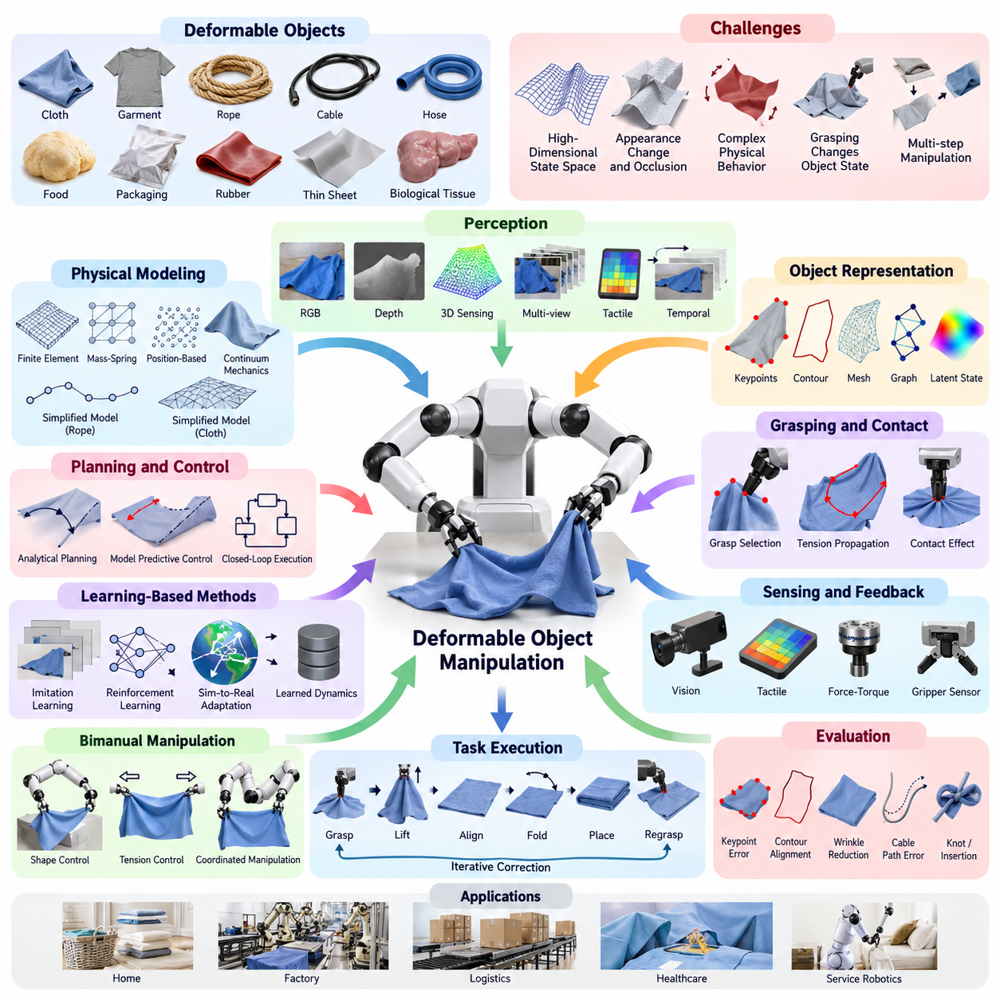
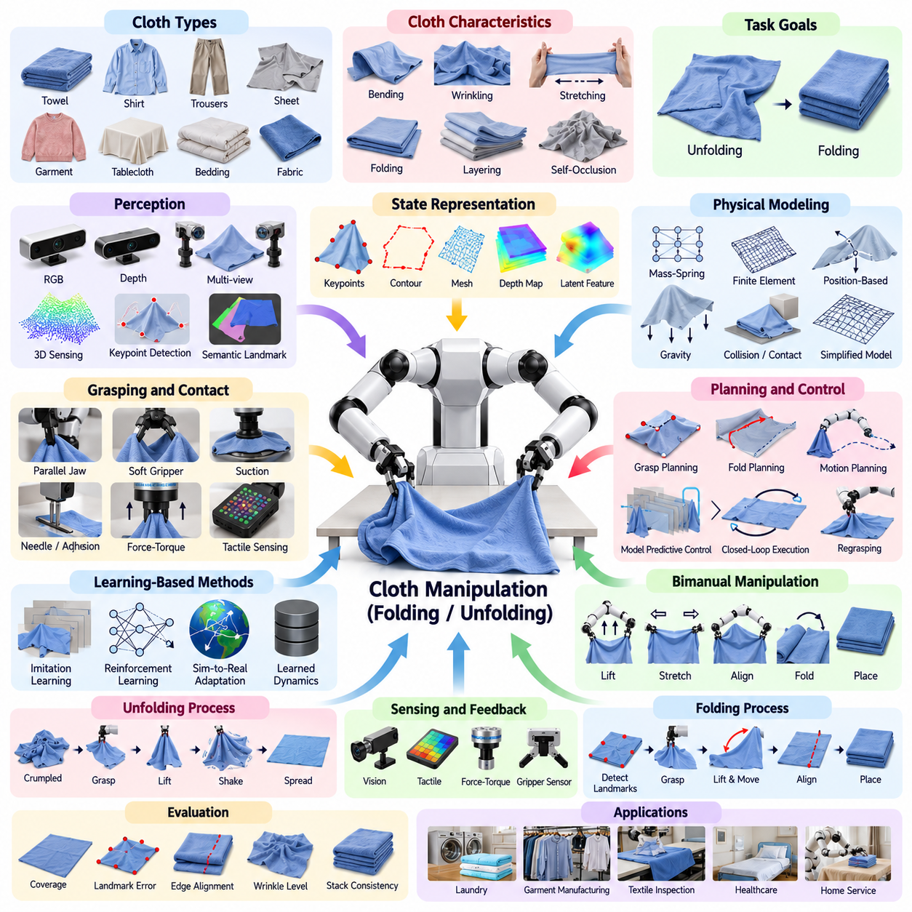
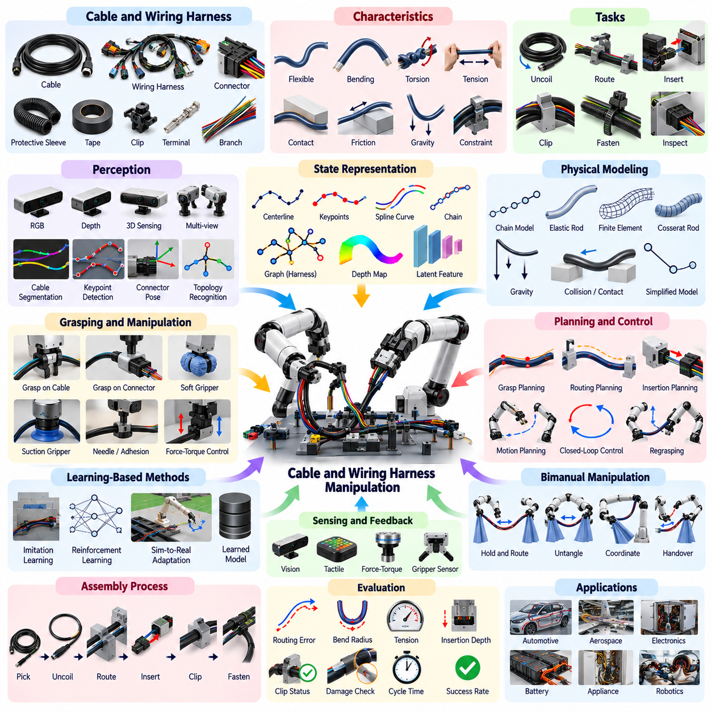
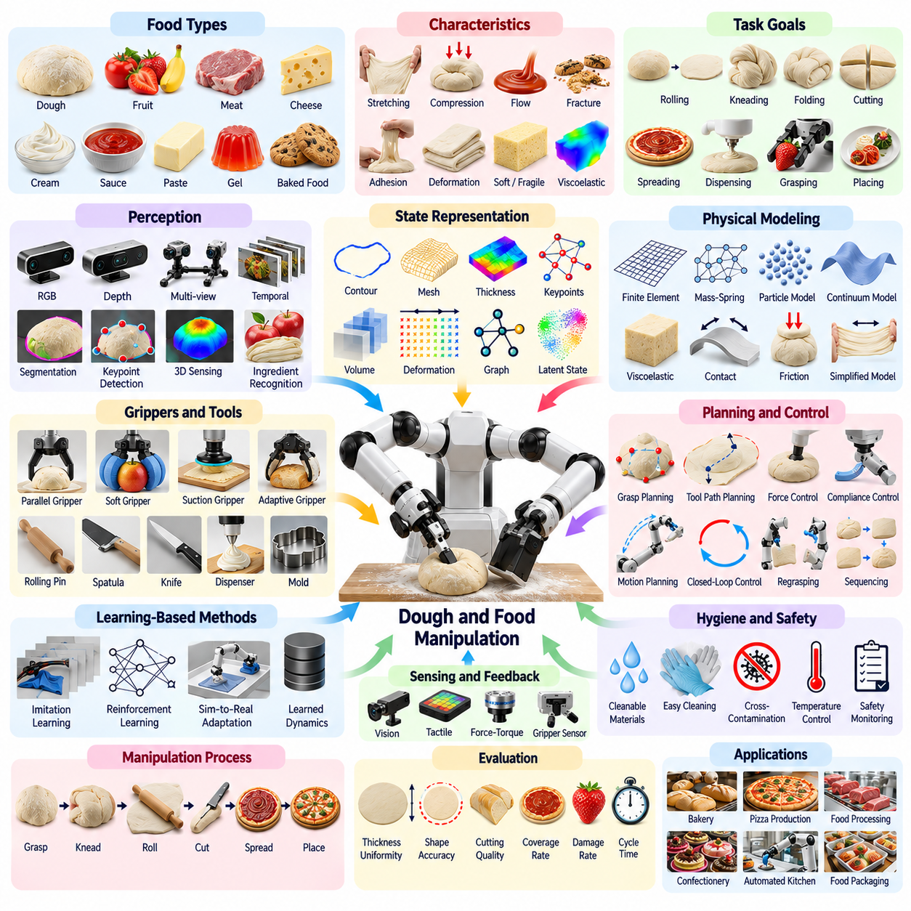
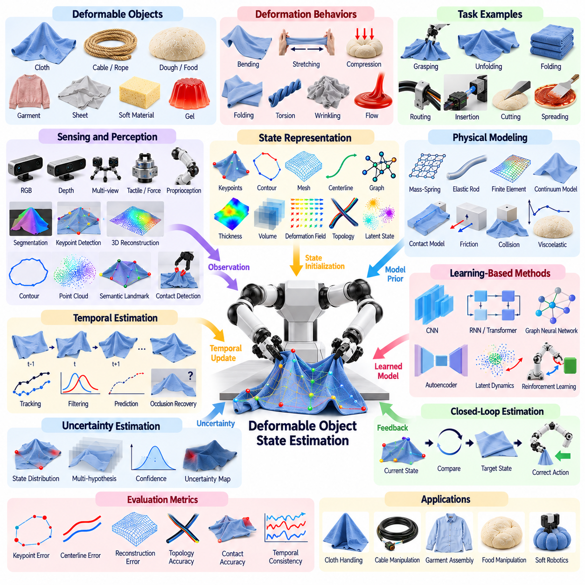
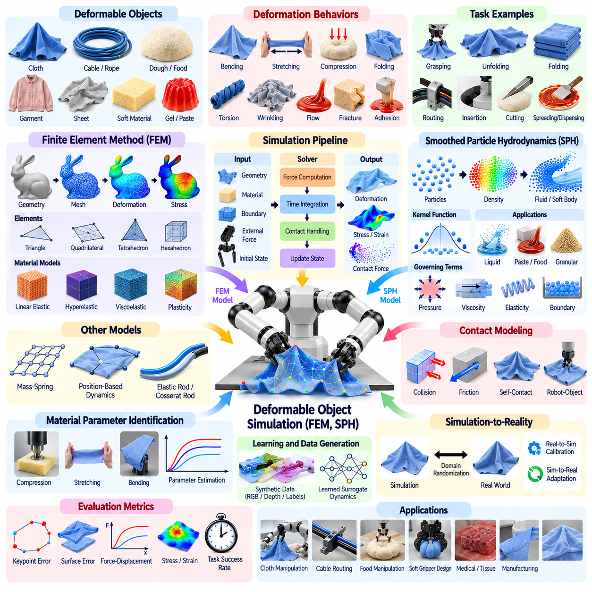
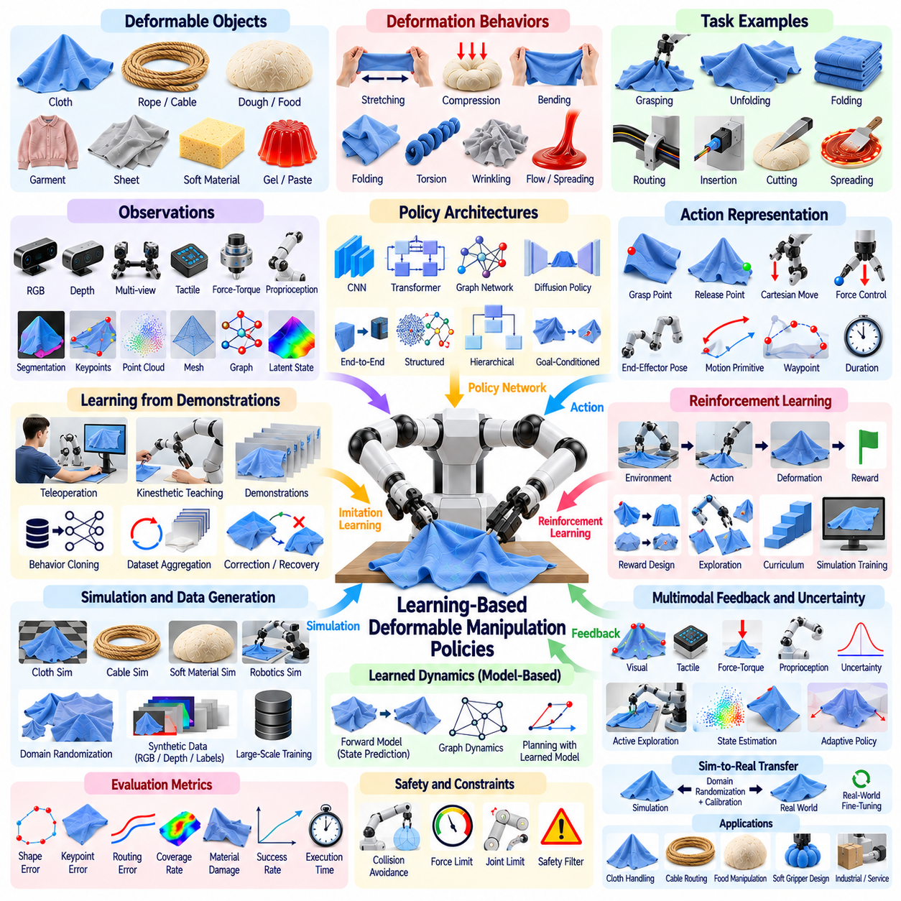
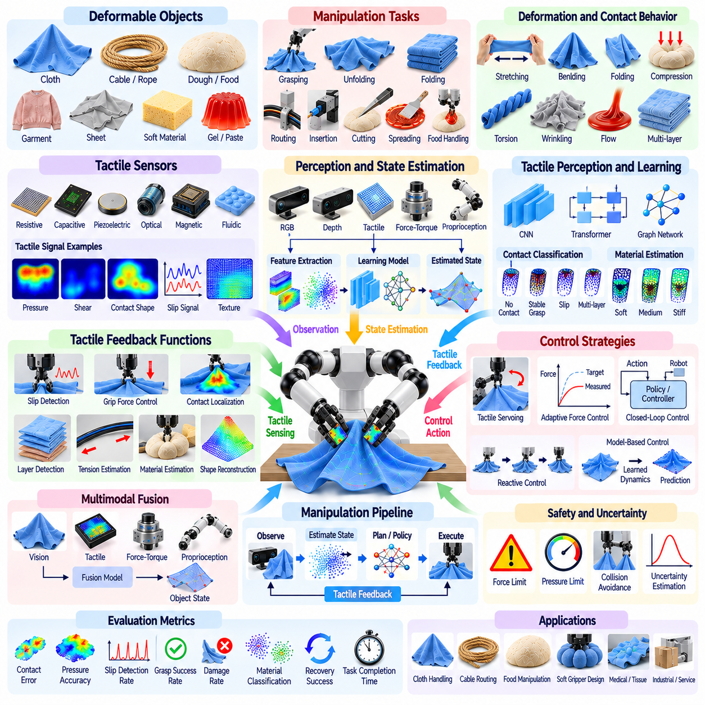
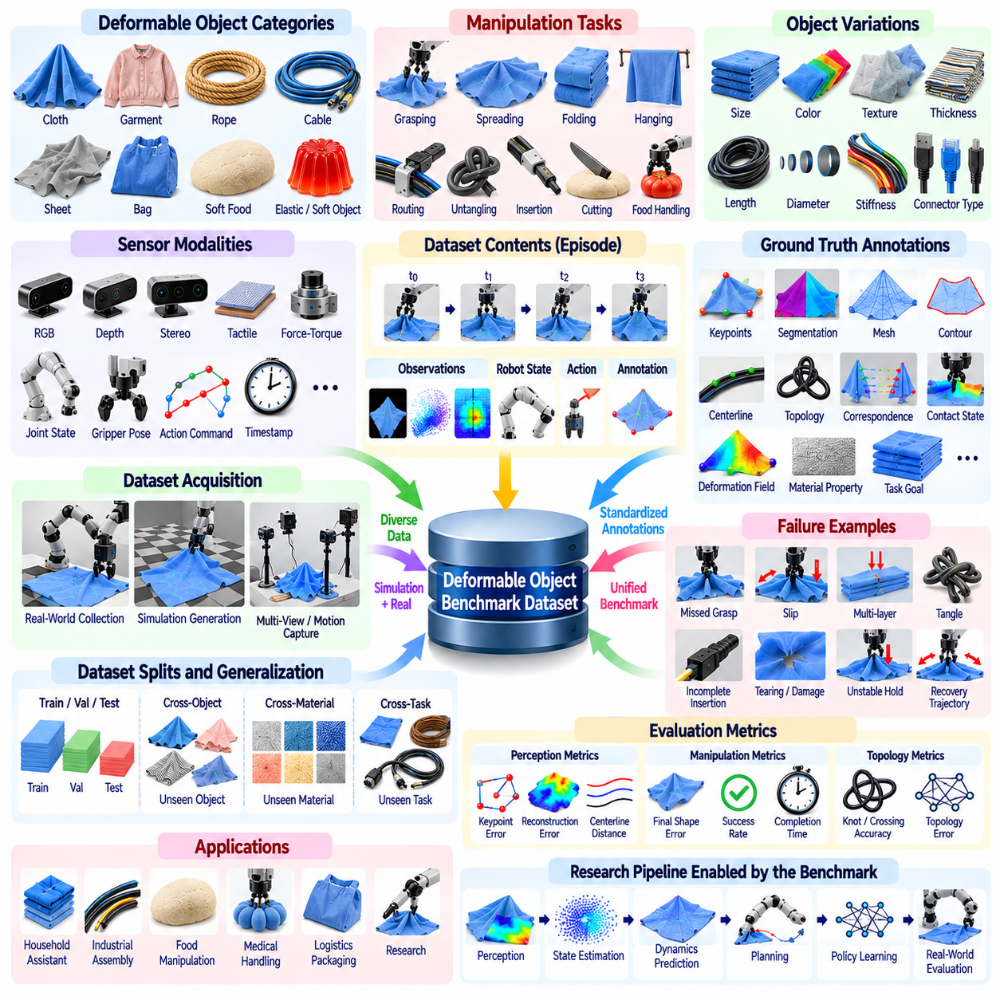
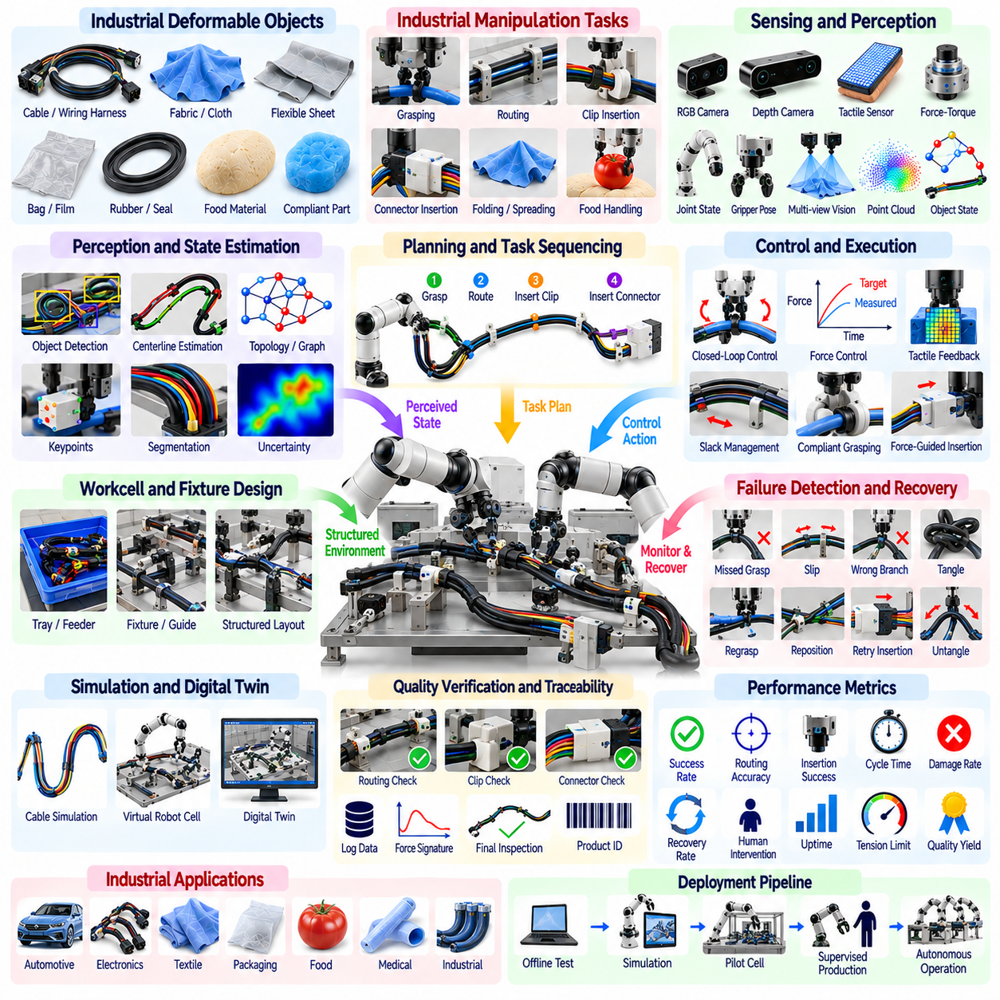

**Volume 17 Manipulation and Grasping AI**

# Chapter 10. Deformable Object Manipulation

## 10.01. Deformable Object Manipulation Challenges and Methods

{width="7.268055555555556in" height="7.268055555555556in"}

변형 가능 물체 조작(Deformable Object Manipulation)은 상호작용 과정에서 형상이 크게 변화하는 물체를 다루는 로보틱스(Robotics)의 도전적인 분야이다. 강체(Rigid Object)와 달리 변형 가능 재료(Deformable Material)는 하나의 6자유도 자세(6-DoF Pose)만으로 신뢰성 있게 표현하기 어렵다. 굽힘(Bending), 신장(Stretching), 비틀림(Twisting), 접힘(Folding), 압축(Compression), 국부 표면 변형(Local Surface Deformation) 등이 발생하므로 인식(Perception), 모델링(Modeling), 계획(Planning), 제어(Control)가 서로 긴밀하게 결합된다.

대표적인 변형 가능 물체(Deformable Object)에는 천(Cloth), 의류(Garment), 로프(Rope), 케이블(Cable), 호스(Hose), 식품(Food Product), 유연 포장재(Flexible Packaging), 고무 부품(Rubber Component), 생체 조직(Biological Tissue), 얇은 시트(Thin Sheet) 등이 있다. 이러한 물체는 가정, 공장, 물류 시설, 의료 환경, 서비스 로봇(Service Robot) 분야에서 빈번하게 등장한다. 물리적 특성이 매우 다양하기 때문에 특정 재료에서 개발된 조작 전략을 다른 재료에 적용하려면 형상, 탄성(Elasticity), 마찰(Friction), 경계 조건(Boundary Condition)에 대한 적응이 필요하다.

근본적인 어려움 중 하나는 매우 높은 차원의 상태 공간(High-Dimensional State Space)이다. 강체는 일반적으로 위치(Position)와 방향(Orientation)으로 표현할 수 있지만, 천은 수천 개 점의 위치가 연속적으로 변화하는 형태로 나타날 수 있다. 모든 자유도(Degree of Freedom)를 명시적으로 추정하는 것은 계산 비용이 높고 항상 필요한 것도 아니다. 따라서 실제 시스템에서는 핵심점(Keypoint), 윤곽선(Contour), 메시(Mesh), 잠재 상태(Latent State), 그래프 구조(Graph Structure), 작업 특화 기하학적 기술자(Task-Specific Geometric Descriptor)와 같은 압축 표현(Compact Representation)을 활용한다.

인식(Perception)은 변형 과정에서 물체의 외관 자체가 변화하기 때문에 특히 어려워진다. 파지(Grasping) 이전에 보이던 특징이 접힘(Fold), 자기 가림(Self-Occlusion), 로봇과의 접촉(Contact)으로 인해 사라질 수 있다. RGB 카메라(RGB Camera)는 풍부한 외관 정보를 제공하고, 깊이 카메라(Depth Camera)와 3차원 센싱(3D Sensing)은 기하학적 구조를 제공한다. 다중 시점(Multiple Viewpoint), 촉각 센싱(Tactile Sensing), 시간적 관측(Temporal Observation)을 결합하면 시각 정보만으로 상태를 판단하기 어려운 상황에서 상태 추정(State Estimation)을 향상시킬 수 있다.

물리 모델링(Physical Modeling) 역시 중요한 과제이다. 변형 가능 물체는 탄성(Elasticity), 강성(Stiffness), 감쇠(Damping), 마찰(Friction), 질량 분포(Mass Distribution), 내부 구조(Internal Structure)에 따라 서로 다른 거동을 나타낸다. 유한요소법(Finite Element Method), 질량-스프링 시스템(Mass-Spring System), 위치 기반 동역학(Position-Based Dynamics), 연속체 역학(Continuum Mechanics) 등의 고전적 모델을 활용할 수 있지만, 정확한 시뮬레이션에는 측정하기 어려운 재료 매개변수(Material Parameter)와 실시간 로봇 제어에 부담이 되는 계산 자원이 요구될 수 있다.

따라서 조작 작업에서 내부 응력(Internal Stress)을 정밀하게 복원할 필요가 없다면 단순화 모델(Simplified Model)이 널리 사용된다. 로프(Rope)는 연결된 선분의 연속으로 표현할 수 있으며, 천(Cloth)은 메시(Mesh) 또는 핵심점(Keypoint)의 집합으로 모델링할 수 있다. 목표는 항상 전체 물리적 거동을 완벽하게 재현하는 것이 아니다. 대신 로봇 행동(Robot Action)이 물체를 원하는 작업 형상(Task Configuration)으로 이동시킬 수 있는지를 예측하는 데 필요한 특성을 모델이 보존하는 것이 중요하다.

변형 가능 물체에서는 파지(Grasp) 자체가 물체의 상태를 변화시키기 때문에 파지 선택(Grasp Selection)이 더욱 복잡하다. 천의 특정 지점을 선택하면 주변 재료가 늘어지고, 접히며, 늘어나는 방식이 결정된다. 마찬가지로 케이블(Cable)의 한 위치를 당기면 장력(Tension)이 전체 길이를 따라 전달될 수 있다. 따라서 조작 계획(Manipulation Planning)은 어느 위치에서 접촉해야 하는지뿐만 아니라 해당 접촉이 물체의 전체 형상(Global Configuration)을 어떻게 변화시킬지도 함께 고려해야 한다.

많은 작업은 단일 픽앤플레이스(Pick-and-Place)가 아니라 연속적인 접촉 전환(Contact Transition)을 필요로 한다. 의류를 접는 작업에서는 모서리 검출, 두 지점 파지, 천 들어 올리기, 가장자리 정렬, 특정 부분 배치, 접촉 해제, 잔여 주름 보정 등이 연속적으로 수행될 수 있다. 케이블 라우팅(Cable Routing)에서는 파지, 당기기, 삽입, 재파지(Regrasping), 장력 유지 등이 요구된다. 따라서 효과적인 시스템은 기하학적 추론(Geometric Reasoning)을 시간적 계획(Temporal Planning) 및 폐루프 실행(Closed-Loop Execution)과 결합한다.

해석적 계획 방법(Analytical Planning Method)은 명시적인 물리 또는 기하학 모델을 이용하여 변형을 예측한다. 추정된 물체 상태와 후보 로봇 행동이 주어지면 계획기(Planner)는 결과 형상을 평가하고 제약 조건을 만족하면서 작업 오차를 감소시키는 행동을 선택한다. 모델 예측 제어(Model Predictive Control)는 새로운 관측이 들어올 때마다 이 과정을 반복적으로 갱신하여 예측된 재료 거동과 실제 거동 사이의 차이를 로봇이 보상하도록 할 수 있다.

정확한 물리 모델을 확보하기 어렵거나 계산 비용이 높은 경우에는 학습 기반 방법(Learning-Based Method)이 대안이 된다. 신경망(Neural Network)은 시연(Demonstration), 시뮬레이션(Simulation), 로봇 상호작용 데이터(Robot Interaction Data)를 통해 시각 관측과 행동으로부터 미래 상태를 예측하는 관계를 학습할 수 있다. 정책(Policy)은 감각 입력에서 직접 행동을 선택하거나 학습된 동역학 모델(Learned Dynamics Model)을 이용하여 계획을 수행할 수 있으며, 물리 매개변수가 크게 변화하는 재료에 특히 유용하다.

모방 학습(Imitation Learning)은 인간 시연(Human Demonstration)이나 원격조작 로봇 궤적(Teleoperated Robot Trajectory)으로부터 조작 전략을 획득할 수 있다. 시연은 모든 변형 메커니즘을 명시적으로 프로그래밍하지 않고도 유용한 파지 위치, 운동 패턴(Motion Pattern), 중간 형상(Intermediate Configuration)을 제공한다. 그러나 성공적인 일반화를 위해서는 학습 정책이 제한된 시연을 단순히 재현하지 않도록 물체 형상, 재료 특성, 초기 형상, 작업 조건에 충분한 다양성을 포함해야 한다.

강화학습(Reinforcement Learning)은 반복적인 상호작용과 작업 지향 보상(Task-Oriented Reward)을 통해 조작 행동을 최적화할 수 있다. 바람직한 중간 행동을 사람이 직접 정의하기 어려운 경우 유용하지만, 실제 로봇에서 직접 학습하면 시간과 비용이 크게 증가할 수 있다. 따라서 경험 생성에는 시뮬레이션이 자주 사용되며, 불완전한 변형체 모델에서 발생하는 시뮬레이션-현실 격차(Sim-to-Real Gap)를 줄이기 위해 도메인 무작위화(Domain Randomization), 시스템 식별(System Identification), 적응(Adaptation) 기법이 필요하다.

그래프 기반 표현(Graph-Based Representation)은 많은 변형 가능 물체가 본질적으로 서로 연결된 요소로 구성되기 때문에 특히 적합하다. 노드(Node)는 천의 점, 로프 구간, 표면 특징 등을 나타내고, 에지(Edge)는 국부적인 물리적 관계를 표현할 수 있다. 그래프 신경망(Graph Neural Network)은 이러한 구조를 따라 정보를 전파하면서 국부적인 힘이 멀리 떨어진 영역에 어떤 영향을 주는지를 학습할 수 있다. 이러한 관계형 모델(Relational Model)은 중요한 공간적 연결성을 유지하면서 변형을 압축적으로 예측할 수 있다.

파운데이션 모델(Foundation Model)과 비전-언어-행동 시스템(Vision-Language-Action System)은 추가적인 의미론적 추론(Semantic Reasoning) 능력을 제공한다. 로봇은 의류에 소매가 있고, 수건에 모서리가 있으며, 케이블이 지정된 가이드(Guide)를 통과해야 한다는 사실을 이해할 수 있다. 의미론적 이해(Semantic Understanding)는 작업 관련 부분을 식별하고 상위 수준 명령을 해석함으로써 기하학 및 물리 모델을 보완하지만, 신뢰성 높은 실행을 위해서는 연속적인 변형과 접촉 동역학(Contact Dynamics)을 처리할 수 있는 하위 수준의 인식 및 제어가 여전히 필요하다.

촉각 센싱(Tactile Sensing)은 시각 인식만으로 접촉 상태를 판단하기 어려울 때 중요한 역할을 한다. 힘-토크 센서(Force-Torque Sensor), 촉각 배열(Tactile Array), 그리퍼 센서(Gripper Sensor)는 장력, 미끄러짐(Slippage), 접촉 위치, 재료 저항(Material Resistance)을 추정할 수 있다. 케이블 삽입이나 천 조작에서는 이러한 측정을 통해 시각적으로 관찰하기 어려운 상태를 감지할 수 있으며, 시각 및 촉각 피드백(Visual-Tactile Feedback)을 결합하면 불확실한 재료 특성에서도 더욱 강건한 폐루프 조작이 가능해진다.

양팔 조작(Bimanual Manipulation)은 두 개의 접촉점을 통해 형상, 장력, 방향을 직접 제어할 수 있기 때문에 유용한 경우가 많다. 두 로봇 팔은 천을 펼치거나 가장자리를 정렬하고, 케이블의 양 끝을 조작하거나, 한 영역을 안정적으로 고정하면서 다른 영역을 재배치할 수 있다. 두 매니퓰레이터(Manipulator)를 동시에 조정하면 계획 복잡도는 증가하지만, 매우 유연한 재료에서는 단일 로봇 팔보다 조작성(Controllability)을 크게 향상시킬 수 있다.

작업 성공 여부는 강체의 자세 오차(Pose Error)만으로 평가하기보다 변형 특성에 적합한 표현을 사용해야 한다. 유용한 평가 지표에는 핵심점 거리(Keypoint Distance), 윤곽 정렬(Contour Alignment), 피복 면적(Coverage Area), 주름 감소(Wrinkle Reduction), 케이블 경로 오차(Cable Path Error), 매듭 상태(Knot State), 삽입 완료 여부(Insertion Completion), 목표 형상과의 유사도 등이 있다. 산업 응용에서는 사이클 타임(Cycle Time), 신뢰성(Reliability), 손상 방지(Damage Avoidance), 반복성(Repeatability), 예상치 못한 변형에 대한 복구 성능(Recovery Performance)도 중요하다.

강건한 조작(Robust Manipulation)은 궁극적으로 인식, 예측(Prediction), 계획, 제어의 폐루프 통합(Closed-Loop Integration)에 의존한다. 파지 위치, 마찰, 재료 특성에서 발생하는 작은 오차가 큰 형상 차이를 만들어낼 수 있기 때문에 개루프 궤적(Open-Loop Trajectory)은 취약하다. 유능한 로봇은 변형 상태를 지속적으로 관찰하고, 진행 과정이 예상과 일치하는지 판단하며, 행동을 수정하고 필요하면 재파지한다. 이러한 피드백(Feedback)은 불확실한 조작 과정을 반복적인 보정 과정(Iterative Correction Process)으로 전환한다.

장기적인 목표는 모든 유연 재료를 완벽하게 설명하는 하나의 범용 물리 모델(Universal Physics Model)을 구축하는 것이 아니라, 이전에 경험하지 못한 변형 가능 물체까지 신뢰성 있게 조작할 수 있는 로봇 시스템을 개발하는 것이다. 최근의 발전은 물리적 사전지식(Physical Prior), 기하학적 표현(Geometric Representation), 학습 동역학(Learned Dynamics), 다중모달 센싱(Multimodal Sensing), 의미론적 추론, 적응 제어(Adaptive Control)를 결합하는 하이브리드 접근법(Hybrid Approach)을 중심으로 이루어지고 있다. 이러한 통합을 통해 로봇은 물체가 무엇인지뿐만 아니라 상호작용 과정에서 그 형상이 어떻게 변화할 것인지까지 함께 추론할 수 있다.

## 10.02. Cloth Manipulation Folding Unfolding [w/Code]

{width="7.268055555555556in" height="7.268055555555556in"}

천 조작(Cloth Manipulation)은 직물(Fabric)이 취급 과정에서 굽힘(Bending), 접힘(Folding), 주름(Wrinkling), 신장(Stretching), 자기 가림(Self-Occlusion)을 일으킬 수 있기 때문에 대표적인 변형 가능 물체(Deformable Object) 문제이다. 강체(Rigid Object)와 달리 천은 파지(Grasping) 이후에도 고정된 형상을 유지하지 않는다. 따라서 접기(Folding)와 펼치기(Unfolding)를 위해서는 분산된 형상 상태를 추정하고, 작업 관련 영역을 식별하며, 접촉으로 발생하는 변형을 예측하고, 감각 피드백(Sensory Feedback)을 통해 조작 오차를 지속적으로 보정해야 한다.

천의 상태(Cloth State)는 모서리(Corner), 가장자리(Edge), 윤곽선(Contour), 핵심점(Keypoint), 표면 메시(Surface Mesh), 깊이 맵(Depth Map), 학습된 잠재 특징(Learned Latent Feature) 등을 사용하여 표현할 수 있다. 실제 조작에서 모든 직물 지점을 완전히 복원할 필요는 거의 없다. 대신 현재 작업과 관련하여 천이 펼쳐져 있는지, 접혀 있는지, 꼬여 있는지, 부분적으로 가려져 있는지, 또는 파지점에서 매달려 있는지를 표현할 수 있어야 한다.

시각 인식(Visual Perception)은 천의 형상을 식별하기 위한 핵심 정보를 제공한다. RGB 영상(RGB Image)은 질감(Texture), 색상(Color), 솔기(Seam), 의류 특징(Garment Feature)을 제공하며, 깊이 센싱(Depth Sensing)은 표면 형상을 추정하고 충분한 깊이 차이가 존재할 경우 겹쳐진 층을 구분하는 데 도움을 준다. 다중 시점 카메라(Multi-View Camera)는 자기 가림으로 인한 모호성을 줄이며, 로봇이 천을 들어 올리거나 펼칠 때 관측되는 영역의 움직임을 이용하면 숨겨진 영역에 대한 추가적인 정보를 얻을 수 있다.

핵심점 검출(Keypoint Detection)은 수건, 셔츠, 바지, 직사각형 시트와 같이 구조화된 직물에서 특히 유용하다. 모서리, 소매(Sleeve), 칼라(Collar), 허리선(Waistline) 등의 의미론적 랜드마크(Semantic Landmark)를 사용하면 전체 표면을 복원하지 않고도 조작 목표를 정의할 수 있다. 학습 기반 검출기(Learned Detector)는 영상에서 이러한 랜드마크를 직접 추정할 수 있지만 심한 주름이나 가림에서는 여전히 어려움이 존재한다. 따라서 검출 결과에는 신뢰도(Confidence)를 함께 사용하여 불확실한 관측이 추가적인 인식 행동을 유도하도록 하는 것이 바람직하다.

펼치기(Unfolding)는 먼저 천이 구겨져 있는지, 부분적으로 접혀 있는지, 매달려 있는지, 또는 이미 펼쳐져 있는지를 판단하는 과정에서 시작한다. 로봇은 노출된 지점을 파지하고 재료를 들어 올린 후 중력(Gravity)을 이용하여 겹쳐진 층을 분리할 수 있다. 흔들기(Shaking) 또는 제어된 횡방향 운동을 이용하면 접힘을 추가적으로 감소시킬 수 있다. 이후 형상을 다시 관측하여 새로운 파지점을 선택하고 충분한 표면 범위나 랜드마크 가시성이 확보될 때까지 이 과정을 반복할 수 있다.

중력(Gravity)은 천 조작에서 유용한 물리적 사전지식(Physical Prior)이다. 직물을 들어 올리면 지지되지 않는 영역은 자연스럽게 아래쪽으로 늘어지므로 형상 추정의 일부가 단순해지고 지지 표면과의 복잡한 접촉도 감소한다. 로봇은 이러한 특성을 매달림 상태 조작(Hanging-State Manipulation)에 활용할 수 있으며, 하나 또는 두 개의 파지점에서 천을 매달아 관측할 수 있다. 이러한 중간 상태(Intermediate State)는 구겨진 상태에서 숨겨져 있던 모서리나 가장자리를 노출하는 데 효과적이다.

접기(Folding)는 천을 원하는 최종 형상으로 변환해야 하기 때문에 더욱 정밀한 기하학적 제어(Geometric Control)를 요구한다. 단순한 수건 접기 작업도 서로 반대편의 모서리를 검출하고, 목표 접힘선(Fold Line)을 정렬하고, 적절한 지점을 파지하고, 이동할 영역을 들어 올리고, 접힘 경계를 넘어 이동시킨 후 정확한 위치에 배치하는 과정을 요구할 수 있다. 어느 단계에서든 발생한 오차는 누적되어 가장자리 불일치나 불필요한 주름으로 이어질 수 있다.

접기 계획(Fold Planning)은 목표선(Target Line), 대칭 관계(Symmetry Relationship), 핵심점 대응(Keypoint Correspondence), 목표 표면 영역(Desired Surface Region)을 이용하여 표현할 수 있다. 모든 천 입자의 움직임을 계산하는 대신 계획기(Planner)는 선택된 랜드마크가 이동해야 하는 위치를 정의할 수 있다. 이후 접기는 초기 핵심점 형상과 목표 핵심점 형상 사이의 변환으로 표현되고, 운동 계획기(Motion Planner)는 원하는 변형을 근사적으로 실현하는 충돌 회피 매니퓰레이터 궤적(Collision-Free Manipulator Trajectory)을 생성한다.

단일 로봇 팔 시스템(Single-Arm System)은 지지 테이블이 수동적인 안정화 기능을 제공하는 경우 순차적인 픽앤플레이스(Pick-and-Place)를 통해 다양한 접기 작업을 수행할 수 있다. 그러나 하나의 그리퍼(Gripper)만으로는 자유 공간 운동 중 천의 방향과 장력을 제어하는 데 한계가 있다. 직물이 회전하거나 늘어지고 의도하지 않은 접힘이 발생할 수 있다. 재파지(Regrasping)와 중간 배치(Intermediate Placement)를 통해 이러한 한계를 보완할 수 있지만 실행 시간이 증가하고 인식 오차에 더욱 민감해진다.

양팔 조작(Bimanual Manipulation)은 천의 형상을 더욱 강력하게 제어할 수 있다. 두 개의 그리퍼는 서로 다른 랜드마크를 잡고 장력을 조절하며, 가장자리를 정렬하고, 표면을 펼치고, 접기 동작을 협조적으로 수행할 수 있다. 펼치기 과정에서는 두 팔 사이의 거리를 증가시켜 표면 범위를 넓히고 숨겨진 영역을 노출할 수 있다. 접기 과정에서는 한 팔이 천의 일부를 안정적으로 유지하면서 다른 팔이 다른 영역을 이동시키거나, 두 팔이 동기화된 궤적(Synchronized Trajectory)을 수행하여 정렬 상태를 유지할 수 있다.

장력(Tension)은 세심하게 제어해야 한다. 과도한 당김은 섬세한 직물을 늘어나게 하거나 이미 정렬된 영역을 이동시키고 그리퍼에서 미끄러짐(Slippage)을 발생시킬 수 있다. 반대로 장력이 부족하면 처짐(Sagging)과 예측하기 어려운 접힘이 발생한다. 천 형상에 대한 시각적 추정과 힘(Force), 토크(Torque), 촉각 측정(Tactile Measurement)을 결합하면 직물이 팽팽한지, 미끄러지고 있는지, 예상하지 못한 저항을 받고 있는지를 추정할 수 있으며, 이를 통해 고정 궤적이 아닌 적응형 운동(Adaptive Motion)을 구현할 수 있다.

그리퍼 설계(Gripper Design)는 조작 신뢰성에 큰 영향을 미친다. 평행 조 그리퍼(Parallel-Jaw Gripper)는 구조가 단순하고 널리 사용되지만 얇은 층을 파지하거나 의도하지 않은 다중 층 파지(Multilayer Grasping)를 방지하는 데 어려움이 있을 수 있다. 소프트 그리퍼(Soft Gripper)는 직물 형상에 순응하면서 손상을 줄일 수 있으며, 흡착 시스템(Suction System)은 접근 가능한 가장자리가 없어도 노출된 표면을 획득할 수 있다. 특수 섬유 그리퍼(Specialized Textile Gripper)는 재료와 응용 요구사항에 따라 바늘(Needle), 정전 접착(Electroadhesion), 분산 접촉(Distributed Contact) 등을 사용할 수 있다.

층 분리(Layer Separation)는 실제 시스템에서 중요한 문제이다. 하나의 직물 층만 파지하려는 로봇이 실수로 여러 층을 함께 잡으면 펼치기를 방해하거나 잘못된 접힘을 생성할 수 있다. 깊이 센싱만으로는 밀접하게 겹쳐진 층을 신뢰성 있게 구분하기 어려울 수 있다. 촉각 센싱(Tactile Sensing), 제어된 탐침(Controlled Probing), 파지력 분석(Grasp-Force Analysis), 작은 탐색 운동(Exploratory Motion)을 활용하면 시스템이 더 큰 조작 행동을 수행하기 전에 파지 두께와 접촉 상태에 대한 추가 정보를 확보할 수 있다.

고전적인 천 모델(Classical Cloth Model)에는 질량-스프링 시스템(Mass-Spring System), 유한요소법(Finite-Element Method), 위치 기반 동역학(Position-Based Dynamics) 등이 있다. 이러한 모델은 굽힘, 신장, 중력, 충돌(Collision), 접촉(Contact)을 시뮬레이션할 수 있지만 정확한 매개변수는 직물 종류에 따라 크게 달라진다. 면(Cotton), 데님(Denim), 실크(Silk), 타월(Towel), 합성섬유(Synthetic Material)는 서로 다른 강성(Stiffness), 마찰(Friction), 두께(Thickness), 감쇠(Damping) 특성을 나타낸다. 로봇 계획에서는 실시간으로 처리하기 어려운 고정밀 모델보다 근사 모델(Approximate Model)이 더 실용적인 경우가 많다.

학습 기반 접근법(Learning-Based Approach)은 명시적인 재료 모델에 대한 의존성을 줄일 수 있다. 정책(Policy)은 시연(Demonstration), 시뮬레이션(Simulation), 자율 로봇 경험(Autonomous Robot Experience)을 이용하여 접기와 펼치기 행동을 학습할 수 있다. 시각 관측은 파지점과 행동으로 직접 매핑될 수 있으며, 학습된 순방향 모델(Learned Forward Model)은 조작 이후 천의 형상이 어떻게 변화할지를 예측할 수 있다. 크고 다양한 학습 데이터셋(Training Dataset)은 초기 상태, 직물 크기, 질감, 재료 특성 변화에 대한 일반화 성능을 향상시킨다.

모방 학습(Imitation Learning)은 인간 또는 원격조작 시연(Teleoperated Demonstration)으로부터 복잡한 접기 순서를 획득하는 데 특히 적합하다. 시연은 인식된 랜드마크, 파지 선택, 협조적인 로봇 팔 움직임 사이의 관계를 제공할 수 있다. 그러나 모든 천의 형상이 서로 다르기 때문에 시연된 궤적을 그대로 재현하는 것만으로는 충분하지 않다. 성공적인 정책은 조작의 근본적인 목표를 추론하고 시연에서 획득한 전략을 현재 관측된 직물 상태에 맞게 적응시켜야 한다.

강화학습(Reinforcement Learning)은 펼치기 과정에서 표면 범위 증가 또는 접기 과정에서 핵심점 오차 감소와 같은 작업 특화 보상(Task-Specific Reward)을 사용하여 천 조작을 최적화할 수 있다. 시뮬레이션에서 학습하면 하드웨어 손상이나 작업자 시간 소모 없이 대규모 상호작용을 수행할 수 있다. 도메인 무작위화(Domain Randomization)를 이용하여 마찰, 강성, 크기, 카메라 조건, 파지 불확실성을 변화시키면 특정 시뮬레이션 직물 모델에 대한 정책의 의존성을 줄일 수 있다.

폐루프 제어(Closed-Loop Control)는 천의 거동을 정확하게 예측하기 어렵기 때문에 필수적이다. 각각의 파지, 들어 올리기, 끌기(Dragging), 접기, 배치 행동 이후 로봇은 결과 형상을 관측하고 의도된 상태와 비교해야 한다. 가장자리가 잘못 정렬되거나 접힘이 잘못 형성된 경우 시스템은 잘못된 순서를 그대로 진행하는 대신 보정 행동(Corrective Action)을 수행할 수 있다. 이러한 인식-행동 순환(Perception-Action Cycle)은 순수한 개루프 실행(Open-Loop Execution)에 비해 신뢰성을 크게 향상시킨다.

능동 인식(Active Perception)은 로봇이 관측을 개선하기 위한 목적으로 천을 직접 조작함으로써 불확실성을 더욱 줄일 수 있다. 모서리를 들어 올리면 숨겨진 층이 노출될 수 있고, 매달린 의류를 회전시키면 의미론적 랜드마크를 확인할 수 있으며, 두 그리퍼 사이에서 직물을 펼치면 형상 추정이 단순해질 수 있다. 따라서 인식과 조작은 서로 독립적인 과정이 아니며, 물리적 상호작용을 통해 모호한 시각 상태를 의도적으로 해석하기 쉬운 상태로 변환할 수 있다.

작업 평가는 기하학적 정확도(Geometric Accuracy)뿐만 아니라 실제 활용 가능성(Practical Usability)도 반영해야 한다. 펼치기 성능은 가시 표면 범위(Visible Surface Coverage), 정규화 면적(Normalized Area), 모서리 검출 신뢰도, 완전히 펼쳐진 상태와의 유사도로 측정할 수 있다. 접기는 랜드마크 정렬(Landmark Alignment), 가장자리 중첩(Edge Overlap), 접힘선 정확도(Fold-Line Accuracy), 최종 점유 면적(Final Footprint), 주름 수준(Wrinkle Level), 적층 일관성(Stack Consistency) 등을 통해 평가할 수 있다. 생산 시스템에서는 사이클 타임(Cycle Time), 성공률(Success Rate), 복구 능력(Recovery Capability), 직물 손상 여부도 함께 고려해야 한다.

산업 응용(Industrial Application)에는 세탁 자동화(Laundry Automation), 의류 제조(Garment Manufacturing), 섬유 검사(Textile Inspection), 포장(Packaging), 병원 린넨 처리(Hospital Linen Handling), 물류(Logistics) 등이 포함된다. 가정용 로봇(Household Robot)은 향후 의류 접기, 침구 정리, 수건 조작 등을 수행할 수 있으며, 산업 시스템에서는 다양한 재료 변화에도 예측 가능한 처리량(Throughput)이 요구된다. 이러한 환경은 서로 크게 다르지만 모두 세심하게 준비된 초기 상태에서만 성공하는 것이 아니라 불확실한 상태에서도 신뢰성 있게 인식하고 조작하는 능력을 요구한다.

강건한 천 조작 구조(Robust Cloth-Manipulation Architecture)는 따라서 시각 및 촉각 인식(Visual and Tactile Perception), 작업 지향 상태 표현(Task-Oriented State Representation), 파지 계획(Grasp Planning), 변형 예측(Deformation Prediction), 양팔 협조(Bimanual Coordination), 반복 피드백(Iterative Feedback)을 통합해야 한다. 접기와 펼치기는 사전에 결정된 로봇 궤적의 실행이 아니라 일련의 상태 전이(State Transition) 과정으로 다루어야 한다. 로봇은 관측(Observe), 행동(Act), 평가(Evaluate), 보정(Correct)을 반복함으로써 불확실성이 높은 직물 형상을 점진적으로 제어 가능한 작업 특화 상태(Task-Specific State)로 변환할 수 있다.

## 10.03. Cable Wiring Harness Manipulation [w/Code]

{width="7.268055555555556in" height="7.268055555555556in"}

케이블 및 와이어링 하니스 조작(Cable and Wiring Harness Manipulation)은 길고 유연한 부품이 파지(Grasping), 운반(Transport), 라우팅(Routing), 연결(Connection) 과정에서 지속적으로 형상을 변화시키기 때문에 로봇 조립(Robotic Assembly)에서 중요한 변형 가능 물체(Deformable Object) 문제이다. 강체(Rigid Part)와 달리 케이블은 하나의 위치와 방향만으로 표현할 수 없다. 케이블의 형상은 분산된 곡률(Curvature), 비틀림(Torsion), 장력(Tension), 접촉(Contact), 중력(Gravity), 마찰(Friction), 그리고 커넥터, 클립, 채널 및 주변 구조물에 의해 형성되는 제약 조건에 따라 결정된다.

산업용 와이어링 하니스(Industrial Wiring Harness)는 유연한 와이어(Flexible Wire)에 반강체 커넥터(Semi-Rigid Connector), 분기(Branch), 보호 슬리브(Protective Sleeve), 테이프(Tape), 단자(Terminal), 체결 요소(Fastening Element)가 결합되므로 특히 다루기 어렵다. 자동차, 항공우주, 전자제품, 배터리, 가전제품, 로봇 시스템에는 다양한 강성 특성을 가진 다수의 분기로 구성된 하니스가 사용될 수 있다. 따라서 조작 시스템은 연속적인 유연 구간과 정밀한 조립이 필요한 개별 기능 부품을 동시에 추론해야 한다.

케이블 상태(Cable State)는 중심선(Centerline), 순서가 지정된 핵심점(Ordered Keypoint), 스플라인 곡선(Spline Curve), 분할 체인(Segmented Chain), 그래프(Graph), 학습된 잠재 표현(Learned Latent Representation)을 이용하여 나타낼 수 있다. 단순한 케이블에서는 중심선만으로 전체 형상을 충분히 표현할 수 있지만, 분기된 하니스는 접합점(Junction), 끝점(Endpoint), 커넥터(Connector), 유연 에지(Flexible Edge)를 포함하는 그래프로 자연스럽게 표현할 수 있다. 작업 특화 표현(Task-Specific Representation)은 라우팅, 삽입, 체결, 검사에 필요한 정보를 유지하면서 계산 복잡도를 감소시킨다.

시각 인식(Visual Perception)은 유연한 케이블 본체뿐만 아니라 커넥터, 단자, 분기점(Branch Point), 클립(Clip), 라우팅 채널(Routing Channel)과 같은 작업 핵심 특징도 검출해야 한다. RGB 카메라(RGB Camera)는 외관 및 의미 정보를 제공하고, 깊이 카메라(Depth Camera), 스테레오 또는 3차원 센서(3D Sensor)는 공간 기하학을 추정한다. 케이블은 서로 겹치거나 고정구(Fixture) 뒤로 사라져 가림(Occlusion)이 자주 발생하므로 신뢰성 있는 상태 복원을 위해 다중 시점 센싱(Multi-View Sensing)이 중요하다.

케이블 분할(Cable Segmentation)은 와이어가 가늘거나 반사성이 높고, 어둡거나 질감이 없으며, 배경과 시각적으로 유사할 때 어려워진다. 자기 교차(Self-Crossing)와 케이블 묶음(Bundle)은 영상에서의 교차가 실제 물리적 연결을 의미하지 않을 수 있기 때문에 추가적인 모호성을 발생시킨다. 시간적 추적(Temporal Tracking)은 로봇이 케이블을 움직이는 동안 케이블의 정체성을 유지하는 데 도움을 준다. 분할 결과를 기하학적 연속성(Geometric Continuity), 깊이, 끝점 검출(Endpoint Detection), 알려진 하니스 토폴로지(Harness Topology)와 결합하면 복원 신뢰성을 크게 향상시킬 수 있다.

커넥터(Connector)는 일반적으로 케이블 본체보다 단단하고 시각적으로 구별하기 쉬우므로 유용한 의미론적 기준점(Semantic Anchor)을 제공한다. 커넥터의 6자유도 자세(6-DoF Pose)를 추정하면 유연 구간을 별도로 표현하면서 정밀한 삽입 계획(Insertion Planning)을 수행할 수 있다. 와이어링 하니스에서는 여러 커넥터와 분기점을 기준 노드(Reference Node)로 활용하여 어떤 케이블 구간이 어느 목적지에 연결되는지, 그리고 어떠한 조립 순서가 필요한지를 추론할 수 있다.

파지 계획(Grasp Planning)은 즉각적인 접촉 안정성뿐만 아니라 케이블 전체에서 발생하는 변형도 고려해야 한다. 커넥터 근처를 파지하면 삽입을 정밀하게 제어할 수 있지만 나머지 케이블은 제약되지 않은 상태로 남을 수 있다. 더 먼 위치를 파지하면 장력이나 라우팅 형상을 조절할 수 있지만 커넥터를 직접 제어하는 능력은 감소한다. 따라서 효과적인 조작 시스템은 현재 작업에 따라 파지점을 선택하고 커넥터 중심 파지(Connector-Oriented Grasp)와 케이블 중심 파지(Cable-Oriented Grasp)를 의도적으로 전환할 수 있어야 한다.

장력(Tension)은 케이블 조작에서 핵심적인 변수이다. 과도한 장력은 도체(Conductor), 커넥터, 절연재(Insulation), 체결 지점을 손상시킬 수 있으며, 장력이 부족하면 루프(Loop), 엉킴(Tangle), 부정확한 라우팅이 발생할 수 있다. 로봇은 위치 제어(Position Control)에 힘, 토크 또는 촉각 피드백(Tactile Feedback)을 결합하여 작업에 적합한 범위에서 장력을 유지해야 한다. 제어된 장력은 형상 불확실성을 줄이고 케이블의 기하학적 형태를 더욱 예측 가능하게 만들어 인식 과정도 단순화할 수 있다.

라우팅(Routing)은 장애물과 체결 제약 조건을 만족하면서 케이블이 원하는 3차원 경로를 따라가도록 하는 작업이다. 목표 경로는 일련의 경유점(Waypoint), 채널(Channel), 클립, 가이드(Guide), 고정구 위치(Fixture Location)로 표현할 수 있다. 로봇은 초기 위치에서 최종 커넥터까지 한 번에 이동하는 대신 케이블을 중간 가이드에 순차적으로 삽입하여 조립이 진행될수록 남아 있는 자유도(Degree of Freedom)를 점진적으로 감소시킬 수 있다.

접촉이 많은 라우팅(Contact-Rich Routing)은 고정구 및 표면과의 복잡한 상호작용을 발생시킨다. 케이블은 패널을 따라 미끄러지거나, 장애물 주위를 굽어 지나가거나, 클립에 끼워지거나, 좁은 가이드를 통과할 수 있다. 마찰과 국부 강성(Local Stiffness)은 이러한 작업에 큰 영향을 준다. 작은 기하학적 오차도 걸림(Jamming), 과도한 힘, 의도하지 않은 케이블 이동을 발생시킬 수 있으므로 접촉 결과를 관측하지 않는 사전 결정 궤적보다 폐루프 제어(Closed-Loop Control)가 적합하다.

커넥터 삽입(Connector Insertion)은 변형 가능 물체 조작과 정밀 강체 조립(Precision Rigid-Body Assembly)이 결합된 작업이다. 연결된 케이블에서 발생하는 힘이 커넥터의 자세를 교란하는 상황에서도 커넥터의 위치와 방향을 정확하게 맞춰야 한다. 시각 서보잉(Visual Servoing)은 대략적인 정렬을 수행하고, 힘-토크 센싱(Force-Torque Sensing)은 소켓(Socket)과의 접촉을 검출할 수 있다. 이후 순응 제어(Compliance Control)를 통해 작은 위치 오차를 허용하면서 핀(Pin), 실(Seal), 잠금 구조(Locking Structure)를 손상시킬 정도의 힘을 가하지 않고 결합 형상을 탐색할 수 있다.

클립 삽입(Clip Insertion)과 체결(Fastening)은 커넥터 결합과는 다른 전략을 요구한다. 케이블은 특정 방향에서 클립으로 접근하고, 국부적으로 변형된 후 개구부(Opening)에 진입하며, 고정 메커니즘(Retention Mechanism)이 작동할 수 있는 충분한 힘을 발생시켜야 할 수 있다. 삽입 후에는 케이블이 완전히 안착되었는지 확인해야 한다. 시각 검사(Visual Inspection), 힘 패턴(Force Signature), 촉각 이벤트(Tactile Event), 특징적인 삽입 변위(Insertion Displacement)를 이용하여 체결 성공 여부를 판단할 수 있다.

와이어링 하니스는 분기 제약(Branching Constraint) 때문에 단일 케이블보다 조작이 훨씬 복잡하다. 하나의 분기를 움직이면 모든 분기가 접합점을 통해 기계적으로 연결되어 있으므로 다른 분기도 의도하지 않게 이동할 수 있다. 따라서 조립 계획(Assembly Planning)은 분기 간의 의존 관계(Dependency Relationship)를 고려해야 한다. 적절한 조립 순서는 일반적으로 주요 기준 커넥터를 먼저 설치하고, 분기를 점진적으로 라우팅하며, 이미 완료된 구간이 다시 움직이지 않도록 중간 지점을 순차적으로 고정하는 방식으로 구성된다.

양팔 조작(Bimanual Manipulation)은 케이블과 하니스 조작에서 특히 유용하다. 한쪽 로봇 팔은 커넥터를 유지하고 다른 팔은 여유 길이(Slack)를 관리하거나 장력을 조절하고 중간 구간을 배치할 수 있다. 두 팔은 루프를 풀거나, 케이블 구간을 직선화하고, 장애물 주위로 라우팅하거나, 핸드오버(Handover) 및 재파지(Regrasp) 작업을 협조적으로 수행할 수도 있다. 이러한 역할 분담은 변형이 물체 전체로 자유롭게 전파되는 것을 억제하여 조작성(Controllability)을 향상시킨다.

하나의 파지 형상으로 라우팅 작업의 모든 단계를 지원할 수 없기 때문에 재파지(Regrasping)는 피하기 어려운 경우가 많다. 로봇은 초기에는 케이블을 꺼내기 위해 파지하고, 라우팅에 적합한 위치로 파지를 변경한 후, 최종적으로 커넥터 근처를 파지하여 삽입할 수 있다. 재파지 계획(Regrasp Planning)은 파지 전환 과정에서도 물체가 제어된 상태를 유지하도록 해야 한다. 고정구, 테이블, 임시 클램프(Temporary Clamp), 두 번째 매니퓰레이터(Manipulator)를 이용하여 주 파지가 변경되는 동안 중간 지지를 제공할 수 있다.

물리적 케이블 모델(Physical Cable Model)은 단순화된 체인(Simplified Chain)과 탄성 로드(Elastic Rod)부터 유한요소(Finite Element) 및 코세라 로드(Cosserat Rod) 모델까지 다양하다. 이러한 모델은 서로 다른 정밀도 수준에서 굽힘, 비틀림, 신장, 접촉을 표현할 수 있다. 정밀한 모델은 예측과 계획에 도움을 줄 수 있지만 재료 매개변수(Material Parameter)와 마찰을 정확하게 식별하기 어렵다. 따라서 실시간 조작에서는 단순화 모델(Reduced Model)에 빈번한 관측 및 피드백 보정을 결합하는 방식이 일반적으로 효과적이다.

시뮬레이션(Simulation)은 라우팅 전략 개발과 학습 데이터 생성에 유용하지만 안정적인 접촉을 포함하는 유연 케이블 시뮬레이션은 계산적으로 까다롭다. 강성, 감쇠(Damping), 마찰, 커넥터 질량, 고정구 상호작용의 차이는 시뮬레이션-현실 격차(Sim-to-Real Gap)를 발생시킨다. 매개변수 무작위화(Parameter Randomization)와 시스템 식별(System Identification)은 전이 성능을 향상시킬 수 있으며, 실제 환경 미세조정(Real-World Fine-Tuning)을 통해 정책이나 예측 모델이 시뮬레이션에서 정확하게 재현되지 않는 물리적 거동에 적응할 수 있다.

학습 기반 방법(Learning-Based Method)은 케이블 변형을 예측하고, 파지점을 선택하며, 엉킴 상태(Tangled State)를 분류하거나, 감각 관측에서 직접 조작 행동을 생성할 수 있다. 모방 학습(Imitation Learning)은 인간 시연으로부터 라우팅 전략을 획득할 수 있고, 강화학습(Reinforcement Learning)은 시뮬레이션에서 어려운 접촉 기반 작업을 최적화할 수 있다. 학습 모델은 모든 조립 구조를 데이터만으로 발견하도록 하는 것보다 기하학적 제약(Geometric Constraint) 및 물리적 사전지식(Physical Prior)과 결합할 때 더욱 효과적이다.

그래프 표현(Graph Representation)은 와이어링 하니스의 토폴로지가 끝점, 커넥터, 접합점, 분기로 자연스럽게 정의되기 때문에 특히 적합하다. 노드(Node)는 기능 부품이나 기하학적 랜드마크(Geometric Landmark)를 표현하고, 에지(Edge)는 유연한 케이블 구간을 나타낼 수 있다. 그래프 신경망(Graph Neural Network)은 멀리 떨어진 분기 사이의 관계를 추론하고 한 위치에서의 조작이 다른 영역에 어떤 영향을 미치는지를 예측하여 토폴로지 인식 계획(Topology-Aware Planning)과 상태 추정(State Estimation)을 지원할 수 있다.

촉각 및 힘 센싱(Tactile and Force Sensing)은 시각만으로 신뢰성 있게 얻기 어려운 정보를 제공한다. 그리퍼 촉각 센서(Gripper Tactile Sensor)는 케이블 위치, 미끄러짐(Slippage), 국부 접촉을 감지할 수 있고, 손목 힘-토크 센서(Wrist Force-Torque Sensor)는 장력과 삽입력을 측정한다. 커넥터 결합이나 클립 체결 과정에서 특징적인 힘 패턴은 성공적인 접촉 또는 발생 중인 실패를 나타낼 수 있다. 다중모달 융합(Multimodal Fusion)을 통해 로봇은 시각적 정렬과 실제 기계적 체결(Mechanical Engagement)을 구분할 수 있다.

실패 검출 및 복구(Failure Detection and Recovery)는 자율 하니스 조립(Autonomous Harness Assembly)의 필수 요소이다. 대표적인 실패에는 파지 실패(Missed Grasp), 다중 와이어 파지(Multiple-Wire Grasp), 과도한 여유 길이, 엉킴, 클립에서의 케이블 이탈, 커넥터 오정렬(Misalignment), 불완전 삽입(Incomplete Insertion), 과도한 힘 등이 있다. 불확실한 행동 이후 그대로 작업을 계속하기보다 시스템은 신뢰도와 기계적 피드백을 평가해야 한다. 복구 과정에서는 장력을 완화하고, 후퇴하고, 다시 관측하며, 재파지하거나 국부적인 삽입 작업을 반복할 수 있다.

품질 평가(Quality Evaluation)는 최종 커넥터 위치만 확인하는 것에서 벗어나야 한다. 관련 지표에는 라우팅 경로 오차(Routing-Path Error), 최소 굽힘 반경(Minimum Bend Radius), 잔여 여유 길이(Residual Slack), 장력 분포(Tension Distribution), 클립 점유 상태(Clip Occupancy), 커넥터 삽입 깊이(Connector Insertion Depth), 잠금 상태(Locking Status), 케이블 손상, 사이클 타임(Cycle Time), 작업 성공률(Task Success Rate)이 포함된다. 안전 중요 제품(Safety-Critical Product)에서는 힘 이력(Force History), 검사 영상, 조립 상태도 기록하여 추적성(Traceability)과 자동화 품질 보증(Automated Quality Assurance)을 지원할 수 있다.

산업 적용(Industrial Deployment)에서는 조작 불확실성을 줄이는 고정구 및 제품 설계 요소를 활용하면 큰 이점을 얻을 수 있다. 명확하게 정의된 라우팅 채널, 접근하기 쉬운 커넥터, 표준화된 클립, 시각 마커(Visual Marker), 임시 지지점(Temporary Support Point)은 로봇 조립을 크게 단순화할 수 있다. 제품과 자동화 공정(Automation Process)을 함께 설계하는 것은 수작업만을 위해 설계된 조립 환경에서 인간 작업자의 모든 동작을 로봇이 그대로 재현하도록 만드는 것보다 효과적인 경우가 많다.

강건한 케이블 및 와이어링 하니스 조작 시스템(Robust Cable and Wiring Harness Manipulation System)은 따라서 토폴로지 인식 인지(Topology-Aware Perception), 변형 상태 추정(Deformable-State Estimation), 작업 특화 파지(Task-Specific Grasping), 장력 조절(Tension Regulation), 라우팅 계획(Routing Planning), 순응 삽입(Compliant Insertion), 다중모달 피드백(Multimodal Feedback), 복구 행동(Recovery Behavior)을 통합해야 한다. 목표는 모든 변형을 완벽하게 예측하는 것이 아니라 센싱, 접촉, 고정구, 중간 체결을 통해 불확실성을 점진적으로 제한하는 것이다. 이러한 폐루프 전략(Closed-Loop Strategy)은 고차원 유연 물체 문제를 관리 가능한 일련의 조립 상태(Assembly State)로 변환한다.

## 10.04. Dough and Food Manipulation Soft Objects [w/Code]

{width="7.268055555555556in" height="7.268055555555556in"}

반죽 및 식품 조작(Dough and Food Manipulation)은 식품 재료가 접촉 과정에서 굽힘(Bending), 압축(Compression), 신장(Stretching), 유동(Flow), 파괴(Fracture), 점착(Adhesion), 영구적인 형상 변화(Permanent Shape Change)를 나타낼 수 있기 때문에 독특한 변형 가능 물체(Deformable Object) 문제이다. 일반적인 강체 조작(Rigid-Object Manipulation)과 달리 로봇은 변형을 회피하는 것이 아니라 의도적으로 발생시켜야 하는 경우가 많다. 따라서 성공적인 작업을 위해서는 기하학적 형상, 재료 거동, 접촉력(Contact Force), 도구 상호작용(Tool Interaction), 위생(Hygiene), 목표 식품 상태를 함께 고려해야 한다.

연성 식품(Soft Food)은 매우 광범위한 기계적 특성(Mechanical Property)을 가진다. 반죽(Dough)은 점탄성 재료(Viscoelastic Material)처럼 거동할 수 있으며, 과일은 부드러운 내부와 손상되기 쉬운 껍질을 함께 가질 수 있다. 치즈는 온도에 따라 변형되거나 파괴될 수 있고, 육류는 매우 불균일한 순응성(Compliance)을 나타낼 수 있다. 크림, 필링(Filling), 젤(Gel), 페이스트(Paste)는 추가적인 유동 거동(Flow Behavior)을 나타낸다. 따라서 조작 전략은 식품 종류뿐만 아니라 현재의 물리적 상태에도 적응해야 한다.

식품 상태(Food State)는 일반적으로 하나의 강체 자세(Rigid Pose)만으로 표현할 수 없다. 유용한 표현에는 윤곽선(Contour), 표면 메시(Surface Mesh), 두께 맵(Thickness Map), 핵심점(Keypoint), 체적 추정(Volume Estimation), 변형장(Deformation Field), 학습된 잠재 상태(Learned Latent State) 등이 포함된다. 반죽에서는 정확한 입자 위치보다 면적, 두께, 경계 형상, 체적 분포와 같은 정보가 더 중요할 수 있다. 작업 지향 표현(Task-Oriented Representation)은 성형, 절단, 펼치기, 분할에 필요한 정보를 유지하면서 복잡도를 줄인다.

시각 인식(Visual Perception)은 형상, 크기, 색상, 질감(Texture), 표면 상태, 도구와 식품 사이의 관계에 대한 정보를 제공한다. RGB 카메라(RGB Camera)는 재료와 가시적인 변형을 식별할 수 있고, 깊이 카메라(Depth Camera)는 표면 형상과 두께 변화를 추정할 수 있다. 다중 시점 센싱(Multi-View Sensing)은 도구나 그리퍼(Gripper)에 의해 물체가 부분적으로 가려질 때 복원 성능을 향상시킨다. 시간적 관측(Temporal Observation)은 힘이 가해질 때 재료가 어떻게 반응하는지를 보여주므로 기계적 특성에 대한 간접적인 정보를 제공한다.

재료 특성 추정(Material-Property Estimation)은 식품이 생산 배치마다 달라지고 시간에 따라 변화하기 때문에 특히 중요하다. 반죽의 강성(Stiffness)은 수분 함량(Hydration), 밀가루 조성, 혼합 상태, 발효(Fermentation), 온도에 따라 달라진다. 육류, 치즈, 과일, 조리 식품에서도 유사한 변화가 발생한다. 고정된 매개변수를 가정하는 대신 로봇은 작은 탐침(Probing), 누르기(Pressing), 들어 올리기(Lifting), 당기기(Stretching)를 수행하고 관측된 반응으로부터 순응성, 점착성, 탄성(Elasticity), 파괴 경향을 추정할 수 있다.

접촉 역학(Contact Mechanics)은 조작이 의도한 변형을 만들어낼 수 있는지를 결정한다. 지나치게 큰 압력은 섬세한 식품을 찌그러뜨릴 수 있고, 힘이 부족하면 원하는 성형이나 절단이 이루어지지 않을 수 있다. 접선력(Tangential Force)은 재료를 늘어나게 하거나 미끄러짐(Slipping)을 발생시킬 수 있으며, 접착력(Adhesive Force)은 작업 후에도 식품이 도구에 붙어 있게 만들 수 있다. 따라서 효과적인 제어를 위해서는 작업에 따라 수직력(Normal Force), 전단력(Shear Force), 접촉 면적, 속도, 상호작용 시간을 조절해야 한다.

그리퍼 선택(Gripper Selection)은 식품 취급 성능에 큰 영향을 미친다. 평행 조 그리퍼(Parallel-Jaw Gripper)는 단단한 식품을 조작할 수 있지만 작은 영역에 압력을 집중시킬 수 있다. 소프트 그리퍼(Soft Gripper)는 접촉력을 넓게 분산시키고 불규칙한 표면에 순응하여 과일, 제빵 제품 등 손상되기 쉬운 식품의 손상을 줄일 수 있다. 흡착(Suction)은 적합한 표면에서 부드러운 취급을 제공하며, 특수 식품용 그리퍼(Food-Safe Gripper)는 순응형 핑거, 적응형 구조, 제어된 접착 등을 사용할 수 있다.

많은 식품 작업에서는 직접 파지보다 도구(Tool)를 사용하는 것이 효과적이다. 밀대(Rolling Pin), 주걱(Spatula), 칼(Knife), 스쿱(Scoop), 패들(Paddle), 스크레이퍼(Scraper), 디스펜서(Dispenser), 몰드(Mold)는 로봇과 재료 사이의 상호작용을 변화시킨다. 도구 사용에는 접촉각(Contact Angle), 도구 방향, 속도, 가해지는 힘, 경로 형상과 같은 추가 변수가 포함된다. 로봇은 도구 궤적을 독립적인 운동으로 취급하기보다 지속적으로 변화하는 식품 형상과 도구 자세를 함께 조정해야 한다.

반죽 조작(Dough Manipulation)은 제어된 변형(Controlled Deformation)의 중요성을 잘 보여준다. 반죽 치대기(Kneading)는 재료의 내부 구조를 변화시키기 위해 압축, 신장, 접기, 회전을 반복한다. 밀기(Rolling)는 불규칙한 체적을 목표 두께와 경계를 가진 시트 형태로 변환하는 것을 목표로 한다. 늘리기(Stretching)는 찢어짐을 방지하면서 면적을 증가시키며, 접기(Folding)는 재료의 분포를 재구성한다. 각각의 작업은 현재 반죽 상태에 따라 변형이 크게 달라지므로 피드백(Feedback)이 필요하다.

밀기(Rolling)는 반복적인 형상 조절(Iterative Shape Regulation) 문제로 구성할 수 있다. 로봇은 반죽 표면을 관측하고 지나치게 두껍거나 얇은 영역을 추정한 후, 재료를 목표 형상으로 재분배할 수 있는 밀기 방향과 압력을 선택한다. 초기 반죽 형상이 달라지는 경우 균일하게 사전 정의된 궤적(Predetermined Trajectory)은 성능이 저하될 수 있다. 폐루프 밀기(Closed-Loop Rolling)는 각 작업 이후 계획을 갱신하여 두께와 윤곽 오차를 점진적으로 감소시킨다.

연성 식품 절단(Soft-Food Cutting)은 변형과 파괴를 결합한 작업이다. 실제 분리가 발생하기 전에 칼은 재료를 압축하고 밀어낼 수 있으며, 칼날을 따라 발생하는 마찰은 절단 결과에 영향을 준다. 필요한 힘은 칼날 형상(Blade Geometry), 식품 강성, 절단 속도, 온도에 따라 달라진다. 힘 센싱(Force Sensing)을 이용하면 접촉, 침투(Penetration), 예상하지 못한 저항을 감지할 수 있으므로 과도한 압축이나 위험한 도구 하중을 방지하면서 로봇의 운동을 조절할 수 있다.

펴 바르기(Spreading)와 토출(Dispensing)은 단순한 강체 이동이 아니라 제어된 유동(Controlled Flow)을 필요로 한다. 소스, 크림, 페이스트 또는 부드러운 필링은 적절한 두께와 피복률(Coverage)을 유지하면서 목표 영역에 분포되어야 한다. 로봇은 디스펜서 유량(Flow Rate), 도구 속도, 접촉 압력, 경로 간격(Path Spacing)을 동시에 조절할 수 있다. 시각 피드백(Visual Feedback)은 부족하거나 과도하게 도포된 영역을 식별하고 원하는 분포가 형성될 때까지 보정 작업을 생성할 수 있다.

점착(Adhesion)은 끈적한 재료가 핑거, 도구 또는 작업 표면에 붙을 수 있기 때문에 중요한 문제를 발생시킨다. 반죽은 깨끗하게 분리되지 않고 해제 과정에서 늘어나 최종 형상을 변화시킬 수 있다. 공정에 따라 로봇은 벗겨내기 운동(Peeling Motion), 제어된 회전, 빠르거나 느린 해제 프로파일(Release Profile), 표면 코팅, 밀가루, 윤활(Lubrication), 스크레이퍼 도구 등을 사용할 수 있다. 따라서 해제 계획(Release Planning)은 조작 이후의 부수적인 과정이 아니라 전체 조작의 일부로 고려해야 한다.

연성 식품의 물리 모델링(Physical Modeling)에는 유한요소법(Finite-Element Method), 질량-스프링 모델(Mass-Spring Model), 입자 기반 방법(Particle Method), 연속체 역학(Continuum Mechanics), 점탄성 모델(Viscoelastic Formulation) 등을 사용할 수 있다. 이러한 접근법은 서로 다른 정밀도 수준에서 변형, 유동, 파괴를 근사할 수 있다. 그러나 식품의 물리 특성을 정확하게 식별하기 어렵고 가공 과정에서도 특성이 변할 수 있으므로 실제 로봇 시스템에서는 고정밀 시뮬레이션에만 의존하기보다 단순화된 모델과 감각 피드백을 결합하는 경우가 많다.

학습 기반 방법(Learning-Based Method)은 관측된 식품 상태, 로봇 행동, 결과적인 변형 사이의 복잡한 관계를 학습할 수 있다. 시연(Demonstration)을 통해 밀기, 성형, 펴 바르기, 절단 전략을 학습할 수 있으며, 학습된 동역학 모델(Learned Dynamics Model)은 후보 행동이 형상에 미치는 영향을 예측할 수 있다. 강화학습(Reinforcement Learning)은 시뮬레이션 또는 제어된 실험에서 행동 순서를 최적화할 수 있다. 일반화를 위해서는 재료 특성, 초기 형상, 도구, 환경 조건의 다양한 변화를 포함하여 학습해야 한다.

시뮬레이션-현실 전이(Sim-to-Real Transfer)는 접촉, 점착, 파괴, 점탄성 거동을 정확하게 재현하기 어렵기 때문에 까다롭다. 도메인 무작위화(Domain Randomization)를 사용하면 학습 과정에서 강성, 마찰, 감쇠(Damping), 점착성, 형상을 변화시켜 정책이 특정 시뮬레이션 모델에 지나치게 의존하는 것을 방지할 수 있다. 이후 실제 환경 적응(Real-World Adaptation)을 통해 관측된 상호작용 데이터를 이용하여 행동을 보정하고, 시뮬레이션에서 충분히 표현되지 못한 재료 특성에 적응할 수 있다.

힘-토크 및 촉각 센싱(Force-Torque and Tactile Sensing)은 식품 조작에서 특히 중요하다. 손목 센서(Wrist Sensor)는 누르기, 밀기, 절단, 젓기(Stirring) 과정의 상호작용 힘을 측정하고, 촉각 센서(Tactile Sensor)는 국부 압력, 접촉 분포, 미끄러짐을 추정한다. 이러한 정보를 시각 정보와 결합하면 로봇은 기하학적 성공과 기계적으로 안전한 상호작용을 구분할 수 있다. 예를 들어 시각적으로 올바른 파지라도 손상되기 쉬운 식품을 파괴할 정도의 압력을 가할 수 있다.

폐루프 제어(Closed-Loop Control)는 관측된 식품 상태와 목표 상태를 지속적으로 비교해야 한다. 누르기, 밀기, 절단, 펴 바르기, 배치 이후 로봇은 다음 행동을 선택하기 전에 형상과 재료 반응을 다시 평가할 수 있다. 초기 조건과 식품 특성이 달라지기 때문에 이러한 반복 전략(Iterative Strategy)은 고정된 동작 순서를 실행하는 방식보다 강건하다. 보정 행동(Corrective Action)을 통해 불균일한 두께, 불완전 절단, 의도하지 않은 변형, 잘못 배치된 재료를 수정할 수 있다.

위생 및 오염 관리(Hygiene and Contamination Control)는 일반적인 조작 성능을 넘어서는 추가 요구사항을 발생시킨다. 식품과 접촉하는 부품은 적절한 재료를 사용하고 효과적인 세척이 가능해야 하며, 로봇 설계에서는 잔여물이 축적될 수 있는 접근하기 어려운 영역을 최소화해야 한다. 재료 간 교차 오염(Cross-Contamination)을 방지하기 위해 도구 교환(Tool Change)이나 세척 주기(Cleaning Cycle)가 필요할 수 있다. 인식과 계획을 통해 도구, 작업 표면, 조작 영역이 공정별 청결 요구사항을 만족하는지도 확인할 수 있다.

식품 안전(Food Safety)은 힘, 온도, 시간, 추적성(Traceability)에 추가적인 제약 조건을 부여한다. 조작 과정에서는 이물질 오염(Foreign-Object Contamination), 과도한 기계적 손상, 부적절한 환경 노출을 방지해야 한다. 산업 시스템은 품질 보증(Quality Assurance)을 위해 공정 매개변수, 센서 이력, 재료 식별 정보, 작업 결과를 기록할 수 있다. 이러한 요구사항 때문에 신뢰성 높은 모니터링과 실패 검출(Failure Detection)은 자율 식품 조작에서 선택적인 감독 기능이 아니라 핵심적인 구성 요소가 된다.

평가(Evaluation)는 구체적인 변형 목표에 따라 달라진다. 반죽 밀기는 두께 균일도(Thickness Uniformity), 목표 면적, 경계 오차(Boundary Error), 찢어짐 발생 여부를 이용하여 평가할 수 있다. 절단은 치수 정확도(Dimensional Accuracy), 분리 완전성(Separation Completeness), 절단면 품질을 사용할 수 있다. 펴 바르기는 피복률과 두께 편차를 평가할 수 있으며, 손상되기 쉬운 식품의 파지는 손상률(Damage Rate)과 배치 정확도로 평가할 수 있다. 사이클 타임(Cycle Time), 위생 준수(Hygiene Compliance), 반복성(Repeatability), 폐기율(Waste)도 중요한 산업 지표이다.

응용 분야(Application)에는 제빵(Bakery), 피자 생산(Pizza Production), 제과(Confectionery), 식사 준비(Meal Preparation), 육류 가공(Meat Processing), 과일 및 채소 취급, 식품 포장(Food Packaging), 자동화 주방(Automated Kitchen) 등이 포함된다. 대량 생산 공장은 반복성과 처리량(Throughput)을 중요하게 평가하는 반면, 유연한 로봇 주방(Robotic Kitchen)은 다양한 재료와 조리법에 대한 적응 능력을 요구한다. 두 환경 모두에서 핵심 과제는 모든 식품이 동일한 형상이나 기계적 특성을 갖는다고 가정하지 않고 자연적인 변동성(Natural Variation)을 처리하는 것이다.

강건한 연성 식품 조작 시스템(Robust Soft-Food Manipulation System)은 따라서 시각 및 촉각 인식(Visual and Tactile Perception), 재료 추정(Material Estimation), 변형 인식 계획(Deformation-Aware Planning), 순응 제어(Compliant Control), 도구 사용(Tool Use), 위생 관리(Hygiene Management), 반복 보정(Iterative Correction)을 통합해야 한다. 목표는 단순히 식품을 한 위치에서 다른 위치로 이동시키는 것이 아니라 품질과 안전성을 유지하면서 물리적 상태를 의도적으로 변화시키는 것이다. 반복적인 센싱(Sensing), 상호작용(Interaction), 평가(Evaluation), 적응(Adaptation)을 통해 로봇은 불확실하고 가변적이며 접촉에 크게 의존하는 재료의 상태를 점진적으로 제어할 수 있다.

## 10.05. Deformable Object State Estimation [w/Code]

{width="7.268055555555556in" height="7.268055555555556in"}

변형 가능 물체 상태 추정(Deformable Object State Estimation)은 상호작용 과정에서 형상이 변화하는 물체의 구성(Configuration)과 작업에 필요한 물리적 상태를 추론하는 과정이다. 일반적으로 6자유도 자세(6-DoF Pose)로 표현할 수 있는 강체(Rigid Object)와 달리 변형 가능 물체는 서로 결합된 많은 자유도(Degree of Freedom)를 가질 수 있다. 따라서 신뢰성 있는 조작을 위해서는 불완전한 감각 관측으로부터 기하학(Geometry), 토폴로지(Topology), 접촉(Contact), 변형(Deformation), 불확실성(Uncertainty)을 추정해야 한다.

상태(State)의 정의는 물체와 작업에 따라 크게 달라진다. 천(Cloth)은 모서리(Corner), 가장자리(Edge), 접힘(Fold), 표면 피복률(Surface Coverage), 층 관계(Layer Relationship)가 필요할 수 있고, 케이블(Cable)은 중심선(Centerline), 끝점(Endpoint), 교차(Crossing), 분기(Branch), 장력(Tension)이 필요할 수 있다. 연성 식품(Soft Food)은 윤곽선(Contour), 두께(Thickness), 체적(Volume), 변형 상태로 표현할 수 있다. 유용한 추정기는 모든 물리 변수를 복원하기보다 계획과 제어에 필요한 최소한의 정보를 포착해야 한다.

고차원 기하학(High-Dimensional Geometry)은 첫 번째 주요 과제이다. 천 메시(Cloth Mesh)는 수천 개의 정점(Vertex)을 포함할 수 있으며, 로프(Rope)나 케이블은 거의 연속적인 곡선 형상을 가질 수 있다. 모든 좌표를 직접 추정하면 계산 비용과 잡음 민감도가 증가한다. 핵심점(Keypoint), 스플라인(Spline), 그래프(Graph), 저차원 잠재 벡터(Low-Dimensional Latent Vector), 작업 특화 기술자(Task-Specific Descriptor)와 같은 축소 표현(Reduced Representation)은 실시간 로봇 동작을 지원하면서 충분한 정보를 제공할 수 있다.

부분 관측성(Partial Observability)은 또 다른 근본적인 어려움이다. 변형 가능 물체의 일부는 자기 가림(Self-Occlusion), 로봇 그리퍼(Robot Gripper), 도구(Tool), 고정구(Fixture), 주변 물체 등에 의해 가려질 수 있다. 접힌 천은 보이지 않는 층을 포함할 수 있으며, RGB 영상에서 관측된 케이블 교차는 깊이 순서(Depth Ordering)가 모호할 수 있다. 따라서 상태 추정은 이전 관측, 물리적 제약(Physical Constraint), 알려진 토폴로지, 불확실성을 고려한 예측을 활용하여 관측되지 않은 구조를 추론해야 한다.

RGB 카메라(RGB Camera)는 분할(Segmentation), 의미론적 랜드마크 검출(Semantic Landmark Detection), 질감 추적(Texture Tracking), 물체 분류(Object Classification)에 풍부한 외관 정보를 제공한다. 심층 신경망(Deep Neural Network)은 영상에서 천의 모서리, 케이블 끝점, 의류 부위, 식품 경계 등을 직접 식별할 수 있다. 그러나 변형, 조명, 그림자, 가림에 따라 외관이 변화하므로 RGB 정보는 단독으로 사용하기보다 기하학적 센싱(Geometric Sensing)과 결합되는 경우가 많다.

깊이 카메라(Depth Camera), 스테레오 비전(Stereo Vision), 구조광(Structured Light), 3차원 센싱(3D Sensing)은 가시 표면의 기하학을 직접 측정한다. 포인트 클라우드(Point Cloud)는 후속 상태 추정을 위해 윤곽선, 메시, 중심선 또는 핵심점 구조로 변환할 수 있다. 깊이 정보는 접힘, 표면 높이, 케이블 경로, 두께 변화를 식별하는 데 특히 유용하다. 하지만 측정 누락, 반사 재료, 얇은 물체, 가려진 영역 등은 여전히 기하학적으로 관측하기 어려운 한계가 있다.

다중 시점 인식(Multi-View Perception)은 여러 방향에서 물체를 관측하여 모호성을 줄인다. 작업 공간 주변에 배치된 카메라는 하나의 시점에서 가려진 영역을 확인하고 3차원 복원(3D Reconstruction)을 개선할 수 있다. 서로 다른 센서의 측정값은 보정(Calibration)을 거쳐 공통 좌표계(Common Coordinate Frame)로 변환되어야 한다. 다중 시점 융합(Multi-View Fusion)은 상태의 완전성을 크게 향상시킬 수 있지만 동시 가림이나 대응 오류(Correspondence Error)는 여전히 시간적·물리적 추론을 필요로 한다.

시간적 추정(Temporal Estimation)은 변형 상태를 서로 독립적인 영상의 연속이 아니라 지속적으로 변화하는 과정으로 취급한다. 이전 시간 단계의 관측은 현재 형상의 해석을 제한하는 조건으로 활용된다. 추적 알고리즘(Tracking Algorithm)은 움직임 중에도 랜드마크, 표면 패치(Surface Patch), 케이블 구간의 정체성을 유지할 수 있다. 필터링(Filtering)은 센서 잡음을 억제하고 가림이나 빠른 조작으로 측정값이 일시적으로 사라졌을 때 상태를 예측할 수 있게 한다.

칼만 필터(Kalman Filter)와 그 비선형 변형(Nonlinear Variant) 같은 고전적인 재귀 추정기(Recursive Estimator)는 압축된 상태와 근사 동역학 모델(Approximate Dynamics Model)을 사용할 수 있을 때 적용할 수 있다. 파티클 필터(Particle Filter)는 관측이 모호하거나 매우 비선형적인 경우 여러 가설(Multiple Hypotheses)을 표현하는 데 유용하다. 고차원 변형 시스템에서는 일반적으로 축소 차수 모델(Reduced-Order Model)이 필요하며, 이러한 방법의 핵심은 시간에 따라 예측, 측정, 불확실성을 명시적으로 결합하는 데 있다.

핵심점 기반 추정(Keypoint-Based Estimation)은 제한된 수의 기하학적 또는 의미론적으로 중요한 랜드마크를 이용하여 물체를 표현한다. 천의 모서리, 의류의 소매(Sleeve), 로프 끝점, 케이블 접합점(Junction), 파지점(Grasp Point) 등이 핵심점으로 사용될 수 있다. 이 표현은 계산 효율이 높고 다양한 조작 작업과 직접 연결하기 쉽다. 하지만 물체에 접힘, 루프(Loop), 복잡한 국부 형상이 발생하면 랜드마크 사이의 중요한 변형을 관측하지 못할 수 있다는 단점이 있다.

윤곽선 및 중심선 표현(Contour and Centerline Representation)은 길쭉하거나 대략적으로 평면인 물체에 유용하다. 로프나 케이블은 순서가 있는 곡선(Ordered Curve)으로 표현할 수 있고, 펼쳐진 천이나 반죽의 경계는 윤곽선으로 나타낼 수 있다. 스플라인(Spline)은 계획에 편리한 부드러운 저차원 근사를 제공한다. 그러나 물체가 자기 교차하거나 겹치거나 장애물 뒤로 사라지는 경우 올바른 순서를 유지하기 어려우므로 토폴로지 인식 복원(Topology-Aware Reconstruction)이 필요하다.

메시 표현(Mesh Representation)은 변형 가능한 표면을 연결된 정점(Vertex)과 면(Face)으로 기술하여 더욱 풍부한 기하학적 정보를 제공한다. 천, 시트(Sheet), 연성 표면, 국부 곡률(Local Curvature)이 중요한 물체에 유용하다. 메시 추적(Mesh Tracking)을 이용하면 신장, 굽힘, 접힘 형성을 추정할 수 있지만 큰 변형이 발생하면 관측점과 모델 정점 사이의 대응 관계를 결정하기 어렵다. 따라서 효율적인 구현에서는 기하학적 피팅(Geometric Fitting)에 물리적 정규화(Physical Regularization) 또는 학습 기반 대응 모델을 결합한다.

그래프 표현(Graph Representation)은 기하학과 연결성(Connectivity)을 동시에 표현한다. 노드(Node)는 핵심점, 표면 영역, 케이블 접합점 또는 재료 입자를 나타낼 수 있으며, 에지(Edge)는 이웃 관계나 물리적 관계를 표현한다. 그래프는 큰 기하학적 변형에도 토폴로지가 의미를 유지하는 경우 특히 유용하다. 그래프 신경망(Graph Neural Network)은 연결된 영역 사이에서 정보를 전달하고 숨겨진 상태를 예측하며, 국부적인 관측이 멀리 떨어진 영역을 어떻게 제한하는지를 추론할 수 있다.

학습된 잠재 상태 모델(Learned Latent-State Model)은 고차원 관측을 저차원의 내부 표현으로 압축한다. 오토인코더(Autoencoder), 순환 신경망(Recurrent Network), 트랜스포머(Transformer), 다중모달 모델(Multimodal Model)은 모든 지점을 명시적으로 복원하지 않고도 변형과 작업 진행 상태를 요약하는 특징을 학습할 수 있다. 잠재 상태의 유용성은 학습 목표에 따라 달라지며, 시각 복원만을 목표로 학습한 표현보다 예측, 계획, 제어와 공동으로 학습된 표현이 작업에 더 적합한 경우가 많다.

물리 모델(Physical Model)은 상태 추정을 제한하는 사전지식(Prior)을 제공한다. 질량-스프링 시스템(Mass-Spring System), 탄성 로드(Elastic Rod), 유한요소 모델(Finite-Element Model), 위치 기반 동역학(Position-Based Dynamics)은 연결성, 탄성(Elasticity), 굽힘, 접촉에 대한 가정을 포함한다. 관측이 불완전할 때 추정기는 가시 측정값과 일치하는 물리적으로 타당한 형상을 탐색할 수 있다. 실제 물리 매개변수는 정확히 알려지지 않는 경우가 많으므로 모델과 실제 재료 거동의 불일치를 허용하는 강건한 추정(Robust Estimation)이 필요하다.

접촉 상태(Contact State)는 기하학 정보만으로 항상 추정할 수 없는 중요한 구성 요소이다. 케이블이 고정구에 시각적으로 접촉해 보여도 실제로 힘이 전달되지 않을 수 있으며, 천은 그리퍼 핑거 사이에 끼어 있거나 테이블 위에서 미끄러지고 있을 수 있다. 힘-토크 및 촉각 센서(Force-Torque and Tactile Sensor)는 접촉 위치, 압력, 장력, 미끄러짐(Slip), 기계적 체결(Mechanical Engagement)에 대한 정보를 제공한다. 이러한 측정을 시각 정보와 결합하면 접촉이 많은 조작에서 상태 추정 성능을 향상시킬 수 있다.

촉각 센싱(Tactile Sensing)은 특히 파지 인터페이스(Grasp Interface)에서 시각 정보가 사라질 때 중요해진다. 고해상도 촉각 배열(High-Resolution Tactile Array)은 국부 변형, 접촉 형상, 전단(Shear), 미끄러짐을 추정할 수 있다. 케이블 라우팅(Cable Routing), 천 파지, 식품 취급 과정에서 촉각 측정은 물체가 안정적으로 파지되어 있는지를 알려준다. 이러한 신호를 이용하면 외부 카메라에서는 관찰할 수 없는 국부적인 기계적 상태를 상태 추정에 포함할 수 있다.

다중모달 센서 융합(Multimodal Sensor Fusion)은 RGB, 깊이, 포인트 클라우드, 촉각 데이터, 힘-토크 측정, 고유감각(Proprioception), 경우에 따라 음향(Audio)을 통합한다. 각각의 모달리티(Modality)는 변형 상태의 서로 다른 측면을 관측하며 서로 다른 실패 특성을 가진다. 융합은 측정, 특징(Feature), 잠재 상태 또는 의사결정 수준에서 수행할 수 있다. 강건한 시스템은 센서 신뢰도(Sensor Confidence)도 추정하여 가림, 반사, 접촉, 센서 누락 상황에서 신뢰할 수 없는 측정값이 상태를 지배하지 않도록 해야 한다.

로봇 고유감각(Robot Proprioception)은 매니퓰레이터 위치, 그리퍼 개방량, 속도, 명령된 운동이 물체 상호작용에 대한 정보를 제공하기 때문에 중요한 제약 조건을 제공한다. 케이블 끝점이 안정적으로 파지되어 있다면 그 위치는 대략적으로 그리퍼 자세에 의해 제한된다. 마찬가지로 알려진 도구 운동은 관측된 변형의 원인을 설명하는 데 도움을 준다. 따라서 로봇과 물체 사이의 관계를 공동으로 추정하면 인식을 로봇 행동과 독립적으로 처리하는 것보다 일관성을 향상시킬 수 있다.

능동 인식(Active Perception)은 상태 불확실성을 감소시키기 위해 로봇 행동을 의도적으로 선택한다. 로봇은 천을 들어 숨겨진 층을 노출하고, 케이블을 당겨 형상을 단순화하며, 다른 카메라 시점을 확보하기 위해 물체를 회전시키거나, 연성 재료를 탐침하여 순응성을 추정할 수 있다. 이러한 행동은 조작 작업을 직접 진행시키지 않을 수도 있지만 이후 의사결정을 향상시킨다. 따라서 상태 추정과 조작 계획(Manipulation Planning)은 독립적인 모듈로 처리하기보다 서로 결합되어야 한다.

불확실성 추정(Uncertainty Estimation)은 변형 가능 물체의 인식이 본질적으로 모호하기 때문에 필수적이다. 추정기는 가장 가능성이 높은 상태뿐만 아니라 랜드마크, 토폴로지, 숨겨진 형상, 접촉, 재료 매개변수에 대한 신뢰도(Confidence)도 표현해야 한다. 높은 불확실성은 추가 센싱, 느린 운동, 재파지(Regrasping), 대체 계획(Alternative Plan)을 유도할 수 있다. 명시적인 불확실성 표현은 제어기가 신뢰할 수 없는 인식 결과를 정확한 물리적 사실로 취급하는 것을 방지한다.

가림 복구(Occlusion Recovery)는 기억(Memory), 예측(Prediction), 새로운 관측을 결합해야 한다. 케이블 구간이 고정구 뒤로 사라지면 이전 위치와 물리적 연속성(Physical Continuity)을 이용하여 가능한 숨겨진 경로를 제한할 수 있다. 다시 나타났을 때 추정기는 관측값을 올바른 구간과 연결하고 전체 상태를 갱신해야 한다. 접기나 펼치기 과정에서 나타났다 사라지는 천의 층에도 이와 유사한 추론이 필요하다.

평가(Evaluation)는 기하학적 정확도뿐만 아니라 실제 조작에 대한 유용성도 측정해야 한다. 평가 지표에는 핵심점 오차(Keypoint Error), 중심선 거리(Centerline Distance), 표면 복원 오차(Surface Reconstruction Error), 토폴로지 정확도(Topology Accuracy), 접촉 상태 분류(Contact-State Classification), 시간적 일관성(Temporal Consistency), 불확실성 보정(Uncertainty Calibration) 등이 포함될 수 있다. 작업 수준 평가도 중요하며, 기하학적 결과가 다소 부정확하더라도 파지, 접기, 라우팅, 삽입, 형상 제어를 안정적으로 지원한다면 더 우수한 추정기가 될 수 있다.

실시간 성능(Real-Time Performance)은 표현의 세밀함과 계산 비용 사이에 실질적인 절충 관계(Trade-Off)를 만든다. 밀집 복원(Dense Reconstruction)은 풍부한 기하학 정보를 제공하지만 제어를 지연시킬 수 있으며, 지나치게 압축된 상태는 복잡한 상호작용에 필요한 정보를 누락할 수 있다. 계층적 추정(Hierarchical Estimation)은 전체 물체의 전역 구조(Global Structure)와 현재 접촉점, 파지점, 접힘, 커넥터 등 작업 핵심 영역 주변의 상세한 국부 추정(Local Estimation)을 결합함으로써 유용한 절충안을 제공한다.

강건한 변형 가능 물체 상태 추정 구조(Robust Deformable-Object State Estimation Architecture)는 궁극적으로 작업 지향 표현(Task-Oriented Representation), 다중모달 센싱(Multimodal Sensing), 시간적 추적(Temporal Tracking), 물리적 사전지식(Physical Prior), 학습 모델(Learned Model), 불확실성 추론(Uncertainty Reasoning), 능동 인식을 결합한다. 상태 추정기는 수동적인 비전 구성 요소(Passive Vision Component)로 보아서는 안 된다. 이는 기하학, 토폴로지, 접촉, 재료 상태에 대해 지속적으로 갱신되는 믿음 상태(Belief State)이며, 센싱과 계획 및 제어를 연결하여 로봇이 폐루프 상호작용(Closed-Loop Interaction)을 통해 불확실한 변형 가능 물체를 조작할 수 있도록 한다.

## 10.06. Deformable Object Simulation FEM SPH [w/Code]

{width="7.268055555555556in" height="7.268055555555556in"}

변형 가능 물체 시뮬레이션(Deformable Object Simulation)은 유연하고 탄성이 있으며 부드럽거나 입자성 또는 유체와 유사한 재료가 힘과 접촉에 어떻게 반응하는지를 예측하기 위한 계산 모델(Computational Model)을 제공한다. 로봇 조작(Robotic Manipulation)에서 시뮬레이션은 메커니즘 이해, 제어기 개발, 궤적 평가(Trajectory Evaluation), 합성 데이터 생성(Synthetic Data Generation), 학습(Learning)을 지원한다. 강체 시뮬레이션(Rigid-Body Simulation)과 달리 변형 시뮬레이션은 지속적으로 변화하는 기하학과 재료 내부의 물리적 반응을 표현해야 한다.

필요한 시뮬레이션 방법은 물체와 조작 작업에 따라 달라진다. 천(Cloth)은 굽힘(Bending), 신장(Stretching), 접힘(Folding), 자기 접촉(Self-Contact)을 표현해야 할 수 있으며, 케이블(Cable)은 곡률(Curvature), 비틀림(Torsion), 장력(Tension)을 고려해야 한다. 연성 식품(Soft Food)은 점탄성 변형(Viscoelastic Deformation), 점착(Adhesion), 파괴(Fracture), 유동(Flow)을 포함할 수 있다. 모든 경우에 최적인 하나의 표현은 존재하지 않으므로 로봇의 의사결정에 직접 영향을 미치는 물리 현상에 따라 모델 충실도(Model Fidelity)를 선택해야 한다.

유한요소법(Finite Element Method, FEM)은 변형 가능 물체를 서로 연결된 요소(Element)의 집합으로 표현하고, 각 요소에서 변위장(Displacement Field)과 응력장(Stress Field)을 근사한다. 연속적인 재료 영역은 삼각형(Triangle), 사각형(Quadrilateral), 사면체(Tetrahedron) 또는 기타 요소로 이산화(Discretization)된다. 이후 재료 구성 방정식(Constitutive Equation)을 통해 변형과 내부 힘의 관계를 정의함으로써 복잡한 탄성 및 비선형 기계적 거동을 모델링할 수 있다.

일반적인 유한요소법(FEM) 시뮬레이션은 기준 형상(Reference Geometry)과 메시(Mesh)에서 시작한다. 경계 조건(Boundary Condition)은 구속된 영역, 적용된 힘, 접촉 표면 또는 지정된 운동을 정의한다. 해석기(Solver)는 내부 힘과 외부 힘 사이의 균형으로부터 절점 변위(Nodal Displacement)를 계산하고, 이를 이용하여 요소의 변형률(Strain)과 응력(Stress)을 평가한다. 이 과정을 시간에 따라 반복하면 조작 및 접촉 상호작용을 분석할 수 있는 동적 변형(Dynamic Deformation)을 얻을 수 있다.

재료 모델(Material Model)은 유한요소가 변형에 어떻게 반응하는지를 결정한다. 선형 탄성(Linear Elasticity)은 작은 변형을 근사할 수 있지만 큰 회전, 신장, 압축을 표현하려면 비선형 모델(Nonlinear Formulation)이 필요하다. 초탄성 모델(Hyperelastic Model)은 고무와 유사한 재료에 유용하고, 점탄성 모델(Viscoelastic Formulation)은 시간 의존적인 반응을 표현한다. 부적절한 구성 모델을 선택하면 형상은 현실적으로 보이더라도 물리적으로 잘못된 힘 거동을 생성할 수 있다.

메시 해상도(Mesh Resolution)는 정확도와 계산 비용 모두에 큰 영향을 미친다. 세밀한 메시(Fine Mesh)는 국부 변형, 접촉, 응력 집중(Stress Concentration)을 잘 표현하지만 계산해야 할 변수의 수가 증가한다. 거친 메시(Coarse Mesh)는 빠르게 계산할 수 있지만 중요한 기하학적 효과를 놓칠 수 있다. 적응형 메시(Adaptive Meshing) 또는 국부 세분화(Local Refinement)를 사용하면 파지점, 접촉 영역, 절단 영역, 큰 변형이 발생하는 부분에 계산 자원을 집중하면서 다른 영역은 상대적으로 거칠게 유지할 수 있다.

접촉(Contact)은 유한요소 기반 조작 시뮬레이션에서 가장 어려운 요소 중 하나이다. 로봇 핑거, 도구, 고정구(Fixture), 테이블, 변형 가능 물체 사이에서는 접촉이 반복적으로 형성되고 해제될 수 있다. 마찰(Friction), 충돌 검출(Collision Detection), 침투 방지(Penetration Prevention), 자기 접촉을 강건하게 처리해야 한다. 특히 천 접기에서는 얇은 층의 기하학을 유지하면서 많은 표면 영역이 서로 접촉할 수 있기 때문에 시뮬레이션이 더욱 어려워진다.

유한요소법은 내부 응력, 변형률, 재료 파손(Material Failure), 물리적으로 의미 있는 힘 예측이 중요한 경우 유용하다. 대표적인 사례에는 소프트 그리퍼 설계(Soft Gripper Design), 조직 조작(Tissue Manipulation), 고무 변형, 순응 부품 삽입(Compliant Component Insertion), 응력에 민감한 식품 가공 등이 있다. 그러나 비선형 재료, 고밀도 메시, 복잡한 접촉을 동시에 계산하면 고충실도 유한요소법(High-Fidelity FEM)은 실시간 로보틱스에 상당한 계산 비용을 요구할 수 있다.

축소 차수 모델링(Reduced-Order Modeling)은 유한요소법을 제어와 계획에 더욱 실용적으로 만들 수 있다. 모든 메시 자유도(Degree of Freedom)를 계산하는 대신 변형장(Deformation Field)을 더 작은 수의 모드(Mode) 또는 잠재 좌표(Latent Coordinate)에 투영한다. 축소 모델(Reduced Model)은 지배적인 거동을 훨씬 낮은 계산 비용으로 근사할 수 있다. 이러한 모델은 전체 유한요소 시뮬레이션을 반복적으로 수행하기에는 너무 느린 모델 예측 제어(Model Predictive Control) 등에 활용할 수 있다.

평활 입자 유체역학(Smoothed Particle Hydrodynamics, SPH)은 근본적으로 다른 접근 방식을 사용한다. 고정된 메시를 이용하여 재료를 표현하는 대신 질량(Mass), 밀도(Density), 속도(Velocity), 압력(Pressure), 재료 상태(Material State) 등의 물리량을 가지는 입자(Particle)로 영역을 표현한다. 물리장은 평활 커널(Smoothing Kernel)을 이용하여 주변 입자로부터 복원된다. 이러한 무메시 구조(Mesh-Free Structure)는 극심한 변형, 분리 또는 유동이 발생하는 재료에 SPH를 적용하기에 적합하게 만든다.

평활 입자 유체역학(SPH)은 원래 유체역학(Fluid Dynamics)을 위해 개발되었지만 이후 연성 고체(Soft Solid), 입자성 재료(Granular Material), 페이스트(Paste), 젤(Gel) 및 기타 변형 가능 물질로 확장되었다. 연결성이 영구적인 메시에 의존하지 않으므로 입자들은 심각한 메시 왜곡(Mesh Distortion) 없이 서로에 대해 큰 거리를 이동할 수 있다. 이러한 특성은 식품 조작, 재료 토출(Dispensing), 혼합(Mixing), 절단(Cutting), 토폴로지가 크게 변화하는 공정에 유용하다.

SPH의 평활 길이(Smoothing Length)는 입자 간 상호작용을 평가하는 이웃 영역을 결정한다. 작은 값은 더 세밀한 공간 정보를 유지할 수 있지만 안정적인 추정을 위해 충분한 입자 밀도가 필요하다. 큰 이웃 영역은 더 부드러운 물리장을 생성하지만 국부 현상을 흐리게 만들 수 있다. 따라서 입자 수(Particle Count), 커널 선택(Kernel Selection), 시간 간격(Time-Step Size), 수치적 안정화(Numerical Stabilization)는 시뮬레이션 정확도와 계산 성능 모두에 큰 영향을 미친다.

밀도와 압력 계산(Density and Pressure Computation)은 많은 SPH 공식에서 핵심적인 요소이다. 각 입자는 주변 입자로부터 국부 밀도를 추정하며, 압력력(Pressure Force)은 원하는 재료 거동을 유지하도록 작용한다. 점성 항(Viscosity Term)은 상대 운동에 대한 저항을 모델링하고, 추가적인 구성 관계(Constitutive Relationship)를 통해 탄성 또는 소성(Plasticity)을 표현할 수 있다. 도구나 용기와의 부정확한 상호작용이 로봇 조작에서 관측되는 거동을 지배할 수 있기 때문에 경계 처리(Boundary Treatment)가 매우 중요하다.

SPH는 기존 메시를 유지하기 어려울 정도로 형상이 크게 변화하는 재료에 특히 효과적이다. 반죽(Dough), 페이스트, 크림, 젤, 입자 혼합물(Granular Mixture), 유체와 유사한 식품 재료가 대표적인 사례이다. 펴 바르기(Spreading), 압출(Extrusion), 토출, 젓기(Stirring), 혼합과 같은 작업은 큰 변형과 지속적으로 변화하는 입자 이웃 관계를 포함하므로 입자 기반 시뮬레이션(Particle-Based Simulation)이 자연스럽게 적용될 수 있다.

따라서 유한요소법과 SPH의 장점은 상호 보완적이다. 유한요소법은 구조화된 표현과 연속체 역학(Continuum Mechanics), 응력 해석(Stress Analysis), 탄성 고체(Elastic Solid)를 위한 강력한 도구를 제공하는 반면, SPH는 큰 변형, 유동, 파편화(Fragmentation), 토폴로지 변화에 높은 유연성을 제공한다. 하이브리드 시스템(Hybrid System)은 탄성 물체에는 FEM을 사용하고 주변의 연성 또는 유체 재료에는 입자 기반 방법을 사용하는 것처럼 서로 다른 구성 요소에 서로 다른 표현을 적용할 수 있다.

다른 시뮬레이션 방법들도 중요한 역할을 한다. 질량-스프링 시스템(Mass-Spring System)은 탄성 요소로 연결된 질점(Point Mass)을 이용하여 물체를 표현하며 천이나 유연 구조물을 비교적 단순한 계산으로 시뮬레이션할 수 있다. 위치 기반 동역학(Position-Based Dynamics)은 제약 조건을 만족하도록 위치를 직접 조정하여 빠르고 안정적인 시각 시뮬레이션에 널리 사용된다. 탄성 로드(Elastic Rod)와 코세라 로드(Cosserat Rod) 모델은 로프, 케이블, 와이어와 같은 가늘고 긴 변형 가능 물체에 압축된 표현을 제공한다.

재료 매개변수 식별(Material Parameter Identification)은 시뮬레이션 방법과 관계없이 중요한 실무적 과제이다. 영률(Young\'s Modulus), 포아송비(Poisson Ratio), 감쇠(Damping), 마찰, 점도(Viscosity), 밀도, 항복 거동(Yield Behavior), 점착성 등의 값은 알려져 있지 않거나 변화할 수 있다. 로봇이 물체를 누르고, 늘리고, 굽히고, 당기고, 해제하는 제어된 실험을 수행하면서 카메라와 힘 센서가 결과를 측정하면 이러한 매개변수를 추정할 수 있다.

시스템 식별(System Identification)은 매개변수 추정을 최적화 문제(Optimization Problem)로 구성할 수 있다. 시뮬레이션에서 얻은 거동을 실제로 관측된 변형 및 힘 측정값과 비교하고, 차이를 감소시키도록 재료 매개변수를 조정한다. 미분 가능 시뮬레이터(Differentiable Simulator)는 물리 동역학을 통과하는 그래디언트(Gradient)를 계산할 수 있으므로 효율적인 매개변수 최적화뿐만 아니라 재료 특성, 제어 행동, 작업 목표의 공동 학습도 가능하게 한다.

미분 가능 물리(Differentiable Physics)는 물리 시뮬레이션과 그래디언트 기반 최적화(Gradient-Based Optimization)를 연결하기 때문에 로봇 학습에서 점점 중요해지고 있다. 시뮬레이터가 행동이나 매개변수에 대한 미래 상태의 미분값을 제공한다면 계획기는 동역학을 통해 직접 조작 궤적을 최적화할 수 있다. 이러한 접근법은 샘플 효율성(Sample Efficiency)을 향상시킬 수 있지만 수치적 불안정성, 불연속적인 접촉, 부정확한 재료 모델은 여전히 중요한 한계이다.

시뮬레이션은 확장 가능한 합성 학습 데이터(Synthetic Training Data)의 공급원으로도 활용된다. 가상 카메라(Virtual Camera)는 실제 환경에서 주석을 생성하기 어려운 RGB 영상, 깊이 맵(Depth Map), 분할 마스크(Segmentation Mask), 핵심점(Keypoint), 광학 흐름(Optical Flow), 접촉 레이블(Contact Label), 정확한 변형 상태를 생성할 수 있다. 로봇은 시뮬레이션에서 수천 가지 조작 변형을 실행하여 인식, 상태 추정, 동역학 예측, 정책 학습을 위한 데이터셋을 생성할 수 있다.

도메인 무작위화(Domain Randomization)는 형상, 강성, 마찰, 감쇠, 질량, 조명, 카메라 자세, 질감, 접촉 특성, 초기 형상 등을 변화시켜 합성 데이터의 활용성을 높인다. 하나의 기준 재료만으로 학습하는 대신 학습 시스템은 가능한 환경의 분포(Distribution)를 경험하게 된다. 이를 통해 실제 물체로 전이되었을 때에도 유용하게 유지되는 특징을 학습하도록 유도할 수 있다.

시뮬레이션-현실 격차(Sim-to-Real Gap)는 여전히 근본적인 한계이다. 실제 변형 가능 재료에는 불균질성(Heterogeneity), 히스테리시스(Hysteresis), 제조 편차, 복잡한 마찰, 점착, 마모(Wear), 온도 의존성 등 단순화된 시뮬레이터에서 생략될 수 있는 현상이 존재한다. 불확실한 매개변수로 인해 복잡한 모델 역시 부정확할 수 있으므로 단순히 시뮬레이터의 복잡도를 증가시키는 것만으로 문제를 해결할 수 없다. 실제 배치 이후에도 피드백과 온라인 적응(Online Adaptation)이 필요하다.

현실-시뮬레이션 보정(Real-to-Sim Calibration)은 실제 실험에서 얻은 관측을 이용하여 시뮬레이션 매개변수와 초기 조건을 개선한다. 시뮬레이션-현실 적응(Sim-to-Real Adaptation)은 반대로 학습된 정책이나 모델을 실제 하드웨어에서 신뢰성 있게 작동하도록 수정한다. 이 두 과정을 반복하면 시뮬레이션이 가설을 생성하고, 실제 실험이 오차를 드러내며, 갱신된 모델이 이후 예측을 개선하는 지속적인 보정 루프(Calibration Loop)를 구축할 수 있다.

실시간 시뮬레이션(Real-Time Simulation)은 물리적 충실도, 수치적 안정성(Numerical Stability), 계산 시간 사이의 신중한 절충을 필요로 한다. 오프라인 설계 연구에서는 느린 고해상도 FEM이나 고밀도 SPH를 사용할 수 있지만 폐루프 제어(Closed-Loop Control)는 수 밀리초 이내의 예측이 필요할 수 있다. GPU 가속(GPU Acceleration), 병렬 계산(Parallel Computation), 축소 차수 모델, 적응형 해상도(Adaptive Resolution), 학습된 대리 모델(Learned Surrogate Model)을 이용하면 상호작용형 로봇 응용에 필요한 속도를 확보하는 데 도움이 된다.

학습된 대리 동역학(Learned Surrogate Dynamics)은 빠른 예측을 위한 또 다른 방법이다. 신경망(Neural Network), 그래프 신경망(Graph Neural Network), 트랜스포머(Transformer)는 FEM, SPH 또는 실제 실험에서 생성된 궤적을 이용하여 학습할 수 있다. 학습 이후 대리 모델은 원래의 물리 해석기보다 훨씬 빠르게 변형을 예측할 수 있다. 물리적 제약(Physical Constraint)과 보존 법칙(Conservation Principle)을 구조 또는 손실 함수(Loss Function)에 포함하면 비현실적인 예측을 줄일 수 있다.

검증(Validation)은 기하학적 수준과 기계적 수준 모두에서 시뮬레이션과 실제 실험을 비교해야 한다. 유용한 지표에는 핵심점 궤적(Keypoint Trajectory), 표면 변형(Surface Deformation), 힘-변위 곡선(Force-Displacement Curve), 응력 또는 변형률 패턴, 접촉 시점(Contact Timing), 에너지 거동(Energy Behavior), 최종 작업 결과가 포함된다. 시각적 형상을 잘 재현하더라도 힘을 잘못 예측하는 시뮬레이터는 렌더링 결과가 현실적으로 보이더라도 조작 제어에는 적합하지 않을 수 있다.

따라서 로보틱스에서 가장 좋은 시뮬레이터는 반드시 물리적으로 가장 상세한 시뮬레이터를 의미하지 않는다. 적절한 모델은 사용 가능한 계산 자원 내에서 작업에 필요한 결과(Task-Relevant Consequence)를 충분히 정확하게 예측할 수 있는 모델이다. FEM, SPH, 로드 모델(Rod Model), 위치 기반 동역학, 학습된 대리 모델은 서로 경쟁하는 하나의 해법이 아니라 재료 거동, 접촉 복잡도, 필요한 출력, 제어 주파수에 따라 선택하고 결합할 수 있는 상호 보완적 도구로 보아야 한다.

강건한 변형 가능 물체 시뮬레이션 프레임워크(Robust Deformable-Object Simulation Framework)는 궁극적으로 적절한 물리 표현(Physical Representation), 재료 식별(Material Identification), 접촉 모델링(Contact Modeling), 수치 해석기(Numerical Solver), 합성 데이터 생성, 검증, 실제 환경 보정(Real-World Calibration)을 통합한다. FEM은 구조화된 변형 고체에 대한 상세한 연속체 역학을 제공하고, SPH는 극심한 변형과 유동을 위한 무메시 유연성을 제공한다. 이러한 방법을 센싱(Sensing) 및 학습(Learning)과 통합하면 로봇 행동이 불확실한 물리 재료를 어떻게 변화시킬지를 추론할 수 있는 예측 계층(Predictive Layer)을 구축할 수 있다.

## 10.07. Learning Based Deformable Manipulation Policies [w/Code]

{width="7.268055555555556in" height="7.268055555555556in"}

학습 기반 변형 가능 물체 조작 정책(Learning-Based Deformable Manipulation Policy)은 모든 재료에 대해 정확한 해석 모델(Analytical Model)을 요구하지 않으면서 상호작용 중 형상이 지속적으로 변화하는 물체를 로봇이 제어할 수 있도록 한다. 사전에 정의된 궤적에 전적으로 의존하는 대신 정책(Policy)은 감각 관측(Sensory Observation), 물체 상태(Object State), 로봇 행동(Robot Action), 결과적인 변형 사이의 관계를 학습한다. 이러한 접근법은 천(Cloth), 케이블(Cable), 로프(Rope), 연성 식품(Soft Food), 유연 시트(Flexible Sheet) 및 기타 고차원 물체(High-Dimensional Object)에 유용하다.

근본적인 어려움은 변형 가능 물체 조작이 매우 큰 상태 공간(State Space)과 행동 공간(Action Space)을 가진다는 것이다. 하나의 접촉점에서 발생하는 작은 움직임도 물체 전체로 변형을 전달할 수 있으며, 마찰(Friction), 탄성(Elasticity), 중력(Gravity), 자기 접촉(Self-Contact)이 그 결과를 변화시킨다. 학습 기반 정책은 데이터로부터 이러한 복잡한 관계를 포착하여 모든 물체가 동일한 초기 상태에서 시작한다고 가정하는 대신 관측된 형상에 따라 로봇이 행동을 선택하도록 한다.

정책은 RGB 영상(RGB Image), 깊이 맵(Depth Map), 포인트 클라우드(Point Cloud), 촉각 센서(Tactile Sensor), 힘-토크 센서(Force-Torque Sensor), 로봇 고유감각(Robot Proprioception)으로부터 직접 관측값을 입력받을 수 있다. 또는 인식 모듈(Perception Module)이 먼저 원시 측정값을 핵심점(Keypoint), 윤곽선(Contour), 메시(Mesh), 그래프(Graph), 잠재 상태(Latent State)로 변환할 수 있다. 종단간 정책(End-to-End Policy)은 수작업으로 설계된 중간 표현을 줄이는 반면, 구조화 정책(Structured Policy)은 명시적인 기하학 및 물리 정보를 활용하여 해석 가능성과 데이터 효율성을 향상시킬 수 있다.

행동 표현(Action Representation)은 정책이 무엇을 학습할 수 있는지에 큰 영향을 준다. 행동은 파지점(Grasp Point), 해제점(Release Point), 직교좌표 변위(Cartesian Displacement), 말단장치 자세(End-Effector Pose), 힘(Force), 속도(Velocity), 또는 완전한 동작 프리미티브(Motion Primitive)를 지정할 수 있다. 천 접기에서는 행동이 집기 지점과 놓기 지점을 선택할 수 있으며, 케이블 라우팅에서는 파지 선택과 경유점(Waypoint)을 결합할 수 있다. 반죽 성형에서는 도구 위치, 방향, 압력, 상호작용 시간을 정책이 결정할 수 있다.

모방 학습(Imitation Learning)은 시연(Demonstration)으로부터 변형 가능 물체 조작 기술을 획득하는 실용적인 방법을 제공한다. 인간 작업자는 원격조작(Teleoperation), 키네스테틱 티칭(Kinesthetic Teaching), 계측 도구(Instrumented Tool)를 이용하여 접기, 라우팅, 펴 바르기, 성형, 엉킴 풀기 등을 시연할 수 있다. 로봇은 관측된 상태에서 시연된 행동으로의 매핑(Mapping)을 학습한다. 이를 통해 복잡한 조작 전략을 시행착오만으로 처음부터 발견하지 않고도 유용한 행동을 효율적으로 획득할 수 있다.

행동 복제(Behavior Cloning)는 가장 단순한 모방 학습 방식이다. 지도 학습 모델(Supervised Model)은 기록된 시연 쌍(Demonstration Pair)을 이용하여 관측으로부터 행동을 예측한다. 배치 환경의 상태가 학습 분포와 유사하면 효과적이지만 작은 오차가 누적되면 로봇은 결국 시연 데이터에 존재하지 않는 상태를 경험할 수 있다. 상호작용형 데이터 수집(Interactive Data Collection), 보정 시연(Corrective Demonstration), 데이터셋 집계(Dataset Aggregation)를 이용하면 정책을 복구 상태에 노출시켜 이러한 분포 이동(Distribution Shift) 문제를 줄일 수 있다.

변형 가능 물체에서는 서로 다른 궤적이 유사한 최종 형상을 만들면서도 매우 다른 중간 상태를 생성할 수 있기 때문에 시연 품질(Demonstration Quality)이 특히 중요하다. 따라서 학습 데이터는 초기 기하학, 재료 특성, 파지 위치, 접촉 조건, 실행 오차의 변화를 포함해야 한다. 성공적인 시연뿐만 아니라 불완전하거나 실패한 궤적(Failed Trajectory)을 함께 사용할 수 있으며, 이를 통해 모델은 어떤 상태와 행동을 피하거나 보정해야 하는지를 학습할 수 있다.

강화학습(Reinforcement Learning)은 환경과의 상호작용을 통해 조작 정책을 개선할 수 있도록 한다. 로봇은 행동을 선택하고 그 결과로 발생한 변형을 관측하며 작업 진행도에 따른 보상(Reward)을 받는다. 천 펼치기에서는 가시 면적 증가에 보상을 제공할 수 있고, 케이블 라우팅에서는 목표 경로와의 거리에 따라 보상을 정의할 수 있다. 반죽 성형에서는 목표 윤곽이나 두께와의 유사도를 보상으로 사용할 수 있다. 정책은 누적 성능을 최대화하는 행동 순서를 점진적으로 발견한다.

보상 설계(Reward Design)는 기하학적 진행이 항상 작업 성공과 직접 대응하지 않기 때문에 어렵다. 천은 유용한 재파지(Regrasp)를 위해 일시적으로 가시 면적이 감소할 수 있고, 케이블은 장애물을 피하기 위해 목적지에서 일시적으로 멀어져야 할 수 있다. 희소 종단 보상(Sparse Terminal Reward)은 목표 정의를 단순화하지만 탐색(Exploration)을 어렵게 한다. 밀집 보상(Dense Reward)은 학습을 가속할 수 있지만 의도하지 않은 지름길을 유도할 수 있으므로 계층적 목표(Hierarchical Objective)와 작업 특화 제약 조건(Task-Specific Constraint)이 유용하다.

강화학습에는 수백만 번의 상호작용이 필요할 수 있기 때문에 시뮬레이션(Simulation)이 필수적이다. 변형 가능 물체 시뮬레이터(Deformable Simulator)는 하드웨어를 손상시키지 않고 다양한 천, 케이블, 로프, 연성 재료 형상을 생성할 수 있다. 학습 과정에서 재료 매개변수, 마찰, 형상, 카메라 조건, 파지 불확실성을 무작위화할 수 있다. 이를 통해 실제 로봇으로 반복하기에는 비용이 높거나 느리며 위험할 수 있는 실패까지 정책이 경험할 수 있다.

시뮬레이션-현실 격차(Sim-to-Real Gap)는 여전히 주요 장애물이다. 접촉, 마찰, 탄성, 감쇠(Damping), 점착(Adhesion), 그리퍼 거동의 작은 오차도 변형 가능 물체의 궤적에 큰 차이를 만들 수 있다. 도메인 무작위화(Domain Randomization)는 다양한 시뮬레이션 조건에 정책을 노출시키며, 시스템 식별(System Identification)은 기준 모델 매개변수를 개선한다. 이후 실제 환경 미세조정(Real-World Fine-Tuning)과 온라인 적응(Online Adaptation)을 이용하여 배치 후 수집한 실제 상호작용 데이터에 맞게 학습된 행동을 조정할 수 있다.

모델 프리 정책(Model-Free Policy)은 미래 물체 동역학을 명시적으로 예측하지 않고 행동을 학습한다. 많은 상호작용 데이터를 사용할 수 있고 작업 구조가 비교적 일관적일 때 효과적일 수 있다. 그러나 변형 가능 물체 조작에서는 행동이 지연되고 분산된 결과를 발생시키므로 예측이 유용한 경우가 많다. 순수한 반응형 제어(Reactive Control)는 접힘, 엉킴, 과도한 장력 또는 되돌리기 어려운 변형을 사전에 예측하지 못할 수 있다.

모델 기반 학습(Model-Based Learning)은 로봇 행동에 따라 변형 상태가 어떻게 변화하는지를 명시적으로 학습한다. 학습된 순방향 모델(Learned Forward Model)은 현재 상태와 후보 행동으로부터 다음 상태 또는 미래 상태의 연속을 예측한다. 계획기(Planner)는 이 모델을 통해 여러 후보 행동을 평가하고 물체를 목표에 가까워지게 할 것으로 예상되는 행동을 선택할 수 있다. 각 관측 이후 재계획(Replanning)을 수행하면 누적되는 예측 오차의 영향을 줄일 수 있다.

그래프 신경망(Graph Neural Network)은 물체를 상호작용하는 노드(Node)와 에지(Edge)로 자연스럽게 표현할 수 있기 때문에 학습 기반 변형 동역학(Learned Deformable Dynamics)에 적합하다. 노드는 천의 지점, 케이블 구간, 핵심점 또는 재료 영역을 나타낼 수 있으며, 에지는 국부 연결성(Local Connectivity)이나 물리적 관계를 표현한다. 메시지 패싱(Message Passing)을 통해 국부적인 힘과 운동이 인접 영역에 영향을 전달하도록 하여 물체 전체에서 변형이 전파되는 과정을 근사할 수 있다.

트랜스포머(Transformer)는 장거리 의존성(Long-Range Dependency)을 모델링하기 위한 또 다른 방법을 제공한다. 어텐션(Attention)은 모든 상호작용이 고정된 국부 이웃 관계를 따르지 않더라도 멀리 떨어진 천 영역, 분리된 케이블 구간, 로봇 접촉, 작업 목표 사이의 관계를 형성할 수 있다. 시간적 트랜스포머(Temporal Transformer)는 관측 및 행동 이력을 통합하여 가림 상황에서 숨겨진 상태를 추론하는 데도 도움을 준다. 높은 유연성을 제공하지만 일반적으로 크고 다양한 학습 데이터가 필요하다.

확산 기반 정책(Diffusion-Based Policy)은 동일한 상태에서 여러 행동이 유효할 수 있는 경우 다중모달 조작 행동(Multimodal Manipulation Behavior)을 표현할 수 있다. 하나의 결정론적 명령을 예측하는 대신 모델은 행동 시퀀스(Action Sequence)의 분포를 학습하고 반복적인 과정을 통해 후보 궤적을 생성한다. 서로 다른 파지 위치나 운동 경로가 유사한 목표를 달성할 수 있는 변형 가능 물체 작업에서 유용하며, 결정론적 회귀(Deterministic Regression)가 서로 호환되지 않는 전략을 평균화하는 문제를 줄일 수 있다.

계층적 정책(Hierarchical Policy)은 복잡한 조작을 여러 의사결정 수준으로 분할한다. 상위 수준 정책(High-Level Policy)은 파지, 들어 올리기, 늘리기, 접기, 라우팅, 삽입, 재파지와 같은 기술을 선택하고, 하위 수준 제어기(Low-Level Controller)는 연속적인 로봇 운동을 생성할 수 있다. 이러한 분해는 실질적인 계획 범위(Planning Horizon)를 줄이고 재사용 가능한 조작 프리미티브를 긴 작업 절차로 조합할 수 있게 한다. 또한 안전 제약 및 실패 복구를 적용하기 위한 자연스러운 구조를 제공한다.

목표 조건부 정책(Goal-Conditioned Policy)은 하나의 학습 시스템이 서로 다른 목표 형상을 생성할 수 있도록 한다. 목표는 영상(Image), 핵심점 집합, 목표 윤곽(Target Contour), 메시, 그래프 또는 의미론적 명령(Semantic Instruction)으로 표현할 수 있다. 정책은 현재 상태와 원하는 결과를 모두 고려하여 행동을 선택한다. 이러한 방식은 완전히 별도의 제어기를 학습하지 않고도 천을 여러 형태로 접거나 연성 재료를 다양한 형상으로 성형하는 유연한 작업을 지원한다.

다중모달 정책(Multimodal Policy)은 시각 정보와 촉각, 힘, 고유감각 정보를 결합한다. 시각은 물체의 전역 기하학(Global Geometry)을 제공하고, 촉각 센싱은 국부 접촉, 미끄러짐(Slip), 압력, 재료 반응을 포착한다. 힘-토크 측정은 영상에서 보이지 않을 수 있는 장력과 저항을 제공한다. 학습 기반 융합(Learned Fusion)은 각 단계에서 어떤 모달리티가 신뢰할 수 있는지를 판단하여 접촉이나 가림으로 시각 관측이 모호해지는 상황에서도 조작 성능을 향상시킬 수 있다.

불확실성 인식 정책(Uncertainty-Aware Policy)은 학습된 예측이 학습 분포 밖에서 신뢰성을 잃을 수 있기 때문에 중요하다. 신뢰도 추정(Confidence Estimation)을 이용하면 익숙하지 않은 물체 상태, 불확실한 파지 위치, 예측이 어려운 재료 반응을 식별할 수 있다. 로봇은 신뢰할 수 없는 예측을 기반으로 위험한 명령을 실행하는 대신 속도를 줄이거나 추가 관측을 수행하고, 탐색 행동(Exploratory Action)을 수행하거나 전략을 변경하고 필요하면 개입을 요청할 수 있다.

능동 탐색(Active Exploration)은 정책의 일부로 학습될 수 있다. 로봇은 숨겨진 층을 노출하기 위해 천을 들어 올리거나, 토폴로지를 확인하기 위해 케이블을 부드럽게 당기거나, 주요 작업을 수행하기 전에 순응성을 추정하기 위해 연성 재료를 누를 수 있다. 이러한 행동은 작업 목표를 즉시 개선하지 않더라도 불확실성을 감소시킨다. 정보 획득 행동이 언제 가치가 있는지를 학습하면 인식, 시스템 식별, 조작을 하나의 과정으로 연결할 수 있다.

복구 행동(Recovery Behavior)은 학습 과정에서 명시적으로 표현되어야 한다. 변형 가능 물체 작업에서는 파지 실패, 주름, 엉킴, 과도한 여유 길이(Slack), 잘못된 접힘, 접촉 미끄러짐, 예상하지 못한 재료 변형이 자주 발생한다. 성공적인 시연만으로 학습된 정책은 작은 오차 이후 심각하게 실패할 수 있다. 교란된 상태(Perturbed State)와 복구 궤적(Recovery Trajectory)을 포함하면 로봇이 전체 작업을 처음부터 다시 시작하는 대신 제어 가능한 형상으로 복귀하는 방법을 학습할 수 있다.

실제 변형 가능 물체 상호작용 데이터를 수집하는 데 높은 비용이 필요하기 때문에 데이터 효율성(Data Efficiency)은 핵심적인 문제이다. 합성 궤적(Synthetic Trajectory), 자기지도 시각 데이터(Self-Supervised Visual Data), 로봇 경험(Robot Experience), 대규모 조작 데이터셋으로 사전학습(Pretraining)을 수행하면 작업 특화 학습 이전에 재사용 가능한 표현을 획득할 수 있다. 이후 미세조정(Fine-Tuning)에 필요한 실제 사례의 수를 줄일 수 있으며, 관련 재료 및 작업 사이의 전이 학습(Transfer Learning)을 통해 새로운 배치마다 필요한 데이터의 양을 더욱 감소시킬 수 있다.

일반화(Generalization)는 물체 형상, 재료 특성, 초기 상태, 환경 조건, 작업 목표 전반에서 평가되어야 한다. 하나의 수건 크기에서만 성공하는 천 접기 정책이나 하나의 강성에서만 학습된 케이블 라우팅 정책은 실제 활용 가치가 제한적이다. 학습 분포에는 의도적으로 제어된 변화를 포함해야 하며, 평가는 익숙한 조건과 실제로 관측되지 않았던 새로운 형상을 구분하여 강건성(Robustness)을 측정해야 한다.

행동이 학습되더라도 안전 제약(Safety Constraint)은 여전히 필요하다. 관절 한계(Joint Limit), 충돌 경계(Collision Boundary), 최대 힘, 케이블 장력, 식품 압력, 도구 속도, 작업 공간 제한(Workspace Restriction)은 하위 수준 제어기나 안전 필터(Safety Filter)를 통해 강제할 수 있다. 따라서 학습 정책은 작업 성능의 최적화가 기계적 안전, 제품 품질 또는 인간 안전 요구사항을 무시할 수 없도록 구조화된 제어 아키텍처(Structured Control Architecture) 내부에서 동작해야 한다.

성능 평가(Performance Evaluation)는 작업 성공뿐만 아니라 학습 및 제어 지표도 함께 고려해야 한다. 관련 지표에는 최종 형상 오차(Final Shape Error), 핵심점 정확도(Keypoint Accuracy), 라우팅 편차(Routing Deviation), 표면 피복률(Surface Coverage), 재료 손상(Material Damage), 최대 힘(Maximum Force), 복구율(Recovery Rate), 실행 시간(Execution Time), 미관측 조건에서의 성공률 등이 포함된다. 높은 정확도를 가진 정책이라도 과도한 학습 데이터를 요구하거나 필요한 제어 주파수에서 행동을 생성하지 못한다면 실제 적용에는 부적합할 수 있으므로 샘플 효율성(Sample Efficiency)과 추론 지연(Inference Latency)도 중요하다.

강건한 학습 기반 변형 가능 물체 조작 아키텍처(Robust Learning-Based Deformable Manipulation Architecture)는 궁극적으로 구조화된 인식(Structured Perception), 시연 학습(Demonstration Learning), 강화학습, 학습된 동역학(Learned Dynamics), 다중모달 피드백(Multimodal Feedback), 불확실성 추정(Uncertainty Estimation), 안전 제약, 폐루프 재계획(Closed-Loop Replanning)을 통합한다. 목표는 물리학(Physics)이나 고전 제어(Classical Control)를 완전히 대체하는 것이 아니라 사람이 충분히 정확하게 모델링하기 어려운 복잡한 관계를 학습하는 것이다. 다양하고 풍부한 데이터와 반복적인 상호작용을 통해 로봇은 복잡한 변형 가능 재료를 제어하기 위한 적응형 정책(Adaptive Policy)을 획득할 수 있다.

## 10.08. Tactile Feedback for Deformable Object Control [w/Code]

{width="7.268055555555556in" height="7.268055555555556in"}

촉각 피드백(Tactile Feedback)은 많은 핵심 상호작용 상태를 시각만으로 신뢰성 있게 관측하기 어렵기 때문에 변형 가능 물체(Deformable Object)를 제어하는 데 필수적이다. 천(Cloth), 케이블(Cable), 연성 식품(Soft Food), 탄성 재료(Elastic Material), 유연 부품(Flexible Component)은 그리퍼(Gripper)나 도구에 의해 가려지는 접촉 인터페이스(Contact Interface)에서 직접 형상이 변화한다. 촉각 센싱(Tactile Sensing)을 이용하면 로봇은 조작 과정에서 국부 압력(Local Pressure), 접촉 형상(Contact Geometry), 전단(Shear), 미끄러짐(Slip), 질감(Texture), 변형(Deformation)을 추정할 수 있다.

시각(Vision)은 물체 형상과 작업 공간 기하학에 대한 전역 정보(Global Information)를 제공하는 반면, 촉각 센싱은 물리적 접촉 영역에 대한 상세한 국부 정보(Local Information)를 제공한다. 이러한 모달리티(Modality)는 서로 대체하는 관계가 아니라 상호 보완적인 관계이다. 카메라는 그리퍼가 천의 가장자리 위에 위치했는지를 확인할 수 있지만, 실제로 가장자리를 파지했는지, 여러 층을 동시에 잡았는지, 이후 움직임에서 재료가 미끄러지기 시작했는지는 촉각 측정을 통해 판단할 수 있다.

변형 가능 물체 조작(Deformable-Object Manipulation)은 물체 자체가 가해지는 압력에 반응하기 때문에 접촉력(Contact Force)을 세심하게 제어해야 한다. 과도한 힘은 식품을 찌그러뜨리고, 직물을 늘리거나, 케이블을 손상시키며, 민감한 재료에 영구 변형(Permanent Deformation)을 발생시킬 수 있다. 반대로 힘이 부족하면 파지가 불안정해지고 미끄러짐이 발생한다. 촉각 피드백은 고정된 명령을 사용하는 대신 측정된 접촉 상태에 따라 파지력(Grip Force)을 지속적으로 조절함으로써 이러한 상호작용 루프(Interaction Loop)를 폐루프화한다.

촉각 센서(Tactile Sensor)는 저항식(Resistive), 정전용량식(Capacitive), 압전식(Piezoelectric), 광학식(Optical), 자기식(Magnetic), 유체식(Fluidic) 등 다양한 변환 원리(Transduction Principle)를 기반으로 구성할 수 있다. 각각의 기술은 공간 해상도(Spatial Resolution), 민감도(Sensitivity), 대역폭(Bandwidth), 내구성(Durability), 기계적 순응성(Mechanical Compliance)에서 서로 다른 특성을 제공한다. 적절한 센서는 정밀한 압력 맵, 빠른 미끄러짐 검출, 분산 접촉 측정, 표면 형상 복원 또는 산업 환경에서의 강건한 동작 등 작업 요구사항에 따라 선택해야 한다.

고해상도 촉각 배열(High-Resolution Tactile Array)은 접촉을 하나의 힘 값이 아니라 공간적인 압력장(Pressure Field) 또는 변형장(Deformation Field)으로 표현한다. 이러한 측정을 통해 물체가 핑거(Finger)의 어느 위치에 접촉하는지, 접촉 패치(Contact Patch)가 어떻게 변화하는지, 압력이 특정 가장자리 부근에 집중되는지를 확인할 수 있다. 변형 가능 물체에서는 국부 접촉 패턴(Local Contact Pattern)이 두께, 접힘, 신장, 재료 분포에 대한 중요한 단서를 제공하므로 이러한 공간 정보가 특히 유용하다.

광학 촉각 센서(Optical Tactile Sensor)는 내부 카메라로 순응성 센싱 표면(Compliant Sensing Surface)의 변형을 관측하여 상세한 접촉 형상을 추정할 수 있다. 높은 공간 해상도로 표면 형상, 국부 변위(Local Displacement), 전단, 질감을 복원할 수 있다. 이러한 센서는 천, 케이블, 연성 재료 연구에 특히 유용하지만 실제 배치에서는 센서 크기, 조명(Illumination), 보호 표면, 오염(Contamination), 계산 요구량을 함께 고려해야 한다.

미끄러짐 검출(Slip Detection)은 촉각 피드백의 가장 중요한 기능 중 하나이다. 물체가 그리퍼에서 완전히 빠져나가기 전에 접촉 인터페이스에서는 작은 상대 운동(Relative Motion)이 먼저 나타나는 경우가 많다. 고주파 진동(High-Frequency Vibration), 변화하는 전단 패턴, 촉각 특징(Tactile Feature)의 이동은 초기 미끄러짐(Incipient Slip)을 나타낼 수 있다. 제어기는 이를 감지하여 조작이 실패하기 전에 파지력을 증가시키거나 가속도를 감소시키고, 궤적을 변경하거나 접촉 위치를 재조정할 수 있다.

파지력 조절(Grip-Force Regulation)은 안정적인 접촉을 유지하는 데 필요한 만큼의 힘만 적용해야 한다. 촉각 제어기(Tactile Controller)는 미끄러짐이 사라질 때까지 수직력(Normal Force)을 점진적으로 증가시키고 과도한 압축이 검출되면 힘을 감소시킬 수 있다. 이러한 전략은 한 재료에 적합한 힘이 다른 재료를 손상시킬 수 있기 때문에 섬세하거나 물성이 크게 변하는 물체에서 특히 중요하다. 적응형 조절(Adaptive Regulation)을 이용하면 동일한 그리퍼로 더욱 다양한 변형 가능 물체를 취급할 수 있다.

천 조작(Cloth Manipulation)은 층 구조(Layer Structure)를 검출하는 것이 얼마나 중요한지를 보여준다. 로봇이 접힌 직물의 한쪽 모서리만 파지하려 할 때 의도하지 않게 여러 층을 함께 잡을 수 있다. 닫힌 핑거 사이에 있는 재료는 시각 센서로 관측하기 어려운 경우가 많다. 촉각 압력 분포(Tactile Pressure Distribution), 핑거 변위(Finger Displacement), 순응성(Compliance), 작은 탐색 운동(Exploratory Motion)을 이용하면 파지 두께에 대한 정보를 얻고 원하는 수의 층을 정확하게 파지했는지를 판단할 수 있다.

천 접기(Cloth Folding) 과정에서 촉각 피드백은 로봇 팔이 자유 공간(Free Space)을 이동하는 동안 직물이 안정적으로 유지되는지를 감시할 수 있다. 전단 변화는 중력과 직물 장력이 파지부에 어떠한 하중을 가하는지를 나타낸다. 천이 테이블과 접촉하면 촉각 패턴을 통해 직물이 계속 매달려 있는 상태와 표면에 의해 지지되는 상태를 구분할 수 있다. 이러한 이벤트를 시각 정보와 결합하면 로봇이 해제(Release), 배치(Placement), 보정 정렬(Corrective Alignment)을 더욱 신뢰성 있게 동기화할 수 있다.

케이블 및 와이어링 하니스 조작(Cable and Wiring Harness Manipulation)에서도 얇고 유연한 물체가 명확한 시각적 증거 없이 그리퍼 내부에서 움직일 수 있기 때문에 촉각 센싱이 유용하다. 촉각 배열은 핑거 표면에서 케이블의 위치를 추정하고 라우팅(Routing) 과정의 미끄러짐을 검출할 수 있다. 접촉 패턴은 하나의 케이블과 케이블 묶음(Bundle)을 구분하거나 현재 커넥터(Connector), 절연 구간(Insulation Section), 분기점(Branch Point) 중 어느 부분을 파지하고 있는지 판단하는 데도 활용할 수 있다.

장력 추정(Tension Estimation)은 케이블 라우팅에서 특히 중요하다. 손목 힘-토크 센싱(Wrist Force-Torque Sensing)은 전역적인 상호작용 힘을 제공하고, 핑거 끝 촉각 측정(Fingertip Tactile Measurement)은 국부 접촉과 미끄러짐 정보를 제공한다. 이러한 신호를 결합하면 불필요하게 높은 파지력을 적용하지 않으면서 케이블 장력을 조절할 수 있다. 과도한 장력은 배선을 손상시키거나 이미 설치된 구간을 이탈시킬 수 있고, 장력이 부족하면 루프(Loop), 여유 길이(Slack), 라우팅 오차가 발생할 수 있다.

연성 식품 조작(Soft-Food Manipulation)에서는 식품의 외관만으로 과도한 압축 여부를 직접 판단할 수 없기 때문에 촉각 센싱이 중요하다. 국부 압력 측정(Local Pressure Measurement)을 이용하면 과일, 반죽(Dough), 제빵 제품(Bakery Product), 육류 및 기타 순응성 식품과의 접촉을 조절할 수 있다. 제어기는 재료가 변형됨에 따라 힘을 적응적으로 조절하여 안정적인 취급을 유지하면서 멍듦(Bruising), 압궤(Crushing), 찢어짐(Tearing), 불필요한 영구 변형을 최소화할 수 있다.

재료 특성(Material Property)도 촉각 상호작용을 통해 추정할 수 있다. 로봇은 작은 누르기(Pressing), 압착(Squeezing), 미끄럼(Sliding), 진동(Oscillation)을 수행하고 그에 따른 힘과 변형 패턴을 관측할 수 있다. 이러한 탐침 행동(Probing Action)은 순응성, 강성(Stiffness), 마찰, 점도(Viscosity), 탄성(Elasticity), 점착성(Adhesion)에 대한 정보를 제공한다. 추정된 재료 특성은 본 작업을 수행하기 전에 파지력, 조작 속도, 도구 압력 또는 궤적을 조정하는 데 활용할 수 있다.

전단 센싱(Shear Sensing)은 접촉 표면을 따라 작용하는 접선력(Tangential Force)에 대한 정보를 제공한다. 늘리기, 당기기, 닦기(Wiping), 라우팅, 접기 과정에서 전단은 수직 압력보다 물체 장력을 더 직접적으로 반영하는 경우가 많다. 공간적인 전단 패턴(Spatial Shear Pattern)은 접촉 패치의 서로 다른 영역이 균일하게 이동하는지 또는 일부 영역에서 미끄러짐이 시작되는지를 보여줄 수 있다. 이를 통해 완전한 파지 실패가 발생하기 전에 조기에 제어 행동을 수행할 수 있다.

촉각 서보잉(Tactile Servoing)은 촉각 측정값을 운동 제어의 피드백 변수로 직접 사용한다. 사전에 결정된 로봇 자세만을 명령하는 대신 제어기는 목표 접촉 위치, 압력 분포, 전단 값 또는 촉각 특징을 유지하도록 한다. 측정된 촉각 상태가 목표에 도달할 때까지 로봇 핑거나 말단장치(End Effector)를 움직일 수 있으므로 접촉 중 물체의 형상이 변화하더라도 정밀한 조작이 가능하다.

접촉 상태 분류(Contact-State Classification)는 촉각 신호를 의미 있는 조작 상태(Semantic Manipulation State)로 변환할 수 있다. 학습된 분류기(Learned Classifier)는 비접촉(No Contact), 안정적 파지(Stable Grasp), 부분 파지(Partial Grasp), 미끄러짐, 다층 파지(Multilayer Grasp), 과도한 압력, 삽입 접촉(Insertion Contact), 성공적인 안착(Successful Seating) 등을 식별할 수 있다. 이러한 이산 상태(Discrete State)는 상위 수준 계획기가 모든 원시 센서 측정값을 직접 처리하지 않고도 행동을 계속할지, 보정할지, 종료할지를 결정할 수 있도록 한다.

학습 기반 촉각 인식(Learning-Based Tactile Perception)은 합성곱 신경망(Convolutional Network), 트랜스포머(Transformer), 그래프 모델(Graph Model), 시간 신경망(Temporal Network)을 이용하여 고차원 센서 배열에서 특징을 추출할 수 있다. 학습 데이터는 촉각 관측을 접촉 위치, 재료 특성, 미끄러짐 이벤트, 물체 상태 또는 성공적인 조작 결과와 연결할 수 있다. 많은 촉각 현상은 하나의 정적인 압력 패턴보다 시간에 따른 변화로 정의되기 때문에 시간 모델(Temporal Model)이 특히 중요하다.

다중모달 융합(Multimodal Fusion)은 촉각 센싱을 RGB, 깊이(Depth), 힘-토크 측정, 고유감각(Proprioception)과 결합한다. 시각은 전역 기하학과 목표 위치를 추정하고, 촉각은 국부 접촉을 특성화하며, 힘 센서는 전체적인 상호작용 하중을 측정하고, 고유감각은 로봇 운동을 설명한다. 융합 추정기(Fused Estimator)는 예상하지 못한 물체 운동이 미끄러짐, 변형, 외부 접촉 또는 부정확한 시각 상태 추정 중 어떤 원인에서 발생했는지를 구분할 수 있다.

접촉 이벤트는 매우 빠르게 발생할 수 있기 때문에 센서 동기화(Sensor Synchronization)가 중요하다. 카메라 프레임(Camera Frame), 촉각 측정, 힘-토크 신호, 로봇 관절 상태는 일관된 타임스탬프(Timestamp)를 기준으로 연결되어야 한다. 동기화가 부정확하면 제어기가 촉각 이벤트를 잘못된 로봇 운동과 연결할 수 있다. 고속 촉각 센싱(High-Rate Tactile Sensing)은 일반적인 비전 시스템으로는 충분히 빠르게 관측하기 어려운 급격한 미끄러짐이나 충격(Impact)을 검출하는 데 특히 유용하다.

폐루프 변형 가능 물체 조작(Closed-Loop Deformable Manipulation)은 반복적인 감지-추정-행동(Sense-Estimate-Act) 순환으로 구성할 수 있다. 로봇은 전역 기하학을 관측하고 접촉을 형성하며, 촉각 반응을 측정하고 국부 상태를 추정한 후 작은 행동을 실행하고 결과를 평가한다. 큰 운동은 짧은 구간으로 분할하여 접촉 상태를 반복적으로 검증할 수 있다. 이를 통해 작은 파지 오차나 변형 오차가 복구 불가능한 실패로 누적되는 것을 방지할 수 있다.

촉각 해석에는 불확실성(Uncertainty)이 함께 고려되어야 한다. 센서 측정은 보정(Calibration), 표면 마모(Surface Wear), 온도, 접촉 형상, 재료 특성에 영향을 받기 때문이다. 두꺼운 직물에서는 특정 상태를 신뢰성 있게 나타내는 압력 패턴이 얇은 필름에서는 모호할 수 있다. 신뢰도 인식 모델(Confidence-Aware Model)은 불확실한 촉각 관측을 식별하고 작업을 계속하기 전에 추가 탐침, 시각 검사, 느린 운동 또는 재파지(Regrasping)를 수행하도록 할 수 있다.

능동 촉각 인식(Active Tactile Perception)은 정보를 얻기 위해 의도적으로 접촉을 생성한다. 로봇은 직물의 층 수를 추정하기 위해 부드럽게 압착하거나, 커넥터를 찾기 위해 케이블을 따라 미끄러지고, 연성 식품의 강성을 추정하기 위해 누르거나, 카메라에서 가려진 가장자리를 따라 추적할 수 있다. 이러한 탐색 행동은 촉각 센싱을 수동적인 감시 기능에서 조작 계획과 통합된 능동적인 정보 획득 과정(Information-Gathering Process)으로 확장한다.

실패 검출 및 복구(Failure Detection and Recovery)는 특징적인 촉각 패턴을 활용할 수 있다. 압력이 갑자기 사라지면 물체가 해제되었음을 의미할 수 있고, 변화하는 전단은 미끄러짐을 나타낼 수 있으며, 비정상적인 힘 집중은 접힘이나 걸림(Jamming)을 의미할 수 있다. 예상하지 못한 순응성은 잘못된 파지를 나타낼 수 있다. 이를 감지하면 로봇은 계획된 궤적을 무조건 완료하는 대신 정지하고, 힘을 줄이고, 그리퍼를 다시 열거나, 물체를 재배치하고, 재파지하거나 추가 관측을 수행할 수 있다.

촉각 제어(Tactile Control)는 하드웨어와 물체의 안전 한계(Safety Limit)도 준수해야 한다. 최대 수직 압력, 전단력, 파지력, 변형량, 액추에이터 하중(Actuator Load)은 학습되거나 계획된 행동과 독립적으로 제한할 수 있다. 식품, 의료 재료, 케이블, 취약 부품에서는 이러한 제약이 로봇 하드웨어뿐만 아니라 제품 품질도 보호한다. 따라서 촉각 정책이 데이터로부터 학습된 경우에도 안전 계층(Safety Layer)은 지속적으로 활성화되어야 한다.

평가(Evaluation)는 센싱 정확도와 실제 조작 성능 향상을 모두 고려해야 한다. 관련 지표에는 접촉 위치 오차(Contact Localization Error), 압력 추정 정확도(Pressure Estimation Accuracy), 미끄러짐 검출 지연(Slip-Detection Latency), 재료 분류 정확도(Material-Classification Accuracy), 파지 성공률(Grasp Success), 손상률(Damage Rate), 힘 조절 오차(Force-Regulation Error), 복구 성공률(Recovery Success), 작업 완료 시간(Task Completion Time) 등이 포함된다. 가장 유용한 촉각 시스템은 반드시 공간 해상도가 가장 높은 시스템이 아니라 폐루프 조작 신뢰성을 실제로 향상시키는 정보를 제공하는 시스템이다.

강건한 변형 가능 물체 제어용 촉각 피드백 아키텍처(Robust Tactile-Feedback Architecture for Deformable-Object Control)는 궁극적으로 분산 접촉 센싱(Distributed Contact Sensing), 미끄러짐 검출, 힘 조절, 재료 추정(Material Estimation), 다중모달 융합, 불확실성 추론(Uncertainty Reasoning), 촉각 서보잉, 복구 행동(Recovery Behavior)을 통합한다. 촉각 센싱은 상호작용 경계(Interaction Boundary)에서 로봇의 국부적인 물리 인식(Local Physical Awareness) 역할을 하며, 전역적인 시각 정보를 보완하고 작업 전체에서 접촉과 변형이 변화함에 따라 로봇이 지속적으로 적응할 수 있도록 한다.

## 10.09. Deformable Object Benchmark Datasets

{width="7.268055555555556in" height="7.268055555555556in"}

변형 가능 물체 조작 벤치마크 데이터셋(Deformable Object Manipulation Benchmark Dataset)은 인식(Perception), 상태 추정(State Estimation), 동역학 예측(Dynamics Prediction), 계획(Planning), 로봇 제어(Robotic Control)를 연구하기 위한 표준화된 데이터와 평가 환경을 제공한다. 주로 물체의 정체성과 자세(Object Pose)를 중심으로 구성되는 강체 데이터셋(Rigid-Object Dataset)과 달리 변형 가능 물체 데이터셋은 시간에 따라 지속적으로 변화하는 기하학(Geometry), 토폴로지(Topology), 접촉 조건(Contact Condition), 재료 특성(Material Property), 행동에 따른 변형(Action-Dependent Transformation)을 표현해야 한다.

유용한 벤치마크(Benchmark)는 연구 대상이 되는 변형 가능 물체의 종류를 명확하게 정의해야 한다. 일반적인 범주에는 천(Cloth), 의류(Garment), 로프(Rope), 케이블(Cable), 와이어링 하니스(Wiring Harness), 유연 시트(Flexible Sheet), 가방(Bag), 탄성 물체(Elastic Object), 연성 식품(Soft Food), 관절형 연성 구조(Articulated Soft Structure) 등이 포함된다. 각각의 범주는 서로 다른 물리적 특성과 작업 요구사항을 가지므로 벤치마크 설계는 목표 응용에 중요한 변형 모드(Deformation Mode)와 상호작용 패턴(Interaction Pattern)을 반영해야 한다.

천 데이터셋(Cloth Dataset)은 일반적으로 접기(Folding), 펼치기(Unfolding), 펴기(Spreading), 평탄화(Flattening), 파지(Grasping), 매달기(Hanging), 재배치(Rearrangement)를 보여주는 영상이나 궤적(Trajectory)을 포함한다. 정답 데이터(Ground Truth)에는 모서리(Corner), 경계(Boundary), 핵심점(Keypoint), 분할 마스크(Segmentation Mask), 깊이(Depth), 메시(Mesh), 목표 형상(Target Configuration) 등이 포함될 수 있다. 천은 심각한 자기 가림(Self-Occlusion)과 기하학적으로 유사한 많은 상태를 나타내므로 데이터셋은 깔끔하게 정렬되거나 거의 평면인 사례뿐만 아니라 다양한 초기 형상(Initial Configuration)을 포함해야 한다.

의류 벤치마크(Garment Benchmark)는 천 조작을 셔츠, 바지, 수건, 재킷과 같이 의미론적으로 구조화된 물체(Semantically Structured Object)로 확장한다. 소매(Sleeve), 칼라(Collar), 허리 영역(Waist Region), 모서리와 같은 의미론적 랜드마크(Semantic Landmark)는 작업에 필요한 지도 정보(Task-Relevant Supervision)를 제공할 수 있다. 의류는 동일한 물체라도 접거나 구기거나 매달았을 때 외형이 크게 달라질 수 있으므로 인식 시스템은 기하학적 추론(Geometric Reasoning)과 의미론적 구조(Semantic Structure)를 함께 활용해야 한다.

로프 및 케이블 데이터셋(Rope and Cable Dataset)은 3차원 공간에 존재하는 1차원 변형 가능 물체(One-Dimensional Deformable Object)에 초점을 맞춘다. 관련 주석(Annotation)에는 끝점(Endpoint), 중심선(Centerline), 교차점(Crossing), 매듭(Knot), 루프(Loop), 분기(Branch), 커넥터 위치(Connector Position), 토폴로지 관계(Topological Relationship)가 포함될 수 있다. 조작 궤적은 라우팅(Routing), 엉킴 풀기(Untangling), 삽입(Insertion), 당기기(Pulling), 커넥터 취급(Connector Handling)을 포함할 수 있으며, 이러한 벤치마크는 산업용 배선, 조립, 유지보수, 유연 부품 설치 연구에 유용하다.

가능하다면 데이터셋 관측(Dataset Observation)은 일반적인 RGB 영상만을 포함해서는 안 된다. 깊이 맵(Depth Map), 포인트 클라우드(Point Cloud), 스테레오 영상(Stereo Image), 촉각 측정(Tactile Measurement), 힘-토크 신호(Force-Torque Signal), 로봇 관절 상태(Robot Joint State), 그리퍼 위치(Gripper Position), 행동 명령(Action Command)은 서로 보완적인 정보를 제공한다. 다중모달 데이터셋(Multimodal Dataset)을 이용하면 성능 향상이 더 나은 알고리즘, 추가 센싱 또는 여러 물리 정보원의 효과적인 융합(Fusion) 중 무엇에서 발생했는지를 평가할 수 있다.

변형은 본질적으로 동적인 과정이므로 시간 시퀀스(Temporal Sequence)가 필수적이다. 하나의 영상은 하나의 형상만을 나타내지만 연속적인 시퀀스는 로봇 행동이 어떻게 형상 변화, 접촉 전이(Contact Transition), 미끄러짐(Slip), 신장(Stretching), 접힘, 복구(Recovery)를 발생시키는지를 보여준다. 따라서 벤치마크 궤적은 센서 측정, 로봇 상태, 행동, 물체 주석 사이에 동기화된 타임스탬프(Synchronized Timestamp)를 유지하여 동역학 모델과 폐루프 정책(Closed-Loop Policy)을 일관된 방식으로 평가할 수 있어야 한다.

정답 상태 표현(Ground-Truth State Representation)은 핵심적인 설계 요소이다. 작업에 따라 레이블(Label)은 핵심점, 윤곽선(Contour), 중심선, 밀집 점 대응(Dense Point Correspondence), 표면 메시(Surface Mesh), 그래프(Graph), 변형장(Deformation Field), 접촉 상태(Contact State), 잠재 작업 변수(Latent Task Variable)로 구성될 수 있다. 모든 작업에 보편적으로 최적인 표현은 존재하지 않는다. 벤치마크는 독립적인 평가에 충분한 정보를 유지하면서 실제 조작 의사결정에 의미 있는 표현을 제공해야 한다.

밀집 대응 데이터(Dense Correspondence Data)는 변형 추적(Deformation Tracking)을 연구하는 데 특히 유용하다. 천 표면이나 케이블의 특정 지점이 시간에 따라 일관되게 식별된다면 알고리즘은 재료의 각 영역이 서로에 대해 어떻게 이동하는지를 측정할 수 있다. 실제 실험에서 이러한 레이블을 획득하기는 어렵기 때문에 기준 마커(Fiducial Marker), 모션 캡처(Motion Capture), 보정된 다중 카메라 시스템(Calibrated Multi-Camera System), 시뮬레이션 정답(Simulation Ground Truth), 특수 추적 방법(Specialized Tracking Method) 등이 필요할 수 있다.

접촉 주석(Contact Annotation)은 변형 가능 물체 조작 데이터셋을 일반적인 비전 데이터셋과 구별하는 중요한 요소이다. 유용한 레이블은 물체가 그리퍼, 테이블, 도구, 고정구(Fixture) 또는 자기 자신과 접촉하는지를 나타낼 수 있다. 추가적으로 접촉 위치(Contact Position), 수직력(Normal Force), 전단(Shear), 미끄러짐, 파지 안정성(Grasp Stability)을 기술할 수 있다. 이러한 데이터는 촉각 인식(Tactile Perception), 접촉 예측(Contact Prediction), 힘 제어(Force Control), 조작 실패 검출(Manipulation Failure Detection) 연구를 지원한다.

가능하다면 재료 특성(Material Property)은 다양하게 구성하고 문서화해야 한다. 천의 두께, 강성(Stiffness), 마찰(Friction), 탄성(Elasticity), 케이블 직경, 굽힘 강성(Bending Stiffness), 로프 유연성(Flexibility), 식품 순응성(Food Compliance), 표면 점착성(Surface Adhesion)은 조작 결과에 큰 영향을 미칠 수 있다. 모든 궤적이 거의 동일한 재료를 사용한다면 알고리즘은 벤치마크 점수상 강건해 보이면서도 실제로는 하나의 물리적 조건에 과적합(Overfitting)될 수 있다.

물체 다양성(Object Diversity)도 마찬가지로 중요하다. 천 벤치마크는 크기, 종횡비(Aspect Ratio), 질감(Texture), 색상, 두께, 기계적 특성을 변화시켜야 한다. 케이블 데이터셋에서는 길이, 직경, 강성, 커넥터 유형(Connector Type), 분기 구조(Branching Structure)를 다양화할 수 있다. 이러한 다양성은 학습된 표현이 특정 학습 물체의 특성을 단순히 기억하는지 또는 변형 가능 물체 조작의 일반적인 원리를 학습하는지를 평가할 수 있게 한다.

초기 상태 다양성(Initial-State Diversity)은 의도적으로 어려운 형상을 포함해야 한다. 천은 평평하거나 접혀 있거나 구겨진 상태(Crumpled State), 매달린 상태, 부분적으로 가려진 상태 또는 자기 중첩(Self-Overlap) 상태에서 시작할 수 있다. 케이블은 루프, 교차, 매듭, 여유 길이(Slack), 부분 라우팅 상태를 포함할 수 있다. 이러한 조건은 서로 다른 인식 및 계획 문제를 생성하며, 무작위 초기화(Randomized Initialization)는 알고리즘이 제한적이고 예측 가능한 초기 형상을 이용하는 것을 방지한다.

작업 정의(Task Definition)는 목표와 허용되는 상호작용을 모두 명확하게 지정해야 한다. 천 작업은 평탄화, 목표 형상으로 접기, 모서리 정렬(Corner Alignment), 피복률 최대화(Coverage Maximization)를 요구할 수 있다. 케이블 작업은 클립(Clip)을 통한 라우팅, 커넥터 삽입, 매듭 제거(Knot Removal), 목표 형상 생성 등을 요구할 수 있다. 표준화된 작업 정의는 서로 다른 알고리즘을 동일한 초기 조건과 성공 기준(Success Criterion)을 사용하여 비교할 수 있게 한다.

평가 지표(Evaluation Metric)는 인식 정확도와 조작 성능을 분리하여 평가해야 한다. 상태 추정 지표에는 핵심점 오차(Keypoint Error), 중심선 거리(Centerline Distance), 분할 정확도(Segmentation Accuracy), 표면 복원 오차(Surface Reconstruction Error), 대응 오차(Correspondence Error), 토폴로지 정확도(Topology Accuracy)가 포함될 수 있다. 조작 지표에는 최종 형상 오차(Final Shape Error), 피복률(Coverage), 정렬도(Alignment), 라우팅 편차(Routing Deviation), 삽입 성공률(Insertion Success), 재료 손상(Material Damage), 작업 완료 시간(Task Completion Time), 보정 행동 횟수(Number of Corrective Actions)가 포함될 수 있다.

토폴로지 지표(Topological Metric)는 케이블, 로프, 접힌 재료에서 특히 중요하다. 두 형상은 픽셀 수준에서 매우 유사하게 보이면서도 교차 순서(Crossing Order), 매듭 구조(Knot Structure), 층 배열(Layer Arrangement)이 결정적으로 다를 수 있다. 따라서 영상 유사도(Image Similarity)만을 평가하는 벤치마크는 물리적으로 잘못된 예측에 높은 점수를 부여할 수 있다. 토폴로지 인식 평가(Topology-Aware Evaluation)는 알고리즘이 성공적인 조작에 필요한 구조를 실제로 이해하는지에 대한 더 강력한 근거를 제공한다.

일반화(Generalization)는 명확하게 구분된 학습(Training), 검증(Validation), 테스트(Test) 분할을 사용하여 평가해야 한다. 동일한 조작 시퀀스의 프레임을 무작위로 나누면 인접 프레임 사이의 높은 상관관계 때문에 정보 누출(Information Leakage)이 발생할 수 있다. 보다 의미 있는 분할은 전체 궤적, 물체, 재료 유형, 환경 또는 작업 변형을 서로 분리한다. 가장 엄격한 평가에서는 이전에 관측되지 않은 물체 특성과 형상을 테스트에만 사용한다.

물체 간 일반화(Cross-Object Generalization)는 특정 물체 집합으로 학습된 모델이 동일한 광범위 범주의 새로운 물체에서도 작동할 수 있는지를 측정한다. 재료 간 일반화(Cross-Material Generalization)는 서로 다른 강성, 마찰, 탄성, 두께 사이의 전이를 평가한다. 작업 간 평가(Cross-Task Evaluation)는 학습된 표현이 새로운 조작 목표를 지원할 수 있는지를 시험한다. 이러한 프로토콜은 평균적인 벤치마크 정확도만으로는 확인하기 어려운 실제 능력을 드러낸다.

시뮬레이션 데이터셋(Simulation Dataset)은 대규모로 정확한 정답 데이터를 제공할 수 있다. 변형 가능 물체 시뮬레이터는 수작업 주석 없이 완전한 메시, 입자 위치(Particle Position), 속도, 힘, 접촉, 재료 매개변수, 카메라 관측을 기록할 수 있다. 무작위화된 초기 상태와 행동을 이용하여 수천 또는 수백만 개의 궤적을 생성할 수 있다. 이러한 데이터셋은 인식, 동역학 모델, 강화학습 정책(Reinforcement-Learning Policy), 예측 제어기(Predictive Controller)의 사전학습(Pretraining)에 유용하다.

합성 벤치마크(Synthetic Benchmark)는 거의 동일한 궤적을 대량으로 생성하는 대신 시뮬레이션 매개변수를 의도적으로 변화시켜야 한다. 기하학, 마찰, 탄성, 감쇠(Damping), 질량, 카메라 자세(Camera Pose), 조명, 질감, 접촉 특성, 로봇 행동 등을 무작위화할 수 있다. 매개변수 메타데이터(Parameter Metadata)를 함께 보존하면 연구자는 강건성을 체계적으로 평가하고 어떤 물리적 변화가 성능 저하를 유발하는지 분석할 수 있다.

실제 데이터셋(Real-World Dataset)은 시뮬레이션이 실제 재료의 모든 특성을 재현할 수 없기 때문에 여전히 필요하다. 실제 천에는 제조 편차(Manufacturing Variation), 주름(Wrinkle), 히스테리시스(Hysteresis), 표면 마찰, 복잡한 접촉 거동이 존재한다. 케이블은 커넥터 공차(Connector Tolerance), 비틀림(Torsion), 영구 곡률(Permanent Curvature), 고정구와의 예측하기 어려운 상호작용을 나타낸다. 따라서 시뮬레이션 데이터와 실제 데이터를 결합하면 시뮬레이션-현실 전이(Sim-to-Real Transfer)를 평가하기 위한 더 강력한 기반을 구축할 수 있다.

쌍을 이루는 시뮬레이션 및 실제 데이터셋(Paired Simulation and Real-World Dataset)은 도메인 적응(Domain Adaptation)에 특히 유용하다. 두 환경에서 대응되는 물체 범주, 카메라 배치, 행동 정의를 사용하여 유사한 작업을 수행할 수 있다. 연구자는 풍부한 합성 데이터로 사전학습한 뒤 제한된 실제 데이터를 사용하여 적응 성능을 평가할 수 있다. 이를 통해 벤치마크는 신뢰성 있는 전이를 달성하는 데 실제 물리 데이터가 얼마나 필요한지를 정량화할 수 있다.

로봇 행동 데이터셋(Robot-Action Dataset)은 관측뿐만 아니라 명령과 실행 상태도 기록해야 한다. 말단장치 자세(End-Effector Pose), 그리퍼 명령(Gripper Command), 힘, 속도, 동작 프리미티브(Motion Primitive), 타임스탬프를 포함하면 행동 조건부 동역학(Action-Conditioned Dynamics)을 학습할 수 있다. 행동 정보가 없다면 데이터셋은 시각적 상태 추정에는 사용할 수 있지만 로봇의 개입이 변형 가능 물체를 어떻게 변화시키는지를 예측하는 모델을 충분히 학습하기 어렵다.

실패 사례(Failure Example)는 벤치마크의 중요한 구성 요소이다. 파지 실패(Missed Grasp), 미끄러짐, 잘못된 층 파지(Incorrect Layer Acquisition), 과도한 신장, 케이블 엉킴(Tangled Cable), 불완전 삽입(Incomplete Insertion), 찢어짐(Tearing), 복구 실패(Unsuccessful Recovery)는 성공 사례만으로 구성된 데이터셋에서는 얻기 어려운 정보를 제공한다. 실패 레이블(Failure Label)은 이상 검출(Anomaly Detection)과 복구 정책(Recovery Policy) 학습을 지원하며 모든 기록된 행동 시퀀스가 올바른 조작이라고 알고리즘이 가정하는 것을 방지한다.

데이터셋 품질(Dataset Quality)을 확보하려면 엄격한 보정(Calibration)과 동기화(Synchronization)가 필요하다. 카메라 내부 파라미터(Camera Intrinsics), 외부 파라미터(Camera Extrinsics), 로봇 좌표계(Robot Coordinate Frame), 힘 센서 보정, 촉각 센서 보정, 시간 관계(Timing Relationship)를 문서화해야 한다. 작은 공간적 또는 시간적 오차도 접촉 동역학(Contact Dynamics)을 학습할 때 잘못된 지도 정보가 될 수 있으므로 라이선스가 허용하는 범위에서 보정 파일과 좌표 변환 규칙(Transformation Convention)을 센서 및 궤적 데이터와 함께 제공해야 한다.

재현성(Reproducibility)은 표준화된 데이터셋 형식과 메타데이터에도 의존한다. 각 에피소드(Episode)는 물체, 재료 특성, 작업, 초기 상태, 센서 구성, 로봇 플랫폼, 행동, 결과, 관련 환경 조건을 식별할 수 있어야 한다. 버전 관리된 스키마(Versioned Schema)와 변환 도구(Conversion Tool)는 연구실 간 방법 비교를 쉽게 하고 문서화되지 않은 전처리 차이(Preprocessing Difference)가 벤치마크 성능에 영향을 주는 숨겨진 요인이 되는 것을 방지한다.

벤치마크 리더보드(Benchmark Leaderboard)는 하나의 종합 점수만 보고해서는 안 된다. 결과는 물체 유형, 변형 정도(Deformation Severity), 가림 수준(Occlusion Level), 재료 변화(Material Variation), 작업 난이도(Task Difficulty), 미관측 조건(Unseen Condition)에 따라 구분하여 제시할 수 있다. 평균 성능과 함께 분산(Variance)과 실패율(Failure Rate)을 보고하면 알고리즘이 일관되게 신뢰할 수 있는지 또는 높은 평균 점수를 얻으면서 어려운 형상에서는 심각하게 실패하는지를 확인할 수 있다.

성숙한 변형 가능 물체 벤치마크 생태계(Deformable-Object Benchmark Ecosystem)는 인식, 예측, 조작을 서로 독립적인 문제로 다루기보다 연결해야 한다. 동일한 데이터셋은 다중모달 관측으로부터의 상태 추정, 행동 조건부 동역학 예측, 계획, 정책 학습(Policy Learning), 폐루프 평가(Closed-Loop Evaluation)를 지원할 수 있다. 공유된 궤적과 작업 정의를 이용하면 하나의 구성 요소에서 발생한 오차가 전체 로봇 시스템을 통해 어떻게 전파되는지를 연구할 수 있다.

궁극적으로 변형 가능 물체 벤치마크 데이터셋은 로봇이 암기된 사례를 넘어 물리적 상호작용 지식(Physical Interaction Knowledge)을 일반화할 수 있는지를 측정해야 한다. 따라서 단순한 데이터셋의 크기보다 다양한 물체, 재료, 상태, 센서, 행동, 실패, 환경을 포함하는 것이 더 중요하다. 정교하게 주석된 실제 데이터, 확장 가능한 시뮬레이션, 엄격한 데이터 분할, 작업 관련 평가 지표, 재현 가능한 프로토콜을 결합함으로써 강건한 변형 가능 물체 조작(Robust Deformable-Object Manipulation)을 향한 기술 발전을 신뢰성 있게 비교할 수 있는 기반을 제공할 수 있다.

## 10.10. Industrial Deformable Object Manipulation Case

{width="7.268055555555556in" height="7.268055555555556in"}

산업용 변형 가능 물체 조작(Industrial Deformable Object Manipulation)은 생산 과정에서 형상이 변화하는 재료를 대상으로 로봇 인식(Robotic Perception), 계획(Planning), 센싱(Sensing), 제어(Control)를 적용한다. 대표적인 대상에는 케이블(Cable), 와이어링 하니스(Wiring Harness), 직물(Fabric), 유연 시트(Flexible Sheet), 고무 부품(Rubber Component), 가방(Bag), 씰(Seal), 식품 재료(Food Material), 순응 부품(Compliant Part) 등이 있다. 강체 조립(Rigid Assembly)과 달리 성공적인 자동화를 위해서는 전체 공정에서 변형, 접촉(Contact), 마찰(Friction), 장력(Tension), 토폴로지(Topology), 재료 변동성(Material Variability)을 관리해야 한다.

대표적인 산업 사례는 자동화된 와이어링 하니스 설치(Automated Wiring-Harness Installation)이다. 하니스는 길고 유연한 케이블, 분기(Branch), 커넥터(Connector), 클립(Clip), 보호 피복(Protective Covering)으로 구성되며 굽힘, 비틀림, 중첩, 엉킴이 발생할 수 있다. 인간 작업자는 시각과 촉각을 자연스럽게 결합하여 제한된 조립 공간을 따라 하니스를 배선한다. 로봇 자동화는 사이클 타임(Cycle Time), 품질(Quality), 추적성(Traceability), 장비 안전(Equipment Safety)을 만족하면서 이러한 능력을 재현해야 한다.

생산 셀(Production Cell)은 가능한 경우 하니스를 구조화된 형태로 제공하는 것에서 시작한다. 고정구(Fixture), 트레이(Tray), 분리기(Separator), 공급 장치(Feeder)를 이용하면 무작위적인 엉킴을 줄이고 커넥터와 분기의 대략적인 위치를 제공할 수 있다. 그러나 라우팅 과정에서는 하니스가 움직일 자유도가 필요하므로 완전한 기계적 구속은 바람직하지 않다. 따라서 우수한 산업 설계는 인식과 제어가 불필요한 무작위성을 모두 해결하도록 하기보다 구조화된 환경(Environmental Structuring)과 로봇 적응성(Robotic Adaptability)을 결합한다.

센싱 아키텍처(Sensing Architecture)는 일반적으로 RGB 카메라, 깊이 센서(Depth Sensor), 로봇 고유감각(Robot Proprioception), 힘-토크 센싱(Force-Torque Sensing), 선택적인 촉각 센서(Tactile Sensor)를 결합한다. 상부 카메라는 하니스 배치에 대한 전역 정보를 제공하고, 손목 또는 근거리 카메라는 커넥터와 클립을 검사한다. 힘 센싱은 라우팅 저항과 삽입 하중(Insertion Load)을 측정한다. 촉각 센싱은 그리퍼(Gripper) 내부에서 가려지는 국부 케이블 위치, 파지 안정성(Grasp Stability), 미끄러짐(Slip), 접촉 상태를 검출할 수 있다.

조작을 시작하기 전에 인식 시스템(Perception System)은 커넥터, 케이블 분기, 클립, 라우팅 채널(Routing Channel), 관련 파지 영역(Grasp Region)을 식별한다. 영상이나 포인트 클라우드(Point Cloud)에서 케이블 중심선(Centerline)을 복원할 수 있으며, 그래프 표현(Graph Representation)을 이용하여 분기 연결성을 기술할 수 있다. 하니스 일부는 서로 중첩되거나 고정구 뒤로 사라질 수 있으므로 추정된 상태는 모든 가시 구간이 완벽하게 복원되었다고 가정하기보다 불확실성(Uncertainty)을 포함해야 한다.

조작 계획기(Manipulation Planner)는 조립 사양(Assembly Specification)을 일련의 변형 가능 물체 조작 작업으로 변환한다. 단순히 충돌이 없는 로봇 자세만 계획하는 것이 아니라 파지 선택, 케이블 여유 길이(Slack), 라우팅 순서, 중간 지지(Intermediate Support), 장력, 커넥터 방향, 잠재적인 엉킴을 함께 고려한다. 하나의 분기를 라우팅하면 다른 분기의 형상이 변화할 수 있으므로 조립 순서는 각각의 작업이 남아 있는 하니스 상태를 어떻게 변화시키는지를 고려해야 한다.

초기 파지(Initial Grasping)는 얇은 케이블이 일반적인 그리퍼 내부에서 이동할 수 있기 때문에 매우 중요하다. 순응 핑거(Compliant Finger) 또는 형상화된 접촉 표면(Shaped Contact Surface)은 절연 피복을 손상시키지 않으면서 압력을 분산하고 파지 안정성을 높일 수 있다. 촉각 또는 힘 피드백은 케이블이 정확하게 파지되었는지를 확인한다. 파지가 불확실하면 로봇은 라우팅 작업을 본격적으로 수행하기 전에 작은 들어 올리기 또는 당기기 동작을 수행하고 그에 따른 케이블 움직임을 관측할 수 있다.

케이블 라우팅(Cable Routing)은 하나의 사전 결정된 궤적이 아니라 폐루프 운동(Closed-Loop Motion)을 통해 실행된다. 로봇은 시각, 힘, 장력을 감시하면서 경유점(Waypoint)을 따라 케이블을 이동시킨다. 저항이 예상보다 증가하면 제어기는 속도를 낮추고 장력을 감소시키거나 접근 방향을 수정하고 상태 재추정(State Re-Estimation)을 위해 정지할 수 있다. 이를 통해 작은 기하학적 오차가 케이블 손상, 고정구 충돌 또는 잘못된 설치로 확대되는 것을 방지할 수 있다.

여유 길이 관리(Slack Management)는 핵심적인 요구사항이다. 여유 길이가 너무 많으면 주변 부품을 방해하는 루프(Loop)가 발생할 수 있고, 장력이 지나치게 높으면 이미 설치된 구간이 클립에서 빠지거나 커넥터가 손상될 수 있다. 따라서 로봇은 파지점, 이미 설치된 구간, 다음 라우팅 목표 사이의 관계를 조절한다. 양팔 조작(Bimanual Manipulation)을 사용하면 한 로봇 팔이 케이블 위치를 제어하는 동안 다른 팔이 여유 길이와 장력을 관리할 수 있어 제어 성능을 향상시킬 수 있다.

클립 삽입(Clip Insertion)은 대표적인 접촉 중심 작업(Contact-Rich Operation)이다. 케이블은 적절한 위치와 방향으로 클립에 접근하고, 입구와 접촉한 후 국부적으로 변형되면서 고정 구조에 안착되어야 한다. 시각은 대략적인 정렬 정보를 제공하지만 힘 피드백(Force Feedback)은 초기 접촉과 삽입 저항을 검출한다. 순응 제어기(Compliant Controller)는 케이블과 클립을 보호하도록 힘을 제한하면서 작은 위치 오차를 흡수할 수 있게 한다.

커넥터 삽입(Connector Insertion)은 더욱 엄격한 기하학적 조건과 힘 조건을 요구한다. 커넥터는 방향 정렬, 키 형상 일치(Key-Feature Matching), 제어된 삽입, 최종 안착 확인이 필요할 수 있다. 손목 힘-토크 측정(Wrist Force-Torque Measurement)은 접촉과 걸림(Jamming)을 식별하고 카메라는 전체적인 정렬을 검증한다. 저항이 발생했을 때 커넥터를 강제로 고정 궤적을 따라 밀어 넣기보다 보호 운동(Guarded Motion), 작은 탐색 패턴(Search Pattern), 힘 유도 삽입(Force-Guided Insertion)을 사용할 수 있다.

실패 검출(Failure Detection)은 전체 작업 순서에 통합된다. 대표적인 실패에는 파지 실패(Missed Grasp), 케이블 미끄러짐, 과도한 장력, 잘못된 분기 선택, 불완전한 클립 안착(Incomplete Clip Seating), 커넥터 걸림, 예상하지 못한 엉킴 등이 있다. 각각의 실패는 시각, 힘, 촉각, 로봇 상태 신호의 특징적인 조합을 생성한다. 이러한 상태를 조기에 검출하면 잘못된 조립 절차를 계속 수행하는 대신 시스템을 정지하고 복구할 수 있다.

복구 행동(Recovery Behavior)은 산업 자동화의 자율성(Industrial Autonomy)을 위해 필수적이다. 미끄러진 케이블은 재파지(Regrasping)가 필요할 수 있고, 과도한 여유 길이는 재배치가 필요하며, 불완전한 클립 삽입은 후퇴한 뒤 수정된 방향으로 다시 접근해야 할 수 있다. 토폴로지가 불확실해지면 로봇은 케이블 구간을 들어 올리거나 분리하여 가시성을 향상시킬 수 있다. 복구 정책(Recovery Policy)은 생산 셀 전체를 초기화하지 않고도 생산을 계속할 수 있도록 시스템을 검증된 상태로 복귀시켜야 한다.

학습(Learning)은 해석적으로 모델링하기 어려운 작업을 개선할 수 있다. 숙련 작업자의 시연 데이터(Demonstration Data)는 파지 선택, 라우팅 운동, 삽입 전략, 복구 행동의 사례를 제공할 수 있다. 학습 기반 인식 모델(Learned Perception Model)은 케이블과 커넥터를 검출할 수 있고, 학습된 동역학 모델(Learned Dynamics Model)은 후보 행동에 따른 변형을 예측할 수 있다. 그러나 산업 배치(Industrial Deployment)에서는 일반적으로 학습 구성 요소를 명시적인 안전 제약(Safety Constraint) 및 결정론적 공정 로직(Deterministic Process Logic)과 결합한다.

시뮬레이션(Simulation)은 실제 설비를 구축하기 전에 생산 셀 개발을 지원한다. 케이블 또는 로드 모델(Rod Model)을 이용하여 굽힘, 비틀림, 접촉, 장력을 근사할 수 있으며 가상 로봇(Virtual Robot)을 이용하여 라우팅 순서와 고정구 배치를 평가할 수 있다. 또한 시뮬레이션은 합성 인식 데이터(Synthetic Perception Data)와 어려운 실패 사례를 생성할 수 있다. 정확한 케이블 거동을 완벽하게 재현하기는 어렵기 때문에 시뮬레이션은 실제 검증(Physical Validation) 및 현실 기반 매개변수 보정(Real-World Parameter Calibration)과 결합할 때 가장 효과적이다.

디지털 트윈 통합(Digital-Twin Integration)은 제품 형상, 로봇 모델, 고정구, 센서 구성, 공정 사양을 공통 환경으로 연결할 수 있다. 엔지니어링 팀은 실제 생산 시험 전에 도달 가능성(Reachability), 충돌 위험(Collision Risk), 라우팅 순서, 대략적인 변형을 시험할 수 있다. 실제 운영 중에는 측정된 사이클 데이터를 이용하여 디지털 표현(Digital Representation)을 갱신함으로써 공정 최적화, 유지보수 분석(Maintenance Analysis), 향후 제품 변형(Product Variant)을 지원할 수 있다.

품질 검증(Quality Verification)은 단순히 로봇 운동이 완료되었는지가 아니라 최종 변형 형상(Final Deformable Configuration)을 평가해야 한다. 시각 시스템은 케이블 라우팅, 분기 위치, 커넥터 방향, 클립 점유 상태(Clip Occupancy)를 검증할 수 있다. 힘 신호(Force Signature)는 삽입이 올바르게 수행되었음을 확인하는 근거로 사용할 수 있다. 시스템은 관측된 하니스를 기준 그래프(Reference Graph) 또는 CAD 기반 경로(CAD-Derived Route)와 비교하여 누락, 위치 이탈, 비틀림, 불완전한 안착 구간을 식별할 수 있다.

추적성(Traceability)은 자동차, 항공우주, 전자 산업과 같은 규제 산업 또는 품질 민감 생산 환경에서 특히 중요하다. 각 조립 사이클은 제품 식별 정보(Product Identification), 로봇 프로그램 버전(Robot Program Version), 센서 측정값, 삽입 힘, 검출된 실패, 복구 행동, 최종 검사 결과를 기록할 수 있다. 이러한 기록을 통해 엔지니어는 개별적인 조작 실패와 재료, 고정구, 도구 또는 공정 설정과 관련된 체계적인 문제를 구분할 수 있다.

사이클 타임은 산업 환경의 주요 제약 조건이다. 연구용 로봇은 작은 움직임마다 반복적으로 관측하고 재계획할 수 있지만 생산 시스템은 강건성(Robustness)과 처리량(Throughput)의 균형을 맞춰야 한다. 로봇이 안전한 궤적 구간을 실행하는 동안 인식과 계획을 비동기적으로 수행할 수 있다. 정밀한 센싱은 파지, 클립, 커넥터, 교차 구간 등 불확실성이 작업 성공에 가장 큰 영향을 미치는 영역에 집중할 수 있다.

고정구 설계(Fixture Design)와 로봇 지능(Robot Intelligence)은 함께 최적화되어야 한다. 기계적 가이드(Mechanical Guide), 순응 클립(Compliant Clip), 테이퍼형 커넥터 구조(Tapered Connector Feature), 접근 가능한 파지 영역, 제어된 케이블 공급은 조작 난이도를 크게 낮출 수 있다. 로봇 취급을 고려하여 제품과 작업 공간을 설계하는 것은 모든 불리한 기하학 조건을 더욱 복잡한 알고리즘으로 보상하려는 것보다 높은 신뢰성을 제공하는 경우가 많다.

양팔 시스템(Bimanual System)은 변형 가능 물체를 동시에 위치시키고 구속해야 할 때 유용하다. 한 로봇이 커넥터를 유지하거나 케이블 장력을 제어하는 동안 다른 로봇이 라우팅 또는 삽입을 수행할 수 있다. 협조 조작(Coordinated Manipulation)은 제어 가능한 자유도(Degree of Freedom)를 증가시키지만 충돌, 동기화(Synchronization), 힘 분배(Force Sharing) 문제도 함께 발생시킨다. 따라서 계획기는 두 로봇과 변형 가능 물체의 결합 상태(Coupled State)를 함께 고려해야 한다.

인간-로봇 협업(Human-Robot Collaboration)은 제품 변동성이 매우 높은 경우 중간 단계의 자동화 전략을 제공할 수 있다. 로봇은 반복적인 라우팅, 유지, 삽입 작업을 수행하고 작업자는 예외적인 형상이나 복잡한 토폴로지를 처리할 수 있다. 시스템은 불확실성을 명확하게 식별하고 위험한 행동을 수행하기 전에 작업자의 지원을 요청해야 한다. 이러한 개입 데이터(Intervention Data)는 이후 학습 및 복구 모델에 통합하여 자율성 수준을 점진적으로 높이는 데 활용할 수 있다.

산업 성능(Industrial Performance)은 단순한 명목상의 작업 성공률만으로 평가해서는 안 된다. 관련 지표에는 최초 통과 수율(First-Pass Yield), 라우팅 정확도(Routing Accuracy), 삽입 성공률(Insertion Success), 최대 케이블 장력(Maximum Cable Tension), 부품 손상률(Component Damage Rate), 사이클 타임, 복구 빈도(Recovery Frequency), 작업자 개입률(Human-Intervention Rate), 가동률(Uptime)이 포함된다. 특히 제품 변형과 재료 배치(Material Batch)에 걸친 신뢰성이 중요하며, 세심하게 준비된 실험실 조건에서만 성공하는 시스템은 실제 제조 현장에서의 가치가 제한적이다.

배치(Deployment)는 통제된 성숙 단계(Maturity Stage)를 따라 진행해야 한다. 먼저 오프라인 인식(Offline Perception)과 시뮬레이션을 통해 알고리즘을 검증하고, 이후 독립적인 로봇 시험, 계측된 파일럿 셀(Instrumented Pilot Cell), 감독 생산(Supervised Production), 최종적으로 자율 운영(Autonomous Operation)으로 발전시킬 수 있다. 각 단계에서는 제품 변동과 외란(Disturbance)의 범위를 확대한다. 다음 단계로의 전환은 단순한 시연 품질이 아니라 측정된 신뢰성에 따라 결정되도록 사전에 승인 기준(Acceptance Criteria)을 정의해야 한다.

동일한 아키텍처는 와이어링 하니스 이외의 산업 분야에도 적용할 수 있다. 섬유 제조(Textile Manufacturing)에서는 직물 정렬, 접기, 봉제 준비(Sewing Preparation), 층 처리(Layer Handling)가 필요하다. 포장(Packaging)에서는 가방, 필름(Film), 유연 용기(Flexible Container)를 다룬다. 식품 생산(Food Production)에서는 순응 파지(Compliant Grasping), 성형(Shaping), 절단(Cutting), 펴 바르기(Spreading)가 필요하다. 고무 씰, 호스(Hose), 개스킷(Gasket), 유연 시트 역시 변형 인식(Deformation-Aware Perception)과 힘 제어 조립(Force-Controlled Assembly)이 필요하지만 각각의 재료 모델과 품질 기준은 서로 다르다.

강건한 산업용 변형 가능 물체 조작 시스템(Robust Industrial Deformable-Object Manipulation System)은 구조화된 작업 셀 설계(Structured Workcell Design), 다중모달 인식(Multimodal Perception), 변형 상태 추정(Deformable-State Estimation), 접촉 인식 계획(Contact-Aware Planning), 순응 제어(Compliant Control), 촉각 및 힘 피드백(Tactile and Force Feedback), 실패 검출, 복구, 시뮬레이션, 품질 검증을 통합한다. 핵심적인 엔지니어링 원리는 폐루프 물리적 상호작용(Closed-Loop Physical Interaction)이며, 로봇은 재료가 실제로 어떻게 반응하는지를 반복적으로 관측하고 상태 추정을 갱신하며 요구되는 생산 상태가 검증될 때까지 행동을 적응시킨다.

산업적 성공은 궁극적으로 변형 가능 물체, 로봇, 툴링(Tooling), 센서, 고정구, 제품 설계, 생산 공정을 하나의 통합 시스템(Integrated System)으로 다루는 데 달려 있다. 지능(Intelligence)만으로는 제대로 구속되지 않은 기계적 문제를 제거할 수 없으며, 경직된 자동화(Rigid Automation)만으로는 피할 수 없는 재료 변동을 처리할 수 없다. 물리적 공정 설계(Physical Process Design)와 적응형 로봇 지능(Adaptive Robotic Intelligence)을 결합함으로써 변형 가능 물체 조작은 실험실 시연을 넘어 신뢰할 수 있고 추적 가능하며 확장 가능한 제조 자동화(Scalable Manufacturing Automation)로 발전할 수 있다.
