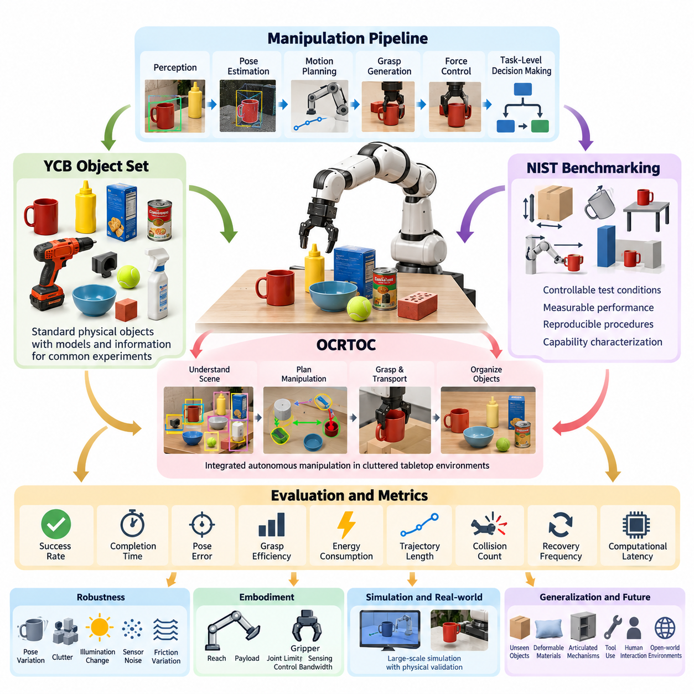
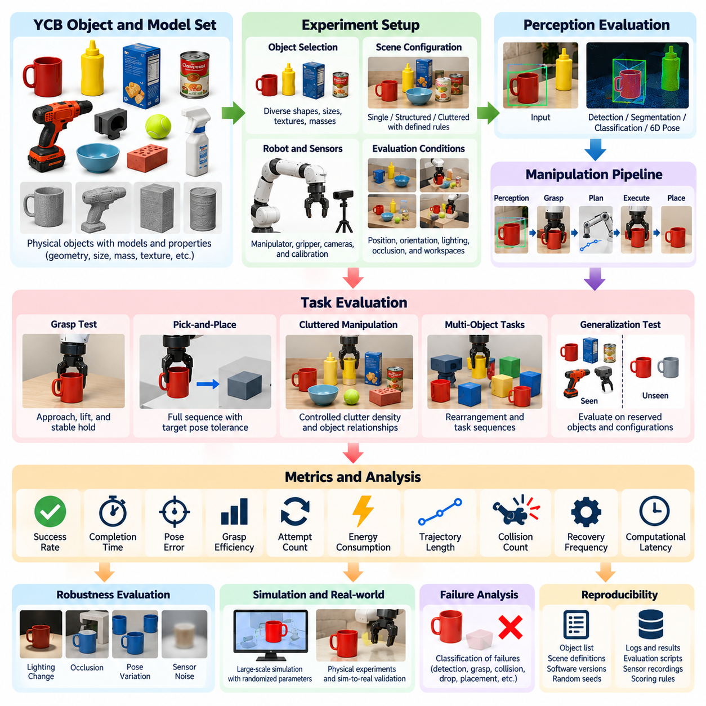
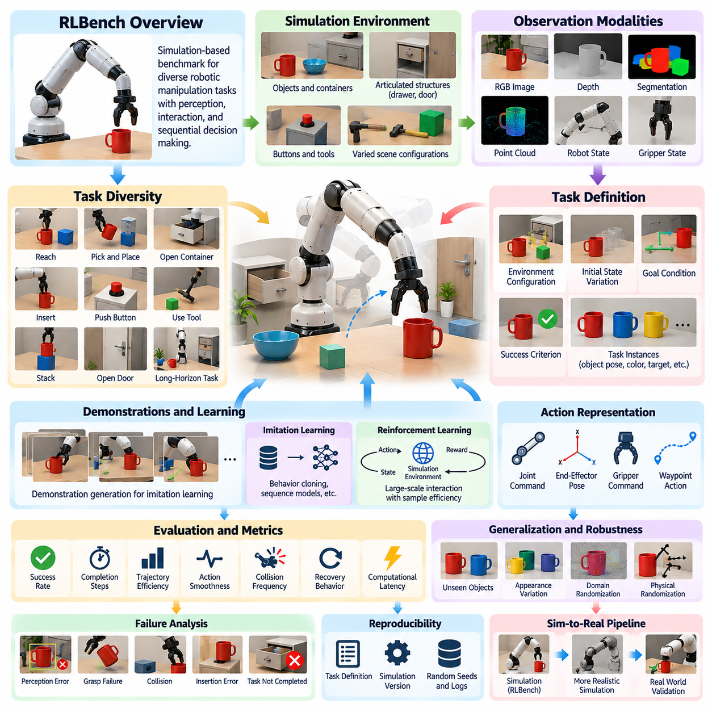
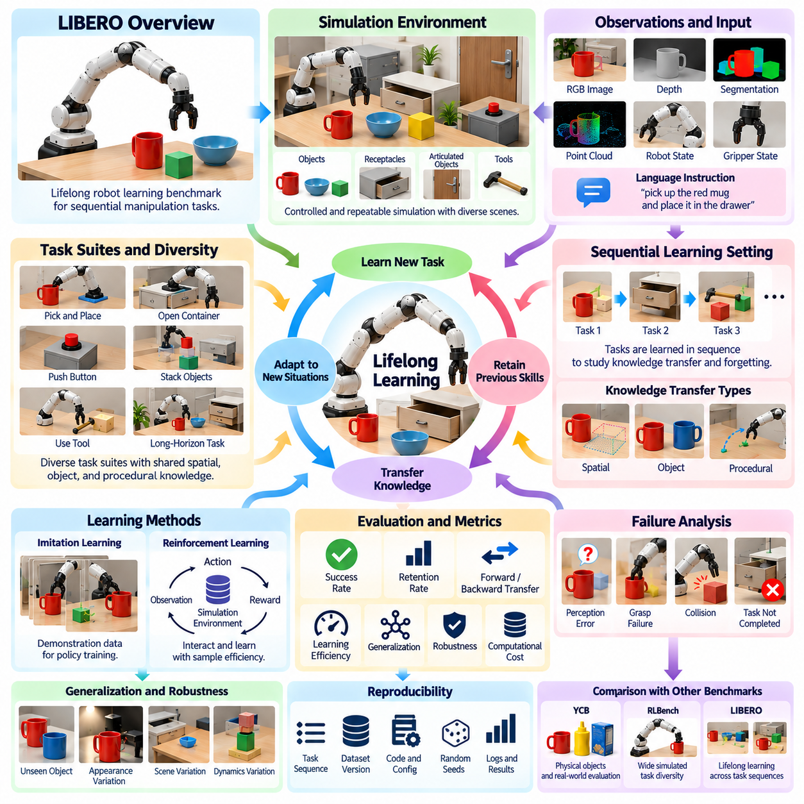
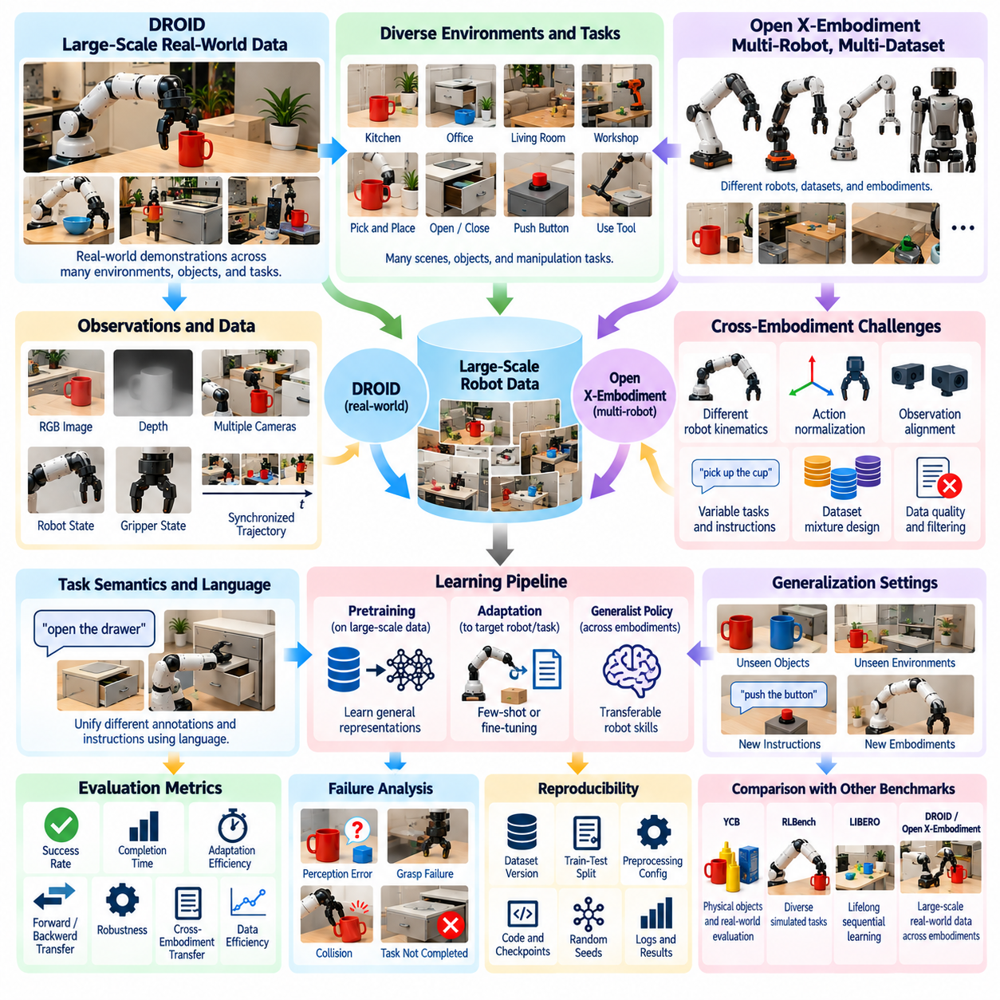
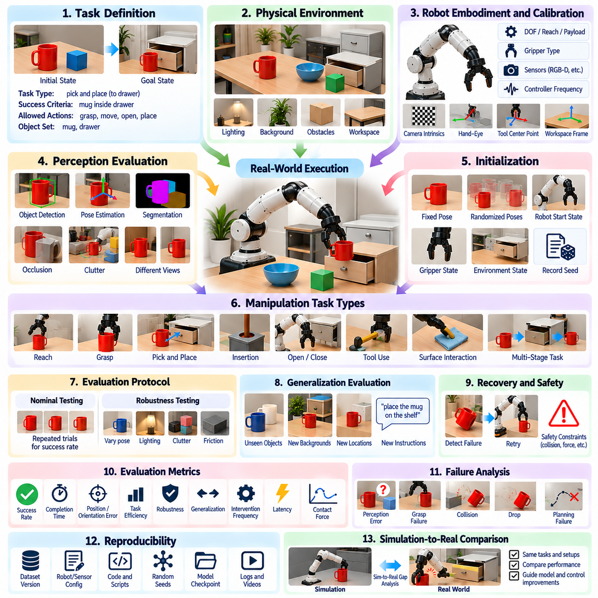
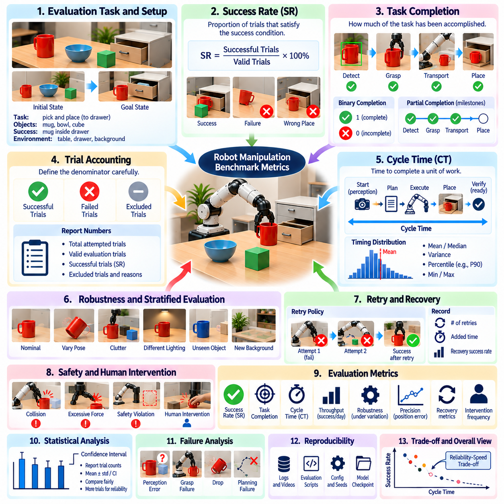
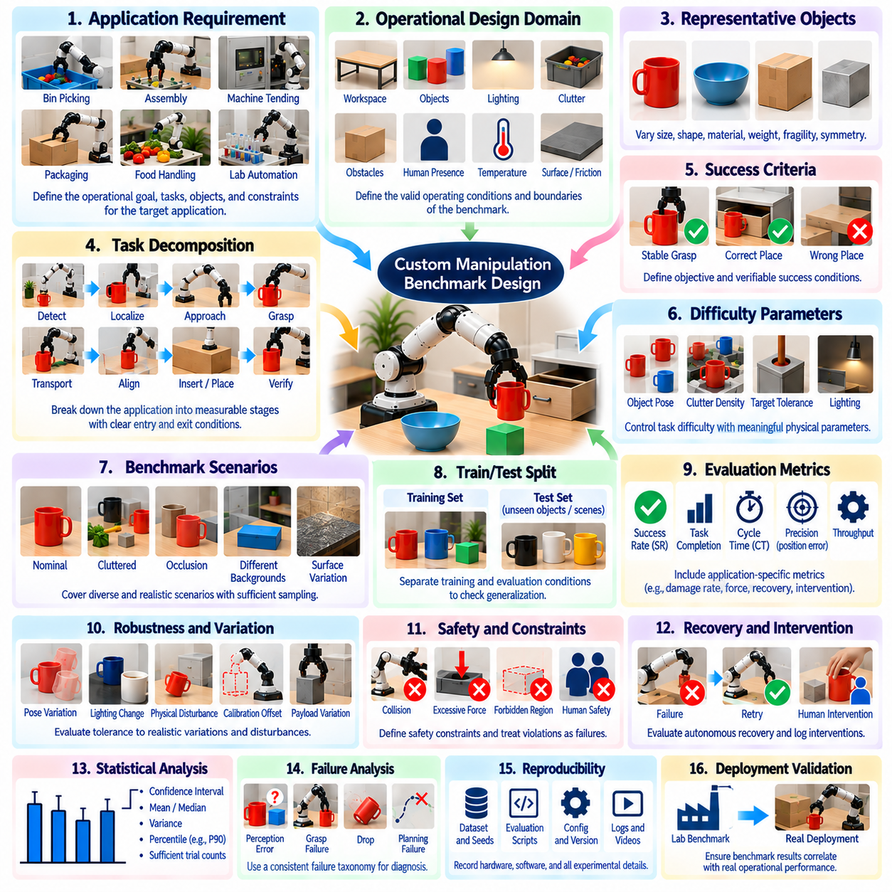
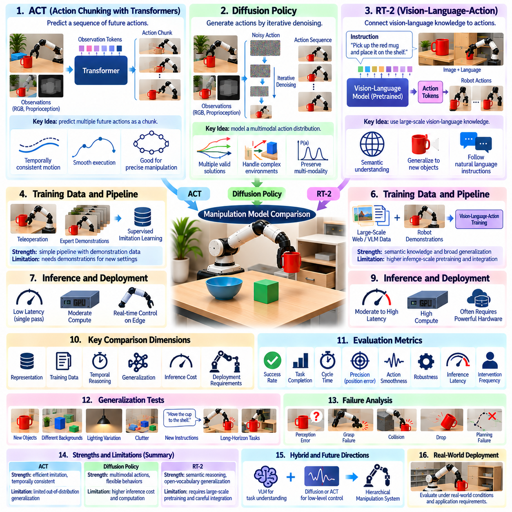
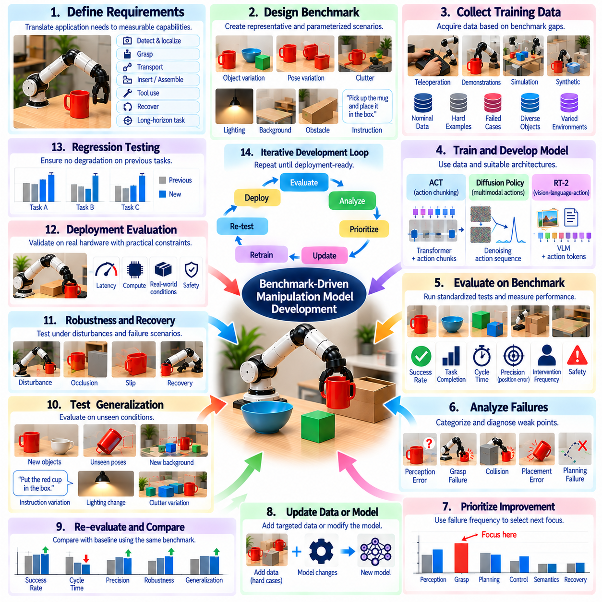

**Volume 17 Manipulation and Grasping AI**

# Chapter 11. Manipulation Benchmarks

## 11.01. Manipulation Benchmark Overview YCB NIST OCRTOC

{width="7.268055555555556in" height="7.268055555555556in"}

조작 벤치마크(Manipulation Benchmark)는 로봇이 통제된 조건에서 물체를 얼마나 안정적으로 인식하고, 접근하고, 파지하고, 이동하고, 배치하며, 자세를 변경할 수 있는지를 측정하기 위한 표준화된 방법을 제공한다. 단일 성공 사례를 강조하는 시연(Demonstration)과 달리, 벤치마크는 반복 가능한 물체, 작업(Task), 환경(Environment), 평가 지표(Metric), 평가 절차(Evaluation Procedure)를 정의한다. 이를 통해 서로 다른 연구기관의 조작 시스템을 비교하고, 개별 기술에서 강건한 자율 운용(Robust Autonomous Operation)으로 발전하는 과정을 추적할 수 있다.

완전한 조작 벤치마크는 단순한 파지 성공률(Grasp Success Rate) 이상을 평가해야 한다. 현대의 로봇 시스템은 인식(Perception), 자세 추정(Pose Estimation), 모션 계획(Motion Planning), 충돌 회피(Collision Avoidance), 파지 생성(Grasp Generation), 힘 제어(Force Control), 작업 수준 의사결정(Task-Level Decision Making)을 결합하므로 실패는 이 전체 처리 과정의 어느 부분에서도 발생할 수 있다. 따라서 벤치마크 설계에서는 구성요소 수준 성능(Component-Level Performance)과 종단간 작업 성능(End-to-End Task Performance)을 구분하면서도 구성요소 사이의 실제적인 상호작용을 유지해야 한다. 이러한 구분은 성능 향상이 인식, 계획, 하드웨어 또는 통합 지능(Integrated Intelligence) 가운데 어디에서 발생했는지를 판단하는 데 중요하다.

YCB 물체 및 모델 세트(YCB Object and Model Set)는 로봇 조작 연구를 위한 공통 물리 물체 집합(Common Physical Object Set)을 제공하기 위해 개발되었다. 여기에는 가정용 제품, 도구, 용기, 기하학적 물체, 로봇 실험을 위해 특별히 설계된 물체 등 다양한 형상, 크기, 질감, 재질, 질량 및 조작 특성을 가진 물체가 포함된다. 서로 다른 연구기관에서 동일하거나 특성이 잘 정의된 물체를 사용할 수 있기 때문에 YCB는 실험 결과의 불일치를 발생시키는 주요 원인 가운데 하나를 줄여준다.

YCB는 물리적 물체와 함께 모델(Model) 및 관련 정보를 제공하여 물체 인식(Object Recognition), 자세 추정(Pose Estimation), 파지(Grasping), 조작(Manipulation), 시뮬레이션(Simulation)과 관련된 실험을 수행할 수 있다는 점에서 특히 유용하다. 연구자는 공통 물체 집합을 이용하여 픽앤플레이스(Pick-and-Place), 물체 재배치(Object Rearrangement), 손 안 조작(In-Hand Manipulation), 혼잡 환경 파지(Cluttered-Scene Grasping) 등의 작업을 구성할 수 있다. 따라서 특정 연구실에서 임의로 선택한 물체 집합을 사용하는 실험보다 더욱 체계적으로 결과를 재현할 수 있다.

그러나 YCB 기반 평가에서는 친숙도(Familiarity)와 일반화(Generalization)를 구분해야 한다. 알려진 YCB 물체를 반복적으로 학습한 로봇은 새로운 물체로 전이되는 조작 원리를 학습하지 않고도 높은 성능을 달성할 수 있다. 따라서 강력한 평가 프로토콜(Evaluation Protocol)은 학습 조건과 시험 조건을 분리하고, 이전에 경험하지 않은 자세나 혼잡 배치를 도입하며, 일부 물체 범주(Object Category)를 일반화 평가용으로 별도로 유지할 수 있다. 이러한 방식의 벤치마크는 단순한 암기가 아니라 기하학적 및 의미적 특성으로부터 유용한 행동을 추론하는 능력을 측정한다.

NIST의 로봇 조작 벤치마킹(Robotic Manipulation Benchmarking)은 측정 과학(Measurement Science)의 관점에서 접근하며, 재현 가능한 시험 방법(Reproducible Test Method), 측정 가능한 성능 특성(Measurable Performance Characteristic), 명확하게 정의된 시험 조건을 강조한다. 시험 방법은 파지, 물체 취급(Object Handling), 위치 결정(Positioning), 조립 관련 조작(Assembly-Related Manipulation), 이동-조작 상호작용(Mobility-Manipulation Interaction), 시스템 강건성(System Robustness) 등의 능력을 평가할 수 있다. 하나의 점수만으로 로봇의 순위를 결정하기보다는 점진적으로 어려워지는 조건에서 로봇의 능력 범위(Capability Envelope)를 특성화하는 방식을 지향한다.

구조화된 NIST 방식 시험(NIST-Style Testing)의 주요 장점은 작업 복잡도(Task Complexity)를 측정 가능한 변수로 분리할 수 있다는 것이다. 물체 크기, 방향, 배치 불확실성(Placement Uncertainty), 도달 거리(Reach Distance), 여유 공간(Clearance), 파지 접근성(Grasp Accessibility), 환경 제약(Environmental Constraint), 요구 정밀도(Required Precision)를 독립적으로 제어할 수 있다. 이후 성공률, 완료 시간, 위치 및 각도 오차, 반복성(Repeatability), 개입 빈도(Intervention Frequency), 실패 유형(Failure Mode) 등을 사용하여 성능을 표현할 수 있다. 이러한 측정은 조작 시스템이 운용 한계(Operational Limit)에 접근하는 지점을 명확하게 보여준다.

OCRTOC(Open Cloud Robot Table Organization Challenge)는 벤치마킹을 복잡한 탁상 환경(Cluttered Tabletop Environment)에서 수행되는 통합 자율 조작(Integrated Autonomous Manipulation)으로 확장한다. 단순히 개별 파지만 평가하는 것이 아니라 로봇이 초기 장면을 이해하고, 물체를 식별하고, 자세를 결정하고, 조작 순서를 계획하며, 물체를 파지하여 운반하고, 지정된 목표 배치(Target Arrangement)에 따라 정리해야 한다. 이러한 구조는 물류(Logistics), 서비스 로보틱스(Service Robotics), 유연 자동화(Flexible Automation)에서 나타나는 실제 재배치 문제와 유사하다.

OCRTOC의 중요성은 시스템 수준 특성(System-Level Character)에 있다. 물체를 정확하게 검출했더라도 위치가 부정확하게 추정되면 파지가 실패할 수 있으며, 파지에 성공하더라도 운반 과정에서 충돌이 발생할 수 있다. 또한 개별적으로는 올바른 배치라 하더라도 그 결과가 이후 물체의 배치를 방해하는 구성을 만들 수 있다. 따라서 성능은 하나의 독립된 알고리즘 최적화가 아니라 인식, 계획, 조작, 복구(Recovery)의 협력에 의해 결정된다. 벤치마크 결과는 구성요소 시험(Component Test)에서는 발견하기 어려운 시스템 통합상의 약점을 드러낸다.

YCB, NIST 지향 시험 방법(NIST-Oriented Test Method), OCRTOC는 조작 평가(Manipulation Evaluation)의 상호보완적인 계층을 나타낸다. YCB는 주로 표준화된 물체와 실험 기준을 제공하고, NIST는 체계적인 측정 방법론(Measurement Methodology)과 재현 가능한 시험 절차를 제공하며, OCRTOC는 통합 조작 작업(Integrated Manipulation Task)의 자율 실행을 강조한다. 이들은 함께 표준화된 시험 대상에서 통제된 능력 측정을 거쳐 인식, 추론(Reasoning), 계획, 물리적 상호작용(Physical Interaction)을 포함하는 복잡한 작업 수준 평가로 벤치마킹이 발전하는 과정을 보여준다.

의미 있는 벤치마크 지표(Benchmark Metric)는 효과성(Effectiveness)과 효율성(Efficiency)을 모두 포착해야 한다. 이진적인 성공 여부(Binary Success)는 기본적으로 중요하지만 충분하지 않다. 동일한 성공률을 가진 두 시스템도 실행 시간, 궤적 길이(Trajectory Length), 에너지 소비, 파지 시도 횟수, 배치 정확도, 사람의 개입 횟수에서 큰 차이를 보일 수 있기 때문이다. 따라서 조작 평가는 성공 확률과 함께 사이클 시간(Cycle Time), 파지 효율(Grasp Efficiency), 자세 오차(Pose Error), 충돌 횟수, 복구 빈도(Recovery Frequency), 필요한 경우 계산 지연시간(Computational Latency) 등을 함께 고려해야 한다.

강건성 평가(Robustness Evaluation)는 제어된 교란(Controlled Disturbance)과 불확실성(Uncertainty)을 도입한다. 물체를 기준 위치에서 이동시키거나, 부분적으로 가리거나, 혼잡한 환경에 배치하거나, 파지하기 어려운 방향으로 회전시키고, 조명과 배경 조건을 변화시킬 수 있다. 또한 조작은 캘리브레이션 오차(Calibration Error), 마찰 변화(Friction Variation), 불확실한 질량 분포, 센서 잡음(Sensor Noise), 작은 실행 교란(Execution Disturbance)에 대해서도 시험할 수 있다. 강건한 시스템은 세심하게 준비된 실험실 조건에서만 성공하는 것이 아니라 정의된 조건 범위 전체에서 허용 가능한 성능을 유지해야 한다.

벤치마킹에서는 로봇의 신체 구조(Embodiment) 역시 고려해야 한다. 매니퓰레이터 도달 범위(Manipulator Reach), 가반하중(Payload), 관절 한계(Joint Limit), 그리퍼 형상(Gripper Geometry), 센싱 구성(Sensing Configuration), 제어 대역폭(Control Bandwidth)은 작업 난이도에 큰 영향을 준다. 따라서 벤치마크에서 하드웨어 조건과 환경 제약을 명확하게 규정하지 않으면 서로 다른 로봇의 직접적인 비교는 오해를 초래할 수 있다. 능력 중심 평가(Capability-Oriented Evaluation)는 사용 가능한 물리적·계산적 자원을 명시하고 명확하게 정의된 운용 조건에서 성능을 비교함으로써 이러한 문제를 해결한다.

시뮬레이션(Simulation)은 수천 개의 물체 배치, 무작위화된 물리 파라미터(Randomized Physical Parameter), 반복 가능한 실패 시나리오를 생성함으로써 벤치마크의 규모를 크게 확장할 수 있다. 그러나 시뮬레이션 결과를 실제 물리적 조작 성능과 자동적으로 동일하게 해석해서는 안 된다. 접촉 동역학(Contact Dynamics), 마찰, 컴플라이언스(Compliance), 센서 특성, 액추에이터 동작, 물체 변형(Object Deformation)을 완벽하게 재현하기 어렵기 때문이다. 따라서 강력한 평가 파이프라인(Evaluation Pipeline)은 광범위한 탐색에는 시뮬레이션을 사용하고 실제 환경 신뢰성(Real-World Reliability)의 검증에는 물리적 실험을 사용한다.

학습 기반 조작(Learning-Based Manipulation)의 경우 벤치마크 설계는 학습과 평가 사이의 정보 누출(Information Leakage)을 방지해야 한다. 모델은 전이 가능한 조작 능력을 개발하는 대신 이전에 관찰한 물체 메시(Object Mesh), 텍스처(Texture), 카메라 구성(Camera Configuration), 고정된 장면 배치(Scene Layout)를 이용할 수 있다. 따라서 평가에는 미관측 인스턴스(Unseen Instance), 새로운 구성(Novel Configuration), 환경 변화(Environmental Variation)를 포함하고 학습에 사용된 자원을 명확하게 기록해야 한다. 점차 핵심적인 질문은 로봇이 알려진 물체를 조작할 수 있는지가 아니라 학습된 표현(Learned Representation)을 익숙하지 않은 물리적 상황에 얼마나 효과적으로 적응시킬 수 있는지가 되고 있다.

실패 분류 체계(Failure Taxonomy) 역시 벤치마크 해석의 핵심 요소이다. 실패는 인식 오류(Perception Error), 자세 추정 오류(Pose-Estimation Error), 실행 불가능한 파지 후보(Unreachable Grasp Proposal), 계획 실패(Planning Failure), 충돌, 파지 미끄러짐(Grasp Slippage), 불안정한 운반(Unstable Transport), 부정확한 배치, 제어 불안정성(Control Instability), 복구 실패(Recovery Failure) 등으로 분류할 수 있다. 이러한 실패 유형을 기록하면 벤치마크 결과는 단순한 순위를 넘어 공학적 근거(Engineering Evidence)로 활용될 수 있다. 개발자는 병목 지점(Bottleneck)을 식별하고 어떤 하위 시스템을 개선하는 것이 전체 작업 신뢰성을 가장 크게 향상시키는지 판단할 수 있다.

반복성(Repeatability)과 재현성(Reproducibility)은 구분하여 다루어야 한다. 반복성은 동일한 시스템이 유사한 조건에서 실험을 반복했을 때 일관된 결과를 생성하는지를 의미한다. 재현성은 다른 연구기관이나 로봇 플랫폼이 공개된 프로토콜을 이용하여 비교 가능한 결론을 얻을 수 있는지를 의미한다. YCB와 같은 표준화된 물체, 명확하게 기술된 NIST 방식 절차, 공유 데이터셋(Shared Dataset), 구성 파일(Configuration File), 투명한 평가 규칙(Transparent Scoring Rule)은 두 특성을 모두 향상시키고 과학적인 비교의 신뢰성을 높인다.

조작 벤치마킹의 장기적인 방향은 점차 개방형 환경 평가(Open-World Evaluation)로 이동하고 있다. 미래의 시스템은 익숙하지 않은 물체, 변형 가능한 재료(Deformable Material), 관절형 메커니즘(Articulated Mechanism), 도구 사용(Tool Use), 인간과의 상호작용(Human Interaction), 장기 시계열 작업(Long-Horizon Task), 지속적으로 변화하는 환경을 처리해야 한다. 따라서 평가 역시 기존의 파지 정확도뿐만 아니라 적응(Adaptation), 의미적 추론(Semantic Reasoning), 불확실성 관리(Uncertainty Management), 복구, 안전성(Safety)을 측정해야 한다. 벤치마크 난이도는 실험의 재현성과 진단적 가치(Diagnostic Value)를 유지하면서 점진적으로 높아져야 한다.

궁극적으로 조작 벤치마크는 연구 성과와 실제 배치 가능한 로봇 능력(Deployable Robotic Capability)을 연결하는 인터페이스 역할을 한다. YCB는 공통의 물리적 기준을 제공하고, NIST가 추진하는 측정 중심 프레임워크(Measurement-Oriented Framework)는 체계적인 평가 원칙을 확립하며, OCRTOC와 같은 통합 챌린지는 인식과 조작이 실제로 결합되어 자율적으로 동작할 수 있는지를 검증한다. 이러한 접근법을 종합적으로 활용하면 실험실 수준의 조작 기술에서 범용 물리 지능(General-Purpose Physical Intelligence)으로 발전하는 과정을 체계적으로 측정할 수 있는 기반을 구축할 수 있다.

## 11.02. YCB Object and Model Set Evaluation Protocol [w/Code]

{width="7.268055555555556in" height="7.268055555555556in"}

YCB 물체 및 모델 세트(YCB Object and Model Set)는 로봇 조작(Robotic Manipulation), 인식(Perception), 파지(Grasping), 계획(Planning) 시스템을 평가하기 위한 표준화된 물리적 기반을 제공한다. 핵심 가치는 단순히 공통 물체를 제공하는 데 있는 것이 아니라, 형상과 물리적 특성이 문서화된 물체를 사용하여 반복 가능한 실험(Repeatable Experiment)을 구성할 수 있다는 데 있다. 따라서 YCB 기반 평가 프로토콜(Evaluation Protocol)은 실험 시작 전에 물체 선정, 장면 구성, 로봇 조건, 시험 절차, 성능 지표를 명확하게 정의해야 한다.

물체 선정(Object Selection)은 편리한 물체를 임의로 사용하는 것이 아니라 평가하려는 조작 능력을 대표하도록 구성해야 한다. YCB에는 서로 다른 크기, 형상, 질감, 질량, 강성(Rigidity), 대칭성(Symmetry), 파지 어포던스(Grasp Affordance)를 가진 물체가 포함된다. 원통형 용기, 상자, 도구, 생활용품, 기하학적 물체, 변형 가능한 물체(Deformable Object)는 서로 다른 인식 및 조작 요구사항을 발생시킨다. 균형 잡힌 부분집합(Subset)을 사용하면 의미 있는 비교가 가능할 정도로 실험 조건을 통제하면서 다양한 물리적 특성에 대한 평가를 수행할 수 있다.

시험 전에 선택된 각 물체에는 일관된 식별자(Identifier)를 부여하고 사용 가능한 기준 정보(Reference Information)와 일치하는지 확인해야 한다. 필요한 경우 기하학적 모델(Geometric Model), 치수, 질량 특성, 텍스처 정보(Texture Information), 물체 좌표계 규약(Object Coordinate Convention)을 기록해야 한다. 또한 인식, 시뮬레이션 또는 계획 소프트웨어가 어떤 모델 표현(Model Representation)을 사용하는지도 문서화해야 한다. 이를 통해 전처리나 물체 표현의 차이가 조작 성능의 차이로 잘못 해석되는 것을 방지할 수 있다.

장면 구성(Scene Configuration) 역시 평가 프로토콜의 핵심 요소이다. 평가 대상 능력에 따라 물체를 개별적으로 시험하거나, 구조화된 그룹으로 배치하거나, 혼잡 환경(Clutter)에 배치할 수 있다. 초기 위치, 방향, 지지 표면(Support Surface), 물체 간 거리, 가시성(Visibility), 도달 가능한 작업공간(Reachable Workspace)을 정의하거나 문서화된 무작위화 규칙(Randomization Rule)에 따라 생성해야 한다. 여러 구성을 사용하여 실험을 반복하면 벤치마크가 하나의 유리한 배치에 의존하는 것을 방지할 수 있다.

인식 평가(Perception Evaluation)에서는 YCB 물체를 사용하여 물체 검출(Object Detection), 분할(Segmentation), 분류(Classification), 6자유도 자세 추정(Six-Degree-of-Freedom Pose Estimation)을 측정할 수 있다. 적절한 기준 방법을 사용하여 실제 물체 식별 정보와 자세의 정답(Ground Truth)을 확보한 후 위치, 방향, 검출 또는 분할 오차를 이용하여 예측 결과와 비교할 수 있다. 실제 조작 성능은 현실적인 장면 변화에서 인식의 신뢰성에 크게 의존하므로 시점, 거리, 조명, 가림(Occlusion), 혼잡도의 변화를 포함하여 시험해야 한다.

파지 평가(Grasp Evaluation)는 무엇을 유효한 시도와 성공적인 파지로 판단할 것인지 명확하게 규정해야 한다. 로봇은 물체에 접근하고, 접촉을 형성하고, 정의된 높이까지 들어 올린 다음, 일정 시간 동안 안정적으로 유지하고, 물체를 떨어뜨리거나 과도하게 이동시키지 않은 상태로 운반하도록 요구될 수 있다. 그리퍼(Gripper)가 닫힌 직후 성공으로 판정해서는 안 된다. 안정성 단계(Stability Phase)를 포함해야 생성된 파지가 일시적인 접촉을 넘어 이후 조작 과정에서 발생하는 힘을 견딜 수 있는지를 검증할 수 있다.

픽앤플레이스 평가(Pick-and-Place Evaluation)는 전체 조작 과정의 성공을 요구함으로써 파지 평가를 확장한다. 로봇은 물체를 인식하고, 파지를 선택하고, 충돌 없는 궤적(Collision-Free Trajectory)을 생성하고, 물체를 획득하여 운반한 후 지정된 목표 영역(Target Region) 또는 자세 허용오차(Pose Tolerance) 내에 배치해야 한다. 최종 배치 오차는 위치와 방향을 기준으로 측정할 수 있다. 이러한 종단간 프로토콜(End-to-End Protocol)은 독립적인 구성요소 시험에서는 확인하기 어려운 인식 불확실성, 파지 품질, 궤적 실행, 배치 제어 사이의 상호작용을 드러낸다.

혼잡 환경 조작(Cluttered Manipulation)에서는 혼잡도뿐만 아니라 물체 간 관계도 통제해야 한다. 물체는 서로를 부분적으로 가리거나, 그리퍼의 접근을 제한하거나, 접근 방향을 좁게 만들거나, 물리적으로 얽힐 수 있다. 물체 수, 최소 간격, 중첩 정도, 방향 다양성(Orientation Diversity), 가시성을 변경하여 난이도를 체계적으로 높일 수 있다. 이러한 매개변수화된 혼잡도(Parameterized Clutter)는 정량적 정의 없이 장면을 단순히 쉬움 또는 어려움으로 구분하는 것보다 훨씬 유용한 평가 정보를 제공한다.

조작에는 본질적으로 확률적 특성(Stochastic Characteristic)이 존재하므로 시험 반복(Trial Repetition)이 필요하다. 센서 잡음, 접촉 변화, 액추에이터 오차, 마찰, 물체 배치의 미세한 차이로 인해 명목상 동일한 조건에서도 서로 다른 결과가 발생할 수 있다. 따라서 각 실험 조건에서는 단일 결과를 보고하는 대신 성능 분포(Performance Distribution)를 추정할 수 있을 만큼 충분한 반복 시험을 수행해야 한다. 가능하다면 난수 시드(Random Seed)와 무작위화된 구성을 보존하여 동일하거나 통계적으로 비교 가능한 실험을 재현할 수 있도록 해야 한다.

가장 기본적인 지표는 작업 성공률(Task Success Rate)이지만 진단용 측정값(Diagnostic Measurement)을 함께 사용해야 한다. 유용한 지표에는 파지 성공률, 완료 시간, 파지 시도 횟수, 계획 시간(Planning Time), 궤적 길이, 배치 오차, 충돌 횟수, 물체 교란(Object Disturbance), 복구 시도(Recovery Attempt), 사람 개입(Human Intervention) 등이 포함된다. 실시간 시스템에서는 계산 지연시간(Computational Latency)도 중요할 수 있다. 여러 상호보완적인 지표를 함께 보고하면 하나의 점수를 최적화하는 과정에서 조작 파이프라인의 다른 약점이 가려지는 것을 방지할 수 있다.

실패 분류(Failure Classification)는 데이터 수집 과정에 직접 포함되어야 한다. 실패한 시험은 잘못된 검출, 부정확한 자세 추정, 실행 불가능한 파지(Infeasible Grasp), 역기구학 실패(Inverse-Kinematics Failure), 충돌, 조기 접촉(Premature Contact), 파지 미끄러짐(Grasp Slippage), 물체 낙하, 궤적 실행 오류, 부정확한 배치 등에서 발생할 수 있다. 성공과 실패 여부만 기록하면 이러한 중요한 정보를 잃게 된다. 구조화된 실패 분류 체계(Failure Taxonomy)는 벤치마크 결과를 공학적 개선에 활용하고 전체 신뢰성을 제한하는 하위 시스템을 식별할 수 있도록 한다.

일반화 평가(Generalization Testing)는 개발 과정에서 사용한 물체 및 구성과 평가를 위해 별도로 보존한 조건을 분리해야 한다. 인식 또는 조작 정책(Manipulation Policy)이 모든 시험 물체를 반복적으로 관찰했다면 높은 성능이 물체별 암기(Object-Specific Memorization)의 결과일 수 있다. 대신 특정 YCB 물체, 물체 범주, 방향 또는 장면 구성을 미관측 조건(Unseen Condition)으로 유지할 수 있다. 이를 통해 시스템이 알려진 예제에 대한 고정된 반응이 아니라 전이 가능한 기하학적·조작 원리를 학습했는지를 평가할 수 있다.

물체 대칭성(Object Symmetry)은 자세 평가에서 특별히 고려해야 한다. 일부 원통형 또는 기하학적으로 대칭인 물체는 수치적인 회전값이 다르더라도 물리적으로 동일한 여러 방향을 가질 수 있다. 이러한 특성을 무시하는 지표는 올바른 인식 결과에도 불필요한 오차를 부여할 수 있다. 따라서 평가 프로토콜에서는 관련된 대칭성을 식별하고 필요한 경우 대칭 인식 자세 지표(Symmetry-Aware Pose Metric)를 적용하여 보고된 오차가 임의적인 좌표계 규약이 아니라 실제 조작에서 의미 있는 차이를 나타내도록 해야 한다.

로봇의 하드웨어 조건(Robot Hardware Condition) 역시 신체 구조(Embodiment)가 벤치마크 난이도에 영향을 주기 때문에 문서화해야 한다. 매니퓰레이터 자유도(Degrees of Freedom), 도달 범위, 가반하중(Payload), 그리퍼 유형, 손가락 형상(Finger Geometry), 힘 성능, 카메라 구성, 캘리브레이션 방법(Calibration Method), 제어 주파수(Control Frequency)는 모두 성능에 영향을 줄 수 있다. 모든 연구기관에 동일한 하드웨어 사용을 강제하는 것이 아니라 결과를 공정하게 해석하고 다른 플랫폼에서 동등한 실험 조건을 재현할 수 있을 만큼 충분한 정보를 제공하는 것이 목적이다.

벤치마크를 실행하기 전에 캘리브레이션 품질(Calibration Quality)을 검증해야 한다. 카메라 내부 파라미터(Camera Intrinsics), 카메라-로봇 변환(Camera-to-Robot Transformation), 공구 중심점(Tool Center Point), 그리퍼 형상, 테이블 기준 좌표계(Table Reference Frame)의 오차는 파지 및 배치 오차로 직접 전파될 수 있다. 평가 목적이 조작 지능(Manipulation Intelligence)인데 벤치마크가 의도하지 않게 잘못된 캘리브레이션을 측정해서는 안 된다. 따라서 캘리브레이션 절차와 검증 허용오차를 기록하고 장시간의 실험에서는 캘리브레이션 드리프트(Calibration Drift)를 점검해야 한다.

시뮬레이션(Simulation)은 사용 가능한 YCB 물체 모델을 활용하여 대규모 장면과 조작 시험을 생성함으로써 실제 물리적 YCB 평가를 보완할 수 있다. 물체 자세, 카메라 시점, 조명, 마찰, 질량 및 기타 파라미터를 무작위화하여 강건성(Robustness)을 효율적으로 조사할 수 있다. 그러나 접촉 동작과 센싱 특성이 실제 환경과 상당히 다를 수 있으므로 시뮬레이션과 물리적 평가를 구분해야 한다. 결과에는 시험이 시뮬레이션인지, 실제 물리 시험인지, 또는 시뮬레이션-실환경 검증(Sim-to-Real Validation)의 일부인지 명확하게 표시해야 한다.

강건한 평가 프로토콜은 명목 성능(Nominal Performance)을 확립한 이후 제어된 교란(Controlled Perturbation)을 도입한다. 자세 불확실성, 조명 변화, 부분 가림, 캘리브레이션 오프셋(Calibration Offset), 센서 잡음, 마찰 변화, 작은 물체 변위를 점진적으로 증가시킬 수 있다. 이후 교란 크기에 따른 성능 저하(Performance Degradation)를 측정할 수 있다. 이러한 방식은 하나의 벤치마크 점수가 아니라 능력 곡선(Capability Curve)을 제공하며 시스템이 실험실 외부에서 예상되는 조건을 견딜 수 있는지에 대해 더욱 강력한 근거를 제공한다.

재현성(Reproducibility)을 확보하려면 최종 수치 결과보다 훨씬 많은 정보를 보존해야 한다. 가능하다면 물체 식별자, 장면 정의, 로봇 구성, 소프트웨어 버전, 모델 체크포인트(Model Checkpoint), 카메라 파라미터, 난수 시드, 평가 스크립트(Evaluation Script), 시험 로그(Trial Log), 채점 규칙(Scoring Rule)을 보존해야 한다. 사진이나 기록된 센서 스트림(Recorded Sensor Stream)은 실제 물리 실험을 추가적으로 검증하는 자료가 될 수 있다. 이러한 기록은 보고된 벤치마크 점수와 실제 시험 조건을 연결하는 증거 사슬(Evidence Chain)을 형성한다.

YCB 평가 프로토콜(YCB Evaluation Protocol)은 구성요소 시험에서 통합 조작(Integrated Manipulation)으로 발전하는 통제된 평가 과정으로 활용할 때 가장 큰 가치를 갖는다. 먼저 인식과 자세 추정을 독립적으로 검증한 다음 파지, 픽앤플레이스, 혼잡 환경 처리, 더욱 복잡한 작업 시퀀스(Task Sequence)로 확장할 수 있다. 표준화된 물리 물체에 명시적인 절차, 반복 시험, 다차원 지표(Multidimensional Metric), 실패 분석, 일반화 평가를 결합함으로써 YCB는 신뢰할 수 있고 전이 가능한 로봇 조작 능력(Reliable and Transferable Robotic Manipulation Capability)을 측정하기 위한 엄격한 프레임워크로 활용될 수 있다.

## 11.03. RLBench Simulation Manipulation Benchmark [w/Code]

{width="7.268055555555556in" height="7.268055555555556in"}

RLBench는 시각적·물리적으로 다양한 광범위한 작업에서 로봇 조작(Robotic Manipulation)을 평가하도록 설계된 시뮬레이션 중심 벤치마크(Simulation-Oriented Benchmark)이자 학습 환경(Learning Environment)이다. 단순히 개별 파지나 도달 능력만 측정하는 것이 아니라 인식(Perception), 운동(Motion), 상호작용(Interaction), 순차적 의사결정(Sequential Decision Making)이 결합된 작업 실행(Task Execution)으로 조작을 표현한다. 따라서 표준화된 시뮬레이션 환경에서 모방 학습(Imitation Learning), 강화학습(Reinforcement Learning), 다중 작업 학습(Multi-Task Learning), 일반화(Generalization)를 연구하는 데 유용하다.

이 벤치마크는 물리 기반 로봇 시뮬레이션(Physics-Based Robotic Simulation)을 중심으로 구성되며, 작업 조건을 체계적으로 재현할 수 있는 공통 조작 플랫폼(Common Manipulation Platform)을 제공한다. 시뮬레이션된 매니퓰레이터(Manipulator)는 물체, 용기, 도구, 버튼, 서랍, 문, 기타 관절형 구조물(Articulated Structure)과 상호작용한다. 로봇 상태와 환경 상태를 시뮬레이션에서 직접 얻을 수 있으므로 복잡한 물리적 측정 인프라를 구축하지 않고도 정확한 관측값, 시연 데이터(Demonstration), 성공 레이블(Success Label), 정답 정보(Ground-Truth Information)를 생성할 수 있다.

RLBench의 주요 특징 가운데 하나는 높은 작업 다양성(Task Diversity)이다. 작업에는 목표 지점 도달, 물체 픽앤플레이스(Pick-and-Place), 용기 열기, 부품 삽입, 버튼 누르기, 관절형 물체 조작, 물체 쌓기, 도구 사용, 여러 행동으로 구성된 장기 작업 시퀀스 등이 포함될 수 있다. 각각의 작업은 서로 다른 기하학적 추론(Geometric Reasoning), 파지 선택(Grasp Selection), 궤적 계획(Trajectory Planning), 접촉 상호작용(Contact Interaction), 시간적 협응(Temporal Coordination)의 조합을 요구하므로 특정 기능에만 특화된 조작 정책을 넘어선 평가가 가능하다.

각 작업은 환경 구성(Environment Configuration), 조작 가능한 개체(Manipulable Entity), 초기 상태 변화(Initial-State Variation), 목표 조건(Goal Condition), 성공 기준(Success Criterion)을 통해 정의된다. 하나의 고정된 장면에서만 정책을 평가하는 대신 물체 위치, 방향, 색상, 목표 위치 및 기타 파라미터를 변화시켜 여러 작업 인스턴스(Task Instance)를 구성할 수 있다. 이러한 변화는 조작 시스템이 고정된 배치와 연결된 하나의 궤적을 암기하는 것이 아니라 작업에 내재된 관계를 학습하도록 하는 데 중요하다.

RLBench는 개별적으로 또는 결합하여 사용할 수 있는 다양한 관측 모달리티(Observation Modality)를 지원한다. 실험 구성에 따라 정책(Policy)은 RGB 영상, 깊이 정보(Depth Information), 분할 마스크(Segmentation Mask), 포인트 클라우드 관련 관측(Point-Cloud-Related Observation), 로봇 관절 상태(Joint State), 그리퍼 상태(Gripper State), 기타 시뮬레이터에서 생성된 정보를 입력으로 받을 수 있다. 따라서 비전 기반 학습(Vision-Based Learning)과 상태 기반 학습(State-Based Learning)을 비교하거나 시각 인식과 로봇 고유감각(Proprioception)을 결합하는 다중 모달 정책(Multimodal Policy)을 연구할 수 있다.

카메라 구성(Camera Configuration)은 특히 비전 기반 평가에서 중요하다. 조작 작업공간 주변의 다양한 시점에서 관측 데이터를 수집할 수 있으며 외부 시점과 로봇에 연결된 시점을 모두 활용할 수 있다. 특정 카메라 구성으로 학습한 정책은 시점이나 캘리브레이션(Calibration)이 변경되면 성능이 크게 저하될 수 있다. 따라서 성능 차이를 올바르게 해석할 수 있도록 영상 해상도, 카메라 자세(Camera Pose), 시야각(Field of View), 관측 모달리티, 전처리(Preprocessing) 방법을 문서화해야 한다.

시연 데이터 생성(Demonstration Generation)은 RLBench의 중요한 기능 가운데 하나이다. 작업 및 시뮬레이션 프레임워크를 통해 성공적인 작업 궤적(Task Trajectory)을 생성하고 이를 모방 학습 방법의 학습 예제로 사용할 수 있다. 시연 데이터에는 시간에 따른 관측값, 로봇 상태, 행동(Action), 작업 진행 상태(Task Progress)가 포함될 수 있다. 이를 통해 모든 학습 에피소드마다 실제 로봇을 원격조작(Teleoperation)하지 않고도 행동 복제(Behavior Cloning), 시퀀스 모델(Sequence Model), 표현 학습(Representation Learning) 등의 접근법을 연구할 수 있다.

시연 데이터를 사용할 수 있다고 해서 신중한 데이터셋 설계(Dataset Design)가 불필요해지는 것은 아니다. 학습 성능은 시연 데이터의 수, 다양성, 작업 변화, 행동 표현(Action Representation), 샘플링 전략(Sampling Strategy)에 크게 의존할 수 있다. 따라서 벤치마크 결과에는 작업별로 사용한 시연 데이터의 수와 학습, 검증, 시험 에피소드(Training, Validation, Test Episode)를 어떻게 분리했는지 명시해야 한다. 그렇지 않으면 단순히 더 많은 학습 데이터를 사용하여 얻은 성능 향상을 우수한 학습 알고리즘의 결과로 잘못 해석할 수 있다.

강화학습(Reinforcement Learning)은 정책이 시뮬레이션 환경과 반복적으로 상호작용하도록 하여 연구할 수도 있다. 에이전트(Agent)는 현재 상태를 관찰하고 행동을 선택하며 작업 관련 피드백을 받은 후 많은 에피소드에 걸쳐 전략을 탐색한다. 시뮬레이션은 일반적으로 실제 하드웨어에서 수행하기 어려운 규모의 상호작용을 가능하게 한다. 그러나 매우 많은 에피소드를 요구하는 알고리즘은 실제 로봇 개발로 이전하기 어려울 수 있으므로 샘플 효율성(Sample Efficiency)은 여전히 중요한 평가 지표이다.

행동 표현(Action Representation)은 벤치마크 난이도에 큰 영향을 미친다. 정책은 관절 명령(Joint Command), 엔드이펙터 자세(End-Effector Pose), 그리퍼 명령, 웨이포인트 형태의 행동(Waypoint-Like Action) 또는 기타 제어 추상화(Control Abstraction)를 사용할 수 있다. 고수준 행동 표현은 학습을 단순화하지만 더 많은 책임을 하위 제어기와 플래너(Planner)에 위임하며, 저수준 제어(Low-Level Control)는 학습 시스템이 로봇 동역학에 더 직접적으로 대응하도록 한다. 따라서 결과는 정책에 제공된 제어 인터페이스(Control Interface)를 고려하여 해석해야 한다.

작업 성공률(Task Success Rate)은 가장 직접적인 RLBench 성능 지표이다. 허용된 실행 구간(Execution Horizon) 내에서 시뮬레이터가 정의한 작업 조건을 만족하면 해당 시험은 성공으로 판단된다. 그러나 성공률만으로는 정책의 동작 특성을 충분히 설명할 수 없다. 완료 단계 수(Completion Steps), 궤적 효율(Trajectory Efficiency), 행동 부드러움(Action Smoothness), 충돌 빈도(Collision Frequency), 실패한 파지 시도, 복구 행동(Recovery Behavior), 계산 지연시간(Computational Latency)을 함께 측정하면 정책이 작업을 얼마나 효율적이고 강건하게 해결하는지를 보다 정확하게 평가할 수 있다.

RLBench는 하나의 공통 프레임워크 안에 다양한 조작 작업을 포함하므로 다중 작업 학습(Multi-Task Learning)에 특히 적합하다. 각 행동마다 별도의 모델을 학습하는 대신 하나의 정책을 작업 식별자(Task Identity), 관측 정보 또는 작업 설명(Task Description)에 조건화하여 여러 기술에 걸쳐 학습할 수 있다. 이후 한 작업에서 획득한 지식이 다른 작업의 학습을 향상시키는지, 그리고 파지, 배치, 열기, 밀기, 도구 상호작용 사이에서 공유 표현(Shared Representation)이 형성되는지를 평가할 수 있다.

일반화 평가(Generalization Evaluation)는 알려진 작업의 변형과 실제로 새로운 조건을 구분해야 한다. 동일한 기본 작업을 유지하면서 학습에서 보지 못한 물체 자세, 색상, 물체 인스턴스(Object Instance), 초기 구성 또는 카메라 조건을 사용하여 정책을 시험할 수 있다. 더 높은 수준의 평가에서는 전체 작업이나 작업 계열(Task Family)을 시험용으로 제외할 수 있다. 이러한 구분은 익숙한 경험 범위 안에서의 보간(Interpolation)과 학습에 존재하지 않았던 조작 문제로의 전이(Transfer)를 구별한다.

시각적 일반화(Visual Generalization)는 도메인 무작위화(Domain Randomization)와 제어된 장면 변화를 통해 강화할 수 있다. 학습 또는 평가 과정에서 텍스처, 색상, 조명, 카메라 파라미터, 물체 외형, 배경 특성을 변화시킬 수 있다. 이러한 변화는 고정된 시뮬레이터 외형에 대한 의존성을 감소시키고 작업에 중요한 구조를 기반으로 한 표현 학습을 촉진할 수 있다. 그러나 과도하거나 비현실적인 변화는 단순히 강건성을 높이는 것이 아니라 벤치마크 자체의 성격을 변화시킬 수 있으므로 무작위화 범위(Randomization Range)를 명확하게 문서화해야 한다.

물리적 무작위화(Physical Randomization)는 접촉에 민감한 정책(Contact-Sensitive Policy)을 평가하는 데도 유용하다. 실험 프레임워크가 허용하는 범위에서 물체 질량, 마찰, 감쇠(Damping), 초기 자세 및 기타 시뮬레이션 파라미터를 변화시킬 수 있다. 하나의 명목 물리 설정(Nominal Physics Configuration)에서만 성공하는 정책은 시뮬레이터에 특화된 가정을 이용하고 있을 가능성이 있다. 다양한 파라미터 범위에서 시험하면 학습된 조작 전략이 불확실성에서도 유지되는 관계를 포착했는지에 대해 더 강력한 근거를 제공할 수 있다.

실패 분석(Failure Analysis)은 전체 성공 점수와 함께 수행해야 한다. 실패는 잘못된 목표 식별, 부적절한 접근 방향, 실행 불가능한 명령, 충돌, 불안정한 파지, 너무 이른 그리퍼 작동(Premature Gripper Operation), 물체 낙하, 부정확한 삽입, 최종 작업 조건 미충족 등에서 발생할 수 있다. 이러한 결과를 분류하면 인식 오류와 계획 또는 제어 오류를 구분할 수 있으며 벤치마크 결과를 전체 조작 시스템 개선에 더욱 효과적으로 활용할 수 있다.

RLBench는 일부 작업이 서로 의존하는 여러 단계를 요구하기 때문에 장기 시계열 조작(Long-Horizon Manipulation)을 연구하는 데도 유용하다. 에이전트는 물체를 찾고, 다른 구조물을 열거나 이동시킨 후, 목표 물체를 획득하고 운반하여 최종 배치 또는 상호작용을 완료해야 할 수 있다. 이러한 단계가 진행될수록 오류가 누적되므로 장기 작업의 성공은 단순한 개별 운동 실행보다 훨씬 어렵다. 이러한 작업은 기본적인 조작 기술(Primitive Manipulation Skill)과 작업 수준 로봇 지능(Task-Level Robotic Intelligence)을 연결하는 역할을 한다.

재현성(Reproducibility)을 확보하려면 시뮬레이션 환경을 신중하게 관리해야 한다. 시뮬레이터 버전, RLBench 버전, 작업 정의, 로봇 구성, 관측 설정, 제어 모드(Control Mode), 난수 시드(Random Seed), 시연 데이터 생성 절차, 학습 데이터, 모델 체크포인트(Model Checkpoint), 평가 에피소드 수를 기록해야 한다. 소프트웨어 또는 제어 구성의 작은 차이도 결과에 영향을 줄 수 있으므로 실험 조건이 충분히 투명하게 공개될 때에만 벤치마크 결과를 의미 있게 비교할 수 있다.

시뮬레이션은 뛰어난 확장성(Scalability)을 제공하지만 실제 물리적 조작을 완전히 재현할 수는 없다. 접촉 동역학(Contact Dynamics), 액추에이터 동작, 센싱 특성, 재료 컴플라이언스(Material Compliance), 캘리브레이션 오차, 예상하지 못한 환경 상호작용으로 인해 시뮬레이션-현실 격차(Simulation-to-Reality Gap)가 발생한다. 따라서 높은 RLBench 성능은 벤치마크 환경에서의 능력을 입증하지만 실제 로봇에서 동일한 성능을 보장하지는 않는다. 실제 배치 가능한 조작 시스템을 목표로 한다면 실환경 검증(Real-World Validation)이 필요하다.

유용한 개발 전략은 RLBench를 알고리즘 설계와 실제 물리 실험 사이의 통제된 중간 단계(Controlled Intermediate Stage)로 활용하는 것이다. 먼저 많은 작업과 무작위화된 시험을 통해 인식, 정책 학습, 일반화, 순차적 추론(Sequential Reasoning)의 약점을 발견할 수 있다. 이후 유망한 접근법을 더욱 현실적인 시뮬레이션으로 이전하고 최종적으로 실제 하드웨어에서 검증함으로써 캘리브레이션, 지연시간, 접촉 불확실성, 안전성(Safety), 하드웨어 한계를 평가 과정에 포함할 수 있다.

보다 광범위한 조작 벤치마크 프레임워크(Manipulation Benchmark Framework)에서 RLBench는 YCB와 같은 실제 물체 기반 벤치마크를 보완한다. YCB가 표준화된 실제 물체와 반복 가능한 물리 실험을 강조한다면, RLBench는 많은 작업, 관측, 시연 데이터, 환경 변화를 활용한 확장 가능한 시뮬레이션 평가를 가능하게 한다. 두 접근법을 함께 활용하면 구성요소 수준의 인식과 파지에서 학습 기반 다중 작업 조작(Learned Multi-Task Manipulation)을 거쳐 궁극적으로 실세계 자율 물리 지능(Real-World Autonomous Physical Intelligence)으로 발전하는 전체 과정을 평가할 수 있다.

## 11.04. LIBERO Robot Learning Benchmark [w/Code]

{width="7.268055555555556in" height="7.268055555555556in"}

LIBERO는 평생 로봇 학습(Lifelong Robot Learning)을 연구하기 위한 벤치마크(Benchmark)로, 특히 조작 정책(Manipulation Policy)이 이전에 학습한 능력을 유지하면서 새로운 기술을 획득하는 과정을 평가하는 데 중점을 둔다. 하나의 고정된 작업 분포(Task Distribution)에서 학습을 완료한 로봇만 평가하는 대신, LIBERO는 조작 문제를 일련의 작업 시퀀스(Task Sequence)로 구성한다. 이러한 구조를 통해 학습이 시간에 따라 진행되는 동안 지식 전이(Knowledge Transfer), 간섭(Interference), 유지(Retention), 적응(Adaptation)을 측정할 수 있다.

이 벤치마크는 범용 로보틱스(General-Purpose Robotics)의 근본적인 문제를 다룬다. 실용적인 로봇은 새로운 작업이 추가될 때마다 전체 모델을 처음부터 다시 학습할 필요가 없어야 한다. 이전 경험에서 관련 지식을 재사용하고, 새로운 행동을 효율적으로 학습하며, 기존 기술의 치명적 망각(Catastrophic Forgetting)을 방지해야 한다. 따라서 LIBERO는 최종 작업 성능뿐만 아니라 추가적인 조작 작업을 경험하면서 정책 내부의 지식이 어떻게 변화하는지도 평가한다.

LIBERO는 로봇 팔(Robot Arm), 조작 가능한 물체, 수용체(Receptacle), 가구, 작업과 관련된 공간 배치를 포함하는 시뮬레이션 조작 환경(Simulated Manipulation Environment)을 사용한다. 작업에는 지정된 목표에 따라 물체를 집고, 배치하고, 이동하고, 열고, 닫고, 위치시키거나 상호작용하는 행동이 포함될 수 있다. 시뮬레이션은 통제된 초기 조건과 반복 가능한 평가를 제공하면서도 서로 연관된 조작 문제 사이의 학습을 연구할 수 있을 만큼 다양한 시각적·물리적 상호작용을 지원한다.

LIBERO의 중요한 특징은 서로 다른 형태의 지식 전이(Knowledge Transfer)를 강조하도록 작업을 벤치마크 스위트(Benchmark Suite)로 구성한다는 것이다. 일부 작업은 공간적 관계(Spatial Relationship)를 공유하고, 다른 작업은 동일한 물체나 조작 기술을 재사용하며, 더 복잡한 스위트는 여러 변형을 결합한다. 연속되는 작업 사이에서 어떤 요소를 공유할 것인지 통제함으로써 학습 알고리즘이 모든 새로운 문제를 완전히 독립적인 것으로 처리하지 않고 유용한 표현(Representation)을 전이하는지를 평가할 수 있다.

공간 지식(Spatial Knowledge)은 성공적인 조작 행동이 내부(Inside), 위(On Top of), 옆(Beside), 뒤(Behind), 지정된 작업공간 영역(Workspace Region)과 같은 관계에 의존하는 경우가 많기 때문에 특히 중요하다. 로봇은 이미 물체를 파지하는 방법을 알고 있더라도 해당 물체를 어디에 배치해야 하는지는 새롭게 학습해야 할 수 있다. LIBERO는 이전에 학습한 공간 표현(Spatial Representation)이 서로 다른 구성에서 익숙한 관계를 포함하는 새로운 작업의 학습을 가속하는지를 평가할 수 있다.

물체 지식(Object Knowledge)은 또 다른 지식 전이의 차원을 제공한다. 조작 정책은 여러 작업에 걸쳐 시각적 외형, 형상, 의미적 정체성(Semantic Identity), 상호작용 특성이 중요한 다양한 물체를 반복적으로 경험한다. 한 작업에서 물체에 대한 유용한 표현을 학습하면 다른 작업에서 필요한 경험량을 줄일 수 있다. 따라서 벤치마크 평가는 모델이 재사용 가능한 물체 표현(Reusable Object Representation)을 유지하는지 또는 유사한 정보를 반복적으로 다시 학습하는지를 확인할 수 있다.

절차적 지식(Procedural Knowledge)은 도달(Reaching), 파지(Grasping), 운반(Transporting), 배치(Placing), 열기(Opening), 닫기(Closing)와 같이 재사용 가능한 조작 행동을 의미한다. 이러한 행동은 대상 물체와 목표가 달라지더라도 여러 의미적 작업(Semantic Task)에서 반복적으로 나타날 수 있다. 강력한 평생 학습 시스템은 이러한 기본적인 운동 및 상호작용 패턴을 보존하고 이후 작업을 학습할 때 이를 재조합해야 하며, 모든 정책을 완전히 새로운 행동 기반에서 다시 구성해서는 안 된다.

언어 조건부 작업 명세(Language-Conditioned Task Specification)는 자연어 명령(Natural-Language Instruction)이 조작 목표를 설명하는 확장 가능한 인터페이스를 제공한다는 점에서 중요하다. 정책은 어떤 물체를 조작해야 하는지와 어떤 관계 또는 행동을 달성해야 하는지를 나타내는 명령을 입력받을 수 있다. 학습 시스템은 언어적 개념을 시각적 관측(Visual Observation) 및 로봇 행동과 연결해야 한다. 이는 의미적 이해(Semantic Understanding)와 물리적 작업 실행(Physical Task Execution)을 결합하는 평가 환경을 제공한다.

시연 데이터(Demonstration Data)는 모방 학습(Imitation Learning)을 통해 정책을 학습하는 데 사용할 수 있는 성공적인 조작 궤적(Manipulation Trajectory)의 예제를 제공한다. 각 시연에는 시간 단계에 따른 관측값, 로봇 상태, 행동(Action), 작업 정보가 포함될 수 있다. 시연의 수와 다양성은 학습 품질에 큰 영향을 주므로 실험에서는 시연 데이터 수, 샘플링 절차(Sampling Procedure), 관측 모달리티(Observation Modality), 정책 학습 과정에서 사용한 데이터 증강(Data Augmentation)을 명확하게 보고해야 한다.

관측 설계(Observation Design)는 학습 알고리즘이 어떤 정보를 사용할 수 있는지를 결정한다. 정책은 하나 이상의 카메라 영상과 함께 엔드이펙터 상태(End-Effector State), 관절 구성(Joint Configuration), 그리퍼 상태(Gripper Status)와 같은 로봇 고유감각 정보(Proprioceptive Information)를 사용할 수 있다. 시각적 관측은 물체와 장면 관계에 대한 정보를 제공하고, 고유감각은 로봇의 현재 물리적 상태를 나타낸다. 다중 모달 표현(Multimodal Representation)은 이러한 정보원을 통합하여 작업 인식형 조작(Task-Aware Manipulation)을 지원할 수 있다.

순차적 학습(Sequential Training)은 평생 학습을 일반적인 다중 작업 학습(Multi-Task Learning)과 구분하는 핵심 요소이다. 다중 작업 학습에서는 여러 작업의 데이터를 최적화 과정 전체에서 동시에 사용할 수 있다. 반면 평생 학습에서는 작업을 정해진 순서로 경험하며 이후 작업을 학습할 때 이전 데이터에 대한 접근이 제한되거나 불가능할 수 있다. 이러한 제약은 안정성-가소성 절충(Stability-Plasticity Tradeoff)을 드러낸다. 즉, 모델은 새로운 작업을 학습할 만큼 충분히 가소적이면서도 이전 능력을 유지할 만큼 안정적이어야 한다.

치명적 망각(Catastrophic Forgetting)은 새로운 작업을 학습하면서 이전에 학습한 작업의 성능이 크게 저하되는 현상을 의미한다. LIBERO는 순차 학습의 각 단계가 완료된 이후 이전 작업을 다시 평가함으로써 이러한 현상을 측정할 수 있도록 한다. 각 작업을 처음 학습한 직후에는 높은 성능을 보이지만 이전 기술을 빠르게 잃는 정책은 효과적인 평생 학습 시스템이라고 할 수 없다. 따라서 전체 작업 시퀀스에 걸친 능력 유지(Retention)는 최신 행동의 획득만큼 중요하다.

순방향 전이(Forward Transfer)는 이전의 학습 경험이 새로운 작업을 더욱 효과적으로 획득하도록 지원하는지를 측정한다. 익숙한 물체, 공간 관계 또는 운동 행동에 대한 지식이 이후 작업에 필요한 시연 데이터나 최적화 양을 감소시킨다면 긍정적 순방향 전이(Positive Forward Transfer)가 발생한 것이다. 반대로 이전 지식이 새로운 학습을 방해하면 부정적 전이(Negative Transfer)가 발생한다. 이러한 효과를 비교하면 표현이 재사용 가능한 조작 구조를 얼마나 효과적으로 포착하는지 판단할 수 있다.

역방향 전이(Backward Transfer)는 새로운 작업의 학습이 이전 작업의 성능에 어떤 영향을 주는지를 설명한다. 이후의 경험을 통해 공유 표현(Shared Representation)이 더욱 일반화되면서 기존 능력이 향상되는 긍정적 역방향 전이(Positive Backward Transfer)가 발생할 수도 있다. 그러나 일반적으로는 작업 간 간섭으로 인해 이전 성능이 감소할 수 있다. 양방향의 전이를 함께 측정하면 모든 작업의 최종 평균 성공률만 보고하는 것보다 평생 학습의 특성을 훨씬 풍부하게 분석할 수 있다.

작업 성공률(Task Success Rate)은 조작 정책이 요청된 목표를 달성했는지를 판단하는 주요 지표이지만 전체 성공률(Aggregate Success)을 신중하게 해석해야 한다. 평균 성능은 특정 작업에서 발생한 심각한 망각이나 쉬운 작업에서 얻은 비정상적으로 높은 성능을 가릴 수 있다. 따라서 전체 성공률뿐만 아니라 학습 시퀀스 전반에 걸친 작업별 성능 이력(Task-Wise Performance History)을 유지하고, 유지율, 전이 성능, 최종 성능(Final Performance)을 함께 계산해야 한다.

학습 효율성(Learning Efficiency) 역시 중요한 평가 요소이다. 두 시스템이 최종적으로 비슷한 성공률을 달성하더라도 필요한 시연 데이터, 최적화 연산, 계산 자원 또는 학습 시간이 크게 다를 수 있다. 범용 로봇은 이전 경험을 활용하여 새로운 기술을 획득하는 비용을 감소시킬 수 있어야 한다. 따라서 샘플 효율성(Sample Efficiency)과 적응 속도(Adaptation Speed)는 평생 학습이 반복적인 작업별 학습(Task-Specific Training)보다 실질적인 장점을 제공하는지를 판단하는 중요한 근거가 된다.

일반화(Generalization)는 시연 데이터에서 경험한 정확한 구성 이상으로 확장되어야 한다. 평가 과정에서는 작업의 의미적 목표(Task Semantics)를 유지하면서 초기 물체 자세, 장면 배치, 목표 위치, 시각적 외형 또는 기타 환경 요소를 변화시킬 수 있다. 단순히 암기된 궤적을 재현해야만 성공하는 정책은 실용성이 제한적이다. 통제된 환경 변화에서도 강건한 성능을 유지한다면 모델이 명령, 물체, 목표, 행동 사이의 관계를 학습했다는 것을 의미한다.

실패 분석(Failure Analysis)은 평생 학습 정책이 왜 능력을 잃거나 새로운 능력을 획득하지 못하는지를 식별할 수 있다. 오류는 잘못된 언어 그라운딩(Language Grounding), 물체 혼동(Object Confusion), 부정확한 공간 추론(Spatial Reasoning), 부적절한 행동 선택, 파지 실패, 누적된 궤적 오차 또는 이후 작업으로부터 발생한 간섭에서 비롯될 수 있다. 특히 동일한 작업 수준 실패율도 학습 표현 내부의 전혀 다른 한계에서 발생할 수 있으므로 의미적, 인식적, 운동적 실패를 분리하는 것이 중요하다.

벤치마크 비교에는 일관된 학습 프로토콜(Training Protocol)이 필요하다. 작업 순서(Task Order), 시연 데이터 할당, 초기화(Initialization), 모델 아키텍처(Model Architecture), 관측 설정, 최적화 예산(Optimization Budget), 난수 시드(Random Seed), 평가 주기는 모두 결과에 영향을 줄 수 있다. 이전 데이터를 리플레이(Replay)를 통해 유지하는 방법은 정규화(Regularization), 파라미터 분리(Parameter Isolation), 아키텍처 확장(Architectural Expansion), 사전학습 표현(Pretrained Representation)을 사용하는 접근법과 구분해야 한다. 각 방법은 망각을 방지하기 위해 서로 다른 자원을 사용하기 때문이다.

재현성(Reproducibility)을 확보하려면 최종 모델 체크포인트(Model Checkpoint)뿐만 아니라 전체 학습 이력(Learning History)을 보존해야 한다. 연구자는 작업 시퀀스, 데이터셋 버전, 학습 구성, 중간 체크포인트, 성공률 이력, 전이 측정값, 난수 시드, 소프트웨어 의존성(Software Dependency)을 기록해야 한다. 이러한 기록을 통해 다른 연구자는 모델이 최종적으로 어느 수준에 도달했는지만이 아니라 각각의 새로운 조작 문제가 추가될 때 모델의 능력이 어떻게 변화했는지 확인할 수 있다.

LIBERO는 개별 작업 실행이나 표준화된 물리적 물체를 강조하는 다른 조작 벤치마크를 보완한다. RLBench와 같은 벤치마크는 광범위한 시뮬레이션 작업 다양성(Simulated Task Diversity)을 제공하고, YCB는 표준화된 실제 물체 평가(Standardized Physical-Object Evaluation)를 지원한다. 이에 비해 LIBERO는 학습의 시간적 차원(Temporal Dimension)에 보다 집중하며, 로봇이 이미 학습한 지식을 반복적으로 파괴하거나 처음부터 다시 구축하지 않고 여러 작업에 걸쳐 조작 지식을 축적할 수 있는지를 평가한다.

LIBERO의 더 넓은 의미는 지속적으로 발전하는 물리 지능(Physical Intelligence)과 연결된다는 점에 있다. 장기간 배치되는 로봇은 실제 운용 이후에도 새로운 물체, 환경, 명령, 운용 요구사항을 지속적으로 경험하게 된다. 확장 가능한 시스템은 신뢰할 수 있는 기존 능력을 유지하면서 새로운 경험을 기존 지식 기반(Knowledge Base)에 통합할 수 있어야 한다. 평생 조작 벤치마크(Lifelong Manipulation Benchmark)는 개별 작업을 학습하는 로봇을 넘어 전체 운용 수명(Operational Lifetime)에 걸쳐 지속적으로 학습하는 로봇으로 발전하는 과정을 통제된 방식으로 측정할 수 있는 기반을 제공한다.

## 11.05. DROID and Open X Embodiment Benchmark [w/Code]

{width="7.268055555555556in" height="7.268055555555556in"}

DROID와 Open X-Embodiment는 로봇 조작 벤치마킹(Robot Manipulation Benchmarking)이 좁게 통제된 작업 집합에서 대규모 이기종 로봇 경험(Large-Scale Heterogeneous Robot Experience)으로 전환되는 중요한 흐름을 보여준다. 하나의 연구실에서 하나의 로봇만 평가하는 대신, 이러한 자원은 다양한 작업, 환경, 물체, 신체 구조(Embodiment)에 걸친 조작 데이터를 통합한다. 이를 통해 다양한 실제 경험으로부터 전이 가능한 표현(Transferable Representation)을 학습해야 하는 범용 로봇 정책(Generalist Robot Policy)을 연구할 수 있다.

DROID는 여러 물리적 환경에서 수집된 대규모 실세계 조작 데이터(Large-Scale Real-World Manipulation Data)를 강조한다. 시연 데이터(Demonstration)는 시뮬레이션이나 고도로 표준화된 실험실 배치에만 의존하지 않고 일상적인 물체와 장면에서 이루어지는 로봇 상호작용을 포함한다. 이러한 다양성은 학습 알고리즘을 서로 다른 장소에서 분산적으로 데이터를 수집할 때 자연스럽게 발생하는 배경, 작업공간 형상, 조명, 물체 배치, 작업자 행동, 작업 실행 방식의 변화에 노출시킨다.

DROID의 하나의 궤적(Trajectory)은 시간에 따른 환경과 로봇의 행동을 설명하는 동기화된 관측값(Synchronized Observation)을 포함할 수 있다. 데이터셋 표현에 따라 이러한 관측에는 여러 카메라 스트림(Camera Stream), 로봇 상태 정보, 엔드이펙터 운동(End-Effector Motion), 그리퍼 상태(Gripper State), 작업 관련 메타데이터(Task-Related Metadata)가 포함될 수 있다. 조작 학습에서는 로봇이 관찰한 정보와 이후 물리적 변화를 발생시키는 행동을 연결해야 하므로 이러한 신호의 시간적 동기화(Temporal Synchronization)가 매우 중요하다.

벤치마크로서 DROID의 가치는 데이터의 분포적 다양성(Distributional Diversity)과 밀접하게 관련된다. 다양한 장면의 시연 데이터로 학습된 정책은 특정 테이블, 카메라 시점 또는 물체 배치를 암기하는 대신 재사용 가능한 시각-운동 관계(Visual-Motor Relationship)를 학습했는지를 평가할 수 있다. 따라서 평가에서는 익숙한 조건과 별도로 보존된 환경, 물체, 작업 또는 구성을 분리하여 성능이 반복적인 노출이 아니라 일반화(Generalization)를 반영하도록 해야 한다.

Open X-Embodiment는 다양한 연구 프로젝트와 로봇 플랫폼에서 생성된 로봇 데이터셋을 통합함으로써 이러한 개념을 더욱 광범위한 교차 신체 구조(Cross-Embodiment) 환경으로 확장한다. 각 데이터셋은 하드웨어, 센서, 행동 공간(Action Space), 작업, 환경, 데이터 수집 절차가 서로 다르다. 이러한 데이터를 결합하면 물리적으로 서로 다른 로봇 사이에서도 공유 가능한 조작 지식(Shared Manipulation Knowledge)이 형성될 수 있는지를 연구하기 위한 대규모 이기종 신체화 경험(Heterogeneous Embodied Experience)을 구축할 수 있다.

교차 신체 구조 학습(Cross-Embodiment Learning)은 근본적인 표현 문제(Representation Problem)를 발생시킨다. 두 로봇은 관절 수, 작업공간 형상, 그리퍼, 제어 주파수, 저수준 명령 인터페이스가 서로 다르더라도 도달, 파지, 이동, 배치와 같이 의미적으로 유사한 행동을 수행할 수 있다. 범용 학습 시스템은 신체 구조별 제약(Embodiment-Specific Constraint)을 고려하면서 공통된 작업 구조를 식별해야 한다. 따라서 표현 정렬(Representation Alignment)은 Open X-Embodiment 연구의 핵심 과제가 된다.

따라서 이기종 로봇 데이터셋을 결합할 때 행동 정규화(Action Normalization)가 필수적이다. 한 매니퓰레이터의 원시 관절 명령(Raw Joint Command)은 일반적으로 다른 로봇에서 직접 해석할 수 없다. 대신 엔드이펙터 변위(End-Effector Displacement), 데카르트 자세 변화(Cartesian Pose Change), 그리퍼 상태 또는 정규화된 제어 토큰(Normalized Control Token)과 같이 비교 가능한 추상적 표현을 사용할 수 있다. 어떤 표현을 선택하는지는 서로 다른 플랫폼 사이에서 지식을 얼마나 효과적으로 공유할 수 있는지와 신체 구조별 정보를 얼마나 명시적으로 유지해야 하는지에 영향을 준다.

관측 정렬(Observation Alignment)에서도 유사한 문제가 발생한다. 데이터셋마다 카메라 수, 영상 해상도, 시점, 고유감각 신호(Proprioceptive Signal), 깊이 센서, 메타데이터 필드가 다를 수 있다. 학습 파이프라인은 어떤 모달리티(Modality)를 공통으로 사용할 것인지, 어떤 정보를 선택적으로 사용할 것인지, 누락된 정보를 어떻게 처리할 것인지 정의해야 한다. 신중하게 정규화하지 않으면 모델이 시각 관측, 언어, 행동, 물리적 결과 사이의 전이 가능한 관계 대신 데이터셋 정체성이나 카메라별 지름길(Camera-Specific Shortcut)을 학습할 수 있다.

작업 의미론(Task Semantics)은 또 다른 통합 계층을 제공한다. 조작 데이터셋은 유사한 행동을 서로 다른 레이블, 자연어 명령(Natural-Language Instruction), 메타데이터 규약 또는 주석 세분성(Annotation Granularity)으로 설명할 수 있다. 언어 조건부 학습(Language-Conditioned Learning)은 다양한 작업 설명을 공통 표현(Common Representation)으로 매핑하여 공유 의미 인터페이스(Shared Semantic Interface)를 제공할 수 있다. 이를 통해 모델은 집기, 배치, 열기, 이동하기와 같은 명령을 서로 다른 데이터셋의 관련된 시각 및 운동 패턴과 연결할 수 있다.

데이터셋 혼합 설계(Dataset Mixture Design)는 학습 결과에 큰 영향을 미친다. 대규모 데이터셋은 단순히 더 많은 궤적을 포함한다는 이유로 최적화 과정을 지배할 수 있으며, 소규모 데이터셋은 중요한 행동이나 신체 구조를 포함하고 있어도 충분히 반영되지 않을 수 있다. 따라서 샘플링 비율(Sampling Ratio), 작업 균형(Task Balancing), 신체 구조 균형(Embodiment Balancing), 시퀀스 길이, 필터링 규칙(Filtering Rule)을 문서화해야 한다. 학습 데이터 혼합 구성을 변경한 결과를 우수한 알고리즘의 성능 향상으로 잘못 해석해서는 안 된다.

데이터 품질(Data Quality)은 데이터 양만큼 중요하다. 대규모 로봇 데이터셋에는 실패한 시도, 일관되지 않은 작업자 행동, 센서 중단, 캘리브레이션 변화, 모호한 명령, 서로 다른 정밀도의 궤적이 포함될 수 있다. 품질 관리 절차(Quality-Control Procedure)는 손상된 시퀀스, 불완전한 에피소드, 동기화 오류, 유효하지 않은 행동을 식별할 수 있다. 그러나 과도한 필터링은 실제적인 변화를 제거할 수 있으므로 벤치마크 설계에서는 실제 데이터 손상과 유용한 행동 다양성(Behavioral Diversity)을 구분해야 한다.

DROID와 Open X-Embodiment는 특히 모방 학습(Imitation Learning)과 행동 모델링(Behavior Modeling)에 중요하다. 시연 데이터는 관측과 작업 목표로부터 행동이 어떻게 변화하는지를 보여주는 예제를 제공하므로 정책이 시각적·의미적 맥락에서 로봇 제어로 매핑하는 방법을 학습할 수 있다. 시퀀스 모델(Sequence Model)은 시간적 이력(Temporal History)을 활용하여 작업 진행 상태를 추론하고 미래 행동을 예측할 수 있다. 대규모 이기종 데이터셋은 특정 로봇이나 응용 분야에 정책을 적응시키기 전에 사전학습(Pretraining)을 수행하는 데도 활용할 수 있다.

사전학습(Pretraining)은 조작 벤치마크의 해석 방식을 변화시킨다. 광범위한 로봇 경험으로 학습된 모델은 목표 벤치마크를 경험하기 전부터 물체, 공간 관계, 파지 패턴, 공통 작업 구조에 대한 표현을 이미 보유할 수 있다. 따라서 평가에서는 사전학습 지식과 목표 작업별 학습(Target-Specific Training)을 구분해야 한다. 공정한 비교를 위해 사전학습 데이터셋, 적응 데이터(Adaptation Data), 고정되거나 학습 가능한 구성요소, 최적화 예산(Optimization Budget)을 명확하게 보고해야 한다.

일반화(Generalization)는 서로 독립적인 여러 차원에서 평가할 수 있다. 정책은 학습에서 보지 못한 물체 인스턴스(Object Instance), 익숙하지 않은 환경, 새로운 작업 명령, 변경된 카메라 시점 또는 새로운 로봇 신체 구조를 경험할 수 있다. 한 차원에서의 성공이 다른 차원에서도 성공한다는 것을 의미하지는 않는다. 따라서 벤치마크 프로토콜(Benchmark Protocol)은 학습 과정에서 어떤 요소를 제외했는지 명시하고 이를 개별적 또는 조합적으로 평가하여 모델이 실제로 어떤 종류의 전이를 달성했는지 판단해야 한다.

로봇 간 전이(Cross-Robot Transfer)는 신체화 일반화(Embodied Generalization)를 검증하는 가장 강력한 시험 가운데 하나이다. 먼저 여러 로봇 플랫폼의 데이터로 정책 또는 표현을 학습한 후 제한된 추가 시연 데이터를 이용하여 목표 로봇(Target Robot)에 적응시킬 수 있다. 사전학습을 통해 목표 로봇에서 필요한 데이터 양이 감소한다면 모델이 재사용 가능한 신체화 지식(Reusable Embodied Knowledge)을 획득한 것이다. 이러한 전이 효율성(Transfer Efficiency)은 최종 작업 성공률뿐만 아니라 적응 곡선(Adaptation Curve)을 통해 측정할 수 있다.

소수 샘플 적응(Few-Shot Adaptation)은 새로운 로봇과 작업공간마다 대규모 시연 데이터셋을 수집하는 데 많은 비용이 들기 때문에 실제 배치에서 특히 중요하다. 사전학습된 조작 모델은 상대적으로 적은 추가 경험만으로 새로운 작업이나 신체 구조를 습득할 수 있어야 한다. 평가에서는 적응 시연 데이터 수, 최적화 단계(Optimization Step), 상호작용 시간에 따른 성공률을 측정하여 기존 로봇 경험이 실제 배치 비용을 얼마나 효과적으로 감소시키는지를 직접 평가할 수 있다.

제로샷 평가(Zero-Shot Evaluation)는 더욱 어려운 조건을 제공한다. 모델은 목표별 학습 과정에서 명시적으로 포함되지 않았던 작업을 실행하거나 물체를 다루거나 새로운 조건에서 동작하도록 요구받는다. 제로샷 성공은 강력한 일반화 능력을 보여주지만, 신체 구조의 제약으로 인해 원래 타당한 행동도 물리적으로 실행 불가능할 수 있으므로 실패를 신중하게 해석해야 한다. 따라서 평가에서는 추론 한계(Reasoning Limitation)와 도달 가능성(Reachability) 및 하드웨어 한계를 구분해야 한다.

강건성 평가(Robustness Evaluation)는 분산된 로봇 데이터에서 나타나는 현실적인 변화를 포함해야 한다. 조명, 배경 외형, 물체 위치, 혼잡도, 카메라 자세, 작업자 스타일의 변화는 모두 관측 분포(Observation Distribution)를 변화시킬 수 있다. 마찰, 파지 불확실성, 캘리브레이션 차이와 같은 물리적 요소도 추가적인 변동성을 발생시킨다. 이러한 변화에서 유지되는 성능은 대규모 학습이 단순히 암기된 장면의 수를 증가시키는 것이 아니라 강건한 조작 능력을 형성했는지를 보여준다.

매우 큰 학습 정책에서도 실패 분석(Failure Analysis)은 여전히 필요하다. 오류는 잘못된 작업 해석, 물체 혼동, 부정확한 공간 그라운딩(Spatial Grounding), 부적절한 파지 선택, 궤적 드리프트(Trajectory Drift), 너무 이른 그리퍼 작동, 충돌 또는 특정 신체 구조에 대한 적응 실패에서 발생할 수 있다. 실패를 인식, 의미론, 계획, 제어, 신체 구조에 따라 분류하면 데이터 규모 확대가 특정 약점을 실제로 해결하는지 또는 단순히 평균 성공률만 향상시키는지를 분석할 수 있다.

벤치마크 지표(Benchmark Metric)는 작업 성공률뿐만 아니라 전이 및 효율성 지표를 결합해야 한다. 유용한 측정값에는 성공률, 완료 시간, 행동 길이(Action Horizon), 개입 빈도(Intervention Frequency), 적응에 필요한 데이터 양, 교차 신체 구조 전이 이득(Cross-Embodiment Transfer Gain), 학습에서 제외된 분포(Held-Out Distribution)에 대한 성능 등이 포함된다. 대규모 모델에서는 실제 로봇 시스템이 하드웨어 및 실시간 제약에서 동작해야 하므로 학습 비용, 추론 지연시간(Inference Latency), 메모리 사용량도 중요한 평가 요소가 될 수 있다.

재현성(Reproducibility)을 확보하려면 데이터셋 버전과 전처리 파이프라인(Preprocessing Pipeline)을 명확하게 추적해야 한다. 대규모 신체화 데이터셋은 궤적이 수정되거나 메타데이터가 갱신되고 새로운 부분집합이 추가되면서 변화할 수 있다. 연구자는 데이터셋 식별자, 선택한 부분집합, 필터링 규칙, 학습-시험 분할(Train-Test Split), 정규화 절차, 샘플링 가중치, 모델 체크포인트(Model Checkpoint), 평가 구성을 기록해야 한다. 그렇지 않으면 외형상 동일한 실험에서도 실제로는 상당히 다른 학습 분포를 사용할 수 있다.

DROID와 Open X-Embodiment는 조작 지능(Manipulation Intelligence)의 또 다른 축인 실세계 로봇 경험의 규모와 다양성(Scale and Diversity)을 다룸으로써 YCB, RLBench, LIBERO와 같은 벤치마크를 보완한다. YCB는 표준화된 실제 물체를 강조하고, RLBench는 다양한 시뮬레이션 작업을 제공하며, LIBERO는 평생 순차 학습(Lifelong Sequential Learning)에 중점을 둔다. DROID와 Open X-Embodiment는 광범위한 실세계 분포와 특히 서로 다른 로봇 신체 구조에서도 유용하게 유지되는 표현을 학습하는 데 중점을 둔다.

이들의 더 넓은 의미는 개별 로봇 정책(Isolated Robot Policy)에서 파운데이션 형태의 조작 모델(Foundation-Style Manipulation Model)로 전환하는 데 있다. 모든 로봇, 작업, 환경마다 별도의 모델을 설계하는 대신 대규모 신체화 데이터셋을 이용하면 광범위하게 사전학습하고 특정 환경에서 적응할 수 있는 공유 표현을 연구할 수 있다. 따라서 궁극적인 벤치마크는 로봇이 알려진 시연을 단순히 재현할 수 있는지가 아니라, 축적된 경험을 이용하여 새로운 작업, 환경, 물체, 물리적 신체 구조에 신뢰성 있고 데이터 효율적으로 적응할 수 있는지를 평가하는 것이다.

## 11.06. Real World Manipulation Evaluation Protocol

{width="7.268055555555556in" height="7.268055555555556in"}

실세계 조작 평가 프로토콜(Real-World Manipulation Evaluation Protocol)은 로봇 시스템이 센싱 불확실성(Sensing Uncertainty), 접촉 변화(Contact Variation), 하드웨어 한계(Hardware Limitation), 환경 변화(Environmental Change)가 존재하는 물리적 조건에서 작업을 얼마나 신뢰성 있게 수행할 수 있는지를 측정한다. 시뮬레이션 전용 평가와 달리 실제 물리 시험은 전체 인식-행동 루프(Perception-Action Loop)를 캘리브레이션 오차, 마찰, 지연시간, 물체 변화, 예기치 않은 상호작용에 노출시킨다. 따라서 평가 프로토콜은 명목 작업 성능(Nominal Task Performance)과 운용 강건성(Operational Robustness)을 모두 측정해야 한다.

평가는 먼저 목표 조작 능력(Target Manipulation Capability)과 운용 범위(Operational Boundary)를 정의하는 것에서 시작해야 한다. 작업에는 도달(Reaching), 파지(Grasping), 픽앤플레이스(Pick-and-Place), 삽입(Insertion), 열기(Opening), 도구 사용(Tool Use), 표면 상호작용(Surface Interaction), 다단계 시퀀스(Multi-Stage Sequence) 등이 포함될 수 있다. 시험 전에 초기 상태, 목표 상태, 허용 행동, 작업공간, 물체 집합, 완료 기준을 명확하게 규정해야 한다. 이러한 정의는 주관적인 성공 판단을 방지하고 반복 시험을 직접 비교할 수 있도록 한다.

물리적 시험 환경(Physical Test Environment)은 재현이 가능하도록 충분히 상세하게 문서화해야 한다. 관련 정보에는 테이블 또는 지그 형상(Fixture Geometry), 물체 위치, 조명, 배경 외형, 장애물, 사용 가능한 작업공간, 환경 제약이 포함된다. 평가가 공장, 물류창고, 가정 또는 연구실 시나리오를 나타내는 경우 특정 설치 환경에 불필요하게 종속되지 않으면서 조작 성능에 실질적으로 영향을 미치는 물리적 특성을 시험 구성에 유지해야 한다.

로봇 신체 구조(Robot Embodiment)는 하드웨어 특성이 작업 난이도에 직접적인 영향을 주므로 반드시 기록해야 한다. 매니퓰레이터 자유도(Degrees of Freedom), 도달 범위(Reach), 가반하중(Payload), 관절 한계(Joint Limit), 그리퍼 유형(Gripper Type), 손가락 형상(Finger Geometry), 힘 성능(Force Capability), 센싱 구성(Sensing Configuration), 제어기 주파수(Controller Frequency)를 문서화해야 한다. 동일한 작업도 특정 신체 구조에서는 쉬울 수 있지만 다른 로봇에서는 어렵거나 물리적으로 불가능할 수 있으므로 벤치마크 결과에서는 정책 한계(Policy Limitation)와 하드웨어 한계를 구분해야 한다.

캘리브레이션(Calibration)은 의미 있는 물리적 평가를 위한 전제조건이다. 시험 전에 카메라 내부 파라미터(Camera Intrinsics), 카메라-로봇 변환(Camera-to-Robot Transformation), 공구 중심점(Tool Center Point), 로봇 기준 좌표계(Robot Base Frame), 그리퍼 형상, 작업공간 기준 좌표계(Workspace Reference Frame)를 검증해야 한다. 캘리브레이션 오차는 인식, 파지 생성, 운동 실행으로 전파되어 평가 대상 알고리즘과 무관한 실패를 발생시킬 수 있다. 따라서 캘리브레이션 정확도와 검증 절차도 실험 기록에 포함해야 한다.

인식(Perception)은 오프라인 데이터셋만 사용하는 것이 아니라 실제 조작에서 사용되는 것과 동일한 조건에서 평가해야 한다. 시스템은 실시간 센서 스트림(Live Sensor Stream)으로부터 물체 검출, 6자유도 자세 추정(Six-Degree-of-Freedom Pose Estimation), 관련 영역 분할(Segmentation), 장애물 식별, 작업 상태 추론(Task-State Inference)을 수행해야 할 수 있다. 물리적 실행에서 경험하는 조건을 반영하도록 시점, 거리, 조명, 가림(Occlusion), 혼잡도(Clutter), 물체 외형의 현실적인 변화를 평가에 포함해야 한다.

각 시험(Trial)은 명확하게 정의된 초기화 절차(Initialization Procedure)에서 시작해야 한다. 반복성을 위해 물체 자세를 고정하거나 강건성 시험을 위해 문서화된 분포에서 샘플링할 수 있다. 로봇 구성, 그리퍼 상태, 환경 상태, 센서 초기화도 통제해야 한다. 무작위 초기화(Randomized Initialization)를 사용하는 경우 가능하면 샘플링된 파라미터와 난수 시드(Random Seed)를 저장하여 실패하거나 비정상적으로 어려웠던 시험을 재구성하고 분석할 수 있도록 해야 한다.

파지 시험(Grasping Trial)은 단순히 그리퍼가 성공적으로 닫혔는지를 넘어 평가해야 한다. 로봇은 금지된 접촉 없이 목표에 접근하고, 안정적인 파지를 형성하고, 물체를 들어 올리고, 정의된 시간 동안 유지하며, 필요한 경우 지정된 운동 경로를 따라 운반해야 한다. 미끄러짐(Slip), 의도하지 않은 물체 교란(Object Disturbance), 과도한 힘, 충돌, 낙하를 기록해야 한다. 이를 통해 한 장의 영상에서는 성공처럼 보이는 순간적인 접촉과 기계적으로 안정적인 조작을 구분할 수 있다.

픽앤플레이스 평가(Pick-and-Place Evaluation)는 인식부터 최종 배치까지의 전체 파이프라인을 포함해야 한다. 로봇은 목표 물체를 식별하고, 상태를 추정하고, 파지를 선택하고, 운동을 계획 및 실행하고, 물체를 운반한 후 요구된 목적지에 내려놓는다. 최종 위치 및 방향 오차는 정의된 허용오차(Tolerance)를 기준으로 측정해야 한다. 종단간 시험(End-to-End Testing)은 인식, 파지, 계획, 배치를 독립적으로 평가할 때 발견하기 어려운 오차 누적(Error Accumulation)을 드러낸다.

접촉 중심 작업(Contact-Rich Task)은 이진적인 성공 여부만으로는 안전하지 않거나 비효율적인 상호작용을 식별하기 어렵기 때문에 추가적인 측정이 필요하다. 삽입, 닦기(Wiping), 연마(Polishing), 조립(Assembly), 도구 사용 작업에서는 힘과 토크 프로파일(Force and Torque Profile), 접촉 시간(Contact Duration), 경로 편차(Path Deviation), 최대 하중(Peak Load), 작업 완료 품질이 중요할 수 있다. 시스템이 물체, 도구 또는 로봇을 손상시킬 수 있는 과도한 힘으로 높은 점수를 얻지 못하도록 허용 가능한 접촉 범위(Contact Envelope)를 정의해야 한다.

다단계 작업(Multi-Stage Task)은 최종 목표뿐만 아니라 중간 마일스톤(Intermediate Milestone)에서도 평가해야 한다. 로봇이 물체 파지에는 성공하지만 용기를 열지 못할 수도 있으며, 여러 단계를 성공한 후 부정확한 배치로 인해 이후 시퀀스를 수행할 수 없게 될 수도 있다. 단계별 결과(Stage-Level Outcome)를 기록하면 장기 시계열 실행(Long-Horizon Execution)의 어느 부분에서 성능이 저하되는지를 파악할 수 있다. 또한 개별 행동 실패와 잘못된 순서 결정 또는 누적된 상태 불확실성으로 발생하는 오류를 구분할 수 있다.

명목 시험(Nominal Testing)은 통제되고 예상 가능한 운용 조건에서 기준 성능(Baseline Performance)을 확립해야 한다. 성공 확률과 실행 변동성(Execution Variability)을 추정할 수 있도록 동일한 작업을 충분한 횟수로 반복해야 한다. 하나의 성공적인 시연은 신뢰성에 대한 충분한 근거를 제공하지 않는다. 반복 시험은 센서 잡음, 접촉 역학(Contact Mechanics), 액추에이터 변화, 계획의 무작위성, 초기 물체 위치의 작은 차이에서 발생하는 확률적 효과(Stochastic Effect)를 보여준다.

이후 강건성 시험(Robustness Testing)에서는 명목 조건을 기준으로 제어된 교란(Controlled Perturbation)을 도입해야 한다. 물체 자세, 조명, 혼잡도, 장애물 배치, 마찰, 가반하중, 카메라 시점, 캘리브레이션 오프셋(Calibration Offset)을 현실적인 범위에서 변화시킬 수 있다. 교란 크기를 기록하면 성능을 능력 곡선(Capability Curve)으로 표현할 수 있다. 이러한 곡선은 하나의 종합 성공 점수만 제공하는 대신 조작 시스템이 신뢰성 있게 동작할 수 있는 운용 영역(Operating Region)을 보여준다.

일반화 평가(Generalization Evaluation)는 시스템 개발 과정에서 경험한 조건과 의도적으로 제외한 조건을 분리해야 한다. 학습에서 보지 못한 물체 인스턴스(Unseen Object Instance), 새로운 자세, 변경된 배경, 새로운 목표 위치, 익숙하지 않은 용기 또는 대체 작업 명령을 체계적으로 도입할 수 있다. 평가에서는 어떤 요소가 새로운 조건인지 정확하게 명시해야 한다. 이를 통해 시스템이 개발 과정에서 매우 유사한 구성을 이미 경험했음에도 일반화 능력을 갖춘 것으로 잘못 주장하는 것을 방지할 수 있다.

복구 행동(Recovery Behavior)은 실세계 자율성(Real-World Autonomy)의 중요한 구성요소이다. 물리적 실행에서는 파지 실패, 물체 위치 변화, 일시적인 가림, 계획 실패와 같은 예상하지 못한 상황이 필연적으로 발생한다. 유능한 시스템은 예상한 진행이 이루어지지 않았음을 감지하고 무작정 동작을 계속하는 대신 적절한 복구를 시도해야 한다. 복구 성공률(Recovery Success Rate), 재시도 횟수, 추가 실행 시간, 사람 개입 빈도(Human Intervention Frequency)는 자율적 회복탄력성(Autonomous Resilience)을 평가하는 유용한 지표이다.

안전 제약(Safety Constraint)은 외부적인 고려사항으로 취급하지 말고 평가 점수 체계에 통합해야 한다. 금지 영역과의 충돌, 과도한 접촉력, 불안정한 로봇 운동, 작업공간 침범(Workspace Violation), 위험 물체 낙하, 비상 정지(Emergency Stop) 등을 안전 이벤트(Safety Event)로 기록해야 한다. 작업을 빠르게 완료하더라도 안전 제약을 반복적으로 위반하는 정책은 약간 느리더라도 일관되고 통제된 방식으로 작업을 수행하는 시스템보다 우수하다고 평가해서는 안 된다.

평가 지표(Evaluation Metric)는 효과성(Effectiveness), 효율성(Efficiency), 정밀도(Precision), 강건성(Robustness), 자율성(Autonomy)을 함께 측정해야 한다. 핵심 측정값에는 작업 성공률, 완료 시간, 위치 및 방향 오차, 파지 시도 횟수, 궤적 길이, 충돌 횟수, 복구 시도 횟수, 개입 빈도, 계산 지연시간(Computational Latency)이 포함될 수 있다. 응용 분야에 따라 에너지 소비, 접촉력, 사이클 시간 분산(Cycle-Time Variance), 처리량(Throughput)도 중요할 수 있다. 하나의 지표만으로는 조작 품질을 완전하게 설명할 수 없다.

실패 분석(Failure Analysis)은 사전에 정의된 분류 체계(Taxonomy)를 사용하여 실패한 시험을 공학적 근거(Engineering Evidence)로 변환해야 한다. 실패 유형에는 인식 오류, 자세 추정 오류, 파지 계획 실패, 도달 불가능한 목표, 운동 계획 실패, 충돌, 파지 미끄러짐, 물체 낙하, 제어 불안정성(Control Instability), 배치 오류, 작업 상태 오류(Task-State Error), 복구 실패 등이 포함될 수 있다. 일관된 분류를 통해 주요 병목(Bottleneck)을 식별하고 성능 향상이 인식, 계획, 제어 또는 시스템 통합 중 어디에서 발생했는지 판단할 수 있다.

사람의 개입(Human Intervention)은 숨겨진 보조가 실제 자율성을 크게 과장할 수 있으므로 명확하게 정의해야 한다. 평가 에피소드(Evaluation Episode) 중 물체를 재배치하거나, 인식 결과를 수정하거나, 파지를 선택하거나, 궤적을 승인하거나, 실패 후 수동으로 복구했다면 이를 기록해야 한다. 결과에서는 완전 자율 완료(Fully Autonomous Completion)와 보조된 완료(Assisted Completion)를 구분할 수 있다. 특히 노동력 절감이 배치 목표인 산업 시스템에서는 개입 시간과 빈도가 매우 중요한 지표가 된다.

시간 측정(Timing Measurement)은 가능하면 계산 시간과 물리적 실행 시간을 분리해야 한다. 인식 추론(Perception Inference), 파지 생성(Grasp Generation), 운동 계획(Motion Planning), 제어기 실행, 복구, 전체 사이클 시간(Total Cycle Time)은 서로 다른 시스템 성능 정보를 제공한다. 어떤 조작 정책은 우수한 궤적을 생성하지만 계획 지연시간이 실용적이지 않을 수 있으며, 다른 정책은 정밀도는 낮지만 빠르게 동작할 수 있다. 구성요소별 시간 측정을 통해 실제 배치 요구조건을 반영한 최적화 결정을 내릴 수 있다.

재현성(Reproducibility)을 확보하려면 디지털 정보와 물리적 실험 정보를 모두 보존해야 한다. 로봇 및 센서 구성, 소프트웨어 버전, 모델 체크포인트(Model Checkpoint), 캘리브레이션 파일, 물체 식별자, 장면 배치, 무작위화 파라미터, 평가 스크립트(Evaluation Script), 시험 로그(Trial Log)를 보존해야 한다. 영상과 동기화된 센서 기록(Synchronized Sensor Recording)은 실패를 진단하고 평가 결과를 검증하는 중요한 증거가 된다. 평가 패키지는 실험 구성부터 최종 지표까지 전체 실험 이력(Experimental History)을 추적할 수 있도록 구성해야 한다.

강력한 실세계 평가 프로토콜은 시뮬레이션과 물리 시험을 연결하되 두 환경을 동일한 것으로 취급해서는 안 된다. 시뮬레이션은 넓은 파라미터 공간을 탐색하고, 희귀 조건(Rare Condition)을 생성하며, 실제 하드웨어 시험 전에 잠재적인 약점을 식별하는 데 활용할 수 있다. 이후 물리적 실험을 통해 어떤 결론이 실제 센싱, 접촉, 액추에이터 동작에서도 유지되는지를 검증한다. 동일 조건의 시뮬레이션과 물리 시험을 비교하면 시뮬레이션-실환경 격차(Sim-to-Real Gap)를 정량화하고 모델, 무작위화, 제어를 개선할 수 있다.

궁극적으로 실세계 조작 평가(Real-World Manipulation Evaluation)는 로봇이 하나의 시연을 성공적으로 완료할 수 있는지 이상의 질문에 답해야 한다. 작업이 얼마나 자주 성공하는지, 어떤 조건에서 성능이 저하되는지, 실패가 어떤 방식으로 발생하는지, 시스템이 실패를 인식하고 복구할 수 있는지, 사람의 도움이 얼마나 필요한지를 평가해야 한다. 반복성(Repeatability), 제어된 변화(Controlled Variation), 안전성, 실패 분석, 재현 가능한 증거(Reproducible Evidence)를 결합한 프로토콜은 실험적 로봇 조작 연구를 신뢰할 수 있는 실제 물리적 배치(Dependable Physical Deployment)로 발전시키기 위한 기반을 제공한다.

## 11.07. Benchmark Metrics SR Task Completion Cycle Time

{width="7.268055555555556in" height="7.268055555555556in"}

벤치마크 지표(Benchmark Metrics)는 로봇 조작(Robot Manipulation)의 행동을 알고리즘, 플랫폼, 실험 조건 간에 비교할 수 있는 측정 가능한 근거로 변환한다. 가장 기본적인 세 가지 지표는 성공률(Success Rate, SR), 작업 완료(Task Completion), 사이클 시간(Cycle Time)이다. 이들은 각각 로봇이 성공하는지, 의도된 작업을 완전히 달성하는지, 실행이 얼마나 효율적으로 진행되는지를 설명한다. 신뢰할 수 있는 벤치마킹을 위해서는 겉보기에 유사한 지표라도 서로 다른 시스템 특성을 나타낼 수 있으므로 정확한 정의가 필요하다.

성공률(Success Rate, SR)은 사전에 정의된 성공 조건(Success Condition)을 만족하는 평가 시험의 비율을 나타낸다. 로봇이 유효한 100회의 시험 중 90회를 성공적으로 완료했다면 측정된 성공률은 90%이다. 단순한 지표이지만 그 의미는 성공의 정의에 전적으로 의존한다. 따라서 시험은 주관적인 시각적 판단이 아니라 파지 안정성(Grasp Stability), 목표 자세 허용오차(Target Pose Tolerance), 조립 완료(Assembly Completion), 검증된 최종 작업 상태(Verified Final Task State)와 같은 객관적인 기준으로 분류해야 한다.

성공률의 분모(Denominator) 역시 신중하게 정의해야 한다. 장비 오작동, 잘못된 초기화, 비상 중단(Emergency Interruption), 손상된 센서 데이터 등으로 제외된 시험은 조용히 제거하지 말고 별도로 기록해야 한다. 그렇지 않으면 서로 다른 제외 정책(Exclusion Policy)으로 인해 오해를 유발하는 비교 결과가 만들어질 수 있다. 벤치마크 보고서에는 결과에 실질적인 영향을 주는 경우 전체 시도 횟수, 유효 평가 시험 수, 성공 시험 수, 제외 시험 수와 제외 사유를 명시해야 한다.

성공(Success)은 조작 파이프라인(Manipulation Pipeline)의 여러 수준에서 정의할 수 있다. 파지 성공(Grasp Success)은 안정적인 물체 획득과 들어 올리기만 요구할 수 있지만, 픽앤플레이스 성공(Pick-and-Place Success)은 추가적으로 운반과 정확한 배치를 요구한다. 장기 시계열 작업(Long-Horizon Task)은 인식, 열기, 파지, 운반, 삽입, 검증을 모두 요구할 수 있다. 최종 성공률만 보고하면 실패가 발생한 위치를 파악하기 어려우므로 단계별 성공률(Stage-Level Success Rate)은 전체 실행 체인에서 신뢰성을 제한하는 부분을 식별하는 데 유용하다.

작업 완료(Task Completion)는 요구된 작업이 어느 정도 수행되었는지를 측정하며, 작업이 여러 단계로 구성될 때 특히 중요하다. 이진 완료(Binary Completion)는 최종 목표 달성 여부에 따라 0 또는 1을 부여한다. 반면 부분 완료(Partial Completion)는 정의된 마일스톤(Milestone)을 기준으로 진행 정도를 기록한다. 예를 들어 검출, 파지, 운반, 배치로 구성된 시퀀스에서는 처음부터 실패한 로봇과 최종 배치 직전까지 전체 절차의 대부분을 완료한 로봇을 구분할 수 있다.

완료 기준(Completion Criteria)은 정책 내부 상태(Internal Policy State)가 아니라 관측 가능한 물리적 결과(Observable Physical Outcome)에 대응해야 한다. 로봇이 단순히 배치 명령을 실행했다는 이유만으로 완료 점수를 받아서는 안 되며, 물체가 실제로 요구된 목표 조건을 만족해야 한다. 검증에는 물체 자세(Object Pose), 지그 또는 장치 상태(Fixture State), 접촉 상태(Contact State), 시각 검사 알고리즘(Visual Inspection Algorithm), 힘 측정 또는 외부 센서를 사용할 수 있다. 명령된 행동과 검증된 결과를 분리하면 제어 의도(Control Intention)를 성공적인 물리적 실행으로 잘못 판단하는 것을 방지할 수 있다.

장기 시계열 작업 완료(Long-Horizon Task Completion)는 이진 성공만으로 너무 많은 정보가 손실되는 경우 마일스톤 완료율(Milestone Completion Ratio)이나 단계 가중 점수(Stage-Weighted Score)로 표현할 수 있다. 그러나 가중치는 평가 전에 정의해야 하며 결과를 확인한 후 조정해서는 안 된다. 안전에 중요하거나 기능적으로 필수적인 단계는 선택적인 단계와 다르게 처리할 수 있다. 가능하다면 치명적인 실패가 누적된 부분 점수 뒤에 가려지지 않도록 최종 성공과 부분 진행 정도를 함께 보고해야 한다.

사이클 시간(Cycle Time)은 정의된 하나의 작업 단위를 실행하는 데 필요한 경과 시간(Elapsed Time)을 측정한다. 시간 측정의 시작과 종료 경계(Timing Boundary)는 명확하게 정의해야 한다. 사이클 시간은 센서 데이터 획득, 작업 명령 수신, 로봇 운동 시작 등의 시점에서 시작할 수 있다. 마찬가지로 로봇이 물체를 놓는 시점, 최종 자세에 도달하는 시점, 작업 완료를 검증하는 시점 또는 다음 작업을 수행할 준비가 완료된 시점에서 종료할 수 있다. 동일한 로봇 행동이라도 경계 정의에 따라 상당히 다른 값이 산출될 수 있다.

종단간 사이클 시간(End-to-End Cycle Time)은 실제 배치 성능을 평가할 때 자율 실행에 필요한 모든 과정을 포함해야 한다. 여기에는 인식 추론(Perception Inference), 자세 추정(Pose Estimation), 파지 생성(Grasp Generation), 운동 계획(Motion Planning), 물리적 운동, 그리퍼 작동, 결과 검증(Verification), 복구(Recovery)가 포함될 수 있다. 계산 지연시간을 제외하면 실제 운용보다 시스템이 빠르게 보일 수 있다. 또한 구성요소별 시간(Component Timing)을 함께 보고하면 전체 실행 시간에서 어떤 단계가 가장 큰 비중을 차지하는지 식별할 수 있다.

사이클 시간은 일반적으로 평균값 하나만 사용하는 대신 분포(Distribution)로 분석해야 한다. 조작 실행 시간은 계획 복잡도, 물체 자세, 충돌 회피(Collision Avoidance), 실패한 시도, 복구 행동에 따라 달라질 수 있다. 평균(Mean) 또는 중앙값(Median)은 일반적인 동작을 설명하지만, 분산(Variance), 백분위수(Percentile), 최소값, 최대값은 일관성과 꼬리 지연시간(Tail Latency)을 보여준다. 산업 현장 배치에서는 가장 빠른 실행 시간만큼이나 예측 가능한 실행 시간이 중요할 수 있다.

성공률(Success Rate)과 사이클 시간(Cycle Time)은 서로 독립적으로 최적화해서는 안 된다. 로봇은 더 빠르게 움직이거나, 인식 처리 시간을 줄이거나, 복구 시도 횟수를 제한하여 사이클 시간을 단축할 수 있지만 이러한 변화는 성공률을 낮추거나 충돌 위험을 증가시킬 수 있다. 반대로 매우 느린 운동과 반복적인 재시도를 통해 높은 성공률을 얻을 수도 있지만 운용 효율성은 낮아질 수 있다. 따라서 벤치마크에서는 어느 하나의 지표만으로 시스템의 순위를 결정하기보다 신뢰성-속도 절충(Reliability-Speed Tradeoff)을 함께 분석해야 한다.

유용한 결합 지표 중 하나는 성공 처리량(Successful Throughput)으로, 신뢰할 수 있는 작업 완료와 시간을 연결한다. 많은 사이클을 빠르게 실행하지만 자주 실패하는 시스템은 약간 느리더라도 훨씬 높은 신뢰성을 가진 시스템보다 실제 유효 생산량이 낮을 수 있다. 산업용 조작(Industrial Manipulation)에서는 가장 빠른 단일 시험의 실행 시간보다 한 시간 동안 검증된 성공 작업을 몇 회 완료할 수 있는지가 더 중요한 경우가 많다. 이러한 관점은 벤치마크 지표를 실제 생산 성능(Production Performance)과 직접 연결한다.

재시도 행동(Retry Behavior)은 세 가지 핵심 지표 모두에 영향을 주므로 명확하게 처리해야 한다. 벤치마크에서는 첫 번째 파지 실패 직후 해당 시험을 실패로 정의할 수도 있고, 제한된 횟수의 자율 재시도(Autonomous Retry)를 허용할 수도 있다. 재시도가 허용되는 경우 재시도 횟수와 이에 소요된 시간을 기록해야 한다. 두 시스템의 최종 작업 수준 성공률이 동일하더라도 빈번한 재시도를 통해 높은 성공률을 얻는 시스템과 첫 번째 시도에서 일관되게 성공하는 시스템은 서로 다른 성능 특성을 가진다.

사람의 개입(Human Intervention) 역시 자율 작업 완료와 분리해야 한다. 시험 중 작업자가 물체를 재배치하거나, 인식 결과를 수정하거나, 궤적을 승인하거나, 로봇을 재설정한다면 그 결과를 자동으로 완전 자율 성공(Fully Autonomous Success)으로 계산해서는 안 된다. 개입 빈도(Intervention Frequency), 개입 시간(Intervention Duration), 보조 성공(Assisted Success)을 독립적으로 보고할 수 있다. 이러한 구분은 사람의 감독을 줄이거나 연속적으로 운용하는 것을 목표로 하는 시스템을 평가할 때 특히 중요하다.

성공률을 비교할 때는 통계적 불확실성(Statistical Uncertainty)도 중요하다. 20회의 시험에서 얻은 95% 성공률과 수천 회의 시험에서 얻은 95% 성공률은 동일한 수준의 통계적 근거를 제공하지 않는다. 따라서 벤치마크 보고서에는 시험 횟수를 포함하고 필요한 경우 신뢰구간(Confidence Interval)이나 기타 불확실성 추정값(Uncertainty Estimate)을 함께 제시해야 한다. 시험 횟수와 다양성을 증가시키면 실제 성능 차이와 조작 결과의 무작위 변동(Random Variation)을 더욱 정확하게 구분할 수 있다.

작업 난이도가 크게 달라지는 경우 평가 조건을 하나의 종합 성공률(Aggregate SR)로 통합하기보다 계층화(Stratification)하여 분석해야 한다. 명목 자세(Nominal Pose), 어려운 방향, 혼잡 장면(Cluttered Scene), 미관측 물체(Unseen Object), 교란 조건(Disturbed Condition)에 대해 성공률을 별도로 보고할 수 있다. 사이클 시간 역시 작업 복잡도에 따라 구분할 수 있다. 계층화된 결과는 난이도가 증가할 때 시스템이 성능을 얼마나 유지하는지를 보여주며 쉬운 사례가 하나의 평균 점수를 지배하는 것을 방지한다.

실패 조건 시간(Failure-Conditioned Timing)은 추가적인 진단 정보를 제공한다. 실패한 작업은 인식 단계에서 장면을 즉시 거부하여 빠르게 종료될 수도 있고, 반복적인 계획 및 파지 시도 후에 상당한 시간을 소비하고 실패할 수도 있다. 성공한 시험의 사이클 시간과 함께 실패까지의 시간(Time-to-Failure)을 보고하면 시스템이 복구 불가능한 상황을 얼마나 효율적으로 인식하는지 평가할 수 있다. 이는 장시간의 실패 행동이 처리량을 감소시키고 운용 위험을 증가시킬 수 있는 자율 시스템에서 특히 중요하다.

복구 지표(Recovery Metrics)는 신뢰성과 시간 성능을 더욱 직접적으로 연결한다. 유용한 측정값에는 복구 시도 횟수(Recovery Attempt Count), 복구 성공률(Recovery Success Rate), 추가 복구 시간(Added Recovery Time), 복구 후 성공(Success After Recovery)이 포함된다. 이러한 지표를 사용하면 단순히 실패가 적은 시스템과 실패를 스스로 인식하고 수정할 수 있는 시스템을 구분할 수 있다. 실제 배치에서는 추가적인 사이클 시간 비용이 허용 가능한 수준이라면 강력한 복구 능력이 완벽하지 않은 최초 시도 성공률을 보완할 수 있다.

성공 기준에 허용오차가 포함되는 경우 작업 완료 품질(Task Completion Quality)도 고려해야 한다. 두 로봇이 모두 배치 작업에 성공하더라도 하나는 지속적으로 목표 중심 근처에 물체를 배치하고 다른 하나는 허용 경계 안에 간신히 들어올 수 있다. 따라서 위치 오차(Position Error), 방향 오차(Orientation Error), 삽입 깊이(Insertion Depth), 잔류 힘(Residual Force) 또는 기타 작업별 품질 측정값을 이진 완료 결과와 함께 사용할 수 있다. 이를 통해 허용오차 임계값(Tolerance Threshold)이 의미 있는 정밀도 차이를 가리는 것을 방지할 수 있다.

벤치마크 시간 측정(Benchmark Timing)은 일관된 시계(Clock)와 동기화된 이벤트 정의(Synchronized Event Definition)를 사용해야 한다. 센서 타임스탬프, 로봇 제어기 시계, 호스트 컴퓨터 시계, 외부 측정 시스템은 동기화되지 않으면 서로 다른 시간을 나타낼 수 있다. 시간 측정 장치는 측정 오버헤드(Measurement Overhead)를 최소화하고 응용 분야에 충분한 해상도로 이벤트를 기록해야 한다. 분산 로봇 시스템(Distributed Robot System)에서는 인식, 계획, 제어가 서로 다른 컴퓨팅 장치에서 실행될 수 있으므로 시계 동기화(Clock Synchronization)가 특히 중요하다.

서로 다른 로봇을 비교할 때는 지표뿐만 아니라 평가 맥락(Context)도 정규화해야 한다. 가반하중, 도달 범위, 그리퍼 성능, 운동 제한(Motion Limit), 제어기 설정, 인식 하드웨어, 물체 집합, 작업공간 형상은 모두 성공률과 사이클 시간에 영향을 줄 수 있다. 상당히 다른 하드웨어를 사용하여 더 빠른 결과를 얻었다고 해서 이를 자동으로 알고리즘의 개선으로 해석해서는 안 된다. 따라서 벤치마크 보고서에서는 공정한 해석이 가능하도록 성능 지표와 함께 충분한 시스템 구성 정보를 제공해야 한다.

재현성(Reproducibility)을 확보하려면 지표 계산에 사용된 원시 근거(Raw Evidence)를 보존해야 한다. 가능하다면 시험 식별자(Trial Identifier), 초기 조건, 성공 레이블(Success Label), 마일스톤 상태, 타임스탬프, 재시도 횟수, 개입 기록, 실패 유형, 최종 물체 상태를 저장해야 한다. 평가 스크립트(Evaluation Script)는 수동으로 입력한 총계를 사용하는 대신 이러한 기록으로부터 요약 지표를 계산해야 한다. 이를 통해 채점 규칙(Scoring Rule)을 감사하고 벤치마크 정의가 발전할 때 지표를 다시 계산할 수 있다.

성숙한 조작 벤치마크(Manipulation Benchmark)는 궁극적으로 성공률(SR), 작업 완료(Task Completion), 사이클 시간(Cycle Time)을 운용 능력(Operational Capability)의 상호보완적인 차원으로 다루어야 한다. 성공률은 신뢰성(Reliability)을 측정하고, 작업 완료는 목표 달성과 진행 정도를 측정하며, 사이클 시간은 시간적 효율성(Temporal Efficiency)을 측정한다. 여기에 불확실성, 복구, 사람 개입, 정밀도, 난이도별 계층화 평가를 결합하면 하나의 점수보다 훨씬 강력한 성능 특성화를 제공하며, 실험실 수준의 성능과 신뢰할 수 있는 실세계 로봇 생산성(Real-World Robotic Productivity)을 연결하는 정량적 기반을 구축할 수 있다.

## 11.08. Custom Benchmark Design for Application Specific

{width="7.268055555555556in" height="7.268055555555556in"}

맞춤형 조작 벤치마크(Custom Manipulation Benchmark)는 표준화된 벤치마크가 특정 응용 분야의 물리적 제약, 작업 구조, 물체, 안전 요구사항 또는 성능 목표를 충분히 표현하지 못할 때 필요하다. 목적은 더 쉬운 내부 시험을 만드는 것이 아니라 실제 운용 문제를 반영하면서도 측정 가능하고 반복 가능한 통제된 평가(Controlled Evaluation)를 구축하는 것이다. 유용한 벤치마크는 실험실의 시험 결과를 실제 배치 요구사항(Deployment Requirements)과 직접 연결해야 한다.

벤치마크 설계(Benchmark Design)는 현재 사용할 수 있는 로봇이나 알고리즘이 아니라 목표 운용 능력(Intended Operational Capability)에서 시작해야 한다. 응용 분야에는 빈 피킹(Bin Picking), 조립(Assembly), 머신 텐딩(Machine Tending), 포장(Packaging), 식품 취급(Food Handling), 실험실 자동화(Laboratory Automation), 유지보수(Maintenance), 모바일 조작(Mobile Manipulation) 등이 포함될 수 있다. 벤치마크는 시스템이 물리적으로 무엇을 수행해야 하는지, 어떤 환경 조건에서 동작해야 하는지, 그리고 어떤 한계 안에서 운용되어야 하는지를 정의해야 한다. 이를 통해 현재 시스템이 이미 잘 수행하는 능력에 맞추어 평가가 최적화되는 것을 방지할 수 있다.

운용 설계 영역(Operational Design Domain)은 벤치마크의 결론이 유효한 조건을 정의해야 한다. 관련 요소에는 작업공간 형상(Workspace Geometry), 물체 유형, 가반하중 범위(Payload Range), 조명, 온도, 표면 특성, 혼잡도(Clutter), 장애물 밀도, 사람의 존재 여부, 허용 가능한 로봇 구성이 포함될 수 있다. 명확한 경계를 정의하면 시스템이 처리할 것으로 기대되는 조건과 목표 배치 범위를 벗어나는 조건을 구분할 수 있으며 성능에 대한 주장을 더욱 정확하게 만들 수 있다.

대표 물체(Representative Objects)는 편의성이 아니라 응용 분야의 요구사항에 따라 선정해야 한다. 물체의 치수, 질량, 형상, 재질, 강성(Rigidity), 표면 마찰(Surface Friction), 대칭성(Symmetry), 파지 어포던스(Grasp Affordance)는 조작 난이도에 영향을 줄 수 있다. 가능한 모든 생산 물체를 시험하는 대신 의미 있는 물리적 파라미터를 기준으로 대표 물체군(Representative Families)을 구성할 수 있다. 또한 개발 과정에서 반복적으로 사용된 물체를 넘어 성능이 일반화되는지를 평가하기 위해 별도로 보존된 물체(Held-Out Objects)를 포함해야 한다.

작업 분해(Task Decomposition)는 응용 목표를 측정 가능한 조작 단계로 변환한다. 생산 작업은 검출(Detection), 위치 추정(Localization), 접근(Approach), 파지(Grasping), 운반(Transport), 정렬(Alignment), 삽입(Insertion), 해제(Release), 검증(Verification)으로 구성될 수 있다. 각 단계에는 관측 가능한 진입 및 종료 조건(Entry and Exit Conditions)을 정의해야 한다. 단계별 평가는 전체 시스템을 하나의 성공 또는 실패 과정으로 취급하는 대신 실패가 인식, 파지 생성, 계획, 제어 또는 작업 순서 결정에서 발생했는지를 식별할 수 있도록 한다.

성공 기준(Success Criteria)은 실험을 시작하기 전에 정의해야 한다. 성공적인 조작은 안정적인 파지, 목표 허용오차 내의 배치, 삽입 완료, 올바른 조립 상태, 성공적인 도구 상호작용과 같이 검증 가능한 물리적 결과(Verified Physical Outcome)에 대응해야 한다. 단순히 의도한 명령을 실행했다는 것만으로는 충분하지 않다. 객관적인 성공 기준을 사용하면 자동 채점(Automatic Scoring)이 가능해지고 작업자의 주관적인 판단에 따라 시험 결과가 달라지는 것을 방지할 수 있다.

난이도(Difficulty)는 가능하면 파라미터화(Parameterized)해야 한다. 물체 자세 변화, 혼잡도, 목표 허용오차(Target Tolerance), 장애물 간격, 가시성(Visibility), 가반하중, 마찰, 삽입 간극(Insertion Clearance), 요구 정밀도를 제어 가능한 변수로 표현할 수 있다. 쉬움, 보통, 어려움과 같은 비정량적 구분 대신 벤치마크에서 정량적인 난이도 범위를 정의할 수 있다. 이후 난이도에 따른 성능을 표현하면 신뢰성이 저하되기 시작하는 운용 경계(Operational Boundary)를 확인할 수 있다.

강건성(Robustness)을 평가하기 전에 명목 조건(Nominal Conditions)에서 기준 능력(Baseline Capability)을 확립해야 한다. 이러한 조건은 인위적으로 단순화된 실험실 환경이 아니라 정상적인 실제 배치 환경을 대표해야 한다. 명목 설정에서 반복 시험을 수행하면 작업 성공률, 완료 시간, 정밀도, 변동성(Variability)을 추정할 수 있다. 기준 성능을 파악한 후 환경 또는 작업 파라미터를 체계적으로 변화시키면 어떤 요소가 성능에 가장 큰 영향을 주는지 판단할 수 있다.

강건성 시나리오(Robustness Scenario)는 임의적인 무작위 변화가 아니라 현실적인 교란(Realistic Disturbance)을 재현해야 한다. 예를 들어 물체 위치 변화, 부분 가림(Partial Occlusion), 조명 변화, 캘리브레이션 오프셋(Calibration Offset), 표면 마찰 변화, 예상하지 못한 장애물, 가반하중 차이, 작은 지그 정렬 오차(Fixture Misalignment)를 포함할 수 있다. 교란은 응용 분야에서 도출된 물리적으로 의미 있는 범위 안에 있어야 한다. 이를 통해 실제로 발생할 가능성이 낮은 비현실적인 조건이 아니라 배치 환경의 변동성에 대한 허용 능력을 평가할 수 있다.

시나리오 커버리지(Scenario Coverage)는 몇 개의 수작업 선정 사례만 포함하는 벤치마크가 신뢰성을 과대평가할 수 있기 때문에 중요하다. 응용 공간(Application Space)은 물체 클래스, 자세, 환경 조건, 작업 난이도의 조합으로 구분할 수 있다. 샘플링은 일반적으로 발생하는 상황을 충분히 포함하면서 중요한 경계 조건(Boundary Condition)도 평가해야 한다. 발생 빈도가 낮더라도 안전에 중요한 희귀 시나리오(Rare Scenario)는 의도적으로 더 높은 비율로 샘플링해야 할 수 있다.

무작위화(Randomization)는 재현 가능해야 한다. 물체 위치, 방향, 혼잡 구성, 조명 파라미터 또는 기타 변수를 자동으로 샘플링할 수 있지만 사용된 값과 난수 시드(Random Seed)를 기록해야 한다. 전적으로 수동으로 장면을 구성하면 실험자 편향(Experimenter Bias)이 의도하지 않게 발생할 수 있고 실패 사례를 재현하기 어려워질 수 있다. 파라미터 기반 평가 장면 생성(Parameterized Evaluation Scene Generation)은 벤치마크 결과와 실제 시험 조건 분포 사이의 연결을 강화한다.

학습 조건과 평가 조건(Training and Evaluation Conditions)은 명확하게 분리해야 한다. 알고리즘 개발 과정에서 반복적으로 사용한 물체, 자세, 장면 또는 작업 변형이 최종 벤치마크 전체를 구성해서는 안 된다. 별도의 시험 세트(Reserved Test Set)에는 미관측 조합(Unseen Combination), 별도로 보존된 물체 또는 독립적으로 생성된 장면을 포함할 수 있다. 이러한 분리는 벤치마크 과적합(Benchmark Overfitting)을 줄이고 시스템이 공학적 시험 사례를 암기한 것이 아니라 전이 가능한 조작 능력(Transferable Manipulation Capability)을 학습했다는 더욱 강력한 근거를 제공한다.

응용 분야별 지표(Application-Specific Metrics)는 일반적인 작업 성공률 이상으로 확장되어야 한다. 산업 조립(Industrial Assembly)은 삽입 정확도와 사이클 시간(Cycle Time)을 중요하게 평가할 수 있고, 물류창고 조작은 시간당 성공적인 피킹 횟수를 강조할 수 있다. 식품 취급에서는 손상률(Damage Rate)과 위생 제약(Hygiene Constraints)이 중요하며, 실험실 자동화에서는 배치 정밀도와 오염 방지(Contamination Avoidance)가 우선될 수 있다. 지표는 익숙한 연구 점수를 단순히 적용하는 것이 아니라 목표 응용 분야에서 시스템 행동이 초래하는 실제 결과를 반영해야 한다.

성공률(Success Rate), 작업 완료(Task Completion), 사이클 시간(Cycle Time)은 각각 신뢰성, 달성된 진행 정도, 시간적 효율성을 설명하므로 여전히 유용한 핵심 지표이다. 그러나 필요한 경우 최초 시도 성공률(First-Attempt Success), 재시도 횟수, 사람 개입 빈도(Intervention Frequency), 위치 오차, 접촉력(Contact Force), 충돌 이벤트, 물체 손상, 복구 성공률(Recovery Success), 처리량(Throughput)과 같은 측정값을 함께 사용해야 한다. 다차원 스코어카드(Multidimensional Scorecard)는 하나의 종합 점수 안에서 사라질 수 있는 중요한 공학적 정보를 보존한다.

안전 요구사항(Safety Requirements)은 명시적인 제약과 실패 조건으로 표현해야 한다. 과도한 힘, 금지 영역 진입, 충돌, 물체 낙하, 불안정한 로봇 운동 또는 사람과의 위험한 상호작용은 최종적으로 작업 목표를 달성했더라도 해당 시험을 무효화하거나 실패로 판단할 수 있다. 안전 중요 이벤트(Safety-Critical Event)는 일반적인 작업 실패와 별도로 보고하는 것이 바람직하다. 이를 통해 높은 생산성이 실제 배치에서는 허용할 수 없는 행동을 가리는 것을 방지할 수 있다.

실제 응용 환경에서는 모든 최초 시도가 성공한다고 가정할 수 없으므로 복구(Recovery) 능력을 평가해야 한다. 벤치마크에서는 파지 미끄러짐(Grasp Slip), 물체 위치 변화, 차단된 궤적(Blocked Trajectory), 일시적인 인식 손실과 같이 복구 가능한 실패를 의도적으로 도입하고 시스템이 이를 스스로 감지하고 해결하는지를 측정할 수 있다. 복구 성공률, 추가 사이클 시간, 재시도 횟수, 사람의 지원으로 전환되는 빈도는 정상 실행이 실패했을 때 시스템이 얼마나 회복탄력적(Resilient)인지를 보여준다.

자율 운용(Autonomous Operation)이 실제 배치 목표라면 사람의 개입(Human Intervention)을 벤치마크 정의에 포함해야 한다. 지원에는 물체 재설정, 인식 결과 확인, 목표 선택, 운동 승인, 로봇 수동 복구 등이 포함될 수 있다. 각각의 개입을 기록하고 분류해야 한다. 작업 성공률이 높더라도 작업자의 도움이 빈번하게 필요하다면 성공률만으로 나타나는 것보다 실제 운용 가치(Operational Value)는 훨씬 낮을 수 있다.

통계적 설계(Statistical Design)는 벤치마크 결과를 얼마나 신뢰성 있게 해석할 수 있는지를 결정한다. 시험 횟수는 주요 시나리오에서 성공 확률과 성능 분포를 추정하기에 충분해야 한다. 성공률에는 신뢰구간(Confidence Interval)을 함께 제시할 수 있으며, 사이클 시간 분포에는 중앙값, 분산, 백분위수(Percentile)를 보고할 수 있다. 서로 다른 날짜, 작업자, 하드웨어 장치 또는 환경 조건에서 반복 시험하면 하나의 엄격하게 통제된 실험에서는 드러나지 않는 변동성을 확인할 수 있다.

벤치마크 진행 체계(Benchmark Progression)는 평가를 점차 어려워지는 여러 수준으로 구성할 수 있다. 초기 평가에서는 개별 구성요소와 명목 작업을 검증하고, 이후 환경 변화, 미관측 물체, 복합 교란(Compound Disturbance), 장기 시계열 작업(Long-Horizon Sequence), 복구 시나리오로 확장할 수 있다. 상위 수준으로 진행하기 위해 사전에 정의된 종료 기준(Exit Criteria)을 요구할 수 있다. 이러한 단계적 구조는 점점 더 강력한 실험적 근거를 통해 능력에 대한 주장을 검증하는 공학적 검증 프로세스(Engineering Validation Process)를 형성한다.

하드웨어 및 소프트웨어 구성(Hardware and Software Configuration)은 평가 과정 전체에서 추적 가능해야 한다. 로봇 모델, 그리퍼, 센서, 컴퓨팅 플랫폼, 제어기 파라미터, 소프트웨어 버전, 인식 모델, 정책 체크포인트(Policy Checkpoint), 캘리브레이션 데이터, 벤치마크 스크립트를 기록해야 한다. 구성이 변경된 경우 결과에는 해당 버전을 명확하게 표시해야 한다. 그렇지 않으면 하드웨어 업그레이드나 구성 변경으로 발생한 성능 향상을 알고리즘 발전으로 잘못 해석할 수 있다.

벤치마크 실행 자동화(Benchmark Execution Automation)는 일관성과 확장성을 향상시킨다. 스크립트를 이용하여 시나리오를 초기화하고, 시험을 명령하고, 센서 스트림을 수집하고, 완료 여부를 검출하고, 초기 레이블을 할당하고, 지표를 계산할 수 있다. 자동 실행은 작업자에 따른 변동을 줄이고 더 많은 시험 횟수를 가능하게 한다. 그러나 특히 물리적 결과를 하나의 센서만으로 판단하기 어려운 접촉 중심 작업(Contact-Rich Task)에서는 자동 채점 자체가 실패할 수 있으므로 원시 기록(Raw Recording)을 보존해야 한다.

실패 분류 체계(Failure Taxonomy)는 시험이 끝난 이후 추가하는 것이 아니라 벤치마크 설계와 함께 구성해야 한다. 분류에는 인식 실패, 자세 오차(Pose Error), 파지 실패, 도달 불가능한 구성(Unreachable Configuration), 계획 실패, 충돌, 제어 불안정성(Control Instability), 물체 미끄러짐, 배치 오류, 검증 실패(Verification Failure), 복구 실패 등이 포함될 수 있다. 일관된 실패 레이블링(Failure Labeling)은 각각의 벤치마크 시험을 진단 데이터(Diagnostic Data)로 변환하며 실패의 주요 원인에 따라 개발 우선순위를 결정할 수 있도록 한다.

실제 배치를 지향하는 벤치마크(Deployment-Oriented Benchmark)는 궁극적으로 실제 운용 성능(Operational Performance)을 기준으로 검증되어야 한다. 실험실의 벤치마크 성능 향상이 공장 처리량, 현장 신뢰성(Field Reliability), 사람 개입 감소, 작업 품질 향상과 상관관계를 보이지 않는다면 벤치마크가 잘못된 특성을 측정하고 있을 가능성이 있다. 벤치마크 점수와 현장 결과를 주기적으로 비교하면 운용 지식이 축적됨에 따라 시나리오, 난이도 분포, 평가 지표를 다시 보정(Recalibration)할 수 있다.

따라서 가장 강력한 응용 분야별 벤치마크(Application-Specific Benchmark)는 편리한 시연 사례를 고정적으로 모아놓은 것이 아니라 목표 운용 영역을 표현하는 버전 관리형 평가 시스템(Versioned Evaluation System)이다. 대표 작업, 통제된 난이도, 별도로 보존된 평가 조건(Held-Out Conditions), 반복 시험, 안전 제약, 복구, 다차원 지표, 재현 가능한 근거(Reproducible Evidence)를 통합해야 한다. 적절하게 설계된 벤치마크는 과학적 측정 프레임워크(Scientific Measurement Framework)이면서 동시에 조작 능력이 실제 배치 준비 상태(Deployment Readiness)에 도달했는지를 판단하는 공학적 게이트(Engineering Gate)로 기능한다.

## 11.09. Manipulation Model Comparison ACT DP RT2

{width="7.268055555555556in" height="7.268055555555556in"}

ACT, 확산 정책(Diffusion Policy), RT-2는 학습 기반 로봇 조작(Learned Robot Manipulation)을 대표하는 영향력 있는 세 가지 접근법이지만, 각각 조작 문제의 서로 다른 수준을 다룬다. ACT는 시간적으로 일관된 행동 시퀀스(Action Sequence)를 효율적으로 모방하는 데 초점을 두고, 확산 정책은 반복적인 잡음 제거(Iterative Denoising)를 통해 복잡한 행동 분포(Action Distribution)를 모델링하며, RT-2는 대규모 시각-언어 지식(Vision-Language Knowledge)을 로봇 행동과 연결한다. 따라서 이들을 비교할 때는 작업 성공률뿐만 아니라 표현, 학습 데이터, 시간적 추론, 일반화, 추론 비용, 배치 요구사항을 함께 평가해야 한다.

트랜스포머 기반 행동 청킹(Action Chunking with Transformers), 즉 ACT는 개별 저수준 행동이 시간적으로 강하게 연관된 조작 작업에서 모방 학습(Imitation Learning)의 성능을 향상시키기 위해 개발되었다. ACT는 다음 하나의 제어 명령만 예측하는 대신 여러 미래 행동을 포함하는 행동 청크(Action Chunk)를 예측한다. 이를 통해 실질적인 예측 지평(Prediction Horizon)을 줄이고 도달, 파지, 운반, 관절형 물체 조작과 같이 서로 연결된 운동 패턴을 더욱 높은 시간적 일관성(Temporal Consistency)으로 표현할 수 있다.

ACT는 일반적으로 시각적 관측(Visual Observation)과 로봇 고유감각 정보(Proprioceptive Information)를 함께 입력받아 관절 또는 엔드이펙터 행동 시퀀스로 변환한다. 트랜스포머(Transformer) 아키텍처는 관측과 행동 사이의 관계를 포착하며, 시간적 집계(Temporal Aggregation)를 이용하면 실행 중 서로 중첩되는 행동 청크를 결합할 수 있다. 이러한 구조는 독립적으로 매 제어 단계의 행동을 예측하는 방식보다 개별 예측 오류에 대한 민감도를 낮추고 더욱 부드러운 행동을 생성할 수 있어 정밀 조작에 특히 유용하다.

ACT의 중요한 장점 가운데 하나는 시연 데이터(Demonstration Data)와 비교적 직접적으로 연결된다는 점이다. 사람의 시연을 원격조작(Teleoperation)을 통해 수집하고 동기화된 관측-행동 궤적(Observation-Action Trajectory)으로 변환한 후 지도 방식의 모방 학습(Supervised Imitation Learning)에 사용할 수 있다. 광범위한 보상 설계(Reward Engineering)나 온라인 강화학습(Online Reinforcement Learning)이 필요한 접근법과 비교하면 전체 학습 파이프라인이 개념적으로 단순하다. 따라서 고품질 시연이 목표 작업과 로봇 구성을 충분히 대표하는 경우 ACT는 강력한 성능을 제공할 수 있다.

ACT의 한계는 평가 조건이 시연 데이터 분포(Demonstration Distribution)에서 크게 벗어날 때 더욱 명확하게 나타난다. 행동 청킹은 시간적 실행을 개선하지만 광범위한 의미 지식(Semantic Knowledge)이나 도메인 간 추론(Cross-Domain Reasoning)을 자동으로 제공하지는 않는다. 물체, 배경, 명령, 로봇 형상 또는 작업 구조가 변화하면 추가적인 시연이나 적응(Adaptation)이 필요할 수 있다. 따라서 ACT는 분포 내 재현(In-Distribution Reproduction), 환경 강건성(Environmental Robustness), 물체 일반화(Object Generalization), 작업 수준 전이(Task-Level Transfer)를 구분하여 평가해야 한다.

확산 정책(Diffusion Policy)은 서로 다른 확률적 관점(Probabilistic Perspective)에서 조작 문제에 접근한다. 하나의 결정론적 행동이나 행동 시퀀스를 직접 회귀(Regression)하는 대신 확산 과정(Diffusion Process)을 통해 행동 분포를 학습한다. 추론 과정에서는 초기의 잡음이 포함된 행동 표현(Noisy Action Representation)을 관측 정보에 조건화하여 반복적으로 잡음을 제거한다. 이러한 구성은 동일한 물리적 상황에서도 여러 개의 서로 다른 궤적이나 파지 전략이 모두 유효할 수 있는 조작 문제에 특히 적합하다.

다중 모달성(Multimodality)은 확산 정책의 주요 장점이다. 기존의 회귀 방식은 여러 개의 유효한 시연 전략을 평균화하여 실제로는 어느 전략에도 해당하지 않는 행동을 생성할 수 있으며, 특히 시연 데이터에 서로 다른 전략이 포함되어 있을 때 이러한 문제가 발생할 수 있다. 확산 모델(Diffusion Model)은 시연된 행동 분포의 여러 모드(Mode)를 유지할 수 있다. 따라서 장애물 회피, 대안적인 파지 접근, 변형 가능한 물체(Deformable Object), 도구 상호작용 등 여러 물리적으로 타당한 해결 방법이 존재하는 작업에서 행동 성능을 향상시킬 수 있다.

확산 정책은 즉각적인 하나의 명령만 예측하는 대신 행동 지평(Action Horizon)을 예측할 수 있으며, 메커니즘은 다르지만 행동 청킹과 유사하게 시간적 구조(Temporal Structure)를 제공한다. 관측 이력(Observation History)을 잡음 제거 과정의 조건으로 사용하면 최근 로봇 상태와 시각 정보가 미래 운동에 영향을 줄 수 있다. 이후 이동 지평 실행(Receding-Horizon Execution)을 통해 예측된 시퀀스의 일부를 적용한 뒤 새로운 관측값으로 갱신하고 다시 행동 시퀀스를 생성할 수 있다.

확산 기반 제어(Diffusion-Based Control)의 주요 비용은 추론 복잡도(Inference Complexity)이다. 반복적인 잡음 제거 과정에서는 하나의 행동 예측을 위해 신경망을 여러 번 실행해야 할 수 있으므로 단일 패스 정책(Single-Pass Policy)보다 지연시간과 계산 요구량이 증가할 수 있다. 감소된 단계의 확산(Reduced-Step Diffusion), 최적화된 스케줄러, 가속된 네트워크, 행동 지평 실행을 이용하여 이러한 비용을 줄일 수 있다. 그러나 실시간 벤치마크에서는 성공률뿐만 아니라 추론 주파수, 잡음 제거 단계 수, 하드웨어 구성, 종단간 제어 지연시간(End-to-End Control Latency)을 함께 보고해야 한다.

RT-2는 보다 광범위한 시각-언어-행동(Vision-Language-Action) 관점에서 조작 문제를 다룬다. RT-2는 시각-언어 모델(Vision-Language Model)의 능력을 기반으로 하며 로봇 행동을 토큰 기반 예측(Token-Based Prediction)에 통합할 수 있는 형태로 표현한다. 핵심 개념은 대규모 시각-언어 데이터에서 학습한 의미 지식(Semantic Knowledge)이 로봇의 의사결정에 기여할 수 있다는 것이다. 따라서 로봇 시연 데이터셋 외부에서 학습한 개념을 실제 로봇이 실행하는 물리적 행동과 연결할 수 있다.

이러한 접근법은 조작에서 사전학습(Pretraining)의 역할을 변화시킨다. ACT와 확산 정책은 구성요소에 사전학습된 표현을 사용할 수도 있지만 일반적으로 로봇 시연 학습(Robot Demonstration Learning)을 중심으로 평가된다. 반면 RT-2는 대규모 웹 및 시각-언어 학습에서 획득한 지식을 로봇 제어로 전이하는 것을 명시적으로 강조한다. 따라서 모델 비교에서는 사전학습 데이터의 출처와 규모를 기록해야 한다. 모델의 성능에는 조작 데이터뿐만 아니라 광범위한 기존 의미 지식이 함께 영향을 미칠 수 있기 때문이다.

RT-2는 특히 의미적 일반화(Semantic Generalization)와 밀접하게 관련된다. 로봇은 제한된 조작 시연 데이터만으로는 충분히 표현되지 않는 물체 범주, 관계, 속성 또는 명령에 대해 추론해야 할 수 있다. 시각-언어 표현(Vision-Language Representation)은 이러한 개념을 작업 실행과 연결하는 데 도움을 줄 수 있다. 따라서 자연어 명령(Natural-Language Instruction)과 개방형 물체 이해(Open-Ended Object Understanding)가 중요한 범용 조작(General-Purpose Manipulation)에서 RT-2 계열 시스템은 중요한 장점을 가질 수 있다.

그러나 의미 지능(Semantic Intelligence)이 정확한 저수준 물리 제어(Low-Level Physical Control)의 필요성을 제거하는 것은 아니다. 모델이 어떤 물체를 조작해야 하는지를 정확하게 이해하더라도 부정확한 궤적, 불안정한 파지, 부적절한 접촉 행동을 생성할 수 있다. 따라서 평가에서는 의미적 작업 선택(Semantic Task Selection), 기하학적 정밀도(Geometric Precision), 제어 품질(Control Quality)을 구분해야 한다. 고수준 추론(High-Level Reasoning)과 저수준 조작 능력은 서로 관련되어 있지만 동일한 능력으로 취급해서는 안 된다.

ACT, 확산 정책, RT-2는 불확실성(Uncertainty)과 대안적 행동(Alternative Behavior)을 표현하는 방식에서도 차이가 있다. ACT는 주로 학습된 시연을 기반으로 시간적으로 구조화된 행동 청크를 생성한다. 확산 정책은 확률적 생성(Stochastic Generation)을 통해 잠재적으로 다중 모달한 행동 분포를 명시적으로 모델링한다. RT-2는 시각-언어-행동 학습에서 획득한 의미 해석(Semantic Interpretation)과 행동 토큰 예측(Action Token Prediction)을 더욱 강조한다. 이러한 차이는 각 아키텍처가 자연스럽게 적합한 작업 유형에 영향을 준다.

공정한 비교를 위해서는 가능한 경우 동일한 로봇 하드웨어, 센서, 제어 인터페이스(Control Interface), 작업 정의, 평가 조건을 사용해야 한다. 학습 데이터의 양도 통제하거나 명확하게 보고해야 한다. 소규모 작업별 데이터셋으로 학습된 모델과 대규모 이기종 사전학습(Heterogeneous Pretraining)의 혜택을 받은 모델을 직접 비교하면 아키텍처 자체의 품질을 분리하여 평가하기 어렵다. 따라서 벤치마크 보고서는 데이터 규모의 이점, 표현의 이점, 알고리즘의 이점을 구분해야 한다.

성공률(Success Rate)은 중요한 지표이지만 모델 비교에는 충분하지 않다. ACT는 부드럽고 신뢰성 있는 작업 재현에서 강점을 보일 수 있고, 확산 정책은 다중 모달 조작 전략(Multimodal Manipulation Strategy)을 더욱 효과적으로 표현할 수 있으며, RT-2는 의미적 전이(Semantic Transfer)에서 더 강한 성능을 보일 수 있다. 따라서 사이클 시간(Cycle Time), 행동 부드러움(Action Smoothness), 정밀도, 복구 행동(Recovery Behavior), 추론 지연시간(Inference Latency), 사람 개입 빈도(Intervention Frequency), 일반화를 작업 성공률과 함께 평가해야 한다.

데이터 효율성(Data Efficiency) 역시 중요한 비교 차원이다. 벤치마크에서는 점진적으로 증가하는 시연 데이터 부분집합을 사용하여 각 접근법을 학습하고 사용 가능한 로봇 데이터 양에 따른 성능을 측정할 수 있다. 학습 곡선(Learning Curve)은 모델이 수십, 수백 또는 수천 개의 시연 중 어느 정도에서 유용한 성능에 도달하는지를 보여준다. 사전학습 모델이 포함된 경우 효율성에 대한 주장을 정확하게 해석할 수 있도록 로봇별 데이터 효율성과 외부 사전학습 데이터의 규모를 모두 보고해야 한다.

일반화 시험(Generalization Test)은 물체 정체성, 자세, 배경, 조명, 명령 표현(Instruction Wording), 작업 구성의 통제된 변화를 포함해야 한다. ACT는 시연 궤적을 넘어서는 조건에서의 강건성을 평가할 수 있고, 확산 정책은 학습한 행동 분포가 변화된 물리적 조건에서도 유효한지를 평가할 수 있으며, RT-2는 의미 지식이 성공적인 물리 행동으로 전환되는지를 평가할 수 있다. 인터페이스가 직접적인 비교를 허용하는 범위에서 동일한 교란(Perturbation)을 모든 모델에 적용해야 한다.

장기 시계열 평가(Long-Horizon Evaluation)는 작은 오류가 아키텍처에 따라 서로 다른 방식으로 누적되기 때문에 특히 중요하다. 행동 청킹은 시간적 일관성을 향상시킬 수 있지만 부적절한 행동 청크가 생성되면 새로운 관측으로 수정될 때까지 오류가 지속될 수 있다. 확산 정책은 행동 지평을 반복적으로 재계획할 수 있지만 생성 추론(Generative Inference)을 반복해야 한다. 시각-언어-행동 모델은 작업 단계를 효과적으로 추론하더라도 저수준 실행 오류가 발생할 수 있다. 단계별 지표(Stage-Level Metrics)를 사용하면 이러한 차이가 실제 운용에서 어디에서 중요해지는지 확인할 수 있다.

강건성(Robustness)은 초기 조건 변화뿐만 아니라 실행 중 발생하는 교란도 포함해야 한다. 파지 계획이 완료된 이후 물체가 이동하거나, 새로운 장애물이 나타나거나, 시각적 관측이 부분적으로 가려지거나, 파지가 미끄러질 수 있다. 평가에서는 정책이 변화된 상태에 반응하는지, 오래된 행동 시퀀스를 계속 실행하는지, 다시 계획하는지 또는 외부 복구가 필요한지를 측정해야 한다. 이러한 시험은 각 모델의 실제 폐루프 행동(Closed-Loop Behavior)을 보여준다.

이러한 모델을 엣지 로봇 하드웨어(Edge Robotic Hardware)에 배치할 때 계산 효율성(Computational Efficiency)은 매우 중요하다. 평가 지표에는 모델 크기, 가속기 메모리 사용량(Accelerator Memory Usage), 추론 지연시간, 제어 갱신 주파수(Control Update Rate), 에너지 요구량, 필요한 경우 초기화 시간을 포함해야 한다. 강력한 서버에서 약간 더 높은 성공률을 달성하는 모델보다 임베디드 GPU에서 안정적인 실시간 제어를 수행할 수 있는 소형 정책이 실제 응용에서는 더 유용할 수 있다. 따라서 하드웨어 정규화 평가(Hardware-Normalized Evaluation)는 중요한 배치 맥락을 제공한다.

실패 분류 체계(Failure Taxonomy)는 종합 성능보다 더욱 깊이 있는 비교를 제공한다. ACT의 실패는 시연 데이터 분포 불일치(Demonstration-Distribution Mismatch)나 누적된 행동 오류에서 발생할 수 있다. 확산 정책은 샘플링 지연시간, 부적절하게 생성된 궤적 또는 관측 조건화(Observation Conditioning)에 대한 민감성으로 실패할 수 있다. RT-2 계열 시스템에서는 의미 오류(Semantic Error), 행동 그라운딩 오류(Action Grounding Error), 물리적 실행 오류가 발생할 수 있다. 실패를 분류하면 표현, 데이터, 계획, 제어 가운데 어떤 부분을 개선해야 하는지 판단할 수 있다.

하이브리드 아키텍처(Hybrid Architecture)는 ACT, 확산 정책, RT-2를 서로 배타적인 대안으로만 취급하는 것보다 궁극적으로 더 유용할 수 있다. 시각-언어-행동 모델은 의미적 작업 이해를 담당하고, 확산 기반 또는 행동 청킹 제어기는 정밀한 물리 운동을 실행할 수 있다. 계층적 시스템(Hierarchical System)은 서로 다른 시간적·계산적 요구조건에 따라 추론, 작업 계획(Task Planning), 기술 선택(Skill Selection), 저수준 제어를 분리할 수 있다. 따라서 벤치마킹에서는 각 모델의 독립적인 비교뿐만 아니라 상호보완적인 결합도 고려해야 한다.

재현 가능한 비교(Reproducible Comparison)를 위해서는 시연 데이터, 전처리, 관측 모달리티(Observation Modality), 행동 표현(Action Representation), 모델 크기, 학습 스케줄, 체크포인트, 추론 파라미터, 하드웨어를 상세하게 문서화해야 한다. 확산 모델의 잡음 제거 단계 수, ACT의 청크 길이(Chunk Length), 시간적 집계 설정, 언어 프롬프트(Language Prompt), 행동 토큰 정의(Action-Token Definition)는 모두 성능에 실질적인 영향을 줄 수 있다. 이러한 정보가 없다면 모델 아키텍처의 차이로 해석된 결과가 실제로는 구현 또는 평가 조건의 차이에서 발생했을 수 있다.

따라서 실제적인 모델 비교는 하나의 순위보다는 각 모델이 강조하는 능력을 중심으로 정리할 수 있다. ACT는 일관된 조작 시퀀스를 효율적으로 모방하는 데 특히 적합하고, 확산 정책은 복잡하고 다중 모달한 물리 행동을 표현하는 데 강점을 가지며, RT-2 계열 시각-언어-행동 모델은 의미 지식과 로봇 행동을 연결하는 데 강점을 가진다. 가장 적합한 모델은 실제 배치에서 정밀도, 행동 다양성, 의미적 일반화, 계산 효율성 또는 이러한 요구조건의 조합 가운데 무엇을 우선하는지에 따라 달라진다.

성숙한 조작 벤치마크(Manipulation Benchmark)는 이러한 접근법을 동일한 명목 작업(Matched Nominal Task), 통제된 교란, 별도로 보존된 조건(Held-Out Conditions), 장기 시계열 실행, 계산 자원 제약, 실세계 시험에 걸쳐 평가해야 한다. 목표는 단순히 어떤 모델이 가장 높은 평균 성공률을 얻는지를 결정하는 것이 아니라 각 아키텍처가 어디에서 성공하고 실패하는지, 얼마나 효율적으로 학습하고 실행하는지, 그리고 어떤 능력이 학습 분포를 넘어 전이 가능한지를 이해하는 것이다. 이러한 평가는 모델 비교를 신뢰할 수 있는 조작 시스템(Dependable Manipulation System)을 선택하고 설계하기 위한 실질적인 근거로 전환한다.

## 11.10. Benchmark Driven Manipulation Model Development

{width="7.268055555555556in" height="7.268055555555556in"}

벤치마크 주도 조작 모델 개발(Benchmark-Driven Manipulation Model Development)은 평가를 최종 검증 단계가 아니라 모델 개선 방향을 지속적으로 결정하는 메커니즘으로 다룬다. 정책이 정성적인 시연에서 만족스러워 보일 때까지 단순히 학습하는 대신, 개발자는 측정 가능한 능력을 정의하고, 표준화된 시험을 수행하고, 성능 격차를 식별하고, 데이터나 알고리즘을 수정한 후 이 과정을 반복한다. 따라서 벤치마크는 요구사항, 실험, 진단, 배치 준비도(Deployment Readiness)를 연결하는 개발 루프(Development Loop)의 일부가 된다.

이 과정은 응용 분야의 요구사항을 명시적인 조작 능력(Manipulation Capability)으로 변환하는 것에서 시작한다. 목표 시스템은 물체 검출(Object Detection), 자세 추정(Pose Estimation), 파지(Grasping), 운반(Transport), 삽입(Insertion), 도구 사용(Tool Use), 복구(Recovery), 장기 시계열 작업 실행(Long-Horizon Task Execution) 등을 요구할 수 있다. 각 능력에는 측정 가능한 성공 조건과 운용 한계(Operational Limit)를 연결해야 한다. 이를 통해 눈에 잘 보이는 시연만을 최적화하는 것을 방지하고 모델이 실제로 개선되었는지를 판단할 수 있는 객관적인 기준을 확립할 수 있다.

주요 모델 최적화를 시작하기 전에 기준 벤치마크(Baseline Benchmark)를 확립해야 한다. 초기 정책은 고정된 프로토콜을 사용하여 대표적인 작업, 물체, 자세, 환경, 난이도에 걸쳐 평가된다. 성공률(Success Rate), 작업 완료(Task Completion), 사이클 시간(Cycle Time), 정밀도(Precision), 사람 개입 빈도(Intervention Frequency), 실패 유형(Failure Category)은 다차원적인 기준 성능을 제공한다. 이후의 모델 버전은 향상된 행동에 대한 주관적인 인상에 의존하지 않고 동일한 기준과 비교할 수 있다.

벤치마크 시나리오(Benchmark Scenario)는 실제 배치에서 예상되는 변화의 차원에 따라 구성해야 한다. 물체 정체성(Object Identity), 형상, 자세, 혼잡도(Clutter), 조명, 카메라 시점, 가반하중(Payload), 마찰, 장애물 구성, 명령 표현(Instruction Wording)은 모두 조작 성능에 영향을 줄 수 있다. 이러한 차원을 파라미터화(Parameterization)하면 개발자는 단순히 성능이 향상되었는지만 확인하는 것이 아니라 모델이 발전하면서 신뢰할 수 있는 운용 경계(Reliable Operating Boundary)가 어떻게 확장되는지도 파악할 수 있다.

학습 데이터와 벤치마크 데이터(Training and Benchmark Data)는 적절하게 분리되어야 한다. 개발자가 동일한 평가 장면을 반복적으로 사용하여 최적화하면 일반화 능력의 향상 없이도 벤치마크 성능이 증가할 수 있다. 따라서 별도로 보존된 물체(Reserved Objects), 미관측 장면 조합(Unseen Scene Combinations), 숨겨진 초기화 분포(Hidden Initialization Distribution), 독립적으로 생성된 시험을 유지해야 한다. 벤치마크는 반복적인 공학적 노출을 통해 또 하나의 학습 데이터셋이 되는 것이 아니라 전이 가능한 능력(Transferable Capability)의 근거로 기능해야 한다.

각 벤치마크 실행(Benchmark Run)은 종합 점수뿐만 아니라 구조화된 실패 정보(Structured Failure Information)를 생성해야 한다. 실패는 인식 오류(Perception Error), 잘못된 자세 추정, 부적절한 파지 선택, 계획 실패(Planning Failure), 충돌, 미끄러짐(Slip), 제어 불안정성(Control Instability), 배치 오류, 의미적 오해(Semantic Misunderstanding), 복구 실패 등으로 분류할 수 있다. 실패 분류 체계(Failure Taxonomy)는 평가를 단순한 순위 결정 수단에서 어떤 하위 시스템이나 학습 행동에 개발 노력을 집중해야 하는지를 알려주는 진단 도구(Diagnostic Instrument)로 전환한다.

실패 빈도(Failure Frequency)는 다음 개발 주기의 우선순위를 결정하는 데 사용할 수 있다. 실패 시험의 대부분이 자세 추정에서 발생한다면 더 많은 조작 시연을 수집하는 것보다 인식 또는 캘리브레이션(Calibration)을 개선하는 것이 효과적일 수 있다. 인식은 신뢰할 수 있지만 반사성 또는 불규칙 형상의 물체에서 파지가 실패한다면 더 다양한 물체와 파지 예제가 필요할 수 있다. 따라서 벤치마크 근거는 직관이 아니라 측정된 병목(Bottleneck)에 따라 공학적 자원을 배분하도록 지원한다.

데이터 수집(Data Acquisition)은 벤치마크에서 발견된 약점에 의해 직접적으로 결정될 수 있다. 실패하거나 신뢰도가 낮은 시나리오는 학습 데이터에서 충분히 표현되지 않은 작업 분포 영역을 식별한다. 개발자는 추가 시연을 수집하고, 시뮬레이션 궤적(Simulation Trajectory)을 생성하고, 합성 관측 데이터(Synthetic Observation)를 만들거나, 어려운 물체 구성을 의도적으로 샘플링할 수 있다. 이를 통해 평가 결과가 모델이 다음에 어떤 새로운 경험을 학습해야 하는지를 결정하는 목표 지향 데이터 루프(Targeted Data Loop)가 형성된다.

어려운 사례 마이닝(Hard-Example Mining)은 모델의 능력 경계(Capability Boundary)에 가까운 사례를 반복적으로 식별함으로써 이러한 원리를 확장한다. 특이한 형상의 물체, 부분적으로 가려진 목표, 좁은 삽입 허용오차, 혼잡한 작업공간, 모호한 명령 등을 후속 학습에서 강조할 수 있다. 그러나 어려운 사례는 대표적인 명목 데이터(Nominal Data)를 대체하는 것이 아니라 보완해야 한다. 지나치게 어려운 사례에 집중하면 학습 분포가 왜곡되어 일반적인 운용 조건에서 성능이 저하될 수 있다.

벤치마크 결과는 모델 아키텍처 선택(Model Architecture Selection)의 방향도 결정할 수 있다. 반복적인 궤적에서는 좋은 성능을 보이지만 여러 유효한 전략이 존재할 때 성능이 저하되는 정책에는 다중 모달 행동 표현(Multimodal Action Representation)이 도움이 될 수 있다. 의미적 일반화(Semantic Generalization)가 약하다면 시각-언어 특징(Vision-Language Features)을 도입할 수 있으며, 장기 시계열 일관성이 부족하다면 시간적 문맥(Temporal Context), 행동 청킹(Action Chunking), 메모리(Memory), 계층적 계획(Hierarchical Planning)이 필요할 수 있다. 따라서 아키텍처 변경은 특정 모델 계열의 유행이 아니라 관측된 실패 패턴과 연결되어야 한다.

제안된 변경이 실제로 성능 향상의 원인인지 판단하기 위해서는 통제된 절제 실험(Controlled Ablation)이 필수적이다. 개발자는 관측 이력(Observation History), 행동 지평(Action Horizon), 이미지 인코더(Image Encoder), 언어 조건화(Language Conditioning), 데이터셋 혼합(Dataset Mixture), 손실 함수(Loss Function), 정책 아키텍처와 같은 하나의 요소만 변경할 수 있다. 각 통제된 변경 이후 동일한 벤치마크를 실행하면 어떤 구성요소가 실질적인 성능 향상에 기여하고 어떤 구성요소가 운용 능력을 향상시키지 않은 채 복잡도만 증가시키는지 확인할 수 있다.

벤치마크 주도 하이퍼파라미터 최적화(Benchmark-Driven Hyperparameter Optimization)는 단순한 학습 손실(Training Loss)이 아니라 실제 배치와 관련된 목표에 초점을 맞춰야 한다. 청크 길이(Chunk Length), 학습률(Learning Rate), 확산 단계(Diffusion Steps), 이미지 해상도, 제어 주파수(Control Frequency), 문맥 길이(Context Length), 추론 정밀도(Inference Precision)는 작업 성공률과 계산 성능 모두에 영향을 줄 수 있다. 따라서 후보 구성은 가장 낮은 검증 손실만으로 선택하는 것이 아니라 신뢰성, 사이클 시간, 지연시간, 메모리 소비, 강건성(Robustness)을 기준으로 평가해야 한다.

모델 확장(Model Scaling) 역시 측정된 능력 향상을 근거로 정당화되어야 한다. 파라미터 수, 인코더 크기, 학습 데이터, 계산량을 증가시키면 벤치마크 성능이 향상될 수 있지만, 그 향상은 추가적인 추론 지연시간(Inference Latency), 메모리 요구량, 에너지 소비, 배치 비용과 함께 비교해야 한다. 거의 동일한 조작 성능을 달성하는 소형 모델은 결정론적 실시간 동작(Deterministic Real-Time Operation)이 미세한 정확도 향상보다 중요한 엣지 배치(Edge Deployment) 환경에서 더 적합할 수 있다.

일반화 벤치마크(Generalization Benchmark)는 명목 성능 시험(Nominal Performance Test)과 분리하여 유지해야 한다. 모델이 익숙한 물체와 환경에서 거의 완벽한 성공률을 달성하더라도 작은 분포 변화(Distribution Shift)에서 빠르게 실패할 수 있다. 별도로 보존된 물체(Held-Out Objects), 변경된 배경, 새로운 명령, 변경된 시점, 미관측 작업 조합은 개선된 성능이 개발 조건을 넘어 전이되는지를 보여준다. 명목 성능과 일반화 성능을 함께 추적하면 최적화 과정에서 정책이 점점 더 특수화되는 것을 방지할 수 있다.

강건성 시험(Robustness Testing)은 실제 운용 환경의 변동성을 근사하는 통제된 교란(Controlled Disturbance)을 도입한다. 실행 중 물체를 이동시키거나, 관측을 부분적으로 가리거나, 캘리브레이션을 변화시키거나, 조명을 변경하거나, 파지 접촉 상태를 예상과 다르게 만들 수 있다. 점진적으로 강해지는 교란에서 모델을 평가하면 성능이 얼마나 빠르게 저하되는지를 보여주는 강건성 곡선(Robustness Curve)을 생성할 수 있으며, 이후 모델 버전에서 안정적인 운용 영역(Stable Operating Region)이 확장되었는지를 확인할 수 있다.

복구 능력(Recovery Capability)은 비공식적인 시연이 아니라 측정 가능한 행동으로 개발해야 한다. 벤치마크 시나리오에서는 의도적으로 파지 실패, 물체 위치 변화, 차단된 경로(Blocked Path), 불완전한 배치(Incomplete Placement)를 발생시키고 모델이 실패를 인식하여 적절한 수정 행동(Corrective Action)을 선택하는지를 평가할 수 있다. 복구 성공률, 재시도 횟수, 추가 사이클 시간, 사람 개입은 시스템의 자율성(Autonomy)이 실제로 향상되고 있는지를 정량적으로 보여준다.

장기 시계열 벤치마크(Long-Horizon Benchmark)는 짧고 독립적인 기술 시험에서는 드러나지 않는 오류를 노출한다. 모델이 개별 파지와 배치를 신뢰성 있게 수행하더라도 이러한 행동을 긴 시퀀스에서 조정해야 할 때 실패할 수 있다. 단계 완료(Stage Completion), 누적 자세 오차(Accumulated Pose Error), 상태 추정 일관성(State-Estimation Consistency), 복구 이벤트, 최종 작업 성공률을 기록해야 한다. 이러한 측정은 모델 개선이 개별 기술의 정확도만 높이는 것이 아니라 전체 작업 수행 능력을 향상시키는지를 보여준다.

시뮬레이션(Simulation)은 대규모 통제 실험을 가능하게 하여 벤치마크-개발 루프(Benchmark-Development Loop)를 가속할 수 있다. 파라미터 스윕(Parameter Sweep)을 통해 실제 하드웨어 시험 전에 물체 자세, 마찰, 교란, 센서 잡음, 희귀 실패 조건(Rare Failure Condition)을 탐색할 수 있다. 그러나 시뮬레이션에서 관측된 벤치마크 성능 향상은 이후 실제 하드웨어에서 검증해야 한다. 시뮬레이션과 실제 결과의 차이는 동일한 성능으로 간주하는 대신 남아 있는 시뮬레이션-실환경 격차(Sim-to-Real Gap)를 식별하는 근거로 활용해야 한다.

실세계 벤치마크 실행(Real-World Benchmark Run)은 개선된 모델이 실제 물리적 불확실성에서도 성능을 유지하는지를 검증하는 최종 근거를 제공한다. 센서 잡음, 캘리브레이션 드리프트(Calibration Drift), 접촉 역학(Contact Mechanics), 액추에이터 동작, 통신 지연시간, 물체 변화는 시뮬레이션에서 나타나지 않았던 약점을 드러낼 수 있다. 동일하게 구성된 시뮬레이션과 실제 시나리오를 비교하면 실패가 정책 추론, 부정확한 시뮬레이션 가정, 인식 또는 저수준 제어에서 발생하는지를 판단하여 다음 개발 방향을 더욱 정확하게 결정할 수 있다.

버전 관리(Version Control)는 벤치마크 주도 개발 과정에서 많은 모델과 데이터셋 변형이 상호작용하므로 필수적이다. 각 평가 결과는 해당 결과를 생성한 모델 체크포인트(Model Checkpoint), 학습 데이터셋 버전, 전처리 구성(Preprocessing Configuration), 벤치마크 버전, 하드웨어 구성, 추론 파라미터와 연결해야 한다. 이를 통해 공학적 변경과 측정된 결과 사이의 추적성(Traceability)을 확보하고 서로 호환되지 않는 구성의 결과를 동일한 조건처럼 비교하는 것을 방지할 수 있다.

회귀 시험(Regression Testing)은 모든 중요한 모델 업데이트에 함께 수행되어야 한다. 어려운 시나리오에서의 성능 향상이 이전에 해결했던 작업의 성능을 의도하지 않게 감소시킬 수 있다. 따라서 안정적인 벤치마크 제품군(Benchmark Suite)에는 모든 후보 모델이 지속적으로 통과해야 하는 핵심 시나리오를 포함해야 한다. 자동화된 회귀 시험은 하나의 능력을 개선하면서 다른 능력을 허용할 수 없는 수준으로 저하시키는 모델 버전을 제거하여 개발 과정에서 축적된 조작 능력을 보호할 수 있다.

성능 게이트(Performance Gate)는 벤치마크 결과를 명시적인 개발 의사결정으로 변환할 수 있다. 후보 모델은 시뮬레이션에서 실험실 하드웨어로, 또는 실험실 시험에서 현장 시험(Field Trial)으로 진행하기 전에 최소 성공률, 정밀도, 안전성, 지연시간, 사람 개입 임계값을 만족해야 할 수 있다. 가능하면 평가 전에 게이트 기준(Gate Criteria)을 정의해야 한다. 이를 통해 주관적인 릴리스 판단을 줄이고 모델 성숙도(Model Maturity)를 재현 가능한 근거와 연결할 수 있다.

벤치마크 대시보드(Benchmark Dashboard)는 모든 정보를 하나의 점수로 축소하지 않으면서 모델 세대(Model Generation)에 따른 개발 진행 상황을 요약할 수 있다. 신뢰성, 작업 완료, 사이클 시간, 일반화, 강건성, 복구, 계산 비용, 안전성을 각각 추적할 수 있다. 버전별 추세는 개발이 균형 잡힌 성능 향상을 이루고 있는지 또는 단순히 약점을 다른 차원으로 이동시키고 있는지를 보여준다. 실패 분포(Failure Distribution)는 주요 성능 지표 변화의 원인을 이해하는 추가적인 정보를 제공한다.

현장 경험(Field Experience)을 통해 기존 평가에서 누락된 차원이 발견되면 벤치마크 자체도 발전해야 한다. 실제 배치에서 발견된 새로운 물체 클래스, 환경 교란, 실패 모드(Failure Mode), 운용 요구사항을 이후 벤치마크 시나리오로 변환할 수 있다. 그러나 과거 결과와의 비교가 의미를 유지하도록 벤치마크 버전은 추적 가능해야 한다. 이를 통해 실세계 운용 경험이 실험실 평가의 현실성을 점진적으로 향상시키는 통제된 피드백 경로(Controlled Feedback Path)가 형성된다.

결과적으로 전체 워크플로(Workflow)는 능력 정의, 기준선 확립, 체계적 평가, 실패 진단, 데이터 또는 모델 개선, 재시험, 회귀 확인, 실제 하드웨어 검증으로 이어지는 지속적인 근거 기반 순환(Evidence-Driven Cycle)을 형성한다. 따라서 벤치마크 주도 개발은 조작 학습을 끝이 명확하지 않은 모델 학습 활동에서 공학적 최적화 프로세스(Engineering Optimization Process)로 전환한다. 각 반복 과정은 무엇이 변경되었는지, 왜 성능이 변화했는지, 시스템이 신뢰할 수 있는 실제 배치에 얼마나 가까워졌는지에 대한 측정 가능한 근거를 생성한다.

궁극적으로 가장 강력한 조작 모델(Manipulation Model)은 하나의 벤치마크에서 가장 높은 점수를 얻은 모델만을 의미하지 않는다. 대표 작업, 별도로 보존된 조건(Held-Out Conditions), 교란, 장기 시계열 실행, 복구 상황, 실제 하드웨어 전반에서 능력을 신뢰성 있게 유지하면서 계산 및 안전 제약(Computational and Safety Constraints)을 만족하는 모델이어야 한다. 벤치마크 주도 개발은 실험적인 정책(Experimental Policy)을 재현 가능하고 지속적으로 개선되며 실제 배치가 가능한 조작 시스템(Deployment-Ready Manipulation System)으로 발전시키는 데 필요한 구조화된 피드백 메커니즘(Structured Feedback Mechanism)을 제공한다.
