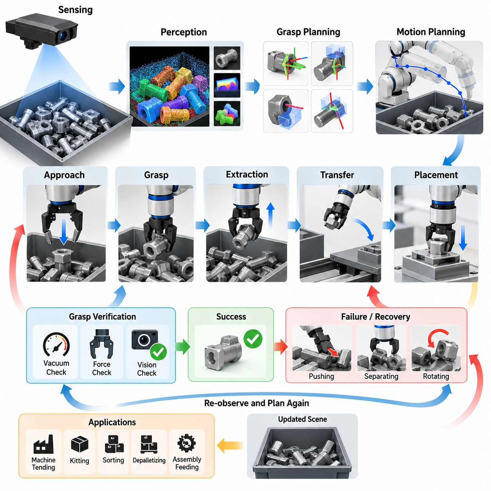
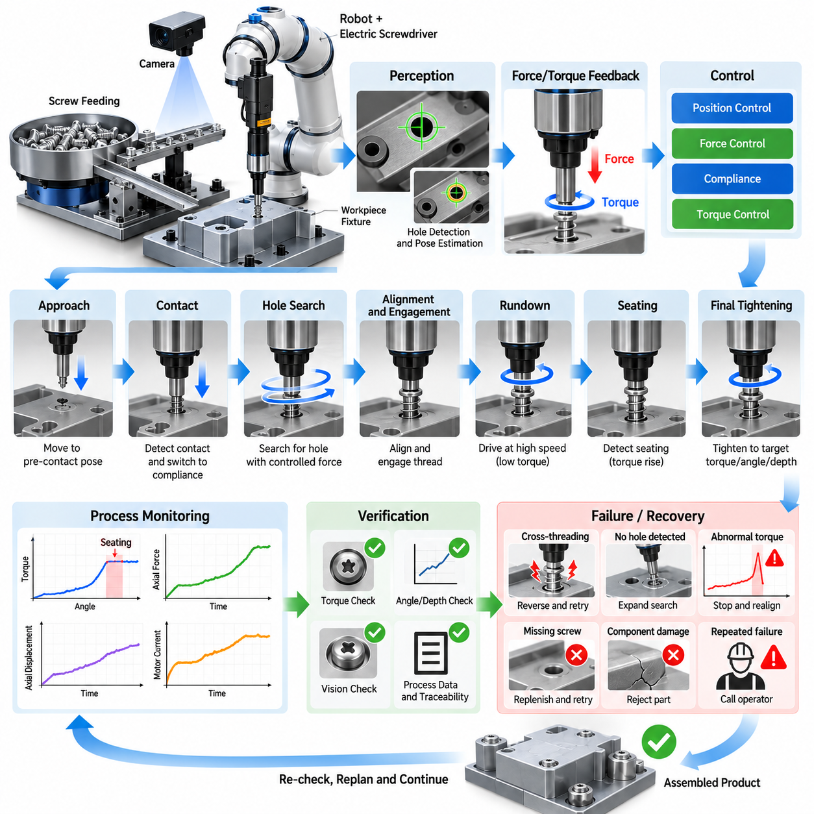
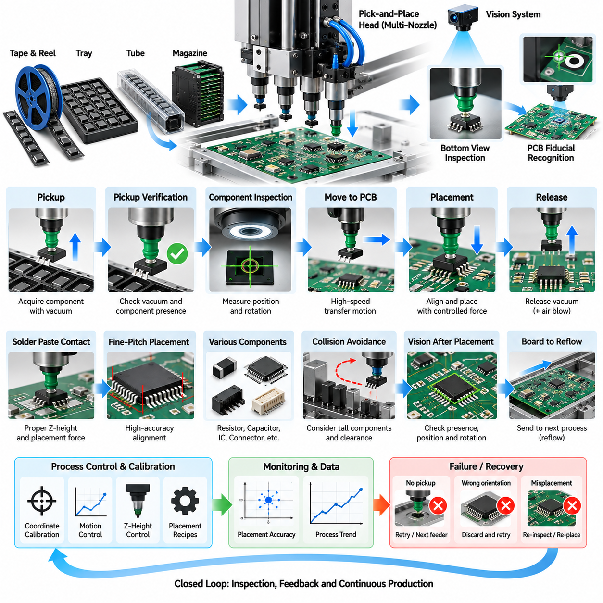
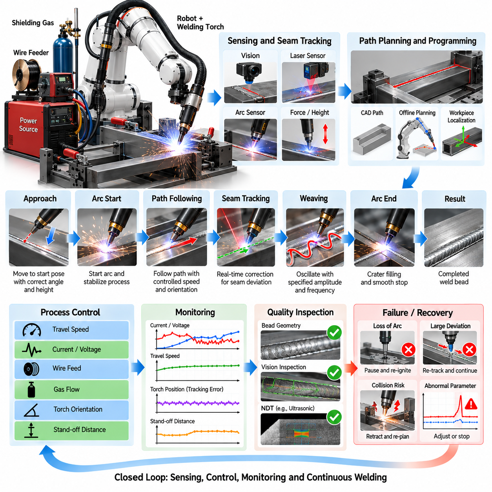
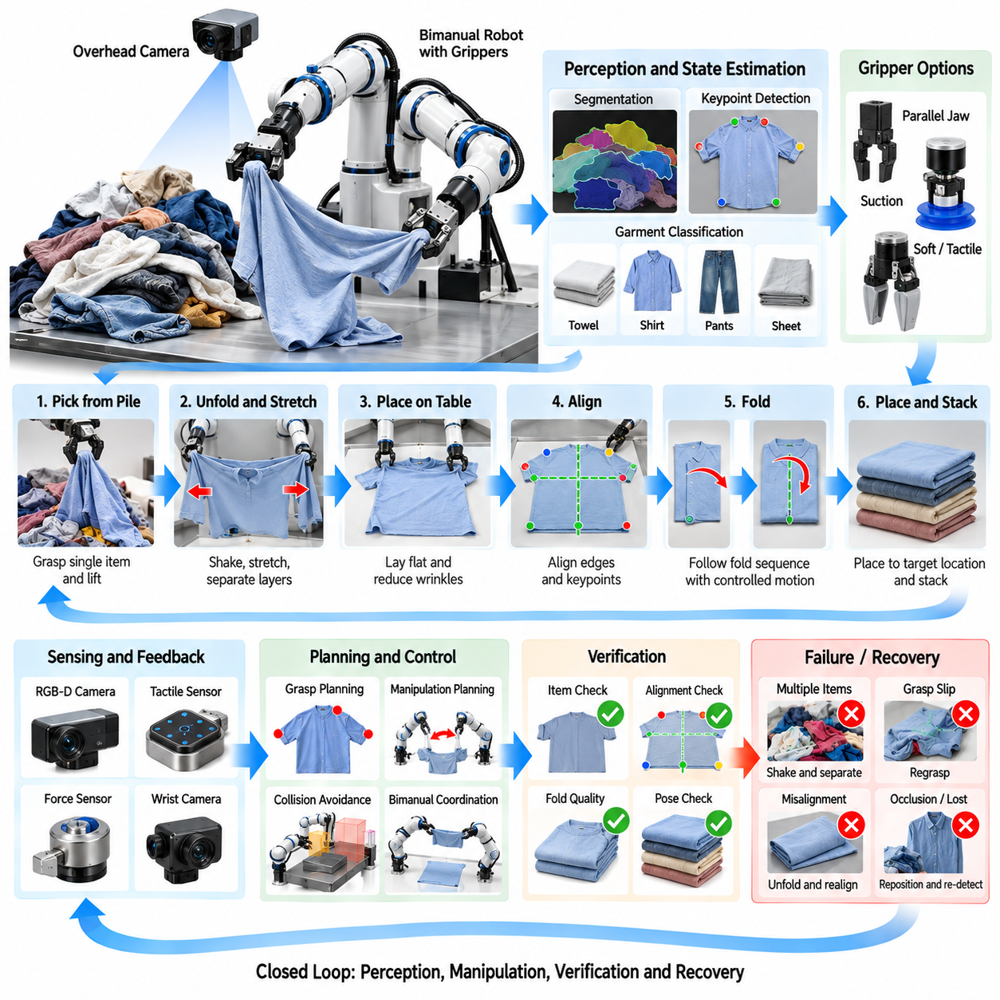
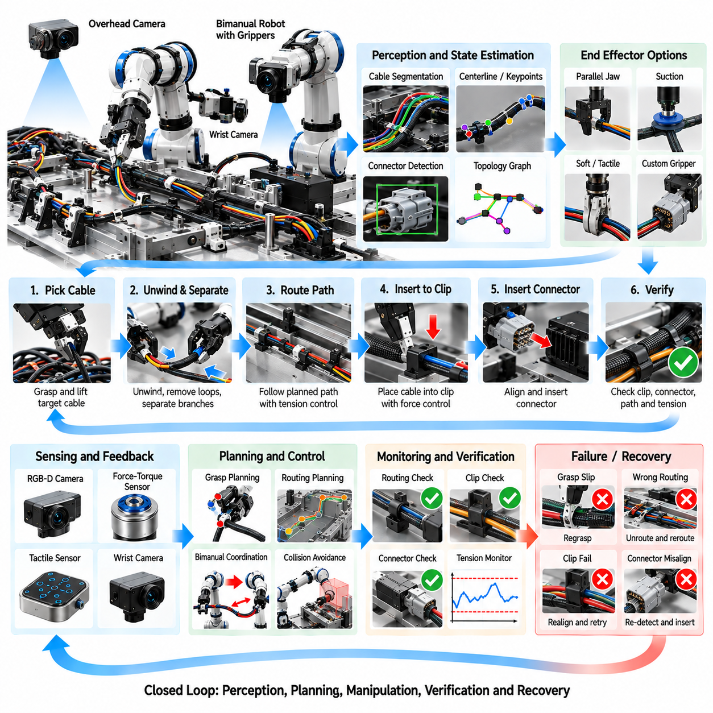
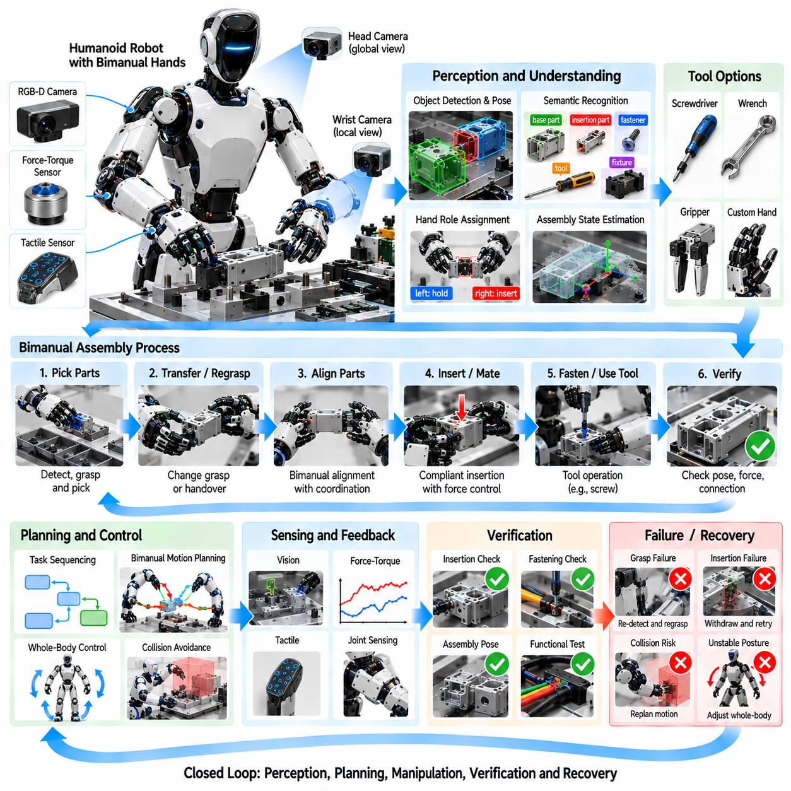
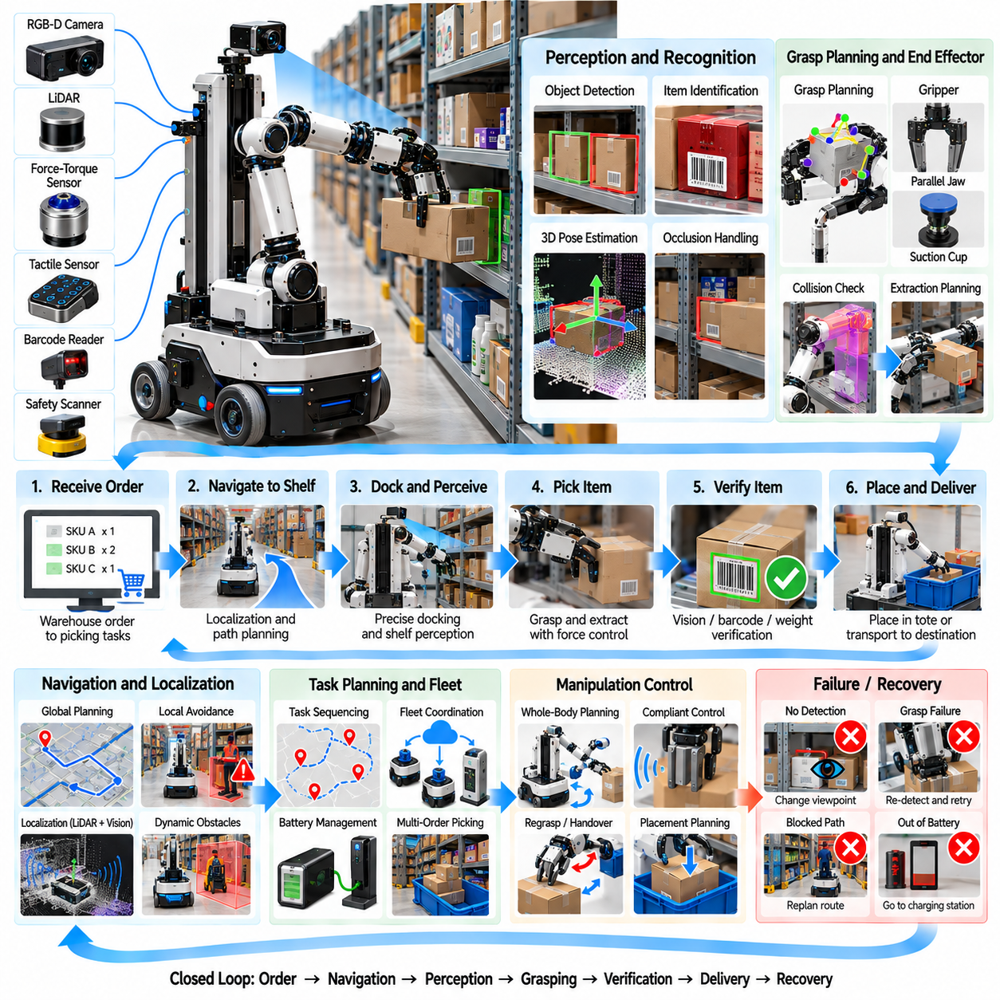
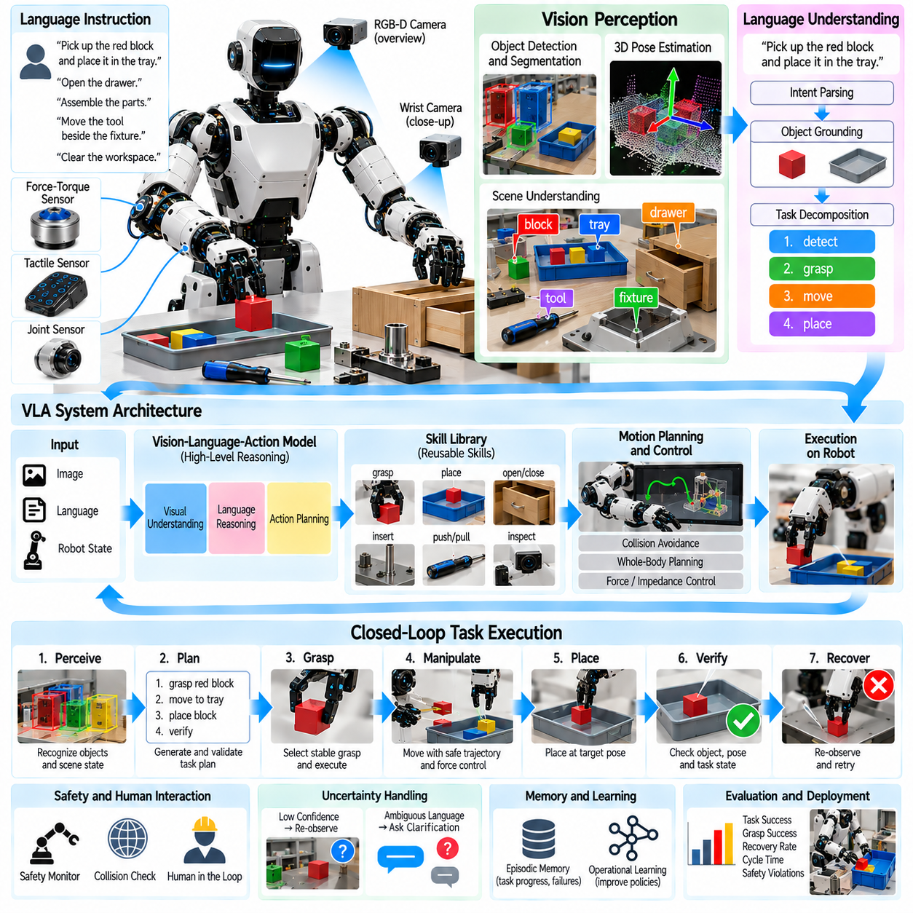
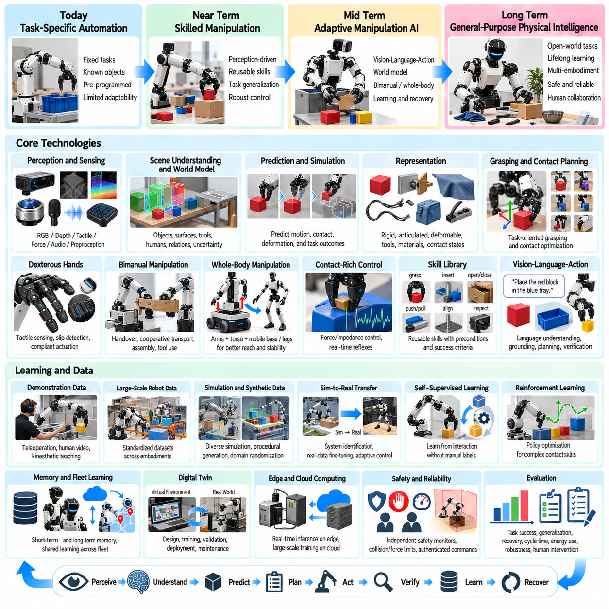

**Volume 17 Manipulation and Grasping AI**

# Chapter 12. Industrial Manipulation Case Studies

## 12.01. Bin Picking Random Pose Object Grasp Case

{width="7.268055555555556in" height="7.268055555555556in"}

Industrial bin picking is a representative manipulation problem in which a robot must detect, select, grasp, and extract objects that are randomly arranged inside a container. Unlike structured pick-and-place operations, the position and orientation of each object are unknown in advance, while neighboring objects create occlusion, contact, and geometric constraints. A successful system therefore requires perception, grasp planning, motion planning, and feedback control to operate as an integrated manipulation pipeline.

A typical application begins with a bin containing components delivered directly from manufacturing, storage, or logistics processes. Parts may overlap, lean against the container wall, become partially buried, or rest in mechanically unstable configurations. The robot must determine which object is currently accessible rather than simply identifying every visible object. This distinction transforms bin picking from an object-recognition problem into a sequential decision process in which each successful extraction changes the geometry of the remaining scene.

Perception commonly relies on RGB-D cameras, structured-light sensors, stereo vision, or industrial 3D scanners mounted above the bin or on the robot. The sensor produces color images, depth maps, or point clouds from which object surfaces and boundaries can be estimated. Calibration between the sensor, robot base, end effector, and workcell coordinate systems is critical because even accurate visual detection becomes ineffective when pose information cannot be transformed consistently into robot coordinates.

Random-pose objects create substantial difficulties for conventional pose estimation. An object may appear at arbitrary roll, pitch, and yaw angles, while only a fraction of its surface may remain visible. Reflective metal, dark materials, repetitive geometry, and textureless surfaces can further degrade depth measurements. Modern systems therefore combine geometric registration, feature matching, segmentation networks, learned pose estimators, or multi-view observations according to the characteristics of the target components.

Six-degree-of-freedom pose estimation provides a useful representation when the object geometry is known and a predefined grasp can be transformed according to the detected pose. However, estimating a complete object pose is not always necessary. Grasp-oriented perception can instead predict directly which visible surface regions support feasible gripper configurations. This approach is particularly effective when objects have multiple valid grasp poses or when precise semantic orientation is less important than reliable extraction.

The grasp planner evaluates candidate contacts according to geometric and physical criteria. For a parallel-jaw gripper, important factors include jaw opening, surface normals, antipodal contact quality, collision clearance, insertion depth, and expected resistance to external forces. Suction-based systems instead consider surface flatness, seal quality, local curvature, material permeability, and the direction of extraction. Hybrid end effectors may combine suction and mechanical gripping to increase the range of recoverable configurations.

A high grasp score alone does not guarantee a successful pick. The selected grasp must also be reachable without collisions involving the robot arm, wrist, gripper, bin walls, or neighboring objects. Consequently, grasp generation and motion feasibility should be evaluated together. Candidate grasps that appear geometrically stable can be rejected if inverse kinematics fails, joint limits are exceeded, or the required approach trajectory passes through occupied space inside the container.

Motion planning for bin picking is usually divided into approach, grasp, extraction, transfer, and placement phases. The approach trajectory moves the end effector toward a pre-grasp pose while maintaining collision clearance. The final insertion may require slower Cartesian motion because the gripper operates close to uncertain object surfaces. After grasp closure, extraction should initially follow a direction that minimizes interference before transitioning to a conventional collision-free trajectory toward the destination.

The extraction phase is particularly important because an apparently isolated object may be mechanically entangled with neighboring parts. Friction, hooks, cavities, cables, or irregular features can cause multiple objects to move together. Force and torque sensing can detect abnormal resistance during lifting and allow the controller to stop, retreat, or modify the extraction direction. Such feedback prevents excessive forces from damaging the product, gripper, robot, or container.

Grasp verification provides another essential feedback layer. Vacuum pressure can confirm suction attachment, while gripper position and motor current can indicate whether a mechanical grasp actually captured an object. Vision can also verify that the object has left the bin and that unintended secondary objects were not extracted. Without verification, a failed grasp may propagate downstream and produce placement errors, empty-machine loading, or incorrect production counts.

When no reliable grasp is available, an effective system should not repeatedly execute low-confidence attempts. Instead, it can perform active manipulation such as pushing, separating, rotating, or relocating obstructing objects to expose new graspable surfaces. The problem then becomes rearrangement planning rather than pure picking. This capability is especially valuable near the bottom of the bin, where the remaining objects often occupy difficult poses against corners and walls.

Deep learning has significantly improved grasp detection by learning relationships between local geometry and successful robot actions from large datasets or simulation. Networks can predict grasp poses directly from RGB-D images or point clouds and rank thousands of candidates rapidly. Synthetic data generation is particularly useful because randomized object poses, lighting conditions, sensor noise, materials, and bin configurations can be produced automatically without manually labeling every physical scene.

Simulation also supports systematic testing of rare and difficult configurations. Thousands or millions of randomized drops can generate diverse arrangements, after which candidate policies can be evaluated for grasp success, collision rate, cycle time, and bin-clearing performance. Domain randomization helps reduce the gap between simulation and reality, but physical validation remains necessary because real friction, compliance, depth-sensor artifacts, and contact dynamics are difficult to reproduce perfectly.

An industrial case may involve a six-axis robot positioned beside a deep parts bin, an overhead 3D camera, and a parallel-jaw or suction gripper. After acquiring the scene, the system segments visible objects, estimates candidate grasp configurations, filters them using collision geometry, and ranks the remaining candidates. The highest-ranked feasible grasp is transformed into robot coordinates, followed by approach, acquisition, extraction, verification, and delivery to the production fixture.

Cycle time must be considered together with grasp reliability. A highly sophisticated planner that spends several seconds searching for an optimal grasp may reduce overall productivity compared with a simpler method that generates a sufficiently reliable solution immediately. Industrial systems therefore frequently use staged computation: fast perception proposes likely grasps, inexpensive geometric tests eliminate obvious failures, and computationally intensive planning is reserved for difficult scenes or recovery operations.

Performance should consequently be measured at the system level rather than by perception accuracy alone. Relevant indicators include first-attempt grasp success, successful extraction rate, picks per hour, mean planning latency, collision frequency, recovery frequency, percentage of bins completely cleared, and average number of residual objects. Bin-clearing rate is particularly meaningful because systems that perform well on easy upper-layer objects may fail repeatedly when only difficult configurations remain.

Reliability also depends on handling uncertainty explicitly. Depth measurements, calibration, object pose, gripper alignment, friction, and robot positioning all contain errors. Robust grasp planning therefore favors configurations with sufficient geometric margin rather than theoretically optimal contacts located close to collision boundaries. Compliance in the end effector or robot controller can further absorb small alignment errors and reduce contact forces during insertion and acquisition.

Recovery behavior distinguishes a laboratory demonstration from a production-ready system. Failed suction, incomplete closure, unexpected contact, unreachable poses, perception loss, and dropped objects should each trigger defined responses. The robot may reacquire the scene, select another grasp, change the approach direction, perform a rearrangement action, or request operator assistance after repeated failures. Recovery logic allows the workcell to continue operating without treating every exception as a system-level fault.

The most effective architecture therefore forms a closed perception-action loop. Every pick changes the scene, so the system should observe the bin again rather than assuming that the previous world model remains valid. New sensor data updates object visibility, occupancy, and grasp opportunities, while execution feedback modifies confidence in the selected strategy. This continuous cycle of observe, plan, act, verify, and re-observe provides robustness against the inherent uncertainty of random-pose manipulation.

The bin-picking case illustrates a broader principle of industrial manipulation: autonomy emerges from coordinated perception, planning, control, and recovery rather than from a single high-performance algorithm. Reliable random-pose grasping requires the robot to reason simultaneously about object geometry, accessibility, collision constraints, contact mechanics, uncertainty, and production objectives. The resulting architecture provides a foundation for machine tending, kitting, sorting, depalletizing, assembly feeding, and other flexible manufacturing applications.

## 12.02. Screw Driving and Assembly Force Control Case

{width="7.268055555555556in" height="7.268055555555556in"}

Industrial screw driving and assembly are representative contact-rich manipulation tasks in which a robot must align components, establish controlled contact, insert a fastener, and achieve a specified tightening condition without damaging the product. Unlike free-space pick-and-place operations, success depends on interaction forces as well as geometric accuracy. Position control, force sensing, compliance, torque regulation, and process verification must therefore operate as one coordinated assembly system.

A typical automated station contains an industrial robot or collaborative robot, an electric screwdriver, a screw-feeding mechanism, fixtures, cameras, and force or torque sensing. Components are first positioned within an approximate assembly tolerance, while the robot compensates for the remaining uncertainty during execution. The objective is not simply to rotate a screw but to produce a mechanically correct joint with repeatable preload, seating condition, depth, and quality.

Geometric uncertainty is one of the fundamental difficulties of robotic screw driving. The nominal screw-hole position may differ from the actual position because of fixture tolerances, component deformation, manufacturing variation, calibration error, or accumulated robot positioning error. Even a small lateral or angular mismatch can prevent engagement, damage the thread, or cause cross-threading. The system therefore requires local alignment strategies rather than relying exclusively on programmed coordinates.

Vision can provide the initial estimate of the screw hole, component pose, and surrounding geometry. A camera mounted above the workstation or near the end effector can detect reference features and compensate for part-to-part variation. However, visual localization alone rarely represents the complete contact state once the screwdriver approaches the workpiece. Force, torque, motor current, displacement, and rotation signals become increasingly important during physical engagement.

The approach phase normally uses position or Cartesian motion control to bring the tool rapidly toward a predefined pre-contact pose. Motion speed is reduced near the expected surface to limit impact energy and allow reliable contact detection. When axial force exceeds a small threshold, the controller identifies physical contact and transitions from free-space motion to a compliant interaction mode. This state transition is essential for protecting both the fastener and the assembly.

Hole searching may be required when the uncertainty exceeds the allowable insertion tolerance. The robot can execute a spiral, raster, circular, or small oscillatory search while maintaining a controlled axial force against the surface. Changes in position and force reveal when the screw tip or alignment feature enters the target opening. Search parameters must be constrained carefully because excessive lateral motion can scratch the surface, deform the screw, or create false engagement.

Compliance allows the end effector to accommodate small position and orientation errors instead of forcing the programmed trajectory rigidly against the environment. Mechanical compliance may be provided by a remote-center-compliance device, floating tool holder, spring mechanism, or compliant coupling. Software compliance can be implemented through impedance control, admittance control, or hybrid position-force control. Industrial systems often combine mechanical and software compliance to increase robustness.

Hybrid position-force control separates motion objectives according to task direction. During screw engagement, the robot may regulate lateral position and tool orientation while controlling axial contact force along the screw axis. This prevents the screwdriver from pushing excessively into the workpiece while preserving alignment. The commanded force must be high enough to maintain bit engagement but sufficiently low to avoid component deformation, thread damage, or unnecessary friction.

The screw-driving phase begins only after alignment and contact conditions satisfy predefined criteria. The spindle rotates while the controller monitors torque, angular displacement, axial displacement, force, and motor current. These signals provide a dynamic description of the fastening process. Rather than treating screw driving as a simple rotation command, a production system interprets the evolving torque-angle and force-displacement behavior to determine whether engagement is normal.

Cross-threading is one of the most important failure modes. It can occur when the screw axis is misaligned with the threaded hole or when the first thread engages incorrectly. Abnormal torque may then appear much earlier than expected, often accompanied by insufficient insertion depth. A robust controller detects this signature, immediately stops rotation, reverses the screw, releases axial force, performs realignment, and attempts engagement again under controlled conditions.

Thread-start detection can also use a short reverse rotation before forward tightening. Reverse motion allows the screw thread to settle relative to the mating thread and can produce a detectable change when the starting point is reached. The controller then switches direction and begins insertion. Although the exact strategy depends on screw geometry and material, controlled thread-start behavior can substantially reduce damaged fasteners and rejected assemblies.

As the screw advances, the controller distinguishes the rundown region from the final tightening region. During rundown, torque remains relatively low because the screw is primarily overcoming thread friction. When the screw head or washer contacts the mating surface, torque begins to rise significantly. This seating event provides an important process landmark and allows the system to transition from high-speed driving to more precise final tightening.

Final tightening can be controlled using torque, angle, torque-plus-angle, depth, or combinations of these variables. Torque control is straightforward but can be affected strongly by friction variation. Angle-based strategies provide additional information about joint deformation after seating, while depth sensing can detect incomplete insertion. High-quality assembly systems therefore evaluate multiple signals instead of accepting a joint solely because a target torque value was reached.

Force control becomes particularly important when fastening compliant, fragile, thin, or stacked components. Excessive axial loading can bend panels, damage plastic housings, distort seals, or shift components before tightening is complete. The robot must maintain enough pressure to prevent bit cam-out while limiting forces transmitted into the assembly. Adaptive force regulation can modify the command according to measured contact behavior throughout the operation.

The screwdriver itself forms part of the closed-loop process. Electric fastening tools can provide spindle torque, rotation angle, speed, and completion status directly to the robot or cell controller. The robot contributes Cartesian position, orientation, contact force, and motion state. Combining these signals creates a richer process signature than either subsystem provides independently and supports more reliable detection of incomplete fastening or abnormal mechanical conditions.

Process verification should occur immediately after each screw-driving operation. Acceptance criteria may include final torque within a specified window, required angular displacement, correct insertion depth, stable seating force, and absence of abnormal torque peaks. Vision may additionally confirm screw presence and head position. The resulting measurements can be associated with the product identifier to provide traceability for manufacturing quality management.

Recovery logic is necessary because assembly failures cannot always be eliminated through tighter positioning tolerances. If contact is not detected, the robot can reacquire the target pose. If hole search fails, the search region can be expanded within safe limits. If abnormal torque indicates cross-threading, the screw can be reversed and retried. If repeated attempts fail, the component can be rejected or routed to an operator without stopping the entire production line.

Fixture design strongly influences robotic assembly performance. A fixture should constrain the workpiece sufficiently to resist tightening reaction forces while avoiding unnecessary overconstraint. Datum surfaces and locating features should provide repeatable reference geometry, and the assembly should remain accessible to the tool over the required approach range. Well-designed fixtures reduce the amount of uncertainty that perception and force control must compensate for dynamically.

Robot stiffness and fastening reaction torque must also be considered. A long tool extension or unfavorable arm configuration can produce deflection under load, changing screwdriver alignment during tightening. Motion planning should therefore select configurations with sufficient stiffness, joint margin, and collision clearance. In higher-torque applications, external reaction structures or specialized fastening equipment may be preferable to transmitting the complete reaction through the robot arm.

Cycle-time optimization requires different control behavior during different phases. Free-space approach can be fast, local search should be controlled but efficient, rundown can use relatively high spindle speed, and final tightening requires slower precision control. Applying conservative motion parameters to the entire process wastes production time. State-based control allows speed, force limits, compliance, and monitoring thresholds to change according to the current assembly phase.

A representative production sequence therefore progresses through target localization, approach, contact detection, local alignment, thread engagement, rundown, seating detection, final tightening, verification, and tool retraction. Each transition is triggered by measurable conditions rather than elapsed time alone. This event-driven architecture makes the process more tolerant of manufacturing variation because the robot responds to the actual physical state of the assembly.

Performance evaluation should extend beyond the percentage of screws successfully tightened. Useful metrics include first-attempt engagement rate, cross-thread frequency, mean alignment time, final torque variation, tightening-angle distribution, cycle time, retry rate, tool wear, component damage rate, and long-term process capability. Monitoring trends in these variables can reveal gradual degradation such as bit wear, fixture movement, calibration drift, or changes in incoming component quality.

Production data can also support predictive quality and adaptive control. Torque-angle curves, axial-force histories, tool displacement, and retry events can be stored for statistical analysis or machine-learning models. Abnormal signatures may indicate defective threads, missing washers, incorrect screws, damaged components, or tool deterioration. The fastening operation thus becomes not only an assembly action but also a source of information about the health and quality of the manufacturing process.

The screw-driving and force-controlled assembly case demonstrates the importance of integrating geometric intelligence with physical interaction intelligence. Vision determines approximately where the task should occur, while force, torque, displacement, and compliance reveal what is actually happening at the contact interface. By combining perception, compliant motion, fastening control, verification, and recovery within a closed loop, robotic systems can perform precise and repeatable assembly under realistic industrial uncertainty.

## 12.03. PCB Component Pick and Place Precision Case

{width="7.268055555555556in" height="7.268055555555556in"}

PCB component pick-and-place is a representative high-precision industrial manipulation task in which electronic components must be acquired, inspected, aligned, transported, and placed onto designated locations on a printed circuit board. The process combines rapid repetitive motion with micrometer-scale positioning requirements. Reliable operation therefore depends on tightly integrated mechanics, machine vision, calibration, motion control, vacuum handling, and continuous process verification.

A typical system receives components through tape-and-reel feeders, trays, tubes, or specialized component magazines. The placement head moves between the supply location and the PCB while one or more nozzles acquire components using vacuum. Unlike conventional robotic handling, the manipulated objects can be extremely small, lightweight, fragile, and geometrically diverse. Resistors, capacitors, integrated circuits, connectors, and fine-pitch packages require different handling parameters and placement strategies.

The PCB itself provides a structured but highly tolerance-sensitive workspace. Nominal component coordinates originate from electronic design and manufacturing data, but the actual board may be translated, rotated, warped, or dimensionally different from its ideal model. Fixture variation and conveyor positioning introduce additional uncertainty. Consequently, production equipment cannot simply execute nominal coordinates and must establish the actual board coordinate frame before precision placement begins.

Fiducial recognition is commonly used to determine this coordinate frame. Cameras identify global or local fiducial marks printed on the PCB, allowing the system to estimate translation, rotation, scale, and sometimes local geometric distortion. Global fiducials align the overall board, while local fiducials near fine-pitch devices can provide higher accuracy in critical regions. Accurate feature extraction and subpixel localization are essential when placement tolerances become very small.

Component acquisition begins by moving the placement nozzle to a feeder or tray location. The nozzle must match the component dimensions, mass, surface geometry, and available pickup area. Vacuum pressure is applied after contact or near-contact, and the system verifies whether a component has been successfully captured. Insufficient vacuum may indicate a missing component, incorrect pickup position, damaged nozzle, leakage, or a component whose surface is unsuitable for the selected nozzle.

Pickup dynamics must be controlled because small components can shift, rotate, adhere electrostatically, or remain attached to carrier material. Excessive vertical acceleration can cause loss of vacuum attachment, while unnecessary contact force can damage delicate packages. The machine therefore coordinates nozzle descent, contact detection, vacuum activation, lift motion, and acceleration profiles according to component-specific recipes. These parameters become increasingly important as component dimensions decrease.

After pickup, component inspection determines the actual position and orientation relative to the nozzle. Bottom-view cameras can image the component while it is being transported, enabling the system to detect edges, leads, balls, pads, or package contours. The measured offset in X, Y, and rotation is then compensated during placement. This closed-loop correction prevents pickup variation from being transferred directly into placement error on the PCB.

Machine vision must handle a wide range of package geometries and optical characteristics. Components may have reflective leads, dark molded bodies, metallic surfaces, low-contrast edges, or repeated patterns. Illumination geometry is therefore as important as the vision algorithm itself. Coaxial, ring, side, backlight, or multi-directional illumination can be selected to emphasize relevant features, while exposure and threshold parameters may be adapted for individual component families.

Calibration links camera pixels, machine coordinates, nozzle positions, feeder locations, and PCB coordinates into a consistent geometric model. Errors in this transformation accumulate directly into placement accuracy. Camera intrinsic calibration, camera-to-machine calibration, nozzle-center calibration, head-offset calibration, and height calibration must therefore be maintained carefully. Thermal expansion and mechanical drift can require periodic recalibration or automatic compensation during long production runs.

Placement accuracy depends not only on commanded position but also on repeatability, structural stiffness, vibration, servo performance, and settling behavior. High acceleration improves throughput but can excite mechanical vibration that degrades final positioning. Motion profiles must balance speed and precision by controlling jerk, acceleration, and settling time. Precision machines often separate high-speed transfer motion from a slower final approach phase near the target placement location.

Vertical placement control is equally important. The nozzle must lower the component until it contacts solder paste or the intended board surface without generating excessive force. Board thickness variation, warpage, fixture height, and package thickness can change the true contact position. Height sensing, laser measurement, force detection, or calibrated Z-axis models can compensate for these variations and prevent component damage or insufficient seating.

Solder paste introduces additional physical interaction effects. During placement, the component should contact the paste sufficiently to remain stable after release, but excessive compression can displace paste, bridge neighboring pads, or damage fine structures. Controlled placement force and Z-height are therefore required. For very small or fragile devices, even minor deviations in vertical motion can affect subsequent solder reflow quality and electrical reliability.

Component release must also be controlled precisely. Vacuum is removed once the device reaches its target pose, and positive air pressure may be applied briefly to ensure separation from the nozzle. If release occurs too early, the component can fall or shift before contacting the board. If release occurs too late, adhesion between the nozzle and component can disturb the intended position as the placement head retracts.

Fine-pitch integrated circuits present particularly demanding alignment requirements because many leads or solder connections must correspond simultaneously with PCB pads. Small translational or angular errors can create open circuits or bridging after reflow. Vision algorithms can therefore inspect individual leads, package edges, or ball-grid patterns rather than relying only on the package outline. Local PCB fiducials can further reduce alignment error around critical devices.

Very small passive components introduce another class of difficulties. Their low mass allows electrostatic forces, airflow, nozzle contamination, and solder-paste surface forces to influence orientation. Incorrect placement can contribute to tombstoning, skew, or missing-component defects after reflow. Stable pickup, controlled acceleration, accurate Z-height, and reliable release are therefore required even when the nominal component geometry appears simple.

Collision avoidance remains relevant despite the structured nature of PCB assembly. Previously placed tall components, connectors, shields, fixture elements, and neighboring machine structures can constrain nozzle access. Placement sequencing can be optimized so that low-profile components are installed before taller structures that would obstruct later operations. The system must consider nozzle geometry and head clearance as well as the component footprint itself.

Production throughput is commonly expressed in components per hour, but nominal head speed alone does not determine useful productivity. Feeder access time, vision inspection latency, nozzle changes, board transport, placement settling, retries, and machine interruptions all contribute to actual cycle time. Multi-nozzle heads improve throughput by carrying several components simultaneously, while optimized routing reduces unnecessary travel between feeders and placement locations.

Placement sequence optimization resembles a constrained routing problem. The machine must determine efficient pickup and placement orders while respecting feeder locations, nozzle compatibility, component priority, collision constraints, and process requirements. A theoretically shortest trajectory may not provide the highest production rate if it causes frequent nozzle exchanges or additional vision operations. Practical optimization therefore evaluates the entire machine cycle rather than geometric travel distance alone.

Process verification begins during pickup and continues through placement. Vacuum sensing verifies component acquisition, vision verifies component identity and orientation, and motion feedback confirms that the head reached the commanded location. Post-placement inspection can determine whether the component is present, centered, rotated correctly, and seated appropriately. These checks allow defects to be detected before they propagate into solder reflow or downstream assembly stages.

Automated optical inspection can provide an additional feedback layer after placement or soldering. Detected positional deviations can be analyzed statistically to distinguish random component variation from systematic machine error. A consistent offset across many placements may indicate calibration drift, feeder displacement, nozzle eccentricity, or board-registration error. Process data can therefore support both immediate quality control and long-term equipment maintenance.

Recovery behavior is necessary for production robustness. If vacuum pickup fails, the machine can retry the component or advance the feeder. If vision inspection rejects the acquired part, it can be discarded and replaced. If fiducial detection fails, illumination or search parameters can be adjusted before requesting operator intervention. Clearly defined recovery states prevent isolated component errors from causing unnecessary stoppage of the entire assembly line.

Traceability is increasingly important in electronics manufacturing. Each board can be associated with placement recipes, component lots, feeder positions, inspection results, machine parameters, timestamps, and detected abnormalities. Such records allow manufacturers to reconstruct production conditions when a quality problem appears later. They also provide structured datasets for statistical process control, predictive maintenance, and optimization of placement parameters.

Performance should therefore be evaluated using multiple metrics. Important indicators include pickup success rate, placement accuracy, rotational error, component loss rate, vision rejection rate, placement-force variation, components per hour, retry frequency, nozzle-change time, and defect rates observed after inspection or reflow. Process capability measures can determine whether positional distributions remain safely inside manufacturing tolerances rather than merely reporting average error.

The PCB pick-and-place case demonstrates how industrial manipulation changes when high throughput and extreme precision must be achieved simultaneously. Success emerges from coordinated sensing, geometric calibration, vacuum handling, high-performance motion control, local visual correction, controlled contact, verification, and recovery. The resulting closed-loop architecture enables electronic assembly systems to place diverse components rapidly while maintaining the accuracy and repeatability required for reliable mass production.

## 12.04. Welding Torch Manipulation Path Following Case

{width="7.268055555555556in" height="7.268055555555556in"}

Robotic welding torch manipulation is a representative continuous-path industrial task in which the end effector must follow a joint with controlled position, orientation, velocity, and stand-off distance while maintaining a stable welding process. Unlike discrete pick-and-place operations, welding quality depends on the complete trajectory over time. Small path errors can change penetration, bead geometry, heat input, and joint strength, so sensing, planning, motion control, and process regulation must operate continuously.

A typical robotic welding cell contains a six-axis industrial robot, welding torch, power source, wire feeder, workpiece fixture, shielding-gas system, and safety equipment. Additional sensing may include laser seam trackers, cameras, arc sensors, force sensors, or thermal monitoring. The robot provides spatial manipulation while the welding system controls electrical and material parameters. Successful operation requires both subsystems to remain synchronized throughout the complete weld.

The nominal welding path is commonly generated from CAD geometry, offline programming, teaching, or manually recorded robot poses. This reference trajectory defines the expected seam position and the desired torch orientation along the joint. However, the actual workpiece rarely matches the nominal model perfectly. Manufacturing tolerances, fixture variation, thermal deformation, assembly gaps, and part positioning errors can shift the real seam away from the programmed trajectory.

Workpiece localization is therefore performed before welding begins. Vision systems, touch sensing, laser scanners, or known reference features can determine the transformation between the nominal workpiece coordinate frame and the actual installed part. The robot then updates the welding trajectory using this transformation. Global registration can compensate for overall displacement, but local seam deviations may still require real-time tracking during execution.

Torch pose is defined by more than the position of the tool center point. Travel angle, work angle, electrode orientation, contact-tip-to-work distance, and lateral offset relative to the seam all influence welding behavior. The robot must therefore regulate a full six-degree-of-freedom trajectory rather than merely moving along a geometric line. Orientation transitions must remain smooth to avoid sudden changes in arc direction or torch accessibility.

Path generation should consider the geometry of the joint itself. Butt joints, lap joints, fillet welds, curved seams, corners, and three-dimensional intersections impose different torch-access requirements. Surface normals and seam tangents can be used to construct a local coordinate frame along the weld. From this frame, the desired travel angle and work angle can be defined consistently even when the seam curves through three-dimensional space.

Trajectory interpolation converts discrete path points into smooth robot motion. Linear, circular, spline, or higher-order interpolation may be used depending on seam geometry and controller capability. Excessively sparse waypoints can cause geometric deviation, while unnecessarily dense points increase programming complexity and may create controller discontinuities. The objective is to preserve seam accuracy while maintaining smooth velocity, acceleration, and orientation profiles.

Welding speed is a critical process variable because it directly influences heat input per unit length. If the robot moves too slowly, excessive heat can increase penetration, distortion, and bead width. If it moves too quickly, fusion may become incomplete and the bead may become narrow or discontinuous. The trajectory controller must therefore maintain commanded travel speed even when robot joint velocities change substantially along complex paths.

Robot kinematics can make constant Cartesian welding speed difficult. A smooth tool path may require rapidly changing individual joint velocities, especially near singularities or unfavorable arm configurations. Offline simulation can identify such regions before production. Path placement, robot base position, workpiece orientation, and external-axis configuration can then be modified to provide adequate joint margin and avoid sudden velocity amplification.

External positioners are frequently used to improve accessibility and weld quality. A rotary table, tilt positioner, or multi-axis workpiece manipulator can reorient the component while the robot controls the torch. Coordinated motion between the robot and external axes allows the weld to remain in a favorable position and reduces extreme robot postures. This creates a multi-axis path-following problem requiring synchronized trajectory generation.

Real-time seam tracking compensates for deviations that cannot be predicted from nominal geometry. A laser profile sensor mounted near the torch can measure the joint shape ahead of the welding point and estimate lateral and vertical seam offsets. The controller applies these corrections gradually to the reference path. Filtering is required because raw sensor measurements can contain noise, reflections, spatter interference, and temporary feature loss.

Vision-based seam tracking can use cameras with optical filtering to observe the joint, weld pool, or structured laser pattern. The severe brightness and dynamic range of the welding arc make ordinary imaging difficult, so illumination, exposure, filtering, and sensor placement must be carefully designed. Image processing or learned perception models can estimate seam center, joint boundaries, gap width, and torch offset for feedback control.

Arc sensing provides another method of tracking the joint using electrical characteristics of the welding process itself. Variations in welding current or voltage can contain information about torch position relative to the joint, particularly during weaving motion. Because arc sensing does not require a separate optical line of sight, it can be useful in environments where smoke, spatter, or restricted geometry makes external vision difficult.

Weaving trajectories are used when the torch must oscillate across the seam rather than follow only its centerline. Weave amplitude, frequency, dwell time, and waveform influence sidewall fusion and bead shape. The controller superimposes this local oscillation onto the global seam trajectory while preserving forward travel speed. Seam tracking and weaving must be coordinated carefully because both modify the commanded torch position.

Stand-off distance control is essential for maintaining stable process conditions. Variations in workpiece height, distortion, or path estimation can change the distance between the torch and surface. Depending on the welding process, arc voltage, laser measurements, or geometric sensing can provide feedback related to this distance. The controller can then adjust the torch position while preserving the required seam-relative orientation.

Welding parameters must be synchronized with robot motion. Current, voltage, wire-feed speed, travel speed, shielding-gas flow, and waveform settings may vary according to joint geometry or path region. A corner, gap change, start region, or termination region may require different parameters from a long straight segment. Modern cells therefore execute a coordinated process recipe rather than treating robot trajectory and welding power as independent commands.

Weld starts and stops require specialized motion because defects frequently occur at these transitions. Arc ignition should occur only after the torch reaches an acceptable start pose and process conditions are ready. At termination, crater filling, controlled deceleration, wire control, or brief dwell may be required. Lead-in and lead-out trajectories can move transition effects away from structurally critical regions of the final joint.

Thermal deformation creates a dynamic source of path error. As welding progresses, local heating and cooling can distort the workpiece and move the remaining seam relative to its original location. Long welds, thin structures, and asymmetric assemblies are particularly sensitive. Appropriate weld sequencing, fixture design, intermittent welding strategies, real-time tracking, and adaptive path correction can reduce the influence of accumulated distortion.

Collision avoidance must consider both static and evolving constraints. The robot arm, torch body, cable package, sensor, workpiece, fixture, and positioner can interfere with one another during motion. A tool-center trajectory that is geometrically valid may still produce a collision elsewhere on the robot. Offline simulation and online monitoring should therefore evaluate the complete robot configuration throughout the welding path.

Cable management is especially important because welding torches carry power, wire, gas, cooling lines, and sensor connections. Large wrist rotations can twist or stretch the cable package even when the robot itself remains within joint limits. Path planning should minimize unnecessary wrist rotation and account for cable routing. Dedicated hollow-wrist robots or integrated dress packages can improve repeatability and reduce maintenance.

Process monitoring provides evidence that the commanded trajectory produced an acceptable weld. Robot position, travel speed, current, voltage, wire-feed rate, seam-tracking corrections, and fault states can be recorded continuously. Additional sensing may estimate temperature, bead geometry, or weld-pool behavior. Combining motion and process data creates a time-aligned record that supports quality assessment and production traceability.

Abnormal conditions require immediate recovery behavior. Loss of arc, wire-feed interruption, excessive seam-tracking error, sensor loss, collision detection, shielding-gas failure, or unexpected process values should trigger controlled responses. Depending on severity, the system may pause, retract the torch, reacquire the seam, restart from an overlap region, or request operator intervention rather than continuing a defective weld.

Quality inspection can occur during or after welding. In-process monitoring can detect deviations from expected electrical or geometric signatures, while post-process inspection may use vision, laser profiling, ultrasonic testing, or other nondestructive methods. Bead width, reinforcement, undercut, continuity, position, and surface defects can be compared with acceptance criteria. Inspection results can then be associated with the recorded trajectory and process history.

Adaptive welding extends this architecture by modifying parameters according to measured joint conditions. If sensing identifies a changing gap, seam position, or geometry, the system can adjust travel speed, weaving, wire feed, torch pose, or electrical parameters within validated limits. This transforms the robot from a trajectory playback device into a closed-loop process system that responds to physical variation in the workpiece.

Performance evaluation should include both robotic and welding metrics. Relevant indicators include path-tracking error, orientation error, seam-tracking correction, velocity stability, stand-off variation, arc-on time, cycle time, restart frequency, defect rate, bead geometry consistency, and first-pass acceptance rate. Evaluating only robot repeatability is insufficient because excellent motion accuracy does not guarantee a metallurgically acceptable weld.

The welding torch path-following case demonstrates how industrial manipulation can become a continuous interaction between geometric planning and physical process control. The robot must follow a spatial trajectory while sensing seam variation, maintaining torch orientation, regulating velocity, coordinating welding parameters, and reacting to disturbances. Closed-loop integration of localization, path planning, seam tracking, motion control, process monitoring, inspection, and recovery enables consistent welding quality under realistic manufacturing uncertainty.

## 12.05. Cloth Folding Laundry Manipulation Case

{width="7.268055555555556in" height="7.268055555555556in"}

Cloth folding and laundry manipulation are representative deformable-object manipulation tasks in which a robot must perceive, grasp, unfold, align, fold, and place materials whose geometry changes continuously during interaction. Unlike rigid objects, garments do not preserve a fixed pose that can be represented by a simple six-degree-of-freedom transform. Their state depends on wrinkles, folds, self-contact, gravity, friction, and previous manipulation actions.

A typical robotic laundry system contains one or two manipulator arms, RGB or RGB-D cameras, a work surface, suitable grippers, and a perception and planning computer. Bimanual manipulation is particularly useful because one hand can hold or tension the fabric while the other performs alignment or folding. The workcell may also include overhead cameras, wrist cameras, tactile sensing, air-assisted devices, or specialized folding surfaces depending on the target application.

The initial state of a garment is often highly uncertain. Laundry may arrive in a pile where individual items overlap, become entangled, or hide most of their surfaces. Before folding can begin, the robot must isolate an item and estimate which visible regions belong to it. Segmentation therefore becomes the first major perception problem, especially when garments have similar colors, complex patterns, or severe mutual occlusion.

Picking a garment from a pile differs fundamentally from grasping a rigid component. The robot may capture several fabric layers or multiple garments simultaneously, while a visually promising point may slip from the gripper during lifting. Candidate grasp locations should therefore consider accessibility, local thickness, edge likelihood, friction, and the probability that the grasp belongs to only one item. Lift-and-observe actions can provide additional information after an uncertain pickup.

Once lifted, gravity can simplify the garment configuration by allowing loose fabric to hang downward. The robot can exploit this effect to separate layers, expose boundaries, and reduce complex self-contact. A second arm may grasp another point and stretch the garment gently to reveal its structure. Such active perception demonstrates that manipulation itself can be used to improve sensing rather than treating perception and action as independent stages.

Garment state estimation requires representations different from conventional rigid-body pose estimation. The system may identify keypoints such as corners, sleeve ends, collars, waist regions, cuffs, or hem points and infer the garment configuration from their relationships. Other approaches estimate contours, segmentation masks, dense correspondence, meshes, or learned latent representations. The appropriate representation depends on whether the task requires classification, unfolding, alignment, or precise folding.

Keypoint detection is especially useful for structured folding tasks. For a towel, the four corners may provide enough information to determine a folding strategy. A shirt requires more semantic structure, including shoulders, sleeves, collar, and lower corners. Vision networks trained on real or synthetic images can predict these landmarks despite wrinkles and partial occlusion, but confidence should be considered because an incorrect semantic keypoint can lead to a completely inappropriate manipulation sequence.

Unfolding generally precedes precise folding because heavily crumpled fabric provides poor geometric references. The robot can perform shaking, lifting, spreading, dragging, or bimanual stretching actions to increase the visible surface area and reduce wrinkles. The objective is not necessarily to achieve a perfectly flat state but to create a configuration from which important landmarks and fold lines can be estimated reliably.

A work surface introduces useful physical constraints. When the garment is placed on a table, gravity restricts much of the fabric to a two-dimensional support plane, simplifying perception and planning. The robot can drag corners along the surface, smooth wrinkles, or align edges with reference directions. However, table friction can also produce unexpected deformation, so planned motions must consider how fabric slides, stretches, and rotates during contact.

Gripper design strongly affects manipulation reliability. Parallel-jaw grippers can provide secure pinching but may have difficulty acquiring a single thin layer from a flat surface. Suction devices can lift fabric from broad areas but their performance depends on porosity and surface texture. Specialized fingertips, compliant pads, needles, electroadhesion, or hybrid grippers can improve handling. The end effector should be selected according to garment material and task requirements.

Bimanual coordination expands the range of achievable actions. Two arms can grasp opposite corners, tension an edge, rotate a suspended garment, or create a fold while maintaining alignment. The motion of one arm changes the fabric state observed by the other, so independent arm planning is insufficient. Coordinated trajectories must consider relative hand positions, fabric tension, collision avoidance, and the expected deformation between grasp points.

Folding can be represented as a sequence of geometric transformations defined by fold lines and target regions. For a rectangular towel, one side can be reflected across a fold line and placed onto the opposite region. More complex garments require semantic fold sequences, such as folding sleeves inward before folding the body. The planner converts the desired final shape into intermediate fabric configurations and corresponding robot actions.

The actual fabric trajectory cannot be predicted perfectly from geometric reflection alone. Material stiffness, thickness, friction, elasticity, and existing wrinkles affect how the cloth moves and settles. A robot may therefore execute a nominal fold, observe the result, and correct residual misalignment before continuing. This perception-action-feedback cycle is more robust than assuming that a commanded gripper trajectory produces an exact fabric configuration.

Force and tactile sensing can improve reliability during cloth interaction. Gripper force provides information about whether fabric has been captured, while tactile arrays can estimate contact location, slip, or layer thickness. During bimanual stretching, measured tension can prevent excessive pulling that would deform delicate garments. These signals complement vision when fabric is occluded by the gripper or when visual appearance provides insufficient information about contact.

Slip detection is particularly important because cloth can move gradually through the fingers without an obvious visual event. Changes in tactile pressure, gripper position, motor current, or observed keypoint motion can indicate loss of grasp stability. The controller can increase gripping force within safe limits, reduce acceleration, or regrasp the material. Preventing uncontrolled slip helps preserve the correspondence between the estimated and actual garment state.

Learning-based approaches are increasingly used because manually modeling every possible fabric configuration is impractical. Imitation learning can acquire folding strategies from human demonstrations, while reinforcement learning can optimize manipulation policies in simulation or through physical interaction. Vision-language-action or transformer-based policies can also learn relationships between visual observations, semantic garment structure, and manipulation actions across multiple task types.

Simulation provides large-scale training data but deformable-object simulation is computationally demanding. Accurate cloth behavior requires modeling bending, stretching, self-collision, friction, contact, and sometimes anisotropic material properties. Simplified simulators can generate diverse configurations efficiently, while domain randomization varies fabric parameters, colors, textures, lighting, and camera conditions. Physical fine-tuning is still important because real cloth behavior can differ significantly from simulation.

Synthetic data can also support perception independently of manipulation dynamics. Virtual garments can be rendered in thousands of shapes, folds, viewpoints, textures, and occlusion conditions while automatically providing segmentation masks, depth, keypoints, surface correspondence, and fold labels. Such datasets reduce manual annotation effort and expose perception models to configurations that may be difficult to collect systematically in a physical laundry environment.

Verification should occur after every major manipulation step. After pickup, the system verifies that one garment was acquired. After unfolding, it checks whether sufficient surface area and keypoints are visible. After alignment, it measures edge and landmark errors. After each fold, the resulting silhouette and corner positions can be compared with the desired intermediate state. This prevents early errors from propagating through the complete folding sequence.

Recovery actions are essential because deformable-object manipulation contains unavoidable uncertainty. If multiple garments are lifted together, the robot can shake, separate, or return them to the pile. If a keypoint disappears, the garment can be repositioned for better observation. If a fold produces excessive misalignment, the robot can unfold the affected region, smooth the surface, regrasp a corner, and repeat the action instead of discarding the entire sequence.

Task success should not be measured only by whether the robot completed a predefined motion. Useful metrics include single-item pickup success, keypoint localization error, unfolding quality, visible-area ratio, corner alignment error, fold-line deviation, final silhouette similarity, wrinkle level, cycle time, regrasp frequency, and recovery rate. For commercial laundry applications, stack consistency and garments processed per hour are also important system-level indicators.

Different garments require different manipulation strategies. Towels and sheets are dominated by corner and edge geometry, while shirts and trousers require semantic understanding of sleeves, legs, waistlines, and collars. Delicate fabrics may require low gripping force, while heavy materials demand stronger grasping and larger arm workspace. A general laundry system should therefore classify the item and adapt perception, grasping, and folding policies accordingly.

Laundry manipulation also illustrates the importance of state transitions rather than a single final goal. A garment may progress from pile state to isolated state, suspended state, partially unfolded state, flat state, aligned state, folded state, and stacked state. Each stage provides different observations and available actions. Explicitly modeling these stages enables the controller to select appropriate perception and manipulation strategies as the task evolves.

A practical production architecture therefore operates as a closed loop of observe, estimate state, select action, manipulate, and verify. The world model must be updated after every significant contact because the cloth configuration may change in ways that cannot be predicted exactly. Confidence estimates can determine whether the robot should continue the planned sequence, perform an information-gathering action, or execute a recovery behavior.

The cloth-folding and laundry case demonstrates a central challenge of advanced industrial manipulation: the robot must control objects whose state is created by the interaction itself. Reliable performance emerges from active perception, deformable-state estimation, suitable gripping, bimanual coordination, compliant control, learning, verification, and recovery. These principles extend beyond laundry to textiles, flexible packaging, cables, sheets, membranes, and many other deformable materials encountered in future automated production.

## 12.06. Cable Routing Harness Assembly Manipulation Case

{width="7.268055555555556in" height="7.268055555555556in"}

Cable routing and harness assembly are representative deformable-object manipulation tasks in which a robot must grasp, orient, route, insert, clip, connect, and verify flexible components whose configuration changes during handling. Unlike rigid parts, a cable cannot be described adequately by a single pose because bending, twisting, gravity, friction, and contact determine its shape. Reliable automation therefore requires perception, manipulation planning, force control, and verification to operate in a continuous closed loop.

A typical harness assembly cell contains one or two robot arms, RGB-D or stereo cameras, force-torque sensors, suitable grippers, fixtures, clips, connectors, and a harness board or product structure. Bimanual manipulation is valuable because one arm can maintain tension or hold a reference point while the other routes the free section. Wrist cameras and tactile sensors can provide local information when connectors, clips, or cable segments become occluded from overhead vision.

The initial configuration of a cable may be highly uncertain. A flexible cable can arrive coiled, twisted, crossed over itself, or mixed with other harness branches. Before routing begins, the robot must identify the correct cable and estimate its visible centerline, endpoints, connectors, branches, and relevant attachment features. Segmentation is challenging because thin cables occupy relatively few image pixels and may have similar colors to the background or neighboring wires.

Cable state estimation commonly represents the object as an ordered curve rather than a rigid-body pose. Vision can extract a centerline or sequence of keypoints that approximates the cable geometry in two or three dimensions. Endpoints and connectors receive special semantic labels because they often determine the next manipulation action. For branched harnesses, the representation can be extended into a graph containing junctions, branches, connectors, clips, and routing targets.

Occlusion makes complete state reconstruction difficult. Portions of a cable may disappear beneath another branch, behind a fixture, or inside a routing channel. The system should therefore distinguish observed geometry from inferred geometry and maintain uncertainty about hidden segments. Active perception can reduce this uncertainty by lifting a cable, moving a branch, changing the camera viewpoint, or tensioning the cable so that its structure becomes easier to observe.

Cable grasp planning depends strongly on the next task. A grasp near the connector may be appropriate for insertion, whereas routing through clips may require holding the cable at an intermediate point. The robot should consider local curvature, available clearance, cable diameter, grasp stability, and the risk of damaging insulation. Grasping too far from the active region can produce uncontrolled bending, while grasping too close may block access to the target feature.

Connector handling adds rigid-body manipulation to the deformable cable problem. The connector has a defined position and orientation, but the attached cable applies forces and moments that influence insertion. Vision can estimate the connector pose, while the robot plans an approach aligned with the mating interface. Cable slack must be managed simultaneously so that tension does not rotate the connector or pull it away from the intended insertion trajectory.

Routing is usually defined by a sequence of geometric and topological constraints. A cable may need to pass on a specified side of an obstacle, through a guide, beneath a bracket, around a corner, and into several clips before reaching its connector. Simply matching the final cable shape is insufficient because an incorrect path around an obstacle can create the wrong topology even if the endpoints are correctly positioned.

Topological reasoning is therefore important for harness assembly. The planner must preserve relationships such as over, under, inside, outside, left, and right while moving the cable through the product structure. Incorrect routing can create crossings, interference, excessive bending, or assembly problems later in production. A graph-based world model can represent routing landmarks and connectivity while geometric planning handles precise three-dimensional motion between them.

Bimanual manipulation provides direct control over cable shape and tension. One arm can anchor a routed segment while the second moves another section toward the next guide. The arms can also stretch the cable gently to remove loops or coordinate motions to reposition a connector without disturbing previously completed routing. Planning must account for inter-arm collision, cable tension, and deformation produced between the two grasp locations.

Tension management is a central control problem. Too little tension allows loops and uncertain cable motion, while excessive tension can damage conductors, pull connectors, deform clips, or disturb previously installed sections. Force-torque sensors can estimate interaction forces, and compliant control can regulate tension while the robot moves. Desired tension may change according to whether the system is straightening, routing, clipping, or inserting a connector.

Cable insertion into a clip is a contact-rich operation. The robot must position the cable over the clip opening and apply force in a direction that causes the cable to snap into place without damaging the insulation or fixture. Position uncertainty and cable compliance make purely position-controlled insertion unreliable. Force control, impedance control, or admittance control can allow the end effector to accommodate small alignment errors during contact.

Clip insertion can be verified using several signals. A characteristic force peak followed by a sudden decrease may indicate successful snap engagement. Vision can check whether the cable lies inside the clip, while tactile sensing can detect local contact changes. Combining geometric and force information is more reliable than relying on a single signal because different clip designs, cable diameters, and material properties produce different insertion signatures.

Connector insertion requires even tighter control. The robot must align translational and rotational degrees of freedom before applying insertion force. Chamfers and mechanical guides may tolerate small errors, but excessive misalignment can bend terminals or damage locking features. A compliant search motion can help locate the mating interface, after which the robot advances while monitoring force and displacement for abnormal resistance.

Insertion completion should be verified rather than inferred from commanded motion. Final depth, force profile, connector pose, latch engagement, or an audible or tactile click may provide evidence of successful connection. Electrical continuity testing can offer an additional verification layer for completed harness assemblies. If insertion force rises prematurely, the controller should stop and retreat rather than forcing the connector into a potentially incorrect state.

Twist control is another important aspect of harness manipulation. A cable or multi-wire bundle can accumulate torsion as connectors are rotated or branches are repositioned. Excessive twist may increase stress, alter routing geometry, or make subsequent assembly difficult. The system can track connector orientation and cable shape to estimate torsional state and deliberately rotate a grasp or release and regrasp the cable when twist becomes excessive.

Minimum bend radius must be respected throughout planning and execution. Sharp bending can damage conductors, shielding, optical fibers, or insulation even when no immediate external defect is visible. Path planning should therefore penalize configurations with excessive curvature and maintain cable geometry within validated mechanical limits. Different cable types may require different bending constraints, making material-specific manipulation parameters necessary.

Harness boards and fixtures can simplify the task by providing known routing landmarks. Pegs, channels, clips, and connector mounts constrain the possible cable configurations and reduce uncertainty. However, fixture tolerances still influence the actual geometry. Vision or touch sensing can localize critical features before interaction, allowing the robot to update nominal routing targets rather than assuming that every clip and connector occupies its exact CAD position.

Motion planning must consider both robot geometry and cable geometry. A collision-free arm trajectory can still cause the cable to sweep across obstacles, become hooked, or pull against previously routed branches. The planner therefore needs an approximate prediction of the cable envelope during motion. Conservative swept-volume models can provide practical collision protection even when exact deformable simulation is too computationally expensive for real-time operation.

Deformable-object simulation can support planning, training, and validation. Cable models may approximate the object using chains of rigid segments, rods, particles, finite elements, or differentiable physical representations. Important properties include bending stiffness, torsional stiffness, stretching resistance, friction, and contact. Simulation can generate difficult configurations and evaluate manipulation strategies before deployment, although real-world calibration remains necessary.

Learning-based methods can complement analytical modeling where cable dynamics are difficult to predict. Imitation learning can acquire routing skills from human demonstrations, while reinforcement learning can optimize local actions such as clip insertion or cable straightening. Learned perception models can estimate cable centerlines, endpoints, connectors, and occluded segments. Hybrid architectures often combine learned perception with geometric planning and force-controlled execution.

Verification should be performed after each routing milestone rather than only at the end of assembly. The system can confirm that a cable passed the correct side of an obstacle, entered the intended guide, engaged a clip, preserved acceptable slack, and reached the correct connector. Incremental verification prevents an early topological error from becoming hidden beneath later harness branches and requiring extensive rework.

Recovery behavior is essential because flexible-object manipulation inevitably produces unexpected configurations. If the cable slips from the gripper, the robot can reacquire it from a visible segment. If a loop forms, the system can lift and straighten the affected region. Failed clip insertion can trigger local realignment and retry, while abnormal connector force can cause withdrawal, visual reinspection, and another controlled insertion attempt.

Performance evaluation should include more than final assembly completion. Relevant metrics include cable segmentation accuracy, endpoint localization error, routing success rate, clip engagement rate, connector insertion success, peak interaction force, tension variation, minimum bend-radius violations, regrasp frequency, cycle time, recovery rate, and final topology correctness. These measures reveal whether the process is mechanically safe as well as geometrically successful.

Production traceability can associate each harness with routing results, connector forces, clip insertion signatures, vision checks, electrical tests, retries, and detected abnormalities. Statistical analysis of this information can reveal fixture drift, gripper wear, changing cable properties, or recurring difficulties at specific routing locations. The manipulation system thus becomes a source of manufacturing-quality information as well as an assembly mechanism.

Cable routing and harness assembly demonstrate how industrial manipulation must integrate geometric, topological, and physical reasoning. The robot must understand where cable segments are located, how they should pass through the environment, and how forces propagate through a flexible object during interaction. Closed-loop integration of perception, bimanual manipulation, compliant control, topology-aware planning, verification, and recovery provides a foundation for automating complex wiring tasks in vehicles, electronics, aerospace systems, machinery, and future robotic manufacturing.

## 12.07. Humanoid Bimanual Assembly Task Case

{width="7.268055555555556in" height="7.268055555555556in"}

Humanoid bimanual assembly is an advanced industrial manipulation task in which two robot arms, hands, torso, perception, and whole-body control cooperate to assemble components in workspaces originally designed for humans. Unlike a fixed single-arm robot, a humanoid can hold a component with one hand while manipulating another with the opposite hand. This enables human-like workflows but introduces strong coordination, stability, collision, and force-control requirements.

A typical humanoid assembly platform contains two multi-degree-of-freedom arms, dexterous or adaptive hands, a movable torso, head-mounted cameras, wrist cameras, force-torque sensors, and joint torque sensing. Some systems additionally use tactile sensors in the fingers or palms. The manipulation controller must integrate these sensing channels with kinematics, motion planning, grasp control, and task sequencing while maintaining safe behavior around equipment and people.

Bimanual assembly begins with understanding the workspace and the components involved. RGB-D cameras or stereo vision can detect parts, fixtures, tools, connectors, and assembly targets while estimating their three-dimensional poses. Semantic perception determines not only where an object is located but also its functional role. A component may need to be treated as a base part, insertion part, fastener, tool, support object, or temporary fixture.

The two hands usually perform complementary roles rather than identical motions. One hand may stabilize a housing while the other inserts a connector, position a panel while the opposite hand installs a fastener, or hold a tool while the other manipulates the workpiece. These roles can change during the task. Effective coordination therefore requires explicit reasoning about which hand should support, manipulate, reposition, or transfer each object.

Task allocation depends on reachability, dexterity, object geometry, required force, and the current configuration of the humanoid. Assigning every operation permanently to the nearest hand can create poor postures or later motion constraints. A planner can evaluate alternative left-hand and right-hand assignments over several future steps, selecting a sequence that reduces arm crossing, unnecessary regrasping, and proximity to joint limits.

Shared-object manipulation occurs when both hands grasp the same component. Large panels, long parts, flexible assemblies, or heavy objects may require coordinated bimanual support. The relative transformation between the hands must then remain consistent with the object\'s geometry while the object follows its desired trajectory. Small synchronization errors can generate internal forces that stress the object, grippers, or robot joints.

Closed-chain kinematics becomes important during shared-object manipulation. Once both hands rigidly grasp the same component, the two arms and object form a constrained kinematic loop. Independent trajectory commands can become incompatible with this constraint. Coordinated control must therefore solve the motions of both arms together while respecting object pose, grasp transforms, joint limits, collision constraints, and allowable internal forces.

Whole-body motion extends the reachable manipulation workspace. Instead of relying only on the arms, the humanoid can rotate or translate the torso, adjust posture, and, for mobile systems, reposition its base or feet. A small torso movement may significantly improve arm manipulability and reduce joint loading. Whole-body planning therefore treats assembly as a coordinated motion problem involving the entire kinematic structure.

For a free-standing humanoid, manipulation must also respect balance. Forces applied during insertion, tightening, pushing, or pulling generate reaction forces that propagate through the body to the support contacts. The controller must keep the center of mass and contact forces within stable regions while performing the task. Strong manipulation may require posture adjustment or additional environmental support to maintain sufficient stability margin.

Grasp selection is strongly coupled with future assembly actions. A grasp that is excellent for transporting a component may block the surface required for insertion or fastening. The planner should therefore select grasp poses according to downstream operations, tool accessibility, expected contact forces, and handover requirements. Task-oriented grasping reduces the number of regrasp operations and improves the continuity of the complete assembly sequence.

Regrasping remains necessary when a component must change orientation or when the active hand must access a previously occupied region. The robot can place the part temporarily on a fixture, rotate it within one hand, or transfer it between hands. Bimanual handover requires the receiving hand to establish a stable grasp before the releasing hand opens. Force, tactile, and visual feedback can verify that the transfer is secure.

Precise insertion is a common element of humanoid assembly. Pegs, connectors, shafts, covers, and modular components must often enter mating features with small clearances. Vision provides the initial relative pose, but residual calibration and manufacturing errors remain. The robot can switch from position-controlled approach motion to compliant insertion once contact occurs, allowing small alignment errors to be corrected through physical interaction.

Force-torque sensing provides critical information during these contact-rich operations. Unexpected lateral forces can indicate misalignment, while an increasing axial force without corresponding insertion depth may indicate jamming. The controller can stop, retract slightly, adjust orientation, perform a small search motion, and retry. Such behavior is preferable to forcing the component along a nominal trajectory and potentially damaging the assembly.

Impedance control allows the humanoid arms to behave with programmable mechanical compliance. High stiffness may be used while transporting a component through free space, whereas lower stiffness can be applied near contact surfaces. Different Cartesian directions can use different stiffness values so that the robot remains accurate along constrained axes while yielding along directions where alignment uncertainty exists. This is especially useful for insertion and mating operations.

Tactile sensing adds local contact information that vision cannot always provide. Fingertip sensors can detect contact position, pressure distribution, incipient slip, and changes in grasp stability. During connector mating or snap-fit assembly, tactile events may indicate engagement even when the interface is hidden from cameras. Combining tactile and force-torque signals improves the robot\'s ability to infer assembly state from physical interaction.

Tool use further increases the complexity of bimanual tasks. One hand may hold a component while the other operates a screwdriver, wrench, inspection probe, adhesive dispenser, or other tool. The robot must estimate the tool pose, maintain a stable grasp, align the functional tool axis, and manage reaction forces. Tool-changing systems can expand capability but introduce additional sequencing and verification requirements.

Collision avoidance must consider both robot arms, hands, torso, workpiece, fixtures, tools, and surrounding equipment. Bimanual manipulation creates narrow spaces where one arm can obstruct the other. Planning the arms independently may produce trajectories that are individually collision-free but mutually incompatible. Coordinated motion planning should therefore evaluate the complete humanoid configuration throughout each manipulation action.

Self-collision avoidance becomes especially important when the arms cross the centerline of the body. Elbows, forearms, wrists, and carried objects can interfere during handovers or central assembly operations. The planner can maintain safety margins while selecting alternative elbow configurations and torso poses. Manipulability measures can also discourage configurations in which small Cartesian movements require extreme joint velocities.

Visual perception must remain robust as the humanoid moves. The robot\'s own arms frequently occlude the assembly region, and head motion changes camera viewpoints. Head cameras provide global context, while wrist cameras provide detailed local observations near the hands. Multi-view perception can fuse these sources to maintain object and target estimates even when one camera temporarily loses visibility.

Active perception can deliberately improve assembly confidence. Before a difficult insertion, the humanoid may move its head or wrist camera to inspect the interface from another angle. It may rotate a component to expose a hidden feature or use one hand to move an obstruction while observing with the other. Such information-gathering actions reduce uncertainty before committing to contact-rich manipulation.

Assembly execution can be organized as a sequence of semantic states such as locate, approach, grasp, stabilize, align, contact, insert, fasten, verify, and release. Transitions should depend on measured events rather than elapsed time alone. For example, insertion begins after alignment confidence is sufficient, fastening begins after seating is verified, and release occurs only after the assembled component is confirmed to be mechanically supported.

Verification is particularly important because bimanual tasks contain many opportunities for small errors to accumulate. Vision can verify final component pose, while force profiles can confirm insertion or snap engagement. Tactile sensing can verify grasp release, and tool feedback can confirm fastening torque. Electrical or functional tests may provide an additional validation layer for connectors and mechatronic assemblies.

Recovery strategies allow the humanoid to continue when nominal execution fails. A lost grasp can trigger re-detection and regrasping. Failed insertion can cause withdrawal, local visual inspection, realignment, and another compliant attempt. If one arm reaches an unfavorable posture, the robot can transfer the object, reposition its torso, or place the part temporarily before continuing rather than terminating the complete task.

Learning can reduce the programming burden for complex bimanual behaviors. Human demonstrations can provide examples of hand coordination, grasp transitions, tool use, and assembly sequencing. Imitation learning can reproduce these strategies, while reinforcement learning can optimize contact behaviors in simulation or controlled environments. Learned policies are often most practical when combined with explicit geometric constraints and safety-aware controllers.

Digital twins and simulation support task development before deployment on expensive humanoid hardware. Robot kinematics, collision geometry, fixtures, parts, and tools can be represented in a virtual environment to test reachability and sequence feasibility. Contact simulation can approximate insertion and grasp behavior, while synthetic camera observations can train perception systems. Hardware-in-the-loop validation can then progressively introduce real controllers and sensors.

Performance evaluation should include task-level and robot-level metrics. Relevant measures include assembly success rate, first-attempt insertion rate, grasp success, handover reliability, pose error, peak contact force, internal bimanual force, cycle time, regrasp frequency, recovery frequency, collision margin, manipulability, and energy consumption. These metrics reveal whether increased humanoid flexibility actually produces robust manufacturing performance.

Humanoid bimanual assembly is particularly valuable for high-mix and human-centered production environments where products, tools, and workstations change frequently. The same platform can potentially perform handling, assembly, fastening, inspection, and material transfer without redesigning every station around dedicated automation. Its advantage therefore lies less in replacing optimized special-purpose machinery and more in providing adaptable manipulation across changing workflows.

The humanoid bimanual assembly case demonstrates the integration required for general-purpose industrial manipulation. Reliable execution emerges from semantic perception, task-oriented grasping, coordinated dual-arm planning, whole-body control, compliant contact, tactile and force feedback, verification, learning, and recovery. When these capabilities operate as one closed-loop system, humanoid robots can progress from scripted motion toward adaptive assembly behavior in complex human-designed manufacturing environments.

## 12.08. Mobile Manipulator Warehouse Picking Case

{width="7.268055555555556in" height="7.268055555555556in"}

Mobile manipulator warehouse picking combines autonomous navigation and robotic manipulation within a single system that can travel between storage locations, identify requested inventory, grasp items, and transport them to destinations. Unlike fixed picking cells, the robot must repeatedly establish useful manipulation poses in a large changing environment. Successful operation therefore depends on tight integration of localization, navigation, perception, grasp planning, whole-body coordination, verification, and recovery.

A typical platform consists of an autonomous mobile base, one or more manipulator arms, grippers, RGB-D cameras, LiDAR, proprioceptive sensors, and onboard computing. The mobile base provides warehouse-scale mobility while the arm performs local manipulation. Additional sensors may include wrist cameras, force-torque sensors, tactile sensing, barcode readers, or safety scanners. These components must share a consistent spatial representation so that navigation and manipulation operate within the same world model.

The task usually begins with a warehouse management request specifying one or more stock keeping units and delivery locations. The robot converts this order into a sequence of navigation and manipulation goals. Efficient execution requires more than visiting shelves in arbitrary order. Item locations, aisle traffic, battery state, payload capacity, order priority, and expected manipulation difficulty can all influence the sequence selected by the task planner.

Autonomous localization estimates the robot\'s position within the warehouse using LiDAR, cameras, wheel odometry, inertial measurements, or combinations of these sources. A prior map can provide the global reference, while simultaneous localization and mapping may update environmental information when necessary. Accurate base localization is important because manipulation planning begins from the relationship between the robot, shelf, bin, and target object.

Warehouse navigation must operate safely around racks, pallets, carts, forklifts, workers, and other robots. Global planning determines a route through the facility, while local planning responds to moving obstacles and temporary blockages. The navigation system should maintain appropriate clearance and speed while preserving operational efficiency. Congested aisles may require waiting, rerouting, or coordination with fleet-level traffic management.

Reaching the correct shelf is not sufficient for manipulation. The mobile base must stop at a pose from which the arm can reach the target without singularities, collisions, or excessive joint extension. Base placement can therefore be treated as part of manipulation planning. Candidate poses around the shelf can be evaluated according to reachability, manipulability, camera visibility, collision margin, and expected grasp quality before final docking.

Docking accuracy influences the difficulty of subsequent manipulation. Small base-position errors may shift the entire arm workspace relative to the shelf. Instead of requiring extremely precise navigation alone, the robot can use local perception after stopping to estimate the actual shelf geometry. Visual or geometric registration then updates the relative transform between the robot and storage structure, allowing the manipulation system to compensate for residual docking error.

Shelf perception must identify the requested item among potentially dense and visually similar inventory. Object detection or instance segmentation can locate candidate products, while depth sensing provides three-dimensional geometry. Text recognition, barcode detection, packaging features, or learned visual embeddings may help distinguish similar products. The perception system should also estimate uncertainty because an incorrect item identification produces a fulfillment error even when the grasp itself succeeds.

Occlusion is a major difficulty in warehouse bins. The requested object may be partly hidden behind neighboring products or located at the rear of a shelf. A single camera image may therefore be insufficient. The robot can move its wrist camera, change the arm viewpoint, slightly reposition the mobile base, or manipulate an obstructing item to obtain additional observations. Active perception transforms viewpoint selection into part of the manipulation strategy.

Grasp planning must account for both the target object and the surrounding shelf geometry. Candidate grasps can be generated from known object models, detected surfaces, point clouds, or learned grasp networks. Each grasp should be evaluated for stability, collision clearance, gripper accessibility, and compatibility with the extraction motion. A theoretically stable grasp is unusable if the fingers collide with the shelf wall before reaching the object.

Warehouse inventory presents substantial variation in shape and physical properties. Boxes, bottles, bags, cans, cartons, containers, and irregular packaged goods may require different grasp strategies. Parallel-jaw grippers provide versatile mechanical grasping, while suction cups can efficiently acquire objects with suitable surfaces. Hybrid end effectors can switch between grasp modes, allowing the system to adapt to a broader range of products without frequent tool changes.

The extraction trajectory is often more constrained than the grasp itself. After closing the gripper, the robot must remove the object without colliding with neighboring inventory or shelf structures. A useful strategy may include an initial straight withdrawal followed by a larger free-space motion. For tightly packed bins, the robot may need to lift, tilt, rotate, or slide the object before sufficient clearance becomes available.

Force sensing can detect unexpected contact during extraction. If measured forces increase beyond expected limits, the object may be trapped, entangled with packaging, or pressing against a shelf boundary. Continuing the nominal trajectory could damage the product or cause neighboring items to fall. A compliant controller can reduce motion stiffness, stop the extraction, or perform a small corrective motion before attempting to continue.

Whole-body planning becomes important when the mobile base can move during manipulation. Rather than treating navigation and arm motion as completely separate stages, the controller can coordinate base and arm movement to extend reach or improve manipulability. Slow base motion may allow the arm to maintain a favorable configuration while handling large objects or accessing long shelves. Such coordination requires careful safety and collision monitoring.

Once an item is extracted, the system should verify that the correct object has actually been acquired. Visual inspection, barcode reading, weight estimation, RFID, or order-specific identification can provide confirmation. Gripper sensors can determine whether the object remains securely held. Verification before leaving the shelf prevents the robot from transporting an incorrect item across the warehouse and discovering the error only at the delivery station.

The object may be placed into an onboard tote, container, conveyor interface, or directly transported in the gripper. Placement planning must consider available space, product fragility, orientation, and stacking constraints. Heavy objects should not be placed on delicate products, while liquids or orientation-sensitive packages may require upright transport. The robot can update the container model after every placement to maintain an estimate of remaining capacity.

Multi-item orders introduce a combined routing and packing problem. The robot should determine an efficient sequence of shelf visits while considering which objects can be carried together and how they should be arranged. The geometrically shortest route may not be optimal if it creates poor packing order or requires repeated unloading. Higher-level planning can jointly consider travel cost, manipulation difficulty, payload constraints, and delivery deadlines.

Dynamic warehouse conditions require continuous replanning. A planned aisle may become blocked, inventory may be moved, another robot may occupy a docking position, or a target item may not be present at the expected location. The system should update its world model and select an alternative route, shelf location, grasp, or task sequence rather than relying on a fixed script. This adaptability distinguishes autonomous operation from simple automated transport.

Failure recovery is particularly important because navigation and manipulation failures interact. If localization confidence becomes insufficient, the robot may need to relocalize before manipulating. If no valid grasp is available, it can change viewpoint or base position. A failed grasp can trigger re-detection and another attempt, while an unreachable object may be deferred for a different robot or human operator rather than blocking the complete order.

Human-aware operation is necessary in shared warehouses. The mobile manipulator must reduce speed or stop when people enter protected regions and avoid moving the arm unpredictably near workers. Safety-rated scanners, emergency-stop systems, joint torque limits, collision detection, and controlled motion zones can provide layered protection. Manipulation actions may be restricted when the robot cannot establish sufficient clearance around the work area.

Fleet coordination becomes relevant when many mobile manipulators share the facility. A fleet manager can allocate orders, reserve traffic regions, balance charging schedules, and prevent congestion around popular shelves. Manipulation capability should influence allocation because different robots may have different grippers, payload limits, reach, or battery states. Fleet-level optimization therefore connects warehouse logistics with the physical capabilities of individual robots.

Battery management is part of production planning rather than merely a maintenance concern. Navigation and manipulation consume energy at different rates, and a robot with insufficient reserve should not begin an order that it cannot complete safely. Opportunistic charging can be scheduled during low-demand periods or between assignments. The task planner can include expected energy cost when deciding which robot should execute a particular picking mission.

A digital warehouse model can support deployment and optimization. Rack geometry, navigation maps, shelf locations, robot kinematics, and representative inventory can be simulated before physical operation. Simulation allows developers to evaluate docking poses, reachability, collision constraints, traffic patterns, and picking sequences. Synthetic sensor data can also support perception training, while hardware-in-the-loop testing can validate navigation and manipulation software progressively.

Learning-based methods can improve several components of the system. Neural perception models can recognize inventory and estimate grasp candidates, while learned grasp scoring can rank actions according to historical success. Reinforcement learning may optimize local manipulation behaviors, and operational data can identify difficult products or shelf configurations. Learned methods are most reliable when combined with geometric constraints, safety rules, and explicit verification.

Production traceability can record every stage of the picking mission. Logs may include navigation routes, localization confidence, object detections, grasp candidates, selected grasps, force measurements, verification results, retries, delivery locations, and timestamps. These records support inventory auditing and failure analysis while revealing systematic problems such as inaccurate shelf data, damaged packaging, poor docking positions, or declining gripper performance.

Performance should be evaluated at both manipulation and warehouse levels. Useful metrics include navigation success, docking error, item-recognition accuracy, grasp success rate, first-attempt pick rate, extraction success, verification accuracy, order completion time, travel distance, picks per hour, recovery frequency, human intervention rate, energy consumption, and fulfillment accuracy. High grasp success alone does not guarantee an efficient warehouse system if travel or recovery dominates the cycle.

The mobile manipulator warehouse picking case demonstrates the transition from isolated robotic manipulation toward embodied logistics. The robot must reason across facility-scale navigation and centimeter-scale physical interaction while continuously updating its understanding of inventory, obstacles, and task state. Closed-loop integration of mobility, perception, grasping, whole-body planning, verification, fleet coordination, and recovery enables flexible automation across changing warehouse environments.

## 12.09. General Purpose VLA Manipulation Pilot Case

{width="7.268055555555556in" height="7.268055555555556in"}

A general-purpose Vision-Language-Action manipulation pilot evaluates whether a robot can interpret natural-language instructions, understand visual scenes, reason about objects and goals, and generate useful physical actions across multiple tasks. Unlike conventional automation built around a fixed sequence, a VLA system attempts to connect semantic understanding directly with manipulation. The pilot therefore measures adaptability as well as the safety, precision, reliability, and recoverability required for physical deployment.

A typical pilot platform contains one or two robot arms, an appropriate gripper or dexterous hand, RGB or RGB-D cameras, force-torque sensing, proprioception, and an edge computing system. The VLA model receives visual observations and language instructions while lower-level controllers execute trajectories and contact behaviors. This layered architecture allows semantic reasoning to operate above deterministic motion, safety, and hardware-control functions.

Language provides a flexible task interface. Instead of programming every action explicitly, an operator may request actions such as placing a component in a tray, moving an object beside another object, opening a container, or preparing parts for assembly. The system must convert linguistic intent into physical constraints, identify relevant entities, infer spatial relationships, and determine a sequence of executable manipulation steps.

Instruction grounding connects words to the observed environment. If the user requests the blue container beside the fixture, the robot must determine which visible region corresponds to the described object and which structure is the referenced fixture. Grounding becomes difficult when multiple objects share similar attributes or when descriptions are incomplete. Confidence estimates and clarification mechanisms are therefore important for preventing ambiguous language from producing unsafe actions.

Visual perception supplies information about object identity, geometry, pose, free space, obstacles, and task state. Foundation visual representations can provide broad semantic recognition, while specialized detectors, segmentation models, depth processing, or pose estimators provide geometric precision. A practical VLA architecture does not require one model to solve every perception problem; it can combine general semantic understanding with task-specific perception modules.

Scene representation should preserve both semantic and geometric information. A world model may contain objects, attributes, poses, support surfaces, containers, tools, humans, obstacles, and relationships such as inside, on, near, or connected. This structured representation provides an interface between language reasoning and motion planning. It also allows the system to update only the affected parts of the scene after each manipulation action.

Task decomposition converts a high-level request into intermediate goals. An instruction such as preparing a workstation may require locating several components, clearing a region, moving tools, arranging parts, and verifying the final layout. The VLA system can generate a semantic plan while a task executive checks whether each proposed step is supported by available robot skills. Unsupported actions should be rejected or replaced rather than passed directly to hardware.

A skill library provides reusable physical capabilities beneath the VLA reasoning layer. Skills may include detect, approach, grasp, lift, place, insert, push, pull, open, close, hand over, inspect, and recover. Each skill defines preconditions, execution parameters, monitoring signals, and success criteria. The VLA model therefore selects and parameterizes validated capabilities instead of producing unrestricted low-level actuator commands for every task.

Grasp selection requires translation from semantic intent to geometry. The instruction may specify what object to move and why, but the robot still needs a collision-free and mechanically stable grasp. Geometric grasp planning, learned grasp prediction, or object-specific templates can generate candidates. The VLA layer can influence the choice according to downstream intent, such as leaving a connector exposed or preserving a surface needed for later assembly.

Motion planning converts selected actions into safe robot trajectories. Collision checking should include the robot, carried object, workcell, fixtures, and nearby people. Joint limits, singularities, velocity limits, and tool constraints must also be respected. Even if a VLA model proposes a semantically correct action, execution should proceed only after the motion system confirms that a physically feasible and safe trajectory exists.

Contact-rich tasks require a lower-level feedback controller rather than open-loop VLA commands. Insertion, pushing, opening, and tool interaction may depend on force, torque, tactile, or displacement signals unavailable from a single image. Impedance or force control can manage these interactions while the semantic layer monitors task progress. This separation prevents high-level uncertainty from directly controlling sensitive physical contact.

Action execution changes the scene, so perception must be repeated after meaningful interactions. The robot should not assume that an object reached the expected pose simply because a trajectory completed. A grasp may slip, a placed object may roll, or a drawer may remain partially closed. Re-observation updates the world model and allows the VLA system to compare predicted outcomes with the actual physical state before selecting the next action.

Verification is therefore a fundamental component of the pilot. Success criteria can include object presence, final pose, spatial relation, insertion depth, force signature, container state, or functional response. Different tasks require different verification methods. Vision may be sufficient for placement, while connector insertion may require force or electrical confirmation. Explicit verification converts task completion from an assumption into a measurable state transition.

Uncertainty should influence behavior throughout the system. Perception confidence, language ambiguity, grasp quality, localization uncertainty, and execution feedback can all indicate whether an action is sufficiently reliable. When uncertainty exceeds a threshold, the robot can gather another observation, change viewpoint, use a specialized detector, select a safer action, or ask for clarification rather than continuing with an unsupported assumption.

Recovery behavior distinguishes a robust VLA system from a demonstration that succeeds only under ideal conditions. If grasping fails, the robot can re-observe and choose another grasp. If an object is not found, it can inspect another region. If placement is inaccurate, it can correct the pose. A failed insertion can trigger withdrawal, inspection, realignment, and retry while maintaining the original high-level task objective.

Memory within a task can preserve information about completed actions and previous failures. The robot should know which objects have already been moved, which grasp failed, and which region has been searched. Short-term episodic state prevents repetitive behavior and supports recovery. Longer-term operational data can identify recurring failure modes, although production learning should remain controlled so that unvalidated experiences do not silently modify safety-critical behavior.

Human interaction is especially important during pilot deployment. Operators should be able to provide goals, corrections, confirmations, or stop commands without understanding the internal robot program. When the system encounters ambiguity or unsupported tasks, escalation to a human is preferable to guessing. A clear interface can display the interpreted goal, intended action, confidence, and execution state so that operators understand what the robot plans to do.

Safety must remain independent of language-model reasoning. Emergency stops, safety scanners, collision monitoring, workspace limits, speed restrictions, force limits, and controller-level interlocks should continue to function even if the VLA model generates an incorrect proposal. A safety supervisor can reject actions that violate predefined constraints. This architecture treats the VLA model as an intelligent task generator rather than the final authority over physical hardware.

Prompt injection and unintended visual instructions introduce additional concerns for embodied VLA systems. Text appearing on packaging, screens, or labels should not automatically override authenticated operator commands. The system should distinguish trusted task instructions from environmental text used only as perception data. Command authorization, source separation, and policy filtering become physical-safety mechanisms when language models are connected to robots.

Pilot scope should be deliberately constrained even when the long-term objective is general-purpose manipulation. A useful evaluation may define a limited workspace, validated object set, bounded language vocabulary, approved skill library, and explicit recovery procedures. Diversity can then be increased gradually. This staged approach allows engineers to determine whether failures arise from perception, reasoning, manipulation, control, or integration before expanding autonomy.

Task diversity is nevertheless essential for measuring generalization. The pilot should include variations in object identity, location, orientation, instruction wording, clutter, lighting, and task sequence. Some combinations should be excluded from training or demonstration data to test whether the system can transfer learned concepts. Generalization is meaningful only when the robot succeeds on variations that were not individually scripted in advance.

Benchmark tasks can span pick-and-place, sorting, rearrangement, container interaction, simple assembly, tool handling, and inspection. The objective is not to maximize difficulty in every task but to evaluate whether a common perception-language-action architecture can reuse capabilities across them. A successful pilot should demonstrate that adding a related task requires less engineering effort than building a completely independent automation program.

Simulation and synthetic data can broaden the evaluation space before physical testing. Virtual workcells can vary object layouts, textures, camera poses, lighting, and distractors while automatically producing labels. Robot simulation can test high-level plans and collision constraints without risking hardware. However, physical validation remains necessary because grasp friction, contact dynamics, sensor noise, calibration error, and object variability are difficult to reproduce perfectly.

Demonstration data can provide examples of how language, observations, and actions relate. Teleoperation, kinesthetic teaching, human video, or scripted robot execution may supply training trajectories. Dataset quality is as important as quantity because inconsistent demonstrations can teach ambiguous behavior. Metadata describing task success, failure, object state, and intervention can improve later analysis and enable more targeted model refinement.

Latency is a practical concern when large multimodal models are used in a physical control loop. Semantic reasoning may operate at a lower frequency than servo control, while safety and force regulation require much faster response. The architecture should therefore separate slow deliberation from real-time control. Edge inference, model compression, caching, and hierarchical execution can reduce delays without requiring the VLA model to run at actuator frequency.

Performance evaluation should separate semantic intelligence from physical execution. Useful metrics include instruction-understanding accuracy, grounding accuracy, task-planning success, grasp success, motion feasibility, first-attempt completion, recovery success, human intervention rate, cycle time, verification accuracy, and safety-rule violations. Reporting only final task success can hide whether failures originate in reasoning, perception, planning, or hardware execution.

Generalization can be measured across new objects, new spatial arrangements, paraphrased instructions, and recombinations of known skills. Robustness testing should also introduce controlled disturbances such as partial occlusion, shifted objects, failed grasps, unexpected obstacles, and inaccurate initial poses. The goal is to determine whether the system can update its plan from new evidence rather than merely replaying a memorized sequence.

Production traceability should record the instruction, visual state, interpreted goal, selected skills, important model outputs, trajectory results, verification signals, failures, recoveries, and human interventions. These logs make unexpected behavior diagnosable and provide evidence for systematic improvement. Versioning of models, prompts, skill libraries, calibration, and safety policies is also necessary so that a physical action can be associated with the exact deployed configuration.

The general-purpose VLA manipulation pilot demonstrates a path from task-specific robot programming toward semantic, adaptable physical intelligence. Its value does not come from replacing motion control with a language model, but from connecting broad visual-language reasoning to validated robotic skills, feedback control, verification, and safety. A closed loop of understand, plan, act, observe, verify, and recover provides the foundation for progressively more general manipulation while preserving engineering discipline.

## 12.10. Future Manipulation AI Roadmap

{width="7.268055555555556in" height="7.268055555555556in"}

Future manipulation AI will evolve from task-specific robotic automation toward adaptable physical intelligence capable of understanding objects, predicting interaction outcomes, selecting skills, and learning across many manipulation domains. The roadmap is not simply a progression toward larger neural networks. It requires coordinated advances in perception, world models, action representation, dexterous hardware, control, data, simulation, safety, and system-level evaluation.

The first stage of this evolution strengthens perception as the foundation of reliable manipulation. Robots must move beyond detecting object categories toward estimating geometry, pose, material properties, articulation, affordances, contact regions, and uncertainty. Multimodal sensing will combine RGB, depth, tactile, force, audio, and proprioceptive signals so that the robot can maintain useful state estimates even when objects are partially occluded or physically interacting.

Object-centric scene understanding will gradually develop into structured physical world models. Instead of representing a workspace only as pixels or point clouds, future systems will maintain objects, surfaces, tools, humans, constraints, relationships, and task states in persistent representations. These models will update after every meaningful interaction and preserve uncertainty, allowing manipulation planning to reason over both observed states and plausible hidden states.

Temporal prediction will become increasingly important because manipulation changes the environment continuously. A world model should predict how an object may move, deform, slip, collide, or respond to contact before an action is executed. Prediction does not need to reproduce every physical detail perfectly. It must provide sufficiently accurate alternatives for selecting safer actions, rejecting poor plans, and identifying observations that can reduce uncertainty.

Manipulation representations will expand beyond rigid six-degree-of-freedom object poses. Robots will need representations for articulated mechanisms, cables, fabrics, bags, tools, granular materials, and other deformable or dynamic objects. Keypoints, meshes, graphs, contact states, latent representations, and hybrid geometric-semantic models can coexist. The representation should be chosen according to what information is necessary for prediction and control.

Grasping will progress from isolated grasp detection toward task-oriented contact planning. A robot should not merely ask whether an object can be picked up, but whether the selected grasp supports the actions that follow. The best grasp for transportation may differ from the best grasp for insertion, tool use, handover, or assembly. Future planners will jointly optimize contact location, manipulation sequence, accessibility, and downstream task feasibility.

Dexterous hands will increase the range of possible manipulation behaviors, but additional degrees of freedom alone will not create dexterity. Reliable in-hand manipulation requires tactile sensing, contact estimation, slip detection, compliant actuation, accurate calibration, and controllers capable of coordinating multiple contact points. Practical systems will balance mechanical complexity against robustness, cost, maintenance, and the amount of training data required.

Bimanual manipulation will become a major capability for general-purpose robots. Two arms enable stabilization, handover, cooperative transport, cable routing, cloth manipulation, tool use, and assembly strategies that are difficult for a single arm. Future systems will reason explicitly about complementary hand roles, shared-object constraints, internal forces, regrasp sequences, and coordinated trajectories rather than treating the arms as independent manipulators.

Whole-body manipulation will connect hands and arms with torso, mobile base, legs, and environmental contacts. Mobile manipulators and humanoids will reposition their bodies to improve reach, visibility, force capability, and manipulability. Planning will increasingly optimize the complete robot configuration instead of solving navigation and arm motion separately. Balance and contact stability will become integral constraints for legged manipulation.

Contact-rich control will remain essential even as high-level AI becomes more capable. Physical interaction occurs at frequencies and precision levels that semantic models cannot safely manage directly. Force control, impedance control, tactile feedback, reflexes, and real-time safety functions will therefore remain close to the hardware. AI will increasingly choose goals and strategies while validated controllers regulate fast physical interactions.

Reusable robot skills will provide an important interface between high-level reasoning and low-level control. Skills such as grasp, insert, align, push, pull, open, fasten, hand over, inspect, and recover can expose clear preconditions and success criteria. General-purpose AI can compose and parameterize these skills while deterministic controllers enforce motion and contact constraints, creating a scalable hierarchy between reasoning and execution.

Vision-Language-Action models will expand the semantic flexibility of manipulation. Robots will increasingly interpret natural-language goals, recognize unfamiliar objects from context, and recombine previously learned capabilities. However, production VLA systems will need grounding, verification, authorization, and safety layers. Language reasoning should guide physical execution without becoming an unrestricted pathway from arbitrary text directly to actuator commands.

Action models will gradually become more predictive and multimodal. Instead of mapping observations directly to one immediate command, future policies may generate candidate action sequences, predicted outcomes, confidence estimates, and recovery alternatives. Planning can then compare multiple futures before execution. This approach combines the broad pattern recognition of learned models with explicit decision mechanisms suitable for uncertain physical environments.

Learning from demonstration will remain a major source of manipulation data. Teleoperation, kinesthetic teaching, human video, wearable sensing, and robot-generated trajectories can provide complementary forms of supervision. Future datasets will increasingly record not only successful motions but also contact states, failures, corrections, recovery actions, language descriptions, and task outcomes. Such information is essential for learning robust behavior rather than idealized demonstrations alone.

Large-scale robot datasets will need stronger standardization. Differences in embodiment, camera configuration, action frequency, coordinate frames, grippers, and task definitions currently make cross-platform learning difficult. Common schemas for observations, actions, calibration, metadata, task semantics, and quality labels can improve data reuse. Embodiment-aware representations may allow models to learn shared concepts while adapting execution to different robot morphologies.

Synthetic data and simulation will become central to scaling manipulation learning. Simulation can generate controlled variations in object pose, geometry, texture, lighting, friction, mass, clutter, and task conditions while automatically producing ground truth. Procedural generation can expose models to rare or adversarial configurations. The main challenge will shift from generating data toward determining which simulated variation produces useful improvements in physical deployment.

Sim-to-real transfer will therefore become more systematic. Domain randomization, system identification, real-data fine-tuning, residual learning, and adaptive control can reduce discrepancies between virtual and physical environments. Rather than expecting one simulator to reproduce reality perfectly, future training pipelines will model uncertainty across many plausible physical conditions and teach policies to remain stable despite differences between simulation and hardware.

Digital twins will evolve from visualization tools into continuous engineering environments for manipulation systems. Robot models, workcells, sensors, objects, controllers, and task logic can be evaluated before physical deployment. Operational data from real robots can update the twin, while simulated tests can evaluate proposed software changes. This creates a closed engineering loop connecting design, training, validation, deployment, and maintenance.

Self-supervised learning will allow robots to extract useful representations from large volumes of unlabeled operational data. Repeated interaction provides natural signals about object permanence, contact, motion, cause and effect, and action consequences. Robots can learn predictive features without requiring manual annotation for every observation. Carefully controlled autonomous data collection may therefore become an important mechanism for expanding manipulation competence after deployment.

Reinforcement learning will be increasingly useful for behaviors where contact dynamics and sequential decisions are difficult to program analytically. Simulation can support large-scale exploration for grasp refinement, insertion, locomotion-manipulation coordination, and dexterous control. In production, reinforcement learning will likely operate within constrained action spaces, validated simulators, safety envelopes, and offline datasets rather than unrestricted trial-and-error on valuable hardware.

Recovery intelligence will become a first-class capability rather than an exception handler. Future robots should recognize when expected progress has stopped, classify likely failure causes, and select corrective behavior. Re-observation, regrasping, repositioning, compliant search, tool changes, alternative skills, or human escalation can all be part of the recovery policy. Robust autonomy depends as much on recovering from failure as on increasing nominal success rates.

Uncertainty-aware decision making will support this recovery capability. Models should express confidence about object identity, pose, predicted outcome, grasp stability, and task interpretation. The robot can then distinguish between situations where immediate action is justified and situations requiring additional sensing or clarification. Calibrated uncertainty becomes especially important as robots encounter increasingly open and variable production environments.

Memory will allow manipulation systems to use experience across longer time horizons. Short-term memory can preserve task progress, previous actions, failed attempts, and object-state changes. Longer-term operational memory can identify recurring problems, successful recovery patterns, and environment-specific characteristics. Memory should remain traceable and governed so that historical information improves decisions without introducing uncontrolled changes to validated behavior.

Fleet learning will extend experience from individual robots to populations of machines. Failures and successful strategies observed by one robot can contribute to improved models for others after validation. Centralized training can aggregate diverse environments while edge systems perform real-time inference. Version control, data provenance, deployment gates, and rollback mechanisms will be required to prevent a poor update from propagating across an entire fleet.

Foundation manipulation models may eventually provide reusable representations across many robots and tasks. Such models could integrate visual understanding, language, action prediction, physical concepts, and task knowledge learned from heterogeneous datasets. Their value will depend not only on scale but on whether they can be grounded in specific embodiments, calibrated to real sensors, constrained by physical feasibility, and integrated with reliable controllers.

Edge and on-premise computing will remain important as manipulation models grow. Real-time perception, local planning, safety monitoring, and control benefit from low latency and continued operation without network dependency. Larger models and fleet-level learning can use on-premise or cloud resources when appropriate. Hierarchical computing will distribute intelligence according to latency, bandwidth, privacy, reliability, and computational requirements.

Safety engineering must evolve alongside increasing autonomy. Future manipulation systems will require independent safety monitors, collision constraints, force and speed limits, authenticated commands, workspace policies, and validated fallback states. Learned models should operate within enforceable boundaries. Safety evidence will increasingly include not only hardware certification but also dataset provenance, model versioning, scenario testing, uncertainty behavior, and recovery performance.

Evaluation will move beyond single-task success rates toward multidimensional capability assessment. Benchmarks should measure perception accuracy, generalization, first-attempt success, recovery, force safety, cycle time, human intervention, energy use, and performance under controlled disturbances. New objects, altered layouts, occlusion, calibration error, failed grasps, and unexpected obstacles should be introduced deliberately to determine whether a system is genuinely adaptive.

The long-term roadmap points toward manipulation systems that can understand goals, model physical situations, compose skills, predict consequences, execute compliant actions, verify outcomes, and recover from errors across diverse environments. Progress will emerge from the integration of learning and engineering rather than from either approach alone. The central architecture will remain a closed loop of perceive, understand, predict, plan, act, verify, learn, and recover, progressively transforming industrial robots into adaptable physical intelligence.
